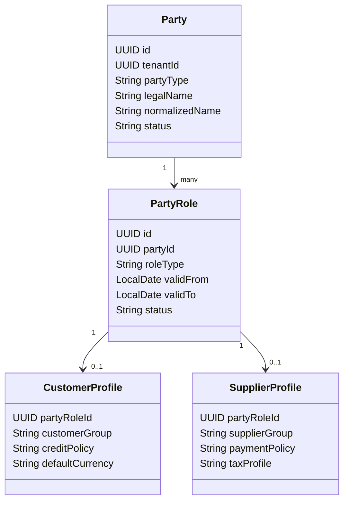
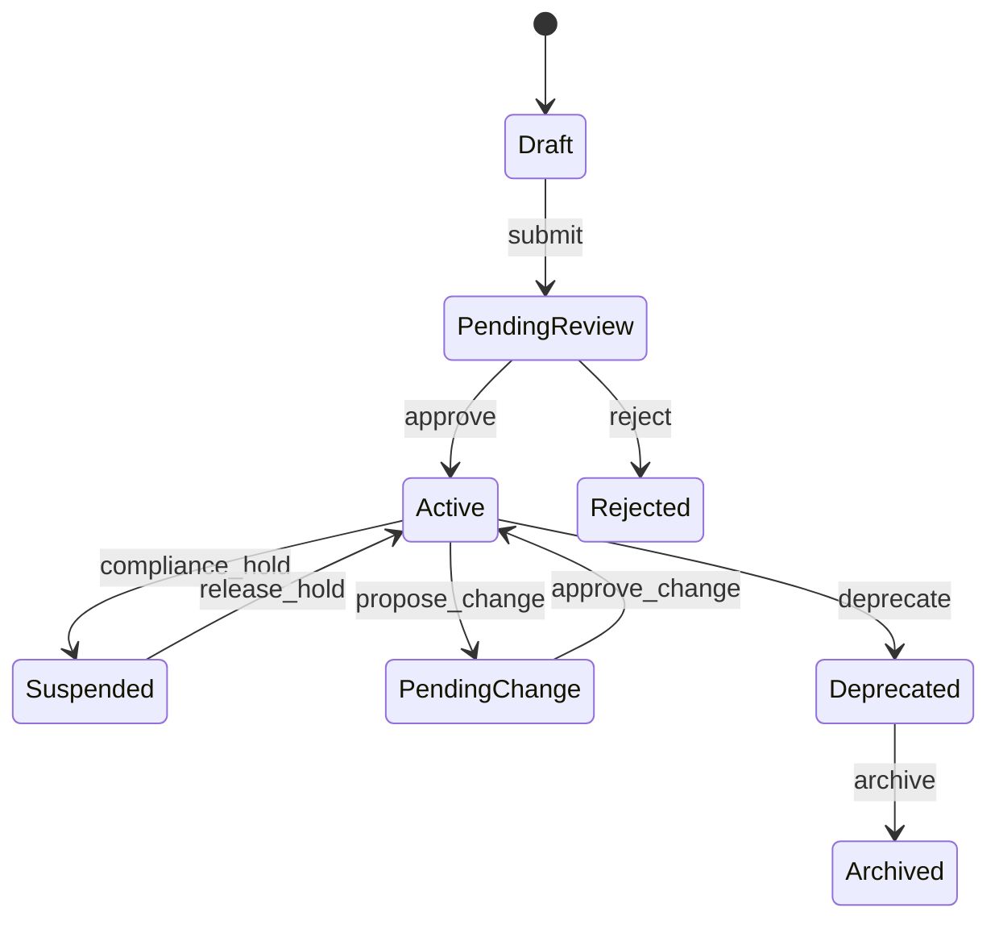
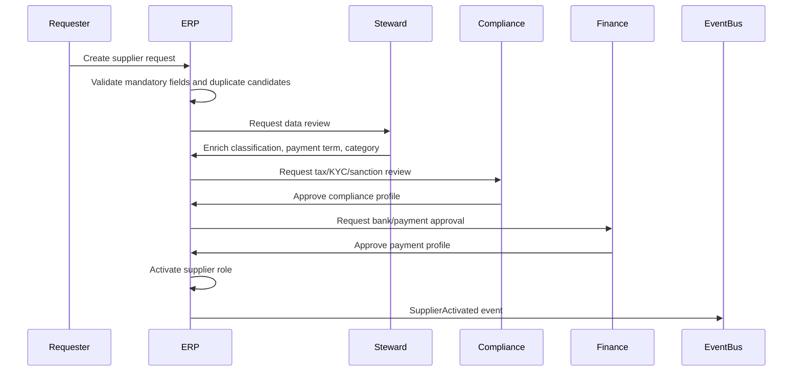
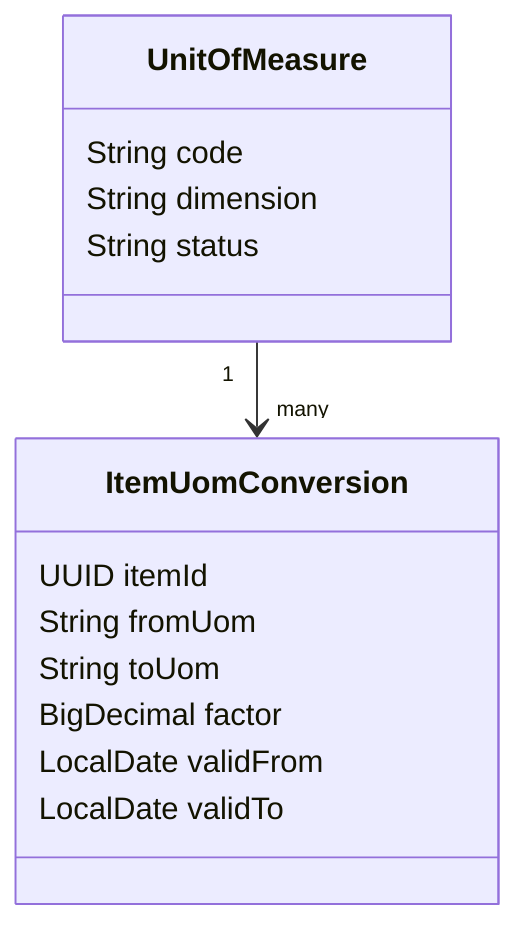

# Part 006 — Master Data Governance and Reference Data

## 1. Target Skill Part Ini

ERP besar tidak gagal hanya karena transaksi salah. ERP juga gagal karena transaksi yang benar memakai data dasar yang salah.

Contoh:

- vendor duplicate menyebabkan pembayaran ganda;
- customer tax profile salah menyebabkan invoice pajak salah;
- item UOM salah menyebabkan stock dan invoice quantity tidak reconcile;
- currency decimal salah menyebabkan rounding error;
- chart of accounts berubah tanpa mapping membuat laporan historis rusak;
- payment term tidak effective-dated membuat invoice lama berubah due date;
- warehouse location duplicate membuat stock tercecer;
- customer merge menghapus audit trail transaksi lama.

Target part ini adalah membentuk kemampuan mendesain **master data governance** dan **reference data architecture** yang layak untuk ERP skala besar.

Dalam kerangka Kaufman, ini adalah tahap:

1. **deconstruct the skill**: memisahkan jenis data dan lifecycle;
2. **learn enough to self-correct**: mengenali data smell dan failure mode;
3. **remove practice barrier**: menyediakan model, rule, checklist, dan exercise;
4. **deliberate practice**: latihan membuat governance flow dan validation boundary.

## 2. Mental Model: Master Data adalah Contract, Bukan Lookup Table

Master data sering terlihat seperti data statis. Itu asumsi berbahaya.

Dalam ERP, master data adalah **business contract** yang dipakai oleh transaksi. Ketika purchase order dibuat, sistem tidak hanya membaca vendor name. Sistem mengandalkan vendor sebagai contract untuk:

- legal identity;
- tax registration;
- payment term;
- bank account validation;
- currency policy;
- procurement eligibility;
- withholding tax;
- sanction/compliance status;
- approval risk;
- accounting posting default.

Jika vendor berubah, kita harus tahu apakah perubahan itu berlaku untuk transaksi baru saja, atau juga memengaruhi transaksi yang sudah ada. Inilah alasan master data governance bukan administrasi data, melainkan bagian dari correctness ERP.

## 3. Klasifikasi Data dalam ERP

Sebelum mendesain tabel, pisahkan tipe data.

| Jenis Data | Contoh | Karakteristik | Risiko Jika Salah |
|---|---|---|---|
| Master Data | customer, vendor, item, warehouse, chart of accounts | Relatif stabil, dipakai banyak transaksi | Duplicate, salah posting, salah fulfillment. |
| Reference Data | currency, country, UOM, tax code, payment method | Controlled vocabulary atau standard code | Validasi tidak konsisten, integrasi gagal. |
| Configuration Data | approval matrix, posting rule, pricing rule | Mengubah behavior runtime | Sistem berubah tanpa audit. |
| Transaction Data | invoice, PO, GRN, journal, stock movement | Fakta bisnis yang terjadi | Data tidak boleh diubah sembarangan. |
| Derived Data | balance, aging, stock position, report snapshot | Hasil perhitungan/projection | Bisa stale atau tidak reconcile. |
| Metadata | custom fields, document types, workflow definition | Menentukan model sistem | Customization bisa merusak core. |

Aturan praktis:

```text
Do not treat all non-transaction tables as simple lookup tables.
```

Master data punya lifecycle, ownership, approval, merge policy, dan audit. Reference data punya standard source, versioning, dan distribution policy. Configuration data punya change control karena mengubah behavior.

## 4. Domain Data Catalogue ERP

ERP besar minimal punya kelompok data berikut.

### 4.1 Party Master

Party adalah representasi abstrak untuk orang atau organisasi.

Turunan party:

- customer;
- supplier/vendor;
- employee-adjacent actor;
- bank;
- carrier;
- tax authority;
- intercompany counterparty;
- contact person.

Pola yang sering kuat:



Satu party bisa menjadi customer dan supplier sekaligus. Jangan membuat duplicate entity hanya karena role berbeda.

### 4.2 Product / Item Master

Item master biasanya paling kompleks setelah party.

Dimensi item:

- sellable item;
- purchasable item;
- stock item;
- service item;
- asset item;
- manufacturing component;
- finished good;
- configurable product;
- batch/lot controlled;
- serial controlled;
- hazardous/regulated item;
- taxable category;
- valuation method;
- base UOM and alternate UOM.

Invariant:

```text
An item cannot be used in a transaction unless its role, UOM, status, and organizational eligibility are valid for the transaction date and document type.
```

### 4.3 Location and Logistics Master

Lokasi tidak hanya alamat.

Data terkait:

- country;
- region/province;
- city;
- postal code;
- site;
- warehouse;
- bin;
- shipping zone;
- route;
- carrier;
- dock;
- GLN/location identifier jika memakai standard eksternal.

Lokasi memengaruhi tax, shipping, inventory, delivery promise, compliance, dan reporting.

### 4.4 Finance Master

Finance master adalah yang paling sensitif.

Contoh:

- chart of accounts;
- account segment;
- cost center;
- profit center;
- project code;
- tax code;
- fiscal calendar;
- accounting period;
- bank account;
- payment method;
- payment term;
- posting profile;
- exchange rate type.

Finance master tidak boleh berubah tanpa approval dan audit yang kuat.

### 4.5 Commercial Master

Contoh:

- price list;
- discount group;
- customer group;
- supplier agreement;
- contract term;
- incoterm;
- freight term;
- credit policy;
- return policy.

Commercial master sering effective-dated dan high-change. Karena itu ia harus dikelola seperti rule/config, bukan lookup pasif.

## 5. Reference Data: Small Table, Large Blast Radius

Reference data terlihat kecil tetapi dampaknya besar.

Contoh reference data:

- currency code;
- country code;
- language code;
- unit of measure;
- tax category;
- payment method;
- document status;
- reason code;
- industry classification;
- address type;
- party role type;
- item type.

Kesalahan reference data biasanya menimbulkan bug lintas modul.

Contoh: `currency.decimal_places` salah untuk currency tertentu. Dampaknya:

- invoice rounding salah;
- payment allocation selisih;
- ledger posting berbeda beberapa minor unit;
- bank reconciliation gagal;
- report terlihat tidak balance.

Karena itu reference data harus punya owner, source, version, dan deployment model.

## 6. Internal ID vs Business Code vs External Identifier

ERP engineer harus membedakan tiga jenis identitas.

| Identity | Contoh | Untuk Apa | Boleh Berubah? |
|---|---|---|---|
| Internal ID | UUID vendor | Referential integrity | Tidak. |
| Business Code | `VEND-000123` | User-facing identity | Sebaiknya tidak, tapi bisa dengan controlled process. |
| External Identifier | tax ID, GTIN, GLN, bank account, external system ID | Integrasi/compliance | Tergantung sumber eksternal. |

Jangan gunakan business code sebagai primary key. Jangan gunakan nama sebagai identity. Jangan menganggap external ID selalu unik tanpa scope.

Contoh uniqueness:

```text
tax_id may be unique per country and party type.
gtin is global for trade item identification under GS1 rules.
external_customer_id is unique only per source system.
bank_account_number uniqueness depends on country/bank scheme.
```

Model identifier:

```sql
create table party_identifier (
    id uuid primary key,
    tenant_id uuid not null,
    party_id uuid not null,
    identifier_type varchar(64) not null,
    identifier_value varchar(255) not null,
    issuing_country varchar(2) null,
    source_system varchar(64) null,
    valid_from date not null,
    valid_to date null,
    status varchar(32) not null,
    unique (tenant_id, identifier_type, identifier_value, issuing_country, source_system)
);
```

## 7. Lifecycle State untuk Master Data

Master data tidak boleh hanya aktif/nonaktif.

Lifecycle yang lebih realistis:



Makna state:

| State | Makna |
|---|---|
| Draft | Data sedang dibuat, belum boleh dipakai transaksi. |
| PendingReview | Menunggu approval steward/finance/compliance. |
| Active | Boleh dipakai sesuai scope dan effective date. |
| Suspended | Tidak boleh dipakai sementara, transaksi existing tetap harus bisa dibaca. |
| PendingChange | Ada perubahan menunggu approval. |
| Deprecated | Tidak boleh dipakai untuk transaksi baru, tetapi historis tetap valid. |
| Archived | Disembunyikan dari operasi normal, tetap tersedia untuk audit. |

Invariant:

```text
Historical transactions must remain readable even if master data becomes inactive, deprecated, or archived.
```

Jangan hard delete master data yang sudah dipakai transaksi.

## 8. Effective Dating dan Snapshotting

Ada dua cara menghadapi perubahan master data:

1. **Reference by ID + historical lookup**
2. **Snapshot relevant attributes into transaction**

ERP besar biasanya memakai keduanya.

Contoh invoice harus menyimpan:

- `customer_id` untuk relasi ke master;
- customer legal name saat invoice diterbitkan;
- billing address snapshot;
- tax ID snapshot;
- payment term snapshot;
- currency;
- tax treatment snapshot.

Kenapa? Karena customer master bisa berubah setelah invoice dibuat. Invoice legal harus tetap merepresentasikan fakta saat diterbitkan.

Contoh model:

```java
public record CustomerSnapshot(
    UUID customerId,
    String customerCode,
    String legalName,
    String taxIdentifier,
    AddressSnapshot billingAddress,
    String paymentTermCode
) {}
```

Di document:

```java
public final class SalesInvoice {
    private final InvoiceId id;
    private final OrgContext org;
    private final CustomerSnapshot customer;
    private final List<SalesInvoiceLine> lines;
    private InvoiceStatus status;
}
```

Rule praktis:

```text
If an attribute is legally or financially relevant to a document, snapshot it.
If an attribute is operationally useful but not part of the legal fact, reference it.
```

## 9. Golden Record: Jangan Jadikan Slogan

“Golden record” sering dipakai sebagai istilah kosong. Secara praktis, golden record adalah hasil dari rule yang menjawab:

- sumber mana yang authoritative untuk attribute tertentu;
- bagaimana konflik diselesaikan;
- bagaimana duplicate dideteksi;
- siapa yang boleh merge;
- attribute mana yang survivorship dari source A atau B;
- bagaimana lineage dipertahankan;
- bagaimana downstream diberi tahu.

Contoh party golden record:

| Attribute | Authoritative Source | Rule |
|---|---|---|
| Legal name | Compliance/KYC system | Tidak bisa diubah oleh sales. |
| Display name | CRM | Bisa berbeda untuk UI. |
| Tax ID | Tax registration verification | Wajib approval. |
| Billing address | ERP finance master | Effective-dated. |
| Shipping address | Customer portal / sales ops | Butuh validation. |
| Credit limit | Credit control | Tidak bisa diubah oleh order entry. |

Golden record bukan berarti satu tabel menguasai semua attribute. Bisa jadi satu entity punya attribute-level ownership.

## 10. Data Ownership dan Stewardship

Master data harus punya owner. Owner bukan sekadar tim teknis. Owner adalah pihak yang berhak menentukan kebenaran bisnis.

Contoh ownership:

| Data | Owner | Approver | Consumer Utama |
|---|---|---|---|
| Vendor legal identity | Procurement + Compliance | Finance/Compliance | AP, purchasing, tax. |
| Customer credit limit | Credit control | Finance manager | Sales order, AR. |
| Chart of accounts | Finance accounting | Controller | GL, subledger, reporting. |
| Item master | Product/merchandising | Supply chain/finance | Sales, inventory, procurement. |
| UOM conversion | Supply chain | Inventory control | Warehouse, purchasing, sales. |
| Tax code | Tax team | Tax manager | Invoice, purchase, GL. |

Dalam sistem, ownership harus muncul sebagai workflow dan permission, bukan dokumen governance yang terpisah.

## 11. Master Data Creation Flow

Contoh vendor onboarding:



Flow ini bukan bureaucracy demi bureaucracy. Ia mencegah downstream risk seperti fraud payment, duplicate vendor, tax error, dan wrong withholding.

## 12. Duplicate Detection dan Merge Policy

Duplicate detection tidak selalu exact match.

Signal duplicate:

- normalized legal name similar;
- same tax ID;
- same bank account;
- same email/domain;
- same address;
- same external ID;
- same phone number;
- same parent company;
- fuzzy name match.

Namun merge berisiko. Salah merge customer/vendor bisa mencampur transaksi legal.

Policy merge:

```text
Only merge master records through an auditable workflow.
Never physically rewrite historical transaction facts without explicit migration/reconciliation process.
Keep alias/redirect from losing record to surviving record.
Preserve lineage of all identifiers and source systems.
Emit merge event for downstream systems.
```

Model:

```sql
create table master_record_merge (
    id uuid primary key,
    tenant_id uuid not null,
    entity_type varchar(64) not null,
    surviving_record_id uuid not null,
    merged_record_id uuid not null,
    reason varchar(255) not null,
    approved_by uuid not null,
    approved_at timestamp not null,
    status varchar(32) not null
);
```

## 13. Validation Boundary

Validasi master data harus dibagi beberapa layer.

| Layer | Contoh Validasi |
|---|---|
| Syntax | Format email, length code, required field. |
| Semantic | Tax ID valid untuk country tertentu. |
| Referential | Payment term exists and active. |
| Organizational | Vendor aktif untuk legal entity tertentu. |
| Temporal | Valid from/to tidak overlap. |
| Policy | Supplier high-risk butuh compliance approval. |
| Cross-domain | Item purchasable harus punya procurement category. |

Jangan menaruh semua validasi di database constraint. Constraint penting, tetapi tidak cukup untuk rule kontekstual.

Contoh Java policy:

```java
public final class SupplierActivationPolicy {
    public void assertCanActivate(SupplierDraft draft) {
        require(draft.legalName() != null, "legal name is required");
        require(draft.primaryTaxIdentifier().isPresent(), "tax identifier is required");
        require(draft.paymentProfile().isApproved(), "payment profile must be approved");
        require(draft.complianceProfile().isCleared(), "compliance profile must be cleared");
        require(!draft.hasBlockingDuplicate(), "blocking duplicate must be resolved");
    }

    private void require(boolean condition, String message) {
        if (!condition) throw new DomainRuleViolation(message);
    }
}
```

## 14. Reference Data Distribution

Reference data dipakai banyak service/module. Ada beberapa pola distribusi.

| Pattern | Cocok Untuk | Risiko |
|---|---|---|
| Central reference service | Data sering berubah dan butuh kontrol tunggal | Latency dan availability dependency. |
| Replicated read table | Query cepat di tiap module | Stale data dan sync complexity. |
| Build-time enum | Nilai sangat stabil | Sulit update tanpa deploy. |
| Config package/versioned dataset | Country pack/localization | Perlu lifecycle deployment. |
| Event-driven propagation | Banyak consumer | Butuh idempotency dan ordering policy. |

Aturan praktis:

```text
Reference data that affects transaction correctness must have version, effective date, and distribution observability.
```

Contoh event:

```json
{
  "eventType": "ReferenceDataChanged",
  "dataset": "currency",
  "version": "2026.06.30",
  "effectiveFrom": "2026-07-01",
  "changeType": "MINOR_UNIT_UPDATED",
  "tenantId": null
}
```

Untuk global reference data, `tenantId` bisa null. Untuk tenant-specific reference data, wajib ada tenant.

## 15. Enum di Java: Kapan Aman, Kapan Bahaya

Enum Java aman untuk nilai yang benar-benar bagian dari code semantics dan jarang berubah.

Aman sebagai enum:

```java
public enum DocumentLifecycleState {
    DRAFT,
    SUBMITTED,
    APPROVED,
    POSTED,
    CANCELLED,
    REVERSED,
    CLOSED
}
```

Berbahaya sebagai enum:

```java
public enum TaxCode {
    VAT_11,
    VAT_12,
    ZERO_RATED
}
```

Tax code berubah berdasarkan negara, periode, tenant, produk, dan regulasi. Jadikan data, bukan enum compile-time.

Rule:

```text
If business users, regulators, or localization packs can change it, it is data/configuration, not code enum.
```

## 16. Chart of Accounts Governance

Chart of accounts adalah master data yang memengaruhi semua financial report.

Desain buruk:

```text
account(code, name, type)
```

Desain yang lebih baik mempertimbangkan:

- legal entity atau shared chart;
- account type;
- normal balance;
- posting allowed atau summary only;
- valid period;
- parent/reporting hierarchy;
- mapping ke statutory report;
- mapping ke management report;
- allowed dimensions;
- currency restriction;
- subledger control account;
- close/reconciliation policy.

Contoh invariant:

```text
A journal line can post only to an active posting account, not to a summary account, and must provide required dimensions for that account and legal entity.
```

## 17. Unit of Measure Governance

UOM error adalah sumber bug inventory yang sulit dideteksi.

Contoh:

```text
1 box = 12 pcs
1 carton = 24 pcs
1 pallet = 48 carton
```

UOM conversion bisa tergantung item. Jangan selalu jadikan global conversion.



Invariant:

```text
Quantity conversion must be deterministic for item, UOM pair, and business date.
```

Jika conversion berubah, transaksi historis harus tetap memakai conversion yang berlaku saat transaksi.

## 18. Currency dan Exchange Rate Reference

Currency bukan sekadar kode tiga huruf. ERP harus mengetahui:

- alphabetic code;
- numeric code;
- minor unit/decimal places;
- active/inactive status;
- effective date;
- rounding rule;
- triangulation rule jika relevan;
- exchange rate type;
- source rate;
- rate validity.

ISO 4217 relevan untuk currency code standard, tetapi ERP tetap perlu policy internal untuk rounding dan exchange-rate usage.

Invariant:

```text
A financial document must store transaction currency, accounting currency impact, exchange rate type, rate value, and rate date used for posting.
```

Jangan menghitung ulang nilai historis memakai exchange rate terbaru.

## 19. Tax Code Governance

Tax code sangat kontekstual.

Tax calculation bisa bergantung pada:

- legal entity tax registration;
- customer/supplier tax profile;
- item tax category;
- ship-from and ship-to location;
- place of supply;
- invoice date;
- exemption certificate;
- reverse charge rule;
- withholding rule;
- country localization.

Tax code harus effective-dated dan auditable.

Model sederhana:

```sql
create table tax_rule_version (
    id uuid primary key,
    tenant_id uuid null,
    country_code char(2) not null,
    tax_code varchar(64) not null,
    valid_from date not null,
    valid_to date null,
    rate numeric(18, 6) not null,
    rule_payload jsonb not null,
    status varchar(32) not null,
    approved_by uuid not null,
    approved_at timestamp not null
);
```

Dalam Java, tax rule payload tidak boleh menjadi string liar tanpa schema. Gunakan versioned schema dan tests.

## 20. Master Data Events

Setiap perubahan master data yang berdampak ke downstream harus menghasilkan event.

Contoh:

```json
{
  "eventType": "SupplierActivated",
  "eventId": "...",
  "tenantId": "...",
  "supplierId": "...",
  "supplierCode": "SUP-000123",
  "legalName": "PT Example Supplier",
  "effectiveFrom": "2026-07-01",
  "changedBy": "...",
  "approvedBy": "...",
  "version": 7
}
```

Event harus cukup untuk downstream cache invalidation, search indexing, reporting projection, risk monitor, dan integration sync.

Jangan mengirim semua attribute sensitif tanpa alasan. Data privacy tetap berlaku.

## 21. Search, Index, dan Human Usability

Master data dipakai manusia. Kualitas search menentukan kualitas operasional.

Contoh fitur search vendor:

- search by code;
- search by normalized name;
- search by tax ID;
- search by bank account masked;
- search by address;
- search by status;
- search by legal entity eligibility;
- show duplicate warning;
- show compliance hold.

Search index boleh eventually consistent, tetapi transaction validation harus tetap menggunakan source of truth.

Rule:

```text
Search can be approximate. Transaction validation must be authoritative.
```

## 22. Audit Trail untuk Master Data

Master data change harus bisa menjawab:

- siapa mengubah apa;
- kapan;
- dari nilai apa ke nilai apa;
- alasan perubahan;
- approval siapa;
- effective date;
- impact area;
- apakah perubahan sudah dipropagasi ke downstream;
- transaksi mana yang memakai versi data mana.

Audit trail bukan hanya `updated_at`.

Model minimal:

```sql
create table master_data_change_log (
    id uuid primary key,
    tenant_id uuid not null,
    entity_type varchar(64) not null,
    entity_id uuid not null,
    change_type varchar(64) not null,
    old_value jsonb null,
    new_value jsonb not null,
    reason varchar(512) null,
    requested_by uuid not null,
    approved_by uuid null,
    effective_from date null,
    changed_at timestamp not null
);
```

Untuk data sensitif, jangan menyimpan plaintext tanpa kebijakan masking/encryption yang tepat.

## 23. Common Anti-Patterns

### 23.1 Semua Master Data Dibuat Langsung Active

Ini mempercepat input tetapi membuat duplicate dan data salah masuk ke transaksi.

Solusi: lifecycle draft-review-active untuk data berisiko.

### 23.2 Reference Data Dikodekan sebagai Enum Sembarangan

Awalnya cepat. Lalu tax code, payment method, item category, dan reason code butuh konfigurasi tenant.

Solusi: enum hanya untuk semantic state yang benar-benar bagian dari code behavior.

### 23.3 Update Master Data Mengubah Dokumen Lama

Customer address berubah, invoice lama ikut menampilkan address baru.

Solusi: snapshot legal/financial attributes pada dokumen.

### 23.4 Tidak Ada Merge Policy

User membuat customer/vendor baru setiap tidak menemukan data. Duplicate bertambah, AR/AP kacau.

Solusi: duplicate detection, steward workflow, merge log, alias/redirect.

### 23.5 Master Data Owner Tidak Jelas

Sales mengubah credit limit, procurement mengubah bank account vendor, warehouse mengubah UOM conversion.

Solusi: attribute-level ownership dan approval policy.

### 23.6 Reference Data Tidak Punya Version

Country pack update mengubah tax code, tetapi report lama tidak bisa dijelaskan.

Solusi: versioned dataset dan effective date.

## 24. Implementation Slice: Supplier Master

Contoh aggregate supplier:

```java
public final class Supplier {
    private final SupplierId id;
    private final TenantId tenantId;
    private SupplierCode code;
    private PartyId partyId;
    private SupplierStatus status;
    private SupplierClassification classification;
    private PaymentProfile paymentProfile;
    private TaxProfile taxProfile;
    private ComplianceProfile complianceProfile;
    private long version;

    public void submitForReview() {
        if (status != SupplierStatus.DRAFT) {
            throw new DomainRuleViolation("Only draft supplier can be submitted");
        }
        status = SupplierStatus.PENDING_REVIEW;
    }

    public void activate(SupplierActivationPolicy policy) {
        policy.assertCanActivate(this);
        status = SupplierStatus.ACTIVE;
    }
}
```

Repository query harus membawa tenant:

```java
public interface SupplierRepository {
    Optional<Supplier> findById(TenantId tenantId, SupplierId supplierId);
    Optional<Supplier> findActiveByCode(TenantId tenantId, SupplierCode code, LocalDate businessDate);
    boolean existsBlockingDuplicate(TenantId tenantId, SupplierDraft draft);
    void save(Supplier supplier);
}
```

Jangan buat:

```java
Optional<Supplier> findById(SupplierId supplierId);
```

untuk sistem multi-tenant, kecuali repository internal sudah memiliki enforcement tenant yang tidak bisa dilewati.

## 25. Design Review Checklist

Gunakan checklist ini untuk setiap master/reference data design.

### 25.1 Identity

- Apakah entity punya internal immutable ID?
- Apakah business code unik dalam scope yang tepat?
- Apakah external identifier dimodelkan dengan source dan scope?
- Apakah nama tidak dipakai sebagai key?

### 25.2 Lifecycle

- Apakah ada status draft/review/active/suspended/deprecated?
- Apakah data inactive tetap bisa dibaca transaksi lama?
- Apakah hard delete dicegah untuk data yang sudah dipakai?
- Apakah activation punya validation policy?

### 25.3 Governance

- Siapa owner data?
- Siapa approver?
- Attribute mana yang butuh approval khusus?
- Apakah reason change wajib?
- Apakah audit trail cukup untuk dispute?

### 25.4 Temporal

- Apakah data effective-dated?
- Apakah overlapping validity dicegah?
- Apakah transaksi snapshot attribute penting?
- Apakah report historis tetap stabil?

### 25.5 Distribution

- Service/module mana authoritative?
- Consumer mana yang perlu copy/cache?
- Bagaimana version dan propagation dimonitor?
- Apa yang terjadi jika consumer memakai reference data stale?

### 25.6 Integration

- External ID dari sistem lain disimpan?
- Mapping code dikelola di mana?
- Duplicate dari import dicegah bagaimana?
- Apakah change event idempotent?

## 26. Practical Exercises

### Exercise 1: Classify Data

Ambil daftar berikut dan klasifikasikan sebagai master, reference, configuration, transaction, atau derived data:

- customer;
- invoice;
- currency;
- exchange rate;
- approval threshold;
- journal balance;
- tax code;
- item UOM conversion;
- payment term;
- aging report;
- document status;
- chart of accounts.

Jelaskan kenapa.

### Exercise 2: Vendor Onboarding

Desain flow vendor onboarding untuk risiko fraud rendah dan tinggi. Tentukan field, owner, approver, duplicate signal, dan event.

### Exercise 3: Item Master Change

Item `SKU-001` berubah base UOM dari `BOX` ke `PCS` mulai 1 Agustus. Tentukan:

- apa yang boleh berubah;
- apa yang harus effective-dated;
- bagaimana transaksi lama tetap valid;
- bagaimana stock conversion dijaga.

### Exercise 4: Currency Minor Unit

Currency minor unit berubah atau dikoreksi di reference dataset. Tentukan impact ke:

- open invoice;
- posted journal;
- payment allocation;
- report;
- integration payload.

### Exercise 5: Duplicate Customer Merge

Dua customer ternyata sama. Satu punya open AR invoice, satu punya sales orders aktif. Buat merge playbook yang tidak merusak audit.

## 27. Baeldung-Style Summary

Master data adalah fondasi transaksi ERP. Reference data adalah vocabulary sistem. Configuration data adalah behavior runtime. Jangan mencampur ketiganya.

Aturan praktis:

- gunakan internal immutable ID, business code, dan external identifier secara terpisah;
- master data harus punya lifecycle dan owner;
- data penting harus effective-dated atau disnapshot pada transaksi;
- reference data harus punya source, version, dan distribution policy;
- enum Java hanya untuk semantic state yang stabil, bukan data bisnis yang berubah;
- duplicate detection dan merge harus auditable;
- search boleh approximate, validation harus authoritative;
- hard delete master data yang sudah dipakai transaksi hampir selalu salah.

Jika master data governance buruk, ERP akan tetap bisa input transaksi, tetapi output-nya tidak bisa dipercaya.

## 28. Source Notes

Beberapa standar dan reference yang relevan:

- GS1 mendefinisikan GTIN untuk mengidentifikasi trade item yang dapat diberi harga, dipesan, atau ditagihkan di supply chain, dan GS1 identification keys juga mencakup GLN untuk pihak/lokasi serta SSCC untuk logistics unit: https://www.gs1.org/standards/id-keys dan https://www.gs1.org/standards/id-keys/gtin
- ISO 4217 menyediakan standar kode currency dan menjelaskan adanya maintenance process untuk amendment currency code: https://www.iso.org/iso-4217-currency-codes.html
- Jakarta EE Platform 11 dan Spring Boot modern dapat menjadi baseline Java enterprise stack, tetapi governance master data tetap merupakan concern domain dan data architecture, bukan sekadar framework concern: https://jakarta.ee/specifications/platform/11/ dan https://docs.spring.io/spring-boot/system-requirements.html

