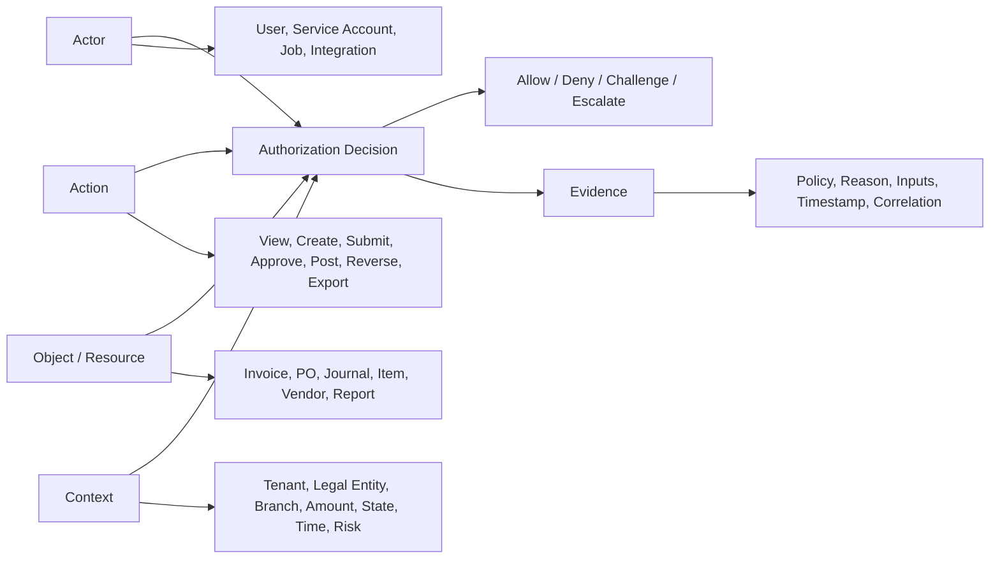
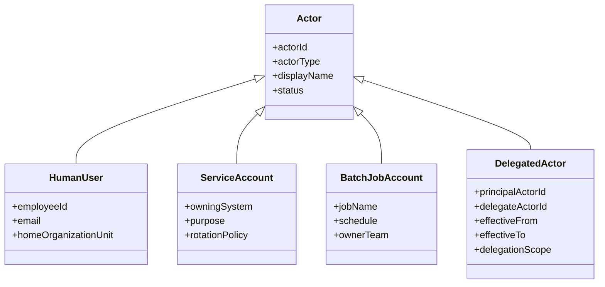
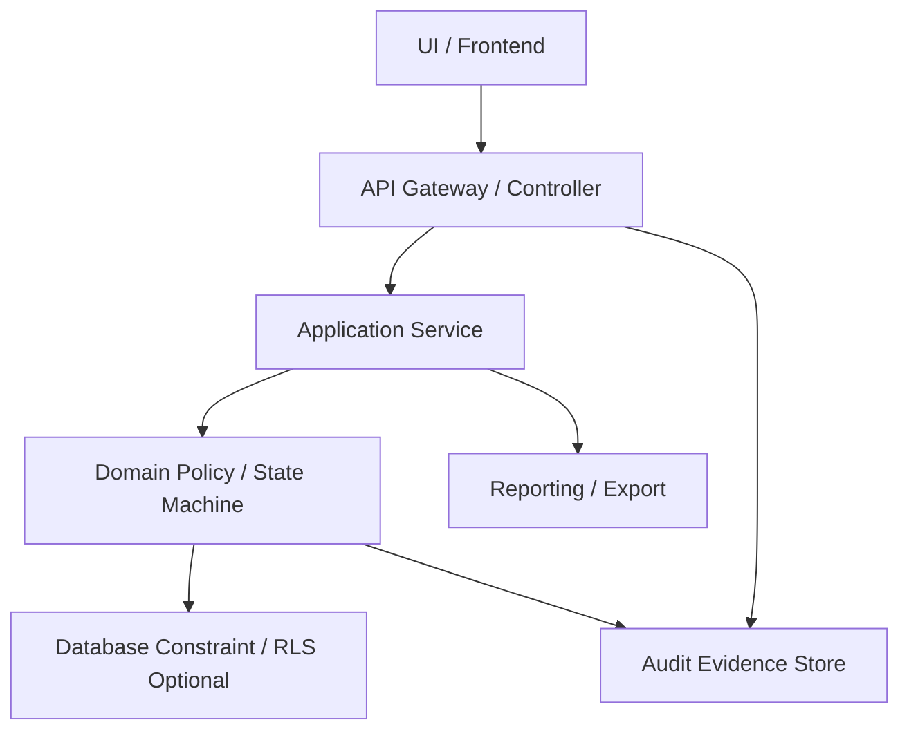
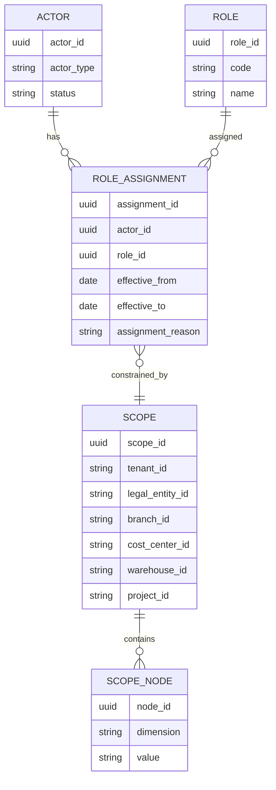
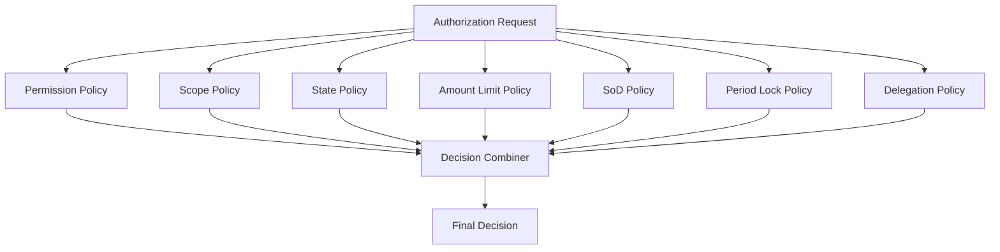
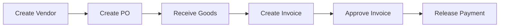
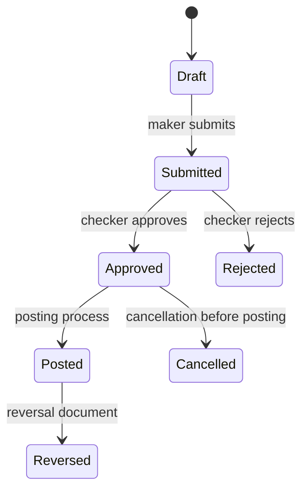
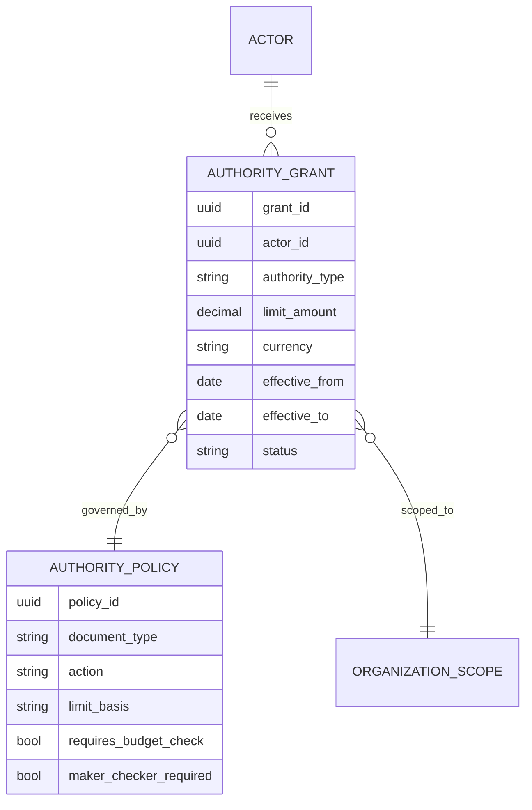
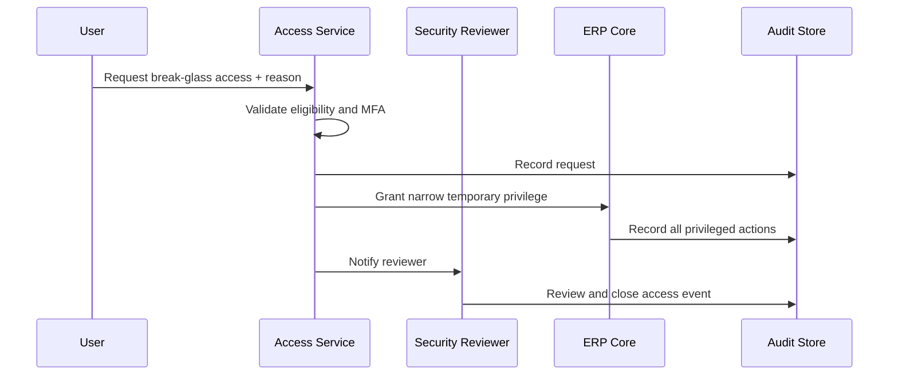

# Part 007 — ERP Identity, Access, and Segregation of Duties

## 1. Target Skill Part Ini

Part ini menjawab satu pertanyaan inti:

> **Bagaimana mendesain authorization ERP yang benar secara bisnis, aman secara teknis, dapat diaudit, dan tetap bisa berubah ketika organisasi, proses, dan regulasi berubah?**

Di aplikasi biasa, access control sering dianggap selesai ketika user punya role dan endpoint dilindungi. Di ERP besar, itu tidak cukup. ERP menyimpan dan mengendalikan tindakan yang berdampak pada uang, stok, kewajiban pajak, kontrak, aset, dan bukti legal. Karena itu access control ERP harus menjawab pertanyaan yang lebih granular:

- siapa aktornya;
- tindakan apa yang dilakukan;
- terhadap objek bisnis apa;
- dalam scope organisasi mana;
- pada state dokumen apa;
- dengan limit otorisasi berapa;
- apakah aktor juga pernah melakukan langkah yang konflik;
- apakah akses itu normal, delegated, emergency, atau system-generated;
- bukti keputusan authorization apa yang disimpan.

Dalam kerangka Kaufman, part ini adalah fase **learn enough to self-correct** untuk security ERP. Targetnya bukan menghafal RBAC/ABAC, tetapi punya model mental untuk melihat desain authorization yang rapuh sebelum masuk production.

## 2. Mental Model Utama: Actor, Action, Object, Context, Decision, Evidence

Authorization ERP yang matang bisa diringkas menjadi enam elemen:



Jangan mulai dari `role`. Mulai dari **keputusan bisnis**.

Contoh:

> “Rina boleh approve purchase order senilai IDR 75 juta untuk branch Jakarta karena ia punya role Procurement Manager pada legal entity PT A, limit approval-nya IDR 100 juta, tidak membuat dokumen tersebut, tidak menjadi penerima barang, dan tidak sedang dalam status delegated conflict.”

Keputusan itu tidak bisa diekspresikan dengan `hasRole("MANAGER")`. Dibutuhkan gabungan:

- role;
- scope organisasi;
- object attribute;
- document lifecycle;
- amount threshold;
- separation of duties;
- delegation;
- audit evidence.

## 3. Mengapa ERP Authorization Lebih Sulit daripada Aplikasi CRUD

ERP punya beberapa karakteristik yang membuat authorization menjadi domain problem, bukan middleware problem.

| Karakteristik ERP | Implikasi Authorization |
|---|---|
| Multi-entity organization | Role harus scoped ke tenant, legal entity, branch, cost center, warehouse, atau project. |
| Dokumen punya lifecycle | Hak `edit`, `submit`, `approve`, `post`, `cancel`, dan `reverse` berbeda tergantung state. |
| Ada dampak finansial | Approval harus mempertimbangkan amount, currency, budget, tax, dan policy. |
| Ada SoD | User yang membuat transaksi tidak boleh selalu menjadi approver, poster, payer, atau reconciler. |
| Ada period lock | Hak accounting berubah ketika fiscal period sudah ditutup. |
| Ada integrasi | Service account bisa membuat transaksi, tetapi tetap harus punya identity, purpose, dan trace. |
| Ada reporting/export | “Read access” bisa lebih berisiko daripada write access karena data massal bisa dieksfiltrasi. |
| Ada emergency access | Break-glass harus mungkin, tetapi harus sempit, tercatat, dan direview. |

Aturan desain:

> **Di ERP, authorization adalah bagian dari business invariant. Jangan diperlakukan sebagai dekorasi endpoint.**

## 4. Deconstruct the Skill: Sub-Skill Authorization ERP

Agar bisa dilatih 20 jam secara efektif, pecah skill ini menjadi sub-skill berikut.

| Sub-Skill | Kemampuan yang Harus Dikuasai |
|---|---|
| Identity modelling | Membedakan human user, service account, job account, integration account, delegated actor. |
| Scope modelling | Memodelkan tenant, legal entity, branch, warehouse, cost center, project, dan report scope. |
| Permission modelling | Mendesain permission berdasarkan capability/action, bukan nama menu. |
| Policy evaluation | Menghasilkan allow/deny berdasarkan subject, object, action, dan context. |
| SoD modelling | Mengidentifikasi konflik role, konflik aktivitas, dan konflik pada objek yang sama. |
| Approval authority | Menghubungkan approval dengan amount limit, hierarchy, delegation, dan escalation. |
| Data access control | Menerapkan row-level filtering, field masking, report/export control. |
| Audit evidence | Menyimpan bukti keputusan authorization, bukan hanya “user clicked approve”. |
| Privileged access | Mendesain emergency access, admin access, service account, dan review. |
| Test strategy | Menguji negative path, bypass attempt, state transition abuse, dan cross-tenant leak. |

## 5. Identity Model: Jangan Semua Aktor Disebut User

ERP besar harus membedakan beberapa jenis actor.



### 5.1 Human User

Human user adalah aktor yang mewakili manusia. Data minimal:

- stable identity ID;
- email/login identifier;
- employment status;
- home organization;
- manager/approval chain jika relevan;
- assigned roles;
- delegated rights;
- last access review status.

Jangan jadikan email sebagai primary key bisnis. Email bisa berubah. Gunakan immutable identity ID.

### 5.2 Service Account

Service account digunakan oleh sistem eksternal atau internal service. Ini tidak boleh disamakan dengan superuser.

Service account harus punya:

- owning team;
- purpose;
- allowed API scope;
- allowed data scope;
- credential rotation policy;
- rate limit;
- audit identity;
- expiry atau review date.

Contoh buruk:

```text
integration-user / password shared / role ADMIN / used by all external systems
```

Contoh lebih sehat:

```text
actorType: SERVICE_ACCOUNT
name: bank-payment-gateway-prod
purpose: submit bank payment status callback
allowedActions:
  - payment.callback.receive
  - payment.status.update
allowedScopes:
  - tenant = retail-prod
  - legalEntity = PT-A
expiresReviewAt: 2026-12-31
```

### 5.3 Batch Job Account

ERP memiliki banyak batch job: close period, aging calculation, stock valuation, MRP, depreciation, statement generation. Semua harus punya identity.

Ketika job membuat journal, audit trail tidak boleh hanya berkata:

```text
created_by = SYSTEM
```

Lebih baik:

```text
created_by_actor_id = batch:monthly-depreciation
triggered_by = scheduler
approved_by = finance-controller
run_id = jobrun-20260630-001
source_policy = depreciation-policy-v2026.04
```

### 5.4 Delegated Actor

Delegation berbeda dari role assignment permanen. Delegation adalah hak sementara yang biasanya muncul karena cuti, assignment proyek, emergency, atau escalation.

Minimal rule delegation:

- ada principal;
- ada delegate;
- ada periode efektif;
- ada scope;
- ada action yang didelegasikan;
- ada batas SoD;
- ada audit.

Delegation tidak boleh menghapus tanggung jawab principal. Ia menambah konteks keputusan.

## 6. Authorization Vocabulary yang Harus Konsisten

Gunakan vocabulary eksplisit agar engineer, auditor, product owner, dan security team bicara bahasa yang sama.

| Istilah | Arti |
|---|---|
| Subject | Actor yang meminta akses. |
| Resource/Object | Objek bisnis yang diakses, misalnya invoice, PO, journal, report. |
| Action | Operasi yang diminta, misalnya view, submit, approve, post, reverse, export. |
| Scope | Batas organisasi/data, misalnya tenant, legal entity, branch, warehouse. |
| Attribute | Properti subject/object/context yang dipakai policy. |
| Policy | Aturan yang mengevaluasi request. |
| Decision | Hasil evaluasi: allow, deny, challenge, escalate. |
| Evidence | Bukti kenapa keputusan diberikan. |
| Obligation | Tindakan tambahan setelah allow, misalnya require comment, require MFA, log reason. |

## 7. RBAC, ABAC, ReBAC: Bukan Pilih Salah Satu

### 7.1 RBAC untuk Stabilitas Administrasi

RBAC cocok untuk menyatakan tanggung jawab organisasi yang relatif stabil:

- Finance Clerk;
- Finance Manager;
- Procurement Officer;
- Warehouse Supervisor;
- Inventory Controller;
- AP Accountant;
- AR Collector;
- System Auditor.

RBAC berguna karena role assignment mudah dimengerti oleh user dan auditor. NIST RBAC menekankan role, permission, user assignment, serta constraint seperti separation of duty. Itu relevan untuk ERP karena ERP punya job function dan kontrol internal yang jelas.

Kelemahan RBAC:

- role explosion;
- sulit menangani amount threshold;
- sulit menangani document state;
- sulit menangani ownership;
- sulit menangani kondisi temporal;
- sulit menangani delegated authority.

### 7.2 ABAC untuk Keputusan Kontekstual

ABAC cocok ketika keputusan bergantung pada attribute:

- amount <= approvalLimit;
- legalEntity in actor.allowedLegalEntities;
- document.branchId in actor.allowedBranches;
- document.status == SUBMITTED;
- fiscalPeriod.isOpen == true;
- actor.department == document.department;
- environment.riskLevel != HIGH;
- request.time within businessHours.

NIST SP 800-162 mendefinisikan ABAC sebagai metodologi logical access control yang mengevaluasi attribute subject, object, operation, dan environment terhadap policy. Ini persis kebutuhan ERP untuk keputusan granular.

Kelemahan ABAC:

- policy bisa sulit dibaca;
- audit bisa sulit jika reason tidak disimpan;
- debugging akses menjadi rumit;
- attribute quality menjadi critical;
- policy sprawl bisa muncul jika governance lemah.

### 7.3 ReBAC untuk Relasi Bisnis

Relationship-based access control berguna ketika hak muncul dari relasi:

- creator boleh edit draft-nya sendiri;
- manager boleh approve subordinate request;
- project manager boleh melihat cost project;
- buyer boleh melihat PO yang berada dalam procurement group-nya;
- warehouse operator boleh memproses transfer untuk warehouse assignment-nya.

ERP besar biasanya memakai hybrid:

```text
RBAC = apa tanggung jawab formal aktor?
ABAC = apakah kondisi objek/konteks mengizinkan?
ReBAC = apakah aktor punya relasi relevan dengan objek?
SoD = apakah ada konflik tugas?
Workflow = apakah state dan step saat ini mengizinkan?
```

## 8. Layer Authorization dalam ERP Java

Authorization harus ada di beberapa layer, tetapi sumber kebenarannya jangan tersebar liar.



| Layer | Tujuan | Hal yang Tidak Boleh Dilakukan |
|---|---|---|
| UI | Hide/show action untuk usability | Menjadi satu-satunya enforcement. |
| API/controller | Authenticate, coarse authorization, request validation | Menyimpan seluruh business policy di annotation endpoint. |
| Application service | Enforce use-case permission dan scope | Bypass domain policy demi cepat. |
| Domain policy | Enforce invariant, state transition, SoD, approval rule | Bergantung pada UI role string. |
| Database | Constraint final, optional row-level security | Menggantikan business authorization yang butuh context. |
| Reporting/export | Prevent mass data leakage | Menganggap read access selalu aman. |
| Audit | Simpan decision evidence | Menyimpan log umum tanpa reason policy. |

Spring Security dapat menjadi enforcement framework untuk request/method authorization, tetapi ERP policy tetap harus dimodelkan sebagai domain/application decision, bukan sekadar annotation `@PreAuthorize` yang menyebar tanpa struktur.

## 9. Permission Model: Permission Harus Berbasis Capability

Jangan membuat permission dari menu UI:

```text
menu.finance.invoice.button.approve
```

Itu rapuh karena UI berubah. Gunakan permission berbasis capability/action:

```text
ap.invoice.view
ap.invoice.create
ap.invoice.submit
ap.invoice.approve
ap.invoice.post
ap.invoice.reverse
ap.invoice.export
```

Permission yang baik punya struktur:

```text
<domain>.<resource>.<action>
```

Contoh:

| Domain | Resource | Action |
|---|---|---|
| procurement | purchase-order | create, submit, approve, close, cancel |
| finance-ap | vendor-invoice | create, match, approve, post, reverse, pay |
| finance-gl | journal | create, approve, post, reverse, close-period |
| inventory | stock-transfer | create, pick, ship, receive, cancel |
| reporting | aging-report | view, export, schedule |
| admin | user-role-assignment | create, revoke, review |

Permission bukan keputusan final. Permission adalah input policy.

Contoh:

```text
User has ap.invoice.approve
BUT invoice.amount > user.approvalLimit
=> deny
```

## 10. Scope Model: Role Tanpa Scope adalah Bahaya

Role ERP hampir selalu harus scoped.



Contoh role assignment:

| Actor | Role | Scope |
|---|---|---|
| Rina | AP Accountant | PT-A / Jakarta Branch |
| Budi | Inventory Controller | PT-A / Warehouse JKT-01 |
| Sari | Finance Manager | PT-A / All Branches / Cost Center Finance |
| Dimas | Internal Auditor | Tenant retail-prod / read-only / all legal entities |

Role `Finance Manager` tanpa scope bisa berarti terlalu luas:

```text
Finance Manager untuk legal entity mana?
Branch mana?
Cost center mana?
Boleh approve semua currency?
Boleh melihat payroll-adjacent journal?
Boleh close period?
```

## 11. Authorization Decision Model dalam Java

Gunakan object eksplisit agar authorization bisa dites, diaudit, dan diperluas.

```java
public enum AccessEffect {
    ALLOW,
    DENY,
    CHALLENGE,
    ESCALATE
}

public record AuthorizationRequest(
        ActorId actorId,
        String action,
        ResourceRef resource,
        OrganizationScope requestedScope,
        Map<String, Object> context,
        Instant requestedAt,
        String correlationId
) {}

public record AuthorizationDecision(
        AccessEffect effect,
        String policyCode,
        String reasonCode,
        String humanReason,
        Map<String, Object> evaluatedAttributes,
        List<String> obligations
) {
    public boolean allowed() {
        return effect == AccessEffect.ALLOW;
    }
}

public interface AuthorizationPolicy {
    boolean supports(AuthorizationRequest request);
    AuthorizationDecision evaluate(AuthorizationRequest request);
}
```

Contoh penggunaan di application service:

```java
public PurchaseOrderApprovalResult approvePurchaseOrder(
        ApprovePurchaseOrderCommand command,
        ActorId actorId
) {
    PurchaseOrder po = purchaseOrderRepository.getForUpdate(command.purchaseOrderId());

    AuthorizationRequest request = AuthorizationRequestFactory.forResource(
            actorId,
            "procurement.purchase-order.approve",
            ResourceRef.purchaseOrder(po.id()),
            po.organizationScope(),
            Map.of(
                    "amount", po.totalAmount(),
                    "currency", po.currency(),
                    "status", po.status(),
                    "creatorActorId", po.createdBy(),
                    "costCenterId", po.costCenterId()
            )
    );

    AuthorizationDecision decision = authorizationService.decide(request);
    auditAuthorizationDecision(request, decision);

    if (!decision.allowed()) {
        throw new AccessDeniedBusinessException(decision.reasonCode(), decision.humanReason());
    }

    po.approve(actorId, command.comment(), decision.policyCode());
    purchaseOrderRepository.save(po);

    return PurchaseOrderApprovalResult.approved(po.id());
}
```

Catatan penting:

- authorization dilakukan setelah object dimuat karena policy butuh attribute object;
- object dimuat dengan scope aman;
- decision diaudit;
- domain method tetap mengecek state transition;
- policy code disimpan pada approval event.

## 12. Jangan Menaruh Business Authorization Hanya di Annotation

Annotation seperti `@PreAuthorize` berguna, tetapi tidak cukup untuk ERP complex authorization.

Contoh terlalu dangkal:

```java
@PreAuthorize("hasRole('FINANCE_MANAGER')")
@PostMapping("/vendor-invoices/{id}/approve")
public ResponseEntity<Void> approve(@PathVariable UUID id) {
    invoiceService.approve(id);
    return ResponseEntity.noContent().build();
}
```

Masalah:

- tidak mengecek legal entity;
- tidak mengecek amount limit;
- tidak mengecek creator conflict;
- tidak mengecek status invoice;
- tidak mengecek fiscal period;
- tidak mengecek delegated authority;
- tidak meninggalkan evidence policy.

Lebih baik:

```java
@PostMapping("/vendor-invoices/{id}/approve")
public ResponseEntity<Void> approve(
        @PathVariable UUID id,
        @AuthenticationPrincipal ErpPrincipal principal,
        @RequestBody ApproveInvoiceRequest body
) {
    invoiceApplicationService.approve(
            new ApproveInvoiceCommand(id, body.comment()),
            principal.actorId()
    );
    return ResponseEntity.noContent().build();
}
```

Lalu business authorization terjadi di application/domain layer.

## 13. Policy Composition

ERP policy jarang hanya satu rule. Gunakan composition.



Recommended default:

```text
Deny if any mandatory policy denies.
Allow only if required positive policies allow.
Challenge if risk requires step-up.
Escalate if user lacks authority but escalation path exists.
```

Contoh result:

```json
{
  "effect": "DENY",
  "policyCode": "PO_APPROVAL_POLICY_V3",
  "reasonCode": "SOD_CREATOR_CANNOT_APPROVE",
  "humanReason": "The creator of a purchase order cannot approve the same purchase order.",
  "evaluatedAttributes": {
    "actorId": "usr-102",
    "creatorActorId": "usr-102",
    "purchaseOrderId": "po-9001"
  }
}
```

## 14. Separation of Duties: Kontrol, Bukan Formalitas

SoD mencegah satu orang mengendalikan seluruh rantai risiko.

Contoh fraud path tanpa SoD:



Jika satu user bisa melakukan semua, ERP menjadi mesin otomatisasi fraud.

### 14.1 Jenis SoD

| Jenis SoD | Penjelasan | Contoh |
|---|---|---|
| Static SoD | Dua role tidak boleh dimiliki user yang sama. | User tidak boleh punya `Vendor Maintainer` dan `Payment Approver`. |
| Dynamic SoD | User boleh punya dua role, tetapi tidak boleh menjalankan keduanya pada transaksi yang sama. | Creator invoice tidak boleh approve invoice yang sama. |
| Object-based SoD | Konflik dihitung pada objek atau group objek tertentu. | User yang membuat vendor tidak boleh approve invoice untuk vendor itu selama 30 hari. |
| Temporal SoD | Konflik berlaku dalam periode waktu tertentu. | User yang menjalankan stock count tidak boleh adjustment untuk item/lokasi yang sama pada hari yang sama. |
| Workflow SoD | Step dalam workflow harus dilakukan aktor berbeda. | Submitter dan final approver berbeda. |
| Cross-domain SoD | Konflik melintasi domain. | Vendor master maintainer tidak boleh release payment. |

### 14.2 Static SoD Matrix

| Role A | Role B | Risiko | Policy |
|---|---|---|---|
| Vendor Maintainer | Payment Releaser | Membuat vendor fiktif dan membayar sendiri | Mutually exclusive |
| PO Creator | PO Approver | Self-approved purchase | Dynamic SoD per PO |
| Goods Receiver | Invoice Matcher | False receipt + invoice match | Require independent review |
| GL Journal Creator | GL Journal Poster | Unauthorized accounting entry | Maker-checker |
| User Admin | Role Reviewer | Self-provisioning privilege | Independent access review |
| Stock Counter | Stock Adjustment Approver | Manipulasi stock variance | Dynamic object SoD |

### 14.3 SoD Bukan Hanya Role Assignment

SoD yang hanya dicek saat role diberikan tidak cukup.

Contoh:

```text
Rina punya role PO Creator dan PO Approver.
Itu mungkin diizinkan untuk branch berbeda.
Namun Rina tidak boleh approve PO yang ia buat sendiri.
```

Jadi SoD harus dicek saat action dilakukan.

```java
public final class CreatorCannotApproveSameDocumentPolicy implements AuthorizationPolicy {

    @Override
    public boolean supports(AuthorizationRequest request) {
        return request.action().equals("procurement.purchase-order.approve");
    }

    @Override
    public AuthorizationDecision evaluate(AuthorizationRequest request) {
        ActorId actorId = request.actorId();
        ActorId creator = (ActorId) request.context().get("creatorActorId");

        if (actorId.equals(creator)) {
            return new AuthorizationDecision(
                    AccessEffect.DENY,
                    "PO_APPROVAL_SOD_V1",
                    "SOD_CREATOR_CANNOT_APPROVE",
                    "Creator cannot approve the same purchase order.",
                    Map.of("actorId", actorId.value(), "creatorActorId", creator.value()),
                    List.of()
            );
        }

        return new AuthorizationDecision(
                AccessEffect.ALLOW,
                "PO_APPROVAL_SOD_V1",
                "SOD_OK",
                "No creator-approver conflict detected.",
                Map.of("actorId", actorId.value()),
                List.of()
        );
    }
}
```

## 15. Maker-Checker Pattern

Maker-checker adalah pattern fundamental ERP.



### 15.1 Invariant Maker-Checker

```text
For controlled action X:
makerActorId != checkerActorId
checker must have authority for action X
checker decision must be recorded with timestamp and policy evidence
object state must be eligible for checking
```

### 15.2 Jangan Implementasi Maker-Checker sebagai Boolean

Buruk:

```text
approved = true
```

Lebih baik:

```text
approval_decision:
  decision_id
  document_id
  step_code
  actor_id
  decision: APPROVED | REJECTED | RETURNED
  decided_at
  comment
  policy_code
  authorization_decision_id
```

ERP butuh bukti: siapa approve, pada step apa, dengan authority apa, berdasarkan policy apa, dan terhadap state dokumen apa.

## 16. Approval Authority: Limit, Currency, Hierarchy

Approval authority biasanya bukan role sederhana.

Contoh rule:

```text
Procurement Manager may approve PO up to IDR 100,000,000
for assigned legal entities and branches,
except if user is creator, requester, or goods receiver,
and only when budget check passed.
```

Model authority:



### 16.1 Currency Problem

Approval limit harus jelas basis currency-nya.

Pilihan desain:

1. limit per currency;
2. limit base currency dengan conversion rate saat submission;
3. limit base currency dengan rate saat approval;
4. limit berdasarkan policy treasury.

Jangan biarkan approval engine diam-diam memakai current FX rate tanpa evidence. Simpan rate snapshot jika digunakan untuk decision.

```text
approval_amount_basis:
  document_currency = USD
  document_amount = 8,000
  converted_currency = IDR
  converted_amount = 131,200,000
  fx_rate = 16,400
  fx_rate_source = treasury-daily-rate
  fx_rate_date = 2026-06-30
```

## 17. Workflow Authorization

Workflow step tidak otomatis aman hanya karena workflow engine mengatur step.

Untuk setiap transition, cek:

- apakah actor boleh menjalankan transition itu;
- apakah actor eligible untuk step saat ini;
- apakah actor konflik dengan previous step;
- apakah step sedang delegated;
- apakah SLA escalation mengubah eligible actor;
- apakah document state belum berubah oleh proses lain;
- apakah approval matrix masih valid.

```java
public void transition(
        WorkflowInstanceId workflowId,
        WorkflowAction action,
        ActorId actorId,
        String comment
) {
    WorkflowInstance instance = workflowRepository.getForUpdate(workflowId);
    BusinessDocument document = documentRepository.get(instance.documentRef());

    AuthorizationDecision decision = workflowAuthorizationService.decide(
            actorId,
            action,
            instance,
            document
    );

    auditAuthorizationDecision(decision);

    if (!decision.allowed()) {
        throw new WorkflowAccessDeniedException(decision.reasonCode());
    }

    instance.apply(action, actorId, comment, decision.policyCode());
    workflowRepository.save(instance);
}
```

## 18. Data Access Control: Read Access Bisa Lebih Berbahaya daripada Write

Banyak ERP gagal bukan karena user bisa mengubah data, tetapi karena user bisa melihat atau export terlalu banyak data.

Contoh data sensitif:

- vendor bank account;
- employee reimbursement;
- customer credit limit;
- margin report;
- inventory valuation;
- tax identification;
- audit findings;
- contract price;
- payroll-adjacent cost journal.

Read control harus mencakup:

- row-level scope;
- field-level masking;
- report-level permission;
- export permission;
- bulk data threshold;
- purpose logging;
- watermarking jika perlu;
- anomaly detection untuk unusual access.

### 18.1 Query Scoping

Jangan bergantung pada frontend filter.

Buruk:

```java
@GetMapping("/invoices")
public List<InvoiceDto> list(@RequestParam String legalEntityId) {
    return invoiceQueryService.findByLegalEntity(legalEntityId);
}
```

Lebih baik:

```java
public Page<InvoiceDto> searchInvoices(
        InvoiceSearchCriteria criteria,
        ActorId actorId,
        Pageable pageable
) {
    DataScope scope = authorizationService.visibleDataScope(
            actorId,
            "ap.invoice.view"
    );

    InvoiceSearchCriteria safeCriteria = criteria.constrainedBy(scope);
    return invoiceReadRepository.search(safeCriteria, pageable);
}
```

### 18.2 Field Masking

```java
public VendorDto toDto(Vendor vendor, FieldAccessProfile fieldAccess) {
    return new VendorDto(
            vendor.id(),
            vendor.name(),
            fieldAccess.canView("vendor.taxId") ? vendor.taxId() : "***MASKED***",
            fieldAccess.canView("vendor.bankAccount") ? vendor.bankAccount().masked() : null
    );
}
```

Masking harus terjadi di server side. Jangan mengirim data sensitif ke UI lalu disembunyikan dengan CSS.

## 19. Report and Export Authorization

Report ERP sering menjadi bypass authorization.

Contoh:

```text
User tidak boleh melihat vendor bank account di screen vendor,
tetapi bisa export report vendor master lengkap ke CSV.
```

Karena itu report permission harus dibedakan:

```text
vendor.view
vendor.view-sensitive
vendor.export
vendor.export-sensitive
vendor.report.audit
```

Checklist report control:

- report punya owner;
- report punya classification;
- report punya allowed scope;
- report punya row-level filter;
- sensitive columns dimasking;
- export butuh permission terpisah;
- large export tercatat sebagai security event;
- scheduled report tidak mengirim data ke penerima yang tidak eligible;
- report definition changes diaudit.

## 20. Privileged Access dan Break-Glass

ERP butuh privileged access untuk incident, tetapi itu tidak boleh menjadi permanent bypass.

### 20.1 Jenis Privileged Access

| Jenis | Kapan Dipakai | Kontrol Minimal |
|---|---|---|
| System admin | Konfigurasi teknis | Tidak otomatis bisa approve/post transaksi bisnis. |
| Security admin | Role assignment | Tidak boleh self-approve access. |
| Data repair operator | Koreksi data terbatas | Ticket, approval, script hash, audit. |
| Break-glass user | Emergency | Time-bound, reason mandatory, alert, review. |
| Support impersonation | Troubleshooting | Read-only by default, consent/policy, full audit. |

### 20.2 Break-Glass Flow



Invariant:

```text
Break-glass access must be time-bound, reason-bound, scope-bound, and review-bound.
```

## 21. Access Review and Certification

ERP access tidak cukup diberikan. Ia harus direview.

Access review harus menjawab:

- siapa punya role apa;
- untuk scope mana;
- sejak kapan;
- kapan terakhir dipakai;
- siapa approver assignment;
- apakah role konflik dengan role lain;
- apakah user sudah pindah organisasi;
- apakah service account masih punya owner;
- apakah privileged role pernah dipakai;
- apakah access masih diperlukan.

Model sederhana:

```text
access_review_campaign:
  campaign_id
  period
  reviewer_actor_id
  scope
  status

access_review_item:
  item_id
  campaign_id
  actor_id
  role_id
  scope_id
  last_used_at
  sod_findings
  reviewer_decision: KEEP | REVOKE | MODIFY | ESCALATE
  reviewer_comment
```

## 22. Audit Evidence untuk Authorization

Audit authorization bukan hanya log teknis.

Log lemah:

```text
2026-06-30 10:20:00 user=rina action=approve status=success
```

Evidence kuat:

```json
{
  "eventType": "AUTHORIZATION_DECISION",
  "decisionId": "authz-20260630-000123",
  "actorId": "usr-rina",
  "action": "procurement.purchase-order.approve",
  "resourceType": "PURCHASE_ORDER",
  "resourceId": "po-9001",
  "effect": "ALLOW",
  "policyCode": "PO_APPROVAL_POLICY_V3",
  "reasonCode": "APPROVAL_LIMIT_OK",
  "scope": {
    "tenant": "retail-prod",
    "legalEntity": "PT-A",
    "branch": "JKT"
  },
  "evaluatedAttributes": {
    "poAmount": "75000000",
    "currency": "IDR",
    "approvalLimit": "100000000",
    "creatorActorId": "usr-bayu",
    "periodOpen": true
  },
  "requestedAt": "2026-06-30T10:20:00Z",
  "correlationId": "req-abc-123"
}
```

Audit evidence harus immutable secara logical: tidak diedit in-place. Jika perlu koreksi, buat correction event.

## 23. Caching Authorization: Performa vs Correctness

Authorization ERP bisa mahal karena policy butuh role, scope, hierarchy, delegation, and object attributes. Namun caching berbahaya jika salah.

Aman untuk dicache pendek:

- role assignment snapshot;
- organization scope tree;
- static permission catalog;
- policy definition version;
- user profile non-sensitive.

Jangan cache terlalu lama:

- approval limit setelah role revoked;
- delegation aktif;
- emergency access;
- period lock status;
- document state;
- SoD history pada transaksi aktif.

Rule:

```text
Cache permission metadata; re-evaluate object-sensitive decisions at action time.
```

Gunakan `policyVersion` dan `accessSnapshotVersion` untuk audit.

## 24. Revocation Problem

Ketika akses dicabut, efeknya harus jelas.

Pertanyaan desain:

- Apakah session aktif langsung invalid?
- Apakah token lama masih berlaku?
- Apakah approval task yang sudah assigned harus ditarik?
- Apakah scheduled report milik user harus dihentikan?
- Apakah delegated access ikut dicabut?
- Apakah service account credential harus rotate?

Revocation harus memicu domain events:

```text
RoleAssignmentRevoked
DelegationRevoked
PrivilegedAccessEnded
ApprovalTaskReassigned
ScheduledReportSuspended
ServiceAccountScopeChanged
```

## 25. Anti-Pattern Authorization ERP

| Anti-Pattern | Gejala | Dampak |
|---|---|---|
| Role as menu | Permission mengikuti UI | API/report bisa bypass. |
| Global admin for support | Support punya akses bisnis penuh | Fraud dan audit finding. |
| System user everywhere | Semua job menulis sebagai SYSTEM | Tidak ada accountability. |
| Approval by role only | Manager bisa approve semua | Limit dan SoD rusak. |
| No object scope | Role tidak scoped | Cross-entity data leakage. |
| Client-side filtering | Frontend menyembunyikan data | User bisa bypass lewat API. |
| Static SoD only | Konflik hanya dicek saat role assignment | Self-approval tetap terjadi. |
| No decision evidence | Hanya log success/fail | Tidak defensible saat audit. |
| Permanent delegation | Delegasi tidak expire | Privilege creep. |
| Report bypass | Report tidak mengikuti policy | Data sensitif bocor. |

## 26. Testing Strategy

### 26.1 Test Matrix

| Test Type | Contoh |
|---|---|
| Positive authorization | Finance Manager approve invoice dalam limit dan scope. |
| Negative authorization | Finance Manager approve invoice di legal entity lain. |
| SoD test | Creator mencoba approve dokumen sendiri. |
| State test | User approve dokumen yang masih draft. |
| Amount test | Approver mencoba approve di atas limit. |
| Scope test | Warehouse user melihat stock warehouse lain. |
| Delegation test | Delegate approve dalam periode efektif. |
| Revocation test | Role dicabut lalu user mencoba action dengan session aktif. |
| Report test | User export report dengan sensitive columns. |
| Service account test | Integration account mencoba API di luar scope. |

### 26.2 Example Unit Test

```java
@Test
void creatorCannotApproveOwnPurchaseOrder() {
    ActorId rina = ActorId.of("usr-rina");

    AuthorizationRequest request = new AuthorizationRequest(
            rina,
            "procurement.purchase-order.approve",
            ResourceRef.purchaseOrder("po-1"),
            OrganizationScope.legalEntity("PT-A"),
            Map.of("creatorActorId", rina),
            Instant.parse("2026-06-30T10:00:00Z"),
            "test-correlation"
    );

    AuthorizationDecision decision = policy.evaluate(request);

    assertThat(decision.effect()).isEqualTo(AccessEffect.DENY);
    assertThat(decision.reasonCode()).isEqualTo("SOD_CREATOR_CANNOT_APPROVE");
}
```

### 26.3 Property-Based Test Idea

Invariant:

```text
For any controlled document, no actor may perform both maker and checker action on the same document unless policy explicitly marks emergency override and records break-glass evidence.
```

Generate random workflows and assert invariant.

## 27. Design Review Checklist

Gunakan checklist ini saat review authorization ERP.

### Identity

- Apakah human, service, batch, dan delegated actor dibedakan?
- Apakah service account punya owner dan purpose?
- Apakah `SYSTEM` tidak dipakai sebagai tempat sampah audit?

### Permission

- Apakah permission berbasis capability/action, bukan menu?
- Apakah write, approve, post, reverse, export dipisahkan?
- Apakah report/export punya permission sendiri?

### Scope

- Apakah role assignment scoped ke tenant/legal entity/branch/warehouse/cost center?
- Apakah query data selalu dibatasi oleh server-side data scope?
- Apakah cross-tenant leak dites?

### SoD

- Apakah static dan dynamic SoD dipisahkan?
- Apakah creator/checker conflict dicek pada action time?
- Apakah cross-domain SoD dipertimbangkan?

### Workflow

- Apakah setiap transition mengecek authorization?
- Apakah delegation punya effective date dan scope?
- Apakah escalated task tetap mempertahankan SoD?

### Audit

- Apakah decision reason disimpan?
- Apakah evaluated attributes penting disimpan?
- Apakah policy version disimpan?
- Apakah privileged action direview?

## 28. 20-Hour Practice Drill

Untuk melatih skill part ini, gunakan latihan berikut.

### Drill 1 — Permission Catalog

Ambil domain Procure-to-Pay. Buat permission catalog untuk:

- requisition;
- purchase order;
- goods receipt;
- vendor invoice;
- payment proposal;
- vendor master.

Pastikan action tidak mengikuti nama tombol UI.

### Drill 2 — Scope Model

Desain role assignment untuk perusahaan dengan:

- 1 tenant;
- 3 legal entity;
- 12 branch;
- 4 warehouse;
- shared procurement center;
- local finance team.

Tentukan role mana global, mana scoped.

### Drill 3 — SoD Matrix

Buat SoD matrix untuk Procure-to-Pay dan Order-to-Cash. Tandai static, dynamic, object-based, dan temporal conflicts.

### Drill 4 — Authorization Decision Object

Implementasikan Java interface untuk policy evaluator dan tulis minimal 10 unit test negative path.

### Drill 5 — Audit Evidence

Desain event schema untuk authorization decision. Pastikan auditor bisa menjawab: “kenapa transaksi ini boleh disetujui?”

## 29. Ringkasan

Authorization ERP bukan sekadar login, role, dan endpoint security. ERP membutuhkan authorization yang menyatu dengan domain:

- actor harus jelas;
- action harus berbasis capability;
- object attribute harus dievaluasi;
- scope organisasi harus eksplisit;
- document lifecycle harus membatasi action;
- SoD harus dicek pada role assignment dan action time;
- approval authority harus mempertimbangkan limit dan context;
- report/export harus dikontrol;
- service, batch, delegation, dan break-glass harus punya audit identity;
- decision evidence harus disimpan.

Mental model yang harus dibawa ke part berikutnya:

> **Authorization decision is a business fact. Treat it like a first-class domain artifact.**

Part berikutnya masuk ke transaction boundary dan invariant. Di sana kita akan melihat bahwa authorization hanyalah satu dari banyak invariant yang harus dijaga ketika ERP menulis ledger, stock, document lifecycle, workflow, dan integration event.

## 30. Source Notes

Materi ini disusun dengan mengacu pada prinsip umum dan dokumentasi resmi berikut:

- NIST Role Based Access Control project dan model RBAC, terutama konsep role, permission, hierarchy, dan separation of duty.
- NIST SP 800-162 tentang Attribute Based Access Control untuk model subject, object, operation, dan environment attributes.
- OWASP Application Security Verification Standard, khususnya area authentication, access control, secure design, dan verification requirement.
- Spring Security reference documentation untuk authorization architecture dan method authorization sebagai enforcement mechanism di aplikasi Java/Spring.
- Praktik umum internal control ERP: maker-checker, access review, privileged access review, SoD matrix, dan audit evidence.
