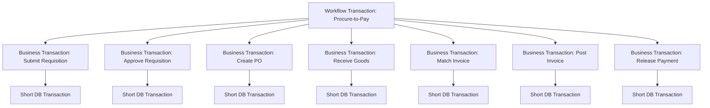
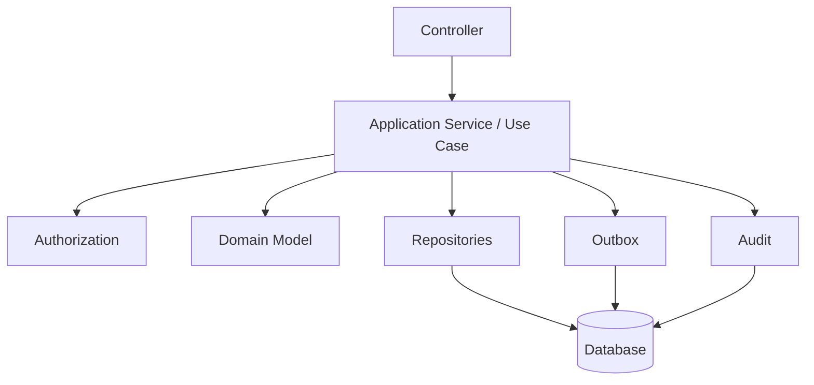
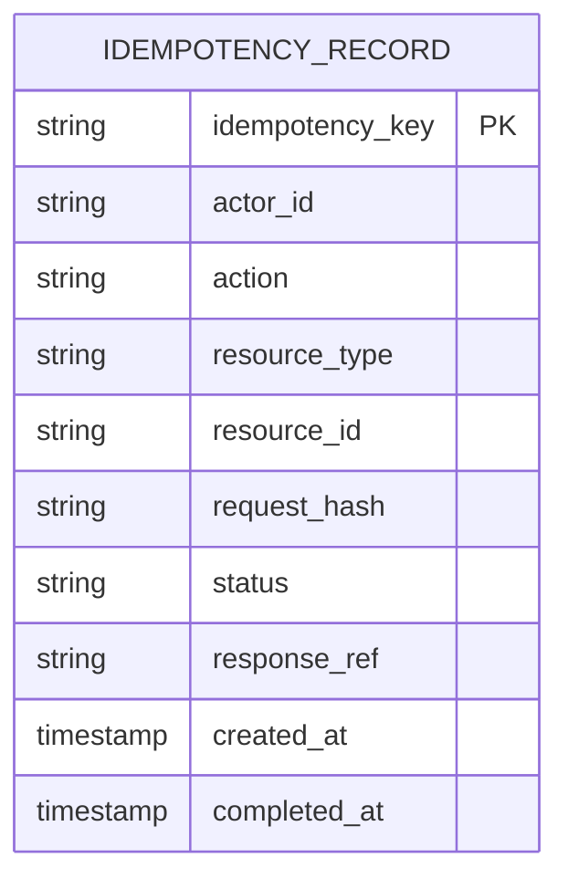
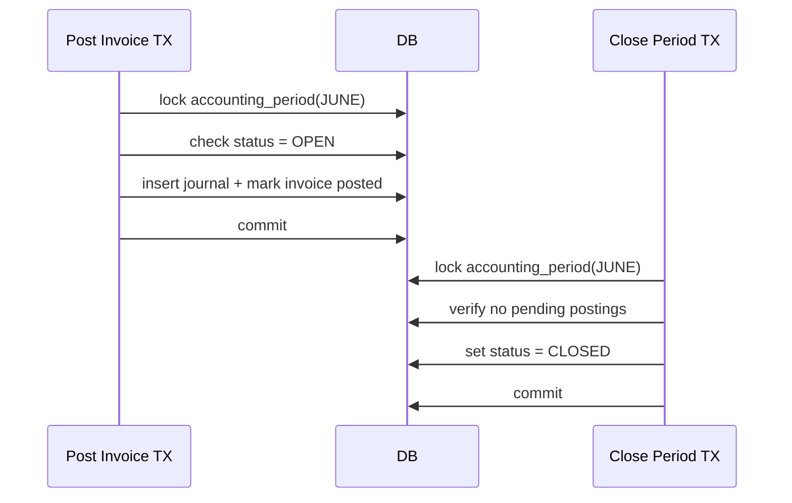
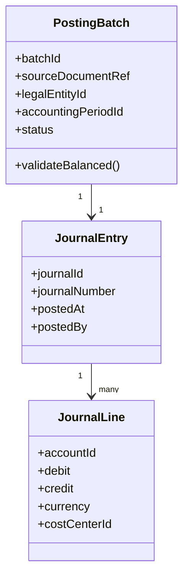
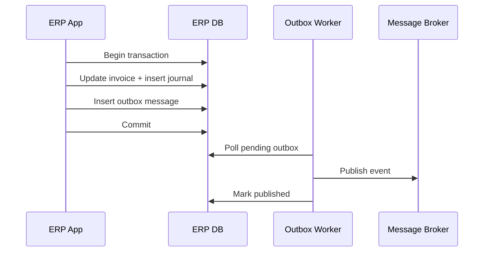
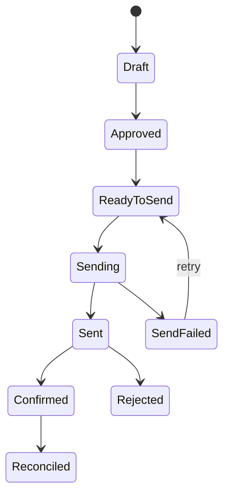
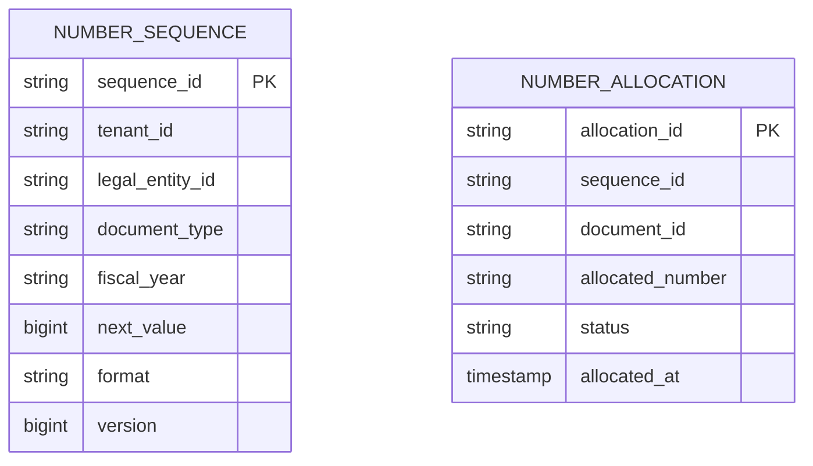
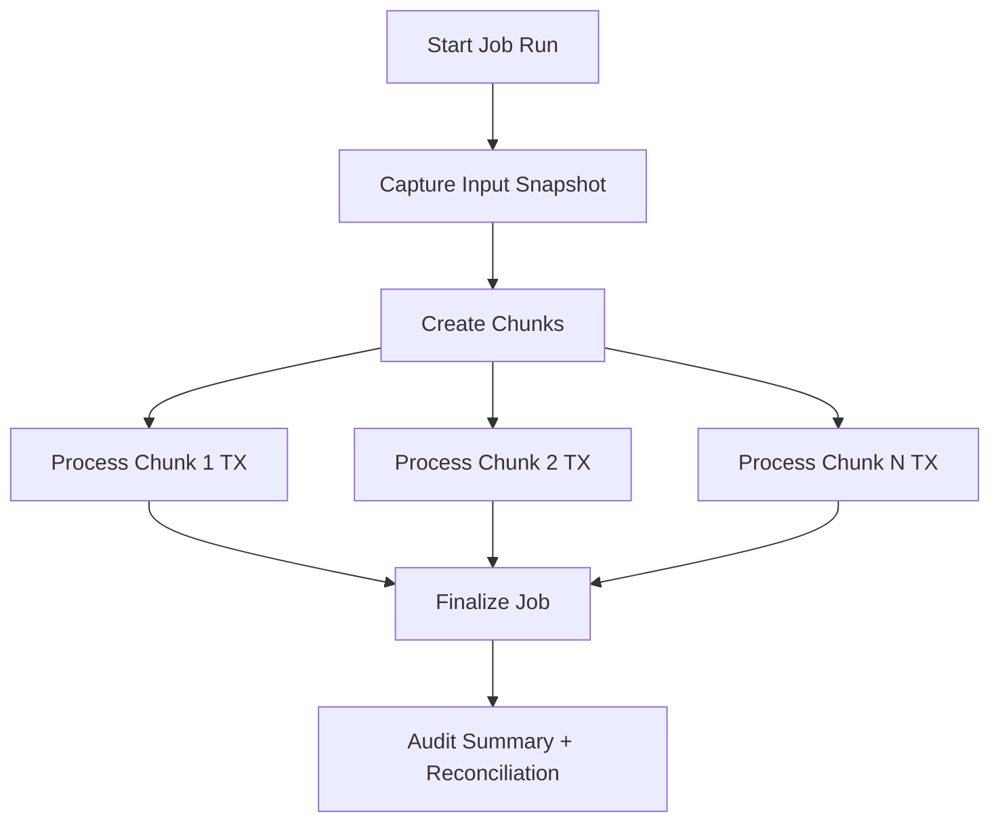

# Part 008 — Transaction Boundaries and Business Invariants

## 1. Target Skill Part Ini

Part ini menjawab pertanyaan paling penting dalam engineering ERP:

> **Di mana batas transaksi harus ditempatkan agar uang, stok, approval, ledger, dokumen, dan integrasi tetap benar meskipun sistem gagal, request diulang, user bersamaan, dan proses berjalan lama?**

Banyak engineer melihat transaksi sebagai anotasi:

```java
@Transactional
```

Di ERP besar, itu hanya lapisan teknis. Yang lebih penting adalah **business transaction boundary** dan **business invariant**.

Contoh invariant ERP:

- journal debit harus sama dengan credit;
- invoice tidak boleh diposting dua kali;
- stock movement harus punya jejak ledger;
- closed fiscal period tidak boleh menerima posting baru;
- purchase order tidak boleh approved oleh creator yang sama;
- payment release tidak boleh terjadi sebelum invoice approved dan payable;
- reversal tidak boleh menghapus transaksi original;
- document number legal tidak boleh reuse;
- outbox event tidak boleh hilang setelah commit;
- retry integration tidak boleh menggandakan efek bisnis.

Dalam kerangka Kaufman, part ini adalah fase **deconstruct + deliberate practice** untuk correctness. Kita memecah transaksi menjadi beberapa jenis, lalu belajar menempatkan boundary dengan sadar.

## 2. Tiga Jenis Transaksi dalam ERP

Satu kata “transaction” sering dipakai untuk tiga hal berbeda.

| Jenis | Arti | Contoh |
|---|---|---|
| Database transaction | Unit atomicity di database. | Insert invoice + invoice lines + audit event. |
| Business transaction | Unit perubahan bisnis yang harus menjaga invariant. | Approve PO, post journal, receive goods. |
| Workflow transaction | Step dalam proses panjang yang bisa berlangsung hari/minggu. | Requisition → approval → PO → receipt → invoice → payment. |

Kesalahan umum adalah menganggap workflow panjang bisa dibungkus satu database transaction. Tidak bisa. Database transaction harus pendek. Workflow transaction harus direpresentasikan sebagai state dan event.



Rule utama:

> **A database transaction protects one atomic write boundary. A business transaction protects one business invariant boundary. A workflow transaction coordinates many business transactions through state.**

## 3. Business Invariant: Jantung Correctness ERP

Invariant adalah kondisi yang harus selalu benar setelah transaksi selesai.

Format mental:

```text
After command C commits, invariant I must hold for aggregate/resource/scope S.
```

Contoh:

```text
After PostJournalCommand commits,
sum(debit) must equal sum(credit),
all lines must belong to same legal entity and accounting period,
and the period must be open at posting time.
```

### 3.1 Kategori Invariant ERP

| Kategori | Contoh Invariant |
|---|---|
| Financial invariant | Debit = credit, accounting period open, currency basis stored. |
| Inventory invariant | Stock ledger movement exists for every quantity change. |
| Lifecycle invariant | Draft cannot be posted; cancelled document cannot be approved. |
| Authorization invariant | Actor must be authorized at action time. |
| SoD invariant | Maker and checker cannot be same actor on same controlled document. |
| Idempotency invariant | Same external command key cannot create duplicate business effect. |
| Sequence invariant | Legal document number cannot be reused or silently skipped beyond policy. |
| Integration invariant | Committed business fact must have durable outbox event if integration depends on it. |
| Reversal invariant | Posted transaction is reversed by compensating entry, not deleted. |
| Reconciliation invariant | Subledger balance must reconcile to GL control account. |

### 3.2 Invariant Harus Dinyatakan Eksplisit

Buruk:

```java
invoice.setStatus(POSTED);
invoiceRepository.save(invoice);
```

Lebih baik:

```java
invoice.post(new PostingContext(
        actorId,
        accountingPeriod,
        authorizationDecisionId,
        postingPolicyVersion
));
```

Domain method `post` harus menjaga invariant:

```java
public void post(PostingContext context) {
    requireStatus(InvoiceStatus.APPROVED);
    requireOpenPeriod(context.accountingPeriod());
    requireNotAlreadyPosted();
    requireMatchedOrPolicyAllowsException();
    requireAuthorizationEvidence(context.authorizationDecisionId());

    this.status = InvoiceStatus.POSTED;
    this.postedAt = context.now();
    this.postedBy = context.actorId();
    this.postingPolicyVersion = context.policyVersion();

    registerEvent(new VendorInvoicePosted(this.id, this.vendorId, this.totalAmount));
}
```

## 4. Transaction Boundary Placement

Boundary yang benar biasanya berada di application service/use case, bukan di controller dan bukan di repository method kecil.



Contoh:

```java
@Transactional
public PostInvoiceResult postInvoice(PostInvoiceCommand command, ActorId actorId) {
    VendorInvoice invoice = invoiceRepository.getForUpdate(command.invoiceId());

    AuthorizationDecision authz = authorizationService.decidePostInvoice(actorId, invoice);
    if (!authz.allowed()) {
        throw new AccessDeniedBusinessException(authz.reasonCode());
    }

    AccountingPeriod period = periodRepository.getForUpdate(invoice.accountingPeriodId());
    PostingBatch batch = postingService.buildVendorInvoicePosting(invoice, period, actorId, authz);

    invoice.post(batch.postingContext());
    journalRepository.save(batch.journal());
    invoiceRepository.save(invoice);
    auditRepository.save(AuthorizationAudit.from(authz));
    outboxRepository.save(IntegrationEvent.from(new VendorInvoicePosted(invoice.id())));

    return new PostInvoiceResult(invoice.id(), batch.journal().id());
}
```

Boundary ini melindungi:

- status invoice;
- journal creation;
- authorization evidence;
- outbox event;
- audit record.

Jika salah satu gagal, seluruh business transaction gagal.

## 5. Jangan Membuat Transaction Terlalu Besar

Transaksi database yang terlalu panjang menyebabkan:

- lock lama;
- deadlock;
- connection pool exhaustion;
- user menunggu;
- retry mahal;
- rollback besar;
- batch job mengganggu transaksi online;
- operational incident saat peak.

Jangan membungkus hal-hal ini dalam satu DB transaction:

- panggilan API eksternal;
- render PDF besar;
- kirim email;
- upload file besar;
- tunggu approval user;
- proses batch multi-jam;
- generate report besar;
- call bank gateway;
- call tax authority;
- call warehouse system.

Gunakan durable state + outbox + retry untuk interaksi luar.

## 6. Jangan Membuat Transaction Terlalu Kecil

Transaction terlalu kecil juga berbahaya.

Contoh buruk:

```java
@Transactional
public void markInvoicePosted(UUID invoiceId) {
    invoiceRepository.markPosted(invoiceId);
}

@Transactional
public void createJournal(UUID invoiceId) {
    journalRepository.save(buildJournal(invoiceId));
}

@Transactional
public void publishEvent(UUID invoiceId) {
    eventPublisher.publish(new InvoicePosted(invoiceId));
}
```

Jika `markInvoicePosted` sukses tetapi `createJournal` gagal, ERP punya invoice posted tanpa journal. Itu merusak invariant.

Rule:

```text
All writes required to make one business fact true must commit atomically.
```

Untuk `InvoicePosted`, business fact minimal mencakup:

- invoice status berubah;
- journal/subledger entry tercipta;
- audit evidence disimpan;
- outbox event tercatat;
- posting number/sequence dialokasikan sesuai policy.

## 7. Command Boundary

Setiap command harus punya boundary yang jelas.

```text
Command = intent untuk mengubah state bisnis.
Query = intent untuk membaca state bisnis.
```

Contoh command ERP:

- `SubmitPurchaseOrderCommand`;
- `ApprovePurchaseOrderCommand`;
- `ReceiveGoodsCommand`;
- `PostVendorInvoiceCommand`;
- `ReverseJournalCommand`;
- `CloseAccountingPeriodCommand`;
- `RunDepreciationCommand`.

Command harus punya:

- command ID;
- actor ID;
- target resource;
- expected version jika optimistic locking;
- idempotency key jika external/retryable;
- business timestamp;
- source channel;
- correlation ID;
- payload;
- reason/comment untuk controlled action.

```java
public record ApprovePurchaseOrderCommand(
        UUID commandId,
        UUID purchaseOrderId,
        long expectedVersion,
        String comment,
        String idempotencyKey,
        Instant requestedAt,
        String sourceChannel,
        String correlationId
) {}
```

## 8. Idempotency sebagai Transaction Invariant

Retry adalah fakta hidup. User double-click, gateway retry, message broker redeliver, client timeout, batch restart.

Tanpa idempotency, retry menghasilkan duplicate business effect.

Contoh risiko:

| Scenario | Tanpa Idempotency |
|---|---|
| Payment callback retry | Payment marked twice, duplicate receipt. |
| Invoice import retry | Duplicate invoice. |
| Goods receipt retry | Stock bertambah dua kali. |
| Journal posting retry | Double posting. |
| PO approval retry | Duplicate approval event atau state conflict. |

### 8.1 Idempotency Key Store



Algorithm:

```text
1. Receive command with idempotency key.
2. Insert idempotency record with unique key.
3. If insert fails:
   a. load existing record;
   b. compare request hash;
   c. return previous result if completed;
   d. reject if same key but different payload.
4. Execute business transaction.
5. Store response reference.
6. Mark idempotency record completed.
```

Pseudo-code:

```java
@Transactional
public GoodsReceiptResult receiveGoods(ReceiveGoodsCommand command, ActorId actorId) {
    IdempotencyClaim claim = idempotencyService.claim(
            command.idempotencyKey(),
            command.requestHash(),
            "inventory.goods-receipt.receive"
    );

    if (claim.isReplay()) {
        return goodsReceiptRepository.loadResult(claim.responseRef());
    }

    PurchaseOrder po = purchaseOrderRepository.getForUpdate(command.purchaseOrderId());
    GoodsReceipt receipt = po.receive(command.lines(), actorId);
    StockLedgerBatch stockBatch = stockLedgerService.buildForReceipt(receipt);

    goodsReceiptRepository.save(receipt);
    stockLedgerRepository.saveAll(stockBatch.entries());
    outboxRepository.save(IntegrationEvent.from(new GoodsReceived(receipt.id())));

    idempotencyService.complete(claim, receipt.id().toString());

    return new GoodsReceiptResult(receipt.id());
}
```

## 9. Transaction Isolation: Jangan Asumsikan Serial

Database isolation menentukan anomali yang mungkin terjadi ketika transaksi berjalan bersamaan.

Read committed sering cukup untuk workload biasa, tetapi ERP punya banyak transaksi yang rentan terhadap race:

- stock reservation;
- approval limit check;
- period close vs posting;
- invoice number allocation;
- budget consumption;
- credit limit check;
- duplicate vendor invoice check;
- inventory valuation batch.

PostgreSQL, misalnya, mendokumentasikan beberapa isolation level seperti Read Committed, Repeatable Read, dan Serializable. Namun pilihan isolation bukan pengganti desain invariant. Spring dan Jakarta menyediakan abstraction transaction, tetapi database tetap menentukan perilaku concurrency aktual.

### 9.1 Common Anomalies

| Anomaly | Contoh ERP |
|---|---|
| Lost update | Dua user update PO line, perubahan salah satu hilang. |
| Non-repeatable read | Amount invoice berubah antara validation dan posting. |
| Phantom read | Duplicate invoice check lolos karena transaksi lain insert invoice serupa. |
| Write skew | Dua approver masing-masing melihat limit masih tersedia lalu keduanya approve. |
| Stale read | User approve dokumen yang state-nya sudah berubah. |

### 9.2 Cara Menangani

| Masalah | Teknik |
|---|---|
| Lost update | Optimistic locking dengan version. |
| State transition race | `SELECT FOR UPDATE` atau optimistic compare-and-swap. |
| Duplicate external document | Unique constraint pada natural business key. |
| Stock oversell | Reservation row lock atau atomic decrement dengan constraint. |
| Period close race | Lock accounting period saat posting/closing. |
| Budget overrun | Budget bucket lock atau serializable transaction untuk bucket. |
| Sequence collision | Database sequence atau sequence allocator dengan lock. |

## 10. Optimistic Locking

Optimistic locking cocok ketika konflik jarang dan retry user masuk akal.

```java
@Entity
class PurchaseOrderEntity {
    @Id
    private UUID id;

    @Version
    private long version;

    private String status;
}
```

Command membawa expected version:

```java
public record SubmitPurchaseOrderCommand(
        UUID purchaseOrderId,
        long expectedVersion,
        String comment
) {}
```

Jika version berubah, tolak dengan business error:

```text
Purchase order changed since you opened it. Please reload before submitting.
```

Optimistic locking cocok untuk:

- edit draft document;
- approval task detail;
- master data maintenance;
- configuration editing.

Kurang cocok untuk:

- high-contention stock bucket;
- sequence generation;
- period close;
- payment release batch;
- hot budget bucket.

## 11. Pessimistic Locking

Pessimistic lock cocok ketika konflik mahal dan invariant harus diproteksi langsung.

```java
@Lock(LockModeType.PESSIMISTIC_WRITE)
@Query("select p from AccountingPeriodEntity p where p.id = :id")
Optional<AccountingPeriodEntity> findForUpdate(UUID id);
```

Gunakan untuk:

- accounting period close vs posting;
- stock reservation bucket;
- document number allocator;
- budget commitment bucket;
- settlement batch membership.

Jangan gunakan secara membabi-buta. Lock yang tidak perlu akan menghancurkan throughput.

## 12. Period Lock vs Posting Race

Scenario:

```text
T1: User posts invoice into June period.
T2: Finance closes June period.
```

Jika tidak dilindungi, invoice bisa masuk setelah period dianggap closed.

Desain:



Invariant:

```text
No posting may commit into a period after the period close transaction commits.
```

Implementasi bisa memakai row lock pada period atau mekanisme lebih advanced, tetapi invariant harus eksplisit.

## 13. Stock Reservation Race

Scenario:

```text
Available stock = 10
Order A reserves 8
Order B reserves 8
```

Tanpa boundary benar, dua order bisa sama-sama berhasil.

Pilihan desain:

### 13.1 Lock Stock Bucket

```sql
SELECT * FROM stock_bucket
WHERE item_id = ? AND warehouse_id = ?
FOR UPDATE;
```

Lalu update:

```text
available = on_hand - reserved
if available >= requested_qty:
    reserved += requested_qty
else:
    reject
```

### 13.2 Atomic Conditional Update

```sql
UPDATE stock_bucket
SET reserved_qty = reserved_qty + :qty
WHERE item_id = :itemId
  AND warehouse_id = :warehouseId
  AND on_hand_qty - reserved_qty >= :qty;
```

Jika affected row = 0, reject.

### 13.3 Reservation Ledger

Untuk auditability lebih kuat:

```text
stock_reservation:
  reservation_id
  item_id
  warehouse_id
  source_document_id
  qty
  status

stock_ledger:
  movement_id
  item_id
  warehouse_id
  qty_delta
  movement_type
  source_document_id
```

Stock bucket adalah projection/cache dari ledger + reservation, bukan satu-satunya bukti.

## 14. Financial Posting Boundary

Financial posting adalah boundary paling sensitif.

Minimal invariant:

```text
A posting batch must be balanced per legal entity, currency basis, accounting period, and ledger.
```

Contoh model:



```java
public final class PostingBatch {
    private final List<JournalLine> lines;

    public void validate() {
        requireAtLeastTwoLines();
        requireSameLegalEntity();
        requireSameAccountingPeriod();
        requireBalanced();
        requireNoNegativeDebitCredit();
    }

    private void requireBalanced() {
        Money debit = lines.stream()
                .map(JournalLine::debit)
                .reduce(Money.zero(currency()), Money::add);

        Money credit = lines.stream()
                .map(JournalLine::credit)
                .reduce(Money.zero(currency()), Money::add);

        if (!debit.equals(credit)) {
            throw new UnbalancedJournalException(debit, credit);
        }
    }
}
```

Posting transaction harus menyimpan:

- source document reference;
- generated journal;
- journal lines;
- posting audit;
- status source document;
- outbox event;
- idempotency result jika command retryable.

## 15. Outbox sebagai Bagian dari Transaction Boundary

Jika sistem lain harus tahu bahwa invoice posted, event harus durable bersama commit.

Buruk:

```java
invoiceRepository.save(invoice);
eventPublisher.publish(new InvoicePosted(invoice.id()));
```

Jika publish gagal setelah commit, event hilang.

Lebih baik:

```java
@Transactional
public void postInvoice(...) {
    invoice.post(...);
    invoiceRepository.save(invoice);
    journalRepository.save(journal);
    outboxRepository.save(OutboxMessage.from(new InvoicePosted(invoice.id())));
}
```

Outbox worker mengirim setelah commit.



Invariant:

```text
If business fact F commits and external consumers depend on F,
then durable integration intent for F must commit in the same DB transaction.
```

## 16. Transaction Propagation: Gunakan dengan Hati-Hati

Spring dan Jakarta mendukung berbagai mode transaction propagation. Ini berguna, tetapi sering disalahgunakan.

### 16.1 REQUIRED

Default yang paling sering benar:

```text
Join existing transaction or create one if absent.
```

Cocok untuk application service utama.

### 16.2 REQUIRES_NEW

Membuat transaksi baru dan memisahkan commit dari outer transaction.

Risiko di ERP:

```text
Outer transaction rollback, inner audit/payment/status transaction commit.
```

Kadang berguna untuk audit teknis, tetapi berbahaya untuk business fact yang harus atomik dengan outer transaction.

Contoh berbahaya:

```java
@Transactional
public void postInvoice(...) {
    invoice.markPosted();
    auditService.auditPostedRequiresNew(invoice.id());
    throw new RuntimeException("journal failed");
}
```

Audit mengatakan invoice posted, tetapi invoice transaction rollback. Ini membingungkan kecuali audit event diberi semantik “attempt”, bukan “committed fact”.

### 16.3 NESTED

Nested transaction dengan savepoint bisa berguna untuk partial rollback dalam satu physical transaction, tetapi tidak semua transaction manager/resource mendukungnya sama. Spring mendokumentasikan bahwa nested propagation biasanya dipetakan ke JDBC savepoint untuk resource transaction tertentu.

Gunakan hanya jika engineer benar-benar memahami resource manager yang dipakai.

## 17. External Call Boundary

Jangan call external system di dalam DB transaction.

Buruk:

```java
@Transactional
public void releasePayment(...) {
    Payment payment = paymentRepository.getForUpdate(id);
    bankClient.transfer(payment.toBankRequest());
    payment.markReleased();
    paymentRepository.save(payment);
}
```

Masalah:

- DB lock terbuka saat menunggu bank;
- bank bisa sukses tapi DB rollback;
- bank bisa timeout tapi sebenarnya sukses;
- retry bisa membayar dua kali.

Lebih baik:

```text
1. Validate and create PaymentInstruction in DB transaction.
2. Commit instruction + outbox command.
3. Worker sends to bank with idempotency key.
4. Bank callback updates status idempotently.
5. Reconciliation confirms final state.
```



## 18. Reversal, Cancellation, Compensation

ERP tidak boleh menghapus fakta bisnis yang sudah berdampak.

| Istilah | Kapan Dipakai | Efek |
|---|---|---|
| Cancellation | Sebelum posting/finalization | Dokumen dibatalkan tanpa reversing ledger. |
| Reversal | Setelah posting | Buat entry lawan untuk menetralkan dampak. |
| Correction | Memperbaiki data non-financial dengan audit | Tambah correction event. |
| Compensation | Proses bisnis lawan pada workflow/distributed process | Misalnya cancel shipment request setelah payment failure. |

Invariant reversal:

```text
Original posted transaction remains immutable.
Reversal references original transaction.
Reversal posts equal and opposite financial effect according to policy.
```

Contoh:

```java
@Transactional
public ReverseJournalResult reverseJournal(ReverseJournalCommand command, ActorId actorId) {
    JournalEntry original = journalRepository.getPostedForUpdate(command.originalJournalId());
    AccountingPeriod reversalPeriod = periodRepository.getOpenPeriod(command.reversalPeriodId());

    AuthorizationDecision authz = authorizationService.decideReverseJournal(actorId, original);
    if (!authz.allowed()) {
        throw new AccessDeniedBusinessException(authz.reasonCode());
    }

    JournalEntry reversal = original.createReversal(
            reversalPeriod,
            actorId,
            command.reason(),
            authz.decisionId()
    );

    journalRepository.save(reversal);
    journalRepository.markReversed(original.id(), reversal.id());
    outboxRepository.save(IntegrationEvent.from(new JournalReversed(original.id(), reversal.id())));

    return new ReverseJournalResult(reversal.id());
}
```

## 19. Sequence and Numbering Boundary

Legal document number sering punya constraint khusus:

- unique;
- gap policy;
- per legal entity;
- per document type;
- per fiscal year/period;
- auditable;
- tidak boleh reuse;
- reserved/cancelled number harus tercatat.

Jangan generate nomor legal di frontend.

Model:



Allocation harus atomic.

```text
lock sequence row
read next_value
insert allocation
increment next_value
commit
```

Jika dokumen gagal setelah number allocated, policy harus jelas:

- boleh gap dengan audit;
- reserve sampai completion;
- allocate only at posting;
- temporary draft number berbeda dari legal number.

## 20. Batch Transaction Boundary

ERP punya batch berat:

- depreciation;
- MRP;
- stock valuation;
- invoice import;
- payment proposal;
- aging calculation;
- statement generation;
- period close.

Jangan satu batch besar dalam satu transaction.

Desain batch yang sehat:

```text
job_run
  status: RUNNING | COMPLETED | FAILED | PARTIALLY_COMPLETED
  input_snapshot
  policy_version
  started_by

job_chunk
  chunk_id
  status
  item_range
  retry_count
  checksum
```



Setiap chunk punya transaksi sendiri dan idempotency sendiri.

## 21. Validation Boundary

Validasi ERP punya beberapa level.

| Level | Contoh | Tempat |
|---|---|---|
| Syntactic validation | Required field, format, enum | API/request DTO |
| Semantic validation | Vendor active, item purchasable | Application/domain |
| Policy validation | Amount limit, approval matrix | Policy service |
| State validation | Draft can submit, approved can post | Domain state machine |
| Referential validation | Account exists, period open | Application/domain/repository |
| Cross-document validation | PO, GR, invoice match | Application/domain service |
| Reconciliation validation | Subledger equals GL | Batch/report control |

Jangan mengandalkan database constraint untuk semua validasi. Database constraint penting, tetapi banyak invariant ERP butuh konteks bisnis.

## 22. Error Semantics

ERP harus membedakan error:

| Error Type | Contoh | Retry? |
|---|---|---|
| Validation error | Amount negative | No |
| Authorization error | User lacks approval authority | No, unless access changes |
| State conflict | Document already approved | Maybe reload |
| Optimistic conflict | Version mismatch | User reload/retry |
| Transient technical error | Deadlock, timeout | Automated retry possible |
| External uncertain result | Bank timeout | Reconcile before retry |
| Invariant violation | Unbalanced journal | No; bug/data issue |

Jangan retry semua error. Retry tanpa klasifikasi bisa menggandakan dampak.

## 23. Deadlock Handling

Deadlock akan terjadi di ERP besar. Yang penting adalah desain agar:

- jarang;
- terdeteksi;
- aman diretry;
- tidak menghasilkan duplicate effect.

Prinsip:

- lock resource dalam urutan konsisten;
- transaksi pendek;
- gunakan idempotency untuk retry;
- hindari query besar dalam transaction;
- gunakan pagination/chunk untuk batch;
- pisahkan read model dari write model;
- log deadlock dengan business context.

Contoh lock ordering:

```text
Always lock:
1. tenant/legal entity control row
2. accounting period
3. source document
4. ledger/stock/budget bucket
5. sequence row
```

Urutan tergantung domain, tetapi harus konsisten.

## 24. Transaction Evidence

Setiap controlled transaction harus menghasilkan evidence.

Minimal evidence:

```text
transaction_id
command_id
actor_id
resource_id
before_state
after_state
business_time
system_time
authorization_decision_id
policy_version
idempotency_key
correlation_id
```

Untuk financial posting:

```text
posting_batch_id
source_document_ref
journal_id
accounting_period_id
legal_entity_id
balanced_amount
currency
posting_policy_version
```

Evidence membuat transaksi defensible saat audit, support, dan dispute.

## 25. Transaction Design Template

Gunakan template ini saat merancang use case ERP.

```text
Use Case:
Command:
Actor:
Resource:
Business Fact Created:
Preconditions:
Invariants:
Rows/aggregates locked:
Writes in same DB transaction:
Events/outbox written:
Idempotency key:
Authorization evidence:
Failure modes:
Retry policy:
Reversal/cancellation path:
Audit evidence:
```

Contoh ringkas:

```text
Use Case: Post Vendor Invoice
Command: PostVendorInvoiceCommand
Actor: AP Accountant / Finance Manager
Resource: VendorInvoice
Business Fact: VendorInvoicePosted
Preconditions:
  - invoice approved
  - invoice matched or exception approved
  - accounting period open
  - actor authorized
Invariants:
  - invoice posted once
  - journal balanced
  - subledger entry exists
  - outbox event durable
Rows locked:
  - vendor_invoice
  - accounting_period
  - document_sequence
Writes:
  - invoice.status = POSTED
  - journal + lines
  - subledger entry
  - audit event
  - outbox event
Retry:
  - idempotency key by invoice + posting command
Reversal:
  - reverse invoice posting via reversing journal
```

## 26. Anti-Patterns

| Anti-Pattern | Gejala | Dampak |
|---|---|---|
| Transaction at controller only | Semua endpoint diberi annotation tanpa desain boundary | Boundary tidak sesuai invariant. |
| Repository transaction fragments | Setiap repository save punya transaction sendiri | Business fact commit parsial. |
| Long transaction with external call | DB lock sambil call bank/API | Timeout, rollback, duplicate external effect. |
| No idempotency | Retry membuat duplicate invoice/payment/receipt | Data korup. |
| Delete posted fact | Posted journal dihapus saat salah | Audit rusak. |
| Event after commit without outbox | Event hilang saat publish gagal | Sistem lain tidak sinkron. |
| Read committed assumed safe | Race tidak diuji | Oversell, over-budget, duplicate approval. |
| REQUIRES_NEW everywhere | Inner transaction commit saat outer rollback | Evidence/fact kontradiktif. |
| Batch as one transaction | Period close atau import jutaan row dalam 1 tx | Lock panjang, rollback mahal. |
| No lock ordering | Deadlock acak di production | Incident sulit dianalisis. |

## 27. Testing Strategy

### 27.1 Invariant Tests

Tulis test yang menegaskan invariant, bukan hanya happy path.

```java
@Test
void postingVendorInvoiceCreatesBalancedJournalAndOutboxAtomically() {
    PostInvoiceCommand command = fixture.validPostInvoiceCommand();

    PostInvoiceResult result = service.postInvoice(command, fixture.apAccountant());

    VendorInvoice invoice = invoiceRepository.get(result.invoiceId());
    JournalEntry journal = journalRepository.get(result.journalId());
    List<OutboxMessage> outbox = outboxRepository.findByAggregateId(result.invoiceId());

    assertThat(invoice.status()).isEqualTo(InvoiceStatus.POSTED);
    assertThat(journal.isBalanced()).isTrue();
    assertThat(outbox).anyMatch(e -> e.type().equals("VendorInvoicePosted"));
}
```

### 27.2 Rollback Test

Simulasikan failure setelah sebagian write.

```java
@Test
void invoicePostingRollsBackJournalWhenOutboxInsertFails() {
    outboxRepository.failNextInsert();

    assertThatThrownBy(() -> service.postInvoice(command, actor))
            .isInstanceOf(OutboxWriteException.class);

    assertThat(invoiceRepository.get(command.invoiceId()).status())
            .isEqualTo(InvoiceStatus.APPROVED);
    assertThat(journalRepository.findBySource(command.invoiceId()))
            .isEmpty();
}
```

### 27.3 Concurrency Test

Simulasikan dua transaksi bersamaan:

- dua user approve dokumen sama;
- post invoice saat period close;
- dua order reserve stock sama;
- duplicate invoice import;
- budget consumption parallel.

Gunakan barrier/latch pada integration test untuk memaksa interleaving.

### 27.4 Idempotency Test

```java
@Test
void repeatedGoodsReceiptCommandReturnsSameResultWithoutDuplicatingStock() {
    ReceiveGoodsCommand command = fixture.receiveGoodsCommand("idem-123");

    GoodsReceiptResult first = service.receiveGoods(command, actor);
    GoodsReceiptResult second = service.receiveGoods(command, actor);

    assertThat(second.receiptId()).isEqualTo(first.receiptId());
    assertThat(stockLedgerRepository.findBySource(first.receiptId()))
            .hasSize(command.lines().size());
}
```

## 28. Observability untuk Transaction Boundary

Monitor bukan hanya CPU dan latency. Untuk ERP transaction, monitor:

- posting success/failure count;
- idempotency replay rate;
- deadlock count per use case;
- optimistic lock conflict rate;
- transaction duration percentile;
- outbox lag;
- rollback count by reason;
- period close duration;
- stock reservation rejection rate;
- duplicate constraint violation;
- reconciliation mismatch count.

Log harus membawa business context:

```json
{
  "event": "erp.transaction.failed",
  "useCase": "PostVendorInvoice",
  "invoiceId": "inv-123",
  "legalEntity": "PT-A",
  "period": "2026-06",
  "actorId": "usr-rina",
  "reasonCode": "PERIOD_CLOSED",
  "correlationId": "req-789"
}
```

## 29. 20-Hour Practice Drill

### Drill 1 — Identify Invariants

Ambil 5 use case:

- approve PO;
- receive goods;
- post vendor invoice;
- release payment;
- reverse journal.

Untuk masing-masing, tulis minimal 10 invariant.

### Drill 2 — Boundary Template

Isi transaction design template untuk setiap use case. Pastikan jelas rows mana yang dilock dan writes mana yang atomik.

### Drill 3 — Idempotency

Desain idempotency key untuk:

- invoice import;
- bank payment callback;
- goods receipt API;
- external order creation.

Tentukan request hash dan replay response.

### Drill 4 — Concurrency Simulation

Buat integration test dengan dua thread untuk:

- stock reservation race;
- period close vs posting;
- duplicate invoice number allocation.

### Drill 5 — Failure Injection

Inject failure setelah:

- invoice status update;
- journal insert;
- outbox insert;
- audit insert;
- external callback processing.

Pastikan invariant tetap benar.

## 30. Ringkasan

ERP correctness bergantung pada kemampuan menempatkan transaction boundary berdasarkan invariant bisnis.

Pegangan utama:

- database transaction harus pendek;
- workflow panjang harus dimodelkan sebagai state, bukan satu transaction besar;
- semua write yang membuat satu business fact benar harus commit atomically;
- authorization evidence, audit, dan outbox sering bagian dari boundary;
- external call tidak boleh berada di dalam DB transaction;
- retry harus idempotent;
- posted fact tidak dihapus, tetapi dibalik dengan reversal;
- concurrency anomaly harus dipikirkan secara eksplisit;
- lock harus dipakai selektif dan konsisten;
- transaction evidence harus cukup untuk audit dan support.

Mental model yang harus dibawa:

> **`@Transactional` is not the design. It is only the mechanism used after the boundary and invariant are understood.**

Part berikutnya akan masuk ke General Ledger Accounting Engine. Di sana kita akan menerapkan prinsip transaksi dan invariant ini ke domain paling sensitif dalam ERP: double-entry accounting, journal, fiscal period, posting engine, dan close process.

## 31. Source Notes

Materi ini disusun dengan mengacu pada prinsip umum dan dokumentasi resmi berikut:

- Jakarta Transactions specification dan tutorial untuk konsep transaction demarcation dan transaction attribute.
- Spring Framework transaction documentation untuk propagation, declarative transaction management, dan batas penggunaan nested/savepoint.
- PostgreSQL official documentation untuk isolation level dan perilaku concurrency database relasional.
- Pola Transactional Outbox yang banyak digunakan untuk menjaga atomicity antara perubahan database dan intent publikasi event.
- Praktik umum ERP/accounting system: period lock, posting batch, reversal, stock ledger, document numbering, idempotency, dan reconciliation.
