# Part 009 — General Ledger Accounting Engine

## 1. Target Skill Part Ini

Part ini membahas inti finansial ERP:

> **Bagaimana mendesain General Ledger accounting engine yang benar, defensible, scalable, dan operable di Java ERP berskala besar?**

General Ledger atau GL bukan sekadar tabel `journal_header` dan `journal_line`. Dalam ERP besar, GL adalah **system of financial truth**. Banyak modul operasional boleh punya lifecycle masing-masing, tetapi ketika transaksi bisnis berdampak finansial, efek akhirnya harus masuk ke ledger dengan aturan yang konsisten.

Contoh transaksi yang akhirnya menyentuh GL:

- invoice vendor diposting menjadi liability;
- customer invoice diposting menjadi receivable dan revenue;
- goods receipt menciptakan inventory value dan accrual;
- payment mengurangi cash dan payable/receivable;
- depreciation mengurangi asset carrying value;
- foreign exchange revaluation menghasilkan gain/loss;
- period close menghasilkan adjustment dan retained earnings;
- reversal membalik efek jurnal tanpa menghapus bukti transaksi original.

Mental model utama:

> **ERP finansial yang kuat tidak memperlakukan accounting sebagai afterthought. Accounting adalah constraint layer yang memaksa domain operasional tetap jujur.**

Dalam kerangka Kaufman, part ini adalah fase **deconstruct + self-correction**. Kita akan memecah GL menjadi sub-skill engineering yang bisa dilatih:

1. chart of accounts modelling;
2. fiscal calendar dan period control;
3. journal document model;
4. double-entry invariant;
5. posting engine;
6. balance projection;
7. reversal dan adjustment;
8. audit evidence;
9. failure containment;
10. performance dan operability.

## 2. Peran GL dalam Arsitektur ERP

GL berada di antara dunia operasional dan financial reporting.

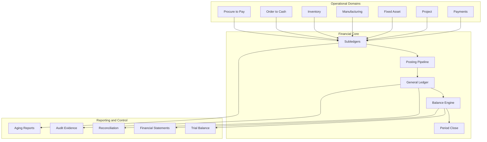

Poin penting:

- modul operasional menghasilkan business events;
- subledger menahan detail domain;
- posting pipeline menerjemahkan detail domain menjadi accounting entries;
- GL menyimpan jurnal finansial yang sudah valid;
- reporting membaca balance dan journal, bukan menghitung ulang bisnis dari nol;
- audit melihat chain of evidence dari source document sampai journal.

GL harus menjaga separation of concerns:

| Layer | Tanggung jawab | Tidak boleh menjadi |
|---|---|---|
| Source document | Menyimpan fakta operasional. | Tempat final financial truth. |
| Subledger | Menyimpan detail finansial per domain. | Dumping ground semua accounting rule. |
| Posting engine | Mengubah source/subledger menjadi accounting entries. | Script acak yang sulit diuji. |
| GL journal | Menyimpan jurnal legal/financial. | Mutable cache. |
| Balance engine | Membuat saldo dan reportable state. | Pengganti audit trail. |

## 3. Prinsip Dasar Accounting Engine

GL engine punya beberapa prinsip yang harus dianggap sebagai invariant sistem.

### 3.1 Double-entry invariant

Setiap journal yang diposting harus balance:

```text
sum(debit) == sum(credit)
```

Untuk multi-currency:

```text
sum(accounting_currency_debit) == sum(accounting_currency_credit)
```

Namun original transaction currency bisa berbeda. Karena itu line harus menyimpan:

- transaction currency;
- transaction amount;
- accounting/base currency;
- accounting/base amount;
- exchange rate;
- rate type;
- rate date;
- rounding difference treatment.

Kesalahan umum:

```text
Hanya menyimpan amount tunggal.
```

Itu akan gagal ketika ada multi-currency, revaluation, realization, tax, dan reporting lokal.

### 3.2 Journal is append-oriented

Jurnal yang sudah posted tidak boleh diedit diam-diam. Koreksi dilakukan dengan:

- reversal journal;
- adjusting journal;
- correcting document;
- period-specific reclassification;
- audit-linked amendment.

Desain yang buruk:

```sql
UPDATE journal_line SET amount = 999 WHERE id = ?;
```

Desain yang defensible:

```text
original journal tetap ada;
reversal journal membalik original;
new corrected journal diposting;
semua terhubung dengan reason, actor, timestamp, dan approval evidence.
```

### 3.3 Posted means financially effective

Status `posted` bukan label UI. Ia berarti transaksi sudah masuk ke financial record.

Konsekuensinya:

- document number legal harus final;
- period harus terbuka saat posting;
- accounting entries harus balance;
- required dimensions harus lengkap;
- approval/control harus valid;
- posting tidak boleh dilakukan dua kali;
- reversal harus mengikuti rule yang jelas.

### 3.4 Accounting event harus deterministic

Untuk input bisnis yang sama dan konfigurasi yang sama, posting engine harus menghasilkan jurnal yang sama.

```text
same source document
+ same accounting rule version
+ same effective date
+ same master data snapshot
= same journal proposal
```

Kalau posting engine bergantung pada hidden mutable state, hasilnya akan sulit diaudit.

### 3.5 Financial truth harus bisa direkonsiliasi

ERP besar tidak cukup hanya bisa generate journal. Ia harus bisa menjawab:

- source document mana yang menghasilkan journal ini?
- journal ini berasal dari rule versi berapa?
- siapa yang memposting?
- kapan diposting?
- period apa?
- kalau reversed, reversal-nya apa?
- apakah subledger balance cocok dengan GL balance?
- apakah report bisa direproduksi untuk cut-off date tertentu?

## 4. Minimal Domain Model GL

Model minimal GL biasanya terdiri dari:

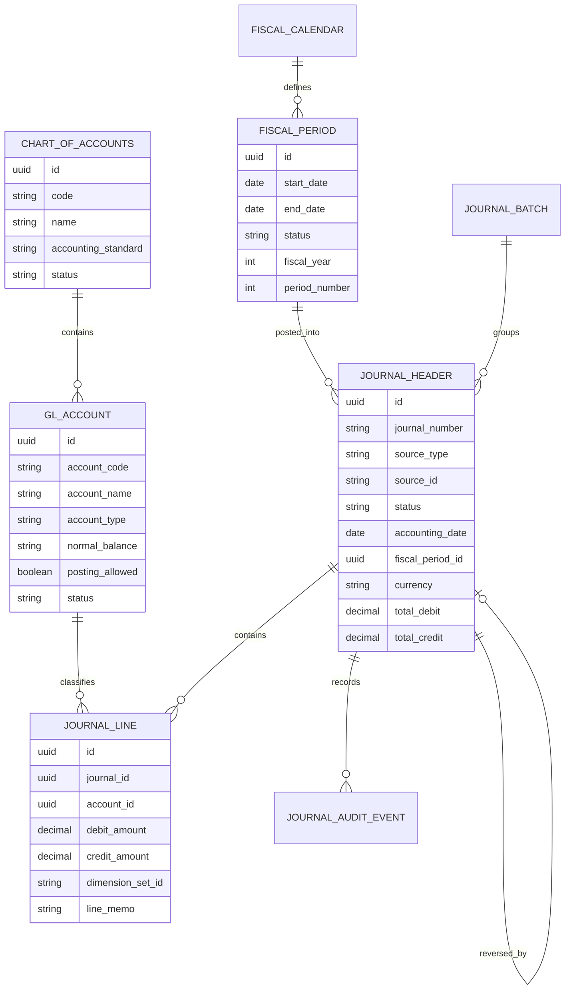

Namun model minimal ini tidak cukup untuk ERP besar. Kita perlu menambahkan:

- ledger set;
- accounting book;
- legal entity;
- cost/profit center;
- dimension set;
- source document reference;
- accounting rule version;
- currency details;
- tax details;
- reconciliation group;
- reversal relationship;
- posting request id;
- idempotency key;
- audit/evidence envelope.

## 5. Chart of Accounts sebagai Kontrak Semantik

Chart of Accounts atau CoA bukan daftar dropdown. Ia adalah taxonomy finansial perusahaan.

### 5.1 Struktur account

Field umum:

| Field | Tujuan |
|---|---|
| accountCode | Kode account stabil dan human-readable. |
| accountName | Nama account. |
| accountType | Asset, liability, equity, revenue, expense. |
| normalBalance | Debit atau credit. |
| postingAllowed | Apakah boleh langsung diposting. |
| parentAccount | Untuk hierarchy. |
| effectiveFrom/effectiveTo | Validitas account. |
| legalEntityScope | Account boleh dipakai entitas mana. |
| requiredDimensions | Dimension yang wajib diisi. |
| reconciliationRequired | Apakah harus direkonsiliasi. |
| taxRelevant | Apakah relevan untuk tax reporting. |
| status | Draft, active, deprecated, closed. |

Contoh Java model:

```java
public enum AccountType {
    ASSET,
    LIABILITY,
    EQUITY,
    REVENUE,
    EXPENSE
}

public enum NormalBalance {
    DEBIT,
    CREDIT
}

public record GlAccount(
        UUID id,
        String code,
        String name,
        AccountType type,
        NormalBalance normalBalance,
        boolean postingAllowed,
        Set<DimensionType> requiredDimensions,
        AccountStatus status,
        EffectiveDateRange effectiveDateRange
) {
    public void assertPostable(LocalDate accountingDate) {
        if (!postingAllowed) {
            throw new DomainRuleViolation("Account is summary-only: " + code);
        }
        if (status != AccountStatus.ACTIVE) {
            throw new DomainRuleViolation("Account is not active: " + code);
        }
        if (!effectiveDateRange.contains(accountingDate)) {
            throw new DomainRuleViolation("Account is not effective on " + accountingDate);
        }
    }
}
```

### 5.2 Posting account vs summary account

Dalam ERP besar, hierarchy CoA sering punya account parent untuk reporting:

```text
1000 Assets
  1100 Current Assets
    1110 Cash
    1120 Accounts Receivable
    1130 Inventory
```

Tidak semua node boleh diposting. Biasanya:

- parent account: summary only;
- leaf account: posting allowed.

Invariant:

```text
journal line hanya boleh memakai account yang postingAllowed = true.
```

### 5.3 Account lifecycle

Account tidak boleh dihapus sembarangan karena historical journal mengacu ke account tersebut.

Lifecycle yang lebih aman:

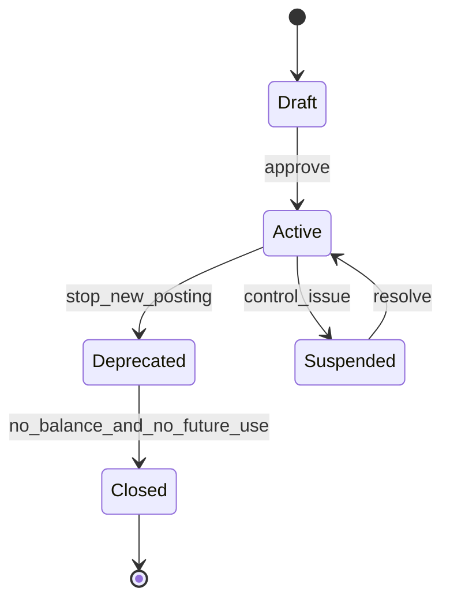

Rule:

- `Draft`: belum boleh dipakai;
- `Active`: boleh dipakai;
- `Deprecated`: historical tetap valid, posting baru ditolak kecuali exception;
- `Suspended`: posting ditolak karena control issue;
- `Closed`: tidak untuk transaksi baru.

## 6. Fiscal Calendar dan Period Control

GL selalu terkait fiscal calendar.

### 6.1 Fiscal period bukan sekadar bulan kalender

Perusahaan bisa memakai:

- calendar year;
- fiscal year berbeda;
- 4-4-5 calendar;
- 13-period accounting;
- adjustment period;
- local statutory calendar per country;
- group reporting calendar.

Model period:

```java
public record FiscalPeriod(
        UUID id,
        UUID calendarId,
        int fiscalYear,
        int periodNumber,
        LocalDate startDate,
        LocalDate endDate,
        PeriodStatus status,
        boolean adjustmentPeriod
) {
    public boolean contains(LocalDate date) {
        return !date.isBefore(startDate) && !date.isAfter(endDate);
    }

    public void assertOpenForPosting() {
        if (status != PeriodStatus.OPEN) {
            throw new DomainRuleViolation("Fiscal period is not open: " + fiscalYear + "-" + periodNumber);
        }
    }
}
```

### 6.2 Period status

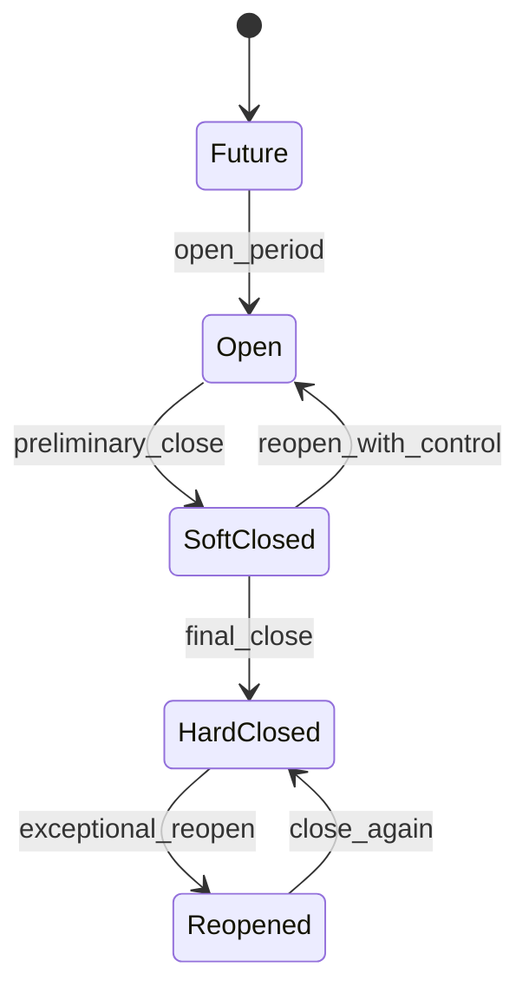

Makna status:

| Status | Arti |
|---|---|
| Future | Period belum dibuka. |
| Open | Posting normal boleh. |
| SoftClosed | Posting dibatasi, adjustment mungkin boleh. |
| HardClosed | Posting normal ditolak. |
| Reopened | Exceptional, harus punya approval dan reason. |

### 6.3 Accounting date vs document date vs posting date

Tiga tanggal ini sering membuat bug.

| Date | Arti | Contoh |
|---|---|---|
| Document date | Tanggal dokumen bisnis. | Tanggal invoice vendor. |
| Accounting date | Tanggal efek finansial. | Tanggal journal masuk period. |
| Posting date | Tanggal sistem memproses posting. | Waktu user klik post. |

Invariant:

```text
fiscal period ditentukan dari accounting_date, bukan dari waktu server.
```

Kesalahan umum:

```java
LocalDate accountingDate = LocalDate.now();
```

Ini buruk karena cut-off accounting harus eksplisit.

## 7. Journal Document Model

Journal harus memuat header, line, source reference, status, audit, dan control metadata.

### 7.1 Header

Contoh schema konseptual:

```sql
CREATE TABLE gl_journal_header (
    id UUID PRIMARY KEY,
    journal_number VARCHAR(64) NOT NULL UNIQUE,
    legal_entity_id UUID NOT NULL,
    ledger_id UUID NOT NULL,
    fiscal_period_id UUID NOT NULL,
    accounting_date DATE NOT NULL,
    posting_date TIMESTAMPTZ,
    source_type VARCHAR(64) NOT NULL,
    source_id VARCHAR(128) NOT NULL,
    source_version BIGINT,
    journal_type VARCHAR(32) NOT NULL,
    status VARCHAR(32) NOT NULL,
    currency_code CHAR(3) NOT NULL,
    total_debit NUMERIC(19, 4) NOT NULL,
    total_credit NUMERIC(19, 4) NOT NULL,
    reversal_of_journal_id UUID,
    reversed_by_journal_id UUID,
    idempotency_key VARCHAR(128) NOT NULL,
    accounting_rule_version VARCHAR(64) NOT NULL,
    created_by UUID NOT NULL,
    created_at TIMESTAMPTZ NOT NULL,
    posted_by UUID,
    posted_at TIMESTAMPTZ,
    reason TEXT,
    CONSTRAINT uq_gl_journal_idempotency UNIQUE (legal_entity_id, source_type, source_id, idempotency_key)
);
```

### 7.2 Lines

```sql
CREATE TABLE gl_journal_line (
    id UUID PRIMARY KEY,
    journal_id UUID NOT NULL REFERENCES gl_journal_header(id),
    line_number INT NOT NULL,
    account_id UUID NOT NULL,
    debit_amount NUMERIC(19, 4) NOT NULL DEFAULT 0,
    credit_amount NUMERIC(19, 4) NOT NULL DEFAULT 0,
    transaction_currency CHAR(3),
    transaction_amount NUMERIC(19, 4),
    accounting_currency CHAR(3) NOT NULL,
    accounting_amount NUMERIC(19, 4) NOT NULL,
    exchange_rate NUMERIC(19, 10),
    dimension_set_id UUID NOT NULL,
    source_line_id VARCHAR(128),
    memo TEXT,
    CONSTRAINT uq_gl_journal_line_no UNIQUE (journal_id, line_number),
    CONSTRAINT ck_debit_credit_non_negative CHECK (debit_amount >= 0 AND credit_amount >= 0),
    CONSTRAINT ck_one_side_only CHECK (
        (debit_amount > 0 AND credit_amount = 0)
        OR (debit_amount = 0 AND credit_amount > 0)
    )
);
```

Line design rules:

- satu line tidak boleh debit dan credit sekaligus;
- amount tidak boleh negatif;
- reversal memakai side berlawanan, bukan negative amount;
- dimension wajib lengkap sebelum posting;
- source line reference harus ada untuk subledger-generated journal;
- line number stabil untuk audit.

### 7.3 Status journal

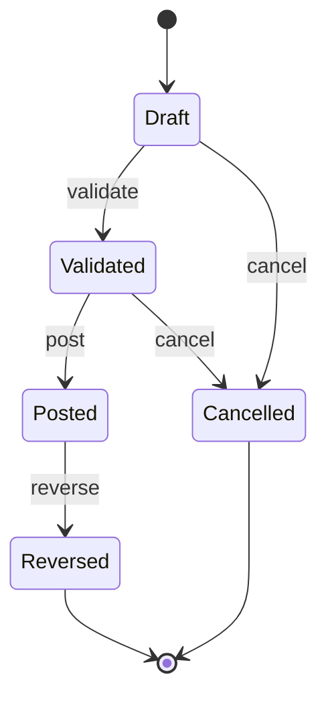

Rule:

| Status | Mutability |
|---|---|
| Draft | Bisa diedit dengan audit. |
| Validated | Tidak boleh ubah line tanpa revalidate. |
| Posted | Immutable. |
| Reversed | Original tetap immutable, ada reversal link. |
| Cancelled | Tidak berdampak finansial. |

## 8. Accounting Dimensions

Account saja tidak cukup. ERP besar butuh dimension.

Contoh dimensions:

- legal entity;
- branch;
- cost center;
- profit center;
- department;
- project;
- product line;
- customer segment;
- vendor;
- asset;
- contract;
- tax jurisdiction;
- intercompany partner.

### 8.1 Dimension set

Daripada menaruh 20 kolom nullable di journal line, banyak ERP memakai `dimension_set`.

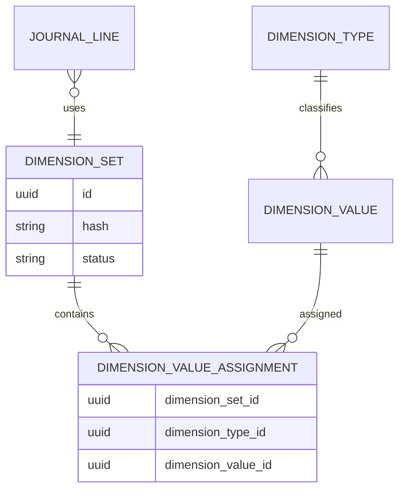

Dimension set bisa di-hash agar kombinasi yang sama reuse:

```java
public record DimensionSet(Map<DimensionType, DimensionValue> values) {
    public String stableHash() {
        return values.entrySet().stream()
                .sorted(Map.Entry.comparingByKey())
                .map(e -> e.getKey().code() + "=" + e.getValue().code())
                .collect(Collectors.joining("|"));
    }

    public void assertContains(Set<DimensionType> required) {
        Set<DimensionType> missing = new HashSet<>(required);
        missing.removeAll(values.keySet());
        if (!missing.isEmpty()) {
            throw new DomainRuleViolation("Missing required dimensions: " + missing);
        }
    }
}
```

### 8.2 Required dimension by account

Contoh rule:

| Account | Required dimension |
|---|---|
| Travel Expense | Cost center, employee, project optional. |
| Inventory | Warehouse, item group. |
| Accounts Receivable | Customer, legal entity. |
| Intercompany Receivable | Intercompany partner. |
| Revenue | Product line, customer segment, tax region. |

Invariant:

```text
journal tidak bisa posted jika line dimension tidak memenuhi required_dimensions account.
```

## 9. Ledger, Book, dan Reporting Basis

Di enterprise besar, satu transaksi bisa perlu beberapa accounting views.

Contoh:

- local statutory ledger;
- group reporting ledger;
- tax ledger;
- management ledger;
- IFRS book;
- local GAAP book.

Model:

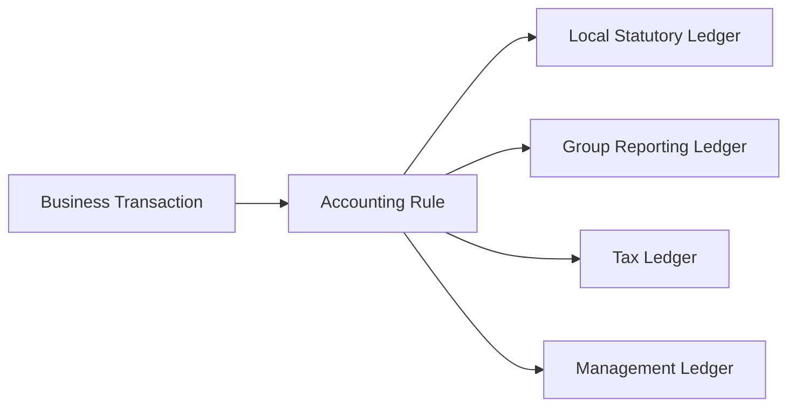

Jangan hardcode “satu ledger saja” kalau ERP dipakai multi-country.

Field tambahan:

| Field | Tujuan |
|---|---|
| ledgerId | Ledger target. |
| bookId | Accounting book/rule basis. |
| accountingStandard | IFRS/local GAAP/management. |
| consolidationScope | Local/group. |
| reportingCurrency | Currency untuk reporting. |

Rule:

```text
journal balance harus dijaga per ledger, per legal entity, per accounting currency.
```

## 10. Posting Engine: Dari Proposal ke Posted Journal

Posting engine idealnya tidak langsung menulis journal posted tanpa tahap validasi.

Pipeline:

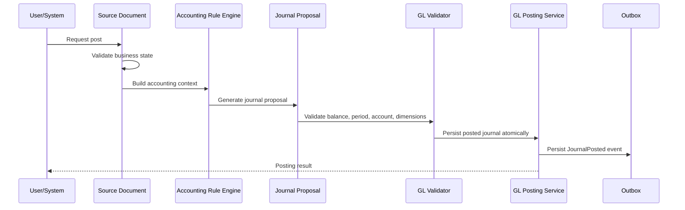

### 10.1 Journal proposal

Journal proposal adalah intermediate object yang belum posted.

```java
public record JournalProposal(
        UUID legalEntityId,
        UUID ledgerId,
        String sourceType,
        String sourceId,
        LocalDate accountingDate,
        JournalType journalType,
        String accountingRuleVersion,
        List<JournalLineProposal> lines,
        String idempotencyKey
) {
    public Money totalDebit() {
        return lines.stream()
                .map(JournalLineProposal::debit)
                .reduce(Money.zero(accountingCurrency()), Money::plus);
    }

    public Money totalCredit() {
        return lines.stream()
                .map(JournalLineProposal::credit)
                .reduce(Money.zero(accountingCurrency()), Money::plus);
    }

    public CurrencyUnit accountingCurrency() {
        return lines.getFirst().accountingCurrency();
    }
}
```

### 10.2 Validator

```java
public final class JournalValidator {

    private final AccountRepository accountRepository;
    private final FiscalPeriodService fiscalPeriodService;
    private final DimensionPolicy dimensionPolicy;

    public void validate(JournalProposal proposal) {
        assertHasAtLeastTwoLines(proposal);
        assertBalanced(proposal);
        assertSingleLegalEntity(proposal);
        assertOpenPeriod(proposal);
        assertAccountsPostable(proposal);
        assertDimensionsComplete(proposal);
        assertNoZeroLines(proposal);
    }

    private void assertBalanced(JournalProposal proposal) {
        if (!proposal.totalDebit().equals(proposal.totalCredit())) {
            throw new DomainRuleViolation("Journal is not balanced: debit="
                    + proposal.totalDebit() + ", credit=" + proposal.totalCredit());
        }
    }

    private void assertOpenPeriod(JournalProposal proposal) {
        FiscalPeriod period = fiscalPeriodService.periodFor(
                proposal.legalEntityId(), proposal.accountingDate());
        period.assertOpenForPosting();
    }

    private void assertAccountsPostable(JournalProposal proposal) {
        for (JournalLineProposal line : proposal.lines()) {
            GlAccount account = accountRepository.get(line.accountId());
            account.assertPostable(proposal.accountingDate());
        }
    }

    private void assertDimensionsComplete(JournalProposal proposal) {
        for (JournalLineProposal line : proposal.lines()) {
            GlAccount account = accountRepository.get(line.accountId());
            dimensionPolicy.assertAllowedAndComplete(account, line.dimensionSet());
        }
    }
}
```

### 10.3 Posting service

```java
@Service
public class GlPostingService {

    private final JournalValidator validator;
    private final JournalRepository journalRepository;
    private final FiscalPeriodService fiscalPeriodService;
    private final JournalNumberService journalNumberService;
    private final OutboxRepository outboxRepository;

    @Transactional
    public PostedJournal post(JournalProposal proposal, Actor actor) {
        validator.validate(proposal);

        Optional<PostedJournal> existing = journalRepository.findByIdempotencyKey(
                proposal.legalEntityId(),
                proposal.sourceType(),
                proposal.sourceId(),
                proposal.idempotencyKey());

        if (existing.isPresent()) {
            return existing.get();
        }

        FiscalPeriod period = fiscalPeriodService.lockOpenPeriod(
                proposal.legalEntityId(), proposal.accountingDate());

        String journalNumber = journalNumberService.nextNumber(
                proposal.legalEntityId(), period.id(), JournalNumberType.GL_JOURNAL);

        PostedJournal journal = PostedJournal.fromProposal(
                proposal, journalNumber, period.id(), actor, Instant.now());

        journalRepository.save(journal);
        outboxRepository.save(OutboxEvent.journalPosted(journal));

        return journal;
    }
}
```

Catatan penting:

- idempotency check harus ada sebelum membuat journal baru;
- period sebaiknya dilock atau divalidasi ulang saat commit;
- numbering harus atomic;
- journal dan outbox harus commit dalam transaksi database yang sama;
- event external tidak dikirim langsung di dalam transaksi.

## 11. Accounting Rules

Posting engine perlu rule. Rule bisa simple mapping atau kompleks.

Contoh invoice vendor:

```text
Dr Expense / Inventory / Asset
Dr Input Tax
Cr Accounts Payable
```

Contoh customer invoice:

```text
Dr Accounts Receivable
Cr Revenue
Cr Output Tax
```

Contoh goods receipt dengan accrual:

```text
Dr Inventory
Cr Goods Received Not Invoiced / Accrued Liability
```

### 11.1 Rule model

```java
public interface AccountingRule<T extends AccountingSource> {
    boolean supports(T source, AccountingContext context);
    JournalProposal generate(T source, AccountingContext context);
    String version();
}
```

Contoh rule:

```java
public final class VendorInvoicePostingRule implements AccountingRule<VendorInvoice> {

    @Override
    public JournalProposal generate(VendorInvoice invoice, AccountingContext context) {
        JournalProposalBuilder builder = JournalProposalBuilder.forSource(
                "VENDOR_INVOICE",
                invoice.id().toString(),
                invoice.legalEntityId(),
                context.ledgerId(),
                invoice.accountingDate(),
                version());

        for (VendorInvoiceLine line : invoice.lines()) {
            builder.debit(
                    context.accountResolver().expenseOrInventoryAccount(line),
                    line.netAmountInAccountingCurrency(),
                    context.dimensionResolver().forInvoiceLine(line));
        }

        if (invoice.taxAmount().isPositive()) {
            builder.debit(
                    context.accountResolver().inputTaxAccount(invoice.taxCode()),
                    invoice.taxAmountInAccountingCurrency(),
                    context.dimensionResolver().forTax(invoice));
        }

        builder.credit(
                context.accountResolver().accountsPayableAccount(invoice.vendorId()),
                invoice.grossAmountInAccountingCurrency(),
                context.dimensionResolver().forVendor(invoice.vendorId()));

        return builder.build(invoice.postingIdempotencyKey());
    }

    @Override
    public boolean supports(VendorInvoice source, AccountingContext context) {
        return source.status() == VendorInvoiceStatus.APPROVED;
    }

    @Override
    public String version() {
        return "vendor-invoice-posting/v3";
    }
}
```

### 11.2 Rule versioning

Rule harus versioned.

Kenapa?

- accounting policy bisa berubah;
- tax treatment bisa berubah;
- master data mapping bisa dikoreksi;
- report lama harus bisa dijelaskan;
- audit perlu tahu rule yang dipakai saat posting.

Journal harus menyimpan `accounting_rule_version`.

Desain buruk:

```text
Journal hanya menyimpan hasil akhir tanpa rule version.
```

Akibat:

- sulit menjelaskan kenapa invoice lama diposting ke account X;
- setelah mapping berubah, replay menghasilkan hasil beda;
- audit trail tidak lengkap.

## 12. Posting Idempotency

Posting adalah operasi yang sering di-retry:

- user double-click;
- network timeout;
- worker restart;
- message redelivery;
- scheduler retry;
- integration duplicate.

Invariant:

```text
source document yang sama tidak boleh menghasilkan duplicate financial effect.
```

Key design:

```text
unique(legal_entity_id, source_type, source_id, posting_intent)
```

Contoh:

```java
public record PostingIntent(
        String sourceType,
        String sourceId,
        String action,
        long sourceVersion
) {
    public String idempotencyKey() {
        return sourceType + ":" + sourceId + ":" + action + ":v" + sourceVersion;
    }
}
```

Untuk reversal, intent berbeda:

```text
VENDOR_INVOICE:INV-1001:POST:v7
VENDOR_INVOICE:INV-1001:REVERSE:v8
```

## 13. Balance Engine

Journal line adalah source of truth. Balance adalah derived state.

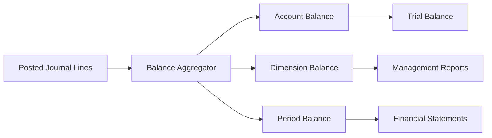

### 13.1 Balance grain

Balance harus punya grain eksplisit.

Contoh grain:

```text
legal_entity_id
ledger_id
fiscal_period_id
account_id
accounting_currency
dimension_set_id optional
```

Schema:

```sql
CREATE TABLE gl_account_balance (
    legal_entity_id UUID NOT NULL,
    ledger_id UUID NOT NULL,
    fiscal_period_id UUID NOT NULL,
    account_id UUID NOT NULL,
    accounting_currency CHAR(3) NOT NULL,
    dimension_set_id UUID,
    debit_movement NUMERIC(19, 4) NOT NULL,
    credit_movement NUMERIC(19, 4) NOT NULL,
    ending_balance NUMERIC(19, 4) NOT NULL,
    updated_at TIMESTAMPTZ NOT NULL,
    PRIMARY KEY (
        legal_entity_id,
        ledger_id,
        fiscal_period_id,
        account_id,
        accounting_currency,
        dimension_set_id
    )
);
```

### 13.2 Incremental vs rebuild

Ada dua pendekatan:

| Approach | Kelebihan | Risiko |
|---|---|---|
| Incremental update saat posting | Cepat untuk report. | Bug bisa membuat balance drift. |
| Rebuild dari journal lines | Akurat dan audit-friendly. | Mahal untuk volume besar. |

ERP besar sering memakai kombinasi:

- incremental balance untuk operasi harian;
- nightly reconciliation rebuild;
- period close verification;
- repair tool dengan audit log.

### 13.3 Balance sign

Jangan kacau antara debit/credit dan signed balance.

Normal balance:

| Account type | Normal balance |
|---|---|
| Asset | Debit |
| Expense | Debit |
| Liability | Credit |
| Equity | Credit |
| Revenue | Credit |

Representasi bisa dua model:

1. simpan debit dan credit movement terpisah;
2. simpan signed balance berdasarkan normal balance.

Untuk audit, debit/credit terpisah lebih eksplisit. Untuk analytics, signed balance lebih mudah. Jangan mencampur tanpa definisi.

## 14. Trial Balance

Trial balance adalah salah satu report paling dasar dan paling penting.

Formula:

```text
sum(debit movements) == sum(credit movements)
```

Trial balance harus bisa difilter oleh:

- legal entity;
- ledger;
- fiscal year;
- period range;
- accounting currency;
- reporting currency;
- dimension;
- posted/adjustment journals;
- consolidation scope.

Contoh service:

```java
public interface TrialBalanceQueryService {
    TrialBalance getTrialBalance(TrialBalanceCriteria criteria);
}

public record TrialBalanceCriteria(
        UUID legalEntityId,
        UUID ledgerId,
        PeriodRange periodRange,
        CurrencyUnit currency,
        Optional<DimensionFilter> dimensionFilter,
        boolean includeAdjustmentPeriod
) {}
```

Invariant report:

```text
trial balance yang mencakup semua posted journal dalam ledger harus balance.
```

Jika tidak balance, itu incident finansial.

## 15. Reversal dan Adjustment

### 15.1 Reversal

Reversal membalik journal original.

Original:

```text
Dr Expense 100
Cr AP      100
```

Reversal:

```text
Dr AP      100
Cr Expense 100
```

Jangan gunakan negative debit/credit.

```java
public PostedJournal reverse(UUID journalId, ReversalRequest request, Actor actor) {
    PostedJournal original = journalRepository.getPosted(journalId);
    original.assertReversible();

    FiscalPeriod reversalPeriod = fiscalPeriodService.periodFor(
            original.legalEntityId(), request.reversalAccountingDate());
    reversalPeriod.assertOpenForPosting();

    JournalProposal reversal = JournalProposalBuilder.reversalOf(original)
            .accountingDate(request.reversalAccountingDate())
            .reason(request.reason())
            .idempotencyKey("REVERSAL:" + original.id())
            .build();

    PostedJournal postedReversal = post(reversal, actor);
    journalRepository.linkReversal(original.id(), postedReversal.id());
    return postedReversal;
}
```

### 15.2 Reversal date

Reversal bisa terjadi:

- di period yang sama;
- di period berikutnya;
- di adjustment period;
- di reopened period dengan approval khusus.

Rule harus eksplisit.

### 15.3 Adjustment

Adjustment bukan reversal. Adjustment menambah jurnal koreksi.

Contoh:

- accrual adjustment;
- reclassification;
- tax adjustment;
- rounding adjustment;
- FX revaluation;
- inventory valuation adjustment.

Adjustment harus punya reason code dan approval level.

## 16. Period Close

Period close adalah proses kontrol, bukan tombol.

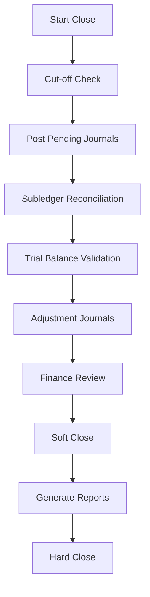

Close checklist:

- semua posting queue kosong atau explained;
- semua failed posting resolved;
- subledger AP/AR/Inventory cocok dengan GL control account;
- trial balance balance;
- required recurring journals posted;
- FX revaluation posted;
- depreciation posted;
- accruals reviewed;
- suspense account reviewed;
- period lock applied;
- close evidence archived.

### 16.1 Close as state machine

```java
public enum PeriodStatus {
    FUTURE,
    OPEN,
    SOFT_CLOSED,
    HARD_CLOSED,
    REOPENED
}
```

Transition harus controlled:

```java
public void hardClose(FiscalPeriod period, Actor actor, CloseEvidence evidence) {
    requireRole(actor, FinanceRole.PERIOD_CLOSE_MANAGER);
    period.assertStatus(PeriodStatus.SOFT_CLOSED);
    evidence.assertComplete();
    reconciliationService.assertAllControlAccountsReconciled(period.id());
    trialBalanceService.assertBalanced(period.id());
    period.markHardClosed(actor.id(), Instant.now());
}
```

## 17. Source-to-GL Traceability

Setiap journal harus traceable.

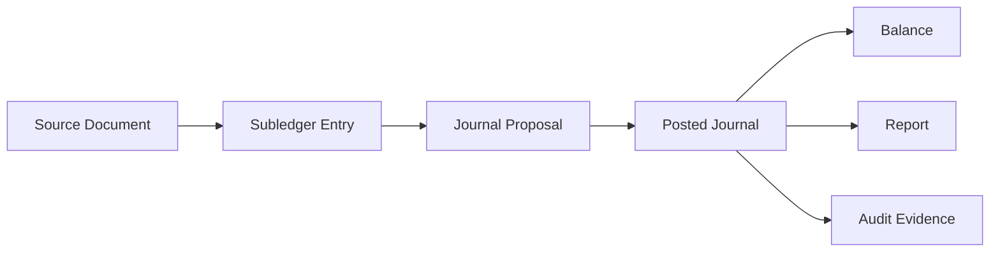

Traceability fields:

| Field | Tujuan |
|---|---|
| sourceType | Jenis source: vendor invoice, sales invoice, receipt. |
| sourceId | ID source. |
| sourceNumber | Nomor bisnis. |
| sourceVersion | Version saat diposting. |
| sourceLineId | Mapping line source ke line journal. |
| postingRequestId | Request yang memicu posting. |
| ruleVersion | Rule accounting. |
| actorId | Siapa yang memicu. |
| approvalEvidenceId | Bukti approval jika relevan. |

Debug query yang harus mudah:

```sql
SELECT h.journal_number,
       h.status,
       h.accounting_date,
       l.line_number,
       a.account_code,
       l.debit_amount,
       l.credit_amount,
       l.source_line_id
FROM gl_journal_header h
JOIN gl_journal_line l ON l.journal_id = h.id
JOIN gl_account a ON a.id = l.account_id
WHERE h.source_type = 'VENDOR_INVOICE'
  AND h.source_id = :invoice_id
ORDER BY l.line_number;
```

## 18. Audit Evidence

Audit bukan log setelah kejadian. Audit harus menjadi bagian dari model.

Evidence minimum:

- source document snapshot;
- approval state saat posting;
- accounting rule version;
- actor;
- timestamp;
- period;
- generated journal lines;
- validation result;
- reversal/adjustment relationship;
- reason code;
- system correlation id;
- immutable event trail.

Contoh audit event:

```json
{
  "eventType": "GL_JOURNAL_POSTED",
  "journalId": "8b276d7e-0a44-4ac7-9c3a-47e41f40a01d",
  "journalNumber": "GL-2026-06-000123",
  "sourceType": "VENDOR_INVOICE",
  "sourceId": "INV-88421",
  "legalEntityId": "LE-ID",
  "fiscalPeriod": "2026-06",
  "accountingRuleVersion": "vendor-invoice-posting/v3",
  "actorId": "USER-ID",
  "postedAt": "2026-06-30T09:15:20Z",
  "totalDebit": "1250000.00",
  "totalCredit": "1250000.00"
}
```

## 19. Failure Modes dalam GL Engine

### 19.1 Duplicate posting

Gejala:

- invoice yang sama muncul dua kali di AP control account;
- payment proposal menggandakan payable;
- trial balance tetap balance tetapi financial statement salah.

Pencegahan:

- unique idempotency key;
- source status transition atomic;
- posting request table;
- reconciliation report duplicate source;
- retry-safe command handler.

### 19.2 Unbalanced journal

Gejala:

- trial balance tidak balance;
- posting worker menghasilkan partial lines;
- rounding tidak ditangani.

Pencegahan:

- database transaction atomic;
- journal validator;
- decimal precision policy;
- rounding line account;
- DB check constraint;
- pre-commit validation.

### 19.3 Posting into closed period

Gejala:

- report final berubah;
- audit menemukan backdated transaction;
- finance kehilangan trust.

Pencegahan:

- period lock;
- status check di posting service;
- exceptional reopen workflow;
- hard close permission;
- audit on period status change.

### 19.4 Lost journal event

Gejala:

- journal posted tetapi downstream report/integration tidak menerima event;
- reconciliation mismatch antara GL dan reporting store.

Pencegahan:

- transactional outbox;
- event relay retry;
- outbox monitoring;
- consumer idempotency;
- reconciliation query.

### 19.5 Balance drift

Gejala:

- account balance table tidak cocok dengan journal line sum;
- report cepat beda dengan report rebuild.

Pencegahan:

- periodic rebuild;
- balance checksum;
- append-only journal;
- repair job with evidence;
- never manually edit balance.

## 20. Performance Engineering untuk GL

GL workload khas:

- posting single document low latency;
- posting batch ribuan invoice;
- period close heavy aggregation;
- report trial balance besar;
- reconciliation AP/AR/Inventory;
- audit query by source;
- export finansial.

### 20.1 Indexing

Index umum:

```sql
CREATE INDEX idx_gl_journal_period
ON gl_journal_header (legal_entity_id, ledger_id, fiscal_period_id, status);

CREATE INDEX idx_gl_journal_source
ON gl_journal_header (source_type, source_id);

CREATE INDEX idx_gl_journal_accounting_date
ON gl_journal_header (legal_entity_id, ledger_id, accounting_date);

CREATE INDEX idx_gl_line_account_period
ON gl_journal_line (account_id, journal_id);
```

Untuk report, biasanya perlu join header-line. Volume besar bisa butuh:

- partition by fiscal year/period;
- covering index;
- materialized view;
- columnar analytics store;
- read replica;
- precomputed balances.

### 20.2 Partitioning

Partition candidates:

- accounting date;
- fiscal year;
- legal entity;
- ledger;
- tenant.

Jangan partition tanpa query pattern. Partition yang salah membuat query lebih buruk.

### 20.3 Batch posting

Batch posting harus memperhatikan:

- chunk size;
- idempotency per source;
- partial failure handling;
- retry strategy;
- lock contention pada period dan numbering;
- observability per batch item;
- reconciliation setelah batch.

Pattern:

```text
batch request
  -> expand into posting commands
  -> process chunk
  -> each source has idempotent result
  -> aggregate batch summary
  -> failed items are retryable individually
```

## 21. Java Implementation Boundaries

### 21.1 Domain layer

Domain layer menjaga invariant:

- journal balance;
- account postability;
- period rule;
- reversal rule;
- dimension requirement.

### 21.2 Application service

Application service mengorkestrasi:

- load source;
- call accounting rule;
- validate proposal;
- persist journal;
- write outbox;
- update source status;
- return result.

### 21.3 Repository

Repository harus punya operasi eksplisit:

```java
public interface JournalRepository {
    Optional<PostedJournal> findByIdempotencyKey(
            UUID legalEntityId,
            String sourceType,
            String sourceId,
            String idempotencyKey);

    void save(PostedJournal journal);

    PostedJournal getPosted(UUID journalId);

    void linkReversal(UUID originalJournalId, UUID reversalJournalId);
}
```

Jangan expose generic `save(anything)` untuk seluruh lifecycle kalau domain rule penting.

## 22. Testing Strategy untuk GL

### 22.1 Invariant tests

```java
@Test
void postedJournalMustBeBalanced() {
    JournalProposal proposal = proposalBuilder()
            .debit("6000", money("100.00"))
            .credit("2100", money("99.99"))
            .build();

    assertThrows(DomainRuleViolation.class, () -> validator.validate(proposal));
}
```

### 22.2 Golden accounting tests

Buat dataset emas:

| Scenario | Expected Dr | Expected Cr |
|---|---|---|
| Vendor invoice expense | Expense, Input Tax | AP |
| Vendor invoice inventory | Inventory, Input Tax | AP |
| Customer invoice | AR | Revenue, Output Tax |
| Payment vendor | AP | Cash |
| Goods receipt | Inventory | GRNI |
| Reversal | Opposite of original | Opposite of original |

Golden tests harus mendeteksi perubahan rule tak disengaja.

### 22.3 Property tests

Property:

```text
untuk semua journal proposal yang valid, total debit = total credit.
```

```text
untuk semua reversal dari journal posted, original + reversal menghasilkan net zero.
```

```text
untuk semua source idempotency key yang sama, posting diulang menghasilkan journal yang sama atau no-op.
```

### 22.4 Concurrency tests

Test kasus:

- dua worker posting invoice sama;
- dua user reverse journal sama;
- period closed saat posting berjalan;
- numbering concurrent;
- batch retry setelah partial failure.

## 23. Mermaid: GL Posting State and Control

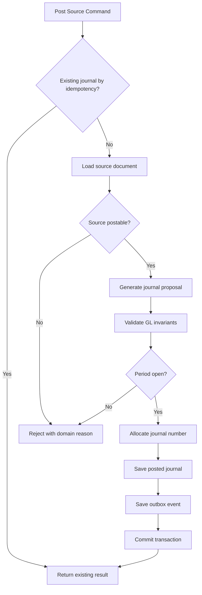

## 24. Design Review Checklist

Gunakan checklist ini saat review GL engine.

### Accounting correctness

- Apakah setiap journal harus balance sebelum posted?
- Apakah debit/credit disimpan eksplisit, bukan signed amount ambigu?
- Apakah multi-currency menyimpan transaction amount, accounting amount, rate, dan rate date?
- Apakah account postability divalidasi?
- Apakah required dimensions enforced?
- Apakah posting ke closed period ditolak?

### Auditability

- Apakah journal posted immutable?
- Apakah reversal tidak menghapus original?
- Apakah source document traceable dari journal?
- Apakah accounting rule version disimpan?
- Apakah actor dan approval evidence tersimpan?
- Apakah period reopen punya audit trail?

### Idempotency and failure

- Apakah posting duplicate dicegah oleh unique key?
- Apakah journal dan outbox commit atomically?
- Apakah retry menghasilkan same result/no-op?
- Apakah failed batch bisa retry per item?
- Apakah balance drift bisa dideteksi?

### Operability

- Apakah ada report failed posting?
- Apakah ada reconciliation subledger vs GL?
- Apakah ada rebuild balance tool?
- Apakah ada audit query by source?
- Apakah period close punya dashboard?

## 25. 20-Hour Practice Slice

Untuk melatih part ini secara efisien, buat mini GL engine.

### Hour 1-3: Model

Buat:

- `GlAccount`;
- `FiscalPeriod`;
- `JournalHeader`;
- `JournalLine`;
- `DimensionSet`.

Invariant wajib:

- account postable;
- period open;
- journal balance;
- one-sided line;
- no negative amount.

### Hour 4-6: Posting rule

Implementasikan:

- vendor invoice posting;
- customer invoice posting;
- goods receipt posting.

### Hour 7-9: Idempotency

Implementasikan:

- posting idempotency key;
- duplicate command returns existing journal;
- retry test.

### Hour 10-12: Reversal

Implementasikan:

- reversal journal;
- reversal relationship;
- no double reversal.

### Hour 13-15: Balance projection

Implementasikan:

- account balance aggregation;
- trial balance query;
- rebuild from journal lines.

### Hour 16-18: Close control

Implementasikan:

- period close;
- reject posting into hard-closed period;
- exceptional reopen audit.

### Hour 19-20: Failure simulation

Simulasikan:

- duplicate posting;
- unbalanced proposal;
- closed period posting;
- balance drift;
- lost outbox relay.

## 26. Summary Mental Model

General Ledger engine yang baik punya karakter berikut:

1. **Journal posted adalah immutable financial fact.**
2. **Double-entry invariant tidak boleh dinegosiasikan.**
3. **Posting adalah command idempotent, bukan insert biasa.**
4. **Accounting rules harus deterministic dan versioned.**
5. **Fiscal period adalah control boundary.**
6. **Balance adalah projection, journal line adalah truth.**
7. **Correction dilakukan lewat reversal/adjustment, bukan edit diam-diam.**
8. **Audit evidence harus built-in, bukan log tambahan.**
9. **Subledger dan GL harus bisa direkonsiliasi.**
10. **ERP finansial yang tidak defensible akan gagal saat audit, incident, migrasi, dan close.**

## 27. Source Notes

- IFRS Foundation Conceptual Framework digunakan sebagai rujukan konsep umum financial reporting dan kebutuhan informasi finansial yang useful bagi pengguna laporan.
- Jakarta Transactions digunakan sebagai rujukan bahwa transaction manager dan resource/application boundaries adalah concern eksplisit di enterprise Java.
- Jakarta Persistence digunakan sebagai baseline standard persistence dan object-relational mapping untuk Java enterprise.
- PostgreSQL transaction isolation documentation digunakan sebagai rujukan praktis bahwa isolation level dan concurrency semantics mempengaruhi correctness pada posting, numbering, dan balance update.

## 28. Seri Status

Part ini adalah **Part 009 dari 034**.

Seri belum selesai. Lanjut ke:

- Part 010 — Subledger Architecture and Financial Posting Pipeline
- Part 011 — Procure-to-Pay Domain
