# Part 010 — Subledger Architecture and Financial Posting Pipeline

## 1. Target Skill Part Ini

Part sebelumnya membahas General Ledger sebagai system of financial truth. Part ini membahas lapisan yang menghubungkan transaksi operasional dengan GL:

> **Bagaimana mendesain subledger dan financial posting pipeline agar AP, AR, inventory, asset, project, dan payment domain bisa menghasilkan efek finansial yang benar, traceable, retry-safe, dan reconcilable?**

Subledger adalah tempat domain finansial detail berada sebelum atau di sekitar GL.

Contoh:

- Accounts Payable subledger menyimpan vendor invoice, payable schedule, payment status, withholding, settlement;
- Accounts Receivable subledger menyimpan customer invoice, receipt allocation, credit memo, aging;
- Inventory subledger menyimpan stock movement, valuation layer, cost adjustment;
- Fixed Asset subledger menyimpan acquisition, depreciation, impairment, disposal;
- Project subledger menyimpan cost collection, revenue recognition boundary, WIP;
- Bank/payment subledger menyimpan payment instruction, bank statement, reconciliation.

Mental model:

> **GL menjawab “apa efek finansial finalnya?”, sedangkan subledger menjawab “dari transaksi bisnis mana efek itu berasal dan bagaimana detailnya diselesaikan?”**

Tanpa subledger, GL akan terlalu penuh detail domain. Tanpa GL, subledger tidak punya konsolidasi finansial. Keduanya harus punya kontrak yang tegas.

## 2. Mengapa Subledger Dibutuhkan

Bayangkan vendor invoice:

```text
Vendor Invoice INV-1001
Vendor: PT Supplier A
Gross: 11.100.000
Net: 10.000.000
VAT: 1.100.000
Due date: 2026-07-30
Payment terms: Net 30
Cost center: OPS-JKT
PO: PO-7788
Receipt: GR-9911
```

GL journal mungkin hanya:

```text
Dr Expense / Inventory        10.000.000
Dr Input VAT                   1.100.000
Cr Accounts Payable           11.100.000
```

GL tidak boleh menjadi tempat utama untuk menyimpan seluruh detail matching PO/receipt/invoice, due date, payment term, dispute, vendor settlement, aging bucket. Itu domain AP subledger.

Subledger menyediakan:

- detail transaksi domain;
- lifecycle domain;
- open item management;
- settlement/allocation;
- aging;
- reconciliation dengan control account GL;
- source evidence;
- operational query;
- adjustment before/after posting;
- audit bridge ke GL.

## 3. Relasi Source Document, Subledger, dan GL

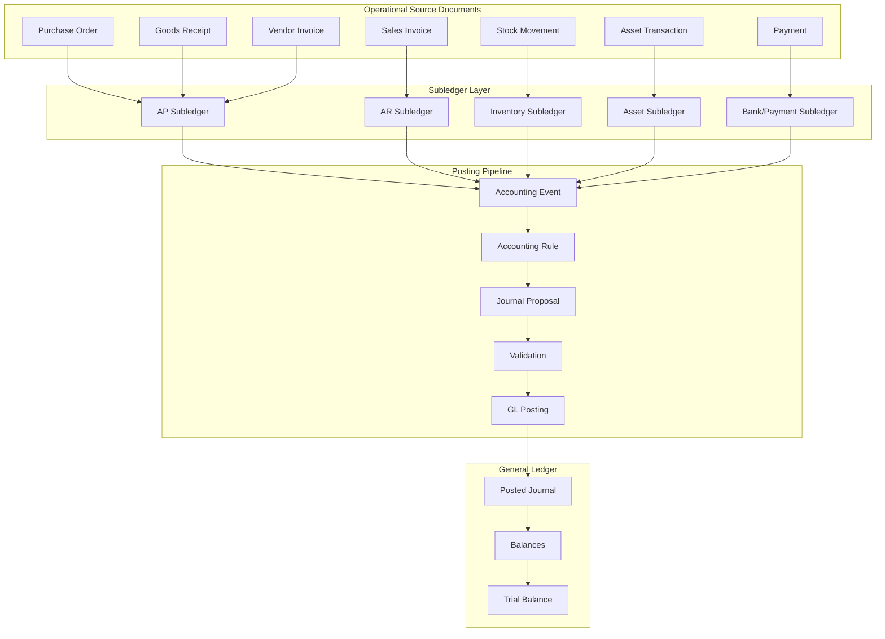

Key insight:

- source document bukan selalu financial event;
- subledger entry bukan selalu posted journal;
- accounting event adalah niat finansial yang siap diterjemahkan;
- journal proposal adalah hasil translasi;
- posted journal adalah efek final di GL.

## 4. Subledger sebagai Domain-Specific Financial Truth

Setiap subledger punya invariant sendiri.

| Subledger | Invariant domain | Control account GL |
|---|---|---|
| AP | Open payable = approved unpaid vendor liability. | Accounts Payable. |
| AR | Open receivable = invoiced uncollected customer claim. | Accounts Receivable. |
| Inventory | Stock quantity/value movement traceable dan valuated. | Inventory, COGS, variance. |
| Fixed Asset | Net book value = acquisition - accumulated depreciation - impairment. | Fixed Asset, Accumulated Depreciation. |
| Bank/Payment | Payment instruction, settlement, bank statement reconciled. | Cash/Bank. |
| Project | Cost/revenue recognized sesuai rule. | WIP, Revenue, Expense. |

GL control account tidak boleh diubah manual sembarangan jika nilainya berasal dari subledger.

Invariant reconciliation:

```text
sum(open AP subledger items) == GL Accounts Payable control account balance
```

```text
sum(open AR subledger items) == GL Accounts Receivable control account balance
```

```text
sum(inventory valuation layers) == GL Inventory control account balance
```

Perbedaan harus explainable:

- timing difference;
- pending posting;
- rounding;
- manual adjustment;
- migration opening balance;
- cutoff issue;
- failed posting;
- data corruption.

## 5. Subledger Entry Model

Subledger entry berbeda dari GL journal line. Ia menyimpan detail domain finansial.

Contoh AP subledger:

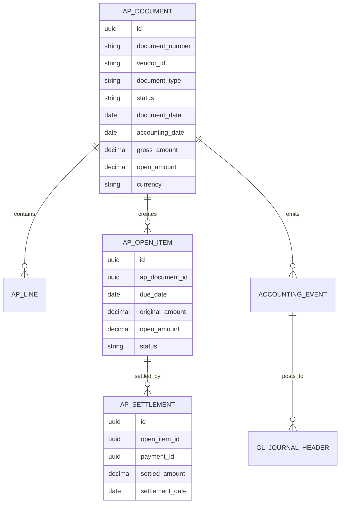

Contoh inventory subledger:

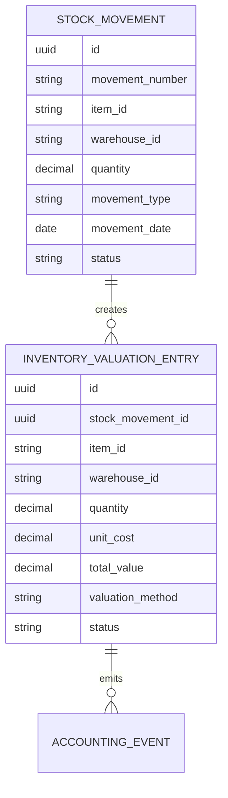

## 6. Accounting Event

Accounting event adalah kontrak dari subledger ke posting pipeline.

Ia tidak harus identik dengan domain event publik. Ia lebih spesifik:

```text
“Transaksi ini sudah memenuhi syarat untuk menghasilkan financial posting.”
```

Contoh event:

- `VendorInvoiceApprovedForPosting`;
- `GoodsReceiptValuated`;
- `CustomerInvoiceIssued`;
- `PaymentSettled`;
- `AssetDepreciationCalculated`;
- `InventoryCostAdjusted`;
- `CreditMemoApplied`.

### 6.1 Accounting event envelope

```java
public record AccountingEvent(
        UUID eventId,
        String eventType,
        String sourceType,
        String sourceId,
        long sourceVersion,
        UUID legalEntityId,
        LocalDate accountingDate,
        CurrencyUnit transactionCurrency,
        CurrencyUnit accountingCurrency,
        String idempotencyKey,
        String accountingRuleSet,
        Instant occurredAt,
        Map<String, Object> payload
) {}
```

Mandatory properties:

| Property | Alasan |
|---|---|
| eventId | Unique event identity. |
| sourceType/sourceId | Traceability. |
| sourceVersion | Deterministic replay and stale event detection. |
| legalEntityId | Accounting boundary. |
| accountingDate | Period determination. |
| currency | Multi-currency handling. |
| idempotencyKey | Duplicate protection. |
| ruleSet/version | Rule selection. |
| payload | Domain-specific facts. |

### 6.2 Event bukan command mentah

Buruk:

```json
{
  "type": "POST_SOMETHING",
  "amount": 100
}
```

Baik:

```json
{
  "type": "VendorInvoiceApprovedForPosting",
  "sourceType": "VENDOR_INVOICE",
  "sourceId": "INV-1001",
  "sourceVersion": 7,
  "legalEntityId": "LE-01",
  "accountingDate": "2026-06-30",
  "idempotencyKey": "VENDOR_INVOICE:INV-1001:POST:v7",
  "payload": {
    "vendorId": "V-9001",
    "netAmount": "10000000.00",
    "taxAmount": "1100000.00",
    "grossAmount": "11100000.00",
    "costCenter": "OPS-JKT",
    "poNumber": "PO-7788"
  }
}
```

## 7. Posting Pipeline Architecture

Posting pipeline mengubah accounting event menjadi posted journal.

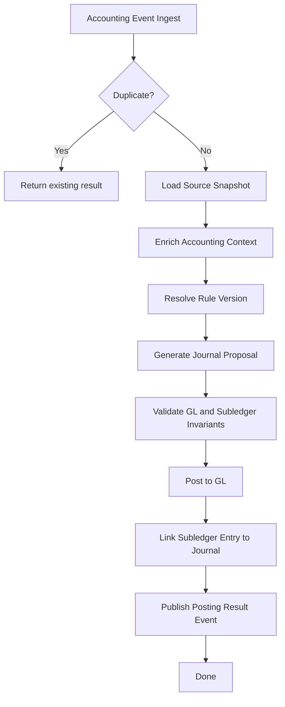

### 7.1 Pipeline stages

| Stage | Responsibility |
|---|---|
| Ingest | Terima accounting event dari subledger. |
| Deduplicate | Cegah duplicate posting. |
| Load source | Ambil source snapshot atau subledger entry. |
| Enrich | Resolve account, dimension, currency, tax, period. |
| Rule | Pilih rule sesuai document type, legal entity, effective date. |
| Propose | Generate journal proposal. |
| Validate | Balance, account, period, dimensions, control. |
| Post | Simpan journal posted atomically. |
| Link | Simpan hubungan subledger ↔ GL. |
| Emit | Kirim result untuk reporting/integration. |

### 7.2 Synchronous vs asynchronous posting

| Mode | Cocok untuk | Risiko |
|---|---|---|
| Synchronous | User perlu hasil langsung; low volume. | Latency tinggi, coupling. |
| Asynchronous | Batch, high volume, integration event. | Eventual consistency, monitoring wajib. |
| Hybrid | UI command membuat posting request, worker memproses. | Complexity lebih tinggi. |

ERP besar biasanya hybrid.

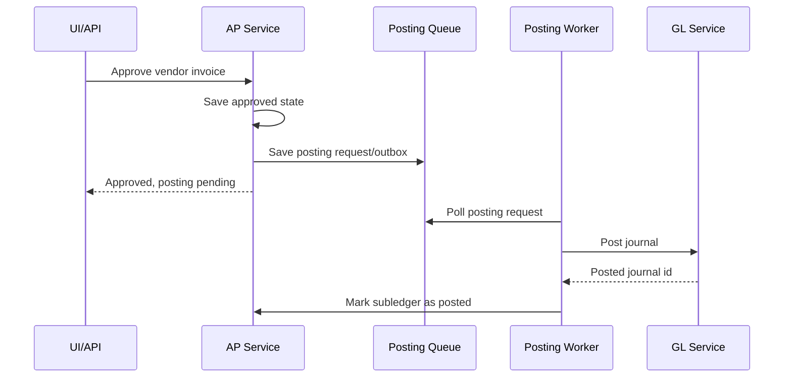

Design decision:

- Kalau financial effect harus langsung visible, synchronous lebih sederhana.
- Kalau volume besar dan workflow panjang, asynchronous lebih scalable.
- Kalau asynchronous, UI harus menampilkan posting status secara eksplisit.

Jangan menyembunyikan pending state.

## 8. Posting Request Table

Untuk pipeline yang reliable, gunakan `posting_request` sebagai command ledger.

```sql
CREATE TABLE financial_posting_request (
    id UUID PRIMARY KEY,
    legal_entity_id UUID NOT NULL,
    source_type VARCHAR(64) NOT NULL,
    source_id VARCHAR(128) NOT NULL,
    source_version BIGINT NOT NULL,
    event_type VARCHAR(128) NOT NULL,
    idempotency_key VARCHAR(160) NOT NULL,
    status VARCHAR(32) NOT NULL,
    attempt_count INT NOT NULL DEFAULT 0,
    next_attempt_at TIMESTAMPTZ,
    last_error_code VARCHAR(128),
    last_error_message TEXT,
    gl_journal_id UUID,
    created_at TIMESTAMPTZ NOT NULL,
    updated_at TIMESTAMPTZ NOT NULL,
    CONSTRAINT uq_fin_posting_request UNIQUE (legal_entity_id, source_type, source_id, idempotency_key)
);
```

Status:

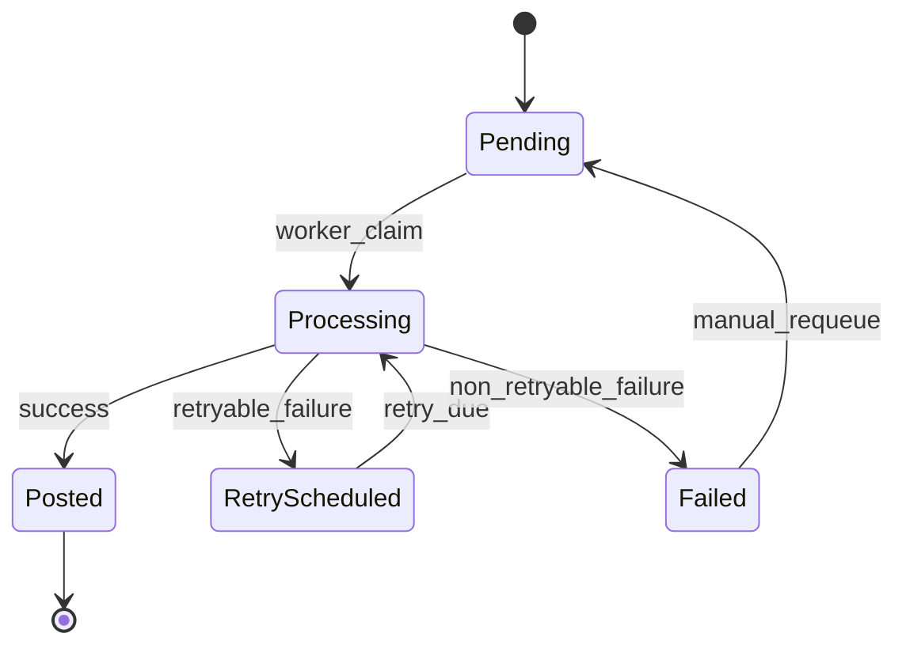

Keuntungan:

- retry observable;
- duplicate prevented;
- failed posting bisa ditangani;
- support team punya dashboard;
- reconciliation bisa menemukan pending financial effect;
- audit bisa melihat kapan source menunggu posting.

## 9. Claiming Work Safely

Worker concurrency harus aman.

Pattern SQL PostgreSQL-style:

```sql
SELECT id
FROM financial_posting_request
WHERE status IN ('PENDING', 'RETRY_SCHEDULED')
  AND (next_attempt_at IS NULL OR next_attempt_at <= now())
ORDER BY created_at
FOR UPDATE SKIP LOCKED
LIMIT 100;
```

Kemudian update ke `PROCESSING` dalam transaksi pendek.

Java sketch:

```java
@Transactional
public List<PostingRequest> claimBatch(int limit, WorkerId workerId) {
    List<PostingRequest> requests = repository.findClaimableForUpdateSkipLocked(limit);
    for (PostingRequest request : requests) {
        request.markProcessing(workerId, clock.instant());
    }
    repository.saveAll(requests);
    return requests;
}
```

Rule:

- claim transaction pendek;
- processing per item isolated;
- failure satu item tidak rollback semua item;
- stuck processing punya timeout/recovery;
- worker id dan attempt dicatat.

## 10. AP Subledger to GL

### 10.1 Vendor invoice lifecycle

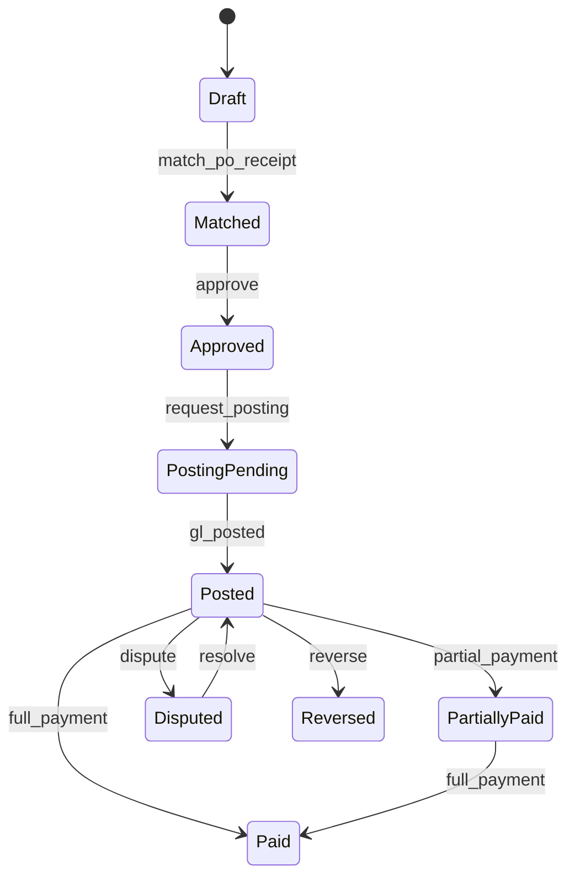

### 10.2 AP posting examples

Vendor invoice expense:

```text
Dr Expense
Dr Input Tax
Cr Accounts Payable
```

Vendor invoice inventory after receipt:

```text
Dr GRNI / Accrual Clearing
Dr Input Tax
Cr Accounts Payable
```

Vendor payment:

```text
Dr Accounts Payable
Cr Cash/Bank
```

Withholding tax:

```text
Dr Accounts Payable
Cr Cash/Bank
Cr Withholding Tax Payable
```

### 10.3 AP open item

AP open item harus match dengan AP control account.

Fields:

- vendor id;
- invoice id;
- due date;
- original amount;
- open amount;
- payment status;
- currency;
- exchange rate if relevant;
- settlement references.

Invariant:

```text
open_amount >= 0
settled_amount <= original_amount
paid invoice tidak boleh punya open_amount > 0
cancelled/reversed invoice tidak boleh muncul sebagai open payable
```

### 10.4 AP reconciliation

```sql
-- AP subledger balance
SELECT vendor_id, SUM(open_amount) AS open_payable
FROM ap_open_item
WHERE status = 'OPEN'
GROUP BY vendor_id;

-- GL AP control balance
SELECT SUM(l.credit_amount - l.debit_amount) AS gl_ap_balance
FROM gl_journal_line l
JOIN gl_journal_header h ON h.id = l.journal_id
JOIN gl_account a ON a.id = l.account_id
WHERE h.status = 'POSTED'
  AND a.account_code = '2100';
```

Mismatch analysis:

- AP document approved but posting pending;
- GL journal posted but AP link missing;
- manual GL journal to AP control account;
- reversal not reflected in AP;
- migration opening balance;
- currency revaluation.

## 11. AR Subledger to GL

### 11.1 Customer invoice posting

```text
Dr Accounts Receivable
Cr Revenue
Cr Output Tax
```

Receipt:

```text
Dr Cash/Bank
Cr Accounts Receivable
```

Credit memo:

```text
Dr Sales Return / Revenue Contra
Dr Output Tax Payable
Cr Accounts Receivable
```

### 11.2 AR open item lifecycle

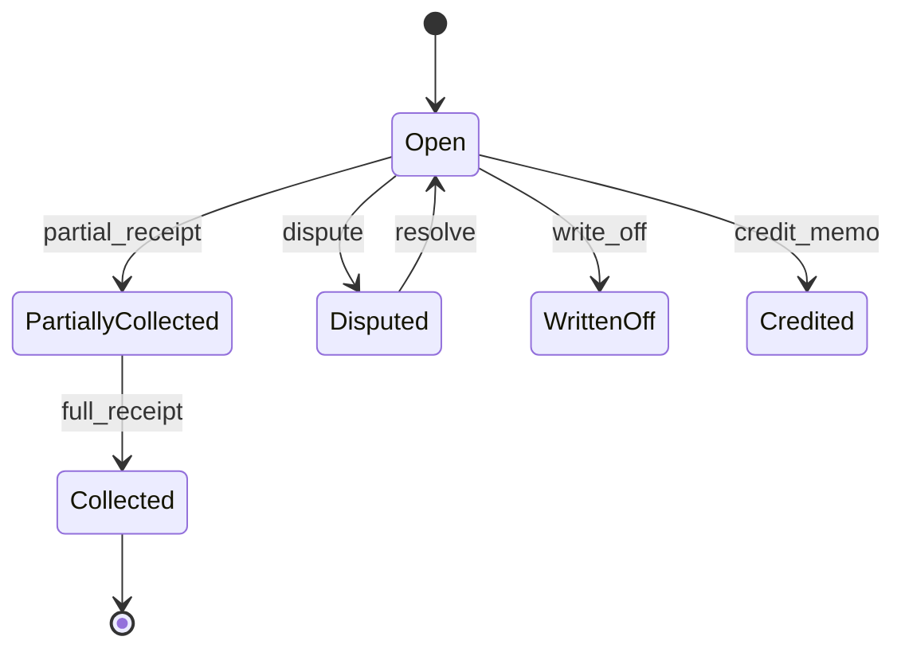

### 11.3 AR invariants

- customer invoice issued must create AR open item;
- receipt allocation cannot exceed open amount;
- credit memo must reduce receivable;
- write-off requires approval;
- AR aging must be derived from open item due date;
- GL AR control must reconcile to AR open items.

Java sketch:

```java
public final class ReceivableOpenItem {
    private Money originalAmount;
    private Money openAmount;
    private OpenItemStatus status;

    public void allocateReceipt(Money amount, UUID receiptId) {
        if (amount.isNegativeOrZero()) {
            throw new DomainRuleViolation("Receipt allocation must be positive");
        }
        if (amount.isGreaterThan(openAmount)) {
            throw new DomainRuleViolation("Cannot allocate more than open receivable");
        }
        this.openAmount = this.openAmount.minus(amount);
        if (this.openAmount.isZero()) {
            this.status = OpenItemStatus.COLLECTED;
        } else {
            this.status = OpenItemStatus.PARTIALLY_COLLECTED;
        }
        addSettlement(receiptId, amount);
    }
}
```

## 12. Inventory Subledger to GL

Inventory adalah subledger paling rawan karena menggabungkan quantity, value, warehouse, cost method, dan operational race.

### 12.1 Stock movement vs valuation entry

Stock movement menjawab quantity:

```text
item A masuk 10 unit ke warehouse X
```

Valuation entry menjawab value:

```text
10 unit bernilai 1.000.000 berdasarkan FIFO layer atau moving average
```

GL journal menjawab financial effect:

```text
Dr Inventory 1.000.000
Cr GRNI      1.000.000
```

### 12.2 Valuation methods

ERP bisa memakai:

- FIFO;
- weighted average;
- moving average;
- standard cost;
- specific identification;
- lot/batch cost.

Posting harus tahu valuation method yang berlaku saat movement.

### 12.3 Inventory posting examples

Goods receipt:

```text
Dr Inventory
Cr GRNI / Accrued Liability
```

Goods issue to sales:

```text
Dr Cost of Goods Sold
Cr Inventory
```

Inventory adjustment increase:

```text
Dr Inventory
Cr Inventory Gain / Adjustment
```

Inventory adjustment decrease:

```text
Dr Inventory Loss / Adjustment
Cr Inventory
```

Production consumption:

```text
Dr WIP
Cr Raw Material Inventory
```

Production completion:

```text
Dr Finished Goods Inventory
Cr WIP
```

### 12.4 Inventory reconciliation

Invariant:

```text
sum(inventory valuation entries) == GL inventory control account
```

By item/warehouse/account if configured.

Mismatch causes:

- stock movement without valuation;
- valuation without GL posting;
- GL manual journal to inventory control account;
- cost adjustment not posted;
- backdated movement after period close;
- negative stock costing anomaly;
- rounding or currency conversion.

## 13. Fixed Asset Subledger to GL

Fixed asset subledger manages lifecycle:

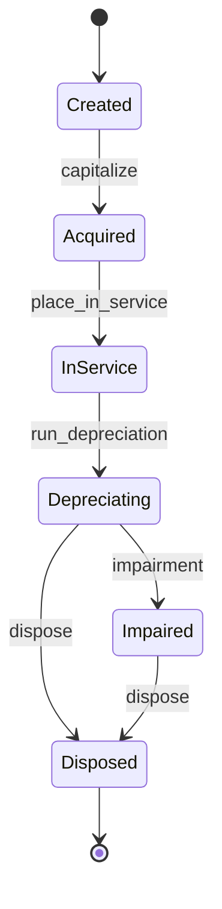

### 13.1 Asset posting examples

Acquisition:

```text
Dr Fixed Asset
Cr Accounts Payable / Cash
```

Depreciation:

```text
Dr Depreciation Expense
Cr Accumulated Depreciation
```

Disposal:

```text
Dr Accumulated Depreciation
Dr Loss on Disposal optional
Cr Fixed Asset
Cr Gain on Disposal optional
```

### 13.2 Asset invariants

- depreciation cannot start before in-service date;
- accumulated depreciation cannot exceed depreciable basis unless explicitly allowed;
- disposed asset cannot be depreciated again;
- depreciation run must be idempotent per asset-period-book;
- asset subledger NBV must reconcile with GL asset and accumulated depreciation accounts.

Idempotency key:

```text
ASSET_DEPRECIATION:{assetId}:{bookId}:{periodId}
```

## 14. Payment and Bank Subledger to GL

Payment has multiple states:

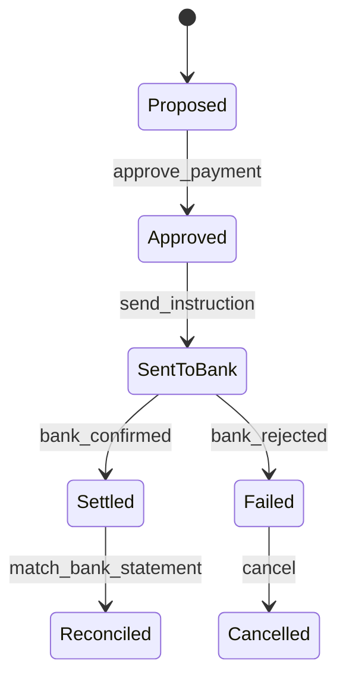

Posting timing decision:

| Timing | Journal | Trade-off |
|---|---|---|
| On payment approval | Dr AP / Cr Cash | Faster liability reduction, but may not match bank settlement. |
| On bank settlement | Dr AP / Cr Cash | More accurate cash, delayed payable clearing. |
| Two-step clearing | Dr AP / Cr Payment Clearing, then Dr Payment Clearing / Cr Cash | More control, more complexity. |

Large ERP often uses clearing accounts.

Payment approval:

```text
Dr Accounts Payable
Cr Payment Clearing
```

Bank settlement:

```text
Dr Payment Clearing
Cr Bank
```

Bank reconciliation then matches bank statement to cash movement.

## 15. Control Accounts

Control account adalah GL account yang nilainya dikontrol oleh subledger.

Examples:

- Accounts Payable;
- Accounts Receivable;
- Inventory;
- Fixed Asset;
- Accumulated Depreciation;
- Payroll Payable;
- Tax Payable;
- GRNI;
- Bank clearing.

Rule:

```text
manual journal to control account should be prohibited or require exceptional approval and reconciliation reason.
```

Java policy:

```java
public final class ControlAccountPolicy {
    public void assertPostingAllowed(GlAccount account, JournalSource source, Actor actor) {
        if (!account.isControlAccount()) {
            return;
        }

        if (source.isAuthorizedSubledgerSource()) {
            return;
        }

        if (actor.hasPermission("GL_CONTROL_ACCOUNT_MANUAL_ADJUSTMENT")) {
            return;
        }

        throw new DomainRuleViolation("Manual posting to control account is not allowed: " + account.code());
    }
}
```

## 16. Subledger-GL Link

Setelah posting berhasil, simpan link eksplisit.

```sql
CREATE TABLE subledger_gl_link (
    id UUID PRIMARY KEY,
    subledger_type VARCHAR(64) NOT NULL,
    subledger_document_id UUID NOT NULL,
    subledger_entry_id UUID,
    accounting_event_id UUID NOT NULL,
    gl_journal_id UUID NOT NULL,
    posting_request_id UUID NOT NULL,
    link_type VARCHAR(32) NOT NULL,
    created_at TIMESTAMPTZ NOT NULL,
    CONSTRAINT uq_subledger_gl_event UNIQUE (accounting_event_id, gl_journal_id)
);
```

Link type:

- original posting;
- reversal;
- adjustment;
- revaluation;
- settlement;
- migration opening balance.

Query trace:

```sql
SELECT l.subledger_type,
       l.subledger_document_id,
       h.journal_number,
       h.accounting_date,
       h.status
FROM subledger_gl_link l
JOIN gl_journal_header h ON h.id = l.gl_journal_id
WHERE l.subledger_type = 'AP'
  AND l.subledger_document_id = :ap_document_id;
```

## 17. Reconciliation Architecture

Reconciliation bukan report tambahan. Ia adalah control loop.

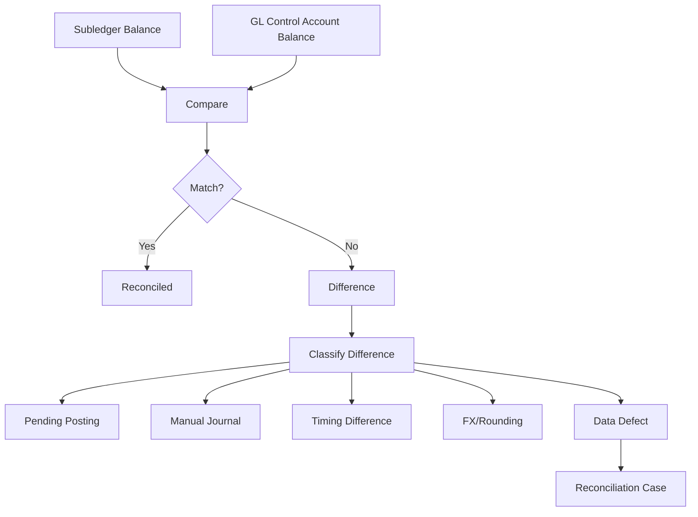

### 17.1 Reconciliation dimensions

Reconciliation bisa dilakukan per:

- legal entity;
- ledger;
- period;
- control account;
- currency;
- vendor/customer/item;
- subledger document;
- dimension.

### 17.2 Reconciliation result model

```java
public record ReconciliationResult(
        UUID legalEntityId,
        UUID ledgerId,
        UUID periodId,
        UUID controlAccountId,
        Money subledgerBalance,
        Money glBalance,
        Money difference,
        ReconciliationStatus status,
        List<ReconciliationDifference> differences
) {
    public boolean isMatched() {
        return difference.isZero();
    }
}
```

Difference classification:

```java
public enum DifferenceType {
    PENDING_POSTING,
    MANUAL_GL_ADJUSTMENT,
    MISSING_SUBLEDGER_LINK,
    REVERSAL_MISMATCH,
    ROUNDING,
    FX_REVALUATION,
    MIGRATION_OPENING_BALANCE,
    DATA_CORRUPTION,
    UNKNOWN
}
```

## 18. Posting Failure Handling

Posting can fail because:

- period closed;
- account inactive;
- missing dimension;
- unbalanced rule output;
- duplicate source version;
- stale master data;
- currency rate missing;
- DB deadlock;
- timeout;
- temporary database error;
- downstream event relay failure.

Classify failures:

| Failure | Retry? | Action |
|---|---|---|
| DB deadlock | Yes | Retry with backoff. |
| Timeout before known commit | Maybe | Check idempotency result first. |
| Missing exchange rate | No until data fixed | Block and surface. |
| Closed period | No normal retry | Finance decision required. |
| Missing dimension | No until source/master data fixed | Data correction. |
| Unbalanced rule | No | Engineering/config defect. |
| Duplicate event | No-op | Return existing journal. |

Java error model:

```java
public sealed interface PostingFailure permits RetryablePostingFailure, BusinessPostingFailure, DefectPostingFailure {
    String code();
    String message();
}

public record RetryablePostingFailure(String code, String message) implements PostingFailure {}
public record BusinessPostingFailure(String code, String message) implements PostingFailure {}
public record DefectPostingFailure(String code, String message) implements PostingFailure {}
```

## 19. Retry Strategy

Retry must be idempotent.

```java
public void process(PostingRequest request) {
    try {
        PostedJournal journal = postingService.post(request.toAccountingEvent());
        request.markPosted(journal.id(), clock.instant());
    } catch (RetryableException e) {
        request.scheduleRetry(backoff.nextDelay(request.attemptCount()), e);
    } catch (BusinessRuleException e) {
        request.markFailed(e.code(), e.getMessage());
    } catch (Exception e) {
        request.markFailed("POSTING_DEFECT", e.getMessage());
        incidentService.raise(e, request.id());
    }
}
```

Backoff:

```text
1st retry: 1 minute
2nd retry: 5 minutes
3rd retry: 15 minutes
4th retry: 1 hour
then manual queue
```

But do not retry forever without visibility.

## 20. Stale Source and Versioning

Accounting event should include source version. Worker must detect stale event.

Scenario:

1. invoice v7 approved;
2. posting event created for v7;
3. user reverses/cancels/corrects source to v8 before worker processes;
4. worker processes stale v7.

Policy options:

| Policy | Behavior |
|---|---|
| Snapshot posting | Event contains immutable snapshot; v7 still valid. |
| Current-state posting | Worker rejects if source current version != event version. |
| Locked-after-approval | Source cannot change while posting pending. |

ERP finansial biasanya butuh clear policy. Jangan biarkan implicit.

Example:

```java
public void assertSourceVersion(AccountingEvent event, SourceDocument source) {
    if (source.version() != event.sourceVersion()) {
        throw new BusinessPostingException(
                "STALE_SOURCE_VERSION",
                "Source version changed from event version " + event.sourceVersion()
                        + " to " + source.version());
    }
}
```

## 21. Cut-off and Backdated Events

Backdated transaction adalah realita ERP.

Contoh:

- invoice diterima hari ini tapi tanggal invoice bulan lalu;
- goods receipt terlambat masuk sistem;
- bank statement datang setelah period close;
- inventory adjustment ditemukan setelah stock opname.

Policy harus eksplisit:

| Condition | Policy |
|---|---|
| Accounting date in open period | Post normally. |
| Accounting date in soft-closed period | Require finance approval. |
| Accounting date in hard-closed period | Post to current period with prior-period adjustment reason, or reopen controlled. |
| Backdated operational date but current accounting date | Allowed if disclosure/traceability OK. |

Do not silently change accounting date.

Good design:

```text
requested_accounting_date = source/accounting intent
resolved_accounting_date = date actually posted after period policy
period_policy_decision = reason and approver
```

## 22. Eventual Consistency in Financial Posting

If posting asynchronous, system enters intermediate states.

Example AP:

```text
APPROVED -> POSTING_PENDING -> POSTED
```

UI must show:

- posting pending;
- posting failed with reason;
- posted journal number;
- retry status;
- whether document is financially effective.

Bad UX:

```text
Invoice approved, but nobody knows GL posting failed.
```

Good UX:

```text
Invoice approved. Financial posting failed: missing cost center. Action required.
```

## 23. Subledger State vs GL State

Subledger document status and GL status must be related but not identical.

Example:

| AP status | GL status | Meaning |
|---|---|---|
| Approved | Not posted | Approved but no financial effect yet. |
| PostingPending | Not posted | Worker pending. |
| Posted | Posted journal exists | Financially effective. |
| Reversed | Reversal journal exists | Original effect reversed. |
| Paid | Payment journal exists | Liability settled. |

Avoid ambiguous status `DONE`.

## 24. Manual Adjustments

Manual journal can be needed, but it is dangerous.

Categories:

- finance adjustment;
- reclassification;
- rounding;
- migration correction;
- control account adjustment;
- suspense clearing.

Manual adjustment must capture:

- reason code;
- supporting document;
- approver;
- affected period;
- affected account;
- whether subledger link exists;
- reconciliation impact.

Policy:

```text
manual adjustment to subledger-controlled account must either link to subledger correction or create reconciliation difference with owner.
```

## 25. Suspense and Clearing Accounts

Clearing accounts help represent intermediate states.

Examples:

- GRNI / received not invoiced;
- payment clearing;
- bank clearing;
- inventory variance;
- suspense account;
- tax clearing.

But clearing accounts must be monitored.

Invariant:

```text
clearing account should trend to zero or have explainable open items.
```

Do not let clearing account become trash bin.

Report:

| Clearing account | Expected resolution |
|---|---|
| GRNI | Cleared by vendor invoice matching receipt. |
| Payment clearing | Cleared by bank settlement. |
| Bank clearing | Cleared by bank statement reconciliation. |
| Suspense | Cleared by investigation and reclassification. |
| Inventory variance | Cleared by cost adjustment/period close. |

## 26. Multi-Currency Subledger Posting

Multi-currency must track at least:

- transaction currency;
- functional/accounting currency;
- exchange rate;
- rate date;
- realized gain/loss;
- unrealized revaluation;
- settlement currency.

Example vendor invoice USD in IDR books:

At invoice posting:

```text
Dr Expense IDR equivalent
Cr AP USD liability at IDR equivalent
```

At payment, rate differs:

```text
Dr AP at original carrying amount
Dr/Cr FX gain/loss
Cr Cash at payment rate
```

Subledger must track open item original currency and carrying amount.

Fields:

```java
public record MonetaryFact(
        Money transactionAmount,
        CurrencyUnit transactionCurrency,
        Money accountingAmount,
        CurrencyUnit accountingCurrency,
        BigDecimal exchangeRate,
        LocalDate rateDate,
        String rateType
) {}
```

## 27. Posting Rule Resolution

Rule resolution depends on:

- legal entity;
- ledger/book;
- document type;
- item category;
- vendor/customer group;
- tax code;
- warehouse;
- project;
- effective date;
- localization pack;
- accounting standard.

Rule resolver:

```java
public interface AccountingRuleResolver {
    AccountingRule<?> resolve(AccountingEvent event, AccountingContext context);
}
```

Resolution must be deterministic.

Bad:

```java
rules.stream().findFirst();
```

Good:

```text
specificity ranking + effective date + explicit conflict detection
```

Rule conflict should fail fast:

```text
Two active rules match VendorInvoiceExpense for legal entity LE-01 and date 2026-06-30.
```

## 28. Posting Pipeline Observability

Financial posting needs business observability, not only CPU graphs.

Metrics:

- posting requests created;
- posting requests pending;
- posting success rate;
- retry count;
- failed by reason code;
- average posting latency;
- age of oldest pending posting;
- unposted approved documents;
- subledger vs GL reconciliation difference;
- outbox lag;
- period close blockers.

Logs must include:

- correlation id;
- posting request id;
- source type/id;
- idempotency key;
- legal entity;
- period;
- journal id if posted;
- failure code.

Tracing span:

```text
ApproveInvoice
  -> CreatePostingRequest
  -> ClaimPostingRequest
  -> ResolveAccountingRule
  -> GenerateJournalProposal
  -> PostJournal
  -> LinkSubledgerGl
  -> EmitJournalPosted
```

## 29. Data Model Summary

Core tables:

```text
financial_posting_request
accounting_event_store
subledger_gl_link
gl_journal_header
gl_journal_line
gl_account_balance
ap_document
ap_open_item
ap_settlement
ar_document
ar_open_item
inventory_valuation_entry
asset_transaction
bank_statement_line
reconciliation_run
reconciliation_difference
```

Do not start with all tables if building product slice. Start with one subledger and expand.

## 30. Architecture Options

### 30.1 Modular monolith

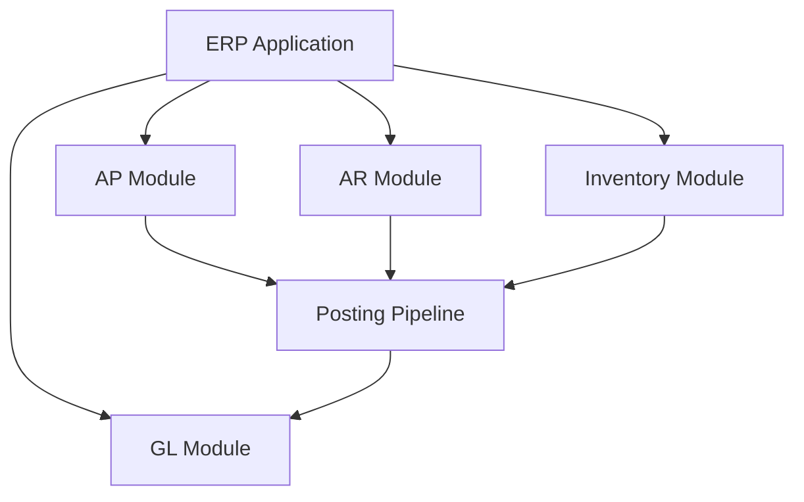

Pros:

- strong consistency easier;
- lower operational complexity;
- easier refactoring early;
- good for ERP core.

Cons:

- module boundaries must be disciplined;
- scaling is coarse;
- release coupling.

### 30.2 Service-based finance platform

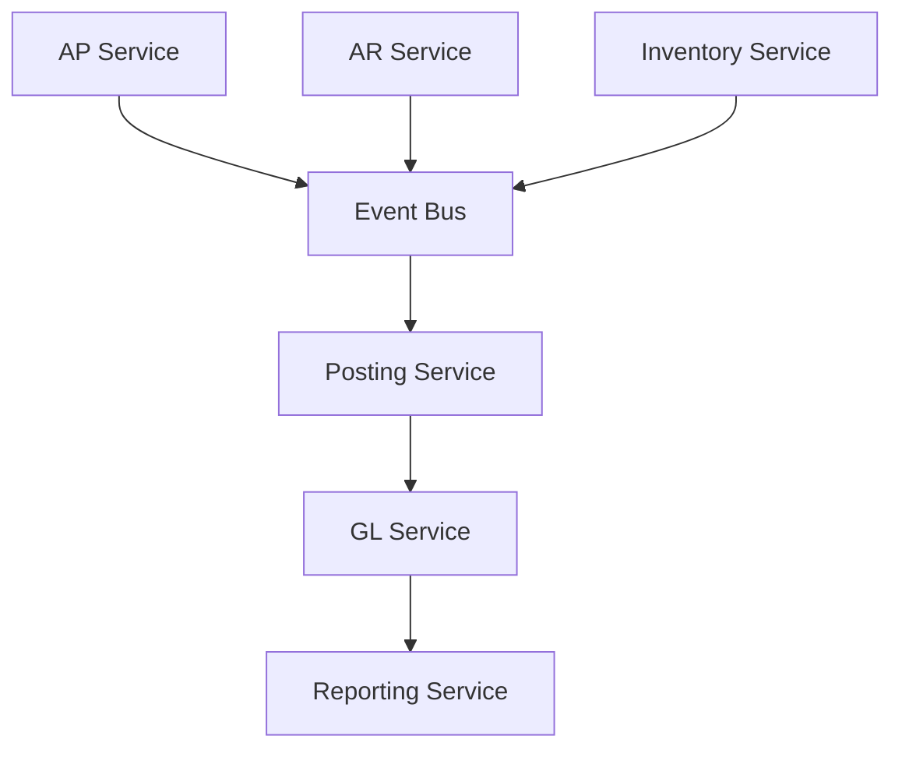

Pros:

- independent scaling;
- clearer service ownership;
- async throughput.

Cons:

- eventual consistency;
- distributed tracing required;
- reconciliation complexity;
- duplicate/idempotency risk;
- harder local transaction boundary.

### 30.3 Recommended learning path

Untuk belajar dan membangun skill:

1. implement modular monolith dulu;
2. enforce module boundaries;
3. add outbox and async worker;
4. split only when throughput/ownership demands it;
5. keep posting contract stable.

## 31. Anti-Patterns

### 31.1 Direct GL posting from everywhere

Gejala:

```text
AP, AR, inventory, payment semua insert gl_journal_line langsung.
```

Akibat:

- rule tersebar;
- audit sulit;
- duplicate prevention tidak konsisten;
- reconciliation sulit;
- GL schema menjadi coupling global.

Better:

```text
subledger emits accounting event -> posting pipeline -> GL service
```

### 31.2 No subledger link

Gejala:

```text
journal punya source_id string bebas, tapi tidak ada link table/trace structured.
```

Akibat:

- debugging lambat;
- reconciliation manual;
- audit costly;
- migration sulit.

### 31.3 Posting failure hidden

Gejala:

```text
invoice status Approved, tetapi GL posting failed di log.
```

Akibat:

- financial statement incomplete;
- period close blocked;
- user tidak tahu action required.

### 31.4 Control accounts open for manual use

Gejala:

```text
finance bisa post manual journal ke AP/AR/Inventory control tanpa subledger reason.
```

Akibat:

- subledger tidak reconcile;
- aging report beda dengan GL;
- audit exception.

### 31.5 Reconciliation only at year-end

Gejala:

```text
mismatch baru ditemukan saat audit.
```

Better:

- daily reconciliation;
- close checklist;
- dashboard difference;
- owner per difference.

## 32. Testing Strategy

### 32.1 Contract tests per subledger

For AP invoice approved:

```text
given approved vendor invoice
when posting pipeline runs
then AP open item created
and journal posted
and AP control credited
and expense/tax debited
and subledger_gl_link exists
```

### 32.2 Idempotency test

```java
@Test
void samePostingRequestMustNotCreateDuplicateJournal() {
    PostingRequest request = fixtures.vendorInvoicePostingRequest("INV-1001", 7);

    PostedJournal first = processor.process(request);
    PostedJournal second = processor.process(request);

    assertThat(second.id()).isEqualTo(first.id());
    assertThat(journalRepository.countBySource("VENDOR_INVOICE", "INV-1001")).isEqualTo(1);
}
```

### 32.3 Reconciliation test

```java
@Test
void apOpenItemsMustReconcileToApControlAccount() {
    postVendorInvoice("INV-1", money("100.00"));
    postVendorInvoice("INV-2", money("200.00"));
    payVendorInvoice("INV-1", money("100.00"));

    ReconciliationResult result = reconciliationService.reconcileAp(period("2026-06"));

    assertThat(result.difference()).isEqualTo(money("0.00"));
}
```

### 32.4 Failure tests

Cases:

- missing exchange rate blocks posting;
- closed period blocks posting;
- duplicate event returns existing journal;
- stale source version rejected;
- manual GL adjustment to AP control requires permission;
- reconciliation detects unlinked control account journal;
- retryable deadlock schedules retry;
- failed posting is visible in dashboard query.

## 33. Design Review Checklist

### Subledger correctness

- Apakah setiap subledger punya invariant sendiri?
- Apakah open item model jelas?
- Apakah settlement/allocation tidak bisa melebihi open amount?
- Apakah lifecycle subledger eksplisit?
- Apakah control account mapping jelas?

### Posting pipeline

- Apakah accounting event punya idempotency key?
- Apakah posting request observable?
- Apakah duplicate posting dicegah?
- Apakah source version policy eksplisit?
- Apakah rule resolution deterministic?
- Apakah posting result link kembali ke subledger?

### Reconciliation

- Apakah subledger balance bisa dibandingkan dengan GL?
- Apakah mismatch diklasifikasi?
- Apakah manual journal ke control account dikontrol?
- Apakah pending posting terlihat?
- Apakah clearing account dimonitor?

### Operations

- Apakah worker retry aman?
- Apakah stuck posting bisa dipulihkan?
- Apakah failure code actionable?
- Apakah oldest pending posting dimonitor?
- Apakah period close memakai posting/reconciliation status?

## 34. 20-Hour Practice Slice

Bangun mini pipeline dengan satu subledger dulu.

### Hour 1-3: AP subledger model

Buat:

- `ApDocument`;
- `ApOpenItem`;
- `ApSettlement`;
- lifecycle approved/posting pending/posted/paid.

### Hour 4-6: Posting request

Buat:

- `financial_posting_request`;
- idempotency key;
- status pending/processing/posted/failed.

### Hour 7-9: Posting processor

Implementasikan:

- claim request;
- generate accounting event;
- call GL posting service;
- link subledger to journal.

### Hour 10-12: Reconciliation

Implementasikan:

- AP open item balance;
- GL AP control balance;
- difference classification.

### Hour 13-15: Retry and failure

Simulasikan:

- missing account;
- closed period;
- duplicate request;
- worker crash after journal commit;
- stale source version.

### Hour 16-18: Add inventory slice

Buat minimal:

- stock movement;
- valuation entry;
- inventory posting;
- inventory control reconciliation.

### Hour 19-20: Review and harden

Buat design review:

- apakah direct GL insert dicegah?
- apakah control account protected?
- apakah trace source -> subledger -> GL jelas?
- apakah failed posting visible?

## 35. Summary Mental Model

Subledger architecture yang baik punya karakter berikut:

1. **Subledger menyimpan detail domain finansial; GL menyimpan financial truth teragregasi dan legal.**
2. **Posting pipeline adalah kontrak eksplisit, bukan helper method yang dipanggil dari mana-mana.**
3. **Accounting event harus idempotent, versioned, dan traceable.**
4. **Control account harus dilindungi dari manual chaos.**
5. **Subledger ↔ GL link wajib untuk audit dan debugging.**
6. **Reconciliation adalah control loop harian, bukan kegiatan panik saat audit.**
7. **Posting failure harus menjadi state bisnis yang terlihat.**
8. **Retry tanpa idempotency adalah mesin duplicate financial effect.**
9. **Clearing account harus punya owner dan expected resolution.**
10. **ERP finansial besar menang bukan karena banyak modul, tetapi karena financial effect dapat ditelusuri, diulang, direkonsiliasi, dan dipertahankan.**

## 36. Source Notes

- Jakarta Transactions digunakan sebagai rujukan enterprise Java untuk transaction boundary dan interaksi transaction manager/resource/application.
- Jakarta Persistence digunakan sebagai rujukan baseline persistence/object-relational mapping di Java enterprise.
- PostgreSQL transaction isolation documentation digunakan sebagai rujukan practical concurrency untuk worker claim, idempotency, dan consistency.
- IFRS Conceptual Framework digunakan sebagai rujukan konseptual bahwa financial reporting membutuhkan representasi yang faithful, relevant, dan dapat digunakan untuk pengambilan keputusan ekonomi; seri ini menerjemahkannya ke kebutuhan engineering auditability dan traceability.

## 37. Seri Status

Part ini adalah **Part 010 dari 034**.

Seri belum selesai. Lanjut ke:

- Part 011 — Procure-to-Pay Domain
- Part 012 — Order-to-Cash Domain
