# Part 011 — Procure-to-Pay Domain

## 1. Target Skill Part Ini

Procure-to-Pay atau P2P adalah domain ERP yang mengubah kebutuhan internal menjadi komitmen pembelian, penerimaan barang/jasa, pengakuan liabilitas, dan pembayaran vendor.

> **Skill inti part ini:** mampu mendesain P2P domain dalam Java ERP besar sehingga pembelian, penerimaan, invoice, approval, accrual, payment, inventory, dan GL tetap konsisten walaupun ada partial receipt, invoice mismatch, retur, pembatalan, duplicate integration, period close, dan perubahan organisasi.

P2P bukan sekadar CRUD purchase order. P2P adalah rangkaian kontrol bisnis.

Jika salah desain:

- barang bisa diterima tanpa trace ke PO;
- invoice bisa dibayar dua kali;
- stock bertambah tanpa accrual;
- vendor invoice lolos walau harga/kuantitas tidak sesuai;
- period close rusak karena penerimaan belum diinvoiced;
- audit tidak bisa menjawab “siapa menyetujui pembelian ini dan berdasarkan limit apa?”;
- AP dan inventory tidak bisa direkonsiliasi;
- sistem tidak tahan duplicate message dari supplier portal, EDI, OCR invoice, atau bank payment integration.

Di ERP besar, P2P harus diperlakukan sebagai **lifecycle + control system + accounting event source**, bukan sebagai tabel `purchase_order` dengan beberapa status.

---

## 2. Kaufman Deconstruction: Memecah P2P Menjadi Sub-Skill

Mengikuti prinsip Josh Kaufman, skill P2P perlu dipecah agar bisa dilatih secara sadar.

| Sub-skill | Pertanyaan yang Harus Bisa Dijawab | Output Engineering |
|---|---|---|
| Demand capture | Dari mana kebutuhan beli muncul? | Purchase requisition, MRP suggestion, service request, min-max replenishment |
| Supplier commitment | Kapan organisasi secara legal/operasional berkomitmen ke vendor? | Purchase order, blanket PO, release order, contract reference |
| Receiving | Apa yang benar-benar diterima? | Goods receipt, service acceptance, inspection, rejection |
| Matching | Apakah invoice vendor sesuai dengan PO dan receipt? | Two-way, three-way, four-way matching |
| Liability recognition | Kapan hutang diakui? | AP invoice, GR/IR accrual, tax/withholding, control account |
| Payment | Kapan dan bagaimana vendor dibayar? | Payment proposal, payment run, settlement, remittance |
| Exception handling | Apa yang terjadi ketika harga/qty/tax tidak cocok? | Block, tolerance approval, debit note, dispute, correction |
| Audit & compliance | Bukti apa yang harus tersimpan? | Approval history, document chain, immutable event, SoD evidence |
| Integration resilience | Bagaimana kalau message duplicate, terlambat, atau partial? | Idempotency, reconciliation, outbox/inbox, retry policy |
| Close & reconciliation | Apakah subledger cocok dengan GL? | GRNI report, AP aging, vendor statement reconciliation |

Praktik efektif bukan menghafal langkah P2P. Praktik efektif adalah mensimulasikan kegagalan:

- PO dibuat, barang diterima sebagian, invoice datang penuh;
- invoice datang sebelum barang;
- receipt terjadi setelah period close;
- vendor mengirim invoice duplicate dengan nomor sama;
- harga invoice melebihi toleransi;
- barang diterima oleh branch berbeda dari requester;
- PO dibatalkan setelah sebagian diterima;
- pembayaran berhasil di bank tetapi callback gagal;
- tax rate berubah di tengah lifecycle;
- vendor master berubah rekening bank setelah invoice disetujui.

---

## 3. P2P Sebagai Control Loop

Mental model P2P terbaik adalah **control loop**.

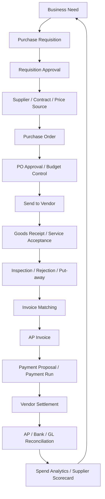

Setiap node bukan hanya screen. Setiap node adalah **decision point**.

Contoh:

- Requisition approval menjawab: apakah kebutuhan ini sah?
- PO approval menjawab: apakah organisasi boleh berkomitmen ke vendor?
- Goods receipt menjawab: apakah barang/jasa benar-benar diterima?
- Invoice matching menjawab: apakah tagihan layak menjadi hutang?
- Payment approval menjawab: apakah hutang layak dibayar sekarang, ke rekening ini, dengan metode ini?
- Reconciliation menjawab: apakah efek operasional, subledger, bank, dan GL konsisten?

Java ERP yang baik memodelkan decision point ini secara eksplisit. Jangan menyembunyikannya di controller atau trigger database acak.

---

## 4. Batas Domain P2P

P2P menyentuh banyak domain. Kesalahan umum adalah membuat satu service raksasa `ProcurementService` yang mengurus semuanya.

Batas yang lebih sehat:

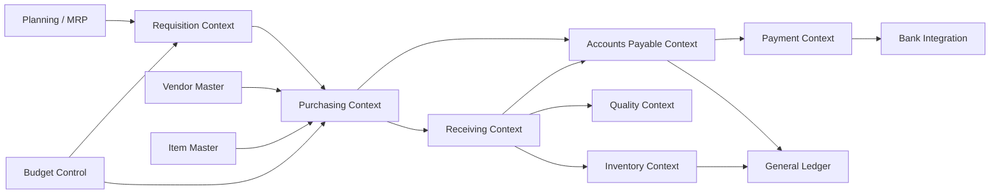

Prinsip pemisahan:

| Context | Owns | Tidak Boleh Diam-diam Mengubah |
|---|---|---|
| Requisition | kebutuhan internal, requester, budget intent | PO commitment, vendor invoice |
| Purchasing | PO, vendor commitment, commercial terms | stock balance langsung, GL posting langsung |
| Receiving | bukti penerimaan barang/jasa | invoice approval, payment |
| Inventory | stock ledger, valuation layer | vendor invoice status |
| Accounts Payable | invoice, liability, payment schedule | physical receipt |
| Payment | payment instruction, settlement, bank status | invoice line amount tanpa adjustment |
| General Ledger | journal, posting, balance | detail procurement lifecycle |

Rule praktis:

> Context boleh mengonsumsi fakta dari context lain, tapi tidak boleh mengklaim ownership atas state yang bukan miliknya.

Contoh buruk:

```java
public void receiveGoods(UUID purchaseOrderId, List<ReceiptLine> lines) {
    purchaseOrderRepository.markReceived(purchaseOrderId);
    inventoryRepository.incrementStock(lines);
    apRepository.createVendorInvoiceAutomatically(purchaseOrderId);
    glRepository.postJournal(...);
}
```

Kenapa buruk:

- satu method menulis banyak bounded context;
- tidak jelas transactional boundary-nya;
- failure di GL bisa rollback receiving atau meninggalkan stock inconsistent;
- invoice otomatis mungkin salah jika invoice vendor belum datang;
- audit chain tercampur.

Desain lebih sehat:

```java
public ReceiptId receiveGoods(ReceiveGoodsCommand command) {
    GoodsReceipt receipt = receivingApplicationService.recordReceipt(command);
    outbox.publish(new GoodsReceivedEvent(receipt.toEventPayload()));
    return receipt.id();
}
```

Lalu subscriber domain lain bereaksi dengan boundary masing-masing:

- Inventory membuat stock movement;
- AP membuat accrual candidate atau matching candidate;
- Quality membuat inspection task;
- Reporting memperbarui received-not-invoiced view;
- GL menerima posting request dari subledger, bukan dari receiving controller.

---

## 5. Canonical P2P Lifecycle

### 5.1 Purchase Requisition

Purchase requisition adalah permintaan internal untuk membeli barang atau jasa.

Field konseptual:

| Field | Makna |
|---|---|
| requester | actor yang membutuhkan barang/jasa |
| requesting org unit | branch/department/cost center pemakai |
| required date | kapan kebutuhan harus terpenuhi |
| item/service | apa yang dibutuhkan |
| quantity / scope | berapa banyak atau scope jasa |
| estimated price | estimasi biaya |
| budget account | anggaran yang akan dikonsumsi |
| suggested supplier | supplier preferensi, belum tentu final |
| justification | alasan bisnis |
| approval route | rute kontrol berdasarkan amount, category, org |

State umum:

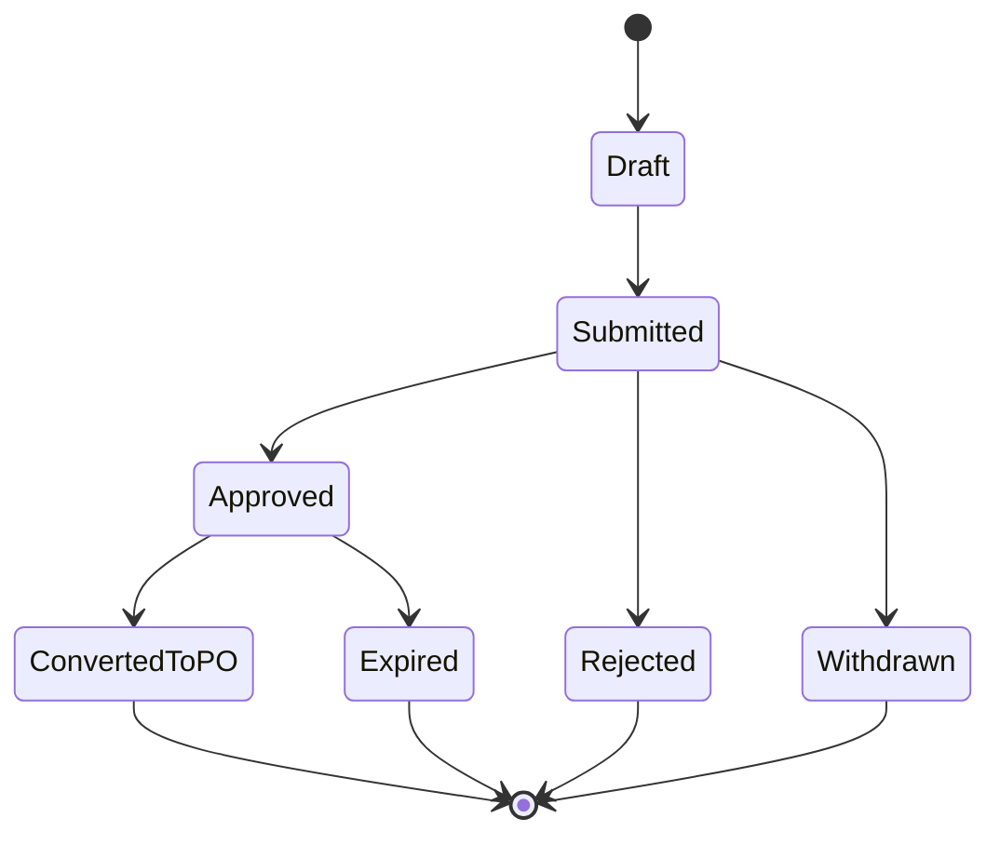

Invariant penting:

- Requisition yang belum approved tidak boleh menjadi PO, kecuali policy mengizinkan emergency purchase dengan audit reason.
- Requisition approved harus mengunci snapshot approval basis: requester, org, category, amount, currency, budget, dan policy version.
- Perubahan amount/category setelah approval harus memicu re-approval atau membuat revision baru.
- Requisition tidak sama dengan komitmen vendor. Jangan treat requisition sebagai liability.

### 5.2 Purchase Order

Purchase order adalah komitmen formal ke vendor.

PO adalah salah satu dokumen paling penting dalam P2P karena menjadi referensi untuk receiving, invoice matching, budget commitment, dan dispute.

Header PO:

| Field | Makna |
|---|---|
| poNumber | nomor legal/operasional yang immutable setelah issue |
| vendor | supplier yang dipilih |
| buyerOrg | legal entity / operating unit pembeli |
| shipTo / billTo | lokasi penerimaan dan penagihan |
| currency | mata uang komitmen |
| paymentTerms | termin pembayaran |
| incoterms / deliveryTerms | tanggung jawab pengiriman jika relevan |
| taxTreatment | basis pajak |
| approvalSnapshot | bukti policy saat disetujui |
| status | lifecycle PO |

Line PO:

| Field | Makna |
|---|---|
| item/service | barang/jasa |
| orderedQty | kuantitas dipesan |
| unitPrice | harga satuan |
| UOM | satuan |
| taxCode | pajak expected |
| costObject | cost center/project/asset |
| deliverySchedule | jadwal pengiriman |
| receiptRequired | apakah butuh goods receipt/service acceptance |
| invoiceMatchingPolicy | two-way/three-way/four-way |

State PO:

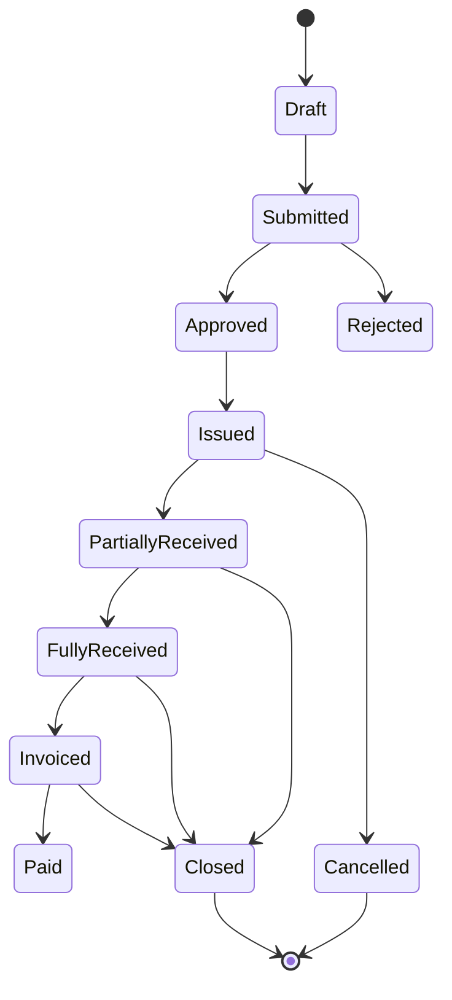

Catatan: state di atas adalah simplifikasi. Pada ERP besar, status receipt, invoice, payment, dan close sebaiknya tidak dipadatkan menjadi satu enum tunggal.

Model lebih baik:

```java
public record PurchaseOrderStatus(
    DocumentStatus documentStatus,
    ApprovalStatus approvalStatus,
    IssueStatus issueStatus,
    ReceiptStatus receiptStatus,
    InvoiceStatus invoiceStatus,
    ClosureStatus closureStatus
) {}
```

Kenapa? Karena PO bisa:

- `Issued` + `PartiallyReceived` + `NotInvoiced`;
- `Issued` + `FullyReceived` + `PartiallyInvoiced`;
- `ClosedForReceiving` tapi masih `OpenForInvoicing`;
- `Cancelled` untuk remaining quantity tapi historical receipt tetap valid.

Satu enum seperti `PO_STATUS = COMPLETE` akan menghancurkan pemahaman lifecycle.

### 5.3 Goods Receipt / Service Acceptance

Goods receipt membuktikan barang telah diterima. Service acceptance membuktikan jasa telah diterima/diterima secara bisnis.

Receipt bukan sekadar update stock. Receipt adalah evidence.

Receipt harus menjawab:

- siapa menerima;
- kapan diterima;
- di lokasi mana;
- berdasarkan PO/ASN/contract apa;
- qty berapa;
- kondisi barang;
- batch/serial/lot apa;
- apakah butuh inspeksi;
- apakah diterima penuh, sebagian, atau ditolak;
- apakah periode akuntansi terbuka;
- apakah movement stock dan accrual dibuat.

State receipt:

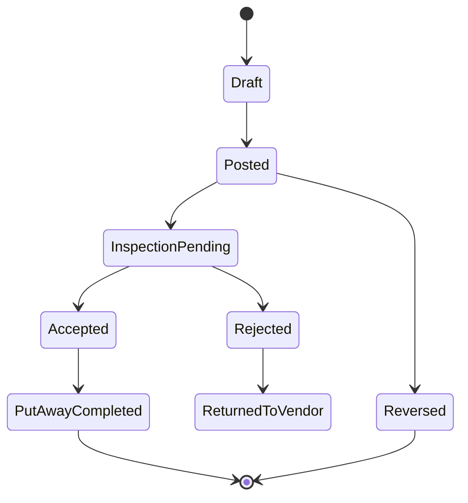

Invariant:

- Receipt posted tidak boleh diubah in-place. Gunakan reversal/correction.
- Qty receipt tidak boleh melebihi open PO qty kecuali over-receipt tolerance mengizinkan.
- Receipt line harus mempertahankan snapshot item, UOM conversion, cost object, tax relevance, dan receiving location.
- Jika receipt mempengaruhi inventory, stock ledger harus punya movement yang traceable ke receipt line.
- Jika receipt memicu accrual, accounting event harus traceable ke receipt line.

### 5.4 Vendor Invoice

Vendor invoice adalah klaim vendor bahwa organisasi harus membayar.

Invoice bukan bukti bahwa barang diterima. Invoice juga bukan bukti bahwa pembayaran boleh dilakukan. Invoice adalah input untuk matching, tax validation, AP recognition, dan payment scheduling.

Header invoice:

| Field | Makna |
|---|---|
| vendorInvoiceNumber | nomor invoice vendor, bagian dari duplicate detection |
| vendor | supplier |
| invoiceDate | tanggal dokumen vendor |
| receivedDate | tanggal invoice masuk ke organisasi |
| currency | mata uang invoice |
| grossAmount | total tagihan |
| taxAmount | pajak |
| withholdingAmount | potongan pajak jika relevan |
| paymentTerms | termin pembayaran |
| bankAccountSnapshot | rekening vendor saat payment approval |
| matchingStatus | status matching |
| postingStatus | status AP posting |

Duplicate detection minimal:

```text
vendor_id + normalized_invoice_number + invoice_date + gross_amount + currency
```

Tetapi duplicate detection tidak boleh hanya hard unique constraint tanpa workflow, karena vendor kadang mengirim correction atau credit memo dengan nomor mirip.

Pattern yang lebih baik:

- hard block untuk exact duplicate yang sangat yakin;
- warning + review untuk fuzzy duplicate;
- exception queue untuk invoice dengan vendor sama, amount sama, date dekat, number mirip;
- audit trail untuk override duplicate warning.

### 5.5 Invoice Matching

Invoice matching adalah kontrol P2P yang menentukan apakah invoice boleh menjadi liability dan layak dibayar.

Tipe umum:

| Matching | Cocok Untuk | Membandingkan |
|---|---|---|
| Two-way match | jasa/subscription atau non-receipted goods | PO vs invoice |
| Three-way match | goods procurement | PO vs receipt vs invoice |
| Four-way match | regulated/quality-sensitive goods | PO vs receipt vs inspection acceptance vs invoice |

Three-way matching mental model:

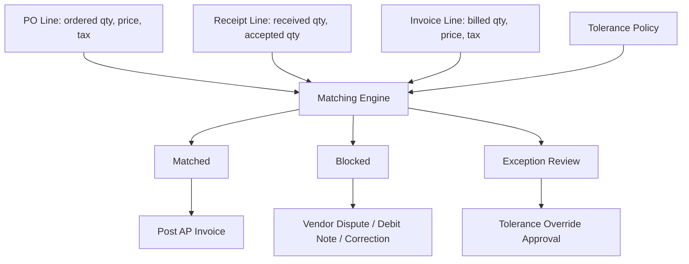

Core rule:

```java
public MatchResult match(InvoiceLine invoice, PurchaseOrderLine po, List<ReceiptLine> receipts, TolerancePolicy policy) {
    Quantity received = receipts.stream()
        .filter(r -> r.poLineId().equals(po.id()))
        .map(ReceiptLine::acceptedQuantity)
        .reduce(Quantity.zero(po.uom()), Quantity::plus);

    Money expectedAmount = po.unitPrice().multiply(invoice.quantity());
    Money priceVariance = invoice.netAmount().minus(expectedAmount);
    Quantity quantityVariance = invoice.quantity().minus(received);

    return policy.evaluate(priceVariance, quantityVariance, invoice.taxAmount(), po.taxCode());
}
```

Di production, matching engine harus mempertimbangkan:

- UOM conversion;
- currency conversion;
- tax-inclusive vs tax-exclusive pricing;
- freight/landed cost;
- discount;
- withholding;
- tolerance by vendor/category/item/legal entity;
- service acceptance instead of physical receipt;
- partial receipts;
- invoice split/combined;
- credit memo/debit memo;
- blocked period;
- PO revision.

### 5.6 AP Posting

AP posting mengubah invoice approved/matched menjadi liability.

Contoh event accounting:

```text
Debit  Expense / Inventory Clearing / Asset Clearing
Debit  Input Tax
Credit Accounts Payable Control
```

Jika goods receipt sudah mencatat accrual:

Saat receipt:

```text
Debit  Inventory / Expense Accrual Basis
Credit GR/IR Clearing
```

Saat invoice:

```text
Debit  GR/IR Clearing
Debit/Credit Price Variance
Debit  Input Tax
Credit AP Control
```

Invariant:

- AP invoice posted harus balanced.
- AP invoice posted harus punya link ke invoice line dan matching basis.
- Invoice posted tidak boleh dihapus; gunakan reversal, credit memo, atau adjustment.
- AP control account tidak boleh dimanipulasi manual tanpa policy kuat.
- Posting date harus mematuhi fiscal period lock.

### 5.7 Payment and Settlement

Payment bukan sekadar `invoice.status = PAID`.

Payment lifecycle:

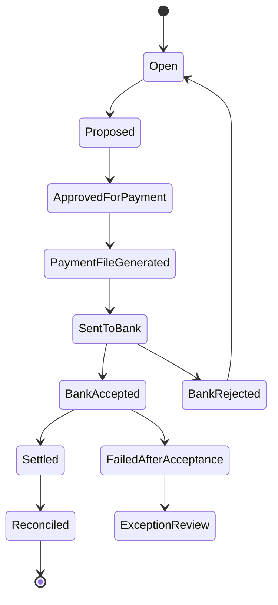

Payment harus melacak:

- invoice yang dibayar;
- amount gross/net;
- withholding;
- discount early payment;
- bank account snapshot;
- payment method;
- payment batch;
- bank instruction id;
- bank status;
- settlement date;
- reconciliation reference.

Invariant:

- invoice tidak boleh paid lebih dari open amount kecuali policy overpayment/advance payment jelas;
- payment instruction harus idempotent;
- perubahan rekening vendor setelah invoice approval tidak otomatis mengubah rekening payment tanpa revalidation;
- bank accepted tidak sama dengan settled;
- callback bank duplicate tidak boleh menggandakan settlement.

---

## 6. P2P Data Model: Bukan Sekadar Header-Line

P2P butuh model dokumen, event, dan control.

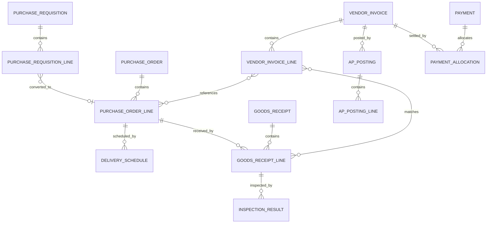

### 6.1 Document Chain

ERP P2P harus mempertahankan document chain.

```text
Requisition -> PO -> Receipt -> Invoice -> AP Posting -> Payment -> Bank Reconciliation
```

Document chain harus bisa menjawab:

- invoice ini berasal dari PO mana?
- PO ini berasal dari requisition mana?
- siapa yang approve requisition dan PO?
- receipt apa yang menjadi basis invoice?
- jurnal apa yang dibuat dari invoice?
- payment batch mana yang membayar invoice?
- bank statement line mana yang merekonsiliasi payment?

Jangan hanya menyimpan current status. Simpan relasi evidence.

### 6.2 Snapshot vs Reference

ERP besar harus membedakan reference dan snapshot.

| Data | Reference Langsung? | Snapshot? | Kenapa |
|---|---:|---:|---|
| Vendor ID | Ya | Ya untuk nama/legal/tax saat transaksi | vendor master bisa berubah |
| Vendor bank account | Tidak untuk payment final | Ya | mencegah payment berubah diam-diam |
| Item ID | Ya | Ya untuk description/UOM/tax category | item master berubah |
| Unit price | Tidak cukup | Ya | harga saat PO harus immutable |
| Tax code | Ya | Ya untuk tax treatment | aturan pajak bisa berubah |
| Approval policy | Tidak cukup | Ya policy version | audit butuh basis saat approval |
| Cost center | Ya | Ya untuk name/hierarchy snapshot | struktur organisasi berubah |

Rule:

> Jika nilai mempengaruhi komitmen, pembayaran, pajak, atau audit, simpan snapshot transaksi.

---

## 7. Designing Aggregates in Java

P2P aggregate harus menjaga invariant lokal, bukan seluruh proses end-to-end.

### 7.1 PurchaseOrder Aggregate

```java
public final class PurchaseOrder {
    private final PurchaseOrderId id;
    private final PurchaseOrderNumber number;
    private final VendorSnapshot vendor;
    private final BuyerOrgSnapshot buyerOrg;
    private final Currency currency;
    private final List<PurchaseOrderLine> lines;
    private ApprovalState approvalState;
    private IssueState issueState;
    private ClosureState closureState;
    private long version;

    public void submit(UserId actor) {
        requireDraft();
        requireAtLeastOneLine();
        requireValidCommercialTerms();
        this.approvalState = ApprovalState.submitted(actor);
    }

    public void approve(ApprovalDecision decision) {
        requireSubmitted();
        requireDecisionCoversCurrentRevision(decision);
        this.approvalState = ApprovalState.approved(decision.snapshot());
    }

    public void issue(IssueCommand command) {
        requireApproved();
        requireNumberAllocated();
        requireVendorActiveAt(command.issueDate());
        this.issueState = IssueState.issued(command.issueDate(), command.channel());
    }

    public void closeForReceiving(CloseReason reason) {
        requireIssued();
        requireNoPendingReceiptException();
        this.closureState = closureState.closeReceiving(reason);
    }
}
```

Yang sengaja tidak dilakukan oleh aggregate PO:

- menambah stok;
- membuat invoice;
- membayar vendor;
- post journal langsung;
- memanggil bank API.

PO menjaga komitmen pembelian. Domain lain merespons event.

### 7.2 GoodsReceipt Aggregate

```java
public final class GoodsReceipt {
    private final GoodsReceiptId id;
    private final ReceivingLocation location;
    private final PurchaseOrderReference poReference;
    private final List<GoodsReceiptLine> lines;
    private ReceiptStatus status;

    public void post(ReceivingPolicy policy, FiscalPeriod period) {
        requireDraft();
        requirePeriodOpen(period);
        for (GoodsReceiptLine line : lines) {
            policy.validateOverReceipt(line.poLineId(), line.receivedQuantity());
            line.freezeSnapshot();
        }
        this.status = ReceiptStatus.POSTED;
    }

    public void reverse(ReversalReason reason, UserId actor) {
        requirePosted();
        requireNotAlreadyReversed();
        requireReversalAllowed(reason);
        this.status = ReceiptStatus.reversed(reason, actor);
    }
}
```

Receipt aggregate menjaga bukti penerimaan. Inventory movement dan accrual dibuat lewat event.

### 7.3 VendorInvoice Aggregate

```java
public final class VendorInvoice {
    private final VendorInvoiceId id;
    private final VendorSnapshot vendor;
    private final VendorInvoiceNumber vendorInvoiceNumber;
    private final Money grossAmount;
    private final List<VendorInvoiceLine> lines;
    private MatchingStatus matchingStatus;
    private PostingStatus postingStatus;
    private PaymentStatus paymentStatus;

    public void markMatched(MatchEvidence evidence) {
        requireNotPosted();
        requireEvidenceCoversAllRequiredLines(evidence);
        requireNoBlockingVariance(evidence);
        this.matchingStatus = MatchingStatus.matched(evidence);
    }

    public void block(MatchingException exception) {
        requireNotPosted();
        this.matchingStatus = MatchingStatus.blocked(exception);
    }

    public void markPosted(PostingReference postingReference) {
        requireMatchedOrPolicyExempt();
        requireNotPosted();
        this.postingStatus = PostingStatus.posted(postingReference);
    }
}
```

Invoice aggregate menjaga tagihan vendor dan status AP. Ia tidak boleh melakukan matching dengan query tersebar tanpa evidence object.

---

## 8. Transaction Boundary yang Benar

P2P bukan satu transaksi database raksasa.

### 8.1 Command Boundary

Contoh command boundary sehat:

| Command | Synchronous Transaction | Async Effect |
|---|---|---|
| Submit requisition | update requisition + audit + outbox | approval task |
| Approve PO | update PO approval + number reservation if needed | issue notification |
| Post goods receipt | save receipt + outbox | inventory movement, accrual candidate |
| Submit vendor invoice | save invoice + duplicate check + outbox | matching job |
| Approve payment proposal | update proposal + outbox | bank file generation |
| Mark bank settlement | update payment settlement + outbox | AP allocation, GL posting |

### 8.2 Do Not Span Transaction Across Contexts

Anti-pattern:

```java
@Transactional
public void postReceiptAndEverything(UUID receiptId) {
    receiptRepository.post(receiptId);
    inventoryService.increaseStock(receiptId);
    accountingService.postAccrual(receiptId);
    notificationService.emailVendor(receiptId);
}
```

Masalah:

- inventory/accounting mungkin domain berbeda;
- email bukan transactional resource;
- retry bisa menggandakan side effect;
- failure accounting membuat receiving gagal padahal bukti penerimaan fisik sudah terjadi;
- tidak ada queue untuk exception.

Pattern:

```java
@Transactional
public GoodsReceiptId postReceipt(PostReceiptCommand command) {
    GoodsReceipt receipt = receivingService.post(command);
    outbox.save(EventEnvelope.of(
        "GoodsReceiptPosted",
        receipt.id().value(),
        receipt.toEventPayload(),
        command.idempotencyKey()
    ));
    return receipt.id();
}
```

Subscriber:

```java
public void onGoodsReceiptPosted(GoodsReceiptPosted event) {
    inbox.deduplicate(event.eventId(), () -> {
        inventoryMovementService.createMovementFromReceipt(event);
        accrualService.createReceiptAccrualCandidate(event);
    });
}
```

### 8.3 Idempotency Keys

P2P butuh idempotency di banyak entry point:

| Entry Point | Idempotency Key |
|---|---|
| Supplier portal PO acknowledgement | vendor + poNumber + acknowledgementNumber |
| ASN receipt | vendor + asnNumber + shipmentLine |
| OCR invoice ingestion | vendor + normalizedInvoiceNumber + grossAmount + invoiceDate |
| EDI invoice | interchangeId + functionalGroupId + transactionSetId |
| Payment callback | bankInstructionId + bankEventType + bankEventTimestamp |
| Manual upload | fileHash + sourceSystem + rowNumber + businessKey |

Idempotency harus mengembalikan hasil yang sama untuk request yang sama, bukan sekadar “ignore duplicate”.

```java
public IdempotentResult<InvoiceId> submitInvoice(SubmitInvoiceCommand command) {
    return idempotency.execute(command.idempotencyKey(), () -> {
        DuplicateAssessment duplicate = duplicateDetector.assess(command);
        if (duplicate.isHardDuplicate()) {
            return IdempotentResult.conflict(duplicate.existingInvoiceId());
        }
        VendorInvoice invoice = invoiceFactory.create(command, duplicate);
        invoiceRepository.save(invoice);
        outbox.save(invoice.submittedEvent());
        return IdempotentResult.created(invoice.id());
    });
}
```

---

## 9. Budget Control and Commitment Accounting

P2P biasanya harus berinteraksi dengan budget.

Budget control level:

| Level | Makna |
|---|---|
| Requisition pre-commitment | kebutuhan mulai mengonsumsi rencana anggaran |
| PO commitment | organisasi membuat komitmen vendor |
| Receipt actual/accrual | barang/jasa diterima |
| Invoice actual liability | vendor invoice menjadi AP |
| Payment cash impact | kas keluar |

Diagram:

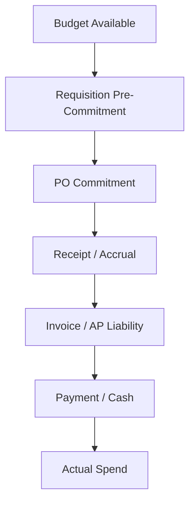

Invariant budget:

- PO approved tidak boleh melebihi available budget kecuali override authority jelas.
- Perubahan cost center/project setelah approval butuh re-budget validation.
- Cancel remaining PO harus release commitment.
- Receipt terhadap PO harus consume commitment sesuai policy.
- Invoice without PO harus melalui stronger approval path.

Failure mode umum:

- budget dicek saat submit requisition, tapi tidak dicek ulang saat PO amount berubah;
- commitment tidak direlease saat PO cancelled;
- partial receipt membuat actual spend ganda;
- currency conversion budget tidak memakai rate snapshot;
- backdated invoice masuk ke closed period tanpa adjustment policy.

---

## 10. Receiving and Inventory Coupling

P2P goods receipt sering memicu inventory.

Tapi receiving dan inventory bukan hal yang sama.

| Receiving | Inventory |
|---|---|
| bukti barang diterima | posisi stok dan movement ledger |
| berorientasi vendor/PO | berorientasi item/location/valuation |
| bisa ada inspection pending | stock bisa quarantine, available, blocked |
| legal/operational evidence | quantity + valuation control |

Event mapping:

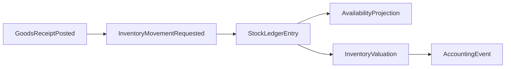

Stock status akibat receiving:

| Receipt Condition | Stock Status |
|---|---|
| accepted immediately | available or put-away pending |
| quality inspection required | quarantine / inspection |
| damaged | rejected / blocked |
| excess receipt tolerated | over-receipt review or available after approval |
| serial mismatch | exception |

Invariant:

- Stock ledger entry harus refer ke receipt line.
- Available quantity tidak boleh bertambah sebelum policy acceptance terpenuhi.
- Batch/serial item harus menyimpan traceability lengkap.
- Reversal receipt harus membuat movement reversal, bukan update/delete movement lama.

---

## 11. Matching Engine Design

Matching engine harus deterministic dan explainable.

### 11.1 Policy Model

```java
public record MatchingPolicy(
    MatchingType type,
    MoneyTolerance priceTolerance,
    QuantityTolerance quantityTolerance,
    TaxTolerance taxTolerance,
    boolean requireInspectionAcceptance,
    boolean allowOverReceipt,
    boolean allowInvoiceBeforeReceipt,
    PolicyVersion version
) {}
```

Policy harus versioned karena invoice yang diproses hari ini mungkin merujuk PO lama.

### 11.2 Evidence Model

```java
public record MatchEvidence(
    VendorInvoiceId invoiceId,
    List<MatchedLineEvidence> lines,
    MatchingPolicySnapshot policy,
    MatchDecision decision,
    List<Variance> variances,
    Instant evaluatedAt,
    UserOrSystemActor evaluatedBy
) {}
```

Tanpa evidence model, Anda hanya punya status `MATCHED`, tapi tidak tahu kenapa cocok.

### 11.3 Variance Handling

Variance umum:

| Variance | Contoh | Handling |
|---|---|---|
| Quantity variance | invoice 10, receipt 8 | block, wait receipt, approve tolerance |
| Price variance | PO $100, invoice $103 | tolerance, buyer approval, vendor dispute |
| Tax variance | expected VAT berbeda | tax review |
| Freight variance | freight tidak ada di PO | landed cost policy |
| UOM variance | box vs each | conversion validation |
| Currency variance | invoice currency beda | policy block atau FX handling |
| Duplicate invoice | nomor invoice sama | hard block/review |

### 11.4 Matching Job as Application Service

```java
public final class InvoiceMatchingJob {
    public void matchInvoice(VendorInvoiceId invoiceId) {
        VendorInvoice invoice = invoiceRepository.get(invoiceId);
        PurchaseOrderSnapshot po = purchaseOrderReader.loadFor(invoice);
        ReceiptSnapshot receipts = receiptReader.loadAcceptedFor(invoice);
        MatchingPolicy policy = policyResolver.resolve(invoice, po);

        MatchEvidence evidence = matchingEngine.evaluate(invoice, po, receipts, policy);

        transactionTemplate.executeWithoutResult(tx -> {
            VendorInvoice locked = invoiceRepository.getForUpdate(invoiceId);
            if (locked.isPosted()) return;
            locked.applyMatchEvidence(evidence);
            invoiceRepository.save(locked);
            outbox.save(new InvoiceMatchedOrBlockedEvent(locked.id(), evidence));
        });
    }
}
```

Perhatikan:

- pembacaan snapshot bisa di luar lock;
- update final harus lock invoice;
- jika invoice sudah posted, job retry tidak mengubahnya;
- evidence disimpan.

---

## 12. Exception Queues: P2P Tidak Selalu Happy Path

ERP besar harus memiliki exception workbench.

Exception types:

| Exception | Owner | SLA |
|---|---|---|
| Missing PO | AP / requester | medium |
| Missing receipt | receiving / requester | high if invoice due |
| Price variance | buyer | high |
| Quantity variance | warehouse / buyer | high |
| Tax mismatch | tax team | high |
| Vendor bank changed | AP control | critical |
| Duplicate invoice suspected | AP control | critical |
| Budget exceeded | budget owner | high |
| Period closed | accounting | high |

Exception bukan sekadar error log. Exception adalah work item dengan:

- owner;
- due date;
- reason code;
- evidence;
- resolution action;
- audit trail;
- escalation;
- link ke dokumen terkait.

State exception:

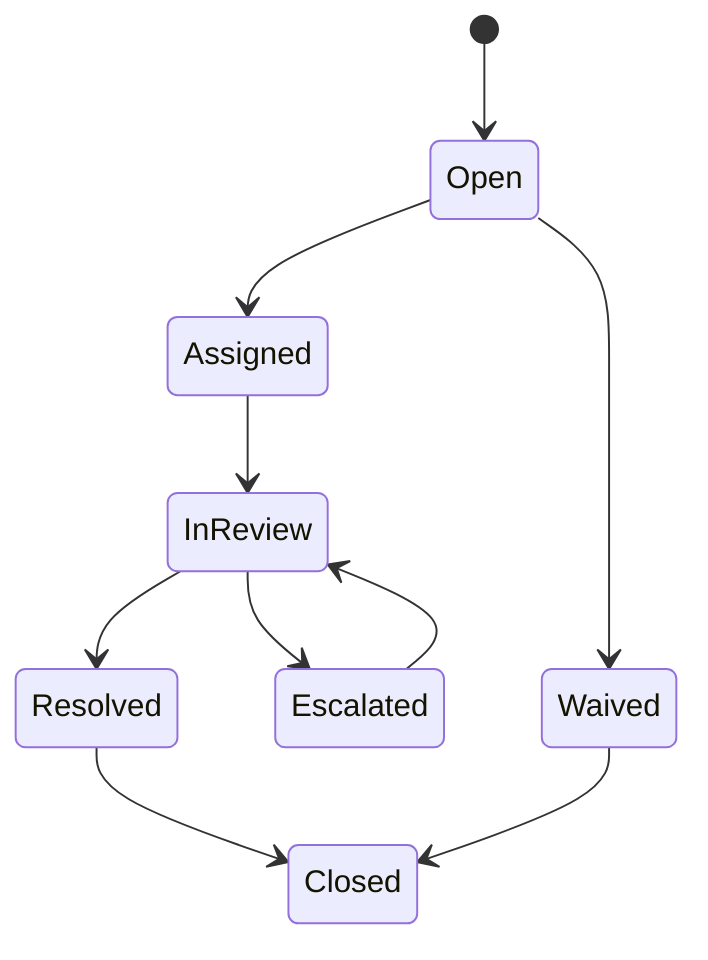

Resolution action harus explicit:

- approve variance;
- request vendor credit note;
- correct receipt;
- correct PO;
- change tax treatment;
- reject invoice;
- create debit memo;
- defer to next period;
- escalate to compliance.

---

## 13. P2P Integration Architecture

P2P biasanya berintegrasi dengan:

- supplier portal;
- EDI gateway;
- procurement marketplace;
- OCR/document capture;
- warehouse management system;
- bank/payment gateway;
- tax engine;
- budget/planning system;
- data warehouse;
- external approval/collaboration tools.

Integration map:

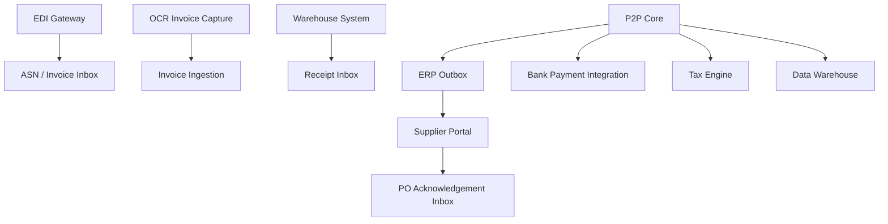

Rules:

- semua inbound integration harus punya inbox/dedup;
- semua outbound side effect harus lewat outbox;
- external reference harus disimpan;
- payload mentah penting harus disimpan sesuai retention policy;
- mapping error harus masuk exception queue;
- jangan menganggap vendor mengirim event berurutan.

### 13.1 Inbound Invoice from OCR

OCR invoice tidak boleh langsung post AP.

Pipeline:

```text
document received
-> OCR extraction
-> vendor resolution
-> duplicate assessment
-> line classification
-> PO/receipt matching candidate
-> human review if confidence low
-> invoice submitted
-> matching engine
-> AP posting
```

Invariant:

- OCR confidence rendah tidak boleh auto-post;
- extracted amount harus cocok dengan invoice total;
- vendor bank info dari invoice harus divalidasi terhadap vendor master;
- jika invoice membawa bank baru, treat as risk event.

### 13.2 EDI Invoice

EDI lebih structured tetapi tetap butuh kontrol.

Failure model:

- same transaction resent;
- interchange accepted but business validation failed;
- vendor sends invoice before ASN/receipt;
- line numbering mismatch;
- UOM mismatch;
- tax category mismatch;
- invoice references old PO revision.

Design:

```java
public record InboundDocumentEnvelope(
    SourceSystem source,
    String interchangeId,
    String businessDocumentType,
    String businessDocumentNumber,
    String rawPayloadHash,
    Instant receivedAt,
    Map<String, String> externalReferences
) {}
```

---

## 14. Security and Segregation of Duties in P2P

P2P adalah high-risk area karena langsung terkait spend dan cash out.

SoD rules umum:

| Risk | Preventive Control |
|---|---|
| user membuat vendor palsu lalu membayar invoice | vendor creation terpisah dari invoice/payment approval |
| requester approve sendiri pembelian besar | approval by authority matrix, not self-approval |
| buyer mengubah PO setelah approval | revision triggers re-approval |
| AP mengubah bank account saat payment | bank change requires independent verification |
| warehouse menerima barang fiktif | receipt role separated from purchasing/AP |
| duplicate invoice paid | duplicate detection + payment block |
| emergency purchase disalahgunakan | stronger audit + retrospective approval |

Permission harus context-aware.

Contoh permission bukan hanya:

```text
CAN_APPROVE_PO
```

Tapi:

```text
CAN_APPROVE_PO where:
- legalEntity in actor.scope
- amount <= actor.approvalLimit(category, currency)
- actor != requester
- actor != PO creator for restricted categories
- period is not closed
- no active SoD conflict
```

---

## 15. Reporting and Reconciliation

P2P reports yang wajib:

| Report | Tujuan |
|---|---|
| Open requisitions | kebutuhan belum jadi PO |
| Open PO | commitment belum selesai |
| Overdue PO | vendor belum kirim |
| Received not invoiced / GRNI | accrual/clearing control |
| Invoiced not received | invoice risk |
| AP aging | hutang berdasarkan jatuh tempo |
| Blocked invoice | cash/payment delay |
| Vendor statement reconciliation | cocokkan catatan vendor vs ERP |
| Spend by supplier/category | analytics procurement |
| Price variance report | procurement performance |
| Duplicate invoice risk report | fraud/error control |

GRNI atau received-not-invoiced adalah report kontrol kritikal.

Pseudo-query konseptual:

```sql
select
  po.legal_entity_id,
  gr.po_line_id,
  sum(gr.accepted_qty * gr.valuation_price) as receipt_value,
  coalesce(sum(inv.matched_qty * inv.unit_price), 0) as invoiced_value,
  sum(gr.accepted_qty * gr.valuation_price) - coalesce(sum(inv.matched_qty * inv.unit_price), 0) as open_grni
from goods_receipt_line gr
join purchase_order_line po on po.id = gr.po_line_id
left join invoice_match_line inv on inv.receipt_line_id = gr.id
where gr.status = 'POSTED'
group by po.legal_entity_id, gr.po_line_id;
```

Di production, jangan rely pada query ad-hoc untuk financial truth. Buat read model rekonsiliasi yang dibangun dari event/posting/subledger yang jelas.

---

## 16. Failure Modes and Rescue Playbooks

### 16.1 Duplicate Vendor Invoice Paid

Root causes:

- duplicate detection lemah;
- vendor invoice number tidak dinormalisasi;
- payment batch tidak cek open amount saat final approval;
- bank callback retry membuat settlement ganda;
- invoice manual bypass matching.

Controls:

- unique risk key;
- fuzzy duplicate workbench;
- payment final validation;
- idempotent bank settlement;
- vendor statement reconciliation;
- exception dashboard.

Rescue:

1. freeze vendor payment if material;
2. identify duplicate invoice/payment chain;
3. create recovery receivable or debit memo;
4. reverse duplicate AP/payment posting sesuai period policy;
5. strengthen matching and payment validation;
6. generate audit report.

### 16.2 PO Closed While Receipt Still Pending

Root causes:

- PO status single enum;
- closure did not check open delivery schedule;
- receiving integration delayed;
- manual close lacks policy.

Controls:

- separate closure dimension;
- close-for-receiving vs close-for-invoicing;
- pending integration check;
- closure reason and approval.

### 16.3 Receipt Posted to Wrong Period

Root causes:

- receiving date and posting date confused;
- fiscal period check skipped;
- WMS integration backdated event;
- timezone boundary error.

Controls:

- explicit document date vs posting date;
- period service;
- backdate policy;
- adjustment posting if period closed.

### 16.4 Vendor Bank Fraud

Root causes:

- bank account changed by AP user with payment permission;
- invoice-provided bank account accepted automatically;
- no cooling-off period;
- no independent verification.

Controls:

- bank master approval workflow;
- SoD;
- payment holds after bank change;
- callback verification;
- high-risk vendor change alert.

---

## 17. Testing Strategy for P2P

P2P testing harus scenario-driven.

### 17.1 Golden Scenarios

Minimal test pack:

1. requisition approved -> PO issued -> partial receipt -> partial invoice -> partial payment;
2. over-receipt within tolerance;
3. over-receipt outside tolerance;
4. invoice price variance within tolerance;
5. invoice price variance outside tolerance;
6. invoice before receipt;
7. receipt before invoice with GRNI accrual;
8. PO cancellation after partial receipt;
9. vendor invoice duplicate;
10. payment callback duplicate;
11. vendor bank changed after invoice approval;
12. period closed before backdated receipt;
13. tax mismatch;
14. service PO with two-way match;
15. four-way match with inspection rejection;
16. return to vendor after receipt;
17. debit note/credit memo flow;
18. budget exceeded;
19. emergency non-PO invoice;
20. intercompany procurement.

### 17.2 Invariant Tests

Example property-like tests:

```java
@Test
void matchedInvoiceCannotExceedReceiptOutsideTolerance() {
    MatchingPolicy policy = policyWithNoQuantityTolerance();
    PurchaseOrderLine po = poLine(qty("10 EA"), money("100.00", "USD"));
    ReceiptLine receipt = receiptLine(po.id(), qty("8 EA"));
    VendorInvoiceLine invoice = invoiceLine(po.id(), qty("10 EA"), money("1000.00", "USD"));

    MatchResult result = matchingEngine.evaluate(invoice, po, List.of(receipt), policy);

    assertThat(result.isBlocked()).isTrue();
    assertThat(result.variances()).contains(VarianceType.QUANTITY_OVER_BILLED);
}
```

### 17.3 Reconciliation Tests

For every posted receipt/invoice/payment:

- subledger balance should equal GL control balance by period;
- GRNI open amount should reduce after invoice matching;
- AP aging should equal open AP schedules;
- payment allocation should never exceed invoice open amount;
- reversal should net to zero with original posting.

---

## 18. Observability for P2P

Technical observability:

- command latency;
- outbox lag;
- matching job lag;
- failed integration count;
- DB lock wait on PO/receipt/invoice;
- duplicate idempotency hit rate;
- payment callback retry count.

Business observability:

- open PO value;
- blocked invoice value;
- GRNI aging;
- invoices due in 7 days;
- payment batches pending approval;
- exceptions by owner/SLA;
- top variance suppliers;
- unmatched receipts.

Log fields:

```json
{
  "event": "InvoiceMatchingCompleted",
  "invoiceId": "...",
  "vendorId": "...",
  "poNumber": "...",
  "legalEntityId": "...",
  "matchingType": "THREE_WAY",
  "decision": "BLOCKED",
  "varianceTypes": ["PRICE_VARIANCE"],
  "policyVersion": "P2P-MATCH-2026-01",
  "correlationId": "..."
}
```

---

## 19. Java Implementation Blueprint

### 19.1 Package Structure

```text
com.company.erp.p2p
  requisition
    domain
    application
    infrastructure
    api
  purchasing
    domain
    application
    infrastructure
    api
  receiving
    domain
    application
    infrastructure
    api
  invoice
    domain
    application
    matching
    infrastructure
    api
  payment
    domain
    application
    infrastructure
    api
  reconciliation
    readmodel
    job
  shared
    money
    quantity
    policy
    document
    audit
```

### 19.2 Application Service Style

```java
@Service
public class PostGoodsReceiptUseCase {
    private final GoodsReceiptRepository receiptRepository;
    private final PurchaseOrderReader purchaseOrderReader;
    private final ReceivingPolicyService policyService;
    private final FiscalPeriodService fiscalPeriodService;
    private final Outbox outbox;

    @Transactional
    public GoodsReceiptId handle(PostGoodsReceiptCommand command) {
        PurchaseOrderSnapshot po = purchaseOrderReader.load(command.purchaseOrderId());
        ReceivingPolicy policy = policyService.resolve(po, command.receivingLocation());
        FiscalPeriod period = fiscalPeriodService.resolve(command.postingDate(), po.legalEntityId());

        GoodsReceipt receipt = GoodsReceipt.create(command, po);
        receipt.post(policy, period);

        receiptRepository.save(receipt);
        outbox.save(receipt.toPostedEvent(command.correlationId()));
        return receipt.id();
    }
}
```

### 19.3 Read Model Projection

```java
public final class OpenPurchaseOrderProjectionHandler {
    public void on(PurchaseOrderIssued event) {
        projection.upsert(event.poNumber(), event.lines());
    }

    public void on(GoodsReceiptPosted event) {
        projection.reduceOpenReceiptQuantity(event.poLineId(), event.acceptedQuantity());
    }

    public void on(PurchaseOrderClosedForReceiving event) {
        projection.closeReceiving(event.poId(), event.reason());
    }
}
```

Projection tidak boleh menjadi source of truth. Ia mempercepat inquiry/report.

---

## 20. Checklist Design Review P2P

Gunakan checklist ini saat review desain P2P.

### Domain and Lifecycle

- Apakah requisition, PO, receipt, invoice, payment dimodelkan sebagai lifecycle berbeda?
- Apakah status PO tidak dipadatkan menjadi satu enum misleading?
- Apakah close-for-receiving dan close-for-invoicing dibedakan?
- Apakah reversal/correction dipakai, bukan update/delete in-place?

### Control and Compliance

- Apakah approval snapshot disimpan?
- Apakah SoD dicek untuk vendor, PO, invoice, payment?
- Apakah vendor bank change punya workflow kontrol?
- Apakah emergency purchase punya stronger audit?

### Accounting

- Apakah receipt accrual/GRNI jelas?
- Apakah AP invoice posting balanced dan traceable?
- Apakah reversal menjaga audit chain?
- Apakah subledger bisa direkonsiliasi ke GL?

### Integration

- Apakah inbound punya dedup/inbox?
- Apakah outbound lewat outbox?
- Apakah EDI/OCR failure masuk exception queue?
- Apakah callback bank idempotent?

### Performance

- Apakah open PO inquiry memakai projection?
- Apakah matching job bisa batch tanpa lock besar?
- Apakah duplicate detection punya index yang tepat?
- Apakah GRNI report tidak menghajar OLTP tanpa read model?

### Operability

- Apakah ada dashboard blocked invoice, GRNI aging, payment pending?
- Apakah exception punya owner dan SLA?
- Apakah support bisa melihat document chain end-to-end?
- Apakah audit export bisa menjawab dispute?

---

## 21. 20-Hour Practice Slice untuk P2P

Latihan efektif untuk menguasai part ini.

### Hour 1-3: Draw the lifecycle

Gambar state machine untuk:

- requisition;
- purchase order;
- goods receipt;
- vendor invoice;
- payment.

Tandai illegal transitions.

### Hour 4-6: Model aggregate boundaries

Buat class skeleton:

- `PurchaseOrder`;
- `GoodsReceipt`;
- `VendorInvoice`;
- `PaymentInstruction`.

Pastikan tidak ada aggregate yang mengubah state context lain.

### Hour 7-10: Build matching engine

Implementasi small matching engine:

- PO vs receipt vs invoice;
- tolerance policy;
- evidence object;
- blocked/matched decision.

### Hour 11-13: Add idempotency

Tambahkan idempotency untuk:

- invoice ingestion;
- goods receipt inbound;
- payment callback.

### Hour 14-16: Add accounting events

Buat event:

- `GoodsReceiptPosted`;
- `VendorInvoiceMatched`;
- `VendorInvoicePosted`;
- `PaymentSettled`.

Map ke accounting event request.

### Hour 17-18: Build exception queue

Buat exception state machine untuk matching variance.

### Hour 19-20: Run failure drills

Simulasikan:

- duplicate invoice;
- partial receipt;
- backdated receipt;
- bank callback duplicate;
- vendor bank changed.

---

## 22. Kesimpulan

P2P adalah domain yang terlihat sederhana di UI tetapi kompleks secara kontrol.

Mental model utama:

1. **P2P adalah control loop**, bukan CRUD pembelian.
2. **Requisition, PO, receipt, invoice, payment adalah lifecycle berbeda**.
3. **Document chain adalah audit backbone**.
4. **Receipt bukan invoice, invoice bukan payment, payment accepted bukan settlement**.
5. **Matching engine harus deterministic dan explainable**.
6. **P2P harus idempotent karena integrasi vendor/bank/OCR/EDI akan duplicate dan out-of-order**.
7. **Subledger, inventory, dan GL harus bisa direkonsiliasi**.
8. **Exception queue adalah fitur inti, bukan afterthought**.

Di level top engineer, Anda tidak mendesain P2P berdasarkan screen. Anda mendesainnya berdasarkan invariant, evidence, lifecycle, dan failure containment.

---

## 23. Source Notes

Referensi konseptual dan teknis yang relevan untuk part ini:

- Jakarta EE Platform menyediakan layanan enterprise seperti transaction management, persistence, messaging, batch, REST, dan concurrency yang relevan untuk aplikasi ERP Java.
- Jakarta Persistence mendefinisikan standar object/relational mapping Java untuk data relational, tetapi desain P2P tetap harus menjaga aggregate boundary dan invariant bisnis di atas ORM.
- Spring Boot modern relevan sebagai runtime Java enterprise application, dengan baseline Java 17+ pada generasi modernnya.
- Apache OFBiz User Manual mendokumentasikan proses purchase invoice dan purchase order sebagai bagian dari ERP open-source berbasis Java.
- GS1 GTIN standards relevan untuk identifikasi trade item yang dipesan, diberi harga, atau diinvoiced di supply chain.
- Pola outbox/inbox, idempotency, dan reconciliation adalah praktik umum dalam sistem enterprise terdistribusi untuk menjaga konsistensi side effect.
