# Part 012 — Order-to-Cash Domain

## 1. Target Skill Part Ini

Order-to-Cash atau O2C adalah domain ERP yang mengubah permintaan pelanggan menjadi komitmen penjualan, pemenuhan barang/jasa, penagihan, penerimaan kas, dan rekonsiliasi.

> **Skill inti part ini:** mampu mendesain O2C domain dalam Java ERP besar sehingga quotation, sales order, pricing, credit limit, allocation, shipment, invoicing, accounts receivable, cash receipt, return, dan revenue boundary tetap konsisten walaupun ada partial shipment, backorder, price override, tax mismatch, payment delay, return, cancellation, duplicate order, dan integration failure.

O2C bukan sekadar `sales_order` dan `invoice`.

O2C adalah gabungan dari:

- commercial commitment;
- fulfillment orchestration;
- inventory reservation;
- credit risk control;
- pricing and tax calculation;
- revenue/liability boundary;
- receivable management;
- customer dispute handling;
- cash application;
- audit and regulatory evidence.

Jika salah desain:

- barang dikirim ke pelanggan yang melewati credit limit;
- invoice dibuat sebelum shipment valid;
- revenue diakui saat belum memenuhi policy;
- customer membayar tetapi AR tetap open;
- return tidak membalik inventory dan receivable dengan benar;
- tax calculation berbeda antara order dan invoice;
- duplicate order dari marketplace membuat shipment ganda;
- cancellation terlambat sehingga warehouse tetap kirim;
- report sales, inventory, AR, dan GL tidak cocok.

---

## 2. Kaufman Deconstruction: Memecah O2C Menjadi Sub-Skill

| Sub-skill | Pertanyaan yang Harus Bisa Dijawab | Output Engineering |
|---|---|---|
| Demand capture | Bagaimana permintaan pelanggan masuk? | quotation, sales order, channel order, contract release |
| Commercial calculation | Berapa harga, diskon, tax, freight, dan margin? | pricing snapshot, discount policy, tax quote, promotion evidence |
| Credit control | Apakah pelanggan boleh diberi order/ship/invoice? | credit check, hold, release workflow |
| Availability | Apakah barang tersedia kapan dan di mana? | ATP/CTP, reservation, backorder, substitution |
| Fulfillment | Bagaimana order dipick, dikirim, dan dikonfirmasi? | pick list, shipment, delivery confirmation |
| Invoicing | Kapan pelanggan ditagih? | invoice policy, billing schedule, invoice document |
| Receivable | Bagaimana piutang dicatat dan ditagih? | AR schedule, aging, dunning, dispute |
| Cash application | Pembayaran diterapkan ke invoice mana? | receipt allocation, remittance matching, bank reconciliation |
| Returns | Bagaimana retur membalik order, stock, AR, dan tax? | RMA, credit memo, replacement, restocking |
| Reconciliation | Apakah order, shipment, invoice, receipt, GL cocok? | subledger reconciliation, revenue/cash control |

O2C harus dilatih dengan skenario edge, bukan happy path.

Contoh practice cases:

- order 10 unit, available 6, customer accepts partial shipment;
- price override requires approval;
- tax address changes after quotation;
- customer hits credit limit after order but before shipment;
- order cancelled while pick already started;
- invoice generated but shipment reversed;
- customer pays lump sum for multiple invoices;
- bank statement has payment with missing remittance;
- return after invoice paid;
- duplicate marketplace order received;
- shipment split across warehouses;
- subscription/service invoice has no physical shipment.

---

## 3. O2C Sebagai Revenue and Fulfillment Control Loop

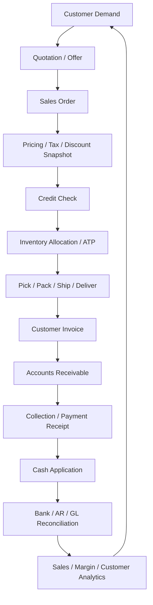

Setiap node adalah control point:

- quotation: apakah offer valid dan terikat waktu?
- order: apakah customer, price, item, dan delivery terms sah?
- credit: apakah exposure masih diterima?
- allocation: apakah barang benar-benar bisa disediakan?
- fulfillment: apakah shipment actual sesuai order?
- invoice: apakah tagihan sesuai shipment/contract?
- AR: apakah piutang dicatat dan dijadwalkan?
- cash application: apakah pembayaran dialokasikan benar?
- reconciliation: apakah bank, AR subledger, dan GL cocok?

---

## 4. Batas Domain O2C

O2C sering gagal karena semua logic diletakkan di `SalesOrderService`.

Batas yang lebih sehat:

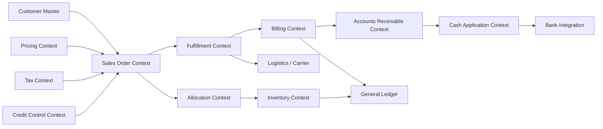

Ownership:

| Context | Owns | Tidak Boleh Diam-diam Mengubah |
|---|---|---|
| Sales Order | commercial order intent and commitment | stock ledger, AR ledger, bank receipt |
| Pricing | price calculation policy/evidence | order status, shipment |
| Credit Control | customer exposure and holds | invoice amount, stock movement |
| Allocation | reservation/ATP commitment | customer invoice |
| Fulfillment | picking, packing, shipment confirmation | sales price |
| Billing | invoice creation and billing schedule | physical shipment truth |
| Accounts Receivable | invoice open amount, due date, aging | shipment status |
| Cash Application | payment allocation and receipt matching | invoice original amount |
| Inventory | stock movement and availability | customer credit |
| GL | journal and financial balance | operational lifecycle |

Rule:

> Sales order boleh memulai proses fulfillment, tetapi tidak boleh menjadi pemilik stock ledger, invoice ledger, dan payment ledger sekaligus.

---

## 5. Canonical O2C Lifecycle

### 5.1 Quotation

Quotation adalah penawaran harga/terms kepada customer sebelum order menjadi komitmen.

Quotation menjawab:

- produk/jasa apa yang ditawarkan;
- harga dan diskon apa yang berlaku;
- pajak dan freight estimate;
- masa berlaku quote;
- minimum order quantity;
- delivery promise;
- approval untuk discount/margin exception;
- terms and conditions.

State quotation:

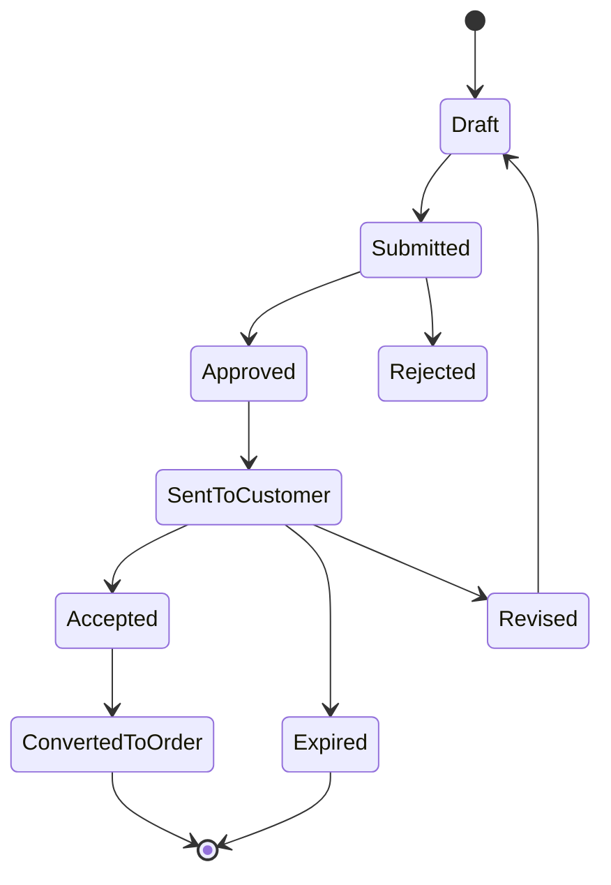

Invariant:

- Quote expired tidak boleh langsung convert ke order tanpa repricing/revalidation.
- Discount override harus memiliki approval evidence.
- Tax/freight estimate harus jelas sebagai estimate jika belum final.
- Quote revision harus mempertahankan chain, bukan overwrite.

### 5.2 Sales Order

Sales order adalah komitmen penjualan ke customer.

Sales order header:

| Field | Makna |
|---|---|
| orderNumber | nomor order immutable setelah confirm |
| customer | sold-to party |
| billTo / shipTo | party/address untuk invoice dan delivery |
| legalEntity | entity penjual |
| salesOrg / channel | organisasi/channel penjualan |
| currency | mata uang order |
| paymentTerms | termin pembayaran |
| deliveryTerms | shipping/incoterm if applicable |
| priceSnapshot | hasil pricing saat commit |
| taxSnapshot | hasil tax calculation saat commit |
| creditDecision | hasil credit check |
| status dimensions | document, approval, allocation, fulfillment, billing, payment |

Sales order line:

| Field | Makna |
|---|---|
| item/service | produk atau jasa |
| orderedQty | qty customer order |
| unitPrice | price after price list/contract |
| discount | discount line/header allocation |
| taxCode/taxAmount | tax treatment |
| requestedDate | tanggal customer ingin menerima |
| promisedDate | tanggal yang dijanjikan |
| warehouse/source | lokasi fulfillment |
| reservationPolicy | hard/soft/no reservation |
| billingPolicy | bill on shipment, milestone, subscription, advance |

State sales order sebaiknya multi-dimensional.

```java
public record SalesOrderStatus(
    DocumentStatus document,
    ApprovalStatus approval,
    CreditStatus credit,
    AllocationStatus allocation,
    FulfillmentStatus fulfillment,
    BillingStatus billing,
    PaymentStatus payment,
    ClosureStatus closure
) {}
```

Kenapa?

Sales order bisa:

- confirmed, credit-held, not allocated;
- confirmed, partially allocated, not shipped;
- partially shipped, partially invoiced;
- fully shipped, invoice blocked;
- invoiced, unpaid;
- paid, return pending;
- closed for fulfillment but open for credit memo.

Satu enum `COMPLETE` tidak cukup.

### 5.3 Credit Check

Credit control mencegah organisasi menjual/ship ke customer dengan exposure terlalu tinggi.

Exposure umum:

```text
open AR
+ uninvoiced shipped value
+ confirmed unshipped order value
+ pending credit memo adjustment
- unapplied cash / deposits
```

Credit decision:

| Decision | Meaning |
|---|---|
| Approved | exposure within limit |
| Warning | near limit but can proceed |
| Hold | cannot allocate/ship/invoice until released |
| Manual Review | needs credit manager decision |
| Exempt | policy excludes order/customer |

Credit check timing:

- saat order confirmation;
- saat allocation/reservation;
- saat shipment release;
- saat invoice generation for risk-sensitive business;
- saat customer master credit limit changes.

Credit release harus menyimpan evidence:

```java
public record CreditReleaseEvidence(
    CustomerId customerId,
    SalesOrderId orderId,
    Money exposureBeforeRelease,
    Money exposureAfterRelease,
    Money creditLimit,
    UserId releasedBy,
    ApprovalLimit approvalLimit,
    String reasonCode,
    Instant releasedAt
) {}
```

Invariant:

- user sales tidak boleh release credit hold sendiri jika policy melarang.
- credit decision harus versioned terhadap policy dan exposure snapshot.
- shipment release harus re-check credit jika exposure bisa berubah antara order dan shipment.

### 5.4 Allocation and Availability

Allocation adalah komitmen inventory terhadap sales order.

Istilah:

| Term | Makna |
|---|---|
| On hand | stock fisik tercatat |
| Available to promise / ATP | stock yang bisa dijanjikan setelah reservation dan supply plan |
| Reserved | stock dialokasikan untuk order tertentu |
| Allocated | order line mendapat supply source |
| Picked | barang diambil dari storage |
| Shipped | barang keluar/dikirim |
| Backordered | demand belum terpenuhi |

Allocation lifecycle:

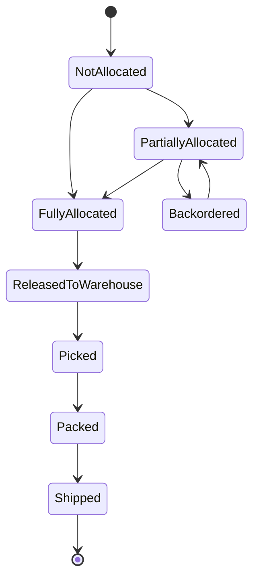

Invariant:

- allocation tidak boleh melebihi available supply sesuai policy;
- hard reservation harus mengurangi available-to-promise;
- allocation harus punya expiry/release policy untuk order stale;
- cancellation harus release reservation;
- shipment harus consume reservation atau mencatat authorized exception;
- serial/batch item harus mengikat traceability saat pick/ship.

### 5.5 Fulfillment

Fulfillment mengubah order menjadi shipment.

Fulfillment steps:

```text
release to warehouse
-> wave/batch planning
-> pick list
-> picking
-> packing
-> shipment creation
-> carrier handoff
-> shipment confirmation
-> delivery confirmation if required
```

Shipment confirmation adalah titik kritis karena sering menjadi trigger invoice dan inventory movement.

Shipment evidence:

- order line reference;
- picked quantity;
- shipped quantity;
- warehouse/location;
- batch/serial;
- carrier;
- tracking number;
- shipment date;
- delivery terms;
- user/system actor;
- exception reason if substitute/short ship.

Fulfillment tidak boleh mengubah price. Jika quantity berbeda, billing harus menghitung berdasarkan shipped/accepted qty sesuai policy.

### 5.6 Billing and Invoice

Billing mengubah fulfillment/contract milestone menjadi customer invoice.

Billing triggers:

| Trigger | Contoh |
|---|---|
| shipment confirmation | goods shipped |
| delivery confirmation | invoice after proof of delivery |
| milestone acceptance | project/service milestone |
| subscription schedule | recurring billing |
| advance billing | prepayment/deposit |
| usage rating | metered service |

Invoice lifecycle:

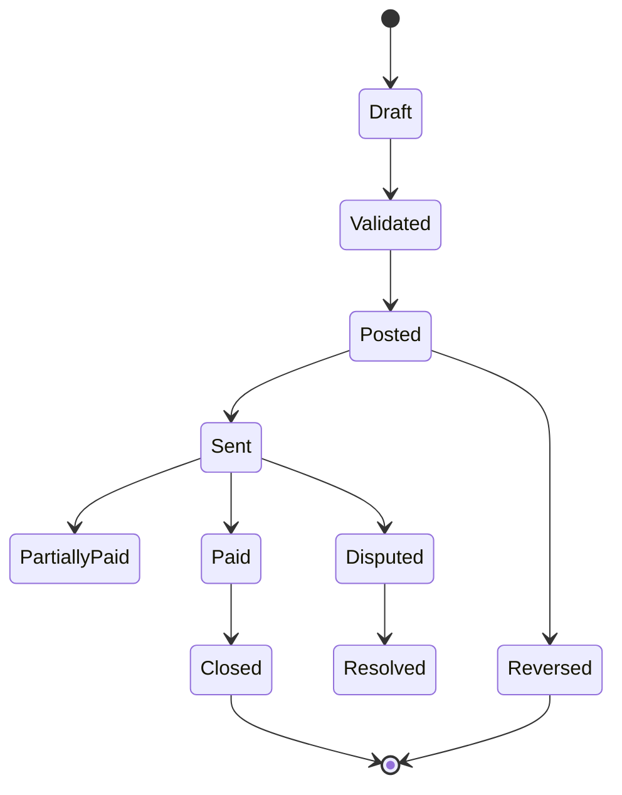

Invoice invariant:

- invoice posted tidak boleh diubah in-place;
- invoice line harus traceable ke order/shipment/billing schedule;
- tax basis harus explainable;
- revenue/liability posting harus policy-driven;
- invoice number legal sequence harus immutable;
- cancellation setelah posted harus melalui credit memo/reversal.

### 5.7 Accounts Receivable

AR menyimpan piutang customer.

AR schedule:

| Field | Makna |
|---|---|
| invoiceId | invoice source |
| customerId | debtor |
| dueDate | tanggal jatuh tempo |
| openAmount | sisa piutang |
| currency | currency receivable |
| paymentTerms | terms source |
| dunningStatus | status collection |
| disputeStatus | dispute jika ada |
| writeOffStatus | bad debt/write-off policy |

AR aging bukan report UI biasa. AR aging adalah kontrol cash collection.

Bucket umum:

```text
Current, 1-30, 31-60, 61-90, >90 days past due
```

Invariant:

- open amount = original amount - allocated receipts - credit memos - write-offs + adjustments;
- allocation tidak boleh membuat open amount negatif kecuali overpayment policy;
- currency gain/loss harus diakui sesuai policy saat settlement jika multi-currency;
- disputed invoice bisa dikecualikan dari dunning sesuai policy tetapi tidak hilang dari AR.

### 5.8 Cash Receipt and Application

Cash receipt adalah uang masuk. Cash application adalah penerapan uang ke invoice.

Customer bisa membayar:

- invoice tunggal;
- beberapa invoice sekaligus;
- sebagian invoice;
- tanpa remittance;
- lebih bayar;
- kurang bayar karena deduction;
- dengan bank fee;
- di currency berbeda.

Cash application pipeline:

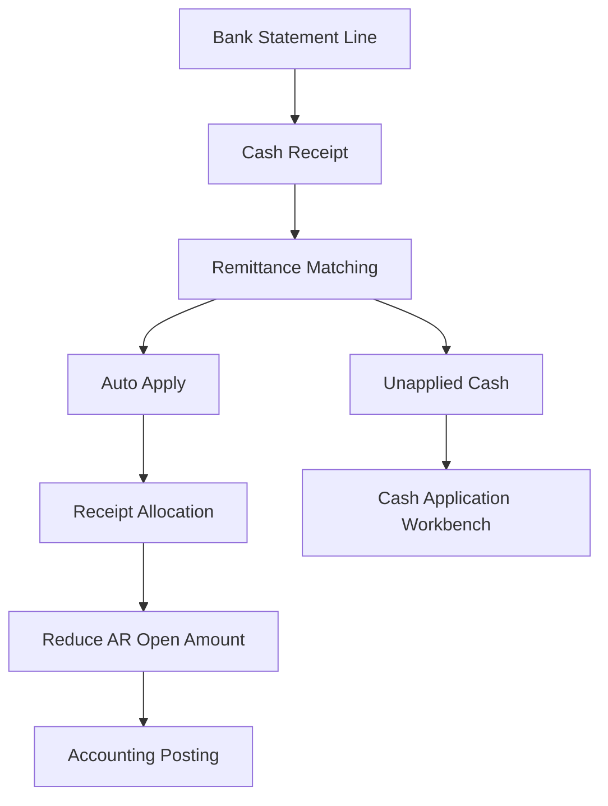

Invariant:

- bank statement line duplicate tidak boleh membuat receipt ganda;
- receipt allocation harus traceable ke invoice;
- unapplied cash harus terlihat di report;
- receipt reversal harus membalik allocation dan accounting;
- overpayment harus menjadi unapplied cash/customer credit, bukan mengurangi invoice lain sembarangan.

---

## 6. O2C Data Model

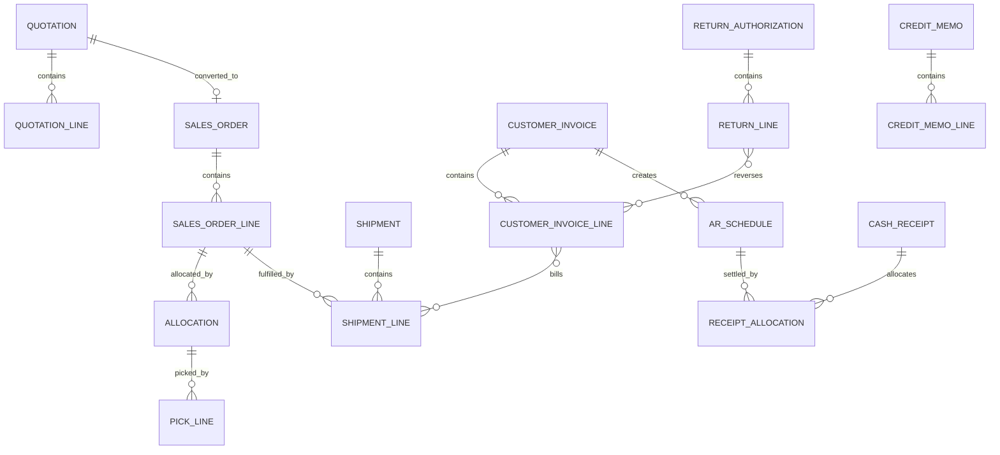

### 6.1 Document Chain

Canonical chain:

```text
Quotation -> Sales Order -> Allocation -> Shipment -> Invoice -> AR Schedule -> Cash Receipt -> Bank Reconciliation
```

Alternative chains:

```text
Sales Order -> Advance Invoice -> Customer Deposit -> Shipment -> Final Invoice
Sales Order -> Shipment -> Invoice -> Return Authorization -> Credit Memo -> Refund/Offset
Contract -> Billing Schedule -> Invoice -> Receipt Allocation
```

O2C harus bisa menjawab:

- order ini berasal dari quote/contract mana?
- price dan discount disetujui oleh siapa?
- apakah credit hold pernah terjadi dan siapa release?
- shipment mana yang menjadi dasar invoice?
- invoice mana yang belum dibayar?
- pembayaran bank statement ini dialokasikan ke invoice mana?
- return ini membalik shipment/invoice mana?
- jurnal apa yang dibuat untuk shipment, invoice, receipt, dan credit memo?

### 6.2 Snapshot Rules

| Data | Snapshot Wajib? | Alasan |
|---|---:|---|
| Customer legal name/tax ID | Ya | invoice evidence |
| Bill-to/ship-to address | Ya | tax, delivery, dispute |
| Price list/contract price | Ya | audit commercial |
| Discount approval | Ya | margin control |
| Tax calculation | Ya | tax audit |
| Credit decision | Ya | risk control |
| UOM conversion | Ya | quantity correctness |
| Item description | Ya | invoice/customer evidence |
| Carrier/tracking | Ya | delivery evidence |
| Payment terms | Ya | due date and dunning |

Rule:

> Jika nilai mempengaruhi customer commitment, tax, revenue, receivable, delivery, atau dispute, simpan snapshot transaksi.

---

## 7. Designing Aggregates in Java

### 7.1 SalesOrder Aggregate

```java
public final class SalesOrder {
    private final SalesOrderId id;
    private final SalesOrderNumber number;
    private final CustomerSnapshot customer;
    private final LegalEntityId legalEntityId;
    private final List<SalesOrderLine> lines;
    private PriceSnapshot priceSnapshot;
    private TaxSnapshot taxSnapshot;
    private CreditDecisionSnapshot creditDecision;
    private DocumentStatus documentStatus;
    private ClosureStatus closureStatus;
    private long version;

    public void confirm(ConfirmSalesOrderCommand command,
                        PricingResult pricing,
                        TaxResult tax,
                        CreditDecision credit) {
        requireDraftOrSubmitted();
        requireAtLeastOneLine();
        requirePricingCoversAllLines(pricing);
        requireTaxCoversAllLines(tax);
        requireCreditAllowedOrHoldable(credit);

        this.priceSnapshot = pricing.snapshot();
        this.taxSnapshot = tax.snapshot();
        this.creditDecision = credit.snapshot();
        this.documentStatus = credit.isHold()
            ? DocumentStatus.confirmedOnHold(command.actor())
            : DocumentStatus.confirmed(command.actor());
    }

    public void cancel(CancelReason reason, FulfillmentSnapshot fulfillment) {
        requireNotClosed();
        requireCancellationAllowed(fulfillment);
        this.closureStatus = ClosureStatus.cancelled(reason);
    }
}
```

Sales order aggregate menjaga commercial commitment. Ia tidak menulis stock ledger, AR ledger, atau bank receipt.

### 7.2 Allocation Aggregate

```java
public final class Allocation {
    private final AllocationId id;
    private final SalesOrderLineId orderLineId;
    private final WarehouseId warehouseId;
    private final Quantity allocatedQuantity;
    private AllocationStatus status;

    public void reserve(AvailabilitySnapshot availability, AllocationPolicy policy) {
        requireNotReserved();
        policy.requireAvailable(availability, allocatedQuantity);
        this.status = AllocationStatus.RESERVED;
    }

    public void release(ReleaseReason reason) {
        requireReservedOrAllocated();
        this.status = AllocationStatus.released(reason);
    }
}
```

Allocation menjaga supply commitment. Inventory stock ledger tetap di Inventory context.

### 7.3 Shipment Aggregate

```java
public final class Shipment {
    private final ShipmentId id;
    private final SalesOrderId salesOrderId;
    private final List<ShipmentLine> lines;
    private ShipmentStatus status;

    public void confirm(ShipmentConfirmation confirmation, ShipmentPolicy policy) {
        requirePackedOrReadyToShip();
        policy.validateShipment(lines, confirmation);
        for (ShipmentLine line : lines) {
            line.freezeActualShippedSnapshot(confirmation);
        }
        this.status = ShipmentStatus.confirmed(confirmation.confirmedAt());
    }

    public void reverse(ShipmentReversalReason reason) {
        requireConfirmed();
        requireReversalAllowed(reason);
        this.status = ShipmentStatus.reversed(reason);
    }
}
```

Shipment confirmation memicu event untuk billing dan inventory, bukan langsung membuat invoice di aggregate shipment.

### 7.4 CustomerInvoice Aggregate

```java
public final class CustomerInvoice {
    private final CustomerInvoiceId id;
    private final CustomerInvoiceNumber number;
    private final CustomerSnapshot customer;
    private final List<CustomerInvoiceLine> lines;
    private Money totalAmount;
    private PostingStatus postingStatus;
    private PaymentStatus paymentStatus;

    public void validate(BillingPolicy policy, TaxValidation taxValidation) {
        requireDraft();
        policy.requireBillable(lines);
        requireTaxValid(taxValidation);
    }

    public void post(InvoiceNumber number, FiscalPeriod period) {
        requireValidated();
        requirePeriodOpen(period);
        this.postingStatus = PostingStatus.posted(number, period.id());
    }

    public void applyPayment(ReceiptAllocation allocation) {
        requirePosted();
        requireAllocationDoesNotOverpay(allocation);
        this.paymentStatus = paymentStatus.apply(allocation.amount());
    }
}
```

Invoice menjaga receivable document, bukan bank statement truth.

---

## 8. Transaction Boundary O2C

O2C perlu memisahkan command synchronous dan side effect asynchronous.

| Command | DB Transaction | Async Effects |
|---|---|---|
| Confirm sales order | save order + price/tax/credit snapshot + outbox | allocation request, confirmation notification |
| Reserve inventory | save allocation + outbox | update ATP projection |
| Confirm shipment | save shipment + outbox | inventory movement, billing candidate |
| Generate invoice | save invoice + AR schedule + outbox | send invoice, posting request |
| Apply cash receipt | save receipt allocation + outbox | update AR, GL posting, customer balance projection |
| Process return | save RMA/return + outbox | inventory return movement, credit memo candidate |

Anti-pattern:

```java
@Transactional
public void confirmOrder(UUID orderId) {
    salesOrderRepository.confirm(orderId);
    inventoryRepository.reserve(orderId);
    warehouseApi.createPickList(orderId);
    invoiceRepository.createInvoice(orderId);
    glRepository.postRevenue(orderId);
}
```

Masalah:

- order confirmation tidak selalu berarti stock tersedia;
- pick list adalah external side effect;
- invoice bisa tergantung shipment, bukan order;
- revenue recognition bisa berbeda dari invoice;
- failure akan membuat rollback yang tidak sesuai realita bisnis.

Pattern:

```java
@Transactional
public SalesOrderId confirm(ConfirmSalesOrderCommand command) {
    PricingResult pricing = pricingPort.price(command);
    TaxResult tax = taxPort.calculate(command, pricing);
    CreditDecision credit = creditPort.check(command.customerId(), pricing.total());

    SalesOrder order = salesOrderFactory.create(command);
    order.confirm(command, pricing, tax, credit);

    salesOrderRepository.save(order);
    outbox.save(order.confirmedEvent(command.correlationId()));
    return order.id();
}
```

Event handler:

```java
public void onSalesOrderConfirmed(SalesOrderConfirmed event) {
    inbox.deduplicate(event.eventId(), () -> {
        if (event.creditDecision().isHold()) {
            creditWorkQueue.createHoldTask(event);
            return;
        }
        allocationService.requestAllocation(event.toAllocationRequest());
    });
}
```

---

## 9. Pricing, Discount, and Tax Snapshot

O2C pricing adalah domain sendiri.

Pricing sources:

- price list;
- customer contract;
- customer group price;
- volume tier;
- campaign/promotion;
- manual override;
- bundle pricing;
- freight charge;
- surcharge;
- tax-inclusive pricing;
- currency/FX rate.

Pricing result harus explainable:

```java
public record PriceCalculationResult(
    Money listAmount,
    List<DiscountEvidence> discounts,
    Money netAmount,
    Money freightAmount,
    Money taxableBase,
    PricePolicyVersion policyVersion,
    List<String> appliedRules
) {}
```

Tax calculation harus snapshot:

```java
public record TaxSnapshot(
    AddressSnapshot shipTo,
    AddressSnapshot billTo,
    TaxJurisdiction jurisdiction,
    List<TaxLine> taxLines,
    TaxPolicyVersion policyVersion,
    Instant calculatedAt
) {}
```

Invariant:

- invoice tax should be recalculated or validated according to billing policy, not blindly copied if facts changed materially;
- price override above threshold requires approval evidence;
- discount stacking must be deterministic;
- quote-to-order conversion must preserve or revalidate pricing based on quote validity;
- currency conversion must use rate snapshot.

---

## 10. Credit Control Design

Credit control sering dianggap simple, padahal menjadi guardrail untuk cash risk.

### 10.1 Exposure Projection

Exposure projection bisa eventually consistent tetapi decision harus menggunakan snapshot yang cukup defensible.

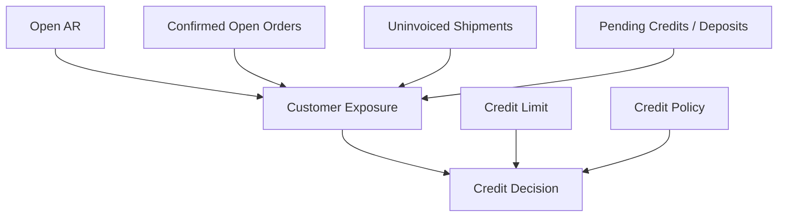

### 10.2 Credit Hold Levels

| Hold Level | Stops |
|---|---|
| Order hold | order cannot be confirmed |
| Allocation hold | stock cannot be reserved |
| Shipment hold | warehouse cannot release shipment |
| Billing hold | invoice requires review |
| Customer hold | all new transactions blocked |

ERP besar butuh hold reason granular.

```java
public enum CreditHoldReason {
    LIMIT_EXCEEDED,
    OVERDUE_INVOICE,
    CUSTOMER_BLOCKED,
    HIGH_RISK_COUNTRY,
    MANUAL_CREDIT_REVIEW,
    DISPUTE_THRESHOLD_EXCEEDED
}
```

### 10.3 Credit Release

Credit release harus idempotent, auditable, dan scope-limited.

```java
public void releaseCreditHold(ReleaseCreditHoldCommand command) {
    CreditHold hold = holdRepository.getForUpdate(command.holdId());
    CreditPolicy policy = policyService.resolve(hold.customerId(), hold.legalEntityId());
    policy.requireActorCanRelease(command.actor(), hold.amount(), hold.reason());
    hold.release(command.actor(), command.reason(), policy.snapshot());
    outbox.save(hold.releasedEvent());
}
```

Release untuk order tertentu tidak berarti release customer-level hold global.

---

## 11. Fulfillment and Billing Policies

Billing tidak selalu berdasarkan order quantity.

| Business Model | Billing Basis |
|---|---|
| physical goods | shipped quantity or delivered quantity |
| project service | milestone acceptance |
| subscription | billing schedule |
| usage-based | metered usage rating |
| advance payment | deposit/advance invoice |
| consignment | consumption report |
| dropship | supplier shipment confirmation |

Billing policy object:

```java
public record BillingPolicy(
    BillingTrigger trigger,
    boolean requireShipmentConfirmation,
    boolean requireProofOfDelivery,
    boolean allowPartialBilling,
    boolean consolidateShipments,
    boolean requireTaxRevalidation,
    PolicyVersion version
) {}
```

Billing candidate:

```java
public record BillingCandidate(
    SalesOrderId orderId,
    List<BillableLine> lines,
    BillingTriggerEvidence triggerEvidence,
    BillingPolicySnapshot policySnapshot
) {}
```

Invoice generation should be idempotent by billing basis:

```text
billing_policy_version + source_document_type + source_document_id + source_line_ids + billing_period
```

---

## 12. Revenue Boundary

O2C sering disalahpahami: invoice tidak selalu sama dengan revenue recognition. Bergantung accounting policy, barang/jasa, delivery terms, dan contract obligation, revenue recognition bisa berbeda dari invoice timing.

Dalam desain ERP, jangan hardcode:

```text
invoice posted = revenue recognized
```

Lebih aman:

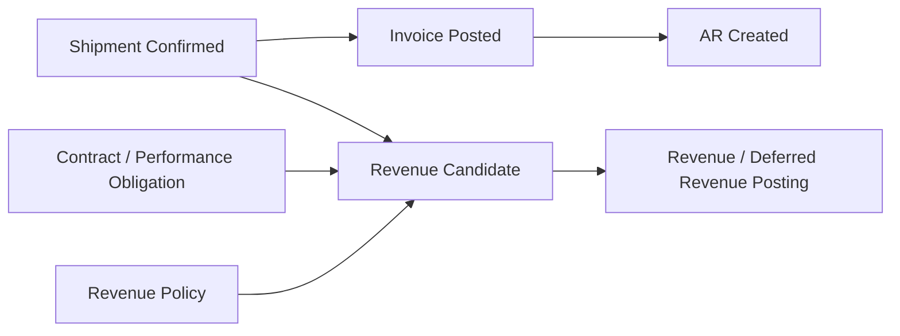

Minimal model:

| Event | Accounting Effect Example |
|---|---|
| invoice before delivery | Dr AR, Cr Deferred Revenue |
| delivery fulfilled | Dr Deferred Revenue, Cr Revenue |
| shipment and invoice same time | Dr AR, Cr Revenue |
| credit memo | reverse AR/revenue/tax according to source |
| return after revenue | reverse revenue and inventory/cost as policy |

Untuk ERP yang belum membangun revenue recognition module penuh, tetap pisahkan conceptually:

- billing event;
- receivable event;
- revenue candidate;
- revenue posting policy.

---

## 13. Returns, Credit Memo, and Refund

Returns adalah salah satu area paling sering merusak O2C.

Return lifecycle:

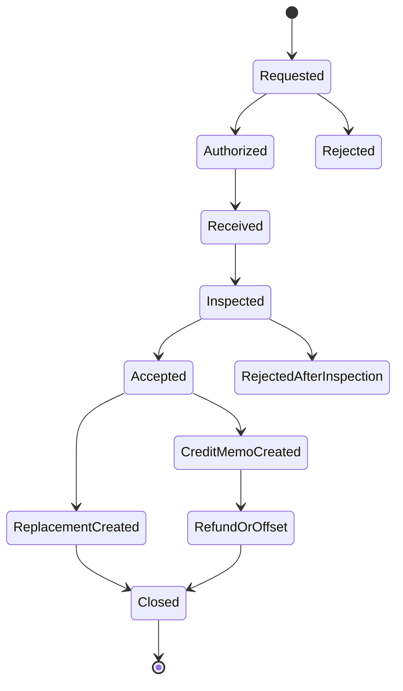

Return must answer:

- return relates to which shipment/invoice?
- goods physically returned or only commercial credit?
- item condition?
- restockable or scrap?
- customer gets credit memo, replacement, refund, or no credit?
- tax reversal allowed?
- original revenue/cost needs reversal?

Return types:

| Type | Inventory Effect | AR Effect |
|---|---|---|
| physical return accepted | stock in return/inspection/available | credit memo/refund/offset |
| damaged return | blocked/scrap | partial credit or no credit |
| commercial credit only | no stock movement | credit memo |
| replacement | outbound replacement shipment | maybe no AR change |
| return rejected | no credit | possible customer dispute |

Invariant:

- credit memo must reference original invoice or approved commercial reason;
- physical return must create inventory movement/reversal according to condition;
- refund must not exceed customer credit balance;
- tax reversal must follow source invoice/tax policy;
- return after period close must post adjustment in allowed period.

---

## 14. Cash Application Deep Dive

Cash application is deceptively hard.

### 14.1 Matching Inputs

Sources:

- bank statement;
- lockbox file;
- payment gateway callback;
- customer remittance advice;
- manual receipt;
- marketplace payout statement.

Match signals:

| Signal | Reliability |
|---|---|
| invoice number exact | high |
| virtual account | high |
| customer id in remittance | high/medium |
| amount exact | medium |
| payer bank account | medium |
| free text reference | low/medium |
| date proximity | low |

Cash application decision:

```java
public record CashApplicationDecision(
    CashReceiptId receiptId,
    List<InvoiceAllocationCandidate> candidates,
    MatchConfidence confidence,
    DecisionType decisionType,
    List<String> evidence
) {}
```

Policy:

- high confidence exact match can auto-apply;
- ambiguous match goes to workbench;
- overpayment creates unapplied cash/customer credit;
- short payment creates residual open amount or deduction workflow;
- bank fee/withholding requires reason code and policy.

### 14.2 Allocation Algorithm

```java
public AllocationPlan proposeAllocation(CashReceipt receipt, List<OpenInvoice> invoices, AllocationPolicy policy) {
    List<OpenInvoice> sorted = policy.sort(invoices);
    Money remaining = receipt.amount();
    List<ReceiptAllocation> allocations = new ArrayList<>();

    for (OpenInvoice invoice : sorted) {
        if (remaining.isZero()) break;
        Money amount = remaining.min(invoice.openAmount());
        allocations.add(new ReceiptAllocation(receipt.id(), invoice.id(), amount));
        remaining = remaining.minus(amount);
    }

    return new AllocationPlan(allocations, remaining);
}
```

Do not hide this as magical update. Allocation plan must be reviewable and auditable.

---

## 15. O2C Integration Architecture

O2C integrations:

- CRM;
- ecommerce/marketplace;
- POS;
- WMS;
- carrier/TMS;
- payment gateway;
- bank statement;
- tax engine;
- e-invoicing platform;
- customer portal;
- data warehouse.

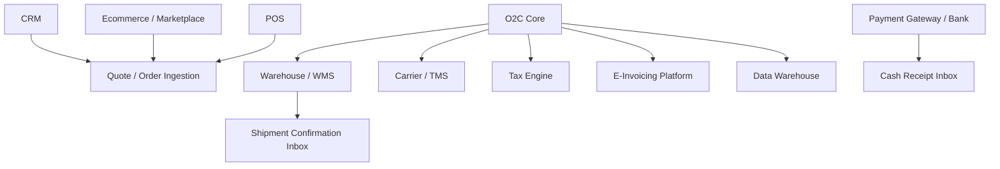

Rules:

- every external order must have external id and idempotency key;
- order ingestion must handle duplicate and update/cancel events;
- shipment confirmation must be idempotent;
- payment callbacks must be idempotent;
- tax/e-invoice submission failure must not erase invoice;
- marketplace payout reconciliation must support fees, refunds, disputes, and settlement timing.

### 15.1 Duplicate Marketplace Order

Idempotency key:

```text
channel + marketplace_order_id + marketplace_order_version
```

If version changes:

- detect whether it is true update, cancellation, or duplicate resend;
- never create second sales order for same marketplace order unless split policy explicitly does so;
- update should respect local lifecycle. If already shipped, cancellation cannot simply cancel order.

### 15.2 Shipment Confirmation from WMS

Shipment idempotency key:

```text
wms_shipment_id + shipment_line_id + shipped_qty + confirmation_type
```

Design:

- save inbound payload;
- deduplicate;
- validate against allocation/order;
- create shipment confirmation;
- publish shipment event;
- let billing and inventory react.

### 15.3 E-Invoicing

Many jurisdictions require electronic invoice validation/clearance. Design O2C invoice flow with external tax/e-invoice state separated from invoice posting.

Possible states:

```text
Invoice Posted -> SubmittedToEInvoice -> AcceptedByAuthority -> SentToCustomer
Invoice Posted -> SubmittedToEInvoice -> RejectedByAuthority -> CorrectionRequired
```

Do not make legal/e-invoice integration failure lose the accounting invoice. Instead, mark invoice as blocked for sending/compliance until resolved.

---

## 16. Security and Controls in O2C

SoD examples:

| Risk | Control |
|---|---|
| sales creates fake customer and writes off debt | customer master, sales, AR write-off separated |
| sales overrides price below margin | discount approval by margin/amount |
| user releases own credit hold | credit manager release with SoD |
| warehouse ships cancelled order | shipment release validates order state |
| AR applies cash to wrong invoice to hide overdue | allocation audit + reversal workflow |
| refund to wrong bank account | refund beneficiary validation |
| credit memo abused | credit memo approval and original invoice reference |

Permission examples:

```text
CAN_OVERRIDE_PRICE where:
- discountPercent <= actor.discountLimit(category)
- marginAfterDiscount >= policy.minimumMargin or extra approval exists
- actor != orderCreator for restricted override
```

```text
CAN_RELEASE_CREDIT_HOLD where:
- exposure <= actor.creditReleaseLimit
- customer in actor.portfolioScope
- hold reason allowed for actor role
- actor != salesRep if SoD policy applies
```

---

## 17. Reporting and Reconciliation

O2C reports:

| Report | Tujuan |
|---|---|
| Open sales order | demand belum fulfilled |
| Backorder | demand belum supply |
| Allocation shortage | bottleneck stock |
| Shipment not invoiced | billing leakage |
| Invoice not sent/e-invoice rejected | compliance/cash delay |
| AR aging | collection control |
| Unapplied cash | cash application backlog |
| Customer credit exposure | risk control |
| Return/credit memo report | leakage/fraud control |
| Sales margin by order/customer/item | commercial performance |
| Revenue vs billing reconciliation | accounting control |

Critical reconciliation views:

### 17.1 Shipment Not Invoiced

```sql
select
  shipment_line.id,
  shipment_line.sales_order_line_id,
  shipment_line.shipped_qty,
  coalesce(sum(invoice_line.billed_qty), 0) as billed_qty,
  shipment_line.shipped_qty - coalesce(sum(invoice_line.billed_qty), 0) as unbilled_qty
from shipment_line
left join customer_invoice_line invoice_line
  on invoice_line.shipment_line_id = shipment_line.id
where shipment_line.status = 'CONFIRMED'
group by shipment_line.id, shipment_line.sales_order_line_id, shipment_line.shipped_qty;
```

### 17.2 AR to GL Control

```text
sum(open AR schedule by legal entity, control account, currency)
= GL AR control account balance adjusted for timing/reversal policy
```

### 17.3 Cash Receipt to Bank

```text
bank statement line
-> cash receipt
-> allocation
-> AR schedule reduction
-> GL cash/AP clearing posting
```

If support cannot trace this chain, O2C is not defensible.

---

## 18. Failure Modes and Rescue Playbooks

### 18.1 Order Shipped Despite Credit Hold

Root causes:

- credit check only at order confirmation;
- shipment release did not re-check hold;
- WMS accepted stale release message;
- event ordering issue.

Controls:

- shipment release validates current credit status;
- release message has expiry;
- WMS confirms release token;
- credit hold event cancels or blocks unpicked releases.

Rescue:

1. identify affected shipments;
2. freeze further shipment for customer;
3. review AR exposure;
4. escalate to credit team;
5. patch shipment release validation;
6. reconcile any invoices/revenue.

### 18.2 Duplicate Marketplace Order Shipped Twice

Root causes:

- missing idempotency key;
- channel resend treated as new order;
- split shipment logic duplicated order lines;
- no external order uniqueness constraint.

Controls:

- unique external order key;
- version-aware update handling;
- duplicate workbench;
- outbound fulfillment idempotency.

Rescue:

1. stop channel ingestion if systemic;
2. identify duplicates by external id/customer/amount/date;
3. cancel unshipped duplicates;
4. process return/refund if shipped;
5. create correction journal/credit memo;
6. add tests for duplicate resend.

### 18.3 Invoice Created for Reversed Shipment

Root causes:

- billing job read stale shipment projection;
- no idempotency based on current shipment state;
- reversal did not emit billing block event;
- invoice generated before shipment confirmation finalized.

Controls:

- billing validates source shipment at invoice creation;
- shipment reversal creates billing correction candidate;
- invoice line references shipment evidence;
- invoice posted requires source still billable.

### 18.4 Cash Received but AR Still Open

Root causes:

- bank statement imported but cash application failed;
- remittance missing;
- allocation exception not visible;
- receipt posted to wrong customer;
- duplicate bank callback ignored incorrectly.

Controls:

- unapplied cash dashboard;
- cash application workbench;
- bank-to-receipt-to-allocation trace;
- idempotent callback with result replay;
- customer statement reconciliation.

### 18.5 Return Credited Twice

Root causes:

- RMA and credit memo not linked;
- duplicate return receipt message;
- manual credit memo bypass original invoice check;
- refund and credit memo both applied.

Controls:

- credit memo requires source or reason policy;
- return receipt idempotency;
- credit balance validation;
- refund approval checks open customer credit.

---

## 19. Testing Strategy for O2C

### 19.1 Golden Scenarios

Minimal test pack:

1. quote -> order -> allocation -> shipment -> invoice -> receipt allocation;
2. expired quote cannot convert without revalidation;
3. discount override requires approval;
4. order exceeds credit limit and goes on hold;
5. credit release by authorized user;
6. partial allocation and backorder;
7. partial shipment and partial invoice;
8. shipment reversal before invoice;
9. shipment reversal after invoice posted;
10. invoice before delivery for advance billing;
11. customer payment exact match;
12. customer lump-sum payment for multiple invoices;
13. short payment with deduction;
14. overpayment to unapplied cash;
15. duplicate payment callback;
16. return accepted with credit memo;
17. return rejected after inspection;
18. duplicate marketplace order;
19. e-invoice rejection;
20. AR aging after partial payment.

### 19.2 Invariant Tests

```java
@Test
void shipmentCannotBeConfirmedWhenOrderIsCreditHeld() {
    SalesOrder order = confirmedOrderWithCreditHold();
    Shipment shipment = shipmentFor(order);

    assertThatThrownBy(() -> shipmentPolicy.validateRelease(order.currentStatus(), shipment))
        .isInstanceOf(CreditHoldViolation.class);
}
```

```java
@Test
void receiptAllocationCannotOverpayInvoice() {
    CustomerInvoice invoice = postedInvoice(money("100.00", "USD"));
    CashReceipt receipt = cashReceipt(money("120.00", "USD"));

    AllocationPlan plan = allocationService.allocate(receipt, List.of(invoice));

    assertThat(plan.allocationFor(invoice.id()).amount()).isEqualTo(money("100.00", "USD"));
    assertThat(plan.unappliedAmount()).isEqualTo(money("20.00", "USD"));
}
```

### 19.3 Reconciliation Tests

For every order flow:

- shipped quantity <= ordered quantity unless over-ship policy;
- invoiced quantity <= billable shipped/delivered quantity unless advance billing policy;
- AR open amount equals invoice amount minus allocations/credits/write-offs;
- cash receipt allocation sum <= receipt amount;
- credit memo references invoice/return/source reason;
- GL control account equals AR subledger by period/currency/legal entity.

---

## 20. Observability for O2C

Technical metrics:

- order ingestion lag;
- duplicate order detection count;
- allocation job lag;
- shipment confirmation lag;
- billing job lag;
- invoice posting failures;
- cash application exception count;
- e-invoice rejection count;
- outbox/inbox lag.

Business metrics:

- order backlog value;
- backorder quantity/value;
- credit hold value;
- shipment not invoiced value;
- AR aging value;
- unapplied cash value;
- return rate;
- credit memo value;
- gross margin exception value;
- DSO approximation.

Log example:

```json
{
  "event": "SalesOrderConfirmed",
  "salesOrderId": "...",
  "orderNumber": "SO-2026-000021",
  "customerId": "...",
  "legalEntityId": "...",
  "channel": "MARKETPLACE",
  "pricingPolicyVersion": "PRICE-2026-01",
  "creditDecision": "HOLD",
  "externalOrderId": "MP-983771",
  "correlationId": "..."
}
```

---

## 21. Java Implementation Blueprint

### 21.1 Package Structure

```text
com.company.erp.o2c
  quotation
    domain
    application
    infrastructure
    api
  salesorder
    domain
    application
    infrastructure
    api
  pricing
    domain
    application
    infrastructure
  credit
    domain
    application
    readmodel
  allocation
    domain
    application
    infrastructure
  fulfillment
    domain
    application
    infrastructure
  billing
    domain
    application
    infrastructure
  receivable
    domain
    application
    reconciliation
  cashapplication
    domain
    application
    workbench
  returns
    domain
    application
    infrastructure
  shared
    money
    quantity
    policy
    document
    audit
```

### 21.2 Confirm Order Use Case

```java
@Service
public class ConfirmSalesOrderUseCase {
    private final SalesOrderRepository repository;
    private final PricingPort pricingPort;
    private final TaxPort taxPort;
    private final CreditControlPort creditControlPort;
    private final Outbox outbox;

    @Transactional
    public SalesOrderId handle(ConfirmSalesOrderCommand command) {
        PricingResult pricing = pricingPort.calculate(command.pricingRequest());
        TaxResult tax = taxPort.calculate(command.taxRequest(pricing));
        CreditDecision credit = creditControlPort.check(command.customerId(), pricing.totalExposureAmount());

        SalesOrder order = SalesOrder.create(command);
        order.confirm(command, pricing, tax, credit);

        repository.save(order);
        outbox.save(order.toConfirmedEvent(command.correlationId()));
        return order.id();
    }
}
```

### 21.3 Billing Candidate Handler

```java
public class ShipmentConfirmedBillingHandler {
    public void on(ShipmentConfirmed event) {
        inbox.deduplicate(event.eventId(), () -> {
            BillingPolicy policy = billingPolicyService.resolve(event.salesOrderId());
            if (!policy.isBillableOnShipment()) {
                billingCandidateRepository.save(BillingCandidate.deferred(event, policy.snapshot()));
                return;
            }
            billingCandidateRepository.save(BillingCandidate.fromShipment(event, policy.snapshot()));
            billingQueue.enqueue(event.salesOrderId());
        });
    }
}
```

### 21.4 Cash Application Handler

```java
@Service
public class ApplyCashReceiptUseCase {
    @Transactional
    public CashApplicationResult handle(ApplyCashReceiptCommand command) {
        CashReceipt receipt = receiptRepository.getForUpdate(command.receiptId());
        List<OpenInvoice> invoices = arReader.loadOpenInvoices(command.customerId());
        AllocationPlan plan = allocationEngine.plan(receipt, invoices, command.policy());

        receipt.apply(plan);
        receiptRepository.save(receipt);
        outbox.save(receipt.appliedEvent(plan));
        return CashApplicationResult.from(plan);
    }
}
```

---

## 22. Checklist Design Review O2C

### Domain and Lifecycle

- Apakah quotation, order, allocation, shipment, invoice, AR, cash receipt, return dipisahkan?
- Apakah sales order status multi-dimensional?
- Apakah cancellation memperhatikan fulfillment state?
- Apakah invoice posted immutable dan dikoreksi lewat credit memo/reversal?

### Commercial Control

- Apakah price/discount/tax snapshot disimpan?
- Apakah discount override punya approval evidence?
- Apakah quote expiry memicu repricing/revalidation?
- Apakah currency/FX rate snapshot jelas?

### Credit and Risk

- Apakah credit check dilakukan di titik yang benar?
- Apakah shipment release memvalidasi credit hold saat ini?
- Apakah credit release auditable dan SoD-compliant?
- Apakah customer exposure projection jelas?

### Fulfillment and Inventory

- Apakah allocation tidak langsung mengubah physical stock?
- Apakah shipment confirmation idempotent?
- Apakah partial/backorder flow jelas?
- Apakah return membedakan stock effect dan AR effect?

### Billing and AR

- Apakah billing basis explicit?
- Apakah shipment-not-invoiced bisa direkonsiliasi?
- Apakah AR schedule open amount benar?
- Apakah cash application mendukung partial, over, short, unapplied?

### Integration

- Apakah channel order ingestion punya idempotency?
- Apakah WMS shipment confirmation punya dedup?
- Apakah payment callback idempotent?
- Apakah e-invoice failure masuk workbench?

### Operability

- Apakah ada dashboard credit hold, backorder, shipment not invoiced, unapplied cash?
- Apakah support bisa trace order-to-cash document chain?
- Apakah exception punya owner/SLA?
- Apakah reconciliation report tidak bergantung pada query ad-hoc fragile?

---

## 23. 20-Hour Practice Slice untuk O2C

### Hour 1-3: Lifecycle maps

Gambar state machine untuk:

- quotation;
- sales order;
- allocation;
- shipment;
- invoice;
- cash receipt;
- return.

Tandai illegal transition.

### Hour 4-6: Aggregate skeleton

Implementasikan skeleton:

- `SalesOrder`;
- `Allocation`;
- `Shipment`;
- `CustomerInvoice`;
- `CashReceipt`.

Pastikan tidak ada aggregate yang mengubah ledger context lain.

### Hour 7-9: Pricing and credit snapshot

Buat:

- `PriceCalculationResult`;
- `TaxSnapshot`;
- `CreditDecisionSnapshot`.

Pastikan explainable.

### Hour 10-12: Allocation and shipment

Simulasikan:

- partial allocation;
- backorder;
- shipment confirmation;
- cancellation after allocation.

### Hour 13-15: Billing and AR

Buat billing candidate dari shipment confirmation, lalu generate invoice dan AR schedule.

### Hour 16-18: Cash application

Implementasikan allocation untuk:

- exact payment;
- partial payment;
- overpayment;
- lump-sum payment.

### Hour 19-20: Failure drills

Simulasikan:

- duplicate marketplace order;
- shipment while credit-held;
- invoice for reversed shipment;
- duplicate payment callback;
- return after invoice paid.

---

## 24. Kesimpulan

O2C adalah domain revenue, fulfillment, receivable, dan risk control.

Mental model utama:

1. **O2C adalah revenue and fulfillment control loop**, bukan CRUD order.
2. **Quotation, order, allocation, shipment, invoice, AR, receipt, dan return adalah lifecycle berbeda**.
3. **Sales order tidak boleh menjadi pemilik stock, invoice, dan cash sekaligus**.
4. **Credit check harus terjadi di titik risiko, bukan hanya saat order dibuat**.
5. **Shipment confirmation sering menjadi fakta operasional utama untuk billing dan inventory**.
6. **Invoice posted immutable; correction lewat reversal/credit memo**.
7. **Cash receipt tidak sama dengan cash application**.
8. **Return harus membalik commercial, inventory, AR, tax, dan accounting secara eksplisit**.
9. **Integration idempotency wajib karena channel, WMS, bank, dan e-invoice sering duplicate/out-of-order**.

Di level top engineer, Anda tidak mendesain O2C berdasarkan urutan screen sales. Anda mendesainnya berdasarkan commitment, availability, credit exposure, fulfillment evidence, receivable correctness, dan reconciliation.

---

## 25. Source Notes

Referensi konseptual dan teknis yang relevan untuk part ini:

- Jakarta EE Platform dan Jakarta Persistence relevan sebagai baseline enterprise Java untuk persistence, transaction, messaging, REST, batch, dan concurrency.
- Spring Boot modern relevan sebagai runtime aplikasi Java enterprise dengan Java 17+ baseline pada generasi modernnya.
- Apache OFBiz sebagai ERP open-source berbasis Java menyediakan domain order, accounting, warehouse, dan procurement yang berguna sebagai referensi konseptual ERP.
- GS1 mendefinisikan GTIN untuk trade item yang dapat diberi harga, dipesan, atau diinvoiced di supply chain, relevan untuk identifikasi item di order-to-cash.
- Pola outbox/inbox, idempotency, reconciliation, dan immutable financial document correction adalah fondasi engineering untuk O2C skala besar.
