# Part 013 — Inventory, Warehouse, and Stock Ledger

## 1. Target Skill Part Ini

Inventory dalam ERP besar bukan sekadar tabel `item_stock` dengan kolom `quantity`.

Inventory adalah sistem kebenaran operasional untuk menjawab pertanyaan yang sangat mahal jika salah:

- barang apa yang dimiliki perusahaan;
- berada di lokasi mana;
- dalam status apa;
- milik siapa;
- tersedia untuk dijual atau tidak;
- sudah dijanjikan ke order mana;
- bisa dipindahkan, dipakai produksi, dikirim, dikarantina, atau harus diblokir;
- bernilai berapa untuk accounting;
- dapat ditelusuri ke lot, serial, supplier, receipt, shipment, atau production batch mana.

> **Skill inti part ini:** mampu mendesain inventory, warehouse, dan stock ledger dalam Java ERP besar sehingga stock movement, reservation, allocation, warehouse execution, lot/serial traceability, valuation handoff, dan reconciliation tetap benar walaupun ada partial receipt, split shipment, transfer antar gudang, cycle count adjustment, duplicate command, race condition, return, quarantine, damaged goods, dan integration failure.

Inventory adalah domain yang sering terlihat sederhana sampai sistem masuk ke skala nyata.

Pada skala nyata, satu angka `available_qty` bisa dipengaruhi oleh:

- sales order reservation;
- pick list yang belum shipped;
- goods receipt yang belum put-away;
- transfer order yang masih in-transit;
- stock opname yang sedang dihitung;
- barang karantina quality control;
- consignment stock;
- returned goods yang belum inspected;
- production issue;
- WIP completion;
- intercompany shipment;
- negative stock policy;
- unit-of-measure conversion;
- lot expiry;
- legal hold;
- inventory valuation period.

Jika desain inventory salah, gejalanya muncul sebagai masalah bisnis yang sulit dipercaya:

- sistem menunjukkan barang tersedia, tetapi warehouse tidak bisa menemukannya;
- dua customer mendapatkan allocation atas unit yang sama;
- stock ledger menunjukkan movement valid, tetapi GL inventory account tidak balance;
- batch recall tidak bisa menemukan customer yang menerima lot tertentu;
- cycle count adjustment dipakai untuk menutup bug transaksi;
- shipment sukses tetapi stock tidak berkurang;
- return masuk, tetapi available stock langsung naik padahal barang rusak;
- MRP membeli terlalu banyak karena reserved/in-transit stock tidak dihitung benar;
- report inventory by location berbeda dengan report stock valuation.

Part ini membangun model mental inventory sebagai **ledger + execution + reservation + traceability + valuation boundary**, bukan CRUD stock.

---

## 2. Kaufman Deconstruction: Memecah Skill Inventory ERP

Josh Kaufman menekankan bahwa skill kompleks harus dipecah menjadi sub-skill kecil yang bisa dilatih secara sadar. Untuk inventory ERP besar, sub-skill-nya adalah:

| Sub-skill | Pertanyaan yang Harus Bisa Dijawab | Output Engineering |
|---|---|---|
| Item identity | Apa yang dihitung sebagai barang yang sama? | item, SKU, variant, packaging, UOM, barcode, GTIN mapping |
| Quantity semantics | Quantity apa yang sedang dibicarakan? | on-hand, available, reserved, allocated, picked, in-transit, blocked, WIP |
| Location model | Di mana stock berada secara fisik/logis? | site, warehouse, zone, aisle, rack, bin, virtual location |
| Stock movement | Peristiwa apa yang mengubah stock? | receipt, issue, transfer, adjustment, shipment, return, production movement |
| Stock ledger | Bagaimana riwayat movement disimpan immutably? | stock ledger entry, movement document, running/projection balance |
| Reservation | Bagaimana demand mengunci ketersediaan? | soft reservation, hard allocation, expiry, priority |
| Warehouse execution | Bagaimana pekerjaan fisik dilakukan? | receiving, put-away, replenishment, picking, packing, shipping, counting |
| Traceability | Bagaimana lot/serial dilacak? | lot genealogy, serial assignment, recall path, expiry control |
| Valuation boundary | Kapan movement memengaruhi nilai inventory? | cost event, valuation layer, accounting handoff |
| Reconciliation | Bagaimana membuktikan stock benar? | physical count, ledger balance, valuation balance, GL reconciliation |
| Concurrency control | Bagaimana mencegah double allocation? | lock strategy, versioning, idempotency, command key |
| Failure recovery | Bagaimana membalik atau memperbaiki movement? | reversal, correction, adjustment approval, exception queue |

Latihan penting bukan menghafal istilah, tetapi menguji invariant.

Contoh practice cases:

- goods receipt 100 unit, tetapi 8 unit rejected oleh quality control;
- satu sales order butuh 10 unit, stock tersedia 6 unit, lalu datang receipt 5 unit;
- dua order paralel berebut stock terakhir;
- transfer dari Warehouse A ke Warehouse B hilang saat in-transit;
- cycle count menemukan 97 unit padahal sistem 100 unit;
- item dijual dalam box tetapi disimpan dalam each;
- barang lot-controlled hampir expired dan tidak boleh dialokasikan;
- return customer masuk tetapi belum boleh available sebelum inspection;
- picking sudah terjadi tetapi shipment dibatalkan;
- warehouse worker scan serial number yang salah;
- duplicate event dari WMS mengirim shipment confirmation dua kali.

---

## 3. Inventory Sebagai Control Plane, Bukan Quantity Cache

Mental model yang paling aman:

```text
Inventory Truth = Immutable Stock Ledger + Current Balance Projection + Reservation State + Warehouse Execution State + Traceability Evidence
```

`current_balance` boleh di-cache, tetapi kebenaran historis berasal dari ledger.

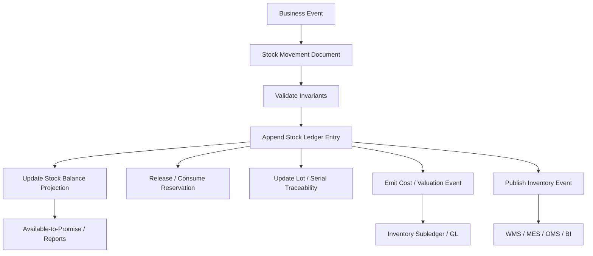
```mermaid
graph TD
    BusinessEvent[Business Event] --> MovementDoc[Stock Movement Document]
    MovementDoc --> Validate[Validate Invariants]
    Validate --> Ledger[Append Stock Ledger Entry]
    Ledger --> Balance[Update Stock Balance Projection]
    Ledger --> Reservation[Release / Consume Reservation]
    Ledger --> Trace[Update Lot / Serial Traceability]
    Ledger --> Cost[Emit Cost / Valuation Event]
    Ledger --> Outbox[Publish Inventory Event]
    Balance --> Query[Available-to-Promise / Reports]
    Cost --> Accounting[Inventory Subledger / GL]
    Outbox --> WMS[WMS / MES / OMS / BI]
```

Ada beberapa lapisan kebenaran:

| Layer | Pertanyaan | Mutable? | Contoh |
|---|---|---:|---|
| Movement document | Apa transaksi bisnisnya? | lifecycle-controlled | receipt document, transfer order, shipment document |
| Stock ledger | Apa perubahan stock yang sah? | append-only | +100 received, -5 shipped, +3 returned |
| Balance projection | Berapa saldo sekarang? | mutable projection | on-hand per item-location-lot |
| Reservation state | Siapa sudah mengklaim stock? | mutable but controlled | reserved for SO-1001 |
| Warehouse task | Pekerjaan fisik apa yang harus dilakukan? | stateful | pick task, put-away task |
| Traceability graph | Unit/lot bergerak dari mana ke mana? | append-only enough | lot received from vendor and shipped to customer |
| Valuation event | Nilai finansial apa yang timbul? | append-only | inventory receipt cost event |

Kesalahan umum adalah membuat `stock_balance.quantity` sebagai satu-satunya truth.

Dalam ERP serius, balance projection adalah materialized view atas ledger dan reservation state.

---

## 4. Quantity Semantics: Jangan Pernah Menggunakan Satu Kolom `qty`

Inventory rusak ketika tim tidak membedakan jenis quantity.

| Quantity | Makna | Contoh Risiko |
|---|---|---|
| `onHandQty` | jumlah fisik/logis yang dimiliki di lokasi | masih termasuk blocked/quarantine jika tidak dipisah |
| `availableQty` | jumlah yang boleh dialokasikan ke demand baru | salah hitung menyebabkan oversell |
| `reservedQty` | jumlah diklaim oleh demand tetapi belum dipick | double promise jika tidak atomik |
| `allocatedQty` | jumlah sudah dipilih spesifik dari stock pool | conflict jika lot/bin berubah |
| `pickedQty` | jumlah sudah diambil dari bin | cancellation harus return-to-stock atau staging |
| `packedQty` | jumlah sudah dipacking | shipment cancel lebih mahal |
| `shippedQty` | jumlah sudah keluar secara legal/fisik | memicu invoice/revenue boundary |
| `inTransitQty` | jumlah sedang transfer antar lokasi | tidak available di asal maupun tujuan |
| `blockedQty` | jumlah tidak boleh dipakai | quality/legal/hold |
| `quarantineQty` | jumlah menunggu inspection | tidak available untuk sales/production |
| `damagedQty` | jumlah rusak | perlu write-off/claim |
| `WIPQty` | material berada dalam proses produksi | bukan finished goods |

Rumus sederhana sering dipakai:

```text
available = onHand - reserved - allocated - blocked - quarantine - damaged
```

Tetapi dalam ERP besar, rumus ini kurang lengkap karena availability bergantung pada context:

- channel penjualan;
- customer priority;
- expiry rule;
- warehouse eligibility;
- lot attribute;
- inventory ownership;
- regulatory restriction;
- ATP horizon;
- project/contract allocation;
- country/localization rule.

Maka lebih aman memakai konsep **availability policy**.

```java
public record AvailabilityRequest(
        ItemId itemId,
        OrganizationScope scope,
        Quantity requestedQty,
        DemandType demandType,
        CustomerId customerId,
        LocalDate requiredDate,
        Set<LocationId> eligibleLocations,
        LotSelectionPolicy lotPolicy,
        ReservationPriority priority
) {}

public interface AvailabilityService {
    AvailabilityQuote quote(AvailabilityRequest request);
    ReservationResult reserve(ReserveInventoryCommand command);
}
```

Availability bukan query biasa. Availability adalah keputusan domain yang harus bisa diaudit.

---

## 5. Item Identity: Product, SKU, Variant, UOM, Lot, Serial

Sebelum menghitung stock, ERP harus tahu apa yang sedang dihitung.

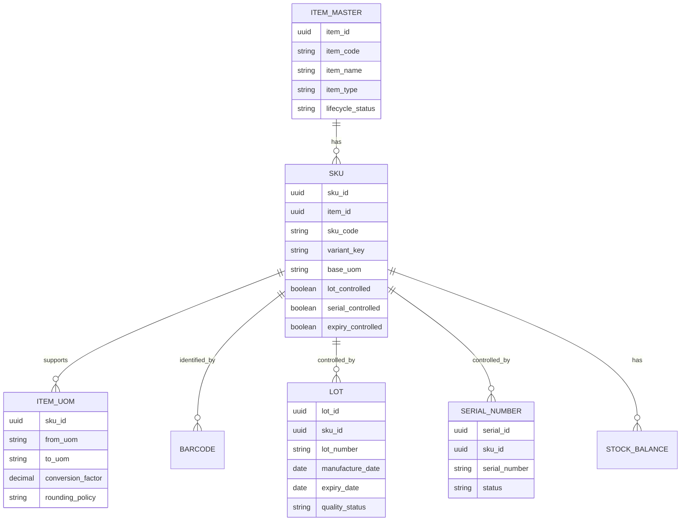
```mermaid
erDiagram
    ITEM_MASTER ||--o{ SKU : has
    SKU ||--o{ ITEM_UOM : supports
    SKU ||--o{ BARCODE : identified_by
    SKU ||--o{ LOT : controlled_by
    SKU ||--o{ SERIAL_NUMBER : controlled_by
    SKU ||--o{ STOCK_BALANCE : has

    ITEM_MASTER {
        uuid item_id
        string item_code
        string item_name
        string item_type
        string lifecycle_status
    }

    SKU {
        uuid sku_id
        uuid item_id
        string sku_code
        string variant_key
        string base_uom
        boolean lot_controlled
        boolean serial_controlled
        boolean expiry_controlled
    }

    ITEM_UOM {
        uuid sku_id
        string from_uom
        string to_uom
        decimal conversion_factor
        string rounding_policy
    }

    LOT {
        uuid lot_id
        uuid sku_id
        string lot_number
        date manufacture_date
        date expiry_date
        string quality_status
    }

    SERIAL_NUMBER {
        uuid serial_id
        uuid sku_id
        string serial_number
        string status
    }
```

### 5.1 Product vs SKU

`Product` sering merepresentasikan konsep komersial.

`SKU` merepresentasikan unit inventory yang benar-benar dihitung.

Contoh:

| Level | Contoh |
|---|---|
| Product | Laptop Model X |
| Variant | Laptop Model X / 16GB / 512GB / Silver |
| SKU | LX-16-512-SLV-ID |
| Packaging SKU | Box of 10 cable packs |
| Service item | Installation service, tidak stock-controlled |

Inventory ledger sebaiknya bergerak pada level yang cukup spesifik untuk menjamin correctness.

### 5.2 UOM Conversion

Unit of Measure adalah sumber bug besar.

Contoh:

- beli dalam `BOX`;
- simpan dalam `EA`;
- jual dalam `PACK`;
- produksi memakai `KG`;
- accounting valuation memakai base UOM.

Prinsip:

1. ledger menyimpan quantity dalam base UOM;
2. document line menyimpan original UOM untuk audit;
3. conversion snapshot disimpan saat transaksi;
4. rounding policy eksplisit;
5. perubahan conversion factor tidak boleh mengubah transaksi historis.

```java
public record Quantity(
        BigDecimal value,
        UnitOfMeasure uom
) {
    public Quantity toBase(UomConversionSnapshot conversion) {
        return new Quantity(
                value.multiply(conversion.factor()).setScale(conversion.scale(), conversion.roundingMode()),
                conversion.baseUom()
        );
    }
}
```

### 5.3 Lot dan Serial

Lot-controlled item cocok untuk barang yang ditelusuri per batch:

- makanan;
- farmasi;
- chemical;
- spare part batch;
- raw material production batch.

Serial-controlled item cocok untuk unit individual:

- equipment;
- electronics;
- kendaraan;
- regulated asset;
- warranty-tracked item.

Lot dan serial bukan sekadar field tambahan. Keduanya mengubah lifecycle movement.

Jika item serial-controlled, shipment 10 unit harus tahu 10 serial number spesifik.

Jika item lot-controlled, allocation harus mengikuti policy seperti FIFO, FEFO, quality status, atau customer restriction.

---

## 6. Location Model: Site, Warehouse, Zone, Bin, Virtual Location

Inventory berada di lokasi fisik dan logis.

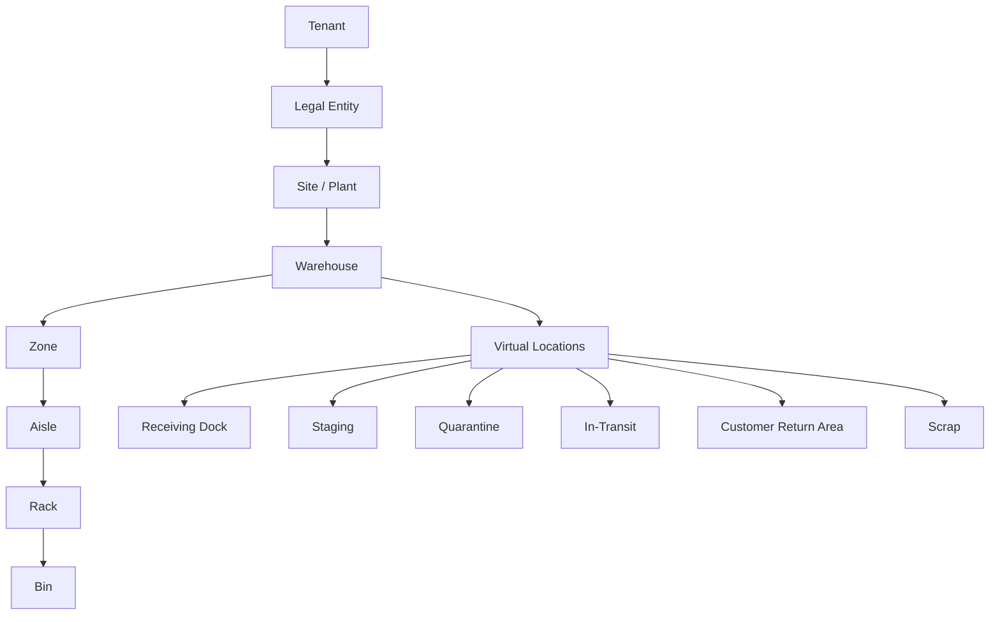
```mermaid
graph TD
    Tenant[Tenant]
    Tenant --> LegalEntity[Legal Entity]
    LegalEntity --> Site[Site / Plant]
    Site --> Warehouse[Warehouse]
    Warehouse --> Zone[Zone]
    Zone --> Aisle[Aisle]
    Aisle --> Rack[Rack]
    Rack --> Bin[Bin]

    Warehouse --> Virtual[Virtual Locations]
    Virtual --> Receiving[Receiving Dock]
    Virtual --> Staging[Staging]
    Virtual --> Quarantine[Quarantine]
    Virtual --> InTransit[In-Transit]
    Virtual --> CustomerReturn[Customer Return Area]
    Virtual --> Scrap[Scrap]
```

Model location harus mendukung:

- receiving dock;
- quality inspection;
- put-away;
- storage bin;
- picking area;
- packing station;
- shipping dock;
- in-transit;
- vendor consignment;
- customer-owned stock;
- project stock;
- quarantine;
- scrap;
- virtual adjustment location.

### 6.1 Location Type Mengontrol Movement

| Location Type | Boleh Available? | Contoh Movement |
|---|---:|---|
| receiving | tidak langsung | receipt -> inspection/put-away |
| quarantine | tidak | inspection pass/fail |
| storage | ya jika eligible | put-away, pick |
| picking | ya untuk pick operation | replenishment, pick |
| staging | tidak untuk demand baru | picked -> packed -> shipped |
| shipping dock | tidak | ship confirm |
| in-transit | tidak | transfer issue -> transfer receipt |
| scrap | tidak | write-off |
| customer return | tidak sebelum inspection | RMA receipt -> disposition |

Jangan hanya menyimpan `warehouse_id`. Tanpa bin/status/location-type, sistem tidak tahu apakah stock benar-benar bisa dipakai.

---

## 7. Stock Movement Taxonomy

Semua perubahan inventory harus diklasifikasikan.

| Movement Type | Direction | Source Document | Dampak |
|---|---:|---|---|
| PURCHASE_RECEIPT | + | goods receipt | on-hand naik, cost event mungkin dibuat |
| SALES_SHIPMENT | - | shipment confirmation | on-hand turun, COGS event mungkin dibuat |
| TRANSFER_ISSUE | - | transfer order | asal turun, in-transit naik |
| TRANSFER_RECEIPT | + | transfer order | in-transit turun, tujuan naik |
| PRODUCTION_ISSUE | - | work order | raw material ke WIP |
| PRODUCTION_RECEIPT | + | work order | finished/semi-finished goods naik |
| ADJUSTMENT_IN | + | count adjustment | koreksi dengan approval |
| ADJUSTMENT_OUT | - | count adjustment/write-off | koreksi dengan approval |
| RETURN_RECEIPT | + | RMA | masuk return/quarantine |
| SCRAP | - | scrap document | stock turun, expense/variance |
| RECLASSIFICATION | +/- | quality/status change | blocked -> available, lot status change |

Movement type menentukan invariant.

Contoh:

- `SALES_SHIPMENT` harus refer ke shipment line dan reservation/allocation;
- `PURCHASE_RECEIPT` harus refer ke PO atau receiving document;
- `ADJUSTMENT_OUT` harus butuh reason code dan approval;
- `PRODUCTION_RECEIPT` harus refer ke work order;
- `RECLASSIFICATION` tidak selalu mengubah total quantity, tetapi mengubah eligibility/status.

---

## 8. Stock Ledger Entry: Append-Only Evidence

Model ledger minimal:

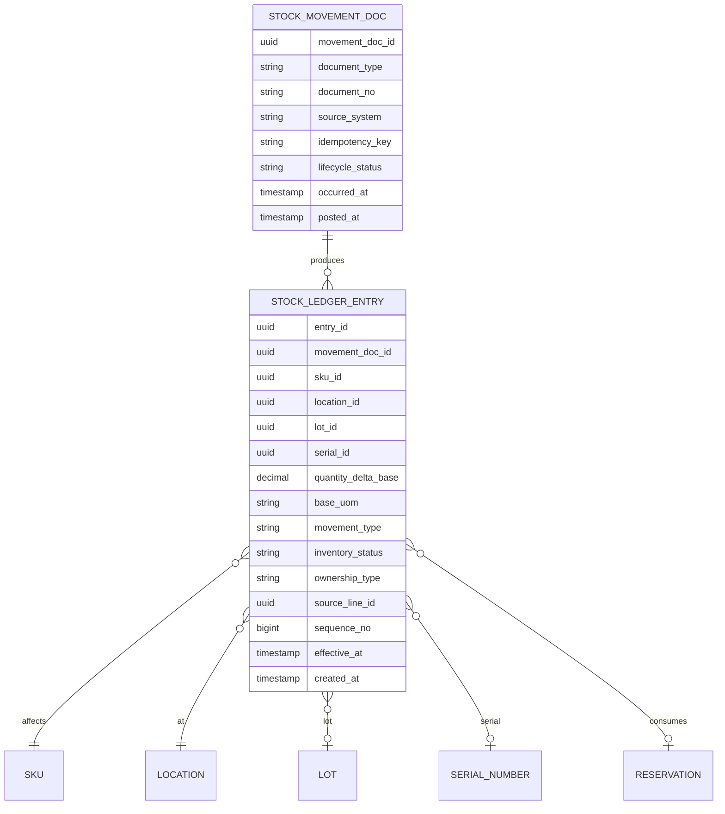
```mermaid
erDiagram
    STOCK_MOVEMENT_DOC ||--o{ STOCK_LEDGER_ENTRY : produces
    STOCK_LEDGER_ENTRY }o--|| SKU : affects
    STOCK_LEDGER_ENTRY }o--|| LOCATION : at
    STOCK_LEDGER_ENTRY }o--o| LOT : lot
    STOCK_LEDGER_ENTRY }o--o| SERIAL_NUMBER : serial
    STOCK_LEDGER_ENTRY }o--o| RESERVATION : consumes

    STOCK_MOVEMENT_DOC {
        uuid movement_doc_id
        string document_type
        string document_no
        string source_system
        string idempotency_key
        string lifecycle_status
        timestamp occurred_at
        timestamp posted_at
    }

    STOCK_LEDGER_ENTRY {
        uuid entry_id
        uuid movement_doc_id
        uuid sku_id
        uuid location_id
        uuid lot_id
        uuid serial_id
        decimal quantity_delta_base
        string base_uom
        string movement_type
        string inventory_status
        string ownership_type
        uuid source_line_id
        bigint sequence_no
        timestamp effective_at
        timestamp created_at
    }
```

Prinsip ledger:

1. append-only;
2. punya `movement_doc_id` dan `source_line_id`;
3. menyimpan `quantity_delta_base`, bukan hanya after-balance;
4. menyimpan original context untuk audit;
5. bisa direversal dengan entry baru, bukan update/delete entry lama;
6. bisa diproyeksikan ulang menjadi balance;
7. bisa direkonsiliasi dengan document, warehouse task, dan accounting event.

### 8.1 Jangan Update Ledger Historis

Jika movement salah, buat correction/reversal.

```text
Entry 1001: +100 PURCHASE_RECEIPT
Entry 1002: -100 REVERSAL_OF_1001
Entry 1003: +98 CORRECTED_PURCHASE_RECEIPT
```

Ini menjaga evidence.

Jika entry lama diedit:

- audit trail pecah;
- balance historis berubah diam-diam;
- close period bisa berubah;
- reconciliation dengan accounting gagal;
- dispute sulit dibuktikan.

---

## 9. Stock Balance Projection

Stock balance adalah projection dari ledger.

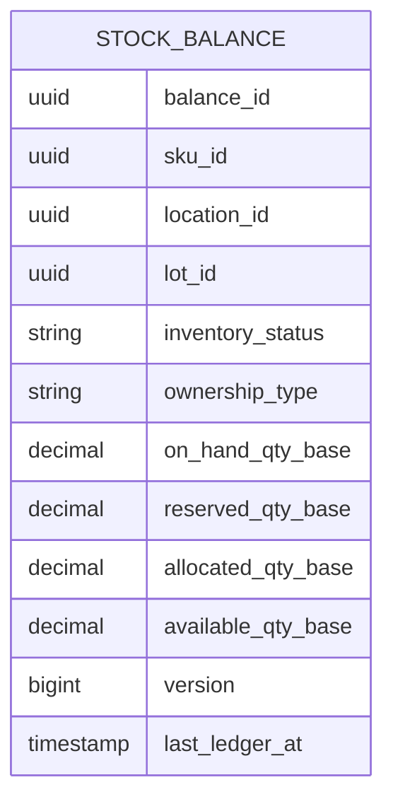
```mermaid
erDiagram
    STOCK_BALANCE {
        uuid balance_id
        uuid sku_id
        uuid location_id
        uuid lot_id
        string inventory_status
        string ownership_type
        decimal on_hand_qty_base
        decimal reserved_qty_base
        decimal allocated_qty_base
        decimal available_qty_base
        bigint version
        timestamp last_ledger_at
    }
```

Key balance biasanya bukan hanya `(sku_id, warehouse_id)`.

Untuk ERP besar, key bisa berupa:

```text
tenant_id,
legal_entity_id,
site_id,
warehouse_id,
location_id,
sku_id,
lot_id,
serial_id,
inventory_status,
ownership_type,
project_id,
contract_id,
valuation_bucket
```

Terlalu sederhana akan menghasilkan stock bercampur.

Terlalu detail akan menghasilkan query dan locking berat.

Trade-off-nya harus eksplisit.

### 9.1 Projection Update Pattern

```java
@Transactional
public MovementResult postMovement(PostStockMovementCommand command) {
    IdempotencyKey key = command.idempotencyKey();

    if (movementRepository.existsByIdempotencyKey(key)) {
        return movementRepository.findResultByIdempotencyKey(key);
    }

    StockMovementDocument doc = movementFactory.create(command);
    movementValidator.validate(doc);

    List<StockLedgerEntry> entries = ledgerFactory.entriesFor(doc);

    for (StockLedgerEntry entry : entries) {
        StockBalance balance = balanceRepository.lockBalance(entry.balanceKey());
        balance.apply(entry);
        balance.assertNonNegativeIfPolicyRequires();
        ledgerRepository.append(entry);
        balanceRepository.save(balance);
    }

    outbox.publish(InventoryEvent.from(doc, entries));
    return MovementResult.posted(doc.id());
}
```

Catatan:

- `lockBalance` tidak harus selalu pessimistic lock, tetapi stock-sensitive flows sering butuh atomicity kuat;
- idempotency harus sebelum posting ledger;
- validasi non-negative dilakukan pada balance key yang tepat;
- outbox dipakai agar event tidak hilang setelah DB commit.

---

## 10. Reservation vs Allocation vs Picking

Banyak ERP gagal karena mencampur reservation, allocation, dan picking.

| Konsep | Makna | Apakah Stock Spesifik? | Contoh |
|---|---|---:|---|
| Reservation | demand mengklaim availability | belum tentu | SO-1001 reserve 10 unit SKU-A |
| Allocation | sistem memilih stock pool spesifik | ya | 6 unit dari WH-A Lot L1, 4 unit dari WH-B Lot L2 |
| Picking | operator mengambil barang fisik | ya dan fisik | scan bin/lot/serial |
| Packing | barang dikemas | ya | carton assignment |
| Shipment | barang keluar | ya dan legal | carrier handoff, delivery doc |

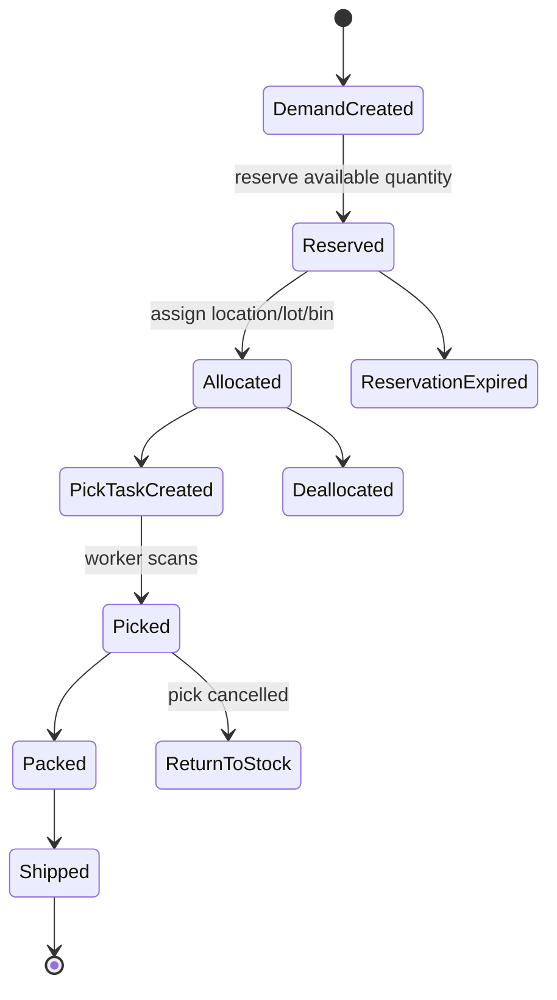
```mermaid
stateDiagram-v2
    [*] --> DemandCreated
    DemandCreated --> Reserved: reserve available quantity
    Reserved --> Allocated: assign location/lot/bin
    Allocated --> PickTaskCreated
    PickTaskCreated --> Picked: worker scans
    Picked --> Packed
    Packed --> Shipped
    Reserved --> ReservationExpired
    Allocated --> Deallocated
    Picked --> ReturnToStock: pick cancelled
    Shipped --> [*]
```

### 10.1 Soft Reservation

Soft reservation menjanjikan quantity tanpa memilih bin/lot spesifik.

Cocok untuk:

- order awal;
- availability promise;
- demand planning;
- short-lived carts.

Risiko:

- race jika tidak dikunci;
- janji terlalu optimistis;
- sulit dioperasionalkan jika warehouse capacity terbatas.

### 10.2 Hard Allocation

Hard allocation memilih stock spesifik.

Cocok untuk:

- wave picking;
- lot/serial-controlled shipment;
- priority order;
- regulated product;
- expiry-sensitive product.

Risiko:

- allocation menjadi stale jika inventory dipindah manual;
- cancellation harus mengembalikan stock;
- warehouse task harus konsisten dengan allocation.

---

## 11. Available-to-Promise dan ATP Horizon

ATP menjawab: apakah bisa dipenuhi dan kapan?

Sumber ATP:

- on-hand available;
- scheduled receipt;
- purchase order open;
- production order planned/firmed;
- transfer inbound;
- reserved demand;
- forecast consumption;
- safety stock;
- allocation rule.

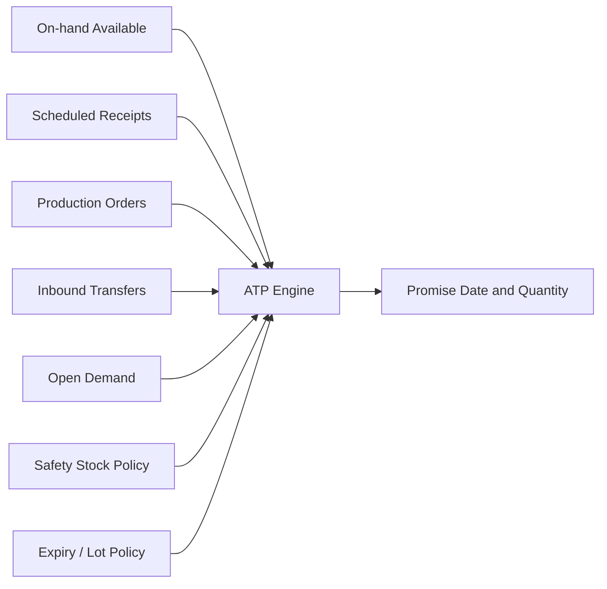
```mermaid
graph LR
    OnHand[On-hand Available] --> ATP[ATP Engine]
    ScheduledReceipt[Scheduled Receipts] --> ATP
    Production[Production Orders] --> ATP
    Transfer[Inbound Transfers] --> ATP
    Demand[Open Demand] --> ATP
    Safety[Safety Stock Policy] --> ATP
    Expiry[Expiry / Lot Policy] --> ATP
    ATP --> Promise[Promise Date and Quantity]
```

ATP bukan hanya `select available_qty`.

ATP harus mempertimbangkan waktu.

Contoh:

```text
Today: on-hand 6
Tomorrow: PO receipt +20
Demand today: SO-1 requires 5
Demand tomorrow: SO-2 requires 15
New order requires 10 in two days

ATP result: promise 10 in two days only if PO receipt trusted and SO-2 priority lower or sufficient remaining.
```

Untuk ERP besar, ATP output harus explainable:

```json
{
  "requestedQty": 10,
  "promisedQty": 10,
  "promiseDate": "2026-07-02",
  "sources": [
    {"type": "ON_HAND", "qty": 1, "warehouse": "WH-A"},
    {"type": "PO_RECEIPT", "qty": 9, "documentNo": "PO-881", "expectedDate": "2026-07-01"}
  ],
  "constraints": ["SAFETY_STOCK_5_RESERVED", "FEFO_LOT_POLICY_APPLIED"]
}
```

Tanpa explainability, customer service dan planner tidak percaya sistem.

---

## 12. Warehouse Execution Model

Warehouse execution mengubah dokumen bisnis menjadi pekerjaan fisik.

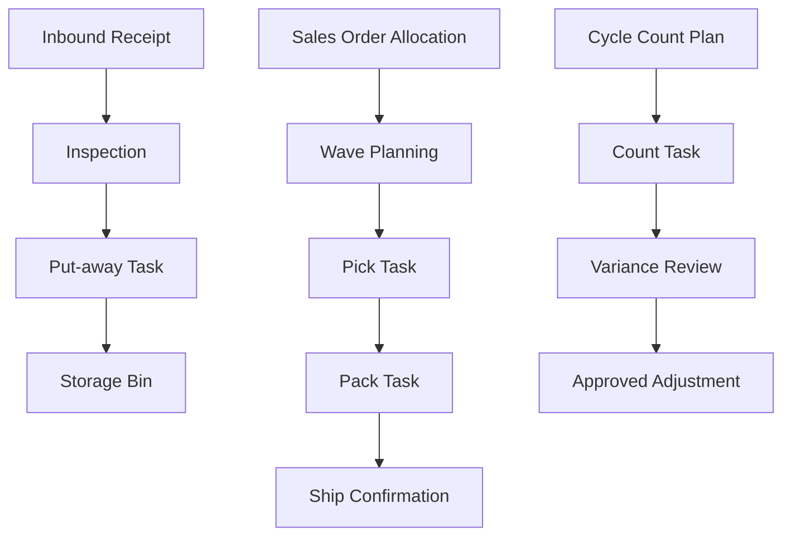
```mermaid
graph TD
    Receipt[Inbound Receipt] --> Inspect[Inspection]
    Inspect --> PutAway[Put-away Task]
    PutAway --> Storage[Storage Bin]

    SalesOrder[Sales Order Allocation] --> Wave[Wave Planning]
    Wave --> Pick[Pick Task]
    Pick --> Pack[Pack Task]
    Pack --> Ship[Ship Confirmation]

    CountPlan[Cycle Count Plan] --> CountTask[Count Task]
    CountTask --> CountReview[Variance Review]
    CountReview --> Adjustment[Approved Adjustment]
```

Warehouse task minimal:

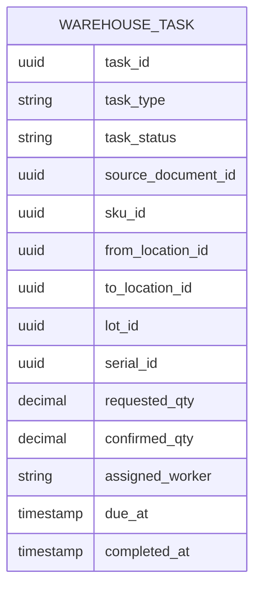
```mermaid
erDiagram
    WAREHOUSE_TASK {
        uuid task_id
        string task_type
        string task_status
        uuid source_document_id
        uuid sku_id
        uuid from_location_id
        uuid to_location_id
        uuid lot_id
        uuid serial_id
        decimal requested_qty
        decimal confirmed_qty
        string assigned_worker
        timestamp due_at
        timestamp completed_at
    }
```

Status task:

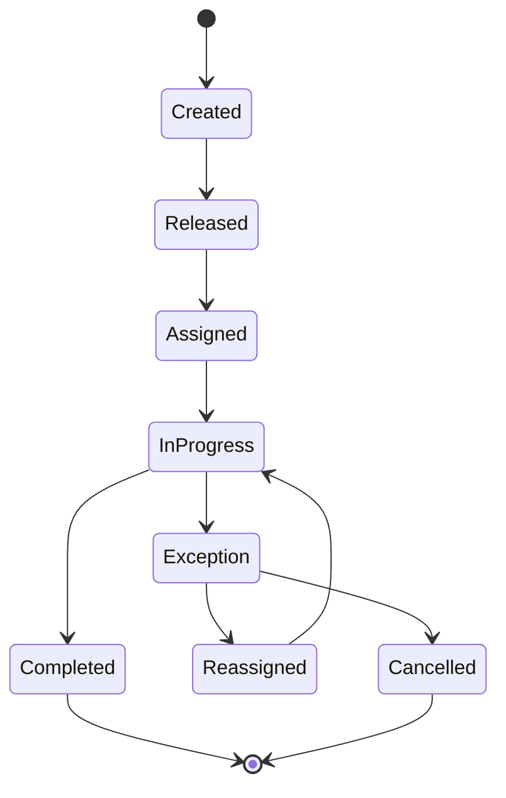
```mermaid
stateDiagram-v2
    [*] --> Created
    Created --> Released
    Released --> Assigned
    Assigned --> InProgress
    InProgress --> Completed
    InProgress --> Exception
    Exception --> Reassigned
    Exception --> Cancelled
    Reassigned --> InProgress
    Completed --> [*]
    Cancelled --> [*]
```

Warehouse task tidak selalu langsung mengubah stock ledger.

Contoh:

- pick task confirmation mungkin memindahkan stock dari storage ke staging;
- ship confirmation mengurangi stock secara final;
- put-away task memindahkan stock dari receiving ke storage;
- cycle count task hanya menghasilkan evidence sampai adjustment disetujui.

---

## 13. Receiving Lifecycle

Receiving adalah titik masuk inventory dari procurement, return, transfer, atau production completion.

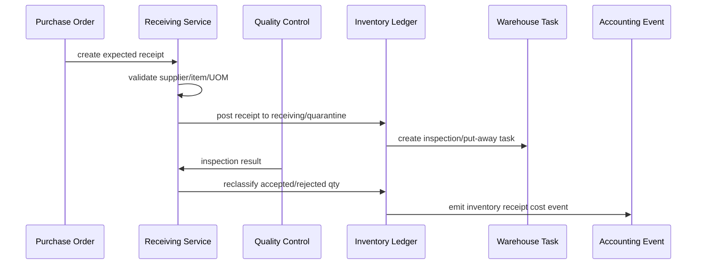
```mermaid
sequenceDiagram
    participant PO as Purchase Order
    participant REC as Receiving Service
    participant QC as Quality Control
    participant INV as Inventory Ledger
    participant WMS as Warehouse Task
    participant ACC as Accounting Event

    PO->>REC: create expected receipt
    REC->>REC: validate supplier/item/UOM
    REC->>INV: post receipt to receiving/quarantine
    INV->>WMS: create inspection/put-away task
    QC->>REC: inspection result
    REC->>INV: reclassify accepted/rejected qty
    INV->>ACC: emit inventory receipt cost event
```

Inbound flow harus membedakan:

- expected receipt;
- actual receipt;
- over-receipt;
- under-receipt;
- damaged receipt;
- inspection pending;
- accepted;
- rejected;
- returned to vendor;
- put-away completed.

### 13.1 Receipt Invariant

Untuk PO receipt:

```text
received_qty <= ordered_qty + allowed_over_receipt_tolerance
accepted_qty + rejected_qty + pending_inspection_qty = received_qty
posted_receipt_qty = sum(stock_ledger_entries for receipt)
```

Jika item lot/serial-controlled:

```text
received_serial_count = accepted_serial_count + rejected_serial_count + pending_serial_count
no duplicate serial within same tenant/item scope
lot expiry must be valid according to item policy
```

---

## 14. Put-Away dan Replenishment

Put-away memindahkan stock dari receiving/staging ke storage.

Put-away rule mempertimbangkan:

- item class;
- hazardous class;
- temperature requirement;
- weight/volume;
- bin capacity;
- ABC class;
- lot/expiry;
- warehouse zone;
- fast-moving vs slow-moving;
- compatibility;
- owner/project/customer restriction.

```java
public interface PutAwayStrategy {
    List<PutAwaySuggestion> suggest(PutAwayContext context);
}

public record PutAwayContext(
        SkuId skuId,
        Quantity quantity,
        WarehouseId warehouseId,
        Optional<LotId> lotId,
        InventoryAttributes attributes,
        List<BinCapacitySnapshot> candidateBins
) {}
```

Replenishment memindahkan stock dari reserve storage ke pick face.

Jangan confuse replenishment dengan purchasing.

- replenishment warehouse: memindahkan barang internal;
- replenishment planning: membeli/produksi agar stock cukup.

---

## 15. Picking, Packing, Shipping

Outbound warehouse flow:

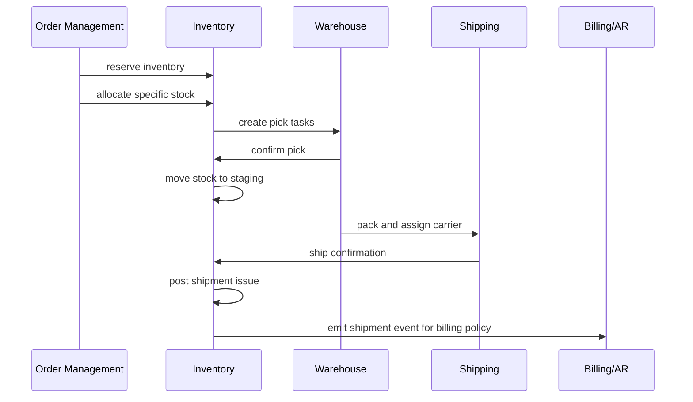
```mermaid
sequenceDiagram
    participant OMS as Order Management
    participant INV as Inventory
    participant WMS as Warehouse
    participant SHIP as Shipping
    participant AR as Billing/AR

    OMS->>INV: reserve inventory
    OMS->>INV: allocate specific stock
    INV->>WMS: create pick tasks
    WMS->>INV: confirm pick
    INV->>INV: move stock to staging
    WMS->>SHIP: pack and assign carrier
    SHIP->>INV: ship confirmation
    INV->>INV: post shipment issue
    INV->>AR: emit shipment event for billing policy
```

Outbound invariant:

```text
picked_qty <= allocated_qty
packed_qty <= picked_qty
shipped_qty <= packed_qty
shipment_issue_qty = shipped_qty confirmed by shipping document
```

Untuk serial-controlled item:

```text
each shipped unit must have exactly one serial number
serial number status moves AVAILABLE -> ALLOCATED -> PICKED -> SHIPPED
same serial cannot be shipped twice
```

Untuk lot-controlled item:

```text
shipped lot must satisfy allocation policy
expired lot cannot be shipped if policy forbids
customer-restricted lot cannot be allocated to wrong customer/channel
```

---

## 16. Transfer Antar Warehouse dan In-Transit Stock

Transfer bukan update lokasi satu langkah.

Transfer besar memiliki lifecycle:

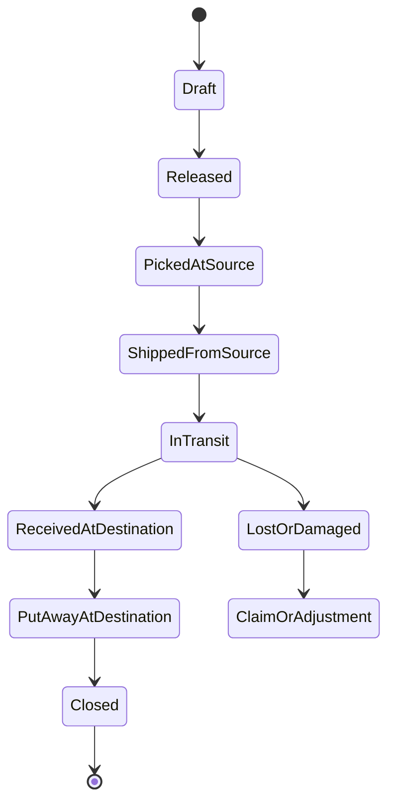
```mermaid
stateDiagram-v2
    [*] --> Draft
    Draft --> Released
    Released --> PickedAtSource
    PickedAtSource --> ShippedFromSource
    ShippedFromSource --> InTransit
    InTransit --> ReceivedAtDestination
    ReceivedAtDestination --> PutAwayAtDestination
    PutAwayAtDestination --> Closed
    InTransit --> LostOrDamaged
    LostOrDamaged --> ClaimOrAdjustment
    Closed --> [*]
```

Ledger transfer sebaiknya eksplisit:

```text
Source WH storage: -10 TRANSFER_ISSUE
In-transit location: +10 TRANSFER_IN_TRANSIT
In-transit location: -10 TRANSFER_RECEIPT_CLEAR
Destination receiving: +10 TRANSFER_RECEIPT
Destination storage: transfer/put-away internal movement
```

Jika hanya mengubah `warehouse_id`, sistem kehilangan evidence:

- kapan barang keluar;
- kapan barang diterima;
- siapa carrier;
- apakah ada selisih;
- kapan risk/ownership berpindah;
- bagaimana accounting intercompany dilakukan.

---

## 17. Cycle Count dan Stock Adjustment

Physical inventory tidak boleh diperlakukan sebagai update manual.

Cycle count lifecycle:

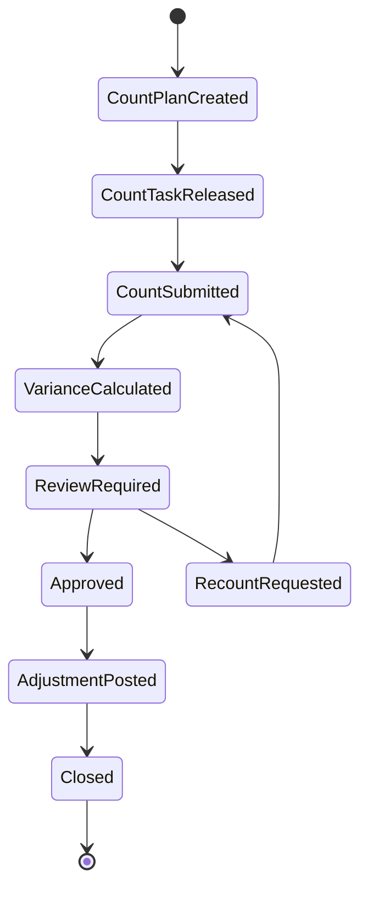
```mermaid
stateDiagram-v2
    [*] --> CountPlanCreated
    CountPlanCreated --> CountTaskReleased
    CountTaskReleased --> CountSubmitted
    CountSubmitted --> VarianceCalculated
    VarianceCalculated --> ReviewRequired
    ReviewRequired --> Approved
    ReviewRequired --> RecountRequested
    RecountRequested --> CountSubmitted
    Approved --> AdjustmentPosted
    AdjustmentPosted --> Closed
    Closed --> [*]
```

Count invariant:

```text
variance_qty = counted_qty - system_qty_snapshot
adjustment_qty = approved_variance_qty
adjustment requires reason_code and approval if beyond tolerance
count snapshot must be captured before count starts
```

### 17.1 Snapshot Saat Count

Jika count dilakukan sambil transaksi berjalan, harus jelas policy-nya:

| Policy | Cara Kerja | Risiko |
|---|---|---|
| freeze location | bin dibekukan sementara | mengganggu operasi |
| snapshot-and-adjust | hitung terhadap snapshot | perlu reconcile movement selama counting |
| blind count | worker tidak lihat system qty | lebih objektif |
| recount threshold | variance besar butuh recount | lebih lambat tapi aman |

ERP yang baik tidak memakai adjustment sebagai jalan pintas menyembunyikan bug.

Setiap adjustment besar harus menjadi signal investigasi.

---

## 18. Inventory Status dan Quality Control

Inventory status mengontrol eligibility.

Contoh status:

- AVAILABLE;
- RESERVED;
- ALLOCATED;
- PICKED;
- STAGED;
- IN_TRANSIT;
- QUARANTINE;
- QUALITY_HOLD;
- DAMAGED;
- EXPIRED;
- SCRAP;
- CUSTOMER_OWNED;
- CONSIGNMENT;
- LEGAL_HOLD.

Status transition harus dibatasi.

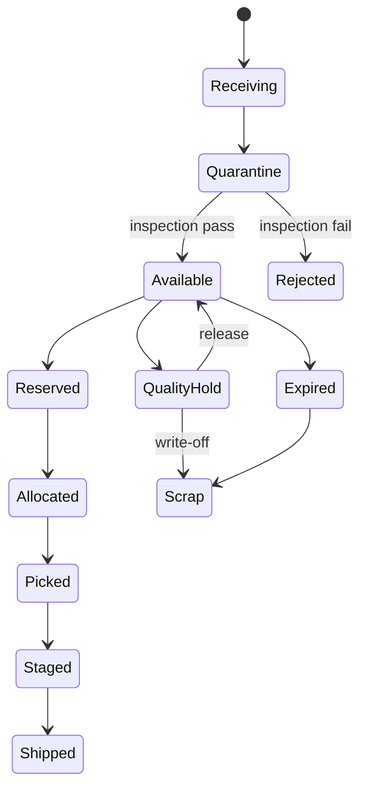
```mermaid
stateDiagram-v2
    [*] --> Receiving
    Receiving --> Quarantine
    Quarantine --> Available: inspection pass
    Quarantine --> Rejected: inspection fail
    Available --> Reserved
    Reserved --> Allocated
    Allocated --> Picked
    Picked --> Staged
    Staged --> Shipped
    Available --> QualityHold
    QualityHold --> Available: release
    QualityHold --> Scrap: write-off
    Available --> Expired
    Expired --> Scrap
```

Jangan biarkan UI atau script bebas mengubah status tanpa movement document.

Status change adalah event domain.

---

## 19. Lot, Serial, dan Traceability Graph

Traceability menjawab:

- item ini diterima dari supplier mana;
- lot ini digunakan dalam production batch mana;
- serial ini dikirim ke customer mana;
- customer mana yang terdampak recall;
- expiry lot mana yang masih tersimpan;
- stock ini berada dalam chain of custody mana.

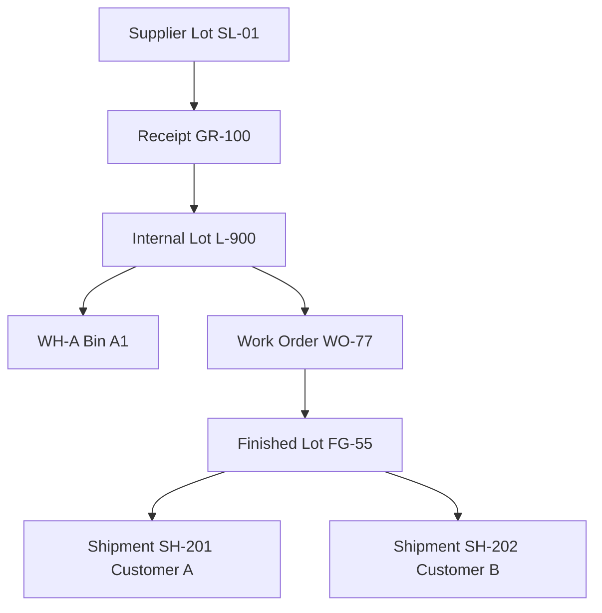
```mermaid
graph TD
    SupplierLot[Supplier Lot SL-01] --> Receipt[Receipt GR-100]
    Receipt --> InternalLot[Internal Lot L-900]
    InternalLot --> Storage[WH-A Bin A1]
    InternalLot --> Production[Work Order WO-77]
    Production --> FinishedLot[Finished Lot FG-55]
    FinishedLot --> Shipment1[Shipment SH-201 Customer A]
    FinishedLot --> Shipment2[Shipment SH-202 Customer B]
```

Traceability data minimal:

| Field | Kenapa Penting |
|---|---|
| source document | bukti asal |
| supplier/customer | recall dan dispute |
| lot/serial number | identifikasi spesifik |
| movement timestamp | chain of custody |
| location | keberadaan fisik |
| operator/system | accountability |
| quality status | eligibility |
| parent-child relation | production genealogy |

Untuk regulated inventory, traceability bukan nice-to-have.

---

## 20. Valuation Boundary: Inventory Quantity vs Inventory Value

Inventory quantity dan inventory value berhubungan, tetapi jangan dicampur terlalu erat.

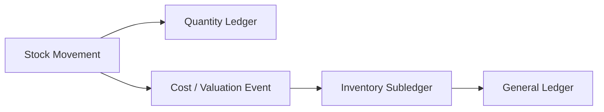
```mermaid
graph LR
    StockMovement[Stock Movement] --> QuantityLedger[Quantity Ledger]
    StockMovement --> CostEvent[Cost / Valuation Event]
    CostEvent --> InventorySubledger[Inventory Subledger]
    InventorySubledger --> GL[General Ledger]
```

Movement yang berdampak kuantitas belum tentu langsung final secara nilai.

Contoh:

- receipt terjadi sebelum invoice supplier;
- landed cost datang belakangan;
- transfer antar warehouse tidak mengubah total company inventory value tetapi bisa mengubah cost center/location;
- production receipt butuh roll-up cost;
- adjustment memicu variance;
- return membutuhkan costing policy.

Prinsip desain:

1. stock ledger menyimpan quantity truth;
2. inventory subledger menyimpan value truth;
3. cost event menghubungkan keduanya;
4. rekonsiliasi memastikan quantity movement dan financial posting konsisten;
5. period close mencegah perubahan historis tanpa adjustment period.

### 20.1 Costing Policy Boundary

Costing policy umum:

- standard cost;
- moving average;
- FIFO layer;
- specific identification;
- weighted average periodic;
- lot cost;
- project cost.

Part ini tidak mengulang accounting engine dari Part 009/010, tetapi inventory harus menyediakan event yang cukup:

```java
public record InventoryCostEvent(
        UUID eventId,
        UUID stockMovementDocumentId,
        UUID stockLedgerEntryId,
        SkuId skuId,
        LocationId locationId,
        Quantity quantity,
        MovementType movementType,
        CostingPolicy costingPolicy,
        Instant effectiveAt
) {}
```

---

## 21. Concurrency: Double Allocation dan Oversell

Inventory adalah domain concurrency-heavy.

Skenario klasik:

```text
Stock available = 5
Order A reserve 5
Order B reserve 5
Keduanya membaca available = 5 sebelum update
Hasil: oversell 5 unit
```

### 21.1 Strategy 1: Pessimistic Lock Balance Row

```java
@Lock(LockModeType.PESSIMISTIC_WRITE)
@Query("""
    select b from StockBalance b
    where b.balanceKey = :balanceKey
""")
Optional<StockBalance> lockForUpdate(BalanceKey balanceKey);
```

Cocok untuk:

- stock terbatas;
- high-value item;
- strict non-negative stock;
- reservation final.

Risiko:

- contention;
- deadlock jika multi-line order lock order tidak stabil;
- throughput turun saat flash sale.

Mitigasi:

- deterministic lock ordering;
- lock partitioning by balance key;
- short transaction;
- command queue per hot SKU;
- reservation bucket.

### 21.2 Strategy 2: Optimistic Version

```sql
update stock_balance
set reserved_qty = reserved_qty + :qty,
    available_qty = available_qty - :qty,
    version = version + 1
where balance_id = :id
  and available_qty >= :qty
  and version = :expected_version;
```

Cocok untuk:

- moderate contention;
- scalable reservation;
- retry-friendly command.

Risiko:

- retry storm;
- starvation pada hot item;
- error handling lebih kompleks.

### 21.3 Strategy 3: Reservation Ledger

Selain `stock_balance`, buat reservation sebagai ledger/state tersendiri.

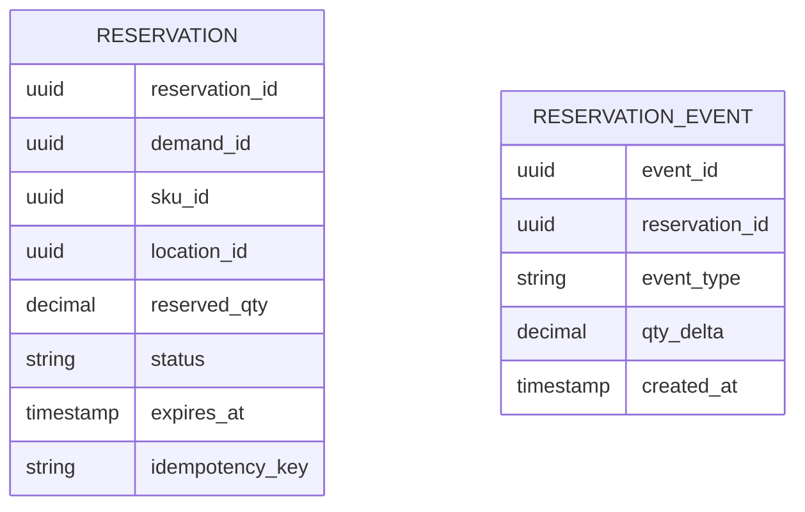
```mermaid
erDiagram
    RESERVATION {
        uuid reservation_id
        uuid demand_id
        uuid sku_id
        uuid location_id
        decimal reserved_qty
        string status
        timestamp expires_at
        string idempotency_key
    }

    RESERVATION_EVENT {
        uuid event_id
        uuid reservation_id
        string event_type
        decimal qty_delta
        timestamp created_at
    }
```

`available` dihitung dari stock projection minus active reservation.

Cocok jika reservation sangat penting untuk audit dan lifecycle.

---

## 22. Idempotency untuk Movement dan WMS Event

Warehouse dan integrasi sering mengirim event duplicate.

Contoh:

- scanner retry;
- WMS timeout lalu mengirim ulang;
- message broker redelivery;
- mobile app offline sync;
- user double-click confirm.

Setiap command perubahan stock harus punya idempotency key.

```java
public record PostStockMovementCommand(
        String idempotencyKey,
        MovementType movementType,
        UUID sourceDocumentId,
        UUID sourceLineId,
        List<MovementLine> lines,
        Instant occurredAt,
        UserContext actor
) {}
```

Idempotency key harus berasal dari business identity, bukan random UUID setiap retry.

Contoh:

```text
SHIP_CONFIRMATION:{shipmentId}:{shipmentLineId}:{confirmationAttemptNo}
WMS_PICK_CONFIRM:{wmsTaskId}:{scanSequence}
PO_RECEIPT:{receiptId}:{receiptLineId}
TRANSFER_RECEIPT:{transferId}:{destinationReceiptLineId}
```

Invariant:

```text
same idempotency key => same logical result
same source document line cannot post same final movement twice
```

---

## 23. Reversal, Correction, dan Cancellation

Inventory tidak boleh menghapus movement historis.

| Situasi | Solusi |
|---|---|
| receipt salah quantity sebelum close | reversal + corrected receipt |
| shipment salah lot | reversal shipment + re-post correct lot jika secara operasional valid |
| transfer hilang | loss adjustment / claim workflow |
| pick cancelled | move staging/picked stock back to eligible location |
| count salah | recount / correction adjustment |
| duplicate WMS event | idempotency rejects duplicate |

Cancellation harus melihat lifecycle.

```text
Order cancelled before allocation -> release reservation
Order cancelled after allocation -> deallocate stock
Order cancelled after pick -> return-to-stock movement
Order cancelled after shipment -> return/RMA process, not cancel shipment silently
```

---

## 24. Java Architecture Slice

Recommended package/capability structure:

```text
inventory/
  application/
    command/
      ReserveInventoryHandler.java
      AllocateInventoryHandler.java
      PostStockMovementHandler.java
      ConfirmPickHandler.java
      ConfirmShipmentHandler.java
    query/
      AvailabilityQueryService.java
      StockBalanceQueryService.java
  domain/
    model/
      StockMovementDocument.java
      StockLedgerEntry.java
      StockBalance.java
      Reservation.java
      WarehouseTask.java
      Lot.java
      SerialNumber.java
    service/
      AvailabilityPolicy.java
      ReservationPolicy.java
      MovementValidator.java
      AllocationStrategy.java
      PutAwayStrategy.java
      TraceabilityService.java
    invariant/
      NonNegativeStockInvariant.java
      SerialUniquenessInvariant.java
      LotEligibilityInvariant.java
  infrastructure/
    persistence/
      StockBalanceRepository.java
      StockLedgerRepository.java
      ReservationRepository.java
    messaging/
      InventoryOutboxPublisher.java
    integration/
      WmsAdapter.java
      BarcodeAdapter.java
```

Command boundary:

```java
public sealed interface InventoryCommand
        permits ReserveInventoryCommand,
                AllocateInventoryCommand,
                PostStockMovementCommand,
                ConfirmPickCommand,
                ConfirmShipmentCommand,
                AdjustInventoryCommand {
    String idempotencyKey();
    UserContext actor();
}
```

Domain service harus fokus pada invariant, bukan query UI.

---

## 25. Event Model untuk Integration

Inventory events:

| Event | Trigger | Consumer |
|---|---|---|
| `InventoryReserved` | reservation success | OMS, ATP, analytics |
| `InventoryReservationReleased` | cancellation/expiry | OMS, planning |
| `InventoryAllocated` | stock assigned | WMS |
| `StockMovementPosted` | ledger entry appended | accounting, BI, MRP |
| `GoodsReceived` | receipt posted | procurement, quality, accounting |
| `ShipmentConfirmed` | outbound shipment | billing, customer notification |
| `InventoryAdjusted` | approved adjustment | accounting, audit |
| `LotStatusChanged` | quality/release/hold | sales, production, compliance |

Payload harus menyertakan cukup identity untuk konsumen melakukan reconciliation.

```json
{
  "eventId": "evt-001",
  "eventType": "StockMovementPosted",
  "movementDocumentId": "mov-100",
  "sourceDocumentType": "SHIPMENT",
  "sourceDocumentId": "sh-200",
  "skuId": "sku-1",
  "locationId": "wh-a-stage",
  "lotId": "lot-99",
  "quantityDeltaBase": "-5",
  "baseUom": "EA",
  "occurredAt": "2026-06-30T10:15:00Z"
}
```

Jangan hanya publish `skuId` dan `qty`.

---

## 26. Reporting dan Reconciliation

Inventory harus punya report operasional dan reconciliation report.

| Report | Tujuan |
|---|---|
| Stock on hand | saldo per item/location/status |
| Available to promise | quantity yang boleh dijanjikan |
| Aging inventory | stock lama atau slow-moving |
| Expiry report | lot mendekati expiry |
| Negative stock report | violation/policy exception |
| Reservation aging | reservation terlalu lama |
| In-transit aging | transfer tertahan |
| Pick exception | task gagal/delay |
| Cycle count variance | selisih physical vs system |
| Stock ledger vs balance | projection correctness |
| Inventory value reconciliation | quantity vs financial value |

Reconciliation formula dasar:

```text
opening_balance + sum(ledger_delta in period) = closing_balance
```

Jika tidak cocok, cari:

- ledger entry hilang;
- projection update gagal;
- manual balance update;
- reversal salah;
- period boundary salah;
- timezone/effective date mismatch;
- duplicate movement;
- item/location key mismatch.

---

## 27. Observability: Business Metrics untuk Inventory

Technical metrics saja tidak cukup.

Business observability:

| Metric | Signal |
|---|---|
| negative stock count | invariant breach atau policy exception |
| reservation failure rate | supply shortage atau contention |
| allocation latency | warehouse/ATP bottleneck |
| pick exception rate | data/location quality buruk |
| in-transit aging | transfer atau carrier problem |
| cycle count variance rate | inventory accuracy |
| duplicate command rejected | integration retry health |
| ledger-balance mismatch | critical data corruption |
| expired available stock | policy bug |
| quarantine aging | quality bottleneck |

Alert harus business-aware.

Contoh:

```text
CRITICAL: stock ledger projection mismatch for SKU A / WH-1 / Lot L9.
Expected closing balance from ledger = 120, stock_balance = 118.
Last matching sequence = 888129, first mismatch sequence = 888130.
```

Ini jauh lebih berguna daripada `InventoryService error rate high`.

---

## 28. Performance Engineering untuk Inventory

Inventory workload berat:

- high-frequency stock query;
- reservation burst;
- warehouse scanner events;
- bulk receipt;
- batch picking;
- ATP calculation;
- MRP netting;
- stock valuation;
- reporting by location/lot/status.

Strategi:

1. pisahkan write model ledger dari read model availability;
2. index balance key sesuai query dominan;
3. gunakan partitioning ledger per tenant/time/item jika sangat besar;
4. hindari aggregate query ledger untuk setiap availability check;
5. cache reference data, bukan stock mutable sembarangan;
6. short transaction untuk lock-sensitive updates;
7. deterministic lock order untuk multi-line movement;
8. asynchronous projection untuk report non-critical;
9. synchronous projection untuk invariant stock critical;
10. batch insert ledger entries untuk bulk operation.

Contoh index:

```sql
create unique index uq_stock_balance_key
on stock_balance (
  tenant_id,
  sku_id,
  location_id,
  coalesce(lot_id, '00000000-0000-0000-0000-000000000000'),
  inventory_status,
  ownership_type
);

create index idx_stock_ledger_sku_time
on stock_ledger_entry (tenant_id, sku_id, effective_at, sequence_no);

create index idx_reservation_demand
on inventory_reservation (tenant_id, demand_type, demand_id, status);
```

---

## 29. Testing Strategy

Inventory testing harus invariant-driven.

### 29.1 Unit Tests

- UOM conversion rounding;
- lot eligibility;
- serial uniqueness;
- non-negative stock policy;
- reservation expiry;
- allocation priority;
- movement validation.

### 29.2 Integration Tests

- post receipt updates ledger and balance;
- duplicate receipt command returns same result;
- shipment consumes allocation;
- transfer creates in-transit stock;
- cycle count adjustment requires approval;
- outbox event emitted after commit.

### 29.3 Concurrency Tests

- two reservations for last stock;
- multi-line order deadlock prevention;
- retry optimistic lock;
- scanner duplicate pick confirmation;
- same serial shipped twice attempt.

### 29.4 Property-Based Invariants

Generate random movements and assert:

```text
balance = sum(ledger entries grouped by balance key)
no serial has two active physical locations
available never negative unless policy allows
reserved quantity cannot exceed reservable pool
shipment quantity cannot exceed allocated quantity
```

### 29.5 Golden Dataset

Buat dataset kecil:

- 3 warehouses;
- 10 SKUs;
- 2 lot-controlled items;
- 2 serial-controlled items;
- 1 item with UOM conversion;
- open purchase orders;
- open sales orders;
- transfers;
- cycle count variance;
- customer return;
- quarantine stock.

Gunakan dataset ini untuk regression report dan reconciliation.

---

## 30. Common Anti-Patterns

| Anti-pattern | Gejala | Dampak |
|---|---|---|
| Single `qty` column | available/on-hand/reserved bercampur | oversell, wrong report |
| Mutable stock history | transaksi lama diedit | audit collapse |
| No idempotency | duplicate WMS event | stock double decrement |
| Warehouse as one location | barang tidak bisa ditemukan | execution chaos |
| Reservation = allocation | terlalu awal mengunci bin/lot | warehouse inefficiency |
| Manual adjustment as fix-all | bug disembunyikan | financial/reconciliation loss |
| No lot/serial lifecycle | recall impossible | compliance failure |
| Reporting directly on OLTP ledger | report lambat | production performance drop |
| No valuation boundary | quantity dan accounting kacau | GL mismatch |
| No period control | historical balance berubah | close process failure |

---

## 31. Design Review Checklist

Gunakan checklist ini saat review inventory architecture.

### 31.1 Identity and Quantity

- Apakah item, SKU, UOM, lot, serial, dan barcode dipisahkan dengan benar?
- Apakah base UOM dan original UOM disimpan?
- Apakah conversion snapshot disimpan pada transaksi?
- Apakah quantity semantics eksplisit?

### 31.2 Ledger and Balance

- Apakah stock ledger append-only?
- Apakah reversal/correction memakai entry baru?
- Apakah balance projection bisa direbuild dari ledger?
- Apakah ledger entry punya source document identity?
- Apakah balance key cukup detail tapi tidak over-fragmented?

### 31.3 Reservation and Warehouse

- Apakah reservation, allocation, picking, packing, shipment dipisahkan?
- Apakah reservation idempotent?
- Apakah allocation obey lot/location/expiry policy?
- Apakah warehouse task punya lifecycle?
- Apakah cancellation berbeda berdasarkan lifecycle stage?

### 31.4 Control and Audit

- Apakah adjustment butuh reason code dan approval?
- Apakah quality hold/quarantine tidak bisa dilewati?
- Apakah traceability lot/serial bisa menjawab recall?
- Apakah period close mencegah perubahan historis?

### 31.5 Concurrency and Recovery

- Apakah double allocation dicegah?
- Apakah lock order deterministik?
- Apakah duplicate scanner/WMS event aman?
- Apakah failed movement masuk exception queue?
- Apakah ledger-balance mismatch bisa dideteksi?

---

## 32. 20-Hour Practice Plan untuk Inventory ERP

### Hour 1-3: Model Identity

- Buat model item/SKU/UOM/lot/serial.
- Tulis 10 contoh item dengan behavior berbeda.
- Tentukan base UOM dan conversion snapshot.

### Hour 4-6: Movement Ledger

- Buat stock movement document dan ledger entry.
- Implement receipt, shipment, transfer, adjustment.
- Pastikan reversal append-only.

### Hour 7-9: Balance Projection

- Buat stock balance projection.
- Tulis rebuild projection dari ledger.
- Tulis reconciliation opening + movement = closing.

### Hour 10-12: Reservation and Allocation

- Implement reserve dan allocate.
- Simulasikan dua order berebut stock terakhir.
- Tambahkan idempotency.

### Hour 13-15: Warehouse Task

- Implement receiving, put-away, pick, ship confirmation.
- Pisahkan pick cancellation dan shipment reversal.
- Tambahkan serial scan validation.

### Hour 16-18: Traceability and Quality

- Buat lot genealogy.
- Simulasikan quarantine -> available/rejected.
- Buat recall query: lot -> shipments -> customers.

### Hour 19-20: Failure Simulation

- Duplicate WMS event.
- Lost transfer.
- Cycle count variance.
- Ledger-balance mismatch.
- Write rescue playbook.

---

## 33. Source Notes

Beberapa rujukan teknis dan domain yang relevan untuk part ini:

- Jakarta Persistence mendefinisikan standar persistence dan object/relational mapping di lingkungan Java enterprise. Ini relevan untuk mapping ledger, balance, reservation, dan document lifecycle.
- Jakarta EE Platform menyediakan layanan enterprise termasuk persistence, transactions, messaging, concurrency, dan batch yang sering muncul pada ERP besar.
- PostgreSQL documentation menjelaskan transaction isolation dan explicit locking; konsep ini relevan untuk mencegah double allocation, oversell, dan race condition di stock-sensitive workflow.
- GS1 General Specifications dan GS1 Global Traceability Standard relevan untuk identifier, barcode, dan traceability supply chain.
- Apache OFBiz adalah ERP open-source berbasis Java yang mencakup accounting, order management, warehousing and inventory, manufacturing, dan MRP; ini berguna sebagai referensi domain ERP berbasis Java.

---

## 34. Ringkasan Mental Model

Inventory ERP yang benar tidak bertanya: “berapa quantity di tabel?”

Inventory ERP yang benar bertanya:

1. quantity apa;
2. untuk item/SKU/UOM/lot/serial mana;
3. di lokasi fisik/logis mana;
4. dalam status apa;
5. milik siapa;
6. tersedia untuk demand apa;
7. diklaim oleh siapa;
8. berasal dari movement mana;
9. bisa dibuktikan melalui ledger apa;
10. berdampak ke valuation/accounting bagaimana.

Model aman:

```text
Movement Document -> Immutable Stock Ledger -> Balance Projection -> Reservation/Allocation -> Warehouse Execution -> Traceability -> Valuation Event -> Reconciliation
```

Jika hanya menguasai CRUD inventory, engineer bisa membuat aplikasi gudang sederhana.

Jika menguasai ledger, lifecycle, concurrency, traceability, warehouse execution, dan reconciliation, engineer mulai mampu mendesain ERP inventory yang tahan skala, audit, dan failure nyata.
