# Part 014 — Manufacturing, BOM, Routing, and MRP

## 1. Target Skill Part Ini

Manufacturing ERP mengubah demand menjadi rencana, rencana menjadi work order, material menjadi WIP, WIP menjadi finished goods, dan seluruh prosesnya menjadi bukti biaya, kapasitas, kualitas, dan traceability.

> **Skill inti part ini:** mampu mendesain manufacturing domain dalam Java ERP besar sehingga BOM, routing, work center, material planning, work order, material issue, production receipt, WIP, scrap, yield, backflush, costing handoff, dan MRP tetap konsisten walaupun ada partial completion, substitute material, shortage, rework, scrap, routing change, planning rerun, machine downtime, lot traceability, dan integration failure.

Manufacturing bukan sekadar `production_order`.

Manufacturing adalah control loop antara:

- demand;
- supply;
- material availability;
- capacity availability;
- engineering definition;
- shop floor execution;
- quality control;
- inventory movement;
- cost accumulation;
- planning feedback.

Jika desain manufacturing salah:

- MRP menyarankan purchase order yang tidak perlu;
- work order release tanpa material cukup;
- raw material keluar dari stock tetapi finished goods tidak masuk;
- WIP tidak bisa direkonsiliasi;
- scrap tidak memengaruhi yield/cost;
- BOM revision berubah dan merusak work order historis;
- serial/lot genealogy tidak bisa menjawab recall;
- machine capacity overload tidak terlihat;
- production completion double-posted;
- accounting variance tidak bisa dijelaskan.

Part ini membangun manufacturing sebagai **definition + plan + execution + inventory movement + cost evidence + feedback loop**.

---

## 2. Kaufman Deconstruction: Memecah Skill Manufacturing ERP

Sub-skill yang harus dikuasai:

| Sub-skill | Pertanyaan yang Harus Bisa Dijawab | Output Engineering |
|---|---|---|
| Manufacturing item model | Item mana bought, made, phantom, semi-finished? | item planning attributes, make/buy policy |
| BOM | Komponen apa yang membentuk produk? | engineering BOM, manufacturing BOM, revision, effective date |
| Routing | Operasi apa yang dilakukan dan di work center mana? | operation sequence, setup/run time, labor/machine resource |
| Work center | Kapasitas apa yang tersedia? | calendar, shift, capacity bucket, constraint |
| MRP | Apa yang harus dibeli/dibuat/kapan? | planned order, purchase requisition, reschedule/cancel messages |
| Work order | Bagaimana produksi dieksekusi? | released order, material reservation, operation status |
| Material issue | Bagaimana material keluar ke WIP? | issue transaction, backflush, substitution |
| WIP | Bagaimana barang dalam proses dilacak? | WIP quantity, operation progress, cost accumulation |
| Completion | Bagaimana finished goods masuk inventory? | production receipt, lot/serial, yield, scrap |
| Quality | Bagaimana inspection dan hold bekerja? | inspection lot, pass/fail, rework, quarantine |
| Costing boundary | Bagaimana biaya produksi dikirim ke accounting? | material/labor/overhead event, variance |
| Traceability | Bagaimana input lot menjadi output lot? | genealogy graph |
| Failure recovery | Bagaimana membalik production movement? | reversal, rework, adjustment, exception queue |

Latihan utama:

- desain BOM multi-level;
- explode BOM dengan effective date;
- generate material requirement;
- reserve material untuk work order;
- issue material partial;
- complete finished goods partial;
- calculate yield dan scrap;
- trace raw lot ke finished lot;
- rerun MRP dengan snapshot berbeda;
- reconcile WIP quantity dan WIP value.

---

## 3. Manufacturing Sebagai Closed-Loop System

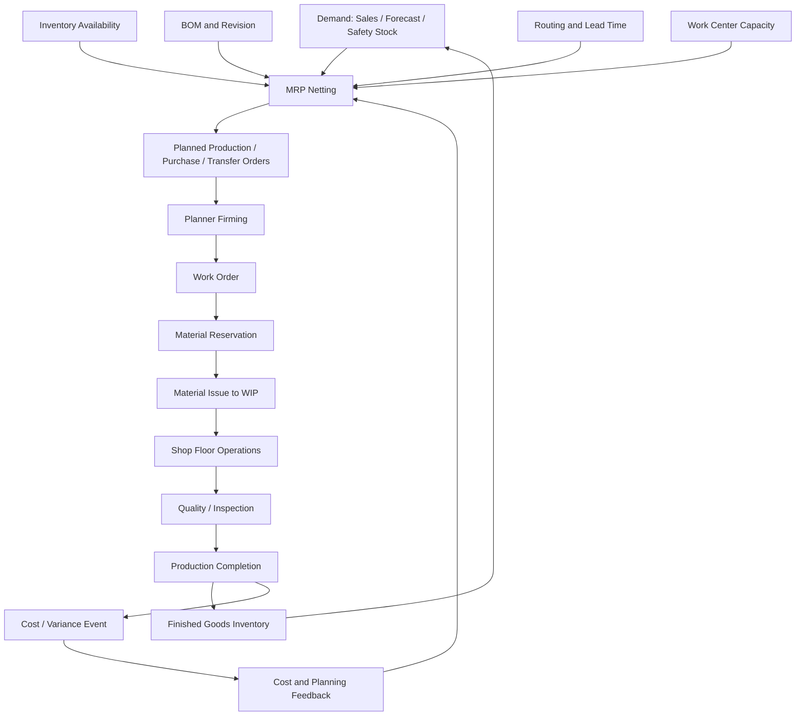

ERP manufacturing harus bisa membedakan:

- planning decision;
- firm commitment;
- execution transaction;
- accounting/cost event;
- quality disposition;
- historical evidence.

MRP output bukan fakta. MRP output adalah rekomendasi berdasarkan snapshot dan policy.

Work order release adalah komitmen operasional.

Production receipt adalah peristiwa inventory.

Cost posting adalah peristiwa finansial.

---

## 4. Manufacturing Item Attributes

Item master harus menyimpan planning/manufacturing attributes.

| Attribute | Makna |
|---|---|
| make/buy/transfer | sumber supply default |
| manufactured item | bisa dibuat via work order |
| purchased item | dibeli dari vendor |
| phantom item | exploded saat planning, tidak selalu stock-controlled |
| semi-finished item | intermediate stockable output |
| lot size | minimum/multiple/fixed/order-for-order |
| lead time | procurement/manufacturing/inspection time |
| safety stock | buffer minimum |
| yield factor | expected output ratio |
| scrap factor | expected loss |
| planning time fence | periode yang tidak boleh diubah otomatis |
| lot/serial control | traceability policy |
| shelf life | expiry and FEFO policy |
| backflush flag | material issue otomatis saat completion |

Contoh model:

```java
public record ManufacturingItemPolicy(
        SkuId skuId,
        SupplyType supplyType,
        boolean stockControlled,
        boolean lotControlled,
        boolean serialControlled,
        Quantity minimumLotSize,
        Quantity lotMultiple,
        Duration manufacturingLeadTime,
        Duration inspectionLeadTime,
        BigDecimal expectedYield,
        BigDecimal scrapFactor,
        PlanningTimeFence timeFence,
        BackflushPolicy backflushPolicy
) {}
```

Jangan menaruh semua logic manufacturing dalam `item_type` string.

---

## 5. BOM: Bill of Materials

BOM mendefinisikan komponen yang dibutuhkan untuk membuat parent item.

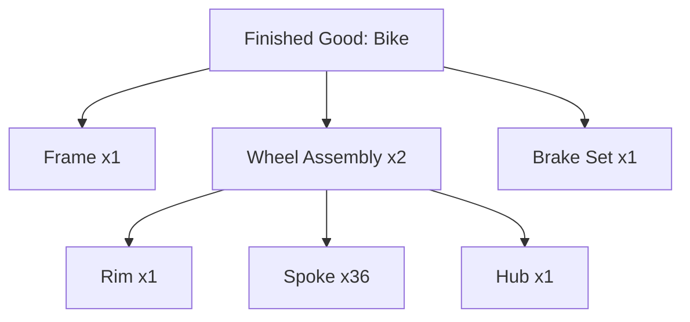

BOM penting karena memengaruhi:

- material requirement;
- costing;
- reservation;
- issue transaction;
- traceability;
- engineering change;
- production feasibility.

### 5.1 BOM Types

| Type | Fokus |
|---|---|
| Engineering BOM | desain produk dari engineering |
| Manufacturing BOM | komponen yang dipakai produksi aktual |
| Sales BOM | kit/bundle untuk penjualan |
| Service BOM | komponen untuk service/maintenance |
| Planning BOM | model agregat untuk forecast/planning |
| Phantom BOM | grouping komponen tanpa stocking intermediate |

ERP besar harus jelas BOM mana yang digunakan untuk proses mana.

### 5.2 BOM Effective Date dan Revision

BOM tidak boleh overwrite historis.

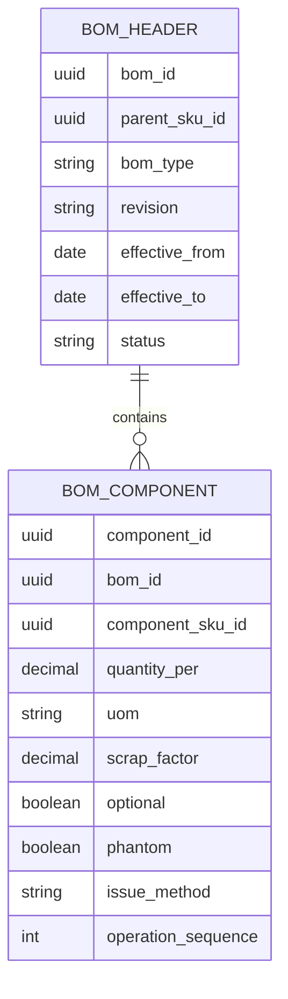

Invariant BOM:

```text
only one active manufacturing BOM per parent SKU per effective date and plant, unless variant/configuration policy permits
released work order stores BOM snapshot
historical work order is not changed by future BOM revision
BOM cycle is forbidden unless explicitly modelled as recoverable process loop
```

### 5.3 BOM Explosion

BOM explosion menghitung kebutuhan komponen.

```text
Required component qty = parent order qty * quantity_per / expected_yield + scrap allowance
```

Multi-level explosion harus mempertimbangkan:

- effective date;
- plant/site;
- revision;
- phantom components;
- alternate components;
- scrap factor;
- yield;
- UOM conversion;
- rounding/lot size.

Pseudo-code:

```java
public List<MaterialRequirement> explodeBom(BomExplosionRequest request) {
    BomSnapshot bom = bomRepository.findReleasedBomSnapshot(
            request.parentSkuId(),
            request.plantId(),
            request.effectiveDate(),
            request.revisionPolicy()
    );

    List<MaterialRequirement> requirements = new ArrayList<>();

    for (BomComponent component : bom.components()) {
        Quantity gross = component.quantityPer()
                .multiply(request.parentQuantity())
                .adjustForScrap(component.scrapFactor())
                .convertToBase(component.conversionSnapshot());

        if (component.isPhantom()) {
            requirements.addAll(explodeBom(request.forChild(component.skuId(), gross)));
        } else {
            requirements.add(new MaterialRequirement(component.skuId(), gross, component.operationSequence()));
        }
    }

    return requirements;
}
```

---

## 6. Routing: Operation Sequence dan Work Center

Routing mendefinisikan cara membuat produk.

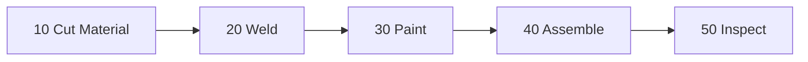

Routing terdiri dari:

- operation sequence;
- work center;
- setup time;
- run time;
- queue time;
- move time;
- labor requirement;
- machine requirement;
- tooling requirement;
- yield/scrap point;
- quality checkpoint;
- material issue point.

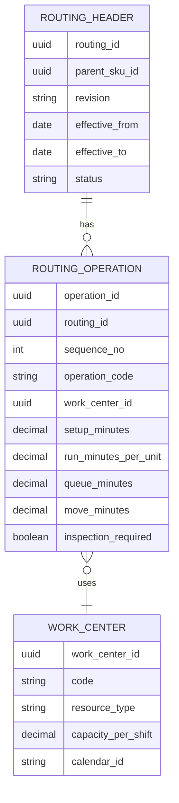

Routing memengaruhi:

- lead time;
- capacity planning;
- material staging;
- labor booking;
- machine scheduling;
- WIP tracking;
- production cost;
- quality inspection.

---

## 7. Work Center dan Capacity

Work center adalah constraint produksi.

Capacity sederhana:

```text
available capacity = shift hours * resource count * efficiency factor - planned downtime
required capacity = setup time + run time per unit * quantity
```

Contoh:

```text
Work center PAINT-01
Available: 8 hours/day
Setup: 30 minutes/order
Run: 3 minutes/unit
Order: 100 units
Required: 30 + 300 = 330 minutes = 5.5 hours
```

Capacity attributes:

| Attribute | Makna |
|---|---|
| calendar | hari/jam kerja |
| shift | pola shift |
| resource count | jumlah mesin/operator |
| efficiency | kapasitas efektif |
| queue time | waktu tunggu |
| setup matrix | setup bergantung item sebelumnya |
| maintenance downtime | waktu tidak tersedia |
| skill requirement | operator tertentu |
| finite/infinite capacity | apakah planning membatasi kapasitas |

MRP tradisional sering fokus material, bukan finite capacity. ERP besar harus jelas apakah planning hanya material requirement atau juga capacity constraint.

---

## 8. Work Order Lifecycle

Work order adalah komitmen produksi.

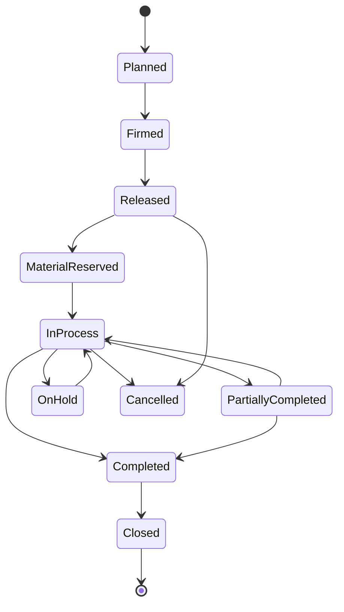

Status work order harus mengontrol transaksi yang boleh terjadi.

| Status | Boleh Dilakukan |
|---|---|
| Planned | ubah quantity/date, belum commitment kuat |
| Firmed | planner mengunci order dari auto-MRP changes |
| Released | shop floor boleh mulai, material bisa reserved/issued |
| InProcess | operation confirmation, material issue, WIP tracking |
| PartiallyCompleted | receipt sebagian, sisa masih open |
| Completed | output selesai, belum accounting/variance close |
| Closed | tidak boleh transaksi operasional biasa |
| Cancelled | reversal/release sesuai stage |

Work order harus menyimpan snapshot:

- BOM snapshot;
- routing snapshot;
- cost standard snapshot;
- UOM conversion snapshot;
- planning source;
- revision identity;
- material requirement.

Tanpa snapshot, perubahan master data menghancurkan historical order.

---

## 9. Work Order Data Model

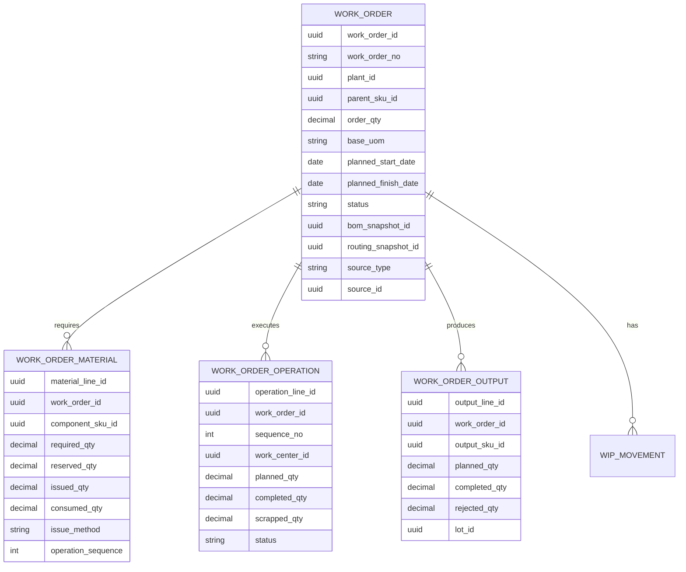

Invariant:

```text
completed_output_qty + rejected_output_qty <= order_qty + allowed_over_completion_tolerance
issued_material_qty cannot exceed required_qty + allowed_over_issue_tolerance unless approved
operation sequence must obey routing policy
closed work order cannot accept new issue/completion except authorized adjustment
```

---

## 10. Material Reservation dan Issue

Manufacturing membutuhkan material reservation agar raw material tidak dijanjikan ke demand lain.

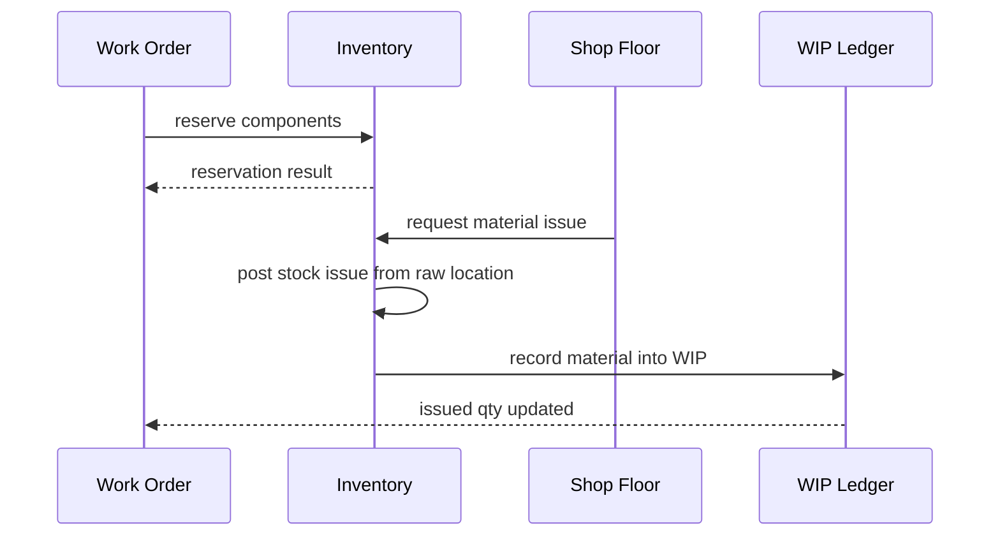

Material issue methods:

| Method | Cara Kerja | Cocok Untuk |
|---|---|---|
| manual issue | operator/gudang issue material eksplisit | expensive/regulated material |
| backflush | material otomatis consumed saat completion | high-volume repetitive manufacturing |
| operation issue | material issue pada operation tertentu | staged process |
| kit issue | semua komponen dikeluarkan sebagai kit | assembly |
| lot-specific issue | lot dipilih eksplisit | traceability/regulatory |

### 10.1 Backflush Risk

Backflush terlihat mudah tetapi berbahaya jika:

- BOM tidak akurat;
- scrap/yield bervariasi besar;
- material substitute sering terjadi;
- lot traceability wajib;
- operator tidak melaporkan actual consumption;
- inventory accuracy rendah.

Backflush aman jika:

- proses stabil;
- BOM akurat;
- variance dianalisis;
- item low value/high volume;
- completion event reliable;
- lot/serial policy tetap dipenuhi.

---

## 11. WIP: Work In Process

WIP adalah material dan cost yang sudah masuk proses tetapi belum menjadi finished goods.

Quantity WIP bisa dilacak dengan beberapa level:

| Level | Contoh |
|---|---|
| order-level WIP | material issued to WO-100 |
| operation-level WIP | 30 unit completed operation 20 |
| lot-level WIP | raw lot L1 menjadi WIP batch WB-7 |
| serial-level WIP | unit serial S1 sedang operation 30 |

WIP movement:

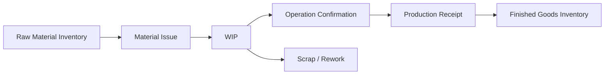

WIP invariant:

```text
issued_material_qty - consumed_to_output_qty - scrapped_material_qty = remaining_wip_material_qty
operation_completed_qty + operation_scrapped_qty <= previous_operation_good_qty adjusted by policy
finished_goods_receipt_qty <= work_order_output_allowed_qty
```

Tidak semua ERP perlu granular WIP per operation, tetapi domain harus sadar trade-off.

---

## 12. Operation Confirmation

Shop floor perlu melaporkan progress.

Operation confirmation bisa mencatat:

- started;
- completed quantity;
- scrapped quantity;
- rework quantity;
- labor time;
- machine time;
- downtime reason;
- operator;
- quality measurement;
- consumed material;
- produced intermediate output.

```java
public record ConfirmOperationCommand(
        String idempotencyKey,
        WorkOrderId workOrderId,
        OperationLineId operationLineId,
        Quantity completedQty,
        Quantity scrappedQty,
        Duration laborTime,
        Duration machineTime,
        Optional<DowntimeReason> downtimeReason,
        List<QualityMeasurement> measurements,
        UserContext actor
) {}
```

Operation confirmation harus idempotent.

Mobile/shop floor systems sering retry.

---

## 13. Production Completion dan Receipt

Production completion mengubah WIP menjadi finished/semi-finished goods.

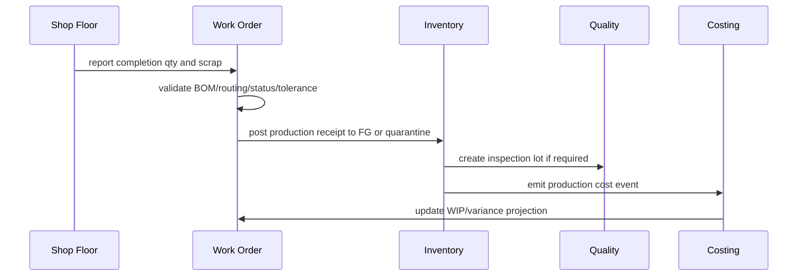

Completion invariant:

```text
completion_qty <= order_qty - previously_completed_qty + over_completion_tolerance
completion requires required operation completion if routing-enforced
lot/serial output must be assigned according to item policy
completion posts stock ledger entry
completion emits costing event
```

Partial completion harus didukung.

Contoh:

```text
WO-100 order qty = 100
Day 1 complete 40, scrap 3
Day 2 complete 55, scrap 2
Remaining = 5 open or close short depending policy
```

---

## 14. Yield, Scrap, Rework, By-Product, Co-Product

Manufacturing nyata jarang 100% clean.

| Konsep | Makna |
|---|---|
| yield | output good dibanding input/planned |
| scrap | material/output yang hilang/rusak |
| rework | output perlu diproses ulang |
| by-product | output tambahan bernilai rendah/sekunder |
| co-product | output bersama yang bernilai signifikan |

Contoh:

```text
Input raw material: 100 kg
Expected yield: 95 kg finished goods
Actual good output: 92 kg
Scrap: 6 kg
Unexplained variance: 2 kg
```

Sistem harus memisahkan:

- planned scrap;
- actual scrap;
- quality reject;
- rework quantity;
- normal loss;
- abnormal loss.

Costing dan planning bergantung pada klasifikasi ini.

---

## 15. Substitute dan Alternate Material

Ketika material shortage, planner/shop floor bisa memakai substitute.

Substitution harus controlled.

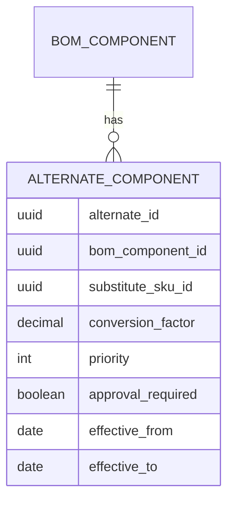

Rules:

- substitute harus effective;
- quality/regulatory compatibility harus valid;
- cost variance dicatat;
- traceability tetap lengkap;
- customer/product restriction dihormati;
- approval dibutuhkan jika high-risk.

Jangan izinkan operator mengganti material hanya dengan free text.

---

## 16. MRP: Material Requirements Planning

MRP menjawab:

```text
Apa yang harus dibuat atau dibeli, berapa banyak, dan kapan, agar demand terpenuhi dengan mempertimbangkan supply, inventory, BOM, lead time, lot sizing, dan policy?
```

MRP input:

- sales order demand;
- forecast;
- safety stock;
- dependent demand dari BOM;
- on-hand inventory;
- active reservations;
- open purchase orders;
- open work orders;
- transfer orders;
- lead time;
- lot sizing;
- scrap/yield;
- planning calendar;
- time fences;
- make/buy policy.

MRP output:

- planned production order;
- planned purchase requisition;
- planned transfer;
- expedite message;
- defer message;
- cancel message;
- shortage exception;
- excess supply exception.

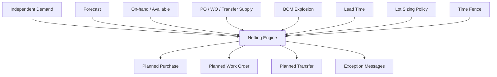

---

## 17. Gross-to-Net Requirement

Basic netting:

```text
gross requirement
- on hand available
- scheduled receipts
+ safety stock requirement
= net requirement
```

Lalu apply:

- lot sizing;
- lead time offset;
- yield adjustment;
- scrap;
- calendar;
- time fence;
- minimum/multiple quantity.

Contoh:

```text
Demand FG-A: 100 units due July 20
BOM component C1: 2 units per FG-A
Gross C1 requirement = 200
On-hand C1 available = 30
Open PO C1 before need date = 50
Safety stock C1 = 20
Net requirement = 200 - 30 - 50 + 20 = 140
Lot multiple = 25
Planned order = 150 units
```

MRP harus explainable.

Output yang baik:

```json
{
  "sku": "C1",
  "period": "2026-07-15",
  "grossRequirement": "200 EA",
  "onHandUsed": "30 EA",
  "scheduledReceiptUsed": "50 EA",
  "safetyStock": "20 EA",
  "netRequirement": "140 EA",
  "lotSizingAdjustment": "+10 EA",
  "plannedOrderQty": "150 EA",
  "reason": "Dependent demand from WO planned for FG-A"
}
```

Tanpa explanation, planner akan export ke spreadsheet dan sistem kehilangan kontrol.

---

## 18. Time-Phased Planning

MRP tidak bisa hanya total per item.

MRP harus time-phased.

```text
Period 1: demand 50, supply 20, projected available 10
Period 2: demand 30, supply 0, projected available -20 -> planned order
Period 3: demand 100, scheduled receipt 80, projected available ...
```

Time bucket bisa:

- daily;
- weekly;
- monthly;
- shift-level;
- operation-level.

Trade-off:

| Bucket | Kelebihan | Kekurangan |
|---|---|---|
| daily | detail tinggi | data besar |
| weekly | stabil untuk planning | kurang presisi untuk fast-moving |
| monthly | cocok strategic | tidak cukup untuk execution |
| shift-level | shop floor detail | kompleks dan mahal |

MRP run harus menyimpan snapshot:

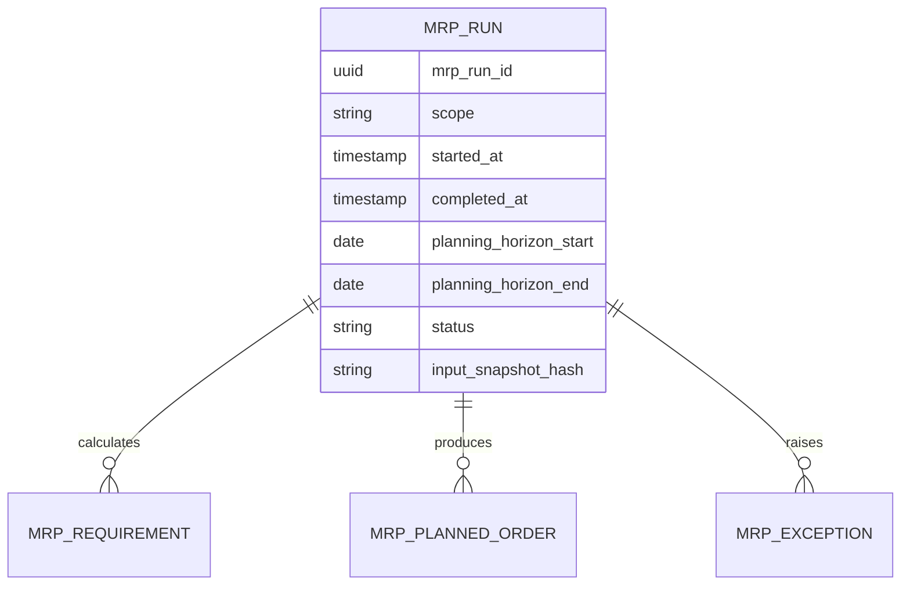

MRP result tanpa run identity sulit diaudit.

---

## 19. Planning Time Fence dan Firmed Orders

MRP tidak boleh sembarangan mengubah rencana dekat eksekusi.

| Zone | Policy |
|---|---|
| frozen zone | tidak boleh auto-change |
| slushy zone | perubahan butuh planner approval |
| liquid zone | MRP boleh merekomendasikan bebas |

Firmed order adalah planned order yang dikunci planner.

Invariant:

```text
MRP cannot delete or change firmed order automatically
MRP may create exception message suggesting action
released work order is execution commitment, not just plan
```

---

## 20. Lot Sizing Policies

Lot sizing memengaruhi planned order quantity.

| Policy | Cara Kerja |
|---|---|
| lot-for-lot | planned qty = exact net requirement |
| fixed lot size | selalu qty tetap |
| minimum lot size | tidak boleh di bawah minimum |
| lot multiple | dibulatkan ke multiple tertentu |
| period order quantity | gabungkan kebutuhan beberapa period |
| economic order quantity | optimasi biaya order/holding |

Implementation:

```java
public interface LotSizingPolicy {
    Quantity calculateOrderQuantity(NetRequirement requirement, PlanningItemPolicy policy);
}
```

Jangan hard-code lot sizing di query SQL.

---

## 21. Lead Time Offset

Lead time menentukan kapan order harus dimulai.

```text
need date - manufacturing lead time - inspection lead time - queue/move time = planned start/release date
```

Lead time bisa berasal dari:

- item policy;
- routing operations;
- supplier lead time;
- transfer route;
- inspection rule;
- calendar.

MRP harus sadar non-working day.

Jika due date Senin dan plant tidak beroperasi weekend, planned finish mungkin Jumat sebelumnya.

---

## 22. MRP Engine Architecture di Java

Pisahkan engine menjadi tahap deterministik.

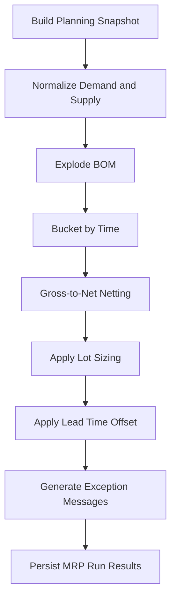

Package structure:

```text
manufacturing/
  application/
    command/
      CreateWorkOrderHandler.java
      ReleaseWorkOrderHandler.java
      IssueMaterialHandler.java
      ConfirmOperationHandler.java
      CompleteProductionHandler.java
      RunMrpHandler.java
    query/
      WorkOrderQueryService.java
      MrpResultQueryService.java
  domain/
    bom/
      BomHeader.java
      BomComponent.java
      BomExplosionService.java
    routing/
      RoutingHeader.java
      RoutingOperation.java
      WorkCenter.java
      CapacityService.java
    workorder/
      WorkOrder.java
      WorkOrderMaterial.java
      WorkOrderOperation.java
      WorkOrderOutput.java
    mrp/
      MrpRun.java
      NettingEngine.java
      LotSizingPolicy.java
      LeadTimeOffsetService.java
      PlanningSnapshot.java
    costing/
      ProductionCostEvent.java
  infrastructure/
    persistence/
    messaging/
    integration/
```

MRP engine harus deterministic untuk snapshot yang sama.

```text
same input snapshot + same policy version => same planned results
```

Ini penting untuk audit, debugging, dan planner trust.

---

## 23. Planning Snapshot

MRP tidak boleh membaca data yang berubah-ubah tanpa boundary.

Snapshot mencakup:

- item policies;
- BOM revisions;
- routing revisions;
- inventory balances;
- reservations;
- open demand;
- open supply;
- calendars;
- lead times;
- lot sizing policies;
- planning horizon.

Options:

| Approach | Kelebihan | Kekurangan |
|---|---|---|
| DB transaction repeatable read | konsisten | bisa berat untuk long run |
| materialized snapshot tables | auditable | storage dan ETL overhead |
| event-sourced snapshot | replayable | kompleks |
| versioned input extraction | practical | butuh hash/checkpoint |

Untuk ERP besar, simpan `input_snapshot_hash` dan source counts minimal:

```json
{
  "mrpRunId": "mrp-20260630-001",
  "items": 120000,
  "bomHeaders": 18000,
  "inventoryBalances": 900000,
  "openDemandLines": 350000,
  "openSupplyLines": 210000,
  "policyVersion": "PLN-2026-06-01",
  "snapshotHash": "sha256:..."
}
```

---

## 24. Work Order Release Control

Release work order bukan sekadar ubah status.

Release harus mengecek:

- BOM snapshot tersedia;
- routing snapshot tersedia;
- material availability;
- capacity rough check;
- quality constraints;
- engineering approval;
- period/calendar validity;
- security/SoD;
- duplicate order risk.

```java
@Transactional
public ReleaseWorkOrderResult release(ReleaseWorkOrderCommand command) {
    WorkOrder wo = workOrderRepository.lock(command.workOrderId());

    releasePolicy.validateStatus(wo);
    releasePolicy.validateBomAndRouting(wo);
    releasePolicy.validateEngineeringApproval(wo);

    MaterialReservationResult reservation = inventoryGateway.reserveMaterials(
            wo.materialReservationRequest(command.idempotencyKey())
    );

    wo.markReleased(reservation.reservationIds(), command.actor(), command.occurredAt());
    workOrderRepository.save(wo);

    outbox.publish(WorkOrderReleased.from(wo));
    return ReleaseWorkOrderResult.released(wo.id());
}
```

Jika material reservation gagal, release bisa:

- reject;
- release with shortage exception;
- partial release;
- send to planner approval.

Policy harus eksplisit.

---

## 25. Integration dengan Inventory

Manufacturing memakai inventory pada beberapa titik.

| Manufacturing Event | Inventory Effect |
|---|---|
| work order release | reserve raw material |
| material issue | raw material stock turun, WIP naik |
| material return | WIP turun, raw material stock naik |
| production completion | finished goods stock naik |
| scrap | WIP/stock turun, scrap/variance event |
| rework | move output to rework WIP |
| by-product receipt | by-product stock naik |

Jangan update inventory langsung dari manufacturing table.

Gunakan inventory command seperti part 013.

```text
Manufacturing -> Inventory Command -> Stock Ledger -> Inventory Event -> Costing/Planning
```

---

## 26. Costing Boundary untuk Manufacturing

Manufacturing costing melibatkan:

- material cost;
- labor cost;
- machine cost;
- overhead;
- subcontracting;
- scrap cost;
- variance.

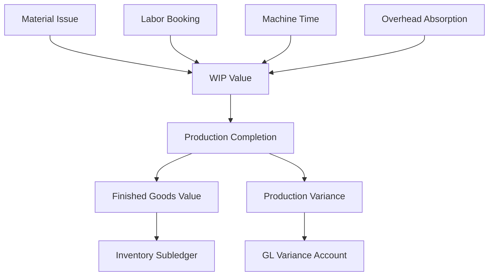

Manufacturing domain tidak harus menghitung semua accounting detail, tetapi harus emit event yang cukup.

```java
public record ProductionCostEvent(
        UUID eventId,
        WorkOrderId workOrderId,
        CostEventType eventType,
        Optional<StockMovementDocumentId> stockMovementDocumentId,
        Quantity quantity,
        CostComponent costComponent,
        Instant effectiveAt
) {}
```

Variance examples:

| Variance | Makna |
|---|---|
| material usage variance | actual material > standard |
| labor efficiency variance | actual labor time > standard |
| overhead variance | absorbed vs actual overhead |
| yield variance | output lebih rendah dari expected |
| scrap variance | scrap abnormal |
| purchase price variance | component cost berbeda dari standard |

---

## 27. Traceability: Raw Lot ke Finished Lot

Manufacturing traceability lebih kompleks dari inventory biasa.

Pertanyaan recall:

```text
Supplier lot RM-L1 dipakai untuk finished lot mana?
Finished lot FG-L9 dikirim ke customer mana?
Serial unit S-100 memakai komponen serial apa?
```

Genealogy graph:

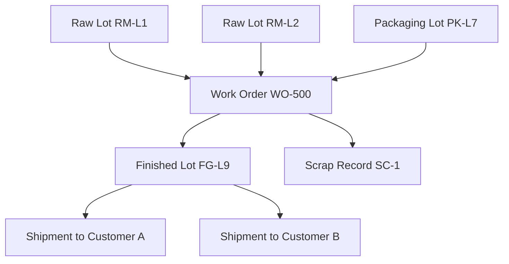

Data minimal:

| Entity | Field penting |
|---|---|
| input material issue | work order, component, lot/serial, qty |
| operation | sequence, work center, timestamp |
| output receipt | finished lot/serial, qty, status |
| quality result | pass/fail, measurement, certificate |
| shipment | customer, lot/serial, delivery doc |

Traceability harus append-only enough.

Jangan derive genealogy hanya dari current state.

---

## 28. Quality Control di Manufacturing

Quality bisa terjadi:

- incoming raw material;
- in-process operation;
- final inspection;
- post-production hold;
- customer return analysis.

Quality status memengaruhi inventory eligibility.

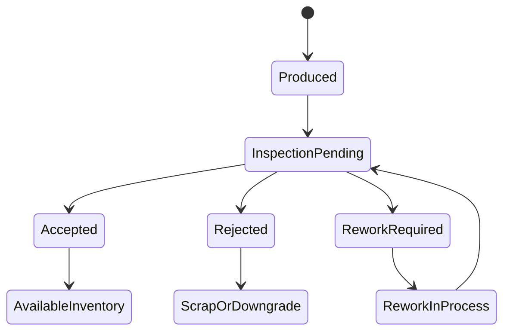

Quality result harus punya evidence:

- sample size;
- measurement;
- specification limit;
- inspector;
- instrument;
- timestamp;
- certificate;
- disposition.

---

## 29. Failure Modes Manufacturing

| Failure Mode | Penyebab | Guardrail |
|---|---|---|
| BOM revision overwrites history | update BOM tanpa snapshot | released WO stores BOM snapshot |
| MRP nervousness | rerun terus mengubah plan | time fence, firming, exception message |
| duplicate completion | retry shop floor event | idempotency key |
| negative raw material | issue tanpa availability check | reservation + inventory invariant |
| WIP orphan | material issued, WO cancelled | cancellation playbook |
| impossible traceability | no lot capture during issue/completion | lot/serial mandatory policy |
| capacity overload hidden | infinite capacity assumed | capacity exception report |
| backflush inaccurate | BOM inaccurate | variance monitoring |
| scrap ignored | no scrap transaction | scrap reason + cost event |
| work order closed with open WIP | close validation missing | WIP reconciliation before close |

---

## 30. MRP Nervousness dan Planner Trust

MRP nervousness adalah kondisi ketika perubahan kecil pada input membuat rekomendasi besar dan tidak stabil.

Penyebab:

- demand forecast berubah kecil;
- lot sizing kasar;
- lead time tidak akurat;
- safety stock terlalu agresif;
- tidak ada time fence;
- semua planned order auto-delete/recreate;
- firmed order tidak dihormati.

Mitigasi:

- time fence;
- firm planned order;
- pegging/explainability;
- exception messages instead of destructive changes;
- demand smoothing;
- minimum change threshold;
- planner approval workflow;
- compare MRP run delta.

MRP output harus bisa menjawab: “Kenapa sistem menyarankan order ini?”

Pegging graph:

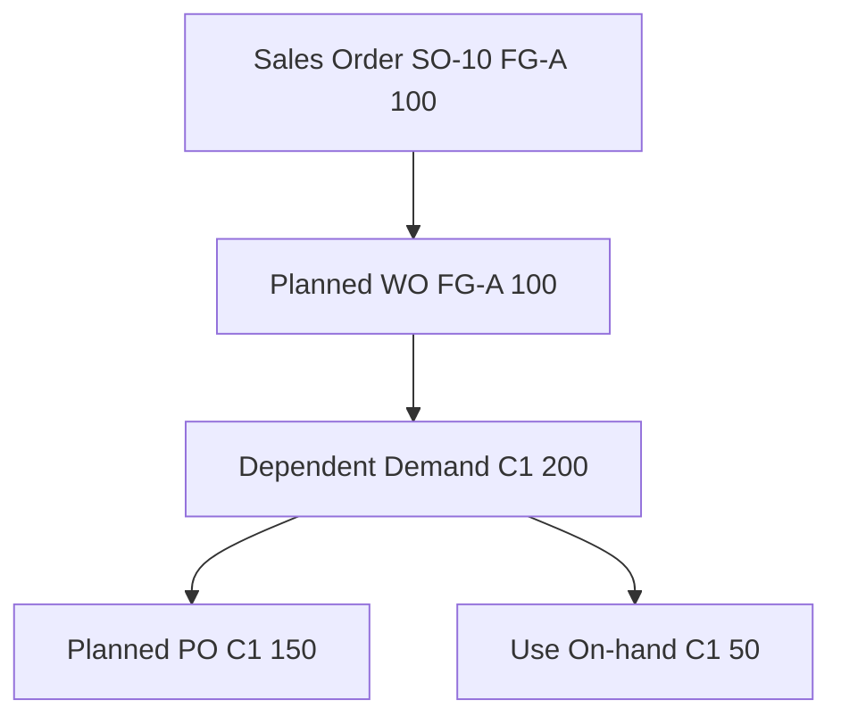

---

## 31. Performance Engineering untuk MRP dan Manufacturing

MRP bisa menjadi salah satu batch terberat ERP.

Workload:

- multi-level BOM explosion;
- millions of demand/supply lines;
- time bucket netting;
- planned order generation;
- capacity rough-cut;
- exception message comparison;
- pegging graph.

Strategies:

1. scope run by plant/product family when possible;
2. snapshot inputs before run;
3. use iterative BOM explosion with cycle detection;
4. precompute effective BOM/routing snapshots;
5. partition by low-level code/topological order;
6. batch persistence of results;
7. store explainability selectively but enough;
8. compare previous run to generate deltas;
9. avoid long OLTP locks;
10. separate planning tables from execution tables.

### 31.1 Low-Level Code

Low-level code membantu BOM explosion agar item parent diproses sebelum dependent component.

```text
FG level 0
Subassembly level 1
Raw material level 2
```

Komponen yang muncul di beberapa level harus diproses di level terdalam untuk netting yang benar.

---

## 32. Testing Strategy

### 32.1 BOM Tests

- active BOM selection by date/site/revision;
- BOM explosion multi-level;
- phantom BOM explosion;
- UOM conversion;
- scrap/yield calculation;
- cycle detection.

### 32.2 Routing Tests

- operation sequence validation;
- work center capacity calculation;
- lead time roll-up;
- inspection operation requirement.

### 32.3 Work Order Tests

- create WO stores BOM/routing snapshot;
- release reserves material;
- issue material posts inventory movement;
- completion posts finished goods receipt;
- partial completion;
- over-completion tolerance;
- close blocks open WIP.

### 32.4 MRP Tests

- gross-to-net calculation;
- open PO reduces net requirement;
- safety stock increases requirement;
- lot sizing rounds correctly;
- lead time offsets planned release;
- time fence protects firmed orders;
- pegging explains planned order.

### 32.5 Failure and Concurrency Tests

- duplicate operation confirmation;
- duplicate completion;
- material issue without enough stock;
- substitute material approval required;
- BOM changed after WO release does not mutate WO;
- two completions race on remaining quantity;
- MRP run with same snapshot is deterministic.

---

## 33. Golden Dataset Manufacturing

Buat dataset latihan:

- 1 finished good `FG-BIKE`;
- 1 subassembly `SA-WHEEL`;
- 5 raw materials;
- 1 phantom kit;
- 2 BOM revisions;
- 1 alternate component;
- 3 work centers;
- calendar with weekend off;
- 2 sales orders;
- 1 forecast demand;
- on-hand partial raw material;
- open PO for one component;
- open WO for subassembly;
- lot-controlled raw material;
- serial-controlled finished good;
- expected yield 95%;
- scrap factor 2%;
- lot sizing multiple 25.

Latihan output:

- exploded requirements;
- planned orders;
- work order release;
- material reservation;
- partial issue;
- partial completion;
- scrap report;
- traceability query;
- WIP reconciliation;
- MRP pegging.

---

## 34. Design Review Checklist

### 34.1 BOM and Routing

- Apakah BOM versioned dan effective-dated?
- Apakah work order menyimpan BOM/routing snapshot?
- Apakah phantom, alternate, substitute, scrap, dan yield didukung?
- Apakah BOM cycle dicegah?
- Apakah routing punya operation sequence dan work center?

### 34.2 Work Order Execution

- Apakah status work order mengontrol action yang valid?
- Apakah release mengecek material/capacity/policy?
- Apakah material issue terhubung ke inventory ledger?
- Apakah WIP bisa direkonsiliasi?
- Apakah completion partial dan scrap didukung?
- Apakah duplicate shop floor event idempotent?

### 34.3 MRP

- Apakah MRP menggunakan snapshot?
- Apakah output explainable dan pegged ke demand?
- Apakah time fence dan firmed order dihormati?
- Apakah lot sizing dan lead time eksplisit?
- Apakah MRP result disimpan per run?
- Apakah rerun menghasilkan delta yang bisa dipahami planner?

### 34.4 Traceability and Quality

- Apakah lot/serial input-output genealogy lengkap?
- Apakah quality status mengontrol inventory eligibility?
- Apakah rework dan scrap punya reason/evidence?
- Apakah recall query bisa dilakukan cepat dan benar?

### 34.5 Cost and Reconciliation

- Apakah material/labor/overhead/scrap event cukup untuk costing?
- Apakah WIP close memvalidasi open balance?
- Apakah production variance bisa dijelaskan?
- Apakah inventory quantity dan WIP value bisa direkonsiliasi?

---

## 35. 20-Hour Practice Plan untuk Manufacturing ERP

### Hour 1-3: BOM Foundation

- Buat model BOM header/component.
- Tambahkan revision dan effective date.
- Implement BOM explosion multi-level.
- Tambahkan phantom item dan cycle detection.

### Hour 4-6: Routing and Capacity

- Buat routing operation dan work center.
- Hitung lead time sederhana.
- Hitung required capacity.
- Buat capacity exception report.

### Hour 7-9: Work Order Lifecycle

- Create work order dari BOM/routing snapshot.
- Implement status transition.
- Release work order dengan material reservation.

### Hour 10-12: Material Issue and WIP

- Issue material ke WIP.
- Implement backflush untuk satu item.
- Reconcile issued vs consumed vs remaining WIP.

### Hour 13-15: Completion, Scrap, Quality

- Partial completion.
- Scrap reporting.
- Quality hold sebelum available stock.
- Production receipt ke inventory ledger.

### Hour 16-18: MRP

- Build planning snapshot.
- Implement gross-to-net.
- Apply lot sizing dan lead time.
- Generate planned work order dan planned purchase.

### Hour 19-20: Failure Simulation

- Change BOM after WO release.
- Duplicate completion event.
- Material shortage saat release.
- MRP rerun delta.
- Recall raw lot ke finished lot/customer.

---

## 36. Source Notes

Rujukan teknis dan domain yang relevan:

- Jakarta EE Platform menyediakan layanan enterprise Java seperti persistence, transactions, messaging, batch, dan concurrency yang sering dibutuhkan untuk ERP manufacturing dan planning workload.
- Jakarta Persistence relevan untuk modelling entity lifecycle seperti BOM, routing, work order, MRP run, dan ledger projection.
- PostgreSQL transaction isolation dan explicit locking relevan untuk material reservation, work order quantity update, dan duplicate completion race.
- Apache OFBiz adalah ERP open-source berbasis Java yang mencakup manufacturing, MRP, inventory, order management, dan accounting; ini berguna sebagai referensi bahwa manufacturing dan inventory harus terintegrasi, bukan modul terpisah tanpa ledger.
- GS1 traceability standards relevan untuk chain of custody dan lot/serial traceability terutama ketika raw material lot harus dipetakan ke finished goods lot dan shipment.

---

## 37. Ringkasan Mental Model

Manufacturing ERP yang benar tidak dimulai dari tabel `production_order`.

Manufacturing ERP yang benar dimulai dari pertanyaan:

1. produk dibuat dari apa;
2. versi definisi mana yang berlaku;
3. operasi apa yang harus dilakukan;
4. kapasitas apa yang menjadi constraint;
5. material apa yang tersedia;
6. demand mana yang harus dipenuhi;
7. kapan order harus dimulai;
8. material mana yang dikonsumsi;
9. output mana yang dihasilkan;
10. scrap/rework/quality evidence apa yang terjadi;
11. cost/variance apa yang timbul;
12. traceability apa yang harus bisa dibuktikan.

Model aman:

```text
Demand -> MRP Snapshot -> Planned Orders -> Firm/Release -> Material Reservation -> Material Issue -> WIP -> Operation Confirmation -> Completion -> Inventory Receipt -> Cost Event -> Traceability -> Feedback
```

Jika hanya tahu CRUD work order, engineer bisa membuat aplikasi pencatatan produksi.

Jika menguasai BOM versioning, routing, MRP netting, WIP, inventory integration, costing boundary, traceability, dan failure modelling, engineer mulai mampu mendesain manufacturing ERP yang tahan operasi nyata.
