# Part 015 — Asset, Project, and Service Management

## 1. Target Skill Part Ini

Asset, project, dan service management sering terlihat seperti modul tambahan di ERP. Dalam sistem besar, tiga domain ini adalah jembatan antara **physical reality**, **financial accountability**, dan **customer/internal service obligation**.

> **Skill inti part ini:** mampu mendesain domain asset, project, dan service dalam Java ERP sehingga acquisition, capitalization, depreciation handoff, maintenance, project cost capture, project billing, service order, warranty, SLA, spare-part usage, labor capture, dan audit evidence tetap konsisten walaupun ada partial completion, retroactive adjustment, asset transfer, component replacement, project reclassification, service cancellation, warranty dispute, dan integration failure.

Asset bukan sekadar tabel `fixed_asset`.

Project bukan sekadar `project_code` di invoice.

Service bukan sekadar tiket.

Dalam ERP besar, ketiganya saling memengaruhi:

- pembelian mesin menjadi asset setelah capitalization;
- asset membutuhkan preventive dan corrective maintenance;
- maintenance memakai spare part dari inventory;
- biaya maintenance masuk ke expense, asset improvement, project, atau warranty claim;
- project mengumpulkan cost dari procurement, timesheet, inventory issue, expense, dan service execution;
- service order bisa menghasilkan invoice, warranty claim, replacement part, atau internal cost;
- fixed asset depreciation harus masuk GL;
- project WIP harus direkonsiliasi;
- service SLA breach harus terlihat dan bisa diaudit.

Jika desainnya buruk:

- asset sudah dipakai tetapi belum dikapitalisasi;
- depreciation berjalan atas nilai yang salah;
- project cost tersebar di banyak modul tanpa traceability;
- maintenance cost tidak bisa dibedakan antara repair dan capital improvement;
- warranty part diganti tetapi inventory tidak berkurang;
- service order closed walaupun labor/spare part belum lengkap;
- project profitability tidak bisa dipercaya;
- asset disposal tidak menghapus asset dari operational availability;
- audit tidak bisa membuktikan siapa mengubah useful life atau residual value.

Part ini membangun asset/project/service sebagai **lifecycle domains** yang berinteraksi dengan procurement, inventory, accounting, HR/time capture, billing, workflow, dan reporting.

---

## 2. Kaufman Deconstruction: Memecah Skill Asset, Project, dan Service ERP

Menurut pendekatan Kaufman, skill kompleks harus dipecah menjadi sub-skill yang dapat dilatih secara terpisah. Untuk part ini, pecahannya adalah:

| Sub-skill | Pertanyaan yang Harus Bisa Dijawab | Output Engineering |
|---|---|---|
| Asset identity | Apa yang membuat asset unik secara legal/operasional? | asset master, tag, serial, location, custodian |
| Asset lifecycle | Bagaimana asset bergerak dari request sampai disposal? | state machine, transition guard, audit trail |
| Capitalization | Kapan cost menjadi asset, bukan expense? | capitalization event, source cost linkage |
| Depreciation boundary | Siapa menghitung, siapa posting, siapa approve? | depreciation schedule, posting request, adjustment |
| Asset hierarchy | Bagaimana component/sub-asset dilacak? | parent-child asset tree, replacement history |
| Maintenance | Bagaimana preventive/corrective maintenance dijalankan? | work order, schedule, labor, spare part, downtime |
| Project cost capture | Dari mana project cost berasal? | cost transaction, cost bucket, source traceability |
| Project accounting | Kapan cost menjadi expense, WIP, revenue, capitalization? | project ledger, billing milestone, recognition boundary |
| Service order | Bagaimana permintaan service dieksekusi? | ticket/order lifecycle, SLA, assignment, closure |
| Warranty | Kapan biaya ditanggung warranty? | warranty policy, entitlement, claim, coverage decision |
| Cross-module integration | Apa efek ke inventory, GL, AP, AR, procurement? | event contracts, posting pipeline, reconciliation |
| Failure modelling | Bagaimana recover dari partial/incorrect execution? | reversal, correction, exception queue, compensating action |

Tujuan belajar bukan menghafal field. Tujuannya mampu menjawab:

> “Ketika asset, project, atau service berubah status, invariant bisnis apa yang harus tetap benar?”

---

## 3. Mental Model: Three Lifecycles, One Cost Evidence Graph

Gunakan mental model berikut:

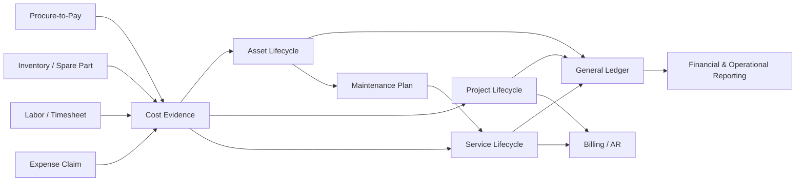
```mermaid
flowchart LR
    P2P[Procure-to-Pay] --> COST[Cost Evidence]
    INV[Inventory / Spare Part] --> COST
    TIME[Labor / Timesheet] --> COST
    EXP[Expense Claim] --> COST

    COST --> ASSET[Asset Lifecycle]
    COST --> PROJECT[Project Lifecycle]
    COST --> SERVICE[Service Lifecycle]

    ASSET --> GL[General Ledger]
    PROJECT --> GL
    SERVICE --> GL

    SERVICE --> AR[Billing / AR]
    PROJECT --> AR
    ASSET --> MAINT[Maintenance Plan]
    MAINT --> SERVICE

    GL --> REPORT[Financial & Operational Reporting]
```

Kunci desain:

1. **Cost evidence tidak boleh hilang.**  
   Setiap cost yang masuk ke asset, project, atau service harus punya sumber: invoice, receipt, inventory issue, labor, expense, atau adjustment.

2. **Lifecycle berbeda dari accounting treatment.**  
   Asset bisa operationally active tetapi belum capitalized. Project bisa operationally active tetapi financial status-nya WIP. Service order bisa closed secara operasional tetapi billing masih pending.

3. **State transition harus guarded by evidence.**  
   Tidak boleh dispose asset tanpa disposal reason, approval, asset status, accounting effect, dan traceability.

4. **Correction lebih penting daripada delete.**  
   ERP harus mengutamakan reversal, adjustment, reclassification, dan re-posting yang defensible.

5. **Reporting harus dapat menjawab “why”.**  
   Bukan hanya “asset value = X”, tapi “nilai ini berasal dari cost mana, depreciation mana, adjustment mana, dan approval siapa”.

---

## 4. Domain Boundary: Jangan Campur Semuanya ke Modul Asset

Salah satu anti-pattern ERP adalah membuat modul asset/project/service mengurus semua hal sendiri: inventory, procurement, billing, accounting, approval, dan reporting sekaligus. Ini menghasilkan coupling berat.

Boundary yang lebih sehat:

| Domain | Owns | Does Not Own |
|---|---|---|
| Asset Management | asset master, asset lifecycle, location/custodian, maintenance association, depreciation intent | GL balance sebagai source of truth, procurement invoice, inventory stock |
| Project Management | project structure, task/WBS, project lifecycle, budget, cost allocation rule | AP invoice lifecycle, payroll, inventory balance |
| Service Management | service request/order, SLA, technician assignment, work completion, entitlement decision | customer master, item master, stock ledger, AR receipt |
| Accounting | journal, posting, accounting period, balance, reconciliation | physical condition asset, technician schedule |
| Inventory | stock movement, spare part availability, lot/serial | service closure decision, asset useful life |
| Procurement | PO/GRN/invoice matching | asset capitalization approval |

Rule praktis:

> Domain yang menciptakan real-world fact harus own event-nya; domain accounting hanya mengubah fact tersebut menjadi financial representation.

Contoh:

- Service Management mencatat `SparePartConsumed`.
- Inventory memvalidasi dan memposting `StockIssued`.
- Accounting memposting expense/capitalization dari event yang sudah valid.
- Service Management tidak langsung mengurangi stock balance dengan update SQL.

---

## 5. Asset Management: Apa yang Sebenarnya Dimodelkan?

Asset ERP memiliki dua sisi:

1. **Operational asset**  
   Sesuatu yang digunakan, dipindahkan, dirawat, diperiksa, dan dimiliki custodian.

2. **Financial fixed asset**  
   Sesuatu yang dikapitalisasi, disusutkan, di-revalue/impair, dan dilaporkan.

Keduanya tidak selalu 1:1.

Contoh:

| Realitas | Operational Asset | Financial Asset |
|---|---:|---:|
| Laptop murah yang langsung expensed | yes | no |
| Mesin produksi besar | yes | yes |
| Software license capitalized | maybe no physical tracking | yes |
| Spare component dalam mesin | yes as component | maybe part of parent asset |
| Building renovation | maybe project deliverable | yes asset improvement |

Desain yang baik tidak memaksa semua barang inventaris menjadi fixed asset.

---

## 6. Asset Master Model

Minimum conceptual model:

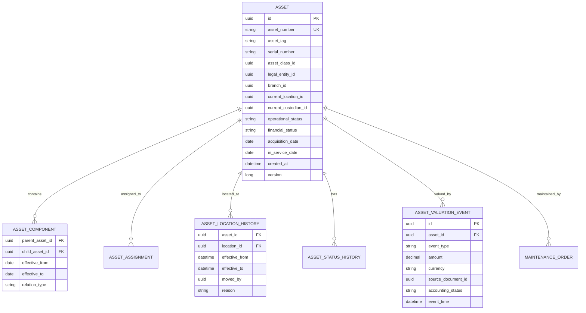
```mermaid
erDiagram
    ASSET ||--o{ ASSET_COMPONENT : contains
    ASSET ||--o{ ASSET_ASSIGNMENT : assigned_to
    ASSET ||--o{ ASSET_LOCATION_HISTORY : located_at
    ASSET ||--o{ ASSET_STATUS_HISTORY : has
    ASSET ||--o{ ASSET_VALUATION_EVENT : valued_by
    ASSET ||--o{ MAINTENANCE_ORDER : maintained_by

    ASSET {
        uuid id PK
        string asset_number UK
        string asset_tag
        string serial_number
        uuid asset_class_id
        uuid legal_entity_id
        uuid branch_id
        uuid current_location_id
        uuid current_custodian_id
        string operational_status
        string financial_status
        date acquisition_date
        date in_service_date
        datetime created_at
        long version
    }

    ASSET_COMPONENT {
        uuid parent_asset_id FK
        uuid child_asset_id FK
        date effective_from
        date effective_to
        string relation_type
    }

    ASSET_VALUATION_EVENT {
        uuid id PK
        uuid asset_id FK
        string event_type
        decimal amount
        string currency
        uuid source_document_id
        string accounting_status
        datetime event_time
    }

    ASSET_LOCATION_HISTORY {
        uuid asset_id FK
        uuid location_id FK
        datetime effective_from
        datetime effective_to
        uuid moved_by
        string reason
    }
```

Important fields:

| Field | Why It Matters |
|---|---|
| `asset_number` | legal/audit identity, often controlled sequence |
| `asset_tag` | physical label, may be changed/replaced |
| `serial_number` | manufacturer identity, useful for warranty/recall |
| `asset_class_id` | drives accounting, maintenance, depreciation default |
| `legal_entity_id` | determines ownership and accounting books |
| `current_location_id` | operational control and physical audit |
| `current_custodian_id` | accountability |
| `operational_status` | usable, under repair, retired, lost, disposed |
| `financial_status` | not_capitalized, capitalized, fully_depreciated, disposed |
| `in_service_date` | depreciation and maintenance scheduling trigger |
| `version` | optimistic concurrency guard |

---

## 7. Asset Lifecycle State Machine

Asset lifecycle perlu membedakan physical, operational, dan financial status. Untuk versi awal, buat state machine utama:

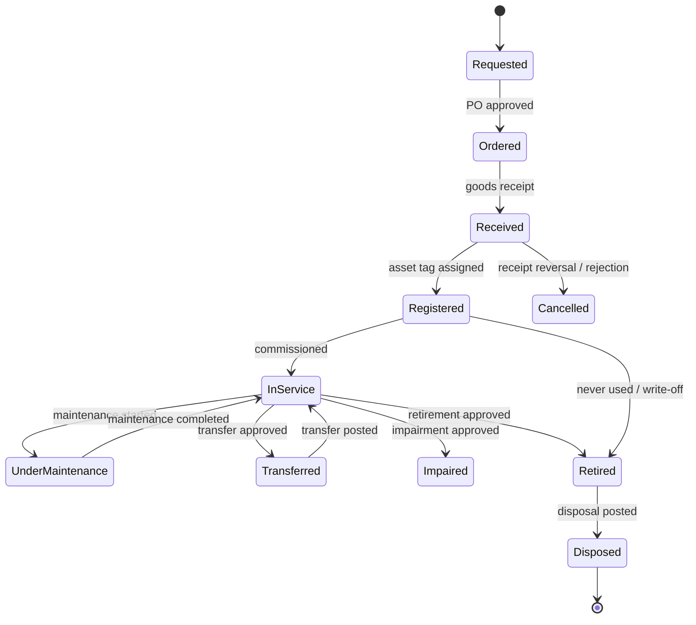
```mermaid
stateDiagram-v2
    [*] --> Requested
    Requested --> Ordered: PO approved
    Ordered --> Received: goods receipt
    Received --> Registered: asset tag assigned
    Registered --> InService: commissioned
    InService --> UnderMaintenance: maintenance started
    UnderMaintenance --> InService: maintenance completed
    InService --> Transferred: transfer approved
    Transferred --> InService: transfer posted
    InService --> Impaired: impairment approved
    InService --> Retired: retirement approved
    Retired --> Disposed: disposal posted
    Disposed --> [*]

    Received --> Cancelled: receipt reversal / rejection
    Registered --> Retired: never used / write-off
```

Transition guards:

| Transition | Required Evidence | Block If |
|---|---|---|
| `Received -> Registered` | GRN, asset class, legal entity, asset tag policy | duplicate serial/tag |
| `Registered -> InService` | commissioning date, custodian/location, capitalization decision | future locked period invalid |
| `InService -> Transferred` | approval, target org/location, custody acceptance | active maintenance order not allowed |
| `InService -> UnderMaintenance` | maintenance order, technician/resource assignment | asset already under maintenance |
| `InService -> Retired` | retirement reason, approval, financial impact estimate | open service/project cost pending |
| `Retired -> Disposed` | disposal document, proceeds/scrap value, accounting posting request | accounting period closed without adjustment path |

Do not use a single string status without transition rule. State transition should be a command, not a raw update.

---

## 8. Java Aggregate Sketch: Asset Lifecycle

```java
public final class Asset {
    private final AssetId id;
    private final AssetNumber number;
    private AssetOperationalStatus operationalStatus;
    private AssetFinancialStatus financialStatus;
    private LocationId currentLocation;
    private PartyId currentCustodian;
    private Instant inServiceAt;
    private long version;

    public AssetRegistered register(AssetRegistrationCommand command, AssetPolicy policy) {
        requireStatus(AssetOperationalStatus.RECEIVED);
        policy.assertTagAllowed(command.assetTag(), command.serialNumber());

        this.operationalStatus = AssetOperationalStatus.REGISTERED;

        return new AssetRegistered(
            id,
            command.assetTag(),
            command.serialNumber(),
            command.actorId(),
            command.evidenceId(),
            command.occurredAt()
        );
    }

    public AssetCommissioned commission(CommissionAssetCommand command, AccountingPeriodPolicy periodPolicy) {
        requireStatus(AssetOperationalStatus.REGISTERED);
        periodPolicy.assertOperationalDateAllowed(command.inServiceDate());

        this.operationalStatus = AssetOperationalStatus.IN_SERVICE;
        this.currentLocation = command.locationId();
        this.currentCustodian = command.custodianId();
        this.inServiceAt = command.occurredAt();

        return new AssetCommissioned(
            id,
            command.locationId(),
            command.custodianId(),
            command.inServiceDate(),
            command.actorId(),
            command.occurredAt()
        );
    }

    public AssetTransferInitiated transfer(TransferAssetCommand command, TransferPolicy policy) {
        requireStatus(AssetOperationalStatus.IN_SERVICE);
        policy.assertTransferAllowed(this, command.targetLocation(), command.targetCustodian());

        this.operationalStatus = AssetOperationalStatus.TRANSFER_PENDING;

        return new AssetTransferInitiated(
            id,
            currentLocation,
            command.targetLocation(),
            currentCustodian,
            command.targetCustodian(),
            command.reason(),
            command.actorId(),
            command.occurredAt()
        );
    }

    private void requireStatus(AssetOperationalStatus expected) {
        if (operationalStatus != expected) {
            throw new DomainRuleViolation("Asset must be " + expected + " but was " + operationalStatus);
        }
    }
}
```

Observe:

- command membawa actor dan evidence;
- policy memisahkan rule yang berubah;
- aggregate tidak langsung posting GL;
- method mengembalikan domain event;
- transition invalid gagal sebelum state berubah.

---

## 9. Capitalization Boundary

Capitalization adalah keputusan bahwa cost tertentu menjadi nilai asset, bukan langsung expense.

Sources of capitalizable cost:

- purchase invoice untuk asset;
- freight/import cost;
- installation service;
- internal labor yang memenuhi policy;
- project construction cost;
- major improvement;
- commissioning cost.

Sumber yang biasanya tidak langsung menjadi asset:

- routine maintenance;
- minor repair;
- consumable spare part;
- training umum;
- operating expense setelah asset siap digunakan.

ERP harus mendukung policy tanpa hardcode berlebihan.

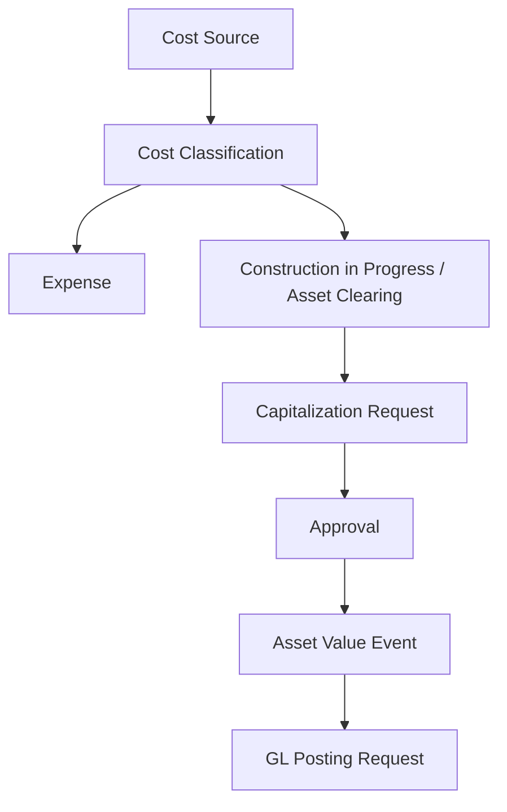
```mermaid
flowchart TD
    SRC[Cost Source]
    SRC --> CLASSIFY[Cost Classification]
    CLASSIFY --> EXPENSE[Expense]
    CLASSIFY --> CIP[Construction in Progress / Asset Clearing]
    CIP --> CAP[Capitalization Request]
    CAP --> APPROVAL[Approval]
    APPROVAL --> ASSET[Asset Value Event]
    ASSET --> POST[GL Posting Request]
```

Rule penting:

> Capitalization tidak boleh menghapus cost source. Ia hanya menghubungkan cost source ke asset valuation event.

Suggested table:

```sql
create table asset_capitalization_source (
    id uuid primary key,
    asset_id uuid not null,
    source_type varchar(40) not null,
    source_id uuid not null,
    source_line_id uuid,
    amount numeric(19, 4) not null,
    currency char(3) not null,
    classification varchar(40) not null,
    included_in_asset_value boolean not null,
    capitalization_request_id uuid,
    created_at timestamptz not null,
    unique (source_type, source_id, source_line_id, asset_id)
);
```

The unique key prevents the same AP invoice line from being capitalized twice into the same asset.

---

## 10. Depreciation: ERP Design Boundary

Depreciation has accounting specifics that depend on policy, jurisdiction, book, and standard. In ERP architecture, focus on the control model:

1. asset has depreciation profile;
2. profile creates schedule/projection;
3. monthly run creates depreciation proposal;
4. proposal is reviewed/approved;
5. approved proposal creates posting request;
6. posting result is linked back to asset;
7. adjustment/reversal is explicit.

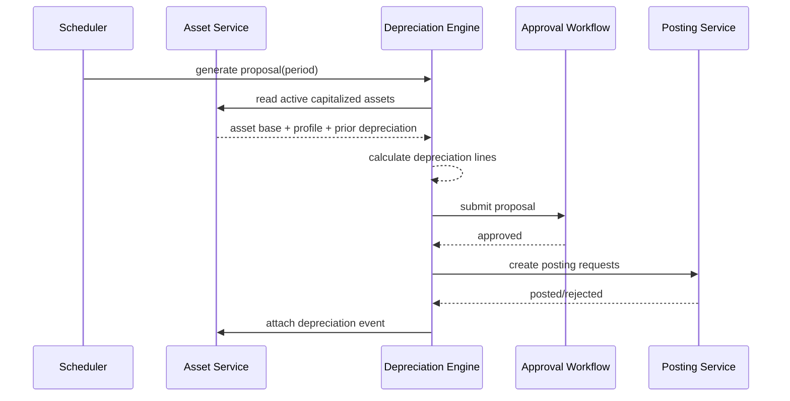
```mermaid
sequenceDiagram
    participant Scheduler
    participant Asset as Asset Service
    participant Dep as Depreciation Engine
    participant App as Approval Workflow
    participant GL as Posting Service

    Scheduler->>Dep: generate proposal(period)
    Dep->>Asset: read active capitalized assets
    Asset-->>Dep: asset base + profile + prior depreciation
    Dep-->>Dep: calculate depreciation lines
    Dep->>App: submit proposal
    App-->>Dep: approved
    Dep->>GL: create posting requests
    GL-->>Dep: posted/rejected
    Dep->>Asset: attach depreciation event
```

Key data:

| Entity | Purpose |
|---|---|
| `asset_book` | financial/tax/management book context |
| `depreciation_profile` | method, useful life, residual value, start rule |
| `depreciation_schedule` | projected lines, not necessarily posted |
| `depreciation_run` | period-level calculation batch |
| `depreciation_line` | asset-period calculation result |
| `asset_valuation_event` | acquisition, capitalization, depreciation, impairment, disposal |
| `posting_request` | accounting handoff |

Important invariant:

```text
For each asset book and period:
  posted depreciation must be derived from exactly one approved run line
  unless explicitly adjusted/reversed with evidence.
```

Never implement depreciation as a nightly job that directly inserts GL journals without proposal, approval, and traceability.

---

## 11. Asset Hierarchy and Component Replacement

Large assets are often hierarchies:

- building -> floor -> HVAC -> compressor;
- machine -> motor -> gearbox -> sensor;
- vehicle -> engine -> battery -> tire set;
- data center -> rack -> server -> storage component.

Asset hierarchy matters for:

- maintenance planning;
- warranty;
- downtime impact;
- component replacement;
- capitalization of improvement;
- disposal/retirement;
- spare part compatibility;
- traceability.

Anti-pattern:

```text
parent_asset_id nullable on asset table, updated freely
```

Better:

```text
asset_component_relation as effective-dated history
```

Because component membership changes over time.

Example component replacement lifecycle:

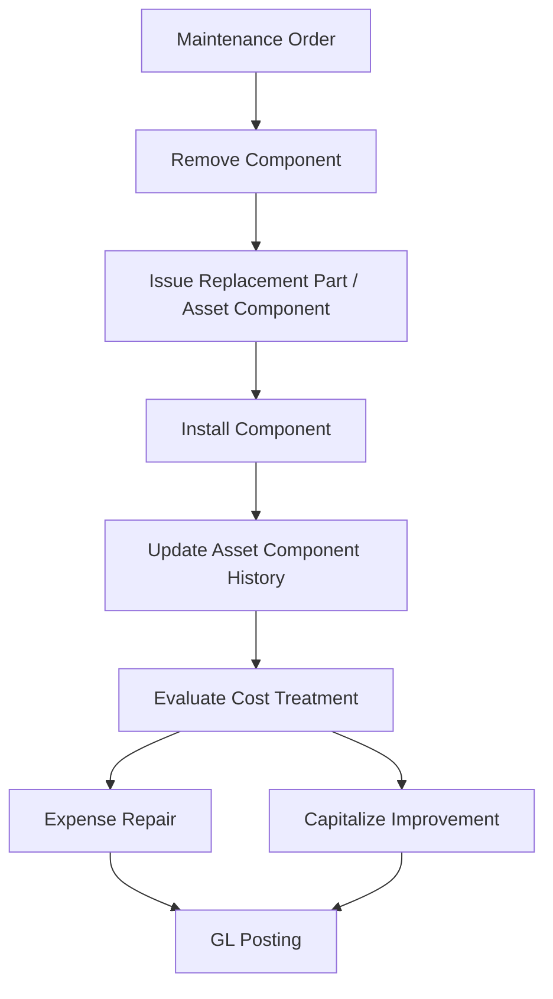
```mermaid
flowchart TD
    A[Maintenance Order] --> B[Remove Component]
    B --> C[Issue Replacement Part / Asset Component]
    C --> D[Install Component]
    D --> E[Update Asset Component History]
    E --> F[Evaluate Cost Treatment]
    F --> G[Expense Repair]
    F --> H[Capitalize Improvement]
    G --> I[GL Posting]
    H --> I
```

In Java, treat replacement as a service that coordinates:

- asset aggregate;
- inventory issue;
- maintenance work order;
- accounting classification;
- warranty decision;
- audit trail.

Do not let one aggregate own all of that.

---

## 12. Maintenance Management

Maintenance domain supports:

1. preventive maintenance;
2. corrective maintenance;
3. predictive/condition-based maintenance;
4. inspection;
5. calibration;
6. shutdown/overhaul;
7. external service maintenance.

Core lifecycle:

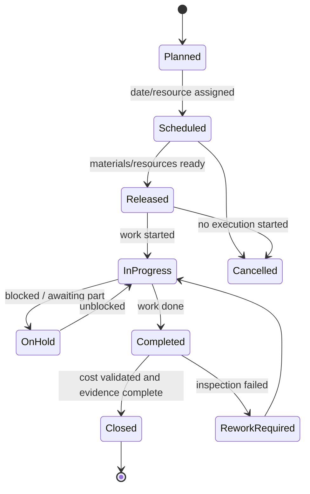
```mermaid
stateDiagram-v2
    [*] --> Planned
    Planned --> Scheduled: date/resource assigned
    Scheduled --> Released: materials/resources ready
    Released --> InProgress: work started
    InProgress --> OnHold: blocked / awaiting part
    OnHold --> InProgress: unblocked
    InProgress --> Completed: work done
    Completed --> Closed: cost validated and evidence complete
    Completed --> ReworkRequired: inspection failed
    ReworkRequired --> InProgress
    Scheduled --> Cancelled
    Released --> Cancelled: no execution started
    Closed --> [*]
```

Maintenance work order should capture:

| Area | Data |
|---|---|
| Identity | maintenance order number, type, priority |
| Target | asset, component, location |
| Trigger | schedule, fault, inspection, service request, IoT condition |
| Plan | task list, estimated labor, required spare parts, tools |
| Execution | technician, time, readings, observations, attachments |
| Material | requested, reserved, issued, returned spare parts |
| Cost | labor, material, external service, overhead |
| Downtime | planned/unplanned downtime interval |
| Result | completed, failed, rework, asset condition |
| Evidence | checklist, photo, signature, approval, audit log |

---

## 13. Preventive Maintenance Scheduling

Preventive maintenance can be based on:

- calendar interval: every 30 days;
- meter interval: every 10,000 km;
- usage hour: every 500 operating hours;
- production count: every 100,000 units;
- condition threshold: vibration > threshold;
- regulatory inspection date.

Model preventive rule separately from generated work order.

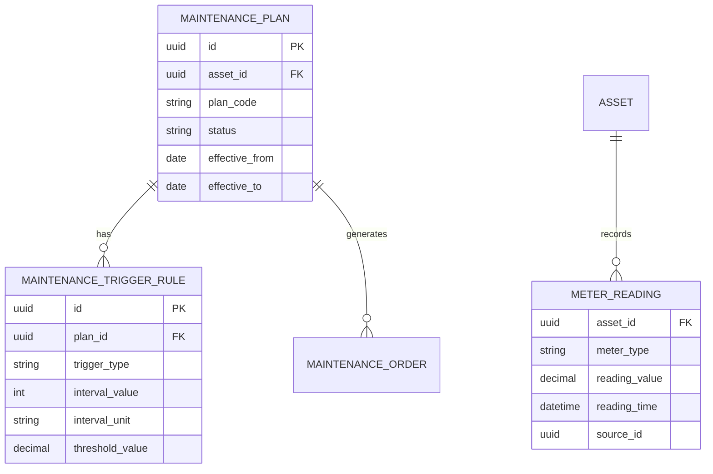
```mermaid
erDiagram
    MAINTENANCE_PLAN ||--o{ MAINTENANCE_TRIGGER_RULE : has
    MAINTENANCE_PLAN ||--o{ MAINTENANCE_ORDER : generates
    ASSET ||--o{ METER_READING : records

    MAINTENANCE_PLAN {
        uuid id PK
        uuid asset_id FK
        string plan_code
        string status
        date effective_from
        date effective_to
    }

    MAINTENANCE_TRIGGER_RULE {
        uuid id PK
        uuid plan_id FK
        string trigger_type
        int interval_value
        string interval_unit
        decimal threshold_value
    }

    METER_READING {
        uuid asset_id FK
        string meter_type
        decimal reading_value
        datetime reading_time
        uuid source_id
    }
```

Scheduling guard:

```text
A preventive maintenance order should not be generated twice for the same asset, plan, trigger window, and due basis.
```

Suggested idempotency key:

```text
PM:{assetId}:{planId}:{triggerRuleId}:{dueWindowStart}:{dueWindowEnd}
```

---

## 14. Project Management vs Project Accounting

ERP project domain has two distinct concerns:

1. **Project execution**  
   Scope, task, milestone, resource, schedule, deliverable.

2. **Project accounting**  
   Budget, committed cost, actual cost, WIP, billing, capitalization, profitability.

Do not collapse both into a single `project` table and a `project_cost` table.

Project structure:

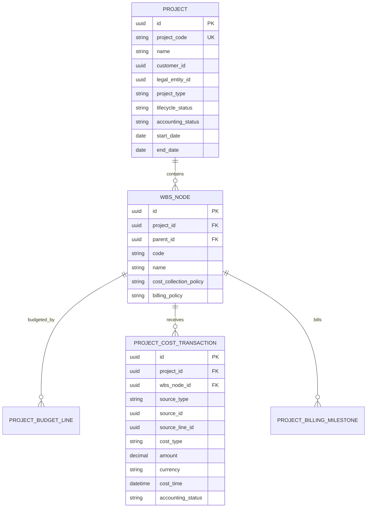
```mermaid
erDiagram
    PROJECT ||--o{ WBS_NODE : contains
    WBS_NODE ||--o{ PROJECT_BUDGET_LINE : budgeted_by
    WBS_NODE ||--o{ PROJECT_COST_TRANSACTION : receives
    WBS_NODE ||--o{ PROJECT_BILLING_MILESTONE : bills

    PROJECT {
        uuid id PK
        string project_code UK
        string name
        uuid customer_id
        uuid legal_entity_id
        string project_type
        string lifecycle_status
        string accounting_status
        date start_date
        date end_date
    }

    WBS_NODE {
        uuid id PK
        uuid project_id FK
        uuid parent_id FK
        string code
        string name
        string cost_collection_policy
        string billing_policy
    }

    PROJECT_COST_TRANSACTION {
        uuid id PK
        uuid project_id FK
        uuid wbs_node_id FK
        string source_type
        uuid source_id
        uuid source_line_id
        string cost_type
        decimal amount
        string currency
        datetime cost_time
        string accounting_status
    }
```

WBS means Work Breakdown Structure. It is not only reporting hierarchy. It defines where cost and billing belong.

---

## 15. Project Cost Capture

Project cost can come from many modules:

| Source | Example | Control Risk |
|---|---|---|
| Procurement | PO for subcontractor | wrong WBS assignment |
| AP invoice | vendor invoice | duplicate cost capture |
| Inventory issue | material used in project | stock issued but project cost missing |
| Timesheet | engineer hours | unapproved time included |
| Expense claim | travel/hotel | wrong project/customer |
| Service order | implementation/service work | closed order not billed |
| Journal adjustment | manual correction | audit weakness |

The project module should receive **cost events**, not perform direct reads across all module tables for financial truth.

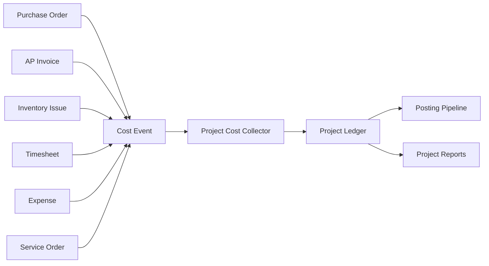
```mermaid
flowchart LR
    PO[Purchase Order] --> CE[Cost Event]
    AP[AP Invoice] --> CE
    INV[Inventory Issue] --> CE
    TIME[Timesheet] --> CE
    EXP[Expense] --> CE
    SO[Service Order] --> CE
    CE --> PC[Project Cost Collector]
    PC --> PL[Project Ledger]
    PL --> GL[Posting Pipeline]
    PL --> REP[Project Reports]
```

Cost event contract fields:

```json
{
  "eventId": "uuid",
  "sourceSystem": "procurement",
  "sourceType": "AP_INVOICE_LINE",
  "sourceId": "uuid",
  "sourceLineId": "uuid",
  "projectId": "uuid",
  "wbsNodeId": "uuid",
  "costType": "MATERIAL|LABOR|SUBCONTRACT|EXPENSE|OVERHEAD",
  "amount": "1200000.00",
  "currency": "IDR",
  "costDate": "2026-06-30",
  "approvalStatus": "APPROVED",
  "accountingPeriod": "2026-06",
  "idempotencyKey": "APINV:...:LINE:...:PROJECT:..."
}
```

Invariant:

```text
The same source line cannot be captured into project actual cost more than once
unless explicitly split by allocation rule and all splits sum to the original source amount.
```

---

## 16. Project Lifecycle State Machine

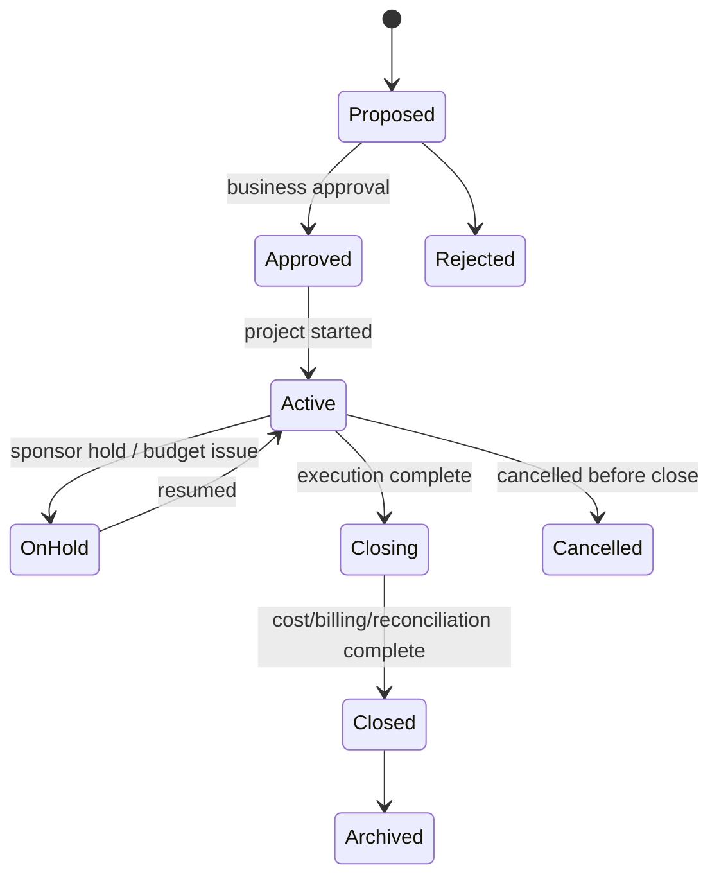
```mermaid
stateDiagram-v2
    [*] --> Proposed
    Proposed --> Approved: business approval
    Approved --> Active: project started
    Active --> OnHold: sponsor hold / budget issue
    OnHold --> Active: resumed
    Active --> Closing: execution complete
    Closing --> Closed: cost/billing/reconciliation complete
    Active --> Cancelled: cancelled before close
    Proposed --> Rejected
    Closed --> Archived
```

Important distinction:

| Lifecycle Status | Accounting Status |
|---|---|
| Proposed | no cost allowed except pre-sales if policy allows |
| Approved | committed cost allowed |
| Active | actual cost collection allowed |
| Closing | new cost blocked except approved late cost |
| Closed | no cost/billing changes except adjustment process |

A common ERP failure is allowing late AP invoices to post to closed projects with no reopening/reclassification workflow.

Better model:

```text
Late cost for closed project -> exception queue -> approve re-open, accrue, expense elsewhere, or reject.
```

---

## 17. Project Budget and Commitment Control

Project ERP often needs budget control:

- approved budget;
- revised budget;
- committed cost from PO;
- actual cost from AP/inventory/time;
- forecast cost to complete;
- variance.

Budget invariant:

```text
available_budget = approved_budget + approved_revision - committed_cost - actual_cost
```

But this formula is not always enough. Need semantics:

| Cost Type | When Counted as Commitment | When Converted to Actual |
|---|---|---|
| Purchase | PO approved | AP invoice matched / goods received depending policy |
| Material | reservation or issue request | stock issue posted |
| Labor | planned assignment maybe forecast | approved timesheet |
| Expense | claim submitted maybe commitment | approved expense |
| Subcontract | subcontract PO | vendor invoice/service acceptance |

Concurrency issue:

```text
Two users create PO lines at the same time against the last remaining project budget.
```

Solution options:

1. pessimistic lock budget bucket;
2. optimistic lock + retry;
3. budget reservation ledger;
4. asynchronous budget check with exception queue.

For large ERP, **budget reservation ledger** is usually more auditable:

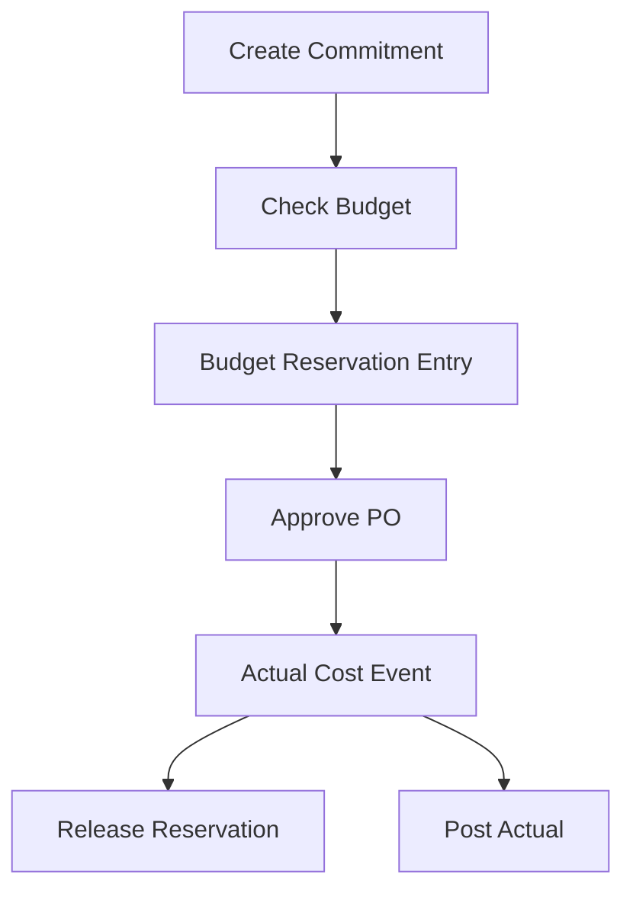
```mermaid
flowchart TD
    CMD[Create Commitment] --> CHECK[Check Budget]
    CHECK --> RES[Budget Reservation Entry]
    RES --> PO[Approve PO]
    PO --> ACT[Actual Cost Event]
    ACT --> REL[Release Reservation]
    ACT --> POST[Post Actual]
```

---

## 18. Project Billing and Revenue Boundary

Project billing can be:

- time and material;
- fixed price milestone;
- progress percentage;
- cost plus;
- retainer;
- subscription-like service;
- internal capitalization only;
- grant/funding claim.

Do not hardcode billing into project task completion. Use billing policy.

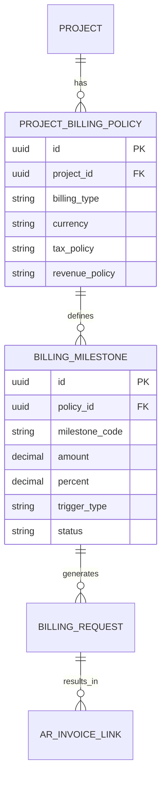
```mermaid
erDiagram
    PROJECT ||--o{ PROJECT_BILLING_POLICY : has
    PROJECT_BILLING_POLICY ||--o{ BILLING_MILESTONE : defines
    BILLING_MILESTONE ||--o{ BILLING_REQUEST : generates
    BILLING_REQUEST ||--o{ AR_INVOICE_LINK : results_in

    PROJECT_BILLING_POLICY {
        uuid id PK
        uuid project_id FK
        string billing_type
        string currency
        string tax_policy
        string revenue_policy
    }

    BILLING_MILESTONE {
        uuid id PK
        uuid policy_id FK
        string milestone_code
        decimal amount
        decimal percent
        string trigger_type
        string status
    }
```

Revenue recognition can be complex and depends on accounting policy. In this series, keep the ERP engineering boundary clear:

- project produces billing/revenue **events or requests**;
- accounting/revenue subsystem decides recognition/posting according to policy;
- project stores linkage and status, not journal truth.

---

## 19. Service Management Domain

Service management can cover:

- customer support service;
- field service;
- internal IT/facility service;
- warranty repair;
- installation;
- preventive service contract;
- maintenance order execution;
- service billing.

Core service model:

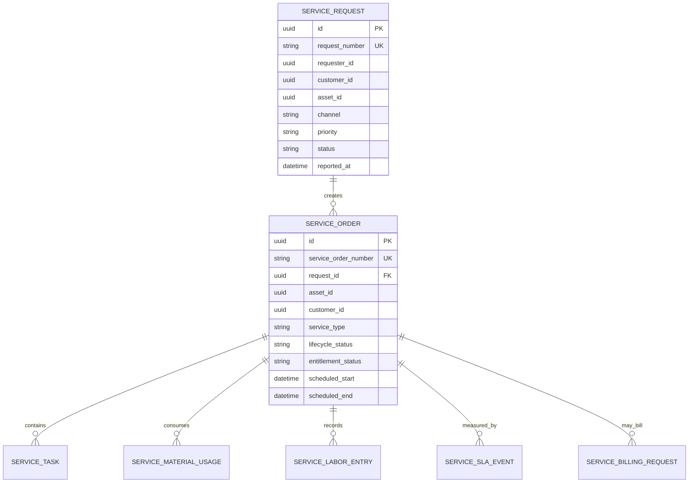
```mermaid
erDiagram
    SERVICE_REQUEST ||--o{ SERVICE_ORDER : creates
    SERVICE_ORDER ||--o{ SERVICE_TASK : contains
    SERVICE_ORDER ||--o{ SERVICE_MATERIAL_USAGE : consumes
    SERVICE_ORDER ||--o{ SERVICE_LABOR_ENTRY : records
    SERVICE_ORDER ||--o{ SERVICE_SLA_EVENT : measured_by
    SERVICE_ORDER ||--o{ SERVICE_BILLING_REQUEST : may_bill

    SERVICE_REQUEST {
        uuid id PK
        string request_number UK
        uuid requester_id
        uuid customer_id
        uuid asset_id
        string channel
        string priority
        string status
        datetime reported_at
    }

    SERVICE_ORDER {
        uuid id PK
        string service_order_number UK
        uuid request_id FK
        uuid asset_id
        uuid customer_id
        string service_type
        string lifecycle_status
        string entitlement_status
        datetime scheduled_start
        datetime scheduled_end
    }
```

Service order lifecycle:

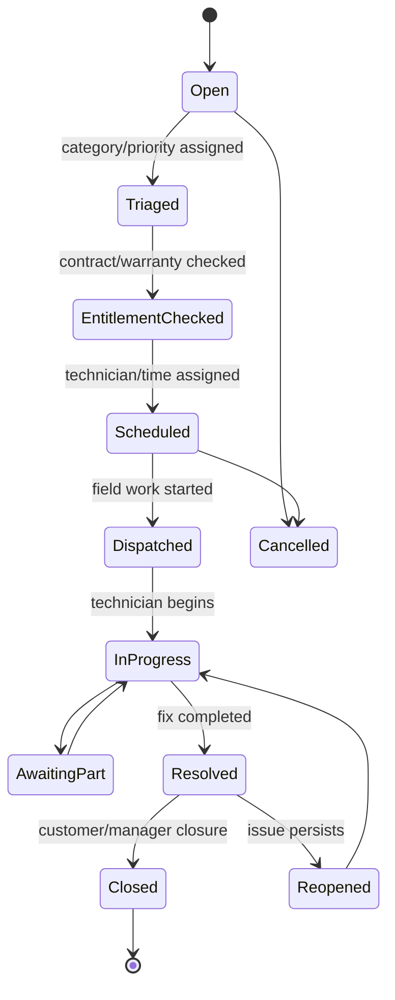
```mermaid
stateDiagram-v2
    [*] --> Open
    Open --> Triaged: category/priority assigned
    Triaged --> EntitlementChecked: contract/warranty checked
    EntitlementChecked --> Scheduled: technician/time assigned
    Scheduled --> Dispatched: field work started
    Dispatched --> InProgress: technician begins
    InProgress --> AwaitingPart
    AwaitingPart --> InProgress
    InProgress --> Resolved: fix completed
    Resolved --> Closed: customer/manager closure
    Resolved --> Reopened: issue persists
    Reopened --> InProgress
    Open --> Cancelled
    Scheduled --> Cancelled
    Closed --> [*]
```

---

## 20. SLA and Escalation

SLA must be computed from explicit clocks, not guessed from status text.

Common SLA metrics:

- response time;
- assignment time;
- arrival time;
- resolution time;
- closure time;
- parts wait time;
- customer hold time;
- internal hold time.

Use SLA event history:

```sql
create table service_sla_event (
    id uuid primary key,
    service_order_id uuid not null,
    event_type varchar(60) not null,
    event_time timestamptz not null,
    actor_id uuid,
    reason_code varchar(60),
    pause_clock boolean not null default false,
    resume_clock boolean not null default false,
    created_at timestamptz not null
);
```

SLA calculation should be explainable:

```text
resolution_due_at = reported_at + SLA duration - approved pause durations within business calendar
```

Do not store only `sla_breached = true`. Store enough evidence to reconstruct why.

---

## 21. Warranty and Entitlement

Warranty/entitlement determines who pays.

Inputs:

- customer;
- asset/product serial;
- installation date;
- warranty start/end;
- service contract;
- failure category;
- usage/meter reading;
- excluded damage;
- prior repairs;
- part warranty;
- labor coverage;
- geography/channel.

Decision model:

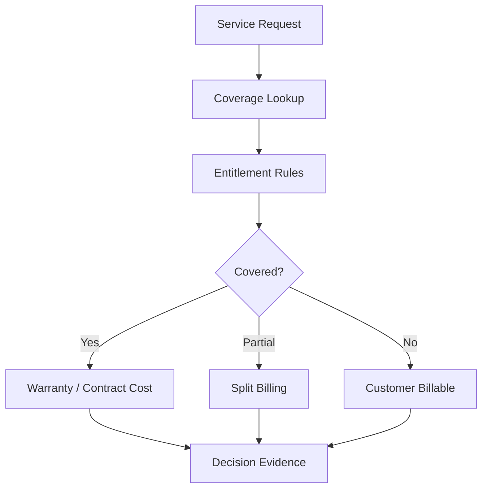
```mermaid
flowchart TD
    REQ[Service Request] --> COV[Coverage Lookup]
    COV --> RULE[Entitlement Rules]
    RULE --> DEC{Covered?}
    DEC -->|Yes| WARRANTY[Warranty / Contract Cost]
    DEC -->|Partial| SPLIT[Split Billing]
    DEC -->|No| CUSTOMER[Customer Billable]
    WARRANTY --> EVID[Decision Evidence]
    SPLIT --> EVID
    CUSTOMER --> EVID
```

Warranty decision should be versioned:

```text
Entitlement decision = input facts + rule version + actor/engine + timestamp + outcome + override evidence
```

Why? Because warranty disputes happen after the service is completed.

---

## 22. Spare Part Usage in Service/Maintenance

Spare part usage touches Inventory and Service.

Bad design:

```java
serviceOrder.setPartUsed(partId, qty);
itemRepository.decreaseStock(partId, qty);
```

Better design:

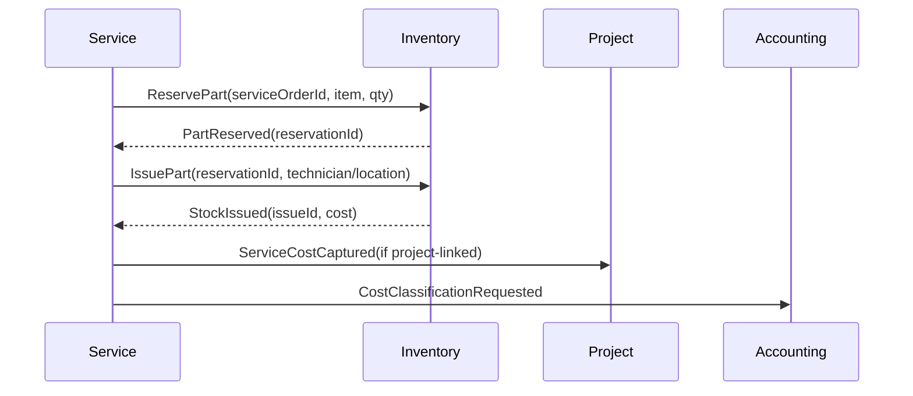
```mermaid
sequenceDiagram
    participant Service
    participant Inventory
    participant Project
    participant Accounting

    Service->>Inventory: ReservePart(serviceOrderId, item, qty)
    Inventory-->>Service: PartReserved(reservationId)
    Service->>Inventory: IssuePart(reservationId, technician/location)
    Inventory-->>Service: StockIssued(issueId, cost)
    Service->>Project: ServiceCostCaptured(if project-linked)
    Service->>Accounting: CostClassificationRequested
```

Important cases:

| Case | Design Response |
|---|---|
| part reserved but not used | release reservation |
| part issued but service cancelled | return to stock or expense/write-off |
| part used under warranty | cost to warranty accrual/cost center |
| part billable to customer | create billing request |
| serialized part replaced | update asset/component genealogy |
| defective replaced part returned | receive into quarantine/repairable stock |

---

## 23. Labor Capture

Labor can come from:

- timesheet;
- field technician app;
- work order start/stop;
- manual supervisor entry;
- external vendor service invoice.

Do not confuse **attendance** with **chargeable labor**.

Labor dimensions:

| Dimension | Examples |
|---|---|
| worker | employee, contractor, vendor technician |
| activity | repair, diagnosis, travel, installation, inspection |
| billability | billable, non-billable, warranty, internal |
| costing | standard rate, actual payroll cost, vendor rate |
| approval | self-entry, supervisor approval, customer sign-off |
| allocation | project, asset, service order, cost center |

Labor capture event:

```java
public record LaborCaptured(
    UUID eventId,
    UUID workerId,
    UUID serviceOrderId,
    UUID projectId,
    UUID assetId,
    String activityCode,
    BigDecimal hours,
    String billability,
    LocalDate workDate,
    UUID approvalId,
    String idempotencyKey
) {}
```

Invariant:

```text
Chargeable labor cannot be billed or costed unless approved according to the configured authority rule.
```

---

## 24. Cross-Domain Cost Classification

Every cost related to asset/project/service needs classification:

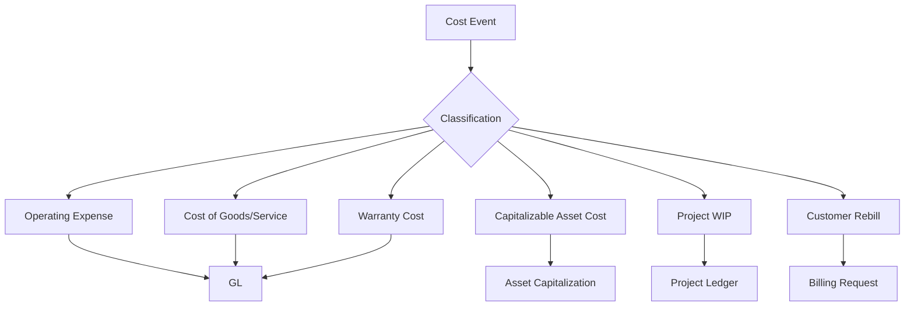
```mermaid
flowchart TD
    COST[Cost Event] --> CLASS{Classification}
    CLASS --> OPEX[Operating Expense]
    CLASS --> CAPEX[Capitalizable Asset Cost]
    CLASS --> WIP[Project WIP]
    CLASS --> COGS[Cost of Goods/Service]
    CLASS --> WARRANTY[Warranty Cost]
    CLASS --> REBILL[Customer Rebill]

    OPEX --> GL
    CAPEX --> ASSET[Asset Capitalization]
    WIP --> PROJECT[Project Ledger]
    COGS --> GL
    WARRANTY --> GL
    REBILL --> AR[Billing Request]
```

A classification rule should consider:

- source type;
- asset class;
- project type;
- service type;
- warranty decision;
- amount threshold;
- useful life extension;
- legal entity;
- accounting policy;
- date/effective period;
- manual override authority.

Design pattern:

```text
Cost event -> classification proposal -> approval if high-risk -> posting/capitalization/billing request
```

---

## 25. Reporting Model

Operational reporting questions:

- Which assets are in service, under maintenance, retired, disposed?
- Which assets are overdue for preventive maintenance?
- What is asset downtime by location/class?
- Which projects exceed budget?
- Which projects have committed cost but no actual invoice?
- Which service orders breached SLA?
- Which warranty claims are high cost?
- Which spare parts are consumed most by asset class?

Financial reporting questions:

- acquisition cost by asset class;
- accumulated depreciation by book;
- project WIP by customer/project;
- project profitability;
- maintenance cost by asset/location;
- warranty cost by product/serial;
- service revenue vs service cost.

Use separate read models:

| Read Model | Source |
|---|---|
| `asset_position_view` | asset master + status/location history |
| `asset_financial_summary` | asset valuation events + GL posting result |
| `maintenance_backlog_view` | maintenance order + SLA/schedule |
| `project_cost_summary` | project ledger |
| `project_budget_control_view` | budget + commitment + actual |
| `service_sla_dashboard` | service order + SLA event history |
| `warranty_cost_view` | entitlement + cost classification |

Avoid reporting directly from mutable workflow tables for financial truth.

---

## 26. Concurrency and Consistency Risks

### 26.1 Asset Transfer Race

Problem:

- user A transfers asset to Branch X;
- user B transfers same asset to Branch Y;
- both see status `IN_SERVICE`.

Controls:

- optimistic lock on asset aggregate;
- transfer pending status;
- unique active transfer request per asset;
- approval token tied to version;
- custody acceptance step.

### 26.2 Maintenance vs Disposal Race

Problem:

- maintenance starts;
- finance disposes asset at same time.

Controls:

```text
Asset disposal requires no open maintenance/service order unless override approval exists.
```

### 26.3 Project Budget Race

Problem:

- concurrent commitments exceed budget.

Controls:

- budget reservation ledger;
- lock per budget bucket;
- idempotent commitment command;
- compensating release when PO cancelled.

### 26.4 Service Closure Race

Problem:

- technician closes order while inventory issue is still pending.

Controls:

```text
Service order cannot close unless required cost/material/labor events are either posted, waived, or explicitly marked not required.
```

---

## 27. Failure Modes and Recovery Playbooks

| Failure | Symptom | Root Cause | Recovery |
|---|---|---|---|
| Asset capitalized twice | asset value too high | duplicate invoice line linkage | reverse duplicate capitalization event |
| Depreciation missing | period close mismatch | batch failed after partial processing | rerun idempotent depreciation proposal |
| Asset disposed but still active | operational/financial status split not enforced | disposal posted without operational transition | corrective transition + audit note |
| Project actual cost duplicated | same source captured twice | missing idempotency key | reversal cost transaction + unique constraint |
| Late cost on closed project | AP invoice arrives after closure | no late-cost workflow | exception queue: reopen/accrue/expense/reject |
| Service closed without parts cost | async inventory issue failed | closure did not check pending events | reopen or cost adjustment workflow |
| Warranty incorrectly granted | rule input wrong | stale install date/customer entitlement | entitlement correction + billing/cost reclassification |
| PM orders duplicated | schedule job rerun | no due-window idempotency | cancel duplicate + add idempotency key |
| Component genealogy broken | replaced part not linked | update only free-text notes | corrective component history entry |

Recovery principle:

> Never fix ERP financial/operational data with silent SQL unless it is part of a controlled data repair with evidence, approval, and replay-safe correction.

---

## 28. API Design Sketch

Command-oriented APIs:

```http
POST /assets/{assetId}/register
POST /assets/{assetId}/commission
POST /assets/{assetId}/transfer-requests
POST /assets/{assetId}/retirement-requests
POST /assets/{assetId}/disposal-requests

POST /maintenance-orders
POST /maintenance-orders/{id}/release
POST /maintenance-orders/{id}/start
POST /maintenance-orders/{id}/complete
POST /maintenance-orders/{id}/close

POST /projects
POST /projects/{id}/approve
POST /projects/{id}/activate
POST /projects/{id}/cost-events
POST /projects/{id}/billing-requests
POST /projects/{id}/close

POST /service-requests
POST /service-orders/{id}/schedule
POST /service-orders/{id}/dispatch
POST /service-orders/{id}/record-labor
POST /service-orders/{id}/request-part
POST /service-orders/{id}/resolve
POST /service-orders/{id}/close
```

Avoid APIs like:

```http
PATCH /assets/{id} { "status": "DISPOSED" }
PATCH /projects/{id} { "actualCost": 1000000 }
PATCH /service-orders/{id} { "slaBreached": false }
```

Because those bypass business transition and evidence.

---

## 29. Java Application Service Pattern

```java
@Transactional
public DisposeAssetResult dispose(DisposeAssetCommand command) {
    IdempotencyToken token = idempotency.start(command.idempotencyKey());

    Asset asset = assetRepository.getForUpdate(command.assetId());
    OpenWorkCheck openWork = assetWorkQuery.checkOpenWork(command.assetId());
    AccountingPeriod period = periodService.getPeriod(command.disposalDate());

    AssetDisposed event = asset.dispose(command, openWork, period);

    assetRepository.save(asset);
    assetEventRepository.append(event);

    postingOutbox.add(PostingRequest.fromAssetDisposal(event));
    auditTrail.record(command.actor(), event, command.evidence());

    idempotency.complete(token, event.eventId());
    return new DisposeAssetResult(event.eventId(), asset.status());
}
```

Key points:

- lock only what must be serialized;
- write domain event and outbox in same DB transaction;
- external GL/integration happens after commit;
- command is idempotent;
- audit is explicit;
- business query checks open maintenance/service/project link.

---

## 30. Database Constraints Worth Having

Application rules are not enough. Add structural constraints:

```sql
-- Only one active component parent relation for a child asset at a time, implemented using exclusion/index strategy where supported.

-- Same source line cannot be capitalized twice into same asset.
alter table asset_capitalization_source
add constraint uq_asset_cap_source unique (source_type, source_id, source_line_id, asset_id);

-- Same source line cannot be captured twice as project actual cost unless split allocation id is used.
create unique index uq_project_cost_source
on project_cost_transaction(source_type, source_id, source_line_id, project_id, wbs_node_id)
where reversal_of_id is null;

-- One active transfer request per asset.
create unique index uq_active_asset_transfer
on asset_transfer_request(asset_id)
where status in ('REQUESTED', 'APPROVED', 'PENDING_ACCEPTANCE');

-- Prevent duplicate preventive maintenance generation.
create unique index uq_pm_due_window
on maintenance_order(asset_id, maintenance_plan_id, trigger_rule_id, due_window_start, due_window_end)
where source = 'PREVENTIVE_MAINTENANCE';
```

Database constraints should enforce high-value invariants that must survive application bugs, retries, and concurrent requests.

---

## 31. Observability

Metrics to expose:

| Metric | Meaning |
|---|---|
| `asset_capitalization_pending_count` | cost waiting capitalization decision |
| `asset_depreciation_run_failed_count` | failed depreciation batches |
| `asset_open_maintenance_by_priority` | maintenance backlog |
| `project_budget_exceeded_count` | control failure/override volume |
| `project_late_cost_exception_count` | late cost pressure |
| `service_sla_breach_count` | service health |
| `service_parts_wait_duration` | inventory impact on service |
| `warranty_override_rate` | rule quality/abuse signal |
| `cost_classification_manual_override_rate` | policy ambiguity signal |

Logs should include:

- asset/project/service id;
- legal entity;
- actor;
- command id;
- idempotency key;
- source document;
- transition from/to;
- reason code;
- posting request id.

A support engineer should be able to answer:

> “Why did this project cost appear in June even though the project was closed in May?”

without opening production database manually.

---

## 32. Design Review Checklist

### Asset

- [ ] Does asset model separate operational status and financial status?
- [ ] Are asset transfers effective-dated and auditable?
- [ ] Can capitalization trace back to source cost lines?
- [ ] Is depreciation proposal/review/posting separated?
- [ ] Is disposal blocked by open maintenance/service/cost where required?
- [ ] Is component replacement history preserved?

### Project

- [ ] Does WBS drive cost collection and billing policy?
- [ ] Are committed and actual costs separated?
- [ ] Is budget control concurrency-safe?
- [ ] Can late costs after close be handled?
- [ ] Can source cost be traced back to AP/inventory/time/expense?
- [ ] Is project accounting status separate from project lifecycle status?

### Service

- [ ] Are SLA clocks event-based and explainable?
- [ ] Is warranty decision versioned and auditable?
- [ ] Does spare part usage integrate with inventory via reservation/issue?
- [ ] Does closure check material/labor/cost completeness?
- [ ] Can service order be reopened with evidence?
- [ ] Are billable, warranty, and internal costs clearly classified?

---

## 33. Practice Drill: 20-Hour Applied Slice

Build a thin vertical slice:

1. Register an asset from a goods receipt.
2. Commission asset into service.
3. Generate preventive maintenance order.
4. Reserve and issue spare part.
5. Capture technician labor.
6. Complete maintenance.
7. Classify cost as repair expense.
8. Create posting request.
9. Show asset maintenance cost report.
10. Simulate duplicate maintenance completion retry.
11. Simulate service closure while inventory issue pending.
12. Simulate asset disposal while maintenance is open.

Acceptance criteria:

- duplicate commands are idempotent;
- invalid lifecycle transition is rejected;
- all cost has source evidence;
- maintenance cannot silently bypass inventory;
- audit log can reconstruct lifecycle;
- reporting read model matches event history.

---

## 34. Mental Compression

Remember this:

```text
Asset = physical/control lifecycle + financial valuation lifecycle.
Project = execution lifecycle + cost/budget/billing lifecycle.
Service = request/work lifecycle + entitlement/SLA/cost lifecycle.
```

The top 1% ERP engineer does not ask only:

> “What table stores this?”

They ask:

> “What fact happened, who is allowed to assert it, what invariant must remain true, what other domains need to know, what evidence proves it, and how do we correct it later without destroying auditability?”

---

## 35. Source Notes

- Jakarta Persistence 3.2 defines standard persistence and object/relational mapping facilities for Java/Jakarta EE applications and is relevant as the persistence baseline for enterprise ERP modules.
- Jakarta EE 11 includes updated platform specifications relevant to enterprise Java systems, including Persistence, Transactions, Concurrency, Validation, Messaging, Batch, Authorization, and Jakarta Data.
- Spring Boot 4.1 requires Java 17 and is compatible with Java versions up to Java 26, making it relevant for modern Java ERP service implementation.
- Apache OFBiz is a Java-based open-source ERP reference that includes modules such as Accounting, Fixed Assets, Order, Manufacturing, Facility/Warehouse, and related enterprise application areas.
- IAS 16 establishes principles for recognizing property, plant and equipment as assets and for measuring carrying amounts, depreciation charges, and impairment losses. This part does not prescribe accounting policy; it models the ERP control boundaries around asset valuation and posting.
