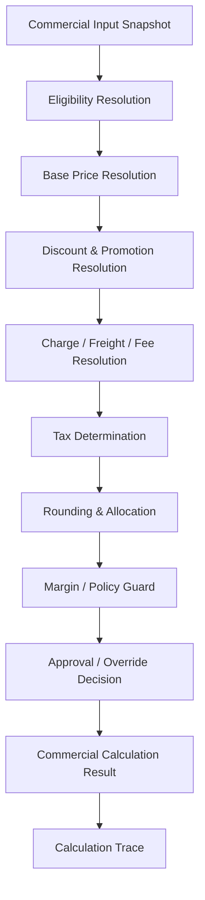
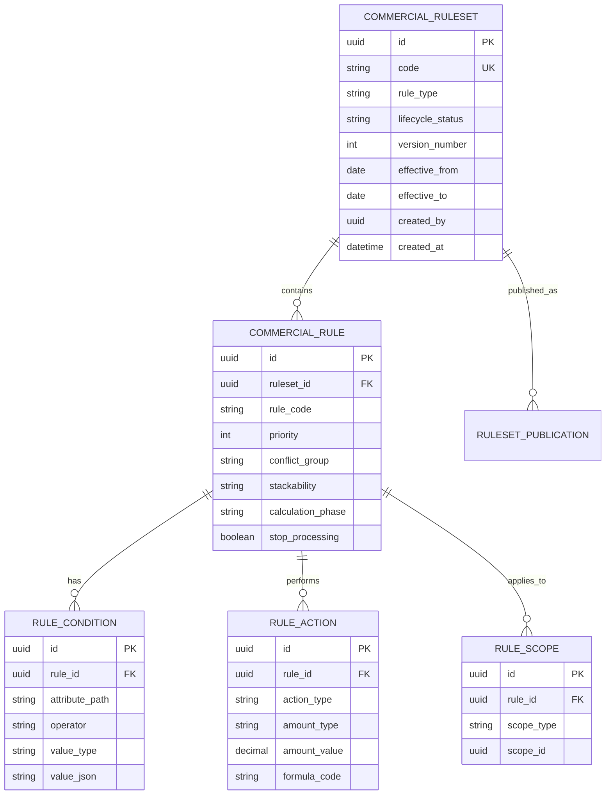
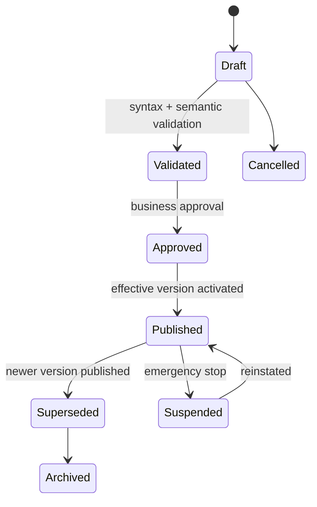
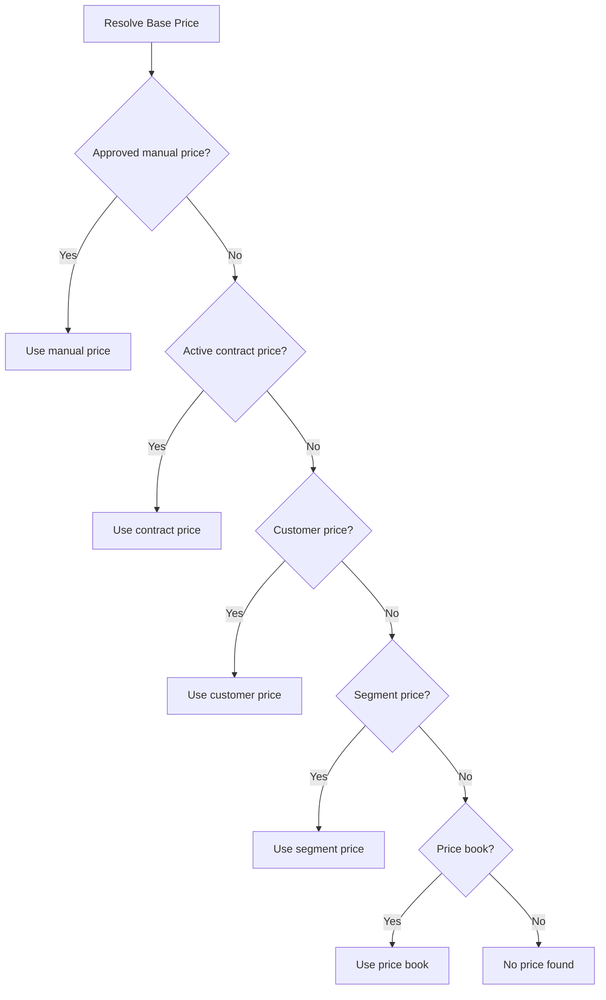
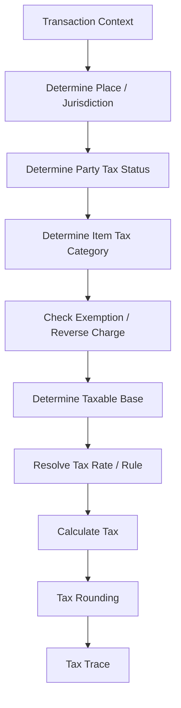
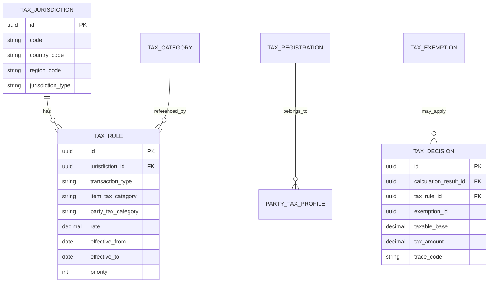
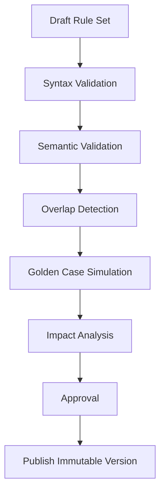
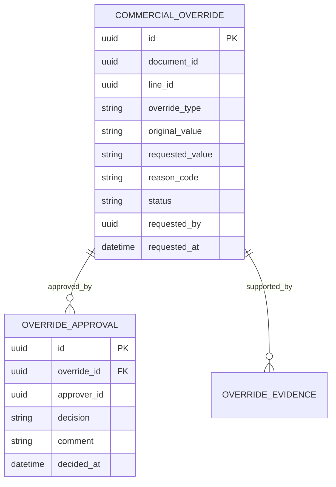
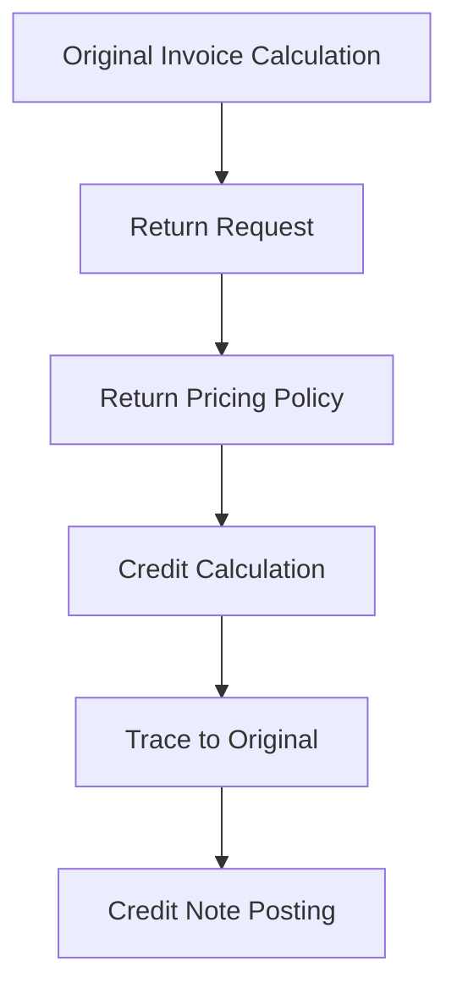

# Part 016 — Pricing, Tax, Discount, and Commercial Rules Engine

## 1. Target Skill Part Ini

Pricing, tax, discount, dan commercial rules adalah bagian ERP yang tampak seperti kalkulasi sederhana, tetapi dalam skala enterprise ia adalah pusat risiko margin, dispute, compliance, audit, dan customer trust.

> **Skill inti part ini:** mampu mendesain commercial calculation engine dalam Java ERP yang deterministic, explainable, effective-dated, auditable, testable, performant, dan aman terhadap override abuse, duplicate calculation, stale rule, rounding drift, tax jurisdiction error, dan inconsistent price antara quotation, sales order, invoice, return, dan credit note.

Kesalahan umum:

```text
price = item.price * qty - discount + tax
```

Dalam ERP besar, kalkulasi komersial dipengaruhi oleh:

- customer segment;
- contract;
- price book;
- item category;
- UOM;
- currency;
- incoterms/freight terms;
- date/effective period;
- branch/legal entity;
- delivery location;
- tax registration status;
- exemption certificate;
- promotion;
- volume tier;
- bundled item;
- manual override;
- approval authority;
- rounding policy;
- return policy;
- credit/rebill scenario;
- marketplace/channel policy;
- localization.

Part ini membangun rules engine bukan sebagai “magic dynamic logic”, tetapi sebagai **deterministic commercial decision system**.

---

## 2. Kaufman Deconstruction: Memecah Skill Commercial Rules ERP

| Sub-skill | Pertanyaan yang Harus Bisa Dijawab | Output Engineering |
|---|---|---|
| Price basis | Harga dasar berasal dari mana? | price book, contract, list price, cost-plus |
| Rule hierarchy | Rule mana menang ketika banyak rule berlaku? | precedence model, conflict detection |
| Effective dating | Rule mana berlaku pada tanggal transaksi? | valid-from/to, version, publication state |
| Discount model | Diskon level apa dan bagaimana stacking-nya? | line/header/order/promo/contract discount |
| Tax model | Pajak dihitung berdasarkan apa? | jurisdiction, tax category, registration, exemption |
| Rounding | Bagaimana rounding dilakukan dan pada level apa? | currency precision, tax rounding, invoice rounding |
| Override | Siapa boleh override harga/diskon/pajak? | approval matrix, margin guard, audit evidence |
| Explainability | Mengapa angka ini muncul? | calculation trace, rule id, input snapshot |
| Consistency | Bagaimana quote/order/invoice sama atau sengaja berbeda? | price lock, recalculation policy |
| Performance | Bagaimana kalkulasi cepat untuk ribuan line? | compiled rules, cache, batch evaluation |
| Testing | Bagaimana memastikan rule tidak regress? | golden cases, boundary tests, property tests |
| Failure recovery | Bagaimana membetulkan price/tax salah? | reprice, credit note, debit note, adjustment |

Tujuan akhirnya:

> Setiap angka di sales order/invoice harus bisa dijelaskan dengan input, rule, versi rule, urutan aplikasi, rounding, actor, dan timestamp.

---

## 3. Mental Model: Commercial Calculation as a Pipeline

Jangan mulai dari rules engine library. Mulai dari pipeline.



Important principle:

```text
Calculation result = function(input snapshot, rule set version, calculation date, calculation mode)
```

If the same inputs and same rule version produce different outputs, the engine is broken.

---

## 4. Core Concepts

### 4.1 Price

Price is the monetary basis for a sell/buy transaction before taxes and after applying commercial policy depending on definition.

Types:

- list price;
- contract price;
- customer-specific price;
- segment price;
- promotional price;
- cost-plus price;
- formula-based price;
- spot/manual price;
- transfer price;
- intercompany price.

### 4.2 Discount

Discount reduces price or amount according to rule.

Types:

- line discount;
- header discount;
- volume discount;
- tier discount;
- bundle discount;
- loyalty discount;
- cash discount;
- contract rebate;
- promotion coupon;
- manual discount.

### 4.3 Charge

Additional amount that is not item price:

- freight;
- handling;
- insurance;
- installation;
- packaging;
- service fee;
- environmental fee;
- payment surcharge.

### 4.4 Tax

Tax is jurisdiction/policy-driven and must usually be treated as a legal/compliance calculation rather than a sales promotion calculation.

Inputs usually include:

- seller legal entity;
- buyer identity;
- ship-from;
- ship-to;
- bill-to;
- item tax category;
- transaction type;
- date;
- tax registration;
- exemption;
- reverse charge/import/export status;
- currency;
- taxable base.

This series does not prescribe rates or jurisdiction-specific legal advice. It models the ERP engineering boundaries.

---

## 5. Data Model: Rule, Version, Scope, Condition, Action

A flexible but controlled rules model:



This model is not a license to let users write arbitrary code. It is a controlled rule DSL.

---

## 6. Effective Dating and Publication

Never edit live rules in place.

Use lifecycle:



Why versioning matters:

- quote may be created under rule version 12;
- order may be converted next month after version 13 exists;
- invoice may need original price lock or recalculation depending policy;
- return/credit note may need original invoice rule trace;
- audit needs to know what rule was active when calculation happened.

Invariant:

```text
A posted commercial document must reference immutable calculation result and rule version.
```

Suggested columns:

```sql
create table commercial_calculation_result (
    id uuid primary key,
    document_type varchar(40) not null,
    document_id uuid not null,
    calculation_mode varchar(40) not null,
    rule_version_id uuid not null,
    input_hash varchar(128) not null,
    result_hash varchar(128) not null,
    currency char(3) not null,
    net_amount numeric(19, 4) not null,
    tax_amount numeric(19, 4) not null,
    gross_amount numeric(19, 4) not null,
    calculated_at timestamptz not null,
    calculated_by uuid,
    status varchar(40) not null
);
```

---

## 7. Calculation Input Snapshot

Do not calculate from mutable tables lazily without snapshotting inputs.

Input snapshot should include:

```json
{
  "documentType": "SALES_ORDER",
  "documentId": "uuid",
  "calculationDate": "2026-06-30",
  "pricingDate": "2026-06-30",
  "taxDate": "2026-06-30",
  "seller": {
    "legalEntityId": "uuid",
    "branchId": "uuid",
    "taxRegistrationId": "uuid"
  },
  "buyer": {
    "customerId": "uuid",
    "segment": "DISTRIBUTOR",
    "taxRegistrationId": "uuid",
    "exemptionIds": []
  },
  "addresses": {
    "shipFrom": "uuid",
    "shipTo": "uuid",
    "billTo": "uuid"
  },
  "currency": "IDR",
  "lines": [
    {
      "lineId": "uuid",
      "itemId": "uuid",
      "itemTaxCategory": "STANDARD_GOODS",
      "uom": "PCS",
      "quantity": "10",
      "requestedPrice": null,
      "contractId": "uuid"
    }
  ]
}
```

Store the canonical snapshot or at least its hash plus reconstructable detail. For audit-heavy domains, store full snapshot.

---

## 8. Price Resolution Hierarchy

A common hierarchy:

```text
manual approved price
> customer contract price
> customer-specific price
> customer segment price
> promotion-specific price
> standard price book
> fallback price
```

But hierarchy must be explicit and configurable.



Engineering guard:

```text
No price found is a business exception, not zero price.
```

Zero price must be explicit and approved when it matters.

---

## 9. Discount Stacking Model

Discount stacking is where many ERP calculations fail.

Questions:

- Can promotion discount stack with contract discount?
- Is line discount applied before header discount?
- Is discount calculated on list price or net after previous discount?
- Is volume tier per line, per item, per order, per customer period?
- Are free goods represented as discount, zero-price line, or promotion item?
- Are rebates immediate discount or later accrual?

Example phases:

| Phase | Example | Base |
|---|---|---|
| `BASE_PRICE` | price book/contract | quantity x unit price |
| `LINE_DISCOUNT` | item promo | line base amount |
| `ORDER_DISCOUNT` | header campaign | eligible net lines |
| `REBATE_ACCRUAL` | quarterly rebate | accrual base, not invoice reduction |
| `CHARGE` | freight/handling | order or line basis |
| `TAX` | VAT/GST/sales tax | taxable base by tax rule |
| `ROUNDING` | currency/tax rounding | configured precision |

Stackability model:

```text
EXCLUSIVE      -> only best rule in conflict group applies
STACKABLE      -> all applicable rules apply in priority order
BEST_OF_GROUP  -> evaluate all, apply best result
REQUIRES_APPROVAL -> apply only after approval
```

---

## 10. Tax Determination Boundary

Tax is not just a rate lookup.



Core tax entities:



ERP should integrate with external tax engines where needed, but the same principles remain:

- snapshot input;
- store external request/response id;
- store tax result;
- store rule/rate version where available;
- handle timeout/retry/idempotency;
- support correction via credit/debit note.

---

## 11. Rounding and Allocation

Rounding looks small but creates audit and reconciliation problems.

Rounding decisions:

| Decision | Example |
|---|---|
| currency precision | IDR no decimals for payment display, but internal may use 2/4 decimals depending policy |
| unit price precision | 4 or 6 decimals for industrial goods |
| tax rounding level | line-level vs document-level |
| discount rounding level | per-line, per-discount, final amount |
| allocation | header discount allocated to lines for tax/COGS |
| residual penny | which line receives rounding residual |

Use deterministic residual allocation:

```text
Allocate residual to line with largest absolute amount, tie-break by stable line number.
```

Do not distribute residual randomly or by database row order.

Java example:

```java
public final class MoneyAllocator {
    public List<AllocatedAmount> allocate(Money total, List<AllocationBasis> bases) {
        BigDecimal basisSum = bases.stream()
            .map(AllocationBasis::amount)
            .reduce(BigDecimal.ZERO, BigDecimal::add);

        List<AllocatedAmount> provisional = new ArrayList<>();
        BigDecimal allocated = BigDecimal.ZERO;

        for (AllocationBasis basis : bases) {
            BigDecimal ratio = basis.amount().divide(basisSum, 12, RoundingMode.HALF_UP);
            BigDecimal raw = total.amount().multiply(ratio);
            BigDecimal rounded = raw.setScale(total.currency().scale(), RoundingMode.HALF_UP);
            provisional.add(new AllocatedAmount(basis.lineId(), rounded));
            allocated = allocated.add(rounded);
        }

        BigDecimal residual = total.amount().subtract(allocated);
        if (residual.signum() != 0) {
            LineId target = chooseResidualTarget(bases);
            provisional = addResidual(provisional, target, residual);
        }

        return provisional;
    }
}
```

---

## 12. Calculation Trace

Every result should include trace.

Trace example:

```json
{
  "calculationId": "uuid",
  "ruleVersion": "PRICE_RULESET:2026.06.01:v12",
  "lines": [
    {
      "lineId": "1",
      "basePrice": {
        "amount": "100000.00",
        "source": "CUSTOMER_CONTRACT",
        "ruleId": "PRICE-CONTRACT-778"
      },
      "discounts": [
        {
          "ruleId": "DISC-VOLUME-20",
          "description": "Volume tier 10+",
          "base": "1000000.00",
          "rate": "0.05",
          "amount": "50000.00"
        }
      ],
      "taxes": [
        {
          "ruleId": "TAX-ID-STANDARD",
          "jurisdiction": "ID",
          "taxableBase": "950000.00",
          "rate": "0.11",
          "amount": "104500.00"
        }
      ]
    }
  ],
  "totals": {
    "net": "950000.00",
    "tax": "104500.00",
    "gross": "1054500.00"
  }
}
```

Trace is not just for debugging. It is required for:

- customer dispute;
- internal approval;
- audit;
- regression testing;
- migration validation;
- rule impact analysis.

---

## 13. Java Design: Calculation Engine Boundary

Avoid putting pricing logic in controllers, order aggregate, or SQL views.

Use explicit engine boundary:

```java
public interface CommercialCalculationEngine {
    CommercialCalculationResult calculate(CommercialCalculationRequest request);
}

public record CommercialCalculationRequest(
    CalculationMode mode,
    LocalDate pricingDate,
    LocalDate taxDate,
    SellerContext seller,
    BuyerContext buyer,
    DocumentContext document,
    List<CommercialLineInput> lines,
    Optional<RuleVersionId> forcedRuleVersion,
    Optional<UUID> priorCalculationId
) {}

public record CommercialCalculationResult(
    UUID calculationId,
    RuleVersionId ruleVersionId,
    Money netAmount,
    Money taxAmount,
    Money grossAmount,
    List<CommercialLineResult> lines,
    CalculationTrace trace,
    List<PolicyViolation> policyViolations
) {}
```

Modes:

| Mode | Behavior |
|---|---|
| `QUOTE_ESTIMATE` | may use estimate tax/freight, not posted |
| `ORDER_CONFIRMATION` | price lock or controlled recalculation |
| `INVOICE_FINAL` | strict tax, rounding, posting-ready |
| `RETURN_CREDIT` | reference original invoice calculation |
| `WHAT_IF` | no persistence, simulation only |
| `REPRICE` | controlled recalculation with audit trail |

---

## 14. Rule Evaluation Pattern

```java
public final class DefaultCommercialCalculationEngine implements CommercialCalculationEngine {
    private final RuleSetResolver ruleSetResolver;
    private final PriceResolver priceResolver;
    private final DiscountResolver discountResolver;
    private final ChargeResolver chargeResolver;
    private final TaxResolver taxResolver;
    private final RoundingService roundingService;
    private final PolicyGuard policyGuard;

    @Override
    public CommercialCalculationResult calculate(CommercialCalculationRequest request) {
        RuleSetSnapshot rules = ruleSetResolver.resolve(request);
        CalculationTraceBuilder trace = new CalculationTraceBuilder(request, rules);

        List<LineCalculation> lines = priceResolver.resolveBasePrices(request.lines(), rules, trace);
        lines = discountResolver.applyDiscounts(lines, request, rules, trace);
        lines = chargeResolver.applyCharges(lines, request, rules, trace);
        lines = taxResolver.calculateTaxes(lines, request, rules, trace);
        lines = roundingService.roundAndAllocate(lines, request.document(), trace);

        List<PolicyViolation> violations = policyGuard.evaluate(lines, request, rules, trace);

        return CommercialCalculationResultFactory.create(request, rules, lines, violations, trace.build());
    }
}
```

Each stage is separately testable.

---

## 15. Rule DSL: Controlled, Not Arbitrary

A safe rule definition might look like:

```yaml
ruleCode: DISC_VOLUME_DISTRIBUTOR_2026
phase: LINE_DISCOUNT
priority: 120
conflictGroup: VOLUME_DISCOUNT
stackability: BEST_OF_GROUP
effectiveFrom: 2026-01-01
effectiveTo: 2026-12-31
conditions:
  - attribute: buyer.segment
    op: EQUALS
    value: DISTRIBUTOR
  - attribute: line.itemCategory
    op: IN
    value: [SPARE_PART, CONSUMABLE]
  - attribute: line.quantity
    op: GREATER_OR_EQUAL
    value: 10
actions:
  - type: PERCENT_DISCOUNT
    value: 5
    base: CURRENT_LINE_NET
```

Avoid:

```text
script: "if (customer.vip && item.margin > 0.2) return price * 0.95"
```

Arbitrary scripting introduces:

- security risks;
- performance unpredictability;
- non-deterministic behavior;
- weak validation;
- impossible static impact analysis;
- difficult approval.

If scripting is required for advanced customization, isolate it with sandboxing, resource limits, versioning, test cases, and strict governance.

---

## 16. Conflict Detection

Before publishing rules, validate conflicts.

Examples:

| Conflict | Example | Resolution |
|---|---|---|
| overlapping price | two contract prices for same customer/item/date | reject publication or require priority |
| duplicate tax rule | two tax rates same jurisdiction/category/date | reject |
| incompatible discounts | exclusive promo and contract discount both stackable | require conflict group semantics |
| circular formula | price formula depends on final gross amount | reject |
| impossible condition | quantity >= 10 and quantity < 5 | warn/reject |
| missing fallback | no price for item/category | publish warning or block depending policy |

Validation job:



---

## 17. Price Lock vs Recalculation

ERP document lifecycle requires clear recalculation policy.

| Transition | Recommended Policy |
|---|---|
| quote draft edit | recalculate allowed |
| quote sent to customer | lock unless revised |
| quote converted to order | preserve quote price or controlled reprice based on validity |
| order quantity changed | recalc affected lines or require approval |
| order ship date changed | tax/freight may recalc |
| invoice generated | final strict calculation |
| return/credit | reference original invoice calculation |

Represent policy explicitly:

```java
public enum RecalculationPolicy {
    PRESERVE_ORIGINAL,
    RECALCULATE_ALL,
    RECALCULATE_AFFECTED_LINES,
    RECALCULATE_TAX_ONLY,
    REQUIRE_APPROVAL,
    BLOCK_CHANGE
}
```

Anti-pattern:

```text
Every time user opens sales order screen, backend recalculates and overwrites price.
```

This destroys trust and auditability.

---

## 18. Manual Override and Approval

Manual override is necessary, but dangerous.

Override types:

- unit price override;
- line discount override;
- header discount override;
- freight override;
- tax override;
- tax exemption override;
- margin guard override;
- credit/rebill override.

Override data:



Controls:

- margin threshold;
- max discount per role;
- SoD: requester cannot approve own override;
- legal/tax override requires special authority;
- all overrides expire with document validity;
- override is tied to calculation version and document revision.

---

## 19. Margin Guard

Commercial ERP should guard profitability where relevant.

Margin inputs:

- standard cost;
- moving average cost;
- last purchase cost;
- landed cost;
- project cost estimate;
- service labor/material cost;
- transfer price;
- rebate accrual.

Margin formula:

```text
gross_margin = net_sales_amount - cost_basis
margin_percent = gross_margin / net_sales_amount
```

But cost basis policy matters. Do not hide it.

Margin guard example:

```java
public List<PolicyViolation> evaluate(LineCalculation line, MarginPolicy policy) {
    Money cost = costBasisResolver.resolve(line.itemId(), policy.costBasis(), line.pricingDate());
    BigDecimal marginPct = line.netAmount().minus(cost).divide(line.netAmount());

    if (marginPct.compareTo(policy.minimumMarginPercent()) < 0) {
        return List.of(new PolicyViolation(
            "MIN_MARGIN",
            "Margin below minimum threshold",
            ApprovalRequirement.of(policy.requiredAuthority())
        ));
    }

    return List.of();
}
```

Policy violation does not always block immediately. It may create approval requirement.

---

## 20. Procurement Pricing

The same engine concepts apply to procurement:

- vendor contract price;
- purchase price list;
- quantity break;
- currency;
- freight/landed cost;
- tax withholding;
- vendor rebate;
- incoterms;
- effective-dated supplier agreement;
- tolerance between PO and invoice.

Procurement price control:

```text
PO price -> goods receipt valuation -> AP invoice matching -> variance posting
```

Important invariant:

```text
AP invoice price variance must be traceable to PO/contract/tolerance decision, not silently absorbed.
```

---

## 21. Return, Credit Note, and Rebill

Returns are not new sales. They reference prior commercial decisions.

Return calculation policy:

| Scenario | Calculation Basis |
|---|---|
| full return | original invoice line price/tax |
| partial return | allocated original amounts proportionally |
| price correction | difference between original and corrected calculation |
| tax correction | jurisdiction-specific credit/debit handling |
| replacement | may be zero-price or warranty/billable based on entitlement |

Model:



Never calculate credit note from current price book unless policy explicitly says so.

---

## 22. Performance Engineering

Commercial calculation can be hot path.

Scenarios:

- user edits sales order with 500 lines;
- batch repricing 1 million SKUs;
- quote simulation for many customer segments;
- e-commerce checkout calls ERP pricing;
- invoice generation burst at month end;
- tax engine latency.

Performance strategies:

| Strategy | Detail |
|---|---|
| rule snapshot cache | immutable rule version cached by id |
| dimension index | pre-index rules by customer/item/category/date |
| compiled condition tree | avoid scanning all rules linearly |
| batch evaluation | evaluate common context once per document |
| memoization | same item/customer/qty/date repeated |
| async precomputation | price lists/materialized effective prices |
| external tax timeout | circuit breaker and retry policy |
| explain trace levels | full trace for persisted docs, reduced trace for what-if |

Do not sacrifice determinism for cache speed. Cache key must include rule version and relevant input dimensions.

```text
cacheKey = ruleVersionId + phase + customerSegment + itemId + uom + currency + pricingDate + quantityBucket
```

---

## 23. Persistence Strategy

Persist three things:

1. **rule definition/version**;
2. **calculation result**;
3. **calculation trace**.

Suggested tables:

```sql
create table commercial_calculation_line_result (
    id uuid primary key,
    calculation_result_id uuid not null,
    document_line_id uuid not null,
    item_id uuid not null,
    quantity numeric(19, 6) not null,
    unit_price numeric(19, 6) not null,
    base_amount numeric(19, 4) not null,
    discount_amount numeric(19, 4) not null,
    charge_amount numeric(19, 4) not null,
    taxable_amount numeric(19, 4) not null,
    tax_amount numeric(19, 4) not null,
    net_amount numeric(19, 4) not null,
    gross_amount numeric(19, 4) not null
);

create table commercial_calculation_trace_entry (
    id uuid primary key,
    calculation_result_id uuid not null,
    document_line_id uuid,
    phase varchar(40) not null,
    rule_id uuid,
    rule_code varchar(120),
    input_value jsonb,
    output_value jsonb,
    message text,
    sequence_no int not null
);
```

Avoid persisting only final totals.

---

## 24. Idempotency

Calculation can be retried by UI, workflow, batch, or integration.

Idempotency key examples:

```text
QUOTE:{quoteId}:REV:{revision}:CALC:{mode}
ORDER:{orderId}:REV:{revision}:CALC:{mode}
INVOICE:{invoiceId}:FINAL
RETURN:{returnId}:REF:{invoiceId}:CALC
```

Rules:

- same idempotency key returns same calculation result if input hash matches;
- same idempotency key with different input hash is conflict;
- new document revision creates new calculation id;
- final posted invoice calculation is immutable.

---

## 25. Testing Strategy

### 25.1 Golden Cases

Create cases like:

```yaml
case: distributor-volume-discount-standard-tax
input:
  customerSegment: DISTRIBUTOR
  itemCategory: SPARE_PART
  quantity: 10
  listPrice: 100000
expected:
  baseAmount: 1000000
  discountAmount: 50000
  taxableAmount: 950000
  taxAmount: 104500
  grossAmount: 1054500
  appliedRules:
    - PRICE-STANDARD-SPAREPART
    - DISC-VOLUME-DISTRIBUTOR
    - TAX-STANDARD
```

Golden cases become regression tests for rule publication.

### 25.2 Boundary Tests

Test:

- effective date start/end;
- quantity tier boundary;
- currency precision;
- tax exemption expired yesterday;
- overlapping rule conflict;
- manual override above authority;
- header discount allocation residual;
- return partial quantity;
- price lock after quote expiry.

### 25.3 Property Tests

Useful properties:

```text
gross = net + tax
net = base - discount + charges
allocated header discount sums to header discount
no negative payable amount unless credit document type
same input + same rule version = same output
posted invoice calculation cannot be mutated
```

---

## 26. Observability

Metrics:

| Metric | Meaning |
|---|---|
| `commercial_calculation_latency_ms` | user/batch performance |
| `pricing_no_price_found_count` | master data gap |
| `pricing_manual_override_rate` | policy pressure |
| `discount_conflict_detected_count` | rule governance issue |
| `tax_engine_timeout_count` | external dependency risk |
| `margin_violation_count` | profitability risk |
| `calculation_idempotency_conflict_count` | client/workflow retry bug |
| `rule_publication_failed_validation_count` | governance quality |
| `credit_rebill_count` | commercial correction volume |

Logs must include:

- calculation id;
- document id;
- document revision;
- rule version;
- input hash;
- result hash;
- calculation mode;
- external tax request id;
- actor;
- approval id for overrides.

---

## 27. Failure Modes and Recovery Playbooks

| Failure | Symptom | Root Cause | Recovery |
|---|---|---|---|
| wrong price on order | customer dispute | wrong rule precedence | reprice revision or credit/rebill |
| invoice tax wrong | compliance risk | stale tax rule / wrong jurisdiction | credit/debit note, corrected tax report |
| discount double-applied | margin loss | stackability not modeled | rule fix + affected document analysis |
| quote price changes unexpectedly | sales trust issue | recalculation on read/open screen | lock calculation by document revision |
| rounding mismatch | GL/tax total mismatch | line vs document rounding inconsistent | deterministic rounding policy + adjustment line |
| manual override abuse | low margin | weak approval/SoD | approval matrix + monitoring + audit review |
| external tax timeout | checkout/order blocked | dependency failure | retry, circuit breaker, pending tax status |
| no price found | order cannot submit | missing price book/contract | exception queue, fallback policy if allowed |
| stale cache | incorrect rule applied | cache not keyed by version/date | immutable rule version cache key |
| partial return wrong credit | customer over/under credited | current price used instead of original invoice | reference original calculation trace |

Recovery principle:

```text
Commercial correction should create a new auditable document or revision, not mutate posted invoice math.
```

---

## 28. Anti-Patterns

### 28.1 Tax as Percentage Column on Item

Bad:

```text
item.tax_rate = 11%
```

Why bad:

- tax depends on jurisdiction, date, party, transaction type, exemption, and place of supply;
- item category is only one input.

### 28.2 Discount as Free-Text Script

Bad:

```text
discount_formula = "price * 0.9 if customer.vip"
```

Why bad:

- hard to validate;
- hard to approve;
- hard to test;
- risky for security/performance;
- hard to explain.

### 28.3 Recalculate on Every Read

Bad:

```text
GET /orders/{id} recalculates and updates totals
```

Why bad:

- read has side effect;
- old quote/order changes silently;
- audit is broken.

### 28.4 No Rule Version on Invoice

Bad:

```text
invoice stores final amount only
```

Why bad:

- cannot explain dispute;
- cannot validate migration;
- cannot reproduce calculation.

### 28.5 Header Discount Without Allocation

Bad:

```text
invoice has header discount but line taxable bases unchanged
```

Why bad:

- tax/COGS/revenue allocation may be wrong;
- partial return becomes ambiguous.

---

## 29. Design Review Checklist

### Pricing

- [ ] Is base price hierarchy explicit?
- [ ] Are price rules effective-dated and versioned?
- [ ] Is no-price-found treated as exception, not zero?
- [ ] Is quote/order/invoice recalculation policy explicit?
- [ ] Is calculation input snapshotted?

### Discount

- [ ] Are discount phases defined?
- [ ] Is stackability/conflict group modeled?
- [ ] Are header discounts allocated deterministically?
- [ ] Are rebates separated from invoice discount?
- [ ] Are manual discounts approval-controlled?

### Tax

- [ ] Is tax determined by jurisdiction/party/item/date/context?
- [ ] Are exemptions versioned and evidenced?
- [ ] Is external tax engine interaction idempotent?
- [ ] Is tax result stored with trace?
- [ ] Are correction documents supported?

### Rules Governance

- [ ] Are rules immutable after publication?
- [ ] Is rule publication validated with golden cases?
- [ ] Are rule overlaps/conflicts detected?
- [ ] Is rule impact analysis possible?
- [ ] Is arbitrary scripting avoided or sandboxed?

### Engineering

- [ ] Same input + same rule version = same output?
- [ ] Are calculation results immutable after posting?
- [ ] Are input/result hashes stored?
- [ ] Are idempotency conflicts detected?
- [ ] Are performance caches keyed by rule version and dimensions?

---

## 30. Practice Drill: Build a Commercial Calculation Slice

Build a thin slice:

1. Define a price book.
2. Define customer contract price.
3. Define volume discount rule.
4. Define header discount rule.
5. Define tax category and tax rule.
6. Create quote with two lines.
7. Calculate base price, discounts, tax, rounding.
8. Store calculation result and trace.
9. Convert quote to order with price lock.
10. Change quantity and apply recalculation policy.
11. Generate invoice final calculation.
12. Create partial return referencing original invoice.
13. Simulate rule version change after quote.
14. Simulate duplicate calculation retry.
15. Simulate tax engine timeout.
16. Simulate manual discount above authority.

Acceptance criteria:

- calculation is deterministic;
- final invoice result is immutable;
- every amount has trace;
- duplicate retry returns same result;
- rule version change does not silently alter locked quote;
- partial return uses original calculation;
- discount allocation sums exactly;
- tax decision can be explained.

---

## 31. Mental Compression

Remember this:

```text
Commercial rules engine = deterministic calculation pipeline + immutable rule version + input snapshot + explainable trace + controlled override.
```

The top 1% ERP engineer does not ask:

> “Which rules engine library should we use?”

They ask:

> “What inputs define the commercial decision, what rule version applies, how conflicts are resolved, how rounding is allocated, how the result is locked, how override is approved, and how we prove the number later?”

---

## 32. Source Notes

- Jakarta Persistence 3.2 is relevant for mapping immutable calculation results, rule versions, trace entries, and commercial document references in Java/Jakarta EE systems.
- Jakarta EE 11 and Spring Boot modern releases provide common enterprise Java runtime baselines for implementing service boundaries, transactions, validation, and integration around commercial calculation services.
- Apache OFBiz provides an open-source Java ERP reference with order, product/catalog, pricing, promotion, accounting, and related modules, useful as a comparative ERP domain reference.
- Tax rules are jurisdiction-specific and change over time. This material intentionally models tax calculation architecture and audit boundaries rather than prescribing rates or legal interpretations.
- OECD VAT/GST guidance, local tax authority documentation, and external tax engine documentation should be used for jurisdiction-specific implementation.
