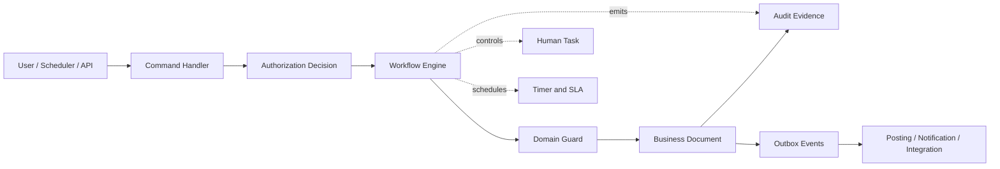
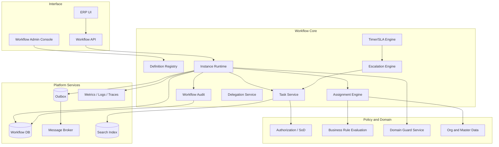
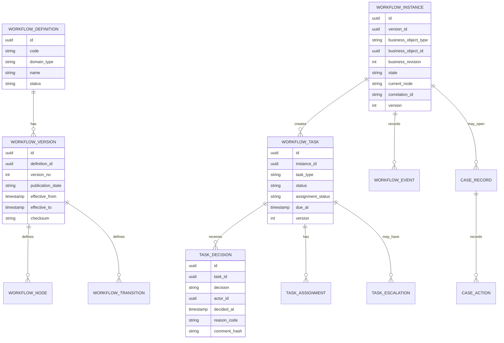
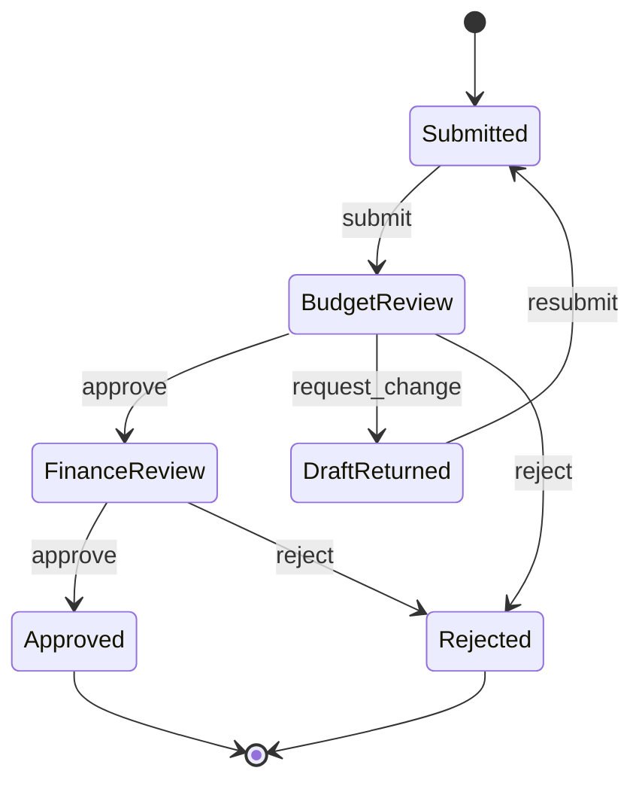
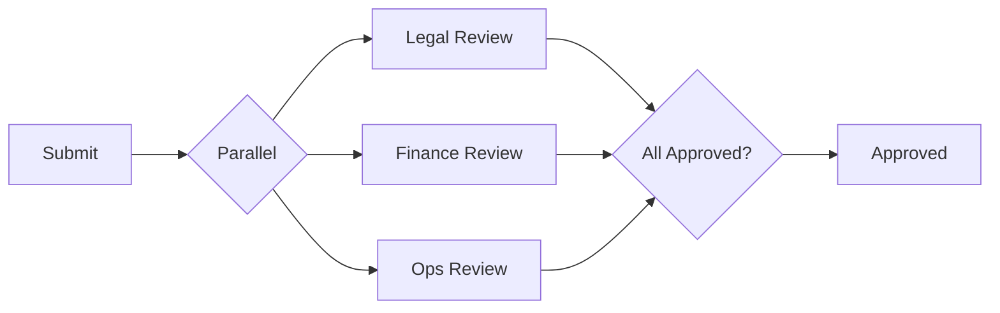
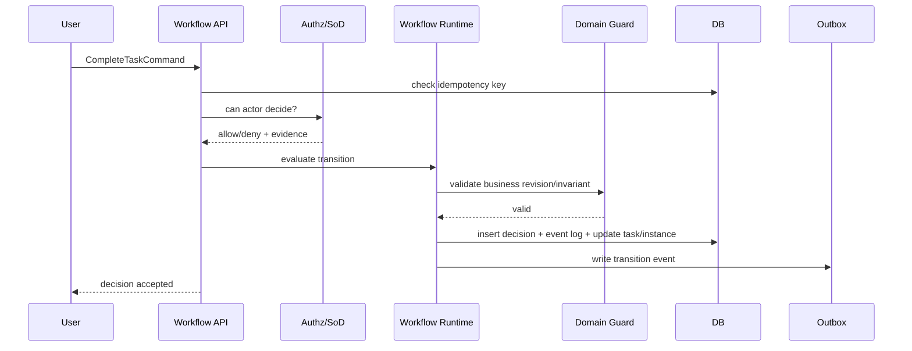
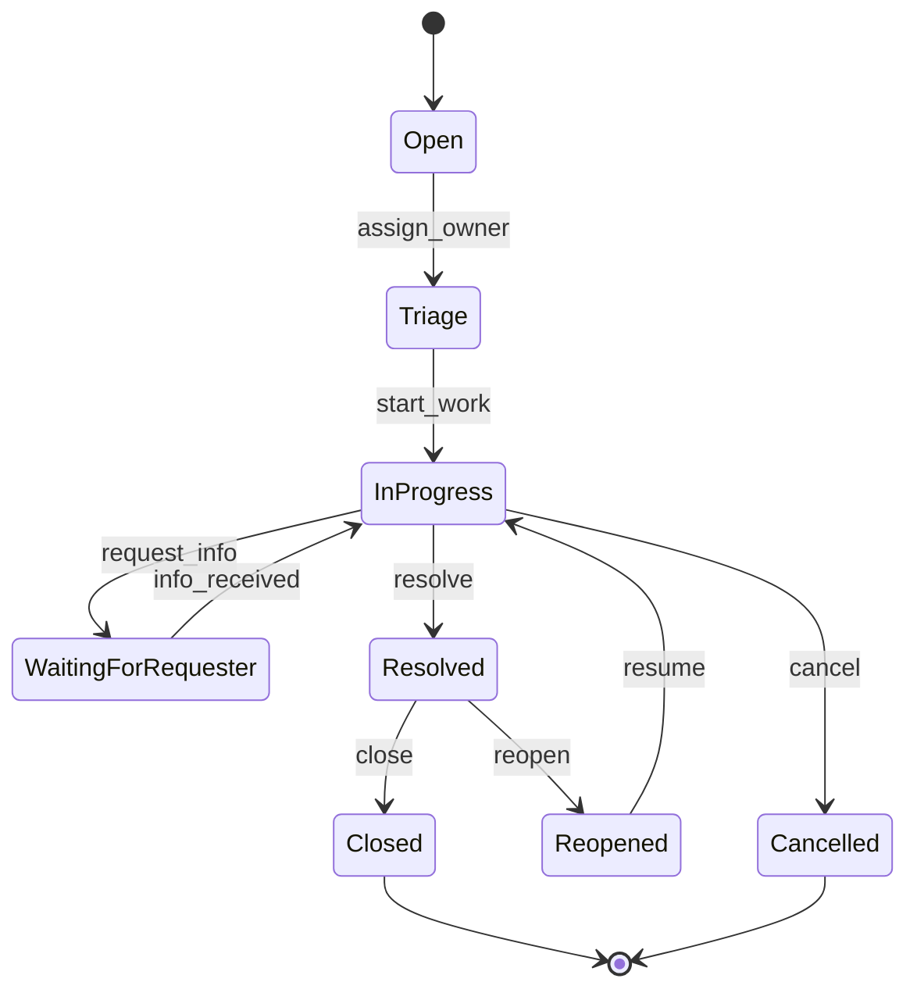
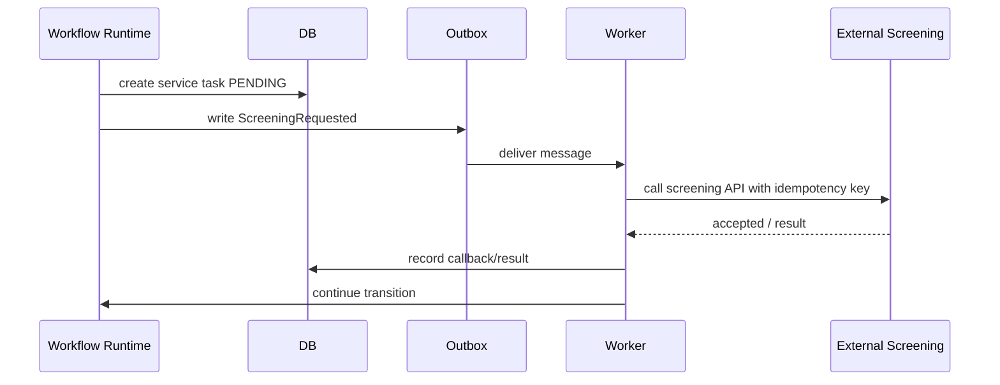

# Part 017 — Workflow, Approval, and Case Lifecycle Engine

## 1. Target Skill Part Ini

Workflow ERP bukan sekadar fitur “approve/reject”. Dalam ERP besar, workflow adalah **control plane** yang mengatur kapan sebuah dokumen boleh bergerak, siapa boleh mengambil keputusan, apa bukti yang harus tersimpan, bagaimana eskalasi terjadi, bagaimana delegasi bekerja, bagaimana SLA dihitung, dan bagaimana sistem tetap konsisten ketika user, scheduler, integrasi eksternal, dan batch process bergerak bersamaan.

> **Skill inti part ini:** mampu mendesain workflow, approval, dan case lifecycle engine dalam Java ERP yang deterministic, auditable, resilient, idempotent, policy-aware, dan bisa dipakai lintas domain tanpa mengorbankan invariant domain.

Kesalahan umum adalah membuat workflow sebagai kolom status sederhana:

```text
purchase_order.status = WAITING_APPROVAL
purchase_order.approved_by = user_id
```

Untuk aplikasi kecil, itu cukup. Untuk ERP besar, model seperti itu cepat runtuh karena tidak bisa menjawab:

- siapa approver yang seharusnya saat keputusan dibuat;
- apakah approver punya authority terhadap legal entity, branch, cost center, amount, dan commodity;
- apakah approver sedang dalam conflict of interest atau segregation-of-duties violation;
- apakah approval dibuat sebelum atau sesudah perubahan nilai dokumen;
- apakah approval berlaku untuk versi dokumen yang sama;
- apakah task di-reassign, didelegasikan, atau dieskalasi;
- apakah keputusan bisa dipertanggungjawabkan ketika ada audit atau dispute;
- apakah retry dari API menyebabkan duplicate approval;
- apakah workflow masih valid ketika rule berubah di tengah proses;
- apakah dokumen boleh di-cancel ketika ada approval task aktif;
- apakah posting downstream boleh berjalan saat approval belum final.

Workflow ERP harus dipahami sebagai kombinasi dari:

```text
workflow definition
+ workflow instance
+ business document lifecycle
+ authorization decision
+ assignment policy
+ SLA/timer policy
+ audit evidence
+ immutable transition history
+ domain invariant guard
```

---

## 2. Kaufman Deconstruction: Memecah Skill Workflow ERP

Mengikuti pendekatan Josh Kaufman, kita tidak belajar workflow sebagai satu topik besar. Kita pecah menjadi sub-skill yang bisa dilatih dan divalidasi.

| Sub-skill | Pertanyaan yang Harus Bisa Dijawab | Output Engineering |
|---|---|---|
| Lifecycle modelling | Dokumen melewati state apa saja? | state diagram, transition matrix |
| Approval topology | Approval linear, parallel, quorum, atau conditional? | workflow graph, join policy |
| Assignment | Task diberikan ke siapa dan berdasarkan apa? | candidate rule, authority scope |
| Authorization | Siapa boleh melakukan action apa pada state apa? | policy decision, SoD rule |
| Evidence | Bukti apa yang harus tersimpan? | immutable decision log, input snapshot |
| Timer/SLA | Kapan task overdue, escalate, auto-close, atau remind? | timer job, escalation rule |
| Delegation | Apa beda delegate, reassign, proxy, substitute? | delegation model, audit link |
| Versioning | Apa yang terjadi jika workflow definition berubah? | definition snapshot, migration policy |
| Idempotency | Bagaimana retry tidak membuat keputusan ganda? | command id, decision deduplication |
| Concurrency | Bagaimana dua approver submit bersamaan? | lock, transition guard, version check |
| Integration | Bagaimana workflow memanggil service eksternal? | outbox, command handler, callback |
| Observability | Bagaimana operator tahu task stuck? | metrics, search, dashboard, alert |
| Recovery | Bagaimana membetulkan workflow salah? | admin correction with evidence |

Target kita bukan hafal BPMN atau library tertentu. Targetnya adalah mampu melihat workflow sebagai **sistem kendali** atas transaksi ERP.

---

## 3. Mental Model: Workflow Bukan Owner Kebenaran Domain

Prinsip paling penting:

> Workflow engine mengatur **urutan dan otorisasi gerak**, tetapi domain aggregate tetap menjaga **kebenaran bisnis**.

Contoh: purchase order tidak boleh diposting hanya karena workflow berkata approved. Domain `PurchaseOrder` tetap harus memvalidasi:

- total masih sama dengan versi yang disetujui;
- vendor masih aktif;
- budget masih tersedia;
- period belum locked;
- currency valid;
- line item belum berubah tanpa re-approval;
- approval decision berlaku untuk document revision yang tepat.

Workflow adalah control plane. Domain adalah system of record untuk invariant.



Desain yang sehat:

```text
Workflow can say: “approval path is complete.”
Domain must still say: “this document is valid to post now.”
```

Desain yang berbahaya:

```text
if workflow.status == APPROVED:
    postToLedger(document)
```

Karena `APPROVED` bisa stale terhadap dokumen yang berubah, rule yang berubah, organization scope yang berubah, atau period yang terkunci.

---

## 4. Workflow vs Approval vs Case Lifecycle vs State Machine

Empat konsep ini sering dicampur.

| Konsep | Fokus | Contoh | Risiko Jika Dicampur |
|---|---|---|---|
| State machine | Legal transition satu entity | PO: Draft → Submitted → Approved | state menjadi ambigu |
| Workflow | Orchestration multi-step | approval routing + notification + escalation | domain logic bocor ke process graph |
| Approval | Human/business decision | manager approves amount > 100M | approval tidak punya evidence |
| Case lifecycle | Koordinasi exception/non-linear work | invoice discrepancy case | tidak ada ownership dan SLA |

Dalam ERP besar:

- **state machine** menjaga lifecycle dokumen;
- **workflow** mengatur proses yang mungkin melibatkan banyak actor dan system;
- **approval** adalah jenis task/decision dalam workflow;
- **case lifecycle** adalah workflow yang lebih fleksibel, sering dipakai untuk exception handling, dispute, investigation, dan remediation.

Contoh mapping:

```text
PurchaseOrder aggregate:
  state = SUBMITTED

Workflow instance:
  process = PO_APPROVAL_V7
  active node = FINANCE_REVIEW

Approval task:
  assigned to = finance-manager-group
  decision = pending

Case:
  type = BUDGET_EXCEPTION
  owner = procurement operations
  SLA = 2 business days
```

---

## 5. Reference Architecture Workflow Engine ERP

Workflow engine ERP bisa dibangun internal atau menggunakan platform seperti BPMN/workflow engine. Di kedua pilihan, boundary-nya harus jelas.



### Komponen Utama

| Komponen | Tanggung Jawab | Tidak Boleh Melakukan |
|---|---|---|
| Definition Registry | menyimpan workflow template/version | mengubah instance historis diam-diam |
| Instance Runtime | menjalankan node/transition | mengabaikan domain guard |
| Task Service | membuat, assign, complete human task | menyimpan business truth final |
| Assignment Engine | menentukan candidate/assignee | bypass authorization |
| Timer/SLA Engine | reminder, overdue, escalation | melakukan keputusan bisnis tanpa policy |
| Delegation Service | substitute/reassign/proxy | menghapus jejak actor asli |
| Workflow Audit | mencatat command, decision, transition | mutable log |
| Domain Guard Service | validasi invariant domain | menjadi workflow engine baru |

---

## 6. Data Model Inti Workflow

Workflow ERP perlu model yang eksplisit. Jangan menyimpan workflow dalam JSON blob tunggal tanpa index dan audit path.

### 6.1 Core Entities



### 6.2 Minimal Relational Schema

```sql
create table workflow_definition (
    id uuid primary key,
    code varchar(120) not null unique,
    domain_type varchar(120) not null,
    name varchar(240) not null,
    status varchar(40) not null,
    created_at timestamptz not null,
    created_by uuid not null
);

create table workflow_version (
    id uuid primary key,
    definition_id uuid not null references workflow_definition(id),
    version_no integer not null,
    publication_state varchar(40) not null,
    effective_from timestamptz not null,
    effective_to timestamptz,
    definition_json jsonb not null,
    checksum varchar(128) not null,
    created_at timestamptz not null,
    created_by uuid not null,
    unique (definition_id, version_no)
);

create table workflow_instance (
    id uuid primary key,
    workflow_version_id uuid not null references workflow_version(id),
    business_object_type varchar(120) not null,
    business_object_id uuid not null,
    business_revision integer not null,
    instance_state varchar(40) not null,
    current_node_key varchar(120),
    correlation_id varchar(160) not null,
    idempotency_key varchar(160) not null,
    version integer not null default 0,
    started_at timestamptz not null,
    completed_at timestamptz,
    unique (business_object_type, business_object_id, business_revision),
    unique (correlation_id),
    unique (idempotency_key)
);

create table workflow_task (
    id uuid primary key,
    workflow_instance_id uuid not null references workflow_instance(id),
    node_key varchar(120) not null,
    task_type varchar(80) not null,
    task_state varchar(40) not null,
    assignment_mode varchar(40) not null,
    assigned_user_id uuid,
    candidate_group varchar(160),
    due_at timestamptz,
    opened_at timestamptz not null,
    completed_at timestamptz,
    version integer not null default 0
);

create table workflow_decision (
    id uuid primary key,
    workflow_task_id uuid not null references workflow_task(id),
    decision varchar(40) not null,
    actor_id uuid not null,
    actor_delegation_id uuid,
    decided_at timestamptz not null,
    reason_code varchar(120),
    comment text,
    input_snapshot_hash varchar(128) not null,
    idempotency_key varchar(160) not null,
    unique (workflow_task_id, actor_id, idempotency_key)
);

create table workflow_event_log (
    id uuid primary key,
    workflow_instance_id uuid not null references workflow_instance(id),
    event_type varchar(120) not null,
    event_time timestamptz not null,
    actor_id uuid,
    payload jsonb not null,
    hash varchar(128) not null,
    previous_hash varchar(128)
);
```

Catatan penting:

- `business_revision` membuat approval terikat pada versi dokumen.
- `workflow_version_id` memastikan instance tidak berubah ketika workflow definition baru dipublish.
- `version` untuk optimistic locking.
- `idempotency_key` untuk command retry.
- `workflow_event_log` sebaiknya append-only.

---

## 7. Workflow Definition: Declarative, Versioned, and Validated

Workflow definition harus diperlakukan sebagai artifact governance, bukan konfigurasi bebas tanpa kontrol.

Contoh DSL internal sederhana:

```json
{
  "code": "PO_APPROVAL",
  "version": 7,
  "start": "SUBMIT",
  "nodes": [
    {
      "key": "BUDGET_REVIEW",
      "type": "approval",
      "candidateRule": "budget.owner(document.costCenter)",
      "dueInHours": 24,
      "transitions": [
        { "event": "APPROVE", "to": "FINANCE_REVIEW" },
        { "event": "REJECT", "to": "REJECTED" },
        { "event": "REQUEST_CHANGE", "to": "DRAFT_RETURNED" }
      ]
    },
    {
      "key": "FINANCE_REVIEW",
      "type": "approval",
      "candidateRule": "finance.approver(document.legalEntity, document.amount)",
      "guard": "document.total >= 100000000",
      "transitions": [
        { "event": "APPROVE", "to": "APPROVED" },
        { "event": "REJECT", "to": "REJECTED" }
      ]
    }
  ]
}
```

Definition validation wajib dilakukan sebelum publish:

| Validation | Tujuan |
|---|---|
| semua node reachable | mencegah dead node |
| semua transition target valid | mencegah broken graph |
| terminal state eksplisit | mencegah workflow menggantung |
| tidak ada infinite loop tanpa exit condition | mencegah livelock |
| semua approval node punya assignment rule | mencegah orphan task |
| guard expression terdaftar dan typed | mencegah runtime script chaos |
| SLA policy valid | mencegah timer tak terukur |
| SoD policy attached | mencegah approval abuse |
| migration policy jelas | mencegah instance lama rusak |

Mermaid view:



---

## 8. Approval Topology

Approval topology menentukan bagaimana keputusan dikumpulkan.

### 8.1 Linear Approval

Satu task selesai, lalu task berikutnya dibuat.

```text
Requester -> Supervisor -> Finance -> Director
```

Cocok untuk:

- small amount approval;
- authority berjenjang;
- dokumen yang butuh clear accountability.

Risiko:

- bottleneck;
- SLA panjang;
- sulit parallelize.

### 8.2 Parallel Approval

Beberapa approver menilai bersamaan.



Cocok untuk:

- contract approval;
- high-value procurement;
- project budget;
- vendor onboarding.

Risiko:

- partial reject semantics harus jelas;
- perubahan dokumen di tengah review harus invalidate semua task atau sebagian;
- join condition harus deterministic.

### 8.3 Quorum Approval

Approval sah jika jumlah/weight tertentu terpenuhi.

```text
2 of 3 directors approve
or
approval weight >= 70%
```

Cocok untuk:

- committee approval;
- board-like decision;
- risk exception.

Risiko:

- abstain, timeout, dan reject harus punya semantic jelas;
- SoD lebih kompleks;
- audit harus menunjukkan quorum pada saat keputusan final.

### 8.4 Conditional Approval

Path bergantung pada data dokumen.

```text
if amount <= 10M: supervisor
if amount > 10M and <= 100M: supervisor + finance
if amount > 100M: supervisor + finance + director
if item.category == "CAPEX": asset controller
if vendor.risk == HIGH: compliance review
```

Risiko paling besar adalah **rule drift**: path yang dihitung hari ini berbeda dari path saat dokumen disubmit. Karena itu workflow instance harus menyimpan **routing snapshot**.

---

## 9. Assignment Engine

Assignment bukan hanya `assigned_to`.

Model assignment yang sehat mencakup:

```text
candidate set
+ eligibility rule
+ authority limit
+ organization scope
+ availability
+ delegation
+ conflict rule
+ final assignee claim/selection
```

### 9.1 Candidate Rule

```java
public interface AssignmentRule {
    CandidateSet resolve(AssignmentContext context);
}

public record AssignmentContext(
        UUID tenantId,
        UUID legalEntityId,
        UUID branchId,
        UUID costCenterId,
        String documentType,
        UUID documentId,
        int documentRevision,
        Money amount,
        String currency,
        UUID requesterId,
        Instant submittedAt
) {}

public record CandidateSet(
        Set<UUID> userIds,
        Set<String> groups,
        String ruleCode,
        String explanation
) {}
```

### 9.2 Eligibility Filter

Candidate belum tentu eligible.

Filter umum:

- user aktif;
- user punya role yang tepat;
- user berada dalam legal entity/branch scope;
- authority limit cukup;
- tidak sedang cuti atau unavailable;
- bukan requester;
- bukan creator/vendor maintainer/payment preparer untuk SoD tertentu;
- tidak punya delegation conflict;
- tidak melebihi approval workload limit jika ada.

```java
public interface EligibilityPolicy {
    EligibilityDecision evaluate(UserCandidate candidate, ApprovalContext context);
}

public record EligibilityDecision(
        boolean allowed,
        List<String> reasons,
        Map<String, Object> evidence
) {}
```

### 9.3 Claim vs Direct Assignment

| Model | Cara Kerja | Cocok Untuk | Risiko |
|---|---|---|---|
| Direct assignment | task langsung ke user | ownership jelas | bottleneck ketika user tidak available |
| Candidate group | banyak user bisa claim | ops queue | perlu race control |
| Load-balanced | sistem memilih user | high-volume case | assignment harus explainable |
| Rule-based hierarchy | berdasarkan manager/authority | approval formal | hierarchy stale |

Claim task harus atomic:

```sql
update workflow_task
set assigned_user_id = :userId,
    assignment_status = 'CLAIMED',
    version = version + 1
where id = :taskId
  and assignment_status = 'UNCLAIMED'
  and version = :expectedVersion;
```

Jika update count = 0, berarti task sudah diklaim atau berubah.

---

## 10. Authorization and SoD in Workflow

Workflow authorization harus mengevaluasi action, bukan hanya halaman.

```text
Can actor X approve task Y for document Z at revision R under context C?
```

Input minimal:

- actor identity;
- delegated identity jika ada;
- task id;
- workflow instance id;
- business object id + revision;
- requested action;
- current state;
- legal entity/branch/cost center;
- amount/currency;
- role/scope;
- SoD history;
- approval authority limit.

```java
public enum WorkflowAction {
    SUBMIT,
    CLAIM,
    APPROVE,
    REJECT,
    REQUEST_CHANGE,
    DELEGATE,
    REASSIGN,
    ESCALATE,
    CANCEL,
    ADMIN_CORRECT
}

public interface WorkflowAuthorizationService {
    AuthorizationDecision canPerform(WorkflowActor actor,
                                     WorkflowAction action,
                                     WorkflowTask task,
                                     BusinessObjectSnapshot snapshot);
}
```

### SoD Example

```java
public final class MakerCheckerPolicy {
    public PolicyDecision evaluate(WorkflowActor actor, BusinessObjectSnapshot doc) {
        if (actor.userId().equals(doc.createdBy())) {
            return PolicyDecision.deny("MAKER_CANNOT_APPROVE_OWN_DOCUMENT");
        }
        if (doc.hasLineModifiedBy(actor.userId())) {
            return PolicyDecision.deny("LINE_EDITOR_CANNOT_FINAL_APPROVE");
        }
        return PolicyDecision.allow();
    }
}
```

SoD evidence harus disimpan, bukan hanya dievaluasi lalu hilang:

```json
{
  "policy": "MAKER_CHECKER_PO_APPROVAL",
  "result": "DENY",
  "reason": "MAKER_CANNOT_APPROVE_OWN_DOCUMENT",
  "actorId": "...",
  "documentId": "...",
  "documentRevision": 4,
  "evaluatedAt": "2026-06-30T10:15:30Z"
}
```

---

## 11. Decision Handling: Idempotent, Atomic, Auditable

Approval command harus diproses sebagai command dengan idempotency key.

```java
public record CompleteTaskCommand(
        UUID taskId,
        UUID actorId,
        String decision,
        String reasonCode,
        String comment,
        String idempotencyKey,
        int expectedTaskVersion,
        int expectedBusinessRevision
) {}
```

Flow:



Atomic transaction boundary:

```text
insert decision
+ append workflow event
+ close task
+ update workflow instance
+ maybe open next task
+ write outbox event
```

Semua harus commit bersama. External notification dikirim setelah commit melalui outbox.

---

## 12. Guarding Against Stale Approval

Approval harus mengikat pada document revision.

Contoh masalah:

1. PO total = 50 juta.
2. Supervisor approve.
3. Requester mengubah PO menjadi 500 juta.
4. Sistem masih menganggap approved.

Solusi:

```text
approval decision applies to document revision N only
if document changes, create revision N+1
if change affects approval-relevant fields, invalidate approval or re-route
```

Field yang biasanya approval-relevant:

- amount;
- vendor/customer;
- item/category;
- quantity;
- payment terms;
- delivery location;
- tax treatment;
- cost center/project;
- attachment contract;
- price override;
- budget allocation.

```java
public boolean requiresReapproval(DocumentRevision oldRev, DocumentRevision newRev) {
    return !Objects.equals(oldRev.vendorId(), newRev.vendorId())
        || oldRev.totalAmount().compareTo(newRev.totalAmount()) != 0
        || !Objects.equals(oldRev.costCenterId(), newRev.costCenterId())
        || !Objects.equals(oldRev.paymentTerms(), newRev.paymentTerms())
        || !Objects.equals(oldRev.approvalRelevantAttachmentHash(), newRev.approvalRelevantAttachmentHash());
}
```

---

## 13. Escalation and SLA Engine

SLA bukan hanya reminder. SLA menentukan operational accountability.

### 13.1 SLA Model

```java
public record SlaPolicy(
        String code,
        Duration firstReminderAfter,
        Duration dueAfter,
        Duration escalateAfter,
        BusinessCalendar calendar,
        EscalationTarget escalationTarget,
        boolean pauseOnRequesterActionRequired
) {}
```

SLA harus memperhitungkan:

- business calendar;
- timezone legal entity atau branch;
- holiday;
- working hours;
- pause condition;
- re-open behavior;
- escalation chain;
- exception priority.

### 13.2 Timer Persistence

Jangan mengandalkan in-memory timer untuk ERP.

```sql
create table workflow_timer (
    id uuid primary key,
    workflow_instance_id uuid not null,
    workflow_task_id uuid,
    timer_type varchar(80) not null,
    fire_at timestamptz not null,
    status varchar(40) not null,
    attempts integer not null default 0,
    locked_by varchar(120),
    locked_until timestamptz,
    created_at timestamptz not null
);
```

Worker mengambil timer secara lease-based:

```sql
update workflow_timer
set locked_by = :workerId,
    locked_until = now() + interval '2 minutes'
where id in (
    select id
    from workflow_timer
    where status = 'READY'
      and fire_at <= now()
      and (locked_until is null or locked_until < now())
    order by fire_at
    limit 100
    for update skip locked
)
returning *;
```

### 13.3 Escalation Semantics

| Action | Meaning | Audit Impact |
|---|---|---|
| remind | notify same assignee | no ownership change |
| escalate visibility | notify manager | task remains same |
| reassign | move task to another actor/group | assignment history required |
| delegate | actor intentionally gives authority | delegation evidence required |
| auto-reject | system decision after timeout | high-risk, needs explicit policy |
| auto-approve | usually dangerous | only for low-risk, explicit rule |

ERP besar sebaiknya sangat hati-hati dengan auto-approve. Untuk financial, procurement, vendor, payment, dan inventory adjustment, auto-approve sering tidak defensible kecuali policy-nya sangat terbatas dan disetujui governance.

---

## 14. Delegation, Substitution, and Reassignment

Tiga hal ini berbeda.

| Mekanisme | Siapa Memulai | Arti | Contoh |
|---|---|---|---|
| Delegation | original approver | user memberi wewenang sementara | cuti 5 hari |
| Substitution | policy/admin | sistem menunjuk pengganti | manager inactive |
| Reassignment | supervisor/admin/queue owner | task dipindahkan | workload balancing |

Delegation model:

```sql
create table workflow_delegation (
    id uuid primary key,
    delegator_user_id uuid not null,
    delegate_user_id uuid not null,
    scope_type varchar(80) not null,
    scope_id uuid,
    action_scope varchar(120) not null,
    effective_from timestamptz not null,
    effective_to timestamptz not null,
    status varchar(40) not null,
    reason text,
    approved_by uuid,
    created_at timestamptz not null,
    constraint no_self_delegation check (delegator_user_id <> delegate_user_id)
);
```

Rules:

- delegation harus time-bound;
- delegation harus scoped;
- delegation tidak boleh bypass SoD;
- decision log harus mencatat actor asli dan delegated actor;
- delegation chain sebaiknya dibatasi;
- delegation untuk high-risk approval bisa membutuhkan approval tambahan.

---

## 15. Case Lifecycle Engine

Case lifecycle dipakai ketika proses tidak linear dan membutuhkan koordinasi exception.

Contoh case ERP:

- invoice mismatch;
- vendor dispute;
- payment exception;
- stock discrepancy;
- failed posting;
- credit limit exception;
- duplicate master data investigation;
- tax exception;
- regulatory inquiry;
- migration defect remediation.

Case berbeda dari workflow biasa karena:

- bisa memiliki banyak task paralel dan ad-hoc;
- bisa di-reopen;
- punya owner dan priority;
- punya SLA dan status resolution;
- sering menyimpan evidence, note, attachment, dan decision;
- lebih dekat ke operational support dan compliance.

### 15.1 Case States



### 15.2 Case Record Model

```java
public record CaseRecord(
        UUID id,
        String caseType,
        String severity,
        String state,
        UUID businessObjectId,
        String businessObjectType,
        UUID ownerUserId,
        String ownerGroup,
        Instant openedAt,
        Instant dueAt,
        Instant closedAt,
        List<CaseAction> actions
) {}
```

Case action harus append-only:

```text
COMMENT_ADDED
ATTACHMENT_ADDED
OWNER_CHANGED
STATUS_CHANGED
ROOT_CAUSE_SET
RESOLUTION_SET
LINKED_DOCUMENT_ADDED
WORKFLOW_TASK_CREATED
ESCALATED
CLOSED
REOPENED
```

---

## 16. Long-Running Workflow and External Systems

ERP workflow sering berlangsung selama jam, hari, bahkan minggu. Jangan membungkusnya dalam database transaction panjang.

Pattern:

```text
short DB transaction per step
+ durable workflow state
+ durable timer
+ outbox event
+ idempotent external call
+ callback correlation
```

### 16.1 External Service Task

Misalnya approval high-risk vendor memanggil compliance screening.



Rule:

- workflow tidak boleh menunggu synchronous HTTP call dalam transaction utama;
- external call harus idempotent;
- callback harus punya correlation id;
- timeout harus menghasilkan case atau exception path;
- hasil external harus disnapshot.

---

## 17. Java Package Design

Contoh struktur package:

```text
com.company.erp.workflow
  api
    WorkflowCommandController
    WorkflowQueryController
  application
    StartWorkflowUseCase
    CompleteTaskUseCase
    ClaimTaskUseCase
    EscalateTaskUseCase
    ReassignTaskUseCase
  domain
    WorkflowInstance
    WorkflowTask
    WorkflowDefinition
    WorkflowTransition
    WorkflowEvent
    WorkflowGuard
    WorkflowPolicy
  assignment
    AssignmentEngine
    CandidateResolver
    EligibilityPolicy
  authorization
    WorkflowAuthorizationService
    SodPolicy
    AuthorityLimitPolicy
  timer
    WorkflowTimerWorker
    SlaPolicy
    EscalationPolicy
  caseflow
    CaseRecord
    CaseAction
    CaseLifecycleService
  persistence
    WorkflowInstanceRepository
    WorkflowTaskRepository
    WorkflowEventLogRepository
  integration
    WorkflowOutboxPublisher
    NotificationPort
    DomainGuardPort
```

Dependency direction:

```text
api -> application -> domain
application -> ports
infrastructure -> ports
```

Domain workflow tidak boleh import controller, JPA entity detail, Kafka client, atau HTTP client.

---

## 18. Core Application Service Example

```java
@Transactional
public CompleteTaskResult completeTask(CompleteTaskCommand command) {
    var existing = idempotencyRepository.find(command.idempotencyKey());
    if (existing.isPresent()) {
        return existing.get().toCompleteTaskResult();
    }

    WorkflowTask task = taskRepository.getForUpdate(command.taskId());
    WorkflowInstance instance = instanceRepository.getForUpdate(task.instanceId());

    task.assertVersion(command.expectedTaskVersion());
    task.assertCompletable();

    BusinessObjectSnapshot snapshot = domainSnapshotPort.load(
            instance.businessObjectType(),
            instance.businessObjectId()
    );

    if (snapshot.revision() != command.expectedBusinessRevision()) {
        throw new StaleBusinessRevisionException(instance.businessObjectId());
    }

    AuthorizationDecision authz = authorizationService.canPerform(
            WorkflowActor.user(command.actorId()),
            WorkflowAction.valueOf(command.decision()),
            task,
            snapshot
    );
    authz.throwIfDenied();

    Transition transition = transitionResolver.resolve(
            instance,
            task,
            command.decision(),
            snapshot
    );

    domainGuardPort.validateTransition(instance, transition, snapshot);

    WorkflowDecision decision = task.complete(
            command.actorId(),
            command.decision(),
            command.reasonCode(),
            command.comment(),
            snapshot.hash(),
            command.idempotencyKey()
    );

    List<WorkflowTask> nextTasks = instance.apply(transition, decision, clock.instant());

    decisionRepository.save(decision);
    taskRepository.save(task);
    instanceRepository.save(instance);
    nextTasks.forEach(taskRepository::save);

    eventLogRepository.append(instance.id(), WorkflowEvent.taskCompleted(decision, authz.evidence()));
    outboxRepository.save(WorkflowOutbox.taskCompleted(instance, decision));

    idempotencyRepository.save(command.idempotencyKey(), CompleteTaskResult.accepted(instance.id()));

    return CompleteTaskResult.accepted(instance.id());
}
```

Hal yang sengaja terlihat:

- idempotency check di awal;
- lock instance/task;
- version check;
- business revision check;
- authorization + SoD evidence;
- domain guard;
- append event log;
- outbox;
- idempotency result persisted.

---

## 19. Workflow Query Model

Jangan query operational workflow langsung dari banyak join OLTP untuk dashboard besar.

Buat read model:

```text
workflow_task_search
- task_id
- instance_id
- business_object_type
- business_object_number
- business_object_summary
- legal_entity_id
- branch_id
- cost_center_id
- task_state
- assigned_user_id
- candidate_group
- priority
- due_at
- overdue_flag
- amount
- currency
- created_at
```

Update read model melalui outbox/CDC/event handler.

Search screen umum:

- My pending tasks;
- Group queue;
- Overdue tasks;
- High value approvals;
- Escalated items;
- Workflow instances by document;
- Stuck workflow;
- Completed decisions by actor;
- Admin correction log.

---

## 20. Observability: Business-Level Signals

Technical observability tidak cukup.

Metrics penting:

```text
workflow_instances_started_total{definition,version,domain}
workflow_instances_completed_total{definition,version,domain,outcome}
workflow_tasks_open_total{task_type,group,legal_entity}
workflow_tasks_overdue_total{task_type,group,severity}
workflow_task_completion_seconds{task_type,group}
workflow_escalations_total{policy,level}
workflow_authorization_denied_total{policy,reason}
workflow_stale_revision_rejected_total{domain}
workflow_timer_lag_seconds{worker}
workflow_outbox_pending_total{event_type}
```

Logs harus mengandung correlation id:

```json
{
  "event": "workflow.task.completed",
  "correlationId": "PO-2026-000123:r4",
  "workflowInstanceId": "...",
  "taskId": "...",
  "actorId": "...",
  "decision": "APPROVE",
  "documentType": "PURCHASE_ORDER",
  "documentId": "...",
  "businessRevision": 4
}
```

Trace boundary:

```text
HTTP request
 -> command handler
 -> authorization decision
 -> workflow transition
 -> domain guard
 -> DB commit
 -> outbox publish
 -> notification worker
```

---

## 21. Admin Correction Without Destroying Evidence

ERP workflow butuh admin tooling. Tetapi admin tooling tidak boleh menjadi backdoor yang menghapus fakta historis.

Admin action yang defensible:

- force reassign with reason;
- cancel duplicate workflow instance;
- reopen task due to system error;
- attach missing evidence;
- mark external callback as failed and retry;
- migrate instance to new definition version under approved migration plan;
- create corrective transition event.

Admin action yang berbahaya:

- update status langsung di database;
- delete approval task;
- edit decision actor;
- mengubah timestamp approval;
- mengganti workflow version tanpa event;
- menghapus evidence yang sudah dipakai audit.

Correction harus berupa event baru:

```text
wrong event remains visible
correction event explains why and who approved correction
current projection reflects corrected state
```

---

## 22. BPMN, Internal Engine, or Durable Workflow Platform?

Ada tiga pendekatan umum.

| Option | Kelebihan | Kekurangan | Cocok Untuk |
|---|---|---|---|
| Internal lightweight engine | sangat cocok dengan domain ERP | perlu build tooling sendiri | approval/stateful document workflow |
| BPMN engine | visual, standard-ish, powerful orchestration | bisa overkill dan domain bocor ke diagram | complex cross-system process |
| Durable workflow platform | resilient long-running orchestration | determinism constraints, operational model baru | system orchestration, async retries |

Keputusan praktis:

- Untuk approval dokumen ERP yang sangat domain-specific, internal engine sering lebih terkendali.
- Untuk proses lintas sistem yang panjang dan divisualisasikan oleh business analyst, BPMN engine bisa masuk akal.
- Untuk orchestration teknis yang butuh replay, retry, durable execution, dan worker model, durable workflow platform bisa masuk akal.

Tetapi jangan membiarkan engine eksternal menjadi satu-satunya sumber kebenaran lifecycle dokumen ERP. Dokumen tetap harus punya state dan transition guard sendiri.

---

## 23. Failure Modes

| Failure Mode | Gejala | Akar Masalah | Mitigasi |
|---|---|---|---|
| Duplicate approval | task completed dua kali | retry tanpa idempotency | idempotency key + unique constraint |
| Stale approval | dokumen berubah setelah approve | approval tidak bind ke revision | revision snapshot + reapproval rule |
| Orphan task | task aktif tapi instance selesai | transition tidak atomic | single transaction + invariant check |
| Ghost workflow | instance aktif untuk dokumen cancelled | domain lifecycle tidak sinkron | cancellation protocol |
| Escalation storm | ribuan reminder | timer retry tidak controlled | lease, backoff, dedup |
| SoD bypass | maker approve sendiri | authz hanya role-based | policy decision with evidence |
| Definition drift | instance lama ikut rule baru | no version snapshot | workflow version immutable |
| Approval black box | auditor tidak tahu alasan | no decision trace | evidence snapshot |
| Manual DB fix | status benar tapi audit rusak | no correction mechanism | admin correction events |
| Reporting overload | dashboard lambat | query OLTP directly | read model/search index |

---

## 24. Anti-Patterns

### 24.1 Status Column as Workflow Engine

```text
status = APPROVED
```

Tanpa task, decision, assignee, evidence, routing, dan revision, status ini tidak cukup.

### 24.2 Workflow Owns Domain Invariant

Jika BPMN diagram menentukan apakah stock boleh keluar, domain menjadi rapuh. Workflow boleh memanggil guard, bukan menggantikan guard.

### 24.3 Dynamic Script Everywhere

Script-based workflow terdengar fleksibel, tetapi tanpa typed context, validation, versioning, test, dan sandbox, ia akan menjadi production risk.

### 24.4 Mutable Approval History

Approval history yang bisa diedit adalah red flag audit.

### 24.5 One Global Workflow for All Documents

PO, invoice, stock adjustment, vendor onboarding, dan payment punya invariant dan risk profile berbeda. Shared engine boleh sama, tetapi definition dan policy harus domain-aware.

---

## 25. Practice: 20-Hour Deliberate Workflow Drill

Latihan ini mengikuti Kaufman: pecah skill, praktik cepat, feedback ketat.

### Hour 1–2: Model One Document Lifecycle

Ambil dokumen `PurchaseOrder`.

Output:

- state diagram;
- transition matrix;
- approval-relevant fields;
- terminal states.

### Hour 3–5: Build Approval Topology

Modelkan:

- amount-based routing;
- cost-center owner;
- finance review;
- director review;
- request change path.

Output:

- workflow graph;
- candidate rule;
- SoD rule.

### Hour 6–8: Define Data Model

Buat schema:

- workflow definition;
- workflow version;
- workflow instance;
- task;
- decision;
- event log;
- timer.

### Hour 9–11: Implement Command Handler

Implement:

- submit;
- claim;
- approve;
- reject;
- request change;
- cancel.

Tambahkan:

- idempotency key;
- optimistic lock;
- business revision check.

### Hour 12–14: Add SLA and Escalation

Implement timer table dan worker lease.

Test:

- overdue task;
- reminder;
- escalation;
- duplicate timer execution.

### Hour 15–17: Audit and Evidence

Buat decision trace.

Pastikan bisa menjawab:

```text
Who approved what, when, under which policy, for which document revision, with what authority?
```

### Hour 18–20: Failure Simulation

Simulasikan:

- double click approve;
- stale revision;
- assignee inactive;
- workflow definition changed;
- timer worker crash;
- domain guard rejects after workflow approval.

---

## 26. Design Review Checklist

Gunakan checklist ini saat review workflow ERP.

### Lifecycle

- [ ] Apakah state dokumen dan workflow instance dipisah jelas?
- [ ] Apakah terminal state eksplisit?
- [ ] Apakah illegal transition ditolak?
- [ ] Apakah cancel/reopen/revise punya semantic jelas?

### Approval

- [ ] Apakah approval mengikat ke document revision?
- [ ] Apakah approver dihitung dari rule yang versioned?
- [ ] Apakah approval path disnapshot?
- [ ] Apakah parallel/quorum semantics jelas?

### Authorization

- [ ] Apakah action-level authorization ada?
- [ ] Apakah SoD dievaluasi dan disimpan sebagai evidence?
- [ ] Apakah delegation tidak bypass policy?
- [ ] Apakah admin action diaudit?

### Reliability

- [ ] Apakah command idempotent?
- [ ] Apakah task completion atomic?
- [ ] Apakah outbox dipakai untuk side effect?
- [ ] Apakah timer durable?
- [ ] Apakah worker crash safe?

### Audit

- [ ] Apakah decision log append-only?
- [ ] Apakah event log punya actor, timestamp, reason, snapshot hash?
- [ ] Apakah correction tidak menghapus histori?
- [ ] Apakah report audit bisa direkonstruksi?

### Operability

- [ ] Apakah task stuck terlihat?
- [ ] Apakah overdue/escalation metrics ada?
- [ ] Apakah admin bisa recover tanpa DB patch?
- [ ] Apakah correlation id lintas service tersedia?

---

## 27. Key Takeaways

- Workflow ERP adalah control plane, bukan pengganti domain invariant.
- Approval harus terikat pada document revision dan policy evidence.
- Task, decision, escalation, delegation, dan event log harus menjadi first-class model.
- Long-running workflow harus diproses sebagai rangkaian transaksi pendek yang durable.
- Idempotency, optimistic locking, outbox, durable timer, dan append-only audit adalah fondasi reliability.
- Case lifecycle diperlukan untuk exception work yang tidak cocok dengan approval linear.
- Admin correction harus menambah evidence, bukan menghapus sejarah.

---

## 28. Source Notes

Beberapa referensi resmi dan teknis yang relevan untuk part ini:

- Jakarta EE 11 Platform memasukkan spesifikasi enterprise seperti Concurrency, Batch, Authorization, Authentication, Security, Messaging, Persistence, dan komponen lain untuk aplikasi enterprise Java: https://jakarta.ee/specifications/platform/11/
- Jakarta Concurrency mendefinisikan cara menggunakan concurrency dari application components tanpa merusak container integrity: https://jakarta.ee/specifications/concurrency/
- Jakarta Messaging mendefinisikan asynchronous communication untuk Java applications: https://jakarta.ee/specifications/messaging/3.1/
- Spring Statemachine menyediakan konsep state machine seperti states, transitions, guards, actions, hierarchical states, dan regions untuk aplikasi Spring: https://docs.spring.io/spring-statemachine/docs/current/reference/
- Camunda 8 documentation menjelaskan BPMN-based process orchestration dan human/system workflow modelling: https://docs.camunda.io/
- Temporal Java SDK documentation menjelaskan durable workflow, activities, workers, dan determinism/replay model untuk workflow execution: https://docs.temporal.io/develop/java

