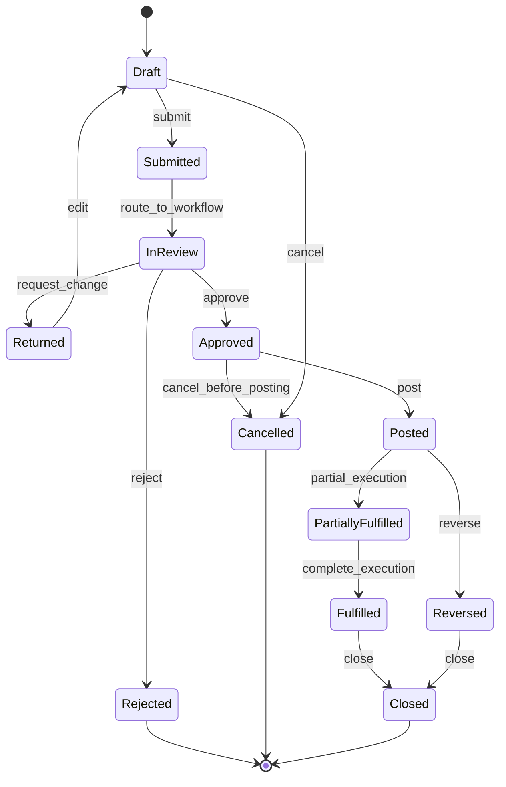
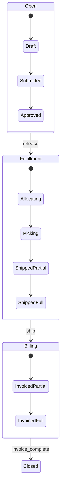
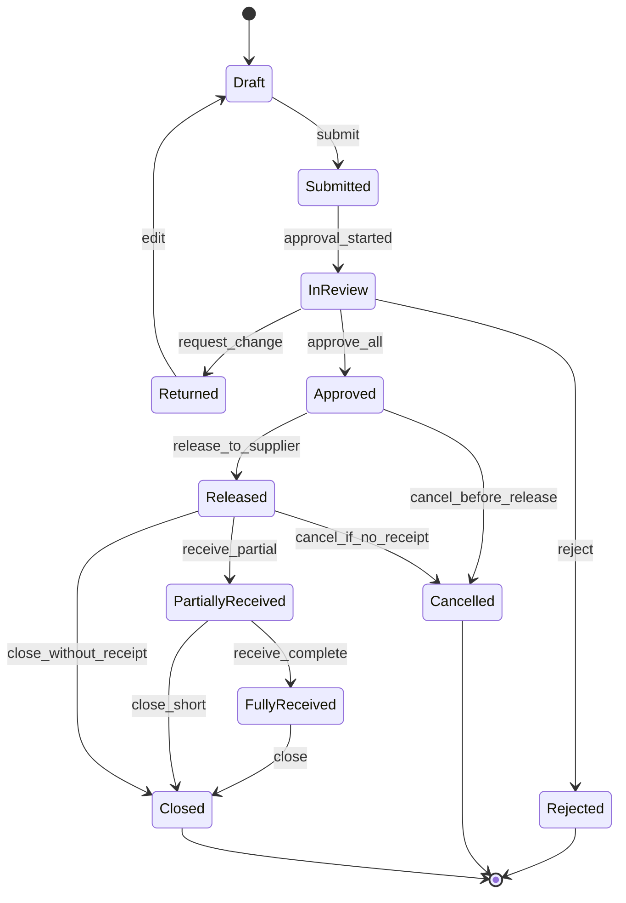

# Part 018 — ERP State Machines and Lifecycle Modelling

## 1. Target Skill Part Ini

ERP besar hidup dari lifecycle dokumen: requisition, purchase order, goods receipt, invoice, sales order, shipment, payment, stock adjustment, work order, journal, asset, project, service order, dan case. Hampir semua bug serius ERP muncul ketika lifecycle tidak dimodelkan dengan tegas.

> **Skill inti part ini:** mampu mendesain state machine ERP yang explicit, auditable, concurrency-safe, version-aware, dan menjaga business invariant pada setiap transisi dokumen.

Kesalahan umum:

```java
if (status.equals("APPROVED")) {
    status = "POSTED";
}
```

Masalahnya bukan syntax. Masalahnya adalah `APPROVED` tidak cukup menjelaskan:

- apakah dokumen masih revision yang sama;
- apakah approval masih valid;
- apakah period terbuka;
- apakah stock/budget/fund tersedia;
- apakah external integration sudah selesai;
- apakah ada hold/block;
- apakah transition boleh dilakukan oleh actor tersebut;
- apakah dokumen sudah pernah diposting;
- apakah cancellation atau reversal harus dipakai;
- apakah transition perlu menghasilkan accounting event, inventory movement, task, atau case.

State machine yang benar bukan enum status. Ia adalah kontrak lifecycle.

---

## 2. Kaufman Deconstruction: Memecah Skill State Machine ERP

| Sub-skill | Pertanyaan yang Harus Bisa Dijawab | Output Engineering |
|---|---|---|
| State semantics | Apa arti setiap state secara bisnis? | state glossary |
| Event modelling | Event apa yang memicu transition? | command/event catalog |
| Guard | Syarat apa yang harus benar sebelum transition? | guard function, invariant check |
| Action | Side effect apa yang terjadi setelah transition? | domain event, outbox, task |
| Transition matrix | Dari state mana ke state mana legal? | transition table |
| Revision | Transition berlaku untuk versi dokumen apa? | document revision model |
| Audit | Bukti transition apa yang disimpan? | transition log |
| Cancellation | Apa beda cancel, void, reject, close? | terminal semantics |
| Reversal | Bagaimana membatalkan efek yang sudah posted? | compensating transaction |
| Concurrency | Bagaimana dua transition bersamaan ditangani? | optimistic/pessimistic lock |
| Migration | Bagaimana lifecycle berubah saat upgrade? | state migration plan |
| Testing | Bagaimana membuktikan illegal transition gagal? | state machine test suite |

Kita akan membangun state machine sebagai mental model yang bisa diterapkan pada semua domain ERP.

---

## 3. State Machine Bukan Cuma Enum

Enum hanya menyebut kemungkinan status.

```java
public enum PurchaseOrderStatus {
    DRAFT,
    SUBMITTED,
    APPROVED,
    CANCELLED,
    CLOSED
}
```

State machine menjawab:

```text
current state
+ event
+ actor/context
+ guard
+ action
+ next state
+ evidence
```

Formal sederhana:

```text
Transition = f(currentState, event, context) -> nextState + actions
only if guards(context) are true
```

Contoh:

```text
DRAFT + SUBMIT
  guard: has at least one line, vendor active, total > 0, period open
  action: create approval workflow
  next: SUBMITTED
```

---

## 4. Empat Jenis Status yang Sering Tercampur

ERP sering rusak karena semua status ditaruh di satu field.

| Status Type | Menjawab | Contoh |
|---|---|---|
| Business lifecycle status | dokumen berada pada tahap apa? | DRAFT, APPROVED, POSTED, CLOSED |
| Approval status | keputusan approval bagaimana? | PENDING, APPROVED, REJECTED |
| Posting status | efek akuntansi/inventory sudah terjadi? | NOT_POSTED, POSTED, REVERSED |
| Integration status | sinkronisasi external bagaimana? | PENDING_EXPORT, SENT, ACKED, FAILED |

Contoh buruk:

```text
status = SENT
```

Sent ke siapa? Sent invoice ke customer? Sent event ke broker? Sent payment file ke bank? Sent approval request ke manager?

Desain lebih baik:

```text
document_state = APPROVED
approval_state = COMPLETED
posting_state = NOT_POSTED
integration_state = PENDING_EXPORT
```

Tetapi jangan juga membuat terlalu banyak status tanpa aturan. Kuncinya adalah setiap status punya ownership dan transition rule.

---

## 5. Canonical ERP Document Lifecycle

Banyak dokumen ERP mengikuti pola ini, dengan variasi domain.



Tidak semua domain memakai semua state. Tetapi lifecycle umum ini membantu melihat pola:

- sebelum approval: bisa diedit lebih bebas;
- setelah approval: edit harus dibatasi atau memicu reapproval;
- setelah posting: tidak boleh diedit langsung, harus reversal/adjustment;
- setelah close: hanya correction administratif yang sangat terbatas;
- terminal state harus jelas.

---

## 6. State Glossary: Jangan Biarkan Nama State Ambigu

State harus punya definisi eksplisit.

| State | Meaning | Editable? | Financial Effect? | Typical Exit |
|---|---|---:|---:|---|
| Draft | dokumen sedang dibuat | yes | no | submit/cancel |
| Submitted | dikirim untuk validasi/approval | limited | no | review/return/reject |
| InReview | task approval aktif | limited | no | approve/reject/request change |
| Approved | approved untuk revision tertentu | usually no | no or pending | post/cancel/revise |
| Posted | efek ledger/stock sudah dicatat | no direct edit | yes | reverse/close |
| PartiallyFulfilled | sebagian execution terjadi | restricted | yes/partial | fulfill/reverse/close |
| Fulfilled | execution selesai | no | yes | close |
| Reversed | efek posted dibalik oleh dokumen kompensasi | no | reversal effect | close |
| Cancelled | dibatalkan sebelum irreversible effect | no | no or reversal needed | terminal |
| Rejected | ditolak oleh approval | no or copy-to-new | no | terminal |
| Closed | lifecycle selesai | no | final | terminal |

State glossary harus menjawab:

- siapa owner state ini;
- apakah dokumen bisa diubah;
- apakah approval masih valid;
- apakah posting sudah terjadi;
- apa action legal;
- apa evidence minimal;
- apakah state terminal;
- bagaimana report harus memperlakukannya.

---

## 7. Transition Matrix

State diagram bagus untuk visualisasi, tetapi transition matrix lebih kuat untuk implementation dan test.

Contoh PO:

| Current State | Event | Guard | Next State | Action |
|---|---|---|---|---|
| DRAFT | SUBMIT | valid lines, vendor active | SUBMITTED | create workflow |
| SUBMITTED | START_REVIEW | workflow definition exists | IN_REVIEW | create tasks |
| IN_REVIEW | REQUEST_CHANGE | actor can review | RETURNED | close task, notify requester |
| RETURNED | RESUBMIT | changed revision valid | SUBMITTED | reroute workflow |
| IN_REVIEW | APPROVE | all approvals complete | APPROVED | record approval snapshot |
| IN_REVIEW | REJECT | actor can reject | REJECTED | close workflow |
| APPROVED | POST | period open, budget ok | POSTED | create accounting/inventory event |
| APPROVED | CANCEL | no downstream execution | CANCELLED | cancel approval/workflow |
| POSTED | REVERSE | reversal allowed | REVERSED | create reversal document |
| POSTED | CLOSE | fully fulfilled | CLOSED | archive/lock |

Transition matrix bisa diturunkan menjadi unit test:

```java
@ParameterizedTest
@MethodSource("illegalTransitions")
void illegalTransitionsMustFail(DocumentState current, DocumentEvent event) {
    var po = PurchaseOrderFixture.inState(current);
    assertThrows(IllegalTransitionException.class,
            () -> stateMachine.apply(po, event, context));
}
```

---

## 8. Guard Design

Guard adalah predicate yang menentukan apakah transition legal.

```java
public interface TransitionGuard<D, C> {
    GuardDecision evaluate(D document, C context);
}

public record GuardDecision(
        boolean allowed,
        String code,
        List<String> reasons,
        Map<String, Object> evidence
) {
    public static GuardDecision allow(String code) {
        return new GuardDecision(true, code, List.of(), Map.of());
    }

    public static GuardDecision deny(String code, String reason) {
        return new GuardDecision(false, code, List.of(reason), Map.of());
    }
}
```

### 8.1 Guard Examples

```java
public final class PurchaseOrderSubmitGuard
        implements TransitionGuard<PurchaseOrder, TransitionContext> {

    @Override
    public GuardDecision evaluate(PurchaseOrder po, TransitionContext ctx) {
        if (po.lines().isEmpty()) {
            return GuardDecision.deny("PO_SUBMIT", "PO must have at least one line");
        }
        if (!po.vendorSnapshot().active()) {
            return GuardDecision.deny("PO_SUBMIT", "Vendor is inactive");
        }
        if (po.total().isZeroOrNegative()) {
            return GuardDecision.deny("PO_SUBMIT", "PO total must be positive");
        }
        if (ctx.periodService().isLocked(po.documentDate(), po.legalEntityId())) {
            return GuardDecision.deny("PO_SUBMIT", "Accounting period is locked");
        }
        return GuardDecision.allow("PO_SUBMIT");
    }
}
```

Guard harus:

- deterministic;
- side-effect free;
- menghasilkan reason code;
- bisa dites;
- tidak melakukan update database;
- tidak memanggil external service volatile secara langsung;
- menyimpan evidence jika dipakai untuk decision penting.

---

## 9. Actions: Side Effect Setelah Transition

Transition action adalah efek yang terjadi setelah state berpindah.

Contoh:

| Transition | Action |
|---|---|
| DRAFT → SUBMITTED | create workflow instance |
| IN_REVIEW → APPROVED | store approval snapshot |
| APPROVED → POSTED | create posting request/outbox event |
| POSTED → REVERSED | create reversal document |
| ANY → CANCELLED | cancel active tasks/timers |
| FULFILLED → CLOSED | lock document and archive read model |

Action harus diproses aman:

```text
state update
+ transition log
+ domain event
+ outbox message
commit together
```

External side effect setelah commit.

```java
@Transactional
public TransitionResult transition(TransitionCommand command) {
    Document doc = repository.getForUpdate(command.documentId());
    TransitionPlan plan = stateMachine.plan(doc, command.event(), command.context());

    plan.assertAllowed();
    doc.apply(plan);

    repository.save(doc);
    transitionLogRepository.append(TransitionLog.from(plan));
    outboxRepository.saveAll(plan.outboxEvents());

    return TransitionResult.success(doc.id(), doc.state(), doc.revision());
}
```

---

## 10. Persistent State Machine Model

State machine harus persistent dan auditable.

### 10.1 Document Table

```sql
create table erp_document (
    id uuid primary key,
    document_type varchar(80) not null,
    document_number varchar(120) not null,
    legal_entity_id uuid not null,
    branch_id uuid,
    document_state varchar(60) not null,
    approval_state varchar(60) not null,
    posting_state varchar(60) not null,
    integration_state varchar(60) not null,
    revision integer not null,
    version integer not null,
    created_at timestamptz not null,
    updated_at timestamptz not null,
    unique (document_type, document_number)
);
```

### 10.2 Transition Log

```sql
create table document_transition_log (
    id uuid primary key,
    document_id uuid not null,
    document_type varchar(80) not null,
    from_state varchar(60) not null,
    to_state varchar(60) not null,
    event varchar(80) not null,
    actor_id uuid,
    transition_time timestamptz not null,
    revision integer not null,
    command_id varchar(160) not null,
    guard_evidence jsonb not null,
    action_evidence jsonb not null,
    reason_code varchar(120),
    comment text,
    hash varchar(128) not null,
    previous_hash varchar(128),
    unique (document_id, command_id)
);
```

Transition log menjawab:

```text
who moved this document from state A to state B,
when,
why,
under which guard decision,
for which revision,
with what command id.
```

---

## 11. Document Revision and State

Revision harus dipisah dari version.

| Field | Meaning | Dipakai Untuk |
|---|---|---|
| `revision` | business content revision | approval binding, audit |
| `version` | persistence concurrency version | optimistic locking |

Contoh:

```text
revision = 4 means business content revision 4
version = 23 means row has been updated 23 times
```

Perubahan komentar internal mungkin menaikkan `version`, tetapi tidak selalu menaikkan `revision`. Perubahan amount/vendor/line harus menaikkan `revision`.

### Revision Policy

| Change | Revision? | Reapproval? |
|---|---:|---:|
| edit line quantity | yes | yes |
| edit internal note | no/maybe | no |
| attach contract | yes | yes |
| add non-approval attachment | maybe | no |
| change cost center | yes | yes |
| change delivery date | maybe | depends |
| change payment term | yes | yes |

---

## 12. Cancellation, Rejection, Void, Reversal, Closure

Istilah ini sering dipakai sembarangan. Dalam ERP, mereka berbeda.

| Term | Kapan Dipakai | Apakah Ada Efek Finansial/Stock? | Mekanisme |
|---|---|---:|---|
| Reject | approval menolak sebelum approved | no | terminal or copy-to-new |
| Cancel | dibatalkan sebelum irreversible effect | usually no | close active workflow/task |
| Void | membatalkan dokumen yang belum efektif/legal | depends | strict audit/legal rule |
| Reverse | membalik efek posted | yes | compensating transaction |
| Close | lifecycle selesai | no new effect | lock/archive |

Prinsip:

> Setelah dokumen menghasilkan ledger/stock/legal effect, jangan update history langsung. Gunakan reversal, adjustment, debit note, credit note, atau compensating document.

Contoh invoice:

```text
DRAFT -> APPROVED -> POSTED -> PAID -> CLOSED
POSTED -> CREDITED -> CLOSED
POSTED -> REVERSED -> CLOSED
```

Jangan:

```sql
update invoice set amount = 0 where id = :id;
```

Gunakan:

```text
create credit note or reversal journal linked to original invoice
```

---

## 13. State Machine Implementation Patterns in Java

### 13.1 Table-Driven State Machine

Cocok untuk lifecycle yang sederhana dan ingin explicit.

```java
public final class StateMachine<S extends Enum<S>, E extends Enum<E>, D> {
    private final Map<Key<S, E>, Transition<S, E, D>> transitions;

    public TransitionPlan<S> plan(D document, S current, E event, TransitionContext context) {
        Transition<S, E, D> transition = transitions.get(new Key<>(current, event));
        if (transition == null) {
            throw new IllegalTransitionException(current, event);
        }

        GuardDecision guard = transition.guard().evaluate(document, context);
        if (!guard.allowed()) {
            return TransitionPlan.denied(current, event, guard);
        }

        return TransitionPlan.allowed(
                current,
                transition.to(),
                event,
                guard,
                transition.actions()
        );
    }
}
```

Transition definition:

```java
new Transition<>(
    PurchaseOrderState.DRAFT,
    PurchaseOrderEvent.SUBMIT,
    PurchaseOrderState.SUBMITTED,
    new PurchaseOrderSubmitGuard(),
    List.of(new CreateApprovalWorkflowAction())
)
```

Kelebihan:

- mudah dites;
- mudah direview;
- tidak perlu framework berat;
- cocok untuk domain lifecycle.

Kekurangan:

- workflow kompleks butuh layer tambahan;
- visualization harus dibuat sendiri.

### 13.2 State Pattern

Cocok jika setiap state punya behavior signifikan.

```java
public interface PurchaseOrderLifecycleState {
    PurchaseOrderState state();
    TransitionPlan submit(PurchaseOrder po, TransitionContext ctx);
    TransitionPlan approve(PurchaseOrder po, TransitionContext ctx);
    TransitionPlan cancel(PurchaseOrder po, TransitionContext ctx);
}
```

Risiko: class bisa meledak jika event banyak. Gunakan hanya jika behavior tiap state benar-benar berbeda.

### 13.3 External State Machine Framework

Framework bisa membantu untuk hierarchical state, guards, actions, dan visualization. Tetapi domain ERP tetap harus punya transition guard sendiri dan transition log sendiri.

---

## 14. Hierarchical and Composite States

Beberapa lifecycle lebih mudah dimodelkan dengan state bertingkat.

Contoh Sales Order:

```text
OPEN
  - DRAFT
  - SUBMITTED
  - APPROVED
FULFILLMENT
  - ALLOCATING
  - PICKING
  - SHIPPED_PARTIAL
  - SHIPPED_FULL
BILLING
  - INVOICED_PARTIAL
  - INVOICED_FULL
CLOSED
  - CLOSED_NORMAL
  - CLOSED_CANCELLED
  - CLOSED_REVERSED
```

Mermaid:



Gunakan hierarchical state jika:

- banyak sub-state berbagi transition;
- UI/report butuh status high-level dan detailed;
- domain punya phase besar.

Jangan gunakan jika hanya membuat model terlihat “canggih”.

---

## 15. Parallel State Dimensions

Kadang lifecycle tidak bisa jadi satu state linear.

Sales order bisa punya dimensi:

```text
approval_state: PENDING / APPROVED / REJECTED
fulfillment_state: NOT_RELEASED / RELEASED / PARTIAL / COMPLETE
billing_state: NOT_BILLED / PARTIAL / COMPLETE
payment_state: UNPAID / PARTIAL / PAID
```

Ini bukan berarti semua kombinasi legal.

Contoh invariant:

```text
billing_state cannot be COMPLETE if fulfillment_state is NOT_RELEASED
payment_state cannot be PAID if billing_state is NOT_BILLED
fulfillment_state cannot be RELEASED if approval_state != APPROVED
```

Model ini perlu **cross-state invariant**.

```java
public final class SalesOrderLifecycleInvariant {
    public void validate(SalesOrder order) {
        if (order.fulfillmentState().isReleasedOrBeyond()
                && order.approvalState() != ApprovalState.APPROVED) {
            throw new LifecycleInvariantViolation("Cannot fulfill unapproved order");
        }

        if (order.paymentState() == PaymentState.PAID
                && order.billingState() == BillingState.NOT_BILLED) {
            throw new LifecycleInvariantViolation("Cannot pay unbilled order");
        }
    }
}
```

---

## 16. Concurrency in State Transitions

ERP transition sering bersamaan:

- approver approve saat requester cancel;
- scheduler escalate saat user complete task;
- shipment confirm saat order hold diterapkan;
- posting worker retry saat user reverse;
- two warehouse users pick same stock.

### 16.1 Optimistic Locking

```sql
update purchase_order
set state = :nextState,
    version = version + 1
where id = :id
  and state = :expectedState
  and version = :expectedVersion;
```

Jika affected row = 0, reload dan evaluasi ulang.

### 16.2 Pessimistic Locking

Dipakai untuk transition high-contention atau high-risk:

```sql
select *
from purchase_order
where id = :id
for update;
```

Tetapi jangan tahan lock saat memanggil external service.

### 16.3 Idempotent Transition

Command harus punya `commandId`.

```text
POST /purchase-orders/{id}/approve
Idempotency-Key: actor-task-approval-uuid
```

Transition log unique:

```sql
unique (document_id, command_id)
```

---

## 17. Transition Log as Evidence and Debug Tool

Transition log bukan hanya audit compliance. Ia juga debugging tool.

Minimal event:

```json
{
  "documentId": "...",
  "documentType": "PURCHASE_ORDER",
  "fromState": "IN_REVIEW",
  "event": "APPROVE",
  "toState": "APPROVED",
  "actorId": "...",
  "revision": 4,
  "guardEvidence": {
    "approvalComplete": true,
    "budgetStillAvailable": true,
    "periodOpen": true
  },
  "actionEvidence": {
    "approvalSnapshotId": "...",
    "outboxEventId": "..."
  },
  "transitionTime": "2026-06-30T10:15:30Z",
  "commandId": "..."
}
```

Pertanyaan audit yang harus bisa dijawab:

- siapa mengubah state;
- dari state apa ke state apa;
- event apa yang memicu;
- guard apa yang dilalui;
- revision berapa;
- apakah ada side effect;
- apakah transition dilakukan oleh admin correction;
- apakah transition pernah gagal dan kenapa.

---

## 18. Domain Events from State Transitions

State transition sering menghasilkan domain event.

| Transition | Domain Event |
|---|---|
| PO APPROVED | PurchaseOrderApproved |
| PO POSTED | PurchaseOrderPosted |
| SO RELEASED | SalesOrderReleased |
| Invoice POSTED | InvoicePosted |
| Stock Adjustment POSTED | StockAdjustmentPosted |
| Work Order COMPLETED | WorkOrderCompleted |
| Payment FILE_SENT | PaymentFileSent |

Domain event harus merepresentasikan fakta setelah commit, bukan request sebelum validasi.

```java
public record PurchaseOrderApproved(
        UUID purchaseOrderId,
        String documentNumber,
        int revision,
        UUID legalEntityId,
        Money total,
        Instant approvedAt
) implements DomainEvent {}
```

Gunakan outbox agar event dan state update commit bersama.

---

## 19. Lifecycle and Posting Boundary

Posting adalah state boundary yang sangat penting.

Sebelum posting:

- dokumen bisa direvisi dengan reapproval;
- cancellation relatif aman;
- belum ada efek ledger/stock final.

Sesudah posting:

- perubahan langsung harus dilarang;
- correction harus lewat reversal/adjustment;
- audit requirement meningkat;
- reporting harus konsisten;
- downstream reconciliation bergantung pada event ini.

Guard untuk posting:

```java
public final class PostingGuard implements TransitionGuard<FinancialDocument, TransitionContext> {
    @Override
    public GuardDecision evaluate(FinancialDocument doc, TransitionContext ctx) {
        if (doc.approvalState() != ApprovalState.APPROVED) {
            return GuardDecision.deny("POSTING_GUARD", "Document is not approved");
        }
        if (doc.postingState() != PostingState.NOT_POSTED) {
            return GuardDecision.deny("POSTING_GUARD", "Document already posted or reversed");
        }
        if (ctx.periodService().isLocked(doc.accountingDate(), doc.legalEntityId())) {
            return GuardDecision.deny("POSTING_GUARD", "Accounting period is locked");
        }
        if (!doc.isBalancedIfFinancial()) {
            return GuardDecision.deny("POSTING_GUARD", "Journal is not balanced");
        }
        return GuardDecision.allow("POSTING_GUARD");
    }
}
```

---

## 20. Lifecycle Migration

ERP lifecycle berubah saat sistem berkembang. Misalnya dulu PO punya state:

```text
DRAFT -> APPROVED -> POSTED
```

Lalu ditambahkan:

```text
DRAFT -> SUBMITTED -> IN_REVIEW -> APPROVED -> RELEASED -> POSTED
```

Migration harus menjawab:

- instance/dokumen lama state-nya dipetakan ke mana;
- apakah transition lama tetap valid;
- apakah report historis berubah;
- apakah approval lama masih valid;
- apakah open workflow instance dimigrasikan atau dibiarkan di versi lama;
- apakah external integration perlu mapping baru.

State migration table:

| Old State | New State | Condition |
|---|---|---|
| DRAFT | DRAFT | always |
| APPROVED | APPROVED | if not posted |
| APPROVED | RELEASED | if warehouse release exists |
| POSTED | POSTED | always |
| CANCELLED | CANCELLED | always |

Jangan ubah state historis tanpa migration event.

```sql
insert into document_transition_log (
    id, document_id, from_state, to_state, event,
    actor_id, transition_time, revision,
    guard_evidence, action_evidence, command_id
) values (
    gen_random_uuid(), :docId, :oldState, :newState, 'LIFECYCLE_MIGRATION',
    :migrationActor, now(), :revision,
    :evidence, :actionEvidence, :migrationCommandId
);
```

---

## 21. Testing State Machines

State machine harus dites sebagai kontrak.

### 21.1 Transition Coverage

Pastikan semua legal transition ada test.

```java
@Test
void draftCanBeSubmittedWhenValid() {
    PurchaseOrder po = fixtures.validDraftPo();
    TransitionResult result = lifecycle.transition(po, PurchaseOrderEvent.SUBMIT, context);
    assertThat(result.nextState()).isEqualTo(PurchaseOrderState.SUBMITTED);
}
```

### 21.2 Illegal Transition Test

```java
@Test
void closedPoCannotBeEdited() {
    PurchaseOrder po = fixtures.closedPo();
    assertThrows(IllegalTransitionException.class,
        () -> lifecycle.transition(po, PurchaseOrderEvent.EDIT, context));
}
```

### 21.3 Guard Failure Test

```java
@Test
void cannotPostWhenPeriodLocked() {
    var po = fixtures.approvedPo();
    var ctx = context.withLockedPeriod(true);

    GuardDeniedException ex = assertThrows(GuardDeniedException.class,
        () -> lifecycle.transition(po, PurchaseOrderEvent.POST, ctx));

    assertThat(ex.reasonCode()).isEqualTo("POSTING_GUARD");
}
```

### 21.4 Property-Based Thinking

Invariant yang harus selalu benar:

```text
No document can move out of CLOSED.
No posted document can be edited directly.
No document can be POSTED twice.
No approval decision applies to a different revision.
No transition can skip required approval.
```

---

## 22. State Machine Observability

Metrics:

```text
document_transition_total{document_type,event,from_state,to_state,outcome}
illegal_transition_rejected_total{document_type,event,current_state,reason}
transition_guard_denied_total{guard,reason}
document_state_age_seconds{document_type,state}
posted_document_reversal_total{document_type,reason}
stale_revision_transition_rejected_total{document_type}
```

Useful dashboards:

- documents stuck in submitted/in-review;
- approved but not posted;
- posted but not integrated;
- old open documents;
- high reversal rate;
- illegal transition attempts;
- admin corrections by actor;
- state migration result.

---

## 23. UI and API Contract Considerations

UI tidak boleh menebak action dari status saja. Backend harus memberikan allowed actions.

```json
{
  "documentId": "...",
  "state": "IN_REVIEW",
  "revision": 4,
  "allowedActions": [
    {
      "action": "APPROVE",
      "enabled": true,
      "reason": null
    },
    {
      "action": "CANCEL",
      "enabled": false,
      "reason": "Only requester can cancel during review"
    }
  ]
}
```

Tetapi allowed actions dari UI hanya convenience. Backend tetap harus validasi ulang saat command dikirim.

API command harus membawa expected state/revision/version:

```json
{
  "event": "APPROVE",
  "expectedState": "IN_REVIEW",
  "expectedRevision": 4,
  "expectedVersion": 23,
  "reasonCode": "OK",
  "comment": "Budget verified"
}
```

---

## 24. Anti-Patterns

### 24.1 One Status to Rule Them All

Satu `status` untuk approval, posting, integration, dan fulfillment akan menciptakan ambiguity.

### 24.2 Direct DB Status Patch

Mengubah state langsung tanpa transition log membuat audit dan invariant rusak.

### 24.3 State Explosion

Terlalu banyak state karena setiap kombinasi status dijadikan state tunggal.

```text
APPROVED_PARTIALLY_SHIPPED_PARTIALLY_INVOICED_PAYMENT_PENDING_EXPORT_FAILED
```

Gunakan parallel state dimensions jika memang lebih tepat.

### 24.4 Guard with Side Effects

Guard yang melakukan update, kirim email, atau call external service akan sulit diulang dan sulit dites.

### 24.5 Framework-Driven Lifecycle Without Domain Semantics

Library state machine bisa membantu, tetapi tidak akan otomatis membuat state punya makna bisnis. Makna harus datang dari domain model.

### 24.6 No Terminal State Discipline

Dokumen CLOSED yang masih bisa diedit akan menghancurkan audit dan reporting.

---

## 25. Worked Example: Purchase Order Lifecycle

### 25.1 State Diagram



### 25.2 Invariants

```text
DRAFT can be edited.
SUBMITTED cannot change approval-relevant fields without returning to DRAFT.
APPROVED is valid only for revision N.
RELEASED means supplier-facing commitment exists.
RECEIVED implies at least one goods receipt exists.
CLOSED means no further receiving is allowed.
CANCELLED before receipt has no stock effect.
Cancellation after receipt requires return/reversal/credit flow, not simple cancel.
```

### 25.3 Transition Logic

```java
public enum PurchaseOrderEvent {
    SUBMIT,
    START_APPROVAL,
    REQUEST_CHANGE,
    RESUBMIT,
    APPROVE_ALL,
    REJECT,
    RELEASE_TO_SUPPLIER,
    RECEIVE_PARTIAL,
    RECEIVE_COMPLETE,
    CANCEL,
    CLOSE,
    CLOSE_SHORT
}
```

Transition registration:

```java
registry.register(DRAFT, SUBMIT, SUBMITTED, submitGuard, createApprovalWorkflow);
registry.register(SUBMITTED, START_APPROVAL, IN_REVIEW, workflowGuard, openApprovalTasks);
registry.register(IN_REVIEW, REQUEST_CHANGE, RETURNED, reviewGuard, notifyRequester);
registry.register(RETURNED, RESUBMIT, SUBMITTED, submitGuard, rerouteApproval);
registry.register(IN_REVIEW, APPROVE_ALL, APPROVED, approvalCompleteGuard, snapshotApproval);
registry.register(IN_REVIEW, REJECT, REJECTED, reviewGuard, closeWorkflow);
registry.register(APPROVED, RELEASE_TO_SUPPLIER, RELEASED, releaseGuard, publishSupplierOrder);
registry.register(RELEASED, RECEIVE_PARTIAL, PARTIALLY_RECEIVED, receivingGuard, createStockLedgerEvent);
registry.register(PARTIALLY_RECEIVED, RECEIVE_COMPLETE, FULLY_RECEIVED, receivingGuard, createStockLedgerEvent);
registry.register(FULLY_RECEIVED, CLOSE, CLOSED, closeGuard, closeOpenCommitments);
```

---

## 26. Practice: 20-Hour Lifecycle Drill

### Hour 1–2: Pick Three Documents

Pilih:

- Purchase Order;
- Sales Order;
- Journal Entry.

Tuliskan lifecycle state masing-masing.

### Hour 3–4: Build State Glossary

Untuk tiap state, tulis:

- meaning;
- editable fields;
- legal exits;
- forbidden actions;
- evidence.

### Hour 5–7: Transition Matrix

Buat matrix lengkap.

Pastikan ada:

- submit;
- approve;
- reject;
- cancel;
- post/release;
- reverse/close.

### Hour 8–10: Implement Table-Driven State Machine

Implement generic state machine sederhana.

Tambahkan:

- guard;
- action;
- transition plan;
- illegal transition exception.

### Hour 11–13: Persistence and Transition Log

Buat schema:

- document state;
- transition log;
- idempotency;
- optimistic version.

### Hour 14–16: Test Failure Scenarios

Simulasikan:

- double submit;
- approve stale revision;
- post locked period;
- cancel after posting;
- close with open quantity;
- reverse twice.

### Hour 17–18: Observability

Tambahkan metrics/log:

- transition success;
- transition denied;
- stuck state;
- stale revision.

### Hour 19–20: Architecture Review

Review dengan pertanyaan:

```text
Can this lifecycle survive audit, concurrency, integration retry, and user correction?
```

---

## 27. Design Review Checklist

### State Semantics

- [ ] Setiap state punya definisi bisnis eksplisit.
- [ ] Terminal state jelas.
- [ ] Approval, posting, integration, dan fulfillment state tidak dicampur sembarangan.
- [ ] State glossary tersedia.

### Transition Rules

- [ ] Semua legal transition ada di matrix.
- [ ] Illegal transition ditolak oleh backend.
- [ ] Guard deterministic dan side-effect free.
- [ ] Action terjadi setelah guard valid.

### Audit and Evidence

- [ ] Transition log append-only.
- [ ] Log mencatat actor, event, from/to state, revision, guard evidence.
- [ ] Admin correction tidak menghapus history.
- [ ] Reversal/adjustment dipakai untuk posted effect.

### Concurrency

- [ ] Optimistic/pessimistic lock dipakai sesuai risiko.
- [ ] Command idempotent.
- [ ] Expected state/revision/version divalidasi.
- [ ] Race antara scheduler/user/integration sudah dites.

### Lifecycle Evolution

- [ ] Workflow/state definition versioned.
- [ ] Migration path untuk state lama jelas.
- [ ] Report historis tidak berubah tanpa explanation.
- [ ] External integration mapping diperhatikan.

---

## 28. Key Takeaways

- State machine ERP adalah kontrak lifecycle, bukan enum status.
- Bedakan business lifecycle, approval status, posting status, dan integration status.
- Setiap transition harus punya event, guard, action, next state, dan evidence.
- Approval harus terikat pada document revision.
- Setelah posting, correction harus memakai reversal/adjustment, bukan update langsung.
- Transition log adalah fondasi audit, debugging, dan recovery.
- State migration harus eksplisit dan tercatat.
- Framework state machine membantu, tetapi domain semantics tetap harus didesain oleh engineer.

---

## 29. Source Notes

Beberapa referensi resmi dan teknis yang relevan untuk part ini:

- Spring Statemachine menyediakan konsep states, transitions, guards, actions, hierarchical states, dan regions untuk aplikasi Spring: https://docs.spring.io/spring-statemachine/docs/current/reference/
- Jakarta Transactions mendukung koordinasi transactional work dalam aplikasi enterprise Java: https://jakarta.ee/specifications/transactions/
- Jakarta Persistence menyediakan standar persistence untuk Java/Jakarta EE application data model: https://jakarta.ee/specifications/persistence/3.2/
- Jakarta EE 11 Platform mendefinisikan platform enterprise Java dengan spesifikasi terkait application, persistence, messaging, security, batch, authorization, dan concurrency: https://jakarta.ee/specifications/platform/11/
- PostgreSQL documentation menjelaskan transaction isolation, row locking, dan concurrency control yang relevan untuk persistent state transition: https://www.postgresql.org/docs/current/transaction-iso.html
- Temporal Java SDK documentation relevan untuk durable long-running workflow dan determinism/replay model, terutama ketika state transition perlu orchestration jangka panjang: https://docs.temporal.io/develop/java

