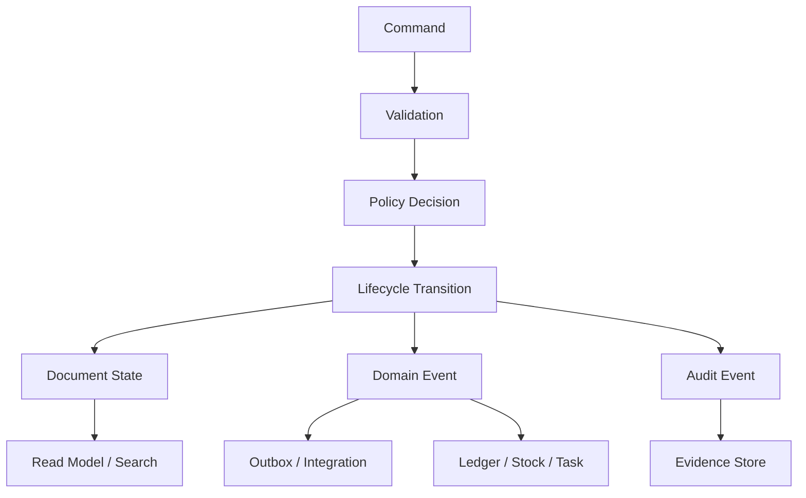
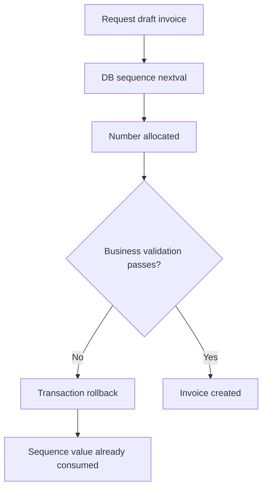
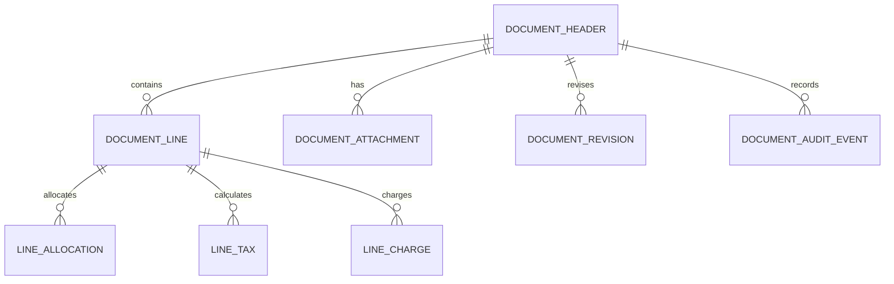
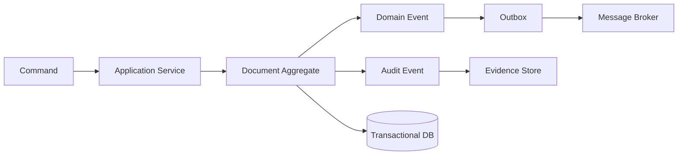
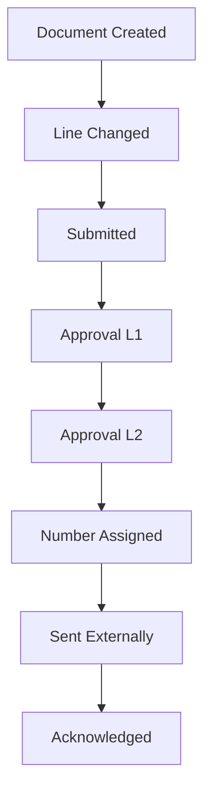
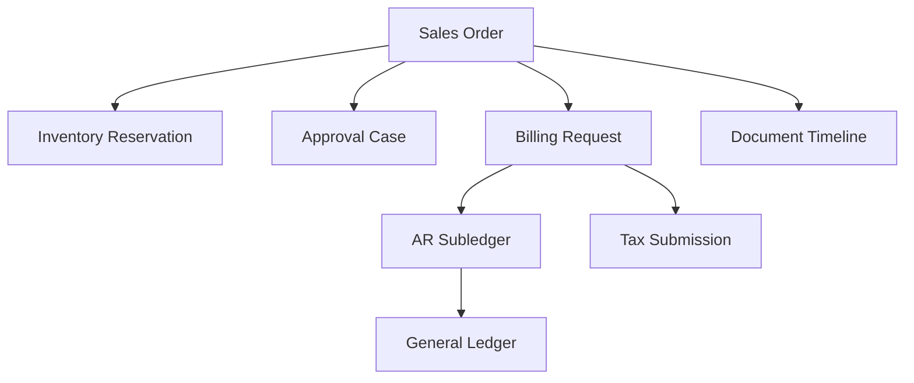

# Part 019 — ERP Document Model, Numbering, and Audit Trail

## 1. Target Skill Part Ini

ERP besar bukan hanya menyimpan data. ERP menyimpan **dokumen bisnis yang bisa dipertanggungjawabkan**: purchase order, invoice, goods receipt, stock adjustment, journal, payment, sales order, shipment, work order, service order, contract, tax document, dan approval case.

> **Skill inti part ini:** mampu mendesain document model ERP yang membedakan technical identity, business identity, legal numbering, lifecycle revision, audit evidence, dan immutable history tanpa mengorbankan performa operasional.

Bug ERP yang terlihat kecil sering berakar dari document model yang lemah:

- nomor invoice dobel;
- nomor dokumen hilang karena rollback;
- dokumen posted masih bisa diedit diam-diam;
- audit trail hanya berupa `updated_by` dan `updated_at`;
- approval berubah tanpa jejak;
- attachment diganti tanpa hash;
- document line berubah tapi total finansial tidak direkalkulasi;
- reversal menghapus transaksi lama, bukan membuat transaksi kompensasi;
- legal sequence dicampur dengan surrogate primary key;
- audit log tidak bisa menjawab “siapa melakukan apa, kapan, atas dasar rule apa, dari mana, dan mengubah apa”.

Dalam ERP skala besar, document model adalah **evidence architecture**.

---

## 2. Kaufman Deconstruction: Memecah Skill Document Model ERP

| Sub-skill | Pertanyaan Engineering | Output yang Diharapkan |
|---|---|---|
| Document taxonomy | Jenis dokumen apa yang sedang dimodelkan? | transaction/master/accounting/operational/integration document catalog |
| Identity model | Apa beda technical ID, business key, legal number, external reference? | identity policy |
| Numbering | Kapan nomor dibuat, oleh siapa, dalam scope apa, boleh gap atau tidak? | numbering strategy |
| Header-line structure | Apa yang berada di header, line, allocation, charge, tax, schedule? | aggregate model |
| Lifecycle coupling | State apa yang membuat dokumen mutable, frozen, posted, reversed, cancelled? | lifecycle matrix |
| Revisioning | Perubahan mana yang membuat revision baru? | revision policy |
| Audit trail | Bukti apa yang harus disimpan untuk tiap command/transition? | audit event schema |
| Legal evidence | Dokumen apa yang harus immutable dan bisa dibuktikan? | evidence chain |
| Attachment | Bagaimana file, hash, scan, signed document, dan OCR result dikelola? | document attachment model |
| Search/read model | Bagaimana dokumen dicari tanpa membebani transactional core? | operational read model |
| Retention | Berapa lama bukti disimpan dan siapa boleh mengakses? | retention policy |
| Failure modelling | Bagaimana menangani duplicate number, missing audit, tampered evidence? | rescue playbook |

Kaufman menekankan memecah skill menjadi komponen kecil. Untuk ERP document model, komponen terpenting adalah **identity, numbering, immutability, auditability, dan lifecycle correctness**.

---

## 3. Mental Model: ERP Document = Business Fact + Lifecycle + Evidence

Jangan memandang dokumen ERP sebagai tabel CRUD.

Dokumen ERP adalah kombinasi dari lima hal:

1. **Business intent** — apa yang ingin dilakukan, misalnya membeli barang, menjual barang, membayar vendor, menyesuaikan stok.
2. **Business fact** — apa yang sudah terjadi dan tidak boleh dihapus begitu saja, misalnya goods received, invoice issued, payment settled.
3. **Lifecycle state** — dokumen berada di draft, submitted, approved, posted, cancelled, reversed, closed, atau archived.
4. **Financial/operational effects** — efek ke ledger, stock, budget, reservation, tax, AR/AP, WIP, asset.
5. **Evidence** — bukti command, approval, validation, calculation, external reference, attachment, dan audit log.



Prinsipnya sederhana:

> **ERP document boleh mudah dibaca, tetapi tidak boleh mudah dimanipulasi.**

---

## 4. Taxonomy Dokumen ERP

Sebelum membuat model, klasifikasikan dulu dokumen.

| Kategori | Contoh | Mutable? | Legal/Audit Sensitivity | Efek Utama |
|---|---|---:|---:|---|
| Master data document | customer, vendor, item, asset master | controlled mutable | medium/high | eligibility, reference, rules |
| Transaction document | PO, SO, invoice, receipt, payment | mutable sampai frozen/posted | high | financial/operational movement |
| Accounting document | journal, posting document, adjustment | mostly immutable after posting | very high | ledger balance |
| Stock document | goods receipt, issue, transfer, count | immutable after posting | high | stock ledger |
| Workflow document | approval case, exception case | stateful mutable | high | decision trail |
| Integration document | inbound EDI, bank statement, tax response | append-mostly | high | reconciliation |
| Reporting document | financial statement snapshot, close report | immutable snapshot | high | evidence/report |
| Configuration document | price rule, tax rule, approval matrix | effective-dated mutable | high | runtime behavior |

Kesalahan umum adalah memakai satu pola untuk semua dokumen. Master data bisa direvisi secara controlled. Accounting document setelah posting biasanya harus immutable dan dikoreksi lewat reversal/adjustment.

---

## 5. Technical ID, Business ID, Legal Number, dan External Reference

Empat konsep ini harus dipisah.

| Identity | Fungsi | Contoh | Boleh berubah? | Dipakai untuk apa? |
|---|---|---|---:|---|
| Technical ID | primary key internal | UUID/ULID/snowflake/sequence ID | tidak | foreign key, join, internal trace |
| Business ID | identifier bisnis non-legal | `PO-REQ-2026-00012` | jarang | pencarian internal, user display |
| Legal number | nomor resmi/legal/fiskal | invoice tax number, posted journal number | tidak setelah issued | audit, pajak, legal evidence |
| External reference | nomor dari pihak luar | vendor invoice number, bank ref, EDI control number | sesuai sumber | reconciliation, duplicate detection |

Contoh model yang salah:

```java
@Entity
class Invoice {
    @Id
    @GeneratedValue
    private Long id;

    // Dipakai sekaligus sebagai ID internal, nomor invoice, dan nomor legal.
    private String number;
}
```

Masalahnya:

- `id` mungkin punya gap;
- `number` tidak jelas scope-nya;
- legal number mungkin baru boleh dibuat saat invoice issued/posting;
- external reference vendor invoice tidak sama dengan invoice number internal;
- business display number mungkin boleh ada sejak draft, legal number tidak.

Model yang lebih benar:

```java
public record DocumentIdentity(
        UUID documentId,
        String documentType,
        String draftNumber,
        String businessNumber,
        String legalNumber,
        String externalReference,
        String sourceSystemReference
) {}
```

Di database, pisahkan kolom dan unique constraint berdasarkan semantik.

```sql
create table erp_document_identity (
    document_id uuid primary key,
    document_type varchar(50) not null,
    tenant_id uuid not null,
    company_id uuid not null,
    draft_number varchar(80),
    business_number varchar(80),
    legal_number varchar(80),
    external_reference varchar(160),
    source_system varchar(80),
    source_reference varchar(160),
    created_at timestamptz not null,
    created_by uuid not null,
    unique (tenant_id, company_id, document_type, business_number),
    unique (tenant_id, company_id, document_type, legal_number),
    unique (tenant_id, source_system, source_reference)
);
```

Untuk banyak ERP, `legal_number` boleh `null` ketika draft dan baru wajib ketika dokumen melewati transition tertentu.

---

## 6. Prinsip Numbering ERP

Numbering bukan urusan kosmetik. Numbering adalah kontrak bisnis, operasional, legal, dan audit.

Sebelum memilih strategi, jawab pertanyaan ini:

1. **Scope** — nomor unik per tenant, company, branch, document type, fiscal year, tax office, warehouse, atau global?
2. **Timing** — dibuat saat draft, submission, approval, posting, issue, print, atau external acknowledgment?
3. **Gap policy** — boleh gap, gap harus dijelaskan, atau harus gapless?
4. **Concurrency** — berapa banyak dokumen dibuat paralel?
5. **Rollback semantics** — apa yang terjadi kalau transaksi gagal setelah nomor dialokasikan?
6. **Cancellation semantics** — nomor yang sudah issued boleh dibatalkan atau harus tetap tercatat sebagai void/cancelled?
7. **Regulatory semantics** — ada aturan lokal mengenai invoice/tax/legal sequence?
8. **Human usability** — nomor harus bisa dibaca user atau cukup opaque?
9. **Migration** — bagaimana melanjutkan sequence dari legacy ERP?
10. **Disaster recovery** — bagaimana mencegah duplicate number setelah restore/failover?

### 6.1 Jangan Samakan Database Sequence dengan Legal Number

Database sequence bagus untuk surrogate key atau nomor teknis yang **boleh gap**. Untuk legal document number, gap policy harus jelas.

PostgreSQL `CREATE SEQUENCE` membuat sequence number generator. Fungsi sequence seperti `nextval` dirancang untuk alokasi angka yang aman secara konkuren, tetapi sequence database umumnya bukan mekanisme gapless legal numbering karena nilai yang sudah diambil tidak otomatis kembali hanya karena transaksi bisnis rollback.



Untuk dokumen non-legal, gap biasanya tidak masalah. Untuk legal/fiscal number, gap harus memiliki evidence: voided, cancelled, failed issuance, atau never issued depending on local policy.

### 6.2 Draft Number vs Legal Number

Gunakan nomor berbeda untuk fase berbeda.

| Fase | Number Type | Karakteristik |
|---|---|---|
| Draft | draft number | boleh gap, boleh temporary, bukan legal evidence |
| Submitted/Approved | business number | stabil untuk tracking internal |
| Posted/Issued | legal number | immutable, auditable, controlled scope |
| External Sent | external transmission reference | dari channel EDI/tax/bank/customer |

Contoh:

```text
Draft invoice id      : DRAFT-INV-2026-000583
Business invoice no   : INV-WIP-2026-000212
Legal invoice number  : TAX-JKT-2026-000045
External tax response : DJP-ACK-992883001
```

Legal number sebaiknya dibuat sedekat mungkin dengan irreversible event: posting, issue, print official, tax submission, atau dispatch.

---

## 7. Numbering Scope Model

Numbering scope harus eksplisit.

```java
public record NumberingScope(
        UUID tenantId,
        UUID companyId,
        String documentType,
        String fiscalYear,
        String branchCode,
        String legalSeries,
        String jurisdictionCode
) {}
```

Contoh tabel policy:

```sql
create table document_numbering_policy (
    policy_id uuid primary key,
    tenant_id uuid not null,
    company_id uuid not null,
    document_type varchar(50) not null,
    branch_code varchar(40),
    fiscal_year varchar(10),
    legal_series varchar(40),
    jurisdiction_code varchar(40),
    prefix_template varchar(120) not null,
    padding integer not null default 6,
    gap_policy varchar(30) not null,
    allocation_timing varchar(30) not null,
    effective_from date not null,
    effective_to date,
    active boolean not null,
    unique (
        tenant_id,
        company_id,
        document_type,
        coalesce(branch_code, ''),
        coalesce(fiscal_year, ''),
        coalesce(legal_series, ''),
        coalesce(jurisdiction_code, ''),
        effective_from
    )
);
```

Catatan: beberapa database tidak mengizinkan expression langsung di unique constraint seperti contoh di atas tanpa index expression. Treat contoh sebagai design intent, bukan DDL final untuk semua RDBMS.

---

## 8. Gap-Tolerant Numbering Pattern

Untuk dokumen internal non-legal:

```java
@Service
public class BusinessNumberService {

    private final JdbcTemplate jdbcTemplate;

    public String nextPurchaseOrderNumber(UUID companyId, Year year) {
        Long value = jdbcTemplate.queryForObject(
                "select nextval('po_business_number_seq')",
                Long.class
        );
        return "PO-" + year + "-" + String.format("%06d", value);
    }
}
```

Kelebihan:

- cepat;
- aman secara konkuren;
- sederhana;
- cocok untuk high-volume draft/business references.

Kekurangan:

- gap mungkin terjadi;
- sulit memenuhi aturan gapless legal;
- tidak cukup untuk scope kompleks seperti company/year/branch/legal series.

Gunakan untuk:

- internal draft number;
- temporary import batch;
- technical document display;
- non-fiscal reference;
- workflow case number yang tidak harus gapless.

---

## 9. Controlled Legal Numbering Pattern

Untuk legal number, gunakan **numbering ledger** atau **number allocation table** yang menyimpan evidence alokasi.

```sql
create table legal_number_sequence (
    sequence_id uuid primary key,
    tenant_id uuid not null,
    company_id uuid not null,
    document_type varchar(50) not null,
    fiscal_year varchar(10) not null,
    legal_series varchar(40) not null,
    current_value bigint not null,
    version bigint not null,
    unique (tenant_id, company_id, document_type, fiscal_year, legal_series)
);

create table legal_number_allocation (
    allocation_id uuid primary key,
    sequence_id uuid not null references legal_number_sequence(sequence_id),
    allocated_number varchar(100) not null,
    allocated_value bigint not null,
    document_id uuid,
    status varchar(30) not null,
    reason_code varchar(80),
    allocated_at timestamptz not null,
    allocated_by uuid not null,
    correlation_id varchar(120) not null,
    unique (sequence_id, allocated_value),
    unique (sequence_id, allocated_number)
);
```

Legal number allocation state:

| State | Makna |
|---|---|
| RESERVED | number reserved but not yet issued |
| ISSUED | number attached to legal document |
| VOIDED | number intentionally voided with reason |
| CANCELLED | issued document cancelled under legal policy |
| MIGRATED | number imported from legacy system |

### 9.1 Single-Scope Locking

```java
@Transactional
public LegalNumber allocateLegalNumber(AllocateLegalNumberCommand command) {
    LegalNumberSequence sequence = repository.findForUpdate(command.scope())
            .orElseThrow(() -> new MissingNumberingPolicyException(command.scope()));

    long next = sequence.currentValue() + 1;
    String formatted = formatter.format(sequence.scope(), next);

    LegalNumberAllocation allocation = LegalNumberAllocation.reserved(
            UUID.randomUUID(),
            sequence.id(),
            formatted,
            next,
            command.actorId(),
            command.correlationId()
    );

    sequence.advanceTo(next);
    repository.save(sequence);
    allocationRepository.save(allocation);

    audit.record(AuditEvent.legalNumberReserved(
            command.actorId(),
            command.scope(),
            formatted,
            command.correlationId()
    ));

    return new LegalNumber(formatted);
}
```

`findForUpdate` mengunci satu scope numbering, bukan seluruh sistem. Ini penting agar invoice branch A tidak memblok branch B bila legal policy memang scope-nya berbeda.

### 9.2 Attach Number Saat Irreversible Transition

```java
@Transactional
public void issueInvoice(IssueInvoiceCommand command) {
    Invoice invoice = invoiceRepository.findByIdForUpdate(command.invoiceId())
            .orElseThrow();

    invoice.assertCanBeIssued(command.actorId());

    LegalNumber legalNumber = legalNumberService.allocateLegalNumber(
            AllocateLegalNumberCommand.forInvoice(invoice, command.actorId(), command.correlationId())
    );

    invoice.issue(legalNumber, command.issuedAt());

    invoiceRepository.save(invoice);

    audit.record(AuditEvent.invoiceIssued(
            command.actorId(),
            invoice.id(),
            legalNumber.value(),
            command.correlationId()
    ));
}
```

Number allocation dan issue transition berada dalam satu transaction boundary bila policy mengharuskan atomic. Jika external tax authority terlibat, desainnya perlu state seperti `PENDING_EXTERNAL_ISSUANCE`, `ISSUED`, `ISSUANCE_FAILED`, dan reconciliation.

---

## 10. Document Header-Line Model

Banyak dokumen ERP memiliki pola header-line, tetapi jangan berhenti di situ.



### 10.1 Header

Header menyimpan konteks global:

- tenant/company/branch;
- document type;
- lifecycle state;
- business date;
- accounting date;
- fiscal period;
- counterparty;
- currency;
- exchange rate policy;
- payment/fulfillment terms;
- approval status;
- legal number;
- total snapshot;
- version.

### 10.2 Line

Line menyimpan item/service/account intent:

- item/service/account;
- quantity;
- UOM;
- unit price;
- discount;
- tax category;
- warehouse/location;
- cost center/project/asset reference;
- delivery schedule;
- linked source line;
- status per line.

### 10.3 Allocation

Allocation memecah line ke target:

- cost center split;
- project task split;
- inventory batch split;
- budget split;
- revenue recognition schedule;
- tax jurisdiction split.

### 10.4 Charges and Tax

Charges dan tax sebaiknya tidak disembunyikan sebagai angka total saja. Simpan breakdown agar bisa direkalkulasi dan diaudit.

```java
public record DocumentTotal(
        Money subtotal,
        Money discountTotal,
        Money chargeTotal,
        Money taxableAmount,
        Money taxTotal,
        Money roundingAdjustment,
        Money grandTotal
) {}
```

---

## 11. Mutable Draft, Frozen Approval, Immutable Posting

Dokumen ERP harus punya aturan mutability eksplisit.

| Lifecycle | Boleh edit? | Perlu revision? | Efek ledger? | Catatan |
|---|---:|---:|---:|---|
| DRAFT | ya | belum tentu | tidak | belum menjadi fact |
| SUBMITTED | terbatas | ya untuk perubahan material | tidak | approval sedang berjalan |
| APPROVED | tidak/terbatas | ya | belum tentu | approval snapshot harus dijaga |
| POSTED/ISSUED | tidak | perubahan via reversal/adjustment | ya | business fact sudah terjadi |
| CANCELLED | tidak | tidak | mungkin reversal | terminal/cancel evidence |
| REVERSED | tidak | tidak | compensating effect | original tetap ada |
| CLOSED | tidak | tidak | tidak/settled | lifecycle selesai |

Rule utama:

> **Jangan update dokumen posted untuk “memperbaiki” masa lalu. Buat dokumen koreksi, reversal, adjustment, atau amendment.**

---

## 12. Revisioning Policy

Revision bukan sekadar `updated_at`.

Revision dipakai saat perubahan material harus memiliki sejarah.

```sql
create table document_revision (
    revision_id uuid primary key,
    document_id uuid not null,
    revision_no integer not null,
    lifecycle_state varchar(40) not null,
    change_reason varchar(120) not null,
    changed_by uuid not null,
    changed_at timestamptz not null,
    source_command_id uuid not null,
    snapshot_hash varchar(128) not null,
    unique (document_id, revision_no)
);
```

Kapan revision baru diperlukan?

| Perubahan | Revision Baru? | Alasan |
|---|---:|---|
| edit typo di draft description | opsional | tidak material |
| tambah line PO | ya | memengaruhi komitmen pembelian |
| ubah vendor invoice amount | ya | memengaruhi AP/approval |
| ubah cost center | ya | memengaruhi accounting/budget |
| ganti attachment kontrak | ya | evidence berubah |
| ubah comment internal | tidak selalu | tergantung policy |
| koreksi posted invoice | bukan revision biasa | harus credit note/reversal/adjustment |

### 12.1 Snapshot Hash

Hash membantu mendeteksi perubahan diam-diam.

```java
public String documentSnapshotHash(DocumentSnapshot snapshot) {
    String canonicalJson = canonicalJsonSerializer.serialize(snapshot);
    return sha256(canonicalJson);
}
```

Hash bukan pengganti security, tetapi memberi bukti integritas. Untuk dokumen legal tinggi, gunakan strategi tambahan seperti append-only storage, signed PDF, immutable object storage, atau WORM policy sesuai kebutuhan organisasi.

---

## 13. Audit Trail: Bukan Sekadar Log

Audit trail ERP harus menjawab enam pertanyaan:

1. **Who** — siapa actor-nya, termasuk delegated actor/service account.
2. **Did what** — command/action apa yang dilakukan.
3. **To what** — dokumen/entity apa yang terdampak.
4. **When** — kapan menurut server time dan business effective date.
5. **Why** — reason code, approval note, policy decision.
6. **With what effect** — perubahan state, field diff, ledger event, outbox event, external call.

OWASP Logging Cheat Sheet menekankan pentingnya logging security-relevant events, dan OWASP Top 10 A09 menyarankan audit trail dengan integrity control untuk transaksi bernilai tinggi. Dalam ERP, konsep ini melebar dari security ke business evidence.

### 13.1 Audit Event Schema

```sql
create table audit_event (
    audit_event_id uuid primary key,
    tenant_id uuid not null,
    company_id uuid,
    actor_id uuid,
    actor_type varchar(40) not null,
    delegated_by uuid,
    action varchar(100) not null,
    subject_type varchar(80) not null,
    subject_id uuid not null,
    document_type varchar(80),
    document_number varchar(120),
    lifecycle_from varchar(40),
    lifecycle_to varchar(40),
    command_id uuid not null,
    correlation_id varchar(120) not null,
    causation_id varchar(120),
    reason_code varchar(120),
    ip_address inet,
    user_agent text,
    decision_snapshot jsonb,
    change_summary jsonb,
    field_diff jsonb,
    evidence_hash varchar(128),
    occurred_at timestamptz not null,
    recorded_at timestamptz not null,
    previous_audit_hash varchar(128),
    audit_hash varchar(128) not null
);
```

### 13.2 Audit Hash Chain

Untuk event bernilai tinggi, audit dapat di-chain.

```java
public AuditHash computeAuditHash(AuditEvent event, String previousHash) {
    String canonical = canonicalJsonSerializer.serialize(new AuditHashInput(
            previousHash,
            event.tenantId(),
            event.subjectType(),
            event.subjectId(),
            event.action(),
            event.fieldDiff(),
            event.occurredAt(),
            event.commandId(),
            event.correlationId()
    ));
    return AuditHash.sha256(canonical);
}
```

Hash chain membantu mendeteksi penghapusan/perubahan audit event. Namun, ia harus didukung kontrol operasional:

- append-only permission;
- DB role terpisah;
- audit table tidak boleh diupdate oleh application role biasa;
- export audit berkala ke storage immutable;
- alert bila ada gap/hash mismatch;
- backup dan retention policy.

---

## 14. Command, Audit, Domain Event, dan Outbox

Jangan campur semua konsep menjadi satu tabel.

| Artefact | Tujuan | Audience | Contoh |
|---|---|---|---|
| Command | intent dari actor/system | application service | `ApprovePurchaseOrder` |
| Audit event | evidence action dan decision | auditor/support/compliance | `PO_APPROVED` |
| Domain event | fakta domain untuk downstream | internal systems | `PurchaseOrderApproved` |
| Outbox message | durable integration intent | messaging infra | event serialized for Kafka/SQS/etc |
| Read model | query/search/reporting | user/support/report | document search projection |



Dalam satu transaction boundary, minimal simpan:

- perubahan document aggregate;
- audit event;
- domain event/outbox entry bila ada side effect async.

---

## 15. Document Aggregate Design di Java

Contoh aggregate PO yang menjaga mutability:

```java
public class PurchaseOrderDocument {

    private final UUID id;
    private DocumentStatus status;
    private long version;
    private BusinessNumber businessNumber;
    private LegalNumber legalNumber;
    private List<PurchaseOrderLine> lines;
    private Money total;
    private ApprovalSnapshot approvalSnapshot;

    public void changeLineQuantity(ChangeLineQuantityCommand command) {
        requireStatus(DocumentStatus.DRAFT, DocumentStatus.RETURNED_FOR_REVISION);
        requirePositive(command.newQuantity());

        PurchaseOrderLine line = findLine(command.lineId());
        line.changeQuantity(command.newQuantity());

        this.total = recalculateTotal();
        this.version++;

        registerEvent(new PurchaseOrderLineChanged(
                id,
                command.lineId(),
                command.actorId(),
                command.correlationId()
        ));
    }

    public void approve(ApprovePurchaseOrderCommand command, ApprovalSnapshot snapshot) {
        requireStatus(DocumentStatus.SUBMITTED);
        requireSnapshotMatchesCurrentDocument(snapshot);

        this.status = DocumentStatus.APPROVED;
        this.approvalSnapshot = snapshot;
        this.version++;

        registerEvent(new PurchaseOrderApproved(id, command.actorId(), command.correlationId()));
    }

    public void post(PostPurchaseOrderCommand command, LegalNumber number) {
        requireStatus(DocumentStatus.APPROVED);
        requireLegalNumberNotAssigned();

        this.legalNumber = number;
        this.status = DocumentStatus.POSTED;
        this.version++;

        registerEvent(new PurchaseOrderPosted(id, number.value(), command.correlationId()));
    }
}
```

Yang penting bukan syntax-nya, tetapi guardrail:

- aggregate menolak update saat state salah;
- approval snapshot divalidasi;
- legal number hanya dipasang sekali;
- event membawa correlation ID;
- perubahan total dilakukan dari line, bukan manual override sembarangan.

---

## 16. Field Diff: Simpan Dengan Semantik, Bukan Dump Sembarangan

Audit diff bisa terlalu miskin atau terlalu kaya.

Terlalu miskin:

```json
{"changed": true}
```

Terlalu berbahaya:

```json
{"fullPayloadIncludingPasswordOrSecret": "..."}
```

Lebih baik:

```json
{
  "fields": [
    {
      "path": "/lines/3/quantity",
      "oldValue": "10 EA",
      "newValue": "12 EA",
      "classification": "BUSINESS_MATERIAL"
    },
    {
      "path": "/total/grandTotal",
      "oldValue": "1000000.00 IDR",
      "newValue": "1200000.00 IDR",
      "classification": "FINANCIAL_MATERIAL"
    }
  ]
}
```

Rules:

- mask sensitive data;
- avoid storing secrets;
- classify material vs non-material changes;
- include domain unit, currency, and precision;
- include reason code for material changes;
- avoid relying only on localized display strings.

---

## 17. Attachment dan Evidence File

Attachment ERP bukan file upload biasa.

Contoh attachment:

- signed contract;
- vendor invoice PDF;
- tax invoice;
- goods receipt photo;
- customs document;
- bank proof;
- inspection certificate;
- approval memo;
- generated official invoice PDF.

Model:

```sql
create table document_attachment (
    attachment_id uuid primary key,
    document_id uuid not null,
    attachment_type varchar(80) not null,
    file_name varchar(255) not null,
    media_type varchar(120) not null,
    storage_uri text not null,
    content_hash varchar(128) not null,
    file_size bigint not null,
    uploaded_by uuid not null,
    uploaded_at timestamptz not null,
    lifecycle_state varchar(40) not null,
    replaced_by uuid,
    legal_evidence boolean not null default false,
    retention_class varchar(80) not null
);
```

Rules:

- jangan replace file legal evidence secara destructive;
- upload baru harus membuat attachment version baru;
- simpan hash konten;
- simpan metadata scanner/OCR jika diperlukan;
- simpan link ke document revision;
- audit download/export untuk dokumen sensitif;
- enforce access berdasarkan document scope dan attachment classification.

---

## 18. Document Search dan Operational Read Model

ERP user membutuhkan pencarian cepat:

- nomor dokumen;
- vendor/customer;
- date range;
- amount range;
- status;
- requester/approver;
- project/cost center;
- external reference;
- failed integration;
- exception reason.

Jangan paksa semua search masuk ke aggregate table.

```sql
create table document_search_index (
    document_id uuid primary key,
    tenant_id uuid not null,
    company_id uuid not null,
    document_type varchar(80) not null,
    document_number varchar(120),
    legal_number varchar(120),
    external_reference varchar(160),
    counterparty_id uuid,
    counterparty_name text,
    status varchar(40) not null,
    business_date date,
    accounting_date date,
    currency varchar(3),
    grand_total numeric(19, 4),
    requester_id uuid,
    current_approver_id uuid,
    project_id uuid,
    cost_center_id uuid,
    exception_code varchar(80),
    updated_at timestamptz not null
);
```

Read model boleh denormalized. Source of truth tetap aggregate/ledger/audit.

---

## 19. Document Event Timeline

Untuk support dan audit, sediakan timeline.

```text
2026-07-01 09:01  Created draft PO               by Rina
2026-07-01 09:14  Added 3 lines                  by Rina
2026-07-01 09:18  Submitted for approval         by Rina
2026-07-01 10:33  Approved level 1               by Budi
2026-07-01 11:02  Approved level 2               by Sari
2026-07-01 11:05  Business number assigned       PO-2026-000884
2026-07-01 11:07  Sent to vendor                 via EDI
2026-07-01 11:08  Vendor acknowledged            external ref ACK-7781
```

Timeline berasal dari event, bukan ditulis manual.



---

## 20. Idempotency untuk Document Command

ERP sering menerima command yang sama berkali-kali:

- user double click;
- mobile retry;
- message redelivery;
- external integration resend;
- batch job rerun;
- browser timeout padahal server berhasil.

Gunakan command ID atau idempotency key.

```sql
create table idempotency_record (
    idempotency_key varchar(160) primary key,
    tenant_id uuid not null,
    command_type varchar(100) not null,
    command_hash varchar(128) not null,
    result_reference varchar(160),
    status varchar(30) not null,
    created_at timestamptz not null,
    completed_at timestamptz
);
```

Service pattern:

```java
@Transactional
public IssueInvoiceResult issueInvoice(IssueInvoiceCommand command) {
    IdempotencyRecord record = idempotency.startOrReturnExisting(
            command.idempotencyKey(),
            command.commandHash()
    );

    if (record.isCompleted()) {
        return resultRepository.find(record.resultReference());
    }

    IssueInvoiceResult result = doIssueInvoice(command);
    idempotency.complete(command.idempotencyKey(), result.invoiceId().toString());
    return result;
}
```

Idempotency bukan optional untuk document commands yang menghasilkan nomor, ledger, stock movement, payment, atau external transmission.

---

## 21. Cancel, Void, Delete, Reverse, Amend

Gunakan istilah lifecycle secara presisi.

| Action | Kapan Dipakai | Efek |
|---|---|---|
| Delete | draft belum berarti bisnis | hapus/soft delete draft |
| Cancel | dokumen belum punya efek irreversible atau policy mengizinkan cancel | state terminal, evidence tetap ada |
| Void | nomor/legal artefact sudah dialokasikan tetapi tidak digunakan | nomor tetap tercatat sebagai void |
| Reverse | efek sudah posted dan perlu kompensasi | create opposite entry/movement |
| Amend | dokumen legal/kontrak berubah dengan versi baru | create amendment/revision legal |
| Close | proses selesai tanpa koreksi | terminal state |

Anti-pattern:

```sql
delete from invoice where invoice_id = 'posted-invoice-id';
```

Untuk posted document, delete hampir selalu salah. Bahkan bila data privacy meminta penghapusan personal data, biasanya business record harus dipseudonymize/redact sesuai policy, bukan menghancurkan ledger evidence sembarangan.

---

## 22. Document Model untuk Distributed ERP

Dalam ERP terdistribusi, dokumen bisa dipecah ke beberapa service:

- order service;
- inventory service;
- billing service;
- accounting service;
- workflow service;
- document/evidence service;
- integration service.

Masalahnya: user melihat satu dokumen, tetapi sistem memproses banyak fakta.



Guideline:

- setiap service punya own source of truth;
- document timeline menggabungkan event dengan correlation ID;
- jangan membuat satu distributed transaction raksasa;
- simpan source document reference pada downstream document;
- downstream effect harus idempotent;
- reconciliation harus bisa menampilkan status cross-service.

---

## 23. Regulatory Defensibility Lens

Untuk document model ERP, tanyakan:

1. Bisakah kita membuktikan dokumen ini dibuat oleh siapa?
2. Bisakah kita membuktikan rule approval yang berlaku saat itu?
3. Bisakah kita membuktikan dokumen tidak berubah setelah posting?
4. Bisakah kita membuktikan numbering sequence tidak dobel?
5. Bisakah kita menjelaskan gap nomor?
6. Bisakah kita menampilkan semua perubahan material?
7. Bisakah kita membedakan user action dan system action?
8. Bisakah kita menelusuri external reference ke source document?
9. Bisakah kita merekonstruksi total dokumen dari line/charge/tax?
10. Bisakah kita menunjukkan reversal tanpa menghapus original?

Jika jawabannya tidak, document model belum defensible.

---

## 24. Testing Strategy

### 24.1 Numbering Test

```java
@Test
void legalNumberIsUniqueUnderConcurrency() throws Exception {
    int workers = 50;
    ExecutorService executor = Executors.newFixedThreadPool(workers);

    Set<String> numbers = ConcurrentHashMap.newKeySet();

    List<Callable<Void>> tasks = IntStream.range(0, workers)
            .mapToObj(i -> (Callable<Void>) () -> {
                LegalNumber number = legalNumberService.allocateLegalNumber(scope);
                numbers.add(number.value());
                return null;
            })
            .toList();

    executor.invokeAll(tasks);

    assertThat(numbers).hasSize(workers);
}
```

### 24.2 Posted Document Immutability Test

```java
@Test
void postedInvoiceCannotBeEditedDirectly() {
    Invoice invoice = postedInvoiceFixture();

    assertThatThrownBy(() -> invoice.changeLineAmount(lineId, Money.of("IDR", 1000)))
            .isInstanceOf(IllegalDocumentTransitionException.class);
}
```

### 24.3 Audit Completeness Test

```java
@Test
void approveCommandCreatesAuditEventWithDecisionSnapshot() {
    approvePurchaseOrder(poId, approverId);

    AuditEvent event = auditRepository.findLatest(poId);

    assertThat(event.action()).isEqualTo("PURCHASE_ORDER_APPROVED");
    assertThat(event.actorId()).isEqualTo(approverId);
    assertThat(event.decisionSnapshot()).containsKey("approvalMatrixVersion");
    assertThat(event.correlationId()).isNotBlank();
}
```

### 24.4 Snapshot Hash Test

```java
@Test
void documentRevisionHashChangesWhenMaterialFieldChanges() {
    DocumentSnapshot before = snapshotOf(po);
    po.changeCostCenter(newCostCenter);
    DocumentSnapshot after = snapshotOf(po);

    assertThat(hash(before)).isNotEqualTo(hash(after));
}
```

---

## 25. Observability untuk Document Platform

Metrics penting:

- legal number allocation latency;
- numbering lock wait time;
- duplicate number violation count;
- failed legal issuance count;
- document transition failure count;
- audit event write failure count;
- outbox lag per document type;
- document search projection lag;
- attachment upload failure count;
- audit hash mismatch count;
- stuck documents per lifecycle state.

Logs harus memuat:

- `tenantId`;
- `companyId`;
- `documentType`;
- `documentId`;
- `businessNumber`;
- `legalNumber` jika ada;
- `commandId`;
- `correlationId`;
- `actorId` atau service account;
- failure reason.

Alert contoh:

```text
ALERT: Legal number allocation failed > 5 times in 10 minutes
Scope: company=ID01, documentType=TAX_INVOICE, fiscalYear=2026
Impact: invoice issuance may be blocked
Runbook: check numbering sequence lock, DB deadlock, policy active window, tax integration backlog
```

---

## 26. Common Failure Modes

| Failure Mode | Gejala | Akar Masalah | Perbaikan |
|---|---|---|---|
| Duplicate legal number | dua invoice punya nomor sama | scope/unique constraint salah | enforce unique constraint dan sequence scope |
| Missing audit | dokumen berubah tanpa event | audit afterthought | audit dalam transaction boundary |
| Posted mutation | angka historical berubah | no immutability guard | state-based mutation rule |
| Sequence gap panic | auditor menemukan nomor hilang | gap policy tidak jelas | allocation ledger + void evidence |
| Approval stale | dokumen berubah setelah approval | snapshot tidak dijaga | approval snapshot hash |
| Attachment replacement | bukti legal berubah | destructive file update | versioned attachment + content hash |
| Timeline inconsistent | support tidak bisa trace | no correlation ID | command/event correlation standard |
| Search stale | user melihat status lama | projection lag tanpa visibility | show projection timestamp + reconciliation |
| Reversal deletes original | audit hancur | correction model salah | compensating document |
| External duplicate | vendor invoice diproses dua kali | missing external ref uniqueness | idempotency + external reference key |

---

## 27. Design Review Checklist

Gunakan checklist ini saat review document model ERP.

### Identity

- [ ] Technical ID terpisah dari business/legal number.
- [ ] Legal number punya scope eksplisit.
- [ ] External reference disimpan dan punya uniqueness policy.
- [ ] Migration legacy number didukung.

### Numbering

- [ ] Timing allocation jelas.
- [ ] Gap policy jelas.
- [ ] Concurrency strategy diuji.
- [ ] Unique constraint ada di database.
- [ ] Void/cancel evidence tersedia.

### Lifecycle

- [ ] Draft/submitted/approved/posted/reversed/cancelled punya mutability rule.
- [ ] Posted document immutable.
- [ ] Reversal/amendment tidak menghapus original.
- [ ] Approval snapshot dilindungi dari stale change.

### Audit

- [ ] Setiap material command menghasilkan audit event.
- [ ] Audit event menyimpan actor/action/subject/time/reason/effect.
- [ ] Audit event ditulis dalam transaction boundary yang sama.
- [ ] Sensitive data dimasking.
- [ ] Audit evidence punya integrity control.

### Attachment

- [ ] Attachment legal tidak direplace destructive.
- [ ] Content hash disimpan.
- [ ] Download/export sensitif diaudit.
- [ ] Retention class jelas.

### Operations

- [ ] Ada metrics stuck document.
- [ ] Ada alert numbering failure.
- [ ] Ada reconciliation untuk projection lag.
- [ ] Ada runbook duplicate/missing number.

---

## 28. Latihan 20 Jam ala Kaufman

### Jam 1–3: Document Taxonomy

Ambil domain invoice dan PO. Buat taxonomy:

- source document;
- target document;
- legal document;
- supporting attachment;
- audit event;
- external reference.

Output: document catalog.

### Jam 4–6: Identity and Numbering

Desain numbering policy untuk:

- draft PO;
- business PO;
- tax invoice;
- payment voucher;
- stock adjustment.

Output: numbering scope matrix.

### Jam 7–9: Lifecycle and Mutability

Buat lifecycle matrix untuk invoice:

- draft;
- submitted;
- approved;
- issued;
- posted;
- paid;
- cancelled;
- reversed.

Output: legal transition table.

### Jam 10–12: Audit Schema

Buat audit event schema untuk:

- create;
- submit;
- approve;
- reject;
- issue;
- post;
- reverse;
- export.

Output: audit schema + sample JSON.

### Jam 13–15: Java Aggregate

Implement pseudo Java aggregate yang menolak update setelah posting.

Output: aggregate methods + tests.

### Jam 16–18: Failure Simulation

Simulasikan:

- double click issue invoice;
- DB rollback setelah sequence allocation;
- stale approval;
- duplicate external invoice.

Output: failure handling playbook.

### Jam 19–20: Design Review

Presentasikan desain ke imaginary auditor dan SRE.

Output: review checklist + risks.

---

## 29. Ringkasan

Document model ERP yang baik memiliki karakteristik berikut:

- memisahkan technical ID, business number, legal number, dan external reference;
- memakai numbering policy yang eksplisit per scope;
- tidak memakai database sequence secara naif untuk legal gap-sensitive numbering;
- membuat dokumen posted immutable;
- membedakan delete, cancel, void, reverse, amend, dan close;
- menyimpan audit event sebagai evidence, bukan sekadar debug log;
- menghubungkan command, policy decision, domain event, outbox, dan document timeline;
- menjaga attachment legal dengan content hash dan versioning;
- menyediakan read model/search tanpa mengorbankan source of truth;
- punya failure playbook untuk duplicate number, missing audit, stale approval, dan tampered evidence.

> Dalam ERP skala besar, dokumen bukan row database. Dokumen adalah kontrak bisnis yang harus bisa dibaca user, dijalankan sistem, dan dipertahankan di depan auditor.

---

## 30. Source Notes

- Jakarta Persistence 3.2 mendefinisikan standar persistence dan object/relational mapping untuk Java/Jakarta EE, relevan sebagai baseline mapping document aggregate dan audit tables.
- PostgreSQL documentation menjelaskan `CREATE SEQUENCE` sebagai sequence number generator; sequence cocok untuk banyak technical numbering tetapi perlu desain tambahan untuk legal/gap-sensitive numbering.
- OWASP Logging Cheat Sheet dan OWASP Top 10 A09 memberikan guidance untuk logging/audit trail dan integrity controls pada high-value transactions.
- Java `ServiceLoader` akan dipakai di Part 020 sebagai salah satu mekanisme SPI untuk extensible Java applications.

