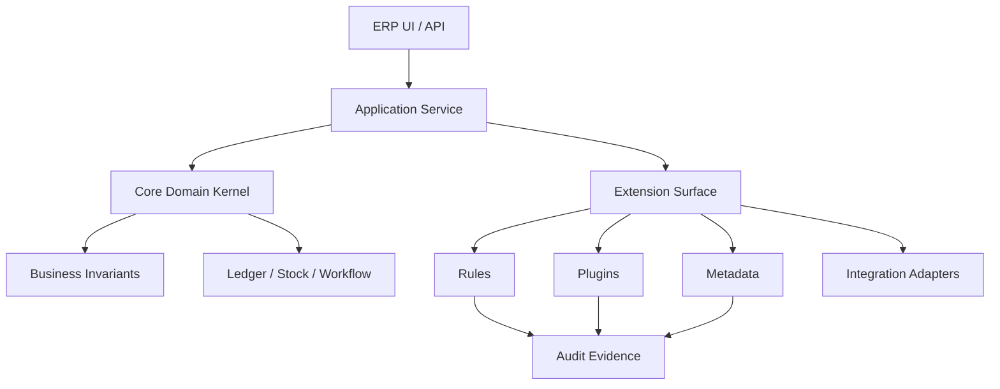
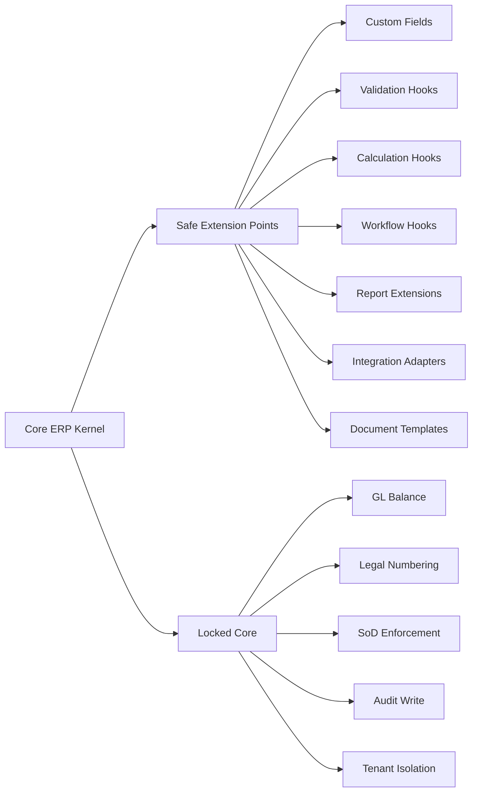
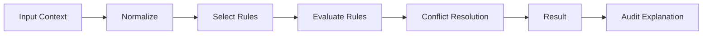
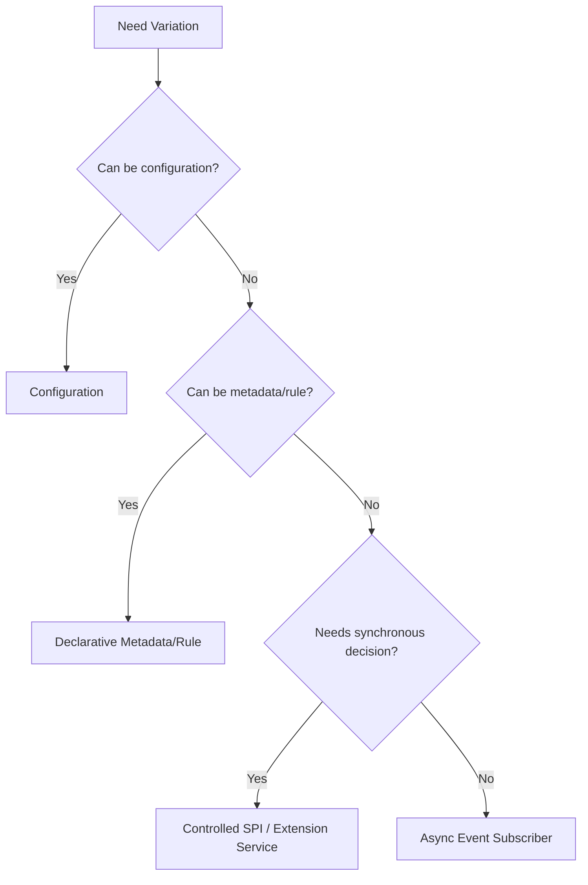
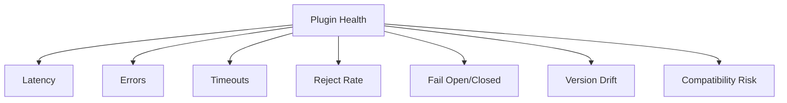
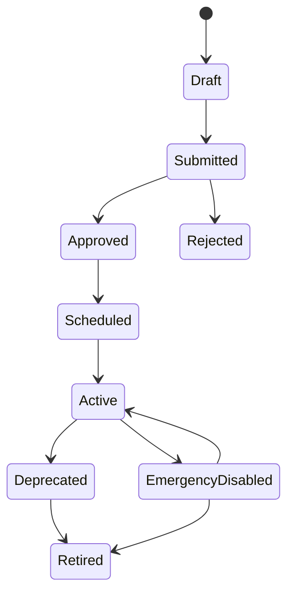
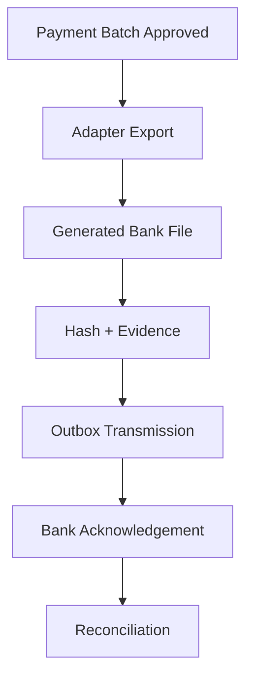

# Part 020 — Extension, Customization, and Plugin Architecture

## 1. Target Skill Part Ini

ERP besar harus bisa berubah. Setiap perusahaan punya variasi: approval, tax, pricing, document layout, custom field, reporting, integration, segregation of duties, product attribute, warehouse process, manufacturing policy, project coding, dan local compliance.

Masalahnya: customization yang tidak dikontrol akan menghancurkan ERP.

> **Skill inti part ini:** mampu mendesain extension architecture untuk Java ERP yang memberi fleksibilitas bisnis tanpa membiarkan custom logic merusak core invariant, auditability, performance, security, dan upgrade path.

Target kita bukan membuat “plugin demi plugin”. Targetnya adalah membuat **platform ERP yang aman untuk diperluas**.

Kesalahan umum:

- setiap customer punya branch code berbeda;
- custom SQL langsung update tabel core;
- plugin bisa bypass approval dan ledger invariant;
- custom field tidak punya owner, type, validation, atau lifecycle;
- script runtime bebas akses database;
- upgrade gagal karena custom code menempel ke internal class;
- extension order tidak deterministik;
- report custom membaca OLTP besar dan membuat sistem lambat;
- rule lama berubah tanpa effective dating;
- tidak ada audit untuk hasil rule/customization.

ERP top-tier tidak hanya punya fitur. Ia punya **extension governance**.

---

## 2. Kaufman Deconstruction: Memecah Skill Extensibility ERP

| Sub-skill | Pertanyaan Engineering | Output |
|---|---|---|
| Extension taxonomy | Variasi bisnis jenis apa yang harus didukung? | extension catalog |
| Boundary design | Bagian core mana yang boleh diperluas dan mana yang tidak? | extension boundary map |
| Contract design | Input/output hook apa yang stabil? | extension API/SPI |
| Metadata model | Custom field, form, validation, layout disimpan bagaimana? | metadata schema |
| Rule execution | Rule berjalan kapan, dengan context apa, dan deterministik tidak? | rule pipeline |
| Plugin lifecycle | Install, enable, disable, upgrade, rollback bagaimana? | plugin lifecycle model |
| Isolation | Plugin boleh akses resource apa? | sandbox/security policy |
| Versioning | Bagaimana menjaga upgrade compatibility? | semantic version policy |
| Observability | Bagaimana tahu plugin lambat/rusak? | plugin metrics/logging |
| Governance | Siapa boleh membuat/mengaktifkan customization? | approval and release process |
| Testing | Bagaimana custom code diuji terhadap invariant core? | plugin TCK/contract tests |
| Failure modelling | Apa yang terjadi jika extension timeout/error? | fallback policy |

Kaufman lens-nya jelas: pecah skill “customizable ERP” menjadi boundary, contract, lifecycle, isolation, governance, dan feedback loop.

---

## 3. Mental Model: Core ERP vs Extension Surface

Core ERP harus menjaga invariant. Extension hanya boleh masuk lewat permukaan yang terkontrol.



Prinsip utama:

> **Extension boleh menambah variasi, tetapi tidak boleh melemahkan invariant core.**

Contoh invariant yang tidak boleh ditembus plugin:

- journal harus balance;
- stock ledger movement harus traceable;
- legal number tidak boleh duplicate;
- approval SoD tidak boleh bypass;
- posted document tidak boleh diedit langsung;
- tenant data tidak boleh bocor;
- audit event material tidak boleh dilewati;
- tax/price calculation harus reproducible.

---

## 4. Extension Taxonomy

Tidak semua customization harus berbentuk plugin code.

| Tipe Extension | Contoh | Risiko | Preferensi |
|---|---|---:|---|
| Configuration | approval threshold, payment term | rendah | first choice |
| Metadata | custom field, screen layout | sedang | controlled schema |
| Rule | tax/pricing/validation rule | sedang/tinggi | versioned rule engine |
| Workflow | approval path, escalation | sedang/tinggi | declarative workflow |
| Report | custom financial report | sedang | read model / analytics layer |
| Template | invoice PDF, email template | sedang | sandboxed rendering |
| Integration adapter | bank, tax, EDI, WMS | tinggi | adapter SPI + outbox |
| Domain plugin | industry-specific behavior | tinggi | strict SPI + TCK |
| Script | quick local logic | sangat tinggi | restrict heavily |
| Direct DB customization | custom trigger/table update core | ekstrem | avoid |

Rule of thumb:

> **Mulai dari configuration. Naik ke metadata. Naik ke declarative rule. Baru gunakan plugin code jika variasi memang tidak bisa diekspresikan aman secara declarative.**

---

## 5. Extension Boundary Map

Tentukan boundary sebelum menulis plugin framework.



Locked core bukan berarti tidak bisa dikonfigurasi. Artinya core invariant tidak boleh diganti oleh arbitrary extension.

Contoh:

- plugin boleh menambahkan validation bahwa PO butuh attachment untuk kategori tertentu;
- plugin tidak boleh mengizinkan PO posted tanpa accounting event;
- plugin boleh menambahkan discount rule;
- plugin tidak boleh membuat total invoice tidak sama dengan sum line + charges + tax;
- plugin boleh menambahkan bank adapter;
- plugin tidak boleh menulis langsung ke payment status tanpa reconciliation event.

---

## 6. Extension Point Contract

Extension point harus punya contract jelas.

```java
public interface ExtensionPoint<I, O> {
    ExtensionPointId id();
    ExtensionPhase phase();
    ExtensionResult<O> execute(ExtensionContext context, I input);
}
```

Context minimal:

```java
public record ExtensionContext(
        UUID tenantId,
        UUID companyId,
        UUID actorId,
        String actorType,
        String documentType,
        UUID documentId,
        String lifecycleState,
        Instant businessTime,
        Instant systemTime,
        String correlationId,
        Map<String, Object> attributes
) {}
```

Extension result:

```java
public sealed interface ExtensionResult<T> permits Allow, Reject, Modify, Emit, Noop {
    List<AuditEvidence> evidence();
    Duration executionTime();
}

public record Reject<T>(
        String reasonCode,
        String message,
        List<AuditEvidence> evidence,
        Duration executionTime
) implements ExtensionResult<T> {}
```

Kontrak wajib menjawab:

- extension boleh reject atau hanya enrich?
- extension boleh modify payload atau hanya validate?
- hasilnya deterministic?
- error default-nya fail-open atau fail-closed?
- timeout berapa lama?
- apakah extension dipanggil dalam DB transaction?
- apakah extension boleh call external network?
- evidence apa yang harus disimpan?

---

## 7. Extension Phases

Extension harus dipasang pada phase yang tepat.

| Phase | Contoh Hook | Boleh Melakukan | Tidak Boleh Melakukan |
|---|---|---|---|
| PRE_VALIDATE | enrich context, normalize input | add derived fields | write ledger |
| VALIDATE | custom validation | reject command | mutate posted document |
| PRE_CALCULATE | choose pricing/tax policy | provide factors | allocate legal number |
| CALCULATE | discount/tax/charge calculation | return calculation component | update DB directly |
| PRE_TRANSITION | check approval/custom hold | reject transition | bypass core guard |
| POST_TRANSITION | emit integration event | enqueue outbox | undo transition silently |
| POST_COMMIT | notify external service | async side effect | assume rollback possible |
| READ_MODEL | enrich projection | add display fields | become source of truth |
| REPORT | custom aggregation | query analytics/read model | lock OLTP core table |

Kesalahan paling mahal: memanggil external plugin di dalam transaction yang memegang lock penting.

---

## 8. Java SPI dengan ServiceLoader

Java menyediakan mekanisme Service Provider Interface. `java.util.ServiceLoader` digunakan untuk menemukan dan memuat service providers yang tersedia di runtime environment.

Contoh SPI:

```java
public interface ErpExtensionProvider {
    String pluginId();
    String version();
    List<ExtensionPoint<?, ?>> extensionPoints();
}
```

Provider:

```java
public final class ManufacturingQualityPlugin implements ErpExtensionProvider {

    @Override
    public String pluginId() {
        return "manufacturing-quality-plugin";
    }

    @Override
    public String version() {
        return "1.4.0";
    }

    @Override
    public List<ExtensionPoint<?, ?>> extensionPoints() {
        return List.of(new RequireInspectionBeforeCompletionHook());
    }
}
```

Loader:

```java
public final class ExtensionRegistryBootstrap {

    public ExtensionRegistry load() {
        ServiceLoader<ErpExtensionProvider> loader = ServiceLoader.load(ErpExtensionProvider.class);
        ExtensionRegistry registry = new ExtensionRegistry();

        for (ErpExtensionProvider provider : loader) {
            registry.register(provider.pluginId(), provider.version(), provider.extensionPoints());
        }

        return registry;
    }
}
```

SPI cocok untuk:

- extension yang ikut deploy bersama aplikasi;
- controlled internal modules;
- adapter yang dikompilasi terhadap contract stabil;
- modular monolith dengan extension module.

SPI tidak otomatis memberi:

- runtime unload;
- tenant-level enablement;
- sandbox security;
- dependency isolation kompleks;
- plugin marketplace;
- resource quota.

Untuk kebutuhan itu, Anda perlu plugin runtime lebih lengkap atau menjalankan extension sebagai external service.

---

## 9. Plugin Registry

Registry harus menyimpan plugin metadata.

```sql
create table erp_plugin (
    plugin_id varchar(120) primary key,
    display_name varchar(200) not null,
    provider varchar(120) not null,
    version varchar(40) not null,
    api_version varchar(40) not null,
    status varchar(30) not null,
    installed_at timestamptz not null,
    installed_by uuid not null,
    checksum varchar(128),
    manifest jsonb not null
);

create table erp_plugin_enablement (
    enablement_id uuid primary key,
    plugin_id varchar(120) not null references erp_plugin(plugin_id),
    tenant_id uuid not null,
    company_id uuid,
    enabled boolean not null,
    effective_from timestamptz not null,
    effective_to timestamptz,
    config jsonb not null,
    approved_by uuid,
    approved_at timestamptz
);
```

Manifest contoh:

```json
{
  "pluginId": "bank-bca-payment-adapter",
  "version": "2.1.0",
  "apiVersion": "erp-extension-api-3.0",
  "extensionPoints": [
    {
      "id": "payment.file.export",
      "phase": "POST_TRANSITION",
      "failMode": "FAIL_CLOSED",
      "timeoutMs": 2000
    }
  ],
  "permissions": [
    "READ_PAYMENT_BATCH",
    "WRITE_OUTBOX_PAYMENT_FILE"
  ],
  "configSchema": {
    "type": "object",
    "required": ["bankCode", "accountNumber"]
  }
}
```

---

## 10. Custom Fields: Jangan Langsung Menambah Kolom Core

ERP butuh custom field. Tetapi custom field yang liar merusak schema, search, validation, dan upgrade.

### 10.1 Strategi Custom Field

| Strategi | Kelebihan | Kekurangan | Cocok Untuk |
|---|---|---|---|
| Physical column | cepat, type-safe | sulit upgrade, schema sprawl | core field yang sudah stabil |
| EAV table | fleksibel | query sulit, type lemah | low-volume metadata |
| JSON column | fleksibel, satu row | indexing/validation perlu hati-hati | medium flexibility |
| Side table per entity | cukup fleksibel, typed-ish | join tambahan | custom fields penting |
| Extension table per plugin | isolasi baik | governance kompleks | plugin heavy domain |
| Read model projection | query cepat | bukan source of truth | search/report |

### 10.2 Metadata Definition

```sql
create table custom_field_definition (
    field_id uuid primary key,
    tenant_id uuid not null,
    entity_type varchar(80) not null,
    field_key varchar(80) not null,
    label varchar(160) not null,
    data_type varchar(40) not null,
    required boolean not null default false,
    searchable boolean not null default false,
    pii_classification varchar(40) not null default 'NONE',
    validation_rule jsonb,
    effective_from timestamptz not null,
    effective_to timestamptz,
    created_by uuid not null,
    created_at timestamptz not null,
    unique (tenant_id, entity_type, field_key, effective_from)
);

create table custom_field_value (
    value_id uuid primary key,
    tenant_id uuid not null,
    entity_type varchar(80) not null,
    entity_id uuid not null,
    field_id uuid not null references custom_field_definition(field_id),
    string_value text,
    number_value numeric(30, 8),
    date_value date,
    boolean_value boolean,
    json_value jsonb,
    updated_by uuid not null,
    updated_at timestamptz not null,
    unique (tenant_id, entity_type, entity_id, field_id)
);
```

Rules:

- custom field definition harus versioned/effective-dated;
- type harus eksplisit;
- searchable field perlu projection/index policy;
- PII classification harus ada;
- custom field change harus audit;
- custom field tidak boleh menjadi hidden core invariant tanpa governance.

---

## 11. Metadata-Driven Forms

Metadata bisa mengontrol UI tanpa mengubah code.

```json
{
  "entityType": "PURCHASE_ORDER",
  "layoutVersion": "2026.07",
  "sections": [
    {
      "key": "commercial",
      "title": "Commercial",
      "fields": [
        {"key": "paymentTerm", "required": true},
        {"key": "incoterm", "required": false},
        {"key": "custom.importLicenseNo", "visibleWhen": "category == 'IMPORT'"}
      ]
    }
  ]
}
```

Tetapi metadata-driven UI bukan alasan untuk memindahkan seluruh domain logic ke JSON. UI metadata hanya mengatur capture/display. Domain invariant tetap di core/validated extension.

---

## 12. Rule Engine Pattern

Untuk pricing, tax, validation, dan approval, gunakan pipeline deterministik.



Rule result harus explainable.

```java
public record RuleEvaluationResult<T>(
        T value,
        String ruleSetId,
        String ruleSetVersion,
        List<String> matchedRules,
        List<String> skippedRules,
        Map<String, Object> explanation,
        List<AuditEvidence> evidence
) {}
```

Rule execution requirements:

- deterministic for same input and same rule version;
- no hidden external call unless declared;
- no direct DB mutation;
- bounded execution time;
- clear conflict resolution;
- effective date support;
- audit explanation stored on material output.

---

## 13. Hook Chain Ordering

Jika banyak extension aktif, ordering harus eksplisit.

```sql
create table extension_hook_registration (
    registration_id uuid primary key,
    plugin_id varchar(120) not null,
    extension_point varchar(120) not null,
    phase varchar(40) not null,
    priority integer not null,
    fail_mode varchar(30) not null,
    timeout_ms integer not null,
    enabled boolean not null,
    config jsonb not null
);
```

Execution chain:

```java
public <I, O> O executeChain(ExtensionPointId pointId, ExtensionContext context, I input, O baseResult) {
    List<RegisteredHook<I, O>> hooks = registry.findHooks(pointId, context).orderedByPriority();
    O current = baseResult;

    for (RegisteredHook<I, O> hook : hooks) {
        long start = clock.millis();
        try {
            ExtensionResult<O> result = timeoutExecutor.execute(
                    hook.timeout(),
                    () -> hook.execute(context, input, current)
            );
            current = applyResult(current, result);
            auditExtensionResult(context, hook, result, clock.millis() - start);
        } catch (Exception ex) {
            handleExtensionFailure(context, hook, ex);
        }
    }

    return current;
}
```

Ordering anti-pattern:

```text
Tax plugin runs before discount plugin in tenant A,
but after discount plugin in tenant B,
without explicit policy.
```

Hasilnya invoice total berbeda dan sulit diaudit.

---

## 14. Fail-Open vs Fail-Closed

Setiap extension point butuh failure mode.

| Extension | Recommended Failure Mode | Alasan |
|---|---|---|
| Legal tax validation | fail-closed | risiko legal tinggi |
| Payment file generation | fail-closed | risiko payment salah |
| Optional UI enrichment | fail-open | tidak boleh block transaksi |
| Fraud/risk hold | depends | jika high-risk, fail-closed |
| Notification | fail-open + retry | side effect non-core |
| Report decoration | fail-open | user masih bisa lihat data inti |
| Approval SoD check | fail-closed | control tidak boleh bypass |
| External scoring | fail-degraded | gunakan cached/unknown state dengan hold |

Fail-open diam-diam adalah bahaya. Jika fail-open, audit harus mencatat extension skipped/failed.

---

## 15. Plugin Security Model

Plugin tidak boleh punya akses bebas.

Permission model:

```json
{
  "pluginId": "country-tax-id-plugin",
  "permissions": [
    "READ_CUSTOMER_MASTER",
    "READ_TAX_CONFIG",
    "REJECT_INVOICE_VALIDATION"
  ],
  "denied": [
    "WRITE_GENERAL_LEDGER",
    "WRITE_LEGAL_NUMBER_SEQUENCE",
    "READ_OTHER_TENANT_DATA"
  ]
}
```

Controls:

- plugin runs under plugin principal;
- no raw datasource access;
- no direct core table mutation;
- API-level permission enforcement;
- tenant/company scope propagated;
- outbound network explicitly allowed;
- secret access via vault abstraction;
- execution timeout;
- memory/concurrency quota where possible;
- audit every material plugin decision.

Jika plugin adalah Java code in-process, security sandboxing jauh lebih sulit dibanding external extension service. Jangan overpromise isolation jika plugin berjalan dalam JVM yang sama dengan core.

---

## 16. In-Process Plugin vs External Extension Service

| Model | Kelebihan | Kekurangan | Cocok Untuk |
|---|---|---|---|
| In-process Java SPI | cepat, sederhana, typed | isolation lemah, redeploy sering | internal modules |
| Dynamic plugin runtime | runtime install, modular | classloader/dependency kompleks | controlled marketplace |
| External extension service | isolation kuat, independent deploy | latency, distributed failure | partner/customer code |
| Declarative rule | auditable, controlled | ekspresivitas terbatas | tax/pricing/approval |
| Workflow/BPMN | visual, business-friendly | over-complex jika semua diproses di BPM | approval/case orchestration |
| Event subscriber | decoupled | eventual consistency | notification/integration/read model |

Keputusan arsitektur:



---

## 17. Versioning dan Upgrade Safety

Extension API harus versioned.

```text
Core ERP version       : 8.3.0
Extension API version  : 3.2
Plugin version         : 1.9.4
Rule set version       : TAX-ID-2026.07
Metadata version       : PO-FORM-2026.07
```

Compatibility matrix:

```sql
create table extension_api_compatibility (
    api_version varchar(40) not null,
    core_min_version varchar(40) not null,
    core_max_version varchar(40),
    deprecated boolean not null,
    removal_version varchar(40),
    primary key (api_version, core_min_version)
);
```

Rules:

- jangan expose internal entity class sebagai plugin contract;
- expose stable DTO/value object;
- use semantic versioning for extension API;
- keep deprecated hooks for migration window;
- generate compatibility report before upgrade;
- plugins must declare supported API version;
- plugin migration scripts harus idempotent;
- rollback plan harus tersedia.

Anti-pattern:

```java
public interface InvoiceExtension {
    void mutateInternalHibernateEntity(InvoiceEntity entity);
}
```

Lebih aman:

```java
public interface InvoiceValidationExtension {
    ValidationDecision validate(InvoiceValidationContext context, InvoiceDraftView draft);
}
```

---

## 18. Extension Data Ownership

Plugin sering butuh data sendiri. Jangan campur ownership.

Options:

1. **Core-owned extension tables** — core menyediakan schema generic.
2. **Plugin-owned tables** — plugin mengelola schema sendiri melalui migration.
3. **External service storage** — plugin menyimpan data di service sendiri.
4. **Read-only enrichment** — plugin tidak menyimpan data, hanya menghitung.

Jika plugin punya table sendiri:

```sql
create table plugin_quality_inspection_requirement (
    requirement_id uuid primary key,
    tenant_id uuid not null,
    company_id uuid not null,
    item_category varchar(80) not null,
    operation_code varchar(80) not null,
    inspection_required boolean not null,
    effective_from date not null,
    effective_to date,
    created_by uuid not null,
    created_at timestamptz not null
);
```

Core tetap tidak boleh bergantung langsung pada tabel plugin. Komunikasi lewat extension API.

---

## 19. Audit untuk Extension

Setiap material extension decision harus punya evidence.

```json
{
  "eventType": "EXTENSION_DECISION",
  "pluginId": "country-tax-id-plugin",
  "pluginVersion": "1.8.2",
  "extensionPoint": "invoice.pre-issue.validation",
  "decision": "REJECT",
  "reasonCode": "MISSING_TAX_ID",
  "inputHash": "sha256:...",
  "ruleSetVersion": "ID-TAX-2026.07",
  "executionTimeMs": 24,
  "correlationId": "corr-20260701-8841"
}
```

Audit fields:

- plugin ID;
- plugin version;
- extension API version;
- hook phase;
- input hash;
- output decision;
- rule version/config version;
- actor/context;
- timeout/error;
- fail-open/fail-closed result;
- correlation ID.

Tanpa ini, customization menjadi black box.

---

## 20. Testing Plugin: TCK dan Golden Scenarios

Buat Technology Compatibility Kit internal untuk plugin.

```java
public abstract class InvoiceValidationExtensionContractTest {

    protected abstract InvoiceValidationExtension extension();

    @Test
    void extensionMustNotApproveInvalidCurrency() {
        InvoiceDraftView draft = fixtures.invoiceWithInvalidCurrency();

        ValidationDecision decision = extension().validate(context(), draft);

        assertThat(decision.allowsCoreInvariantViolation()).isFalse();
    }

    @Test
    void extensionMustReturnWithinTimeoutBudget() {
        assertTimeout(Duration.ofMillis(200), () -> {
            extension().validate(context(), fixtures.standardInvoice());
        });
    }

    @Test
    void extensionDecisionMustBeExplainable() {
        ValidationDecision decision = extension().validate(context(), fixtures.standardInvoice());

        assertThat(decision.evidence()).isNotEmpty();
    }
}
```

Golden scenarios:

- invoice valid tanpa custom field;
- invoice butuh custom tax field;
- PO import dengan custom approval;
- payment adapter timeout;
- plugin returns reject;
- plugin throws exception;
- plugin disabled mid-day;
- plugin upgraded with old documents;
- tenant A enabled, tenant B disabled;
- effective date rule changes.

---

## 21. Observability Plugin

Metrics:

- extension invocation count;
- extension latency p50/p95/p99;
- reject count by reason;
- timeout count;
- error count;
- fail-open count;
- fail-closed count;
- plugin version distribution;
- disabled plugin count;
- stale plugin API count;
- extension chain length;
- per-tenant plugin impact.

Log fields:

```text
tenantId=...
companyId=...
pluginId=...
pluginVersion=...
extensionPoint=...
phase=...
documentType=...
documentId=...
correlationId=...
decision=...
executionTimeMs=...
failMode=...
```

Dashboard utama:



---

## 22. Governance: Siapa Boleh Mengubah ERP?

Extension governance harus mirip production change governance.

Lifecycle customization:



Controls:

- author berbeda dari approver;
- rule/config material butuh approval;
- emergency disable path tersedia;
- activation effective time jelas;
- rollback version tersedia;
- test evidence disimpan;
- impact analysis dilakukan;
- tenant/company scope jelas;
- audit trail untuk setiap perubahan.

---

## 23. Customization Impact Analysis

Sebelum mengaktifkan extension, jawab:

1. Dokumen/domain apa yang terdampak?
2. Apakah extension synchronous atau asynchronous?
3. Apakah ia bisa reject transaksi?
4. Apakah ia mengubah calculation result?
5. Apakah ia membaca data sensitif?
6. Apakah ia butuh external network?
7. Apa fail mode-nya?
8. Apa timeout budget-nya?
9. Apakah ia punya migration?
10. Apakah ia kompatibel dengan core version saat ini?
11. Apakah ia punya golden test?
12. Apakah ada rollback/disable plan?

Impact analysis bukan birokrasi. Ini cara mencegah customization kecil menjatuhkan ERP core.

---

## 24. Example: Custom Validation Plugin untuk Purchase Order

Requirement:

> Untuk item kategori `HAZMAT`, PO harus memiliki safety certificate attachment sebelum bisa disubmit.

Extension point:

```java
public interface PurchaseOrderPreSubmitValidation {
    ValidationDecision validate(ExtensionContext context, PurchaseOrderDraftView draft);
}
```

Implementation:

```java
public final class HazmatCertificateValidation implements PurchaseOrderPreSubmitValidation {

    @Override
    public ValidationDecision validate(ExtensionContext context, PurchaseOrderDraftView draft) {
        boolean hasHazmat = draft.lines().stream()
                .anyMatch(line -> line.itemCategory().equals("HAZMAT"));

        if (!hasHazmat) {
            return ValidationDecision.allow("NO_HAZMAT_ITEM");
        }

        boolean hasCertificate = draft.attachments().stream()
                .anyMatch(att -> att.type().equals("SAFETY_CERTIFICATE") && att.verified());

        if (!hasCertificate) {
            return ValidationDecision.reject(
                    "MISSING_SAFETY_CERTIFICATE",
                    "Safety certificate is required for HAZMAT purchase orders",
                    List.of(AuditEvidence.of("rule", "HAZMAT_CERTIFICATE_REQUIRED"))
            );
        }

        return ValidationDecision.allow("HAZMAT_CERTIFICATE_PRESENT");
    }
}
```

Core service:

```java
@Transactional
public void submitPurchaseOrder(SubmitPurchaseOrderCommand command) {
    PurchaseOrder po = repository.findByIdForUpdate(command.poId()).orElseThrow();

    ValidationDecision customDecision = extensionExecutor.execute(
            ExtensionPointIds.PO_PRE_SUBMIT_VALIDATION,
            contextFrom(command, po),
            PurchaseOrderDraftView.from(po),
            ValidationDecision.allow("BASE")
    );

    if (customDecision.isRejected()) {
        audit.record(AuditEvent.extensionRejected(command, customDecision));
        throw new BusinessValidationException(customDecision.reasonCode(), customDecision.message());
    }

    po.submit(command.actorId());
    repository.save(po);
    audit.record(AuditEvent.purchaseOrderSubmitted(command));
}
```

Core tetap memegang transition. Plugin hanya memberi decision.

---

## 25. Example: Integration Adapter Plugin

Payment file adapter:

```java
public interface PaymentFileExportAdapter {
    BankFileFormat supportedFormat();
    PaymentFileExportResult export(PaymentBatchView batch, ExtensionContext context);
}
```

Rules:

- adapter tidak mengubah payment batch directly;
- adapter menghasilkan file/output + checksum;
- core menyimpan output sebagai evidence;
- transmission dilakukan via outbox/integration worker;
- adapter harus idempotent untuk batch yang sama;
- retry tidak boleh menghasilkan duplicate payment instruction tanpa control.



---

## 26. Anti-Patterns

| Anti-pattern | Kenapa Berbahaya | Alternatif |
|---|---|---|
| Custom branch per customer | upgrade mati | extension API/configuration |
| Plugin direct DB write | invariant bocor | service API with policy enforcement |
| Expose entity internal | plugin rapuh | stable DTO/contract |
| Arbitrary script with DB/network | security/performance risk | sandboxed declarative rules |
| No extension audit | black box | extension decision evidence |
| No timeout | request thread habis | bounded execution |
| Fail-open silently | control bypass | explicit fail mode + audit |
| Custom field without type | data chaos | typed metadata |
| Rule without version | hasil tidak reproducible | effective-dated rule version |
| Reports on OLTP core | performance collapse | read model/analytics layer |
| Extension order implicit | nondeterministic result | priority/conflict policy |
| No emergency disable | incident lama | kill switch |

---

## 27. Architecture Decision Matrix

| Need | Recommended Approach |
|---|---|
| Tambah field display kecil | metadata custom field |
| Field perlu search/filter | custom field + search projection |
| Validasi dokumen spesifik tenant | validation hook |
| Pricing/tax variation | deterministic rule pipeline |
| Approval variasi per org | workflow/approval config |
| PDF layout berbeda | template extension |
| Bank format berbeda | integration adapter plugin |
| Industry module besar | domain plugin/module |
| External partner logic | external extension service |
| User-defined formula sederhana | restricted expression language |
| Full custom transaction flow | reconsider bounded context / product gap |

---

## 28. Design Review Checklist

### Boundary

- [ ] Core invariant jelas dan locked.
- [ ] Extension point punya contract stabil.
- [ ] Plugin tidak menerima internal entity mutable.
- [ ] Extension phase jelas.

### Security

- [ ] Plugin principal dan permissions jelas.
- [ ] Tenant/company scope dipropagasi.
- [ ] Tidak ada raw datasource access untuk plugin biasa.
- [ ] Secret access via controlled abstraction.
- [ ] Network access dibatasi.

### Runtime

- [ ] Timeout tersedia.
- [ ] Fail-open/fail-closed eksplisit.
- [ ] Execution order deterministic.
- [ ] Error handling diaudit.
- [ ] Emergency disable tersedia.

### Governance

- [ ] Install/enable/disable/upgrade diaudit.
- [ ] Material customization butuh approval.
- [ ] Effective date/version tersedia.
- [ ] Compatibility matrix tersedia.
- [ ] Rollback plan tersedia.

### Data

- [ ] Custom field typed.
- [ ] PII classification tersedia.
- [ ] Search projection untuk searchable custom fields.
- [ ] Plugin data ownership jelas.
- [ ] Migration idempotent.

### Testing

- [ ] Plugin TCK tersedia.
- [ ] Golden scenario diuji.
- [ ] Invariant core tidak bisa ditembus.
- [ ] Performance/timeout diuji.
- [ ] Upgrade compatibility diuji.

---

## 29. Latihan 20 Jam ala Kaufman

### Jam 1–3: Extension Catalog

Ambil domain PO, invoice, payment, dan reporting. Identifikasi 30 kebutuhan customization dan klasifikasikan sebagai config, metadata, rule, workflow, plugin, atau external service.

Output: extension catalog.

### Jam 4–6: Boundary Map

Tentukan locked core dan safe extension points untuk invoice issue flow.

Output: boundary map.

### Jam 7–9: Contract Design

Desain Java interface untuk:

- invoice validation hook;
- tax calculation hook;
- payment export adapter;
- report enrichment hook.

Output: SPI contract.

### Jam 10–12: Metadata Model

Desain custom field metadata untuk vendor dan PO.

Output: metadata schema + sample JSON.

### Jam 13–15: Plugin Runtime

Buat pseudo registry, enablement, ordering, timeout, dan failure mode.

Output: plugin executor pseudo-code.

### Jam 16–18: Testing and Governance

Buat plugin TCK dan customization lifecycle.

Output: contract tests + approval workflow.

### Jam 19–20: Failure Simulation

Simulasikan:

- plugin timeout saat submit PO;
- tax rule version salah;
- custom field dihapus tapi masih dipakai report;
- plugin upgrade incompatible;
- fail-open audit missing.

Output: rescue playbook.

---

## 30. Ringkasan

Extension architecture ERP yang baik:

- mengutamakan configuration sebelum plugin code;
- memisahkan locked core invariant dari safe extension surface;
- mendefinisikan extension contract yang stabil, typed, auditable, dan versioned;
- memakai metadata custom field dengan type, validation, classification, dan effective date;
- menjalankan rule secara deterministic dan explainable;
- mengelola plugin lifecycle: install, enable, disable, upgrade, rollback;
- menerapkan permission, tenant scope, timeout, fail mode, dan audit;
- menyediakan TCK/golden tests untuk mencegah plugin merusak invariant;
- menyediakan observability dan emergency disable;
- menjaga upgrade path dengan API versioning dan compatibility matrix.

> ERP yang tidak bisa dicustom akan ditolak bisnis. ERP yang bisa dicustom tanpa batas akan runtuh. Keahlian top-tier adalah mendesain ruang gerak yang cukup luas untuk bisnis, tetapi cukup sempit untuk menjaga correctness.

---

## 31. Source Notes

- Java `ServiceLoader` adalah mekanisme resmi Java untuk menemukan dan memuat service providers di runtime, relevan untuk SPI-style extensibility.
- Jakarta Persistence 3.2 relevan sebagai baseline persistence Java/Jakarta EE untuk menyimpan plugin registry, metadata, custom field, dan audit artefact.
- OWASP Logging Cheat Sheet dan OWASP Top 10 A09 relevan untuk audit/security logging extension decision, terutama ketika customization memengaruhi transaksi bernilai tinggi.
- PostgreSQL sequence documentation dari Part 019 relevan untuk membedakan technical numbering dengan legal numbering yang dikontrol oleh extension/configuration policy.

