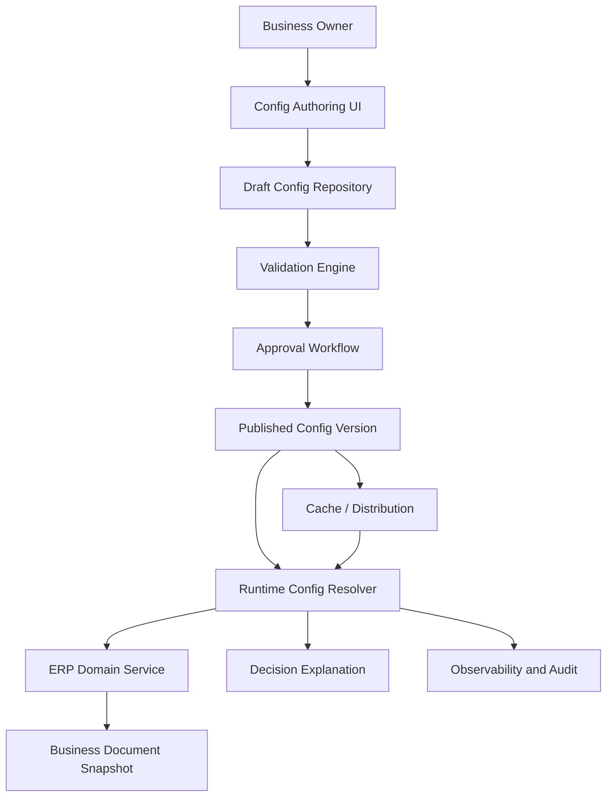
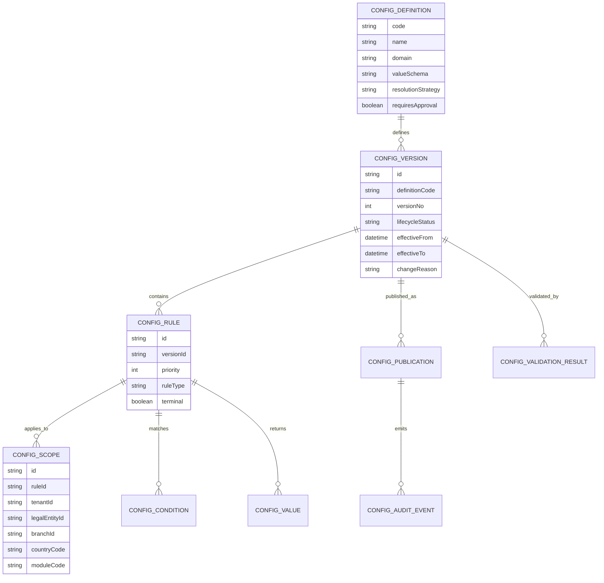
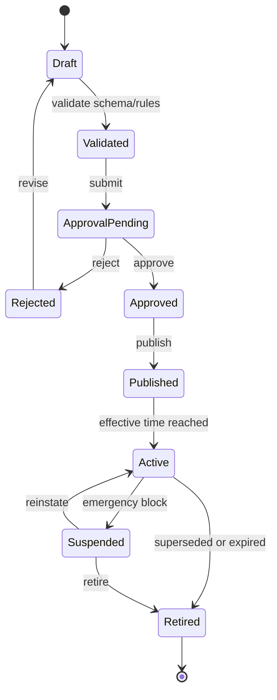
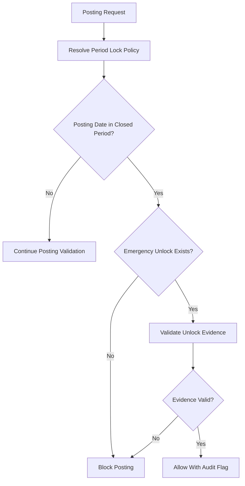

# Part 021 — Configuration as Domain and Runtime Behavior

## 1. Why This Part Matters

Large-scale ERP systems rarely fail because there is no `application.yml`.
They fail because **business behavior becomes configurable without governance**.

A small application can treat configuration as environment values:

- database URL;
- timeout;
- feature flag;
- log level;
- service endpoint;
- thread pool size.

A large ERP must treat many configuration values as **business facts with legal, financial, operational, and audit consequences**:

- which approval matrix was effective when a purchase requisition was submitted;
- which tax rule was active when an invoice was posted;
- which fiscal period lock prevented or allowed backdated posting;
- which cost center mapping was used to generate accounting entries;
- which numbering sequence generated a legal invoice number;
- which warehouse policy allowed negative stock;
- which entity-specific price override was active during quotation;
- which country localization pack determined document behavior;
- which integration route sent a payment file to a bank;
- which tenant-level policy allowed a document to skip manual approval.

If we model all of those as “just configuration”, we lose control.
If we hard-code all of them, the ERP becomes unchangeable.

The engineering problem is to design configuration as a **runtime domain model**:

> Configuration is controlled business behavior that can vary by scope, time, version, environment, tenant, legal entity, and operational context, while remaining explainable, testable, auditable, and reversible.

This part focuses on that boundary.

---

## 2. Kaufman Skill Deconstruction

Following Josh Kaufman’s learning strategy, we deconstruct “configuration” into smaller skills that can be practiced deliberately.

| Sub-skill | What You Must Learn | ERP Failure If Ignored |
|---|---|---|
| Configuration taxonomy | Separate technical config, business config, policy, rules, master data, and feature flags | Everything becomes a key-value table |
| Scope modelling | Apply config by tenant, legal entity, branch, country, warehouse, role, or document type | Wrong behavior leaks across organizations |
| Effective dating | Make config valid by time and lifecycle state | Old documents are recalculated with new rules |
| Versioning | Preserve what changed, when, by whom, and why | Audit cannot explain behavior |
| Publication workflow | Draft, validate, approve, publish, activate, retire | Unreviewed config changes impact production |
| Runtime evaluation | Resolve config deterministically for a business operation | Same request behaves differently under load |
| Caching and propagation | Keep performance without stale dangerous behavior | App nodes disagree on approval/tax/posting rules |
| Testing | Test config as executable behavior | Business change breaks financial or operational rules |
| Observability | Explain which config was used in each decision | Support cannot debug “why did ERP do this?” |
| Governance | Control ownership, SoD, and emergency changes | Business users silently change core behavior |

The target skill is not memorizing “use feature flags” or “store config in DB”.
The target skill is knowing **which behavior belongs where** and how to make runtime variability safe.

---

## 3. Configuration Is Not One Thing

A common mistake is to put everything under the word “configuration”.
That hides important differences.

### 3.1 Configuration Taxonomy

| Type | Example | Owner | Change Frequency | Runtime Risk | Storage Style |
|---|---|---:|---:|---:|---|
| Technical environment config | JDBC URL, broker URL, HTTP timeout | Platform/SRE | Medium | Operational | env vars, config server, secret manager |
| Application behavior config | enable async posting, default page size | Engineering/Product | Medium | Operational + functional | typed config, feature management |
| Business policy config | approval threshold, credit hold policy | Business owner | High | Financial/control | governed config domain |
| Calculation rule config | tax rule, pricing rule, depreciation method | Domain owner + finance/legal | Medium | Financial/legal | rule table/versioned rule set |
| Master data | item, vendor, customer, account, UOM | Data steward | High | Operational + financial | master data module |
| Reference data | currency, country, tax jurisdiction, document type | Data governance | Low-medium | Cross-system | governed reference catalog |
| Localization config | country-specific numbering, tax invoice behavior | Local compliance owner | Medium | Legal | country pack/config package |
| Workflow config | approval graph, SLA, escalation, delegation | Process owner | Medium | Control/audit | workflow definition repository |
| Integration config | endpoint route, partner mapping, bank format | Integration owner | Medium | Data movement | integration registry |
| Feature flag | gradual rollout, kill switch | Product/Platform | High | Functional/operational | feature flag platform |
| Secret | API key, database password, certificate | Security/Platform | Medium | Security | secret manager |

The first design rule:

> Do not let technical configuration infrastructure become the business configuration model.

Spring Boot externalized configuration is excellent for application and environment configuration, but business rules such as tax behavior or approval thresholds need a domain model with audit, effective dating, validation, and ownership.

---

## 4. Mental Model: Configuration as a Decision Function

In an ERP, configuration is usually not “read value by key”.
It is a decision function.

```text
result = resolve(configuration_type, business_context, evaluation_time)
```

For example:

```text
approval_limit = resolve(
  type = PURCHASE_APPROVAL_LIMIT,
  context = {
    tenant: T1,
    legalEntity: ID-PT-01,
    branch: JKT,
    department: IT,
    role: PROCUREMENT_MANAGER,
    currency: IDR,
    documentType: PURCHASE_REQUISITION,
    amount: 150_000_000
  },
  evaluationTime = 2026-07-01T10:15:00+07:00
)
```

The output should not just be the number `100_000_000`.
It should include the explanation:

```json
{
  "value": 100000000,
  "currency": "IDR",
  "matchedRuleId": "APR-LIMIT-2026-Q3-00042",
  "ruleVersion": 7,
  "scope": "tenant=T1/legalEntity=ID-PT-01/department=IT/role=PROCUREMENT_MANAGER",
  "effectiveFrom": "2026-07-01T00:00:00+07:00",
  "approvedBy": "finance.control@example.com",
  "publishedAt": "2026-06-28T14:00:00+07:00"
}
```

The explanation is part of the result because ERP decisions must be supportable and defensible.

---

## 5. Core Invariants of ERP Configuration

These invariants should guide every configuration design.

### 5.1 Determinism

For the same input context and evaluation time, configuration resolution must return the same result.

Bad:

```text
Approval threshold depends on whichever cache entry was loaded first.
```

Good:

```text
Approval threshold is resolved from a published version by scope and effective time.
```

### 5.2 Explainability

Every business-impacting configuration result must be explainable.

The system must answer:

- which config was used;
- why it matched;
- which broader/default rule was overridden;
- when it became effective;
- who approved it;
- whether it was active, retired, or emergency-published;
- which document captured the snapshot.

### 5.3 Temporal Correctness

Historical documents must remain bound to historical behavior.

A posted invoice from March must not silently change tax calculation because the tax config was updated in July.

### 5.4 Scope Isolation

Config must not leak across tenant, legal entity, branch, country, or module boundary.

This matters especially in multi-company ERP.

### 5.5 Controlled Mutability

Configuration may change, but only through governed lifecycle transitions.

```text
DRAFT -> VALIDATED -> APPROVED -> PUBLISHED -> ACTIVE -> RETIRED
```

Direct production edits are a red flag.

### 5.6 Fail-Safe Behavior

If config cannot be resolved, ERP must fail in a safe mode.

Examples:

- missing approval policy: block submission;
- missing tax rule: block invoice posting;
- missing report label: degrade gracefully;
- missing optional email template: use default;
- missing integration route: queue for exception, do not silently drop.

Not every missing config is equally dangerous.

---

## 6. Configuration Architecture Overview



A robust ERP does not let domain services read arbitrary configuration tables directly.
Domain services ask a **resolver** for a typed decision.

The resolver handles:

- scope matching;
- effective date;
- version selection;
- fallback hierarchy;
- conflict detection;
- cache consistency;
- audit explanation;
- snapshot reference.

---

## 7. The Configuration Domain Model

A production-grade configuration model should be more structured than this:

```sql
config_key VARCHAR,
config_value VARCHAR
```

That key-value table is fine for low-risk settings.
It is not enough for ERP behavior.

### 7.1 Conceptual Model



### 7.2 Example: Approval Limit Configuration

```json
{
  "definitionCode": "PROCUREMENT_APPROVAL_LIMIT",
  "version": 12,
  "effectiveFrom": "2026-07-01T00:00:00+07:00",
  "status": "ACTIVE",
  "rules": [
    {
      "priority": 100,
      "scope": {
        "tenant": "T1",
        "legalEntity": "ID-PT-01",
        "department": "IT",
        "role": "PROCUREMENT_MANAGER"
      },
      "conditions": {
        "currency": "IDR"
      },
      "value": {
        "maxApprovalAmount": 100000000,
        "currency": "IDR",
        "requiresSecondApproverAbove": 75000000
      },
      "terminal": true
    },
    {
      "priority": 10,
      "scope": {
        "tenant": "T1",
        "legalEntity": "ID-PT-01"
      },
      "conditions": {
        "currency": "IDR"
      },
      "value": {
        "maxApprovalAmount": 25000000,
        "currency": "IDR"
      },
      "terminal": true
    }
  ]
}
```

The domain service should not parse this raw JSON directly.
It should ask a typed resolver.

---

## 8. Scope Modelling

Scope is where most ERP configuration systems become messy.

A scope defines **where** a configuration applies.

Typical ERP scope dimensions:

| Dimension | Example | Notes |
|---|---|---|
| Tenant | `tenant=T1` | SaaS or hosted multi-tenant boundary |
| Legal entity | `company=ID-PT-01` | Legal/accounting boundary |
| Branch/site | `branch=JKT` | Operational boundary |
| Country | `country=ID` | Localization/tax/legal boundary |
| Department | `department=IT` | Workflow/cost control boundary |
| Cost center | `costCenter=CC-1001` | Finance/control boundary |
| Warehouse | `warehouse=WH-JKT-01` | Inventory/fulfillment boundary |
| Document type | `documentType=PO` | Lifecycle/business policy boundary |
| Product category | `category=RAW_MATERIAL` | Pricing/procurement/inventory boundary |
| Customer/vendor group | `customerGroup=GOLD` | Commercial policy boundary |
| Channel | `channel=ECOMMERCE` | Order/pricing/fulfillment boundary |
| Role | `role=APPROVER_L2` | Approval/access behavior |

### 8.1 Specificity Rules

When multiple rules match, we need deterministic precedence.

Example specificity order:

```text
Tenant + Legal Entity + Branch + Department + Role
Tenant + Legal Entity + Department + Role
Tenant + Legal Entity + Role
Tenant + Legal Entity
Tenant
Global Default
```

This must be explicit.
Never rely on accidental SQL ordering.

### 8.2 Conflict Example

Two approval rules match:

| Rule | Scope | Priority | Limit |
|---|---|---:|---:|
| A | legalEntity=ID-PT-01, department=IT | 100 | 100M |
| B | legalEntity=ID-PT-01, role=MANAGER | 100 | 75M |

If user is IT manager, both match.
If priority and specificity cannot break the tie, publication must fail.

Correct behavior:

```text
Do not activate ambiguous config.
```

---

## 9. Effective Dating and Versioning

### 9.1 Why Effective Dating Exists

ERP behavior is time-bound.

Examples:

- tax rate changes on a legal date;
- approval limit changes next quarter;
- fiscal period closes on a cutoff date;
- warehouse negative-stock policy changes after stock audit;
- bank file format changes from a future migration date;
- country localization rule starts on regulatory enforcement date.

Config needs these fields:

```text
valid_from
valid_to
published_at
activated_at
retired_at
transaction_effective_time_policy
```

These are not the same.

### 9.2 Transaction Effective Time

A document can have multiple relevant times:

| Time | Meaning | Example Use |
|---|---|---|
| Created time | When user created draft | UI defaults |
| Submitted time | When document entered approval | approval rule snapshot |
| Approved time | When authority approved | approval evidence |
| Document date | Business date on document | tax/accounting rule |
| Posting date | Ledger date | period lock/posting rule |
| Fulfillment date | Goods movement date | inventory valuation |
| Invoice date | Legal invoice date | tax invoice numbering |

A configuration definition should specify which time is used.

For example:

```text
APPROVAL_LIMIT.evaluationTime = SUBMITTED_AT
TAX_RULE.evaluationTime = INVOICE_DATE
PERIOD_LOCK.evaluationTime = POSTING_DATE
PRICE_RULE.evaluationTime = ORDER_PRICED_AT
```

Without this rule, the same document can be evaluated inconsistently.

### 9.3 Snapshot vs Re-evaluation

Some configuration results should be snapshotted.
Some can be re-evaluated.

| Config Type | Snapshot? | Reason |
|---|---:|---|
| Tax calculation rule | Yes | legal/financial evidence |
| Approval rule | Yes | audit defensibility |
| Price calculation | Yes | commercial commitment |
| Email template | Usually no | low-risk presentation |
| UI theme | No | presentation only |
| Feature flag | Usually no | rollout behavior |
| Posting period lock | Yes at decision moment | control evidence |
| Integration endpoint | Usually no for runtime, yes for sent message evidence | support/replay |

A posted or legally issued document should store enough metadata to explain its behavior later.

---

## 10. Lifecycle of Configuration



### 10.1 Draft

Draft allows authoring but must not affect production behavior.

### 10.2 Validated

Validation must check:

- schema correctness;
- value ranges;
- unknown reference data;
- invalid scope;
- overlapping effective dates;
- ambiguous matching;
- missing fallback;
- SoD violations;
- unsafe change classification;
- test scenario regression.

### 10.3 Approval Pending

High-risk config requires approval.

Examples:

- tax rule;
- approval matrix;
- period lock override;
- posting mapping;
- legal numbering;
- payment format;
- integration route for financial transactions;
- stock negative policy.

### 10.4 Published

Published means the config is ready but not necessarily active.
A future-dated tax rule can be published today and become active later.

### 10.5 Active

Runtime resolvers can use active config.

### 10.6 Retired

Retired config is no longer used for new decisions but remains needed for historical explanation.

Do not delete retired business config if documents reference it.

---

## 11. Risk Classification

Not all configuration needs the same process.

| Risk | Example | Required Control |
|---|---|---|
| Low | UI label, email footer | simple review |
| Medium | default payment term, default warehouse | validation + approval |
| High | tax rule, approval threshold, posting mapping | maker-checker + regression test + publication window |
| Critical | legal invoice numbering, period unlock, bank payment route | SoD + emergency log + privileged approval + monitoring |

This classification should be part of `CONFIG_DEFINITION`.

Example:

```json
{
  "definitionCode": "LEGAL_INVOICE_NUMBERING_POLICY",
  "riskLevel": "CRITICAL",
  "requiresApproval": true,
  "requiresSoD": true,
  "requiresRegressionPack": true,
  "requiresPublicationWindow": true,
  "defaultFailureMode": "BLOCK_OPERATION"
}
```

---

## 12. Technical Config vs Business Config

### 12.1 Technical Config

Technical config is about running the application.

Examples:

```yaml
server:
  port: 8080

spring:
  datasource:
    url: jdbc:postgresql://erp-db:5432/erp
    username: ${ERP_DB_USERNAME}

posting:
  batch-size: 500
  worker-count: 8
```

This belongs in Spring Boot externalized configuration, Kubernetes config, secret manager, or equivalent platform mechanism.

### 12.2 Business Config

Business config is about changing business decisions.

Examples:

```text
Purchase requisition above IDR 100M requires CFO approval.
Invoices cannot be posted to a closed accounting period.
Warehouse WH-JKT-01 does not allow negative stock.
A vendor invoice must be three-way matched before payment.
```

This belongs in an ERP domain module with:

- schema;
- version;
- lifecycle;
- audit;
- approval;
- validation;
- runtime explanation.

### 12.3 The Boundary Rule

Use this rule:

> If changing the value changes a business decision that must be explained to an auditor, customer, vendor, manager, tax authority, or internal control team, model it as business configuration, not technical configuration.

---

## 13. Java/Spring Implementation Pattern

### 13.1 Use Typed Technical Configuration

For technical values, prefer typed configuration classes.

```java
@ConfigurationProperties(prefix = "posting")
public record PostingWorkerProperties(
        int batchSize,
        int workerCount,
        Duration leaseTimeout,
        Duration retryBackoff
) {
    public PostingWorkerProperties {
        if (batchSize <= 0 || batchSize > 10_000) {
            throw new IllegalArgumentException("posting.batch-size out of safe range");
        }
        if (workerCount <= 0 || workerCount > 128) {
            throw new IllegalArgumentException("posting.worker-count out of safe range");
        }
    }
}
```

This should not be used for tenant-specific approval rules or tax rules.

### 13.2 Use a Business Configuration Resolver

```java
public interface BusinessConfigResolver {
    <T> ResolvedConfig<T> resolve(ConfigRequest<T> request);
}
```

```java
public record ConfigRequest<T>(
        ConfigDefinitionCode definitionCode,
        Class<T> valueType,
        BusinessContext context,
        Instant evaluationTime,
        ConfigFailureMode failureMode
) {}
```

```java
public record ResolvedConfig<T>(
        T value,
        String matchedRuleId,
        long version,
        ConfigScope matchedScope,
        Instant effectiveFrom,
        Instant effectiveTo,
        ConfigExplanation explanation
) {}
```

### 13.3 Example Usage in Domain Service

```java
public PurchaseRequisition submit(SubmitPrCommand command) {
    PurchaseRequisition pr = repository.getForUpdate(command.prId());

    BusinessContext context = BusinessContext.builder()
            .tenantId(pr.tenantId())
            .legalEntityId(pr.legalEntityId())
            .departmentId(pr.departmentId())
            .documentType("PURCHASE_REQUISITION")
            .currency(pr.currency())
            .amount(pr.totalAmount())
            .requesterId(command.submittedBy())
            .build();

    ResolvedConfig<ApprovalPolicy> approvalPolicy = configResolver.resolve(
            new ConfigRequest<>(
                    ConfigDefinitionCode.of("PROCUREMENT_APPROVAL_POLICY"),
                    ApprovalPolicy.class,
                    context,
                    command.submittedAt(),
                    ConfigFailureMode.BLOCK_OPERATION
            )
    );

    pr.submit(command.submittedBy(), approvalPolicy.value());
    pr.attachDecisionEvidence(approvalPolicy.explanation().toEvidence());

    return repository.save(pr);
}
```

Notice the important part:

```java
pr.attachDecisionEvidence(...)
```

Business decisions must carry evidence.

---

## 14. Database Schema Sketch

```sql
CREATE TABLE config_definition (
    code                    varchar(120) PRIMARY KEY,
    name                    varchar(240) NOT NULL,
    domain_code             varchar(80) NOT NULL,
    value_schema_json       jsonb NOT NULL,
    risk_level              varchar(30) NOT NULL,
    resolution_strategy     varchar(40) NOT NULL,
    evaluation_time_policy  varchar(60) NOT NULL,
    failure_mode            varchar(40) NOT NULL,
    requires_approval       boolean NOT NULL,
    requires_sod            boolean NOT NULL,
    created_at              timestamptz NOT NULL,
    created_by              varchar(120) NOT NULL
);

CREATE TABLE config_version (
    id                      uuid PRIMARY KEY,
    definition_code         varchar(120) NOT NULL REFERENCES config_definition(code),
    version_no              integer NOT NULL,
    lifecycle_status        varchar(40) NOT NULL,
    effective_from          timestamptz NOT NULL,
    effective_to            timestamptz,
    change_reason           text NOT NULL,
    created_at              timestamptz NOT NULL,
    created_by              varchar(120) NOT NULL,
    approved_at             timestamptz,
    approved_by             varchar(120),
    published_at            timestamptz,
    published_by            varchar(120),
    UNIQUE(definition_code, version_no)
);

CREATE TABLE config_rule (
    id                      uuid PRIMARY KEY,
    config_version_id       uuid NOT NULL REFERENCES config_version(id),
    priority                integer NOT NULL,
    terminal                boolean NOT NULL DEFAULT true,
    scope_json              jsonb NOT NULL,
    condition_json          jsonb NOT NULL,
    value_json              jsonb NOT NULL,
    explanation             text NOT NULL
);

CREATE TABLE config_resolution_audit (
    id                      uuid PRIMARY KEY,
    definition_code         varchar(120) NOT NULL,
    config_version_id       uuid NOT NULL,
    rule_id                 uuid NOT NULL,
    evaluated_at            timestamptz NOT NULL,
    evaluation_time         timestamptz NOT NULL,
    context_hash            varchar(128) NOT NULL,
    result_hash             varchar(128) NOT NULL,
    consumer_type           varchar(80) NOT NULL,
    consumer_id             varchar(120) NOT NULL
);
```

This is only a sketch.
The exact schema depends on your database, query patterns, and governance requirements.

---

## 15. Resolution Algorithm

### 15.1 Basic Algorithm

```text
1. Load active/published config versions for definition.
2. Filter versions by evaluation time.
3. Filter rules by scope compatibility.
4. Filter rules by conditions.
5. Sort by priority and specificity.
6. Detect ambiguity.
7. Return value and explanation.
8. Optionally persist resolution audit/snapshot.
```

### 15.2 Pseudocode

```java
public <T> ResolvedConfig<T> resolve(ConfigRequest<T> request) {
    ConfigDefinition def = definitionRepository.get(request.definitionCode());

    List<ConfigVersion> candidates = versionRepository.findActiveAt(
            def.code(),
            request.evaluationTime()
    );

    if (candidates.isEmpty()) {
        return handleMissingConfig(request, def);
    }

    List<MatchedRule> matches = candidates.stream()
            .flatMap(version -> ruleRepository.findByVersion(version.id()).stream()
                    .map(rule -> matcher.match(version, rule, request.context())))
            .flatMap(Optional::stream)
            .filter(match -> conditionEvaluator.matches(match.rule(), request.context()))
            .sorted(ruleComparator())
            .toList();

    if (matches.isEmpty()) {
        return handleNoRuleMatched(request, def);
    }

    AmbiguityCheckResult ambiguity = ambiguityChecker.check(matches);
    if (ambiguity.isAmbiguous()) {
        throw new AmbiguousConfigurationException(ambiguity.message());
    }

    MatchedRule selected = matches.get(0);
    T value = valueMapper.convert(selected.rule().valueJson(), request.valueType());

    return explanationBuilder.build(request, selected, value);
}
```

### 15.3 Ambiguity Must Be a Publication Error

Runtime ambiguity means publication validation failed.
Do not let production traffic discover ambiguous critical configuration.

---

## 16. Fallback Hierarchy

Fallback is necessary, but dangerous if hidden.

Example:

```text
Specific branch policy
  -> legal entity policy
    -> tenant policy
      -> global policy
```

A config resolver should expose fallback path:

```json
{
  "matched": "tenant=T1/legalEntity=ID-PT-01",
  "fallbacksConsidered": [
    "tenant=T1/legalEntity=ID-PT-01/branch=JKT",
    "tenant=T1/legalEntity=ID-PT-01",
    "tenant=T1",
    "global"
  ],
  "reason": "No branch-specific rule matched. Legal-entity rule selected."
}
```

Hidden fallback is a major support problem.

---

## 17. Runtime Caching

ERP config is read frequently.
Naively querying rules for every line item can destroy performance.

But naive caching can destroy correctness.

### 17.1 Cache Levels

| Cache Level | Example | Risk |
|---|---|---|
| In-memory per node | local Caffeine cache | node disagreement |
| Distributed cache | Redis/Hazelcast | stale values, invalidation failure |
| Snapshot attached to document | persisted decision evidence | storage overhead, stale if reused incorrectly |
| Compiled rule cache | precompiled rule graph | invalidation complexity |
| Read model | denormalized active config view | projection lag |

### 17.2 Safe Cache Key

The cache key must include enough resolution context.

Bad:

```text
approval-policy:T1
```

Better:

```text
approval-policy:T1:ID-PT-01:IT:PROCUREMENT_MANAGER:IDR:2026-07-01T00:00:00Z:version=12
```

For high-cardinality contexts, cache compiled rule sets rather than final results.

### 17.3 Cache Invalidation Event

```json
{
  "eventType": "ConfigVersionPublished",
  "definitionCode": "PROCUREMENT_APPROVAL_POLICY",
  "versionNo": 12,
  "effectiveFrom": "2026-07-01T00:00:00+07:00",
  "publicationId": "CFG-PUB-2026-000813",
  "riskLevel": "HIGH"
}
```

All runtime nodes can use this event to invalidate or preload config.

### 17.4 Active-at-Time Query Problem

Future-dated config creates a common bug:

```text
Cache is invalidated when config is published, but not when effective time arrives.
```

If a rule becomes active at midnight, the system needs either:

- scheduled invalidation;
- resolver query by evaluation time;
- cache TTL shorter than effective boundary;
- precomputed active window cache;
- event emitted at activation time.

---

## 18. Configuration and Feature Flags

Feature flags are useful, but they are not a replacement for business configuration.

| Feature Flag | Business Configuration |
|---|---|
| controls rollout | controls business behavior |
| often temporary | often durable |
| owned by product/platform | owned by business/domain |
| can be percentage/user based | usually scope/effective-date based |
| may be removed after rollout | retained for evidence/history |
| frequently operational | often auditable/legal/financial |

Bad design:

```text
if featureFlag("new-tax-rule") then apply tax 11% else 10%
```

Better design:

```text
TaxRuleResolver resolves tax rule by jurisdiction, document date, product tax category, customer tax status, and published effective-dated rule version.
```

Feature flag may control whether the new engine is enabled, not the tax law itself.

---

## 19. Configuration and Secrets

Secrets are not business configuration.

Do not store these in business config tables:

- bank API key;
- tax service credential;
- database password;
- SFTP private key;
- OAuth client secret;
- signing certificate private key.

Business config may reference a secret alias:

```json
{
  "bankConnector": "BANK_XYZ_HOST_TO_HOST",
  "credentialRef": "secret://erp/prod/bank-xyz/h2h-client"
}
```

The secret value itself belongs in a secret management system with rotation, access control, and audit.

---

## 20. Configuration as Data Product

Large ERP configuration should be treated like a data product.

It needs:

- schema;
- owner;
- SLA;
- quality checks;
- publication channel;
- lineage;
- consumers;
- backward compatibility;
- change notification;
- test scenarios;
- operational dashboard.

Example ownership:

| Config | Owner | Reviewer | Technical Steward |
|---|---|---|---|
| Approval matrix | Procurement control | Internal audit | Workflow platform team |
| Tax rule | Tax/legal team | Finance controller | Commercial rules team |
| Posting mapping | Accounting policy | Finance controller | Ledger platform team |
| Warehouse policy | Supply chain | Inventory controller | WMS/ERP team |
| Bank route | Treasury | Security + finance | Integration platform team |

---

## 21. Validation Engine

A validation engine prevents invalid configuration from reaching runtime.

### 21.1 Validation Types

| Validation | Example |
|---|---|
| Schema validation | `maxApprovalAmount` must be money object |
| Referential validation | cost center exists and active |
| Scope validation | branch belongs to legal entity |
| Temporal validation | no overlapping active versions unless strategy allows it |
| Conflict validation | two rules cannot match same context with same priority |
| Completeness validation | every legal entity has period lock policy |
| Simulation validation | sample documents produce expected decisions |
| Regression validation | new config does not break golden scenarios |
| SoD validation | author cannot approve own high-risk config |
| Risk validation | critical config requires publication window |

### 21.2 Simulation Test Example

```json
{
  "scenario": "IT manager submits PR above 75M but below 100M",
  "context": {
    "tenant": "T1",
    "legalEntity": "ID-PT-01",
    "department": "IT",
    "role": "PROCUREMENT_MANAGER",
    "currency": "IDR",
    "amount": 90000000
  },
  "expected": {
    "requiresApproval": true,
    "requiredApproverLevel": "CFO",
    "matchedRuleId": "APR-LIMIT-2026-Q3-00042"
  }
}
```

Config publication should run these simulations.

---

## 22. Runtime Decision Evidence

ERP documents should capture configuration evidence for important decisions.

Example table:

```sql
CREATE TABLE document_decision_evidence (
    id                  uuid PRIMARY KEY,
    document_type       varchar(80) NOT NULL,
    document_id         uuid NOT NULL,
    decision_type       varchar(120) NOT NULL,
    config_definition   varchar(120) NOT NULL,
    config_version_id   uuid NOT NULL,
    config_rule_id      uuid NOT NULL,
    evaluated_at        timestamptz NOT NULL,
    evaluation_time     timestamptz NOT NULL,
    explanation_json    jsonb NOT NULL,
    result_hash         varchar(128) NOT NULL
);
```

This allows support and audit teams to answer:

```text
Why did this purchase order require CFO approval?
Why did this invoice use this tax rate?
Why was this payment blocked?
Why did this item use average costing?
Why was this stock movement disallowed?
```

---

## 23. Configuration Package and Promotion

ERP configuration often moves across environments:

```text
DEV -> SIT -> UAT -> PRE-PROD -> PROD
```

But business configuration is not always identical across environments.

### 23.1 Package Model

```text
Configuration Package
├── metadata
├── definitions
├── versions
├── rules
├── reference mappings
├── validation scenarios
├── expected simulation outputs
├── migration notes
└── rollback plan
```

### 23.2 Promotion Controls

Before production activation:

- validate schema;
- compare against UAT-approved package;
- verify reference data mapping;
- run golden scenarios;
- check SoD approval;
- verify activation window;
- notify consumers;
- create rollback/suspend plan.

---

## 24. Configuration Change Categories

| Category | Example | Deployment Style |
|---|---|---|
| Additive | add new branch-specific approval rule | regular publish |
| Corrective | fix typo in non-critical label | fast publish |
| Behavioral | change invoice matching tolerance | controlled release |
| Regulatory | new tax rate effective next month | future-dated publish |
| Emergency | suspend bank route due to outage | emergency workflow |
| Breaking | change config schema | versioned migration |

Breaking schema changes require special handling.
Never assume all config consumers upgrade simultaneously.

---

## 25. Schema Evolution

Configuration value schema evolves.

Example v1:

```json
{
  "maxApprovalAmount": 100000000,
  "currency": "IDR"
}
```

Example v2:

```json
{
  "maxApprovalAmount": {
    "amount": 100000000,
    "currency": "IDR"
  },
  "requiresSecondApproverAbove": {
    "amount": 75000000,
    "currency": "IDR"
  }
}
```

A mature platform supports:

- schema version;
- backward-compatible readers;
- migration scripts;
- validation scenarios;
- deprecation window;
- consumer compatibility matrix.

Java implementation should avoid passing raw `Map<String, Object>` through the domain.
Use typed records/classes at module boundary.

---

## 26. Multi-Tenant Configuration

Multi-tenant ERP needs strict isolation.

### 26.1 Tenant Default and Override

```text
Global Default
  -> Tenant Default
    -> Legal Entity Override
      -> Branch Override
        -> Department/Role Override
```

### 26.2 SaaS Risk

For SaaS ERP, a config bug can impact many tenants.

Controls:

- tenant-scoped publication;
- canary tenant;
- blast-radius limit;
- tenant-level kill switch;
- per-tenant config version pinning;
- migration report;
- tenant-specific audit export.

### 26.3 Managed Customization

Do not let every tenant fork the system.
Prefer controlled variation through:

- scoped config;
- extension points;
- metadata-driven forms;
- localization packs;
- rule packages;
- integration adapters.

---

## 27. Example: Period Lock Configuration

Accounting period lock is high-risk.

### 27.1 Model

```json
{
  "definitionCode": "ACCOUNTING_PERIOD_LOCK_POLICY",
  "riskLevel": "CRITICAL",
  "evaluationTimePolicy": "POSTING_DATE",
  "rules": [
    {
      "scope": {
        "tenant": "T1",
        "legalEntity": "ID-PT-01",
        "ledger": "PRIMARY"
      },
      "value": {
        "closedPeriods": ["2026-05"],
        "softClosedPeriods": ["2026-06"],
        "allowBackdatedPosting": false,
        "emergencyUnlockRequires": ["FINANCE_CONTROLLER", "INTERNAL_AUDIT"]
      }
    }
  ]
}
```

### 27.2 Runtime Behavior



### 27.3 Evidence

A posting allowed by emergency unlock must record:

- unlock request;
- approvers;
- effective window;
- reason;
- affected period;
- posting document;
- audit flag;
- reversal/adjustment reference if needed.

---

## 28. Example: Warehouse Negative Stock Policy

```json
{
  "definitionCode": "NEGATIVE_STOCK_POLICY",
  "riskLevel": "HIGH",
  "evaluationTimePolicy": "MOVEMENT_TIME",
  "rules": [
    {
      "scope": {
        "tenant": "T1",
        "warehouse": "WH-JKT-01",
        "itemCategory": "RAW_MATERIAL"
      },
      "value": {
        "allowNegativeStock": false,
        "blockPickIfAvailableBelowZero": true,
        "allowSupervisorOverride": false
      }
    }
  ]
}
```

This config must be resolved inside the same logical transaction that validates stock movement.
If resolved outside and stock changes before commit, the system can still oversell or over-issue.

---

## 29. Example: Integration Route Configuration

Integration config is partly business and partly technical.

```json
{
  "definitionCode": "BANK_PAYMENT_ROUTE",
  "riskLevel": "CRITICAL",
  "rules": [
    {
      "scope": {
        "tenant": "T1",
        "legalEntity": "ID-PT-01",
        "currency": "IDR",
        "paymentMethod": "BANK_TRANSFER"
      },
      "value": {
        "connectorCode": "BANK_XYZ_H2H",
        "format": "BANK_XYZ_ISO20022_VARIANT_A",
        "credentialRef": "secret://erp/prod/bank-xyz/h2h-client",
        "requiresDualAuthorization": true,
        "maxBatchAmount": {
          "amount": 5000000000,
          "currency": "IDR"
        }
      }
    }
  ]
}
```

The connector endpoint may be technical config.
The rule that selects this route for payments is business config.

---

## 30. Anti-Patterns

### 30.1 Universal Key-Value Table

```sql
config_key
config_value
```

This creates:

- no type safety;
- no lifecycle;
- no audit explanation;
- no scope model;
- no conflict detection;
- no simulation;
- no ownership.

### 30.2 Business Logic Hidden in YAML

If finance rules are in `application-prod.yml`, business owners cannot govern them properly.

### 30.3 Config Without Version

Changing the value overwrites history.
Audit cannot explain old decisions.

### 30.4 Runtime Editing Without Publication

A production admin changes behavior instantly with no validation.
This may be convenient, but it is dangerous for ERP.

### 30.5 Over-Configurable Core

A system where everything is configurable becomes impossible to reason about.

A good ERP distinguishes:

```text
configurable variation
custom extension
product feature
hard invariant
```

Not all business requests deserve runtime configuration.

### 30.6 Configuration as Programming Language

Some ERP platforms accidentally create a weak programming language inside configuration.

Symptoms:

- nested expressions;
- arbitrary scripts;
- hidden side effects;
- no test harness;
- no debugging;
- no static validation;
- non-deterministic evaluation.

If you need complex computation, consider a rule engine or extension point with governance, not uncontrolled expression fields.

---

## 31. Failure Modes and Rescue Playbooks

| Failure | Symptom | Likely Cause | Rescue |
|---|---|---|---|
| Wrong approval route | PR went to wrong approver | scope precedence bug | suspend config, replay workflow if safe, publish corrected version |
| Tax miscalculation | invoice tax wrong | effective date or jurisdiction rule error | block affected invoice type, identify impacted docs, issue adjustment/credit process |
| Node disagreement | users see different behavior | stale local cache | broadcast invalidation, compare config version per node |
| Missing rule | document cannot post | incomplete config | emergency fallback only if safe; otherwise block and publish fix |
| Unexpected fallback | tenant used global rule | missing tenant override | add validation completeness rule |
| Historical drift | old document recalculates differently | no snapshot | stop recalculation, add evidence snapshot going forward, reconcile past docs |
| Rule conflict | publication fails or runtime ambiguous | overlapping rules | improve specificity/priority model |
| Emergency change abuse | frequent manual overrides | weak governance | add dashboard, approval threshold, post-incident review |

---

## 32. Testing Strategy

### 32.1 Unit Tests

Test matcher, specificity, date range, and value mapping.

```java
@Test
void branchSpecificRuleBeatsLegalEntityDefault() {
    var result = resolver.resolve(requestFor("WH-JKT-01"));
    assertThat(result.matchedScope().warehouseId()).isEqualTo("WH-JKT-01");
}
```

### 32.2 Property Tests

Useful properties:

- no two active rules produce ambiguous result for generated contexts;
- every legal entity has a period lock policy;
- every active tax jurisdiction has at least one active tax rule;
- effective date windows do not overlap for terminal rules;
- resolution is deterministic.

### 32.3 Golden Scenario Tests

Maintain a catalog of business scenarios:

- PR below threshold;
- PR above threshold;
- invoice in closed period;
- invoice in soft-closed period;
- warehouse transfer with negative stock disallowed;
- payment route over max batch amount;
- tax exempt customer;
- cross-border sale;
- branch override;
- country localization pack.

Each publication should run relevant golden scenarios.

### 32.4 Production Shadow Evaluation

For high-risk rollout, evaluate new config in shadow mode:

```text
current active result = A
future candidate result = B
compare A vs B
record difference
surface expected impact before activation
```

This is powerful for approval matrix, pricing, tax, and routing changes.

---

## 33. Observability

A configuration platform needs operational visibility.

### 33.1 Metrics

- config resolution count by definition;
- cache hit/miss;
- resolution latency;
- missing config count;
- fallback usage count;
- ambiguous config detection;
- publication failure count;
- emergency change count;
- stale node version count;
- shadow evaluation mismatch count.

### 33.2 Logs

High-risk decisions should log structured evidence identifiers.

```json
{
  "event": "CONFIG_RESOLVED",
  "definitionCode": "PROCUREMENT_APPROVAL_POLICY",
  "version": 12,
  "ruleId": "APR-LIMIT-2026-Q3-00042",
  "consumerType": "PURCHASE_REQUISITION",
  "consumerId": "PR-2026-000081",
  "tenant": "T1",
  "legalEntity": "ID-PT-01"
}
```

### 33.3 Admin Dashboard

Useful views:

- active config by definition/scope;
- upcoming effective changes;
- recently published high-risk config;
- emergency changes;
- documents using a config version;
- nodes running stale config;
- validation failures;
- orphaned references;
- fallback usage hotspots.

---

## 34. Design Review Checklist

Use this checklist during architecture review.

### 34.1 Classification

- Is this technical config or business config?
- Does changing it affect legal, financial, operational, or audit behavior?
- Is it master data, reference data, policy, rule, feature flag, or secret?

### 34.2 Scope

- What dimensions does it apply to?
- Is scope hierarchy explicit?
- Can two rules match the same context?
- Is conflict detection implemented before activation?

### 34.3 Time

- What evaluation time is used?
- Is historical behavior preserved?
- Are future-dated changes supported?
- What happens at effective-time boundary?

### 34.4 Lifecycle

- Who can author, approve, publish, suspend, and retire?
- Is SoD enforced?
- Are high-risk changes tested before activation?
- Is emergency change controlled?

### 34.5 Runtime

- Is resolution deterministic?
- Is failure mode explicit?
- Is cache invalidation safe?
- Is decision evidence captured?

### 34.6 Operations

- Can support answer “why did this happen?”
- Can we find all documents impacted by a config version?
- Can we safely roll forward or suspend?
- Are validation and publication failures observable?

---

## 35. Practice Drill

### Scenario

Your ERP supports procurement across three legal entities:

- Indonesia entity;
- Singapore entity;
- Australia entity.

The business wants configurable approval limits by:

- legal entity;
- department;
- role;
- currency;
- purchase category;
- effective date.

They also want emergency temporary limits during quarterly budget freeze.

### Task

Design:

1. configuration definition;
2. scope hierarchy;
3. value schema;
4. lifecycle states;
5. conflict detection rules;
6. example runtime resolver request;
7. decision evidence stored on purchase requisition;
8. simulation test cases;
9. operational dashboard metrics;
10. emergency override process.

### Expected Mental Model

A strong design will treat approval limits as:

```text
high-risk, effective-dated, scoped, versioned, governed business configuration
```

not as:

```text
approval.limit.idr=100000000
```

---

## 36. Source Notes

This part is grounded in widely used enterprise Java and integration/configuration references:

- Spring Boot Externalized Configuration: useful for technical/environment configuration, not a complete ERP business configuration model.
- MicroProfile Config 3.1: defines a portable configuration system and configurable sources for Java microservices.
- Jakarta Persistence 3.2: relevant when modelling governed configuration as durable domain data.
- OWASP logging and verification guidance: relevant to audit evidence and control-oriented logging.
- ERP practice from financial, supply-chain, procurement, and manufacturing domains where effective-dated, scoped, approved, and auditable behavior is required.

---

## 37. Key Takeaways

- Configuration in ERP is not just values; it is controlled runtime behavior.
- High-risk business configuration needs scope, time, version, lifecycle, validation, approval, and evidence.
- Technical config belongs in platform mechanisms; business config belongs in governed domain modules.
- Every important decision should be explainable by config version, rule, scope, and evaluation time.
- Caching must not break correctness at effective-time boundaries.
- A mature ERP treats configuration as a product with owners, tests, publication workflow, and observability.
