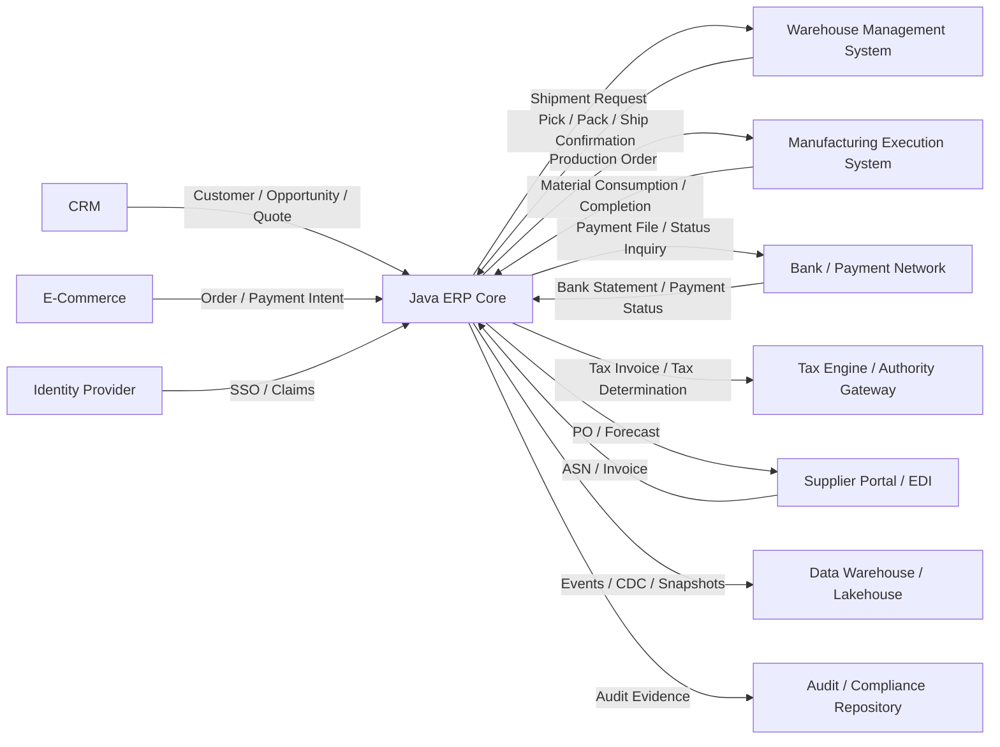
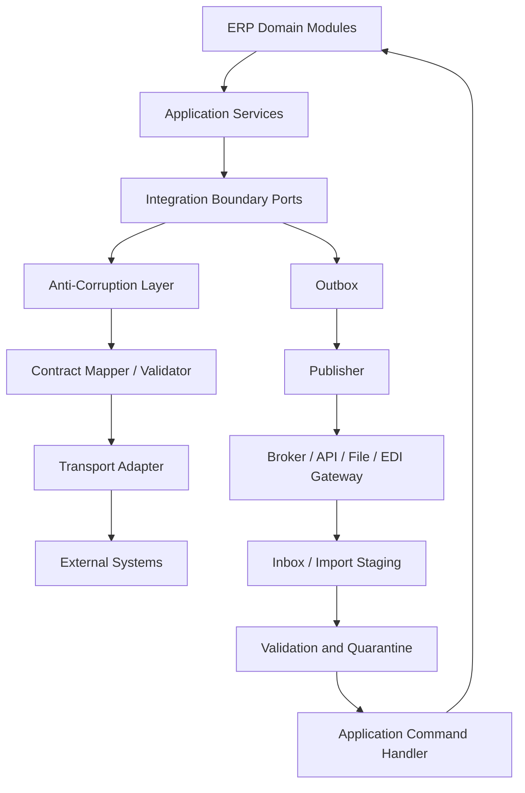
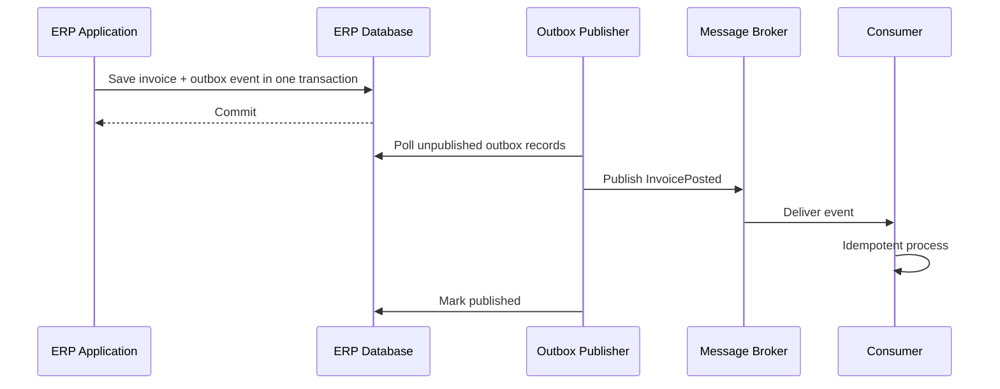
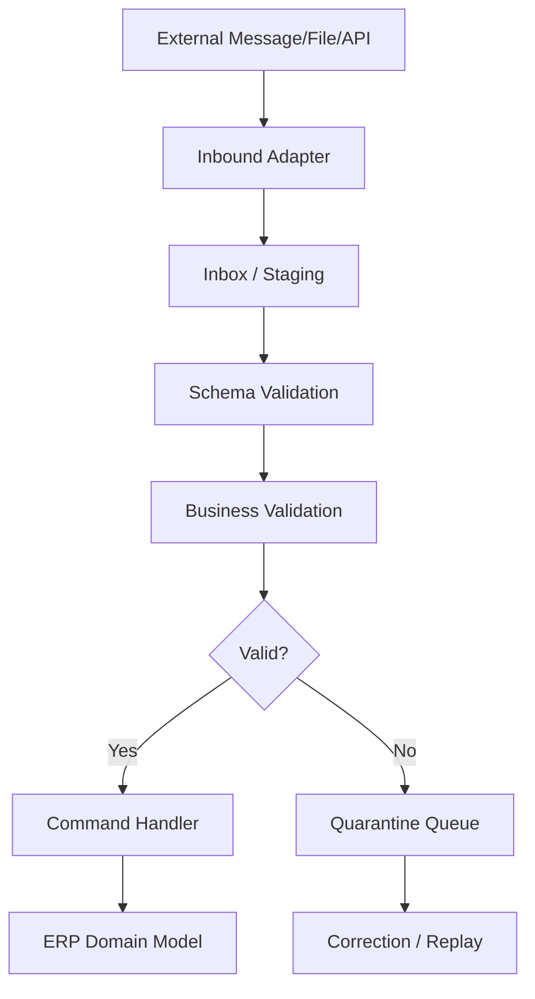
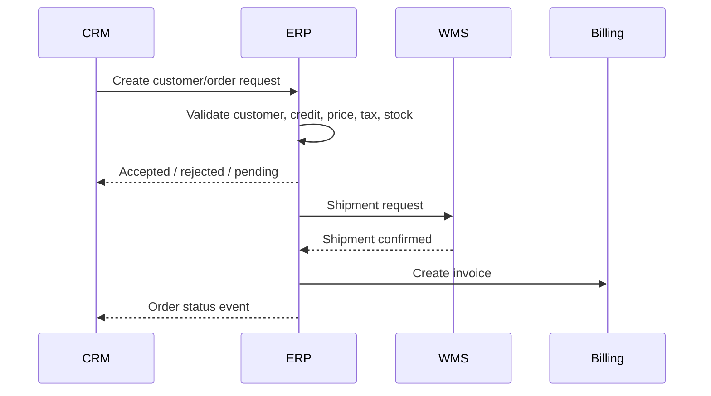
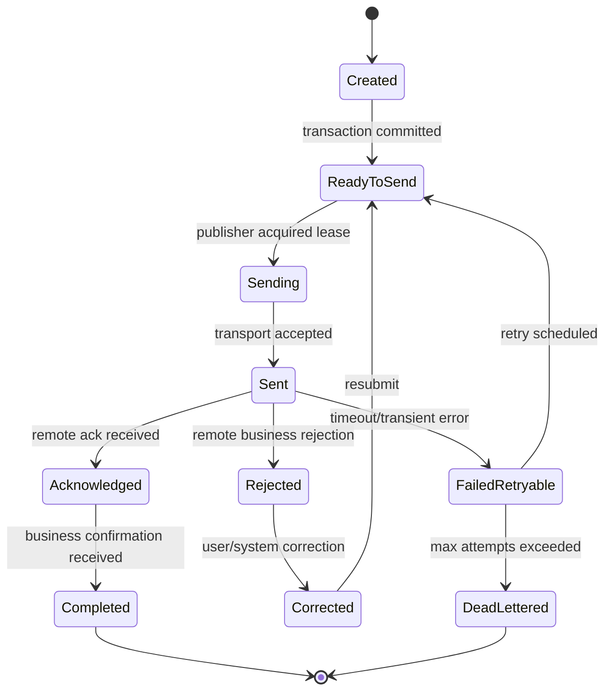
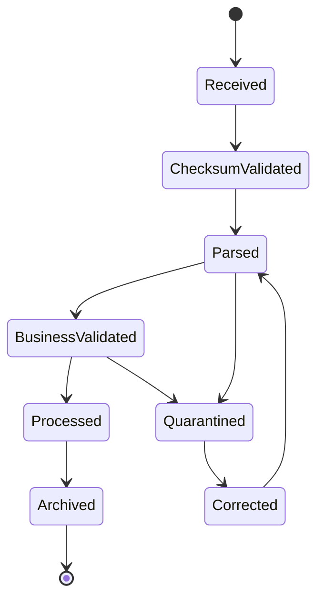

# Part 022 — Integration Architecture for ERP Landscapes

## 1. Why This Part Matters

A large ERP is never alone.

It lives inside an enterprise landscape that may include:

- CRM;
- e-commerce;
- WMS;
- MES;
- PLM;
- HR/payroll;
- tax engines;
- banks;
- payment gateways;
- procurement networks;
- supplier portals;
- customer portals;
- EDI partners;
- data warehouse/lakehouse;
- business intelligence;
- document management;
- identity provider;
- audit/compliance systems;
- legacy mainframe;
- regional ERP instances;
- external accounting or consolidation system.

Integration is where ERP truth crosses boundaries.
That makes it risky.

A bad integration can:

- duplicate invoices;
- miss payments;
- ship goods without billing;
- bill without shipment;
- post wrong accounting entries;
- violate tax reporting;
- expose sensitive data;
- create inconsistent master data;
- generate operational backlogs;
- hide failures until month-end close.

The goal is not simply “connect systems”.
The goal is:

> Move business facts across system boundaries with clear ownership, contract, identity, timing, reliability, security, observability, and reconciliation.

---

## 2. Kaufman Skill Deconstruction

Following the Kaufman approach, integration architecture can be decomposed into sub-skills.

| Sub-skill | What You Need to Learn | Failure If Ignored |
|---|---|---|
| Landscape mapping | Identify systems, ownership, data flows, and truth boundaries | Point-to-point chaos |
| Integration taxonomy | Choose API, event, file, EDI, CDC, ETL, or batch intentionally | Wrong mechanism for business timing |
| Contract design | Define payload, identity, state, errors, versioning, and SLA | Consumer breakage and ambiguous ownership |
| Anti-corruption layer | Translate external model into internal domain language | Foreign concepts leak into ERP core |
| Idempotency | Make duplicate delivery safe | Duplicate invoices, receipts, payments |
| Reconciliation | Detect and correct mismatches | Silent financial/operational drift |
| Security | Authenticate, authorize, encrypt, and minimize data | Data exposure or unauthorized action |
| Observability | Trace cross-system business flow | Support cannot locate failure |
| Operational control | Pause, replay, retry, quarantine, and compensate | Outages become data corruption |
| Governance | Control ownership and change across teams/partners | Contract drift and brittle integrations |

Part 023 will go deeper into idempotency, retry, reconciliation, and exactly-once illusions.
This part focuses on the overall architecture.

---

## 3. ERP Integration Mental Model

An ERP integration is not just a technical pipe.
It is a controlled exchange of business facts.

Every integration should be described with this frame:

```text
Producer publishes business fact or accepts command.
Contract defines meaning and structure.
Consumer applies it under local rules.
Evidence records what crossed the boundary.
Operations monitor and reconcile the result.
```

### 3.1 Integration Contract Questions

For every interface, answer:

1. Who owns the source fact?
2. Who is allowed to change it?
3. What business event or command is crossing the boundary?
4. Is the receiving side required to accept it?
5. Is delivery synchronous or asynchronous?
6. What identity makes the message idempotent?
7. What state transition is expected?
8. What is the SLA?
9. What happens if the receiver is down?
10. How is failure surfaced?
11. How is replay controlled?
12. How is data reconciled?
13. How is the contract versioned?
14. Which sensitive fields are included?
15. Which audit evidence must be retained?

If these questions are not answered, the integration is not designed yet.
It is only connected.

---

## 4. ERP Landscape Map



The ERP core should not become a random integration hub.
A large landscape needs explicit integration ownership and boundaries.

---

## 5. Integration Styles

### 5.1 Synchronous API

Use when caller needs immediate answer.

Examples:

- check credit availability;
- validate tax registration;
- get ATP estimate;
- create sales order from portal;
- fetch invoice status;
- validate vendor bank account.

Strengths:

- immediate feedback;
- simpler user experience;
- clear request/response semantics.

Risks:

- tight runtime coupling;
- cascading failure;
- timeout ambiguity;
- duplicate retry;
- poor fit for long-running processes.

### 5.2 Asynchronous Event

Use when a business fact happened and consumers can react independently.

Examples:

- `PurchaseOrderApproved`;
- `GoodsReceiptPosted`;
- `InvoicePosted`;
- `PaymentSettled`;
- `StockReserved`;
- `CustomerCreditBlocked`.

Strengths:

- decouples producer and consumer;
- supports multiple consumers;
- improves resilience;
- enables near-real-time projections.

Risks:

- eventual consistency;
- duplicate delivery;
- ordering challenges;
- replay complexity;
- consumer lag.

### 5.3 Command Message

Use when one system asks another system to perform an action asynchronously.

Examples:

- request WMS to ship;
- request bank payment execution;
- request tax invoice issuance;
- request MES work order release;
- request document signing.

Commands require stronger ownership and reply semantics than events.

### 5.4 File/Batch Integration

Use when partner or legacy constraints require file exchange.

Examples:

- bank payment file;
- bank statement import;
- payroll journal import;
- supplier invoice CSV;
- inventory count upload;
- EDI flat file;
- nightly data warehouse extract.

Strengths:

- compatible with legacy/partner systems;
- operationally understandable;
- good for large batch transfer.

Risks:

- delayed feedback;
- partial file processing;
- manual corrections;
- duplicate file import;
- weak schema governance;
- hidden data quality problems.

### 5.5 EDI / B2B Integration

Use for standardized partner document exchange.

Examples:

- purchase order;
- purchase order acknowledgment;
- advance shipping notice;
- invoice;
- remittance advice;
- inventory advice.

Risks:

- partner-specific variants;
- mapping drift;
- transmission acknowledgment complexity;
- legal/business interpretation differences;
- testing across many partners.

### 5.6 CDC / Replication

Use for data movement, read models, analytics, or migration assistance.

Do not treat CDC as a substitute for business events if consumers need business meaning.

A database row update does not necessarily mean:

```text
InvoicePosted
```

It might mean:

```text
user edited invoice draft description
```

CDC is useful, but semantic events are usually better for domain integration.

### 5.7 ETL / ELT

Use for reporting, analytics, and data platform movement.

Avoid using ETL as the primary mechanism for operational commands.

---

## 6. Integration Decision Matrix

| Scenario | Preferred Style | Reason |
|---|---|---|
| User submits order from portal | Synchronous API + async confirmation event | immediate validation, durable downstream processing |
| ERP informs WMS to ship | Command message | WMS performs external operation |
| WMS confirms shipment | Event/message callback | business fact happened outside ERP |
| ERP sends bank payment batch | File or secure API command | bank/treasury control and acknowledgment |
| Bank sends statement | File/API import | external fact to reconcile |
| BI needs sales facts | Event stream/CDC/ETL | analytics read model |
| Tax amount calculation | Sync API if immediate; async for reporting | depends on legal process |
| Supplier sends invoice | EDI/file/API | partner capability |
| Legacy system needs nightly product list | Batch export | low immediacy, legacy constraint |
| MES records production completion | Event/callback API | external operational fact updates ERP |

The design principle:

> Choose integration style based on business timing, ownership, failure semantics, and reconciliation needs — not team preference.

---

## 7. Integration Architecture Layers



### 7.1 Domain Modules

Domain modules own business truth.
They should not know external payload formats.

### 7.2 Integration Boundary Ports

Ports define what the ERP exposes or consumes in business terms.

Example:

```java
public interface ShipmentRequestPort {
    ShipmentRequestId requestShipment(ShipmentRequest request);
}
```

### 7.3 Anti-Corruption Layer

The anti-corruption layer translates between external model and ERP model.

Example:

```text
External WMS status "ALLOCATED"
```

may not equal ERP status:

```text
StockReserved
```

Do not map words blindly.
Map semantics.

### 7.4 Transport Adapter

Transport adapters handle:

- REST;
- SOAP;
- message broker;
- Jakarta Messaging/JMS;
- Kafka;
- SFTP;
- EDI gateway;
- database staging;
- object storage;
- webhook.

Adapters are replaceable infrastructure.
Business semantics should live above them.

---

## 8. Ownership: System of Record vs System of Action

For each business object, define ownership.

| Data/Object | System of Record | System of Action | Notes |
|---|---|---|---|
| Customer legal profile | ERP or MDM | CRM/ERP | avoid split authority |
| Sales opportunity | CRM | CRM | ERP should not own pipeline stage |
| Sales order | ERP or commerce platform depending model | ERP/WMS | clear boundary required |
| Inventory balance | ERP stock ledger | WMS operational execution | WMS may own bin-level execution |
| Shipment execution | WMS | WMS | ERP receives confirmation |
| Production execution | MES | MES | ERP owns planning/accounting/WIP |
| Financial posting | ERP GL | ERP | external systems should not post directly without control |
| Payment execution | Bank | Treasury/ERP | ERP requests, bank confirms |
| Tax authority clearance | Tax gateway/authority | ERP/tax service | legal status external |
| Employee payroll | HR/payroll | Payroll | ERP may receive journal only |

Without ownership, integration contracts become political and unstable.

---

## 9. API Contracts

### 9.1 Command API Example

```http
POST /api/sales-orders
Idempotency-Key: ext-order-ECOM-2026-000188
Content-Type: application/json
```

```json
{
  "externalOrderId": "ECOM-2026-000188",
  "channel": "ECOMMERCE",
  "customerRef": "CUST-10001",
  "currency": "IDR",
  "orderDate": "2026-07-01",
  "lines": [
    {
      "externalLineId": "1",
      "sku": "SKU-RED-001",
      "quantity": 2,
      "unitPrice": {
        "amount": 250000,
        "currency": "IDR"
      }
    }
  ]
}
```

Response:

```json
{
  "salesOrderId": "SO-2026-000881",
  "status": "ACCEPTED",
  "duplicate": false,
  "links": {
    "self": "/api/sales-orders/SO-2026-000881"
  }
}
```

Important fields:

- external identity;
- idempotency key;
- line identity;
- currency;
- explicit quantities;
- validation errors;
- duplicate handling.

### 9.2 API Failure Semantics

A timeout does not mean failure.

The client must be able to query by idempotency key or external ID:

```http
GET /api/sales-orders/by-external-id/ECOM-2026-000188
```

This prevents duplicate order creation after retry.

---

## 10. Event Contracts

### 10.1 Event Structure

```json
{
  "eventId": "01J0ERP9B8V4Z6HZ3ABCD98765",
  "eventType": "InvoicePosted",
  "eventVersion": 3,
  "occurredAt": "2026-07-01T09:30:12+07:00",
  "publishedAt": "2026-07-01T09:30:13+07:00",
  "producer": "erp-billing-service",
  "tenantId": "T1",
  "legalEntityId": "ID-PT-01",
  "aggregateType": "Invoice",
  "aggregateId": "INV-2026-000812",
  "traceId": "8a736fd0cbd24d28",
  "payload": {
    "invoiceNo": "INV/ID/JKT/2026/000812",
    "customerId": "CUST-10001",
    "invoiceDate": "2026-07-01",
    "postingDate": "2026-07-01",
    "currency": "IDR",
    "grossAmount": 2750000,
    "taxAmount": 275000,
    "netAmount": 2475000
  }
}
```

### 10.2 Event Design Rules

- Event names should represent facts, not intentions.
- Use past tense: `InvoicePosted`, not `PostInvoice`.
- Include stable identity.
- Include event version.
- Include tenant/legal entity context.
- Include enough payload for consumer use cases, but avoid leaking unnecessary sensitive data.
- Do not expose internal database IDs as the only identity.
- Define ordering expectations.
- Define replay policy.

### 10.3 Fact Event vs Delta Event

Bad:

```json
{
  "eventType": "InvoiceUpdated",
  "field": "status",
  "old": "APPROVED",
  "new": "POSTED"
}
```

Better:

```json
{
  "eventType": "InvoicePosted",
  "invoiceId": "INV-2026-000812",
  "postingDate": "2026-07-01",
  "journalId": "JV-2026-001011"
}
```

ERP integration benefits from semantic events.

---

## 11. Outbox Pattern

When ERP commits a business transaction and emits an event, both must be durable.

Bad:

```text
1. Commit invoice posted.
2. Publish event to broker.
3. Broker publish fails.
4. Invoice exists but consumers never know.
```

Better:

```text
1. Commit invoice posted and outbox event in same database transaction.
2. Publisher reads outbox.
3. Publisher sends event.
4. Publisher marks event as published.
5. Consumers handle duplicate delivery idempotently.
```



Outbox does not guarantee exactly-once end-to-end.
It gives durable publication intent.
Consumers still need idempotency.

---

## 12. Inbox / Import Staging Pattern

Inbound integrations should not directly mutate ERP core.

Use staging/inbox when payloads require validation, deduplication, quarantine, or replay.



### 12.1 Inbound Staging Metadata

```sql
CREATE TABLE inbound_message (
    id                  uuid PRIMARY KEY,
    source_system       varchar(80) NOT NULL,
    message_type        varchar(120) NOT NULL,
    external_message_id varchar(160) NOT NULL,
    received_at         timestamptz NOT NULL,
    payload_hash        varchar(128) NOT NULL,
    payload_json        jsonb NOT NULL,
    status              varchar(40) NOT NULL,
    processing_attempts integer NOT NULL DEFAULT 0,
    last_error          text,
    UNIQUE(source_system, message_type, external_message_id)
);
```

This unique constraint is an idempotency control.

---

## 13. Canonical Model: Useful, Dangerous, Often Overused

A canonical enterprise model can reduce mapping duplication.
But a universal canonical model often becomes a huge unstable compromise.

### 13.1 When Canonical Helps

- multiple systems need common reference data;
- event envelope standardization;
- cross-domain identifiers;
- shared money/quantity/address structures;
- analytics data model;
- enterprise master data distribution.

### 13.2 When Canonical Hurts

- every domain nuance is forced into one generic object;
- ERP internal model is polluted by external fields;
- teams wait for central canonical committee;
- versioning becomes global and slow;
- local bounded-context semantics disappear.

### 13.3 Better Approach

Use layered contracts:

```text
Domain-specific contract
+ shared envelope
+ shared primitive value objects
+ explicit translation map
```

Example:

```text
InvoicePosted event should be billing-domain specific.
Money, tax identifier, address, and legal entity context can be standardized.
```

---

## 14. Anti-Corruption Layer Design

### 14.1 Example: WMS Status Translation

External WMS statuses:

```text
NEW, ALLOCATED, PICKING, PICKED, PACKED, MANIFESTED, SHIPPED, SHORTED
```

ERP fulfillment states:

```text
Requested, Released, PartiallyFulfilled, Fulfilled, Exception
```

Do not map one-to-one automatically.

Translation rules:

| WMS Status | ERP Interpretation | Notes |
|---|---|---|
| NEW | Shipment request accepted | no stock movement yet |
| ALLOCATED | execution reservation exists in WMS | ERP may still show released |
| PICKED | picked quantity known | may create pending confirmation |
| SHIPPED | shipment confirmed | ERP can post shipment/invoice trigger |
| SHORTED | exception | requires reconciliation |

The anti-corruption layer protects ERP lifecycle semantics.

---

## 15. Integration Registry

Large ERP should maintain an integration registry.

Example fields:

```text
integration_code
source_system
target_system
business_owner
technical_owner
contract_version
transport
security_model
sla
retry_policy
idempotency_key_policy
reconciliation_policy
data_classification
pii_fields
audit_retention
runbook_url
status
```

This registry supports:

- operational support;
- audit;
- change governance;
- incident response;
- decommissioning;
- data lineage;
- security review.

---

## 16. Common ERP Integration Scenarios

## 16.1 CRM to ERP

CRM often owns opportunity and lead process.
ERP owns order acceptance, billing, fulfillment, and financial posting.

Typical flow:



Key risks:

- CRM sends customer not mastered in ERP;
- quote price differs from ERP price;
- duplicate order from retry;
- CRM assumes accepted while ERP rejects credit;
- customer merge mismatch.

Controls:

- external customer reference mapping;
- idempotency key;
- explicit order acceptance status;
- customer master synchronization;
- reconciliation report.

---

## 16.2 ERP to WMS

ERP may own stock ledger and financial inventory.
WMS may own physical execution.

Flow:

```text
ERP creates shipment request.
WMS performs pick/pack/ship.
WMS confirms actual shipped quantity.
ERP posts goods issue and billing trigger.
```

Common mismatches:

- ERP requested 10, WMS shipped 8;
- WMS substituted item;
- shipment cancelled in WMS but open in ERP;
- duplicate shipment confirmation;
- WMS confirms after ERP order cancelled.

Required design:

- shipment request identity;
- line-level identity;
- actual quantity confirmation;
- exception status;
- idempotent confirmation handling;
- reconciliation job between open ERP shipments and WMS statuses.

---

## 16.3 ERP to MES

ERP owns planning, material accounting, and WIP valuation.
MES owns shop-floor execution.

Flow:

```text
ERP releases work order.
MES consumes materials and reports operation progress.
MES reports production completion/scrap.
ERP updates WIP, stock ledger, and accounting.
```

Risks:

- material consumption differs from BOM;
- scrap not reported;
- production completion duplicated;
- backflush timing mismatch;
- lot/serial traceability broken.

Controls:

- work order operation identity;
- material issue confirmation;
- completion event idempotency;
- lot/serial payload validation;
- WIP reconciliation.

---

## 16.4 ERP to Bank

Payment integration is high-risk.

Flow:

```text
ERP creates payment proposal.
Treasury approves payment batch.
ERP sends payment instruction to bank.
Bank acknowledges file/message.
Bank confirms execution/rejection.
ERP reconciles with bank statement.
```

Important states:

```text
Draft -> Approved -> Sent -> Acknowledged -> Executed -> Reconciled
                          \-> Rejected -> Corrected/Cancelled
```

Controls:

- dual approval;
- payment batch identity;
- file hash;
- bank acknowledgment;
- status polling or callback;
- statement reconciliation;
- duplicate submission prevention;
- signing/encryption;
- emergency stop.

---

## 16.5 ERP to Tax Engine / Authority

Tax integration may involve:

- tax calculation;
- tax invoice generation;
- e-invoice clearance;
- tax reporting;
- exemption validation;
- jurisdiction determination.

Risks:

- invoice posted but tax clearance failed;
- tax number assigned but ERP rollback occurred;
- tax authority down;
- tax status changes after invoice issuance;
- correction note not linked.

Controls:

- separate legal invoice lifecycle;
- pending clearance state;
- retry with idempotency;
- cancellation/reversal flow;
- clearance evidence stored on invoice;
- jurisdiction-specific adapter.

---

## 16.6 ERP to Data Warehouse / Lakehouse

Analytics integrations should not overload ERP OLTP.

Patterns:

- event stream;
- CDC;
- periodic extract;
- materialized reporting schema;
- object storage export;
- data product publishing.

Controls:

- data freshness SLA;
- schema versioning;
- PII classification;
- deletion/retention policy;
- lineage;
- reconciliation against ERP control totals.

Never let the data warehouse become the operational system of record for ERP transactions.

---

## 17. Integration State Machine

An outbound integration message should have lifecycle.



A boolean `sent=true` is usually not enough.

---

## 18. Error Taxonomy

Integration errors should be classified.

| Error Type | Example | Handling |
|---|---|---|
| Schema error | missing required field | quarantine, fix mapping/payload |
| Reference error | unknown customer/item | master data correction |
| Business rejection | credit blocked, invalid tax ID | business exception workflow |
| Duplicate | same external message ID | idempotent no-op or return existing result |
| Transient transport | timeout, broker unavailable | retry with backoff |
| Permanent transport | invalid endpoint, auth failure | stop route, alert owner |
| Sequencing error | shipment confirmation before request | hold and retry/reconcile |
| Authorization error | partner not allowed | security incident or contract fix |
| Data quality error | invalid UOM/currency | reject or manual correction |
| Partial batch error | 98 lines OK, 2 invalid | configurable partial processing policy |

Error type determines retry and escalation.

---

## 19. Partial Failure and Compensation

Distributed ERP integration cannot rely on one database transaction across all systems.

Example:

```text
ERP posts invoice.
ERP sends tax clearance request.
Tax authority returns accepted.
ERP fails before storing clearance response.
```

Now what?

You need:

- external request ID;
- idempotent status query;
- reconciliation job;
- pending state;
- manual exception workflow;
- compensation policy if allowed.

Do not pretend a remote API call is part of your local ACID transaction.

---

## 20. Security Model

### 20.1 Authentication

Common patterns:

- OAuth2 client credentials;
- mTLS;
- signed request;
- API key with strict rotation;
- SFTP key pair;
- EDI VAN credentials;
- service account with least privilege.

### 20.2 Authorization

Authenticate system identity is not enough.
The integration must be authorized for specific actions.

Example:

```text
WMS-JKT can confirm shipments for warehouse WH-JKT-01 only.
Supplier A can submit ASN only for purchase orders assigned to Supplier A.
CRM can create sales order requests, but cannot post invoices.
```

### 20.3 Data Minimization

Do not send full ERP objects if the consumer only needs a subset.

Example:

- WMS does not need customer credit limit;
- BI may not need bank account number;
- supplier does not need internal margin;
- tax gateway may need tax-relevant fields only.

### 20.4 Audit

Record:

- who/what called;
- from where;
- contract version;
- payload hash;
- correlation ID;
- result;
- decision evidence;
- security principal;
- failure reason.

---

## 21. Contract Versioning

### 21.1 Compatibility Rules

Usually safe:

- add optional field;
- add enum value if consumers tolerate unknowns;
- add new event type;
- add new endpoint version.

Usually breaking:

- remove field;
- change field meaning;
- change identifier semantics;
- change money scale/currency behavior;
- make optional field required;
- reuse event name with different meaning;
- change ordering guarantee.

### 21.2 Versioning Strategy

For APIs:

```text
/api/v1/sales-orders
/api/v2/sales-orders
```

For events:

```json
{
  "eventType": "InvoicePosted",
  "eventVersion": 3
}
```

For files:

```text
BANK_XYZ_PAYMENT_V4_20260701.dat
```

For EDI:

```text
message type + partner profile + version + mapping revision
```

Versioning is not just syntax.
It is an operational promise.

---

## 22. Integration Observability

### 22.1 Correlation IDs

Every cross-system flow needs correlation.

Example:

```text
traceId = platform-level trace
businessCorrelationId = SO-2026-000881
externalCorrelationId = ECOM-2026-000188
messageId = event/message unique ID
```

### 22.2 Metrics

Track:

- messages received/sent;
- success/failure count;
- retry count;
- dead-letter count;
- consumer lag;
- age of oldest pending message;
- reconciliation mismatch count;
- duplicate detected count;
- partner SLA violation;
- schema validation failure;
- processing latency;
- business exception count.

### 22.3 Integration Dashboard

For each integration:

```text
Status: Healthy / Degraded / Stopped
Pending outbound: 14
Pending inbound: 2
Oldest unprocessed: 00:03:12
Retrying: 1
Dead-lettered: 0
Last successful message: 2026-07-01T10:23:12+07:00
Contract version: v3
Consumer lag: 32 events
Owner: integration-platform@example.com
Business owner: supply-chain-control@example.com
```

Support teams need business-level visibility, not only broker metrics.

---

## 23. Operational Controls

A mature integration platform supports:

- pause route;
- resume route;
- replay message;
- skip with approval;
- quarantine invalid payload;
- correct mapping;
- re-drive dead letter;
- compare source/target totals;
- throttle partner;
- disable high-risk outbound flow;
- emergency stop;
- export evidence package.

These controls require authorization and audit.
A junior admin should not be able to replay payment files without approval.

---

## 24. Reconciliation by Design

Every critical integration should have reconciliation.

| Integration | Reconciliation Control |
|---|---|
| WMS shipment | ERP open shipments vs WMS shipped/cancelled status |
| Bank payment | ERP payment batch vs bank execution report vs bank statement |
| Tax invoice | ERP invoice vs tax authority clearance status |
| Supplier invoice | supplier invoice received vs PO/GRN/invoice matching status |
| Inventory | ERP stock ledger vs WMS physical/bin balance |
| MES production | ERP work order/WIP vs MES completion/consumption |
| Data warehouse | ERP control totals vs loaded facts |
| CRM order | CRM accepted orders vs ERP sales orders |

Reconciliation is not an afterthought.
It is the safety net of distributed business truth.

---

## 25. Java Implementation Sketch

### 25.1 Outbound Port

```java
public interface InvoiceEventPublisher {
    void publishInvoicePosted(InvoicePostedEvent event);
}
```

### 25.2 Outbox Repository

```java
public record OutboxMessage(
        UUID id,
        String aggregateType,
        String aggregateId,
        String eventType,
        int eventVersion,
        String tenantId,
        String legalEntityId,
        String payloadJson,
        String payloadHash,
        Instant occurredAt,
        OutboxStatus status
) {}
```

### 25.3 Domain Transaction

```java
@Transactional
public Invoice postInvoice(PostInvoiceCommand command) {
    Invoice invoice = invoiceRepository.getForUpdate(command.invoiceId());
    Journal journal = postingService.post(invoice, command.postingDate());

    invoice.markPosted(journal.id(), command.postedBy(), command.postedAt());

    InvoicePostedEvent event = InvoicePostedEvent.from(invoice, journal);
    outboxRepository.save(OutboxMessage.from(event));

    return invoiceRepository.save(invoice);
}
```

The invoice state change and outbox insert commit together.

### 25.4 Publisher

```java
public void publishNextBatch() {
    List<OutboxMessage> messages = outboxRepository.acquireBatch(100);

    for (OutboxMessage message : messages) {
        try {
            broker.publish(message.eventType(), message.payloadJson(), message.headers());
            outboxRepository.markPublished(message.id(), clock.instant());
        } catch (TransientIntegrationException ex) {
            outboxRepository.scheduleRetry(message.id(), ex.getMessage());
        } catch (PermanentIntegrationException ex) {
            outboxRepository.markDeadLetter(message.id(), ex.getMessage());
        }
    }
}
```

### 25.5 Inbound Idempotency

```java
@Transactional
public ProcessingResult receiveShipmentConfirmation(ExternalMessage message) {
    Optional<InboundMessage> existing = inboundRepository.findByExternalId(
            message.sourceSystem(),
            message.messageType(),
            message.externalMessageId()
    );

    if (existing.isPresent() && existing.get().isProcessed()) {
        return ProcessingResult.duplicate(existing.get().businessResultRef());
    }

    InboundMessage staged = inboundRepository.stageIfAbsent(message);
    ShipmentConfirmation command = mapper.toCommand(staged.payload());
    ShipmentResult result = shipmentService.confirmShipment(command);

    inboundRepository.markProcessed(staged.id(), result.reference());
    return ProcessingResult.success(result.reference());
}
```

This pattern protects ERP from duplicate external callbacks.

---

## 26. Jakarta Messaging and Enterprise Messaging

Jakarta Messaging provides a Java API for applications to create, send, and receive messages through loosely coupled, reliable asynchronous communication.
It is relevant when using Jakarta EE-based runtimes or JMS-compatible providers.

In Spring-based architectures, teams may use Kafka, RabbitMQ, JMS, cloud queues, or managed event buses.
The architecture principles remain similar:

- durable message identity;
- idempotent consumer;
- explicit contract;
- retry and dead-letter handling;
- correlation IDs;
- security;
- observability;
- replay governance.

Do not overfit ERP integration design to one broker.
The broker is infrastructure; the contract and business semantics are the durable design.

---

## 27. File Integration Architecture

File integration remains common in ERP.
Do not treat it as inferior; treat it as a first-class integration style with controls.

### 27.1 File Lifecycle



### 27.2 Required Metadata

```text
file_name
source_system
received_at
size_bytes
checksum
format_version
record_count
control_total
processing_status
archive_location
error_report_location
```

### 27.3 Control Totals

For financial files, require:

- record count;
- total amount;
- currency;
- debit/credit count;
- source batch ID;
- generated timestamp;
- file hash/signature.

Control totals make batch failure detectable.

---

## 28. EDI Partner Profiles

For EDI/B2B, the same document type may vary by partner.

Partner profile should define:

- partner identity;
- document types;
- transport;
- message version;
- mapping version;
- acknowledgment requirement;
- retry schedule;
- business validation rules;
- contact/escalation;
- certification status;
- effective dates.

Do not hard-code partner-specific mapping into ERP core.

---

## 29. Data Quality Gates

Inbound integration must protect ERP from bad data.

Validation layers:

1. transport validation;
2. authentication/authorization;
3. schema validation;
4. reference data validation;
5. business invariant validation;
6. duplicate detection;
7. sequencing validation;
8. approval/manual review if needed.

Example:

```text
Supplier invoice received by EDI
-> supplier authorized?
-> PO exists?
-> invoice number duplicate?
-> currency matches PO?
-> tax code valid?
-> goods receipt exists?
-> tolerance within policy?
-> route to AP exception or create invoice draft
```

---

## 30. Integration Governance

Large organizations need governance without blocking delivery.

### 30.1 Required Artifacts

For each integration:

- integration charter;
- business owner;
- technical owner;
- data ownership statement;
- contract specification;
- sequence diagram;
- error taxonomy;
- retry/replay policy;
- reconciliation design;
- security classification;
- operational dashboard;
- runbook;
- test dataset;
- versioning policy;
- decommission plan.

### 30.2 Architecture Review Questions

- Is this command, event, query, file, or replication?
- What is the source of truth?
- What is the idempotency key?
- What happens on timeout?
- Can the message be replayed safely?
- What is the compensation path?
- How do we reconcile?
- Who owns business exceptions?
- What data is sensitive?
- What is the SLA?
- How is contract change managed?

---

## 31. Testing Strategy

### 31.1 Contract Tests

Each producer and consumer should have contract tests.

Test:

- required fields;
- optional fields;
- enum evolution;
- unknown field tolerance;
- money/quantity precision;
- date/timezone semantics;
- error response schema;
- version compatibility.

### 31.2 Integration Simulation

Simulate:

- duplicate message;
- out-of-order message;
- delayed message;
- schema error;
- partner rejection;
- timeout after remote success;
- partial batch;
- dead-letter and replay;
- old contract version;
- consumer lag;
- large file.

### 31.3 Reconciliation Tests

For each critical flow, test mismatch detection.

Examples:

- ERP sent 100 shipment requests, WMS has 99;
- bank executed payment not marked in ERP;
- tax authority accepted invoice not updated in ERP;
- data warehouse fact total differs from ERP invoice total;
- WMS stock balance differs from ERP stock ledger.

### 31.4 End-to-End Business Scenarios

Test complete flow:

```text
CRM order -> ERP order -> WMS shipment -> ERP invoice -> GL posting -> DWH report
```

But do not rely only on end-to-end tests.
Use layered tests to localize failures.

---

## 32. Anti-Patterns

### 32.1 Point-to-Point Spaghetti

Every system calls every other system directly.
No ownership, no registry, no shared observability.

### 32.2 ERP as Universal Integration Hub

ERP becomes responsible for every transformation and partner protocol.
This overloads the core.

Use integration platform/adapters where appropriate.

### 32.3 Direct Database Integration

External systems read/write ERP tables directly.

This bypasses:

- invariants;
- audit;
- lifecycle;
- validation;
- authorization;
- event publication.

Direct read replicas for analytics may be acceptable with governance.
Direct writes into ERP core tables are usually dangerous.

### 32.4 Event as Database Row Change

Publishing every row update as an event creates noise without business meaning.
Prefer semantic domain events for operational integration.

### 32.5 No Idempotency Key

Retries create duplicate transactions.
This is catastrophic in orders, invoices, payments, receipts, and stock movement.

### 32.6 No Dead Letter Ownership

Messages fail and sit forever.
No business owner knows who should fix them.

### 32.7 No Reconciliation

The integration appears healthy because messages are flowing.
But business totals diverge.

### 32.8 Big Canonical Model

A central model tries to represent everything.
It slows teams and erases domain semantics.

---

## 33. Failure Modes and Rescue Playbooks

| Failure | Symptom | Likely Cause | Rescue |
|---|---|---|---|
| Duplicate order | two ERP orders for same external order | missing idempotency key | merge/cancel duplicate, add unique constraint and lookup API |
| Missing shipment update | ERP order remains open | WMS callback failed | reconcile WMS status, replay confirmation |
| Duplicate payment file | bank receives payment twice | no file submission idempotency | emergency stop, contact bank, reconcile statement, harden batch identity |
| Tax clearance mismatch | ERP says pending, authority says accepted | timeout after remote success | query by external request ID, update evidence |
| Consumer lag | reports stale | slow consumer or broker backlog | scale consumer, backfill, alert by lag age |
| Bad partner file | import fails | schema/mapping drift | quarantine, issue error report, update partner profile |
| Wrong mapping | amounts/taxes wrong downstream | contract semantic mismatch | suspend route, impact analysis, replay corrected messages |
| Auth failure | integration stopped | expired cert/secret | rotate credential, improve expiry monitoring |
| Out-of-order event | confirmation before request | async ordering issue | hold message, retry after dependency exists |
| Silent data drift | month-end mismatch | no reconciliation | introduce control totals and automated compare |

---

## 34. Practice Drill

### Scenario

Design integration architecture for this ERP flow:

```text
E-commerce receives customer order.
ERP validates and accepts order.
WMS fulfills shipment.
ERP posts invoice.
Tax authority clears invoice.
Bank receives payment.
Data warehouse receives sales facts.
```

### Task

Create:

1. landscape diagram;
2. system-of-record matrix;
3. API contracts;
4. event contracts;
5. outbox/inbox design;
6. idempotency keys;
7. error taxonomy;
8. reconciliation reports;
9. security model;
10. operational dashboard;
11. replay rules;
12. test scenarios.

### Expected Mental Model

A strong design will not say:

```text
Just call WMS API after order save.
```

It will say:

```text
ERP accepts the order under idempotent API contract, persists durable shipment command via outbox, WMS confirms actual fulfillment through inbox, ERP posts financial state only after valid confirmation, and every critical boundary has reconciliation and operational controls.
```

---

## 35. Source Notes

This part is grounded in widely used enterprise integration and Java references:

- Enterprise Integration Patterns catalog: useful vocabulary for message channels, routers, translators, idempotent receivers, guaranteed delivery, and other integration patterns.
- Jakarta Messaging 3.1: Java API for loosely coupled, reliable asynchronous messaging in Java/Jakarta EE contexts.
- Spring Boot reference documentation: relevant for modern Java service implementation and externalized configuration around integration adapters.
- ERP integration practice across order management, WMS, MES, bank, tax, EDI, and analytics landscapes.

---

## 36. Key Takeaways

- ERP integration is business fact movement, not just connectivity.
- Every integration needs ownership, contract, identity, failure semantics, security, observability, and reconciliation.
- Use APIs for immediate request/response, events for facts, commands for external actions, files/EDI for partner and legacy realities, and ETL/CDC for analytics/read movement.
- Protect ERP core with anti-corruption layers and integration boundary ports.
- Outbox and inbox patterns are foundational, but idempotent consumers and reconciliation remain necessary.
- Avoid point-to-point chaos, direct table writes, hidden canonical-model coupling, and integration without operational ownership.
