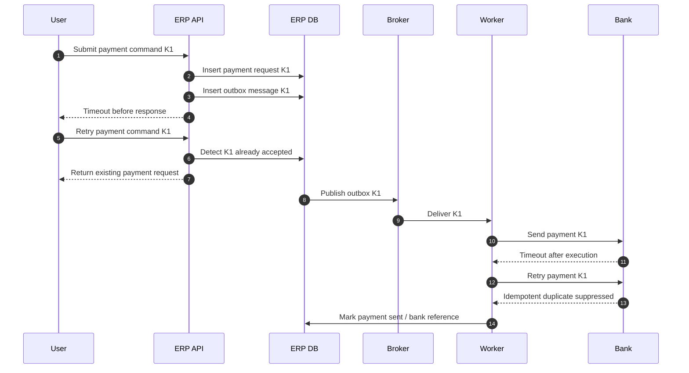
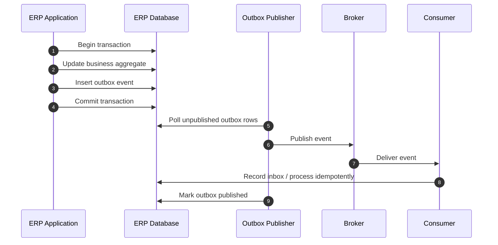
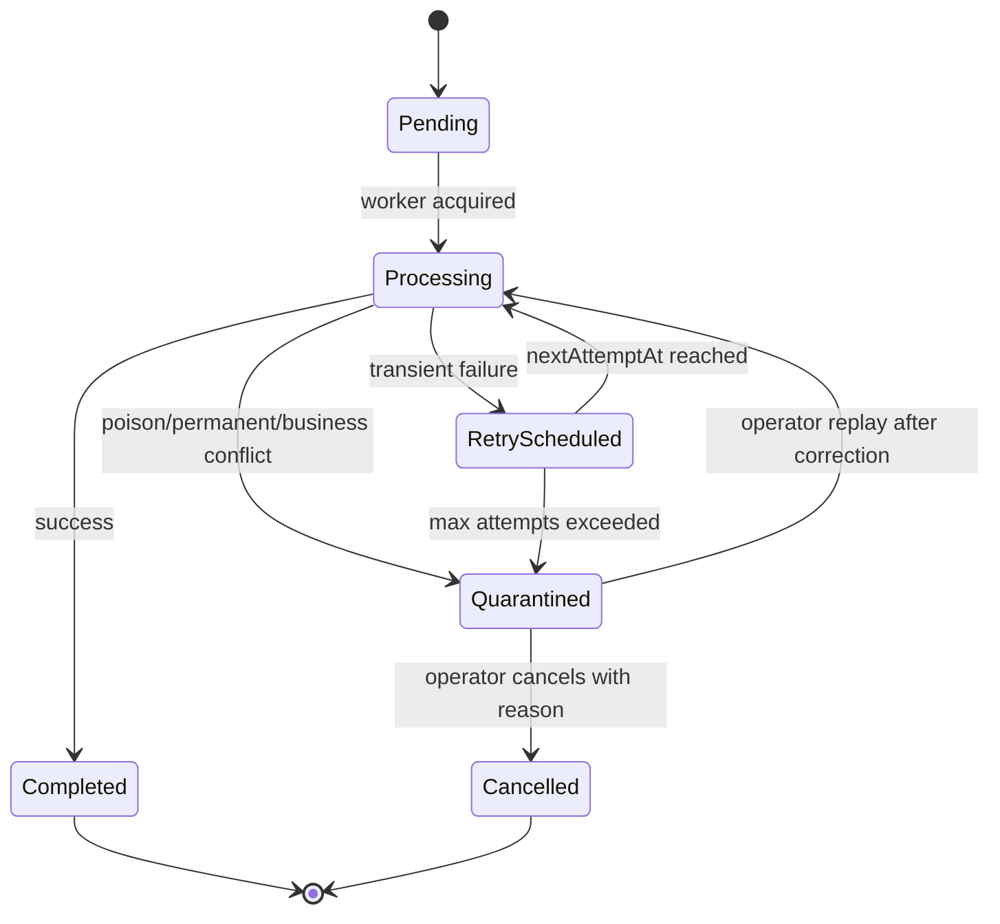
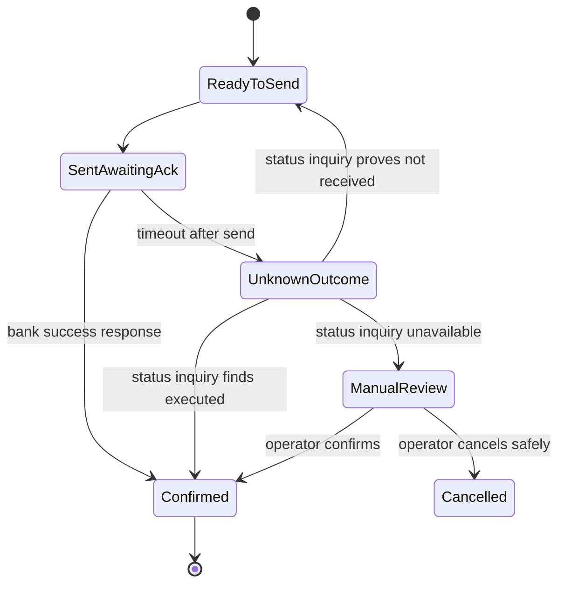
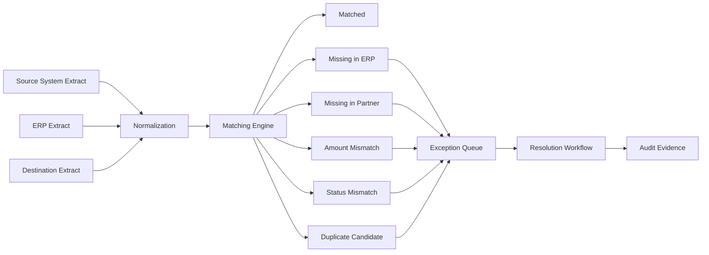

# Part 023 — Idempotency, Retry, Reconciliation, and Exactly-Once Illusions

## 1. Why This Part Matters

Large ERP systems fail less often because a single method throws an exception and more often because one business fact crosses a boundary twice, zero times, too late, in the wrong order, or without evidence.

Typical incidents look like this:

- a supplier invoice is imported twice;
- a payment request is retried after timeout and the bank executes both attempts;
- a warehouse shipment event arrives before the sales order allocation event;
- a customer payment is received but not matched to the AR invoice;
- an inventory adjustment succeeds locally but fails to reach the finance subledger;
- a nightly batch is re-run and posts another copy of the same journals;
- a message broker redelivers a message after the consumer already committed the database transaction;
- a user clicks submit twice and creates two purchase orders;
- an API caller times out and resends the same command with a different request id;
- an integration team says “the broker guarantees delivery”, but no one can prove whether the ERP processed the business fact.

In a small CRUD system, duplicate processing is annoying.
In a large ERP, duplicate processing can create financial misstatement, inventory mismatch, broken audit trail, month-end close delay, legal sequence gaps, and customer/vendor disputes.

The mental model for this part is:

> In ERP, reliability is not merely a transport property. Reliability is a business property proven by durable intent, idempotent execution, controlled retry, explicit exception handling, and reconciliation evidence.

A top-tier ERP engineer does not ask only:

> Did the HTTP call return 200?

They ask:

> Can we prove which business fact was intended, whether it was accepted, whether it was processed once in effect, whether downstream systems observed it, whether duplicates were suppressed, and whether exceptions are reconcilable?

---

## 2. Kaufman Skill Deconstruction

Following Kaufman's method, this skill must be decomposed into small capabilities that can be practiced independently.

| Sub-skill | What You Need to Learn | Failure If Ignored |
|---|---|---|
| Delivery semantics | At-most-once, at-least-once, effective-once, ordering, replay | Engineers believe the infrastructure solves business correctness |
| Idempotency design | How to design commands, events, imports, projections, and workflows to tolerate duplicates | Duplicate invoices, duplicate postings, duplicate payments |
| Durable intent | Outbox, inbox, command log, request ledger, processing ledger | Work disappears between database commit and message publish |
| Retry classification | Transient, permanent, business, security, capacity, and poison failures | Retry storms and silent data corruption |
| Reconciliation | Count, sum, hash, status, aging, exception queues, control accounts | Month-end discovers mismatch too late |
| Compensation | Reversal, cancellation, correction, adjustment, voiding, settlement repair | Illegal deletes and non-auditable fixes |
| Observability | Correlation id, causation id, business key, attempt id, replay id | Support cannot trace what happened |
| Operational control | DLQ, backoff, quarantine, replay, manual resolution, runbooks | Operators either do nothing or mutate production data unsafely |
| Testing | Duplicate, reorder, timeout, partial commit, replay, concurrent retry | Happy-path integration passes but production fails |

The 20-hour practice target is not to memorize patterns.
It is to become able to look at any ERP integration and answer:

1. What is the business fact?
2. Who owns it?
3. What is its stable identity?
4. What is the idempotency key?
5. What durable log proves intent and processing?
6. Which failures are retriable?
7. Which failures must be quarantined?
8. How do we reconcile source, ERP, and destination?
9. What is the legal/audit correction path?
10. How do we prove it worked?

---

## 3. The Exactly-Once Illusion

The phrase “exactly once” is dangerous because people use it at different layers.

| Layer | What “Once” Might Mean | Why It Is Not Enough |
|---|---|---|
| Network | Packet sent once | Network can lose, duplicate, delay, or reorder |
| HTTP client | Request attempted once | Client timeout may hide server-side success |
| Broker | Message delivered once | Broker guarantees rarely cover consumer database side effects |
| Consumer | Handler invoked once | Handler may crash after side effect and before acknowledgment |
| Database | Row inserted once | Business effect may be duplicate under different key |
| Business | Invoice/payment/posting has one effective outcome | This is the only level ERP users care about |

The correct ERP objective is usually **effective-once business processing**:

> The same business intent may be transmitted, retried, redelivered, re-read, or replayed many times, but it produces one accepted business outcome or one controlled rejection with evidence.

That is different from pretending duplicates never happen.

### 3.1 Failure Timeline: The Classic Duplicate



The important property is not that every component processed once.
The important property is that every component had a stable key and a duplicate decision.

---

## 4. Delivery Semantics You Must Model Explicitly

### 4.1 At-Most-Once

At-most-once means the system tries once and does not retry.

It avoids duplicates but allows loss.

Useful for:

- telemetry;
- non-critical notifications;
- transient UI hints;
- low-value cache invalidation.

Dangerous for:

- invoice posting;
- stock movement;
- payment execution;
- tax submission;
- approval decision;
- legal document generation.

### 4.2 At-Least-Once

At-least-once means the system retries until it believes processing happened.

It reduces loss but creates duplicates.

This is common in messaging systems and integration pipelines. For ERP, it is acceptable only when consumers are idempotent.

### 4.3 At-Exactly-Once Infrastructure

Some infrastructure offers exactly-once processing under specific constraints.
That does not remove the need for business idempotency.

Reasons:

- external systems may not participate in the same transaction;
- users may submit duplicate business commands;
- batch jobs may be re-run;
- messages may be replayed for recovery;
- business keys may be unstable;
- different transports may deliver the same fact;
- manual repair may reintroduce a previously processed record.

### 4.4 Effective-Once Business Outcome

This is the ERP target.

Effective-once means:

- stable business intent identity;
- durable acceptance record;
- deterministic duplicate handling;
- side-effect ledger;
- state transition guard;
- reconciliation evidence;
- auditable correction path.

---

## 5. ERP Idempotency Taxonomy

Not all idempotency is the same.
An ERP platform needs multiple idempotency scopes.

| Scope | Example | Key | Expected Duplicate Behavior |
|---|---|---|---|
| API command | Submit purchase requisition | `tenant + requester + clientRequestId` | Return original accepted command result |
| Business document | Supplier invoice import | `vendor + invoiceNumber + invoiceDate + legalEntity` | Reject duplicate or link to existing invoice |
| Posting | GL posting request | `sourceDocumentType + sourceDocumentId + postingPurpose` | Return existing journal |
| Payment | Bank payment execution | `paymentInstructionId` | Return same bank execution reference |
| Event projection | Update read model from event | `eventId` or `aggregateId + version` | Skip already applied event |
| Workflow task | Approver decision | `taskId + actor + decisionSequence` | Return already recorded decision |
| Batch import | CSV file import row | `fileId + rowNumber + rowHash` | Skip, reject, or mark duplicate |
| Reconciliation run | Daily bank recon | `account + statementDate + statementId` | Continue or return existing run |
| External callback | Payment gateway webhook | `provider + webhookId` | Acknowledge duplicate without reprocessing |

The mistake is to rely on only one key type.
A robust ERP usually combines:

- technical event id;
- source system id;
- natural business key;
- document identity;
- version;
- semantic purpose;
- hash/fingerprint;
- legal entity/tenant scope.

---

## 6. The ERP Idempotency Contract

Every command/event/import should answer these questions.

| Question | Why It Matters |
|---|---|
| What is the idempotency key? | Duplicate suppression cannot work without stable identity |
| Who generated the key? | Client-generated and server-generated keys have different risks |
| What is the key scope? | A vendor invoice number may be unique only per vendor and legal entity |
| What is the retention period? | Duplicate may arrive weeks later during replay or partner re-send |
| What response is returned for duplicate? | API callers need deterministic behavior |
| Is the payload allowed to differ for same key? | Detect accidental key reuse or data tampering |
| Is duplicate accepted, rejected, linked, or ignored? | Business semantics differ by domain |
| What is logged as evidence? | Audit needs the reason for duplicate decision |

### 6.1 Idempotency Key Design

Good idempotency keys are:

- stable across retry;
- scoped by tenant/legal entity/source;
- generated before side effects;
- stored durably;
- linked to payload fingerprint;
- retained long enough for operational replay;
- visible to support users;
- included in logs, traces, and reconciliation reports.

Bad idempotency keys are:

- random per retry;
- based on database auto-increment id created after accepting the command;
- based only on timestamp;
- based only on user id;
- hidden in code;
- not persisted;
- not included in downstream calls;
- not protected by a unique constraint.

### 6.2 Payload Fingerprint

If the same key arrives with a different payload, it is not a harmless duplicate.
It may be:

- client bug;
- replay with corrupted data;
- malicious tampering;
- source system reusing keys incorrectly;
- user resubmitting a changed document under old request id.

A command ledger should record a payload fingerprint.

```sql
create table erp_command_request (
    tenant_id           varchar(64) not null,
    idempotency_key     varchar(128) not null,
    command_type        varchar(80) not null,
    payload_hash        varchar(128) not null,
    status              varchar(40) not null,
    result_type         varchar(80),
    result_id           varchar(128),
    rejection_code      varchar(80),
    created_at          timestamp not null,
    completed_at        timestamp,
    created_by          varchar(128) not null,
    primary key (tenant_id, idempotency_key)
);
```

Duplicate behavior:

| Existing Status | Same Payload | Different Payload |
|---|---|---|
| `ACCEPTED` | Return accepted status | Reject as idempotency conflict |
| `COMPLETED` | Return original result | Reject as idempotency conflict |
| `REJECTED` | Return original rejection | Reject or return original rejection based on policy |
| `IN_PROGRESS` | Return pending or retry later | Reject as conflict |
| `UNKNOWN` | Quarantine | Quarantine |

---

## 7. Durable Intent: Outbox, Inbox, and Processing Ledger

The hardest reliability bug is the gap between:

1. committing local database changes; and
2. publishing a message or calling an external service.

If the database commit succeeds but publish fails, the world never hears about the business fact.
If publish succeeds but database commit fails, the world hears about a fact that does not exist.

### 7.1 Outbox Pattern

The outbox records integration intent inside the same database transaction as the business change.
A separate publisher safely sends it later.



Outbox table example:

```sql
create table erp_outbox_event (
    outbox_id           uuid primary key,
    tenant_id           varchar(64) not null,
    aggregate_type      varchar(80) not null,
    aggregate_id        varchar(128) not null,
    aggregate_version   bigint not null,
    event_type          varchar(120) not null,
    event_key           varchar(200) not null,
    causation_id        varchar(128),
    correlation_id      varchar(128),
    payload_json        text not null,
    payload_hash        varchar(128) not null,
    status              varchar(40) not null,
    attempts            int not null default 0,
    next_attempt_at     timestamp,
    created_at          timestamp not null,
    published_at        timestamp,
    unique (tenant_id, event_key)
);
```

Design rules:

- write outbox inside the same transaction as the source fact;
- make event identity stable;
- include aggregate version or source version;
- publish asynchronously;
- retry publishing safely;
- do not delete outbox rows immediately;
- expose outbox backlog as operational metric;
- do not treat outbox published as downstream processed.

### 7.2 Inbox Pattern

The inbox records received messages before or during processing so duplicates can be suppressed.

```sql
create table erp_inbox_message (
    tenant_id           varchar(64) not null,
    source_system       varchar(80) not null,
    message_id          varchar(160) not null,
    message_type        varchar(120) not null,
    payload_hash        varchar(128) not null,
    status              varchar(40) not null,
    received_at         timestamp not null,
    processed_at        timestamp,
    failure_code        varchar(80),
    failure_message     text,
    primary key (tenant_id, source_system, message_id)
);
```

Consumer rule:

1. receive message;
2. compute message key and payload hash;
3. insert inbox row with unique key;
4. if duplicate with same hash, acknowledge and skip or return original result;
5. if duplicate with different hash, quarantine;
6. process business side effect;
7. mark inbox processed;
8. publish further outbox events if needed.

### 7.3 Processing Ledger

Some side effects need their own ledger, not merely outbox/inbox.

Examples:

- payment execution ledger;
- tax submission ledger;
- GL posting ledger;
- inventory movement ledger;
- notification delivery ledger;
- partner file transmission ledger;
- report generation ledger.

A processing ledger answers:

> For this business purpose, has this source fact already produced this side effect?

Example:

```sql
create table erp_processing_ledger (
    tenant_id           varchar(64) not null,
    process_type        varchar(80) not null,
    source_type         varchar(80) not null,
    source_id           varchar(128) not null,
    semantic_purpose    varchar(80) not null,
    status              varchar(40) not null,
    result_reference    varchar(160),
    attempts            int not null default 0,
    created_at          timestamp not null,
    completed_at        timestamp,
    primary key (tenant_id, process_type, source_type, source_id, semantic_purpose)
);
```

The `semantic_purpose` matters.
The same sales invoice may produce:

- initial AR posting;
- tax reporting;
- customer notification;
- revenue recognition schedule;
- analytics event;
- document archive.

Each purpose needs its own idempotency boundary.

---

## 8. Retry Is a Business Decision, Not a Loop

A retry policy is not:

```java
while (true) {
    trySend();
}
```

A retry policy is a controlled state machine.



### 8.1 Failure Classification

| Failure Type | Example | Retry? | Action |
|---|---|---:|---|
| Transient technical | Network timeout, temporary broker unavailable | Yes | Backoff + jitter |
| Capacity | DB pool exhausted, rate limit | Yes, slower | Throttle and alert |
| Permanent technical | Invalid endpoint config, schema mismatch | No automatic retry after threshold | Quarantine and fix config/code |
| Business validation | Vendor blocked, period closed, credit exceeded | Usually no | Route to business exception queue |
| Security | Unauthorized token, certificate expired | No blind retry | Rotate credential / alert security |
| Duplicate | Same idempotency key and same payload | No side effect | Return existing result |
| Idempotency conflict | Same key different payload | No | Quarantine / reject |
| Poison message | Handler always fails on same payload | No after threshold | DLQ with evidence |
| Unknown outcome | External call timed out after possible execution | Do not blindly repeat | Query status / reconcile first |

### 8.2 Backoff and Jitter

Without backoff, retries amplify incidents.

A retry storm can turn a 30-second database slowdown into a multi-hour outage.

A sane retry policy includes:

- max attempts;
- exponential backoff;
- random jitter;
- per-partner rate limits;
- circuit breaker;
- retry budget;
- queue depth monitoring;
- dead-letter/quarantine path;
- operator-visible reason code.

### 8.3 Unknown Outcome Is Not Failure

The most dangerous state is not failure.
The most dangerous state is **unknown outcome**.

Example:

1. ERP sends payment to bank.
2. Bank times out.
3. ERP does not know whether the bank executed.
4. ERP retries.
5. Bank executes twice.

Correct model:



Rule:

> If an external side effect may have happened, query/reconcile before retrying the side effect.

---

## 9. Java Implementation Sketch: Idempotent Command Handler

This is not generic Spring/JPA material.
The point is the ERP-specific control shape.

```java
public final class IdempotentCommandService {

    private final CommandLedgerRepository ledger;
    private final PurchaseOrderApplicationService purchaseOrders;
    private final PayloadHasher hasher;

    public CommandResult submitPurchaseOrder(
            TenantId tenantId,
            String idempotencyKey,
            SubmitPurchaseOrderCommand command,
            Actor actor
    ) {
        String payloadHash = hasher.sha256CanonicalJson(command);

        CommandLedgerRecord existing = ledger.find(tenantId, idempotencyKey);
        if (existing != null) {
            if (!existing.payloadHash().equals(payloadHash)) {
                throw new IdempotencyConflictException(
                        "Same idempotency key was used with a different payload"
                );
            }
            return existing.toCommandResult();
        }

        CommandLedgerRecord accepted = CommandLedgerRecord.accepted(
                tenantId,
                idempotencyKey,
                "SubmitPurchaseOrder",
                payloadHash,
                actor.id()
        );

        ledger.insert(accepted); // unique constraint protects concurrent duplicates

        try {
            PurchaseOrderId poId = purchaseOrders.createFromApprovedCommand(command, actor);
            ledger.markCompleted(tenantId, idempotencyKey, "PurchaseOrder", poId.value());
            return CommandResult.completed("PurchaseOrder", poId.value());
        } catch (BusinessRejection ex) {
            ledger.markRejected(tenantId, idempotencyKey, ex.code(), ex.getMessage());
            return CommandResult.rejected(ex.code(), ex.getMessage());
        }
    }
}
```

Important design notes:

- the ledger insert must be protected by a unique constraint;
- payload must be canonicalized before hashing;
- duplicate request should return original outcome, not create new work;
- business rejection can be recorded as an outcome;
- conflict must be explicit;
- command result must not depend on volatile transient state;
- for long-running commands, return accepted/pending with correlation id.

---

## 10. Canonical Payload Hashing

Hashing raw JSON is often wrong because two equivalent payloads can have different formatting or field order.

Canonical hashing rules:

- stable field ordering;
- stable date/time format;
- explicit timezone treatment;
- stable number scale/rounding;
- no volatile fields such as request timestamp unless semantically relevant;
- normalized whitespace;
- normalized default values;
- schema version included;
- tenant/source context included when necessary.

Example semantic fingerprint fields for supplier invoice import:

```text
tenantId
legalEntityId
vendorId
vendorInvoiceNumber
vendorInvoiceDate
currency
invoiceGrossAmount
lineCount
lineItemSkuAndAmountHash
sourceSystem
sourceDocumentId
schemaVersion
```

A good fingerprint detects meaningful differences without being disturbed by formatting noise.

---

## 11. Idempotency by ERP Domain

### 11.1 Procure-to-Pay

| Process | Idempotency Key | Notes |
|---|---|---|
| Requisition submission | requester + client request id | User double-click safe |
| Purchase order creation | requisition id + conversion purpose | Prevent multiple POs from same approved requisition unless split intentionally |
| Goods receipt import | warehouse + ASN/receipt source id | External WMS may resend |
| Supplier invoice import | vendor + invoice number + legal entity | Natural duplicate detection matters |
| 3-way matching | invoice id + match run id or match version | Re-run should not duplicate match result |
| AP posting | invoice id + posting purpose | One initial liability posting |
| Payment proposal | payment run id + invoice id | Prevent duplicate inclusion |
| Bank payment | payment instruction id | Must survive timeout and replay |

### 11.2 Order-to-Cash

| Process | Idempotency Key | Notes |
|---|---|---|
| Sales order submission | channel + cart/order id | E-commerce retries are common |
| Allocation | sales order line + allocation purpose + version | Reallocation must be explicit |
| Shipment confirmation | WMS shipment id | WMS may resend status |
| Invoice generation | shipment id or order milestone + billing purpose | Prevent duplicate invoice |
| AR posting | invoice id + posting purpose | Link journal to invoice |
| Cash application | bank statement line id + invoice id | Prevent duplicate receipt matching |
| Return authorization | original sale + return request id | Avoid duplicate returns |
| Credit note | return id + credit purpose | Avoid duplicate credits |

### 11.3 Inventory

| Process | Idempotency Key | Notes |
|---|---|---|
| Stock movement | movement source + source id + line id | Ledger must not duplicate movement |
| Reservation | demand id + item + location + reservation purpose | Avoid over-reservation |
| Pick confirmation | pick task id + picked line version | WMS event duplicates common |
| Cycle count adjustment | count session + item + bin + serial/lot | Re-run should update result, not duplicate |
| Manufacturing issue | work order + component line + issue sequence | Backflush must be safe |
| Completion receipt | work order + completion batch | Avoid duplicate finished goods receipt |

### 11.4 General Ledger

| Process | Idempotency Key | Notes |
|---|---|---|
| Subledger posting | source document + posting purpose | One journal per purpose |
| Reversal | original journal + reversal reason + reversal sequence | Reversal is separate legal event |
| Adjustment | adjustment request id | Must be approved and auditable |
| Period close task | fiscal period + task code + run id | Re-run must be controlled |
| Balance projection | journal id + projection version | Projection idempotency separate from posting |

---

## 12. Reconciliation as First-Class Architecture

Reconciliation is not a report at the end.
It is a core reliability mechanism.

A system that cannot reconcile cannot prove correctness.

### 12.1 Reconciliation Types

| Type | Example | Purpose |
|---|---|---|
| Count reconciliation | Number of invoices sent vs received | Detect missing/extra records |
| Sum reconciliation | Total payment amount in ERP vs bank | Detect amount mismatch |
| Hash reconciliation | File hash or line fingerprint | Detect tampering/corruption |
| Status reconciliation | ERP says shipped, WMS says pending | Detect lifecycle mismatch |
| Balance reconciliation | Inventory subledger vs GL control account | Detect financial mismatch |
| Aging reconciliation | Items stuck in pending > threshold | Detect operational blockage |
| Sequence reconciliation | Legal invoice sequence gaps | Detect missing/voided document |
| Cross-system reference reconciliation | ERP document not known by partner | Detect integration loss |

### 12.2 Reconciliation Architecture



### 12.3 Control Totals

For file/batch integrations, control totals are mandatory.

Example file manifest:

```json
{
  "sourceSystem": "WMS-EU-01",
  "fileId": "SHIPMENT-2026-07-01-001",
  "businessDate": "2026-07-01",
  "recordCount": 125000,
  "totalQuantity": "884321.000",
  "totalAmount": "0.00",
  "payloadSha256": "...",
  "createdAt": "2026-07-01T02:00:00Z"
}
```

The import should verify:

- file id has not been processed before;
- manifest hash matches payload;
- record count matches parsed rows;
- quantity/amount totals match;
- schema version is supported;
- business date is acceptable;
- source system is authorized;
- import result has matched count, rejected count, duplicate count, and quarantined count.

---

## 13. Reconciliation Data Model

```sql
create table erp_reconciliation_run (
    run_id              uuid primary key,
    tenant_id           varchar(64) not null,
    recon_type          varchar(80) not null,
    scope_key           varchar(200) not null,
    business_date       date not null,
    status              varchar(40) not null,
    source_count        bigint,
    erp_count           bigint,
    destination_count   bigint,
    source_total        numeric(30, 6),
    erp_total           numeric(30, 6),
    destination_total   numeric(30, 6),
    started_at          timestamp not null,
    completed_at        timestamp,
    created_by          varchar(128) not null,
    unique (tenant_id, recon_type, scope_key, business_date)
);

create table erp_reconciliation_exception (
    exception_id        uuid primary key,
    run_id              uuid not null references erp_reconciliation_run(run_id),
    exception_type      varchar(80) not null,
    severity            varchar(40) not null,
    source_reference    varchar(200),
    erp_reference       varchar(200),
    destination_reference varchar(200),
    expected_value      text,
    actual_value        text,
    status              varchar(40) not null,
    resolution_code     varchar(80),
    resolution_note     text,
    created_at          timestamp not null,
    resolved_at         timestamp,
    resolved_by         varchar(128)
);
```

The reconciliation exception is not merely a technical ticket.
It is business evidence.

---

## 14. Exception Queue Design

An exception queue is different from a dead-letter queue.

| Queue | Meaning | Owner |
|---|---|---|
| Dead-letter queue | Technical message cannot be processed automatically | Platform/integration team |
| Business exception queue | Business fact is valid structurally but cannot complete because of domain rule | Business operations |
| Reconciliation exception queue | Cross-system mismatch found | Joint business + support |
| Security exception queue | Unauthorized/suspicious request | Security/compliance |
| Data quality queue | Master/reference data issue blocks processing | Data governance team |

Exception queue item should include:

- business key;
- source system;
- payload snapshot or secure reference;
- failure reason code;
- severity;
- retry eligibility;
- suggested resolution;
- owner team;
- SLA;
- correlation id;
- related document;
- audit trail;
- allowed actions.

Allowed actions must be controlled.

Do not let operators “edit raw payload and replay” without evidence.

---

## 15. Compensation, Reversal, and Correction

ERP systems should rarely delete mistakes.
They correct them.

| Action | Meaning | Example |
|---|---|---|
| Retry | Attempt same side effect again because previous attempt did not complete | Re-send message to broker |
| Replay | Process historical fact again through idempotent handler | Rebuild projection |
| Reverse | Create equal and opposite financial/stock effect | Reverse wrong journal |
| Void | Mark unused legal document number as void with reason | Void invoice number generated in error |
| Cancel | Stop a document before irreversible business effect | Cancel draft PO |
| Adjust | Add explicit correction transaction | Inventory adjustment after count |
| Amend | Create new revision while retaining history | Amend contract terms |
| Reconcile | Match/resolve difference between systems | Match payment to invoice |

The key rule:

> Correction must preserve evidence of the original mistake and the authorized remedy.

### 15.1 Bad Fix

```sql
delete from gl_journal where journal_id = 'J-123';
```

This destroys evidence.

### 15.2 Better Fix

- create reversal journal;
- link reversal to original journal;
- require approval;
- record reason code;
- include period policy;
- expose both in audit timeline;
- update reconciliation status.

---

## 16. Ordering and Versioning

Duplicate handling is not enough.
Some ERP facts must be processed in order.

Example:

1. sales order created;
2. sales order approved;
3. shipment confirmed;
4. invoice generated;
5. payment received.

If event 3 arrives before event 2, the consumer must not pretend the world is fine.

Ordering strategies:

| Strategy | Use Case | Trade-off |
|---|---|---|
| Aggregate version | Events for same aggregate | Requires versioned aggregate |
| Sequence per source | File rows or partner events | Source must guarantee sequence |
| State guard | Reject illegal transition | Needs lifecycle model |
| Holding buffer | Temporarily hold future event | Requires timeout and cleanup |
| Reconciliation repair | Accept eventual mismatch and repair | Requires strong exception process |
| Snapshot replacement | Latest state wins | Dangerous for financial facts |

For ERP financial and stock facts, “latest wins” is usually wrong.

### 16.1 Event Version Guard

```java
public void applyShipmentEvent(ShipmentConfirmed event) {
    ProjectionState state = repository.getState(event.shipmentId());

    if (state.hasApplied(event.eventId())) {
        return;
    }

    if (event.aggregateVersion() != state.nextExpectedVersion()) {
        repository.recordOutOfOrder(event);
        throw new OutOfOrderEventException(event.shipmentId(), event.aggregateVersion());
    }

    state.apply(event);
    state.markApplied(event.eventId());
    repository.save(state);
}
```

---

## 17. Multi-System Correlation Model

You cannot operate a large ERP without correlation.

Minimum identifiers:

| Identifier | Meaning |
|---|---|
| `traceId` | Technical distributed trace |
| `correlationId` | Business process correlation across commands/events |
| `causationId` | Immediate cause of this event/command |
| `idempotencyKey` | Duplicate suppression key |
| `sourceSystem` | Origin of the fact |
| `sourceDocumentId` | Source-side business reference |
| `erpDocumentId` | ERP-side document reference |
| `externalReference` | Destination-side reference |
| `attemptId` | Specific retry attempt |
| `replayId` | Specific replay operation |

Every log/event/exception should carry enough of this to answer:

- what happened;
- why it happened;
- what caused it;
- whether it was duplicate;
- whether it was retried;
- what downstream result was produced;
- how to reconcile it.

---

## 18. Observability Metrics

Technical metrics:

- outbox backlog count;
- outbox oldest age;
- publish attempts per event;
- inbox duplicate count;
- DLQ size;
- retry queue depth;
- retry success rate;
- max processing latency;
- handler error rate;
- downstream timeout rate.

Business metrics:

- unposted invoice count;
- unmatched payment count;
- unreconciled shipment count;
- stock movement pending finance count;
- GL posting exceptions;
- bank payment unknown outcome count;
- duplicate supplier invoice attempts;
- legal sequence gaps;
- stuck approval tasks;
- SLA breach count.

A top-tier ERP monitoring dashboard does not show only CPU and memory.
It shows business process health.

---

## 19. Testing Strategy

### 19.1 Duplicate Tests

Test same command twice:

- same key, same payload;
- same key, different payload;
- different key, same natural business document;
- concurrent duplicate submission;
- duplicate after completed;
- duplicate while in progress;
- duplicate after rejection.

### 19.2 Retry Tests

Inject:

- broker publish failure after DB commit;
- DB failure before outbox insert;
- consumer failure after side effect before ack;
- external timeout after possible execution;
- downstream rate limit;
- poison payload;
- schema mismatch;
- unauthorized credential;
- max retry exhausted.

### 19.3 Reconciliation Tests

Create datasets with:

- missing source row;
- missing ERP row;
- missing destination row;
- amount mismatch;
- status mismatch;
- duplicate candidate;
- sequence gap;
- wrong currency;
- timezone boundary issue;
- partial file import.

### 19.4 Property-Based Invariants

For generated sequences of retries, duplicates, and replays:

- one supplier invoice business key creates at most one active payable;
- one posted document purpose creates at most one initial GL journal;
- duplicate stock movement key does not change stock twice;
- payment unknown outcome is not blindly re-executed;
- replayed events do not change final read model after first application;
- every quarantined item has owner, reason, and audit evidence.

---

## 20. Failure Modes and Anti-Patterns

| Anti-pattern | Why It Fails | Better Approach |
|---|---|---|
| “Broker guarantees exactly once” | Does not cover business side effects and external systems | Design effective-once business processing |
| Random idempotency key per retry | Duplicate cannot be detected | Stable client/source/business key |
| Retry all exceptions | Business/security failures become storms | Classify failure and route appropriately |
| Delete bad data | Destroys audit evidence | Reverse, void, adjust, or amend |
| No payload hash | Same key can mutate meaning | Store canonical fingerprint |
| DLQ as graveyard | Failures are hidden | Owned exception workflow and SLA |
| Reporting as reconciliation | Too late and too passive | Dedicated recon runs and exception queues |
| Manual SQL repair | Uncontrolled, unaudited changes | Governed admin action with evidence |
| Source-only uniqueness | Cross-tenant/legal entity duplicates | Scope keys correctly |
| “Latest status wins” | Financial/stock facts lose history | Append-only ledger and state guards |
| Infinite replay | Reprocesses poison forever | Replay policy, dry-run, and cutoff |
| Outbox deletion too soon | Cannot audit or recover | Retain by policy and archive safely |

---

## 21. Design Review Checklist

Use this checklist in architecture review.

### 21.1 Command/API

- Does every mutating command have an idempotency key?
- Is the key stable across retry?
- Is the key scoped correctly?
- Is payload hash stored?
- Is duplicate behavior defined?
- Is conflict behavior defined?
- Is unique constraint enforced in the database?
- Is the response deterministic for duplicate commands?

### 21.2 Messaging

- Is outbox written in same transaction as business state?
- Is inbox used by consumers?
- Is event identity stable?
- Is ordering required and enforced?
- Is replay supported safely?
- Is duplicate event application harmless?
- Are broker acknowledgments aligned with DB commit?

### 21.3 External Side Effects

- Is the external request idempotent?
- Is unknown outcome modelled?
- Is status inquiry available?
- Is blind retry prohibited after possible execution?
- Is external reference stored?
- Is reconciliation scheduled?

### 21.4 Retry and Exception

- Are failures classified?
- Is backoff with jitter used?
- Is max attempt configured?
- Is DLQ/quarantine visible?
- Is owner assigned?
- Is manual replay controlled?
- Is every resolution audited?

### 21.5 Reconciliation

- Are count/sum/hash/status reconciliations defined?
- Are control totals captured?
- Are exceptions routed to workflow?
- Is aging monitored?
- Are close blockers visible?
- Can support answer “what happened” without raw SQL?

---

## 22. 20-Hour Practice Plan

### Hour 1-3: Failure Vocabulary

Take five ERP processes:

- supplier invoice import;
- bank payment execution;
- WMS shipment confirmation;
- stock movement posting;
- GL journal posting.

For each, define:

- business fact;
- source of truth;
- idempotency key;
- duplicate behavior;
- retry behavior;
- reconciliation method.

### Hour 4-6: Build Command Ledger

Implement a small Java/Spring command ledger:

- accept command;
- hash payload;
- enforce unique idempotency key;
- return original result on duplicate;
- reject same key/different payload.

### Hour 7-9: Build Outbox/Inbox

Implement:

- outbox table;
- poller;
- publisher simulation;
- inbox table;
- duplicate consumer suppression.

Inject failures after DB commit and before publish.

### Hour 10-12: Retry State Machine

Implement retry states:

- pending;
- processing;
- retry scheduled;
- quarantined;
- completed;
- cancelled.

Add transient/permanent/business failure classification.

### Hour 13-15: Reconciliation Engine

Build a small reconciliation engine for ERP vs partner records:

- match by key;
- detect missing;
- detect amount mismatch;
- detect duplicate;
- generate exception queue.

### Hour 16-18: Unknown Outcome Simulation

Simulate bank timeout after possible payment execution.

Rules:

- do not retry immediately;
- query status first;
- if unknown remains, route to manual review;
- record evidence.

### Hour 19-20: Architecture Review

Review your design using the checklist above.

Your output should include:

- idempotency matrix;
- retry policy;
- reconciliation plan;
- exception queue model;
- sequence diagram;
- failure-mode table;
- runbook outline.

---

## 23. Source Notes

- Jakarta Messaging describes APIs for Java applications to create, send, and receive messages through loosely coupled, reliable asynchronous communication services.
- The idempotent consumer pattern is necessary in at-least-once delivery environments because message handlers may receive the same message repeatedly.
- The transactional outbox pattern is commonly used to publish messages reliably when a service updates a database and must also notify other systems.
- Jakarta Batch defines a Java API and job specification language for batch jobs, useful for controlled import/export/reconciliation workloads.
- PostgreSQL transaction and locking behavior matters when implementing command ledgers, outbox polling, unique constraints, and concurrent duplicate suppression.

---

## 24. Key Takeaways

- Exactly-once should be treated as an illusion unless defined at the business outcome level.
- ERP correctness requires stable identity, idempotent behavior, durable intent, retry classification, and reconciliation.
- Retry is a state machine, not a loop.
- Unknown outcome must be resolved by inquiry/reconciliation before repeating irreversible side effects.
- Outbox proves local intent; inbox protects consumers; processing ledger protects semantic side effects.
- Reconciliation is not optional reporting. It is the proof mechanism that business facts survived distributed processing.
- Audit-safe correction uses reversal, void, adjustment, amendment, or controlled replay, not destructive mutation.
