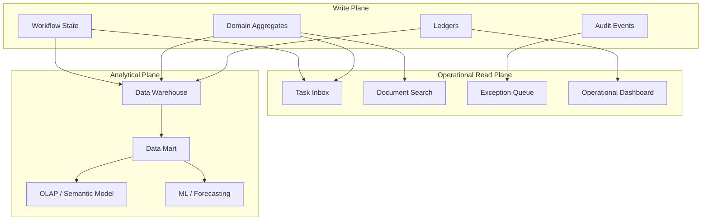
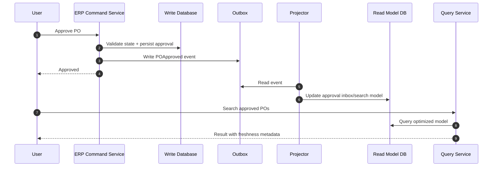
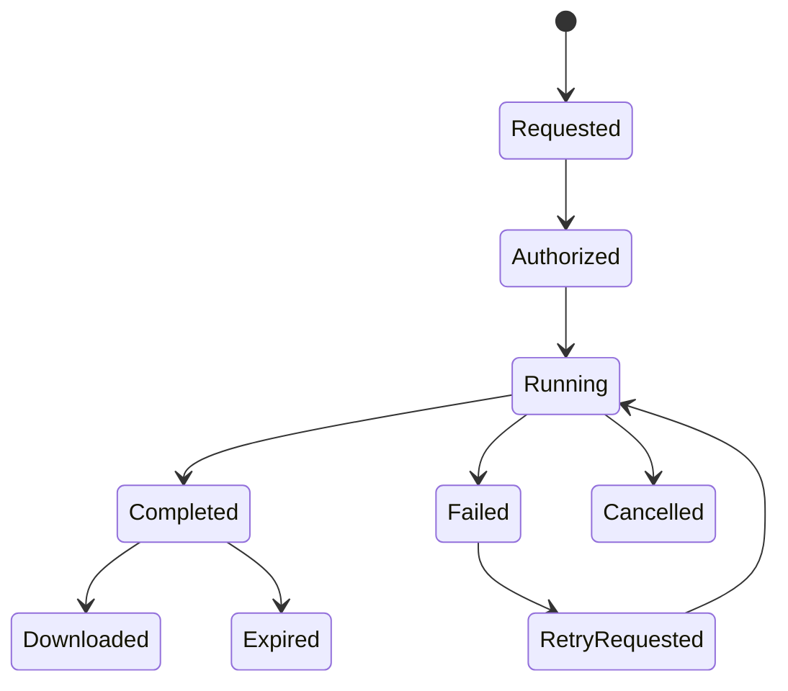
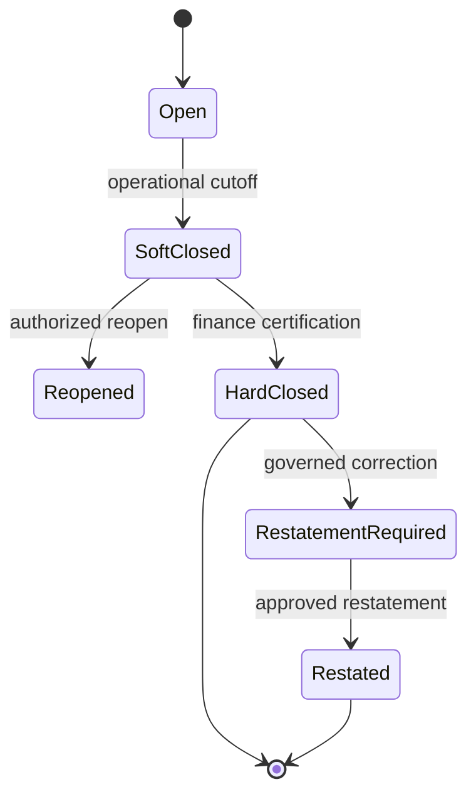

# Part 024 — Reporting, Analytics, and Operational Read Models

## 1. Why This Part Matters

ERP users do not only enter transactions.
They ask questions.

Examples:

- What is our cash position today?
- Which supplier invoices are due this week?
- Which purchase orders are approved but not received?
- Which shipments are confirmed but not invoiced?
- What is inventory by item, lot, warehouse, and valuation layer?
- What is the trial balance for this fiscal period?
- Which approval tasks are breaching SLA?
- Which bank payments are unknown outcome?
- Which manufacturing work orders are short on material?
- Which customer accounts exceed credit limit?
- What changed since the last close?
- Can we prove this report matches the posted ledger?

In a large ERP, reporting is not a UI feature.
It is an architecture plane.

Bad reporting architecture can:

- overload OLTP tables;
- lock critical posting paths;
- produce inconsistent numbers;
- mix draft and posted facts incorrectly;
- leak tenant/company data;
- ignore fiscal period locks;
- hide reconciliation exceptions;
- create unofficial spreadsheets as shadow systems;
- break month-end close;
- produce numbers no one trusts.

The mental model for this part is:

> Write models protect business truth. Read models serve business questions. Analytics models explain patterns. They are related, but they are not the same model.

---

## 2. Kaufman Skill Deconstruction

Following Kaufman's method, we decompose ERP reporting into trainable sub-skills.

| Sub-skill | What You Need to Learn | Failure If Ignored |
|---|---|---|
| Question taxonomy | Operational, financial, compliance, management, analytical questions | One reporting approach is forced onto all use cases |
| Data semantics | Posting date, document date, transaction date, effective date, as-of date | Reports disagree because time meaning differs |
| Read model design | Projection, materialized view, reporting table, search index, OLAP cube | OLTP schema becomes reporting API |
| Freshness model | Real-time, near-real-time, scheduled, close-certified | Users do not know whether numbers are final |
| Financial correctness | Trial balance, subledger reconciliation, control accounts | Reports are fast but wrong |
| Security | Tenant, company, branch, cost center, SoD, export controls | Sensitive data leaks through reports |
| Performance | Pagination, indexing, pre-aggregation, batch refresh | Reports block transactions |
| Lineage | Source document, transformation, refresh time, version | No one can explain where numbers came from |
| Operability | Failed refresh, stale projection, report SLA, exception alerts | Reporting silently degrades |
| Governance | Certified reports vs ad-hoc reports | Multiple versions of truth emerge |

The target skill is the ability to design a report by asking:

1. What business decision does this report support?
2. Is the report operational, financial, compliance, or analytical?
3. What is the source of truth?
4. What is the correct time axis?
5. Does it need posted-only data or also draft/in-flight data?
6. Does it need real-time freshness?
7. What security scope applies?
8. How is it reconciled?
9. How is it refreshed?
10. How do we prove lineage?

---

## 3. ERP Question Taxonomy

Different questions require different models.

| Question Type | Example | Best Serving Model | Correctness Requirement |
|---|---|---|---|
| Operational | Which POs are waiting approval? | Operational read model/search index | Fresh, workflow-state accurate |
| Transactional lookup | Show invoice details | Normalized write/read aggregate | Strongly consistent enough for user action |
| Financial statement | Trial balance, P&L | Ledger-derived financial model | Posted, period-aware, reconcilable |
| Exception management | Shipments not invoiced | Reconciliation/exception read model | Cross-system/status accurate |
| Compliance | Who approved this payment? | Audit/evidence model | Immutable, complete, traceable |
| Management dashboard | Revenue by region | Aggregated analytics mart | Defined freshness and dimensions |
| Planning | Material shortage forecast | Planning snapshot/model | Scenario/version aware |
| Data science | Demand prediction | Lakehouse/feature model | Historical, curated, explainable |
| Support | Why did this posting fail? | Operational observability model | Near-real-time with correlation |

A common ERP mistake is to use the same SQL join for all of these.

That creates reports that are:

- too slow for operations;
- not controlled enough for finance;
- too stale for support;
- too normalized for analytics;
- too broad for security;
- too fragile for change.

---

## 4. The Three Planes of ERP Data Serving



### 4.1 Write Plane

The write plane enforces invariants:

- balanced journals;
- stock movement rules;
- legal numbering;
- approval state transitions;
- SoD;
- period lock;
- document immutability.

Do not compromise write-plane clarity to satisfy arbitrary report queries.

### 4.2 Operational Read Plane

The operational read plane supports daily work:

- inboxes;
- queues;
- dashboards;
- search pages;
- exception lists;
- follow-up views;
- reconciliation views;
- support screens.

It is optimized for:

- current status;
- filtering;
- pagination;
- security scope;
- actionable drill-down;
- freshness;
- operational SLA.

### 4.3 Analytical Plane

The analytical plane supports:

- trends;
- management reporting;
- forecasts;
- multi-dimensional analysis;
- historical snapshots;
- large aggregations;
- external BI tools.

It is optimized for:

- scan-heavy workloads;
- dimensional modelling;
- pre-aggregation;
- historical consistency;
- data lineage;
- certified metrics.

---

## 5. OLTP Schema Is Not a Reporting API

An ERP OLTP schema is designed for correctness of writes.
A report model is designed for correctness of answers.

These are not the same.

### 5.1 Symptoms of Reporting-on-OLTP Collapse

- large reports run during business hours and block posting;
- users export millions of rows because pages are unusable;
- indexes are added only for reports and slow writes;
- reports join across many modules with unstable semantics;
- finance and operations reports disagree;
- “quick report” SQL becomes an unofficial API;
- security is applied inconsistently;
- every schema change breaks BI;
- replicas lag but users think reports are real-time;
- month-end close depends on fragile ad-hoc queries.

### 5.2 Better Rule

Use OLTP directly only for:

- small transactional detail lookup;
- strongly scoped user action screens;
- current aggregate state needed immediately after write;
- admin/support views with strict pagination.

Use dedicated read models for:

- dashboards;
- search;
- inboxes;
- exception queues;
- cross-module reports;
- financial statements;
- high-volume exports;
- BI/analytics;
- historical snapshots;
- reconciliation.

---

## 6. Read Model Patterns

| Pattern | Use When | Trade-off |
|---|---|---|
| Synchronous denormalized table | Need immediate read after write | Adds write-path complexity |
| Asynchronous projection | Need scalable read model | Eventual consistency |
| Materialized view | SQL aggregate/report over relational data | Refresh strategy matters |
| Search index | Need free-text/filter-heavy search | Index consistency and security filtering |
| Reporting table | Stable operational report | ETL/projection ownership |
| Snapshot table | Need as-of reporting | Storage and versioning |
| Data mart | Department/domain analytics | Metric governance |
| Semantic layer | Certified cross-domain metrics | Requires ownership and change control |
| Lakehouse/raw zone | Historical/ML/exploratory analytics | Needs curation before business use |

### 6.1 CQRS-Lite for ERP

CQRS in ERP does not always mean separate services for every command/query.
A practical pattern is **CQRS-lite**:

- write model remains normalized and invariant-focused;
- read model is explicit and optimized for questions;
- projection is owned by the same module or reporting platform;
- staleness is declared;
- reconciliation is defined;
- reports do not mutate business truth.



---

## 7. Time Semantics: The Source of Many Reporting Bugs

ERP reports fail when time dimensions are vague.

| Time Field | Meaning | Example |
|---|---|---|
| Document date | Business date on document | Supplier invoice date |
| Transaction date | Date economic event occurred | Goods received date |
| Posting date | Date entered into accounting ledger | AP invoice posting date |
| Fiscal period | Accounting bucket | FY2026-P07 |
| Effective date | Date configuration/master data becomes valid | Tax rate valid from July 1 |
| Created at | System creation timestamp | User submitted PO at 10:15 UTC |
| Approved at | Workflow decision timestamp | Manager approved at 11:00 local time |
| Settled at | Payment/clearing timestamp | Bank settlement date |
| As-of time | Snapshot evaluation time | Inventory as of close |
| Refresh time | When read model/report was generated | Dashboard updated 5 minutes ago |

A report specification must state which time axis it uses.

Example:

- “AP aging as of July 31” uses invoice due date and open balance as-of date.
- “Trial balance for FY2026-P07” uses posting date/fiscal period and posted journals.
- “Purchases this month” may use PO date, receipt date, invoice date, or posting date depending on question.

Never let report names hide time semantics.

---

## 8. Financial Reporting Model

Financial reports must derive from posted ledger facts, not mutable operational documents.

Core reports:

- trial balance;
- general ledger detail;
- balance sheet;
- profit and loss;
- cash flow support schedule;
- AP aging;
- AR aging;
- tax report;
- subledger reconciliation;
- cost center report;
- project cost report;
- inventory valuation report.

### 8.1 Trial Balance Model

```sql
create table fin_trial_balance_read_model (
    tenant_id           varchar(64) not null,
    legal_entity_id     varchar(64) not null,
    fiscal_year         int not null,
    fiscal_period       int not null,
    account_id          varchar(64) not null,
    currency            char(3) not null,
    opening_debit       numeric(30, 6) not null,
    opening_credit      numeric(30, 6) not null,
    period_debit        numeric(30, 6) not null,
    period_credit       numeric(30, 6) not null,
    closing_debit       numeric(30, 6) not null,
    closing_credit      numeric(30, 6) not null,
    source_journal_max_version bigint not null,
    refreshed_at        timestamp not null,
    certification_status varchar(40) not null,
    primary key (tenant_id, legal_entity_id, fiscal_year, fiscal_period, account_id, currency)
);
```

Invariant:

```text
sum(period_debit) == sum(period_credit)
sum(opening_debit - opening_credit + period_debit - period_credit) == sum(closing_debit - closing_credit)
```

### 8.2 Certified vs Provisional Reports

Financial reports need status.

| Status | Meaning |
|---|---|
| Provisional | Open period, transactions may still post |
| Reconciled | Subledger/control checks passed |
| Close-certified | Period close controls completed |
| Restated | Previously certified result was corrected through governed process |

A dashboard that shows current revenue must not pretend to be the final financial statement.

---

## 9. Operational Reporting Model

Operational reports support work management.

Examples:

- pending approvals;
- failed postings;
- unreceived purchase orders;
- shipments not invoiced;
- orders on credit hold;
- payment runs awaiting release;
- stock reservations expiring soon;
- work orders short on components;
- integration backlog;
- SLA breach queue.

Operational report row shape:

```sql
create table ops_exception_queue_read_model (
    tenant_id           varchar(64) not null,
    exception_id        uuid primary key,
    exception_type      varchar(80) not null,
    severity            varchar(40) not null,
    owning_team         varchar(80) not null,
    legal_entity_id     varchar(64),
    branch_id           varchar(64),
    business_key        varchar(200) not null,
    document_type       varchar(80),
    document_id         varchar(128),
    status              varchar(40) not null,
    reason_code         varchar(80) not null,
    opened_at           timestamp not null,
    sla_due_at          timestamp,
    last_attempt_at     timestamp,
    correlation_id      varchar(128),
    action_url          varchar(500),
    security_scope      varchar(500) not null
);
```

Design rules:

- every row must be actionable;
- include reason code, not just free text;
- include owner and SLA;
- link to source document;
- show freshness;
- apply security scope;
- support bulk operations carefully;
- export must be controlled.

---

## 10. Inventory and Stock Reporting

Inventory reporting is subtle because quantity has multiple meanings.

| Quantity | Meaning |
|---|---|
| On hand | Physically recorded stock |
| Available to promise | Stock available for customer promise after reservations/policies |
| Reserved | Held for demand but not necessarily picked |
| Allocated | Assigned to specific demand/location |
| Picked | Removed for fulfillment but not shipped |
| In transit | Moving between locations |
| Quarantined | Physically present but unavailable |
| Consigned | Owned by another party or held elsewhere |
| WIP | Consumed/produced inside manufacturing process |

A report named “inventory” is meaningless unless it states which quantity type.

### 10.1 Stock Position Read Model

```sql
create table inv_stock_position_read_model (
    tenant_id           varchar(64) not null,
    item_id             varchar(64) not null,
    warehouse_id        varchar(64) not null,
    bin_id              varchar(64),
    lot_id              varchar(64),
    serial_id           varchar(64),
    uom                 varchar(20) not null,
    on_hand_qty         numeric(30, 6) not null,
    reserved_qty        numeric(30, 6) not null,
    allocated_qty       numeric(30, 6) not null,
    available_qty       numeric(30, 6) not null,
    quarantined_qty     numeric(30, 6) not null,
    in_transit_qty      numeric(30, 6) not null,
    movement_version    bigint not null,
    refreshed_at        timestamp not null,
    primary key (tenant_id, item_id, warehouse_id, bin_id, lot_id, serial_id, uom)
);
```

The model must be derived from stock ledger or controlled balance projections, not from ad-hoc updates scattered across services.

---

## 11. Materialized Views

Materialized views are useful for stable relational aggregations.

Use them for:

- trial balance summaries;
- aging buckets;
- stock position summaries;
- open order reports;
- reconciliation candidate sets;
- period snapshots;
- search helper tables.

Avoid them when:

- business logic is complex and versioned;
- row-level security is difficult;
- refresh windows are unpredictable;
- report requires custom lifecycle state handling;
- near-real-time freshness is required;
- refresh failure would block critical operations.

### 11.1 Refresh Strategy

| Strategy | Use When | Risk |
|---|---|---|
| Full refresh | Dataset moderate and refresh window available | Expensive at scale |
| Incremental refresh | High volume, append-heavy facts | Requires change tracking |
| Partition refresh | Period/date/company partitions | More operational complexity |
| Concurrent refresh | Readers must continue during refresh | May require unique index and more resources |
| Event-driven projection | Low-latency operational model | Event ordering/idempotency required |
| Batch snapshot | Certified periodic report | Stale between snapshots |

PostgreSQL supports materialized view refresh, and `REFRESH MATERIALIZED VIEW CONCURRENTLY` allows refresh without locking out concurrent selects, with constraints and trade-offs.

---

## 12. Projection Design

A projection consumes write facts and updates a read model.

Projection design rules:

- consume immutable events or ledger entries;
- track last applied event/version;
- be idempotent;
- handle out-of-order events explicitly;
- support rebuild from source;
- expose lag/staleness;
- fail visibly;
- include lineage;
- protect security scope;
- maintain schema version.

Projection checkpoint table:

```sql
create table erp_projection_checkpoint (
    projection_name     varchar(120) primary key,
    last_event_position bigint not null,
    last_event_id       varchar(160),
    status              varchar(40) not null,
    lag_seconds         bigint,
    last_success_at     timestamp,
    last_failure_at     timestamp,
    failure_message     text
);
```

Read row lineage fields:

```text
source_event_id
source_aggregate_id
source_aggregate_version
projection_version
refreshed_at
as_of_at
certification_status
```

A read model without lineage becomes untrustworthy during disputes.

---

## 13. Java Query Service Shape

A query service should not expose arbitrary SQL.
It should expose business questions.

```java
public interface AccountsPayableAgingQueryService {
    Page<ApAgingRow> findAging(ApAgingCriteria criteria, PageRequest pageRequest);
    ApAgingSummary summarize(ApAgingCriteria criteria);
}

public record ApAgingCriteria(
        TenantId tenantId,
        LegalEntityId legalEntityId,
        LocalDate asOfDate,
        Set<VendorId> vendors,
        Set<String> currencies,
        AgingBasis agingBasis,
        ReportFreshnessRequirement freshnessRequirement
) {}

public enum AgingBasis {
    DUE_DATE,
    DOCUMENT_DATE,
    POSTING_DATE
}
```

Important:

- criteria should encode time semantics;
- query must enforce tenant/legal entity scope;
- summary and detail should use same filter semantics;
- page result should include report metadata;
- export should be separate controlled operation;
- report should state freshness/certification.

Example response metadata:

```java
public record ReportMetadata(
        Instant generatedAt,
        Instant dataAsOf,
        String sourceModelVersion,
        String certificationStatus,
        boolean complete,
        String warning
) {}
```

---

## 14. Pagination, Sorting, and Export

ERP reports often become unusable because teams treat pagination casually.

### 14.1 Offset Pagination

Offset pagination is simple but degrades on large datasets and unstable sorting.

Use for:

- small result sets;
- admin screens;
- low-volume reports.

### 14.2 Keyset Pagination

Keyset pagination is better for large operational queues.

Example sort key:

```text
severity desc, sla_due_at asc, exception_id asc
```

The cursor contains the last seen tuple.

### 14.3 Export Is Not Just a Bigger Page

Export has different requirements:

- authorization;
- row count limit;
- masking policy;
- async job;
- file retention;
- download audit;
- watermark/freshness;
- encryption at rest;
- notification;
- cancellation;
- resumability.

Export job states:



---

## 15. Security for Reports

Report security is often weaker than transaction security.
That is unacceptable.

Security dimensions:

- tenant;
- legal entity;
- branch;
- cost center;
- profit center;
- project;
- warehouse;
- customer/vendor scope;
- role;
- SoD restrictions;
- field-level masking;
- export permission;
- aggregation threshold;
- confidential report classification.

### 15.1 Row-Level and Column-Level Control

A user may be allowed to see:

- total spend by vendor category;
- but not individual vendor bank account;
- invoices for their branch;
- but not group-level payroll-related cost center;
- stock quantities;
- but not valuation/cost;
- approval queue;
- but not peer comments or investigation notes.

Report security must be part of the model, not added as UI filtering only.

### 15.2 Export Controls

Exports are high-risk because they leave the controlled UI.

Export should record:

- who exported;
- report name;
- criteria;
- row count;
- columns;
- masking policy;
- timestamp;
- file id;
- expiration;
- reason if required;
- approval if sensitive.

---

## 16. Freshness, Staleness, and Certification

Every read model should declare freshness.

| Freshness Class | Example | User Expectation |
|---|---|---|
| Strong/current | View just-created invoice | Reflect committed transaction |
| Near-real-time | Approval inbox | Seconds/minutes lag acceptable |
| Scheduled | Daily AP aging | Updated by schedule |
| As-of snapshot | Inventory as of close | Stable historical view |
| Certified | Closed-period financial statement | Governed and reproducible |
| Exploratory | Data lake analysis | Not official unless promoted |

A report should show:

```text
Generated at: 2026-07-01T10:05:00+07:00
Data as of: 2026-07-01T10:03:30+07:00
Source: AP_AGING_MODEL v12
Status: Provisional
Warnings: 3 unmatched payment exceptions excluded
```

This prevents users from treating stale/provisional data as final truth.

---

## 17. Reporting and Month-End Close

Month-end close changes reporting requirements.

During close, reports must support:

- cutoff validation;
- unposted document detection;
- subledger-to-GL reconciliation;
- accruals;
- reversal schedules;
- intercompany elimination support;
- inventory valuation snapshot;
- depreciation run verification;
- tax reporting preparation;
- close checklist evidence;
- certified financial statements.

Close-sensitive reports must be tied to period state.



Report behavior by period state:

| Period State | Report Behavior |
|---|---|
| Open | Provisional, mutable |
| Soft closed | Show close blockers and late entries |
| Hard closed | Certified, reproducible |
| Restated | Show original and restated versions |

---

## 18. Data Warehouse and Semantic Layer

For analytics, ERP data should be transformed into curated models.

Common dimensional models:

- sales fact by order/invoice line;
- purchase fact by PO/receipt/invoice;
- inventory movement fact;
- GL journal fact;
- payment fact;
- manufacturing work order fact;
- service order fact;
- approval task fact;
- exception fact.

Dimensions:

- date;
- fiscal period;
- legal entity;
- branch;
- cost center;
- profit center;
- customer;
- vendor;
- item;
- warehouse;
- account;
- project;
- currency;
- approval actor;
- source system.

### 18.1 Certified Metrics

Do not let every dashboard define “revenue” differently.

Metric definition should include:

- business definition;
- source tables/models;
- filters;
- time basis;
- currency basis;
- inclusion/exclusion rules;
- owner;
- version;
- certification status;
- examples;
- known limitations.

Example:

```text
Metric: Net Sales Revenue
Basis: Posted AR invoice lines minus posted credit notes
Time axis: GL posting period
Currency: functional currency after approved FX rate conversion
Exclusions: draft invoices, cancelled invoices, pro forma invoices
Owner: Finance Data Governance
Certification: Close-certified after period lock
```

---

## 19. Batch Reporting and Java

ERP reporting frequently involves batch workloads:

- nightly read model refresh;
- large export generation;
- reconciliation runs;
- financial statement certification;
- data mart loads;
- period snapshot creation;
- aging bucket recalculation;
- migration validation reports.

Batch architecture should include:

- job instance identity;
- parameters;
- restartability;
- partitioning;
- checkpointing;
- skip/retry policy;
- output manifest;
- audit trail;
- operator controls;
- SLA monitoring.

Jakarta Batch defines a Java API and job specification language for batch jobs. Spring Batch is also commonly used in Spring-based systems for chunk-oriented processing, restartability, and job metadata. The key ERP point is not the framework choice; it is that batch jobs must be operationally governed.

### 19.1 Batch Job Manifest

```json
{
  "jobName": "AP_AGING_REFRESH",
  "jobInstanceId": "AP_AGING_REFRESH-2026-07-01T00:00:00+07:00",
  "tenantId": "TENANT-01",
  "legalEntityId": "LE-ID",
  "parameters": {
    "asOfDate": "2026-07-01",
    "basis": "DUE_DATE"
  },
  "inputCount": 3400000,
  "outputCount": 125000,
  "rejectedCount": 0,
  "startedAt": "2026-07-01T00:00:00+07:00",
  "completedAt": "2026-07-01T00:17:45+07:00",
  "status": "COMPLETED",
  "outputModelVersion": "ap-aging-v14"
}
```

---

## 20. Performance Engineering for Reports

Performance starts with report classification.

### 20.1 Common Techniques

| Technique | Use Case | Caution |
|---|---|---|
| Covering index | Frequent filter/sort on operational queues | Write overhead |
| Partial index | Status-specific queues | Predicate must match query |
| Partitioning | Large fact tables by period/company | Query routing and maintenance |
| Pre-aggregation | Dashboards and summaries | Staleness and recompute logic |
| Read replica | Offload read traffic | Lag and consistency semantics |
| Materialized view | Heavy SQL aggregate | Refresh cost |
| Search engine | Text/filter-heavy document search | Security and freshness |
| Cache | Repeated dashboard queries | Invalidation and stale data |
| Async export | Large files | Job governance |
| Columnar warehouse | Large analytics | ETL/ELT pipeline and semantic governance |

### 20.2 Report Query Budget

Every report should have an explicit budget:

- max response time;
- max rows scanned;
- max rows returned;
- max export size;
- freshness target;
- concurrency target;
- allowed time window;
- degradation behavior;
- owner/on-call.

Without budgets, reporting becomes a silent production risk.

---

## 21. Reconciliation Read Models

Reconciliation reports deserve dedicated models.

Examples:

- shipments confirmed not invoiced;
- invoices posted not sent to tax system;
- payments sent not confirmed by bank;
- AP subledger not matching GL control account;
- inventory valuation not matching GL inventory account;
- WMS stock balance not matching ERP stock ledger;
- orders fulfilled but revenue not recognized;
- approval tasks completed but document still pending.

Reconciliation row shape:

```sql
create table recon_exception_read_model (
    tenant_id           varchar(64) not null,
    recon_type          varchar(80) not null,
    exception_id        uuid primary key,
    business_key        varchar(200) not null,
    source_status       varchar(80),
    erp_status          varchar(80),
    destination_status  varchar(80),
    source_amount       numeric(30, 6),
    erp_amount          numeric(30, 6),
    destination_amount  numeric(30, 6),
    currency            char(3),
    exception_reason    varchar(120) not null,
    severity            varchar(40) not null,
    age_hours           bigint not null,
    owner_team          varchar(80) not null,
    resolution_status   varchar(40) not null,
    refreshed_at        timestamp not null
);
```

The purpose is not only visibility.
It is to drive resolution workflow.

---

## 22. Report Specification Template

Every important ERP report should have a specification.

```mdx
# Report: AP Aging

## Purpose
Support cash planning and supplier payment prioritization.

## Audience
Finance AP team, treasury, controllers.

## Source of Truth
Posted AP subledger open items and payment settlement records.

## Time Semantics
As-of date; aging basis configurable between due date and document date.

## Inclusion Rules
Posted invoices, approved credit notes, unapplied payments depending on option.

## Exclusion Rules
Draft invoices, cancelled invoices, disputed invoices if excluded by filter.

## Security Scope
Tenant, legal entity, vendor access, finance role.

## Freshness
Scheduled hourly; close-certified after period close.

## Reconciliation
AP open item total must match AP control account after close adjustments.

## Performance Budget
Summary < 3 seconds; detail page < 2 seconds; export async.

## Lineage
Source subledger version, refresh job id, generated timestamp.
```

Reports without specifications become tribal knowledge.

---

## 23. Testing Reporting Correctness

### 23.1 Golden Dataset

Create a small but rich dataset:

- multiple legal entities;
- multiple currencies;
- open and closed periods;
- draft/approved/posted/cancelled/reversed documents;
- partial payments;
- credit notes;
- tax lines;
- stock movements;
- intercompany entries;
- late postings;
- timezone edge cases;
- user with restricted scope.

Expected outputs should be explicit.

### 23.2 Report Invariant Tests

Examples:

- trial balance debit equals credit;
- AP aging total equals open AP subledger balance;
- stock position equals stock ledger sum;
- shipment-not-invoiced report excludes cancelled shipments;
- approval inbox excludes tasks user cannot act on;
- closed-period financial statement is reproducible;
- export row count equals UI criteria count;
- report respects legal entity scope;
- provisional report is marked provisional;
- stale projection displays warning.

### 23.3 Differential Testing

Compare:

- old report vs new report;
- OLTP baseline query vs read model;
- subledger report vs GL control account;
- ERP extract vs warehouse model;
- source system vs ERP projection.

Differences should be classified, not ignored.

---

## 24. Failure Modes and Anti-Patterns

| Anti-pattern | Why It Fails | Better Approach |
|---|---|---|
| Report directly on normalized OLTP for everything | Slow, fragile, unsafe | Dedicated read models by question type |
| No time semantics | Users compare incompatible numbers | Define posting/document/effective/as-of basis |
| Dashboard without freshness | Users trust stale data | Show generated/data-as-of/certification status |
| One “revenue” metric per team | Conflicting management numbers | Certified semantic layer |
| Export as unlimited query | Performance and data leakage risk | Async governed export |
| UI-only security filtering | Data leaks via API/export | Enforce security in query layer/model |
| Reporting indexes everywhere | Write performance degrades | Separate read store or targeted indexes |
| No lineage | Cannot explain numbers | Store source version/job id/model version |
| BI reads raw ERP tables | Schema changes break analytics | Curated data mart/semantic contract |
| Read model silently stale | Operations acts on wrong data | Projection health and staleness alerts |
| Aggregates mix draft and posted facts | Financial reports become wrong | Explicit inclusion rules |
| Financial report not reconcilable | Close disputes | Ledger-derived certified model |

---

## 25. Design Review Checklist

### 25.1 Business Semantics

- What decision does this report support?
- Is it operational, financial, compliance, management, or analytical?
- What is the source of truth?
- Are inclusion/exclusion rules written down?
- Which time axis is used?
- Is draft/in-flight data included?
- Is the report provisional or certified?

### 25.2 Architecture

- Is the report served from OLTP, read model, materialized view, search index, or data warehouse?
- Why is that serving model appropriate?
- What is the freshness target?
- How is the model refreshed?
- Is rebuild possible?
- Is lineage stored?
- Is staleness visible?

### 25.3 Performance

- What is the response-time budget?
- What is the row-count budget?
- Are filters indexed or precomputed?
- Is export async?
- Does it run during close or peak hours?
- Can it overload posting paths?

### 25.4 Security

- Is tenant/legal entity scope enforced server-side?
- Are branch/cost center/project scopes enforced?
- Are sensitive columns masked?
- Are exports audited?
- Is report access SoD-aware?
- Are aggregates protected against inference leakage?

### 25.5 Correctness and Reconciliation

- Is the report tested against golden dataset?
- Are financial reports ledger-derived?
- Are subledger/control-account checks defined?
- Are stock reports ledger-derived?
- Are exceptions visible?
- Can the report be reproduced for a closed period?

---

## 26. 20-Hour Practice Plan

### Hour 1-3: Question Taxonomy

List 20 ERP questions from finance, procurement, sales, inventory, manufacturing, and operations.
Classify each as:

- operational;
- financial;
- compliance;
- analytical;
- exception management;
- support.

For each, define source of truth and time axis.

### Hour 4-6: Build Operational Read Model

Implement a read model for approval inbox or exception queue:

- denormalized rows;
- server-side security scope;
- keyset pagination;
- freshness metadata;
- event/projection checkpoint.

### Hour 7-9: Build Financial Summary Model

Implement a trial balance or AP aging model:

- posted-only source;
- as-of date;
- fiscal period;
- summary and detail consistency;
- invariant tests.

### Hour 10-12: Materialized View Experiment

Create a materialized view for open invoices or stock position.
Measure:

- full refresh;
- concurrent refresh;
- indexed query performance;
- write-path impact;
- stale data behavior.

### Hour 13-15: Export Job

Build an async export job:

- authorization;
- job manifest;
- file generation;
- row count limit;
- audit log;
- expiration;
- cancellation.

### Hour 16-18: Reconciliation Report

Build a shipment-not-invoiced or payment-not-confirmed report:

- source extract;
- ERP extract;
- matching rule;
- exception row;
- owner/SLA;
- resolution status.

### Hour 19-20: Report Design Review

Produce a report specification for one critical ERP report.
Include:

- purpose;
- source of truth;
- time semantics;
- security;
- freshness;
- reconciliation;
- performance budget;
- lineage;
- test cases.

---

## 27. Source Notes

- PostgreSQL documentation describes materialized view refresh and notes that `CONCURRENTLY` can refresh without locking out concurrent selects, with trade-offs.
- Jakarta Batch specifies a Java API and job specification language for composing parameterized batch jobs from reusable Java artifacts.
- Jakarta Messaging provides Java APIs for loosely coupled, reliable asynchronous messaging, useful for event-driven projections and integration updates.
- Spring Boot externalized configuration and scheduling/batch ecosystem are often used in enterprise Java reporting workloads, but ERP correctness depends more on explicit data semantics and governance than on framework choice.
- Data warehouse and semantic-layer practices are used to separate analytical workloads from operational transaction processing and to govern certified metrics.

---

## 28. Key Takeaways

- Reporting is an architecture plane, not a UI afterthought.
- OLTP write models protect invariants; read models answer questions; analytics models explain patterns.
- Every serious ERP report needs source of truth, time semantics, inclusion rules, freshness, security, lineage, and reconciliation.
- Financial reports must derive from posted ledger facts and be period-aware.
- Operational read models should be actionable, fresh enough, scoped, and observable.
- Exports are governed jobs, not unlimited pages.
- Read model staleness must be visible.
- Certified metrics prevent “multiple versions of truth”.
- Good ERP reporting is measured not only by speed, but by trust, reproducibility, and defensibility.
