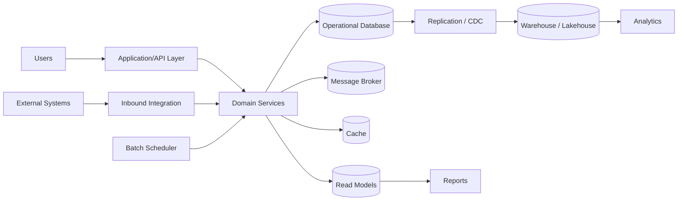
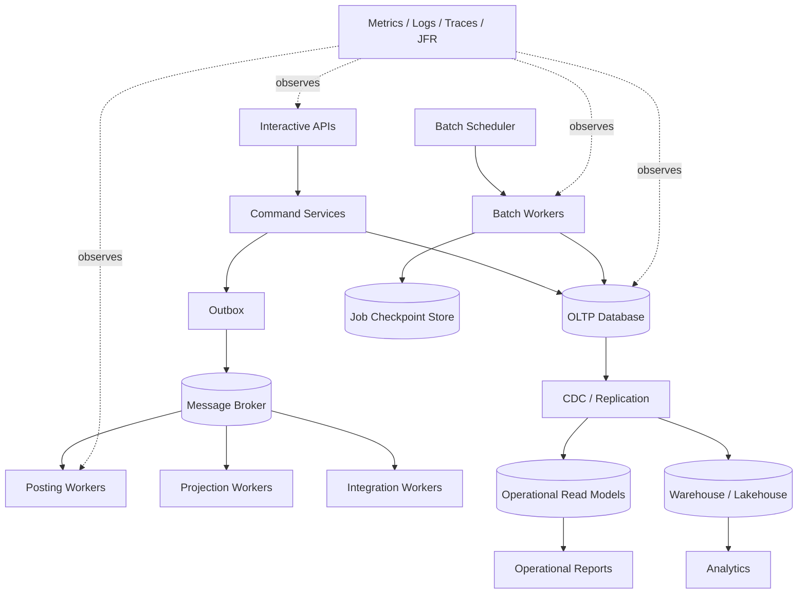
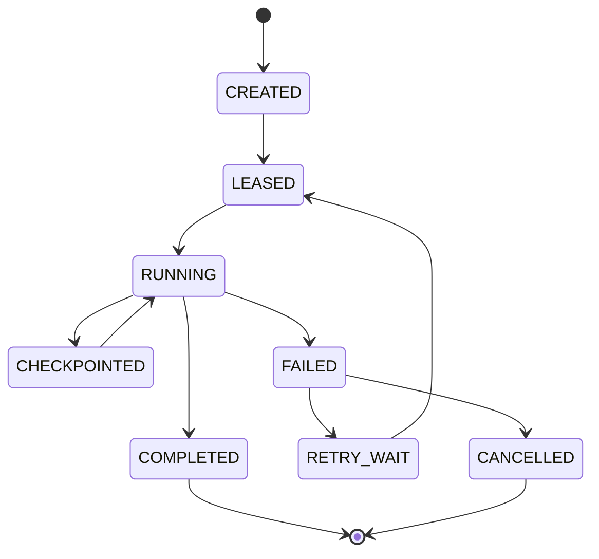
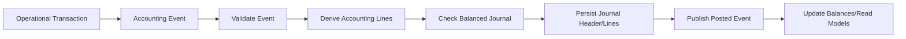
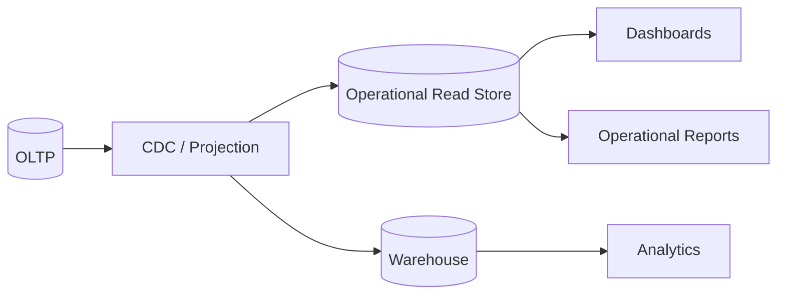

# Part 025 — Performance Engineering for ERP Workloads

Large-scale ERP performance is not only about making requests faster. It is about preserving business correctness while the system absorbs seasonal peaks, month-end close, bulk posting, MRP planning, report bursts, inventory reconciliation, integrations, imports, and human users working at the same time.

A small CRUD application can define performance as `p95 API latency < 300ms`. An ERP platform needs a wider model:

- Can the system post millions of accounting lines without breaking double-entry invariants?
- Can inventory allocation remain correct under peak order volume?
- Can month-end close finish inside the business window?
- Can reporting run without starving operational transactions?
- Can one tenant, branch, company, job, or integration partner avoid exhausting shared capacity?
- Can support teams see exactly where time is spent when the system slows down?

Performance engineering for ERP is therefore a control discipline, not a tuning exercise.

---

## 1. Kaufman Framing: Deconstruct the Performance Skill

Following Kaufman's method, do not learn "performance" as a vague expert topic. Deconstruct it into smaller skills that can be practiced deliberately.

| Sub-skill | What You Must Be Able To Do | ERP Example |
|---|---|---|
| Workload modelling | Classify traffic by shape, criticality, and contention | Separate POS order entry from month-end depreciation run |
| Capacity modelling | Estimate CPU, heap, DB I/O, locks, queue depth, connection usage | Forecast GL posting throughput for 10M journal lines |
| Measurement | Build repeatable benchmark scenarios and baselines | Run P2P happy path, invoice import, close, and report burst tests |
| Profiling | Find CPU, allocation, blocking, I/O, and DB hotspots | Detect one allocation-heavy mapper in posting pipeline |
| Data access optimization | Design query, index, pagination, fetch, projection, and partition strategy | Avoid loading full PO aggregate just to show approval inbox |
| Batch engineering | Chunk, checkpoint, retry, partition, and resume large jobs | Resume depreciation job after 7M of 12M assets |
| Contention control | Reduce lock duration and isolate hot rows | Avoid one stock balance row becoming global bottleneck |
| Backpressure | Protect the system from overload and retry storms | Stop invoice import from consuming all DB connections |
| Observability | Expose business-level and technical-level performance signals | Alert when posting lag exceeds SLA by legal entity |
| Regression control | Prevent performance degradation from entering production | Benchmark stock reservation and GL posting in CI/nightly |

The goal of this part is to give you the mental model and review discipline to reason about ERP performance before it fails in production.

---

## 2. The ERP Performance Mental Model

Think of ERP performance as a set of interacting queues and bottlenecks.



When ERP slows down, the root cause is rarely one function. It is usually one of these:

1. A hot business object: one stock item, one warehouse, one fiscal period, one numbering sequence, one bank account, one approval queue.
2. A hot technical resource: DB connection pool, table lock, index page, message partition, CPU core, heap, file system, network hop.
3. An unbounded query or job: export all invoices, recalculate all stock balances, refresh all read models.
4. A broken feedback loop: retry storm, duplicate import, lock timeout retry, report retry, integration replay.
5. A mixed workload collision: users, posting, reporting, imports, and reconciliation sharing the same capacity without admission control.

The advanced engineer asks:

> Which business flow owns this load, which invariant must survive, which queue is growing, which resource is saturated, and what is the safe degradation mode?

---

## 3. ERP Workload Taxonomy

Do not optimize everything the same way. Classify workload first.

### 3.1 Interactive transactional workload

Examples:

- Create purchase order.
- Submit approval.
- Reserve stock.
- Post invoice.
- Confirm goods receipt.
- Release sales order.

Characteristics:

- User-facing latency matters.
- Correctness and consistency are strict.
- Transactions should be short.
- Locks must be held briefly.
- Timeouts must produce clear user outcomes.

Design principle:

> Interactive ERP requests should validate, decide, persist, enqueue durable follow-up work, and return. They should not run unbounded recalculation or reporting inside the same request.

### 3.2 Bulk operational workload

Examples:

- Import supplier invoices.
- Generate payment proposals.
- Allocate thousands of orders.
- Revalue inventory.
- Run depreciation.
- Recalculate material requirements.

Characteristics:

- Throughput matters more than single-item latency.
- Restartability matters.
- Progress visibility matters.
- Partial failure is normal.
- Checkpointing is mandatory.

Design principle:

> Bulk jobs must be chunked, idempotent, restartable, observable, and rate-limited.

### 3.3 Financial close workload

Examples:

- Close AP/AR periods.
- Post accruals.
- Run depreciation.
- Reconcile subledgers.
- Generate trial balance.
- Lock fiscal period.

Characteristics:

- Happens in constrained windows.
- High business pressure.
- Cannot silently skip records.
- Requires audit evidence.
- Often competes with reports and corrections.

Design principle:

> Close performance must be engineered from the start. It is not acceptable to discover at go-live that closing takes 39 hours.

### 3.4 Reporting workload

Examples:

- Sales dashboard.
- Inventory aging.
- Trial balance.
- Customer aging.
- Export invoices.
- Compliance report.

Characteristics:

- Read-heavy.
- Can be very expensive.
- Freshness requirements vary.
- Security filters are expensive if added late.
- Often spikes during close and audits.

Design principle:

> Reports should run on certified read models, not on arbitrary joins over the transactional core.

### 3.5 Integration workload

Examples:

- Bank statement import.
- EDI purchase order exchange.
- WMS shipment update.
- MES production confirmation.
- Tax engine request.
- CRM customer sync.

Characteristics:

- Bursty.
- Partner-dependent.
- Retry-heavy.
- Duplicate-prone.
- Requires reconciliation.

Design principle:

> Integration throughput must be governed by business capacity and downstream safety, not by how fast messages can be consumed.

---

## 4. Performance Requirements as Contracts

ERP performance requirements should be written as contracts, not wishes.

Weak requirement:

> Posting should be fast.

Strong requirement:

> The GL posting pipeline must post 5 million validated journal lines within 45 minutes for one legal entity, while preserving balanced journal invariant, producing replay-safe posting evidence, and keeping interactive approval p95 below 800ms.

Use this template:

```text
For <business scenario>,
under <data volume and concurrency>,
the system must achieve <latency/throughput/completion window>,
while preserving <business invariant>,
without exceeding <resource or operational limit>,
and exposing <observable evidence>.
```

Examples:

| Scenario | Requirement |
|---|---|
| Stock reservation | Reserve 1,000 order lines/minute for one warehouse with no oversell and p95 < 500ms |
| Invoice import | Process 500k supplier invoices in 4 hours with duplicate detection and resumable checkpoints |
| Trial balance | Generate trial balance for one legal entity and fiscal period in < 30s from certified balances |
| MRP run | Complete daily netting for 2M demand/supply rows within 2 hours using planning snapshot |
| Approval inbox | Load approver inbox p95 < 300ms for 10k pending tasks with security scope applied |
| Month-end close | Complete depreciation, accrual, subledger reconciliation, and period lock inside 6-hour window |

---

## 5. The ERP Performance Architecture

A high-scale ERP should separate performance-sensitive responsibilities.



Key boundaries:

| Boundary | Purpose |
|---|---|
| Command model | Preserve write invariants and short transactions |
| Worker model | Process durable follow-up work with retry/checkpoint |
| Read model | Serve expensive read/report queries without harming writes |
| Batch model | Process large volumes with partitioning and restartability |
| Observability model | Make bottlenecks and business lag visible |
| Capacity model | Prevent one workload from consuming all resources |

---

## 6. Measurement Before Optimization

Performance work without measurement becomes superstition.

### 6.1 Build a scenario catalog

Your ERP performance suite should include named scenarios:

| Scenario ID | Name | Shape | Critical Metrics |
|---|---|---|---|
| PERF-O2C-001 | Sales order creation burst | Interactive write | p95 latency, DB time, validation time |
| PERF-O2C-002 | Stock reservation hotspot | Contended write | oversell count, lock wait, retry count |
| PERF-P2P-001 | Supplier invoice import | Bulk write | rows/minute, duplicate rate, checkpoint lag |
| PERF-GL-001 | Journal posting batch | Batch write | lines/sec, balanced failure count, DB commit time |
| PERF-INV-001 | Inventory balance projection | Projection | projection lag, rebuild time |
| PERF-RPT-001 | Trial balance report | Read/report | runtime, scanned rows, cache hit, freshness |
| PERF-MFG-001 | MRP planning run | Planning batch | completion time, memory, temp storage |
| PERF-CLOSE-001 | Month-end close rehearsal | Mixed workload | close window, queue backlog, error count |

### 6.2 Use layered telemetry

You need both technical and business metrics.

| Layer | Metrics |
|---|---|
| User/API | request rate, p50/p95/p99 latency, error rate, timeout rate |
| Domain | orders created, invoices posted, journal lines posted, stock reservations/sec |
| Queue | lag, depth, age of oldest message, retry count, DLQ count |
| Batch | processed rows, failed rows, checkpoint age, chunk duration |
| JVM | CPU, heap, GC pause, allocation rate, thread state, virtual thread pinning when applicable |
| Database | query time, locks, deadlocks, buffer hit ratio, connection usage, row scans, index scans |
| Cache | hit ratio, stale reads, evictions, stampede count |
| Reporting | refresh time, query runtime, export size, report queue depth |

### 6.3 Use profiling tools intentionally

For Java systems, Java Flight Recorder is a practical production-grade profiling tool. Use it to observe CPU, allocation, lock, I/O, and thread behavior during representative ERP workloads, not synthetic toy functions.

A good profiling session asks:

- Which business scenario is running?
- Which tenant/legal entity/company is included?
- What data volume is realistic?
- Is the database state realistic?
- Is caching warm or cold?
- Are reports/integration/jobs running concurrently?
- Which version of the application and schema is being measured?

### 6.4 Do not trust averages

Average latency hides ERP pain. Use percentiles and completion windows.

Bad:

```text
Average invoice post time: 120ms
```

Better:

```text
Invoice post latency:
- p50: 110ms
- p95: 420ms
- p99: 2.8s
- timeout rate: 0.3%
- lock wait p99: 1.9s
- duplicate idempotency rejection: 2,341/hour
```

The p99 value often tells the real story: lock contention, GC pauses, cold query plans, disk stalls, queue bursts, or downstream slowdowns.

---

## 7. Performance Budgets

A performance budget is a design constraint.

Example for `POST /sales-orders/{id}/reserve`:

| Component | Budget |
|---|---:|
| Authentication/authorization | 20ms |
| Load order summary | 40ms |
| Validate reservable lines | 60ms |
| Lock reservation keys | 80ms |
| Persist reservation ledger | 100ms |
| Publish outbox | 30ms |
| Serialization/network | 30ms |
| Buffer | 140ms |
| Total p95 target | 500ms |

Use budgets during design review:

- Which step can exceed its budget?
- Which dependency has unbounded latency?
- Which query has unbounded cardinality?
- Which lock can wait indefinitely?
- Which part should move to asynchronous processing?

A performance budget prevents accidental design drift.

---

## 8. JVM-Level Performance for ERP

Java performance in ERP is usually shaped by allocation, blocking, serialization, DB calls, and object graph size more than pure CPU arithmetic.

### 8.1 Control object graph size

ERP aggregates can become large:

- Sales order with thousands of lines.
- Purchase order with receipts, invoices, approval history, attachments.
- Item with price lists, tax rules, UOM conversions, stock balances.
- Manufacturing order with BOM explosion and routing steps.

Do not load a full aggregate when the use case only needs a projection.

Bad:

```java
PurchaseOrder po = purchaseOrderRepository.findById(id).orElseThrow();
return approvalInboxMapper.toDto(po); // loads lines, receipts, invoices, attachments, history
```

Better:

```java
ApprovalInboxRow row = approvalInboxQuery.findPurchaseOrderApprovalRow(id, currentApprover);
return ApprovalInboxDto.from(row);
```

Rule:

> Command use cases load what they need to preserve invariants. Query use cases load projections shaped for the screen/report.

### 8.2 Watch allocation rate

High allocation rate causes GC pressure, even when heap is large. Common ERP allocation sources:

- Mapping huge entity graphs to DTOs.
- Parsing large CSV/Excel/XML/JSON files.
- Creating BigDecimal repeatedly in tight loops.
- Building massive in-memory lists before batch insert.
- Rendering large exports in memory.
- Excessive string concatenation in logs.
- JSON serialization of full object graphs.

Practice:

- Stream large files.
- Process in chunks.
- Reuse immutable reference data carefully.
- Avoid building full export in memory.
- Use projections instead of full entities.
- Profile allocation with JFR.

### 8.3 Thread pools and virtual threads

Modern Java gives more options, including virtual threads, but ERP engineers must still reason about bottlenecks.

Virtual threads can help when workload is mostly blocking I/O and the downstream capacity is controlled. They do not make the database, broker, tax engine, or connection pool infinite.

Checklist before using virtual threads in ERP services:

- Is the DB connection pool sized intentionally?
- Does the service enforce timeouts?
- Are downstream calls bulkheaded?
- Is backpressure applied at queue/API boundaries?
- Are long synchronized regions avoided?
- Are metrics separated for request concurrency and downstream concurrency?

Core principle:

> More threads increase concurrency pressure. They do not create more database throughput.

### 8.4 Connection pool as a safety valve

A DB connection pool is not only a performance tool. It is also a blast-radius limiter.

Anti-pattern:

```text
Increase max pool size because requests are waiting.
```

Better diagnosis:

- Are queries slow?
- Are transactions too long?
- Are locks causing waits?
- Are jobs consuming all connections?
- Are reports sharing OLTP connections?
- Are retries multiplying demand?

Use separate pools or even separate services for different workload classes when needed:

| Workload | Pool Strategy |
|---|---|
| Interactive API | Small/medium, strict timeout, high priority |
| Posting workers | Bounded, controlled throughput |
| Batch jobs | Separate pool, rate-limited |
| Reports | Separate read replica/read model connection |
| Integration import | Separate bounded pool and queue |

---

## 9. Database Performance for ERP

ERP performance is often database performance wearing an application costume.

### 9.1 Index for business access paths

Indexes should match real questions:

- Pending approvals by approver and status.
- Open invoices by vendor and due date.
- Inventory balance by item, warehouse, lot, and bin.
- Journal lines by legal entity, account, fiscal period.
- Stock movements by item and posting time.
- Outbox events by status and creation time.
- Job records by status and next attempt time.

Example:

```sql
CREATE INDEX idx_journal_line_period_account
ON journal_line (legal_entity_id, fiscal_year, fiscal_period, account_id);

CREATE INDEX idx_approval_task_assignee_status_due
ON approval_task (assignee_id, status, due_at);

CREATE INDEX idx_outbox_ready
ON outbox_event (status, next_attempt_at, created_at)
WHERE status IN ('READY', 'RETRY');
```

### 9.2 Avoid unbounded cardinality

Bad API:

```http
GET /invoices?vendorId=V001
```

Better API:

```http
GET /invoices?vendorId=V001&status=OPEN&dueBefore=2026-07-31&pageSize=100&cursor=...
```

Every ERP query should have a cardinality story:

- What is the maximum expected row count?
- What is the index path?
- What is the pagination strategy?
- Is the query stable under concurrent writes?
- Is the result complete enough for the business action?

### 9.3 Prefer keyset pagination for large operational lists

Offset pagination degrades on large tables because the database still has to walk skipped rows.

Better pattern:

```sql
SELECT id, document_no, status, submitted_at
FROM purchase_order
WHERE tenant_id = :tenantId
  AND status = 'PENDING_APPROVAL'
  AND submitted_at < :lastSeenSubmittedAt
ORDER BY submitted_at DESC, id DESC
LIMIT 100;
```

### 9.4 Keep write transactions small

A transaction that validates, computes, posts, exports, emails, and calls external systems is a production incident waiting to happen.

Command transaction should usually:

1. Validate preconditions.
2. Lock only required rows.
3. Persist state change.
4. Insert outbox event.
5. Commit.

External calls and expensive projections happen after commit.

### 9.5 Use precomputed balances carefully

Financial and inventory systems often maintain balances for speed.

Design options:

| Option | Pros | Cons |
|---|---|---|
| Calculate from ledger every time | Simple truth model | Slow at scale |
| Maintain balance table transactionally | Fast reads | Hot rows and reconciliation needed |
| Maintain asynchronous projection | Decoupled and scalable | Freshness lag and rebuild complexity |
| Materialized view | Useful for reporting | Refresh strategy needed |

ERP rule:

> Ledger is the source of truth; balances are derived and must be reconcilable.

---

## 10. Batch Performance Engineering

Batch jobs are not loops. They are state machines over large data sets.



### 10.1 Batch job design checklist

Every ERP batch job needs:

- Job identity.
- Parameters hash.
- Scope: tenant, legal entity, period, warehouse, item range.
- Snapshot or selection strategy.
- Chunk size.
- Checkpoint cursor.
- Retry policy.
- Failure classification.
- Idempotency key per output.
- Progress metrics.
- Operator controls.
- Completion evidence.

### 10.2 Chunking strategy

Bad:

```java
List<Invoice> invoices = invoiceRepository.findAllPending();
for (Invoice invoice : invoices) {
    post(invoice);
}
```

Better:

```java
while (true) {
    List<InvoiceWorkItem> chunk = workQueue.leaseNextChunk(jobId, 500);
    if (chunk.isEmpty()) break;

    for (InvoiceWorkItem item : chunk) {
        try {
            postingService.postInvoice(item.invoiceId(), item.idempotencyKey());
            workQueue.markDone(item.id());
        } catch (RetriableException ex) {
            workQueue.markRetry(item.id(), ex.getMessage());
        } catch (BusinessException ex) {
            workQueue.markRejected(item.id(), ex.getCode());
        }
    }

    jobCheckpoint.save(jobId, chunk.getLast().cursor());
}
```

### 10.3 Partitioning strategy

Partitioning can improve throughput, but only when partitions do not fight over the same hot resources.

| Job | Good Partition Key | Dangerous Partition Key |
|---|---|---|
| Journal posting | legal entity + fiscal period + journal batch | random line ID if all update same balance rows |
| Inventory projection | item + warehouse | timestamp only when one item dominates |
| Invoice import | source file segment | vendor if one vendor has huge volume |
| Depreciation | asset book + legal entity | account if it creates hot account balance rows |
| MRP | planning area + item family | all items competing for one temp table |

### 10.4 Checkpoint and restart

A batch job that cannot restart safely is not production-ready.

Checkpoint must answer:

- What was selected?
- What was completed?
- What failed permanently?
- What is safe to retry?
- Which outputs were already emitted?
- Which parameters define this run?

Use idempotency on every side effect:

```sql
CREATE UNIQUE INDEX uq_posting_request_idempotency
ON posting_request (tenant_id, idempotency_key);
```

### 10.5 Batch throttling

A batch job should not consume all capacity simply because it can.

Throttle by:

- Max active workers.
- Max DB connections.
- Max messages/sec.
- Max rows/sec.
- Time window.
- Business calendar.
- Downstream lag.
- Interactive latency guardrail.

Example policy:

```text
If interactive p95 > 900ms for 5 minutes, reduce invoice import workers from 12 to 4.
If GL posting queue oldest age > 30 minutes during close, pause non-critical exports.
If DB lock wait p99 > 2s, reduce stock projection rebuild concurrency.
```

---

## 11. Posting Pipeline Performance

Financial posting combines performance with strict invariants.

### 11.1 Posting pipeline shape



Performance pitfalls:

- Loading full operational aggregate for every line.
- Re-deriving static account mapping repeatedly.
- Updating the same balance row for every journal line.
- One giant transaction for millions of lines.
- Synchronous read model update inside posting transaction.
- Logging every line at INFO.
- Reporting queries on journal line table during posting.

### 11.2 Posting throughput model

Throughput is constrained by:

```text
min(
  validation throughput,
  derivation throughput,
  DB insert throughput,
  balance update throughput,
  lock contention limit,
  outbox throughput,
  downstream projection throughput
)
```

Do not optimize derivation if balance locking is the bottleneck.

### 11.3 Bulk insert strategy

For high-volume posting:

- Use batch inserts where appropriate.
- Avoid per-line flush.
- Validate in memory per chunk.
- Persist header + lines in bounded chunks.
- Keep transaction size below operational risk threshold.
- Store enough evidence to reconstruct calculation.
- Emit one outbox event per posted journal or chunk, not per trivial line unless required.

### 11.4 Balance updates

Balance rows can become hot.

Options:

| Strategy | When Useful | Risk |
|---|---|---|
| Update balance per journal synchronously | Small/medium volume | Hot account/period rows |
| Append ledger only, project balance async | High volume | Freshness lag |
| Sharded balance accumulator | Very high volume | More complex reconciliation |
| Periodic aggregation | Reporting workloads | Not immediate |

Rule:

> Never trade financial correctness for write speed. Use projection/reconciliation patterns instead.

---

## 12. Read Model and Reporting Performance

Reports are often the silent killer of ERP performance.

### 12.1 Reporting should have workload isolation



Isolation options:

- Separate query service.
- Read replicas.
- Materialized views.
- Dedicated reporting schema.
- Search index for search-like access.
- Warehouse/lakehouse for analytics.
- Export job queue for large downloads.

### 12.2 Report freshness class

Classify every report.

| Class | Freshness | Example | Architecture |
|---|---|---|---|
| Real-time operational | seconds | pick queue, approval inbox | operational read model |
| Near-real-time | minutes | sales dashboard | projection/materialized view |
| Certified financial | close-controlled | trial balance, financial statements | controlled ledger/balance model |
| Analytical | hours/day | customer profitability | warehouse/lakehouse |
| Audit extract | case-dependent | regulator export | governed export job |

Do not spend OLTP write capacity to make analytical dashboards real-time unless the business truly needs it.

### 12.3 Export as job, not request

Bad:

```http
GET /invoices/export?from=2025-01-01&to=2025-12-31
```

Better:

```http
POST /exports
{
  "type": "INVOICE_EXPORT",
  "from": "2025-01-01",
  "to": "2025-12-31",
  "format": "CSV"
}
```

Then:

- Validate request.
- Create export job.
- Process in chunks.
- Write to object storage.
- Notify user.
- Audit who exported what.
- Expire download link.

---

## 13. Caching in ERP

Caching can help ERP performance, but caching the wrong thing creates correctness defects.

### 13.1 Cache categories

| Cache Type | Good Use | Dangerous Use |
|---|---|---|
| Reference data cache | currency, UOM, static code lists | mutable tax/pricing rules without versioning |
| Configuration cache | effective published config | draft/unapproved config |
| Authorization cache | short-lived permission decisions | long-lived SoD decisions after role change |
| Read model cache | dashboard summaries | financial report requiring certified freshness |
| External lookup cache | tax rate lookup with expiry | legal calculation evidence without stored source |

### 13.2 Cache invalidation model

Every cache needs:

- Owner.
- Key structure.
- Scope: tenant/company/branch/user.
- Version or effective date.
- TTL.
- Invalidation trigger.
- Staleness tolerance.
- Fallback behavior.
- Audit relevance.

For ERP pricing/tax/config, prefer versioned keys:

```text
pricing:{tenant}:{priceBook}:{publishedVersion}:{item}:{customerSegment}
tax:{tenant}:{jurisdiction}:{taxConfigVersion}:{itemTaxClass}:{customerTaxClass}
```

Versioned cache keys reduce stale-decision risk.

### 13.3 Cache stampede protection

High-scale ERP read models can suffer stampede when many users request the same expensive report.

Controls:

- Request coalescing.
- Single-flight loading.
- Stale-while-revalidate for non-critical dashboards.
- Rate limits.
- Precomputation.
- Job-based reports.

---

## 14. Backpressure and Admission Control

A system without backpressure converts overload into failure.

### 14.1 Where to apply backpressure

| Boundary | Control |
|---|---|
| API gateway | rate limit, request size limit, concurrency limit |
| Application | semaphore per operation, timeout, circuit breaker |
| Queue consumer | max concurrency, pause/resume, lag-based scaling |
| Batch scheduler | calendar windows, worker limit, priority |
| DB | connection pool, lock timeout, statement timeout |
| Export/report | job queue, max rows, approval for huge export |
| Integration | per-partner rate limit, retry budget |

### 14.2 Retry budget

Retry without budget creates retry storms.

Example retry policy:

```text
For bank statement import:
- Retry network timeout up to 5 times with exponential backoff.
- Do not retry validation failure.
- Do not retry duplicate statement; mark duplicate.
- Stop partner consumer if DLQ rate > 5% for 10 minutes.
- Alert integration owner if oldest retry age > 1 hour.
```

### 14.3 Degradation modes

ERP degradation should be explicit.

| Pressure | Safe Degradation |
|---|---|
| Reporting overload | Queue exports, serve cached dashboard, pause ad-hoc reports |
| Posting backlog | Prioritize legal entity close jobs, pause non-critical integrations |
| Integration storm | Slow consumer, DLQ invalid messages, preserve inbox ledger |
| DB lock contention | Reduce batch concurrency, increase chunking, isolate hot keys |
| Search overload | Limit filters, require date range, defer full export |

---

## 15. Performance Testing Strategy

### 15.1 Test with realistic data shape

ERP performance depends on skew.

Test data must include:

- Large tenant and small tenant.
- Hot item and normal items.
- Large vendor/customer.
- Large fiscal period.
- Many approval tasks for one approver.
- Large document with many lines.
- Many small documents.
- Historical data across years.
- Closed and open periods.
- Active and inactive master data.

### 15.2 Test mixed workload

A system that passes isolated API load tests can fail under realistic mixed load.

Mixed close workload example:

```text
- 150 active users.
- 20 invoice import workers.
- 8 GL posting workers.
- 4 depreciation workers.
- Trial balance report every 2 minutes.
- Inventory aging report every 5 minutes.
- WMS shipment events at 200/minute.
- Tax API latency p95 = 600ms.
```

### 15.3 Define pass/fail criteria

Pass/fail must include correctness and operability:

- No broken financial balance.
- No oversold stock.
- No duplicate posted invoice.
- No lost outbox event.
- No unbounded queue growth after load stops.
- No manual DB cleanup required.
- No worker stuck without visibility.
- Completion window met.
- Error classification correct.

---

## 16. Worked Example: Month-End Close Performance

### 16.1 Problem

Month-end close is missing its 6-hour SLA. Symptoms:

- Depreciation job takes 3 hours.
- Subledger reconciliation takes 2 hours.
- Trial balance report sometimes takes 20 minutes.
- Users complain approval screen is slow during close.
- DB CPU is high but not consistently saturated.

### 16.2 Poor response

```text
Increase database size and add more worker threads.
```

This may worsen contention.

### 16.3 Better investigation

Break down close pipeline:


Measure each stage:

| Stage | Observed | Bottleneck |
|---|---:|---|
| Depreciation | 3h | single-thread asset book, repeated account lookup |
| Accrual posting | 45m | acceptable |
| Reconciliation | 2h | full scans of invoice/journal tables |
| Trial balance | 20m | reporting on raw journal lines |
| Approval screen | p95 2.5s | shared DB pool with close jobs |

### 16.4 Design changes

- Partition depreciation by legal entity + asset book.
- Cache published account mapping by version.
- Use checkpointed depreciation work items.
- Maintain certified subledger balance projection.
- Generate trial balance from period balance table.
- Separate interactive and batch connection pools.
- Add close workload throttle.
- Add progress and lag metrics per stage.

### 16.5 Result target

```text
Depreciation: 45 minutes
Reconciliation: 25 minutes
Trial balance: 20 seconds
Interactive approval p95 during close: < 800ms
Close total: < 2 hours
```

The important shift is not just optimization. It is workload isolation and derived data design.

---

## 17. Java Implementation Patterns

### 17.1 Micrometer timing around business operations

```java
@Component
public class PostingMetrics {
    private final MeterRegistry registry;

    public PostingMetrics(MeterRegistry registry) {
        this.registry = registry;
    }

    public <T> T recordPosting(String legalEntity, String sourceType, Supplier<T> supplier) {
        return Timer.builder("erp.posting.duration")
                .tag("legalEntity", legalEntity)
                .tag("sourceType", sourceType)
                .publishPercentileHistogram()
                .register(registry)
                .record(supplier);
    }

    public void incrementRejected(String sourceType, String reason) {
        Counter.builder("erp.posting.rejected")
                .tag("sourceType", sourceType)
                .tag("reason", reason)
                .register(registry)
                .increment();
    }
}
```

Be careful with metric cardinality. Do not tag metrics with invoice ID, PO number, or user ID.

### 17.2 Statement timeout for reporting queries

```java
@Transactional(readOnly = true)
public TrialBalanceView generateTrialBalance(TrialBalanceRequest request) {
    jdbcTemplate.execute("SET LOCAL statement_timeout = '30s'");
    return trialBalanceQuery.loadCertifiedBalance(request);
}
```

A timeout is not a substitute for a good query, but it prevents one bad query from consuming the system indefinitely.

### 17.3 Bounded worker executor

```java
public final class BoundedWorkerGate {
    private final Semaphore permits;

    public BoundedWorkerGate(int maxConcurrent) {
        this.permits = new Semaphore(maxConcurrent);
    }

    public <T> T execute(Callable<T> work) throws Exception {
        if (!permits.tryAcquire(2, TimeUnit.SECONDS)) {
            throw new CapacityRejectedException("Worker capacity exhausted");
        }
        try {
            return work.call();
        } finally {
            permits.release();
        }
    }
}
```

This is simple but important: uncontrolled concurrency is a common ERP production failure.

---

## 18. Performance Review Checklist

Use this checklist in architecture review.

### Workload

- [ ] Have we classified interactive, batch, reporting, integration, and close workloads?
- [ ] Do we know the largest tenant/company/warehouse/vendor/customer/item?
- [ ] Do we know peak concurrency and seasonal spikes?
- [ ] Do we know mixed workload behavior?

### Correctness under performance pressure

- [ ] Are financial, stock, approval, and numbering invariants preserved under load?
- [ ] Are retries idempotent?
- [ ] Are partial failures classified?
- [ ] Can jobs resume without duplicate output?

### Data access

- [ ] Are queries bounded by scope and date/status where appropriate?
- [ ] Are indexes aligned with real access paths?
- [ ] Is keyset pagination used for large lists?
- [ ] Are reports isolated from OLTP writes?

### JVM/application

- [ ] Do we measure allocation rate and GC pauses?
- [ ] Are connection pools sized by workload class?
- [ ] Are timeouts configured?
- [ ] Are thread pools bounded?
- [ ] Is metric cardinality controlled?

### Batch

- [ ] Is every batch job chunked?
- [ ] Does every job have checkpoint and restart?
- [ ] Are chunks idempotent?
- [ ] Is concurrency configurable?
- [ ] Are progress and failure reasons visible?

### Operations

- [ ] Can support see queue lag, job progress, and bottlenecks?
- [ ] Are overload controls documented?
- [ ] Are performance regressions tested before release?
- [ ] Is month-end close rehearsed with production-like data?

---

## 19. Anti-Patterns

| Anti-pattern | Why It Fails |
|---|---|
| Report directly on OLTP tables | Reports fight with writes and create unpredictable load |
| Load full aggregate for every screen | Object graph explosion and N+1 behavior |
| One giant batch transaction | Lock bloat, rollback risk, no progress visibility |
| Increase threads to fix slowness | Often increases DB contention and timeout rate |
| Cache financial truth | Creates audit and reconciliation risk |
| Use average latency | Hides tail latency and production pain |
| No realistic test data | Performance passes in test but fails at go-live |
| No workload isolation | Batch/reporting/integration starve interactive users |
| Retry without budget | Turns transient failure into retry storm |
| Tune before measuring | Wastes effort and may worsen the real bottleneck |

---

## 20. Deliberate Practice

Spend 2–3 hours on these exercises before moving on.

### Exercise 1 — Workload map

Pick one ERP domain such as inventory or AP. Build a workload map:

- Interactive commands.
- Batch jobs.
- Reports.
- Integrations.
- Close/reconciliation flows.
- Peak periods.
- Hot entities.

### Exercise 2 — Performance contract

Write five performance contracts using the template from Section 4.

At least one must include:

- A financial invariant.
- A stock invariant.
- A reporting freshness requirement.
- A retry/idempotency requirement.
- A completion window.

### Exercise 3 — Batch redesign

Take this bad job:

```text
Load all pending invoices, post them in a loop, fail if any invoice fails.
```

Redesign it with:

- Work item table.
- Chunking.
- Checkpoint.
- Idempotency key.
- Failure classification.
- Metrics.
- Operator controls.

### Exercise 4 — Mixed workload test plan

Design a load test for month-end close with:

- User traffic.
- Posting workers.
- Report burst.
- Integration events.
- DB metrics.
- Business metrics.
- Pass/fail criteria.

---

## 21. Mental Compression

Remember these rules:

1. ERP performance is workload management plus correctness preservation.
2. Optimize business scenarios, not isolated methods.
3. Measure before tuning.
4. Separate interactive, batch, reporting, and integration capacity.
5. Batch jobs must be chunked, checkpointed, idempotent, and observable.
6. Reports need read models, not heroic OLTP joins.
7. More threads can create more contention.
8. Ledger is truth; balances and reports are derived and reconciled.
9. Tail latency and completion windows matter more than averages.
10. If support cannot see progress, lag, and bottleneck, the system is not operable.

---

## 22. Source Notes

This part is grounded in the following technical references and industry-proven concepts:

- Oracle Java Flight Recorder and JDK Mission Control documentation for profiling and troubleshooting Java runtime performance.
- Spring Boot Actuator and Micrometer documentation for production metrics and observability.
- PostgreSQL documentation on transaction isolation, explicit locking, query planning, indexes, and materialized views.
- Jakarta Batch concepts for chunk-oriented batch processing in enterprise Java environments.
- Enterprise integration and transactional outbox/idempotent consumer patterns already covered in previous parts.

Use vendor documentation for exact syntax and version-specific behavior. Use the mental model here for architecture and design review.
