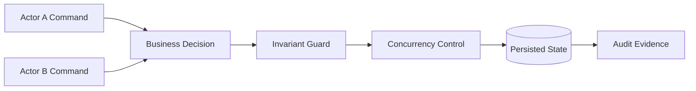
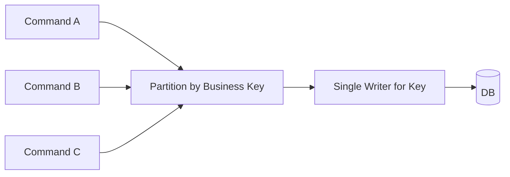
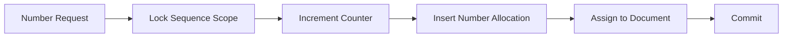
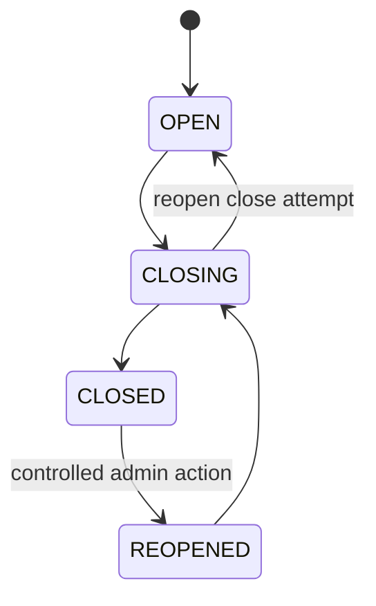
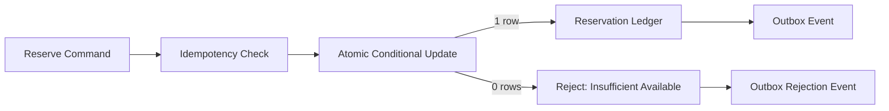

# Part 026 — Concurrency, Locking, and Contention in ERP

Concurrency bugs in ERP systems are expensive because they corrupt business truth. A normal web bug may show the wrong screen. An ERP concurrency bug can oversell stock, double-pay a vendor, skip approval, duplicate an invoice number, post an unbalanced journal, or close a period while transactions are still in flight.

This part focuses on concurrency as a business correctness problem, not merely a Java threading topic.

The key question is:

> When many users, jobs, integrations, and workers act on the same business objects at the same time, which outcomes are legal, which are impossible, and how does the system enforce that reliably?

---

## 1. Kaufman Framing: Deconstruct ERP Concurrency

Concurrency in ERP can be deconstructed into trainable sub-skills.

| Sub-skill | What You Must Be Able To Do | ERP Example |
|---|---|---|
| Identify shared business resources | Find objects that multiple flows compete for | stock balance, invoice number, fiscal period, credit limit |
| Define legal outcomes | State invariants and forbidden interleavings | stock cannot be reserved below zero |
| Choose consistency boundary | Decide aggregate, row, stream, or process boundary | reserve by item+warehouse+lot, not by whole warehouse |
| Select locking strategy | Use optimistic, pessimistic, uniqueness, queue, or single-writer model | lock numbering sequence row during legal number allocation |
| Handle isolation anomalies | Know what can happen under database isolation levels | write skew in period close check |
| Design retries safely | Retry deadlocks/serialization failures only when idempotent | retry reservation command with same command ID |
| Reduce contention | Move from hot-row updates to append ledger/projection | inventory movement ledger instead of single balance row |
| Test races | Reproduce concurrent execution deterministically enough | 100 workers reserving same SKU |
| Observe contention | Measure locks, wait time, deadlocks, retries, stale versions | alert when approval task optimistic conflict spikes |

The objective is not to memorize database lock modes. It is to know when a business invariant needs a specific concurrency control.

---

## 2. ERP Concurrency Mental Model

Concurrency control sits between business intent and persisted truth.



A concurrency design must answer:

1. What shared business resource is being changed?
2. What invariant must hold after all concurrent actions finish?
3. What is the smallest safe lock/serialization boundary?
4. What happens if another transaction changed the resource first?
5. Is retry safe? If yes, with which idempotency key?
6. How is the losing actor informed?
7. How is the event audited?

---

## 3. Contention Hotspots in ERP

Some ERP objects naturally attract contention.

| Hotspot | Why It Is Contended | Example Failure |
|---|---|---|
| Stock balance | Many orders reserve same item/warehouse | oversell or negative available quantity |
| Legal numbering sequence | Many documents need next number | duplicate invoice number or gap confusion |
| Fiscal period | Posting, closing, reopening, adjustment | posting into closed period |
| Credit limit | Many orders consume customer credit | credit exposure exceeds approved limit |
| Approval task | Multiple approvers/delegates act on same task | double approval or approve after cancellation |
| Payment proposal | Multiple users edit same payment batch | paid wrong invoice set |
| Price/tax config | Admin publishes config while orders calculate | inconsistent calculation evidence |
| Vendor invoice | Import, manual edit, matching, posting | duplicate AP liability |
| Journal batch | Posting and reversal compete | reversal of partially posted batch |
| Work order | Issue, consume, complete, scrap concurrently | WIP and stock mismatch |

The pattern is clear: contention appears where the business has a scarce, shared, or legally controlled resource.

---

## 4. Correctness Before Locking

Do not start by choosing `synchronized`, `@Transactional`, `SELECT FOR UPDATE`, or optimistic locking. Start by writing the invariant.

Examples:

| Domain | Invariant |
|---|---|
| Inventory | Available quantity cannot go below zero unless negative stock policy permits it explicitly |
| GL | Posted journal must be balanced per currency and accounting book |
| Invoice | Same supplier invoice identity cannot be posted twice |
| Numbering | Legal number must be unique within sequence scope |
| Period close | No posting may commit into a period after close is effective |
| Approval | A document cannot be posted unless the active approval path is satisfied |
| Payment | A payable invoice cannot be paid beyond open amount |
| Credit | Confirmed order exposure must not exceed available credit unless override is approved |

Then choose concurrency control that makes illegal states impossible or detectable.

---

## 5. Database Isolation Is Not a Business Specification

A database isolation level defines some technical visibility rules. It does not automatically understand ERP invariants.

### 5.1 Common anomalies in ERP language

| Anomaly | ERP Version |
|---|---|
| Lost update | Two users edit vendor bank account; one update overwrites the other |
| Dirty read | User sees uncommitted stock change that later rolls back |
| Non-repeatable read | Approval screen reads document status twice and sees different values |
| Phantom read | Period close checks "no unposted documents", then another transaction inserts one |
| Write skew | Two transactions each see enough credit/stock separately, together violate constraint |
| Duplicate insert race | Two workers insert same external invoice before either sees the other |

### 5.2 Isolation levels are not identical across databases

Do not assume every database implements isolation levels exactly the same way. Even when SQL names are the same, MVCC behavior, locking, predicate handling, serialization failures, and phantom prevention vary.

Engineering rule:

> Treat isolation level as one tool. Business invariants should be backed by constraints, locks, version checks, unique keys, append-only ledgers, or serial processing where needed.

---

## 6. Concurrency Control Toolbox

### 6.1 Optimistic locking

Use when conflicts are possible but not constant.

Typical implementation:

```java
@Entity
public class PurchaseOrder {
    @Id
    private UUID id;

    @Version
    private long version;

    private PurchaseOrderStatus status;

    public void submit(UserId userId) {
        if (status != PurchaseOrderStatus.DRAFT) {
            throw new IllegalStateException("Only draft PO can be submitted");
        }
        status = PurchaseOrderStatus.SUBMITTED;
    }
}
```

If another transaction updates the row first, commit fails with stale version. The loser must reload and re-decide.

Good for:

- Document editing.
- Master data updates.
- Approval task state.
- Configuration draft editing.

Not enough for:

- High-contention stock reservation.
- Legal sequence allocation.
- Cross-row aggregate invariants.

### 6.2 Pessimistic locking

Use when conflict is expected and the cost of conflict is high.

Example:

```java
@Lock(LockModeType.PESSIMISTIC_WRITE)
@Query("""
    select s from StockReservationBucket s
    where s.itemId = :itemId
      and s.warehouseId = :warehouseId
      and s.lotId = :lotId
""")
Optional<StockReservationBucket> lockBucket(
    ItemId itemId,
    WarehouseId warehouseId,
    LotId lotId
);
```

Good for:

- Allocating scarce stock.
- Legal numbering.
- Payment batch release.
- One-time transition of critical document.

Risks:

- Deadlocks.
- Lock waits.
- Reduced throughput.
- Long transaction damage.

### 6.3 Unique constraints

Use database uniqueness to defeat duplicate creation races.

```sql
CREATE UNIQUE INDEX uq_supplier_invoice_identity
ON supplier_invoice (
  tenant_id,
  supplier_id,
  supplier_invoice_no,
  invoice_date
);

CREATE UNIQUE INDEX uq_idempotency_key
ON command_idempotency (
  tenant_id,
  command_type,
  idempotency_key
);
```

This is one of the most reliable concurrency controls.

Application code should treat unique violation as a business outcome:

- Duplicate invoice detected.
- Command already processed.
- Legal number already allocated.
- External event already consumed.

### 6.4 Append-only ledger

Use append-only records when updating one mutable row would create hot contention or weak audit.

Inventory example:

```text
stock_movement:
- movement_id
- item_id
- warehouse_id
- lot_id
- quantity_delta
- movement_type
- source_document_id
- occurred_at
```

Financial example:

```text
journal_line:
- journal_id
- account_id
- debit
- credit
- currency
- fiscal_period
```

The ledger is the truth. Balances are projections.

### 6.5 Single-writer per key

For extreme contention, serialize commands by business key.

Examples:

- All reservations for `item+warehouse+lot` go to same partition/key.
- All legal numbering for `tenant+company+documentType+period` goes to same allocator.
- All customer credit exposure updates for `customer+company` go to same stream key.



This reduces database deadlocks at the cost of queue latency.

### 6.6 Work queue leasing

Use leasing for background workers to avoid double processing.

```sql
UPDATE import_work_item
SET status = 'LEASED',
    leased_by = :workerId,
    leased_until = now() + interval '5 minutes'
WHERE id IN (
  SELECT id
  FROM import_work_item
  WHERE status = 'READY'
     OR (status = 'LEASED' AND leased_until < now())
  ORDER BY created_at
  LIMIT 100
  FOR UPDATE SKIP LOCKED
)
RETURNING *;
```

This pattern lets many workers safely claim different items.

---

## 7. Race Condition Patterns and Fixes

### 7.1 Stock reservation race

#### Broken design

```java
StockBalance balance = balanceRepository.find(itemId, warehouseId);
if (balance.available().compareTo(requestedQty) >= 0) {
    balance.reserve(requestedQty);
    balanceRepository.save(balance);
}
```

Two transactions can both read available quantity before either commits.

#### Safer options

Option A — pessimistic lock bucket:

```java
@Transactional
public Reservation reserve(ReserveStockCommand command) {
    StockBucket bucket = stockBucketRepository.lockForUpdate(
            command.itemId(),
            command.warehouseId(),
            command.lotId()
    ).orElseThrow();

    bucket.reserve(command.quantity(), command.negativeStockPolicy());

    Reservation reservation = Reservation.create(command, bucket.currentVersion());
    reservationRepository.save(reservation);
    outbox.add(StockReservedEvent.from(reservation));
    return reservation;
}
```

Option B — atomic conditional update:

```sql
UPDATE stock_bucket
SET reserved_qty = reserved_qty + :qty,
    version = version + 1
WHERE item_id = :itemId
  AND warehouse_id = :warehouseId
  AND available_qty - reserved_qty >= :qty;
```

Then check affected row count.

Option C — append reservation request and process by single writer per stock key.

Choose based on contention level and latency requirement.

### 7.2 Document numbering race

#### Broken design

```java
long next = sequenceRepository.findCurrent(scope) + 1;
sequenceRepository.update(scope, next);
document.setNumber(format(next));
```

Two transactions can allocate the same number.

#### Safer design

Use a sequence allocation ledger scoped by legal requirement.



Schema:

```sql
CREATE TABLE legal_number_sequence (
  tenant_id uuid NOT NULL,
  company_id uuid NOT NULL,
  document_type text NOT NULL,
  fiscal_year int NOT NULL,
  current_value bigint NOT NULL,
  version bigint NOT NULL,
  PRIMARY KEY (tenant_id, company_id, document_type, fiscal_year)
);

CREATE TABLE legal_number_allocation (
  allocation_id uuid PRIMARY KEY,
  tenant_id uuid NOT NULL,
  company_id uuid NOT NULL,
  document_type text NOT NULL,
  fiscal_year int NOT NULL,
  number_value bigint NOT NULL,
  document_id uuid,
  status text NOT NULL,
  allocated_at timestamptz NOT NULL,
  UNIQUE (tenant_id, company_id, document_type, fiscal_year, number_value)
);
```

Important distinction:

- Technical ID can be UUID and assigned early.
- Business draft number can be non-legal.
- Legal number may be assigned only when posting/approval reaches legal threshold.

### 7.3 Approval race

Scenario:

- Approver A approves a task.
- Delegated approver B approves the same task at the same time.
- Document cancellation also happens concurrently.

Invariant:

> A task can transition from `PENDING` to one terminal decision exactly once, and only if the document is still in an approvable state.

Use conditional update:

```sql
UPDATE approval_task
SET status = 'APPROVED',
    decided_by = :userId,
    decided_at = now(),
    version = version + 1
WHERE id = :taskId
  AND status = 'PENDING'
  AND version = :expectedVersion;
```

Then continue workflow only if exactly one row updated.

### 7.4 Period close race

Scenario:

- Close process checks no unposted documents exist.
- Another transaction posts into the period.
- Close commits.

Possible fixes:

1. Period state guard checked during every posting transaction.
2. Close transaction transitions period to `CLOSING` first.
3. Posting rejects periods in `CLOSING` or `CLOSED` unless explicit override.
4. Close process reconciles remaining in-flight work.
5. Final transition to `CLOSED` only after checks pass.



Posting guard:

```java
if (!period.allowsPosting(command.postingDate(), command.override())) {
    throw new PeriodNotOpenException(period.id());
}
```

Do not make close a pure report query. Make it a state transition with guards.

### 7.5 Credit limit race

Scenario:

- Two sales orders are confirmed concurrently.
- Each sees available credit.
- Together they exceed limit.

Safer strategies:

- Lock customer credit exposure row.
- Use atomic conditional update.
- Reserve credit exposure at order confirmation.
- Release exposure on cancellation/payment.
- Keep exposure ledger for audit.

Atomic update example:

```sql
UPDATE customer_credit_exposure
SET reserved_exposure = reserved_exposure + :orderAmount,
    version = version + 1
WHERE customer_id = :customerId
  AND company_id = :companyId
  AND credit_limit - reserved_exposure - open_ar_amount >= :orderAmount;
```

### 7.6 Payment double-release race

Invariant:

> A payment proposal can be released once, and each payable can be included in at most one active payment instruction for the same open amount.

Controls:

- Proposal status transition conditional update.
- Unique constraint on active payment allocation.
- Lock payable rows during release.
- Payment instruction idempotency key.
- Bank file generation evidence.

---

## 8. Transaction Boundary Design

A transaction boundary is where you say: "these changes must become true together."

### 8.1 Good transaction boundary

For posting supplier invoice:

Inside transaction:

1. Check idempotency key.
2. Lock invoice row.
3. Validate invoice status and period.
4. Create accounting event/posting request.
5. Transition invoice to `POSTING_REQUESTED` or `POSTED` depending design.
6. Insert outbox event.
7. Commit.

Outside transaction:

- Send notification.
- Call external analytics.
- Refresh dashboard.
- Export report.

### 8.2 Bad transaction boundary

```text
Begin transaction
  Load invoice
  Validate
  Call tax service
  Generate PDF
  Send email
  Insert journal
  Update report table
  Call bank API
Commit
```

Problems:

- Long lock duration.
- External uncertainty inside DB transaction.
- Deadlock risk.
- Timeout ambiguity.
- Hard rollback semantics.

### 8.3 Transaction scope rule

> Keep database transactions short, deterministic, and focused on one consistency boundary. Use durable events/jobs for everything else.

---

## 9. Lock Granularity

Locking too much kills throughput. Locking too little breaks invariants.

| Resource | Too Coarse | Too Fine | Better Boundary |
|---|---|---|---|
| Inventory | lock whole warehouse | lock individual movement row only | item + warehouse + lot/bin bucket |
| Numbering | global sequence | no lock | company + document type + fiscal year |
| Credit | lock entire customer master | lock order line only | customer + company credit exposure |
| Period close | lock whole database | only query current docs | legal entity + fiscal period state |
| Approval | lock document and all tasks | no conditional transition | task row + document state guard |
| Pricing publication | lock all pricing | update rule rows live | versioned publication set |

Use the smallest boundary that still protects the invariant.

---

## 10. Deadlocks

Deadlock happens when transactions wait on each other in a cycle.


### 10.1 Common ERP deadlock causes

- Workers process same rows in different order.
- Posting updates account balances in non-deterministic account order.
- Batch job and user command lock parent/child rows in opposite order.
- Stock transfer locks source/destination warehouse in inconsistent order.
- Approval update and document cancellation lock task/document in opposite order.

### 10.2 Deadlock prevention

Use deterministic lock ordering.

Example: stock transfer:

```java
List<StockKey> keys = Stream.of(sourceKey, destinationKey)
        .sorted(Comparator.comparing(StockKey::stableLockKey))
        .toList();

StockBucket first = repository.lock(keys.get(0));
StockBucket second = repository.lock(keys.get(1));
```

For journal balance updates:

```java
lines.stream()
     .map(JournalLine::balanceKey)
     .distinct()
     .sorted()
     .forEach(balanceRepository::lockBalance);
```

### 10.3 Deadlock retry

Deadlocks can still happen. Retry only if:

- Command is idempotent.
- Side effects are inside transaction or guarded by outbox.
- Retry count is bounded.
- Backoff is applied.
- Duplicate outcomes are impossible.

Pseudo-code:

```java
public <T> T withConcurrencyRetry(Supplier<T> operation) {
    int maxAttempts = 3;
    for (int attempt = 1; attempt <= maxAttempts; attempt++) {
        try {
            return operation.get();
        } catch (DeadlockLoserDataAccessException | CannotSerializeTransactionException ex) {
            if (attempt == maxAttempts) throw ex;
            sleep(backoff(attempt));
        }
    }
    throw new IllegalStateException("unreachable");
}
```

Do not retry validation failures, authorization failures, or business rejections.

---

## 11. Optimistic Conflict UX

Concurrency is not only backend. The user experience must explain conflict.

Bad:

```text
500 Internal Server Error
```

Better:

```text
This purchase order was changed by another user at 14:32:18.
Your draft was not applied.
Review the latest version and submit again.
```

For ERP, include:

- Current document status.
- Who changed it, if allowed.
- Timestamp.
- Changed fields when useful.
- Safe next action.
- Audit reference.

Conflict is a business event, not an exception to hide.

---

## 12. Idempotency and Concurrency

Idempotency prevents duplicate side effects under retry and concurrency.

### 12.1 Command idempotency ledger

```sql
CREATE TABLE command_idempotency (
  tenant_id uuid NOT NULL,
  command_type text NOT NULL,
  idempotency_key text NOT NULL,
  request_hash text NOT NULL,
  status text NOT NULL,
  response_ref text,
  created_at timestamptz NOT NULL,
  completed_at timestamptz,
  PRIMARY KEY (tenant_id, command_type, idempotency_key)
);
```

Command handling pattern:

1. Insert idempotency row.
2. If duplicate key, compare request hash.
3. If same and completed, return previous result.
4. If same and in progress, return in-progress or wait according to policy.
5. If different payload with same key, reject.
6. Execute command.
7. Store result reference.

### 12.2 Idempotency is not a lock replacement

Idempotency prevents duplicate command execution. It does not automatically protect shared resource invariants.

Example:

- Idempotency prevents same reservation request being applied twice.
- Stock lock/atomic update prevents two different reservation requests overselling same stock.

You often need both.

---

## 13. Queue-Based Concurrency

Queues can reduce concurrency pressure if partitioning is correct.

### 13.1 Good queue serialization

```text
key = tenantId + ':' + warehouseId + ':' + itemId + ':' + lotId
```

All reservation commands for same stock bucket process in order.

### 13.2 Bad queue serialization

```text
key = random UUID
```

This distributes work but does not protect the shared stock bucket.

### 13.3 Queue ordering is not global truth

Do not assume a broker gives global ordering across all partitions, topics, or consumers. Design ordering around the business key that requires it.

---

## 14. Distributed Locking Caution

Distributed locks can be useful, but they are often overused.

Before using a distributed lock, ask:

- Can the invariant be enforced by the database owning the data?
- Can a unique constraint solve it?
- Can a single-writer queue solve it?
- What happens if the lock holder pauses or crashes?
- Is there fencing token support?
- Is the lock acquisition audited?
- Is the critical section idempotent?

For ERP data invariants, database constraints and transactional writes are usually easier to reason about than external distributed locks.

---

## 15. Java/Spring Transaction Pitfalls

### 15.1 `@Transactional` self-invocation

In proxy-based Spring transaction management, calling a transactional method from another method in the same class can bypass the proxy.

Bad:

```java
@Service
public class PostingService {
    public void postAll(List<UUID> invoiceIds) {
        invoiceIds.forEach(this::postOne); // may bypass transactional proxy
    }

    @Transactional
    public void postOne(UUID invoiceId) {
        // ...
    }
}
```

Better:

- Move `postOne` to another service.
- Use explicit transaction template.
- Design batch worker with clear transaction boundary per chunk/item.

### 15.2 Transaction too broad

Do not put `@Transactional` on high-level orchestration that calls external services or loops through massive data.

Better:

- Transaction per command.
- Transaction per batch chunk.
- Transaction per workflow transition.
- Outbox for async side effects.

### 15.3 Read-only is not a magic optimizer

`@Transactional(readOnly = true)` communicates intent and may influence behavior depending on framework/database, but it does not make bad queries fast or safe from reporting overload.

### 15.4 Propagation confusion

`REQUIRES_NEW` can create surprising partial commits.

Example risk:

- Parent transaction fails.
- Audit or child transaction committed with `REQUIRES_NEW`.
- Business state did not commit.
- Evidence is confusing unless intentionally designed.

Use propagation deliberately and document why.

---

## 16. Testing Concurrency

Unit tests rarely expose concurrency defects. You need targeted race tests.

### 16.1 Stock reservation race test

```java
@Test
void shouldNotOversellStockUnderConcurrentReservations() throws Exception {
    UUID itemId = seedStock("SKU-1", 10);
    int workers = 20;
    ExecutorService executor = Executors.newFixedThreadPool(workers);
    CountDownLatch start = new CountDownLatch(1);

    List<Future<ReservationResult>> futures = IntStream.range(0, workers)
            .mapToObj(i -> executor.submit(() -> {
                start.await();
                return reservationService.reserve(new ReserveStockCommand(
                        UUID.randomUUID().toString(), itemId, quantity("1")
                ));
            }))
            .toList();

    start.countDown();

    List<ReservationResult> results = new ArrayList<>();
    for (Future<ReservationResult> future : futures) {
        results.add(future.get());
    }

    assertThat(results.stream().filter(ReservationResult::accepted).count()).isEqualTo(10);
    assertThat(stockQuery.available(itemId)).isZero();
    assertThat(stockQuery.reserved(itemId)).isEqualByComparingTo("10");
}
```

### 16.2 Test matrix

| Race | Test Expected Outcome |
|---|---|
| Two users submit same PO | one succeeds, one sees conflict/current status |
| Two workers import same supplier invoice | one creates, one detects duplicate |
| Many reservations for same stock | accepted quantity <= available quantity |
| Close period while posting | posting either commits before closing or is rejected |
| Publish pricing while order calculates | order stores config version used |
| Two approvers decide same task | exactly one terminal decision |
| Deadlock during transfer | bounded retry, no duplicate movement |

### 16.3 Use real database in concurrency tests

Mocks do not reproduce MVCC, locks, deadlocks, unique violations, isolation, or serialization failures. Use the same database engine family as production whenever possible.

---

## 17. Observability for Concurrency

Expose contention as first-class telemetry.

| Signal | Why It Matters |
|---|---|
| lock wait time | shows contention before timeouts happen |
| deadlock count | indicates inconsistent lock ordering or hot resources |
| optimistic conflict count | shows user/job collision patterns |
| serialization retry count | indicates isolation-level pressure |
| unique violation classified as duplicate | distinguishes expected duplicates from defects |
| queue partition lag | shows hot business keys |
| command retry count | detects retry storm |
| stock reservation rejection reason | separates no-stock from contention failure |
| period close rejected postings | shows operational coordination issue |

Metric examples:

```text
erp.concurrency.optimistic_conflict{entity="PurchaseOrder"}
erp.concurrency.deadlock_retry{operation="StockTransfer"}
erp.stock.reservation.rejected{reason="INSUFFICIENT_AVAILABLE"}
erp.period.posting.rejected{periodState="CLOSING"}
erp.worker.partition_lag{partition="warehouse-01:sku-ABC"}
```

Avoid high-cardinality tags like document number, invoice ID, or user ID.

---

## 18. Worked Example: Inventory Reservation Design Review

### 18.1 Requirement

The system must reserve stock for online sales orders at 2,000 order lines/minute for one warehouse, with no oversell, bounded latency, and clear rejection reason.

### 18.2 Shared resource

```text
Stock bucket = tenant + item + warehouse + lot + bin + stock status
```

### 18.3 Invariant

```text
reserved_qty <= on_hand_qty - allocated_qty - blocked_qty
```

Unless explicit negative stock policy exists.

### 18.4 Candidate designs

| Design | Evaluation |
|---|---|
| Read balance then update | unsafe under concurrency |
| Optimistic lock balance row | safe but may conflict heavily under hot SKU |
| Pessimistic lock bucket | safe, simple, may queue on hot SKU |
| Atomic conditional update | safe and efficient for simple invariant |
| Single writer per bucket | safe under extreme contention, adds queue latency |
| Append request then async reserve | scalable, UX becomes eventual |

### 18.5 Recommended hybrid

- Use atomic conditional update for normal reservation.
- Use idempotency key per order line reservation.
- Store reservation ledger.
- Publish stock reserved/rejected event.
- Track contention metrics.
- For extreme hot SKU events, route by stock key through a single-writer reservation queue.



### 18.6 Why this works

- The database enforces the scarce quantity condition.
- Idempotency prevents duplicate retry application.
- Ledger preserves auditability.
- Outbox preserves integration reliability.
- Metrics show contention and rejection patterns.
- Single-writer escape hatch exists for extreme hotspots.

---

## 19. Worked Example: Period Close Race

### 19.1 Requirement

Once a fiscal period is closed, no normal posting can commit into that period. Close must not ignore in-flight postings.

### 19.2 Bad design

```text
Close job queries "count unposted documents = 0".
If zero, set period closed.
Posting transaction separately checks period open earlier in request.
```

Race:

1. Posting checks period open.
2. Close sees no unposted docs.
3. Close sets period closed.
4. Posting commits into closed period.

### 19.3 Better design

- Period has state: `OPEN`, `CLOSING`, `CLOSED`.
- Close first transitions `OPEN -> CLOSING` with lock.
- Posting transaction must lock/read current period state near write.
- Posting rejects `CLOSING` unless privileged close adjustment policy permits.
- Close waits for or rejects in-flight work based on durable work registry.
- Close finalizes to `CLOSED` only after reconciliation.

### 19.4 Audit evidence

Capture:

- User/process that initiated close.
- Time period entered `CLOSING`.
- Posting rejection count during close.
- Reconciliation result.
- Final close decision.
- Exceptions and overrides.

Concurrency design and audit design reinforce each other.

---

## 20. Anti-Patterns

| Anti-pattern | Failure Mode |
|---|---|
| Assume `@Transactional` solves all races | Business invariants still break across rows/resources |
| Check then insert without unique constraint | duplicate invoice/customer/external event |
| Allocate number by reading max + 1 | duplicate or skipped legal number under concurrency |
| Long transaction with external call | lock waits, deadlocks, timeout ambiguity |
| Retry every exception | duplicate side effects and retry storms |
| Use global lock for everything | correctness but no throughput |
| Use no lock for hot resource | high throughput until data corrupts |
| Ignore conflict UX | users retry blindly and create more pressure |
| Test concurrency with mocks | misses real database behavior |
| Treat queue ordering as global | out-of-order business state across keys |
| Cache mutable authorization/config without version | stale decisions and audit defects |
| Update hot balance row per tiny event | contention collapse under peak volume |

---

## 21. Concurrency Design Checklist

Use this checklist for every ERP command.

### Business invariant

- [ ] What invariant must hold after concurrent execution?
- [ ] Is the invariant local to one row, one aggregate, multiple rows, or external system state?
- [ ] What is the forbidden outcome?

### Shared resource

- [ ] What business resource is scarce/shared?
- [ ] What is the smallest safe serialization key?
- [ ] Is there a known hotspot?

### Control mechanism

- [ ] Is optimistic locking sufficient?
- [ ] Is pessimistic locking required?
- [ ] Can a unique constraint enforce correctness?
- [ ] Can atomic conditional update enforce the invariant?
- [ ] Should a single-writer queue be used?
- [ ] Is distributed locking truly necessary?

### Transaction boundary

- [ ] Is the transaction short?
- [ ] Are external calls outside the transaction?
- [ ] Are outbox events written in the same transaction as state change?
- [ ] Are lock acquisition orders deterministic?

### Retry and failure

- [ ] Which failures are retriable?
- [ ] Is retry bounded?
- [ ] Is the command idempotent?
- [ ] Is duplicate outcome impossible?
- [ ] Does the user receive a meaningful conflict message?

### Observability

- [ ] Are lock waits measured?
- [ ] Are deadlocks counted?
- [ ] Are optimistic conflicts classified?
- [ ] Are hot keys visible without high-cardinality metrics?
- [ ] Are rejected business outcomes separated from technical failures?

---

## 22. Deliberate Practice

### Exercise 1 — Race inventory

Pick an ERP document such as purchase order, sales order, supplier invoice, or work order. List all concurrent actions that can happen against it.

For each action pair, define:

- Legal outcome.
- Illegal outcome.
- Required guard.
- Required lock/constraint/version check.

### Exercise 2 — Design a legal numbering allocator

Design a legal numbering component with:

- Scope definition.
- Allocation transaction.
- Gap policy.
- Void/cancel handling.
- Audit evidence.
- Concurrency test.

### Exercise 3 — Build a contention test

Write a test where 50 threads attempt to reserve 20 units of the same SKU.

Expected result:

- Exactly 20 units reserved.
- 30 attempts rejected or queued.
- No negative available quantity.
- No duplicate reservation ID.
- Metrics record accepted/rejected/conflict counts.

### Exercise 4 — Deadlock review

Take a process that locks multiple resources, such as stock transfer or payment proposal release.

Define:

- All resources locked.
- Lock acquisition order.
- Deadlock retry policy.
- Idempotency key.
- User-visible result.

---

## 23. Mental Compression

Remember these rules:

1. Concurrency is a business correctness problem.
2. Define the invariant before choosing the lock.
3. Database isolation is not a complete business specification.
4. Unique constraints are powerful concurrency controls.
5. Idempotency prevents duplicate commands, not all races.
6. Use the smallest lock boundary that protects the invariant.
7. Keep transactions short and deterministic.
8. Use deterministic lock ordering to reduce deadlocks.
9. Retry only bounded, idempotent, retriable failures.
10. Make conflicts visible to users and operators.
11. Test races with a real database.
12. Observe contention as a first-class production signal.

---

## 24. Source Notes

This part is grounded in the following technical references and proven concepts:

- PostgreSQL documentation on transaction isolation and explicit locking, including MVCC behavior and lock modes.
- Spring Framework transaction documentation for propagation, isolation, and declarative transaction management.
- Jakarta Persistence locking and versioning concepts, including optimistic and pessimistic lock modes.
- Database uniqueness constraints, conditional updates, and queue leasing patterns for application-level concurrency control.
- Enterprise patterns from earlier parts: idempotency ledger, outbox/inbox, immutable ledger, workflow state transition, and audit evidence.

Use database-specific documentation for exact lock syntax and behavior. The architecture decision should always start from ERP invariants and failure modes.
