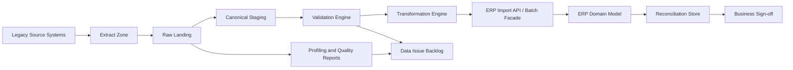
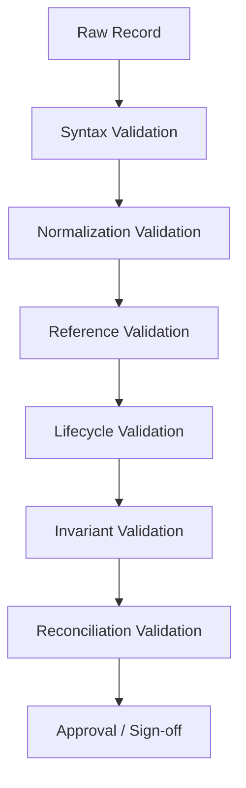
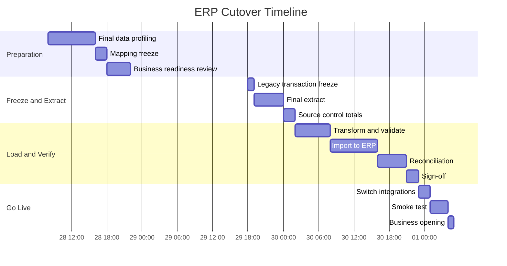
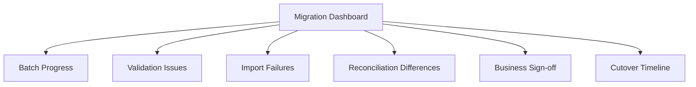
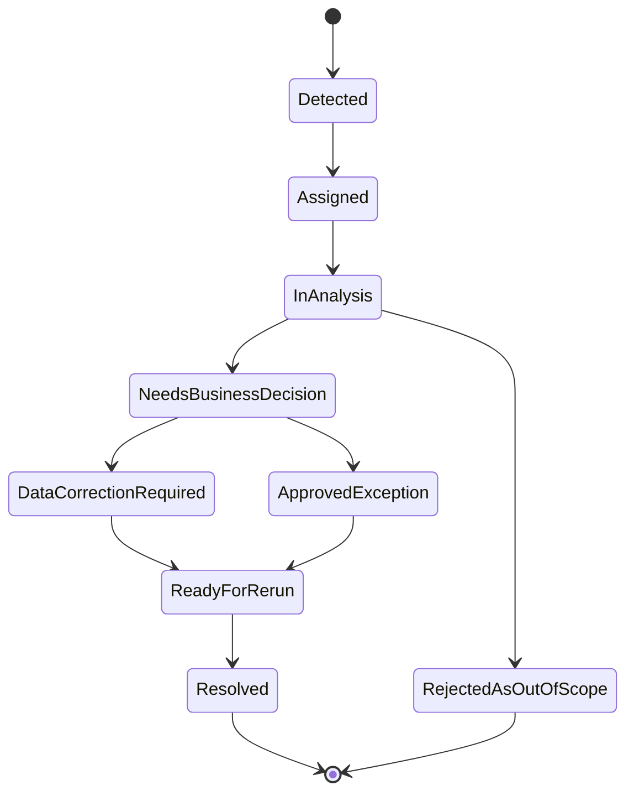

# Part 027 — Data Migration, Import, and Cutover Engineering

> **Core idea:** ERP migration is not a data-copying exercise. It is a controlled transformation of business truth from one operational universe into another, with explicit ownership, validation, reconciliation, rollback, and sign-off.

Large-scale ERP projects often fail not because the core architecture is weak, but because the organization underestimates migration. A system can have clean aggregates, strong APIs, good workflow, and impressive observability, yet still go live with corrupted opening balances, duplicated vendors, wrong UOM conversion, broken item valuation, unreconciled AP invoices, missing tax numbers, and incomplete audit history.

This part builds the mental model and engineering discipline for migration, bulk import, and cutover in a Java ERP platform.

We will not repeat generic Java file IO, JPA, JSON/XML mapping, validation, or batch fundamentals. We will apply those foundations to the ERP-specific migration problem: **how to move business truth safely.**

---

## 1. Kaufman Skill Deconstruction

Josh Kaufman's method asks us to deconstruct the skill into sub-skills, learn enough to self-correct, remove practice barriers, and practice deliberately. For ERP migration, the skill is not "write an import job". It decomposes into these capabilities:

| Sub-skill | What top engineers can do |
|---|---|
| Migration scoping | Decide what must migrate, what must be archived, and what can be recreated. |
| Source-system discovery | Understand legacy semantics, not just legacy columns. |
| Data profiling | Quantify data quality, duplicates, invalid references, missing values, and domain drift. |
| Canonical staging design | Design staging tables/files as a controlled boundary before touching production entities. |
| Transformation design | Convert legacy semantics into ERP semantics with traceable mapping rules. |
| Validation | Validate format, reference, lifecycle, invariant, authorization, accounting, and operational correctness. |
| Idempotent import | Safely retry, resume, and re-run imports without duplicating business records. |
| Reconciliation | Prove migrated values match agreed source truth and explain differences. |
| Cutover planning | Orchestrate freeze, extract, transform, load, verify, switch, and fallback. |
| Governance | Make migration auditable, signed off, and defensible. |

The target is not to memorize templates. The target is to build an instinct: **every migrated row is a business claim that must be explainable.**

---

## 2. Migration Is a Business Transaction, Not an ETL Job

A naive view says:

```text
legacy database -> transform script -> new database
```

A real ERP view says:

```text
legacy business state -> validated canonical migration evidence -> new ERP operational truth
```

The difference is critical.

### 2.1 The migration must answer six questions

| Question | Why it matters |
|---|---|
| What does this record mean in the legacy system? | Column names often lie. Legacy semantics are contextual. |
| Who owns the correctness of this data? | Engineering cannot sign off vendor tax identity or opening GL balance alone. |
| What ERP invariant does this record affect? | Stock, accounting, approval, pricing, tax, and identity data affect different invariants. |
| Can this record be re-imported safely? | Cutover rehearsals require repeated runs. |
| How do we reconcile it? | Go-live requires proof, not confidence. |
| What happens if it fails? | Failure must be isolated and recoverable. |

### 2.2 Migration changes the meaning of the target system

Before migration, the ERP is a configured platform. After migration, it becomes a legally and operationally meaningful system. That means the import process is part of the product's trust boundary.

For example:

- opening GL balances define starting financial truth;
- open AP invoices define liabilities;
- open AR invoices define receivables;
- stock balances define inventory value;
- item master defines procurement and fulfillment behavior;
- customer/vendor master defines tax, payment, and legal behavior;
- workflow state defines who can act next;
- audit history defines what the organization can defend later.

---

## 3. Migration Taxonomy

Not all data should be migrated the same way.

| Data class | Examples | Migration strategy |
|---|---|---|
| Reference data | currency, country, tax type, UOM, payment terms | Prefer curated seed/config import with governance. |
| Master data | customer, vendor, item, chart of accounts, warehouse, bank account | Cleanse, dedupe, approve, import into governed lifecycle. |
| Opening balances | GL opening balance, stock opening balance, AR/AP open items | Import as controlled opening documents, not arbitrary table writes. |
| Open operational documents | open PO, open SO, open work order, open service case | Migrate current lifecycle state with transition evidence. |
| Historical documents | closed invoice, old shipment, old journal, archived approval | Often archive/search, not full operational migration. |
| Attachments/evidence | contracts, invoices, delivery notes, signed approvals | Preserve with metadata, hash, retention, and access control. |
| Configuration | approval matrix, pricing rules, tax rules, posting profiles | Treat as governed runtime behavior, not simple key-value copy. |
| Security data | users, roles, delegations, SoD exceptions | Revalidate and sign off, do not blindly inherit. |

The default rule:

> **Do not migrate historical data into operational tables unless the new ERP must operate on it.**

Operational migration is expensive because migrated records must obey current invariants. Archival migration is different: it must preserve evidence, searchability, and retention, but does not necessarily need to participate in new workflow.

---

## 4. Migration Architecture

A robust migration pipeline has explicit boundaries.



### 4.1 Why not import directly into domain tables?

Direct DB imports are tempting because they are fast. They are also dangerous because they bypass:

- domain validation;
- lifecycle transitions;
- posting rules;
- audit event creation;
- numbering policy;
- security scope;
- idempotency;
- reconciliation hooks;
- business event emission;
- derived read model update.

A mature ERP may still use optimized bulk loading internally, but the bulk loader must behave like a domain gateway, not like a random SQL script.

### 4.2 Recommended layers

| Layer | Responsibility |
|---|---|
| Raw landing | Preserve original extract exactly as received. |
| Profiling | Measure data quality and discover anomalies. |
| Canonical staging | Normalize input into target migration contract. |
| Validation | Reject records that violate syntax, references, state, or invariants. |
| Transformation | Convert canonical records into target commands/documents. |
| Import facade | Execute domain-safe import with idempotency and audit. |
| Reconciliation | Compare loaded state to agreed source control totals. |
| Sign-off | Capture accountable approval before cutover/go-live. |

---

## 5. Canonical Staging Model

A staging model is not just temporary storage. It is a migration contract.

### 5.1 Staging principles

A good staging model is:

- **source traceable** — every row maps to source system, extract batch, file, row number, and legacy key;
- **idempotent** — every row has a stable migration key;
- **validatable** — status, errors, warnings, and validation version are explicit;
- **domain aligned** — staging fields match target ERP meaning, not random legacy layout;
- **auditable** — transform rules and operator corrections are captured;
- **re-runnable** — it supports dry runs, rehearsal runs, and final cutover runs.

### 5.2 Example staging schema

```sql
create table mig_customer_staging (
    migration_batch_id uuid not null,
    source_system text not null,
    source_record_key text not null,
    source_row_number bigint,

    migration_key text not null,
    target_tenant_id uuid not null,
    target_company_code text not null,

    legal_name text not null,
    display_name text,
    tax_identifier text,
    customer_group_code text,
    payment_term_code text,
    billing_currency_code char(3),
    credit_limit numeric(19, 4),

    normalized_payload jsonb not null,
    source_payload_hash text not null,
    transform_rule_version text not null,

    validation_status text not null,
    validation_errors jsonb not null default '[]',
    validation_warnings jsonb not null default '[]',

    target_customer_id uuid,
    import_status text not null,
    imported_at timestamptz,
    created_at timestamptz not null default now(),

    constraint uk_mig_customer unique (migration_batch_id, migration_key)
);
```

### 5.3 Migration key design

The migration key should represent identity as agreed for migration, not merely a database primary key.

Poor keys:

```text
row_number
legacy_table_id_only
random_uuid_generated_during_each_run
```

Better keys:

```text
LEGACY_ERP_A:CUSTOMER:0003912
LEGACY_WMS:ITEM:COMPANY_01:SKU-9001
LEGACY_FIN:OPEN_AP:SUPPLIER-77:INV-2024-00088
```

A stable migration key allows:

- safe retry;
- duplicate detection;
- mapping from source to target;
- reconciliation;
- support investigation;
- rollback analysis.

---

## 6. Import as Commands, Not Rows

ERP data usually enters the system through commands.

Instead of thinking:

```text
insert into customer values (...)
```

think:

```text
CreateCustomerFromMigrationCommand
CreateOpeningStockBalanceCommand
CreateOpenPurchaseOrderCommand
CreateOpenInvoiceCommand
CreateOpeningJournalCommand
```

### 6.1 Command-style import example

```java
public record ImportOpenApInvoiceCommand(
        UUID migrationBatchId,
        String migrationKey,
        String sourceSystem,
        String legacyInvoiceNumber,
        String supplierCode,
        LocalDate invoiceDate,
        LocalDate dueDate,
        Currency currency,
        BigDecimal grossAmount,
        BigDecimal taxAmount,
        BigDecimal openAmount,
        List<ImportedInvoiceLine> lines,
        String payloadHash
) {}
```

The handler should enforce ERP semantics:

```java
@Transactional
public ImportResult importOpenApInvoice(ImportOpenApInvoiceCommand command) {
    ImportLedger existing = importLedger.find(command.migrationBatchId(), command.migrationKey());
    if (existing != null) {
        return existing.toResult();
    }

    Supplier supplier = supplierRepository.requireActiveByCode(command.supplierCode());
    FiscalPeriod period = fiscalCalendar.requireOpenMigrationPeriod(command.invoiceDate());

    Money gross = Money.of(command.grossAmount(), command.currency());
    Money tax = Money.of(command.taxAmount(), command.currency());
    Money open = Money.of(command.openAmount(), command.currency());

    OpenApInvoice invoice = OpenApInvoice.imported(
            supplier,
            command.legacyInvoiceNumber(),
            command.invoiceDate(),
            command.dueDate(),
            gross,
            tax,
            open,
            command.lines(),
            period
    );

    apInvoiceRepository.save(invoice);

    importLedger.recordSuccess(
            command.migrationBatchId(),
            command.migrationKey(),
            invoice.id(),
            command.payloadHash()
    );

    audit.record(MigrationAuditEvent.imported(command.migrationKey(), invoice.id()));

    return ImportResult.success(invoice.id());
}
```

Key point: the import handler still respects the business model.

---

## 7. Validation Model

Migration validation must be layered. A single `isValid()` function is not enough.



### 7.1 Validation layers

| Layer | Example failure |
|---|---|
| Syntax | amount is not numeric, date cannot be parsed, currency code malformed. |
| Normalization | duplicate spaces, mixed case tax ID, legacy boolean encoded inconsistently. |
| Reference | vendor code not found, UOM unknown, tax code unmapped. |
| Lifecycle | closed PO imported as open, cancelled order imported as active. |
| Invariant | invoice total != sum(lines), stock balance negative where disallowed. |
| Cross-domain | open AP invoice references inactive supplier bank account. |
| Reconciliation | imported AR total does not match signed source control total. |
| Governance | business owner has not approved exception. |

### 7.2 Validation result shape

```java
public record MigrationValidationResult(
        String migrationKey,
        ValidationStatus status,
        List<MigrationIssue> errors,
        List<MigrationIssue> warnings,
        String validationRuleVersion
) {}

public record MigrationIssue(
        String code,
        String severity,
        String field,
        String message,
        String remediationHint
) {}
```

Issue codes should be stable and reportable:

```text
MIG-CUST-001: Missing legal name
MIG-CUST-014: Duplicate tax identifier within company
MIG-ITEM-022: UOM conversion missing
MIG-AP-031: Supplier not active at invoice date
MIG-GL-010: Opening journal is not balanced
MIG-STK-018: Opening stock value negative without approved exception
```

### 7.3 Validation as a product feature

In large ERP migration, validation reports become a business workflow:

- data stewards triage issues;
- business owners approve exceptions;
- engineering adjusts transformation rules;
- migration team reruns the batch;
- control totals are regenerated;
- sign-off is captured.

This means validation results should not live only in logs. They need durable storage, filtering, export, ownership, and lifecycle.

---

## 8. Data Profiling Before Mapping

Profiling is how you avoid discovering reality during cutover.

### 8.1 Profiling questions

For each dataset, ask:

- How many records exist?
- How many are active, inactive, blocked, deleted, archived?
- Which fields are nullable in reality?
- Which values violate assumed domains?
- Which foreign keys are missing or implicit?
- Which duplicates exist?
- Which date ranges are impossible?
- Which records reference future periods?
- Which monetary amounts have unexpected precision?
- Which codes are reused across companies?
- Which records are operationally open?

### 8.2 Example profiling outputs

```text
Dataset: Vendor Master
Rows: 182,441
Active vendors: 37,918
Missing tax ID: 14,003
Duplicate bank account across vendor IDs: 91
Vendors with open AP but inactive status: 778
Payment term unmapped: 42 unique terms, 8,931 records
Currency not ISO 4217: 13 unique values
Address country unmapped: 4,120 records
```

This report is not merely technical. It drives migration scope, cleansing effort, risk, and go-live readiness.

### 8.3 Profiling should be repeated

Legacy data keeps changing. Profiling should run repeatedly:

- during discovery;
- before mapping freeze;
- during migration rehearsal;
- before final extract;
- after final extract;
- after go-live verification.

---

## 9. Mapping Rules and Transformation Governance

Transformation rules are business decisions encoded as software.

Examples:

| Legacy condition | Target rule |
|---|---|
| vendor status = `SUSP` but has open AP | import vendor as `PAYMENT_BLOCKED`, not inactive. |
| item UOM = `PCS` | map to `EA`, with conversion factor 1. |
| customer credit group missing | assign default group by company and customer segment. |
| negative stock in legacy | import only if site has approved negative stock exception. |
| old tax code `VAT10A` | map to target tax profile `ID_VAT_11_STANDARD` after effective date. |

### 9.1 Mapping rule metadata

Each rule should have:

- rule ID;
- source field(s);
- target field(s);
- condition;
- transformation expression;
- owner;
- approval status;
- effective migration batch;
- version;
- test examples;
- known exceptions.

### 9.2 Example mapping rule table

```sql
create table mig_mapping_rule (
    id uuid primary key,
    domain text not null,
    rule_code text not null,
    rule_version text not null,
    source_field text not null,
    target_field text not null,
    condition_expression text not null,
    transform_expression text not null,
    owner_user_id uuid not null,
    approval_status text not null,
    approved_at timestamptz,
    created_at timestamptz not null default now(),
    constraint uk_mig_mapping_rule unique (domain, rule_code, rule_version)
);
```

### 9.3 Rule drift is a cutover risk

If mapping rules change after rehearsal, rehearsal results are no longer fully predictive. Therefore, establish a mapping freeze window and require change control for late mapping changes.

---

## 10. Opening Balances

Opening balances are the most sensitive migration class because they establish the starting state of financial and inventory truth.

### 10.1 Financial opening balance

A proper GL opening balance import should:

- use a dedicated migration journal source;
- post into a controlled opening period;
- balance debits and credits;
- preserve dimensions such as company, cost center, profit center, project, and currency;
- link to source trial balance;
- require finance sign-off;
- generate audit evidence;
- be reversible or adjustable through controlled journal, not direct SQL.

### 10.2 AP/AR open items

Open invoices should not be imported as a single GL balance if the ERP must collect/pay them individually.

You typically need both:

- GL opening balance for control accounts;
- open AP/AR subledger items for operational settlement.

Then reconcile:

```text
Sum(open AP invoices by control account) == GL AP control account opening balance
Sum(open AR invoices by control account) == GL AR control account opening balance
```

### 10.3 Inventory opening balance

Inventory opening balance must reconcile quantity and value:

```text
stock quantity by item/location/lot/serial
stock value by valuation method/accounting dimension
```

Never import stock quantity without a valuation decision if inventory value matters to financial statements.

---

## 11. Open Document Migration

Open documents are harder than master data because they have lifecycle state.

### 11.1 Purchase order example

A legacy PO may be:

- approved but not received;
- partially received;
- received but not invoiced;
- partially invoiced;
- closed operationally but open financially;
- cancelled after partial receipt;
- amended after approval.

A target ERP import must not simply set `status = OPEN`.

### 11.2 Open document migration options

| Option | Use when | Risk |
|---|---|---|
| Recreate from beginning | Need full operational continuity | Hard to preserve historical approvals. |
| Import current state with evidence | Need future operation, not full replay | Must prove state accurately. |
| Close legacy and create new target document | Clean cutover preferred | Requires business process agreement. |
| Archive only | No future operation required | Users may lose operational continuity. |

### 11.3 Lifecycle evidence

For open documents, preserve:

- legacy status;
- mapped target status;
- open quantity/amount;
- previous receipts/shipments/invoices;
- approval evidence if relevant;
- migrated state reason;
- business owner sign-off.

---

## 12. Import Idempotency and Restartability

Cutover rehearsals require repeated execution. Final cutover requires safe resume after failure.

### 12.1 Import ledger

```sql
create table migration_import_ledger (
    id uuid primary key,
    migration_batch_id uuid not null,
    domain text not null,
    migration_key text not null,
    payload_hash text not null,
    target_entity_type text,
    target_entity_id uuid,
    import_status text not null,
    attempt_count integer not null default 0,
    last_error_code text,
    last_error_message text,
    imported_at timestamptz,
    created_at timestamptz not null default now(),
    updated_at timestamptz not null default now(),
    constraint uk_migration_import unique (migration_batch_id, domain, migration_key)
);
```

### 12.2 Idempotency rules

| Situation | Correct behavior |
|---|---|
| Same migration key, same payload hash, already success | Return existing target ID. |
| Same migration key, different payload hash | Reject unless explicit correction workflow exists. |
| Previous failed attempt | Retry after issue resolved. |
| Partial side effect detected | Reconcile and either resume or mark for manual repair. |
| Target record exists without import ledger | Block automatic import and require investigation. |

### 12.3 Restartable batch

For Java batch processing, chunk-oriented jobs should support checkpoint/restart semantics. But ERP migration checkpointing must be aligned with business idempotency. A technical checkpoint is not enough if the domain operation is not idempotent.

```java
public final class CustomerImportItemWriter implements ItemWriter {
    private final CustomerMigrationService service;

    @Override
    public void writeItems(List<Object> items) throws Exception {
        for (Object item : items) {
            ImportCustomerCommand command = (ImportCustomerCommand) item;
            service.importCustomer(command); // idempotent command handler
        }
    }
}
```

The writer can be called again after restart. The command handler must tolerate that.

---

## 13. Reconciliation Engineering

Reconciliation is the difference between "we loaded data" and "we can prove the load is correct."

### 13.1 Control totals

Control totals should be agreed before import.

| Domain | Control total examples |
|---|---|
| Customer | count by company, active count, credit exposure total. |
| Vendor | count by company, active count, open AP vendor count. |
| Item | count by item type, stock-managed count, valuation method count. |
| GL | debit total, credit total, balance by account/dimension. |
| AP | open invoice count, open amount by supplier/control account/currency. |
| AR | open invoice count, open amount by customer/control account/currency. |
| Inventory | quantity/value by item/location/lot/valuation account. |
| PO | open PO count, open amount, open quantity by vendor/site. |
| SO | open SO count, open amount, allocated/unallocated quantity. |

### 13.2 Reconciliation report

```text
Domain: AP Open Items
Migration batch: FINAL-CUTOVER-2026-06-30
Source invoice count: 128,441
Target invoice count: 128,441
Source open amount IDR: 92,440,991,200.00
Target open amount IDR: 92,440,991,200.00
Difference: 0.00
Rejected records: 0
Warnings accepted: 217
Business sign-off: Finance Controller, 2026-06-30T23:41:00+07:00
```

### 13.3 Reconciliation dimensions

Reconcile at multiple levels:

- total;
- by company;
- by currency;
- by account;
- by customer/vendor;
- by location;
- by period;
- by document status;
- by migration batch;
- by exception category.

A total-only reconciliation can hide offsetting errors.

---

## 14. Cutover Planning

Cutover is the coordinated transition from old operational reality to new operational reality.



### 14.1 Cutover runbook

A runbook should include:

- exact timeline;
- owner for every activity;
- input/output for every step;
- command or job to execute;
- expected duration;
- success criteria;
- rollback/fallback criteria;
- escalation path;
- communication channel;
- sign-off checkpoint;
- evidence to capture.

### 14.2 Cutover freeze strategy

| Strategy | Description | Trade-off |
|---|---|---|
| Hard freeze | Stop legacy transactions before final extract. | Safest, highest business interruption. |
| Soft freeze | Allow limited controlled transactions. | Lower interruption, harder reconciliation. |
| Delta migration | Initial load plus incremental changes. | Less downtime, more complexity. |
| Parallel run | Operate both systems for a period. | Strong validation, high operational cost. |

ERP domains often use mixed strategy. For example, master data can be migrated earlier with delta sync, while financial opening balance may require hard freeze.

---

## 15. Delta Migration and Change Capture

For large datasets, a one-shot migration may be too slow. Delta migration reduces downtime but increases correctness burden.

### 15.1 Delta categories

| Delta type | Example |
|---|---|
| New record | New customer created after initial load. |
| Update | Vendor bank account changed. |
| Status change | Purchase order approved. |
| Financial movement | Invoice paid. |
| Stock movement | Goods receipt posted. |
| Delete/archive | Legacy item marked inactive. |

### 15.2 Delta hazard

A delta is not merely changed data. It may represent a business event that must be mapped to a target lifecycle transition.

Example:

```text
Legacy PO line received quantity changed from 10 to 15
```

This might mean:

- a new goods receipt was posted;
- a previous receipt was corrected;
- a data repair occurred;
- a status recalculation happened.

The target ERP must not blindly overwrite open quantity if downstream documents already exist.

### 15.3 Delta rule

> Use delta migration for stable master data and controlled documents. Be cautious with high-volume transactional domains unless business semantics are clear.

---

## 16. Bulk Import Performance Without Sacrificing Correctness

ERP migration often needs to load millions of records in a finite cutover window. Performance matters, but correctness remains non-negotiable.

### 16.1 Performance levers

| Lever | Use carefully |
|---|---|
| Chunking | Keep transactions bounded. |
| Parallelism | Partition by independent tenant/company/domain. |
| Database batch inserts | Use behind domain-safe import facade. |
| Precomputed lookup maps | Avoid repeated reference lookup queries. |
| Deferred read model build | Build projections after core import if safe. |
| Disable non-critical notifications | Avoid sending customer/vendor-facing emails during migration. |
| Dedicated migration indexes | Support validation/reconciliation queries. |
| Partitioned staging tables | Improve loading and cleanup. |

### 16.2 Unsafe shortcuts

Avoid:

- disabling all constraints without compensating validation;
- importing posted documents without posting ledger entries;
- skipping audit log creation;
- writing target IDs back to legacy as the only mapping store;
- hardcoding mapping rules in one-off scripts with no version;
- manually editing production tables after failed import;
- assuming row counts are enough reconciliation.

---

## 17. Migration Observability

Migration should be observable like a production workload.

### 17.1 Metrics

Track:

- rows extracted;
- rows staged;
- rows validated;
- validation error count by code;
- warning count by code;
- rows imported;
- rows skipped idempotently;
- rows failed;
- import throughput;
- average validation latency;
- deadlock/retry count;
- reconciliation difference;
- sign-off status.

### 17.2 Logs and traces

Every import should be searchable by:

- migration batch ID;
- domain;
- migration key;
- source system;
- target entity ID;
- validation issue code;
- operator correction ID;
- reconciliation report ID.

### 17.3 Dashboard shape



---

## 18. Rollback, Fallback, and Repair

Rollback in ERP migration is rarely as simple as deleting imported rows.

### 18.1 Rollback types

| Type | Meaning |
|---|---|
| Technical rollback | Transaction rollback for a failed chunk/command. |
| Batch rollback | Remove a migration batch before go-live. |
| Business reversal | Reverse posted financial/stock documents. |
| Fallback to legacy | Abandon go-live and continue operating legacy. |
| Forward repair | Keep go-live and apply controlled corrections. |

### 18.2 Before go-live vs after go-live

Before go-live, you may be able to truncate target migration data and rerun.

After go-live, imported data may have been used by real transactions. Deleting it can destroy auditability. After go-live, prefer controlled correction documents, reversals, adjustments, and support workflows.

### 18.3 Fallback criteria

Define fallback criteria before cutover:

- reconciliation difference exceeds threshold;
- critical domain import incomplete;
- integration switch fails;
- business smoke test fails;
- performance cannot support opening workload;
- legal numbering or accounting posting is inconsistent;
- key users cannot access required functions;
- unresolved Sev-1 migration defects.

---

## 19. Data Issue Workflow

Migration issues should be handled like cases.



Each issue should have:

- issue code;
- affected migration keys;
- owner;
- severity;
- business impact;
- root cause;
- correction action;
- approval evidence;
- rerun result.

---

## 20. Security and Privacy in Migration

Migration often moves sensitive data through temporary zones. Treat migration infrastructure as production-grade.

### 20.1 Controls

- encrypt files at rest and in transit;
- restrict staging database access;
- avoid copying production data to uncontrolled machines;
- mask sensitive fields in logs;
- define retention for raw extracts;
- audit who downloaded or corrected data;
- separate duties between data correction and approval;
- secure credentials for legacy extraction;
- remove temporary privileges after cutover;
- purge temporary data according to retention policy.

### 20.2 Common leaks

- CSV extracts emailed around;
- raw customer/vendor bank details in developer laptops;
- validation error logs containing tax IDs or personal data;
- shared service account used by everyone;
- migration dashboards exposed too widely;
- old extract files left in object storage forever.

---

## 21. Testing Strategy for Migration

Migration testing is not only "does the script run?"

### 21.1 Test levels

| Test | Purpose |
|---|---|
| Mapping unit test | Verify one rule maps inputs to expected output. |
| Validator test | Verify invalid data is rejected with correct code. |
| Import command test | Verify domain invariants and idempotency. |
| End-to-end dataset test | Verify full pipeline from raw extract to target ERP. |
| Reconciliation test | Verify control totals and differences. |
| Performance test | Verify cutover window can be met. |
| Restart test | Kill job mid-run and resume safely. |
| Failure injection | Simulate DB error, duplicate file, missing reference, partial import. |
| User acceptance test | Verify migrated data supports real business process. |

### 21.2 Golden migration dataset

Build a small but rich dataset:

- customer with multiple addresses;
- vendor with payment block;
- item with UOM conversion;
- open PO partially received;
- open SO partially shipped;
- AP invoice partially paid;
- AR invoice overdue;
- stock with lot/serial;
- GL opening balance with dimensions;
- tax exception;
- invalid record for every major error code.

This dataset becomes a regression suite for migration logic.

---

## 22. Cutover Command Center

During final cutover, engineering, business, data, security, infrastructure, and support operate as one system.

### 22.1 Roles

| Role | Responsibility |
|---|---|
| Cutover lead | Owns timeline and go/no-go coordination. |
| Migration engineer | Executes jobs and triages technical failures. |
| Data steward | Owns data issue decisions. |
| Finance owner | Signs off GL/AP/AR/inventory value. |
| Operations owner | Signs off PO/SO/warehouse/manufacturing readiness. |
| Security owner | Verifies access and privileged control. |
| Integration owner | Switches external integrations. |
| Infrastructure owner | Monitors capacity, DB, JVM, queues, storage. |
| Support lead | Coordinates post-go-live support. |

### 22.2 Go/no-go meeting inputs

- final import status;
- unresolved critical defects;
- reconciliation reports;
- business sign-offs;
- smoke test results;
- integration readiness;
- rollback/fallback feasibility;
- support readiness;
- open risk register.

---

## 23. Anti-Patterns

| Anti-pattern | Why it fails |
|---|---|
| One heroic SQL script | No traceability, no validation lifecycle, no restartability. |
| Row-count reconciliation only | Cannot prove financial or operational correctness. |
| Business mapping hidden in code | Cannot be reviewed or signed off by business owners. |
| Direct production table edits | Bypasses audit, invariants, and supportability. |
| Final extract without freeze | Source truth keeps changing during cutover. |
| Migrating everything | Bloats target ERP and imports obsolete semantics. |
| Treating warnings as harmless | Warnings often become production support incidents. |
| No rehearsal | First full run happens during final cutover. |
| No fallback criteria | Go/no-go becomes emotional instead of evidence-based. |
| Temporary permissions left open | Migration creates long-lived security exposure. |

---

## 24. Java Implementation Blueprint

### 24.1 Package structure

```text
com.example.erp.migration
  batch
    CustomerImportJobConfig
    OpenApImportJobConfig
  landing
    RawFileRegistry
    ExtractBatchService
  staging
    CustomerStagingRepository
    StagingValidationService
  mapping
    MappingRuleRegistry
    TransformationEngine
  validation
    MigrationValidator
    ValidationIssueCatalog
  importfacade
    CustomerMigrationFacade
    OpenApMigrationFacade
  reconciliation
    ReconciliationService
    ControlTotalRepository
  audit
    MigrationAuditService
  cutover
    CutoverRunbookService
    GoNoGoChecklistService
```

### 24.2 Domain-neutral pipeline interface

```java
public interface MigrationPipeline<S, C> {
    MigrationDomain domain();
    ValidationResult validate(S stagedRecord);
    C transform(S stagedRecord);
    ImportResult importCommand(C command);
    ReconciliationResult reconcile(MigrationBatchId batchId);
}
```

### 24.3 Batch execution pattern

```java
public final class MigrationRunner {
    private final List<MigrationPipeline<?, ?>> pipelines;

    public void run(MigrationBatchId batchId) {
        for (MigrationPipeline<?, ?> pipeline : pipelines) {
            runPipeline(batchId, pipeline);
        }
    }

    private <S, C> void runPipeline(MigrationBatchId batchId, MigrationPipeline<S, C> pipeline) {
        // 1. validate staged records
        // 2. reject blocking errors
        // 3. transform valid records
        // 4. call idempotent import facade
        // 5. reconcile and produce evidence
    }
}
```

---

## 25. Design Review Checklist

Use this checklist before accepting a migration architecture.

### Scope and ownership

- [ ] Is every migrated domain explicitly scoped?
- [ ] Is every excluded dataset intentionally excluded?
- [ ] Is each dataset owned by a business owner?
- [ ] Are historical and operational migrations separated?

### Staging and traceability

- [ ] Is raw source preserved unchanged?
- [ ] Does every row have source system, legacy key, file, row number, and batch ID?
- [ ] Does every row have a stable migration key?
- [ ] Are transformation rule versions captured?

### Validation

- [ ] Are syntax/reference/lifecycle/invariant validations separated?
- [ ] Are validation issue codes stable?
- [ ] Are warnings governed and signed off?
- [ ] Can validation results be queried and exported?

### Import

- [ ] Are imports idempotent?
- [ ] Is there an import ledger?
- [ ] Are domain invariants enforced?
- [ ] Are audit events created?
- [ ] Are partial failures recoverable?

### Reconciliation

- [ ] Are control totals agreed before import?
- [ ] Are totals reconciled by relevant dimensions?
- [ ] Are differences explainable?
- [ ] Is business sign-off captured?

### Cutover

- [ ] Is there a rehearsal-tested runbook?
- [ ] Are freeze/delta rules clear?
- [ ] Are go/no-go criteria objective?
- [ ] Is fallback feasible and rehearsed?
- [ ] Is post-go-live support ready?

---

## 26. Practice Plan

### Hour 1-3 — Build migration scope

Pick a simplified ERP slice:

- customer master;
- item master;
- open AP invoices;
- opening GL balance;
- opening stock.

Define migration strategy for each.

### Hour 4-6 — Design staging schema

Create staging schemas with:

- migration batch ID;
- source key;
- migration key;
- normalized payload;
- validation status;
- import status;
- target ID.

### Hour 7-9 — Write validation catalog

Define at least 25 validation issue codes across syntax, reference, lifecycle, invariant, and reconciliation categories.

### Hour 10-12 — Implement idempotent import facade

Write pseudo-code or real Java for:

- customer import;
- open AP invoice import;
- opening journal import.

### Hour 13-15 — Reconciliation design

Design control totals and reports for AP, GL, and inventory.

### Hour 16-18 — Cutover runbook

Write a cutover timeline with owner, step, command, success criteria, and fallback trigger.

### Hour 19-20 — Failure simulation

Simulate:

- duplicate customer;
- missing UOM;
- unbalanced opening journal;
- partial import failure;
- wrong open AP total;
- failed final extract.

For each, define detection, containment, correction, and sign-off.

---

## 27. Key Mental Models

1. **Migration is evidence production.** The output is not only data in target tables; it is proof that the target represents agreed business truth.
2. **Staging is a contract.** Treat staging as a governed interface, not a dump zone.
3. **Import commands preserve domain behavior.** Direct SQL bypasses the system you spent months designing.
4. **Idempotency enables rehearsal.** If you cannot rerun safely, you cannot cut over safely.
5. **Reconciliation is multi-dimensional.** Totals can match while details are wrong.
6. **Cutover is a socio-technical workflow.** The system includes people, sign-offs, freeze rules, communications, and fallback.
7. **After go-live, correction is business operation.** You cannot pretend imported data is disposable once real users transact on it.

---

## 28. Source Notes

- Jakarta Batch specifies batch runtime support including checkpoint/restart for chunk-oriented steps. This is relevant for restartable migration jobs, but ERP idempotency must still be implemented at the business command layer.
- OWASP logging guidance is relevant for migration audit and operational visibility, especially because migration jobs handle sensitive and high-value business records.
- PostgreSQL transaction, locking, constraint, and bulk loading features can support migration pipelines, but must not replace domain-level validation and reconciliation.
- Enterprise Integration Patterns vocabulary such as idempotent receiver and guaranteed delivery is useful when migration uses files, queues, and staged events.

