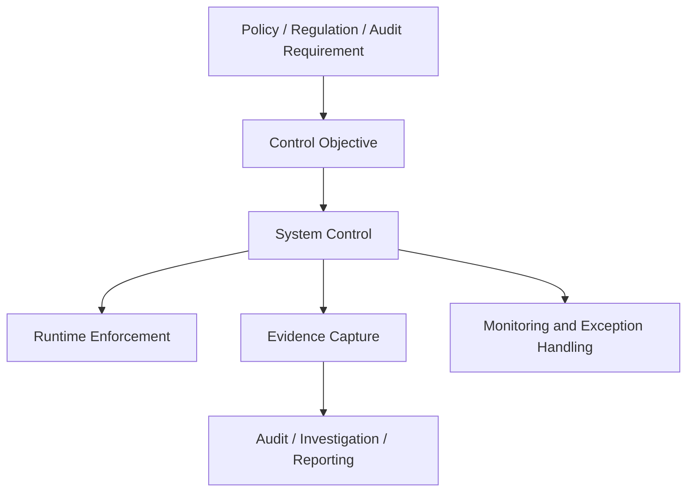
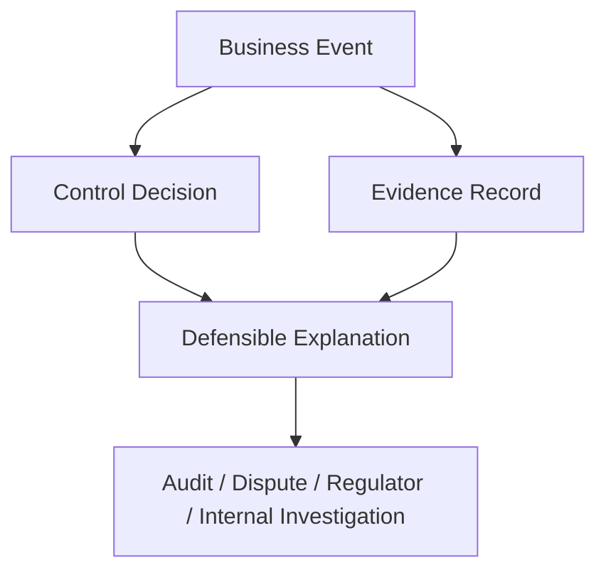
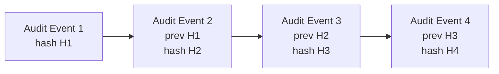
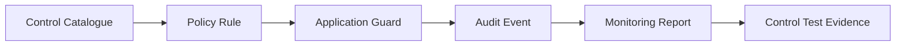
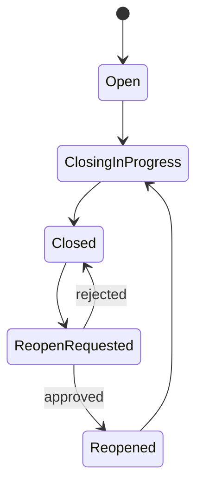
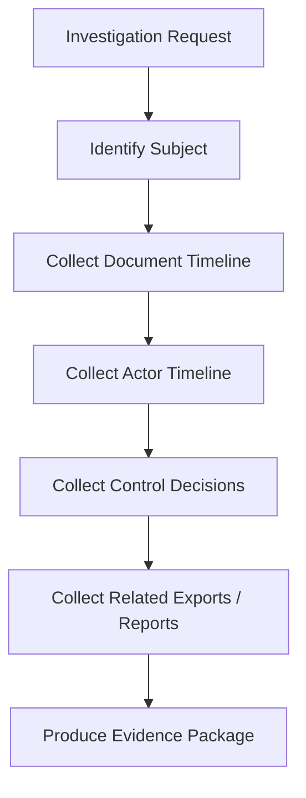

# Part 028 — Compliance, Audit, Regulatory, and Defensibility

> **Core idea:** A large-scale ERP is not merely expected to be correct. It must be able to prove why it was correct, who decided, what changed, what evidence existed, and whether controls operated effectively.

Compliance in ERP engineering is often misunderstood. Many teams reduce it to authentication, audit logs, and a few reports. That is not enough. In a serious ERP, compliance is an architectural property: the system must produce defensible evidence for financial, operational, security, privacy, and regulatory questions.

This part focuses on designing ERP systems that can survive audit, dispute, investigation, and regulatory review.

We will not repeat generic security or cryptography. We will focus on the ERP-specific problem: **how to model, preserve, query, and defend business evidence.**

---

## 1. Kaufman Skill Deconstruction

To become effective at compliance-oriented ERP engineering, decompose the skill into these sub-skills:

| Sub-skill | What top engineers can do |
|---|---|
| Control modelling | Convert business/regulatory requirements into enforceable application controls. |
| Evidence modelling | Capture who/what/when/where/why/how for meaningful events. |
| Audit trail design | Build immutable, queryable, tamper-evident histories. |
| Segregation of duties | Prevent toxic combinations of permissions and actions. |
| Approval defensibility | Prove authorization, delegation, threshold, and context at approval time. |
| Retention design | Preserve records long enough, delete them when required, and prove both. |
| Privacy boundary design | Avoid leaking sensitive data through logs, exports, reports, and integrations. |
| Compliance reporting | Support auditors without giving uncontrolled production access. |
| Exception handling | Govern overrides, emergency access, manual corrections, and waivers. |
| Investigation support | Reconstruct timelines across documents, users, integrations, and data changes. |

The goal is not to memorize standards. The goal is to design systems where **business truth is defensible under scrutiny.**

---

## 2. Compliance Is a System Property

A control does not exist because a document says it exists. A control exists when the system reliably enforces or detects the intended behavior and produces evidence of operation.

### 2.1 Three layers of compliance



| Layer | Example |
|---|---|
| Policy requirement | Purchases above IDR 100M require two approvals. |
| Control objective | Prevent unauthorized high-value purchase commitment. |
| System control | Approval workflow with threshold, SoD, delegation, and immutable evidence. |
| Runtime enforcement | PO cannot be released until required approvals are complete. |
| Evidence | Approval decision, approver authority, threshold, timestamp, prior state, payload hash. |
| Monitoring | Report approvals made through emergency override. |

### 2.2 Compliance is not only prevention

Controls can be:

| Control type | Purpose | ERP example |
|---|---|---|
| Preventive | Stop bad action before it happens. | Block posting to closed period. |
| Detective | Detect suspicious or invalid action. | Report vendor bank changes followed by payment. |
| Corrective | Repair after issue. | Reversal journal and documented adjustment. |
| Directive | Guide behavior. | Required fields and configured approval matrix. |
| Compensating | Reduce risk when primary control cannot apply. | Manual review for emergency access action. |

A defensible ERP uses multiple control types. Prevention alone is not enough because real operations include exceptions, corrections, emergencies, and legacy edge cases.

---

## 3. Defensibility Model

Regulatory defensibility means the system can answer questions under challenge.

### 3.1 The defensibility questions

For any significant ERP event, you should be able to answer:

| Question | Example |
|---|---|
| What happened? | Purchase order was approved. |
| Who did it? | User, service account, delegated actor, or integration principal. |
| When did it happen? | Timestamp with timezone and clock source. |
| Where did it happen? | Application, module, tenant, company, device/session/context. |
| Why was it allowed? | Role, policy, approval threshold, SoD exception, delegation. |
| What data was used? | Document version, amount, vendor, approval matrix version. |
| What changed? | Before/after state, transition, derived effects. |
| What evidence exists? | Audit event, document snapshot, signature/approval, attachment hash. |
| Was the control operating? | Enforcement result, decision trace, policy version. |
| Who reviewed exceptions? | Exception owner, approval, reason, expiry. |

### 3.2 Defensibility triangle



A log line alone rarely satisfies this triangle. You need structured evidence tied to business semantics.

---

## 4. Audit Event Model

A useful audit trail is not a dump of technical events. It is a structured history of meaningful actions and decisions.

### 4.1 Audit event schema

```sql
create table audit_event (
    id uuid primary key,
    tenant_id uuid not null,
    company_id uuid,

    event_time timestamptz not null,
    event_type text not null,
    event_category text not null,

    actor_type text not null,
    actor_id text not null,
    actor_display_name text,
    acting_on_behalf_of text,

    subject_type text not null,
    subject_id text not null,
    subject_business_key text,

    action text not null,
    outcome text not null,
    reason_code text,
    reason_text text,

    request_id text,
    correlation_id text,
    session_id text,
    source_ip inet,
    user_agent text,

    policy_version text,
    decision_trace jsonb,

    before_hash text,
    after_hash text,
    evidence_payload jsonb not null,
    evidence_hash text not null,
    previous_event_hash text,

    created_at timestamptz not null default now()
);
```

### 4.2 Event categories

| Category | Examples |
|---|---|
| Authentication | login success/failure, MFA challenge, session termination. |
| Authorization | access denied, privileged action allowed, SoD violation blocked. |
| Master data | vendor created, bank account changed, item activated. |
| Document lifecycle | PO submitted, invoice posted, journal reversed. |
| Workflow | approval granted, delegation used, escalation fired. |
| Financial control | period closed, posting blocked, adjustment posted. |
| Configuration | approval rule changed, tax profile published, price book activated. |
| Integration | payment file generated, bank response imported, tax API failed. |
| Admin/support | user impersonation, emergency access, manual correction. |
| Export/report | sensitive report exported, financial statement generated. |

### 4.3 Audit event vs application log

| Application log | Audit event |
|---|---|
| Optimized for debugging and operations. | Optimized for evidence and accountability. |
| May be verbose and ephemeral. | Must be structured, retained, and queryable. |
| Often contains technical details. | Contains business meaning and control decision. |
| Can be sampled in some contexts. | Significant events must not be sampled away. |
| May be stored in logging platform. | Should be stored in controlled evidence store. |

Do not depend only on logs for audit trails.

---

## 5. Evidence Payload Design

Evidence must preserve the facts needed to defend a decision later.

### 5.1 Approval evidence example

```json
{
  "documentType": "PURCHASE_ORDER",
  "documentNumber": "PO-2026-000887",
  "documentVersion": 4,
  "vendorId": "VND-10091",
  "amount": "125000000.00",
  "currency": "IDR",
  "approvalPolicy": {
    "policyCode": "PO_APPROVAL",
    "policyVersion": "2026.06.15",
    "thresholdMatched": "IDR_100M_TO_500M",
    "requiredApproverLevel": "FINANCE_MANAGER"
  },
  "approver": {
    "userId": "u-9021",
    "roleAtDecisionTime": "FINANCE_MANAGER",
    "delegationUsed": false
  },
  "decision": "APPROVED",
  "decisionReason": "Budget confirmed and vendor contract valid",
  "documentHashAtDecisionTime": "sha256:..."
}
```

### 5.2 Why snapshot context?

If you only store `approver_user_id`, future investigation may fail because:

- the user's role changed;
- approval threshold changed;
- vendor status changed;
- document amount changed;
- delegation expired;
- organization hierarchy changed;
- old configuration was overwritten.

Defensible evidence captures context **at decision time**.

---

## 6. Tamper Evidence

Tamper evidence does not always mean blockchain. The basic design is to make unauthorized alteration detectable.

### 6.1 Hash chain pattern



Each event hash can include:

- event ID;
- event time;
- actor;
- subject;
- action;
- outcome;
- evidence payload canonical JSON;
- previous event hash.

### 6.2 Tamper-evident is not tamper-proof

A hash chain helps detect modification. It does not automatically prevent:

- privileged database delete;
- backup tampering;
- logging pipeline bypass;
- clock manipulation;
- compromised application service;
- selective non-logging.

Therefore, combine tamper evidence with:

- append-only storage policy;
- restricted write paths;
- separate audit database/schema;
- immutable object storage for exported evidence;
- privileged access monitoring;
- periodic external anchoring/checkpoint;
- reconciliation of business records to audit events.

---

## 7. Control Catalogue

A large ERP should maintain a control catalogue that maps requirements to implementation.

### 7.1 Example control record

```yaml
controlId: FIN-AP-004
name: Vendor bank change payment hold
objective: Prevent fraudulent payment after vendor bank account modification.
domain: Accounts Payable
controlType: Preventive + Detective
trigger: Vendor bank account changed
systemBehavior:
  - mark vendor payment method as pending verification
  - block payment run for affected vendor until verification approved
  - create audit event with before/after bank account hash
  - notify AP supervisor
exceptionProcess:
  - emergency unblock requires AP manager and treasury approval
  - exception expires after one payment run
relatedEvidence:
  - VENDOR_BANK_CHANGED audit event
  - PAYMENT_HOLD_APPLIED audit event
  - PAYMENT_HOLD_RELEASED audit event
  - approval task evidence
owner: Finance Control Team
reviewFrequency: Quarterly
```

### 7.2 Control-to-code traceability



A strong engineering organization can trace from control requirement to code path, test, monitoring, and evidence.

---

## 8. Segregation of Duties and Toxic Combinations

Part 007 introduced SoD. Here we focus on defensibility and control operation.

### 8.1 Toxic combinations

| Combination | Risk |
|---|---|
| Create vendor + approve vendor + create payment | Fake vendor fraud. |
| Create PO + approve PO + receive goods | Unauthorized procurement commitment. |
| Create customer + approve credit limit + post credit memo | Revenue/receivable manipulation. |
| Change bank account + run payment | Payment redirection fraud. |
| Create journal + approve journal + close period | Financial statement manipulation. |
| Configure tax rule + post invoice | Tax misstatement or manipulation. |

### 8.2 SoD must be temporal

It is not enough to say a user currently lacks both roles. You need to evaluate action history.

Example:

```text
User created vendor on Monday.
Role changed Tuesday.
User approved payment on Wednesday.
```

A point-in-time role check may pass. A temporal SoD control should detect the relationship between prior action and current action.

### 8.3 SoD exception evidence

If a toxic combination is allowed by exception, preserve:

- exception reason;
- approving authority;
- scope;
- expiry;
- compensating control;
- affected transactions;
- post-action review evidence.

---

## 9. Approval Defensibility

An approval is not just a clicked button. It is a decision under a policy.

### 9.1 Approval evidence requirements

For every significant approval, capture:

- document identity;
- document version;
- amount and currency;
- relevant dimensions;
- approval rule version;
- approver authority at decision time;
- delegation/acting-on-behalf-of context;
- prior approvers;
- SoD check result;
- decision timestamp;
- reason/comment if required;
- payload hash.

### 9.2 Approval invalidation

If a document changes after approval, decide whether approval remains valid.

| Change | Usually requires reapproval? |
|---|---|
| Amount increases | Yes. |
| Vendor changes | Yes. |
| Payment term changes | Often yes. |
| Delivery date changes | Depends on policy. |
| Internal note changes | Usually no. |
| Attachment added | Depends on attachment type. |
| Tax profile changes | Often yes. |

Approval systems need field-level materiality rules, not a naive "any update resets approval" or "approval never resets" policy.

---

## 10. Period Close and Financial Defensibility

Period close is a compliance boundary. Once a period is closed, systems must restrict changes that alter reported values.

### 10.1 Period close controls

- block posting into closed period;
- allow controlled late adjustment only through authorized process;
- preserve period close checklist;
- capture who closed/reopened period;
- explain why period was reopened;
- retain trial balance at close;
- reconcile subledger to GL;
- freeze/certify financial reports;
- monitor post-close adjustments.

### 10.2 Reopening a period

Reopening should be rare and auditable.



Capture:

- requester;
- reason;
- impact assessment;
- approval;
- duration;
- allowed posting scope;
- resulting adjustments;
- re-close evidence.

---

## 11. Retention and Legal Hold

Retention design decides how long records are kept and when they must be deleted, archived, anonymized, or held.

### 11.1 Retention policy model

```sql
create table retention_policy (
    id uuid primary key,
    policy_code text not null unique,
    record_type text not null,
    jurisdiction text,
    retention_period_months integer not null,
    retention_action text not null,
    legal_hold_overrides boolean not null default true,
    approval_required boolean not null default true,
    effective_from date not null,
    effective_to date
);
```

### 11.2 Legal hold

Legal hold overrides normal retention deletion. A record under investigation, litigation, audit, or regulatory request must be preserved.

```sql
create table legal_hold (
    id uuid primary key,
    hold_code text not null unique,
    subject_type text not null,
    subject_id text not null,
    reason text not null,
    requested_by uuid not null,
    approved_by uuid not null,
    active_from timestamptz not null,
    active_to timestamptz,
    status text not null
);
```

### 11.3 Retention failure modes

| Failure | Consequence |
|---|---|
| Keep everything forever | Privacy, storage, legal discovery, and access risk. |
| Delete too early | Audit/regulatory non-compliance and lost evidence. |
| Delete operational record but leave derived report | Inconsistent evidence. |
| Ignore legal hold | Serious legal/regulatory exposure. |
| Retain raw sensitive migration extracts forever | Privacy and breach risk. |

---

## 12. Privacy and Sensitive Data Boundaries

ERP systems contain sensitive data:

- employee-like user data;
- customer contact data;
- vendor bank details;
- tax identifiers;
- payroll-adjacent data;
- commercial pricing;
- contracts;
- financial statements;
- personal addresses;
- audit investigation notes.

### 12.1 Privacy-by-design controls

| Area | Control |
|---|---|
| Logs | Do not log raw sensitive values. Use IDs, hashes, or masked values. |
| Audit | Store necessary evidence, but avoid excessive personal data. |
| Exports | Require purpose, authorization, watermarking, and audit event. |
| Reports | Apply row/column-level security. |
| Search | Avoid exposing sensitive fields in autocomplete. |
| Test data | Mask or synthesize production data. |
| Integration | Send only fields required by receiving system. |
| Retention | Delete/anonymize according to policy unless legal hold applies. |

### 12.2 Masking example

```java
public final class SensitiveValueMasker {
    public String maskBankAccount(String accountNumber) {
        if (accountNumber == null || accountNumber.length() < 4) {
            return "****";
        }
        return "****" + accountNumber.substring(accountNumber.length() - 4);
    }
}
```

Never rely on UI masking alone. Sensitive data also leaks through logs, exports, errors, traces, screenshots, support tools, and integrations.

---

## 13. Export and Report Controls

Reports can be compliance assets or compliance risks.

### 13.1 Export evidence

When a sensitive report/export is generated, capture:

- report ID/version;
- filter parameters;
- row count;
- requesting user;
- authorization decision;
- purpose/reason if required;
- output file hash;
- destination;
- expiration/retention;
- watermark ID.

### 13.2 Report certification

A financial report used for close or audit should be certifiable.

```sql
create table certified_report_snapshot (
    id uuid primary key,
    report_code text not null,
    report_version text not null,
    parameter_hash text not null,
    data_as_of timestamptz not null,
    generated_by uuid not null,
    certified_by uuid,
    certification_status text not null,
    output_hash text not null,
    created_at timestamptz not null default now()
);
```

The report must be reproducible or preserved as evidence. If the underlying data changes, the certified snapshot should remain explainable.

---

## 14. Audit Query Model

Auditors and investigators need queryable evidence. Do not give them raw production DB access as the default answer.

### 14.1 Investigation timeline



### 14.2 Evidence package

An evidence package may include:

- document snapshot;
- lifecycle timeline;
- approval trail;
- configuration versions;
- access decision logs;
- related integration messages;
- report/export logs;
- attachments with hashes;
- reconciliation report;
- exception approvals;
- explanatory metadata.

### 14.3 Query examples

| Question | Query capability |
|---|---|
| Who changed this vendor bank account? | Subject timeline by vendor ID and field. |
| Was payment blocked after bank change? | Control event correlation. |
| Who approved this PO? | Approval evidence by document version. |
| Why could this user approve? | Authorization decision trace. |
| Was this period reopened? | Period lifecycle audit. |
| Which invoices were posted after close? | Financial control report. |
| Who exported customer data last month? | Export audit report. |

---

## 15. Exception and Override Governance

Every ERP needs exceptions. Compliance maturity is not "no exceptions"; it is controlled exceptions.

### 15.1 Exception model

```sql
create table control_exception (
    id uuid primary key,
    control_id text not null,
    subject_type text not null,
    subject_id text,
    requested_by uuid not null,
    approved_by uuid,
    reason text not null,
    risk_assessment text,
    compensating_control text,
    valid_from timestamptz not null,
    valid_to timestamptz not null,
    status text not null,
    created_at timestamptz not null default now()
);
```

### 15.2 Emergency access

Emergency access should be:

- time-bounded;
- purpose-bound;
- approved or post-reviewed;
- fully logged;
- automatically revoked;
- reported to control owner;
- tied to incident/case ID.

Anti-pattern: permanent admin role assigned because "support needs it sometimes."

---

## 16. Configuration Change Defensibility

Part 021 covered configuration as domain. Here we focus on compliance evidence.

Configuration changes that require strong audit:

- approval matrix;
- tax rules;
- posting profiles;
- price rules;
- payment approval limits;
- bank integration settings;
- SoD rules;
- period close calendar;
- retention policy;
- report definitions;
- role permissions.

For each configuration publication, capture:

- before/after diff;
- requester;
- approver;
- effective date;
- impacted tenants/companies;
- validation result;
- rollback plan;
- test evidence;
- publication event;
- impacted transactions after publication.

---

## 17. Integration Compliance

External integrations are part of the compliance boundary.

### 17.1 Examples

| Integration | Compliance concern |
|---|---|
| Bank payment file | Payment authorization, file integrity, transmission evidence. |
| Tax API | Tax calculation evidence, request/response retention. |
| E-invoicing | Legal numbering, invoice submission status, rejection handling. |
| WMS | Shipment/receipt evidence and stock reconciliation. |
| CRM | Customer data privacy and consent boundary. |
| Data warehouse | Sensitive data replication and report certification. |
| Identity provider | Authentication and user lifecycle evidence. |

### 17.2 Integration evidence

Capture:

- message ID;
- correlation ID;
- source/target system;
- contract version;
- payload hash;
- transmission time;
- acknowledgement;
- rejection reason;
- retry history;
- operator intervention;
- reconciliation result.

Do not store unnecessary raw payloads forever if they contain sensitive data. Store hashes, redacted payloads, or encrypted evidence according to policy.

---

## 18. Audit Trail Performance and Storage

Audit data grows rapidly. Design for scale.

### 18.1 Partitioning dimensions

Common partitioning choices:

- event time;
- tenant/company;
- event category;
- subject type;
- retention class.

### 18.2 Hot vs cold evidence

| Tier | Use |
|---|---|
| Hot audit store | Recent investigations, support, dashboards. |
| Warm archive | Audit period queries, compliance reports. |
| Cold immutable archive | Long-term retention, legal evidence. |

### 18.3 Index strategy

Index for investigation paths:

- subject type + subject ID + event time;
- actor ID + event time;
- event category + event time;
- correlation ID;
- request ID;
- policy version;
- company + event time;
- document business key.

Avoid indexing every JSON field blindly. Promote important evidence fields to typed columns.

---

## 19. Testing Controls

Controls need tests. A compliance requirement without automated verification tends to decay.

### 19.1 Control test examples

| Control | Test |
|---|---|
| Closed period block | Attempt posting into closed period and assert rejection + audit event. |
| PO approval threshold | Amount above threshold requires required approval level. |
| SoD prevention | User who created vendor cannot approve payment to same vendor. |
| Bank change hold | Bank change blocks payment until verification. |
| Report export audit | Export creates audit event with parameter hash and output hash. |
| Retention legal hold | Record under legal hold is not deleted by retention job. |
| Emergency access expiry | Temporary privilege auto-revokes after expiry. |
| Config publication approval | Unapproved tax rule cannot be activated. |

### 19.2 Evidence test fixture

Build test utilities that assert evidence quality:

```java
public final class AuditAssertions {
    public static void assertApprovalEvidence(AuditEvent event) {
        assertThat(event.eventType()).isEqualTo("DOCUMENT_APPROVED");
        assertThat(event.policyVersion()).isNotBlank();
        assertThat(event.evidencePayload()).containsKey("documentHashAtDecisionTime");
        assertThat(event.evidencePayload()).containsKey("approver");
        assertThat(event.evidenceHash()).startsWith("sha256:");
    }
}
```

Testing should verify not only that action succeeds/fails, but that the right evidence is produced.

---

## 20. Monitoring Compliance Signals

Compliance failures often appear as weak signals before they become incidents.

Monitor:

- spike in access denied events;
- repeated emergency access grants;
- vendor bank changes before payment run;
- manual journal entries near close deadline;
- period reopen events;
- failed audit event writes;
- sensitive report exports;
- approval overrides;
- configuration changes outside change window;
- integration message rejection from tax/bank/e-invoice systems;
- retention deletion failures;
- SoD exception volume.

### 20.1 Audit logging failure must be handled

If audit event persistence fails during a high-value transaction, decide explicitly whether to fail closed or continue with compensating detection.

For financial posting, approval, payment, and privileged action, the safer default is often fail closed.

```java
@Transactional
public void approvePurchaseOrder(ApprovePurchaseOrderCommand command) {
    PurchaseOrder po = purchaseOrderRepository.require(command.poId());
    ApprovalDecision decision = approvalPolicy.evaluate(command.actor(), po);

    if (!decision.allowed()) {
        audit.recordAccessDenied(command.actor(), po.id(), decision);
        throw new AuthorizationException(decision.reason());
    }

    po.approve(command.actor(), decision);
    audit.recordDocumentApproved(command.actor(), po.snapshot(), decision);

    // If audit.recordDocumentApproved fails, transaction should not silently commit.
}
```

---

## 21. Common Failure Modes

| Failure mode | Example | Prevention/detection |
|---|---|---|
| Log-only audit | Approval exists only in application logs. | Structured audit event store. |
| Mutable evidence | Old approval context changes when role/config changes. | Snapshot decision context. |
| Over-logging sensitive data | Full bank account in logs. | Masking, classification, review. |
| Missing denial evidence | Failed privileged actions are invisible. | Log allowed and denied significant decisions. |
| Uncontrolled exports | Users export financial/customer data without audit. | Export authorization and evidence. |
| Invisible configuration changes | Tax rule modified with no approval. | Config workflow and diff evidence. |
| Permanent emergency access | Admin access never revoked. | Time-bound access and post-review. |
| Weak retention | Data deleted while under audit. | Legal hold and retention engine. |
| No control testing | Controls decay silently. | Automated control tests. |
| Audit store coupled to OLTP query patterns | Investigations overload production. | Separate evidence query model. |

---

## 22. Java Architecture Blueprint

### 22.1 Package structure

```text
com.example.erp.compliance
  audit
    AuditEvent
    AuditEventRepository
    AuditEvidenceHasher
    AuditEventPublisher
  controls
    ControlCatalogue
    ControlDecision
    ControlEvaluationService
  sod
    SegregationOfDutiesPolicy
    ToxicCombinationDetector
  approval
    ApprovalEvidenceBuilder
  retention
    RetentionPolicy
    RetentionJob
    LegalHoldService
  exportcontrol
    ReportExportPolicy
    ExportAuditService
  investigation
    EvidencePackageService
    TimelineQueryService
  exception
    ControlExceptionService
    EmergencyAccessService
```

### 22.2 Evidence builder pattern

```java
public final class ApprovalEvidenceBuilder {
    public ApprovalEvidence build(PurchaseOrder po, Actor actor, ApprovalDecision decision) {
        return new ApprovalEvidence(
                po.documentNumber(),
                po.version(),
                po.totalAmount(),
                po.vendorId(),
                decision.policyCode(),
                decision.policyVersion(),
                actor.userId(),
                actor.rolesAtDecisionTime(),
                decision.delegationContext(),
                po.canonicalHash()
        );
    }
}
```

### 22.3 Control evaluation result

```java
public record ControlDecision(
        String controlId,
        String policyVersion,
        boolean allowed,
        String outcome,
        String reasonCode,
        Map<String, Object> decisionTrace
) {}
```

Control decisions should be persistable and explainable. Avoid returning a naked boolean from critical control checks.

---

## 23. Design Review Checklist

### Audit evidence

- [ ] Are significant business events represented as structured audit events?
- [ ] Is audit data separate from debug logs?
- [ ] Are actor, subject, action, outcome, time, policy version, and evidence payload captured?
- [ ] Does evidence snapshot decision-time context?
- [ ] Are denied significant actions logged?

### Controls

- [ ] Is there a control catalogue?
- [ ] Can each control be traced to code, test, evidence, and monitoring?
- [ ] Are preventive/detective/corrective controls intentionally chosen?
- [ ] Are exceptions governed?
- [ ] Are controls tested automatically?

### SoD and approvals

- [ ] Are toxic combinations defined?
- [ ] Are temporal SoD conflicts considered?
- [ ] Are delegation and acting-on-behalf-of captured?
- [ ] Does material document change invalidate approval when required?

### Retention and privacy

- [ ] Is retention policy explicit by record type and jurisdiction?
- [ ] Does legal hold override deletion?
- [ ] Are sensitive values masked in logs and reports?
- [ ] Are exports audited?
- [ ] Is test data masked or synthetic?

### Investigation readiness

- [ ] Can the system reconstruct a document timeline?
- [ ] Can it explain why an action was allowed?
- [ ] Can it produce evidence packages without raw DB access?
- [ ] Are integration events correlated with business documents?
- [ ] Are certified report snapshots preserved?

---

## 24. Practice Plan

### Hour 1-3 — Build a control catalogue

Define controls for:

- PO approval threshold;
- vendor bank change hold;
- closed period posting block;
- sensitive export audit;
- emergency access.

For each, define objective, trigger, system behavior, evidence, owner, and test.

### Hour 4-6 — Design audit event schema

Design structured audit events for:

- PO approved;
- vendor bank account changed;
- payment file generated;
- period closed;
- report exported.

### Hour 7-9 — Model approval evidence

Create approval evidence payload with policy version, document hash, approver authority, and SoD result.

### Hour 10-12 — Implement control decision pseudo-code

Write Java-style control evaluator that returns structured `ControlDecision`, not boolean.

### Hour 13-15 — Design retention and legal hold

Create retention policy table and legal hold logic for invoice, audit event, report export, and migration extract.

### Hour 16-18 — Investigation exercise

Given a suspicious payment, reconstruct:

- vendor bank change timeline;
- payment approval;
- payment file generation;
- bank response;
- export/report access;
- emergency access usage.

### Hour 19-20 — Failure-mode review

Find five ways your design could fail under audit. Add controls or evidence to close the gaps.

---

## 25. Key Mental Models

1. **Compliance is runtime behavior plus evidence.** A policy document alone does not prove the system controlled anything.
2. **Audit logs and application logs are different products.** Debug logs are not enough for defensibility.
3. **Evidence must preserve decision-time context.** Future roles, configs, and document states cannot explain past decisions reliably.
4. **Controls need lifecycle.** Define, implement, test, monitor, review, and retire controls.
5. **Exceptions are part of the design.** Ungoverned exceptions are where controls usually collapse.
6. **Retention is both keeping and deleting.** Keeping everything forever is not automatically compliant.
7. **Defensibility is queryability.** Evidence that cannot be found, correlated, and explained is weak evidence.

---

## 26. Source Notes

- OWASP Logging Cheat Sheet emphasizes that application logging is important for security and operational use cases, including business process monitoring and unusual conditions.
- OWASP Top 10 A09 highlights security logging and monitoring failures, including failure to log auditable events such as high-value transactions.
- NIST SP 800-53 Rev. 5 provides a broad catalog of security and privacy controls; its Audit and Accountability family is relevant when designing audit event content, capacity, monitoring, and response to audit failures.
- ISO 19011:2018 provides guidance on auditing management systems, including principles, audit program management, conducting audits, and auditor competence. ERP evidence design should support audit processes without assuming one jurisdiction or one audit framework.
- Jakarta Persistence and transaction management remain relevant implementation foundations, but compliance defensibility is a higher-level architecture concern that cannot be delegated to ORM mappings or generic logging.

