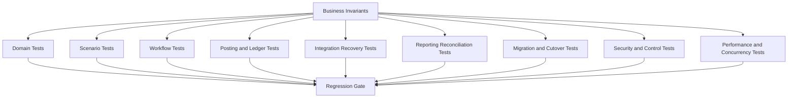
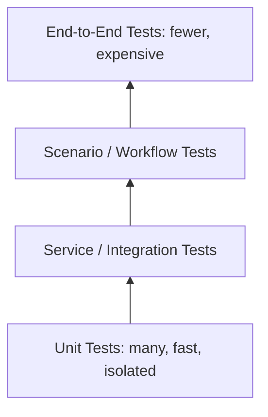

# Part 029 — Testing Strategy for Large Scale ERP

> **Core idea:** ERP testing is not primarily about checking methods, screens, or controllers. It is about proving that business invariants survive configuration, workflow, concurrency, integration, migration, reporting, and operational failure.

Large-scale ERP quality problems are rarely caused by a single missing unit test. They happen because the test strategy does not match the shape of the system.

A serious ERP system has:

- long-running business lifecycles;
- effective-dated configuration;
- legal and fiscal constraints;
- multi-entity organizational scope;
- approval and segregation-of-duties constraints;
- financial and inventory ledgers;
- asynchronous integration;
- batch jobs;
- reporting/read models;
- migration and cutover flows;
- audit and support requirements.

Testing such a system requires more than the classic testing pyramid. The pyramid still matters, but it is insufficient. ERP needs a **business invariant testing strategy**.

This part focuses on how top engineers design a testing system for ERP correctness, regression resistance, and supportable change.

---

## 1. Kaufman Skill Deconstruction

To become effective at large-scale ERP testing, decompose the skill into these sub-skills:

| Sub-skill | What top engineers can do |
|---|---|
| Invariant discovery | Identify non-negotiable rules such as balanced postings, stock conservation, period locks, and SoD. |
| Scenario modelling | Convert real business processes into stable, executable regression scenarios. |
| Golden dataset design | Build canonical test data that represents realistic organization, master data, configuration, and transactions. |
| Test boundary selection | Decide whether a rule belongs in unit, domain, service, integration, workflow, batch, or end-to-end tests. |
| Data determinism | Control clocks, IDs, currencies, sequences, exchange rates, and effective dates. |
| Failure modelling | Test retries, duplicate messages, partial failures, deadlocks, timeouts, unknown outcomes, and recovery. |
| Reconciliation testing | Prove that subledger, GL, inventory, payment, and reporting views reconcile. |
| Security/control testing | Verify permissions, approval authority, SoD, emergency override, and audit evidence. |
| Test environment engineering | Use realistic dependencies without turning tests into slow, fragile mini-production copies. |
| Regression governance | Keep the test suite trustworthy as modules, configs, tenants, and localizations grow. |

The practical goal is not “high coverage.” The goal is **high confidence in business correctness under change**.

---

## 2. Why ERP Testing Is Different

A normal application often tests whether a request returns the expected response. ERP must test whether the response is legally, financially, operationally, and historically defensible.

### 2.1 ERP correctness has multiple dimensions

| Dimension | Example failure |
|---|---|
| Functional correctness | Purchase order can be approved and released. |
| Financial correctness | Goods receipt posts to the wrong inventory account. |
| Temporal correctness | Backdated invoice bypasses period lock. |
| Organizational correctness | Branch user sees another legal entity's invoice. |
| Lifecycle correctness | Cancelled document can still be posted. |
| Integration correctness | Bank payment confirmation creates duplicate settlement. |
| Reporting correctness | AR aging report disagrees with AR subledger. |
| Audit correctness | Approval decision exists but authority context is not captured. |
| Operational correctness | Posting batch fails halfway and cannot resume safely. |
| Migration correctness | Opening balances load but do not reconcile to legacy trial balance. |

### 2.2 The wrong test focus creates false confidence

A team can have thousands of tests and still ship broken ERP behavior if tests mostly assert:

- controller status codes;
- mapper fields;
- repository CRUD;
- happy-path UI clicks;
- mocked database behavior;
- snapshots of JSON without business semantics;
- service methods without realistic configuration;
- integration events without idempotency and reconciliation.

Those tests may be useful, but they are not enough. ERP testing must focus on **state, money, stock, authority, lifecycle, and evidence**.

---

## 3. The ERP Testing Mental Model

Think of the ERP test strategy as concentric safety layers around business truth.



The core rule:

> Every test must answer: **which business invariant, risk, or operational guarantee does this protect?**

If a test cannot answer that, it may still be useful, but it should not be treated as strategic ERP quality coverage.

---

## 4. Testing Pyramid Is Necessary but Not Sufficient

The classic pyramid is still useful:



But ERP needs an additional lens: **business criticality**.

| Test type | ERP use |
|---|---|
| Unit test | Tax rounding, price allocation, state transition guard, validation rule. |
| Domain invariant test | Journal balance, stock ledger quantity conservation, SoD rule. |
| Application service test | Submit PO, approve invoice, post GRN, reverse journal. |
| Repository/integration test | Locking, unique constraints, sequence behavior, isolation behavior. |
| Workflow test | Approval routing, delegation, escalation, reassignment, cancellation. |
| Scenario test | Procure-to-pay, order-to-cash, month-end close, return flow. |
| Contract test | API/event payload compatibility and consumer assumptions. |
| Batch test | Restartability, chunk checkpoint, duplicate prevention, reconciliation. |
| Migration test | Staging validation, idempotent import, opening balance reconciliation. |
| Report test | Source-to-report reconciliation, period correctness, authorization filter. |
| Concurrency test | Reservation race, numbering race, close/post race. |
| End-to-end test | Critical smoke across UI/API/workflow/reporting. |

The question is not “which layer is best?” The question is:

> **What is the cheapest test that gives real confidence for this ERP risk?**

---

## 5. The ERP Invariant Catalogue

Before writing tests, build an invariant catalogue. It is the testing equivalent of a domain constitution.

### 5.1 Example invariant catalogue

| Area | Invariant | Example test |
|---|---|---|
| General ledger | Every posted journal balances per currency and legal entity. | Generate journal lines and assert debit equals credit. |
| Period close | No posting into closed period except approved adjustment process. | Try backdated posting after close. |
| Inventory | Stock balance equals sum of immutable stock ledger movements. | Post receipt, transfer, issue, return, count adjustment. |
| Reservation | Reserved quantity cannot exceed available-to-promise under policy. | Race two sales orders for same stock. |
| Purchase order | PO release requires valid approval authority at decision time. | Change approval matrix after decision and assert evidence is stable. |
| Invoice matching | Vendor invoice cannot be paid if matching exception is unresolved. | Attempt payment proposal with 3-way mismatch. |
| Tax | Tax result must be reproducible from document, config version, and calculation trace. | Recalculate using stored config version. |
| Credit control | Order release cannot exceed approved credit exposure unless override exists. | Simulate unpaid AR and high-value order. |
| Legal numbering | Posted legal number is unique and immutable within sequence scope. | Concurrent posting attempts. |
| Audit | Material state transition has actor, timestamp, reason, before/after state, and correlation ID. | Submit/approve/post and verify audit timeline. |
| Security | User cannot approve own request when SoD forbids it. | Maker-checker test. |
| Reporting | AR aging total equals open AR subledger balance for same cutoff. | Compare report output to subledger projection. |

### 5.2 Invariant priority

Not all invariants deserve the same test budget.

| Priority | Characteristics | Example |
|---|---|---|
| P0 | Legal, financial, irreversible, or externally visible. | Balanced journal, legal invoice number, payment settlement. |
| P1 | Operationally severe but recoverable. | Stock reservation, workflow escalation, credit exposure. |
| P2 | Important but local and correctable. | UI warning, default value, optional field validation. |
| P3 | Low-risk presentation or convenience behavior. | Dashboard sorting preference. |

A top-tier ERP test strategy spends disproportionate effort on P0 and P1 invariants.

---

## 6. Golden Dataset Architecture

ERP tests need stable data. But “test fixtures” are not enough. You need a **golden dataset**: a canonical miniature enterprise that contains the minimum realistic data required to exercise business behavior.

### 6.1 What a golden dataset contains

| Dataset slice | Examples |
|---|---|
| Organization | tenant, legal entities, branches, warehouses, cost centers, profit centers. |
| Fiscal setup | fiscal year, periods, close status, accounting calendar. |
| Chart of accounts | asset, liability, revenue, expense, inventory, tax, control accounts. |
| Users and roles | requester, buyer, approver, warehouse operator, accountant, auditor. |
| Approval matrix | thresholds, delegation, SoD constraints, emergency authority. |
| Master data | vendors, customers, items, UOM, tax codes, currencies, exchange rates. |
| Pricing/tax config | price books, discount rules, tax jurisdictions, rounding policy. |
| Inventory setup | warehouses, bins, lot/serial policy, valuation policy. |
| Open balances | GL balances, AR/AP open items, inventory on hand. |
| Reference documents | sample POs, sales orders, invoices, receipts, shipments. |

### 6.2 Golden dataset principles

| Principle | Why it matters |
|---|---|
| Deterministic | Test outcome should not depend on current date, random IDs, or environment order. |
| Minimal but realistic | Avoid 10,000 fixture rows when 200 well-designed rows cover the domain. |
| Versioned | Dataset changes should be reviewed like code. |
| Named scenarios | Rows should be traceable to scenarios: `P2P_STANDARD`, `O2C_CREDIT_HOLD`, `GL_PERIOD_CLOSE`. |
| Rebuildable | The dataset should be recreated from source, not manually patched. |
| Tenant-aware | Multi-tenant and multi-entity tests must verify isolation. |
| Effective-dated | Config and master data should include past/current/future versions. |
| Auditable | Golden data should include expected business meaning, not just SQL inserts. |

### 6.3 Golden dataset layout

```text
src/test/resources/golden-data/
  org/
    tenants.yml
    legal-entities.yml
    branches.yml
    cost-centers.yml
  finance/
    chart-of-accounts.yml
    fiscal-periods.yml
    opening-balances.yml
  security/
    users.yml
    roles.yml
    approval-matrix.yml
    sod-rules.yml
  master-data/
    vendors.yml
    customers.yml
    items.yml
    tax-codes.yml
  scenarios/
    p2p-standard.yml
    p2p-three-way-mismatch.yml
    o2c-credit-hold.yml
    inventory-lot-trace.yml
    gl-period-close.yml
```

### 6.4 Golden data anti-pattern

Avoid fixture piles that nobody understands:

```text
insert-001.sql
insert-002.sql
legacy-test-data.sql
more-data.sql
fix-data-again.sql
```

That style creates accidental tests. A golden dataset creates intentional tests.

---

## 7. Scenario DSL for ERP Tests

A good ERP test reads like a business scenario, not like database plumbing.

### 7.1 Poor test expression

```java
@Test
void testPoFlow() {
    var vendor = vendorRepository.save(new Vendor(...));
    var item = itemRepository.save(new Item(...));
    var po = poRepository.save(new PurchaseOrder(...));
    // 120 lines later...
    assertEquals("POSTED", invoice.getStatus());
}
```

This is hard to review. It hides intent.

### 7.2 Better scenario expression

```java
@Test
void standardProcureToPay_postsInventoryAndAPAndReconcilesToGL() {
    scenario
        .givenCompany("ID01")
        .givenVendor("VENDOR-STEEL-01")
        .givenItem("RAW-STEEL", onHand("WH-JKT", 0))
        .givenApprovalMatrix("BUYER_LIMIT_100M")
        .whenRequesterCreatesRequisition(amount("IDR", 50_000_000))
        .andBuyerConvertsToPurchaseOrder()
        .andApproverApproves()
        .andWarehouseReceivesGoods(quantity(100))
        .andApRecordsInvoiceMatchingReceipt()
        .andPaymentRunPaysInvoice()
        .thenPurchaseOrderIsClosed()
        .andInventoryLedgerReconciles()
        .andSubledgerReconcilesToGeneralLedger()
        .andAuditTimelineIsComplete();
}
```

This test is not “less technical.” It is more precise because the technical mechanics are encapsulated behind domain-level verbs.

### 7.3 Scenario DSL design rules

| Rule | Explanation |
|---|---|
| Use business verbs | `approveInvoice`, `postReceipt`, `releaseOrder`, not `callServiceX`. |
| Keep technical escape hatch | Allow lower-level assertions for lock, sequence, event, and SQL behavior. |
| Control time | Scenarios must run at a fixed business clock. |
| Capture IDs semantically | Use document references, not random IDs in assertions. |
| Assert business outcomes | Status alone is not enough; assert ledger, stock, audit, and report effects. |
| Reuse carefully | DSL should improve clarity, not hide different business conditions behind generic helpers. |

---

## 8. Domain Invariant Tests

Domain invariant tests are fast tests that prove core rules without requiring full infrastructure.

### 8.1 General ledger balance invariant

```java
final class JournalInvariantTest {

    @Test
    void postedJournalMustBalancePerCurrency() {
        Journal journal = Journal.draft("ID01")
            .debit(account("Inventory"), money("IDR", 1_000_000))
            .credit(account("GRIR"), money("IDR", 1_000_000));

        PostedJournal posted = journal.post(postingContext());

        assertThat(posted.totalDebit("IDR"))
            .isEqualByComparingTo(posted.totalCredit("IDR"));
    }

    @Test
    void unbalancedJournalCannotBePosted() {
        Journal journal = Journal.draft("ID01")
            .debit(account("Inventory"), money("IDR", 1_000_000))
            .credit(account("GRIR"), money("IDR", 999_999));

        assertThatThrownBy(() -> journal.post(postingContext()))
            .isInstanceOf(UnbalancedJournalException.class);
    }
}
```

### 8.2 State transition invariant

```java
@ParameterizedTest
@CsvSource({
    "DRAFT, SUBMIT, SUBMITTED",
    "SUBMITTED, APPROVE, APPROVED",
    "APPROVED, POST, POSTED",
    "POSTED, REVERSE, REVERSED"
})
void legalTransitions(String from, String command, String to) {
    DocumentLifecycle lifecycle = DocumentLifecycle.from(State.valueOf(from));

    TransitionResult result = lifecycle.apply(Command.valueOf(command), context());

    assertThat(result.newState()).isEqualTo(State.valueOf(to));
}

@ParameterizedTest
@CsvSource({
    "DRAFT, POST",
    "CANCELLED, APPROVE",
    "POSTED, CANCEL",
    "REVERSED, POST"
})
void illegalTransitionsAreRejected(String from, String command) {
    DocumentLifecycle lifecycle = DocumentLifecycle.from(State.valueOf(from));

    assertThatThrownBy(() -> lifecycle.apply(Command.valueOf(command), context()))
        .isInstanceOf(IllegalTransitionException.class);
}
```

The point is not the testing library. The point is to make the transition table executable.

---

## 9. Application Service Tests

Application service tests prove that use cases enforce the right rules across domain objects, repositories, policies, and transactions.

### 9.1 What belongs here

| Use case | What to assert |
|---|---|
| Submit requisition | lifecycle transition, validation, audit event, approval route creation. |
| Approve purchase order | authority snapshot, SoD, state transition, audit evidence. |
| Post goods receipt | stock movement, inventory valuation event, accounting event. |
| Post vendor invoice | matching status, AP open item, subledger entry. |
| Run payment proposal | eligibility, hold status, approval, duplicate protection. |
| Reverse journal | reversal link, opposite entries, period rule, audit event. |

### 9.2 Application service test style

```java
@Test
void approverCannotApproveOwnPurchaseOrder() {
    PurchaseOrderId poId = fixtures.purchaseOrder()
        .requestedBy("alice")
        .amount("IDR", 250_000_000)
        .submitted()
        .id();

    assertThatThrownBy(() -> purchaseOrderService.approve(
        poId,
        ApprovalCommand.by("alice", "looks good")
    )).isInstanceOf(SegregationOfDutiesViolation.class);

    assertThat(auditEvents.forDocument(poId))
        .anySatisfy(event -> {
            assertThat(event.type()).isEqualTo("APPROVAL_REJECTED_BY_CONTROL");
            assertThat(event.reasonCode()).isEqualTo("MAKER_CHECKER_VIOLATION");
        });
}
```

Notice the test asserts both **prevention** and **evidence**.

---

## 10. Persistence and Database Integration Tests

ERP systems often rely on database constraints for correctness. You cannot mock those away.

### 10.1 Database behavior worth testing

| Behavior | Why it matters |
|---|---|
| Unique constraints | Prevent duplicate legal numbers, idempotency keys, processing records. |
| Foreign keys | Prevent orphan ledger lines, document lines, and audit links. |
| Check constraints | Enforce non-negative quantities, debit/credit shape, status values. |
| Isolation behavior | Understand what concurrent transactions can see. |
| Locking | Prevent race conditions in stock reservation and period close. |
| Index strategy | Prevent critical queries from degrading under scale. |
| Sequence behavior | Avoid wrong assumptions about gaps, rollback, and legal numbering. |
| Materialized views | Validate refresh and reconciliation semantics. |

### 10.2 Use real infrastructure for infrastructure rules

A repository test against an in-memory database often misses important behavior: locking, isolation, SQL dialect, indexes, constraints, and execution plans.

For ERP-critical persistence rules, use the same database engine family as production in tests. Testcontainers is useful here because it can provision throwaway databases and brokers for integration tests.

```java
@Testcontainers
class LegalNumberRepositoryIT {

    @Container
    static PostgreSQLContainer<?> postgres = new PostgreSQLContainer<>("postgres:17");

    @Test
    void legalNumberScopeMustBeUnique() {
        legalNumberRepository.reserve("ID01", "SALES_INVOICE", "2026", "INV-000001");

        assertThatThrownBy(() ->
            legalNumberRepository.reserve("ID01", "SALES_INVOICE", "2026", "INV-000001")
        ).isInstanceOf(DataIntegrityViolationException.class);
    }
}
```

This is not overkill for ERP. This is where many expensive production bugs live.

---

## 11. Workflow and Approval Tests

Workflow tests must verify both the path and the control evidence.

### 11.1 Approval route test

```java
@Test
void highValuePoRequiresFinanceAndDirectorApproval() {
    var po = scenario.givenPurchaseOrder()
        .company("ID01")
        .amount("IDR", 750_000_000)
        .submittedBy("buyer-01")
        .submit();

    ApprovalRoute route = approvalService.routeFor(po.id());

    assertThat(route.steps())
        .extracting(ApprovalStep::role)
        .containsExactly("FINANCE_CONTROLLER", "DIRECTOR");

    assertThat(route.policySnapshot().configVersion())
        .isNotBlank();
}
```

### 11.2 Delegation test

```java
@Test
void delegatedApproverMustLeaveDelegationEvidence() {
    fixtures.delegation()
        .from("director-01")
        .to("director-delegate-01")
        .effectiveOn("2026-07-01")
        .reason("travel")
        .create();

    var po = fixtures.purchaseOrder().amount("IDR", 800_000_000).submitted().id();

    approvalService.approve(po, ApprovalCommand.by("director-delegate-01", "approved"));

    assertThat(auditEvents.forDocument(po))
        .anySatisfy(event -> {
            assertThat(event.type()).isEqualTo("APPROVAL_GRANTED");
            assertThat(event.actor()).isEqualTo("director-delegate-01");
            assertThat(event.delegatedFrom()).isEqualTo("director-01");
            assertThat(event.policySnapshot()).contains("delegationId");
        });
}
```

The test must prove that the system remembers **why the decision was valid at that time**.

---

## 12. Financial Posting Tests

Posting tests are among the most important ERP regression tests.

### 12.1 Posting scenario matrix

| Scenario | Required assertions |
|---|---|
| Goods receipt | inventory debit, GRIR credit, stock ledger movement, receipt status. |
| Vendor invoice | AP credit, expense/inventory clearing, tax, invoice status. |
| Payment | AP debit, cash/bank credit, payment status, settlement link. |
| Sales shipment | COGS debit, inventory credit, stock issue. |
| Sales invoice | AR debit, revenue/tax credit, invoice legal number. |
| Customer receipt | cash debit, AR credit, settlement link. |
| Reversal | opposite entries, reversal reference, period rule, audit reason. |

### 12.2 Posting test example

```java
@Test
void goodsReceiptCreatesBalancedAccountingEventAndStockMovement() {
    var receipt = scenario
        .givenApprovedPurchaseOrder(item("RAW-STEEL"), quantity(100), unitPrice("IDR", 10_000))
        .whenWarehouseReceives(quantity(100));

    AccountingEvent event = accountingEvents.singleFor(receipt.id(), "GOODS_RECEIPT");

    assertThat(event.lines()).containsExactlyInAnyOrder(
        debit("Inventory-RawMaterial", "IDR", 1_000_000),
        credit("GRIR", "IDR", 1_000_000)
    );

    assertThat(event).isBalancedPerCurrency();
    assertThat(stockLedger.balance("RAW-STEEL", "WH-JKT")).isEqualTo(quantity(100));
    assertThat(reconciliation.receiptToAccounting(receipt.id())).isReconciled();
}
```

### 12.3 Posting tests must avoid vague assertions

Weak assertion:

```java
assertThat(receipt.status()).isEqualTo(POSTED);
```

Strong assertion:

```java
assertThat(receipt.status()).isEqualTo(POSTED);
assertThat(stockLedger.movementsFor(receipt.id())).hasSize(1);
assertThat(accountingEvents.forSource(receipt.id())).singleElement().satisfies(AccountingAssertions::isBalanced);
assertThat(auditEvents.forDocument(receipt.id())).containsEvent("GOODS_RECEIPT_POSTED");
assertThat(reconciliation.receiptToStockAndAccounting(receipt.id())).isReconciled();
```

ERP tests should assert the whole effect, not just the final status.

---

## 13. Reconciliation Tests

Reconciliation is not only a production activity. It must be tested.

### 13.1 Reconciliation test types

| Reconciliation | Test question |
|---|---|
| AP subledger to GL | Does AP control account equal open AP subledger? |
| AR subledger to GL | Does AR control account equal open AR subledger? |
| Inventory ledger to GL | Does inventory valuation equal inventory account balance? |
| Payment gateway to bank ledger | Are external confirmations matched or exceptioned? |
| Stock movement to stock balance | Does projected balance equal ledger sum? |
| Report to source | Does aging/report output match authoritative subledger cutoff? |
| Migration to opening balance | Does imported opening position equal signed-off legacy balance? |

### 13.2 Reconciliation assertion

```java
@Test
void arAgingMustReconcileToOpenArSubledgerAtCutoff() {
    LocalDate cutoff = LocalDate.parse("2026-06-30");

    Money subledgerTotal = arSubledger.openBalance(company("ID01"), cutoff);
    Money reportTotal = arAgingReport.generate(company("ID01"), cutoff).grandTotal();

    assertThat(reportTotal).isEqualByComparingTo(subledgerTotal);
}
```

Do not only test report formatting. Test report truth.

---

## 14. Integration Failure Tests

ERP integration tests must cover duplicate, delayed, out-of-order, and partially failed messages.

### 14.1 Integration failure matrix

| Failure | Example | Test expectation |
|---|---|---|
| Duplicate message | Payment confirmation delivered twice. | Single settlement outcome. |
| Timeout after side effect | Bank accepted payment but ERP did not receive response. | Unknown outcome becomes reconciliation case. |
| Out-of-order event | Shipment arrives before allocation event. | Event is parked or handled deterministically. |
| Poison message | Tax response has invalid structure. | Message goes to exception queue with evidence. |
| Retry storm | External system unavailable. | Backoff, circuit breaker, no duplicate posting. |
| Contract drift | WMS changes field semantics. | Contract test fails before production. |

### 14.2 Idempotent consumer test

```java
@Test
void duplicatePaymentConfirmationDoesNotDoubleSettleInvoice() {
    var invoice = fixtures.vendorInvoice().posted().id();
    var confirmation = bankConfirmation(invoice, "BANK-TXN-9988", money("IDR", 25_000_000));

    paymentConsumer.handle(confirmation);
    paymentConsumer.handle(confirmation);

    assertThat(apSubledger.settlementsFor(invoice)).hasSize(1);
    assertThat(processingLedger.entriesFor("BANK-TXN-9988"))
        .extracting(ProcessingEntry::status)
        .containsExactly("PROCESSED", "DUPLICATE_IGNORED");
}
```

The test asserts business outcome, not merely that a handler returned successfully.

---

## 15. Migration and Cutover Tests

Migration tests should be treated as product tests because cutover is often a one-time production event with huge blast radius.

### 15.1 Migration test layers

| Layer | What to test |
|---|---|
| Extract validation | Required fields, data types, legacy row counts, source checksums. |
| Mapping validation | code mapping, UOM conversion, account mapping, entity mapping. |
| Staging validation | duplicate detection, referential integrity, invalid effective dates. |
| Import idempotency | rerun does not duplicate documents or balances. |
| Business validation | migrated documents obey target ERP lifecycle rules. |
| Reconciliation | legacy totals equal target totals by signed-off dimensions. |
| Cutover rehearsal | timing, sequence, rollback, decision gates, sign-off. |

### 15.2 Opening balance migration test

```java
@Test
void migratedOpeningBalancesMustMatchSignedOffTrialBalance() {
    migrationJob.importOpeningBalances("cutover-2026-07-01");

    TrialBalance legacy = legacyExtract.signedOffTrialBalance("ID01", LocalDate.parse("2026-06-30"));
    TrialBalance target = generalLedger.trialBalance("ID01", LocalDate.parse("2026-06-30"));

    assertThat(target).matchesByAccountAndCurrency(legacy);
    assertThat(target).isBalanced();
    assertThat(migrationEvidence.forRun("cutover-2026-07-01")).hasApproverSignOff();
}
```

Migration tests are not optional for serious ERP engineering.

---

## 16. Report Tests

Reports are often treated as second-class artifacts. In ERP, reports frequently become the primary interface for finance, auditors, managers, and regulators.

### 16.1 Report test categories

| Category | Example |
|---|---|
| Semantic correctness | AR aging bucket logic, inventory valuation, trial balance. |
| Cutoff correctness | As-of date, period, timezone, document effective date. |
| Scope correctness | legal entity, branch, cost center, tenant, security filter. |
| Freshness correctness | last projection checkpoint, source lag, refresh timestamp. |
| Reconciliation correctness | report total agrees with source-of-truth ledger. |
| Export correctness | CSV/Excel/PDF fields, encoding, row counts, totals. |
| Authorization correctness | user sees only allowed rows/columns. |

### 16.2 Report truth assertion

```java
@Test
void trialBalanceReportMustBalanceAndMatchGeneralLedger() {
    var report = trialBalanceReport.generate(company("ID01"), period("2026-06"));

    assertThat(report.totalDebit()).isEqualByComparingTo(report.totalCredit());
    assertThat(report.accountBalances()).isEqualTo(
        generalLedger.balancesByAccount(company("ID01"), period("2026-06"))
    );
    assertThat(report.metadata().sourceCheckpoint()).isNotNull();
}
```

A report without metadata about cutoff, source, and checkpoint is hard to defend.

---

## 17. Security and Control Tests

ERP access control bugs are not merely security bugs. They can create invalid approvals, unauthorized postings, privacy leaks, and audit failures.

### 17.1 Control test matrix

| Control | Test |
|---|---|
| Role permission | Buyer can create PO but cannot post AP invoice. |
| Scope restriction | Branch user cannot access another branch's documents. |
| SoD | Requester cannot approve own purchase. |
| Threshold authority | Manager can approve up to configured amount only. |
| Delegation | Delegate can approve only within effective delegation period. |
| Emergency access | Break-glass action is time-bound and audited. |
| Export control | User cannot export restricted columns without permission. |
| Report row-level security | Report output excludes unauthorized legal entities. |

### 17.2 Permission test style

```java
@Test
void branchUserCannotReadOtherBranchInvoiceEvenIfTheyKnowTheId() {
    var invoice = fixtures.salesInvoice()
        .company("ID01")
        .branch("BANDUNG")
        .posted()
        .id();

    assertThatThrownBy(() -> invoiceQueryService.getInvoice(
        invoice,
        userContext("jakarta-branch-user")
    )).isInstanceOf(AccessDeniedException.class);

    assertThat(securityAudit.denialsFor("jakarta-branch-user"))
        .anyMatch(event -> event.resourceId().equals(invoice.toString()));
}
```

Always assert denial evidence for sensitive actions.

---

## 18. Concurrency Tests

Concurrency bugs in ERP often happen at high-value boundaries: stock, numbering, approval, period close, payment, and posting.

### 18.1 Concurrency scenarios worth testing

| Scenario | Risk |
|---|---|
| Two orders reserve last stock | Overselling. |
| Two invoices request same legal number | Duplicate legal document number. |
| Period closes while posting runs | Posting into closed period. |
| Approver and requester change same document | Invalid lifecycle transition. |
| Payment retry and bank confirmation race | Duplicate settlement or wrong status. |
| Batch job and manual correction overlap | Inconsistent ledger/report projection. |

### 18.2 Concurrent stock reservation test

```java
@Test
void concurrentReservationsCannotExceedAvailableStock() throws Exception {
    fixtures.stock("ITEM-01", "WH-JKT", quantity(10));

    ExecutorService pool = Executors.newFixedThreadPool(2);
    CountDownLatch start = new CountDownLatch(1);

    Callable<ReservationResult> reserveSix = () -> {
        start.await();
        return reservationService.reserve("ITEM-01", "WH-JKT", quantity(6));
    };

    Future<ReservationResult> r1 = pool.submit(reserveSix);
    Future<ReservationResult> r2 = pool.submit(reserveSix);

    start.countDown();

    List<ReservationResult> results = List.of(r1.get(), r2.get());

    assertThat(results).filteredOn(ReservationResult::accepted).hasSize(1);
    assertThat(results).filteredOn(result -> !result.accepted()).hasSize(1);
    assertThat(stockProjection.available("ITEM-01", "WH-JKT")).isEqualTo(quantity(4));
}
```

This type of test is not perfectly deterministic unless the service boundary and database constraints are designed well. That is part of the value: bad concurrency design is hard to test cleanly.

---

## 19. Performance Regression Tests

ERP performance tests should be scenario-based, not just endpoint-based.

### 19.1 Performance scenarios

| Scenario | Metric |
|---|---|
| Month-end close posting batch | journals/minute, lock wait, failure recovery time. |
| MRP run | item-location combinations/minute, memory usage, planning latency. |
| AR aging report | response time by data volume and cutoff. |
| Bulk invoice import | rows/minute, validation error throughput. |
| Payment proposal | invoices evaluated/minute, duplicate prevention. |
| Stock availability query | p95 latency under order entry load. |
| Dashboard burst | database load, cache hit ratio, projection lag. |

### 19.2 Performance gate example

```text
Scenario: Trial balance report for one legal entity with 5 years of postings
Dataset: 20M journal lines, 2K accounts, 12 fiscal periods/year
Gate:
  - p95 response <= 3 seconds for precomputed read model
  - no sequential scan on journal_line
  - result reconciles to GL balance snapshot
  - query does not block posting transactions
```

Performance gates should include correctness gates. A fast wrong report is still wrong.

---

## 20. Test Data Builders vs Object Mothers vs Fixtures

### 20.1 Trade-off table

| Technique | Strength | Weakness | ERP guidance |
|---|---|---|---|
| Object Mother | Easy reuse. | Becomes giant implicit fixture. | Use only for tiny value objects. |
| Test Data Builder | Expressive and composable. | Can hide invalid defaults. | Good for domain objects and documents. |
| Scenario Fixture | Business-readable setup. | Can become too magical. | Good for workflows and cross-module scenarios. |
| Golden Dataset | Realistic shared baseline. | Needs governance. | Essential for ERP regression. |
| SQL Fixture | Precise and fast. | Bypasses domain rules. | Use for infrastructure and read-model tests, not primary business setup. |

### 20.2 Builder design

```java
PurchaseOrderBuilder po = purchaseOrder()
    .company("ID01")
    .branch("JKT")
    .vendor("VENDOR-STEEL-01")
    .line("RAW-STEEL", quantity(100), unitPrice("IDR", 10_000))
    .requestedBy("buyer-01")
    .submittedOn("2026-07-01");
```

A builder should make invalid state visible. Avoid defaulting critical business facts silently.

Bad:

```java
PurchaseOrder po = purchaseOrder().build(); // Which company? Which period? Which currency? Which approval policy?
```

Better:

```java
PurchaseOrder po = purchaseOrder()
    .company("ID01")
    .currency("IDR")
    .fiscalPeriod("2026-07")
    .approvalPolicy("P2P_STANDARD_ID01")
    .build();
```

---

## 21. Determinism: Clock, IDs, Sequences, Currency

ERP tests fail when hidden nondeterminism leaks into scenarios.

### 21.1 Determinism checklist

| Concern | Control |
|---|---|
| Current time | Inject `BusinessClock`, do not call `LocalDate.now()` directly. |
| Timezone | Test cutoff behavior with explicit zone. |
| IDs | Use semantic test references or deterministic ID generator. |
| Legal number | Use test sequence scope and assert uniqueness/immutability. |
| Currency | Use fixed exchange rates and rounding policy. |
| Config | Use explicit config version/effective date. |
| Async | Use deterministic scheduler or await observable state with timeout. |
| Batch | Use explicit run ID and checkpoint state. |
| Reports | Use explicit cutoff and projection checkpoint. |

### 21.2 Business clock

```java
public interface BusinessClock {
    LocalDate businessDate();
    Instant instant();
    ZoneId zone();
}
```

In tests:

```java
businessClock.freezeAt("2026-07-01T09:00:00+07:00");
```

This is especially important for:

- period close;
- effective-dated configuration;
- delegation;
- tax rate changes;
- exchange rates;
- SLA escalation;
- report cutoffs.

---

## 22. Contract Tests

Large ERP landscapes depend on contracts between modules and systems.

### 22.1 Contract targets

| Contract | Example |
|---|---|
| API contract | `POST /vendor-invoices` requires idempotency key and company scope. |
| Event contract | `GoodsReceiptPosted` contains receipt ID, company, item, quantity, source document. |
| File contract | Bank statement import file has mandatory transaction reference. |
| Report contract | Export schema for statutory tax report. |
| Extension contract | Plugin hook must return deterministic adjustment lines. |
| Read model contract | AR aging view exposes cutoff, checkpoint, and amount fields. |

### 22.2 Consumer-oriented question

A good contract test asks:

> If provider changes this field, does a real consumer break?

Not:

> Does provider still produce a JSON that matches its own current code?

---

## 23. Mutation and Negative Testing

ERP tests must prove forbidden behavior is forbidden.

### 23.1 Negative test examples

| Area | Negative test |
|---|---|
| GL | unbalanced journal cannot post. |
| Inventory | issue cannot exceed available quantity when policy forbids negative stock. |
| Approval | requester cannot approve own request. |
| Period | invoice cannot post into closed period. |
| Payment | held invoice cannot be selected for payment. |
| Integration | duplicate event cannot create duplicate business effect. |
| Report | unauthorized user cannot export restricted report. |
| Migration | invalid account mapping rejects row before import. |

A test suite with only happy paths is not an ERP safety net.

---

## 24. Regression Pack Governance

ERP regression suites become slow and noisy unless governed.

### 24.1 Regression pack tiers

| Tier | Run cadence | Content |
|---|---|---|
| Commit gate | every commit/PR | fast unit, invariant, service tests. |
| Integration gate | PR or merge queue | DB/broker integration, contract, critical scenario tests. |
| Nightly | nightly | full scenario pack, reports, migration dry run, concurrency tests. |
| Release candidate | before release | full regression, performance gates, security/control tests, cutover rehearsal. |
| Production smoke | post-deploy | synthetic non-destructive checks and monitoring assertions. |

### 24.2 Flaky test policy

A flaky ERP test is a production risk signal. Do not normalize flakiness.

| Flaky source | Response |
|---|---|
| uncontrolled time | inject/freeze clock. |
| async race | observe durable state, not sleep. |
| shared mutable fixture | isolate tenant/company/run ID. |
| environment drift | containerize dependency or pin version. |
| random data | seed generator and log seed. |
| order dependency | reset database/schema or isolate scenario. |
| real external dependency | replace with contract stub or sandbox with deterministic behavior. |

Never mark a critical invariant test as “ignore” without a replacement control.

---

## 25. Test Observability

Tests should generate useful diagnostics when they fail.

### 25.1 Diagnostic payload

For ERP scenario tests, failure output should include:

- scenario ID;
- tenant/company/branch;
- business date;
- config versions;
- document IDs and numbers;
- lifecycle state;
- ledger lines;
- stock movements;
- workflow tasks;
- emitted events;
- audit timeline;
- reconciliation differences;
- relevant correlation IDs.

### 25.2 Failure message example

Poor:

```text
Expected 100 but was 99
```

Better:

```text
Inventory reconciliation failed
Scenario: P2P_STANDARD_RECEIPT
Company: ID01
Item: RAW-STEEL
Location: WH-JKT
Expected balance from stock ledger: 100
Projected balance: 99
Missing movement source: GRN-2026-000128
Last projection checkpoint: 2026-07-01T09:10:12+07:00
Correlation ID: test-P2P-009128
```

Good failure diagnostics shorten incident-style debugging during development.

---

## 26. What Not to Test

Do not test everything with equal effort.

### 26.1 Low-value tests

| Test | Why it is weak |
|---|---|
| Getter/setter tests | No business confidence. |
| Mocked repository CRUD tests | Often assert mocks, not persistence behavior. |
| UI-only workflow tests | Slow and fragile; miss backend invariant details. |
| Snapshot-only JSON tests | Detect shape change but not business correctness. |
| Massive end-to-end duplication | Slow suite that teams stop trusting. |
| Tests depending on current date | Fail unpredictably. |
| Tests with production-like data copied blindly | Privacy risk and poor scenario clarity. |

This does not mean UI tests or snapshots are useless. It means they should not be the backbone of ERP quality.

---

## 27. Anti-Patterns

| Anti-pattern | Why it fails |
|---|---|
| Coverage theater | 90% coverage with no posting, reconciliation, or SoD confidence. |
| Mocked ERP reality | Mocking DB, broker, workflow, and time hides the bugs that matter. |
| One giant E2E suite | Slow, flaky, hard to diagnose, and expensive to maintain. |
| Fixture swamp | Nobody understands the test data, so failures become archaeology. |
| Happy-path worship | Negative and failure paths are where ERP correctness lives. |
| Report pixel testing | Formatting passes while totals are wrong. |
| No migration tests | Cutover becomes a heroic manual event. |
| No control tests | Approval/security defects discovered by auditors or production users. |
| No reconciliation assertions | Subledger and GL drift silently. |
| Flaky tests tolerated | Teams stop trusting the regression gate. |

---

## 28. Source Notes

This material is designed for ERP engineering practice, not as a wrapper around one framework.

Relevant baseline references:

- JUnit User Guide: comprehensive reference for writing tests on the JUnit Platform, including Jupiter programming model and parameterized testing concepts.
- Testcontainers for Java: Java testing library for running lightweight, throwaway dependencies such as databases, message brokers, and browsers in containers.
- Jakarta Batch: enterprise Java batch processing model with chunk-oriented processing and checkpoint/restart semantics.
- Jakarta Persistence: standard persistence model for Java enterprise applications.
- Spring Boot testing and Actuator ecosystem: common baseline for modern Java enterprise services.

The ERP-specific strategy in this part adds the missing layer: business invariant, reconciliation, migration, control, and operational failure testing.

---

## 29. Kaufman 20-Hour Practice Plan

### Hour 1-3: Build invariant catalogue

Pick one ERP slice, such as procure-to-pay.

Create a table of:

- document lifecycle invariants;
- financial posting invariants;
- approval/SoD invariants;
- stock/inventory invariants;
- reporting/reconciliation invariants;
- integration failure invariants.

### Hour 4-6: Build golden dataset

Create minimal golden data:

- one legal entity;
- two branches;
- one warehouse;
- one vendor;
- one item;
- one chart of accounts;
- one approval matrix;
- one fiscal period;
- one tax code.

### Hour 7-9: Write domain invariant tests

Test:

- balanced journal;
- illegal lifecycle transition;
- SoD violation;
- tax rounding;
- stock movement sign rules.

### Hour 10-12: Write scenario tests

Implement:

- standard P2P;
- P2P with invoice mismatch;
- goods receipt reversal;
- payment duplicate prevention.

### Hour 13-15: Write reconciliation tests

Test:

- AP subledger to GL;
- stock ledger to inventory balance;
- AR aging to AR subledger.

### Hour 16-18: Write failure tests

Test:

- duplicate message;
- retry after timeout;
- period close race;
- concurrent reservation;
- idempotent batch restart.

### Hour 19-20: Review and refactor

Ask:

- Which P0 invariant has no test?
- Which test is slow but low-value?
- Which scenario hides too much setup?
- Which failure would be hard to diagnose?
- Which report can produce wrong totals without failing a test?

---

## 30. Design Review Checklist

Use this checklist when reviewing ERP test strategy.

### Invariants

- [ ] Are P0 and P1 business invariants explicitly catalogued?
- [ ] Are financial postings tested for balance and reconciliation?
- [ ] Are stock movements tested through ledger and projection?
- [ ] Are lifecycle transitions tested for legal and illegal paths?
- [ ] Are period locks and effective dates tested?

### Golden data

- [ ] Is golden data deterministic and versioned?
- [ ] Does it include organization, fiscal, security, master, config, and transactional slices?
- [ ] Can it be rebuilt from source?
- [ ] Is it understandable by business scenario name?

### Scenarios

- [ ] Do tests read like business scenarios?
- [ ] Do scenario tests assert downstream effects, not only status?
- [ ] Are negative cases represented?
- [ ] Are audit events and evidence asserted for material controls?

### Integration and failure

- [ ] Are duplicate, delayed, out-of-order, and poison messages tested?
- [ ] Are idempotency keys and processing ledgers tested?
- [ ] Are retries and unknown outcomes tested?
- [ ] Are reconciliation cases tested?

### Migration and reports

- [ ] Are migration imports idempotent?
- [ ] Are opening balances reconciled?
- [ ] Are reports tested against authoritative source totals?
- [ ] Are report security filters tested?

### Operations

- [ ] Are batch restart and checkpoint behavior tested?
- [ ] Are performance gates scenario-based?
- [ ] Are concurrency races tested for high-risk boundaries?
- [ ] Do test failures include diagnostic business context?

---

## 31. Summary

Large-scale ERP testing is a discipline of business-risk reduction.

The central ideas:

- Do not optimize for coverage alone. Optimize for invariant confidence.
- Build a golden dataset that represents a realistic miniature enterprise.
- Express tests in business scenario language.
- Assert ledger, stock, workflow, audit, report, and reconciliation effects.
- Test negative paths and operational failures.
- Use real infrastructure when infrastructure behavior is part of correctness.
- Treat migration, reporting, and control tests as first-class product tests.
- Govern the regression suite as an engineering asset.

A top ERP engineer does not ask, “Do we have tests?”

They ask:

> **Which business truth can still break without a test failing?**

That question drives serious ERP quality engineering.
