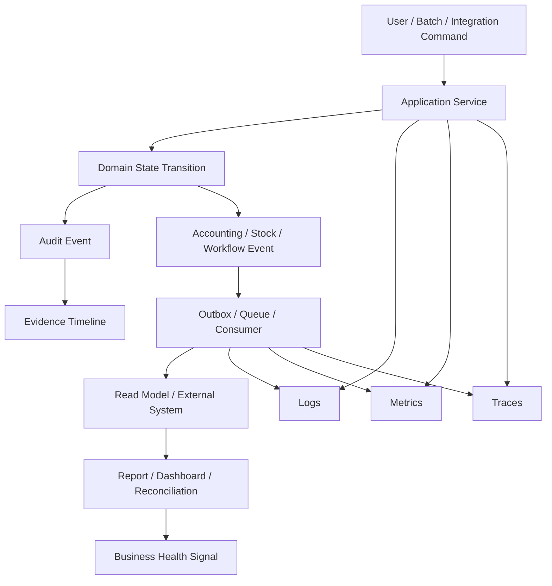
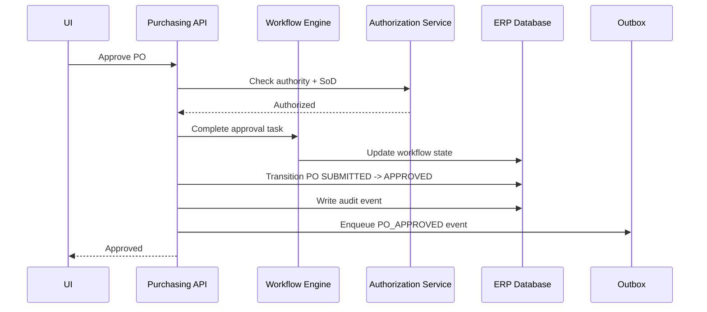
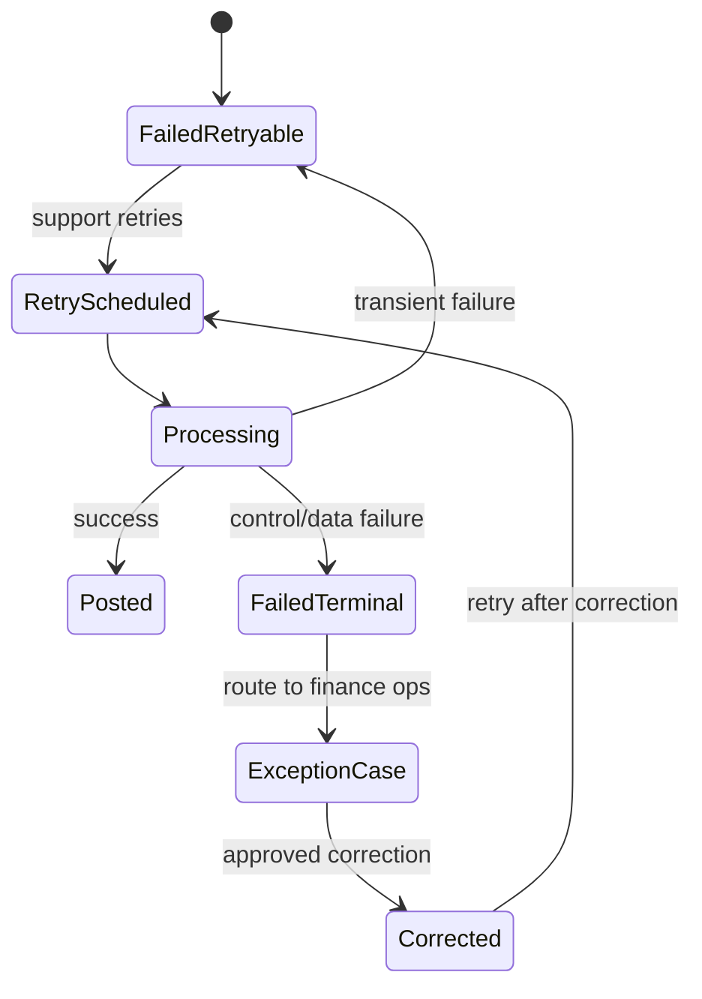
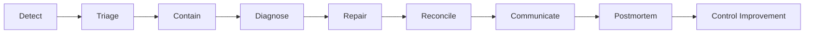
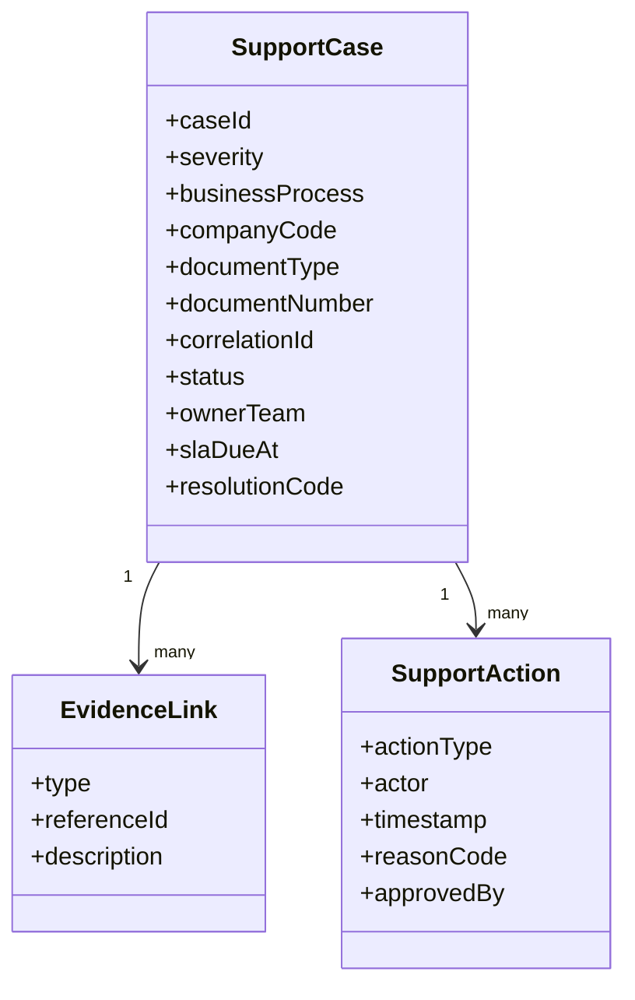
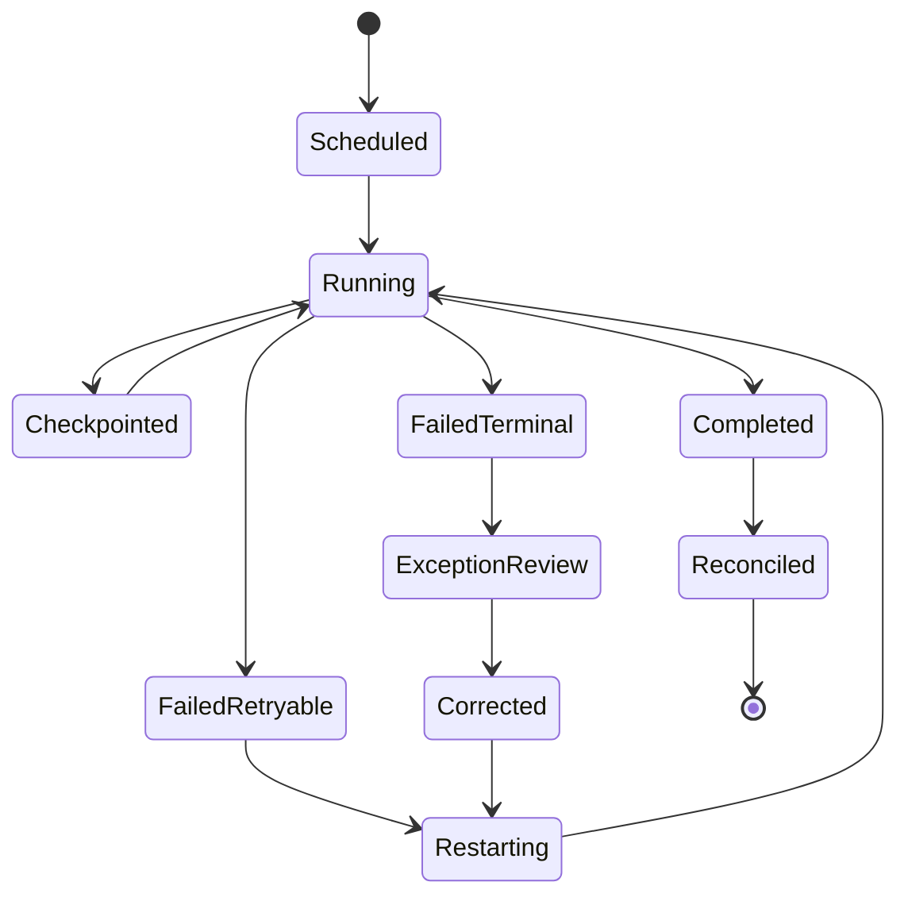
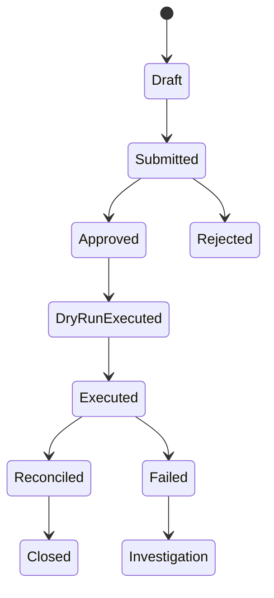
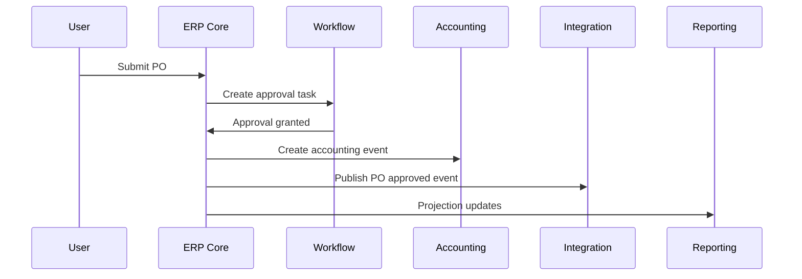
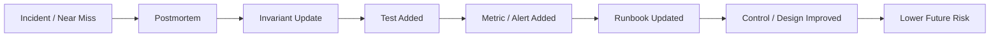

# Part 030 — Observability, Operations, and Supportability

> **Core idea:** A large-scale ERP is not production-ready when it works on the happy path. It is production-ready when engineers and support teams can detect, explain, contain, repair, and prove what happened when business processes fail.

ERP operations are different from normal web application operations. A failed page load is annoying. A failed posting batch, duplicated payment, stuck approval, missed shipment, broken period close, or incorrect report can affect financial statements, customer commitments, inventory availability, and audit evidence.

Observability in ERP must cover both:

1. **technical system health** — latency, errors, CPU, memory, DB, queues, traces;
2. **business process health** — stuck workflows, unreconciled ledgers, failed postings, duplicate attempts, aging exceptions, projection lag, settlement mismatches.

This part focuses on building a supportable ERP: one where failure is visible, diagnosable, recoverable, and defensible.

---

## 1. Kaufman Skill Deconstruction

To become effective at ERP observability and operations, decompose the skill into these sub-skills:

| Sub-skill | What top engineers can do |
|---|---|
| Signal design | Decide which logs, metrics, traces, events, and business counters matter. |
| Business telemetry | Measure process health, not only server health. |
| Correlation modelling | Trace a document, user action, batch run, and integration message across components. |
| Failure classification | Distinguish validation error, transient failure, control rejection, data corruption, and unknown outcome. |
| Operational control | Provide safe retry, replay, cancel, reverse, reassign, and reconcile tools. |
| Support workflow | Convert technical failure into support cases with owner, SLA, evidence, and next action. |
| Incident response | Detect blast radius, freeze risky operations, communicate, remediate, and produce postmortem. |
| Audit-aware repair | Fix production data through controlled, evidenced, reversible procedures. |
| Capacity management | Understand batch windows, month-end spikes, report bursts, and queue backlogs. |
| Production readiness | Define SLOs, dashboards, runbooks, alerts, and operational tests before launch. |

The goal is not to collect every possible signal. The goal is to make important business failures visible early and explainable quickly.

---

## 2. Observability vs Monitoring

Monitoring asks: **is the system behaving as expected?**

Observability asks: **can we understand why the system is behaving this way from external signals?**

ERP needs both.

### 2.1 Technical monitoring examples

| Signal | Example |
|---|---|
| Latency | `POST /vendor-invoices` p95 latency. |
| Error rate | payment API 5xx count. |
| Saturation | database connection pool usage. |
| Queue depth | outbound invoice event backlog. |
| JVM health | heap, GC pause, thread count. |
| Database health | lock wait, deadlocks, slow queries. |

### 2.2 Business observability examples

| Signal | Example |
|---|---|
| Stuck workflow | POs waiting approval longer than SLA. |
| Failed posting | accounting events in `FAILED_RETRYABLE` or `FAILED_TERMINAL`. |
| Reconciliation gap | AP subledger does not match GL control account. |
| Duplicate attempt | duplicate idempotency key rejected. |
| Projection lag | AR aging read model behind event stream by 25 minutes. |
| Period close blocker | unposted documents in closing period. |
| Integration exception | bank statement lines unmatched after import. |
| Manual override | emergency approval/posting actions in last 24 hours. |
| Inventory anomaly | negative stock attempt blocked or allowed by policy. |
| Batch backlog | MRP or posting batch exceeds processing window. |

A large ERP can have green servers and still be failing the business.

---

## 3. ERP Observability Model

ERP observability should connect technical execution with business lifecycle.



The key design principle:

> Every important business command should leave a trail that connects request, decision, state transition, side effect, integration, report projection, and audit evidence.

---

## 4. Correlation IDs and Business Identifiers

Technical trace IDs are necessary but not enough. ERP support teams often search by business identifiers.

### 4.1 Identifier taxonomy

| Identifier | Purpose | Example |
|---|---|---|
| Trace ID | distributed technical request tracing. | `4bf92f3577b34da6a3ce929d0e0e4736` |
| Span ID | operation-level trace segment. | DB call, HTTP call, message publish. |
| Correlation ID | logical flow across async boundaries. | `corr-p2p-20260701-00091` |
| Causation ID | event/message that caused this action. | `evt-goods-receipt-posted-001` |
| Command ID | user/batch/integration command identity. | `cmd-approve-po-001` |
| Idempotency key | duplicate prevention key. | `bank-confirmation:TXN9988` |
| Document ID | immutable technical document identity. | `po_01J...` |
| Document number | business/legal reference. | `PO-2026-000128` |
| Batch run ID | operation batch identity. | `posting-run-20260701-01` |
| Tenant/company | scope and isolation. | `tenant=A`, `company=ID01` |

### 4.2 Logging context

Every meaningful log line should include enough context to reconstruct the flow.

```java
try (MDC.MDCCloseable ignored1 = MDC.putCloseable("tenantId", tenantId);
     MDC.MDCCloseable ignored2 = MDC.putCloseable("companyCode", companyCode);
     MDC.MDCCloseable ignored3 = MDC.putCloseable("correlationId", correlationId);
     MDC.MDCCloseable ignored4 = MDC.putCloseable("documentId", documentId.toString())) {

    purchaseOrderService.approve(command);
}
```

For asynchronous processing, correlation context must be propagated explicitly through message headers.

```text
headers:
  traceparent: 00-...
  correlation-id: corr-p2p-20260701-00091
  causation-id: evt-po-approved-000128
  tenant-id: tenant-a
  company-code: ID01
  source-document-id: po_01J...
```

---

## 5. Structured Logging for ERP

Free-text logs are useful for humans, but structured logs are necessary for reliable querying, alerting, and investigation.

### 5.1 ERP log event fields

| Field | Example |
|---|---|
| timestamp | `2026-07-01T09:15:31.123+07:00` |
| level | `INFO`, `WARN`, `ERROR` |
| service | `erp-purchasing-service` |
| environment | `prod-id` |
| tenantId | `tenant-a` |
| companyCode | `ID01` |
| branchCode | `JKT` |
| userId | `buyer-01` |
| action | `PURCHASE_ORDER_APPROVE` |
| documentType | `PURCHASE_ORDER` |
| documentId | `po_01J...` |
| documentNumber | `PO-2026-000128` |
| lifecycleState | `SUBMITTED` → `APPROVED` |
| correlationId | `corr-p2p-20260701-00091` |
| outcome | `SUCCESS`, `REJECTED_BY_CONTROL`, `FAILED_RETRYABLE` |
| reasonCode | `MAKER_CHECKER_VIOLATION`, `PERIOD_CLOSED` |
| errorClass | exception class or domain error code. |

### 5.2 What not to log

ERP logs often become privacy and security risks.

Do not log:

- passwords, tokens, API keys;
- full bank account numbers;
- full tax IDs if not required;
- unnecessary personal data;
- raw payment card data;
- full document attachments;
- complete salary or sensitive HR payloads;
- unmasked customer identity in high-volume traces;
- secrets embedded in integration payloads.

Log identifiers and evidence references, not uncontrolled sensitive payloads.

---

## 6. Metrics: Technical and Business

Metrics should be low-cardinality, aggregatable, and actionable.

### 6.1 Technical metric examples

| Metric | Type | Meaning |
|---|---|---|
| `http.server.requests` | timer | endpoint latency and error count. |
| `jdbc.connections.active` | gauge | DB connection pool pressure. |
| `erp.outbox.pending.count` | gauge | messages waiting to publish. |
| `erp.consumer.processing.duration` | timer | consumer processing latency. |
| `erp.batch.run.duration` | timer | batch execution time. |
| `erp.db.deadlocks.count` | counter | database deadlocks. |
| `erp.lock.wait.duration` | timer | lock wait time on critical resources. |

### 6.2 Business metric examples

| Metric | Type | Meaning |
|---|---|---|
| `erp.workflow.stuck.count` | gauge | workflows beyond SLA. |
| `erp.posting.failed.count` | counter | failed accounting postings. |
| `erp.posting.pending.count` | gauge | accounting events not posted yet. |
| `erp.reconciliation.gap.count` | gauge | open reconciliation differences. |
| `erp.payment.duplicate_ignored.count` | counter | duplicate payment confirmations suppressed. |
| `erp.invoice.matching_exception.count` | gauge | unresolved invoice matching issues. |
| `erp.period_close.blocker.count` | gauge | blockers for close process. |
| `erp.report.projection_lag.seconds` | gauge | read model freshness lag. |
| `erp.integration.exception.count` | counter | integration exceptions by partner/type. |
| `erp.override.emergency.count` | counter | emergency control overrides. |

### 6.3 Metric cardinality rule

Do not put high-cardinality values into metric labels.

Bad:

```text
erp.posting.failed.count{documentNumber="INV-2026-001929"}
```

Better:

```text
erp.posting.failed.count{company="ID01", documentType="SALES_INVOICE", reason="PERIOD_CLOSED"}
```

Use logs/traces for document-level details. Use metrics for aggregate health.

---

## 7. Tracing for ERP Workflows

Distributed tracing is useful for ERP, but only if spans map to meaningful operations.

### 7.1 Trace shape for purchase order approval



A useful trace should show:

- command handling;
- authorization check;
- workflow step;
- database transaction;
- audit event write;
- outbox write;
- downstream consumer processing.

### 7.2 Span naming

Bad span names:

```text
process
handle
run
execute
```

Better span names:

```text
PurchaseOrder.Approve
Authorization.EvaluateApprovalAuthority
Workflow.CompleteTask
Audit.WriteBusinessEvent
Outbox.EnqueueBusinessEvent
```

Span names should help explain the business operation.

---

## 8. Business Health Dashboards

ERP dashboards should not only show infrastructure.

### 8.1 Dashboard categories

| Dashboard | Users | Purpose |
|---|---|---|
| Executive process health | business/platform leadership | high-level flow health and risk. |
| Finance operations | finance controllers/accounting ops | posting, reconciliation, close blockers. |
| Supply chain operations | warehouse/planning ops | stock anomalies, MRP status, shipment exceptions. |
| Integration operations | platform/integration team | queues, partner errors, retries, duplicate suppression. |
| Workflow operations | process owners/support | stuck approvals, SLA breaches, delegation issues. |
| Support desk | L1/L2 support | document lookup, user impact, known errors, next action. |
| Engineering SRE | engineers | latency, errors, saturation, DB locks, JVM, traces. |

### 8.2 Finance operations dashboard

| Widget | Question answered |
|---|---|
| Failed postings by reason | What is preventing accounting events from posting? |
| Pending postings by age | Is financial truth lagging behind operations? |
| Subledger-GL reconciliation gaps | Where do balances disagree? |
| Period close blockers | What must be resolved before close? |
| Manual journal overrides | Which risky corrections happened recently? |
| Legal numbering exceptions | Are there voids, retries, or reservation failures? |
| Payment settlement mismatches | Which bank confirmations are unresolved? |

### 8.3 Workflow dashboard

| Widget | Question answered |
|---|---|
| Tasks beyond SLA | Which approvals are stuck? |
| Approval queue by role | Which role is overloaded? |
| Delegated approvals | Which decisions used delegation? |
| Rejections by control | Which requests violate policy? |
| Escalations by process | Where is the process design failing? |
| Reassignment count | Which teams are routing work manually? |

---

## 9. Alert Design

ERP alerts should be actionable. A bad alert says “something failed.” A good alert says “business risk exists, here is owner and next action.”

### 9.1 Alert severity

| Severity | Meaning | Example |
|---|---|---|
| SEV1 | Business-critical, broad impact, financial/legal risk. | Posting pipeline down during close; payment duplicate risk. |
| SEV2 | Important process degraded or blocked. | WMS integration backlog blocks shipping. |
| SEV3 | Localized issue with workaround. | One vendor invoice stuck due to validation error. |
| SEV4 | Informational or trend. | Approval SLA slowly worsening. |

### 9.2 Alert examples

```yaml
alert: ERPPostingPipelineBacklog
condition: erp.posting.pending.count{company="ID01"} > 1000 for 15m
severity: SEV2
owner: finance-platform-oncall
businessImpact: "Operational documents are not reflected in financial ledger."
runbook: "posting-pipeline-backlog.md"
```

```yaml
alert: APSubledgerGLReconciliationGap
condition: erp.reconciliation.gap.amount{ledger="AP", company="ID01"} != 0 for 30m
severity: SEV1
owner: finance-control-oncall
businessImpact: "AP control account does not reconcile to AP subledger."
runbook: "ap-gl-reconciliation-gap.md"
```

### 9.3 Alert anti-patterns

| Anti-pattern | Problem |
|---|---|
| Alert on every exception | Creates noise and alert fatigue. |
| No business context | On-call cannot judge impact. |
| No owner | Nobody acts. |
| No runbook | Investigation starts from scratch. |
| Threshold copied from another system | Does not reflect ERP workload. |
| High-cardinality alert labels | Monitoring system becomes expensive/noisy. |
| Alert without suppression policy | Known maintenance or batch windows page people unnecessarily. |

---

## 10. Runbooks

Runbooks convert observability into action.

### 10.1 ERP runbook template

```md
# Runbook: Posting Pipeline Backlog

## Symptoms
- `erp.posting.pending.count` rising for company X.
- Accounting event consumers lagging.
- Finance reports show projection lag.

## Business Impact
- Operational documents may not be reflected in GL.
- Close process may be delayed.

## First Checks
1. Check consumer error rate.
2. Check DB lock wait and deadlocks.
3. Check outbox publish lag.
4. Check failed accounting events by reason code.
5. Check whether period is closed or config changed.

## Safe Actions
- Pause non-critical batch reports.
- Increase consumer workers if DB is not saturated.
- Retry events in `FAILED_RETRYABLE` state.
- Route `FAILED_TERMINAL` to finance exception queue.

## Unsafe Actions
- Do not manually mark accounting events as posted.
- Do not delete outbox records.
- Do not reopen closed period without finance approval.

## Escalation
- Finance platform on-call.
- Finance controller.
- Database on-call if lock wait > threshold.

## Evidence to Capture
- Batch run ID.
- Event IDs.
- Error reason codes.
- Reconciliation state before and after remediation.
```

### 10.2 Good runbook properties

| Property | Explanation |
|---|---|
| Business impact | Tells responder why this matters. |
| Diagnostic path | Gives ordered checks. |
| Safe actions | Lists allowed operations. |
| Unsafe actions | Prevents destructive shortcuts. |
| Escalation path | Identifies owner. |
| Evidence capture | Supports postmortem and audit. |
| Rollback/repair | Explains recovery boundaries. |

---

## 11. Operational Control Plane

Large ERP needs admin tools, but admin tools are dangerous. They must be designed as controlled operations, not ad-hoc database access.

### 11.1 Required operational tools

| Tool | Purpose |
|---|---|
| Document timeline viewer | Reconstruct lifecycle, commands, events, workflow, postings. |
| Posting exception console | Review, retry, reject, or route failed accounting events. |
| Integration message console | Inspect outbox/inbox, retries, partner errors, idempotency status. |
| Workflow operations console | Reassign, escalate, cancel, or repair stuck tasks. |
| Reconciliation dashboard | Show differences and drill into source documents. |
| Batch run console | View run status, checkpoint, restart, failure reason, output summary. |
| Audit evidence viewer | Query who did what, when, under which authority/config. |
| Config publication history | See effective config version and deployment/change evidence. |
| Report projection monitor | Read model checkpoint, lag, refresh status, source offset. |

### 11.2 Control-plane design rules

| Rule | Explanation |
|---|---|
| No silent mutation | Every admin action creates audit evidence. |
| Least privilege | Support users get scoped operational permissions. |
| Reason required | Risky actions require reason code and comment. |
| Approval for high-risk repair | Data repair and period reopen require workflow approval. |
| Idempotent repair | Retrying repair must not create duplicate effect. |
| Dry-run support | Show impact before executing risky actions. |
| Reconciliation after repair | Repair is incomplete until reconciliation passes. |
| Immutable history | Never rewrite business history without correction event. |

### 11.3 Posting retry console example



Support tools must encode the legal repair path, not bypass it.

---

## 12. Error Taxonomy

Not all errors should be handled the same way.

### 12.1 ERP error classes

| Class | Meaning | Example | Response |
|---|---|---|---|
| Validation error | Input violates business rule. | Missing tax code. | Reject with clear message. |
| Authorization/control error | User/action not allowed. | Maker approves own PO. | Deny and audit. |
| Configuration error | Required config missing/ambiguous. | No posting rule for transaction type. | Route to config owner. |
| Transient technical error | Temporary infrastructure failure. | DB timeout, broker unavailable. | Retry with backoff. |
| External dependency error | Partner/system failed. | Tax API unavailable. | Retry, fallback, or exception queue. |
| Concurrency conflict | Simultaneous update collision. | Optimistic lock failure. | Retry or ask user to refresh. |
| Unknown outcome | Side effect may have happened. | Payment timeout after bank accepted request. | Reconcile, do not blindly retry. |
| Data integrity breach | Impossible state detected. | Posted journal unbalanced. | Freeze, escalate, investigate. |
| Security incident | Suspicious or unauthorized behavior. | Privilege escalation attempt. | Incident response. |

### 12.2 Error envelope

```json
{
  "errorCode": "ERP-POSTING-0031",
  "errorClass": "CONFIGURATION_ERROR",
  "reasonCode": "MISSING_POSTING_RULE",
  "message": "No posting rule configured for GOODS_RECEIPT in company ID01.",
  "correlationId": "corr-p2p-20260701-00091",
  "documentId": "grn_01J...",
  "documentNumber": "GRN-2026-000128",
  "supportAction": "Route to finance configuration owner and retry after approved config publication."
}
```

A good error message supports users, support teams, engineers, and auditors.

---

## 13. Incident Response for ERP

ERP incidents should be handled with both technical and business discipline.

### 13.1 Incident phases



### 13.2 ERP incident triage questions

| Question | Why it matters |
|---|---|
| Which business process is affected? | P2P, O2C, inventory, GL, payroll-adjacent, reporting. |
| Which companies/tenants are affected? | Determines blast radius and legal impact. |
| Is financial posting wrong, delayed, or duplicated? | Defines severity. |
| Is stock/customer/vendor state wrong? | Determines operational impact. |
| Are external systems involved? | Need partner coordination. |
| Is the period close affected? | Finance deadline risk. |
| Is there privacy/security exposure? | Regulatory incident path. |
| Is the outcome known or unknown? | Determines whether retry is safe. |
| Is there a safe containment switch? | Stop harm without destroying evidence. |
| What evidence must be preserved? | Audit and postmortem. |

### 13.3 Containment actions

| Incident | Possible containment |
|---|---|
| Duplicate payment risk | Pause payment outbound integration. |
| Wrong posting rule | Disable affected transaction type or route to exception. |
| Bad tax calculation | Freeze invoice posting for affected tax jurisdiction. |
| Stock oversell risk | Disable automatic allocation for affected warehouse/item. |
| Read model corruption | Mark report as stale and rebuild projection. |
| Workflow routing bug | Pause auto-escalation and route affected tasks to manual review. |
| Migration import issue | Stop import, preserve staging, reconcile imported subset. |

Containment should stop further harm while preserving investigation evidence.

---

## 14. Supportability by Design

Supportability is not something added after launch. It is designed into every feature.

### 14.1 Feature supportability checklist

For every new ERP feature, ask:

- How will support find a document by business number?
- How will they see the full lifecycle timeline?
- How will they know which config version was used?
- How will they see emitted events and downstream status?
- How will they distinguish validation error from system error?
- How will they safely retry or repair?
- How will they know whether report/read model caught up?
- What dashboard metric will show this feature is healthy?
- What alert will fire when it is unhealthy?
- What audit evidence proves the action was valid?

### 14.2 Support case model



Support cases should link to evidence, not copy uncontrolled data into tickets.

---

## 15. Batch Operations

ERP batch jobs are operationally critical: posting, MRP, depreciation, dunning, report refresh, exchange rate import, bank statement import, migration, and period close.

### 15.1 Batch observability

| Signal | Meaning |
|---|---|
| batch run ID | identity of one execution. |
| job name/version | what logic ran. |
| input scope | company, period, document type, cutoff. |
| rows read/written/skipped | progress and anomaly detection. |
| checkpoint | restart position. |
| failure reason | retryable or terminal. |
| duration | performance and SLA. |
| reconciliation result | business correctness after run. |
| output artifacts | reports, exception files, posting summaries. |

### 15.2 Batch run state machine



A batch job is not complete merely because the process exits. It is complete when its business output is reconciled.

---

## 16. Read Model and Projection Operations

ERP read models and reports need operational visibility.

### 16.1 Projection signals

| Signal | Question |
|---|---|
| source offset/checkpoint | How far has the projection consumed? |
| lag seconds | How stale is the read model? |
| failed event count | Which events cannot project? |
| rebuild status | Is full rebuild running? |
| last reconciliation | Does projection match source ledger? |
| schema version | Is read model compatible with current report code? |
| query latency | Can users access reports within SLA? |

### 16.2 Projection failure handling

| Failure | Response |
|---|---|
| transient DB error | retry projection event. |
| invalid event payload | park event and alert owner. |
| schema mismatch | stop projection, run compatibility migration. |
| wrong projection logic | mark report stale, rebuild from source. |
| backlog too large | scale consumers or throttle non-critical producers. |
| source ledger corrected | replay affected range or full rebuild. |

Do not let reports silently serve incorrect or stale data without metadata.

---

## 17. Production Data Repair

ERP production repair must be controlled. Direct SQL updates are sometimes tempting, but they are rarely defensible unless wrapped in strict process and evidence.

### 17.1 Repair principles

| Principle | Explanation |
|---|---|
| Prefer business correction | Use reversal, adjustment, cancellation, or approved amendment. |
| Preserve history | Do not overwrite posted facts silently. |
| Require approval | High-risk repair needs maker-checker. |
| Dry-run first | Show affected rows/documents before mutation. |
| Record evidence | Capture reason, actor, approver, before/after, script checksum. |
| Reconcile after | Verify ledger/report/process state after repair. |
| Automate repeatable repair | Convert repeated manual fix into controlled tool. |
| Prevent recurrence | Add control, test, alert, or design change. |

### 17.2 Repair request model



A repair without reconciliation is only a mutation, not a completed remediation.

---

## 18. Capacity and Workload Operations

ERP traffic is not uniform. It has strong business cycles.

### 18.1 ERP workload spikes

| Spike | Example |
|---|---|
| Daily | warehouse receiving/shipping peaks. |
| Weekly | payment runs, replenishment planning. |
| Monthly | period close, depreciation, reports, statements. |
| Quarterly | compliance reporting, tax reporting. |
| Yearly | fiscal year close, audit, inventory count. |
| Event-driven | promotion, recall, migration, acquisition, regulatory deadline. |

### 18.2 Capacity signals

| Area | Signals |
|---|---|
| Application | request latency, error rate, thread pool, queue wait. |
| JVM | heap, GC pause, allocation rate, CPU. |
| Database | CPU, IOPS, lock wait, slow query, deadlock, bloat, replication lag. |
| Messaging | lag, redelivery count, dead-letter count, publish latency. |
| Batch | duration, throughput, checkpoint delay. |
| Reports | query latency, refresh lag, export queue. |
| Storage | attachment growth, audit log volume, retention backlog. |

Capacity planning must model business calendar, not just average traffic.

---

## 19. SLOs for ERP

Service Level Objectives should reflect business impact.

### 19.1 Example ERP SLOs

| Capability | SLO |
|---|---|
| Order entry | 99.9% of order submissions complete under 2 seconds excluding external tax call. |
| Stock availability | p95 availability query under 300 ms for active items. |
| Posting pipeline | 99% of accounting events posted within 5 minutes during business hours. |
| Payment confirmation | 99% of bank confirmations processed or exceptioned within 10 minutes. |
| Workflow routing | 99% of approval tasks created within 30 seconds after submission. |
| Report freshness | Operational read models lag source by less than 2 minutes p95. |
| Month-end close batch | Close simulation completes within agreed batch window. |
| Support lookup | Document timeline available for 99.9% of posted documents. |

### 19.2 Error budgets for ERP

For ERP, error budget is not only downtime. It can include:

- delayed postings;
- unreconciled differences;
- stuck workflows;
- stale critical reports;
- duplicate suppressed attempts;
- manual repair volume;
- failed batch retries;
- integration exception backlog.

A system can be “available” but still consume its business error budget.

---

## 20. Deployment and Release Observability

ERP release risk is high because small changes in rules, config, or reports can have large downstream effects.

### 20.1 Release telemetry

| Signal | Purpose |
|---|---|
| deployment version | correlate behavior change to release. |
| config publication version | correlate business behavior change to config. |
| migration version | identify schema/data changes. |
| feature flag state | explain conditional behavior. |
| error rate by version | detect regression. |
| business metric diff | detect silent business impact. |
| report reconciliation diff | detect reporting regression. |

### 20.2 Canary for ERP

A good ERP canary checks not only HTTP health but business paths:

- create draft document in test tenant;
- route approval task;
- post synthetic accounting event in sandbox scope;
- process outbox message;
- update read model;
- verify audit event;
- verify report/checkpoint freshness.

Never use production financial documents as destructive canaries.

---

## 21. Multi-Tenant Operations

Multi-tenant ERP operations require tenant-aware observability and containment.

### 21.1 Tenant-aware signals

| Signal | Why it matters |
|---|---|
| tenant-specific error rate | one tenant can fail due to config/localization. |
| tenant-specific queue lag | noisy tenant can starve others. |
| tenant-specific report lag | large tenant can overload read model. |
| tenant-specific batch window | tenant calendar and close process differ. |
| tenant-specific feature flag | behavior may differ intentionally. |
| tenant-specific data residency | logs/support access may have restrictions. |

### 21.2 Isolation operations

| Operation | Use case |
|---|---|
| pause tenant integration | external partner outage for one tenant. |
| throttle tenant reports | one tenant launches massive export burst. |
| isolate batch run | large tenant close should not block smaller tenants. |
| disable feature for tenant | tenant-specific config defect. |
| tenant-level maintenance mode | planned migration or localization update. |

Tenant containment is an operational feature, not merely an architectural statement.

---

## 22. Security Observability

ERP security monitoring must include business controls.

### 22.1 Security signals

| Signal | Example |
|---|---|
| failed login anomaly | brute force or credential issue. |
| privilege escalation | new admin role assignment. |
| SoD violation attempt | user tries to approve own transaction. |
| emergency access | break-glass used. |
| report/export spike | unusually large export of sensitive data. |
| role change before approval | suspicious permission timing. |
| disabled control | approval matrix bypassed or emergency config. |
| API token misuse | partner integration sends unusual volume. |

### 22.2 Control observability

Every important control should produce metrics:

```text
erp.control.denied.count{control="MAKER_CHECKER", process="P2P"}
erp.control.override.count{control="CREDIT_LIMIT", company="ID01"}
erp.emergency_access.active.count{tenant="tenant-a"}
erp.sensitive_export.rows.count{report="VENDOR_BANK_ACCOUNTS"}
```

Security observability should detect business abuse, not only infrastructure attacks.

---

## 23. Audit and Evidence Operations

Audit evidence must be available, queryable, and trustworthy.

### 23.1 Evidence lookup questions

Support and audit teams should be able to answer:

- Who created this document?
- Who approved it?
- What authority did they have at the time?
- Which config version was used?
- Which state transitions occurred?
- Which accounting entries were generated?
- Which integration messages were sent?
- Which report included this transaction?
- Was the document corrected, reversed, voided, or amended?
- Which support/admin actions touched it?

### 23.2 Evidence timeline



The timeline should be reconstructable without querying random logs manually.

---

## 24. Production Readiness Review

Before launching an ERP capability, perform a production readiness review.

### 24.1 Review areas

| Area | Questions |
|---|---|
| Business health | What business metrics indicate success/failure? |
| Technical health | What latency/error/saturation metrics exist? |
| Logs | Are logs structured and safe? |
| Traces | Can a command be followed across async boundaries? |
| Dashboards | Do process owners and engineers have useful views? |
| Alerts | Are alerts actionable with owners/runbooks? |
| Support tools | Can support lookup, retry, repair, and escalate safely? |
| Failure modes | Are retry, duplicate, timeout, unknown outcome, and partial failure handled? |
| Reconciliation | How do we detect and resolve drift? |
| Security | Are sensitive actions audited and monitored? |
| Capacity | Have peak workloads and batch windows been tested? |
| Rollback | What can be rolled back, disabled, paused, or contained? |

### 24.2 Launch gate

A capability should not launch unless:

- dashboards exist;
- critical alerts exist;
- runbooks exist;
- support lookup exists;
- audit evidence exists;
- retry/repair path exists;
- reconciliation path exists where applicable;
- business owner knows what “healthy” means;
- on-call knows what to do when unhealthy.

---

## 25. Postmortems and Learning Loops

ERP incidents should improve the system.

### 25.1 Postmortem questions

| Question | Purpose |
|---|---|
| What business invariant failed or almost failed? | Connect incident to domain risk. |
| Why was it not detected earlier? | Improve monitoring/tests. |
| Why did the system allow or fail to prevent it? | Improve controls. |
| Was the outcome known or unknown? | Improve idempotency/reconciliation. |
| How long did detection take? | Improve alerts/business telemetry. |
| How long did diagnosis take? | Improve logs/traces/evidence. |
| How long did repair take? | Improve operational tooling. |
| Was audit evidence sufficient? | Improve defensibility. |
| What regression test now protects this? | Prevent recurrence. |
| What runbook changed? | Improve response. |

### 25.2 Learning loop



A postmortem without test, alert, runbook, or design improvement is incomplete.

---

## 26. Source Notes

This material combines ERP-specific operational design with modern Java observability practices.

Relevant baseline references:

- OpenTelemetry Java documentation introduces generating and collecting telemetry such as metrics, logs, and traces using OpenTelemetry Java APIs and SDKs.
- OpenTelemetry Java instrumentation includes zero-code and agent-based instrumentation options for Java applications.
- Spring Boot Actuator observability documents logs, metrics, and traces and integrates with Micrometer Observation.
- Spring Boot tracing auto-configures Micrometer Tracing and supports OpenTelemetry with OTLP.
- Java Flight Recorder is useful for Java performance and production diagnostics.
- OWASP logging guidance remains relevant for designing safe, useful application logs.

The ERP-specific layer is the business observability model: document timeline, workflow health, posting health, reconciliation gaps, control overrides, projection lag, and support repair evidence.

---

## 27. Kaufman 20-Hour Practice Plan

### Hour 1-3: Define business health signals

Pick one ERP process, such as order-to-cash.

Define metrics for:

- orders submitted;
- orders blocked by credit control;
- shipments pending;
- invoices posted;
- AR settlements;
- failed postings;
- reconciliation gaps;
- report lag.

### Hour 4-6: Add correlation model

Design headers/fields for:

- trace ID;
- correlation ID;
- causation ID;
- command ID;
- document ID/number;
- tenant/company;
- batch run ID.

### Hour 7-9: Build structured logs

Implement structured logs for:

- command received;
- authorization decision;
- lifecycle transition;
- audit write;
- outbox publish;
- consumer processing;
- retry/failure.

### Hour 10-12: Build dashboards

Create dashboard sketches for:

- process owner;
- finance operations;
- integration operations;
- engineering on-call;
- support desk.

### Hour 13-15: Write runbooks

Write runbooks for:

- failed posting backlog;
- stuck workflow;
- duplicate payment confirmation;
- stale report projection;
- reconciliation gap.

### Hour 16-18: Design operational tools

Specify admin console actions:

- retry posting;
- park message;
- reassign approval;
- rebuild projection;
- open support case;
- capture repair evidence.

### Hour 19-20: Simulate incident

Run a tabletop exercise:

- create duplicate payment confirmation;
- break posting rule config;
- delay read model projection;
- produce reconciliation gap;
- walk through detection, triage, containment, repair, reconciliation, postmortem.

---

## 28. Design Review Checklist

Use this checklist for ERP observability and operations review.

### Signals

- [ ] Are business health metrics defined for the capability?
- [ ] Are technical metrics sufficient for latency, errors, saturation, and backlog?
- [ ] Are logs structured and safe from sensitive data leakage?
- [ ] Are traces meaningful at business operation boundaries?
- [ ] Are correlation IDs propagated across async messages?

### Dashboards and alerts

- [ ] Do dashboards exist for business owner, support, integration, finance, and engineering?
- [ ] Are alerts actionable with severity, owner, business impact, and runbook?
- [ ] Are alert thresholds based on ERP workload and calendar?
- [ ] Are stale reports and projection lag visible?
- [ ] Are reconciliation gaps visible?

### Supportability

- [ ] Can support search by document number, user, batch run, and correlation ID?
- [ ] Is document lifecycle timeline visible?
- [ ] Are workflow tasks, postings, integrations, and audit events connected?
- [ ] Are errors classified with reason codes and support actions?
- [ ] Are safe retry/repair tools available?

### Operations

- [ ] Are batch jobs observable with run ID, checkpoint, progress, and reconciliation result?
- [ ] Can failed messages be parked, retried, or routed to exception queue safely?
- [ ] Can tenant-level containment be applied?
- [ ] Are production repairs approved, evidenced, dry-run-capable, and reconciled?
- [ ] Are runbooks tested through tabletop exercises?

### Incident response

- [ ] Can blast radius be identified by tenant/company/process/document type?
- [ ] Are containment switches available for risky integrations/processes?
- [ ] Is unknown outcome handled differently from safe retry?
- [ ] Does postmortem feed tests, metrics, alerts, runbooks, and design improvements?

---

## 29. Summary

ERP observability is not only logs, metrics, and traces. It is the ability to understand business truth under failure.

The central ideas:

- A green server dashboard does not mean the ERP business process is healthy.
- Every important command needs correlation across request, workflow, ledger, integration, report, and audit.
- Metrics should include business health: stuck workflows, failed postings, reconciliation gaps, projection lag, duplicate suppression, and close blockers.
- Logs must be structured, safe, and searchable by business identifiers.
- Traces must represent meaningful ERP operations.
- Alerts need owner, severity, business impact, and runbook.
- Support tools must repair through controlled, audited operations, not ad-hoc database mutation.
- Batch, read models, and integrations require first-class operational visibility.
- Incidents should improve invariants, tests, metrics, alerts, runbooks, and design.

A top ERP engineer asks:

> **When this fails in production, how will we know, how will we explain it, how will we fix it safely, and how will we prove what happened?**

That question separates demo-ready ERP from enterprise-grade ERP.
