# Part 031 — Multi-Tenancy, Localization, and Global Rollout

Large-scale ERP is rarely deployed as a single system for a single company in a single country.
The real problem is usually harder:

- one platform;
- many tenants or legal entities;
- many countries;
- many currencies;
- many languages;
- many tax regimes;
- many reporting obligations;
- many rollout waves;
- many local exceptions;
- one expectation: the system must remain correct, supportable, and auditable.

This part explains how to design **multi-tenancy**, **localization**, and **global rollout** as engineering capabilities, not as afterthoughts.

We will not repeat basic security, JPA, persistence, API, or configuration lessons from earlier parts. Instead, we will apply them to the ERP-specific problem: how to run a large Java ERP platform across organizational, jurisdictional, and operational boundaries without destroying the core model.

---

## 1. Kaufman Skill Deconstruction

Josh Kaufman's approach says we should deconstruct the skill into smaller sub-skills, learn enough to self-correct, remove barriers, and practice deliberately.

For global ERP rollout, the skill breaks down like this:

| Sub-skill | What You Must Be Able To Do | Failure If Missing |
|---|---|---|
| Tenant modelling | Decide whether tenant means customer, group, company, environment, or data partition | Security leaks, wrong reports, impossible support |
| Legal entity modelling | Separate operational org structure from legal reporting structure | Intercompany chaos, invalid statutory reports |
| Data isolation | Choose schema/database/row isolation intentionally | Cross-tenant data exposure or unmanageable operations |
| Localization | Add country-specific tax, language, numbering, invoice, and reporting behavior safely | Forked codebase, unpatchable local variants |
| Currency/time handling | Preserve monetary and temporal correctness across countries | Financial drift, period close errors, audit issues |
| Rollout engineering | Migrate one wave at a time with confidence | Big-bang failure, incomplete adoption, support overload |
| Tenant operations | Observe, debug, throttle, support, and recover per tenant/legal entity | One tenant's issue becomes platform outage |
| Governance | Control local customization without blocking business adaptation | Core fragmentation or local non-compliance |

The target skill is not "knowing how to add `tenant_id`".

The target skill is:

> Given a multinational ERP landscape, you can design the data, runtime, deployment, localization, governance, migration, and operations model so every tenant/country can evolve while the platform remains coherent.

---

## 2. The Core Mental Model

A global ERP platform is a **shared operating model** with controlled local variation.

Think in four layers:

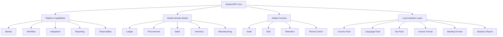

The core platform should answer:

- What is universal across all tenants/countries?
- What is local but governed?
- What is local and tenant-owned?
- What is prohibited even if a local team asks for it?

The wrong model is:

> "Every country gets a customized version."

The better model is:

> "Every country gets a governed country pack running on the same core invariants."

---

## 3. What Does Multi-Tenancy Mean in ERP?

In SaaS products, a tenant is often simply a customer account.

In ERP, that is too shallow.

A tenant boundary may include:

- commercial customer boundary;
- data isolation boundary;
- support boundary;
- billing boundary;
- security administration boundary;
- configuration boundary;
- customization boundary;
- environment boundary;
- legal/regulatory boundary.

These are not always the same.

### 3.1 Tenant Boundary Types

| Boundary | Question | Example |
|---|---|---|
| Commercial tenant | Who pays for the ERP service? | Global holding group |
| Data tenant | Whose data must be isolated? | Separate client organization |
| Legal tenant | Which legal entity owns transactions? | PT Example Indonesia |
| Operational tenant | Who operates the workflow? | APAC shared service center |
| Configuration tenant | Who owns runtime behavior? | Country finance admin |
| Support tenant | Who gets support SLA? | Business unit or country |
| Deployment tenant | Who runs in which runtime/database? | Dedicated regulated client |

A mature ERP architecture names these boundaries explicitly.

Do not use one overloaded `tenant_id` to mean everything.

---

## 4. Tenant, Legal Entity, Company, and Operating Unit

A good ERP model usually separates:

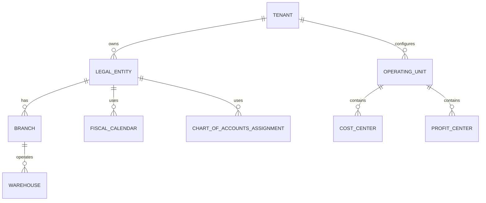

### 4.1 Definitions

| Concept | Meaning | Typical Use |
|---|---|---|
| Tenant | Top-level platform/customer partition | security, config, billing, operations |
| Legal entity | Entity with statutory reporting obligation | GL, tax, invoice, intercompany |
| Company code | ERP accounting unit, often mapped to legal entity | posting, reporting, fiscal close |
| Branch | Registered physical/operational unit | local tax, warehouse, invoice address |
| Operating unit | Management/process boundary | workflow, procurement, sales ops |
| Cost center | Expense responsibility center | budget, approval, allocation |
| Profit center | Revenue/profit reporting center | management reporting |
| Business unit | Strategic org grouping | analytics, permissions, planning |

### 4.2 Invariant

A transaction must carry enough organizational context to answer:

- who owns it;
- where it happened;
- who approved it;
- what ledger it posts into;
- what tax rules apply;
- what currency applies;
- what local reporting obligations apply;
- who may see it;
- who may change it;
- how it is retained.

Example transaction context:

```java
public record ErpExecutionContext(
        TenantId tenantId,
        LegalEntityId legalEntityId,
        OperatingUnitId operatingUnitId,
        BranchId branchId,
        UserId actorId,
        Set<RoleCode> roles,
        Locale locale,
        ZoneId userZone,
        CurrencyCode functionalCurrency,
        Instant requestTime,
        CorrelationId correlationId
) {}
```

This context should be passed explicitly across application boundaries. Avoid hidden thread-local context except at framework edges.

---

## 5. Multi-Tenancy Isolation Models

There are four common data isolation models.

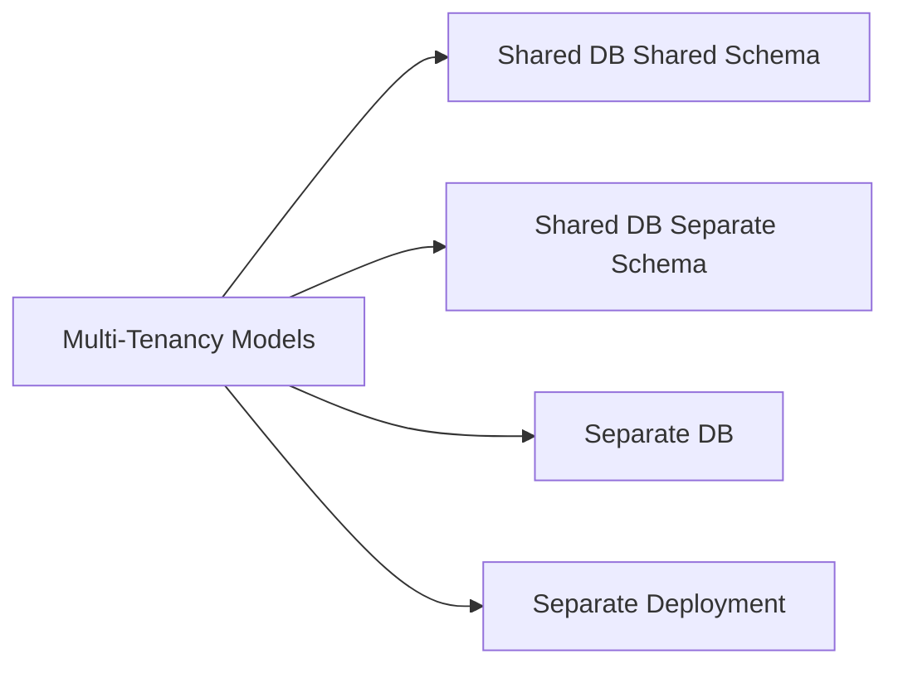

### 5.1 Shared Database, Shared Schema

All tenants share tables. Each tenant-owned row has `tenant_id`.

```sql
CREATE TABLE invoice_header (
    tenant_id UUID NOT NULL,
    invoice_id UUID NOT NULL,
    legal_entity_id UUID NOT NULL,
    invoice_number TEXT NOT NULL,
    invoice_status TEXT NOT NULL,
    issue_date DATE NOT NULL,
    total_amount NUMERIC(19, 4) NOT NULL,
    currency_code CHAR(3) NOT NULL,
    PRIMARY KEY (tenant_id, invoice_id),
    UNIQUE (tenant_id, legal_entity_id, invoice_number)
);
```

**Good for:**

- many small/medium tenants;
- uniform operations;
- SaaS economics;
- centralized upgrades.

**Risks:**

- query bugs can leak data;
- large tenants can create noisy-neighbor impact;
- tenant-specific restore is hard;
- some regulatory requirements may reject it;
- index design becomes more complex.

### 5.2 Shared Database, Separate Schema

Each tenant gets a database schema.

**Good for:**

- stronger logical isolation;
- easier tenant export/backup than shared-schema;
- moderate tenant count;
- tenant-specific maintenance windows.

**Risks:**

- schema migrations become multiplied;
- operational tooling must handle many schemas;
- cross-tenant analytics needs separate pipeline;
- application connection/routing becomes more complex.

### 5.3 Separate Database Per Tenant

Each tenant gets a separate database.

**Good for:**

- stronger isolation;
- tenant-specific backup/restore;
- high-value enterprise clients;
- different regional data residency requirements.

**Risks:**

- operational overhead;
- higher cost;
- harder fleet migration;
- more complex monitoring;
- harder global reporting.

### 5.4 Separate Deployment Per Tenant/Region

Each tenant or region has dedicated app/runtime/database.

**Good for:**

- regulated environments;
- strict residency;
- special performance/control requirements;
- public-sector or heavily audited clients.

**Risks:**

- code drift;
- release coordination cost;
- duplicate operations;
- slow global feature rollout.

### 5.5 Decision Matrix

| Criterion | Shared Schema | Separate Schema | Separate DB | Separate Deployment |
|---|---:|---:|---:|---:|
| Cost efficiency | Very high | High | Medium | Low |
| Isolation | Low/medium | Medium | High | Very high |
| Operational simplicity | High at small scale | Medium | Medium/low | Low |
| Tenant restore | Hard | Medium | Easier | Easier |
| Regulatory fit | Mixed | Better | Strong | Strongest |
| Noisy neighbor control | Weak | Medium | Strong | Strongest |
| Upgrade simplicity | High | Medium | Medium/low | Low |
| Customization risk | Low if governed | Medium | Medium | High |

No model is universally correct. The design must match the risk profile.

---

## 6. Tenant Isolation Is Not Just Database Isolation

Tenant isolation has multiple planes.

| Plane | Isolation Question | Example Control |
|---|---|---|
| Data | Can tenant A read tenant B's rows? | tenant predicate, schema, database |
| Cache | Can cached values leak? | tenant-scoped cache key |
| Search index | Can query return other tenant docs? | tenant filter in index and ACL |
| Message broker | Can consumer process wrong tenant event? | tenant in event envelope and authorization |
| File storage | Can attachments cross tenant boundary? | tenant-scoped bucket/key/policy |
| Logs | Do logs expose another tenant's data? | redaction, tenant-aware access |
| Metrics | Can tenant-specific metrics leak? | aggregated metrics and label control |
| Admin tools | Can support staff access wrong tenant? | break-glass approval and evidence |
| Reports | Can exported reports include mixed tenant data? | report scope validation |
| Config | Can config for tenant A affect tenant B? | scoped configuration resolution |

### 6.1 Cache Key Example

Wrong:

```java
String cacheKey = "tax-rule:" + taxCode;
```

Better:

```java
String cacheKey = "tenant:%s:country:%s:tax-rule:%s:as-of:%s"
        .formatted(tenantId.value(), countryCode.value(), taxCode.value(), effectiveDate);
```

### 6.2 Event Envelope Example

```java
public record TenantAwareEventEnvelope<T>(
        TenantId tenantId,
        LegalEntityId legalEntityId,
        String eventType,
        String eventVersion,
        String eventId,
        Instant occurredAt,
        CorrelationId correlationId,
        T payload
) {}
```

A consumer should reject events without valid tenant/legal context unless the event is explicitly platform-level.

---

## 7. Tenant Context Propagation

In large Java ERP, tenant context must flow through:

- HTTP/gRPC request;
- application service;
- domain command;
- repository query;
- message envelope;
- batch job;
- scheduled task;
- report request;
- integration callback;
- audit event;
- support tool.

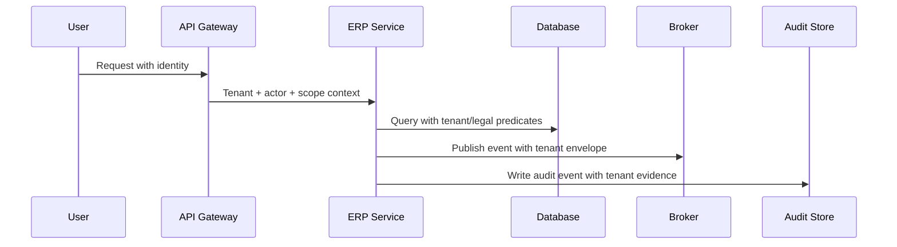

### 7.1 Tenant Context Guard

A practical pattern is to require repositories to accept a scope object.

```java
public record DataScope(
        TenantId tenantId,
        Optional<LegalEntityId> legalEntityId,
        Optional<OperatingUnitId> operatingUnitId
) {
    public void requireTenant() {
        if (tenantId == null) {
            throw new IllegalStateException("Tenant scope is required");
        }
    }
}
```

Then avoid methods like:

```java
findInvoiceById(InvoiceId id)
```

Prefer:

```java
findInvoiceById(DataScope scope, InvoiceId id)
```

The repository API should make unsafe access awkward.

---

## 8. Multi-Tenant Persistence Design

### 8.1 Composite Primary Keys vs Surrogate IDs

For ERP, avoid assuming globally unique IDs solve all tenancy problems.

A strong pattern is:

- internal ID is globally unique for technical correlation;
- business uniqueness is tenant/legal-entity scoped;
- queries still require tenant scope;
- indexes include tenant discriminator where needed.

Example:

```sql
CREATE TABLE purchase_order (
    id UUID PRIMARY KEY,
    tenant_id UUID NOT NULL,
    legal_entity_id UUID NOT NULL,
    po_number TEXT NOT NULL,
    supplier_id UUID NOT NULL,
    status TEXT NOT NULL,
    created_at TIMESTAMPTZ NOT NULL,
    UNIQUE (tenant_id, legal_entity_id, po_number)
);

CREATE INDEX idx_po_scope_status
ON purchase_order (tenant_id, legal_entity_id, status, created_at DESC);
```

### 8.2 Row-Level Security

Some databases support row-level security. It can be useful, but do not treat it as the only control.

Use it as defense-in-depth:

- application always passes tenant scope;
- database enforces tenant predicate;
- tests verify cross-tenant access is rejected;
- audit logs record tenant context.

### 8.3 Batch Jobs Must Be Tenant-Aware

A common mistake is designing tenant-aware APIs but tenant-blind batch jobs.

Batch jobs must define:

- tenant selection;
- legal entity selection;
- processing order;
- concurrency policy;
- checkpoint key;
- recovery behavior;
- resource quotas;
- operational dashboard.

Example checkpoint key:

```text
tenant_id + legal_entity_id + job_type + accounting_period + partition_no
```

---

## 9. Data Residency and Regional Architecture

Global ERP often faces data residency constraints.

A simple global deployment may not be acceptable when:

- personal data must remain in a jurisdiction;
- tax documents must be stored locally;
- government integration requires local network path;
- latency to local operations is unacceptable;
- disaster recovery must be region-specific.

### 9.1 Regional Cell Architecture

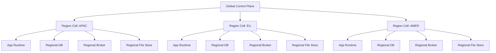

A region cell gives operational isolation but introduces global consistency questions.

### 9.2 What Belongs in Global Control Plane?

Usually:

- product release metadata;
- global feature flags;
- global tenant registry;
- global identity federation configuration;
- non-sensitive platform telemetry;
- rollout orchestration;
- global integration registry;
- platform policy catalogue.

Usually not:

- local payroll/person data;
- statutory invoice payloads;
- tax submission records;
- sensitive customer/vendor personal data;
- jurisdiction-restricted attachments.

---

## 10. Localization vs Customization

Localization is not the same as customization.

| Type | Purpose | Owner | Example |
|---|---|---|---|
| Localization | Make ERP legally/linguistically/operationally fit a locale | platform + country governance | tax report, invoice format, language |
| Configuration | Choose behavior within supported model | business admin | approval threshold, payment term |
| Customization | Extend beyond standard behavior | controlled extension team | extra validation for industry requirement |
| Fork | Diverge from core product | usually prohibited | country-specific copy of posting engine |

A healthy global ERP uses localization packs and governed configuration.

An unhealthy global ERP becomes a portfolio of local forks.

---

## 11. Localization Dimensions

Localization touches many dimensions.

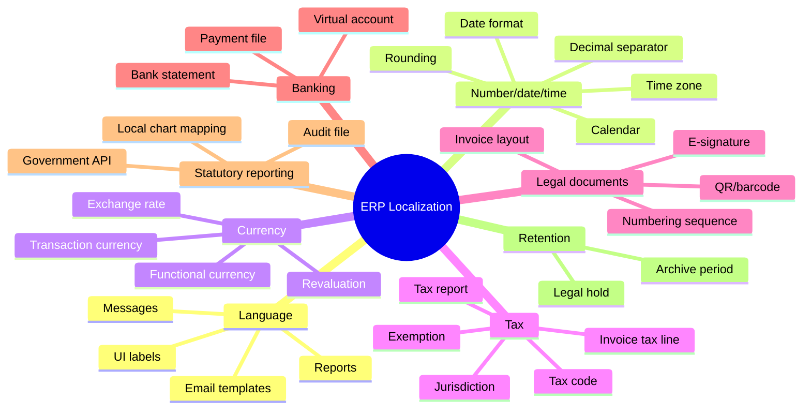

---

## 12. Internationalization Basics for ERP Engineers

Java has strong internationalization primitives: `Locale`, `ResourceBundle`, `Currency`, `ZoneId`, `DateTimeFormatter`, `NumberFormat`, and Unicode support.

But ERP localization is more than displaying translated labels.

### 12.1 Store Meaning, Render Locally

Bad design:

```text
"1.234,56" stored as a string amount
```

Better design:

```java
public record Money(BigDecimal amount, Currency currency) {}
```

Then formatting is a presentation concern.

```java
NumberFormat formatter = NumberFormat.getCurrencyInstance(locale);
formatter.setCurrency(Currency.getInstance("IDR"));
String display = formatter.format(amount);
```

### 12.2 Do Not Store Localized Text as State

For enum/status values, store stable codes:

```text
APPROVED
POSTED
REVERSED
```

Render localized labels at the edge:

```text
Approved
Disetujui
Genehmigt
Aprobado
```

### 12.3 Message Keys Must Be Stable

```properties
invoice.status.posted=Posted
invoice.status.reversed=Reversed
approval.task.escalated=Task escalated
```

Do not use English labels as keys if you expect long-term localization.

---

## 13. Time Zone and Fiscal Time

Time handling in ERP is tricky because different operations use different time concepts.

| Time Type | Meaning | Example |
|---|---|---|
| Instant | Exact machine timestamp | audit event occurred at `2026-07-01T03:12:00Z` |
| Local date | Business date without time zone | invoice issue date |
| Zoned date-time | Local user/business time with zone | approval deadline in Asia/Jakarta |
| Fiscal period | Accounting period determined by calendar | FY2026-P07 |
| Effective date | Date on which config/rule is valid | tax rule starts 2026-01-01 |

### 13.1 Rules

Use `Instant` for audit and technical ordering.

Use `LocalDate` for business dates like invoice date, posting date, delivery date.

Use `ZoneId` for deadlines, schedules, and user display.

Use explicit fiscal calendar service for accounting period determination.

```java
public interface FiscalCalendarService {
    FiscalPeriod resolvePostingPeriod(
            LegalEntityId legalEntityId,
            LocalDate postingDate
    );
}
```

Do not infer accounting period from server time.

---

## 14. Currency, Exchange Rate, and Rounding

Multi-country ERP must separate:

- transaction currency;
- functional currency;
- reporting currency;
- group currency;
- payment currency;
- tax currency, where applicable.

### 14.1 Money Value Object

```java
public record Money(BigDecimal amount, CurrencyCode currency) {
    public Money {
        if (amount == null || currency == null) {
            throw new IllegalArgumentException("Money requires amount and currency");
        }
        amount = amount.setScale(currency.scale(), RoundingMode.UNNECESSARY);
    }
}
```

In practice, `RoundingMode.UNNECESSARY` may be too strict for ingestion but useful inside domain invariants. Use dedicated rounding policy at calculation boundaries.

### 14.2 Exchange Rate Snapshot

A posted document should not depend on mutable current exchange rates.

```java
public record ExchangeRateSnapshot(
        CurrencyCode fromCurrency,
        CurrencyCode toCurrency,
        BigDecimal rate,
        LocalDate rateDate,
        String rateType,
        String source,
        Instant capturedAt
) {}
```

### 14.3 Invariants

- A posted journal must store the exchange rate used.
- Revaluation must create adjustment postings, not mutate historical postings.
- Rounding difference must be posted explicitly if material.
- Currency conversion must be deterministic and traceable.

---

## 15. Country Pack Architecture

A country pack is a governed package of local behavior.

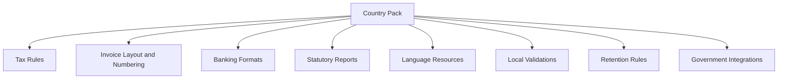

### 15.1 Country Pack Contract

```java
public interface CountryPack {
    CountryCode country();
    TaxEngine taxEngine();
    InvoiceRenderer invoiceRenderer();
    LegalNumberingPolicy legalNumberingPolicy();
    StatutoryReportProvider statutoryReportProvider();
    BankingFormatProvider bankingFormatProvider();
    List<LocalValidationRule> localValidationRules();
}
```

### 15.2 What Country Packs Must Not Do

They must not:

- bypass global posting invariants;
- change audit semantics;
- mutate approved documents without legal transition;
- access arbitrary tenant data;
- create hidden workflow states;
- fork core ledger logic;
- override security decisions silently.

Country packs can extend local behavior, but core invariants remain global.

---

## 16. Tax Localization

Tax is one of the hardest localization surfaces.

Tax rules may vary by:

- country;
- province/state;
- city;
- customer type;
- item type;
- transaction type;
- supply chain route;
- exemption status;
- reverse charge policy;
- import/export condition;
- invoice timing;
- effective date.

### 16.1 Tax Determination Flow

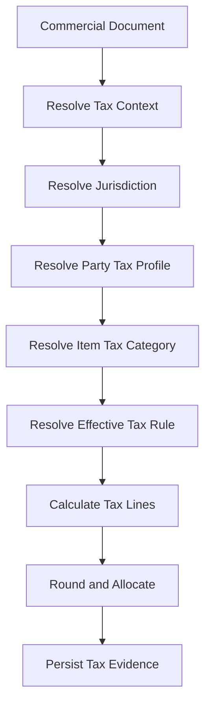

### 16.2 Tax Evidence

For every tax calculation, store:

- tax rule ID;
- rule version;
- jurisdiction;
- effective date;
- taxable base;
- tax rate;
- rounding policy;
- exemption reason;
- source document line;
- calculation trace;
- actor/system that triggered calculation.

This matters when a tax authority, auditor, or finance team asks: "Why did the system calculate this amount?"

---

## 17. Legal Numbering Localization

Many jurisdictions require legal numbering for invoices or tax documents.

A legal number is not just a sequence.

It may depend on:

- country;
- legal entity;
- branch;
- document type;
- fiscal year;
- tax registration;
- government authorization range;
- cancellation policy;
- offline issuance policy.

### 17.1 Numbering Context

```java
public record LegalNumberingContext(
        TenantId tenantId,
        LegalEntityId legalEntityId,
        BranchId branchId,
        CountryCode countryCode,
        DocumentType documentType,
        FiscalYear fiscalYear,
        LocalDate issueDate
) {}
```

### 17.2 Guardrails

- Allocate legal numbers only at the legally required moment.
- Do not reuse numbers unless local law explicitly allows it.
- Preserve void/cancelled numbers with evidence.
- Separate draft number from legal number.
- Keep sequence allocation auditable.
- Design for concurrency and retry.

---

## 18. Language and Translation Governance

Translation is not a simple file-editing problem at global ERP scale.

You need governance for:

- message key naming;
- translation ownership;
- fallback language;
- review workflow;
- screenshots/context for translators;
- terminology consistency;
- release packaging;
- tenant override policy;
- support for right-to-left scripts where required;
- report/template localization.

### 18.1 Message Key Pattern

```text
<domain>.<object>.<field-or-action>.<state-or-context>
```

Examples:

```text
invoice.header.issueDate.label
invoice.status.posted.label
approval.task.escalate.action
payment.batch.failed.message
```

### 18.2 Fallback Policy

A fallback policy should be explicit:

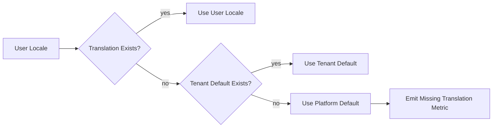

Missing translations should be observable, not silently accepted forever.

---

## 19. Banking and Payment Localization

Banking integration varies by country and bank.

Surfaces include:

- payment file format;
- bank statement import;
- virtual account;
- direct debit;
- QR payment;
- payment confirmation;
- remittance advice;
- bank-specific error codes.

### 19.1 Payment Adapter Contract

```java
public interface PaymentFormatAdapter {
    CountryCode country();
    BankCode bankCode();
    PaymentFile render(PaymentBatch batch);
    BankStatement parse(byte[] input);
    ValidationResult validate(PaymentBatch batch);
}
```

### 19.2 Invariant

Payment localization must never bypass:

- payment approval;
- AP settlement control;
- bank account authorization;
- duplicate payment detection;
- audit evidence;
- reconciliation.

---

## 20. Statutory Reporting Architecture

Statutory reporting should not be an afterthought built from ad-hoc SQL.

A statutory report needs:

- report definition;
- source data contract;
- transformation logic;
- effective-date versioning;
- validation rules;
- submission metadata;
- generated artifact hash;
- approval workflow;
- retention policy.

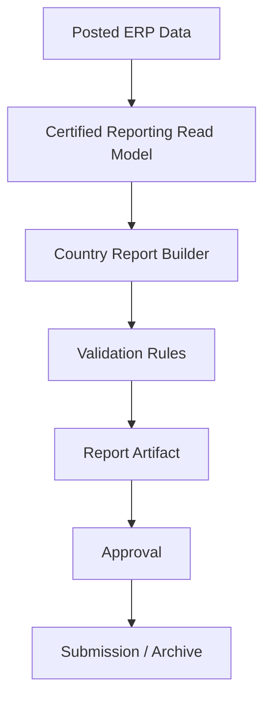

### 20.1 Report Artifact Metadata

```java
public record StatutoryReportArtifact(
        UUID artifactId,
        TenantId tenantId,
        LegalEntityId legalEntityId,
        CountryCode countryCode,
        String reportType,
        FiscalPeriod period,
        String format,
        String contentHash,
        Instant generatedAt,
        UserId generatedBy,
        String sourceSnapshotId
) {}
```

The report must be reproducible or at least explainable from a certified snapshot.

---

## 21. Global Rollout Strategy

Large ERP rollout is not only a deployment problem.

It is a socio-technical transformation involving:

- data migration;
- process alignment;
- local fit-gap;
- integration readiness;
- training;
- support readiness;
- local compliance sign-off;
- cutover rehearsal;
- command center;
- hypercare.

### 21.1 Rollout Patterns

| Pattern | Description | Best For | Risk |
|---|---|---|---|
| Big bang | All entities go live together | small orgs, urgent replacement | very high failure blast radius |
| Wave rollout | Groups of countries/entities go live in waves | multinational ERP | coordination complexity |
| Pilot-first | One country/entity proves template | uncertain process fit | pilot may overfit |
| Module rollout | Finance first, then supply chain, etc. | phased transformation | temporary integration complexity |
| Parallel run | old and new run together temporarily | high-risk finance | high operational cost |

For large ERP, wave rollout with strong template governance is often the most realistic.

---

## 22. Rollout Wave Model

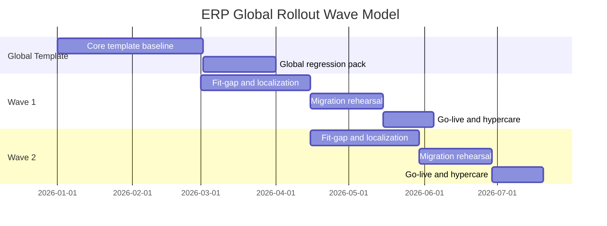

Each wave should produce feedback into:

- template backlog;
- country pack backlog;
- migration tooling;
- support runbooks;
- training materials;
- regression tests;
- integration contract library.

---

## 23. Fit-Gap Analysis That Does Not Destroy the Core

Fit-gap is where many ERP programs begin to die.

A good fit-gap process classifies requests:

| Category | Meaning | Decision Bias |
|---|---|---|
| Fit | supported by template | use standard process |
| Configuration gap | supported by config | configure, test, govern |
| Localization gap | required for local law/market | add country pack capability |
| Extension gap | legitimate business variation | add governed extension |
| Process change | business should adapt to template | train/change process |
| Invalid gap | convenience or legacy habit | reject |

### 23.1 Fit-Gap Decision Tree

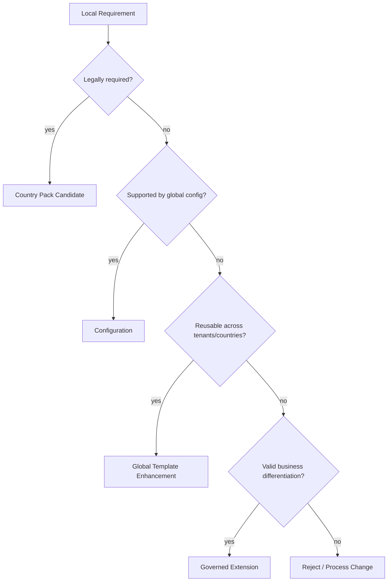

This prevents every local preference from becoming permanent platform complexity.

---

## 24. Global Template and Local Pack Governance

A global ERP template should define:

- standard chart of accounts structure;
- common procurement lifecycle;
- common sales lifecycle;
- common inventory movement types;
- common approval principles;
- common posting rules;
- common integration contracts;
- common reporting definitions;
- common control catalogue.

A local pack should define:

- country tax behavior;
- local invoice requirements;
- local banking file formats;
- statutory reports;
- local language resources;
- local retention constraints;
- local government integration.

### 24.1 Governance Board

A practical governance board includes:

- global product owner;
- finance controller;
- security/compliance representative;
- architecture owner;
- data migration lead;
- integration lead;
- country representative;
- support/operations lead.

Every local deviation should have:

- business justification;
- legal/regulatory reason if any;
- affected tenants/entities;
- lifecycle owner;
- regression test;
- removal/review date if temporary;
- support runbook impact.

---

## 25. Environment Strategy for Global Rollout

Large ERP needs multiple environment types:

| Environment | Purpose |
|---|---|
| Development | engineering iteration |
| Integration | cross-service testing |
| Localization sandbox | country pack experiments |
| Migration rehearsal | data migration dry runs |
| Performance | load, batch, close, MRP testing |
| UAT | business validation |
| Training | user practice with controlled data |
| Pre-production | go-live rehearsal |
| Production | live operations |
| Support replica | investigation without touching production |

Do not use production as the first place where local pack + migrated data + integrations meet.

---

## 26. Tenant Provisioning

Tenant provisioning should be automated and auditable.

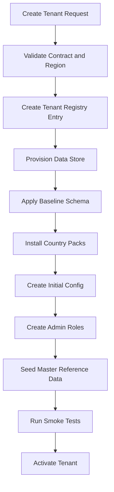

### 26.1 Tenant Registry

The tenant registry is a platform-critical data source.

It should contain:

- tenant ID;
- display name;
- region/cell;
- isolation model;
- enabled modules;
- country packs;
- environments;
- support tier;
- data residency policy;
- current version;
- lifecycle status.

Example:

```java
public record TenantRegistryEntry(
        TenantId tenantId,
        String displayName,
        RegionCode region,
        IsolationModel isolationModel,
        Set<CountryCode> enabledCountries,
        Set<ModuleCode> enabledModules,
        TenantStatus status,
        String platformVersion,
        Instant activatedAt
) {}
```

---

## 27. Tenant Lifecycle

A tenant has a lifecycle.

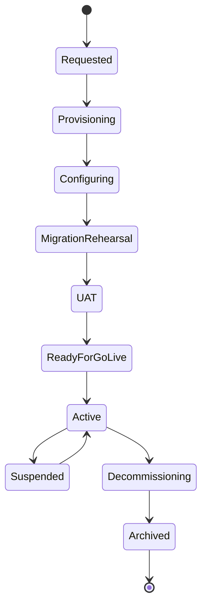

Each transition should have guards and evidence.

| Transition | Guard |
|---|---|
| Provisioning → Configuring | datastore provisioned, baseline schema applied |
| Configuring → Migration rehearsal | required country packs installed, config validated |
| Migration rehearsal → UAT | reconciliation passed |
| UAT → Ready for go-live | business sign-off, control sign-off |
| Ready → Active | cutover complete, support ready |
| Active → Suspended | contractual/security/compliance reason |
| Active → Decommissioning | retention/export plan approved |

---

## 28. Versioning Across Tenants and Regions

Global ERP platforms often cannot upgrade all tenants instantly.

You need:

- platform version;
- database schema version;
- country pack version;
- configuration version;
- extension version;
- report definition version;
- integration contract version.

### 28.1 Version Compatibility Matrix

| Component | Versioned? | Compatibility Rule |
|---|---:|---|
| Platform core | yes | supports current and previous tenant config version |
| Country pack | yes | declares compatible platform versions |
| Extension | yes | must pass extension TCK |
| API contract | yes | backward compatibility for supported window |
| Event contract | yes | consumers tolerate additive fields |
| Report definition | yes | generated artifact stores definition version |
| Migration script | yes | idempotent and replay-safe |

### 28.2 Upgrade Strategy

Use expand-migrate-contract:

1. Expand schema/API to support old and new behavior.
2. Migrate data safely.
3. Switch tenant/feature flag.
4. Observe behavior.
5. Contract after supported window.

Never run destructive migrations globally without rollback and tenant impact analysis.

---

## 29. Multi-Tenant Observability

In a global ERP, observability must answer:

- Is one tenant failing or all tenants?
- Is one country pack causing errors?
- Is a specific legal entity stuck in period close?
- Is a regional cell degraded?
- Is a noisy tenant consuming shared resources?
- Are missing translations increasing?
- Are local tax reports failing validation?

### 29.1 Metric Labels

Useful labels:

- `tenant_id` — but avoid high-cardinality explosion in global dashboards;
- `region`;
- `country_code`;
- `legal_entity_id` where controlled;
- `module`;
- `country_pack_version`;
- `platform_version`;
- `operation_type`.

Use high-cardinality labels carefully. For some systems, tenant-level metrics should be emitted to tenant-specific streams or logs rather than global low-cardinality metrics.

### 29.2 Tenant Health Score

A tenant health dashboard can include:

- failed postings;
- stuck approvals;
- failed integrations;
- delayed batch jobs;
- report generation failures;
- data reconciliation mismatches;
- error rate;
- p95/p99 latency;
- open support incidents;
- near-quota resource usage.

---

## 30. Supportability in Global ERP

Support teams need safe tools.

A support tool should allow:

- tenant-scoped search;
- document timeline;
- workflow state inspection;
- integration replay eligibility check;
- report artifact lookup;
- configuration version inspection;
- country pack version inspection;
- audit event export;
- break-glass access with approval.

It should not allow:

- arbitrary SQL edits;
- silent data mutation;
- bypassing approval;
- modifying posted financial documents;
- cross-tenant search by default;
- downloading sensitive data without evidence.

---

## 31. Global Rollout Readiness Checklist

Before activating a tenant/country wave, verify:

### 31.1 Domain Readiness

- legal entity model configured;
- chart of accounts mapping approved;
- fiscal calendar configured;
- tax rules installed and tested;
- invoice numbering policy validated;
- approval matrix configured;
- master data loaded and reconciled;
- opening balances reconciled;
- integration endpoints certified.

### 31.2 Technical Readiness

- environment smoke tests passed;
- tenant context propagation tested;
- cross-tenant isolation tests passed;
- batch jobs scoped and checkpointed;
- observability dashboards created;
- alerts routed to support team;
- backup and restore tested;
- rollback/fallback plan approved;
- performance baseline met.

### 31.3 Operational Readiness

- users trained;
- support runbook ready;
- command center staffed;
- escalation matrix agreed;
- local business sign-off captured;
- compliance sign-off captured;
- hypercare plan ready;
- known issues accepted.

---

## 32. Common Anti-Patterns

### 32.1 Tenant ID Everywhere, Isolation Nowhere

The schema has `tenant_id`, but caches, logs, search indexes, reports, batch jobs, and support tools ignore it.

**Fix:** define tenant isolation across all planes.

### 32.2 Country Forks

Every country gets its own code branch.

**Fix:** country pack architecture with strict extension contracts.

### 32.3 Local Tax Logic in UI

Tax behavior is implemented in frontend form logic.

**Fix:** tax calculation must be backend domain logic with persisted evidence.

### 32.4 Global Template as Political Document

The template says "standard" but everyone bypasses it.

**Fix:** governance board, fit-gap decision tree, regression pack, and exception review.

### 32.5 Big-Bang Migration Without Rehearsal

Migration is tested once near go-live.

**Fix:** multiple dry runs, reconciliation gates, automated import, cutover command center.

### 32.6 Time Zone by Server Time

Posting periods, deadlines, and document dates depend on server local time.

**Fix:** explicit `Instant`, `LocalDate`, `ZoneId`, and fiscal calendar service.

### 32.7 Local Reports from Ad-Hoc SQL

Statutory reports are generated from ungoverned queries.

**Fix:** certified reporting read models and report artifact metadata.

---

## 33. Design Review Questions

Use these questions in architecture review.

### 33.1 Tenant and Isolation

- What exactly is a tenant in this system?
- Are commercial, data, support, and config boundaries the same?
- Which isolation model is used and why?
- How are caches, files, messages, reports, and logs tenant-scoped?
- Can a support user accidentally access another tenant?
- How do batch jobs prevent cross-tenant processing?

### 33.2 Localization

- Which behavior is global core vs country pack?
- Can country packs bypass ledger/audit/security invariants?
- How are tax rules versioned and evidenced?
- How are legal numbers allocated and audited?
- How are language resources reviewed and released?
- How are statutory reports generated, approved, and archived?

### 33.3 Rollout

- What is the rollout wave strategy?
- What is the fit-gap classification process?
- What migration rehearsals are required?
- What are go/no-go gates?
- What does hypercare monitor?
- How does feedback from wave 1 improve wave 2?

---

## 34. Practice Lab: Design a Global ERP Rollout

### Scenario

You are building a Java ERP platform for a manufacturing group with:

- 1 global tenant;
- 12 legal entities;
- 5 countries;
- 3 currencies;
- 2 manufacturing countries;
- centralized procurement;
- local tax invoice requirements;
- regional warehouses;
- shared service center for finance;
- country-specific bank payment files.

### Exercise 1 — Model Boundaries

Create:

- tenant model;
- legal entity model;
- operating unit model;
- branch/warehouse model;
- data isolation model;
- support access model.

### Exercise 2 — Country Pack Design

For each country, define:

- tax engine extension;
- invoice numbering policy;
- invoice layout;
- statutory reports;
- banking adapter;
- retention policy;
- local validation rules.

### Exercise 3 — Rollout Plan

Design:

- rollout waves;
- migration rehearsal plan;
- UAT entry/exit criteria;
- cutover runbook;
- hypercare dashboard;
- rollback/fallback strategy.

### Exercise 4 — Failure Simulation

Simulate:

- missing tax rule after go-live;
- wrong country pack version deployed to one tenant;
- tenant batch job processing another tenant's data;
- failed statutory report submission;
- noisy tenant slowing shared database;
- incorrect exchange rate source.

For each, define detection, containment, correction, and evidence.

---

## 35. Minimal Implementation Skeleton

### 35.1 Tenant Context Filter

```java
@Component
public final class TenantContextFilter extends OncePerRequestFilter {

    private final TenantResolver tenantResolver;

    public TenantContextFilter(TenantResolver tenantResolver) {
        this.tenantResolver = tenantResolver;
    }

    @Override
    protected void doFilterInternal(
            HttpServletRequest request,
            HttpServletResponse response,
            FilterChain filterChain
    ) throws ServletException, IOException {
        TenantContext context = tenantResolver.resolve(request)
                .orElseThrow(() -> new ResponseStatusException(HttpStatus.BAD_REQUEST, "Tenant context missing"));

        try (TenantContextScope ignored = TenantContextHolder.open(context)) {
            filterChain.doFilter(request, response);
        }
    }
}
```

### 35.2 Scoped Repository Method

```java
public interface InvoiceRepository {
    Optional<Invoice> findById(DataScope scope, InvoiceId invoiceId);
    Page<InvoiceSummary> search(DataScope scope, InvoiceSearchCriteria criteria, Pageable pageable);
}
```

### 35.3 Country Pack Registry

```java
@Component
public final class CountryPackRegistry {

    private final Map<CountryCode, CountryPack> packs;

    public CountryPackRegistry(List<CountryPack> countryPacks) {
        this.packs = countryPacks.stream()
                .collect(Collectors.toUnmodifiableMap(CountryPack::country, Function.identity()));
    }

    public CountryPack require(CountryCode countryCode) {
        CountryPack pack = packs.get(countryCode);
        if (pack == null) {
            throw new IllegalStateException("No country pack installed for " + countryCode);
        }
        return pack;
    }
}
```

---

## 36. Source Notes

This part is grounded in the following technical references and stable standards:

- Jakarta EE 11 Platform, which defines a modern enterprise Java baseline and requires Java SE 17 or higher: `https://jakarta.ee/specifications/platform/11/`
- Spring Boot system requirements, useful when selecting modern Java/Spring runtime baselines: `https://docs.spring.io/spring-boot/system-requirements.html`
- Unicode CLDR, a major source of locale data used by software systems to support language, region, formatting, and locale behavior: `https://cldr.unicode.org/`
- Unicode Locale Data Markup Language, which describes the structured locale data format used by CLDR: `https://www.unicode.org/reports/tr35/`
- OpenTelemetry Java documentation, useful for tenant-aware telemetry and operational diagnostics in Java systems: `https://opentelemetry.io/docs/languages/java/`

Use these references as technical anchors, not as substitutes for country-specific legal advice. Tax, invoice, banking, data residency, and statutory reporting requirements must be validated with qualified local experts.

---

## 37. Key Takeaways

- Multi-tenancy in ERP is not just `tenant_id`; it is isolation across data, cache, files, messages, logs, reports, config, and support tools.
- Legal entity, tenant, operating unit, branch, cost center, and region are different concepts and should not be collapsed blindly.
- Localization should be implemented as governed country packs, not code forks.
- Tax, legal numbering, statutory reporting, banking, currency, language, and retention require explicit versioning and evidence.
- Global rollout is an engineering discipline: template governance, fit-gap classification, migration rehearsal, command center, and hypercare.
- A global ERP stays healthy when local variation is allowed only through controlled extension surfaces and remains subordinate to global invariants.
