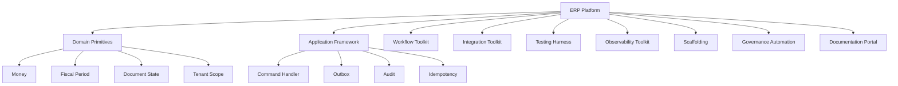
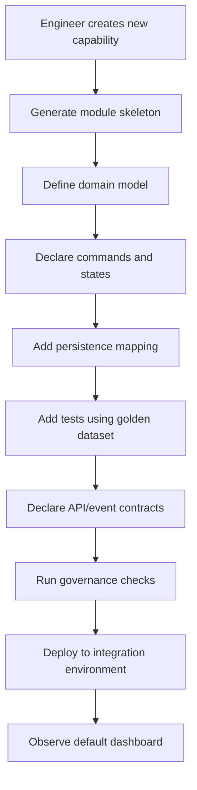
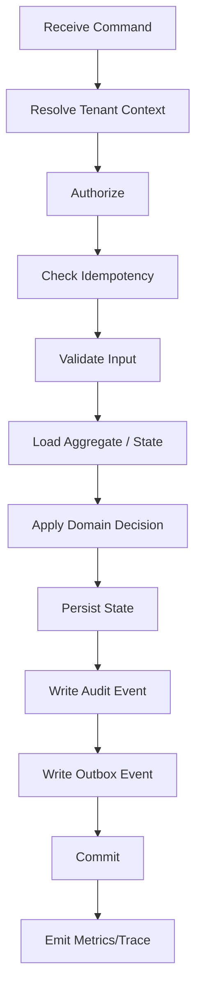
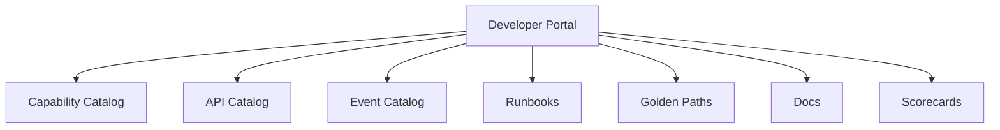
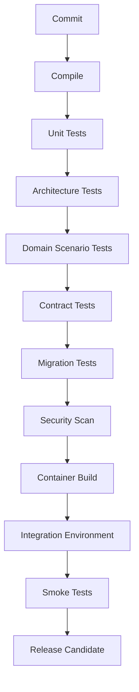
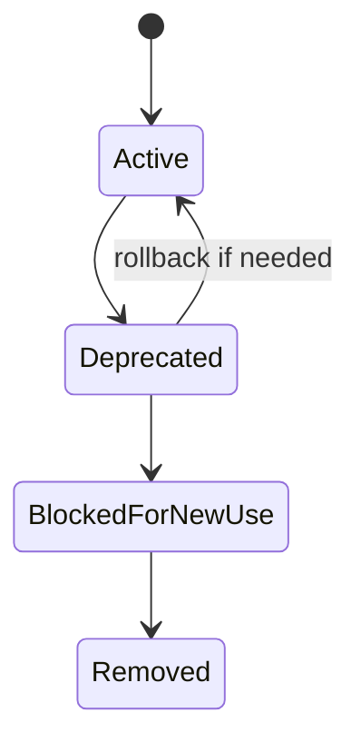

# Part 032 — ERP Platform Engineering and Internal Developer Experience

A large ERP system is not built by one team.

It is built by many teams over many years:

- finance team;
- procurement team;
- sales team;
- inventory team;
- manufacturing team;
- workflow team;
- integration team;
- reporting team;
- platform team;
- migration team;
- operations team;
- localization teams;
- extension teams.

Without platform engineering, every team creates its own patterns, libraries, errors, logs, workflows, APIs, test data, migration scripts, and operational dashboards.

The result is not a modular ERP.

The result is a distributed accident.

This part explains how to build an internal ERP platform and developer experience so teams can move faster while preserving invariants, auditability, operability, security, and upgradeability.

---

## 1. Kaufman Skill Deconstruction

For this topic, the skill is not simply "build reusable libraries".

The skill is:

> Create an internal platform that makes the correct ERP engineering path the easiest path for product teams.

Break it down:

| Sub-skill | What You Must Be Able To Do | Failure If Missing |
|---|---|---|
| Platform capability design | Define shared capabilities that many teams need | duplicate frameworks and inconsistent behavior |
| Golden path design | Provide recommended ways to build services/modules | every team reinvents architecture |
| Domain SDK design | Package ERP primitives as reusable types and APIs | weak invariants and duplicated logic |
| Scaffolding | Generate compliant modules quickly | slow startup and inconsistent boilerplate |
| Governance automation | Enforce standards through tests/tools | review fatigue and standards drift |
| Internal documentation | Make patterns discoverable and actionable | tribal knowledge and onboarding drag |
| Local developer environment | Let engineers run realistic slices locally | production-only defects |
| Test harness | Provide golden dataset and invariant checks | fragile regression testing |
| Operational integration | Standardize logs, metrics, traces, alerts, dashboards | unsupported production behavior |
| Upgrade management | Keep the platform evolvable | teams get stuck on old patterns |

---

## 2. The Core Mental Model

An ERP platform is a **product for internal product teams**.



The ERP platform must answer:

- How do teams create a new ERP capability?
- How do they model documents and lifecycle safely?
- How do they post to ledger correctly?
- How do they publish events safely?
- How do they implement approval workflows?
- How do they test with realistic business scenarios?
- How do they get logs, metrics, traces, dashboards, and alerts by default?
- How do they avoid violating security/audit/data isolation rules?

---

## 3. Platform Engineering vs Shared Library Dump

A platform is not a folder of random utilities.

| Shared Library Dump | Internal ERP Platform |
|---|---|
| passive code reuse | active paved road |
| no ownership | product ownership |
| optional conventions | enforced contracts |
| little documentation | guided onboarding |
| no operational integration | dashboards, alerts, runbooks |
| upgrades are ad-hoc | versioned adoption path |
| patterns live in people's heads | patterns encoded in tools/tests |

A platform should reduce cognitive load.

It should not simply centralize complexity.

---

## 4. The ERP Golden Path

A golden path is the recommended default way to build a capability.

For an ERP module, a golden path should include:

1. module skeleton;
2. bounded context naming;
3. package layout;
4. command/query pattern;
5. domain primitives;
6. persistence conventions;
7. audit integration;
8. tenant scope enforcement;
9. idempotency support;
10. outbox support;
11. workflow integration;
12. API/event contract templates;
13. test harness;
14. observability defaults;
15. CI checks;
16. production readiness checklist.

### 4.1 Golden Path Flow



The golden path is successful when teams prefer it because it is faster than custom work.

---

## 5. Reference Module Structure

A large Java ERP module should have consistent structure.

Example Maven/Gradle multi-module layout:

```text
erp-procurement/
  procurement-api/
    src/main/java/.../procurement/api
  procurement-domain/
    src/main/java/.../procurement/domain
  procurement-application/
    src/main/java/.../procurement/application
  procurement-infra-persistence/
    src/main/java/.../procurement/infra/persistence
  procurement-infra-messaging/
    src/main/java/.../procurement/infra/messaging
  procurement-web/
    src/main/java/.../procurement/web
  procurement-testkit/
    src/main/java/.../procurement/testkit
```

### 5.1 Layer Responsibilities

| Layer | Responsibility | Must Not Do |
|---|---|---|
| API | public DTOs/contracts | contain domain rules |
| Domain | invariants, state transitions, value objects | call database, broker, HTTP |
| Application | use cases, transactions, orchestration | hide business rules in scripts |
| Persistence infra | repository implementation | decide business behavior |
| Messaging infra | outbox/consumer mapping | bypass idempotency |
| Web/API adapter | request validation/auth mapping | implement domain decisions |
| Testkit | fixtures, scenario DSL, contract tests | depend on production secrets |

---

## 6. Package-by-Capability, Not Package-by-Technical-Layer Only

Bad large ERP structure:

```text
controller/
service/
repository/
dto/
entity/
```

This becomes impossible to reason about at scale.

Better:

```text
procurement/
  requisition/
  purchaseorder/
  goodsreceipt/
  invoicematching/
  shared/
```

Inside each capability, you may still have technical layers.

```text
purchaseorder/
  domain/
  application/
  persistence/
  web/
  messaging/
```

The primary decomposition should follow business capability.

---

## 7. ERP Domain SDK

The domain SDK provides shared primitives that encode ERP semantics.

Examples:

```java
public record TenantId(UUID value) {}
public record LegalEntityId(UUID value) {}
public record DocumentNumber(String value) {}
public record FiscalPeriod(String fiscalYear, int periodNo) {}
public record CurrencyCode(String value) {}
public record Quantity(BigDecimal value, UnitOfMeasure uom) {}
public record Money(BigDecimal amount, CurrencyCode currency) {}
```

### 7.1 What Belongs in the Domain SDK?

Good candidates:

- tenant and legal entity IDs;
- money/currency primitives;
- quantity/UOM primitives;
- fiscal period;
- document lifecycle primitives;
- audit actor;
- correlation ID;
- idempotency key;
- document reference;
- validation result;
- business error taxonomy.

Bad candidates:

- domain-specific behavior from one module;
- database entities;
- framework-specific annotations everywhere;
- utility methods with unclear ownership;
- global static mutable state;
- business rules that need local ownership.

The SDK should standardize primitives, not centralize every domain rule.

---

## 8. Business Error Taxonomy

Large ERP needs consistent errors.

```java
public sealed interface BusinessError permits ValidationError, ConflictError, AuthorizationError, InvariantViolation {
    String code();
    String messageKey();
    ErrorSeverity severity();
}

public record InvariantViolation(
        String code,
        String messageKey,
        ErrorSeverity severity,
        Map<String, Object> evidence
) implements BusinessError {}
```

### 8.1 Error Classes

| Error Class | Meaning | Example |
|---|---|---|
| Validation | input is invalid | missing vendor tax ID |
| Authorization | actor cannot perform action | user lacks approval scope |
| Conflict | state changed or duplicate action | PO already approved |
| Invariant violation | business rule would be broken | unbalanced journal |
| Integration transient | retry may succeed | bank timeout |
| Integration permanent | external system rejected | invalid payment account |
| Configuration | required config missing/invalid | tax rule not found |
| Data quality | migrated/master data problem | duplicate supplier |

A consistent taxonomy improves UI messages, support, alerting, retry behavior, and audit evidence.

---

## 9. Command Handler Framework

ERP actions should be expressed as commands with clear context.

```java
public interface ErpCommand<R> {
    IdempotencyKey idempotencyKey();
}

public record ApprovePurchaseOrderCommand(
        PurchaseOrderId purchaseOrderId,
        ApprovalDecision decision,
        String comment,
        IdempotencyKey idempotencyKey
) implements ErpCommand<ApprovalResult> {}
```

A platform command handler can standardize:

- tenant context validation;
- authorization;
- idempotency;
- transaction boundary;
- audit event;
- outbox publication;
- metrics/tracing;
- error mapping.

### 9.1 Command Execution Pipeline



### 9.2 Skeleton

```java
public final class CommandExecutor {

    public <C extends ErpCommand<R>, R> R execute(
            C command,
            ErpExecutionContext context,
            CommandHandler<C, R> handler
    ) {
        requireTenant(context);
        authorize(command, context);

        return idempotency.execute(command.idempotencyKey(), () ->
                transactionTemplate.execute(status -> {
                    R result = handler.handle(command, context);
                    auditWriter.write(command, context, result);
                    outboxWriter.writeDomainEvents(context);
                    return result;
                })
        );
    }
}
```

The goal is not to force every use case into a generic abstraction. The goal is to avoid every team reimplementing critical cross-cutting behavior differently.

---

## 10. Document Lifecycle Toolkit

Many ERP modules have document lifecycles:

- draft;
- submitted;
- approved;
- posted;
- partially fulfilled;
- closed;
- cancelled;
- reversed.

A lifecycle toolkit should provide:

- state machine DSL;
- transition guards;
- transition action hooks;
- transition audit log;
- illegal transition error;
- test helpers;
- visualization output;
- migration support for lifecycle changes.

### 10.1 Lifecycle DSL Example

```java
public final class PurchaseOrderLifecycle {

    public static LifecycleDefinition<PoState, PoAction> definition() {
        return LifecycleDefinition.<PoState, PoAction>builder()
                .initial(PoState.DRAFT)
                .transition(PoState.DRAFT, PoAction.SUBMIT, PoState.SUBMITTED)
                .transition(PoState.SUBMITTED, PoAction.APPROVE, PoState.APPROVED)
                .transition(PoState.APPROVED, PoAction.RELEASE, PoState.RELEASED)
                .transition(PoState.RELEASED, PoAction.CLOSE, PoState.CLOSED)
                .transition(PoState.SUBMITTED, PoAction.REJECT, PoState.DRAFT)
                .transition(PoState.APPROVED, PoAction.CANCEL, PoState.CANCELLED)
                .build();
    }
}
```

### 10.2 Lifecycle Review Questions

- Is every transition named?
- Are illegal transitions tested?
- Are guards explicit?
- Are side effects idempotent?
- Is transition evidence persisted?
- Can old documents survive lifecycle version changes?

---

## 11. Audit SDK

Audit is a platform capability, not a string log.

A platform audit SDK should standardize:

- actor identity;
- tenant/legal scope;
- action code;
- object reference;
- before/after summary;
- decision reason;
- correlation ID;
- source IP/device where relevant;
- evidence hash;
- retention classification.

```java
public record AuditEvent(
        UUID eventId,
        TenantId tenantId,
        Optional<LegalEntityId> legalEntityId,
        UserId actorId,
        String actionCode,
        BusinessObjectRef objectRef,
        Instant occurredAt,
        CorrelationId correlationId,
        Map<String, Object> evidence
) {}
```

### 11.1 Audit Integration Pattern

```java
public interface AuditWriter {
    void record(AuditEvent event);
}

public interface AuditableCommand {
    BusinessObjectRef targetObject();
    String auditActionCode();
    Map<String, Object> auditEvidence();
}
```

Teams should not invent audit event shape per module.

---

## 12. Outbox and Integration SDK

ERP teams frequently publish events:

- purchase order approved;
- goods receipt posted;
- invoice issued;
- journal posted;
- payment batch released;
- stock reservation failed.

A platform integration SDK should provide:

- event envelope;
- schema versioning;
- outbox storage;
- publisher;
- consumer idempotency;
- retry policy;
- dead-letter/exception queue;
- trace/correlation propagation;
- contract testing helpers.

### 12.1 Event Envelope

```java
public record ErpEventEnvelope<T>(
        String eventId,
        String eventType,
        String eventVersion,
        TenantId tenantId,
        Optional<LegalEntityId> legalEntityId,
        Instant occurredAt,
        CorrelationId correlationId,
        String producer,
        T payload
) {}
```

### 12.2 Outbox Table

```sql
CREATE TABLE erp_outbox_event (
    outbox_id UUID PRIMARY KEY,
    tenant_id UUID NOT NULL,
    aggregate_type TEXT NOT NULL,
    aggregate_id UUID NOT NULL,
    event_type TEXT NOT NULL,
    event_version TEXT NOT NULL,
    payload JSONB NOT NULL,
    correlation_id TEXT NOT NULL,
    status TEXT NOT NULL,
    created_at TIMESTAMPTZ NOT NULL,
    published_at TIMESTAMPTZ NULL,
    retry_count INT NOT NULL DEFAULT 0
);
```

The outbox should be a default platform path, not an optional advanced pattern.

---

## 13. Workflow Toolkit

A workflow toolkit should avoid every module building its own approval engine.

It should provide:

- approval rule model;
- task assignment;
- delegation;
- escalation;
- SLA timers;
- SoD checks;
- task audit;
- workflow state inspection;
- admin correction with evidence;
- UI components for inbox/action history.

### 13.1 Workflow API

```java
public interface ApprovalWorkflowService {
    WorkflowInstanceId startApproval(
            ApprovalSubject subject,
            ApprovalRequest request,
            ErpExecutionContext context
    );

    ApprovalOutcome decide(
            WorkflowTaskId taskId,
            ApprovalDecision decision,
            ErpExecutionContext context
    );
}
```

### 13.2 Platform Guarantee

Every approval decision must capture:

- actor;
- role/scope at decision time;
- approval rule version;
- subject snapshot;
- comment/reason if required;
- timestamp;
- transition result;
- SoD validation result.

---

## 14. Configuration SDK

Configuration must be governed and effective-dated.

A platform configuration SDK should provide:

- typed config definitions;
- scope model;
- effective dating;
- versioning;
- approval workflow;
- validation;
- cache invalidation;
- runtime resolution;
- config evidence in decisions.

### 14.1 Typed Config Example

```java
public record ApprovalThresholdConfig(
        TenantId tenantId,
        LegalEntityId legalEntityId,
        DocumentType documentType,
        Money threshold,
        LocalDate effectiveFrom,
        Optional<LocalDate> effectiveTo,
        ConfigVersion version
) {}
```

### 14.2 Resolver Contract

```java
public interface ConfigResolver {
    <T> T resolve(
            ConfigKey<T> key,
            ConfigScope scope,
            LocalDate effectiveDate
    );
}
```

Do not allow teams to read arbitrary config tables with hand-written precedence logic.

---

## 15. Reporting and Read Model Toolkit

ERP reporting needs consistent projection and export patterns.

Platform capabilities:

- projection framework;
- read model checkpointing;
- report request model;
- export jobs;
- pagination standards;
- report security;
- freshness metadata;
- materialized view refresh orchestration;
- report artifact storage.

### 15.1 Report Request Contract

```java
public record ReportRequest(
        TenantId tenantId,
        Optional<LegalEntityId> legalEntityId,
        String reportCode,
        Map<String, String> parameters,
        Locale locale,
        ZoneId zoneId,
        UserId requestedBy,
        Instant requestedAt
) {}
```

### 15.2 Report Freshness Metadata

```java
public record ReadModelFreshness(
        String readModelName,
        Instant lastSourceEventTime,
        Instant lastProjectionTime,
        long lagSeconds,
        String checkpoint
) {}
```

Teams should not invent report export security and freshness semantics repeatedly.

---

## 16. Internal Scaffolding

Scaffolding reduces startup cost and standardizes structure.

A scaffolded module should generate:

- package structure;
- build configuration;
- application service template;
- domain aggregate template;
- repository interface;
- persistence adapter;
- API controller;
- command DTO;
- event envelope;
- audit action registry;
- tests;
- observability config;
- documentation page;
- ADR template.

### 16.1 Example CLI

```bash
erpctl module create \
  --bounded-context procurement \
  --capability purchase-order \
  --owner team-procurement \
  --database postgres \
  --workflow approval \
  --events enabled \
  --audit required
```

Generated output:

```text
Created module procurement-purchase-order
- domain package generated
- command handler generated
- tenant-scoped repository generated
- audit action registry generated
- outbox publisher generated
- JUnit test skeleton generated
- Testcontainers profile generated
- dashboard template generated
- ADR template generated
```

---

## 17. Internal Developer Portal

The developer portal is the front door of the ERP platform.

It should include:

- golden paths;
- module catalogue;
- API/event catalogue;
- domain glossary;
- architecture decision records;
- owner/team metadata;
- runbooks;
- onboarding guides;
- local environment setup;
- testing playbooks;
- platform changelog;
- deprecation notices;
- production readiness checklist.

### 17.1 Capability Catalogue



A good portal reduces Slack archaeology.

---

## 18. Architecture Decision Records

ERP design decisions must be durable.

Use ADRs for:

- tenant isolation model;
- workflow engine choice;
- ledger posting model;
- outbox/inbox pattern;
- report architecture;
- extension model;
- migration strategy;
- country pack design;
- build/dependency strategy;
- platform upgrade policy.

### 18.1 ADR Template

```md
# ADR-0007: Use Transactional Outbox for ERP Domain Events

## Status
Accepted

## Context
ERP commands must persist state and integration intent atomically.

## Decision
Every module publishing durable integration events must use the platform outbox.

## Consequences
- Teams do not publish directly inside domain transactions.
- Consumers must be idempotent.
- Outbox lag becomes an operational metric.

## Alternatives Considered
- Direct broker publish inside transaction
- CDC-only publication
- Batch export
```

ADRs prevent repeated arguments and preserve reasoning for future engineers.

---

## 19. Governance Automation

Manual architecture review does not scale.

Use automated checks for:

- forbidden dependencies;
- package boundaries;
- tenant scope usage;
- audit action registration;
- event schema compatibility;
- API versioning;
- test coverage for lifecycle transitions;
- migration script naming;
- dependency vulnerability;
- banned APIs;
- observability requirements.

### 19.1 Architecture Test Example

```java
@AnalyzeClasses(packages = "com.example.erp")
class ArchitectureRulesTest {

    @ArchTest
    static final ArchRule domain_must_not_depend_on_infrastructure =
            noClasses().that().resideInAPackage("..domain..")
                    .should().dependOnClassesThat().resideInAnyPackage("..infra..", "..web..");
}
```

Tools like ArchUnit can encode Java architecture rules as tests. The specific tool matters less than the principle: architectural constraints should be executable.

---

## 20. Dependency Governance

Large Java ERP systems suffer when dependency versions drift uncontrollably.

A platform should define:

- BOM or version catalog;
- approved dependency list;
- banned dependency list;
- vulnerability scanning;
- license policy;
- upgrade cadence;
- compatibility testing;
- deprecation policy.

### 20.1 Version Catalog Example

```toml
[versions]
spring-boot = "4.1.0"
junit = "6.1.0"
testcontainers = "2.0.0"
opentelemetry = "latest-approved"

[libraries]
junit-bom = { module = "org.junit:junit-bom", version.ref = "junit" }
testcontainers-postgresql = { module = "org.testcontainers:postgresql", version.ref = "testcontainers" }
```

Use actual approved versions from your organization. The platform should publish them centrally.

---

## 21. CI/CD Golden Pipeline

ERP CI/CD must check more than compilation.



### 21.1 ERP-Specific Pipeline Gates

- no unregistered audit action;
- no tenant-blind repository method;
- no event without schema version;
- no migration without rollback/compatibility note;
- no workflow transition without test;
- no report export without authorization check;
- no config definition without validation;
- no endpoint without observability tags;
- no dependency outside approved catalogue.

---

## 22. Local Development Environment

Developer productivity collapses when engineers cannot run realistic scenarios locally.

A good local environment provides:

- application runtime;
- database;
- broker;
- object storage emulator;
- identity stub;
- test tenant;
- golden master data;
- sample workflow users;
- sample country pack;
- sample integrations;
- observability sink;
- reset script.

### 22.1 Docker Compose Sketch

```yaml
services:
  postgres:
    image: postgres:latest
    environment:
      POSTGRES_PASSWORD: erp
  broker:
    image: apache/kafka:latest
  erp-app:
    build: .
    environment:
      ERP_PROFILE: local
      ERP_TENANT_SEED: demo
```

Local environment should not require production secrets.

---

## 23. Golden Dataset

A golden dataset is a curated, versioned dataset used for:

- onboarding;
- demos;
- regression tests;
- scenario testing;
- performance baselines;
- migration rehearsal;
- support reproduction.

### 23.1 Contents

A good ERP golden dataset includes:

- tenants;
- legal entities;
- branches;
- users and roles;
- suppliers;
- customers;
- items;
- UOMs;
- tax codes;
- chart of accounts;
- fiscal calendars;
- approval matrix;
- sample purchase orders;
- sample sales orders;
- inventory balances;
- open invoices;
- posted journals;
- exception cases.

### 23.2 Dataset Versioning

```text
golden-dataset/
  v2026.07/
    tenant.sql
    master-data.sql
    procurement-scenarios.sql
    finance-scenarios.sql
    expected-balances.json
    expected-reports/
```

The dataset should have expected outputs, not only seed data.

---

## 24. Scenario DSL

ERP testing is easier when teams can express business scenarios.

```java
scenario("three-way match posts AP invoice")
    .given(vendor("V-100").active())
    .and(item("ITEM-1").stocked())
    .when(createPurchaseOrder("PO-1").forVendor("V-100").line("ITEM-1", qty(10)))
    .and(receiveGoods("PO-1").qty(10))
    .and(bookSupplierInvoice("INV-1").against("PO-1"))
    .then(expectInvoiceStatus("INV-1", POSTED))
    .and(expectJournalBalanced())
    .and(expectSubledgerReconcilesWithGl());
```

This is more maintainable than scattered low-level tests.

---

## 25. Platform Test Harness

The platform should provide test utilities for:

- deterministic clock;
- deterministic ID generator;
- tenant context factory;
- fake user/role factory;
- workflow simulator;
- outbox drain helper;
- integration stub;
- fiscal calendar fixture;
- exchange rate fixture;
- audit assertion;
- ledger balance assertion.

### 25.1 Example Test Helper

```java
public final class ErpTestContext {
    public static ErpExecutionContext financeApprover() {
        return new ErpExecutionContext(
                TenantId.of("demo"),
                LegalEntityId.of("ID01"),
                OperatingUnitId.of("FINANCE"),
                BranchId.of("JKT"),
                UserId.of("approver-1"),
                Set.of(RoleCode.of("FINANCE_APPROVER")),
                Locale.forLanguageTag("id-ID"),
                ZoneId.of("Asia/Jakarta"),
                CurrencyCode.of("IDR"),
                Instant.parse("2026-07-01T00:00:00Z"),
                CorrelationId.of("test")
        );
    }
}
```

---

## 26. Observability by Default

Every ERP capability should emit standard telemetry.

### 26.1 Standard Logs

Log fields:

- timestamp;
- level;
- service;
- module;
- tenant ID;
- legal entity ID;
- actor ID if applicable;
- correlation ID;
- command/action;
- object reference;
- outcome;
- error code.

### 26.2 Standard Metrics

Metrics:

- command duration;
- command failure count;
- workflow task age;
- outbox lag;
- integration retry count;
- batch duration;
- posting throughput;
- report generation time;
- tenant error rate;
- dead-letter count.

### 26.3 Standard Traces

Trace spans:

- API request;
- command execution;
- database query group;
- workflow decision;
- outbox write;
- external call;
- report generation;
- batch chunk.

A platform can auto-instrument common paths and require teams to add business attributes.

---

## 27. Runbook as Code

Operational knowledge should live near the capability.

Each module should include runbooks for:

- failed posting;
- stuck workflow;
- failed integration;
- report delay;
- migration failure;
- tenant-specific outage;
- batch retry;
- data correction request.

### 27.1 Runbook Template

```md
# Runbook: Purchase Order Approval Stuck

## Symptoms
- Approval task age exceeds SLA.
- Dashboard shows `workflow_task_stuck_count > 0`.

## Impact
- Purchase order cannot progress to release.

## Diagnosis
1. Find workflow instance by document reference.
2. Check current assignee and delegation rule.
3. Check escalation timer status.
4. Check SoD decision result.

## Safe Actions
- Recompute assignee.
- Trigger escalation if timer missed.
- Reassign with approval evidence.

## Unsafe Actions
- Directly update workflow state in database.
- Approve on behalf of user without evidence.
```

Runbooks should be linked from dashboards and alerts.

---

## 28. Internal API and Event Catalogue

A large ERP platform needs discovery for APIs and events.

Catalogue metadata:

- name;
- owner;
- version;
- lifecycle status;
- contract schema;
- backward compatibility rules;
- example payload;
- auth scope;
- PII/sensitivity classification;
- SLA/SLO;
- deprecation date;
- consumers/producers.

### 28.1 Event Catalogue Entry

```yaml
eventType: procurement.purchase-order.approved
eventVersion: v1
owner: team-procurement
producer: procurement-service
payloadSchema: schemas/procurement/purchase-order-approved-v1.json
containsPersonalData: false
retentionClass: business-event
compatibility: additive-only
consumers:
  - inventory-service
  - reporting-projection-service
```

This prevents hidden dependencies.

---

## 29. Extension Developer Experience

If ERP supports extensions/plugins, extension developers need a safe SDK.

Provide:

- extension API;
- local sandbox;
- test harness;
- plugin manifest schema;
- permission model;
- lifecycle hooks;
- compatibility checker;
- packaging tool;
- observability integration;
- example plugins.

### 29.1 Plugin Manifest

```yaml
pluginId: id.example.tax-extra-validation
name: Indonesia Tax Extra Validation
version: 1.2.0
compatiblePlatformVersions:
  - ">=2026.07 <2027.01"
hooks:
  - invoice.before-post
permissions:
  - invoice.read
  - tax-rule.read
owner: country-pack-team-id
```

Extension APIs must be intentionally smaller than internal APIs.

---

## 30. Backward Compatibility and Deprecation

A platform cannot break every team at once.

Deprecation policy should define:

- deprecated API/component;
- replacement;
- migration guide;
- warning mechanism;
- removal date;
- affected teams;
- automated detection;
- migration support;
- exception process.

### 30.1 Deprecation Lifecycle



### 30.2 Compatibility Rules

- Do not remove public fields without versioning.
- Do not change event meaning under same version.
- Do not change lifecycle semantics silently.
- Do not change default rounding/tax behavior without migration plan.
- Do not remove config keys without compatibility shim.

---

## 31. Platform Scorecards

Scorecards make platform adoption visible.

Metrics per module/team:

| Scorecard Dimension | Example Check |
|---|---|
| Architecture | package boundaries pass |
| Security | endpoints have auth scope |
| Tenant safety | repository methods require scope |
| Audit | critical commands emit audit event |
| Integration | events use platform envelope |
| Testing | lifecycle transition tests exist |
| Observability | dashboards and alerts registered |
| Documentation | owner/runbook/ADR present |
| Dependency health | no banned dependencies |
| Upgrade health | platform version current |

Do not weaponize scorecards. Use them to improve reliability and guide support.

---

## 32. Internal Documentation Style

For Baeldung-style engineering documentation, each article should have:

1. problem statement;
2. mental model;
3. minimal example;
4. production concerns;
5. failure modes;
6. testing strategy;
7. checklist;
8. source notes;
9. practice exercise.

### 32.1 Documentation Template

```md
# How to Implement Idempotent ERP Commands

## Problem
Duplicate commands can create duplicate business outcomes.

## Mental Model
Idempotency protects the business outcome, not only the HTTP request.

## Implementation
...

## Failure Modes
...

## Tests
...

## Checklist
...
```

Documentation should be written for the next engineer who will maintain production at 2 AM.

---

## 33. Team Topology and Ownership

Platform engineering fails when ownership is unclear.

A practical ownership model:

| Team | Owns | Does Not Own |
|---|---|---|
| ERP Platform | SDK, scaffolding, golden path, governance tools | every domain decision |
| Finance Domain | GL, AP, AR, posting rules | platform outbox engine |
| Supply Chain Domain | inventory, procurement, fulfillment | global tenant registry |
| Workflow Platform | approval engine, task lifecycle | document-specific business rules |
| Integration Platform | outbox/inbox, contract catalogue, adapters | source domain meaning |
| Reporting Platform | projection framework, export engine | every report definition |
| SRE/Ops | production reliability, incident process | domain ownership |

Ownership should be encoded in catalogues, repositories, alerts, and runbooks.

---

## 34. Platform Product Management

An internal platform still needs product management.

Manage:

- roadmap;
- user research with engineers;
- adoption metrics;
- migration campaigns;
- developer satisfaction;
- support channels;
- release notes;
- breaking changes;
- documentation quality;
- platform backlog;
- contribution model.

### 34.1 Platform Adoption Metrics

- time to create new module;
- time to first green build;
- number of modules on golden path;
- percentage of APIs/events in catalogue;
- number of architecture rule violations;
- outbox adoption rate;
- audit SDK adoption rate;
- platform support ticket volume;
- upgrade lag by module;
- developer satisfaction score.

---

## 35. Security and Guardrails in the Platform

Security should be embedded into the platform path.

Default guardrails:

- secure defaults for endpoints;
- tenant scope required;
- audit required for critical actions;
- secret scanning;
- dependency vulnerability scanning;
- PII classification in APIs/events;
- export permission checks;
- privileged operation approval;
- break-glass evidence;
- secure logging helpers.

### 35.1 Secure API Template

```java
@PostMapping("/purchase-orders/{id}/approve")
@PreAuthorize("hasAuthority('PO_APPROVE')")
public ApprovalResponse approve(
        @PathVariable UUID id,
        @RequestBody ApprovePurchaseOrderRequest request,
        Principal principal
) {
    ErpExecutionContext context = contextFactory.from(principal);
    return commandExecutor.execute(
            request.toCommand(id),
            context,
            approvePurchaseOrderHandler
    );
}
```

Teams should not have to remember every cross-cutting security rule manually.

---

## 36. Build vs Buy for Platform Capabilities

Not every platform capability should be built internally.

| Capability | Usually Build | Usually Buy/Adopt |
|---|---|---|
| ERP domain SDK | yes | no generic product knows your invariants |
| Workflow engine | maybe | adopt BPMN/durable workflow if fit |
| Observability backend | no | adopt OpenTelemetry-compatible stack |
| Developer portal | often adopt/customize | Backstage-like model can fit |
| CI system | no | use existing CI |
| Contract catalogue | maybe | adopt schema registry/API catalogue when possible |
| Extension framework | yes/maybe | depends on product model |
| Test harness | yes | domain-specific |

The platform team's job is not to build everything. It is to create an integrated developer experience.

---

## 37. Failure Modes

### 37.1 Platform as Bottleneck

Every change requires platform team approval.

**Fix:** automate guardrails, decentralize safe extension, provide self-service tools.

### 37.2 Platform as Ivory Tower

Platform team builds abstractions nobody uses.

**Fix:** treat engineers as users, measure adoption, support real use cases.

### 37.3 Framework Lock-In Without Escape Hatch

The platform abstraction cannot support legitimate edge cases.

**Fix:** provide escape hatches with review and evidence.

### 37.4 Inconsistent SDK Versions

Modules use different platform SDK versions.

**Fix:** version catalogue, compatibility tests, upgrade campaigns.

### 37.5 Scaffolding Rot

Generated code becomes obsolete and unmaintained.

**Fix:** keep scaffolding tested, versioned, and generated from living templates.

### 37.6 Documentation Without Enforcement

Standards exist in docs but not in CI.

**Fix:** executable architecture tests, scorecards, and templates.

### 37.7 Over-Generalized Domain SDK

The SDK centralizes too much business logic.

**Fix:** standardize primitives and cross-cutting contracts; keep domain ownership in domain teams.

---

## 38. Design Review Checklist

### 38.1 For a New ERP Module

- Does it map to a known capability?
- Is ownership declared?
- Does it use platform domain primitives?
- Are tenant and legal entity scopes explicit?
- Are commands idempotent where needed?
- Are audit actions registered?
- Are domain events versioned?
- Are workflow transitions tested?
- Are reports/read models separated from OLTP where needed?
- Does it have runbooks and dashboards?

### 38.2 For a New Platform Capability

- Which teams need it?
- What problem does it remove?
- What is the golden path?
- What is the escape hatch?
- How is adoption measured?
- How is it versioned?
- How is it documented?
- What are the failure modes?
- What support burden does it create?

### 38.3 For Governance Automation

- Is the rule objective and testable?
- Does it prevent a real failure mode?
- Can teams fix violations without platform-team intervention?
- Is there a documented exception path?
- Does the rule produce useful error messages?

---

## 39. Practice Lab: Build an ERP Platform Slice

### Scenario

Your company has 8 ERP teams and wants to standardize development.

You must build a platform slice for a new capability: **Supplier Contract Management**.

### Exercise 1 — Generate the Module

Define scaffold output:

- module structure;
- command handler;
- aggregate;
- repository;
- API controller;
- event publisher;
- audit actions;
- tests;
- dashboard.

### Exercise 2 — Define Domain Primitives

Choose which types come from ERP SDK:

- supplier ID;
- contract ID;
- money;
- currency;
- fiscal period;
- document state;
- tenant scope;
- approval decision.

### Exercise 3 — Define Governance Rules

Write rules for:

- domain cannot depend on infrastructure;
- repository requires tenant scope;
- critical command emits audit;
- event schema must be versioned;
- workflow transition must have tests.

### Exercise 4 — Define Developer Portal Page

Create a page with:

- problem overview;
- architecture diagram;
- command examples;
- event examples;
- runbook link;
- ADR link;
- owners;
- local development instructions.

### Exercise 5 — Simulate Platform Failure

Simulate:

- module bypasses audit;
- event published without tenant context;
- team uses old SDK version;
- generated scaffold includes obsolete dependency;
- local environment cannot run workflow.

For each, define detection, prevention, and recovery.

---

## 40. Minimal Platform Roadmap

A realistic ERP platform roadmap:

### Phase 1 — Stabilize the Basics

- domain primitives;
- execution context;
- audit SDK;
- command executor;
- outbox SDK;
- standard error taxonomy;
- module skeleton;
- basic architecture tests.

### Phase 2 — Improve Delivery

- scaffolding CLI;
- local environment;
- golden dataset;
- scenario DSL;
- contract catalogue;
- CI pipeline template;
- developer portal.

### Phase 3 — Improve Operations

- dashboard templates;
- runbook templates;
- tenant health score;
- support tools;
- production readiness automation;
- incident diagnostics.

### Phase 4 — Improve Governance and Scale

- scorecards;
- deprecation automation;
- country pack SDK;
- extension SDK;
- compatibility matrix;
- migration campaigns;
- platform product metrics.

---

## 41. Source Notes

This part is grounded in the following technical references and platform-engineering anchors:

- Jakarta EE 11 Platform, a modern enterprise Java baseline requiring Java SE 17 or higher: `https://jakarta.ee/specifications/platform/11/`
- Spring Boot system requirements, useful for selecting current Java/Spring baselines: `https://docs.spring.io/spring-boot/system-requirements.html`
- OpenTelemetry Java documentation, useful for standardizing Java telemetry across modules: `https://opentelemetry.io/docs/languages/java/`
- OpenTelemetry Java agent documentation, useful for zero-code instrumentation of Java applications: `https://opentelemetry.io/docs/zero-code/java/agent/`
- Gradle compatibility matrix, useful for managing build runtime compatibility in Java fleets: `https://docs.gradle.org/current/userguide/compatibility.html`
- Java `ServiceLoader`, useful as one building block for extension/SPI style platform APIs: `https://docs.oracle.com/en/java/javase/11/docs/api/java.base/java/util/ServiceLoader.html`

Use these references as anchors. Your internal platform should still be adapted to your organization's governance, regulatory, deployment, and team topology constraints.

---

## 42. Key Takeaways

- Large ERP engineering needs an internal platform, not just shared libraries.
- The platform should make correct engineering cheaper than custom shortcuts.
- Golden paths, scaffolding, domain SDKs, test harnesses, observability defaults, and governance automation reduce cognitive load.
- Platform capabilities must be treated as internal products with owners, documentation, adoption metrics, support, and deprecation policies.
- The best platform encodes ERP invariants into reusable tools without stealing legitimate domain ownership from product teams.
- Good internal developer experience is a reliability strategy: it prevents production failures before they become incidents.
