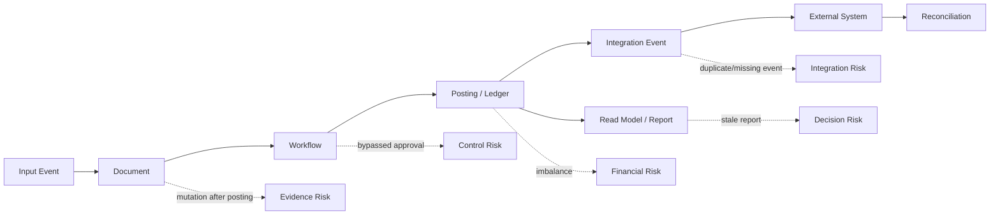
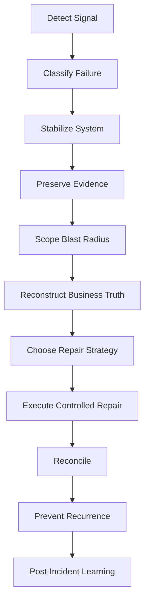
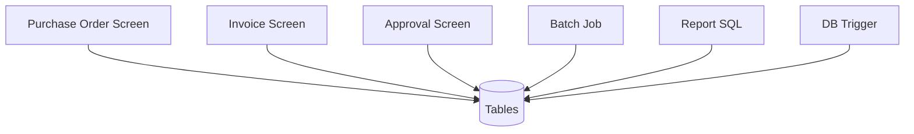
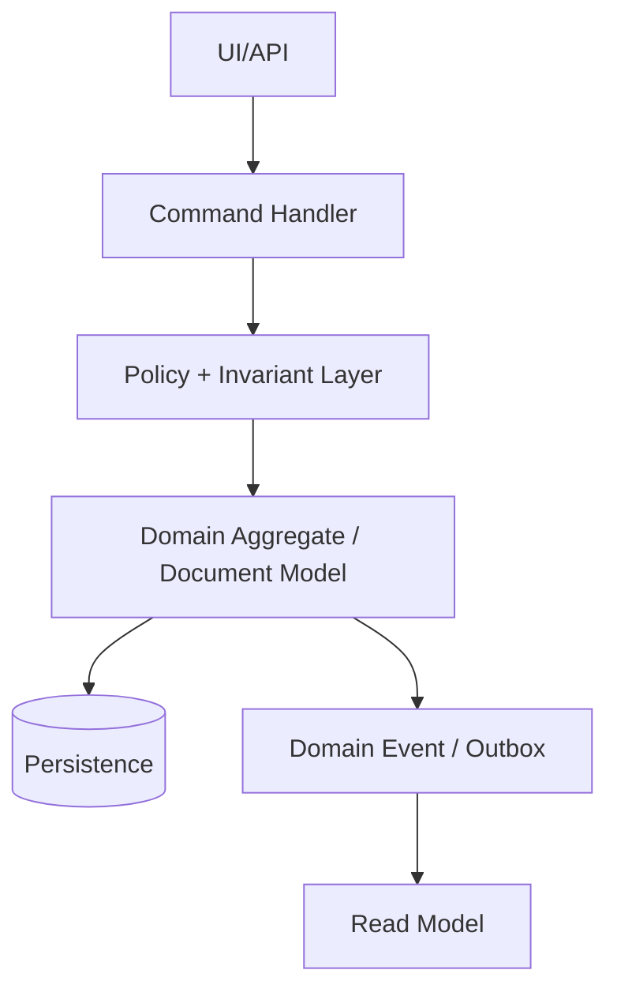
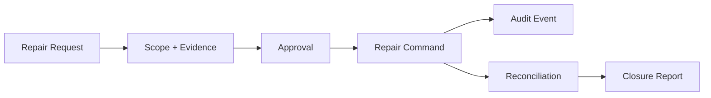
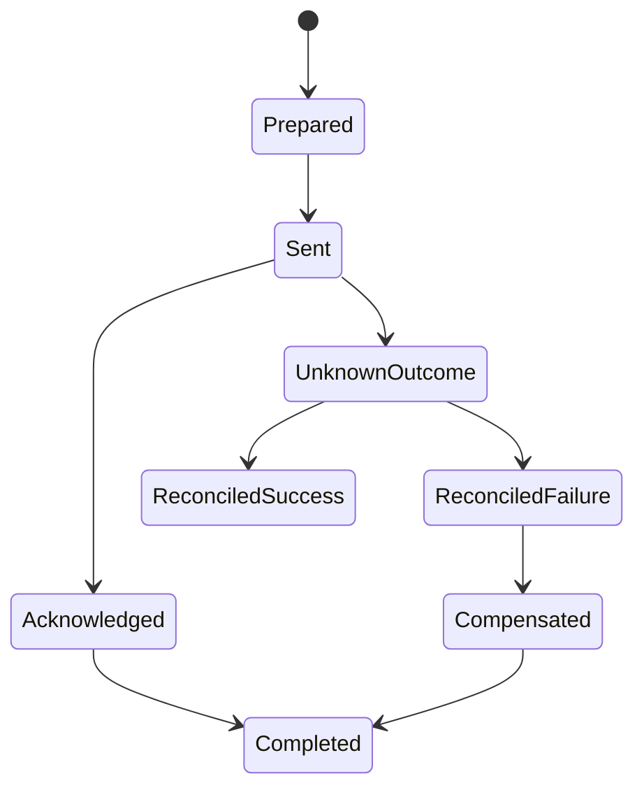
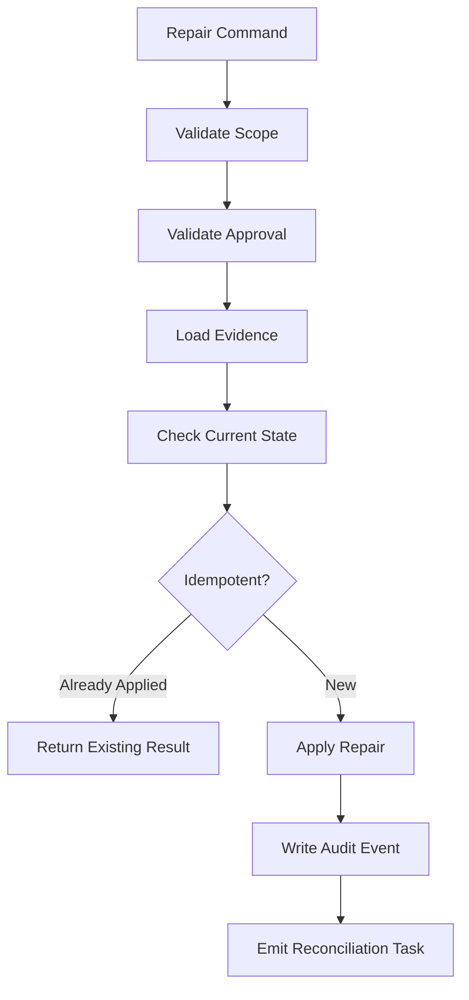

# Anti-Patterns, Failure Modes, and Rescue Playbooks

Large-scale ERP systems rarely fail because one controller, one query, or one service class is badly written. They fail because the system loses control over the things ERP exists to protect: money, stock, entitlement, approval, period, identity, legal sequence, and evidence.

This part turns the previous 32 parts into a failure-oriented review model. The goal is not to memorize a list of mistakes. The goal is to recognize failure shape early, isolate blast radius, preserve evidence, repair business truth safely, and prevent recurrence.

A top-tier ERP engineer must be able to answer:

- What invariant was broken?
- Which ledger, document, workflow, integration, or report became untrusted?
- Is the issue local, cross-module, cross-tenant, or cross-system?
- Can we reverse, compensate, replay, recalculate, or only disclose and correct?
- What evidence must be preserved before any repair is attempted?
- What guardrail was missing: model, constraint, workflow, test, metric, permission, runbook, or ownership?

## 1. Kaufman Framing: Deconstruct ERP Failure Skill

Josh Kaufman's method is useful here because rescue skill is not a single skill. It is a bundle of sub-skills that must be practiced deliberately.

| Kaufman principle | Applied to ERP rescue |
|---|---|
| Deconstruct the skill | Split failure into domain invariant, data integrity, transaction, workflow, integration, reporting, security, operation, and organization. |
| Learn enough to self-correct | Build diagnostic lenses: duplicate, missing, stale, unauthorized, inconsistent, unreconciled, untraceable, unbounded. |
| Remove practice barriers | Use playbooks, invariant catalogues, golden datasets, replay tools, repair command templates, and audit evidence templates. |
| Practice deliberately | Simulate failures: duplicate invoice, stuck workflow, stock mismatch, broken posting, bad migration, tenant leakage. |
| Feedback loop | Every incident becomes a missing guardrail story: what should have prevented, detected, isolated, or repaired it? |

The most important shift is this:

> Do not debug ERP by starting from stack traces. Start from broken business truth.

Stack traces explain implementation failure. ERP rescue requires truth reconstruction.

## 2. ERP Failure Mental Model

An ERP system is a web of controlled facts. Some facts are mutable, some are versioned, and some are effectively immutable after posting or legal publication.

A failure becomes dangerous when it crosses one of these boundaries:



A defect in a small upstream object can become a financial, operational, legal, or customer-impacting incident if downstream facts have already been published.

### 2.1 Failure Is Usually Invariant Debt

A normal technical defect says:

> The system did not do what the code intended.

An ERP failure often says:

> The code allowed a state the business must not be able to defend.

Examples:

| Symptom | Likely broken invariant |
|---|---|
| Invoice posted twice | Same source business event must not create two financial obligations. |
| Stock on hand negative unexpectedly | Available stock must respect reservation, issue, receiving, and adjustment policy. |
| Approval skipped | A controlled action must have valid authority evidence. |
| GL out of balance | Every posted journal must satisfy debit equals credit per currency and ledger. |
| Report differs from subledger | Certified report must be derived from a known snapshot and reconciliation rule. |
| Customer sees another tenant's data | Every data access must be constrained by tenant/security scope. |
| Period-close reopened silently | Period status transitions must be explicit, approved, and auditable. |
| Legal invoice number missing | Legal numbering must follow jurisdiction policy and preserve evidence for gaps. |

### 2.2 Failure Classification

Classify failures before fixing them.

| Class | Description | Typical repair |
|---|---|---|
| Data defect | Invalid or inconsistent persisted state. | Correction command, reversal, migration patch, reconciliation. |
| Domain defect | Business model allowed impossible state. | Model redesign, invariant enforcement, state transition hardening. |
| Transaction defect | Partial commit, race, duplicate, lost update. | Idempotency, lock, constraint, retry redesign, compensation. |
| Workflow defect | Approval/task/escalation/control failure. | State repair, task regeneration, evidence patch, control redesign. |
| Integration defect | Missing, duplicate, stale, unordered, or unauthorized cross-system message. | Replay, dedupe, reconciliation, contract correction. |
| Reporting defect | Report is stale, inconsistent, unreconciled, or unauthorized. | Snapshot rebuild, certification, lineage, access correction. |
| Security/control defect | Unauthorized action or insufficient evidence. | Containment, access revocation, audit investigation, SoD correction. |
| Operational defect | Job, queue, cache, deployment, configuration, or resource failure. | Rollback, drain, pause, restart with checkpoint, capacity fix. |
| Organizational defect | Ownership, process, requirement, or governance gap. | RACI correction, review gate, change control, playbook ownership. |

## 3. The Rescue Loop

Do not start by patching code. Start with a controlled rescue loop.



### 3.1 Stabilize First

Stabilization actions may include:

- pause a posting job;
- stop a specific integration route;
- freeze a tenant or company scope;
- disable a risky feature flag;
- block a dangerous workflow transition;
- switch a downstream export to hold mode;
- prevent new documents from entering the affected lifecycle;
- move messages to quarantine instead of dropping them;
- capture database snapshots or logical exports for evidence.

The wrong stabilization is worse than no stabilization. Example: deleting failed outbox rows may hide duplicate payment risk. Re-running a posting job without dedupe may multiply the incident.

### 3.2 Preserve Evidence Before Repair

Before repair, capture:

- affected document IDs and business numbers;
- current lifecycle state;
- audit events;
- actor, role, tenant, organization scope;
- correlation IDs and integration message IDs;
- database transaction timestamps if available;
- version numbers and optimistic lock revisions;
- outbox/inbox status;
- report snapshot IDs;
- configuration versions;
- deployment version;
- feature flag state;
- relevant external acknowledgements.

A repair that destroys evidence may solve today's defect while creating tomorrow's audit failure.

### 3.3 Reconstruct Business Truth

ERP rescue is often not about restoring database consistency. It is about reconstructing the intended business state.

For every affected object, answer:

| Question | Why it matters |
|---|---|
| What was the initiating business event? | Identifies idempotency and source-of-truth boundary. |
| What was accepted by the user/system? | Determines obligation and evidence. |
| What was approved? | Determines authority. |
| What was posted? | Determines financial truth. |
| What was externally communicated? | Determines downstream obligations. |
| What was reported? | Determines decision/audit impact. |
| What can be reversed legally? | Determines correction strategy. |
| What must be disclosed or documented? | Determines defensibility. |

## 4. Anti-Pattern Catalogue

The following anti-patterns are common in ERP systems that grow organically without strong domain and platform governance.

Each anti-pattern has four parts:

- **shape**: what it looks like;
- **damage**: what it breaks;
- **early signal**: how to detect it before disaster;
- **rescue**: what to do.

## 5. Anti-Pattern: CRUD ERP

### Shape

Every screen maps directly to tables. Business behavior is scattered across controllers, UI validations, database triggers, batch jobs, and report queries.



### Damage

CRUD ERP has no single place where invariants live. It becomes hard to answer:

- Who is allowed to move a document from submitted to approved?
- Which state transitions are legal?
- Which operations produce ledger entries?
- Which tables define business truth?
- Which writes are commands and which are incidental updates?

### Early Signals

- Controllers contain `if status == ...` business rules.
- Reports duplicate calculation rules.
- Stored procedures, UI code, and Java services disagree.
- Database tables expose states that cannot be explained by lifecycle diagrams.
- A document can be edited after approval because the UI hides a field but the API still accepts it.

### Rescue

1. Identify critical documents: invoice, payment, stock movement, journal, PO, SO, work order.
2. Define lifecycle state machine for each document.
3. Move business transitions behind command handlers.
4. Make posted/approved fields immutable except through explicit correction commands.
5. Add invariant tests around lifecycle transitions.
6. Gradually deprecate direct table mutation paths.

### Better Shape



## 6. Anti-Pattern: God ERP Core

### Shape

A single core module owns everything: customer, item, pricing, invoice, stock, ledger, tax, approval, reports, integration, customization, and tenant logic.

### Damage

- Every change has unknown blast radius.
- Teams cannot own capabilities independently.
- Release trains become slow and political.
- Regression packs become huge but still miss domain edge cases.
- The core becomes untestable and unreplaceable.

### Early Signals

- One module has most of the domain classes.
- Most services depend on `CommonService`, `DocumentService`, `ValidationService`, or `UtilityManager`.
- New feature work requires touching unrelated modules.
- No capability map exists.
- Architecture diagrams show layers but not business ownership.

### Rescue

Use a **strangler by capability**, not by table.

1. Build a capability map.
2. Identify high-change and high-risk areas.
3. Extract policies first, not data first.
4. Introduce explicit interfaces between capabilities.
5. Add anti-corruption layers around legacy core.
6. Move reports/read models after write ownership is clear.

## 7. Anti-Pattern: Mutable Posted Document

### Shape

A posted invoice, journal, stock movement, or payment can still be updated directly.

### Damage

- Audit evidence is compromised.
- Reports become non-reproducible.
- External systems may have seen an older version.
- Legal numbering may no longer match document content.
- Reconciliation becomes impossible.

### Early Signals

- `UPDATE invoice SET amount = ... WHERE status = 'POSTED'` appears in support scripts.
- UI has edit button on posted documents.
- Audit log only stores latest value.
- No reversal or credit-note model.
- Reports use current mutable rows, not posted facts.

### Rescue

- Freeze posted facts.
- Introduce reversal, correction, adjustment, credit note, or amendment documents.
- Store previous and corrected values in evidence payloads.
- Add database-level guardrails where appropriate.
- Add operational repair workflow requiring approval.

Example guard:

```java
public void assertEditable(Document document) {
    if (document.status().isPostedTerminal()) {
        throw new BusinessRuleViolation(
            "POSTED_DOCUMENT_IMMUTABLE",
            "Posted document cannot be edited. Use reversal or correction workflow."
        );
    }
}
```

For critical tables, application-level checks should be backed by database constraints, triggers, row-level policies, or append-only table design where appropriate.

## 8. Anti-Pattern: Silent Manual Repair

### Shape

Production data is patched manually without command, approval, reason code, audit event, or reconciliation.

### Damage

Silent repair may fix one row and destroy trust in the whole system.

### Early Signals

- Support team has common SQL scripts for production fixes.
- Incident tickets say "fixed in DB" without explaining business consequence.
- Repair does not create audit event.
- Repair bypasses posting/reconciliation.
- No repair command catalogue exists.

### Rescue

Turn production repair into a governed domain operation.



Repair command shape:

```java
public record RepairCommand(
    String repairId,
    String incidentId,
    String tenantId,
    String reasonCode,
    String requestedBy,
    String approvedBy,
    String targetType,
    String targetId,
    String evidenceReference,
    Map<String, Object> parameters
) {}
```

A repair command must be:

- idempotent;
- auditable;
- scoped;
- approved;
- reversible where possible;
- reconciled after execution;
- linked to incident and evidence.

## 9. Anti-Pattern: Distributed Transaction Fantasy

### Shape

The architecture assumes cross-service, cross-database, or cross-external-system operations behave like one local transaction.

### Damage

ERP systems become inconsistent under normal network failures.

Examples:

- invoice posted but integration event not sent;
- payment sent to bank but ERP transaction rolled back;
- stock deducted but shipment label failed;
- customer credit exposure updated but sales order submission failed;
- external tax service calculated tax but ERP later changed line items.

### Early Signals

- Requirements say "must be atomic across ERP and bank" without reconciliation design.
- Code performs remote API calls inside database transaction.
- Retry logic is hidden in HTTP client configuration.
- There is no outbox/inbox ledger.
- Unknown outcomes are treated as failures instead of explicit states.

### Rescue

Model effective-once business outcomes:



Required design:

- local transaction persists intent;
- outbox publishes intent;
- receiver uses inbox/dedupe;
- external acknowledgement is stored;
- unknown outcome is a first-class state;
- reconciliation decides final business outcome.

## 10. Anti-Pattern: Reporting on Hot OLTP Truth

### Shape

Heavy reports, exports, analytics, and dashboards query transactional tables directly.

### Damage

- OLTP performance collapses during month-end/report bursts.
- Reports see half-updated business processes.
- Business users export inconsistent snapshots.
- Query optimizations distort write model design.
- Security filters are inconsistently applied.

### Early Signals

- Report SQL joins many write tables across modules.
- Same query appears in BI, backend, and support tools.
- Month-end close slows normal transaction processing.
- Users request read replicas to solve a semantic problem.
- Reports lack certification timestamp and source snapshot.

### Rescue

- Build reporting plane and read models.
- Define report certification and freshness policy.
- Use projection checkpoints.
- Separate operational dashboards from certified financial reports.
- Add report access controls and export audit.
- Reconcile read models against ledger/source truth.

## 11. Anti-Pattern: Unbounded Customization

### Shape

Customers or implementation teams can add fields, scripts, rules, workflow changes, reports, and integrations without governed extension boundaries.

### Damage

- Upgrade path collapses.
- Performance becomes tenant-specific and unpredictable.
- Security and SoD are bypassed by custom scripts.
- Support cannot reproduce behavior.
- Reports differ per tenant without lineage.

### Early Signals

- Custom SQL embedded in tenant configuration.
- Plugins access core repositories directly.
- Script errors appear in critical posting path.
- Extension hooks lack versioned contracts.
- No compatibility test kit exists.

### Rescue

- Classify customization by risk level.
- Freeze unsafe extension surfaces.
- Introduce versioned extension contracts.
- Execute custom logic in controlled sandbox or constrained DSL.
- Require extension observability and test fixtures.
- Provide migration tooling for extension upgrades.

## 12. Anti-Pattern: Free-Text Reference Data

### Shape

Important business dimensions are captured as free text: country, tax code, unit of measure, currency, item category, payment term, reason code, warehouse, project, or cost center.

### Damage

- Duplicate and ambiguous reporting.
- Integration mapping failure.
- Incorrect tax/pricing/accounting behavior.
- Migration cleansing cost explodes.
- Security and approval scope cannot be enforced reliably.

### Early Signals

- UI has free text where a governed code should exist.
- Same reference value appears with spelling variants.
- Reports contain manual cleanup logic.
- External integrations map strings with case-insensitive heuristics.
- Configuration refers to labels rather than stable codes.

### Rescue

- Introduce governed reference data tables.
- Map legacy free text to canonical codes.
- Use effective dating and lifecycle status.
- Add ownership and approval workflow.
- Add compatibility aliases for migration period.
- Block new free-text creation in controlled fields.

## 13. Anti-Pattern: Shadow Calculation Logic

### Shape

Pricing, tax, discount, margin, stock availability, or financial balance is calculated differently in UI, backend, report, integration, and batch jobs.

### Damage

- Users see one total; invoice posts another.
- Quote and order diverge.
- Credit note cannot reproduce original invoice calculation.
- Report totals differ from ledger.
- External tax/payment systems receive inconsistent data.

### Early Signals

- JavaScript frontend has business math duplicated from Java service.
- SQL report recalculates invoice totals.
- Batch job has its own rounding logic.
- Tax calculation cannot produce trace.
- No calculation version is stored.

### Rescue

- Create a single calculation service/library per domain.
- Store calculation trace and rule version.
- Make report read stored calculation facts, not recalculate.
- Add golden calculation tests.
- Recalculate only through governed recalculation command.

## 14. Anti-Pattern: Workflow as Email

### Shape

Approval, delegation, escalation, or exception handling is implemented through email notifications without durable tasks and state.

### Damage

- Approval evidence is incomplete.
- SLA cannot be measured.
- Reassignment is manual.
- Users approve stale or changed documents.
- Controls are bypassed when emails are forwarded.

### Early Signals

- Approval action is a link with weak context.
- No task table exists.
- Reminder job is the workflow engine.
- Approval can be performed after document changes without revalidation.
- There is no task lifecycle state machine.

### Rescue

- Introduce durable workflow/task model.
- Bind task to document version.
- Revalidate authority and document fingerprint at approval time.
- Capture approval evidence.
- Model escalation/delegation as state transitions.
- Email becomes notification only, not source of workflow truth.

## 15. Anti-Pattern: Tenant Scope by Convention

### Shape

Developers remember to add `tenant_id = ?` manually in queries.

### Damage

Tenant leakage is one of the most severe ERP failures. It can expose financial, employee, customer, supplier, or pricing data.

### Early Signals

- Security relies on service method naming conventions.
- Raw SQL appears in reports and support tools.
- Tenant filtering is inconsistent across repositories.
- Background jobs process multiple tenants without explicit scope guard.
- Caches are not tenant-keyed.

### Rescue

- Make tenant scope mandatory in request context.
- Enforce tenant filtering at repository, ORM, database, and cache key levels.
- Add tenant-leak tests.
- Add production canaries for cross-tenant result detection.
- Audit all export/report paths.

Example scope guard:

```java
public final class TenantScope {
    private final String tenantId;

    public TenantScope(String tenantId) {
        if (tenantId == null || tenantId.isBlank()) {
            throw new IllegalArgumentException("tenantId is required");
        }
        this.tenantId = tenantId;
    }

    public String tenantId() {
        return tenantId;
    }
}
```

Avoid passing raw strings everywhere. Make scope explicit and hard to ignore.

## 16. Anti-Pattern: Batch Without Checkpoint

### Shape

Long-running batch jobs process millions of rows without checkpoint, partitioning, idempotency, progress ledger, or restart semantics.

### Damage

- Failed jobs must restart from the beginning.
- Duplicate postings/imports happen on retry.
- Operators cannot see progress.
- Lock duration grows.
- Cutover windows become unpredictable.

### Early Signals

- Batch job only logs start/end.
- No per-chunk status exists.
- Retry depends on manual SQL cleanup.
- Job writes directly to final tables without staging.
- Job cannot be paused safely.

### Rescue

- Use chunk-oriented processing.
- Add checkpoint ledger.
- Make each chunk idempotent.
- Use staging and validation phases.
- Expose job progress and failure reason.
- Add restart tests.

## 17. Anti-Pattern: Cache as Truth

### Shape

Cached configuration, balance, availability, or permission result becomes treated as source of truth.

### Damage

- Users act on stale prices, tax, stock, or authorization.
- Cache invalidation bugs become financial/control defects.
- Report and transaction behavior diverge.
- Emergency configuration changes do not apply predictably.

### Early Signals

- Cache has no version in key.
- Cache invalidation is event-based but not reconciled.
- Critical operations do not verify freshness.
- Cache warmup is required for correctness.
- Production fixes involve clearing caches blindly.

### Rescue

- Include config/rule/version/effective-date in cache key.
- Define max staleness per use case.
- Revalidate before critical commit.
- Add cache observability.
- Make cache rebuild deterministic.

## 18. Anti-Pattern: Everything Is a Microservice

### Shape

The ERP is decomposed into many services before domain ownership, transaction boundaries, and invariants are clear.

### Damage

- Simple business transactions become distributed sagas.
- Debugging requires tracing many services.
- Data duplication grows uncontrolled.
- Reporting becomes a distributed consistency problem.
- Teams ship APIs before understanding domain boundaries.

### Early Signals

- Services map to database tables or UI screens.
- Every service owns a tiny fragment of one business transaction.
- Cross-service synchronous calls are common inside write paths.
- Local development is painful.
- There is no capability map.

### Rescue

- Collapse overly chatty services into modules or coarser capabilities.
- Use modular monolith for unclear domains.
- Split only where ownership, data, lifecycle, and integration contract are stable.
- Put cross-capability communication through events or explicit APIs.
- Measure coupling before splitting.

## 19. Anti-Pattern: Big-Bang Rewrite

### Shape

The legacy ERP is declared unfixable, and a full rewrite is started without incremental migration path.

### Damage

- Business behavior hidden in legacy system is rediscovered too late.
- Parallel run becomes expensive.
- Migration scope explodes.
- The new system misses edge cases.
- Users lose trust.

### Early Signals

- Rewrite plan is organized by screens, not capabilities.
- Legacy data semantics are undocumented.
- No strangler path exists.
- No reconciliation strategy exists.
- Migration is treated as final phase.

### Rescue

- Start with capability map and failure hotspots.
- Build anti-corruption layer.
- Extract read models first where safe.
- Extract write capability only when invariants are understood.
- Use parallel run and reconciliation.
- Retire legacy slices gradually.

## 20. Failure Mode Matrix

| Failure mode | Detection signal | Immediate containment | Repair pattern | Prevention |
|---|---|---|---|---|
| Duplicate invoice | Same source event creates multiple invoices | Hold payment/export | Reverse duplicate or mark duplicate with evidence | Idempotency key + unique constraint |
| Missing GL posting | Subledger document posted but no journal | Pause financial close | Repost from accounting event | Posting ledger + reconciliation job |
| Imbalanced journal | Debit != credit | Block posting | Void draft or corrective journal | Posting invariant at command + DB level |
| Stock mismatch | Ledger sum != projected balance | Freeze affected SKU/location | Rebuild projection, investigate movement | Immutable stock ledger + projection checkpoint |
| Stuck approval | Task SLA exceeded or no assignee | Reassign/escalate | Regenerate task with evidence | Durable workflow + assignment rules |
| Wrong tax | Invoice tax differs from rule version | Hold invoice/export | Credit/rebill or adjustment | Calculation trace + rule version |
| Period close race | Posting after close started | Hold period close | Reverse/adjust or move to next period | Period lock guard + posting fence |
| Tenant data leak | Query result contains foreign tenant | Disable affected route/report | Notify/investigate/correct | Mandatory tenant scope + tests |
| Failed migration | Import count/reconciliation mismatch | Stop cutover | Rollback or scoped reload | Staging validation + dry run |
| Report inconsistency | Report differs from source ledger | Mark uncertified | Rebuild snapshot/projection | Certified snapshot + lineage |

## 21. Rescue Playbook Template

Every serious ERP failure should have a playbook in this form.

```mdx
## Playbook: <Failure Name>

### Trigger
What alert, report, user complaint, reconciliation failure, or audit finding starts this playbook?

### Severity
What determines Sev1/Sev2/Sev3?

### Scope
Which tenant/company/period/document/customer/vendor/item/location/integration is affected?

### Stabilization
What must be paused, frozen, quarantined, or switched to manual control?

### Evidence
Which records, logs, traces, events, configs, and external acknowledgements must be preserved?

### Diagnosis
Which invariant likely failed?

### Repair Options
Reverse, compensate, replay, rebuild projection, regenerate task, reload import, or disclose.

### Approval
Who can authorize the repair?

### Execution
Which command/tool/runbook step performs the repair?

### Reconciliation
How do we prove the system is trusted again?

### Prevention
Which guardrail must be added?
```

## 22. Playbook: Duplicate Invoice

### Trigger

- Vendor reports duplicate invoice.
- AP aging shows duplicate obligation.
- Unique vendor invoice reference alert fires.
- Payment proposal contains duplicate invoice.
- Reconciliation finds duplicate source event.

### Stabilization

- Hold payment proposal for affected vendor/company.
- Pause invoice export if external AP system exists.
- Quarantine further messages with same source event or vendor invoice reference.

### Evidence

Capture:

- invoice IDs and legal numbers;
- source PO/GRN/service acceptance;
- vendor invoice reference;
- source integration message ID;
- idempotency key;
- creation actor/system;
- approval events;
- posting journals;
- payment status.

### Diagnosis

Common causes:

- missing unique constraint on source event;
- retry created new invoice ID;
- vendor reference normalization mismatch;
- importer reprocessed file without dedupe;
- manual duplicate creation bypassed policy;
- idempotency key not scoped correctly.

### Repair

If duplicate is unapproved/unposted:

- cancel duplicate with reason code.

If duplicate is posted but unpaid:

- reverse duplicate accounting entry;
- mark duplicate as void/cancelled where legally allowed;
- preserve numbering gap evidence if needed.

If duplicate is paid:

- create recovery process: vendor credit, refund, offset, or adjustment;
- reconcile AP and cash.

### Prevention

- Unique constraint on `(tenant_id, company_id, vendor_id, normalized_invoice_reference)` where business policy permits.
- Idempotency key on import/source event.
- Duplicate detection workflow.
- Payment proposal duplicate guard.

## 23. Playbook: Missing GL Posting

### Trigger

- Subledger posted status but no journal.
- GL reconciliation mismatch.
- Close process detects unposted accounting events.

### Stabilization

- Block period close for affected company/period.
- Hold financial statements.
- Prevent manual journal workaround until root cause known.

### Evidence

- source document;
- accounting event;
- posting request;
- outbox record;
- posting attempt logs;
- error message;
- transaction timestamp;
- configuration/rule version.

### Diagnosis

Common causes:

- source document status changed before journal creation;
- posting job failed after marking document posted;
- transaction boundary split incorrectly;
- outbox event missing;
- journal validation failed silently;
- retry skipped due to wrong status.

### Repair

Preferred repair is **repost from immutable accounting event**, not reconstruct from mutable source document.

```java
public interface PostingRepairService {
    RepairResult repostMissingJournal(
        String incidentId,
        String accountingEventId,
        String approvedBy
    );
}
```

If source data changed after original event, use the original event snapshot.

### Prevention

- Source document status and accounting event creation in one local transaction.
- Posting request ledger.
- Reconciliation job: posted subledger vs GL journal.
- No silent failure in posting worker.

## 24. Playbook: Stock Balance Mismatch

### Trigger

- Stock ledger sum differs from balance projection.
- Warehouse count differs from system quantity.
- Pick fails despite reported availability.
- Negative stock appears unexpectedly.

### Stabilization

- Freeze SKU/location/bin where necessary.
- Pause allocation for affected item/location.
- Continue unrelated stock operations if scope is isolated.

### Evidence

- item/SKU;
- warehouse/location/bin;
- lot/serial;
- stock movements;
- reservation/allocation/pick records;
- projection checkpoint;
- cycle count records;
- integration events from WMS/MES.

### Diagnosis

Common causes:

- movement posted without projection update;
- projection update duplicated;
- reservation race;
- WMS event replayed;
- unit-of-measure conversion error;
- manual adjustment bypassed ledger;
- lot/serial state mismatch.

### Repair

1. Recompute projection from immutable stock ledger.
2. Compare with physical count if needed.
3. If ledger is correct but projection wrong, rebuild projection.
4. If physical reality differs from ledger, create approved stock adjustment.
5. Reopen allocation only after reconciliation.

### Prevention

- Immutable stock movement ledger.
- Idempotent WMS event processing.
- Projection checkpoint and rebuild tool.
- Reservation contention tests.
- UOM conversion golden tests.

## 25. Playbook: Stuck Approval

### Trigger

- SLA breach.
- No eligible approver.
- Task assigned to inactive user.
- Delegation expired.
- Document changed after task creation.

### Stabilization

- Prevent auto-approval fallback.
- Keep document in current controlled state.
- Notify workflow owner.

### Evidence

- workflow instance;
- task ID;
- document version/fingerprint;
- assignment rule;
- approver candidates;
- delegation records;
- escalation history;
- configuration version.

### Diagnosis

Common causes:

- approval matrix incomplete;
- organization hierarchy changed;
- cost center owner inactive;
- amount threshold rule misconfigured;
- task generator failed;
- document mutation invalidated task.

### Repair

- Regenerate task against current document version.
- Reassign with approved reason if candidate rule is broken.
- If document changed, require resubmission.
- Add exception case for governance review.

### Prevention

- Approval matrix validation.
- Daily control report for orphan tasks.
- Assignment dry-run before workflow publication.
- Effective-dated org hierarchy checks.

## 26. Playbook: Wrong Price or Tax on Posted Invoice

### Trigger

- Customer disputes amount.
- Tax report mismatch.
- Invoice trace references wrong rule version.
- Credit note calculation cannot match original invoice.

### Stabilization

- Hold invoice dispatch or tax filing if within window.
- Freeze affected rule version.
- Identify all documents calculated with same rule/config version.

### Evidence

- invoice calculation trace;
- price/tax rule versions;
- customer/vendor/item/location context;
- override approvals;
- rounding details;
- external tax service request/response;
- posting journal.

### Diagnosis

Common causes:

- wrong effective date;
- rule publication without approval;
- frontend/backend calculation mismatch;
- rounding applied at wrong level;
- tax jurisdiction mapping error;
- override bypassed margin/tax guard.

### Repair

- If unposted, recalculate and require approval.
- If posted/sent, issue credit note and corrected invoice where legally appropriate.
- If financial adjustment only, create adjustment with evidence.
- Reconcile tax, AR/AP, and reporting.

### Prevention

- Calculation trace stored with document.
- Rule version publication workflow.
- Golden tests for pricing/tax cases.
- Report reads stored facts, not recalculation.

## 27. Playbook: Failed Cutover

### Trigger

- Opening balances do not reconcile.
- Imported open documents mismatch legacy count/value.
- Master data duplicate rate exceeds threshold.
- Critical process fails in go-live smoke test.

### Stabilization

- Stop cutover clock.
- Preserve import staging and result ledgers.
- Decide continue/rollback using pre-agreed criteria.
- Prevent manual cleanup outside command center.

### Evidence

- migration batch IDs;
- source extract hashes;
- transformation mapping versions;
- validation errors;
- import result ledger;
- reconciliation reports;
- sign-off records.

### Diagnosis

Common causes:

- late source-system changes not captured;
- mapping rule changed after dry run;
- opening balance not aligned with open documents;
- master data dedupe unresolved;
- import is not idempotent;
- rollback plan not tested.

### Repair

- Reload affected scope only if idempotency supports it.
- Apply controlled correction commands.
- Re-run reconciliation.
- Use rollback/fallback criteria if trust cannot be restored.

### Prevention

- Multiple dry runs.
- Frozen mapping governance.
- Delta migration rehearsals.
- Automated reconciliation gates.
- Cutover command center with ownership.

## 28. Incident Command for ERP

Large ERP incidents need clear command structure.

| Role | Responsibility |
|---|---|
| Incident commander | Coordinates decision flow, severity, timeline, communication. |
| Domain lead | Owns business truth reconstruction. |
| Data lead | Owns data extraction, comparison, repair script review. |
| App lead | Owns application behavior, code defect, deployment. |
| Integration lead | Owns external system interaction and message replay. |
| Finance/control owner | Approves financial repair and close/reporting impact. |
| Security/compliance owner | Owns access, privacy, audit, disclosure requirements. |
| Support lead | Owns user communication and support queue. |

Avoid the common mistake of letting the person who can run SQL become the de facto incident commander. Technical access is not business authority.

## 29. Safe Repair Design

A safe repair tool must treat repair as a domain operation.



### 29.1 Repair Command Contract

```java
public record RepairResult(
    String repairId,
    String incidentId,
    String status,
    String targetType,
    String targetId,
    String beforeFingerprint,
    String afterFingerprint,
    List<String> reconciliationTaskIds,
    String auditEventId
) {}
```

### 29.2 Repair Guardrails

A repair command should reject execution if:

- tenant/company scope is missing;
- approval is missing or invalid;
- target state changed since evidence capture;
- period is closed and repair type is not allowed;
- repair would mutate posted facts directly;
- idempotency key collides with different payload;
- reconciliation cannot be scheduled;
- target belongs to another tenant/scope;
- actor lacks emergency repair privilege.

## 30. Production Data Repair Review Checklist

Before approving production repair, ask:

- Is this a domain repair or a technical cleanup?
- Which invariant is broken?
- What evidence proves the defect?
- What evidence proves the repair?
- Is there a safer reversal/adjustment document?
- Does the repair affect legal numbering?
- Does it affect financial statements, tax, inventory, or customer-visible documents?
- Does it affect external systems?
- Is the repair idempotent?
- Is the repair reversible?
- Is the repair scoped to tenant/company/period/document?
- Has reconciliation been defined?
- Does the repair create an audit event?
- Who signs off business correctness?
- What guardrail prevents recurrence?

## 31. Architecture Smell Review

Use this smell list during architecture review.

| Smell | What to inspect |
|---|---|
| Status field with no state machine | Lifecycle model, allowed transitions, guard logic. |
| `isDeleted`, `isCancelled`, `isPosted` combinations | Terminal state semantics and illegal combinations. |
| `Map<String,Object>` domain payload | Extension boundary and schema governance. |
| Direct SQL in support tooling | Repair governance and audit evidence. |
| UI-only validation | API/domain invariant enforcement. |
| Batch with no checkpoint | Restart/idempotency design. |
| Report query joins write tables directly | Reporting plane and read model strategy. |
| Cross-service call in local transaction | Unknown outcome and outbox design. |
| Tenant ID passed as optional argument | Scope enforcement. |
| Calculation repeated in SQL/JS/Java | Calculation trace and single engine. |
| Manual approval override | SoD, evidence, and emergency governance. |
| Feature flag changes business control | Config lifecycle and publication workflow. |

## 32. ERP Failure Questions for Senior Engineers

A senior engineer should be comfortable answering these under pressure:

1. Which business invariant did the incident violate?
2. Which facts are still trustworthy?
3. Which facts are derived and can be rebuilt?
4. Which facts are legally/audit significant and cannot be overwritten?
5. Which downstream systems saw the bad state?
6. Which reports were generated from the bad state?
7. Can the system be repaired through normal domain commands?
8. Does the repair need reversal, adjustment, credit, debit, or disclosure?
9. What is the minimal safe containment?
10. What control should have caught this earlier?

## 33. Design Principle: Recovery Is a Feature

Recovery is not an operational afterthought. In ERP, recovery is part of domain design.

A good ERP design includes:

- explicit lifecycle states;
- immutable ledgers;
- reversible business operations;
- idempotent imports/integrations;
- reconciliation jobs;
- exception queues;
- repair commands;
- audit evidence;
- operational dashboards;
- support-safe tooling;
- incident playbooks;
- invariant tests.

If you cannot explain how a business operation fails and recovers, you do not fully understand the operation.

## 34. Deliberate Practice

Use this 90-minute drill.

### Drill: Duplicate Posting Rescue

Scenario:

- Two AP invoices were created from the same vendor invoice file.
- Both were approved.
- One was paid.
- Both created GL entries.
- The AP aging report included both.

Tasks:

1. Classify the failure.
2. Define containment.
3. List evidence to capture.
4. Identify broken invariant.
5. Choose repair path for unpaid duplicate.
6. Choose repair path for paid duplicate.
7. Define reconciliation checks.
8. Define recurrence prevention.
9. Write a repair command contract.
10. Write three invariant tests.

Expected answer shape:

- business truth reconstruction;
- source event dedupe analysis;
- payment impact analysis;
- journal reversal or credit/recovery flow;
- AP/GL/cash reconciliation;
- idempotency and unique constraint fix;
- duplicate detection in payment proposal.

## 35. Source Notes

This part builds on stable architecture and engineering references used throughout the series:

- Jakarta EE Platform 11 defines the standard platform for Jakarta enterprise applications and includes modern platform capabilities such as Records support, virtual-thread awareness, and Jakarta Data.
- Spring Boot 4.1 requires Java 17+ and is compatible up to Java 26, making it a relevant baseline for modern Java ERP service development.
- OpenTelemetry Java documents instrumentation for metrics, logs, and traces, which is essential for ERP incident investigation and supportability.
- Apache OFBiz is a Java-based ERP/business application suite and remains a useful reference for ERP capability breadth and extensible architecture.

Primary references:

- https://jakarta.ee/specifications/platform/11/
- https://docs.spring.io/spring-boot/system-requirements.html
- https://opentelemetry.io/docs/languages/java/
- https://ofbiz.apache.org/

## 36. Closing Thought

An average engineer fixes a bug.

A strong ERP engineer repairs truth, preserves evidence, restores trust, and installs the missing guardrail.

That is the difference between application maintenance and enterprise systems engineering.
