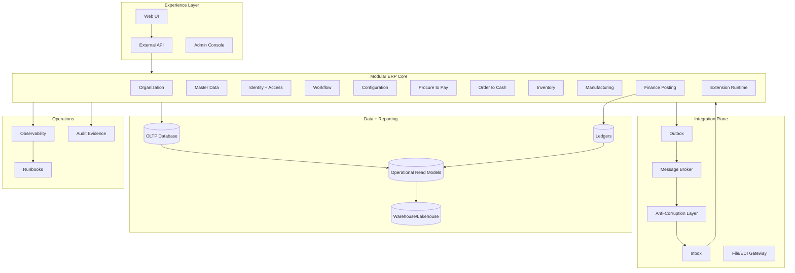
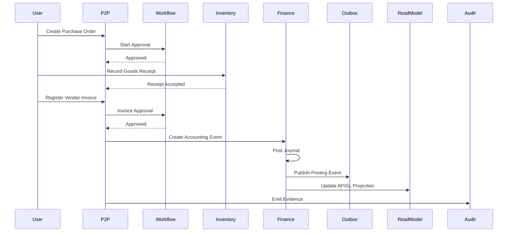
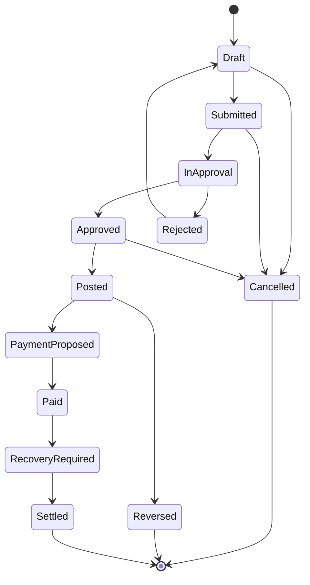
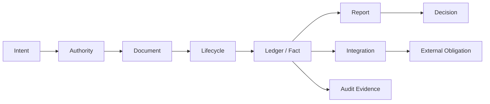

# Capstone Architecture Review and 20-Hour Practice Plan

This is the final part of the series.

The purpose is to convert the previous 33 parts into practical engineering fluency. You should not finish this series with a folder of notes. You should finish with the ability to review, design, challenge, and rescue a large-scale ERP architecture.

The capstone is structured around Josh Kaufman's learning model:

1. Deconstruct the skill.
2. Learn enough to self-correct.
3. Remove barriers to practice.
4. Practice deliberately for at least 20 focused hours.
5. Use tight feedback loops.

You will build and review a realistic ERP slice, not a toy CRUD app.

## 1. Capstone Scenario

You are designing a Java-based ERP platform for a multi-country manufacturing and distribution company.

The company has:

- 12 legal entities;
- 38 branches;
- 7 warehouses;
- 4 manufacturing plants;
- 3 tax jurisdictions initially, with more expected;
- multi-currency operations;
- centralized procurement;
- distributed sales operations;
- intercompany transfers;
- approval thresholds by company, branch, cost center, amount, item category, and project;
- integrations with CRM, WMS, MES, bank, e-invoicing provider, external tax provider, and data warehouse;
- month-end close deadline of two business days;
- audit retention requirement;
- phased rollout by country;
- customer-specific customization but controlled upgrade path.

You need to design the ERP core for:

- organizational model;
- master data;
- procure-to-pay;
- order-to-cash;
- inventory/warehouse;
- manufacturing/MRP;
- general ledger and subledger posting;
- workflow/approval;
- configuration;
- integration;
- reporting;
- observability;
- migration/cutover;
- compliance/audit;
- extension platform.

## 2. Target Architecture at a Glance

The recommended starting point is a modular ERP core with explicit boundaries, not a premature microservice mesh.



This architecture is not a final answer. It is a starting hypothesis. Your job in the capstone is to test it against invariants, failure modes, governance, performance, rollout, and team ownership.

## 3. Skill Decomposition Map

Use this map to verify that you have covered the real ERP engineering skill, not just framework usage.

| Skill area | What you must be able to do |
|---|---|
| Domain modelling | Identify documents, ledgers, lifecycle states, commands, policies, and invariants. |
| Organization model | Model tenant, legal entity, branch, cost/profit center, operating unit, project, and security scope. |
| Master data | Govern party, item, UOM, tax, currency, chart of accounts, warehouse, location, reason code. |
| Finance | Design GL/subledger posting, period close, reversal, adjustment, reconciliation, and reporting. |
| Supply chain | Model procurement, inventory, warehouse, stock ledger, sales, fulfillment, manufacturing, MRP. |
| Workflow | Model approval, delegation, escalation, SLA, task lifecycle, evidence, and exception handling. |
| Configuration | Treat business configuration as governed, effective-dated, versioned domain data. |
| Integration | Design API/event/file/EDI/CDC flows with idempotency, outbox/inbox, replay, reconciliation. |
| Reporting | Separate OLTP from read models, certified reports, analytics, and export governance. |
| Performance | Characterize workloads, bottlenecks, batch, indexing, caching, read model, and close performance. |
| Concurrency | Protect stock, legal numbering, approval, posting, credit, period close, and reservation invariants. |
| Compliance | Preserve audit evidence, SoD, access trail, retention, privacy, investigation, defensibility. |
| Operations | Add observability, runbooks, admin tooling, incident command, repair commands, supportability. |
| Platform | Provide SDKs, scaffolding, golden paths, test harnesses, ADRs, and governance automation. |

## 4. Required Architectural Decisions

Before writing implementation code, produce architecture decision records for these topics.

### 4.1 Deployment Shape

Choose one:

| Option | When it fits | Risk |
|---|---|---|
| Modular monolith | Domain boundaries still evolving, strong transactional consistency needed, one product team/platform. | Can degrade into God core without module enforcement. |
| Coarse-grained services | Stable capability ownership, independent scaling/release needed. | Distributed consistency and reporting complexity. |
| Hybrid | Core transactional modules together; integration/reporting/workflow separated. | Requires discipline in boundary design. |

Recommended initial stance:

> Start as a modular ERP core with separate integration and reporting planes. Split services only when ownership, data, lifecycle, and failure semantics are stable.

### 4.2 Java Platform Baseline

A modern Java ERP baseline should assume Java 17+ minimum and prefer current LTS where organization policy permits. The ecosystem references used in this series align with that direction:

- Jakarta EE 11 targets Java SE 17+ and adds modern platform capabilities.
- Spring Boot 4.1 requires Java 17+ and is compatible with Java 26.
- OpenTelemetry Java provides standard instrumentation for metrics, logs, and traces.
- Apache OFBiz remains a useful Java ERP reference for breadth of business capabilities and extensibility concepts.

The decision is not "Spring or Jakarta" in the abstract. The real decision is:

- How will transaction boundaries be enforced?
- How will domain modules be isolated?
- How will integration intent be persisted?
- How will workflow state survive failures?
- How will audit evidence be preserved?
- How will teams extend behavior safely?

### 4.3 Data Ownership

Write a system-of-record matrix.

| Data | Owner | Consumers | Mutation rule |
|---|---|---|---|
| Legal entity | Organization module | All modules | Governed change with effective date. |
| Chart of accounts | Finance | Posting, reports, config | Governed versioned change. |
| Item master | Master data | Inventory, sales, purchase, manufacturing | Approved lifecycle. |
| Customer | Party/CRM boundary | O2C, finance, reporting | Ownership depends on landscape. |
| Vendor | Party/procurement | P2P, AP, payment | Approved lifecycle. |
| Stock ledger | Inventory | Finance, reporting, WMS | Append-only movement. |
| GL journal | Finance | Reporting, audit | Immutable after posting; corrections via journal/reversal. |
| Approval matrix | Workflow/config | All controlled modules | Effective-dated versioned config. |
| Tax rule | Pricing/tax config | O2C, P2P, reporting | Published rule version; trace required. |

## 5. Domain Invariant Catalogue

A capstone design is incomplete without explicit invariants.

| Domain | Invariant |
|---|---|
| Finance | Posted journal must balance by ledger, company, currency, and accounting period policy. |
| Finance | Closed period cannot accept normal postings. |
| P2P | Vendor invoice must not be paid unless approved, valid, and posted according to policy. |
| P2P | Same source/vendor invoice reference must not create duplicate payable obligation within defined scope. |
| O2C | Sales order must not be released if credit exposure exceeds policy without approval. |
| Inventory | Stock issue must be backed by available stock or an explicit negative-stock policy. |
| Inventory | Stock balance projection must reconcile to immutable stock ledger. |
| Manufacturing | Work order completion must consume/record materials and produce output according to routing/BOM policy. |
| Workflow | Approval must be performed by an actor with authority at document version being approved. |
| Configuration | Business config change must be versioned, approved, effective-dated, and auditable. |
| Integration | External command must have idempotency key and recorded outcome or unknown-outcome state. |
| Reporting | Certified report must identify source snapshot/checkpoint and freshness. |
| Multi-tenancy | Every read/write/export/cache key must be scoped by tenant and authorized organization scope. |
| Audit | Controlled business action must emit evidence with actor, authority, target, state, and reason. |

## 6. Capstone Artifact Set

At the end of the capstone, produce these artifacts.

| Artifact | Purpose |
|---|---|
| Capability map | Defines ERP module boundaries and ownership. |
| Context map | Shows relationships and integration boundaries. |
| State machine diagrams | Defines lifecycle for PO, invoice, stock movement, journal, work order. |
| Invariant catalogue | Defines non-negotiable correctness rules. |
| Data ownership matrix | Defines system of record and mutation authority. |
| Posting design | Shows subledger-to-GL flow and reconciliation. |
| Integration design | Shows outbox/inbox, replay, reconciliation, external systems. |
| Reporting design | Shows read models, certified reports, freshness, security. |
| Security/control model | Shows RBAC/ABAC, SoD, maker-checker, approval rights. |
| Migration plan | Shows staging, validation, opening balance, dry run, cutover. |
| Observability design | Shows metrics/logs/traces/business health signals. |
| Failure-mode matrix | Shows likely failures and playbooks. |
| Architecture decision records | Captures major trade-offs and reasons. |
| Practice implementation | A thin vertical slice demonstrating the design. |

## 7. Thin Vertical Slice

Build one slice deep enough to exercise the real architecture:

> Purchase requisition → purchase order → goods receipt → vendor invoice → approval → AP subledger → GL posting → report/read model → integration event → audit trail.

This slice touches:

- organization scope;
- master data;
- document lifecycle;
- workflow;
- posting;
- idempotency;
- read model;
- audit;
- observability;
- reconciliation;
- failure recovery.

### 7.1 Slice Diagram



### 7.2 Minimal Implementation Boundary

Do not implement the whole ERP. Implement enough to prove the architecture.

Required objects:

- `OrganizationScope`
- `Vendor`
- `Item`
- `PurchaseOrder`
- `GoodsReceipt`
- `VendorInvoice`
- `ApprovalTask`
- `AccountingEvent`
- `JournalEntry`
- `OutboxMessage`
- `AuditEvent`
- `ProjectionCheckpoint`

Required commands:

- `CreatePurchaseOrder`
- `SubmitPurchaseOrder`
- `ApprovePurchaseOrder`
- `RecordGoodsReceipt`
- `RegisterVendorInvoice`
- `ApproveVendorInvoice`
- `PostVendorInvoice`
- `ReverseVendorInvoicePosting`
- `ReplayOutboxMessage`
- `RebuildReadModelProjection`

Required invariants:

- PO cannot be approved by unauthorized actor.
- Invoice cannot be posted without approval.
- Invoice cannot be posted twice.
- Journal debit must equal credit.
- Posted invoice cannot be edited.
- Outbox message must be idempotent.
- Projection rebuild must produce same balance from ledger.
- Audit event must exist for controlled actions.

## 8. Architecture Review Questions

Use these questions in a real review.

### 8.1 Domain

- What is the document lifecycle?
- Which transitions are illegal?
- Which states are terminal?
- What is immutable after approval?
- What is immutable after posting?
- How are correction, reversal, cancellation, and amendment represented?
- Which facts are source-of-truth and which are projections?

### 8.2 Data

- Who owns each table/aggregate?
- Which writes are commands?
- Which writes are projections?
- Which data is effective-dated?
- Which data is tenant-scoped?
- Which identifiers are technical, business, or legal?
- Which data must be retained or archived?

### 8.3 Transaction

- What is the local transaction boundary?
- What is the business transaction boundary?
- What happens after partial failure?
- What is idempotent?
- What must be unique?
- What must be locked?
- What can be eventually consistent?

### 8.4 Workflow

- What creates tasks?
- What binds task to document version?
- How is authority checked?
- How is delegation handled?
- How is escalation handled?
- What evidence is stored?
- What happens if assignee becomes inactive?

### 8.5 Finance

- Which event creates accounting impact?
- Is posting derived from immutable event snapshot?
- How are subledger and GL reconciled?
- How are reversals represented?
- How does period close block late postings?
- How are adjustments approved?

### 8.6 Integration

- Which system owns the business fact?
- What is the contract?
- What is the idempotency key?
- What happens on timeout?
- How is unknown outcome reconciled?
- How are duplicates handled?
- How is replay controlled?

### 8.7 Reporting

- What is the report source?
- Is it certified or operational?
- What is its freshness guarantee?
- What is its security model?
- How is export audited?
- Can the report be reproduced for a past period?

### 8.8 Operations

- Which dashboards exist?
- Which alerts indicate broken business truth?
- Which repair tools exist?
- Which jobs are restartable?
- Which queues can be drained or quarantined?
- Which runbooks are tested?

## 9. Scoring Rubric

Use this rubric to evaluate your capstone.

| Dimension | Level 1 | Level 2 | Level 3 | Level 4 |
|---|---|---|---|---|
| Domain model | CRUD entities | Documents and services | Lifecycle + invariants | Defensible business truth model |
| Transaction design | `@Transactional` everywhere | Some boundaries | Idempotency + locks | Full failure/reconciliation model |
| Finance | Simple journal table | Posting service | Subledger + GL | Close/reversal/reconciliation ready |
| Workflow | Status + email | Task table | State machine + approval rules | Evidence, delegation, escalation, repair |
| Integration | REST calls | Events | Outbox/inbox | Replay, unknown outcome, reconciliation |
| Reporting | SQL on OLTP | Read replicas | Read models | Certified reports + lineage + security |
| Security | Roles | Scoped permissions | RBAC/ABAC + SoD | Evidence-backed controls and review |
| Operations | Logs | Metrics | Observability | Business health + runbooks + repair tools |
| Customization | Tenant hacks | Config fields | Extension points | Versioned contracts + compatibility tests |
| Migration | Import scripts | Staging | Validation/reconciliation | Dry run, cutover, rollback, command center |

A top 1% result is not the fanciest architecture. It is the architecture that preserves business truth under change, failure, scale, and audit pressure.

## 10. 20-Hour Deliberate Practice Plan

This plan assumes 10 sessions of 2 hours. You can compress or stretch it, but do not skip the feedback loops.

## Session 1: Capability Map and Scope Control

### Goal

Create a capability map for the capstone ERP.

### Output

- Capability map diagram.
- Module ownership table.
- Boundary notes.
- First ADR: modular monolith vs microservices vs hybrid.

### Practice

1. List all capabilities.
2. Group by business ownership, data ownership, and transaction coupling.
3. Mark volatile capabilities.
4. Mark high-risk capabilities.
5. Decide initial module boundaries.

### Self-Correction Questions

- Did you split by UI screens or business capability?
- Can each capability define its own invariants?
- Which boundaries are stable enough to become services?
- Which boundaries should remain modules?

## Session 2: Organization and Master Data

### Goal

Model tenant, legal entity, branch, warehouse, cost center, vendor, item, UOM, currency, tax, and chart of accounts.

### Output

- Organization hierarchy.
- Master data lifecycle.
- Reference data governance table.
- Effective-dating rules.

### Practice

1. Define organization scope object.
2. Define legal entity vs operating unit.
3. Define master data ownership.
4. Add effective dates and lifecycle states.
5. Define duplicate/merge policy for party and item.

### Self-Correction Questions

- Can every transaction identify its legal entity?
- Can security scope be derived safely?
- Can tax/accounting rules resolve from organization context?
- Can old transactions reproduce old master data meaning?

## Session 3: P2P Lifecycle and Invariants

### Goal

Design the procure-to-pay lifecycle.

### Output

- PO state machine.
- Goods receipt model.
- Vendor invoice state machine.
- P2P invariant catalogue.

### Practice

1. Model requisition/PO/GRN/invoice relationships.
2. Define matching rules.
3. Define approval points.
4. Define duplicate invoice guard.
5. Define correction/reversal paths.

### Self-Correction Questions

- Can invoice be registered before receipt?
- Can PO be changed after approval?
- What happens if receipt is reversed after invoice?
- How do you prevent duplicate vendor invoice?

## Session 4: Finance Posting and Reconciliation

### Goal

Design accounting event, journal, subledger, GL, and reconciliation.

### Output

- Posting pipeline diagram.
- Accounting event schema.
- Journal schema.
- Reconciliation checks.

### Practice

1. Define accounting event from vendor invoice.
2. Generate balanced journal.
3. Link journal to subledger.
4. Define period checks.
5. Define reversal and adjustment.

### Self-Correction Questions

- Is posting based on immutable snapshot?
- Can you repost safely?
- Can subledger reconcile to GL?
- Can closed period block late posting?

## Session 5: Workflow and Controls

### Goal

Design approval workflow with authority, SoD, delegation, escalation, and evidence.

### Output

- Approval matrix.
- Workflow state machine.
- Task schema.
- Audit event model.

### Practice

1. Define approval rules by company, cost center, amount.
2. Bind task to document version.
3. Add delegation and escalation.
4. Add SoD checks.
5. Add approval evidence payload.

### Self-Correction Questions

- Can requester approve own document?
- What if approver leaves the company?
- What if document changes after task creation?
- Can audit reconstruct who had authority at approval time?

## Session 6: Integration and Idempotency

### Goal

Design integration with WMS, bank, tax provider, CRM, and data warehouse.

### Output

- Integration landscape diagram.
- Outbox/inbox schema.
- Idempotency key design.
- Unknown outcome state machine.

### Practice

1. Identify system of record for each data flow.
2. Define contracts.
3. Add outbox and inbox.
4. Define retry/backoff.
5. Define reconciliation.

### Self-Correction Questions

- What happens on timeout?
- Can receiver process duplicate safely?
- Can sender replay safely?
- Can business user see stuck/unknown outcomes?

## Session 7: Reporting and Read Models

### Goal

Design operational and certified reporting.

### Output

- Read model architecture.
- Projection checkpoint model.
- Report catalogue.
- Security/export policy.

### Practice

1. Identify operational dashboards.
2. Identify certified financial reports.
3. Design projection rebuild.
4. Define freshness and certification.
5. Add report access control and export audit.

### Self-Correction Questions

- Which reports can be stale?
- Which reports must be reproducible?
- Can reports reconcile to ledger?
- Can exported data be traced?

## Session 8: Performance and Concurrency

### Goal

Model performance and concurrency risks.

### Output

- Workload taxonomy.
- Contention matrix.
- Locking/idempotency strategy.
- Load test plan.

### Practice

1. Identify peak workloads.
2. Model month-end close load.
3. Model stock reservation race.
4. Model invoice numbering race.
5. Define load and concurrency tests.

### Self-Correction Questions

- Which operations serialize by business key?
- Which operations use optimistic locking?
- Which operations require unique constraint?
- Which operations are safe to retry?

## Session 9: Migration, Compliance, and Operations

### Goal

Design cutover, audit, retention, observability, and supportability.

### Output

- Migration staging model.
- Cutover runbook.
- Audit evidence catalogue.
- Observability dashboard list.
- Repair playbook list.

### Practice

1. Define legacy extract/staging/import pipeline.
2. Define opening balance reconciliation.
3. Define audit events for controlled actions.
4. Define business metrics and alerts.
5. Define repair command governance.

### Self-Correction Questions

- Can migration be rerun safely?
- Can cutover rollback?
- Can audit reconstruct controlled decisions?
- Can operations detect business truth failures?

## Session 10: Architecture Review and Failure Simulation

### Goal

Review and harden the complete design.

### Output

- Final architecture review document.
- Failure-mode matrix.
- ADR set.
- Improvement backlog.
- Readiness score.

### Practice

Simulate these failures:

1. Duplicate vendor invoice.
2. Missing GL posting.
3. Stock projection mismatch.
4. Stuck approval.
5. Wrong tax rule published.
6. Failed WMS event replay.
7. Tenant data leak in report.
8. Cutover reconciliation mismatch.
9. Period close race.
10. Report generated from stale read model.

For each failure, write:

- detection signal;
- containment;
- evidence;
- repair;
- reconciliation;
- prevention.

## 11. Implementation Skeleton

A thin vertical slice can be implemented with this package shape.

```text
com.example.erp
  platform
    audit
    config
    idempotency
    outbox
    tenant
    workflow
    observability
  organization
  masterdata
  finance
    accountingevent
    journal
    period
    reconciliation
  procurement
    purchaseorder
    goodsreceipt
    vendorinvoice
  inventory
    stockledger
    reservation
  reporting
    projection
    reportcatalog
  integration
    wms
    bank
    tax
```

The package structure is not the architecture. The architecture is enforced by dependencies, ownership, command boundaries, tests, and runtime guardrails.

## 12. Example Command Handler Shape

```java
public final class PostVendorInvoiceHandler {
    private final VendorInvoiceRepository invoices;
    private final AccountingEventRepository accountingEvents;
    private final JournalPostingService journalPosting;
    private final IdempotencyService idempotency;
    private final AuditService audit;

    public PostVendorInvoiceResult handle(PostVendorInvoice command) {
        return idempotency.execute(
            command.idempotencyKey(),
            command.fingerprint(),
            () -> doPost(command)
        );
    }

    private PostVendorInvoiceResult doPost(PostVendorInvoice command) {
        VendorInvoice invoice = invoices.getForUpdate(command.invoiceId());

        invoice.assertApproved();
        invoice.assertNotPosted();
        invoice.assertWithinOpenPeriod(command.accountingDate());

        AccountingEvent event = AccountingEvent.fromApprovedInvoice(invoice.snapshot());
        accountingEvents.save(event);

        JournalEntry journal = journalPosting.post(event);

        invoice.markPosted(journal.id());
        invoices.save(invoice);

        audit.record(AuditEvent.controlledAction(
            command.actor(),
            "POST_VENDOR_INVOICE",
            invoice.id(),
            Map.of("journalId", journal.id(), "accountingEventId", event.id())
        ));

        return new PostVendorInvoiceResult(invoice.id(), journal.id(), event.id());
    }
}
```

This is not production-complete code. It illustrates the shape:

- command boundary;
- idempotency;
- lock or concurrency control;
- domain invariant checks;
- immutable accounting event;
- posting service;
- state transition;
- audit evidence.

## 13. Example State Machine: Vendor Invoice



Review questions:

- Is `Paid` reversible? Usually not directly; it requires refund, vendor credit, offset, or recovery.
- Can `Approved` be edited? Usually no; change requires rework/resubmission.
- Can `Posted` be cancelled? Usually no; use reversal/credit/adjustment depending on legal context.
- Is `PaymentProposed` committed? It depends on payment run design and bank integration state.

## 14. Example Invariant Tests

```java
@Test
void approvedInvoiceCannotBePostedTwice() {
    var invoice = fixture.approvedVendorInvoice();

    posting.post(new PostVendorInvoice(invoice.id(), actor, key("post-1")));

    assertThatThrownBy(() ->
        posting.post(new PostVendorInvoice(invoice.id(), actor, key("post-2")))
    ).isInstanceOf(BusinessRuleViolation.class)
     .hasMessageContaining("already posted");
}

@Test
void journalMustBalance() {
    var event = fixture.accountingEventWithUnbalancedLines();

    assertThatThrownBy(() -> journalPosting.post(event))
        .isInstanceOf(BusinessRuleViolation.class)
        .hasMessageContaining("debit must equal credit");
}

@Test
void requesterCannotApproveOwnInvoiceWhenSoDPolicyApplies() {
    var invoice = fixture.submittedInvoiceBy("alice");

    assertThatThrownBy(() -> workflow.approve(invoice.taskId(), actor("alice")))
        .isInstanceOf(AuthorizationViolation.class)
        .hasMessageContaining("segregation of duties");
}
```

These tests are intentionally business-readable. ERP tests should read like control evidence, not only unit-level implementation checks.

## 15. Final Architecture Review Template

Use this structure for your capstone document.

```mdx
# ERP Architecture Review

## 1. Executive Summary
What system is being built, for whom, and what risks dominate?

## 2. Business Capability Map
Which domains exist and who owns them?

## 3. Architecture Overview
What is the deployment/module/data/integration shape?

## 4. Domain Lifecycles
What documents and state machines exist?

## 5. Invariants
What cannot be violated?

## 6. Data Ownership
Which module owns which facts?

## 7. Transaction and Consistency Model
What is local, distributed, idempotent, eventually consistent, or reconciled?

## 8. Financial Posting Model
How do subledger, GL, reversal, adjustment, and close work?

## 9. Workflow and Controls
How do approval, SoD, delegation, and evidence work?

## 10. Integration Model
How do APIs/events/files/external systems behave under failure?

## 11. Reporting Model
How do read models, certified reports, exports, and analytics work?

## 12. Security and Compliance
How do access, audit, retention, privacy, and defensibility work?

## 13. Operations
How do observability, runbooks, repair, and support work?

## 14. Migration and Rollout
How will data and users move safely?

## 15. Failure Modes and Playbooks
What breaks and how will the organization recover?

## 16. ADRs
Which trade-offs were made and why?

## 17. Open Risks
What remains uncertain?
```

## 16. Final Readiness Checklist

### Domain Readiness

- [ ] Every critical document has a lifecycle diagram.
- [ ] Every lifecycle transition has a command.
- [ ] Illegal transitions are blocked.
- [ ] Terminal states are clear.
- [ ] Correction/reversal/adjustment is explicit.
- [ ] Posted facts are immutable or append-only.

### Financial Readiness

- [ ] Every accounting impact has an accounting event.
- [ ] Journals balance by required dimensions.
- [ ] Subledger links to GL.
- [ ] Reconciliation exists.
- [ ] Period close guard exists.
- [ ] Reversal/adjustment policy exists.

### Integration Readiness

- [ ] Every external message has idempotency key.
- [ ] Outbox/inbox exists where needed.
- [ ] Retry policy is bounded.
- [ ] Unknown outcome is modelled.
- [ ] Replay is controlled and audited.
- [ ] Reconciliation exists for critical flows.

### Workflow Readiness

- [ ] Task is durable.
- [ ] Task binds to document version.
- [ ] Authority is checked at action time.
- [ ] SoD is enforced.
- [ ] Delegation is modelled.
- [ ] Escalation is modelled.
- [ ] Approval evidence is stored.

### Data Readiness

- [ ] Tenant scope is mandatory.
- [ ] Organization scope is explicit.
- [ ] Reference data is governed.
- [ ] Master data lifecycle exists.
- [ ] Effective dating exists where needed.
- [ ] Legal/business/technical identifiers are distinct.

### Reporting Readiness

- [ ] OLTP and reporting workloads are separated.
- [ ] Certified reports have snapshot/checkpoint.
- [ ] Operational dashboards define freshness.
- [ ] Export access is audited.
- [ ] Report lineage is visible.
- [ ] Read models can be rebuilt.

### Operations Readiness

- [ ] Business metrics exist.
- [ ] Logs are structured.
- [ ] Traces carry correlation IDs.
- [ ] Alerts map to business risks.
- [ ] Runbooks exist.
- [ ] Repair commands are governed.
- [ ] Incident roles are defined.

### Platform Readiness

- [ ] Domain SDK exists.
- [ ] Audit SDK exists.
- [ ] Outbox/idempotency SDK exists.
- [ ] Workflow toolkit exists.
- [ ] Config toolkit exists.
- [ ] Test harness exists.
- [ ] Golden dataset exists.
- [ ] ADR process exists.

## 17. What “Top 1% ERP Engineer” Means Here

It does not mean memorizing every ERP module. It means developing engineering judgement across deep constraints.

A top ERP engineer can:

- reason from business invariants;
- model lifecycle and state transitions;
- understand finance impact without pretending to be an accountant;
- protect audit evidence;
- design idempotent and reconcilable integrations;
- distinguish source facts from projections;
- isolate tenant/security scope;
- design for correction rather than impossible perfection;
- predict failure modes;
- build supportable systems;
- communicate trade-offs clearly;
- challenge weak requirements;
- make ERP behavior defensible under audit and incident pressure.

## 18. Common Weak Capstone Answers

Avoid these answers.

### “We use microservices, so it scales.”

Scale is not the main ERP risk. Correctness, reconciliation, supportability, and change governance are usually harder.

### “We use `@Transactional`, so consistency is solved.”

A database transaction is not the same as a business transaction. ERP workflows span time, people, systems, and legal events.

### “The report can query the database.”

Which database? Which snapshot? Which security scope? Which freshness? Which reconciliation? Which certification?

### “The admin can fix it manually.”

Manual repair without evidence is a control failure.

### “We will add audit logs later.”

Audit evidence must be designed at the command and domain event level from the beginning.

### “Customization can just run scripts.”

Unbounded scripting becomes an ungoverned second ERP inside the ERP.

### “Exactly once messaging solves duplicates.”

Business idempotency and reconciliation are still required. External systems, retries, timeouts, and human operations produce unknown outcomes.

## 19. Final Mental Model

ERP architecture is not primarily about modules. It is about controlled transformation of business truth.



Every arrow needs:

- a command;
- an invariant;
- an actor/system;
- a scope;
- a timestamp;
- an idempotency model where applicable;
- evidence;
- recovery behavior.

## 20. Series Completion

This is the final part of **Learn Java Large Scale ERP**.

The complete series contains 34 parts:

1. Kaufman Skill Map and ERP Mental Model
2. Enterprise Value Chain and ERP Boundaries
3. Large Scale ERP Reference Architecture
4. ERP Domain Decomposition and Capability Map
5. Organizational Model: Tenant, Company, Branch, Cost Center
6. Master Data Governance and Reference Data
7. ERP Identity, Access, and Segregation of Duties
8. Transaction Boundaries and Business Invariants
9. General Ledger Accounting Engine
10. Subledger Architecture and Financial Posting Pipeline
11. Procure-to-Pay Domain
12. Order-to-Cash Domain
13. Inventory, Warehouse, and Stock Ledger
14. Manufacturing, BOM, Routing, and MRP
15. Asset, Project, and Service Management
16. Pricing, Tax, Discount, and Commercial Rules Engine
17. Workflow, Approval, and Case Lifecycle Engine
18. ERP State Machines and Lifecycle Modelling
19. ERP Document Model, Numbering, and Audit Trail
20. Extension, Customization, and Plugin Architecture
21. Configuration as Domain and Runtime Behavior
22. Integration Architecture for ERP Landscapes
23. Idempotency, Retry, Reconciliation, and Exactly-Once Illusions
24. Reporting, Analytics, and Operational Read Models
25. Performance Engineering for ERP Workloads
26. Concurrency, Locking, and Contention in ERP
27. Data Migration, Import, and Cutover Engineering
28. Compliance, Audit, Regulatory, and Defensibility
29. Testing Strategy for Large Scale ERP
30. Observability, Operations, and Supportability
31. Multi-Tenancy, Localization, and Global Rollout
32. ERP Platform Engineering and Internal Developer Experience
33. Anti-Patterns, Failure Modes, and Rescue Playbooks
34. Capstone Architecture Review and 20-Hour Practice Plan

## 21. Source Notes

This capstone uses the same baseline references as the rest of the series:

- Jakarta EE Platform 11 as a modern enterprise Java platform baseline.
- Spring Boot 4.1 system requirements for modern Spring-based Java service development.
- OpenTelemetry Java for metrics, logs, and traces.
- Apache OFBiz as a Java-based ERP/business application reference point.

Primary references:

- https://jakarta.ee/specifications/platform/11/
- https://docs.spring.io/spring-boot/system-requirements.html
- https://opentelemetry.io/docs/languages/java/
- https://ofbiz.apache.org/

## 22. Closing

You now have the map. The next improvement does not come from reading more parts. It comes from practicing design under constraints.

Take one ERP slice. Model its lifecycle. Define its invariants. Break it deliberately. Repair it with evidence. Then make the system prevent that failure next time.
