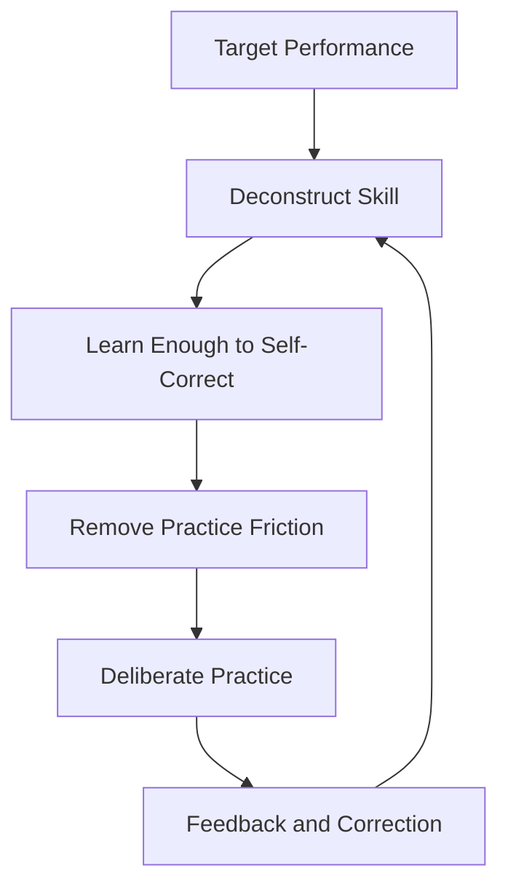
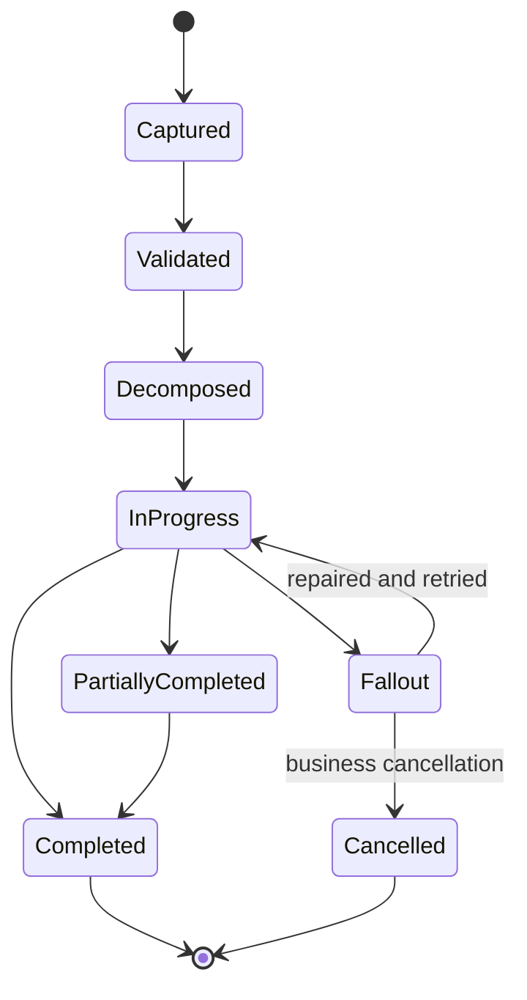
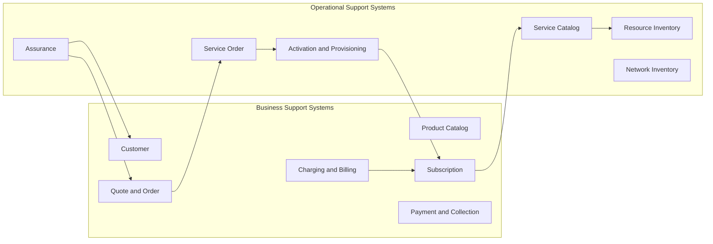
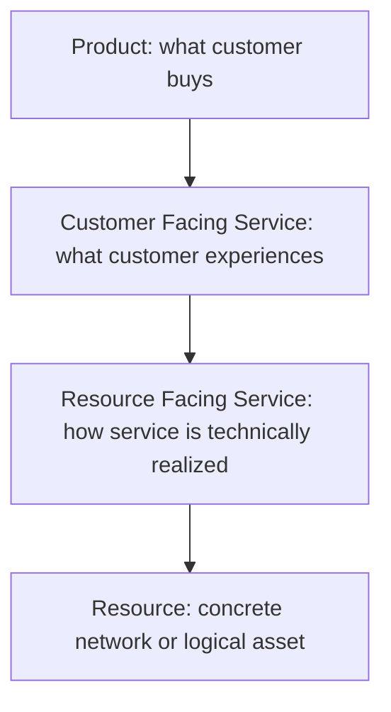
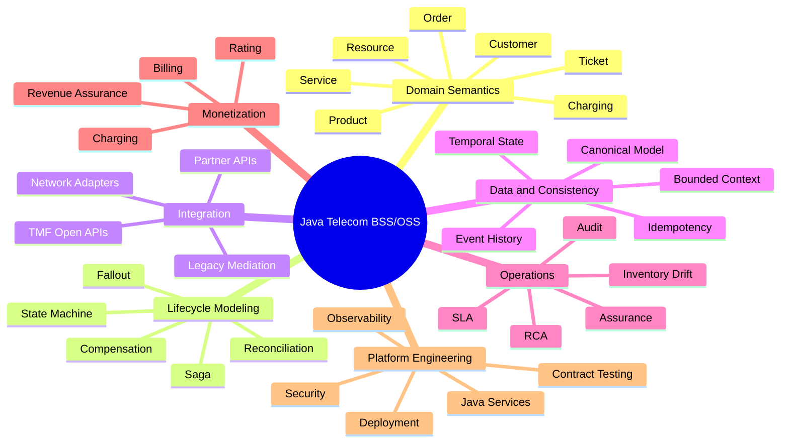
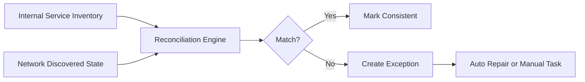
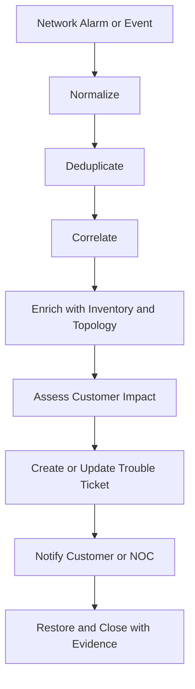
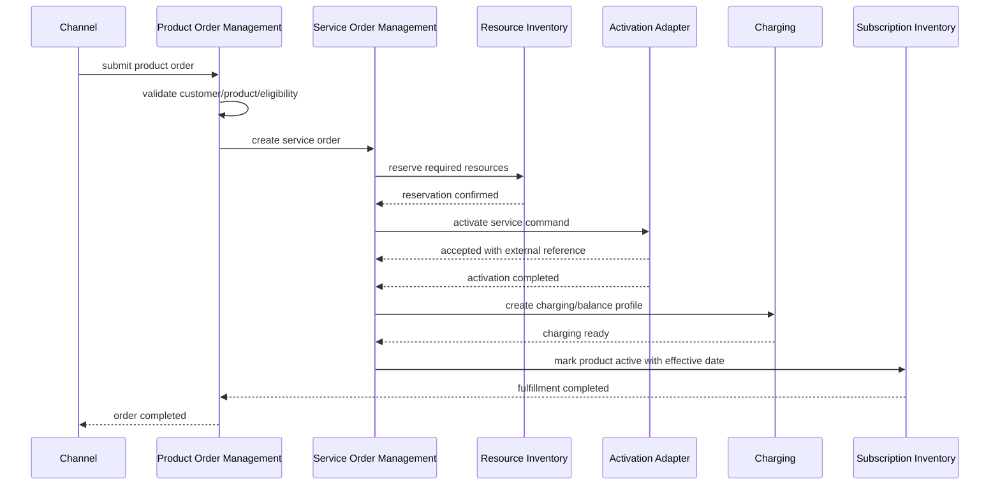

# Part 001 — Kaufman Skill Map

## 1. Tujuan Part Ini

Part ini bukan pengenalan Java, bukan pengenalan microservices, bukan pengenalan REST, dan bukan pengulangan pattern yang sudah dipelajari pada seri sebelumnya.

Tujuan part ini adalah membangun **peta skill** untuk menguasai **Java Telecom BSS/OSS** dengan cara yang efektif:

1. tahu domain apa yang harus dikuasai;
2. tahu urutan belajar yang benar;
3. tahu vocabulary penting agar tidak salah desain;
4. tahu skill mana yang harus dilatih sampai operasional;
5. tahu cara menilai apakah solusi BSS/OSS sudah carrier-grade;
6. tahu jebakan engineer yang hanya paham template, tetapi tidak paham lifecycle telco.

Dalam domain telecom, banyak kegagalan desain bukan terjadi karena engineer tidak tahu Java. Kegagalannya lebih sering karena engineer tidak memahami **hubungan antara product, service, resource, customer, network, order, charging, assurance, dan reconciliation**.

Sistem BSS/OSS adalah sistem lifecycle. Ia bukan sekadar CRUD customer, order, billing, atau ticket. Ia adalah rangkaian proses bisnis dan teknis yang panjang, heterogen, asynchronous, audit-heavy, dan sering menyentuh perangkat jaringan nyata.

---

## 2. Cara Seri Ini Menggunakan Framework Josh Kaufman

Buku *The First 20 Hours* menekankan pendekatan skill acquisition yang praktis: tentukan performa target, pecah skill menjadi sub-skill kecil, pelajari cukup teori untuk bisa mengoreksi diri, hilangkan hambatan latihan, lalu latihan secara sengaja.

Kita adaptasi menjadi kerangka berikut:



Untuk Java Telecom BSS/OSS, targetnya bukan “bisa membuat aplikasi telco”. Targetnya lebih presisi:

> Mampu mendesain, mengimplementasikan, mengoperasikan, dan mengevaluasi komponen BSS/OSS Java yang benar secara domain, tahan terhadap proses jangka panjang, kompatibel dengan integrasi multi-vendor, aman secara audit, dan mampu menangani kegagalan nyata seperti fallout, retry, reconciliation, duplicate events, partial activation, dan billing leakage.

Itu berarti kita tidak belajar domain secara ensiklopedis. Kita belajar untuk **mengambil keputusan arsitektural yang benar**.

---

## 3. Performance Target: Engineer Seperti Apa yang Ingin Dibangun?

Setelah menyelesaikan seri ini, target minimalnya adalah kamu mampu melakukan hal berikut.

### 3.1 Membaca Domain Telco Tanpa Tersesat

Kamu harus bisa menjelaskan alur berikut tanpa bingung:

```text
Customer intent
  -> product offering
  -> quote/cart
  -> product order
  -> service decomposition
  -> service order
  -> resource reservation
  -> network activation/provisioning
  -> usage/rating/charging
  -> billing/payment
  -> assurance/ticketing
  -> reconciliation/revenue assurance
```

Seorang engineer biasa melihat “order API”. Engineer top melihat **state transition, dependency graph, authoritative source, compensation boundary, customer impact, dan revenue implication**.

### 3.2 Mendesain Bounded Context BSS/OSS

Kamu harus bisa membedakan:

| Konsep | Bukan Ini | Lebih Tepatnya |
|---|---|---|
| Product | paket data di database | commercial promise yang dijual ke customer |
| Service | produk yang aktif | technical/customer-facing service yang merealisasikan produk |
| Resource | row inventory | kapasitas/identifier/perangkat yang benar-benar dialokasikan |
| Order | request biasa | kontrak perubahan lifecycle dengan audit dan dependency |
| Activation | call API sukses | perubahan nyata pada network/service plane |
| Billing | generate invoice | siklus monetisasi, adjustment, tax, payment, dispute, collection |
| Assurance | ticket CRUD | deteksi, korelasi, impact analysis, restore, evidence |

Kesalahan umum: mencampur product, service, dan resource menjadi satu tabel `subscription`. Pada sistem kecil ini tampak cepat. Pada sistem telco nyata, ini menghancurkan order decomposition, assurance impact, billing reconciliation, dan upgrade/downgrade lifecycle.

### 3.3 Menangani Long-Running Process

BSS/OSS jarang selesai dalam satu request-response. Banyak proses berjalan menit, jam, hari, bahkan minggu.

Contoh:

1. order enterprise connectivity perlu survey lokasi;
2. fixed broadband perlu appointment teknisi;
3. SIM swap perlu fraud check;
4. number portability perlu koordinasi external operator;
5. network incident perlu korelasi alarm sebelum ticket dibuat;
6. billing dispute bisa berjalan lintas cycle.

Karena itu, skill penting bukan sekadar membuat endpoint. Skill pentingnya adalah mendesain **lifecycle state machine**.



### 3.4 Membangun Komponen Java yang Bisa Dioperasikan

Sistem BSS/OSS harus bisa menjawab pertanyaan operasional:

1. order ini sedang di tahap mana?
2. kenapa service belum aktif?
3. resource mana yang sudah dialokasikan?
4. apakah customer sudah mulai ditagih?
5. apakah ada command provisioning yang sukses di network tapi gagal update status internal?
6. apakah usage event hilang, duplicate, terlambat, atau salah rating?
7. apakah ticket ini berdampak ke enterprise SLA?
8. apakah perubahan network menyebabkan customer impact?

Java service yang baik harus membawa jawaban ini sebagai bagian dari desain: audit log, event history, correlation ID, state transition, retry ledger, reconciliation job, dan operator-facing diagnostics.

---

## 4. Scope Seri Ini

Seri ini fokus pada domain dan platform engineering untuk Java BSS/OSS.

### 4.1 Yang Akan Dibahas

1. BSS/OSS domain map.
2. TM Forum ODA, eTOM, SID, Open APIs sebagai reference model.
3. Customer, account, agreement, product, service, resource, order, subscription, ticket, alarm, charging, billing.
4. Order-to-activate saga.
5. Provisioning dan activation adapter.
6. Resource inventory dan reconciliation.
7. Charging, billing, revenue assurance.
8. Assurance, fault, alarm, topology, impact analysis.
9. NFV/SDN/MANO, 5G slicing, partner ecosystem, network APIs.
10. Carrier-grade Java platform blueprint.

### 4.2 Yang Tidak Akan Diulang

Kita tidak akan mengulang materi yang sudah selesai pada seri lain:

1. Java syntax dan modern Java features.
2. Collections, generics, stream, concurrency basic.
3. DSA umum.
4. Design pattern umum.
5. JDBC/persistence/MyBatis dasar.
6. REST/Jakarta/Jersey dasar.
7. messaging/event streaming dasar.
8. security/cryptography dasar.
9. observability dasar.
10. BPMN/Camunda dasar.

Semua itu dianggap sebagai prasyarat. Di seri ini, kita akan menggunakannya dalam konteks telco.

---

## 5. Mental Model Utama: BSS/OSS Adalah Sistem Lifecycle

BSS sering dikaitkan dengan customer, product, order, charging, billing. OSS sering dikaitkan dengan service, resource, network, provisioning, fault, performance, inventory.

Namun pemisahan BSS/OSS bukan tembok keras. Lebih tepat dipahami sebagai dua sisi lifecycle:



BSS mengelola **commercial truth**: apa yang dijanjikan, dijual, ditagih, dan dipertanggungjawabkan ke customer.

OSS mengelola **operational truth**: bagaimana janji itu direalisasikan, dipantau, diperbaiki, dan direkonsiliasi terhadap kondisi network.

Sistem buruk mencampur dua truth ini. Sistem bagus menghubungkannya melalui model eksplisit: product-service-resource.

---

## 6. Product-Service-Resource: Abstraksi Paling Penting

Jika hanya ada satu mental model yang harus diingat sejak awal, inilah dia:



Contoh mobile data package:

| Layer | Contoh |
|---|---|
| Product | Paket Data 50GB / 30 hari |
| Customer-facing service | Mobile internet access untuk MSISDN tertentu |
| Resource-facing service | 5G data service, policy profile, quota profile, charging profile |
| Resource | MSISDN, IMSI, SIM/eSIM, subscriber profile di UDM, policy rule di PCF, balance bucket di charging system |

Contoh fixed broadband:

| Layer | Contoh |
|---|---|
| Product | Fiber Home 300 Mbps unlimited |
| Customer-facing service | Home broadband access |
| Resource-facing service | GPON access service, IP assignment, CPE configuration |
| Resource | ONT/CPE, OLT port, VLAN, IP address, line profile, address coverage data |

Kesalahan desain yang sering terjadi:

```text
ProductOrder -> langsung provisioning network
```

Desain yang lebih tahan lama:

```text
ProductOrder
  -> ProductOrderItem graph
  -> Service decomposition
  -> ServiceOrder
  -> Resource reservation
  -> Activation command
  -> Service instance
  -> Product subscription state update
```

Kenapa lebih tahan lama?

1. Product bisa berubah tanpa mengganti semua adapter network.
2. Service bisa dipakai oleh lebih dari satu product.
3. Resource bisa direkonsiliasi terhadap network.
4. Assurance bisa memetakan fault ke customer impact.
5. Billing bisa tahu kapan service benar-benar aktif.
6. Upgrade/downgrade bisa menjadi delta, bukan rebuild total.

---

## 7. Decomposition Skill Map

Skill Java Telecom BSS/OSS dapat dipecah menjadi tujuh kelompok besar.



Kita akan menguasai sub-skill itu bukan sebagai daftar konsep, tetapi sebagai kemampuan desain.

---

## 8. Domain Semantics: Skill Pertama yang Harus Dikuasai

Dalam telco, nama entity sangat menentukan desain.

### 8.1 Party Bukan Selalu Customer

`Party` adalah orang atau organisasi. `Customer` adalah party yang memiliki relasi komersial. Satu party bisa menjadi customer, partner, reseller, supplier, contact person, atau authorized representative.

Implikasi desain:

1. jangan jadikan `customer` sebagai root untuk semua identitas;
2. enterprise account butuh hierarchy;
3. contact person bukan selalu pemilik legal agreement;
4. privacy consent melekat pada party atau role tertentu, bukan selalu subscription;
5. B2B order sering membutuhkan relasi: buyer, service user, billing contact, technical contact, approver.

### 8.2 Product Bukan Service

Product adalah apa yang dijual. Service adalah realisasi operasional.

Contoh kesalahan:

```java
class Product {
    String msisdn;
    String imsi;
    String hlrProfile;
}
```

Masalahnya: class ini mencampur commercial offer dan network resource. Perubahan pricing dapat menyentuh activation code. Assurance menjadi sulit karena service/resource tidak eksplisit.

Lebih baik:

```java
record ProductOfferingId(String value) {}
record ProductInstanceId(String value) {}
record ServiceInstanceId(String value) {}
record ResourceId(String value) {}
```

Kita tidak membahas Java record sebagai fitur. Kita memakai type kecil ini untuk memaksa domain boundary.

### 8.3 Order Bukan Update Biasa

Order adalah permintaan perubahan lifecycle yang harus bisa diaudit.

Order bisa berupa:

1. provide: membuat product/service baru;
2. modify: mengubah existing subscription;
3. suspend: menghentikan sementara;
4. resume: mengaktifkan kembali;
5. terminate: mengakhiri;
6. change owner: memindahkan kepemilikan;
7. relocate: memindahkan service ke lokasi lain;
8. add/remove feature;
9. upgrade/downgrade;
10. cancel atau amend sebelum selesai.

Setiap order memiliki state, item, dependency, validation result, orchestration plan, audit, dan fallout.

---

## 9. Lifecycle Modeling: Skill Kedua

Telco systems hampir selalu memiliki workflow panjang. Namun workflow bukan sekadar BPMN diagram. Yang lebih penting adalah invariants.

### 9.1 State Transition Harus Eksplisit

Buruk:

```text
status = "DONE"
```

Lebih baik:

```text
Captured -> Validated -> Decomposed -> InProgress -> Completed
Captured -> Rejected
InProgress -> Fallout -> InProgress
InProgress -> CancelPending -> Cancelled
```

State transition harus menjawab:

1. siapa yang boleh memindahkan state?
2. apa precondition-nya?
3. apa efek sampingnya?
4. apakah transition idempotent?
5. apakah transition bisa diulang?
6. apakah transition bisa dibatalkan?
7. apakah ada external side effect?
8. bagaimana audit dan evidence disimpan?

### 9.2 Saga Bukan Sekadar Event Choreography

Saga dalam BSS/OSS perlu mempertimbangkan bahwa tidak semua tindakan bisa di-rollback.

Contoh:

1. SIM sudah diaktifkan di network.
2. MSISDN sudah dikirim ke customer.
3. port-in number sudah diproses operator donor.
4. teknisi sudah datang ke lokasi.
5. charging profile sudah menerima usage.

Untuk tindakan seperti itu, compensation bukan rollback teknis, melainkan **business correction**:

1. deactivate;
2. reverse charge;
3. issue credit note;
4. create manual task;
5. notify customer;
6. create reconciliation exception.

### 9.3 Fallout Adalah First-Class Concept

Fallout adalah kondisi ketika order atau workflow tidak bisa lanjut otomatis.

Fallout bukan sekadar error log. Fallout harus menjadi entity operasional:

| Elemen | Contoh |
|---|---|
| fallout reason | resource unavailable, activation timeout, external validation failed |
| owning team | provisioning ops, billing ops, credit ops, partner ops |
| repair action | change resource, retry adapter, manual override, cancel item |
| SLA | must repair within 4 hours |
| customer impact | service not active, partial service, billing risk |
| evidence | request/response, command id, correlation id |

Engineer top memperlakukan fallout sebagai normal path, bukan exception langka.

---

## 10. Data and Consistency: Skill Ketiga

BSS/OSS memiliki banyak source of truth. Tidak semua data harus konsisten real-time.

### 10.1 Authoritative Source Harus Dinyatakan

Contoh:

| Data | Authoritative Source yang Umum |
|---|---|
| product offering | product catalog |
| active product instance | subscription/product inventory |
| billing balance | charging/balance system |
| invoice | billing system |
| MSISDN allocation | resource inventory atau number management |
| actual subscriber profile | network element atau mediation layer |
| customer-impact mapping | service inventory/topology |
| alarm state | fault management system |

Masalah muncul ketika semua service merasa menjadi source of truth.

### 10.2 Temporal Data Wajib Dipikirkan

Telco banyak memakai effective date.

Contoh:

1. plan change berlaku mulai billing cycle berikutnya;
2. promo berlaku selama 3 bulan;
3. suspension mulai tanggal tertentu;
4. SLA clock berhenti saat waiting customer;
5. price berubah tetapi existing subscriber grandfathered;
6. contract punya minimum term;
7. invoice period berbeda dari usage period;
8. usage event bisa datang terlambat.

Karena itu, model yang hanya menyimpan current state sering tidak cukup.

Kita perlu membedakan:

| Waktu | Makna |
|---|---|
| transaction time | kapan sistem mencatat perubahan |
| effective time | kapan perubahan berlaku secara bisnis |
| event time | kapan kejadian nyata terjadi |
| processing time | kapan sistem memproses event |
| billing period | periode monetisasi |
| SLA time | waktu yang dihitung terhadap janji layanan |

### 10.3 Reconciliation Bukan Job Tambahan

Reconciliation adalah mekanisme mempertahankan kebenaran sistem.

Contoh:



Tanpa reconciliation, sistem bisa terlihat sehat tetapi salah secara realitas.

Contoh silent failure:

1. product aktif di BSS tetapi service belum aktif di network;
2. service aktif di network tetapi billing belum mulai;
3. resource terpakai tetapi inventory masih available;
4. customer ditagih untuk service yang sudah terminate;
5. alarm terjadi pada resource yang tidak dipetakan ke customer.

---

## 11. Integration Skill: TMF Open APIs, Legacy, dan Network Mediation

Telco sangat kaya integrasi.

Ada integrasi northbound:

1. digital channels;
2. partner/reseller;
3. dealer;
4. enterprise portal;
5. API marketplace;
6. B2B interconnect;
7. mobile app.

Ada integrasi southbound:

1. HLR/HSS/UDM;
2. PCRF/PCF;
3. OCS/CHF;
4. AAA;
5. DNS/IPAM;
6. EMS/NMS;
7. SDN controller;
8. NFVO/VNFM/VIM;
9. field service;
10. payment gateway.

Ada integrasi lateral:

1. CRM;
2. catalog;
3. order management;
4. billing;
5. inventory;
6. assurance;
7. revenue assurance;
8. data warehouse;
9. fraud;
10. identity and access management.

### 11.1 Integration Rule

Jangan desain integrasi hanya berdasarkan transport.

Pertanyaan yang benar:

1. apakah command atau event?
2. apakah idempotent?
3. apakah synchronous atau asynchronous?
4. siapa source of truth?
5. apa correlation ID?
6. apakah response final atau hanya accepted?
7. bagaimana retry aman dilakukan?
8. bagaimana duplicate dikenali?
9. bagaimana reconciliation dilakukan?
10. bagaimana manual repair dilakukan?

Transport seperti REST, Kafka, SOAP, file, SFTP, gRPC, atau database link hanyalah detail setelah semantics jelas.

---

## 12. Operations Skill: Assurance, Impact, dan Defensibility

BSS/OSS bukan hanya membuat perubahan. Ia juga harus membuktikan apa yang terjadi.

### 12.1 Assurance Flow



Tanpa service/resource topology, alarm hanyalah noise.

Dengan topology, alarm menjadi pertanyaan bisnis:

1. customer mana terdampak?
2. SLA mana yang berisiko?
3. enterprise contract mana yang perlu notifikasi?
4. apakah incident ini major?
5. apakah perubahan network tadi menjadi penyebab?
6. apakah ada service yang perlu reroute?

### 12.2 Defensibility

Sistem telco sering berhadapan dengan dispute:

1. customer merasa tidak membeli paket;
2. customer merasa service tidak aktif;
3. customer merasa ditagih dua kali;
4. partner merasa settlement salah;
5. regulator meminta bukti perlakuan fair;
6. enterprise meminta bukti SLA breach.

Karena itu, setiap lifecycle penting harus punya:

1. audit trail;
2. immutable event history;
3. state transition record;
4. actor identity;
5. request/response evidence;
6. effective date;
7. correlation ID;
8. external reference;
9. source system;
10. replay/reconstruction capability.

---

## 13. Skill Map Dalam 35 Part

Berikut cara membaca seri:

| Phase | Part | Fokus | Outcome |
|---|---:|---|---|
| Foundation | 001-006 | Skill map, business map, language, standards, ODA, SID | Bisa membaca domain dan boundary |
| BSS Core | 007-015 | Party, catalog, qualification, order, subscription, charging, billing, revenue assurance | Bisa mendesain monetization lifecycle |
| Fulfillment Core | 016-022 | Service catalog, service order, resource inventory, activation, fallout, field service, saga | Bisa mendesain order-to-activate |
| Assurance OSS | 023-028 | Fault, ticket, KPI, topology, discovery, capacity, change | Bisa mendesain trouble-to-resolve dan impact analysis |
| Modern Telco | 029-033 | NFV/SDN/MANO, 5G slicing, partner, MEF LSO, network APIs | Bisa membaca telco modern dan API exposure |
| Capstone | 034-035 | Java platform blueprint dan assessment | Bisa mengikat semuanya menjadi platform blueprint |

---

## 14. First 20 Hours Plan

Seri ini panjang. Tetapi Kaufman-style practice membutuhkan milestone cepat.

Berikut rencana 20 jam pertama untuk membangun fluency awal.

### Jam 1-2: Domain Vocabulary

Target:

1. bisa membedakan party, customer, account, agreement;
2. bisa membedakan product, service, resource;
3. bisa membedakan product order dan service order;
4. bisa menjelaskan BSS dan OSS tanpa definisi hafalan.

Latihan:

```text
Ambil 3 layanan:
1. mobile prepaid data package;
2. fixed broadband installation;
3. enterprise VPN.

Untuk masing-masing, tulis product, CFS, RFS, resource, order type, billing trigger, assurance signal.
```

### Jam 3-4: Lifecycle State Machine

Target:

1. buat state machine untuk product order;
2. buat state machine untuk service order;
3. buat state machine untuk trouble ticket;
4. identifikasi terminal state dan recoverable state.

Latihan:

```text
Buat state transition untuk kasus:
Customer membeli paket data, resource MSISDN tersedia, activation timeout, retry sukses, charging mulai.
```

### Jam 5-6: Product-Service-Resource Mapping

Target:

1. bisa memetakan product ke CFS/RFS/resource;
2. tahu mana yang commercial dan mana yang operational;
3. tahu impact jika mapping tidak eksplisit.

Latihan:

```text
Modelkan Fiber 300 Mbps:
- product offering
- product instance
- CFS
- RFS
- resource
- activation command
- assurance impact
```

### Jam 7-8: Order Decomposition

Target:

1. memahami order item graph;
2. memahami dependency antar item;
3. memahami partial completion;
4. memahami fallout.

Latihan:

```text
Order enterprise branch connectivity:
- site survey
- access provisioning
- router shipment
- IP allocation
- firewall policy
- billing start

Tentukan dependency dan compensation.
```

### Jam 9-10: Inventory and Allocation

Target:

1. paham resource lifecycle;
2. paham reservation vs assignment;
3. paham inventory drift;
4. paham reconciliation.

Latihan:

```text
Simulasikan MSISDN allocation:
Available -> Reserved -> Assigned -> Active -> Quarantined -> Available
```

### Jam 11-12: Activation Adapter

Target:

1. membedakan accepted vs completed;
2. membuat command idempotency;
3. mendesain retry;
4. membuat audit evidence.

Latihan:

```text
Desain activation command:
provisionMobileData(msisdn, imsi, quotaProfile, policyProfile)

Tuliskan idempotency key, external reference, retry strategy, reconciliation check.
```

### Jam 13-14: Charging and Billing Boundary

Target:

1. paham rating vs charging vs billing;
2. paham prepaid vs postpaid;
3. paham usage event;
4. paham leakage.

Latihan:

```text
Event data usage 100MB datang terlambat 2 hari setelah cycle close.
Apa yang terjadi di charging, billing, adjustment, dan revenue assurance?
```

### Jam 15-16: Assurance and Impact

Target:

1. paham alarm lifecycle;
2. paham correlation;
3. paham service impact;
4. paham ticket automation.

Latihan:

```text
Satu OLT down.
Tentukan affected resources, services, customers, SLA, ticket, notification.
```

### Jam 17-18: ODA/TMF API Reading

Target:

1. bisa membaca TMF API bukan sebagai endpoint, tetapi sebagai domain contract;
2. bisa membedakan internal model dan external canonical model;
3. bisa membuat anti-corruption layer.

Latihan:

```text
Ambil Product Order API style payload.
Tentukan field mana yang masuk aggregate internal, field mana yang external reference, dan field mana yang harus divalidasi lintas context.
```

### Jam 19-20: Mini Architecture Review

Target:

1. desain mini order-to-activate platform;
2. jelaskan boundary;
3. jelaskan failure model;
4. jelaskan observability dan audit;
5. jelaskan reconciliation.

Latihan:

```text
Buat one-page architecture:
Digital Channel -> Product Order -> Service Order -> Resource Inventory -> Activation Adapter -> Charging -> Billing -> Assurance
```

---

## 15. Learning Friction yang Harus Dihilangkan

Agar pembelajaran efektif, hindari hambatan berikut.

### 15.1 Jangan Mulai dari Vendor Product

Vendor BSS/OSS punya istilah dan model sendiri. Belajar langsung dari vendor sering membuat pemahaman terikat produk.

Mulai dari domain model:

1. TM Forum-style vocabulary;
2. product-service-resource;
3. order lifecycle;
4. inventory and assurance;
5. monetization.

Setelah itu, vendor product lebih mudah dibaca.

### 15.2 Jangan Menghafal Semua Standar

Standar telco sangat luas. Tujuan kita bukan menjadi librarian standar, tetapi engineer yang tahu kapan memakai standar sebagai reference.

Gunakan standar untuk:

1. vocabulary;
2. boundary;
3. interoperability;
4. API shape;
5. conformance thinking;
6. vendor-neutral discussion.

Jangan gunakan standar sebagai alasan untuk membuat model internal terlalu generik dan sulit dioperasikan.

### 15.3 Jangan Mendesain Canonical Model Raksasa

Canonical model berguna untuk integrasi, tetapi berbahaya jika dipakai sebagai domain model internal semua service.

Rule:

```text
External contract can be canonical.
Internal model must be owned by bounded context.
```

Contoh:

1. Product Order service boleh menerima TMF-style product order payload;
2. internal aggregate tetap harus mencerminkan invariants Product Order service;
3. mapping masuk/keluar harus eksplisit;
4. jangan membuat semua service bergantung pada satu shared mega model jar.

### 15.4 Jangan Meremehkan Manual Operations

BSS/OSS carrier-grade harus mendukung manual repair. Bukan semua hal bisa otomatis.

Manual workflow bukan tanda buruk. Yang buruk adalah manual workflow tanpa audit, SLA, assignment, evidence, dan state control.

---

## 16. Carrier-Grade Thinking Checklist

Gunakan checklist ini untuk setiap desain BSS/OSS.

### 16.1 Domain Correctness

- Apakah product, service, dan resource dipisahkan?
- Apakah order berbeda dari subscription?
- Apakah state transition eksplisit?
- Apakah effective date dipikirkan?
- Apakah customer/account/agreement tidak dicampur?

### 16.2 Integration Correctness

- Apakah setiap external call punya correlation ID?
- Apakah command idempotent?
- Apakah retry aman?
- Apakah accepted vs completed dibedakan?
- Apakah ada reconciliation path?

### 16.3 Operational Correctness

- Apakah operator bisa tahu posisi order?
- Apakah fallout first-class?
- Apakah manual repair punya audit?
- Apakah partial completion bisa direpresentasikan?
- Apakah customer impact bisa dihitung?

### 16.4 Monetization Correctness

- Apakah billing start trigger jelas?
- Apakah charging profile sinkron dengan service state?
- Apakah late usage event dipikirkan?
- Apakah dispute/adjustment punya evidence?
- Apakah leakage bisa dideteksi?

### 16.5 Defensibility

- Apakah setiap keputusan penting punya evidence?
- Apakah actor tercatat?
- Apakah source system tercatat?
- Apakah event history bisa direkonstruksi?
- Apakah regulatory/customer dispute bisa dijawab?

---

## 17. Example: Mini Skill Application

Kita ambil kasus sederhana: customer membeli paket data prepaid 50GB.

### 17.1 Naive Design

```text
POST /subscribe
  insert subscription
  call charging
  call network
  return success
```

Masalah:

1. apa yang terjadi jika charging sukses tetapi network gagal?
2. apakah customer sudah boleh memakai service?
3. apakah billing/charging start?
4. bagaimana jika call network timeout tetapi sebenarnya sukses?
5. bagaimana jika request duplicate?
6. bagaimana jika MSISDN salah?
7. siapa yang memperbaiki jika activation fallout?

### 17.2 Better Lifecycle Design



### 17.3 Key Invariants

1. Product subscription tidak boleh `Active` sebelum service activation dan charging readiness selesai, kecuali ada business rule eksplisit.
2. Resource reservation harus punya expiry agar tidak menahan resource selamanya.
3. Activation command harus punya idempotency key.
4. Timeout tidak boleh otomatis dianggap gagal.
5. External reference harus disimpan untuk reconciliation.
6. Billing/charging effective date harus jelas.
7. Manual fallout harus bisa memperbaiki order tanpa membuat order baru sembarangan.

---

## 18. Bagaimana Menilai Progress

Gunakan skala berikut.

### Level 1 — Vocabulary Recognition

Kamu mengenali istilah BSS/OSS, product, service, resource, charging, assurance, inventory, order.

Ini belum cukup.

### Level 2 — Flow Understanding

Kamu bisa menggambar order-to-activate flow dan menjelaskan komponen yang terlibat.

Ini mulai berguna.

### Level 3 — Failure-Aware Design

Kamu bisa menjelaskan apa yang terjadi saat activation timeout, duplicate usage, inventory mismatch, partial order, billing dispute, atau alarm storm.

Ini level engineer produksi.

### Level 4 — Architecture Decision

Kamu bisa menentukan bounded context, source of truth, event contract, state machine, compensation, reconciliation, dan operational view.

Ini level tech lead.

### Level 5 — Carrier-Grade Judgment

Kamu bisa mengevaluasi vendor architecture, menolak model yang salah, mendesain migration path, mengurangi leakage, memperbaiki fallout, dan menjaga auditability.

Ini target seri.

---

## 19. Latihan Part 001

### Latihan 1 — Domain Split

Untuk layanan berikut, pisahkan product, service, dan resource:

1. prepaid data 10GB;
2. postpaid family plan;
3. fixed broadband 1Gbps;
4. enterprise SD-WAN;
5. IoT SIM fleet.

Output:

```text
Product:
CFS:
RFS:
Resource:
Order types:
Billing/charging trigger:
Assurance signal:
```

### Latihan 2 — State Machine

Buat state machine untuk product order yang mendukung:

1. validation failed;
2. activation timeout;
3. partial completion;
4. manual repair;
5. cancellation;
6. completed;
7. rejected.

### Latihan 3 — Failure Model

Ambil flow mobile data activation. Jawab:

1. apa yang terjadi jika charging sukses tetapi UDM provisioning gagal?
2. apa yang terjadi jika UDM sukses tetapi response timeout?
3. apa yang terjadi jika customer submit order dua kali?
4. apa yang terjadi jika resource reservation expired?
5. apa yang terjadi jika usage masuk sebelum product order completed?

### Latihan 4 — Architecture Review

Review desain berikut:

```text
SubscriptionService:
- createSubscription()
- updateSubscription()
- cancelSubscription()
- billSubscription()
- activateNetwork()
- createTicket()
```

Tentukan minimal 7 masalah desain dan pecah menjadi bounded context yang lebih tepat.

---

## 20. Ringkasan

BSS/OSS bukan sekadar kumpulan aplikasi telco. Ia adalah sistem lifecycle yang menghubungkan commercial promise dengan operational realization.

Mental model yang harus dibawa dari part ini:

1. product, service, dan resource harus dipisahkan;
2. order adalah perubahan lifecycle yang diaudit;
3. activation adalah perubahan nyata pada operational plane;
4. charging dan billing harus sinkron dengan service state;
5. assurance membutuhkan topology dan inventory;
6. fallout dan reconciliation adalah first-class capability;
7. Java service carrier-grade harus didesain untuk failure, audit, dan operasi manual;
8. standar seperti TM Forum dan 3GPP dipakai sebagai reference model, bukan sebagai template buta.

Di part berikutnya, kita masuk ke **Telecom Business & Technology Map**: siapa aktornya, bagaimana uang mengalir, bagaimana network diterjemahkan menjadi produk, dan mengapa BSS/OSS harus dipahami sebagai operating model end-to-end.

---

## 21. Referensi Resmi dan Bacaan Lanjutan

Sumber resmi yang menjadi fondasi seri ini:

1. TM Forum — Open Digital Architecture: https://www.tmforum.org/open-digital-architecture/
2. TM Forum — Components & Canvas: https://www.tmforum.org/open-digital-architecture/components-canvas/
3. TM Forum — Frameworx Evolution: https://www.tmforum.org/frameworx-evolution/
4. TM Forum — Process Framework eTOM: https://www.tmforum.org/open-digital-architecture/process-framework-etom/
5. TM Forum — Information Framework SID: https://www.tmforum.org/open-digital-architecture/information-framework-sid/
6. TM Forum — Open APIs: https://www.tmforum.org/open-digital-architecture/implementation/open-apis/
7. 3GPP TS 32.240 — Charging architecture and principles: https://www.3gpp.org/dynareport/32240.htm
8. GSMA Open Gateway API Descriptions: https://www.gsma.com/solutions-and-impact/gsma-open-gateway/gsma-open-gateway-api-descriptions/
