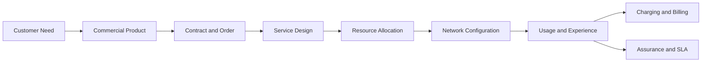
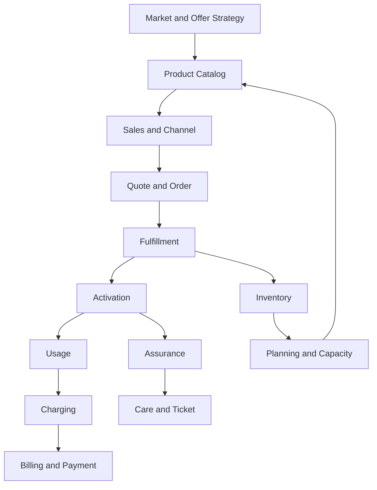
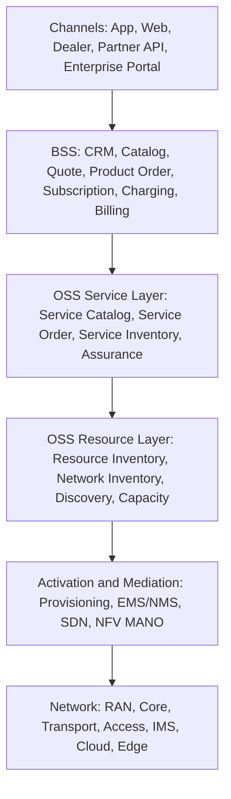
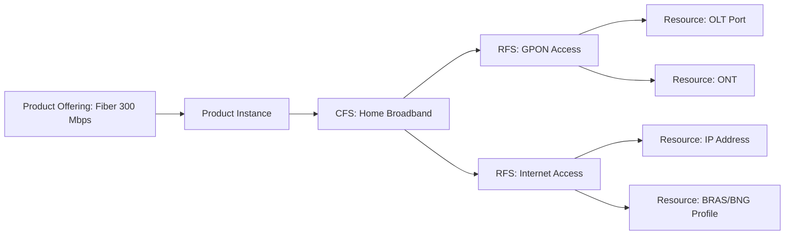
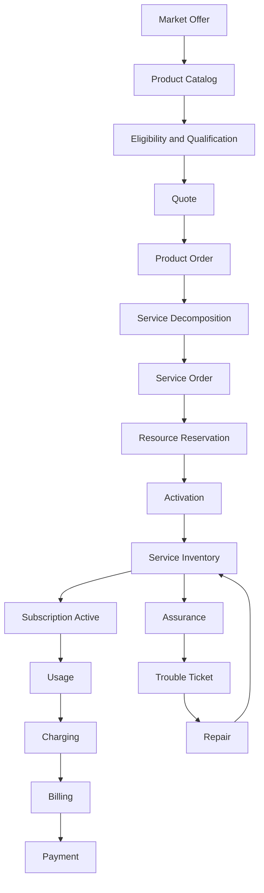
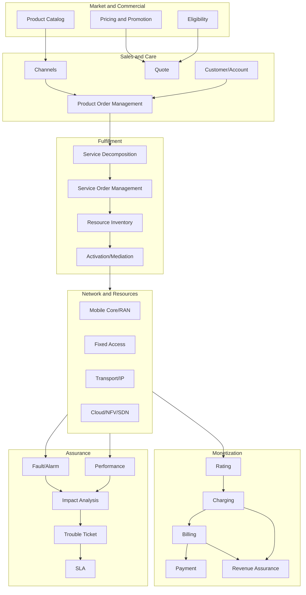

# Part 002 — Telecom Business and Technology Map

## 1. Tujuan Part Ini

Part ini membangun peta bisnis dan teknologi telecom yang harus dipahami sebelum masuk ke product catalog, order management, charging, billing, inventory, provisioning, dan assurance.

Banyak engineer masuk ke proyek BSS/OSS dari sisi implementasi:

```text
buat API order
buat table customer
buat service activation
buat billing integration
buat ticketing workflow
```

Pendekatan itu terlalu cepat. Tanpa peta bisnis dan teknologi, desain akan mudah salah karena tidak tahu konteks perubahan lifecycle.

Tujuan part ini:

1. memahami siapa aktor dalam ekosistem telecom;
2. memahami jenis layanan telecom dan konsekuensi BSS/OSS-nya;
3. memahami hubungan antara bisnis, produk, service, resource, network, dan revenue;
4. memahami proses end-to-end seperti lead-to-cash, order-to-activate, usage-to-cash, trouble-to-resolve, dan plan-to-build;
5. memahami mengapa BSS/OSS Java berbeda dari enterprise CRUD biasa;
6. membangun mental model untuk membaca requirement telco secara struktural.

---

## 2. Core Premise: Telecom Menjual Abstraksi di Atas Network

Telecom operator tidak menjual kabel, antena, IMSI, VLAN, subscriber profile, policy rule, atau routing table kepada customer.

Operator menjual outcome:

1. bisa terhubung;
2. bisa memakai data;
3. bisa menelepon;
4. bisa mengirim SMS;
5. bisa mengakses internet di rumah;
6. bisa menghubungkan kantor cabang;
7. bisa menjamin SLA enterprise;
8. bisa mengekspos network capability ke developer;
9. bisa mengamankan identitas perangkat;
10. bisa mengukur dan menagih penggunaan.

BSS/OSS adalah mesin yang menerjemahkan outcome komersial menjadi realisasi teknis.



Jika kamu memahami diagram ini, kamu mulai memahami BSS/OSS.

---

## 3. Aktor Utama dalam Ekosistem Telecom

### 3.1 CSP

CSP atau Communications Service Provider adalah penyedia layanan komunikasi. Istilah ini lebih luas daripada mobile operator karena bisa mencakup mobile, fixed, broadband, enterprise connectivity, IoT, cloud connectivity, dan layanan digital.

Dalam BSS/OSS, CSP biasanya memiliki:

1. customer base;
2. product catalog;
3. channel penjualan;
4. order management;
5. billing dan charging;
6. network/service inventory;
7. assurance operation;
8. partner ecosystem;
9. regulatory obligations;
10. enterprise SLA obligations.

### 3.2 MNO

MNO atau Mobile Network Operator memiliki jaringan mobile sendiri, termasuk spektrum, RAN, core network, dan sistem operasional terkait.

Implikasi BSS/OSS:

1. resource mobile seperti MSISDN, IMSI, ICCID, eSIM profile;
2. subscriber profile di HLR/HSS/UDM;
3. policy control;
4. online charging;
5. roaming;
6. number portability;
7. device/location-related capability;
8. SIM lifecycle;
9. fraud and identity checks;
10. mobile assurance.

### 3.3 MVNO

MVNO atau Mobile Virtual Network Operator menjual layanan mobile tanpa memiliki seluruh network fisik sendiri. MVNO memakai network MNO host.

Implikasi BSS/OSS:

1. MVNO bisa memiliki BSS sendiri tetapi bergantung pada host MNO untuk provisioning network;
2. integrasi wholesale penting;
3. settlement penting;
4. partner SLA penting;
5. resource ownership harus jelas;
6. charging bisa dilakukan oleh MVNO, MNO, atau hybrid;
7. customer ownership dan service ownership bisa berbeda dari network ownership.

### 3.4 MVNE dan MVNA

MVNE menyediakan platform enablement untuk MVNO. MVNA mengagregasi akses wholesale untuk beberapa MVNO.

Implikasi BSS/OSS:

1. multi-tenant platform;
2. white-label product catalog;
3. tenant-specific pricing;
4. partner onboarding;
5. wholesale reconciliation;
6. delegated operations;
7. tenant-level audit;
8. data isolation;
9. configurable lifecycle rules;
10. reporting per partner.

### 3.5 ISP dan Fixed Broadband Provider

Fixed provider menjual konektivitas berbasis fiber, copper, cable, fixed wireless, atau kombinasi.

Implikasi BSS/OSS:

1. address serviceability;
2. coverage and feasibility;
3. appointment and field workforce;
4. CPE logistics;
5. physical resource inventory;
6. line test;
7. installation order;
8. technician completion;
9. trouble ticket with physical diagnostics;
10. planned maintenance impact.

### 3.6 Enterprise Connectivity Provider

Enterprise telco menjual layanan seperti leased line, MPLS, SD-WAN, VPN, private 5G, cloud connect, NaaS, dan managed security.

Implikasi BSS/OSS:

1. quote kompleks;
2. site survey;
3. contract and SLA;
4. service design;
5. multi-site order decomposition;
6. CPE/router/firewall configuration;
7. cross-domain orchestration;
8. customer-specific topology;
9. service assurance berbasis SLA;
10. change management ketat.

### 3.7 Partner, Dealer, Reseller, dan API Consumer

Modern telco tidak hanya menjual langsung ke end customer. Banyak layanan dijual melalui partner, marketplace, dealer, reseller, atau developer API platform.

Implikasi BSS/OSS:

1. partner identity;
2. delegated ordering;
3. commission;
4. settlement;
5. partner product catalog;
6. API quota and monetization;
7. consent and authorization;
8. tenant and channel attribution;
9. dispute and reconciliation;
10. partner SLA.

---

## 4. Peta Produk Telecom

Produk telecom bisa dilihat dari beberapa dimensi.

### 4.1 Consumer Mobile

Contoh:

1. prepaid SIM;
2. postpaid mobile plan;
3. data package;
4. voice package;
5. roaming package;
6. family plan;
7. device bundle;
8. eSIM activation;
9. add-on streaming;
10. SIM replacement.

BSS/OSS implications:

1. high order volume;
2. real-time balance/charging;
3. SIM and number lifecycle;
4. fraud checks;
5. fast activation;
6. campaign and promotion;
7. app/channel integration;
8. usage event scale;
9. customer care interaction;
10. regulatory registration.

### 4.2 Consumer Fixed Broadband

Contoh:

1. fiber broadband;
2. home Wi-Fi;
3. IPTV bundle;
4. voice over fiber;
5. CPE rental;
6. speed upgrade;
7. relocation;
8. temporary suspension;
9. mesh Wi-Fi add-on;
10. technician visit.

BSS/OSS implications:

1. address validation;
2. serviceability check;
3. appointment slot;
4. field workforce;
5. physical resource assignment;
6. CPE inventory;
7. installation completion;
8. line quality metrics;
9. SLA and outage handling;
10. billing start based on installation completion.

### 4.3 Enterprise Connectivity

Contoh:

1. leased line;
2. MPLS VPN;
3. SD-WAN;
4. cloud connect;
5. private APN;
6. private 5G;
7. managed firewall;
8. IoT connectivity;
9. SIP trunk;
10. data center interconnect.

BSS/OSS implications:

1. multi-site quote;
2. feasibility per location;
3. custom contract;
4. SLA clauses;
5. service design and approval;
6. cross-domain provisioning;
7. change windows;
8. customer-impact-aware assurance;
9. penalty calculation;
10. account team visibility.

### 4.4 Wholesale and Interconnect

Contoh:

1. MVNO wholesale access;
2. roaming agreement;
3. carrier Ethernet;
4. inter-provider access circuit;
5. number portability;
6. API wholesale;
7. IP transit;
8. dark fiber;
9. infrastructure sharing;
10. partner settlement.

BSS/OSS implications:

1. partner product catalog;
2. inter-provider order;
3. wholesale billing;
4. settlement reconciliation;
5. partner SLA;
6. external trouble ticketing;
7. demarcation responsibility;
8. evidence exchange;
9. regulatory reporting;
10. dispute handling.

---

## 5. BSS/OSS as Business Operating Model

BSS/OSS bukan hanya system map. Ia adalah operating model.



Perhatikan loop-nya:

1. catalog memengaruhi order;
2. order memengaruhi fulfillment;
3. fulfillment memengaruhi inventory;
4. inventory memengaruhi feasibility;
5. usage memengaruhi charging;
6. assurance memengaruhi customer experience;
7. incident data memengaruhi planning;
8. planning memengaruhi produk yang bisa dijual.

BSS/OSS yang bagus membuat loop ini terlihat dan terkendali.

---

## 6. Proses End-to-End Utama

Ada lima proses end-to-end yang wajib dikuasai.

### 6.1 Lead-to-Cash

Lead-to-cash mencakup perjalanan dari calon customer sampai revenue diterima.

```text
Lead -> Opportunity -> Qualification -> Quote -> Order -> Fulfillment -> Activation -> Billing -> Payment -> Collection
```

Pertanyaan desain:

1. kapan lead menjadi customer?
2. kapan quote mengunci harga?
3. kapan order valid secara kontrak?
4. kapan service dianggap delivered?
5. kapan billing mulai?
6. kapan revenue recognized?
7. bagaimana dispute dan adjustment diproses?

Java implication:

1. state machine lintas context;
2. effective date;
3. audit trail;
4. pricing version;
5. order amendment;
6. payment event;
7. reconciliation.

### 6.2 Order-to-Activate

Order-to-activate adalah inti fulfillment.

```text
Order Capture -> Validate -> Decompose -> Reserve -> Provision -> Test -> Activate -> Complete
```

Pertanyaan desain:

1. order item mana yang bisa parallel?
2. dependency mana yang mandatory?
3. resource mana yang harus reserved?
4. command mana yang idempotent?
5. kapan partial completion valid?
6. kapan customer diberitahu?
7. apa fallback jika activation gagal?

Java implication:

1. orchestration engine;
2. event-driven progression;
3. idempotency key;
4. retry ledger;
5. fallout work item;
6. manual repair;
7. correlation ID.

### 6.3 Usage-to-Cash

Usage-to-cash adalah proses monetisasi penggunaan.

```text
Usage Event -> Mediation -> Rating -> Charging -> Balance Update -> Bill -> Invoice -> Payment -> Revenue Assurance
```

Pertanyaan desain:

1. apakah charging online atau offline?
2. apakah balance harus dicek real-time?
3. bagaimana duplicate usage dikenali?
4. bagaimana late usage diproses?
5. bagaimana invoice correction dilakukan?
6. bagaimana leakage dideteksi?

Java implication:

1. high-throughput event processing;
2. idempotent event ingestion;
3. event-time vs processing-time;
4. rating rule versioning;
5. suspense handling;
6. batch and streaming reconciliation.

### 6.4 Trouble-to-Resolve

Trouble-to-resolve adalah perjalanan dari gangguan sampai pemulihan.

```text
Alarm/Event -> Correlation -> Impact Analysis -> Ticket -> Dispatch/Repair -> Restore -> Close -> SLA Review
```

Pertanyaan desain:

1. alarm mana yang duplicate?
2. alarm mana root cause?
3. customer mana terdampak?
4. SLA mana berisiko?
5. apakah customer perlu notifikasi?
6. apakah field dispatch perlu dibuat?
7. evidence apa yang dibutuhkan untuk closure?

Java implication:

1. event correlation;
2. topology graph;
3. ticket lifecycle;
4. SLA timer;
5. escalation rule;
6. notification workflow;
7. evidence store.

### 6.5 Plan-to-Build

Plan-to-build menghubungkan demand, kapasitas, dan perubahan network.

```text
Demand Forecast -> Capacity Planning -> Network Design -> Build Order -> Change Window -> Deployment -> Inventory Update
```

Pertanyaan desain:

1. area mana kekurangan kapasitas?
2. product mana tidak boleh dijual karena resource tidak cukup?
3. planned maintenance berdampak ke siapa?
4. apakah inventory sudah sesuai dengan network actual?
5. bagaimana capacity memengaruhi catalog eligibility?

Java implication:

1. inventory analytics;
2. capacity model;
3. change management;
4. serviceability API;
5. topology-aware planning;
6. reconciliation.

---

## 7. BSS vs OSS: Boundary yang Lebih Tepat

Pembagian BSS/OSS sering disederhanakan:

```text
BSS = customer and billing
OSS = network
```

Itu cukup untuk pengenalan, tetapi tidak cukup untuk desain.

Lebih baik gunakan boundary berikut.

| Area | Primary Question | Typical Systems |
|---|---|---|
| Customer management | siapa customer dan relasinya? | CRM, party, account |
| Product management | apa yang dijual? | product catalog, offer management |
| Sales/order | apa yang diminta customer? | cart, quote, product order |
| Monetization | bagaimana ditagih/dibayar? | rating, charging, billing, payment |
| Service management | service apa yang harus diwujudkan? | service catalog, service order, service inventory |
| Resource management | resource apa yang dipakai? | resource inventory, number management, IPAM, device inventory |
| Activation | bagaimana network dikonfigurasi? | provisioning, mediation, activation adapters |
| Assurance | apakah service sehat? | fault, performance, ticket, SLA, topology |
| Planning | apakah kapasitas cukup? | planning, capacity, build, change |

Boundary ini lebih berguna karena langsung terkait source of truth dan lifecycle.

---

## 8. Technology Stack Telecom dari Atas ke Bawah

Berikut peta teknologi yang harus dibaca engineer BSS/OSS.



### 8.1 Channel Layer

Channel layer meliputi:

1. mobile app;
2. web portal;
3. call center;
4. dealer portal;
5. partner API;
6. enterprise portal;
7. marketplace;
8. self-care;
9. chatbot;
10. internal operations UI.

Channel tidak boleh menjadi owner domain logic utama. Channel boleh mengorkestrasi user journey, tetapi business invariants harus berada di domain service.

### 8.2 BSS Layer

BSS layer mengelola commercial lifecycle:

1. customer and party;
2. account;
3. agreement;
4. product catalog;
5. eligibility;
6. quote;
7. product order;
8. subscription/product inventory;
9. charging;
10. billing;
11. payment;
12. collection;
13. customer care.

### 8.3 OSS Service Layer

OSS service layer mengelola service lifecycle:

1. service catalog;
2. CFS/RFS model;
3. service order;
4. service inventory;
5. service test;
6. service quality;
7. trouble ticket;
8. SLA;
9. service impact;
10. customer-facing assurance.

### 8.4 OSS Resource Layer

OSS resource layer mengelola asset dan kapasitas:

1. MSISDN;
2. IMSI;
3. ICCID;
4. eSIM profile;
5. IP address;
6. port;
7. VLAN;
8. CPE;
9. router;
10. fiber segment;
11. OLT/ONT;
12. cell site;
13. logical path;
14. topology graph.

### 8.5 Activation and Mediation Layer

Layer ini menerjemahkan intent menjadi command spesifik sistem/network.

Contoh:

1. create subscriber profile;
2. assign policy profile;
3. assign quota/balance bucket;
4. configure APN/DNN;
5. create VPN service;
6. allocate IP address;
7. configure CPE;
8. activate SIM;
9. suspend subscriber;
10. deactivate service.

### 8.6 Network Layer

Network layer meliputi:

1. RAN;
2. mobile core;
3. IMS;
4. transport;
5. access network;
6. fixed broadband;
7. IP/MPLS;
8. cloud-native network functions;
9. edge;
10. data center network.

BSS/OSS engineer tidak harus menjadi RF engineer atau packet core specialist, tetapi harus cukup paham network abstraction agar tidak membuat fulfillment model yang palsu.

---

## 9. Product-Service-Resource dalam Konteks Bisnis

Product-service-resource bukan hanya model teknis. Ia adalah cara menghubungkan business promise ke network capability.



### 9.1 Kenapa Ini Penting untuk Sales

Sales perlu tahu apakah produk bisa dijual.

Eligibility bergantung pada:

1. customer segment;
2. location;
3. contract;
4. device;
5. coverage;
6. resource capacity;
7. credit/fraud;
8. existing subscription;
9. campaign rule;
10. regulatory constraints.

### 9.2 Kenapa Ini Penting untuk Fulfillment

Fulfillment perlu tahu bagaimana produk dipecah.

Contoh product `Fiber + IPTV + Voice` bisa menjadi:

1. broadband access service;
2. IPTV service;
3. voice service;
4. CPE shipment;
5. technician appointment;
6. billing setup;
7. customer notification.

### 9.3 Kenapa Ini Penting untuk Assurance

Assurance perlu tahu customer mana terdampak ketika resource bermasalah.

Jika OLT port bermasalah, sistem harus bisa menelusuri:

```text
OLT Port -> Access Service -> Home Broadband CFS -> Product Instance -> Customer Account -> SLA/Notification Rule
```

Tanpa mapping ini, NOC hanya melihat alarm. Dengan mapping ini, perusahaan melihat customer impact.

### 9.4 Kenapa Ini Penting untuk Billing

Billing perlu tahu apakah commercial product sudah delivered.

Contoh:

1. fixed broadband tidak boleh mulai ditagih sebelum installation complete;
2. mobile prepaid add-on bisa langsung mengurangi balance saat activation;
3. enterprise connectivity bisa punya milestone billing;
4. device installment punya lifecycle berbeda dari connectivity service;
5. promo discount punya effective date dan expiry date.

---

## 10. Revenue Model dan Implikasi Sistem

### 10.1 Prepaid

Customer membayar sebelum memakai layanan.

Karakteristik:

1. balance penting;
2. charging sering real-time;
3. service harus bisa dihentikan saat balance/quota habis;
4. top-up flow penting;
5. expiry penting;
6. high volume;
7. low latency;
8. fraud and abuse control;
9. bonus and promo complexity;
10. customer notification penting.

Java implications:

1. low-latency balance query;
2. idempotent top-up;
3. quota bucket lifecycle;
4. event-time correctness;
5. duplicate transaction prevention;
6. strong audit for monetary movement.

### 10.2 Postpaid

Customer memakai layanan dulu, lalu ditagih periodik.

Karakteristik:

1. bill cycle;
2. credit limit;
3. invoice;
4. usage aggregation;
5. tax;
6. adjustment;
7. payment allocation;
8. dunning;
9. collection;
10. dispute.

Java implications:

1. batch and event hybrid;
2. large-scale invoice generation;
3. immutable bill run evidence;
4. rerating support;
5. dispute workflow;
6. financial reconciliation.

### 10.3 Subscription Flat Fee

Customer membayar recurring fee untuk service tertentu.

Karakteristik:

1. recurring charge;
2. proration;
3. upgrade/downgrade;
4. suspension;
5. contract term;
6. renewal;
7. early termination fee;
8. discount period;
9. bundled service;
10. entitlement.

Java implications:

1. temporal model;
2. subscription state machine;
3. price versioning;
4. billing cycle alignment;
5. contract rule engine.

### 10.4 Usage-Based Charging

Customer ditagih berdasarkan pemakaian.

Contoh:

1. data usage;
2. voice minutes;
3. SMS;
4. API calls;
5. IoT message;
6. enterprise bandwidth burst;
7. cloud connect usage;
8. roaming;
9. location lookup;
10. quality-on-demand session.

Java implications:

1. high-throughput ingestion;
2. mediation;
3. duplicate detection;
4. rating version;
5. late event handling;
6. settlement.

### 10.5 Enterprise Contract and SLA

Enterprise contract sering tidak sesederhana consumer billing.

Karakteristik:

1. negotiated pricing;
2. custom SLA;
3. service credits;
4. milestone billing;
5. multi-site delivery;
6. project-based installation;
7. dedicated account manager;
8. custom reporting;
9. change request;
10. penalty calculation.

Java implications:

1. contract-aware order;
2. SLA timer;
3. service credit calculation;
4. customer-specific hierarchy;
5. topology-aware impact.

---

## 11. Technology Variants and Their BSS/OSS Consequences

### 11.1 Mobile Network

Mobile service usually involves:

1. SIM/eSIM;
2. MSISDN;
3. IMSI;
4. subscriber profile;
5. policy profile;
6. charging profile;
7. roaming profile;
8. device compatibility;
9. location capability;
10. mobile core integration.

BSS/OSS consequences:

1. activation must coordinate identity, policy, and charging;
2. SIM lifecycle matters;
3. suspension must affect network access;
4. number portability creates cross-operator dependency;
5. roaming creates settlement complexity;
6. prepaid requires near-real-time control.

### 11.2 Fixed Broadband

Fixed service usually involves:

1. address;
2. access technology;
3. physical port;
4. CPE;
5. installation;
6. line profile;
7. IP assignment;
8. technician;
9. coverage;
10. outage topology.

BSS/OSS consequences:

1. feasibility before order is important;
2. field workforce is part of fulfillment;
3. resource inventory includes physical assets;
4. billing start often depends on installation completion;
5. assurance needs line diagnostics and topology.

### 11.3 Enterprise Network Service

Enterprise service usually involves:

1. multiple locations;
2. logical topology;
3. underlay access;
4. overlay policy;
5. router/firewall/CPE;
6. cloud connectivity;
7. SLA;
8. change control;
9. custom configuration;
10. managed operations.

BSS/OSS consequences:

1. product order decomposes into many service orders;
2. service design approval may be required;
3. provisioning spans multiple domains;
4. trouble impact is customer-specific;
5. change windows must be managed.

### 11.4 IoT Connectivity

IoT service usually involves:

1. SIM fleet;
2. device identity;
3. APN/private network;
4. data pool;
5. lifecycle automation;
6. bulk activation;
7. device status;
8. low ARPU/high volume;
9. enterprise portal;
10. API-based operations.

BSS/OSS consequences:

1. bulk order handling;
2. fleet-level lifecycle;
3. API-first operation;
4. anomaly detection;
5. usage aggregation;
6. tenant-level reporting.

---

## 12. Why Java BSS/OSS Is Not Ordinary Enterprise CRUD

### 12.1 Long-Running State

CRUD assumes request updates data. BSS/OSS often starts a process.

Bad mental model:

```text
POST /orders -> order created -> done
```

Correct mental model:

```text
POST /orders -> order accepted -> validation -> decomposition -> fulfillment -> activation -> completion/fallout
```

### 12.2 External Side Effects Cannot Always Roll Back

Provisioning network is not like updating local DB.

If activation partially succeeds, you need:

1. query external state;
2. reconcile;
3. retry safely;
4. compensate if needed;
5. create manual task if ambiguous;
6. preserve evidence.

### 12.3 Source of Truth Is Distributed

No single database owns everything.

Example:

| Data | Possible Owner |
|---|---|
| product offering | catalog |
| subscription state | product inventory/subscription system |
| balance | charging system |
| invoice | billing system |
| actual network subscriber state | network/activation domain |
| assigned MSISDN | resource inventory |
| alarm | fault management |
| SLA breach | assurance/SLA engine |

Java services must be designed around source-of-truth boundaries.

### 12.4 Human Operations Are Part of the System

Many workflows require manual work:

1. field visit;
2. credit approval;
3. fraud review;
4. activation fallout repair;
5. billing dispute;
6. enterprise change approval;
7. partner dispute;
8. network incident triage;
9. customer retention;
10. regulatory investigation.

Manual work must be modeled, not hidden in email or spreadsheet.

### 12.5 Financial and Regulatory Defensibility Matters

BSS/OSS systems must be able to defend decisions.

Examples:

1. why was customer charged?
2. when did service activate?
3. who approved discount?
4. why was SIM suspended?
5. was SLA breached?
6. which alarm caused ticket?
7. did customer consent to API use?
8. was number portability completed correctly?

This requires audit, event history, and traceability.

---

## 13. Canonical Lifecycle Map

Berikut peta lifecycle end-to-end yang akan muncul berkali-kali di seri ini.



Untuk setiap node, kita akan tanya:

1. siapa owner?
2. apa state machine-nya?
3. apa source of truth?
4. apa external dependency?
5. apa idempotency boundary?
6. apa audit evidence?
7. apa reconciliation mechanism?
8. apa customer impact?
9. apa revenue impact?
10. apa operational dashboard?

---

## 14. Case Study 1: Mobile Prepaid Data Package

### 14.1 Customer Journey

```text
Customer membuka app -> memilih paket data 50GB -> membayar/top-up -> paket aktif -> customer memakai data -> quota berkurang -> customer mendapat notifikasi saat quota hampir habis.
```

### 14.2 BSS View

1. customer identified;
2. product offering selected;
3. eligibility checked;
4. payment/balance checked;
5. product order created;
6. subscription instance updated;
7. charging bucket created;
8. notification sent;
9. usage charged;
10. order completed.

### 14.3 OSS View

1. subscriber identity exists;
2. policy profile updated;
3. charging integration active;
4. network access allowed;
5. service state monitored;
6. failure triggers fallout.

### 14.4 Failure Scenarios

| Scenario | Correct Handling |
|---|---|
| duplicate purchase request | idempotency by customer/order/payment reference |
| payment success, activation fail | order fallout, no silent success |
| activation timeout | query/reconcile before retry |
| quota bucket duplicate | monetary reconciliation |
| usage arrives before activation completion | suspense or controlled processing |
| customer complains package not active | evidence from order, charging, and network state |

---

## 15. Case Study 2: Fixed Broadband Installation

### 15.1 Customer Journey

```text
Customer memasukkan alamat -> sistem cek coverage -> customer memilih paket -> appointment dibuat -> teknisi datang -> CPE dipasang -> service diuji -> billing mulai.
```

### 15.2 BSS View

1. address captured;
2. coverage checked;
3. product offering selected;
4. quote/order created;
5. appointment chosen;
6. customer notified;
7. subscription created pending activation;
8. billing starts after completion;
9. invoice generated in cycle;
10. customer care can track progress.

### 15.3 OSS View

1. serviceability checked;
2. access resource reserved;
3. technician work order created;
4. CPE assigned;
5. line configured;
6. service tested;
7. inventory updated;
8. assurance monitoring started.

### 15.4 Failure Scenarios

| Scenario | Correct Handling |
|---|---|
| address not serviceable | reject or alternative offer |
| appointment missed | reschedule, SLA/customer notification |
| CPE unavailable | resource fallout |
| line test fails | technical fallout and technician task |
| installation complete but billing not started | revenue assurance exception |
| billing started before installation | customer dispute and adjustment |

---

## 16. Case Study 3: Enterprise VPN

### 16.1 Customer Journey

```text
Enterprise requests connectivity across 20 branches -> provider checks feasibility -> quote negotiated -> contract signed -> sites provisioned in waves -> SLA monitored -> monthly invoice generated.
```

### 16.2 BSS View

1. enterprise hierarchy;
2. opportunity and quote;
3. custom pricing;
4. contract/agreement;
5. product order with many sites;
6. milestone billing;
7. SLA terms;
8. account manager dashboard;
9. invoice and dispute;
10. renewal/change request.

### 16.3 OSS View

1. feasibility per site;
2. design approval;
3. access order per location;
4. CPE/router config;
5. IP/VPN allocation;
6. cross-domain orchestration;
7. service topology;
8. monitoring and SLA;
9. change management;
10. incident impact analysis.

### 16.4 Failure Scenarios

| Scenario | Correct Handling |
|---|---|
| one site not feasible | partial order strategy or alternative access |
| router shipment delayed | dependency and milestone adjustment |
| provisioning succeeds for 19/20 sites | partial completion with enterprise visibility |
| SLA breach at one branch | service credit and incident evidence |
| customer requests bandwidth upgrade | modify order with topology and capacity check |
| partner access circuit delayed | inter-provider escalation |

---

## 17. Domain Questions a Top Engineer Asks

Saat menerima requirement telco, jangan langsung tanya endpoint/table. Tanyakan hal berikut.

### 17.1 Commercial Questions

1. Siapa customer legal-nya?
2. Siapa billing account-nya?
3. Apakah ada agreement/contract?
4. Product offering mana yang dijual?
5. Apakah harga dikunci saat quote atau saat order?
6. Apakah ada eligibility rule?
7. Apakah ada credit/fraud check?
8. Apakah perubahan berlaku segera atau next cycle?
9. Apakah ada penalty/discount?
10. Kapan customer boleh ditagih?

### 17.2 Fulfillment Questions

1. Product ini menjadi service apa?
2. Service ini butuh resource apa?
3. Resource perlu reserved atau langsung assigned?
4. Ada dependency antar order item?
5. Ada field work?
6. Ada partner dependency?
7. Activation response final atau accepted?
8. Apa retry strategy?
9. Apa fallout handling?
10. Bagaimana completion dibuktikan?

### 17.3 Assurance Questions

1. Bagaimana service dimonitor?
2. Alarm mana yang relevan?
3. Bagaimana alarm dikorelasikan ke customer?
4. SLA mana yang berlaku?
5. Apakah customer perlu notifikasi?
6. Bagaimana ticket dibuat?
7. Bagaimana closure evidence disimpan?
8. Bagaimana RCA dilakukan?
9. Bagaimana planned maintenance dikecualikan dari SLA?
10. Bagaimana repeated incident ditangani?

### 17.4 Monetization Questions

1. Apakah prepaid atau postpaid?
2. Apakah usage-based atau recurring?
3. Apakah rating real-time?
4. Apakah ada balance/quota?
5. Bagaimana late usage?
6. Bagaimana duplicate usage?
7. Bagaimana adjustment?
8. Bagaimana tax?
9. Bagaimana revenue assurance?
10. Bagaimana partner settlement?

---

## 18. Java Architecture Implications

### 18.1 Component Boundary

BSS/OSS Java services sebaiknya dibangun sebagai domain components, bukan technical layers.

Buruk:

```text
CustomerController
OrderController
BillingController
CommonService
CommonRepository
```

Lebih baik:

```text
Party Management
Customer Account Management
Product Catalog
Product Order Management
Service Order Management
Resource Inventory
Activation Mediation
Charging Management
Billing Management
Trouble Ticket Management
Service Inventory
Assurance Correlation
```

### 18.2 API Boundary

API boundary harus merepresentasikan lifecycle.

Contoh:

```text
POST /productOrders
POST /productOrders/{id}/cancel
POST /productOrders/{id}/amend
GET  /productOrders/{id}/stateTransitions
GET  /productOrders/{id}/fallouts
```

Bukan hanya:

```text
PUT /orders/{id}
```

Karena `PUT` generic sering menyembunyikan business transition.

### 18.3 Event Boundary

Event harus bermakna domain.

Contoh event baik:

```text
ProductOrderAccepted
ProductOrderValidated
ProductOrderDecomposed
ServiceOrderCreated
ResourceReserved
ActivationCommandAccepted
ServiceActivated
ChargingProfileCreated
ProductActivated
OrderFalloutCreated
```

Event buruk:

```text
OrderUpdated
StatusChanged
DataSaved
CallbackReceived
```

Event buruk membuat observability tampak ada, tetapi tidak menjelaskan proses bisnis.

### 18.4 Data Boundary

Jangan membuat shared database lintas BSS/OSS component.

Gunakan:

1. owned schema per component;
2. published API/event;
3. read model bila perlu;
4. explicit replication;
5. reconciliation job;
6. data contract.

### 18.5 Workflow Boundary

Tidak semua workflow harus ditempatkan di satu orchestrator pusat.

Gunakan pertimbangan:

| Jika | Gunakan |
|---|---|
| proses butuh visibility, retry, manual repair | orchestration/workflow engine |
| proses sederhana dan local | state machine internal |
| event lintas context tanpa central ownership | choreography hati-hati |
| proses regulated/audit-heavy | explicit workflow plus audit |
| proses network activation banyak adapter | orchestration with command ledger |

---

## 19. BSS/OSS Failure Taxonomy

Failure telco dapat diklasifikasikan agar desain lebih jelas.

### 19.1 Business Validation Failure

Contoh:

1. customer tidak eligible;
2. credit check failed;
3. address tidak serviceable;
4. product incompatible;
5. contract missing;
6. fraud suspected.

Handling:

1. reject order;
2. request additional information;
3. route to manual approval;
4. offer alternative product.

### 19.2 Resource Failure

Contoh:

1. MSISDN tidak tersedia;
2. IP pool exhausted;
3. CPE out of stock;
4. port unavailable;
5. capacity insufficient.

Handling:

1. reserve alternative resource;
2. waitlist;
3. trigger planning/build;
4. fallout to resource team.

### 19.3 Activation Failure

Contoh:

1. network adapter timeout;
2. HSS/UDM reject;
3. policy profile invalid;
4. command duplicate;
5. external system unavailable.

Handling:

1. retry with idempotency;
2. query external state;
3. reconcile;
4. manual repair;
5. compensate if needed.

### 19.4 Monetization Failure

Contoh:

1. charging profile not created;
2. duplicate balance debit;
3. usage missing;
4. rating rule wrong;
5. invoice incorrect;
6. payment allocation failed.

Handling:

1. suspense;
2. rerating;
3. adjustment;
4. credit/debit note;
5. revenue assurance exception;
6. financial audit.

### 19.5 Assurance Failure

Contoh:

1. alarm storm;
2. false positive;
3. missing topology;
4. ticket not created;
5. SLA timer wrong;
6. customer not notified.

Handling:

1. deduplication;
2. correlation;
3. topology reconciliation;
4. ticket repair;
5. SLA recalculation;
6. notification audit.

---

## 20. Mermaid Reference Map: End-to-End Telco Operating System



Gunakan map ini sebagai kompas untuk semua part berikutnya.

---

## 21. Anti-Patterns Awal

### 21.1 Mega Subscription Table

Gejala:

```text
subscription(id, customer_id, product_id, msisdn, imsi, device_id, billing_status, network_status, ticket_status, address, price, quota, activation_payload)
```

Masalah:

1. mencampur product, service, resource;
2. sulit untuk enterprise multi-service;
3. sulit untuk assurance impact;
4. sulit untuk inventory reconciliation;
5. sulit untuk price versioning;
6. sulit untuk audit;
7. sulit untuk partial activation.

### 21.2 Order as Direct Mutation

Gejala:

```text
order API langsung update subscription active.
```

Masalah:

1. fulfillment tidak eksplisit;
2. activation failure tidak tertangani;
3. billing bisa mulai terlalu cepat;
4. resource tidak reserved;
5. audit lemah.

### 21.3 Network Adapter as Business Brain

Gejala:

```text
Provisioning adapter menentukan product rule, billing rule, dan customer lifecycle.
```

Masalah:

1. network adapter menjadi terlalu pintar;
2. business rule tersebar;
3. sulit mengganti vendor;
4. testing sulit;
5. reconciliation kacau.

### 21.4 Generic Status Field

Gejala:

```text
status = PENDING / ACTIVE / FAILED
```

Masalah:

1. tidak tahu tahap gagal;
2. tidak tahu owner perbaikan;
3. tidak tahu retry aman atau tidak;
4. tidak tahu customer impact;
5. tidak tahu billing impact.

### 21.5 No Reconciliation

Gejala:

```text
Jika API provisioning sukses, sistem percaya selamanya.
```

Masalah:

1. actual network state bisa drift;
2. duplicate/lost command tidak terdeteksi;
3. customer complaint sulit dibuktikan;
4. revenue leakage sulit dilacak;
5. assurance impact salah.

---

## 22. Practical Reading Method untuk Requirement Telco

Saat membaca requirement, ubah kalimat bisnis menjadi struktur.

### Contoh Requirement

```text
Customer postpaid dapat upgrade plan ke paket yang lebih tinggi. Perubahan berlaku mulai billing cycle berikutnya. Jika customer masih punya kontrak device, upgrade boleh tetapi downgrade tidak boleh. Customer harus mendapat notifikasi setelah request diterima dan setelah perubahan efektif.
```

### Struktur yang Harus Diekstrak

| Dimension | Analysis |
|---|---|
| actor | postpaid customer |
| product action | modify product/plan |
| eligibility | upgrade allowed, downgrade blocked if device contract active |
| effective time | next billing cycle |
| order type | modify product order |
| fulfillment | may need policy/charging profile change |
| billing | price effective next cycle |
| notification | accepted and effective notification |
| audit | rule decision and contract reference |
| failure | charging update fail, notification fail, customer cancels before effective date |

### Java Design Consequence

1. order tidak langsung mutate subscription;
2. perlu future-dated change;
3. perlu eligibility rule dengan contract reference;
4. perlu notification event;
5. perlu scheduled/effective transition;
6. perlu billing-cycle awareness;
7. perlu cancellation/amendment sebelum effective date.

---

## 23. Latihan Part 002

### Latihan 1 — Actor Map

Pilih satu operator imajiner. Tentukan apakah ia:

1. MNO;
2. MVNO;
3. fixed broadband provider;
4. enterprise connectivity provider;
5. wholesale provider;
6. API exposure provider.

Untuk setiap role, tulis sistem BSS/OSS yang wajib ada.

### Latihan 2 — Product-Service-Resource

Modelkan tiga produk:

1. mobile prepaid data package;
2. fixed broadband 500 Mbps;
3. enterprise SD-WAN.

Untuk masing-masing, tulis:

```text
Commercial product:
Customer-facing service:
Resource-facing service:
Physical/logical resources:
Activation systems:
Charging/billing impact:
Assurance signals:
```

### Latihan 3 — Process Classification

Klasifikasikan requirement berikut ke lead-to-cash, order-to-activate, usage-to-cash, trouble-to-resolve, atau plan-to-build:

1. customer membayar invoice;
2. technician mengganti CPE;
3. usage event terlambat masuk;
4. address tidak serviceable;
5. enterprise customer meminta bandwidth upgrade;
6. alarm menunjukkan OLT down;
7. product manager membuat promo baru;
8. MSISDN pool hampir habis;
9. partner mengirim order wholesale;
10. customer dispute tagihan roaming.

### Latihan 4 — Failure Design

Ambil kasus fixed broadband. Desain handling untuk:

1. coverage check salah positif;
2. appointment gagal karena customer tidak di rumah;
3. teknisi menandai complete tetapi line test gagal;
4. billing mulai sebelum service aktif;
5. customer membuka ticket karena speed rendah;
6. resource inventory tidak cocok dengan kondisi OLT.

### Latihan 5 — Architecture Boundary

Diberikan service berikut:

```text
TelcoService:
- createCustomer
- createOrder
- reserveNumber
- activateSIM
- createInvoice
- createTroubleTicket
- updateAlarm
- generateReport
```

Pecah menjadi component boundary yang lebih benar. Untuk setiap component, tentukan:

1. responsibility;
2. owned data;
3. inbound API;
4. outbound event;
5. failure mode;
6. reconciliation need.

---

## 24. Ringkasan

Telecom BSS/OSS harus dipahami sebagai operating model yang menghubungkan customer demand dengan network reality dan revenue.

Poin penting part ini:

1. CSP menjual outcome di atas network capability;
2. BSS mengelola commercial lifecycle;
3. OSS mengelola operational lifecycle;
4. product-service-resource adalah jembatan utama;
5. lead-to-cash, order-to-activate, usage-to-cash, trouble-to-resolve, dan plan-to-build adalah proses end-to-end utama;
6. mobile, fixed, enterprise, IoT, dan wholesale memiliki konsekuensi BSS/OSS berbeda;
7. Java BSS/OSS berbeda dari CRUD karena long-running state, external side effect, distributed source of truth, manual operations, dan defensibility;
8. requirement telco harus dibaca sebagai lifecycle, bukan sekadar endpoint.

Di part berikutnya, kita akan masuk ke **BSS/OSS Domain Language & Invariants**: vocabulary yang lebih ketat untuk party, customer, account, product, service, resource, order, subscription, agreement, ticket, dan lifecycle rules.

---

## 25. Referensi Resmi dan Bacaan Lanjutan

1. TM Forum — Open Digital Architecture: https://www.tmforum.org/open-digital-architecture/
2. TM Forum — Process Framework eTOM: https://www.tmforum.org/open-digital-architecture/process-framework-etom/
3. TM Forum — Information Framework SID: https://www.tmforum.org/open-digital-architecture/information-framework-sid/
4. TM Forum — Open APIs: https://www.tmforum.org/open-digital-architecture/implementation/open-apis/
5. TM Forum — Components & Canvas: https://www.tmforum.org/open-digital-architecture/components-canvas/
6. 3GPP — Specification 32.240 Charging architecture and principles: https://www.3gpp.org/dynareport/32240.htm
7. GSMA — Open Gateway API Descriptions: https://www.gsma.com/solutions-and-impact/gsma-open-gateway/gsma-open-gateway-api-descriptions/
