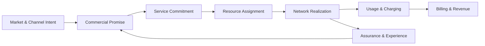
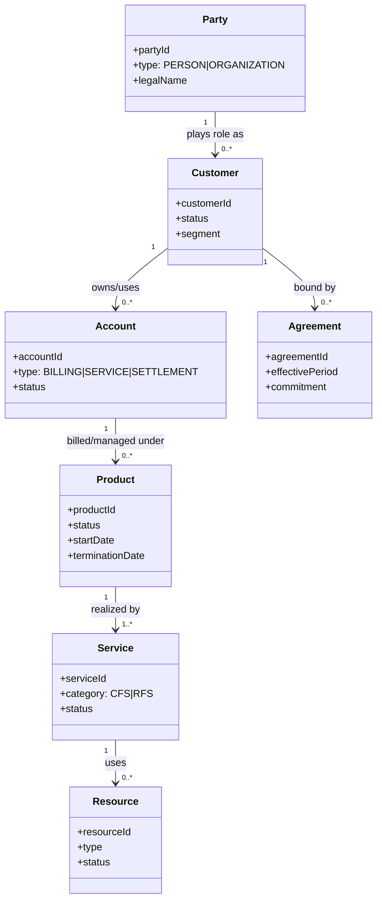
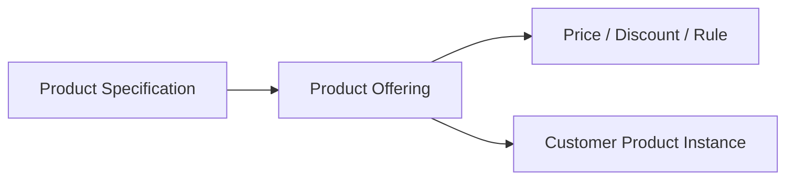
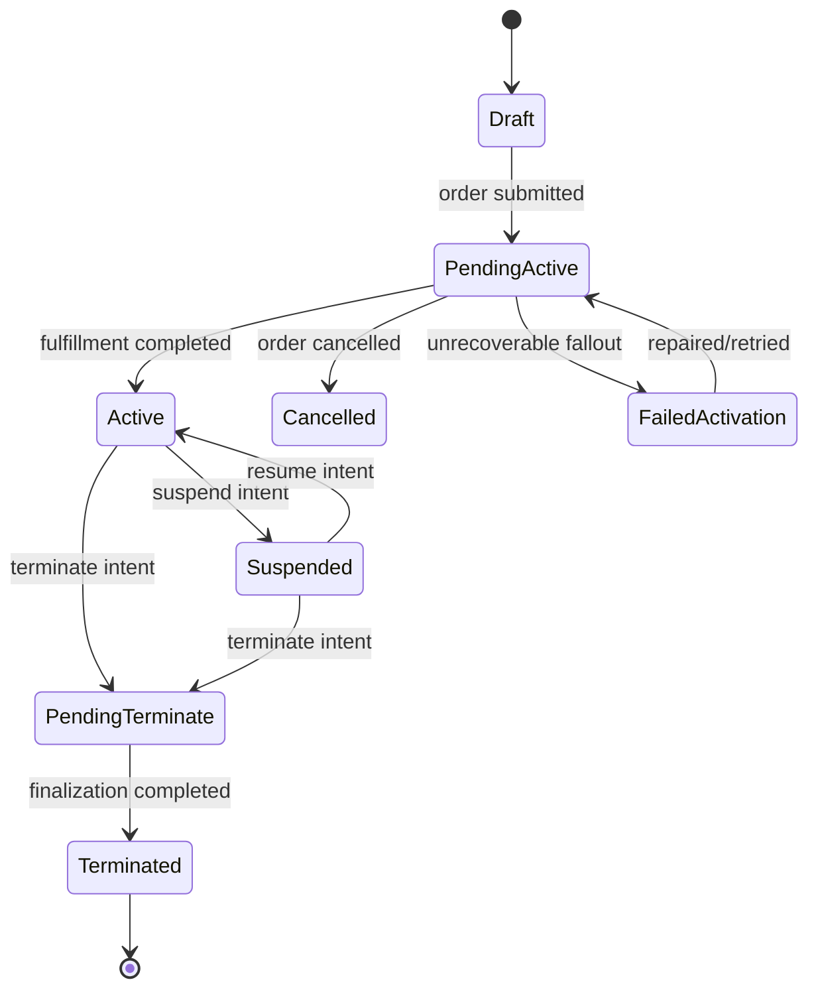
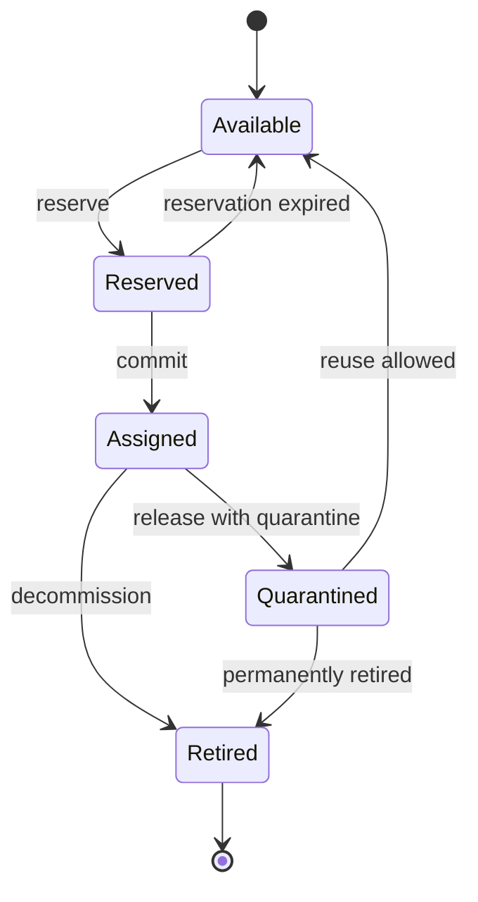
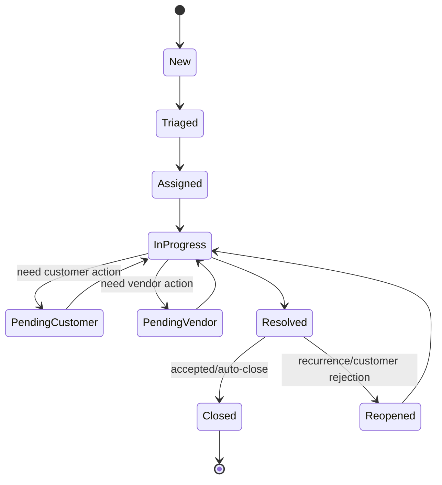
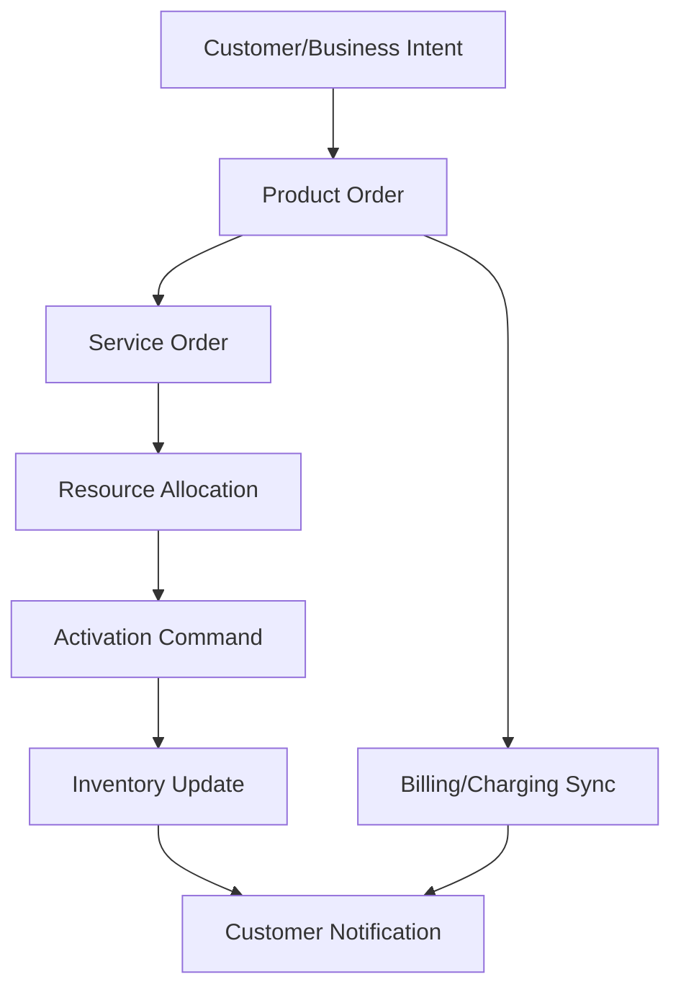
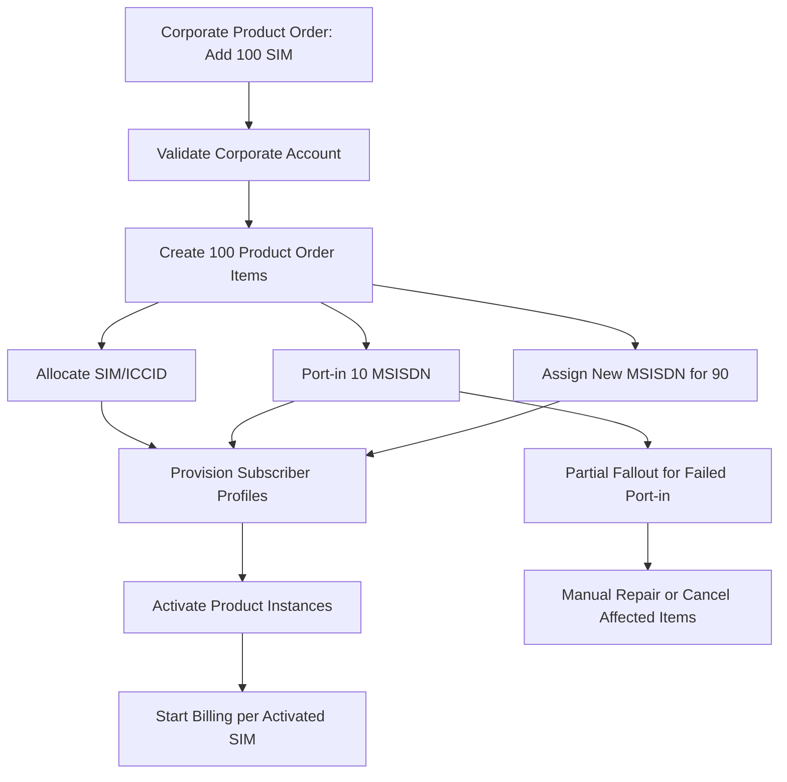

------
title: Learn Java Telecom BSS/OSS - Part 003
description: Domain language, semantic boundaries, lifecycle invariants, and modeling discipline for Java engineers building telecom BSS/OSS systems.
series: learn-java-telecom-bss-oss
seriesTitle: Learn Java Telecom BSS/OSS
order: 3
partTitle: BSS/OSS Domain Language & Invariants
tags:
- java
- telecom
- bss
- oss
- domain-modeling
- tm-forum
- sid
- architecture
date: 2026-06-28
---

# Part 003 — BSS/OSS Domain Language & Invariants

> Goal part ini: membangun bahasa domain yang presisi agar kita tidak mendesain BSS/OSS seperti aplikasi CRUD biasa. Di telecom, salah satu sumber kegagalan terbesar bukan framework Java, bukan database, bukan message broker, tetapi salah memberi arti pada kata seperti `customer`, `account`, `product`, `service`, `resource`, `subscription`, `order`, dan `ticket`.

Part ini adalah jembatan antara peta besar pada Part 001–002 dan implementasi konkret pada part berikutnya. Kita belum masuk catalog, order management, charging, inventory, provisioning, atau assurance secara detail. Kita sedang menyiapkan **semantic foundation** agar setiap part berikutnya punya vocabulary yang sama.

---

## 1. Kaufman Skill Target

Dalam kerangka *The First 20 Hours*, skill harus dipecah menjadi sub-skill yang bisa dilatih dan dikoreksi. Untuk part ini, targetnya bukan “hafal istilah telco”, melainkan mampu melakukan hal berikut:

1. Membaca requirement BSS/OSS dan mengidentifikasi entity domain yang benar.
2. Membedakan **commercial view**, **service view**, **resource view**, **network view**, **financial view**, dan **operational view**.
3. Menentukan invariant yang wajib benar sepanjang lifecycle.
4. Menghindari model data generik yang terlihat fleksibel tetapi merusak auditability, fulfillment, charging, dan troubleshooting.
5. Mendesain model Java yang cukup kuat untuk workflow multi-tahap, multi-sistem, multi-vendor, dan multi-hari.

Hasil ideal setelah part ini: ketika ada requirement seperti “pelanggan upgrade paket, nomor tetap, billing prorate, kuota berubah real-time, provisioning ke OCS gagal, order harus pending manual”, kamu bisa langsung memetakan dampaknya ke **customer/account/product/service/resource/order/charging/provisioning/fallout** tanpa campur aduk.

---

## 2. Mengapa Bahasa Domain BSS/OSS Itu Sulit

Di banyak domain enterprise, satu kata biasanya punya arti relatif stabil. Di telecom, satu kata bisa punya arti berbeda tergantung lapisan:

- “Paket” menurut sales adalah **product offering**.
- “Paket” menurut customer care adalah **product subscription**.
- “Paket” menurut network adalah **service profile** atau **policy**.
- “Paket” menurut charging adalah **rating/charging rule**.
- “Paket” menurut assurance adalah **service quality expectation**.
- “Paket” menurut finance adalah **revenue item**.

Jika semua itu disimpan sebagai `package_id` di satu tabel besar, sistem akan tampak sederhana selama demo dan hancur ketika menghadapi perubahan nyata: upgrade, downgrade, suspension, contract renewal, quota carry-over, number portability, dual billing account, corporate hierarchy, wholesale settlement, atau 5G slice assurance.

### Mental model utama

BSS/OSS bukan satu aplikasi. BSS/OSS adalah **lifecycle fabric**:



Setiap layer punya model sendiri. Domain architect yang kuat tidak memaksa semuanya menjadi satu entity. Ia menentukan **translation boundary** antar-layer.

---

## 3. Domain Layers: Jangan Campur Commercial, Service, Resource, dan Network

### 3.1 Commercial Layer

Commercial layer menjawab:

- Siapa pelanggan?
- Apa yang dijual?
- Dalam syarat komersial apa?
- Berapa harga, diskon, kontrak, penalty, dan entitlement?
- Melalui channel mana transaksi dibuat?

Core objects:

| Object | Makna | Kesalahan umum |
|---|---|---|
| `Party` | Orang/organisasi sebagai aktor legal atau relasional | Menganggap semua party adalah customer |
| `Customer` | Party yang memiliki relasi customer dengan CSP | Menjadikan customer sebagai login user |
| `Account` | Struktur akuntansi, billing, service, atau settlement | Menggabungkan customer dan billing account |
| `Agreement` | Kontrak, term, commitment, SLA/SLS | Menyimpan contract sebagai PDF saja |
| `ProductOffering` | Sesuatu yang dijual di pasar/channel | Menyamakan offering dengan service teknis |
| `Product` | Instance commercial yang dimiliki customer | Menggunakan product sebagai network service |
| `Quote` | Proposal harga/konfigurasi sebelum order | Menganggap quote pasti menjadi order |
| `ProductOrder` | Permintaan perubahan commercial state | Menjadikan order sekadar header transaksi |

### 3.2 Service Layer

Service layer menjawab:

- Kemampuan apa yang dijanjikan kepada customer?
- Bagaimana product diterjemahkan menjadi service?
- Service apa yang customer-facing dan resource-facing?
- Dependency apa yang harus aktif agar service valid?

Core objects:

| Object | Makna | Kesalahan umum |
|---|---|---|
| `CustomerFacingService` / CFS | Service yang bermakna bagi customer | Mengisinya dengan nama network element |
| `ResourceFacingService` / RFS | Service teknis yang mendukung CFS | Tidak membedakan service dan resource |
| `ServiceSpecification` | Template service lifecycle | Menanam logic provisioning di product catalog |
| `ServiceOrder` | Permintaan perubahan service state | Menganggap service order sama dengan product order |
| `ServiceInventory` | Instance service yang sudah/akan direalisasi | Menjadikan inventory hanya cache dari network |

### 3.3 Resource Layer

Resource layer menjawab:

- Resource apa yang harus tersedia, dipesan, dialokasikan, digunakan, dilepas?
- Resource mana yang logical dan mana yang physical?
- Siapa authoritative source untuk resource tertentu?

Core objects:

| Object | Contoh | Invariant penting |
|---|---|---|
| `MSISDN` | Nomor telepon | Tidak boleh assigned ke dua subscriber aktif dalam domain yang sama |
| `IMSI` | Subscriber identity di SIM | Binding ke SIM/subscriber harus terkontrol |
| `ICCID` | Identitas kartu SIM | Harus punya lifecycle stock/issued/active/retired |
| `IP Address` | Static/dynamic IP | Allocation harus menghindari collision |
| `Port` | Fiber port, switch port | Physical capacity dan topology harus konsisten |
| `Device` | CPE, modem, router | Ownership, warranty, stock, dan installation state harus jelas |
| `Circuit` | Enterprise connectivity | Path dan endpoint harus traceable |

### 3.4 Network Layer

Network layer menjawab:

- Perubahan apa yang benar-benar dikirim ke network element atau network function?
- Apakah command berhasil, pending, timeout, atau ambiguous?
- Bagaimana sistem memastikan planned state sama dengan actual state?

Contoh target network/control-plane:

- HLR/HSS/UDM untuk subscriber profile.
- PCRF/PCF untuk policy.
- OCS/CHF untuk online charging.
- AAA/RADIUS untuk fixed broadband access.
- DNS/IPAM untuk IP service.
- SDN controller untuk network path.
- NFVO/VNFM/VIM untuk network service atau VNF/CNF lifecycle.

### 3.5 Financial Layer

Financial layer menjawab:

- Usage event mana yang chargeable?
- Bagaimana rating diterapkan?
- Bagaimana invoice dibentuk?
- Bagaimana payment dialokasikan?
- Bagaimana dispute dan adjustment dikontrol?

Core objects:

| Object | Makna |
|---|---|
| `UsageEvent` | Event pemakaian: voice, data, SMS, content, API call |
| `RatedEvent` | Usage yang sudah diberi nilai harga/charge |
| `Balance` | Prepaid balance, quota, allowance, monetary/non-monetary unit |
| `BillCycle` | Siklus billing untuk account |
| `Invoice` | Dokumen tagihan |
| `Payment` | Uang masuk |
| `Adjustment` | Koreksi finansial dengan alasan dan approval |
| `Dispute` | Sengketa tagihan |

### 3.6 Operational Layer

Operational layer menjawab:

- Ada kegagalan apa?
- Siapa yang harus bertindak?
- SLA clock berjalan dari kapan?
- Evidence apa yang dibutuhkan untuk closure?
- Customer mana terdampak?

Core objects:

| Object | Makna |
|---|---|
| `Alarm` | Sinyal fault dari network/resource/service |
| `Event` | Fakta operasional yang terjadi |
| `TroubleTicket` | Work item untuk menyelesaikan issue |
| `Incident` | Gangguan dengan impact operasional signifikan |
| `Problem` | Root cause yang bisa menyebabkan banyak incident |
| `Change` | Planned modification ke service/network/platform |
| `WorkOrder` | Tugas lapangan/manual/operasional |

---

## 4. Semantic Backbone: Party → Customer → Account → Product → Service → Resource

Satu model konseptual yang sangat berguna:



Ini bukan schema final. Ini adalah **semantic backbone**. Dalam sistem nyata, relasinya bisa lebih kompleks:

- Satu party bisa punya beberapa customer relationship.
- Satu customer bisa punya beberapa billing account.
- Satu product bisa billed ke account A tetapi digunakan oleh user di account B.
- Satu service bisa mendukung beberapa product.
- Satu resource bisa shared oleh beberapa service.
- Satu agreement bisa mengikat banyak account atau product.

Yang penting: jangan kehilangan arah translasi dari **janji komersial** ke **realitas teknis**.

---

## 5. Perbedaan Entity yang Sering Tertukar

### 5.1 Party vs Customer

`Party` adalah aktor: orang atau organisasi. `Customer` adalah role/relationship terhadap operator.

Contoh:

- PT Nusantara Digital adalah party organisasi.
- PT Nusantara Digital sebagai pelanggan enterprise adalah customer.
- Direktur IT-nya adalah party person.
- Staff procurement-nya juga party person.
- Reseller yang membeli wholesale service juga party, tetapi mungkin customer, partner, dan supplier sekaligus tergantung relationship.

Model buruk:

```java
class Customer {
    String name;
    String ktp;
    String companyName;
    String resellerCode;
    String supplierCode;
}
```

Model ini menggabungkan identitas legal, relasi bisnis, dan role. Ia akan pecah saat B2B hierarchy, partner ecosystem, atau enterprise authorization masuk.

Model lebih baik:

```java
record PartyId(String value) {}
record CustomerId(String value) {}

sealed interface Party permits PersonParty, OrganizationParty {
    PartyId id();
}

record PersonParty(PartyId id, String legalName, IdentityDocument document) implements Party {}
record OrganizationParty(PartyId id, String legalName, TaxProfile taxProfile) implements Party {}

record Customer(
    CustomerId id,
    PartyId partyId,
    CustomerStatus status,
    CustomerSegment segment
) {}
```

### 5.2 Customer vs Account

Customer adalah relasi pelanggan. Account adalah wadah akuntansi, billing, service administration, atau settlement.

Kesalahan yang sering terjadi: menyimpan semua tagihan, subscription, user, service address, dan invoice langsung di `customer_id`.

Akibatnya:

- Sulit memindahkan satu subscription ke billing account lain.
- Sulit corporate split billing.
- Sulit parent-child enterprise account.
- Sulit mengelola collection dan dunning per billing account.
- Sulit memisahkan service account dari billing account.

Invariant yang lebih kuat:

- Product aktif harus punya billing responsibility yang jelas.
- Invoice harus ditagihkan ke billing account, bukan sekadar customer.
- Service delivery address bisa berbeda dari billing address.
- Payment allocation harus bisa ditelusuri ke invoice/billing account.

### 5.3 Product Offering vs Product

`ProductOffering` adalah sesuatu yang tersedia untuk dijual. `Product` adalah instance yang dimiliki customer.



Contoh:

- `Fiber 300 Mbps + IPTV Family Pack` sebagai offering.
- `Subscription #P-12345` milik customer A sebagai product instance.

Jangan taruh seluruh network activation logic di offering. Catalog harus tahu apa yang dijual dan constraints-nya, bukan menjadi orchestrator teknis.

### 5.4 Product vs Service

Product adalah view komersial. Service adalah view kemampuan teknis/operasional.

Contoh fixed broadband:

- Product: `Home Fiber 300 Mbps`.
- CFS: `Residential Internet Access`.
- RFS: `GPON Access Service`, `IP Connectivity Service`, `DNS Service`, `CPE Management Service`.
- Resource: `ONT`, `Fiber Port`, `VLAN`, `IP Pool Allocation`.

Jika product langsung “di-provision” ke router/OLT tanpa service decomposition, sistem akan sulit mengelola:

- upgrade bandwidth,
- service impact,
- troubleshooting,
- dependency,
- migration teknologi,
- bundle product,
- enterprise SLA.

### 5.5 Service vs Resource

Service adalah kemampuan. Resource adalah asset/kapasitas/identity yang digunakan untuk merealisasikan service.

Contoh mobile data:

- Service: `Mobile Data Access`.
- Resource: `IMSI`, `MSISDN`, `APN profile`, `policy rule`, `charging key`.

Resource bisa assigned, reserved, quarantined, retired. Service bisa designed, active, suspended, terminated.

Lifecycle-nya mirip tetapi tidak sama.

### 5.6 Order vs Inventory

Order adalah permintaan perubahan. Inventory adalah state hasil/planned/actual dari perubahan.

Anti-pattern:

- Order record menjadi sumber kebenaran jangka panjang.
- Sistem membaca status layanan dari order terakhir.
- Cancel order menghapus service.
- Retry provisioning membuat order item duplikat.

Model yang benar:

- `ProductOrder` merekam intent dan progress.
- `ProductInventory` merekam product instance.
- `ServiceInventory` merekam service instance.
- `ResourceInventory` merekam resource assignment.
- Event dari order mengubah inventory melalui state transition yang diaudit.

### 5.7 Ticket vs Incident vs Alarm

Alarm adalah sinyal. Ticket adalah work item. Incident adalah gangguan yang punya impact dan koordinasi. Problem adalah root cause jangka panjang.

Jangan jadikan semua alarm sebagai ticket. Jangan jadikan semua ticket sebagai incident. Jangan menutup alarm hanya karena ticket ditutup tanpa evidence yang sesuai.

---

## 6. Lifecycle Vocabulary: State, Status, Phase, Reason, dan Intent

BSS/OSS sering gagal karena mencampur lima hal ini:

| Konsep | Makna | Contoh |
|---|---|---|
| State | Posisi lifecycle resmi | `ACTIVE`, `SUSPENDED`, `TERMINATED` |
| Status | Kondisi operasional/administratif | `PENDING_ACTIVATION`, `IN_ERROR` |
| Phase | Tahap proses | `VALIDATION`, `FULFILLMENT`, `BILLING_SYNC` |
| Reason | Alasan perubahan | `NON_PAYMENT`, `CUSTOMER_REQUEST`, `FRAUD` |
| Intent | Perintah bisnis | `ACTIVATE`, `MODIFY`, `SUSPEND`, `RESUME` |

Contoh buruk:

```java
enum SubscriptionStatus {
    NEW,
    ACTIVE,
    SUSPENDED,
    CANCELLED,
    PAYMENT_FAILED,
    PROVISIONING_FAILED,
    WAITING_FOR_INSTALLER,
    MIGRATION_PENDING
}
```

Enum ini mencampur lifecycle, error, workflow, reason, dan operational phase.

Model lebih sehat:

```java
enum ProductState {
    DRAFT,
    PENDING_ACTIVE,
    ACTIVE,
    SUSPENDED,
    PENDING_TERMINATE,
    TERMINATED
}

enum LifecycleReason {
    CUSTOMER_REQUEST,
    NON_PAYMENT,
    FRAUD_CONTROL,
    CONTRACT_END,
    TECHNICAL_MIGRATION,
    REGULATORY_REQUIREMENT
}

enum OrderPhase {
    CAPTURED,
    VALIDATING,
    DECOMPOSING,
    FULFILLING,
    BILLING_SYNC,
    COMPLETED,
    FAILED,
    CANCELLED
}
```

Prinsipnya: **state entity jangan dipakai sebagai tempat menumpuk semua kondisi proses**.

---

## 7. Invariants: Hal yang Harus Selalu Benar

Invariant adalah aturan yang tidak boleh dilanggar walaupun sistem asynchronous, ada retry, ada message duplicate, ada vendor timeout, atau ada manual repair.

### 7.1 Identity invariants

- `PartyId` tidak boleh berubah karena koreksi nama.
- `CustomerId` tidak boleh digunakan sebagai identity legal.
- `AccountId` tidak boleh menjadi surrogate untuk subscriber/service.
- `MSISDN`, `IMSI`, `ICCID`, dan `ServiceId` punya domain uniqueness berbeda.
- External ID dari vendor tidak boleh menjadi primary identity internal tanpa anti-corruption boundary.

### 7.2 Commercial invariants

- Product aktif harus punya customer owner atau valid account owner.
- Product aktif harus punya price/charging treatment yang dapat dijelaskan.
- Product yang sudah terminated tidak boleh menerima recurring charge baru kecuali ada final bill/adjustment rule eksplisit.
- Product modification harus preserve audit trail terhadap offering/spec/version yang berlaku saat order dibuat.
- Eligibility yang dipakai saat quote/order harus direkam agar dapat diaudit.

### 7.3 Service invariants

- CFS aktif harus punya realisasi teknis yang cukup atau status exception yang jelas.
- Service state tidak boleh hanya hasil copy dari product state.
- Service dependency harus diketahui untuk impact analysis.
- Service modification harus mempertahankan continuity rule: apakah service boleh downtime, partial, atau perlu maintenance window.

### 7.4 Resource invariants

- Resource tidak boleh assigned ke dua active service jika business rule menyatakan exclusive.
- Resource reservation harus expired atau committed; tidak boleh menggantung tanpa owner.
- Resource release harus mempertimbangkan quarantine/reuse policy.
- Planned inventory dan actual network state harus punya reconciliation path.

### 7.5 Charging/billing invariants

- Usage event harus punya deduplication key.
- Rated event harus traceable ke rating rule/version.
- Invoice line harus traceable ke product/account/bill cycle.
- Adjustment harus punya reason, approver, dan audit trail.
- Payment allocation harus reversible atau compensatable sesuai accounting rule.

### 7.6 Operational invariants

- Alarm correlation tidak boleh menghapus evidence asli.
- Ticket closure harus punya resolution reason.
- SLA clock harus punya start/stop/pause semantics yang konsisten.
- Manual override harus meninggalkan audit event yang cukup untuk regulator, finance, dan root cause analysis.

---

## 8. Entity Lifecycle Diagrams

### 8.1 Product lifecycle



Catatan penting:

- `FailedActivation` bisa menjadi state entity atau hanya order phase tergantung desain. Untuk product, biasanya lebih aman menjaga product tetap `PENDING_ACTIVE` dengan fulfillment status `IN_FALLOUT`, kecuali organisasi butuh representasi eksplisit.
- `Cancelled` berbeda dari `Terminated`. Cancel berarti intent tidak jadi direalisasikan; terminate berarti instance pernah valid/aktif lalu diakhiri.

### 8.2 Resource lifecycle



Resource lifecycle harus berdiri sendiri. Jangan otomatis melepaskan resource hanya karena product berubah jika ada dependency teknis atau regulatory retention.

### 8.3 Trouble ticket lifecycle



Ticket lifecycle harus punya reason dan SLA semantics. Tanpa itu, reporting akan terlihat lengkap tetapi tidak bisa dipercaya.

---

## 9. Order Semantics: Intent, Not Just Transaction

Order di BSS/OSS bukan sekadar `INSERT INTO order`. Order adalah **intent** untuk mengubah state beberapa entity.

Intent contoh:

- Activate new subscription.
- Modify bandwidth.
- Add add-on.
- Remove add-on.
- Suspend due to non-payment.
- Resume after payment.
- Terminate at contract end.
- Relocate service address.
- Replace SIM.
- Port-in number.
- Change billing account.

Setiap intent bisa menyentuh layer berbeda:



Ingat: satu product order bisa menghasilkan banyak service order item dan resource action. Sebaliknya, satu operational change bisa mengubah service/resource tanpa product order jika murni network remediation.

---

## 10. Event Grammar: Fakta Domain Harus Bernama Jelas

Dalam BSS/OSS, event harus dinamai sebagai fakta yang sudah terjadi, bukan command yang ingin dilakukan.

| Command/Intent | Event/Fakta |
|---|---|
| `ActivateProduct` | `ProductActivationRequested`, `ProductActivated` |
| `ReserveMsisdn` | `MsisdnReserved` |
| `ProvisionSubscriber` | `SubscriberProvisioningRequested`, `SubscriberProvisioned` |
| `SuspendForNonPayment` | `ProductSuspendedForNonPayment` |
| `CloseTicket` | `TroubleTicketClosed` |

Event yang baik punya:

- aggregate id,
- causation id,
- correlation id,
- actor/system,
- event time,
- effective time,
- reason,
- version,
- source system,
- payload minimal tetapi cukup untuk consumer.

Contoh Java-style event:

```java
public record ProductSuspended(
    ProductId productId,
    CustomerId customerId,
    AccountId billingAccountId,
    LifecycleReason reason,
    Instant effectiveAt,
    String correlationId,
    String causationId,
    String sourceSystem,
    long schemaVersion
) implements DomainEvent {}
```

`effectiveAt` dan `eventCreatedAt` tidak selalu sama. Dalam billing, charging, SLA, dan contract logic, perbedaan ini sangat penting.

---

## 11. Java Modeling Discipline untuk BSS/OSS

Kita tidak akan mengulang Java core. Yang penting di sini adalah disiplin modeling domain.

### 11.1 Gunakan value object untuk identity domain

Jangan semua ID menjadi `String` mentah.

```java
public record ProductId(String value) {
    public ProductId {
        if (value == null || value.isBlank()) {
            throw new IllegalArgumentException("product id must not be blank");
        }
    }
}

public record Msisdn(String value) {
    public Msisdn {
        if (!value.matches("\\+?[1-9][0-9]{7,14}")) {
            throw new IllegalArgumentException("invalid MSISDN format");
        }
    }
}
```

Ini bukan sekadar type-safety kosmetik. Dalam telco, salah memakai `msisdn` sebagai `customer_id`, atau `account_id` sebagai `subscriber_id`, bisa menyebabkan salah charge, salah suspend, atau salah expose data customer.

### 11.2 Jangan jadikan enum sebagai tempat sampah domain

Enum lifecycle harus kecil, stabil, dan punya transition rule. Reason/phase/error harus dipisahkan.

```java
public final class ProductLifecycle {
    private static final Map<ProductState, Set<ProductState>> ALLOWED = Map.of(
        ProductState.DRAFT, Set.of(ProductState.PENDING_ACTIVE),
        ProductState.PENDING_ACTIVE, Set.of(ProductState.ACTIVE, ProductState.CANCELLED),
        ProductState.ACTIVE, Set.of(ProductState.SUSPENDED, ProductState.PENDING_TERMINATE),
        ProductState.SUSPENDED, Set.of(ProductState.ACTIVE, ProductState.PENDING_TERMINATE),
        ProductState.PENDING_TERMINATE, Set.of(ProductState.TERMINATED),
        ProductState.TERMINATED, Set.of(),
        ProductState.CANCELLED, Set.of()
    );

    public static void assertTransition(ProductState from, ProductState to) {
        if (!ALLOWED.getOrDefault(from, Set.of()).contains(to)) {
            throw new InvalidLifecycleTransition(from, to);
        }
    }
}
```

### 11.3 Model effective period

Banyak bug telco adalah bug waktu.

- Customer order dibuat hari ini.
- Activation efektif besok.
- Billing cycle mulai tanggal 1.
- Promotion valid sampai akhir bulan.
- Contract commitment 12 bulan.
- Suspend effective segera tetapi invoice adjustment berlaku akhir cycle.

Gunakan konsep explicit:

```java
public record EffectivePeriod(
    LocalDateTime startsAt,
    LocalDateTime endsAt
) {
    public boolean contains(LocalDateTime t) {
        return !t.isBefore(startsAt) && (endsAt == null || t.isBefore(endsAt));
    }
}
```

Dalam sistem produksi, kamu juga perlu timezone policy yang eksplisit. Jangan diam-diam memakai timezone server.

### 11.4 Pisahkan model command, entity, dan event

Command adalah permintaan. Entity adalah state. Event adalah fakta.

```java
public record SuspendProductCommand(
    ProductId productId,
    LifecycleReason reason,
    Instant requestedAt,
    String requestedBy
) {}

public record Product(
    ProductId id,
    ProductState state,
    ProductOfferingRef offering,
    CustomerId customerId,
    AccountId billingAccountId
) {}

public record ProductSuspendedEvent(
    ProductId productId,
    ProductState previousState,
    ProductState newState,
    LifecycleReason reason,
    Instant effectiveAt
) {}
```

Mencampur ketiganya akan menyulitkan audit, retry, idempotency, dan integration replay.

---

## 12. Boundary dan Ownership: Siapa Pemilik Kebenaran?

Setiap entity harus punya owner. Tanpa ownership, integrasi BSS/OSS menjadi pertukaran data liar.

| Entity | Candidate authoritative owner | Consumer umum |
|---|---|---|
| Party identity | CRM/Party Management | Customer care, billing, order |
| Product catalog | Catalog Management | Channel, order capture, billing, provisioning |
| Product inventory | Product Inventory/Subscription Management | CRM, billing, assurance |
| Service inventory | Service Inventory | Assurance, provisioning, topology |
| Resource inventory | Resource Inventory/IPAM/number mgmt | Provisioning, network planning |
| Balance | Charging/OCS | App, customer care, notification |
| Invoice | Billing | CRM, collection, finance |
| Alarm | Fault Management | Ticketing, assurance, impact analysis |
| Trouble ticket | Trouble Ticket Management | CRM, NOC, field service |

Ownership bukan berarti data tidak boleh dicopy. BSS/OSS butuh read models. Tetapi copy harus punya:

- source,
- freshness expectation,
- reconciliation rule,
- conflict rule,
- audit trail.

---

## 13. Common Anti-Patterns

### 13.1 Super Customer Table

Satu tabel `customer` berisi customer, account, product, service, address, SIM, device, billing, dan status.

Dampak:

- migrasi sulit,
- reporting bias,
- audit lemah,
- fulfillment fragile,
- semua tim saling blokir,
- model tidak bisa menangani B2B/wholesale.

### 13.2 Generic Attribute Everything

Semua hal dijadikan `entity_attribute(name, value)` demi fleksibilitas.

Dampak:

- constraint sulit,
- indexing buruk,
- rule tersebar,
- schema contract hilang,
- API tidak self-documenting,
- lineage data kabur.

EAV kadang berguna untuk extension terbatas, tetapi jangan jadikan backbone untuk lifecycle-critical data.

### 13.3 Product-Driven Provisioning Without Service Layer

Order product langsung memanggil provisioning adapter.

Dampak:

- dependency service tersembunyi,
- upgrade jadi if-else besar,
- assurance tidak tahu service impact,
- network migration merusak catalog,
- bundle sulit.

### 13.4 Order as State Store

Inventory dibaca dari order terakhir.

Dampak:

- amendment/cancel kacau,
- partial completion tidak jelas,
- retry menciptakan ghost service,
- service active tetapi order failed, atau sebaliknya.

### 13.5 Silent Manual Fix

Operator memperbaiki data langsung di database tanpa event/audit.

Dampak:

- reconciliation tidak bisa menjelaskan perubahan,
- regulator/auditor tidak percaya,
- bug sulit direproduksi,
- customer care mendapat state yang tidak bisa diterangkan.

---

## 14. Domain Conversation Template

Saat menerima requirement baru, gunakan template ini.

### 14.1 Pertanyaan boundary

1. Apakah ini perubahan commercial, service, resource, network, financial, atau operational?
2. Entity mana yang menjadi source of truth?
3. Apakah perubahan ini intent, state, event, atau command?
4. Apakah ada effective date yang berbeda dari event time?
5. Apakah state bisa partial, pending, failed, compensated, atau manually repaired?
6. Apakah ada customer/account/product/service/resource lain terdampak?
7. Apakah ada SLA, billing, tax, compliance, atau audit impact?
8. Apakah operation harus idempotent?
9. Apakah external system bisa timeout atau memberi result ambiguous?
10. Bagaimana reconciliation membuktikan final state?

### 14.2 Pertanyaan data model

1. Apakah ID internal dan external ID dipisah?
2. Apakah lifecycle state dipisah dari reason/error/phase?
3. Apakah relation cardinality realistis untuk B2B dan bundle?
4. Apakah historical version dibutuhkan?
5. Apakah value object domain cukup kuat?
6. Apakah model mengizinkan rollback/compensation?
7. Apakah model bisa menjelaskan “kenapa state menjadi seperti ini”?

---

## 15. Practice: Deconstruct Requirement

Requirement:

> Customer corporate ingin menambah 100 SIM employee plan, masing-masing punya data 20GB, shared billing ke account perusahaan, tetapi 10 nomor harus port-in dari operator lain. Jika port-in gagal untuk sebagian nomor, sisanya tetap aktif. Billing harus mulai saat SIM aktif, bukan saat order dibuat. HR admin customer bisa suspend SIM individual.

Mapping:

| Concern | Domain object |
|---|---|
| Corporate customer | `Party`, `Customer`, `CustomerAccount` |
| Shared billing | `BillingAccount` |
| Employee SIM plan | `ProductOffering`, `Product` instances |
| 100 SIM | `Resource` / `ICCID` allocation |
| 10 port-in numbers | `MSISDN`, number portability order/sub-process |
| Partial activation | Order item independent lifecycle |
| Billing start | Product/service activation effective date |
| Suspend individual SIM | Product/service lifecycle command with delegated admin authorization |

Potential invariants:

- Setiap active SIM product harus linked ke billing account corporate.
- Billing start date per product mengikuti activation date masing-masing SIM.
- Port-in failure tidak boleh membatalkan 90 non-port-in SIM kecuali order policy menyatakan all-or-nothing.
- HR admin hanya boleh suspend product yang berada dalam corporate scope.
- MSISDN port-in tidak boleh assigned sebelum portability confirmed.

Mermaid decomposition:



---

## 16. Practice: Refactor a Bad Model

Bad model:

```java
class Subscriber {
    String customerId;
    String name;
    String phoneNumber;
    String packageCode;
    String status;
    BigDecimal monthlyFee;
    String simNumber;
    String billingStatus;
    String deviceId;
}
```

Problems:

- `Subscriber` mencampur customer, product, service, resource, billing.
- `status` ambigu: active product? SIM? payment? network?
- `packageCode` tidak punya versioning offering/spec.
- `monthlyFee` tidak cukup untuk discount/tax/proration.
- `phoneNumber` sebagai string tanpa lifecycle MSISDN.
- Tidak ada account, agreement, order, effective date.

Refactored conceptual model:

```java
record Customer(CustomerId id, PartyId partyId, CustomerSegment segment) {}
record BillingAccount(AccountId id, CustomerId customerId, BillingCycle cycle) {}
record ProductInstance(ProductId id, CustomerId customerId, AccountId billingAccountId,
                       ProductOfferingRef offering, ProductState state,
                       EffectivePeriod effectivePeriod) {}
record ServiceInstance(ServiceId id, ProductId productId, ServiceSpecificationRef spec,
                       ServiceState state) {}
record SimResource(Iccid iccid, Imsi imsi, ResourceState state) {}
record MsisdnResource(Msisdn msisdn, ResourceState state) {}
record SubscriberProfile(ServiceId serviceId, Imsi imsi, Msisdn msisdn, PolicyProfileRef policy) {}
```

Ini belum final database schema. Ini adalah semantic decomposition agar invariant bisa ditempatkan dengan benar.

---

## 17. Minimal Skill Drill

Untuk melatih part ini selama 60–90 menit:

1. Ambil 5 use case telco: new activation, upgrade, suspend, resume, terminate.
2. Untuk tiap use case, buat tabel dampak ke commercial/service/resource/network/financial/operational.
3. Tuliskan minimal 5 invariant per use case.
4. Gambar lifecycle state untuk product/service/resource yang terlibat.
5. Tandai mana command, mana event, mana state.
6. Cari minimal 3 ambiguity dari requirement.
7. Refactor model entity jika ada field yang mencampur layer.

Kamu sudah memahami part ini jika bisa menjelaskan mengapa `Product`, `Service`, dan `Resource` tidak boleh disatukan meskipun semuanya terlihat seperti “subscription”.

---

## 18. Engineering Checklist

Sebelum implementasi BSS/OSS feature, periksa:

- [ ] Apakah entity domain sudah dipisahkan sesuai layer?
- [ ] Apakah lifecycle state kecil dan konsisten?
- [ ] Apakah reason/error/phase tidak dicampur dengan state?
- [ ] Apakah authoritative owner jelas?
- [ ] Apakah external ID dipisah dari internal ID?
- [ ] Apakah event punya correlation/causation/effective time?
- [ ] Apakah partial completion dimodelkan?
- [ ] Apakah manual repair meninggalkan audit trail?
- [ ] Apakah billing/charging impact diketahui?
- [ ] Apakah assurance/troubleshooting bisa menelusuri product ke service ke resource?

---

## 19. Ringkasan Mental Model

Domain BSS/OSS harus dibaca sebagai rantai translasi:

```text
Business intent
  -> commercial product/order
  -> customer-facing service
  -> resource-facing service
  -> assigned resource
  -> network command/state
  -> usage/charging/billing
  -> assurance/ticket/customer experience
```

Top 1% engineer di domain ini bukan hanya tahu TMF API name atau bisa membuat microservice. Ia bisa menjaga agar **makna domain tidak rusak** ketika sistem menjadi asynchronous, multi-vendor, multi-channel, regulated, dan carrier-grade.

---

## 20. Referensi Resmi dan Lanjutan

- TM Forum Information Framework/SID: https://www.tmforum.org/open-digital-architecture/information-framework-sid/
- TM Forum Process Framework/eTOM: https://www.tmforum.org/open-digital-architecture/process-framework-etom/
- TM Forum Open APIs: https://www.tmforum.org/oda/open-apis/
- TM Forum ODA: https://www.tmforum.org/open-digital-architecture/

Pada part berikutnya, kita masuk ke **Industry Reference Models**: bagaimana TM Forum, 3GPP, ETSI, MEF, dan GSMA ditempatkan secara pragmatis dalam arsitektur Java BSS/OSS, tanpa menjadi “standards-driven bureaucracy”.
