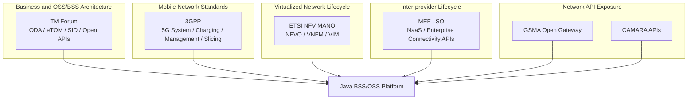
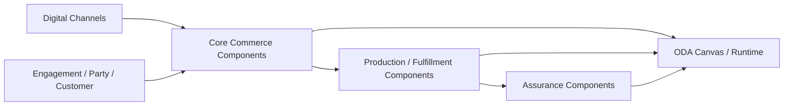
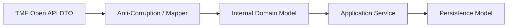
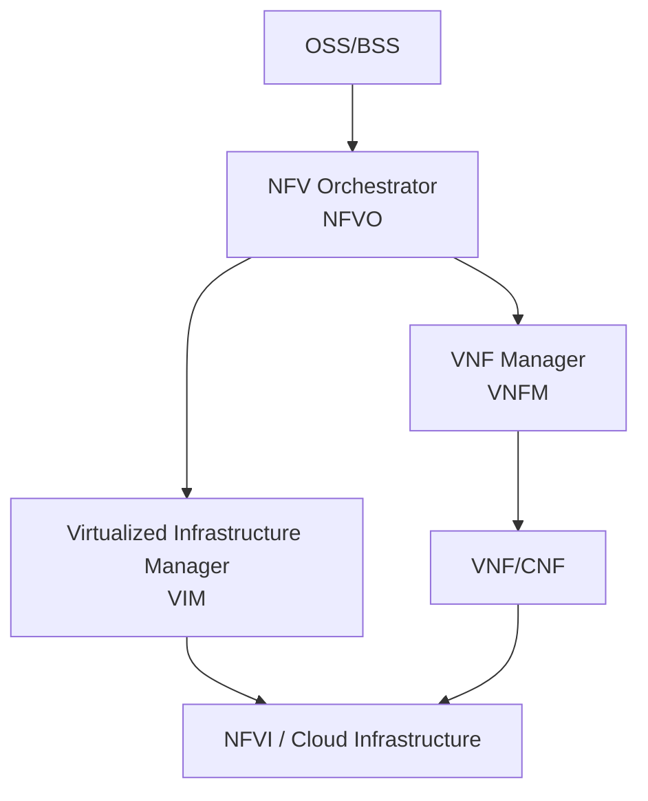
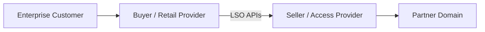
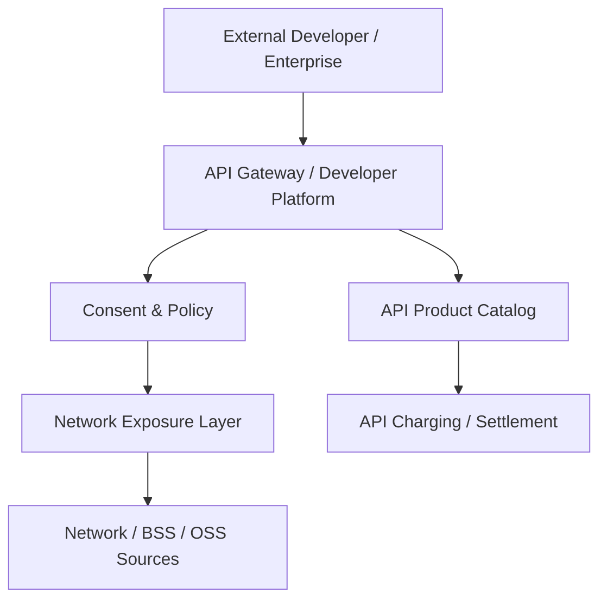
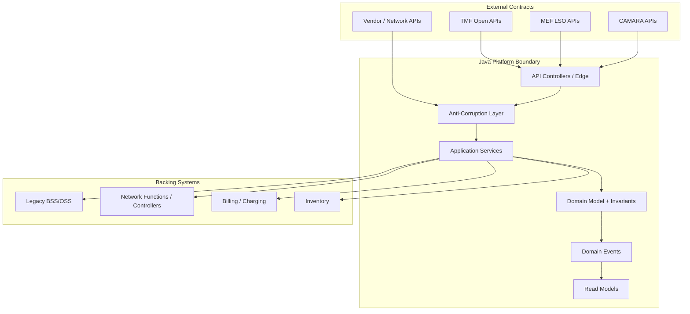
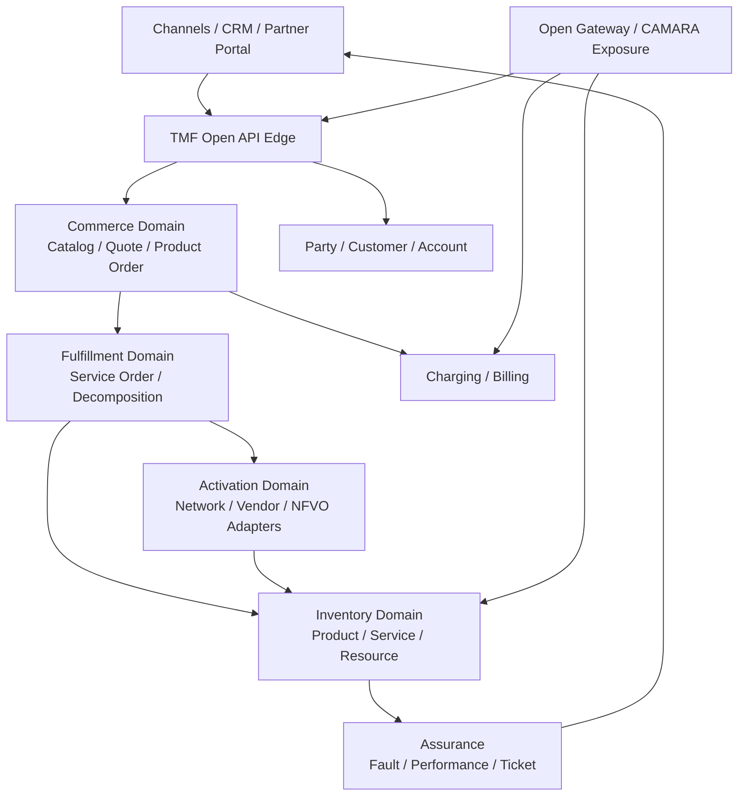

------
title: Learn Java Telecom BSS/OSS - Part 004
description: Practical map of TM Forum, 3GPP, ETSI NFV, MEF LSO, GSMA Open Gateway/CAMARA, and how Java BSS/OSS architects should use standards without overfitting to them.
series: learn-java-telecom-bss-oss
seriesTitle: Learn Java Telecom BSS/OSS
order: 4
partTitle: Industry Reference Models
tags:
- java
- telecom
- bss
- oss
- tm-forum
- etom
- sid
- oda
- 3gpp
- etsi-nfv
- mef-lso
- gsma
- camara
date: 2026-06-28
---

# Part 004 — Industry Reference Models

> Goal part ini: memahami standar dan reference model telco sebagai **kompas arsitektur**, bukan sebagai dogma. Engineer yang kuat tahu kapan memakai TM Forum, kapan membaca 3GPP, kapan ETSI NFV relevan, kapan MEF LSO masuk, kapan GSMA Open Gateway/CAMARA penting, dan kapan standar harus dibungkus oleh bounded context internal.

Di banyak organisasi, standar dipakai dengan dua cara yang sama-sama berbahaya:

1. **Diabaikan total** — semua sistem dibangun custom, lalu integrasi vendor/partner menjadi mahal dan rapuh.
2. **Diikuti secara literal tanpa desain** — semua entity internal dipaksa mengikuti standar, lalu domain internal menjadi kaku, verbose, dan sulit berevolusi.

Pendekatan yang kita pakai: **standards-informed architecture**.

Artinya:

- gunakan standar untuk vocabulary, contract, interoperability, conformance, dan procurement;
- gunakan bounded context internal untuk correctness, performance, lifecycle, audit, dan evolusi produk;
- buat anti-corruption layer antara internal model dan external standard model;
- jadikan standar sebagai map, bukan sebagai database schema final.

---

## 1. Kaufman Skill Target

Setelah part ini, kamu harus bisa:

1. Menjelaskan peran TM Forum ODA, eTOM, SID, dan Open APIs dalam BSS/OSS.
2. Menentukan kapan 3GPP relevan untuk Java BSS/OSS engineer.
3. Memahami posisi ETSI NFV MANO dalam orchestration dan network lifecycle.
4. Menempatkan MEF LSO untuk inter-provider dan enterprise connectivity lifecycle.
5. Menempatkan GSMA Open Gateway/CAMARA untuk network API exposure.
6. Membuat architecture decision yang tidak overfit terhadap satu vendor atau satu dokumen standar.
7. Membuat traceability matrix dari requirement ke reference model, API, event, dan internal service.

---

## 2. Standards Landscape: Peta Besar



Ringkasan cepat:

| Reference | Dipakai untuk | Jangan dipakai untuk |
|---|---|---|
| TM Forum ODA | Target architecture, component boundaries, BSS/OSS modernization | Menyalin semua desain vendor apa adanya |
| eTOM | Process taxonomy dan common language | Mengubah semua workflow internal menjadi bureaucracy diagram |
| SID | Information model vocabulary | Menjadikannya schema database langsung tanpa bounded context |
| TMF Open APIs | External contract dan interoperability | Mengganti internal domain model secara membabi buta |
| 3GPP | Mobile network, charging, slicing, management semantics | Mendesain CRM/catalog umum |
| ETSI NFV MANO | VNF/CNF/network service orchestration | Mengganti BSS order management |
| MEF LSO | Inter-provider service lifecycle, enterprise connectivity | Mobile retail consumer journey |
| GSMA Open Gateway/CAMARA | Network capability APIs untuk developer/partner ecosystem | Internal BSS canonical model |

---

## 3. TM Forum: Backbone untuk BSS/OSS

TM Forum adalah reference family paling penting untuk BSS/OSS modernization. Dalam konteks seri ini, kita pakai empat pilar:

1. **ODA** — target architecture dan component thinking.
2. **eTOM / Business Process Framework** — process map.
3. **SID / Information Framework** — information/data vocabulary.
4. **Open APIs** — interoperable API contract.

### 3.1 ODA: Open Digital Architecture

ODA membantu menjawab:

- Bagaimana BSS/OSS modern dipisah menjadi komponen?
- Bagaimana CSP keluar dari monolith legacy menuju architecture cloud-native?
- Apa boundary komponen seperti Product Catalog, Product Ordering, Service Inventory, Resource Inventory, Trouble Ticket?
- Bagaimana API dan data model diposisikan?
- Bagaimana component deployment/runtime dan conformance dipikirkan?

Mental model:



Dalam Java architecture, ODA berguna sebagai starting point untuk menentukan:

- bounded context,
- service ownership,
- API surface,
- event contract,
- integration boundary,
- procurement boundary,
- migration slices.

Tetapi ODA bukan instruksi untuk membuat satu microservice per API. Satu bounded context bisa expose beberapa API; satu API bisa diimplementasikan oleh service internal yang lebih granular; satu legacy system bisa menjadi backing implementation di balik ODA facade selama fase transisi.

### 3.2 eTOM: Process Framework

_eTOM_ atau Business Process Framework adalah taxonomy proses. Ia membantu organisasi memakai bahasa yang sama untuk aktivitas provider.

Gunanya:

- menyamakan bahasa antara business, IT, operations, vendor, dan partner;
- memetakan process ownership;
- mengidentifikasi gap capability;
- menghubungkan process ke application/component;
- membantu procurement dan RFP.

Contoh mapping:

| eTOM-style concern | Sistem/kapabilitas |
|---|---|
| Selling | Channel, CPQ, quote, cart |
| Order Handling | Product Order Management |
| Service Configuration & Activation | Service Order, activation/provisioning |
| Resource Provisioning | Resource inventory, network adapter |
| Problem Handling | Fault, ticket, incident |
| Billing & Collections | Billing, invoicing, payment, collection |
| Service Quality Management | Performance, QoS/QoE, SLA monitoring |

Cara salah memakai eTOM: menjadikannya flow detail implementasi. eTOM adalah process map, bukan BPMN final. Workflow nyata tetap harus dibuat berdasarkan order type, service type, channel, SLA, dan operational constraint.

### 3.3 SID: Information Framework

SID adalah information/data reference model. Gunanya bukan agar kamu menyalin seluruh SID ke database, tetapi agar kamu punya vocabulary stabil untuk entity penting.

SID membantu menjawab:

- Apa perbedaan Party, Customer, Account?
- Apa perbedaan Product, Service, Resource?
- Bagaimana relasi agreement, product offering, product specification?
- Bagaimana common data dictionary dibentuk?
- Bagaimana API data model punya basis konseptual?

Dalam Java system, SID paling berguna untuk:

- naming consistency,
- conceptual model review,
- anti-corruption layer mapping,
- API payload alignment,
- data governance,
- vendor integration.

Anti-pattern: “SID-driven database”. Banyak model SID bersifat broad, inheritance-heavy, dan reference-oriented. Database/service internal butuh aggregate boundary, invariant, transactional scope, dan performance path yang spesifik.

### 3.4 TM Forum Open APIs

TM Forum Open APIs adalah REST API collection untuk berbagai domain BSS/OSS seperti product catalog, product ordering, customer management, service inventory, resource inventory, trouble ticket, usage, billing, dan lain-lain.

Gunanya:

- external interoperability,
- partner integration,
- vendor-neutral contract,
- canonical facade untuk legacy,
- API conformance,
- procurement requirement.

Dalam Java implementation, kita harus membedakan:



Jangan gunakan Open API DTO sebagai JPA entity. Jangan juga menyalin seluruh payload ke domain tanpa validasi semantic. API contract adalah boundary; domain model adalah tempat invariant.

---

## 4. 3GPP: Saat BSS/OSS Menyentuh Mobile Network

3GPP relevan ketika BSS/OSS berhubungan dengan mobile network capabilities, charging, subscriber profile, policy, slicing, roaming, dan management.

Contoh area yang akan sering bersentuhan dengan Java BSS/OSS:

| Area | Relevansi ke BSS/OSS |
|---|---|
| Subscriber provisioning | HSS/UDM/profile activation |
| Policy | PCRF/PCF, quota, QoS, APN/DNN treatment |
| Charging | Online/offline charging, CHF/OCS integration |
| Usage | CDR/EDR/event ingestion |
| Roaming | partner settlement, usage treatment |
| Network slicing | slice order, SLA/SLS, assurance |
| Network management | PM/FM/CM style integration |

### 4.1 Charging Architecture

Untuk BSS engineer, 3GPP charging specs penting karena charging bukan sekadar “billing setelah pemakaian”. Dalam mobile network, charging bisa real-time, session-based, quota-based, policy-driven, dan tightly coupled dengan network control.

Konsep penting:

- **Online charging**: network meminta otorisasi/kuota sebelum atau selama pemakaian.
- **Offline charging**: usage direkam lalu diproses setelahnya.
- **Charging event**: fakta penggunaan yang bisa di-rating.
- **Balance/quota**: monetary atau non-monetary allowance.
- **Rating**: menentukan charge berdasarkan plan, location, time, partner, QoS, service, dan rule.

Implikasi Java architecture:

- idempotent usage ingestion;
- deduplication key wajib;
- low-latency path untuk online charging integration;
- reconciliation path antara network usage, charging, billing;
- versioned rating rule;
- event-time vs processing-time distinction.

### 4.2 5G Slicing dan Management

Network slicing membuat BSS/OSS perlu mengelola janji layanan yang lebih eksplisit:

- slice/service order,
- SLS/SLA,
- slice lifecycle,
- slice performance assurance,
- enterprise customer exposure,
- resource reservation,
- charging treatment.

BSS/OSS tidak harus mengimplementasikan 3GPP network functions. Tetapi BSS/OSS harus bisa menerjemahkan product/order/SLA menjadi request yang dapat dipahami orchestration/network management layer.

---

## 5. ETSI NFV MANO: Virtualized Network Lifecycle

ETSI NFV MANO relevan ketika service realization melibatkan VNF/CNF/network service lifecycle.

Core concept:



Dalam BSS/OSS, kita biasanya tidak mengganti Product Order Management dengan NFVO. Posisi yang lebih tepat:

```text
Product Order
  -> Service Order
  -> Service Orchestration
  -> NFVO / SDN / Domain Controller / Activation Adapter
```

ETSI NFV membantu ketika:

- enterprise customer memesan virtual firewall, SD-WAN, vCPE, private 5G, atau managed network service;
- service chain harus diinstantiate;
- capacity harus dialokasikan di cloud/NFVI;
- VNF/CNF lifecycle harus di-track;
- network service descriptor menjadi input orchestration.

Java implication:

- model `NetworkServiceInstance` terpisah dari `ProductInstance`;
- orchestration adapter harus async dan idempotent;
- lifecycle event dari NFVO harus dikorelasikan ke service order;
- rollback tidak selalu berarti delete; bisa mean heal, scale-in, terminate, or compensate;
- inventory harus bisa menyimpan planned/intended/actual network service state.

---

## 6. MEF LSO: Inter-Provider and Enterprise Connectivity

MEF LSO penting untuk service lifecycle yang melewati boundary provider, terutama enterprise connectivity dan Network-as-a-Service.

Use case umum:

- enterprise Ethernet service,
- inter-provider connectivity,
- access E-line/E-LAN,
- quote/order/service/ticket lintas operator,
- wholesale partner orchestration,
- SLA visibility antar-domain.

Mental model:



Dalam arsitektur Java:

- `ProductOrder` internal bisa memicu `PartnerOrder` eksternal.
- `ServiceInventory` internal harus punya relation ke external service id dari partner.
- SLA/ticket harus punya ownership split.
- Fallout bisa berasal dari partner, bukan dari sistem internal.
- Billing/settlement butuh reconciliation dengan partner records.

Jangan treat partner order seperti internal service order biasa. External provider punya lifecycle, SLA, data model, dan error semantics sendiri.

---

## 7. GSMA Open Gateway dan CAMARA: Network APIs as Products

GSMA Open Gateway dan CAMARA penting ketika network capability diekspos sebagai API kepada developer, enterprise, bank, fraud platform, identity provider, atau digital service ecosystem.

Contoh capability:

- SIM swap check,
- number verification,
- device location,
- quality on demand,
- carrier billing,
- device status,
- identity-related signals.

Poin arsitektur:



Bagi Java engineer, ini memperluas BSS/OSS dari internal telco platform menjadi **API product platform**.

Kamu perlu memodelkan:

- developer/partner onboarding,
- API product catalog,
- entitlement,
- consent,
- rate limit,
- charging per API call,
- privacy and lawful basis,
- audit trail,
- SLA/SLO API,
- network capability abstraction.

Jangan expose network capability mentah. Harus ada policy, consent, productization, monitoring, and settlement layer.

---

## 8. Where Standards Sit in Java Architecture

Diagram pragmatic:



Rules:

1. External standard DTO boleh masuk sampai boundary, bukan ke core domain tanpa mapping.
2. Internal domain harus memegang invariant yang relevan untuk organisasi.
3. Persistence schema boleh berbeda dari API schema.
4. Event internal harus stabil untuk consumer internal; event eksternal bisa memakai standard-specific payload.
5. Adapter harus menyimpan external correlation id dan external state.
6. Jika standar tidak cukup, extension harus explicit, versioned, dan documented.

---

## 9. Standards-to-Capability Mapping

| Capability | TM Forum | 3GPP | ETSI NFV | MEF LSO | GSMA/CAMARA |
|---|---|---|---|---|---|
| Product catalog | Strong | Weak | Weak | Some for services | API product exposure |
| Product ordering | Strong | Weak | Weak | Strong for partner services | API subscription/order possible |
| Service inventory | Strong | Management-related | Network service relation | Service relation | Capability source relation |
| Resource inventory | Strong | Network/resource relation | VNF/CNF resource relation | Access/service resources | Network capability inputs |
| Charging | TMF billing/usage APIs | Strong | Limited | Settlement relation | API monetization relation |
| Provisioning | Service/resource activation | Network-specific | Strong for VNF/CNF lifecycle | Partner fulfillment | Exposure integration |
| Assurance | Trouble/fault/performance APIs | Network management | VNF/CNF health | Inter-provider ticket/SLA | API QoS/SLO exposure |
| Partner ecosystem | Partner APIs exist | Roaming/settlement relation | Not main focus | Strong | Strong developer ecosystem |
| 5G slicing | Product/service model support | Strong | Relevant for virtualized realization | NaaS relation | QoD/exposure relation |

---

## 10. Decision Guide: Standard Mana yang Dipakai?

### 10.1 Jika requirement adalah “buat product catalog telco”

Start with:

- TM Forum Product Catalog concepts.
- SID-style product offering/specification vocabulary.
- Internal catalog aggregate with versioning, eligibility, compatibility.

Do not start with:

- 3GPP specs,
- ETSI NFV,
- CAMARA.

### 10.2 Jika requirement adalah “activate mobile subscriber profile”

Start with:

- Product/service decomposition using TMF/SID vocabulary.
- 3GPP-aware subscriber/policy/charging concepts.
- Vendor-specific HSS/UDM/OCS adapter.

Do not expose:

- vendor provisioning payload directly to product order API.

### 10.3 Jika requirement adalah “enterprise customer orders virtual firewall”

Start with:

- TMF Product Order and Service Order concepts.
- Service catalog CFS/RFS decomposition.
- ETSI NFV MANO concepts for network service/VNF lifecycle.
- Inventory model for network service instance.

### 10.4 Jika requirement adalah “sell connectivity through partner provider”

Start with:

- TMF internal order model.
- MEF LSO for buyer-seller inter-provider lifecycle.
- Partner order adapter and settlement model.

### 10.5 Jika requirement adalah “expose SIM swap API to banks”

Start with:

- GSMA Open Gateway/CAMARA API contract.
- API product catalog and partner onboarding.
- Consent/privacy/policy model.
- Charging/settlement per API usage.
- Internal network/BSS source adapter.

---

## 11. Anti-Patterns dalam Penggunaan Standar

### 11.1 Standards as Database Schema

Masalah:

- schema menjadi terlalu generic;
- aggregate boundary hilang;
- performance path buruk;
- lifecycle invariant sulit ditegakkan;
- perubahan standar memengaruhi core internal.

Solusi:

- standard DTO di boundary;
- internal aggregate spesifik;
- mapper eksplisit;
- versioned contract;
- conformance test di edge.

### 11.2 Vendor Product as Reference Architecture

Banyak vendor mengklaim aligned dengan TMF/ODA/3GPP. Itu tidak berarti product mereka menjadi architecture truth.

Pertanyaan evaluasi vendor:

- API mana yang benar-benar conformant?
- Entity mana yang menjadi source of truth?
- Bagaimana extension dikelola?
- Apakah event tersedia atau hanya sync API?
- Bagaimana audit/reconciliation?
- Apakah model mendukung partial fulfillment?
- Bagaimana multi-tenancy, data residency, and lifecycle versioning?

### 11.3 One API Equals One Microservice

TMF API boundary tidak otomatis sama dengan deployment boundary.

Contoh:

- Product Catalog API dan Product Offering Qualification API bisa didukung oleh catalog domain yang sama.
- Product Order API bisa menjadi facade di depan order orchestration engine.
- Service Inventory API bisa membaca dari graph read model yang dibentuk dari beberapa source.

Service boundary harus ditentukan oleh ownership, invariant, data lifecycle, scaling pattern, dan change frequency.

### 11.4 Ignoring Process Framework

Tim engineering kadang hanya membaca Open API spec dan lupa process context. Akibatnya API benar secara syntax tetapi salah secara lifecycle.

Contoh:

- API menerima cancel order, tetapi tidak jelas apakah cancel allowed setelah partial activation.
- Ticket closed, tetapi SLA clock tidak benar.
- Service modified, tetapi billing proration tidak terpanggil.

Process framework membantu melihat end-to-end value stream.

---

## 12. Practical Traceability Matrix

Untuk feature besar, buat matrix seperti ini:

| Requirement | Business capability | Reference model | External API | Internal domain | Events | Owner |
|---|---|---|---|---|---|---|
| Customer buys fiber plan | Selling / order handling | TMF eTOM/SID | Product Ordering | ProductOrder aggregate | `ProductOrderSubmitted` | Commerce platform |
| Service must be activated | Service configuration & activation | TMF SID/service | Service Ordering | ServiceOrder aggregate | `ServiceOrderActivated` | Fulfillment |
| Assign ONT and port | Resource provisioning | TMF resource | Resource Inventory | ResourceReservation | `ResourceAssigned` | Resource platform |
| Configure network | Network activation | Vendor/OSS/possibly ETSI if virtualized | Adapter API | ActivationCommand | `NetworkProvisioned` | Activation platform |
| Start recurring billing | Billing | TMF billing/usage | Billing Account/Bill API | BillingInstruction | `BillingStarted` | Billing |
| Monitor service health | Assurance | TMF fault/performance | Trouble Ticket/Fault Mgmt | ServiceImpact | `ServiceDegraded` | Assurance |

Matrix ini mencegah dua masalah:

1. Standar dipakai hanya sebagai label.
2. Requirement hilang saat diterjemahkan menjadi microservice/API.

---

## 13. How to Read a Standard Efficiently

Standar telco panjang. Jangan baca dari halaman pertama sampai akhir seperti novel.

Gunakan pola baca berikut:

### 13.1 Pertanyaan pertama

- Dokumen ini menjawab problem apa?
- Scope-nya apa?
- Apa yang bukan scope-nya?
- Entity atau function utama apa?
- Lifecycle apa yang didefinisikan?
- Interface/reference point apa yang penting?
- Apakah dokumen ini normative, informative, atau overview?

### 13.2 Cari diagram dan vocabulary

Pertama cari:

- architecture diagram,
- information model,
- state model,
- sequence/reference flow,
- API/resource list,
- conformance statement,
- glossary.

### 13.3 Buat internal note

Untuk setiap dokumen, tulis:

```text
Standard:
Used for:
Not used for:
Key terms:
Relevant APIs/interfaces:
Mapping to internal bounded contexts:
Known gaps/extensions:
Risk if followed literally:
Risk if ignored:
```

Ini lebih berguna daripada highlight dokumen 200 halaman.

---

## 14. Java Architecture Pattern: Standards Adapter

A practical pattern:

```java
public interface ProductOrderUseCase {
    ProductOrderId submit(SubmitProductOrder command);
}

public final class TmfProductOrderController {
    private final TmfProductOrderMapper mapper;
    private final ProductOrderUseCase useCase;

    public TmfProductOrderResponse create(TmfProductOrderRequest request) {
        SubmitProductOrder command = mapper.toCommand(request);
        ProductOrderId id = useCase.submit(command);
        return mapper.toResponse(id);
    }
}

public final class ProductOrderAggregate {
    private ProductOrderState state;
    private List<ProductOrderItem> items;

    public List<DomainEvent> submit(OrderPolicy policy) {
        assertSubmittable();
        validateItemGraph(policy);
        this.state = ProductOrderState.ACKNOWLEDGED;
        return List.of(new ProductOrderSubmitted(this.id));
    }
}
```

Pattern ini menjaga:

- TMF DTO tidak bocor ke domain;
- internal command bisa lebih presisi;
- domain invariant tetap di aggregate/use case;
- response bisa tetap conformant;
- mapping extension explicit.

---

## 15. Standards Governance untuk Engineering Team

Tim yang serius biasanya punya artifact berikut:

1. **Reference model map** — standar mana dipakai untuk area apa.
2. **API conformance profile** — API mana full/partial/non-conformant.
3. **Extension registry** — field tambahan, alasan, owner, lifecycle.
4. **Entity ownership map** — source of truth per entity.
5. **Contract test suite** — memastikan external API tidak berubah diam-diam.
6. **Semantic decision record** — alasan memilih mapping tertentu.
7. **Migration map** — legacy-to-ODA facade strategy.

Contoh extension registry:

| API/entity | Extension | Reason | Owner | Risk | Expiry/review |
|---|---|---|---|---|---|
| ProductOrder | `corporateApprovalRef` | B2B internal approval | Commerce | Partner tidak mengerti field ini | Review Q4 |
| ServiceOrderItem | `activationWindowPolicy` | Network maintenance control | Fulfillment | Bisa conflict dengan partner SLA | Permanent |
| TroubleTicket | `regulatoryComplaintFlag` | Complaint handling | Care/Ops | High compliance impact | Permanent |

---

## 16. Architecture Review Questions

Saat review design telco platform, tanyakan:

1. Standar apa yang dipakai dan untuk boundary mana?
2. Apakah internal model menyalin standard DTO atau punya domain sendiri?
3. Apa source of truth setiap entity?
4. Apakah external API conformance diuji?
5. Apakah extension documented?
6. Apakah lifecycle partial/failure/compensation dimodelkan?
7. Apakah mapping product-service-resource jelas?
8. Apakah partner/vendor/network adapter punya anti-corruption layer?
9. Apakah event internal cukup stabil untuk downstream?
10. Apakah ada reconciliation jika actual state berbeda dari intended state?

---

## 17. Practice: Choose the Right Reference Model

### Case A — Customer complains internet is slow

Relevant:

- TMF trouble ticket/fault/performance concepts.
- Service inventory and topology.
- Network performance counters.
- Possibly 3GPP if mobile, or access network/vendor metrics if fixed.

Not primary:

- Product catalog.
- ETSI NFV unless issue involves virtualized network function.
- CAMARA unless exposing QoD/API quality externally.

### Case B — Launch API for bank to check SIM swap risk

Relevant:

- GSMA Open Gateway/CAMARA for API exposure pattern.
- TMF partner/customer/product/usage/charging concepts.
- Internal BSS source for SIM change history.
- Consent/privacy/security controls.

Not primary:

- eTOM as implementation workflow detail.
- ETSI NFV.

### Case C — Enterprise orders managed SD-WAN with virtual firewall

Relevant:

- TMF product/service/order/inventory.
- ETSI NFV MANO if virtual network functions involved.
- MEF LSO if partner access provider involved.
- Assurance and SLA model.

Not primary:

- Retail prepaid charging model.

---

## 18. Minimal Standard-Aligned Blueprint



Ini bukan deployment diagram final. Ini adalah minimum conceptual blueprint agar standar punya posisi yang benar.

---

## 19. What Top 1% Engineers Do Differently

Engineer biasa bertanya:

> API apa yang harus dibuat?

Engineer kuat bertanya:

> Boundary mana yang harus conformant ke standar, dan boundary mana yang harus menjaga invariant internal?

Engineer biasa bertanya:

> Field apa saja yang ada di spec?

Engineer kuat bertanya:

> Entity ini milik siapa, lifecycle-nya apa, event apa yang membuktikan perubahan, dan bagaimana reconciliation dilakukan?

Engineer biasa bertanya:

> Apakah ini TMF-compliant?

Engineer kuat bertanya:

> Compliance profile-nya apa, extension-nya apa, risiko interoperability-nya apa, dan apa trade-off terhadap correctness internal?

---

## 20. Ringkasan

Reference model telco harus dipakai secara pragmatic:

- **TM Forum** untuk BSS/OSS architecture, process, information model, dan Open API contract.
- **3GPP** untuk mobile network semantics, charging, management, slicing, dan network-facing behavior.
- **ETSI NFV MANO** untuk virtualized network function/service lifecycle.
- **MEF LSO** untuk inter-provider lifecycle dan enterprise connectivity.
- **GSMA Open Gateway/CAMARA** untuk network capability exposure as APIs.

Rule paling penting:

```text
Standards shape the boundary.
Domain invariants shape the core.
Adapters protect both sides.
```

Pada part berikutnya, kita masuk ke **ODA Component Thinking for Java Architects**: bagaimana memecah BSS/OSS menjadi component/bounded context yang realistis, bukan microservice vanity architecture.

---

## 21. Referensi Resmi

- TM Forum Open Digital Architecture: https://www.tmforum.org/open-digital-architecture/
- TM Forum Components & Canvas: https://www.tmforum.org/open-digital-architecture/components-canvas/
- TM Forum Process Framework/eTOM: https://www.tmforum.org/open-digital-architecture/process-framework-etom/
- TM Forum Information Framework/SID: https://www.tmforum.org/open-digital-architecture/information-framework-sid/
- TM Forum Open APIs: https://www.tmforum.org/oda/open-apis/
- 3GPP TS 32.240 Charging Architecture: https://www.3gpp.org/dynareport/32240.htm
- 3GPP 5G System Overview: https://www.3gpp.org/technologies/5g-system-overview
- ETSI GS NFV 006 NFV-MANO Architectural Framework: https://www.etsi.org/deliver/etsi_gs/NFV/001_099/006/05.02.01_60/gs_NFV006v050201p.pdf
- MEF LSO Reference Architecture and Framework: https://www.mplify.net/resources/mef-55-1-lifecycle-service-orchestration-lso-reference-architecture-and-framework/
- CAMARA Project Resources: https://camaraproject.org/resources/
