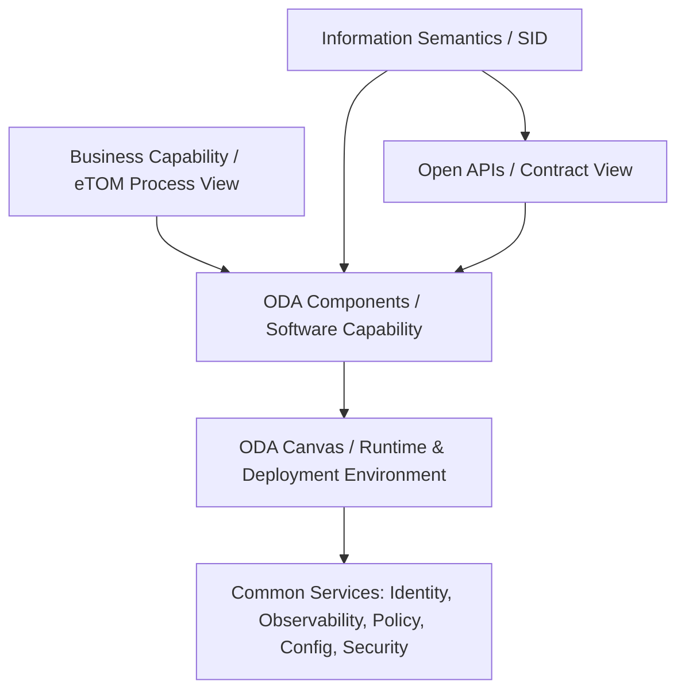
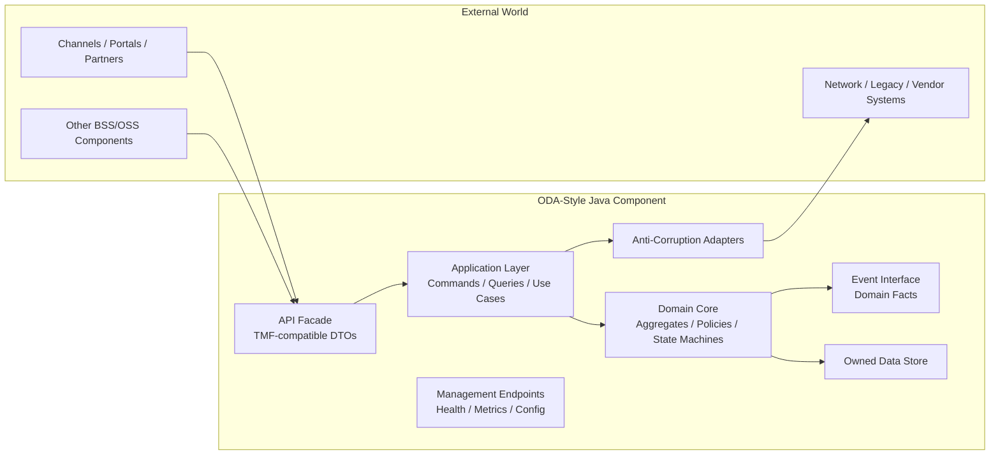
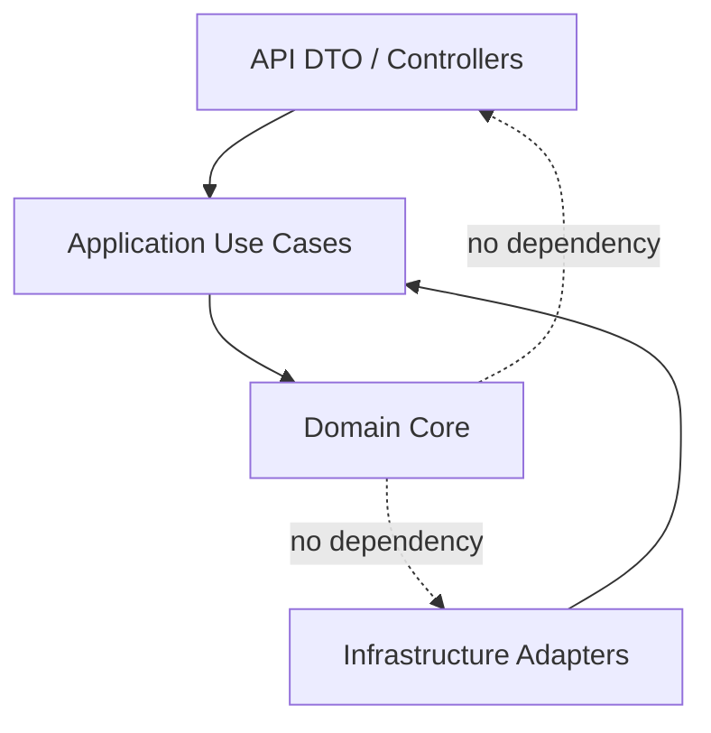
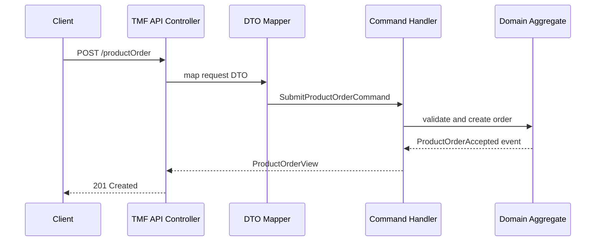
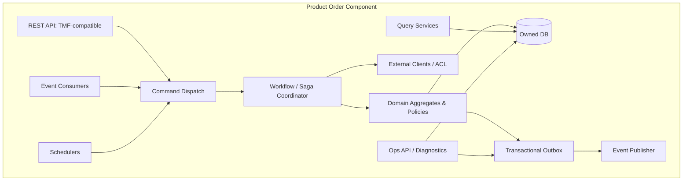
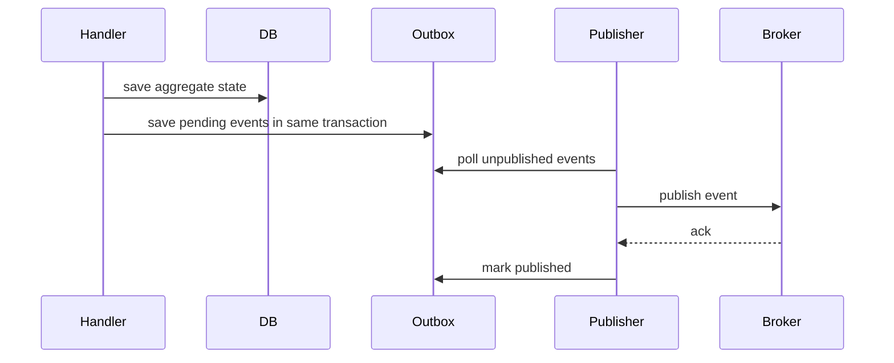
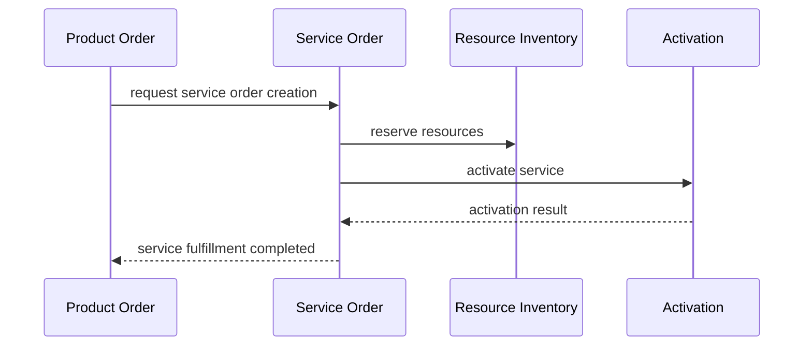
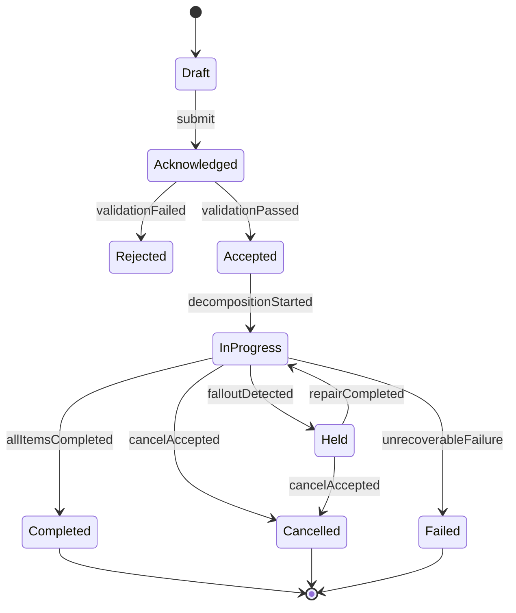
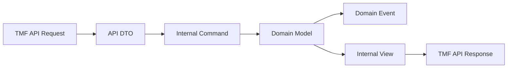

# Part 005 — ODA Component Thinking for Java Architects

## 1. Tujuan Part Ini

Part ini menjawab pertanyaan inti:

> Bagaimana engineer Java menerjemahkan TM Forum Open Digital Architecture ke desain platform BSS/OSS yang nyata, maintainable, testable, dan carrier-grade?

Kita tidak akan mengulang microservices, REST, messaging, observability, security, atau concurrency. Semua itu sudah menjadi prasyarat. Di sini fokusnya adalah **cara berpikir component capability** dalam domain telecom.

Banyak tim membangun BSS/OSS dengan nama service yang terdengar modern:

- `customer-service`
- `order-service`
- `catalog-service`
- `billing-service`
- `inventory-service`
- `ticket-service`

Namun setelah beberapa tahun, sistemnya tetap menjadi distributed monolith. Penyebabnya bukan karena service kurang kecil. Penyebabnya biasanya karena **component boundary tidak mengikuti ownership domain telco**.

ODA component thinking membantu kita menjawab:

1. capability apa yang dimiliki komponen ini;
2. lifecycle entity apa yang menjadi otoritasnya;
3. API apa yang boleh diekspos ke luar;
4. event apa yang harus diterbitkan;
5. data apa yang tidak boleh dimutasi komponen lain;
6. proses mana yang harus diorkestrasi, bukan disembunyikan dalam CRUD;
7. bagaimana komponen beroperasi di runtime cloud-native.

## 2. Kaufman Framing

Dalam framework Josh Kaufman, skill besar harus dipecah menjadi sub-skill kecil yang bisa dilatih dan dikoreksi cepat.

Untuk part ini, target performa kita adalah:

> Mampu mengambil satu domain BSS/OSS, seperti Product Order Management atau Service Inventory, lalu mendesainnya sebagai ODA-style Java component dengan boundary, API, event, data ownership, failure model, dan operability yang jelas.

### 2.1 Skill yang Didekonstruksi

| Sub-skill | Yang Harus Bisa Dilakukan |
|---|---|
| Component identification | Memilih capability yang layak menjadi komponen, bukan sekadar class/service teknis |
| Boundary reasoning | Menentukan apa yang owned, referenced, delegated, dan synchronized |
| API mapping | Memetakan TMF Open API ke command/query DTO tanpa membuat domain internal rapuh |
| Event design | Membedakan event fakta bisnis, lifecycle event, dan integration notification |
| Data authority | Menentukan source of truth, read model, cache, dan reconciliation boundary |
| Runtime thinking | Menentukan deployment, configuration, secret, health, scaling, and policy hooks |
| Failure modeling | Mendesain retry, idempotency, timeout, compensation, and fallout path |
| Self-correction | Menguji desain dengan scenario: modify, cancel, partial failure, duplicate callback, stale read |

### 2.2 Latihan 20 Jam yang Relevan

Gunakan komponen **Product Order Management** sebagai latihan utama:

1. 2 jam: baca ulang domain Product Order, Product Offering, Customer, Account, Service.
2. 3 jam: gambar boundary komponen.
3. 3 jam: definisikan aggregate dan state machine.
4. 3 jam: desain API façade dan event contract.
5. 3 jam: desain orchestration handoff ke Service Order Management.
6. 2 jam: desain idempotency, retry, and cancellation.
7. 2 jam: tulis contract test skeleton.
8. 2 jam: lakukan failure walkthrough.

Output minimal dari latihan bukan kode lengkap. Outputnya adalah **component design record** yang bisa di-review oleh architect lain.

## 3. Mental Model: ODA Component Bukan Sekadar Microservice

Microservice adalah bentuk deployment dan ownership teknis. ODA component adalah **business capability yang distandardisasi sebagai building block telco software**.

Perbedaannya penting.

| Hal | Microservice Biasa | ODA-Style Component |
|---|---|---|
| Fokus | Deployment unit | Business capability unit |
| Boundary | Sering berdasarkan tim atau tabel | Berdasarkan lifecycle ownership dan capability telco |
| API | Custom per vendor/tim | Diupayakan kompatibel dengan TMF Open APIs |
| Data | Bisa sekadar database service | Memiliki source-of-truth responsibility |
| Events | Sering teknis | Merepresentasikan fakta domain dan lifecycle |
| Runtime | Container/service | Component berjalan di canvas/platform dengan common services |
| Governance | Internal engineering | Business + architecture + integration governance |

Jadi, pertanyaan yang benar bukan:

> Service ini endpoint-nya apa?

Melainkan:

> Capability telco apa yang dikuasai komponen ini, lifecycle apa yang ia jaga, dan bagaimana komponen lain boleh berinteraksi dengannya tanpa merusak invariants?

## 4. Hubungan ODA, eTOM, SID, Open APIs, dan Canvas

Kita perlu melihat ODA sebagai komposisi beberapa layer:



Secara praktis:

- **eTOM** membantu memahami proses bisnis dan operational flow.
- **SID** membantu vocabulary dan semantic model.
- **Open APIs** membantu interoperability contract.
- **ODA Component** membantu membagi capability software.
- **ODA Canvas** membantu memikirkan runtime cloud-native dan common services.

Kesalahan umum adalah memakai satu artefak untuk semua layer. Misalnya:

- menjadikan Open API schema sebagai domain model internal;
- menjadikan SID sebagai relational schema;
- menjadikan eTOM process sebagai class hierarchy;
- menjadikan component inventory sebagai daftar microservice final tanpa business validation.

Itu pendekatan yang rapuh.

Pendekatan yang lebih sehat:

> Pakai standar sebagai semantic compass, bukan sebagai pengganti desain domain.

## 5. Anatomy of an ODA-Style Java Component

Komponen yang baik memiliki permukaan eksternal yang jelas dan inti domain yang terlindungi.



Di Java, anatomy ini bisa diterjemahkan menjadi package/module seperti berikut:

```text
com.example.telco.productorder
├── api
│   ├── rest
│   ├── tmf
│   └── mapper
├── application
│   ├── command
│   ├── query
│   ├── handler
│   └── workflow
├── domain
│   ├── model
│   ├── policy
│   ├── state
│   └── event
├── infrastructure
│   ├── persistence
│   ├── messaging
│   ├── client
│   └── configuration
└── operations
    ├── health
    ├── reconciliation
    └── diagnostics
```

Yang paling penting bukan nama package. Yang penting adalah **arah dependency**:



Domain core tidak boleh bergantung pada TMF DTO, ORM entity, Kafka payload, HTTP client, atau framework runtime.

## 6. Empat Permukaan Eksternal Komponen

Setiap komponen BSS/OSS yang serius harus dipikirkan lewat empat permukaan eksternal.

### 6.1 Synchronous API Surface

Biasanya REST atau HTTP-based API. Di ekosistem TM Forum, permukaan ini sering disejajarkan dengan TMF Open APIs.

Contoh:

- Product Catalog Management API;
- Product Ordering Management API;
- Service Ordering Management API;
- Service Inventory Management API;
- Resource Inventory Management API;
- Trouble Ticket Management API.

Namun jangan salah:

> TMF-compatible API bukan berarti domain internal harus sama persis dengan JSON schema Open API.

Gunakan API façade:



DTO publik boleh mengikuti standar. Command internal harus mengikuti use case dan invariant internal.

### 6.2 Event Surface

Event surface menjawab:

- fakta apa yang sudah terjadi;
- siapa yang perlu tahu;
- apakah event ini bisa direplay;
- apakah event ini durable;
- apakah event ini harus memicu orchestration;
- apakah event ini bagian dari audit trail.

Contoh event Product Order:

```text
ProductOrderCreated
ProductOrderValidated
ProductOrderAccepted
ProductOrderDecompositionRequested
ProductOrderInProgress
ProductOrderHeld
ProductOrderCancelled
ProductOrderCompleted
ProductOrderFailed
```

Event harus bernama berdasarkan fakta, bukan instruksi.

Buruk:

```text
CreateServiceOrder
ActivateSubscriber
ChargeCustomer
```

Lebih baik:

```text
ProductOrderAccepted
ServiceOrderRequested
SubscriptionActivationRequired
```

Kenapa? Karena event fakta tidak mengasumsikan siapa consumer-nya. Ia menjaga decoupling.

### 6.3 Management Surface

Banyak desain BSS/OSS gagal karena hanya mendesain business API, tetapi lupa management API.

Komponen carrier-grade perlu minimal:

- health check;
- readiness check;
- liveness check;
- configuration exposure yang aman;
- version endpoint;
- dependency status;
- event lag metrics;
- retry queue visibility;
- reconciliation status;
- business KPI counters;
- diagnostic correlation by order/customer/service id.

Contoh management command yang boleh ada, dengan guardrail ketat:

```text
POST /operations/retry/product-orders/{id}/failed-step/{stepId}
POST /operations/reconcile/product-orders/{id}
GET  /operations/product-orders/{id}/timeline
GET  /operations/dependencies
```

Management surface tidak boleh menjadi backdoor yang melewati domain invariants.

### 6.4 Policy and Runtime Surface

Komponen BSS/OSS tidak hidup sendirian. Ia beroperasi di bawah policy:

- authentication;
- authorization;
- tenant isolation;
- data residency;
- audit retention;
- rate limit;
- circuit breaker;
- configuration;
- secret management;
- deployment promotion;
- feature flag;
- data masking;
- observability.

Dalam ODA Canvas mindset, hal-hal ini seharusnya menjadi common runtime concern, bukan di-copy manual di setiap service.

## 7. Component Boundary Rules

Gunakan tujuh pertanyaan ini sebelum menyetujui boundary komponen.

### Rule 1 — Apa entity lifecycle yang di-owned?

Contoh:

| Component | Owned Lifecycle |
|---|---|
| Product Catalog | Product Offering, Product Specification, Bundle, Price Definition |
| Product Order | Product Order, Product Order Item, Order Amendment |
| Service Order | Service Order, Service Order Item, Technical Fulfillment Plan |
| Service Inventory | Service Instance, Service Relationship, Service State |
| Resource Inventory | MSISDN, IMSI, SIM, Port, IP Address, Circuit, Device Resource |
| Trouble Ticket | Trouble Ticket, Assignment, SLA Clock, Resolution Evidence |

Kalau sebuah komponen tidak punya lifecycle yang jelas, kemungkinan ia hanya utility service.

### Rule 2 — Apa yang hanya direferensikan?

Product Order boleh menyimpan snapshot product offering yang dipilih customer, tetapi tidak boleh menjadi otoritas Product Catalog.

Service Inventory boleh menyimpan relationship ke Product instance, tetapi tidak boleh menjadi otoritas billing account.

Trouble Ticket boleh menyimpan customer impact context, tetapi tidak boleh menjadi otoritas customer profile.

### Rule 3 — Apa transaksi yang harus atomic?

Atomicity harus berada dalam boundary yang tepat.

Contoh atomic di Product Order:

- create product order;
- validate order item graph;
- transition order from `acknowledged` to `inProgress`;
- mark order item as failed with reason;
- persist event publication intent using outbox.

Tidak atomic lintas komponen:

- create Product Order + create Service Order + allocate Resource + activate Network + create Billing Subscription.

Itu harus saga/orchestration, bukan distributed transaction.

### Rule 4 — Apa yang harus idempotent?

Dalam BSS/OSS, duplicate request dan duplicate callback normal terjadi.

Idempotency wajib untuk:

- order submission;
- payment notification;
- activation command;
- resource reservation;
- provisioning callback;
- ticket event ingestion;
- alarm event ingestion;
- partner order update.

Rule praktis:

> Semua command yang bisa datang dari channel, partner, network adapter, scheduler, atau message broker harus punya idempotency strategy.

### Rule 5 — Apa compensation path-nya?

Tidak semua operasi bisa di-rollback.

Contoh:

- MSISDN reservation bisa dilepas.
- SIM activation mungkin butuh deactivation command.
- Number portability request mungkin tidak bisa langsung dibatalkan setelah fase tertentu.
- Billing charge bisa membutuhkan adjustment, bukan delete.
- Customer notification tidak bisa “di-un-send”.

Jangan desain compensation sebagai rollback database. Desain sebagai **business-correcting action**.

### Rule 6 — Apa reconciliation source-nya?

Setiap komponen yang berinteraksi dengan sistem eksternal harus punya reconciliation.

Pertanyaan minimal:

- Apa sumber kebenaran jika internal dan eksternal berbeda?
- Bagaimana mendeteksi drift?
- Apakah drift otomatis diperbaiki atau masuk work queue?
- Apakah reconciliation bersifat scheduled, event-driven, atau manual?
- Apakah hasil reconciliation bisa diaudit?

### Rule 7 — Apa observability business-nya?

Metrics teknis tidak cukup.

Product Order Management harus tahu:

- jumlah order accepted per channel;
- jumlah order stuck per state;
- age of oldest order per state;
- fallout rate per product type;
- cancellation rate;
- average order-to-activate duration;
- retry success rate;
- manual intervention volume.

Komponen telco yang hanya punya CPU, memory, and HTTP latency metrics belum operable.

## 8. Component Category dalam BSS/OSS

Tidak semua komponen punya karakter yang sama.

### 8.1 Entity System of Record Component

Komponen ini menjadi otoritas lifecycle entity.

Contoh:

- Customer Management;
- Product Catalog;
- Product Inventory;
- Service Inventory;
- Resource Inventory;
- Trouble Ticket.

Ciri:

- kuat pada CRUD + lifecycle transition;
- menjaga state invariant;
- punya query API;
- publish state change event;
- sering menjadi reference source komponen lain.

### 8.2 Process / Orchestration Component

Komponen ini mengelola proses lintas domain.

Contoh:

- Product Order Management;
- Service Order Management;
- Activation Orchestration;
- Partner Order Gateway;
- Fallout Management.

Ciri:

- state machine panjang;
- saga orchestration;
- banyak dependency;
- failure dan timeout menjadi core domain;
- membutuhkan traceability step-by-step.

### 8.3 Calculation / Decision Component

Komponen ini mengambil keputusan berdasarkan rule, rating, eligibility, scoring, atau policy.

Contoh:

- Product Qualification;
- Rating;
- Charging;
- Credit Check;
- Eligibility;
- Fraud Screening;
- SLA Priority Engine.

Ciri:

- input harus versioned;
- keputusan harus explainable;
- rule version penting;
- audit evidence penting;
- deterministic replay sering dibutuhkan.

### 8.4 Mediation / Adapter Component

Komponen ini menghubungkan platform modern ke legacy/network/vendor system.

Contoh:

- HLR/HSS/UDM adapter;
- OCS adapter;
- IPAM adapter;
- DNS adapter;
- EMS/NMS adapter;
- legacy CRM adapter.

Ciri:

- anti-corruption heavy;
- idempotency heavy;
- protocol translation;
- timeout and retry;
- reconciliation;
- command result ambiguity.

### 8.5 Analytical / Read Model Component

Komponen ini melayani query, reporting, analytics, or dashboard.

Contoh:

- Customer 360;
- Order Journey Timeline;
- Service Impact View;
- Assurance Dashboard;
- Revenue Assurance Data Mart.

Ciri:

- eventual consistency;
- denormalized views;
- no lifecycle authority;
- replay/rebuild capability;
- strict provenance.

## 9. Java Implementation Blueprint

Berikut blueprint komponen Java yang cukup matang untuk domain telco.



### 9.1 Command Handler Pattern

Command handler harus kecil dan eksplisit.

```java
public final class SubmitProductOrderHandler {
    private final ProductOrderRepository orders;
    private final ProductCatalogClient catalog;
    private final CustomerClient customers;
    private final Outbox outbox;
    private final IdempotencyStore idempotency;

    public ProductOrderId handle(SubmitProductOrderCommand command) {
        return idempotency.execute(command.idempotencyKey(), () -> {
            var catalogSnapshot = catalog.resolveOfferSnapshot(command.offerRefs());
            var customerSnapshot = customers.resolveCustomerSnapshot(command.customerRef());

            var order = ProductOrder.submit(
                command.requestId(),
                customerSnapshot,
                catalogSnapshot,
                command.orderItems()
            );

            orders.save(order);
            outbox.appendAll(order.pullEvents());
            return order.id();
        });
    }
}
```

Hal yang perlu diperhatikan:

- command membawa intent;
- external client menghasilkan snapshot, bukan live coupling;
- aggregate menjaga invariant;
- outbox menyimpan event secara transactional;
- idempotency melindungi duplicate request.

### 9.2 API DTO Tidak Sama dengan Domain Aggregate

Buruk:

```java
@Entity
public class ProductOrderDtoFromTmfApi {
    // fields copied from external schema
}
```

Lebih baik:

```text
TMF Request DTO
  -> API Mapper
  -> SubmitProductOrderCommand
  -> ProductOrder Aggregate
  -> ProductOrderView / TMF Response DTO
```

Kenapa?

Karena API standard bisa berubah, extension bisa bertambah, dan tiap operator punya optional field yang berbeda. Domain core harus stabil terhadap variasi integrasi.

### 9.3 Event Publication with Outbox

Untuk komponen BSS/OSS, event loss bisa berarti order stuck, billing tidak jalan, atau activation tidak terjadi. Jangan publish event langsung dari memory setelah commit.

Gunakan outbox:



Outbox bukan hanya reliability pattern. Di telco, outbox juga menjadi bagian dari traceability dan recovery.

## 10. Component Collaboration Pattern

### 10.1 Query Collaboration

Satu komponen boleh query komponen lain untuk validasi atau enrichment.

Contoh Product Order saat submit:

- query Product Catalog untuk offering snapshot;
- query Customer Management untuk customer eligibility snapshot;
- query Address/Serviceability untuk coverage result.

Rule:

> Query lintas komponen boleh dilakukan sebelum state transition, tetapi hasilnya harus disimpan sebagai snapshot atau reference yang jelas.

### 10.2 Command Collaboration

Command lintas komponen harus hati-hati.

Product Order tidak seharusnya langsung memanggil banyak adapter jaringan. Ia biasanya meminta Service Order atau Fulfillment Orchestration melakukan technical fulfillment.



### 10.3 Event Collaboration

Gunakan event ketika consumer tidak harus menentukan hasil synchronous dari publisher.

Contoh:

- `ProductOrderAccepted` dapat dikonsumsi Service Order Management.
- `ServiceActivated` dapat dikonsumsi Product Inventory dan Billing.
- `TroubleTicketResolved` dapat dikonsumsi Customer Notification.

Rule:

> Event bukan solusi untuk semua coupling. Jika proses membutuhkan keputusan step-by-step, gunakan orchestration eksplisit.

## 11. Data Ownership dan Reference Strategy

### 11.1 Jangan Share Database

Dalam BSS/OSS lama, integrasi sering dilakukan lewat shared database, stored procedure, atau direct table access. Ini mempercepat integrasi jangka pendek dan merusak evolusi jangka panjang.

Komponen ODA-style harus punya data ownership.

Buruk:

```text
Product Order reads catalog tables directly.
Billing updates product_order table.
Activation updates service_inventory table.
```

Lebih baik:

```text
Product Catalog exposes API/events.
Product Order stores offering snapshot.
Billing consumes product activation events.
Service Inventory owns service instance state.
Activation reports activation result to owner/orchestrator.
```

### 11.2 Reference, Snapshot, Replica

Tiga bentuk data non-owned:

| Bentuk | Makna | Contoh |
|---|---|---|
| Reference | Menunjuk entity di komponen lain | `customerId`, `productOfferingId`, `serviceId` |
| Snapshot | Salinan keadaan saat keputusan dibuat | offered price at quote/order time |
| Replica / Read model | Salinan eventual untuk query/performance | Customer 360 view, assurance dashboard |

Jangan mencampur ketiganya.

Jika harga order berubah karena catalog berubah setelah order dibuat, kemungkinan desain snapshot salah. Order harus menyimpan commercial terms yang berlaku saat submit/accept.

## 12. State Machine sebagai Boundary Validator

Komponen BSS/OSS yang matang biasanya memiliki state machine eksplisit.

Contoh Product Order simplified:



Jangan izinkan API langsung set status tanpa transition rule.

Buruk:

```java
order.setStatus(request.getStatus());
```

Lebih baik:

```java
order.accept(validationEvidence);
order.markInProgress(decompositionPlanId);
order.hold(falloutReason);
order.complete(completionEvidence);
```

State transition harus membawa evidence. Dalam telco, auditability sama pentingnya dengan correctness.

## 13. Open API Compatibility Without Domain Corruption

TMF Open APIs sangat berguna untuk interoperability. Tetapi ada risiko jika tim menjadikan Open API schema sebagai semua hal sekaligus:

- public API contract;
- database model;
- domain model;
- event model;
- UI model;
- integration model.

Itu berbahaya karena satu perubahan schema bisa memecahkan semua layer.

Gunakan layered mapping:



### 13.1 Extension Strategy

Operator telco sering punya field tambahan:

- dealer code;
- sales channel id;
- campaign code;
- regulatory consent id;
- portability metadata;
- installation constraint;
- partner reference;
- enterprise hierarchy id.

Jangan menyebar extension sebagai `Map<String, Object>` tanpa governance.

Gunakan extension envelope:

```java
public record ExtensionField(
    String namespace,
    String name,
    String valueType,
    String value,
    Instant capturedAt,
    String source
) {}
```

Lalu validasi berdasarkan schema/rule per namespace.

## 14. Failure Model per Component Type

### 14.1 Entity Component Failure

Contoh Service Inventory.

Failure utama:

- stale read;
- duplicate update;
- invalid state transition;
- conflicting ownership;
- inconsistent relationship graph;
- bulk import drift.

Mitigation:

- optimistic locking;
- state transition guard;
- versioned relationship;
- reconciliation job;
- event replay;
- manual correction workflow.

### 14.2 Process Component Failure

Contoh Product Order.

Failure utama:

- downstream unavailable;
- partial step completed;
- duplicate callback;
- cancellation races with activation;
- long-running order stuck;
- timeout but unknown external result.

Mitigation:

- durable workflow state;
- idempotent step execution;
- external command correlation id;
- timeout handling;
- compensation action;
- fallout queue;
- reconciliation.

### 14.3 Adapter Component Failure

Contoh HSS/UDM adapter.

Failure utama:

- protocol timeout;
- ambiguous result;
- duplicate command;
- vendor-specific error;
- state exists but command failed;
- command success but callback lost.

Mitigation:

- idempotency key;
- query-after-command;
- command journal;
- error taxonomy;
- retry with backoff;
- reconciliation with network actual state.

## 15. Design Record Template

Untuk setiap ODA-style component, buat design record dengan format berikut.

```md
# Component Design Record: <Name>

## 1. Capability
Apa capability bisnis/teknis yang disediakan?

## 2. Owned Entities
Entity dan lifecycle apa yang di-owned?

## 3. Non-Owned References
Entity eksternal apa yang hanya direferensikan atau disnapshot?

## 4. Public APIs
API apa yang diekspos? Apakah TMF-compatible?

## 5. Commands
Command internal apa yang didukung?

## 6. Events Published
Event domain apa yang diterbitkan?

## 7. Events Consumed
Event apa yang dikonsumsi?

## 8. State Machines
State apa saja dan transition guard-nya?

## 9. Persistence
Data store, aggregate boundary, index, retention.

## 10. Idempotency
Command/event mana yang idempotent dan dengan key apa?

## 11. Failure Handling
Retry, timeout, fallout, compensation, reconciliation.

## 12. Operability
Metrics, logs, traces, dashboards, runbook, manual actions.

## 13. Security & Policy
AuthN/AuthZ, PII masking, tenant, audit, regulatory constraints.

## 14. Compatibility
TMF API mapping, versioning, backward compatibility.

## 15. Test Strategy
Unit, contract, state machine, integration, chaos/failure, reconciliation.
```

## 16. Example: Product Order Component Boundary

### 16.1 Capability

Menerima, memvalidasi, mengelola, dan melacak Product Order dari channel/partner sampai order selesai, gagal, atau dibatalkan.

### 16.2 Owned Entities

- ProductOrder;
- ProductOrderItem;
- OrderAmendment;
- OrderCancellationRequest;
- OrderValidationEvidence;
- OrderFalloutRecord.

### 16.3 Non-Owned References

- Customer;
- Billing Account;
- Product Offering;
- Quote;
- Service Order;
- Service Instance;
- Resource;
- Payment;
- Trouble Ticket.

### 16.4 Events Published

- ProductOrderCreated;
- ProductOrderValidationFailed;
- ProductOrderAccepted;
- ProductOrderDecompositionRequested;
- ProductOrderInProgress;
- ProductOrderHeld;
- ProductOrderCompleted;
- ProductOrderCancelled;
- ProductOrderFailed.

### 16.5 Failure Walkthrough

Scenario: activation system timeout after SIM activated.

Wrong design:

1. Product Order calls activation directly.
2. HTTP timeout occurs.
3. Product Order marks failed.
4. Customer retries.
5. Duplicate activation occurs.

Better design:

1. Product Order requests Service Order.
2. Service Order sends activation command with correlation/idempotency key.
3. Activation adapter records command journal.
4. Timeout produces `ActivationResultUnknown`.
5. Reconciliation queries network state.
6. If SIM active, activation step becomes successful with reconciliation evidence.
7. Product Order eventually completes.

## 17. Common Anti-Patterns

### Anti-Pattern 1 — Component as CRUD Wrapper

`product-order-service` hanya membuat, membaca, update status, dan delete order.

Masalah:

- tidak ada lifecycle semantics;
- tidak ada orchestration;
- tidak ada fallout;
- tidak ada idempotency;
- tidak ada audit evidence.

### Anti-Pattern 2 — Standard Schema as Database Model

Tim generate entity dari Open API schema dan langsung persist.

Masalah:

- schema publik bocor ke domain internal;
- extension liar;
- migration sulit;
- invariant tersebar di controller;
- domain logic menjadi procedural.

### Anti-Pattern 3 — Shared Status Enum

Semua entity memakai enum `NEW`, `ACTIVE`, `SUSPENDED`, `TERMINATED`.

Masalah:

- order status tidak sama dengan service status;
- customer status tidak sama dengan billing status;
- resource status tidak sama dengan operational status;
- state transition menjadi ambigu.

### Anti-Pattern 4 — Orchestrator as God Service

Satu workflow engine/service mengatur semua domain detail.

Masalah:

- domain logic hilang dari owner component;
- component lain menjadi database wrapper;
- perubahan kecil memecahkan orchestrator;
- failure handling sulit dilokalisir.

Lebih baik:

- orchestrator mengatur proses lintas komponen;
- komponen owner tetap menjaga invariant internal;
- setiap step punya idempotency dan evidence.

### Anti-Pattern 5 — Event as RPC

Publisher mengirim event seperti perintah tersembunyi:

```text
ActivateServiceNow
UpdateBillingNow
SendSmsNow
```

Masalah:

- coupling tersembunyi;
- consumer semantics tidak jelas;
- replay berbahaya;
- audit membingungkan.

Event harus fakta. Command harus command.

## 18. Review Checklist

Sebelum menyebut sesuatu sebagai ODA-style component, jawab checklist ini.

| Pertanyaan | Ya/Tidak |
|---|---|
| Apakah capability-nya jelas dan bukan sekadar utility? |  |
| Apakah owned lifecycle entity-nya jelas? |  |
| Apakah non-owned data dibedakan antara reference, snapshot, dan replica? |  |
| Apakah API façade terpisah dari domain core? |  |
| Apakah event yang diterbitkan adalah fakta domain? |  |
| Apakah command external/idempotent punya idempotency key? |  |
| Apakah state machine eksplisit? |  |
| Apakah failure model mencakup timeout, duplicate, partial success, dan unknown result? |  |
| Apakah reconciliation source jelas? |  |
| Apakah business observability tersedia? |  |
| Apakah manual repair/fallout path tersedia? |  |
| Apakah component bisa diuji dengan contract test? |  |
| Apakah ada compatibility/versioning strategy? |  |

## 19. Deliberate Practice

### Exercise 1 — Component Boundary

Ambil domain **Resource Inventory**.

Tentukan:

1. owned entities;
2. non-owned references;
3. lifecycle states;
4. APIs;
5. events;
6. reconciliation source;
7. failure mode.

### Exercise 2 — API Mapping

Desain mapping dari request `createProductOrder` ke internal command.

Output:

```text
External DTO fields
Internal command fields
Validation rules
Snapshot fields
Rejected fields
Extension fields
```

### Exercise 3 — Failure Walkthrough

Scenario:

> Partner mengirim order yang sama dua kali karena timeout. Order pertama sudah accepted dan decomposition sedang berjalan.

Jawab:

1. idempotency key-nya apa;
2. response kedua harus apa;
3. apakah event diterbitkan ulang;
4. bagaimana trace menunjukkan duplicate;
5. apa yang terjadi jika payload kedua sedikit berbeda.

### Exercise 4 — Component Design Record

Buat design record untuk **Trouble Ticket Management**.

Pastikan mencakup:

- SLA clock;
- assignment;
- escalation;
- customer impact;
- alarm correlation;
- major incident link;
- closure evidence;
- reopen policy.

## 20. Ringkasan

ODA component thinking membantu engineer Java berpindah dari desain service teknis ke desain capability telco yang punya boundary, lifecycle, API, event, data authority, dan failure semantics.

Prinsip utamanya:

1. Component adalah capability, bukan sekadar deployment unit.
2. Boundary harus mengikuti lifecycle ownership.
3. TMF Open APIs berguna sebagai contract/interoperability layer, bukan domain model internal mentah.
4. SID membantu semantic alignment, bukan database schema.
5. Process component berbeda dari entity component.
6. Adapter component harus punya idempotency, command journal, dan reconciliation.
7. Business observability adalah requirement, bukan bonus.
8. Fallout dan manual repair adalah bagian normal dari domain telco.
9. Event harus merepresentasikan fakta, bukan RPC terselubung.
10. Komponen carrier-grade harus bisa dijelaskan lewat design record dan failure walkthrough.

Part berikutnya akan masuk ke **SID-Inspired Information Modeling**: cara menggunakan SID sebagai vocabulary dan reference model untuk membangun model Java yang stabil, evolvable, dan tidak terjebak menjadi clone schema standar.

## References

- TM Forum — Open Digital Architecture: https://www.tmforum.org/open-digital-architecture/
- TM Forum — ODA Canvas: https://www.tmforum.org/open-digital-architecture/deployment-runtime/oda-canvas/
- TM Forum — ODA Component Inventory IG1242: https://www.tmforum.org/resources/introductory-guide/oda-component-inventory-v16-0-0-ig1242/
- TM Forum — Principles to Define ODA Components IG1245: https://www.tmforum.org/resources/introductory-guide/ig1245-principles-to-define-oda-components-v1-0-0/
- TM Forum — Open APIs: https://www.tmforum.org/open-digital-architecture/implementation/open-apis/
- TM Forum — Information Framework SID: https://www.tmforum.org/open-digital-architecture/information-framework-sid/
