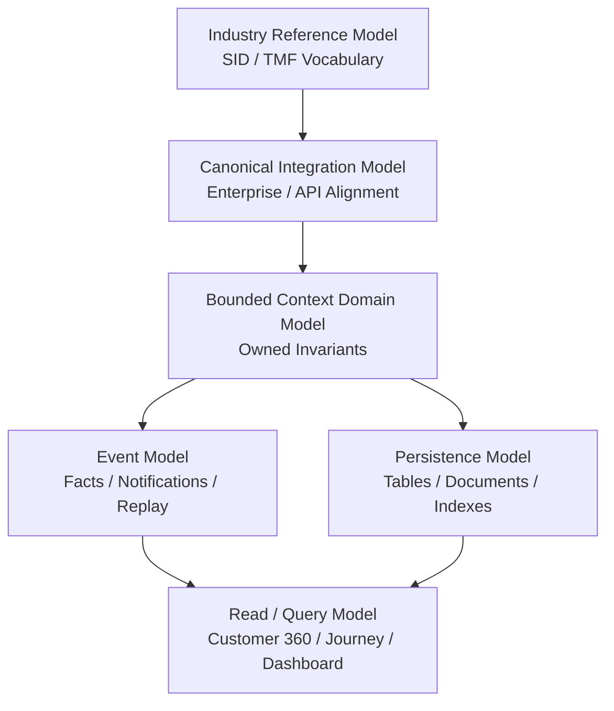
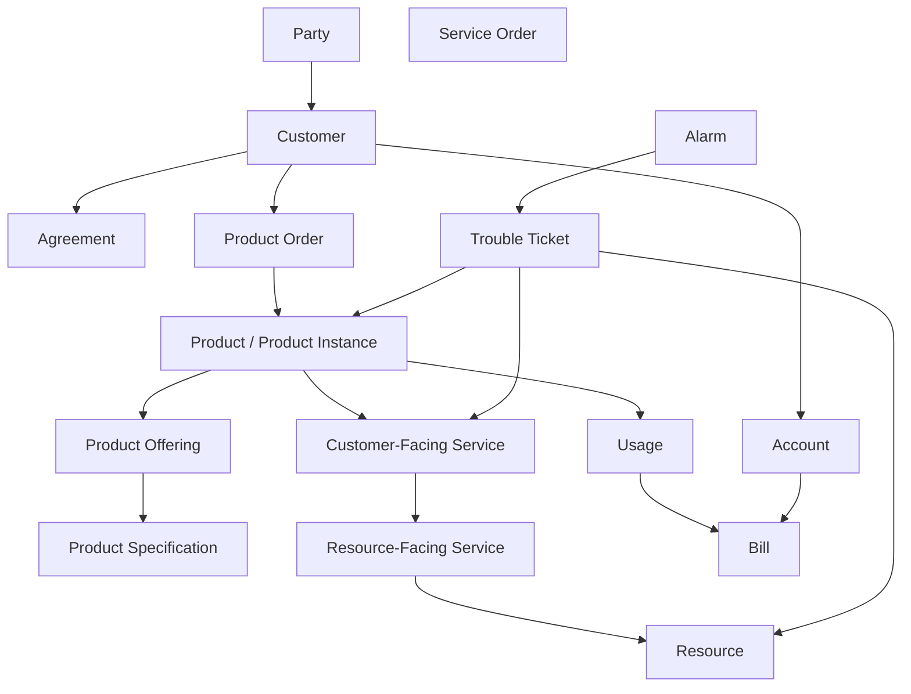
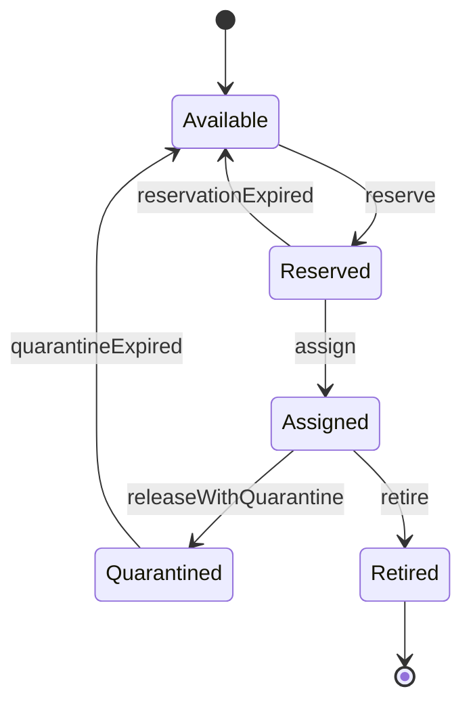
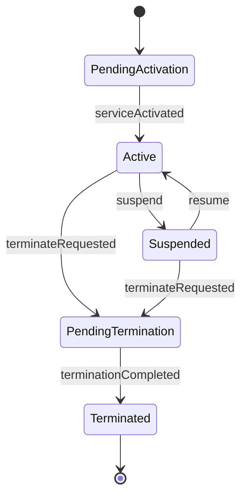
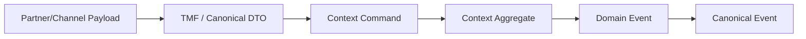
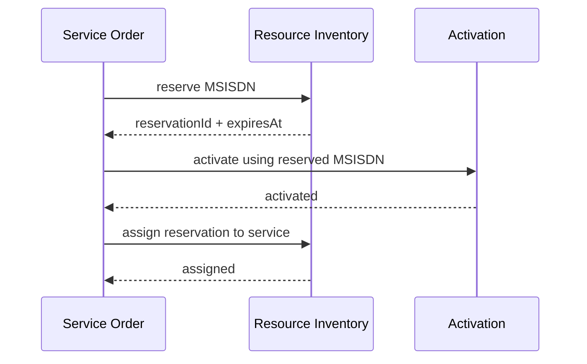
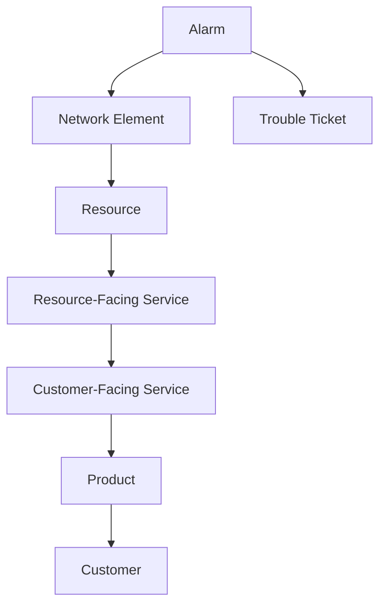

# Part 006 — SID-Inspired Information Modeling

## 1. Tujuan Part Ini

Part ini menjawab pertanyaan:

> Bagaimana engineer Java memakai TM Forum SID untuk membangun model informasi BSS/OSS yang benar, tanpa menjadikan SID sebagai database schema atau class diagram mentah?

Kita akan fokus pada teknik modeling, bukan menghafal semua entity SID.

SID penting karena telco memiliki vocabulary yang sangat padat:

- party;
- customer;
- account;
- agreement;
- product;
- product offering;
- product specification;
- service;
- resource;
- place;
- appointment;
- usage;
- bill;
- payment;
- trouble ticket;
- alarm;
- network function;
- service level specification.

Tanpa semantic discipline, platform BSS/OSS akan cepat menjadi kumpulan field yang terlihat benar tetapi salah secara domain.

Contoh field yang terlihat normal tetapi berbahaya:

```text
customerId
accountId
serviceId
subscriptionId
productId
resourceId
status
externalId
characteristic
```

Nama-nama itu tidak cukup. Kita harus tahu **siapa owner-nya, lifecycle-nya apa, valid pada periode kapan, berasal dari sistem mana, dan apakah field itu reference, snapshot, atau replica**.

## 2. Kaufman Framing

Target performa part ini:

> Mampu mengambil konsep SID/TMF seperti Product, Service, Resource, Party, Account, Agreement, lalu mendesain model Java internal yang semantic-nya tepat, bounded-context friendly, versioned, auditable, dan aman untuk integrasi jangka panjang.

### 2.1 Skill yang Didekonstruksi

| Sub-skill | Output yang Diharapkan |
|---|---|
| Semantic alignment | Mampu memakai vocabulary SID untuk menyamakan arti lintas tim/vendor |
| Model layering | Mampu membedakan industry model, canonical model, bounded-context model, persistence model, event model |
| Identity modeling | Mampu membedakan internal id, public id, external id, natural id, correlation id |
| Lifecycle modeling | Mampu membuat status/state yang domain-specific, bukan enum generik |
| Relationship modeling | Mampu membuat relasi Product-Service-Resource tanpa ownership kacau |
| Extension modeling | Mampu mendesain characteristics/extension tanpa membuat data swamp |
| Versioning | Mampu memodelkan validity period, catalog version, rule version, schema version |
| Reconciliation modeling | Mampu mencatat provenance, source, confidence, and correction evidence |

## 3. SID sebagai Reference Model, Bukan Domain Model Mentah

SID menyediakan information/data reference model dan vocabulary umum untuk implementasi proses bisnis CSP. TM Forum Open APIs juga memakai shared API data model berbasis Information Framework/SID.

Namun dalam desain Java, SID sebaiknya dipakai sebagai:

- **semantic reference**;
- **common language**;
- **alignment tool** antar vendor/tim;
- **basis mapping** ke Open APIs;
- **checklist konseptual** agar entity penting tidak hilang.

SID tidak sebaiknya langsung dipakai sebagai:

- relational schema final;
- JPA entity hierarchy;
- DTO internal semua service;
- event payload tunggal;
- canonical model tunggal yang dipakai semua bounded context tanpa adaptasi.

Kenapa?

Karena model industri harus luas dan reusable, sementara model domain internal harus spesifik pada invariant dan use case.

## 4. Lima Layer Model yang Harus Dipisahkan

Desain BSS/OSS matang biasanya memiliki beberapa layer model.



### 4.1 Industry Reference Model

Layer ini menjawab:

> Dalam bahasa telco, konsep ini seharusnya disebut apa dan berhubungan dengan apa?

Contoh:

- Customer bukan selalu orang. Bisa organisasi yang membeli produk.
- Party bukan selalu customer. Party bisa individual, organization, partner, supplier.
- Product adalah apa yang dijual/dipegang customer.
- Service adalah kemampuan teknis/fungsional yang mendukung product.
- Resource adalah aset logis/fisik/network yang mendukung service.

### 4.2 Canonical Integration Model

Layer ini menjawab:

> Bagaimana berbagai sistem berbicara memakai payload yang konsisten?

Canonical model berguna untuk integration boundary. Tetapi jangan terlalu cepat menjadikannya model internal semua service.

Risiko canonical model yang terlalu dominan:

- semua domain dipaksa seragam;
- optional field membengkak;
- invariant domain hilang;
- change management lambat;
- setiap perubahan kecil menjadi enterprise-wide governance.

### 4.3 Bounded Context Domain Model

Layer ini menjawab:

> Dalam komponen ini, invariant apa yang harus dijaga?

Contoh `ProductOrder` internal tidak harus sama dengan `ProductOrder` di API schema.

Internal model boleh lebih sempit tetapi lebih kuat:

```java
public final class ProductOrder {
    private final ProductOrderId id;
    private final CustomerRef customer;
    private final BillingAccountRef billingAccount;
    private final List<ProductOrderItem> items;
    private ProductOrderState state;
    private final OrderTimeline timeline;

    public void accept(ValidationEvidence evidence) { }
    public void hold(FalloutReason reason) { }
    public void complete(CompletionEvidence evidence) { }
}
```

### 4.4 Persistence Model

Layer ini menjawab:

> Bagaimana model disimpan secara efisien, konsisten, dan bisa dioperasikan?

Persistence model boleh berbeda dari domain model.

Contoh:

- aggregate disimpan di beberapa tabel;
- characteristics dinormalisasi untuk query tertentu;
- state transition disimpan sebagai append-only timeline;
- current state disimpan sebagai materialized column;
- external id dibuat unique index per source system.

### 4.5 Event Model

Layer ini menjawab:

> Fakta apa yang harus diketahui sistem lain?

Event model tidak sama dengan domain object penuh.

Contoh buruk:

```json
{
  "eventType": "ProductOrderUpdated",
  "productOrder": { "... seluruh object besar ...": true }
}
```

Lebih baik:

```json
{
  "eventId": "evt-123",
  "eventType": "ProductOrderAccepted",
  "occurredAt": "2026-06-28T10:15:30Z",
  "productOrderId": "po-456",
  "customerId": "cust-789",
  "previousState": "ACKNOWLEDGED",
  "newState": "ACCEPTED",
  "validationEvidenceId": "val-001",
  "schemaVersion": "1.0"
}
```

## 5. Core Telco Concept Graph

Gunakan graph berikut sebagai mental model dasar. Ini bukan schema final, tetapi peta hubungan.



Pertanyaan modeling utama:

1. Apakah relasi ini ownership atau reference?
2. Apakah relasi ini current-state atau historical?
3. Apakah relasi ini valid sejak kapan sampai kapan?
4. Apakah relasi ini hasil provisioning, billing, catalog, atau assurance?
5. Apakah relasi ini bisa berubah tanpa mengubah entity utama?

## 6. Identity Modeling

Identity adalah sumber banyak bug BSS/OSS.

### 6.1 Jenis Identifier

| Jenis ID | Makna | Contoh |
|---|---|---|
| Internal ID | Primary identity dalam bounded context | UUID/ULID internal ProductOrderId |
| Public ID | ID yang aman dilihat channel/customer | `PO-2026-000001` |
| External ID | ID dari sistem/vendor/partner lain | CRM order id, partner order id |
| Natural ID | Identifier domain nyata | MSISDN, IMSI, ICCID, email, tax id |
| Correlation ID | Melacak request/flow lintas sistem | `corr-abc` |
| Idempotency Key | Mencegah duplicate command | channel request id + source |
| Version ID | Menandai versi definisi/rule/schema | catalog version, price version |

Jangan gunakan MSISDN sebagai primary key subscription. MSISDN bisa berubah, recycle, port-out, atau sementara tidak assigned.

Jangan gunakan external order id sebagai primary key Product Order. Partner bisa reuse, salah kirim, atau punya scope berbeda.

### 6.2 External ID Harus Scoped

Buruk:

```text
externalId = "12345"
```

Lebih baik:

```text
externalReference = {
  sourceSystem: "PARTNER_X",
  referenceType: "PARTNER_ORDER_ID",
  value: "12345"
}
```

Di Java:

```java
public record ExternalReference(
    String sourceSystem,
    String referenceType,
    String value
) {
    public ExternalReference {
        if (sourceSystem == null || sourceSystem.isBlank()) {
            throw new IllegalArgumentException("sourceSystem is required");
        }
        if (referenceType == null || referenceType.isBlank()) {
            throw new IllegalArgumentException("referenceType is required");
        }
        if (value == null || value.isBlank()) {
            throw new IllegalArgumentException("value is required");
        }
    }
}
```

### 6.3 Reference Object Lebih Baik daripada String Mentah

Buruk:

```java
String customerId;
String accountId;
String productOfferingId;
```

Lebih baik:

```java
public record CustomerRef(String id, String publicId, String source) {}
public record BillingAccountRef(String id, String accountNumber) {}
public record ProductOfferingRef(String id, String version, String nameSnapshot) {}
```

Reference object memaksa kita berpikir:

- apakah butuh display value;
- apakah butuh version;
- apakah ini snapshot atau live reference;
- apakah source/provenance penting.

## 7. Product-Service-Resource Modeling

Ini adalah tulang punggung BSS/OSS.

### 7.1 Product

Product adalah sesuatu yang customer beli, gunakan, atau miliki secara komersial.

Contoh:

- prepaid mobile plan;
- postpaid family plan;
- fiber broadband package;
- enterprise VPN product;
- managed firewall product;
- roaming add-on;
- data booster.

Product biasanya punya hubungan ke:

- product offering;
- customer;
- billing account;
- service(s);
- agreement;
- price/charge commitment;
- subscription lifecycle.

### 7.2 Customer-Facing Service

Customer-facing service adalah capability layanan yang terlihat dalam konteks customer/product.

Contoh:

- mobile voice service;
- mobile data service;
- fiber internet access service;
- fixed voice service;
- enterprise connectivity service;
- IoT connectivity service.

### 7.3 Resource-Facing Service

Resource-facing service adalah abstraksi teknis yang mendukung CFS.

Contoh:

- IMS voice profile;
- packet data session capability;
- broadband access line configuration;
- VLAN service;
- IP address allocation;
- APN configuration.

### 7.4 Resource

Resource adalah aset logical atau physical.

Contoh logical resource:

- MSISDN;
- IMSI;
- ICCID;
- IP address;
- VLAN ID;
- port id;
- circuit id.

Contoh physical resource:

- SIM card;
- CPE;
- router;
- ONT;
- network element;
- rack/slot/port.

### 7.5 Jangan Campur Layer

Buruk:

```text
Product = "MSISDN 62812..."
Service = "Postpaid Plan 100GB"
Resource = "Monthly fee"
```

Lebih benar:

```text
Product: Postpaid Plan 100GB subscription
CFS: Mobile connectivity service
RFS: Mobile data service profile / IMS voice profile
Resource: IMSI, MSISDN, SIM/ICCID, APN profile, quota bucket
Charge: recurring fee, usage charge, discount
```

## 8. State Modeling: Jangan Pakai Status Generik

Field `status` adalah jebakan.

Dalam telco, satu entity bisa punya beberapa state dimension:

| Dimension | Contoh |
|---|---|
| Lifecycle state | designed, ordered, active, suspended, terminated |
| Operational state | enabled, disabled, degraded, unknown |
| Administrative state | locked, unlocked |
| Billing state | billable, non-billable, dunning, barred |
| Provisioning state | pending, provisioned, failed, unknown |
| Inventory state | available, reserved, assigned, quarantined |
| Assurance state | normal, impacted, alarmed, under investigation |

Jangan satukan semua menjadi satu enum global.

### 8.1 Example: Resource State



### 8.2 Example: Product Instance State



State harus domain-specific karena transition guard berbeda.

## 9. Characteristics and Extension Modeling

TMF-style model sering memiliki `characteristic`. Ini berguna, tetapi mudah berubah menjadi data swamp.

### 9.1 Masalah Characteristic Liar

Buruk:

```json
{
  "characteristic": [
    { "name": "foo", "value": "bar" },
    { "name": "x", "value": "1" },
    { "name": "status", "value": "active" }
  ]
}
```

Masalah:

- tidak ada type safety;
- tidak ada ownership;
- tidak ada validation;
- sulit query;
- mudah menduplikasi field utama;
- sulit audit perubahan;
- sulit migrasi.

### 9.2 Governed Characteristic

Lebih baik:

```java
public record CharacteristicDefinition(
    String namespace,
    String name,
    CharacteristicType type,
    boolean required,
    boolean searchable,
    String owner,
    String description
) {}

public enum CharacteristicType {
    STRING,
    NUMBER,
    BOOLEAN,
    DATE,
    DATETIME,
    ENUM,
    MONEY,
    JSON
}

public record CharacteristicValue(
    String namespace,
    String name,
    CharacteristicType type,
    String value,
    String source,
    Instant effectiveAt
) {}
```

### 9.3 Rule untuk Characteristics

Gunakan rule berikut:

1. Field yang menjadi invariant utama harus menjadi typed field, bukan characteristic.
2. Field yang sering di-query sebaiknya punya index/model eksplisit.
3. Characteristic harus punya namespace.
4. Characteristic harus punya definition registry.
5. Characteristic tidak boleh menimpa lifecycle state utama.
6. Characteristic harus punya source/provenance jika berasal dari integrasi.
7. Characteristic harus versioned jika dipakai dalam decision/rating/order validation.

## 10. Validity Period dan Temporal Modeling

BSS/OSS adalah domain temporal.

Pertanyaan umum:

- Harga ini berlaku kapan?
- Product offering ini masih bisa dijual?
- Nomor ini reserved sampai kapan?
- Service ini aktif sejak kapan?
- Suspension efektif kapan?
- Customer agreement berlaku sampai kapan?
- SLA clock mulai kapan?
- Alarm terjadi kapan dan clear kapan?

### 10.1 Validity Period Value Object

```java
public record ValidFor(
    Instant startDateTime,
    Instant endDateTime
) {
    public boolean contains(Instant instant) {
        boolean afterStart = !instant.isBefore(startDateTime);
        boolean beforeEnd = endDateTime == null || instant.isBefore(endDateTime);
        return afterStart && beforeEnd;
    }
}
```

### 10.2 Effective Time vs Processing Time

Bedakan:

| Time | Makna | Contoh |
|---|---|---|
| Event time | Kapan fakta terjadi | alarm raised at network at 10:00 |
| Processing time | Kapan sistem memproses | event ingested at 10:05 |
| Effective time | Kapan perubahan berlaku | suspension effective from midnight |
| Decision time | Kapan rule dievaluasi | quote priced at 09:30 |
| Recording time | Kapan data disimpan | database commit at 09:31 |

Jangan hanya punya `createdAt` dan `updatedAt`.

## 11. Versioning Model

Telco product and service model membutuhkan versioning ketat.

### 11.1 Catalog Versioning

Product Offering harus diperlakukan sebagai versioned definition.

Contoh:

```text
ProductOfferingRef {
  id: "offer-mobile-100gb",
  version: "2026.06",
  nameSnapshot: "Mobile 100GB Plus",
  priceSnapshot: "IDR 150000/month"
}
```

Kenapa snapshot penting?

Karena customer order harus mempertahankan terms yang berlaku saat order diterima, walaupun catalog berubah besok.

### 11.2 Rule Versioning

Eligibility, qualification, rating, discount, dan fraud rule harus versioned.

Audit harus bisa menjawab:

> Kenapa order ini diterima pada tanggal itu?

Jawaban tidak cukup:

> Karena rule saat ini mengizinkan.

Harus:

> Karena rule `eligibility-mobile-family-plan@2026.06.12` menghasilkan decision `eligible`, dengan input snapshot berikut.

### 11.3 Event Schema Versioning

Event harus versioned.

```json
{
  "eventType": "ServiceActivated",
  "schemaVersion": "2.1",
  "serviceId": "svc-123",
  "occurredAt": "2026-06-28T10:00:00Z"
}
```

Gunakan backward-compatible evolution:

- tambah optional field;
- jangan ubah meaning field;
- jangan reuse enum value lama dengan arti baru;
- jangan rename tanpa version strategy;
- consumer harus tolerant terhadap field tambahan.

## 12. Canonical Model vs Bounded Context Model

Canonical model berguna, tetapi harus dibatasi.

### 12.1 Kapan Canonical Model Berguna?

- integrasi antar sistem besar;
- enterprise event bus;
- API gateway transformation;
- data lake ingestion;
- common audit log;
- partner API alignment.

### 12.2 Kapan Canonical Model Berbahaya?

- dipakai sebagai model internal semua service;
- terlalu general sehingga semua field optional;
- perubahan butuh committee besar;
- memaksa lifecycle berbeda menjadi satu state enum;
- membuat domain service menjadi mapper saja.

### 12.3 Pattern yang Direkomendasikan



Domain aggregate tidak boleh tahu canonical DTO.

## 13. Modeling Provenance

Dalam BSS/OSS, data sering datang dari banyak sumber:

- CRM;
- billing;
- inventory;
- network discovery;
- partner;
- field technician;
- assurance system;
- manual operator;
- migration batch.

Model harus tahu provenance.

```java
public record Provenance(
    String sourceSystem,
    String sourceReference,
    Instant observedAt,
    Instant ingestedAt,
    Confidence confidence,
    String capturedBy
) {}

public enum Confidence {
    AUTHORITATIVE,
    DISCOVERED,
    INFERRED,
    CUSTOMER_REPORTED,
    MANUALLY_CORRECTED
}
```

Provenance penting untuk:

- reconciliation;
- audit;
- root cause analysis;
- dispute resolution;
- migration validation;
- data quality scoring.

## 14. Relationship Modeling

Relasi di domain telco jarang sederhana.

### 14.1 Relationship Harus Punya Type

Buruk:

```text
service.relatedServiceIds = [a, b, c]
```

Lebih baik:

```text
ServiceRelationship {
  sourceServiceId,
  targetServiceId,
  relationshipType: DEPENDS_ON | BACKS_UP | BUNDLED_WITH | REPLACES | PARENT_OF,
  validFor,
  source,
  confidence
}
```

### 14.2 Relationship Harus Bisa Temporal

Contoh:

- service A menggantikan service B mulai tanggal tertentu;
- MSISDN assigned ke subscription dari tanggal X sampai tanggal Y;
- IP address dipakai customer pada interval tertentu;
- CPE berada di customer premise selama periode instalasi.

Tanpa temporal relationship, history assurance dan billing dispute akan sulit.

### 14.3 Relationship Tidak Selalu Ownership

`Product -> Service` bukan berarti Product component boleh update service langsung.

`Ticket -> Resource` bukan berarti Ticket component memiliki resource.

`Alarm -> Service` bukan berarti Alarm component boleh mengubah service lifecycle.

Relationship sering hanya impact/reference.

## 15. Modeling Order Snapshot

Order adalah keputusan pada titik waktu tertentu. Karena itu order harus menyimpan snapshot.

Contoh snapshot Product Order:

```java
public record CommercialSnapshot(
    ProductOfferingRef offering,
    List<PriceSnapshot> prices,
    List<DiscountSnapshot> discounts,
    String catalogVersion,
    Instant capturedAt
) {}

public record PriceSnapshot(
    String priceId,
    String name,
    Money amount,
    ChargeType chargeType,
    String recurrence,
    String taxPolicyRef
) {}
```

Tanpa snapshot:

- perubahan catalog bisa mengubah order lama;
- dispute tidak bisa dijawab;
- billing mismatch sulit direkonsiliasi;
- audit tidak defensible.

## 16. Modeling Inventory Allocation

Resource Inventory membutuhkan model yang kuat karena resource nyata terbatas.

### 16.1 Reservation vs Assignment

Reservation:

- sementara;
- punya expiry;
- bisa dilepas;
- belum berarti resource aktif dipakai.

Assignment:

- resource sudah dikaitkan ke service/product/customer;
- butuh audit;
- release mungkin butuh quarantine;
- tidak boleh duplicate.



### 16.2 Allocation Invariants

- Resource available hanya boleh reserved sekali pada waktu yang sama.
- Reservation harus expire atau di-commit.
- Assigned resource tidak boleh assigned ke service lain kecuali relationship type mengizinkan.
- Released MSISDN mungkin harus quarantine sebelum available lagi.
- Assignment harus punya service/product/customer reference dan validity.

## 17. Modeling Assurance Impact

Assurance bukan hanya alarm list. Assurance membutuhkan topology dan impact model.



Model impact harus menjawab:

- alarm ini berdampak ke service mana;
- customer mana yang terkena;
- SLA mana yang berjalan;
- ticket mana yang harus diprioritaskan;
- apakah alarm ini root cause atau symptom;
- apakah customer sudah diberi notifikasi.

## 18. Java Modeling Guidelines

### 18.1 Gunakan Value Object untuk Konsep Penting

Buruk:

```java
String msisdn;
String imsi;
String iccid;
String accountNumber;
```

Lebih baik:

```java
public record Msisdn(String value) {
    public Msisdn {
        if (value == null || value.isBlank()) {
            throw new IllegalArgumentException("MSISDN is required");
        }
    }
}

public record Imsi(String value) {}
public record Iccid(String value) {}
public record AccountNumber(String value) {}
```

Value object membuat domain lebih eksplisit dan mencegah salah taruh parameter.

### 18.2 Jangan Over-Model dengan Inheritance

Telco model kaya, tetapi jangan langsung membuat inheritance dalam-dalam.

Buruk:

```text
Party
  -> IndividualParty
      -> ResidentialCustomer
          -> PremiumResidentialCustomer
  -> OrganizationParty
      -> EnterpriseCustomer
          -> GovernmentEnterpriseCustomer
```

Lebih baik gunakan composition:

```text
Party
PartyRole
CustomerProfile
Segment
Agreement
Account
```

Inheritance cocok untuk type behavior yang stabil. Telco domain sering berubah karena produk, regulasi, dan segmentasi bisnis.

### 18.3 Prefer Explicit Relationship Object

Buruk:

```java
class Service {
    List<Service> children;
}
```

Lebih baik:

```java
public record ServiceRelationship(
    ServiceId source,
    ServiceId target,
    ServiceRelationshipType type,
    ValidFor validFor,
    Provenance provenance
) {}
```

### 18.4 Jangan Bocorkan ORM ke Domain

Buruk:

```java
@Entity
public class ProductOrder {
    @OneToMany(fetch = FetchType.EAGER)
    private List<ProductOrderItem> items;
}
```

Lebih baik:

- domain aggregate sebagai object domain;
- persistence entity/map terpisah jika domain kompleks;
- repository melakukan mapping;
- query model boleh optimized.

Dalam sistem kecil, kompromi mungkin diterima. Dalam BSS/OSS carrier-grade, kompromi ini harus sadar dan terdokumentasi.

## 19. Common Modeling Anti-Patterns

### Anti-Pattern 1 — Customer sebagai God Entity

Semua hal ditempelkan ke Customer:

- products;
- services;
- resources;
- bills;
- tickets;
- payments;
- alarms;
- appointments.

Akibat:

- aggregate terlalu besar;
- query lambat;
- ownership kacau;
- privacy boundary lemah;
- update conflict tinggi.

### Anti-Pattern 2 — Product Disamakan dengan Service

Plan yang dijual customer disamakan dengan network service.

Akibat:

- catalog berubah memengaruhi provisioning;
- billing dan activation coupling;
- assurance impact sulit;
- enterprise product bundle kacau.

### Anti-Pattern 3 — Resource Natural ID sebagai Primary Key

MSISDN/IMSI/ICCID dipakai sebagai primary key.

Akibat:

- porting dan recycling sulit;
- history rusak;
- quarantine tidak bisa dimodelkan dengan benar;
- duplicate across source sulit dideteksi.

### Anti-Pattern 4 — Characteristic untuk Semua Hal

Semua field domain dimasukkan ke `characteristics`.

Akibat:

- tidak ada type safety;
- invariant tidak terlihat;
- query sulit;
- validation tersebar;
- field duplikat muncul.

### Anti-Pattern 5 — Single Enterprise Status

Semua entity pakai status yang sama.

Akibat:

- semantics kabur;
- API tampak simpel tetapi domain salah;
- transition guard tidak mungkin akurat;
- reporting salah.

### Anti-Pattern 6 — Snapshot Tidak Disimpan

Order hanya menyimpan reference ke catalog current version.

Akibat:

- dispute sulit;
- billing mismatch;
- historical reporting salah;
- regulatory audit lemah.

### Anti-Pattern 7 — Canonical Model Menjadi Domain Internal

Semua service memakai class `CanonicalCustomer`, `CanonicalProduct`, `CanonicalService`.

Akibat:

- bounded context hilang;
- class membengkak;
- optional field terlalu banyak;
- setiap perubahan domain lambat.

## 20. Modeling Review Checklist

Gunakan checklist ini saat review model.

| Pertanyaan | Ya/Tidak |
|---|---|
| Apakah entity ini punya owner component yang jelas? |  |
| Apakah ID internal, external ID, natural ID, dan correlation ID dibedakan? |  |
| Apakah relationship punya type, validity, dan provenance? |  |
| Apakah Product, Service, dan Resource tidak dicampur? |  |
| Apakah order menyimpan snapshot commercial/technical yang diperlukan? |  |
| Apakah status/state domain-specific? |  |
| Apakah characteristics memiliki governance? |  |
| Apakah validity period dan temporal semantics jelas? |  |
| Apakah model bisa menjawab audit “kenapa keputusan ini dibuat”? |  |
| Apakah canonical model tidak bocor ke aggregate internal? |  |
| Apakah event model berisi fakta yang cukup tanpa mengirim object raksasa? |  |
| Apakah provenance tersedia untuk data hasil discovery/migration/manual correction? |  |
| Apakah model bisa direkonsiliasi dengan sumber eksternal? |  |

## 21. Deliberate Practice

### Exercise 1 — Identity Model

Desain model identifier untuk SIM lifecycle.

Minimal mencakup:

- internal resource id;
- ICCID;
- IMSI;
- MSISDN;
- source system;
- external reference;
- reservation id;
- assignment id;
- quarantine period.

### Exercise 2 — Product-Service-Resource Decomposition

Ambil produk:

> Postpaid mobile plan with 100GB data, voice, SMS, and roaming add-on.

Pisahkan menjadi:

- product instance;
- customer-facing service;
- resource-facing service;
- logical resource;
- physical resource;
- charge component;
- policy/quota component.

### Exercise 3 — Characteristic Governance

Diberikan field berikut:

```text
salesChannel
dealerCode
deviceColor
imei
preferredInstallationDate
networkSliceType
campaignCode
riskScore
```

Tentukan mana yang:

- typed field;
- characteristic;
- external reference;
- decision evidence;
- should not belong to this context.

### Exercise 4 — Event Model

Desain event `ServiceActivated`.

Pastikan mencakup:

- event id;
- schema version;
- service id;
- product id;
- resource references;
- activation evidence;
- occurred at;
- effective at;
- source system;
- correlation id.

### Exercise 5 — Model Review

Ambil model lama:

```text
Customer(id, name, msisdn, planName, billingStatus, serviceStatus, deviceId, ticketStatus)
```

Refactor menjadi model bounded context yang lebih benar.

## 22. Ringkasan

SID-inspired information modeling bukan berarti menyalin SID ke class Java. Yang kita butuhkan adalah semantic discipline.

Prinsip utama:

1. SID adalah reference vocabulary, bukan database schema mentah.
2. Pisahkan industry model, canonical model, domain model, persistence model, event model, dan read model.
3. Jangan campur Product, Service, dan Resource.
4. Identity harus dibedakan: internal, public, external, natural, correlation, idempotency, version.
5. Relationship harus punya type, validity, dan provenance.
6. Status harus domain-specific, bukan enum global.
7. Characteristics harus governed, bukan free-form data swamp.
8. Order harus menyimpan snapshot keputusan.
9. Temporal modeling wajib untuk billing, assurance, inventory, dan dispute.
10. Provenance dan reconciliation harus terlihat di model, bukan hanya proses batch tersembunyi.

Part berikutnya akan masuk ke **Party, Customer, Account, Agreement**: bagaimana memodelkan struktur komersial customer secara benar untuk B2C, B2B, enterprise hierarchy, partner, billing account, service account, consent, and legal agreement.

## References

- TM Forum — Information Framework SID: https://www.tmforum.org/open-digital-architecture/information-framework-sid/
- TM Forum — Open APIs API Data Models: https://www.tmforum.org/open-digital-architecture/implementation/open-apis/
- TM Forum — Open Digital Architecture: https://www.tmforum.org/open-digital-architecture/
- TM Forum — Frameworx Evolution: https://www.tmforum.org/frameworx-evolution/
