# Part 007 — Party, Customer, Account, Agreement

## 1. Tujuan Part Ini

Part ini membahas empat konsep yang sering keliru dimodelkan dalam sistem BSS:

1. **Party** — individu atau organisasi sebagai entitas dunia nyata.
2. **Customer** — role komersial ketika party membeli atau memakai produk dari enterprise.
3. **Account** — struktur finansial, billing, settlement, dan/atau pengelompokan operasional.
4. **Agreement** — kontrak, terms, SLA, commercial commitment, dan legal/commercial evidence.

Di banyak proyek telco, error desain muncul karena semua ini dijadikan satu tabel `customers`:

```text
customer_id
name
email
phone
billing_address
package_id
contract_number
balance
status
```

Model seperti itu mungkin terlihat cepat pada awal proyek, tetapi akan runtuh ketika masuk kasus nyata:

- satu orang punya beberapa nomor dan beberapa billing account;
- satu organisasi punya ribuan employee subscriber;
- parent company menandatangani master agreement, tetapi branch memiliki cost center berbeda;
- reseller membeli wholesale product lalu menjual ke end customer;
- payer bukan user;
- legal owner bukan service user;
- account billing berubah, tetapi subscription tetap aktif;
- kontrak diperpanjang, tetapi product offering berubah;
- pelanggan pindah dari prepaid ke postpaid;
- customer meninggal, nomor dipindah ke ahli waris;
- consent marketing dicabut, tetapi invoice tetap harus dikirim;
- enterprise account punya hierarchy approval dan delegated administrator;
- partner agreement mengatur settlement, SLA, revenue share, dan API access.

Part ini memberi mental model yang kuat agar kita tidak membuat domain BSS sebagai CRUD customer sederhana.

---

## 2. Kaufman Skill Target

Menurut pendekatan Josh Kaufman, skill harus dipecah menjadi sub-skill kecil yang bisa dilatih. Target part ini bukan “hafal TMF632/TMF629/TMF666/TMF651”, melainkan mampu melakukan desain berikut:

1. membedakan party, party role, customer, account, dan agreement secara presisi;
2. menentukan ownership data antar bounded context;
3. mendesain struktur B2C, B2B, B2B2C, wholesale, MVNO, dan partner;
4. membuat invariant agar billing, fulfillment, support, dan audit tidak saling merusak;
5. memetakan model internal Java ke external API model seperti TM Forum Open APIs;
6. membuat state transition yang legal, auditable, dan tahan kasus edge;
7. membaca requirement komersial lalu menanyakan pertanyaan domain yang benar.

Setelah menyelesaikan part ini, kamu harus bisa menjawab pertanyaan seperti:

> “Apakah nomor MSISDN seharusnya melekat ke customer, account, product, service, atau resource?”

Jawaban engineer senior: **tergantung view dan lifecycle**. Secara komersial, subscriber melihatnya sebagai product/subscription. Secara resource, MSISDN adalah logical resource. Secara billing, usage charge diarahkan ke billing account. Secara support, ticket mungkin dibuka oleh contact person. Secara legal, hak dan kewajiban diatur oleh agreement. Jangan satukan semua itu ke satu object.

---

## 3. Reference Model Singkat

Part ini menggunakan standar industri sebagai vocabulary, bukan sebagai database schema mentah.

- **TMF632 Party Management** menyediakan mekanisme standar untuk party management; party dapat berupa individual atau organization dan bisa dicatat sebelum party diberi role apa pun.
- **TMF629 Customer Management** menyediakan mekanisme customer/customer account management.
- **TMF666 Account Management** mencakup billing account, settlement account, dan financial accounting/account receivable dalam konteks B2B maupun B2B2C.
- **TMF651 Agreement Management** mengatur agreement instance dan agreement specification, terutama untuk konteks partnership.
- **TMF669 Party Role Management** menggeneralisasi role party di luar customer, misalnya partner, supplier, dealer, reseller, enterprise contact, atau delegated administrator.

Dalam desain internal, jangan menyalin resource TMF sebagai entity persistence apa adanya. Gunakan TMF untuk:

1. vocabulary;
2. API boundary;
3. conformance;
4. interoperability dengan vendor/partner;
5. mapping antar domain.

Gunakan model internal untuk:

1. invariant bisnis;
2. lifecycle state;
3. audit;
4. consistency;
5. policy;
6. rule execution;
7. performance dan query pattern.

---

## 4. Mental Model: Party Bukan Customer

### 4.1 Party

**Party** adalah representasi orang atau organisasi, sebelum role komersial ditetapkan.

Contoh party individual:

```text
Individual
- legal name
- birth date
- national identity document
- contact point
- address
- verification status
```

Contoh party organization:

```text
Organization
- legal entity name
- registration number
- tax identifier
- headquarters address
- branches
- legal representatives
```

Party menjawab pertanyaan:

> “Siapa entitas dunia nyata ini?”

Party **tidak otomatis berarti pelanggan**. Orang yang sama bisa menjadi:

- customer;
- payer;
- end user;
- authorized contact;
- legal representative;
- employee subscriber;
- partner administrator;
- technician contact;
- dispute submitter;
- beneficiary;
- former customer;
- blacklisted party;
- prospect.

### 4.2 Customer

**Customer** adalah party yang berelasi dengan enterprise sebagai pembeli atau pengguna produk.

Customer menjawab pertanyaan:

> “Dalam konteks komersial, apakah party ini membeli atau memakai produk dari operator?”

Satu party bisa punya lebih dari satu customer relationship jika konteks legal/market/channel berbeda.

Contoh:

```text
Party: PT Nusantara Retail Tbk
Customer Relationship A: Enterprise mobile postpaid customer
Customer Relationship B: IoT connectivity customer
Customer Relationship C: Wholesale buyer
```

Jangan menganggap satu organization hanya boleh punya satu `customerId`. Pada enterprise telco, segmentasi, contract, branch, business unit, settlement, dan channel sering membuat relasi customer lebih kompleks.

### 4.3 Account

**Account** bukan sinonim customer. Account adalah struktur pengelompokan dan/atau finansial.

Jenis account umum:

| Jenis Account | Fungsi |
|---|---|
| Billing Account | tempat invoice, bill cycle, payment method, tax, dunning, statement |
| Service Account | pengelompokan layanan untuk operasi, lokasi, cost center, atau ownership internal |
| Financial Account | receivable, payable, settlement, ledger handoff |
| Partner Settlement Account | settlement revenue share atau wholesale settlement |
| Prepaid Balance Account | balance, wallet, quota, monetary/non-monetary balance |
| Deposit Account | security deposit atau guarantee |

Account menjawab pertanyaan:

> “Transaksi, invoice, balance, settlement, atau pengelompokan operasional ini diarahkan ke mana?”

### 4.4 Agreement

**Agreement** adalah representasi komitmen legal/komersial.

Agreement bisa berupa:

- consumer subscription contract;
- enterprise master service agreement;
- product-specific service order form;
- SLA appendix;
- partner agreement;
- reseller agreement;
- MVNO wholesale contract;
- revenue sharing agreement;
- device installment agreement;
- roaming agreement;
- interconnect agreement.

Agreement menjawab pertanyaan:

> “Aturan, hak, kewajiban, harga, durasi, SLA, penalti, dan bukti legal apa yang berlaku?”

---

## 5. Diagram Hubungan Konseptual

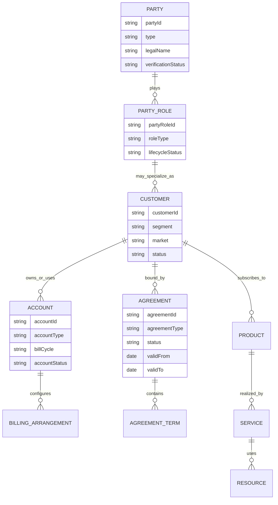

Diagram ini bukan schema final. Ini semantic map.

Intinya:

- party adalah entitas dunia nyata;
- party role adalah konteks peran;
- customer adalah role komersial khusus;
- account adalah struktur finansial/operasional;
- agreement adalah struktur komitmen;
- product/service/resource akan dipelajari lebih dalam pada part berikutnya.

---

## 6. Kesalahan Modeling yang Sering Terjadi

### 6.1 Customer sebagai “semua hal”

Anti-pattern:

```java
class Customer {
    String id;
    String name;
    String msisdn;
    String packageName;
    BigDecimal balance;
    String invoiceNumber;
    String deviceImei;
    String contractPdfUrl;
    String alarmStatus;
}
```

Masalah:

1. `msisdn` adalah resource/logical identifier, bukan customer property universal.
2. `packageName` adalah product/subscription view.
3. `balance` bisa berada di prepaid balance account atau billing account.
4. `invoiceNumber` milik billing/invoice context.
5. `deviceImei` bisa resource/customer equipment/product characteristic.
6. `contractPdfUrl` milik agreement/document management.
7. `alarmStatus` milik assurance.

Model seperti ini membuat perubahan kecil menjadi blast radius besar.

### 6.2 Billing account disamakan dengan customer

Dalam B2C sederhana, satu customer sering punya satu billing account. Tetapi itu bukan invariant telco.

Kasus nyata:

```text
Customer: PT Alpha
Billing Account A: HQ postpaid mobile employees
Billing Account B: Branch Surabaya fixed internet
Billing Account C: IoT fleet devices
Billing Account D: Partner wholesale settlement
```

Jika sistem mengasumsikan `customer_id == billing_account_id`, invoice, dunning, dispute, dan payment allocation akan salah.

### 6.3 Payer disamakan dengan user

Contoh keluarga:

```text
Parent: payer
Child: service user
Billing account: parent account
Subscription: child mobile number
Consent: child/guardian rules depend on regulation
```

Contoh enterprise:

```text
Company: payer
Employee: service user
IT admin: authorized contact
Procurement manager: agreement signer
Finance team: invoice recipient
```

Payer, user, owner, contact, and signer are different roles.

### 6.4 Agreement hanya disimpan sebagai PDF

PDF adalah evidence/document, bukan domain agreement.

Agreement domain perlu menyimpan:

- parties;
- effective period;
- status;
- version;
- terms;
- SLA;
- product/offering scope;
- renewal rule;
- termination condition;
- penalty;
- discount commitment;
- attachment references;
- approval history.

Kalau agreement hanya URL PDF, sistem tidak bisa melakukan rule enforcement.

---

## 7. Party Design

### 7.1 Individual vs Organization

Gunakan tipe eksplisit.

```java
public sealed interface Party permits IndividualParty, OrganizationParty {
    PartyId id();
    VerificationStatus verificationStatus();
    List<ContactMedium> contactMedia();
    List<ExternalReference> externalReferences();
}

public record IndividualParty(
    PartyId id,
    PersonName legalName,
    Optional<LocalDate> birthDate,
    List<IdentityDocument> identityDocuments,
    VerificationStatus verificationStatus,
    List<ContactMedium> contactMedia,
    List<ExternalReference> externalReferences
) implements Party {}

public record OrganizationParty(
    PartyId id,
    OrganizationName legalName,
    Optional<TaxIdentifier> taxIdentifier,
    Optional<RegistrationNumber> registrationNumber,
    VerificationStatus verificationStatus,
    List<ContactMedium> contactMedia,
    List<ExternalReference> externalReferences
) implements Party {}
```

Gunakan sealed types ketika semantic type berbeda dan rule berbeda. Jangan pakai `String partyType` di mana-mana jika behavior domain berubah berdasarkan type.

### 7.2 Party Identity vs Login Identity

Jangan campur:

| Konsep | Domain |
|---|---|
| Party identity | BSS party/customer domain |
| Login account | IAM/security domain |
| Device identity | network/device/resource domain |
| SIM identity | resource/inventory domain |
| Billing identity | account/billing domain |
| Legal identity | KYC/compliance domain |

Satu party bisa punya beberapa login. Satu login bisa didelegasikan untuk mengelola beberapa customer account. KYC verification bukan sama dengan authentication.

### 7.3 Party Verification

Verification state perlu terpisah dari customer state.

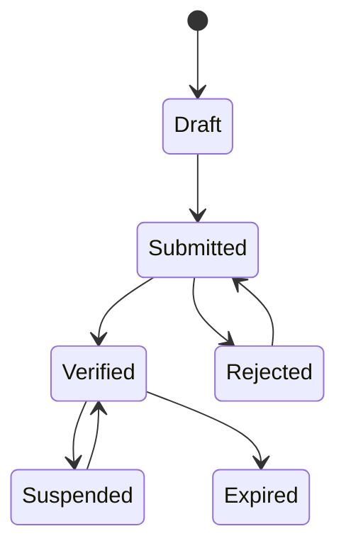

Contoh invariant:

- party belum verified bisa dibuat sebagai prospect;
- party belum verified mungkin tidak boleh membuka postpaid account;
- party yang verification expired bisa tetap punya active subscription, tetapi tidak boleh upgrade tertentu;
- legal identity update perlu audit dan mungkin approval.

---

## 8. Party Role Design

Party role adalah cara aman untuk menghindari entity `Customer` menjadi terlalu gemuk.

Contoh role:

```text
Customer
Payer
Subscriber
EndUser
AuthorizedContact
AgreementSigner
BillingContact
TechnicalContact
Partner
Dealer
Reseller
Installer
FieldTechnician
EnterpriseAdministrator
```

Model:

```java
public record PartyRole(
    PartyRoleId id,
    PartyId partyId,
    RoleType roleType,
    RoleScope scope,
    LifecycleStatus status,
    ValidityPeriod validity,
    List<PermissionGrant> grants
) {}
```

`RoleScope` sangat penting.

Contoh:

```text
Party A is BillingContact for BillingAccount BA-123
Party B is TechnicalContact for ServiceAccount SA-901
Party C is AgreementSigner for Agreement AG-777
Party D is EnterpriseAdministrator for Customer C-555
```

Tanpa scope, role menjadi global dan berbahaya.

Anti-pattern:

```java
boolean isAdmin;
boolean isBillingContact;
boolean isTechnicalContact;
```

Field boolean global tidak cukup untuk enterprise telco.

---

## 9. Customer Design

Customer adalah commercial party role yang punya hubungan dengan operator.

```java
public record Customer(
    CustomerId id,
    PartyRoleId partyRoleId,
    CustomerSegment segment,
    Market market,
    CustomerStatus status,
    ValidityPeriod relationshipPeriod,
    List<AccountReference> accounts,
    List<AgreementReference> agreements,
    List<CustomerCharacteristic> characteristics
) {}
```

### 9.1 Customer Segment

Segment bukan sekadar label marketing. Segment berdampak pada:

- eligibility;
- credit check;
- catalog visibility;
- SLA;
- account hierarchy;
- order approval;
- billing cycle;
- tax treatment;
- support priority;
- dunning behavior;
- retention offer;
- dispute workflow.

Contoh segment:

```text
Consumer
SME
Enterprise
Government
Wholesale
MVNO
Partner
Internal/Test
```

### 9.2 Customer Status

State customer tidak sama dengan state subscription.

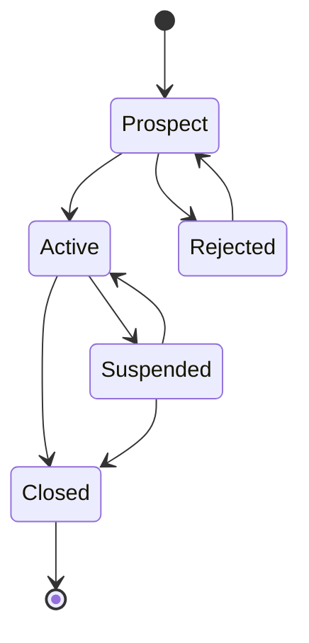

Contoh:

- customer `Active`, tetapi semua product terminated;
- customer `Suspended`, tetapi billing account masih perlu menagih outstanding invoice;
- customer `Closed`, tetapi data retention dan audit tetap berlaku;
- customer `Prospect`, tetapi quote boleh dibuat.

### 9.3 Customer Hierarchy

Enterprise customer sering punya hierarchy:

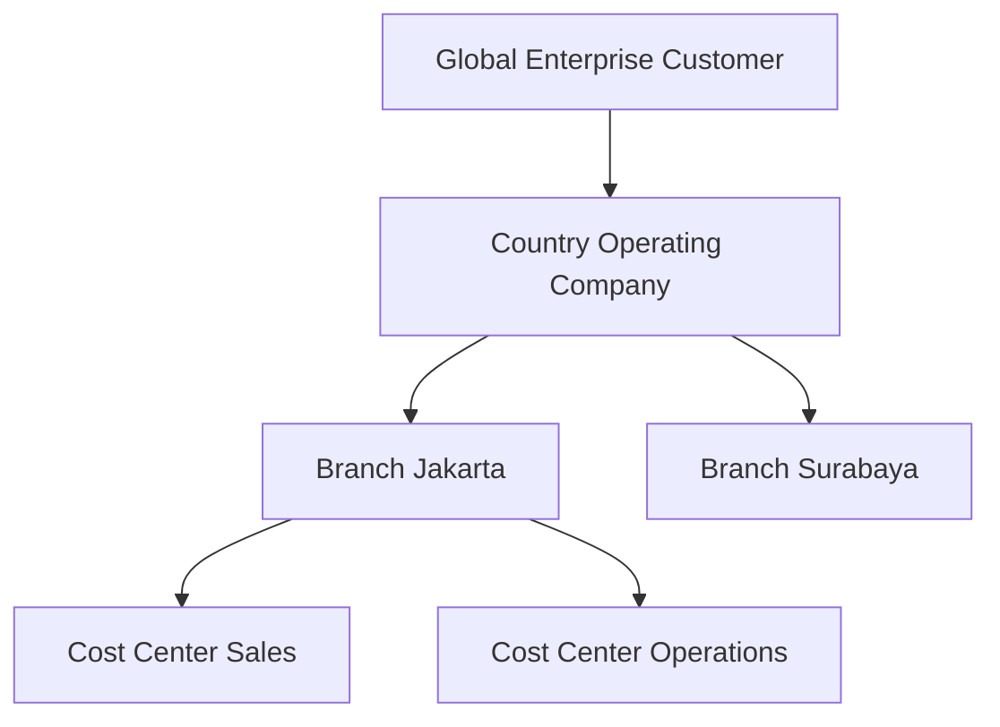

Hierarchy berdampak pada:

- siapa boleh order;
- siapa menerima invoice;
- siapa membayar;
- siapa melihat usage;
- siapa membuka trouble ticket;
- siapa punya SLA;
- cost center allocation;
- approval flow.

Jangan hard-code satu level parent-child. Gunakan graph/tree dengan rule yang eksplisit.

---

## 10. Account Design

### 10.1 Billing Account

Billing account adalah pusat invoice dan collection.

```java
public record BillingAccount(
    BillingAccountId id,
    CustomerId customerId,
    AccountStatus status,
    BillCycle billCycle,
    Currency currency,
    TaxProfile taxProfile,
    PaymentArrangement paymentArrangement,
    List<ContactReference> invoiceRecipients,
    List<AccountRelationship> relationships,
    List<AccountCharacteristic> characteristics
) {}
```

Billing account perlu menjawab:

1. invoice dibuat kapan?
2. invoice dikirim ke siapa?
3. currency apa?
4. tax rule apa?
5. payment method apa?
6. dunning rule apa?
7. siapa bertanggung jawab membayar?
8. product/subscription mana yang charge-nya masuk account ini?

### 10.2 Account Status

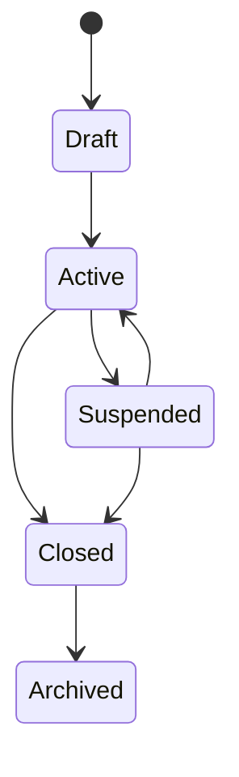

Invariant:

- closed billing account tidak boleh menerima new recurring charge;
- suspended account mungkin masih menerima late usage charge;
- invoice outstanding tetap harus collectible meskipun account closed;
- account deletion fisik biasanya tidak boleh dilakukan karena audit.

### 10.3 Service Account

Service account tidak selalu financial. Ia bisa mengelompokkan layanan berdasarkan:

- lokasi;
- branch;
- department;
- site;
- technical ownership;
- support group;
- service manager;
- SLA domain.

Contoh:

```text
Customer: PT Alpha
Service Account: Alpha Jakarta HQ
Services:
- Dedicated internet access
- SIP trunk
- SD-WAN edge
- Mobile corporate APN
```

Service account membantu assurance dan support, bukan hanya billing.

### 10.4 Prepaid Balance Account

Prepaid account biasanya punya balance dan quota.

```java
public record BalanceAccount(
    BalanceAccountId id,
    CustomerId customerId,
    BalanceStatus status,
    List<BalanceBucket> buckets,
    ValidityPeriod validity
) {}

public record BalanceBucket(
    BalanceBucketId id,
    BalanceType type,
    BigDecimal amount,
    Unit unit,
    ValidityPeriod validity,
    Priority priority
) {}
```

Balance bucket bisa monetary atau non-monetary:

```text
IDR 100000 main balance
10 GB national data
2 GB roaming data
100 minutes voice
unlimited app quota with FUP
```

Jangan simpan semua sebagai `BigDecimal balance`. Unit, validity, priority, rollover, reservation, dan usage type matters.

---

## 11. Agreement Design

Agreement adalah domain serius, bukan file attachment.

```java
public record Agreement(
    AgreementId id,
    AgreementType type,
    AgreementStatus status,
    AgreementSpecificationId specificationId,
    ValidityPeriod validity,
    List<AgreementParty> parties,
    List<AgreementTerm> terms,
    List<AgreementDocument> documents,
    List<ApprovalRecord> approvals,
    Version version
) {}
```

### 11.1 Agreement Specification vs Agreement Instance

Bedakan template dan instance.

| Konsep | Arti |
|---|---|
| Agreement Specification | template/jenis agreement, misalnya Consumer Postpaid Contract v3 |
| Agreement Instance | kontrak nyata antara operator dan customer/partner tertentu |

Contoh:

```text
AgreementSpecification:
- Enterprise Mobile Master Agreement v2026.1

AgreementInstance:
- AG-2026-000991 antara Operator X dan PT Alpha
```

### 11.2 Agreement Terms

Term bisa berupa:

- minimum contract period;
- early termination fee;
- SLA target;
- discount commitment;
- minimum spend;
- device installment duration;
- roaming package rules;
- data processing consent;
- partner settlement percentage;
- exclusivity;
- renewal rule;
- notice period.

Model sederhana:

```java
public sealed interface AgreementTerm permits
    MinimumCommitmentTerm,
    SlaTerm,
    DiscountTerm,
    TerminationFeeTerm,
    RenewalTerm,
    DataProcessingTerm {}

public record MinimumCommitmentTerm(
    Money minimumMonthlySpend,
    Period commitmentPeriod
) implements AgreementTerm {}

public record SlaTerm(
    ServiceLevelObjective objective,
    PenaltyRule penaltyRule
) implements AgreementTerm {}
```

Jangan semua term dijadikan string bebas jika sistem perlu enforce rule.

### 11.3 Agreement Status

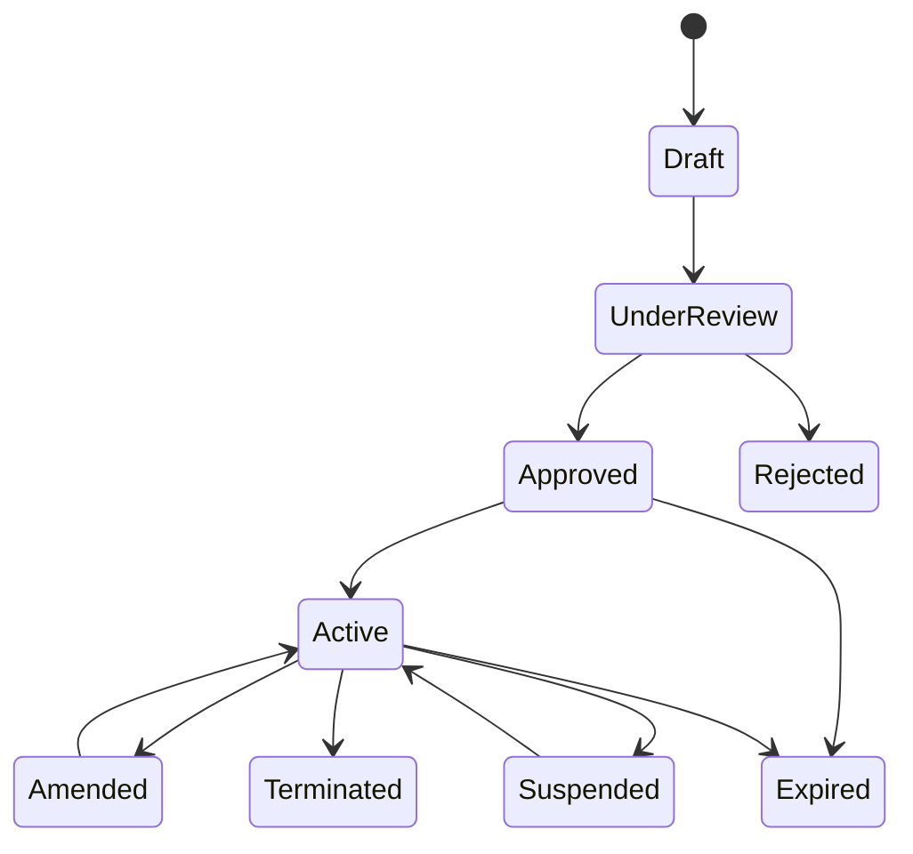

Invariant:

- agreement `Approved` belum tentu `Active`; active butuh effective date;
- agreement `Expired` tidak boleh menjadi dasar order baru, kecuali ada grace rule;
- amendment harus punya version dan audit trail;
- termination bisa memicu product termination atau penalty;
- agreement status tidak boleh diam-diam mengubah subscription tanpa order/action yang auditable.

---

## 12. B2C Structure

Contoh B2C postpaid:

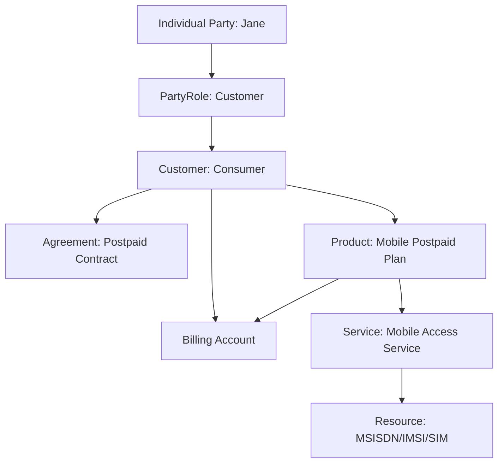

Key point:

- Jane sebagai party adalah orang nyata.
- Customer adalah role komersial Jane.
- Billing Account menentukan invoice dan payment.
- Agreement menentukan legal commitment.
- Product adalah subscription yang dibeli.
- Service adalah realisasi teknis.
- Resource adalah MSISDN/IMSI/SIM.

### 12.1 B2C Family Plan

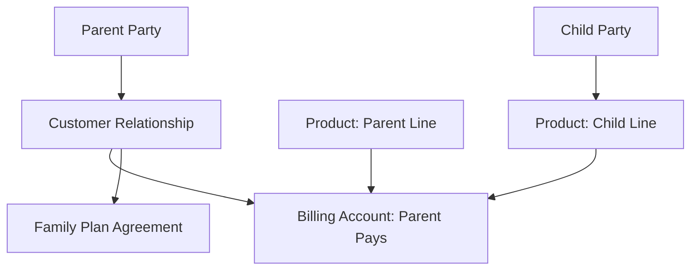

Pertanyaan desain:

1. Siapa payer?
2. Siapa end user?
3. Siapa legal guardian?
4. Siapa boleh request change?
5. Usage child terlihat oleh siapa?
6. Bagaimana consent dan privacy?
7. Apa yang terjadi ketika child mencapai usia dewasa?

---

## 13. B2B Structure

B2B telco jauh lebih kompleks.

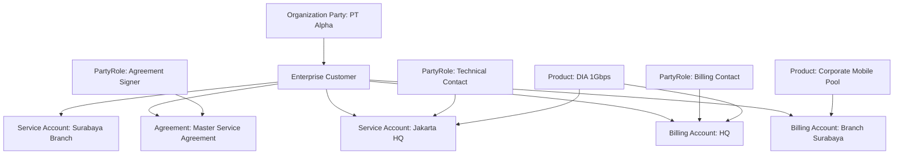

B2B design harus mendukung:

- multiple contacts with scoped authority;
- hierarchy approval;
- cost center;
- different invoice recipients;
- different service locations;
- different SLAs;
- parent-child account;
- branch-level trouble ticket;
- master agreement plus order form;
- delegated admin;
- bulk order;
- bulk suspension;
- fleet management.

---

## 14. Partner, MVNO, Wholesale

Dalam partner ecosystem, party/customer/account/agreement lebih rumit.

Contoh MVNO:

```text
MNO: network owner
MVNO: wholesale customer/partner
End subscriber: customer of MVNO, not necessarily customer of MNO
Settlement account: MVNO settlement
Agreement: wholesale agreement
Product: wholesale connectivity product
Service: network access service
Resource: IMSI/MSISDN range, APN, roaming profile
```

Model:

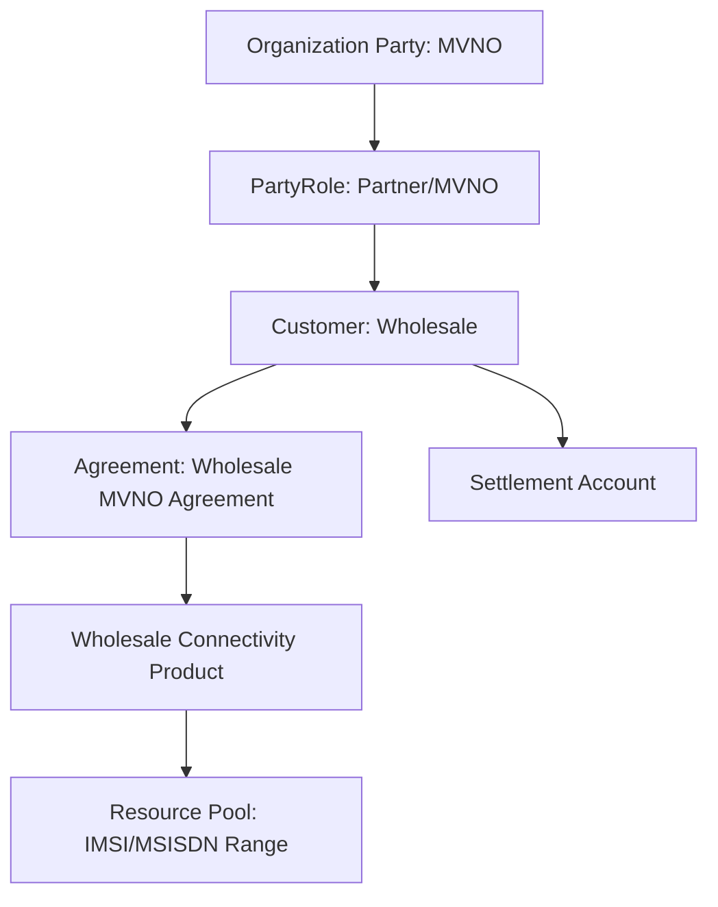

Pertanyaan domain:

1. Apakah end subscriber disimpan di MNO BSS?
2. Apakah MVNO punya full subscriber ownership?
3. Apakah MNO hanya menyimpan technical profile?
4. Siapa menangani KYC?
5. Siapa menerima CDR?
6. Siapa melakukan charging?
7. Bagaimana settlement dihitung?
8. Bagaimana trouble ticket end customer dieskalasi ke MNO?

Tidak ada jawaban universal. Model tergantung operating model dan agreement.

---

## 15. Consent, Privacy, and Contact Medium

Contact medium bukan hanya email dan nomor telepon. Dalam BSS/OSS, contact medium punya:

- purpose;
- verification state;
- validity;
- preference;
- consent;
- channel;
- legal basis;
- audit history.

Contoh:

```java
public record ContactMedium(
    ContactMediumId id,
    ContactType type,
    String value,
    ContactPurpose purpose,
    VerificationStatus verificationStatus,
    ConsentStatus consentStatus,
    boolean preferred,
    ValidityPeriod validity
) {}
```

Jangan memakai satu kolom `email` untuk semua hal:

```text
login email
invoice email
marketing email
technical notification email
security alert email
legal notice email
```

Masing-masing punya rule berbeda.

---

## 16. Data Ownership Boundary

Rekomendasi ownership:

| Data | Owning Component | Catatan |
|---|---|---|
| Party identity | Party Management | identity, contact, verification |
| Customer relationship | Customer Management | segment, customer status, relationship period |
| Billing account | Account/Billing Account Management | bill cycle, invoice recipient, payment arrangement |
| Agreement | Agreement/Contract Management | terms, version, approval, document evidence |
| Product subscription | Product Inventory/Subscription Management | acquired product and lifecycle |
| Service instance | Service Inventory | realized customer-facing service |
| Resource instance | Resource Inventory | MSISDN, IMSI, SIM, port, device |
| Login/access | IAM | authentication, authorization, delegated access |
| Consent | Privacy/Consent Management | consent purpose and legal basis |

Prinsip:

> Jangan membuat satu `Customer Service` menjadi owner semua data tentang orang, account, product, service, resource, invoice, ticket, dan login.

---

## 17. Integration Boundary: Internal Model vs TMF APIs

Contoh mapping internal ke TMF-style API:

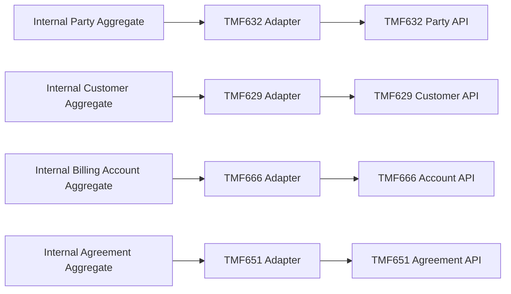

Rules:

1. external API model boleh lebih generic;
2. internal domain model harus lebih strict;
3. mapper harus eksplisit dan tested;
4. jangan expose internal persistence ID sebagai satu-satunya public ID;
5. jangan menerima patch eksternal langsung ke aggregate tanpa validation;
6. semua cross-context reference harus punya referential strategy.

---

## 18. Identifier Strategy

Gunakan identifier yang jelas:

```text
partyId
partyRoleId
customerId
billingAccountId
serviceAccountId
agreementId
productId
serviceId
resourceId
externalReferenceId
```

Jangan membuat semua bernama `id` dalam event dan log tanpa type context.

Event buruk:

```json
{
  "id": "12345",
  "status": "ACTIVE"
}
```

Event lebih baik:

```json
{
  "eventId": "evt-20260628-0001",
  "eventType": "CustomerActivated",
  "customerId": "cus-12345",
  "partyRoleId": "prole-9981",
  "occurredAt": "2026-06-28T09:10:00Z",
  "status": "ACTIVE"
}
```

Identifier strategy harus mendukung:

- audit;
- reconciliation;
- idempotency;
- support investigation;
- external partner mapping;
- data migration;
- merge/split customer;
- anonymization/pseudonymization when legally required.

---

## 19. Lifecycle Invariants

### 19.1 Party Invariants

1. Party identity update must be auditable.
2. Legal identity cannot be overwritten without history.
3. Contact medium verification is not same as party verification.
4. Party deletion usually means logical closure/anonymization, not physical deletion.
5. A party can exist without customer role.

### 19.2 Customer Invariants

1. Customer must reference a valid party role.
2. Customer status must not be derived only from product status.
3. Customer closure must not erase receivables, disputes, agreements, or audit trails.
4. Customer segment changes may require revalidation of catalog eligibility and SLA.
5. Enterprise customer hierarchy changes must not orphan billing/service accounts.

### 19.3 Account Invariants

1. Billing account must have billing arrangement before billable postpaid product activation.
2. Closed billing account must not receive new recurring charges.
3. Outstanding balance must survive customer/account closure until settled/written off.
4. Payment allocation must be traceable.
5. Billing account movement must define effective date and proration behavior.

### 19.4 Agreement Invariants

1. Agreement effective date controls enforceability.
2. Approved agreement is not automatically active.
3. Amendment creates a new version or auditable change record.
4. Termination must preserve historical terms for billing disputes.
5. Agreement terms used by pricing/order/assurance must be machine-readable if enforcement is automated.

---

## 20. Java Aggregate Boundary

### 20.1 Do Not Build a Mega Aggregate

Bad aggregate:

```text
CustomerAggregate
- Party
- Contacts
- BillingAccounts
- Agreements
- Products
- Services
- Resources
- Invoices
- Tickets
```

This will create:

- huge transaction boundary;
- lock contention;
- unclear ownership;
- circular dependencies;
- over-fetching;
- fragile migrations;
- impossible partial failure handling.

### 20.2 Recommended Aggregate Split

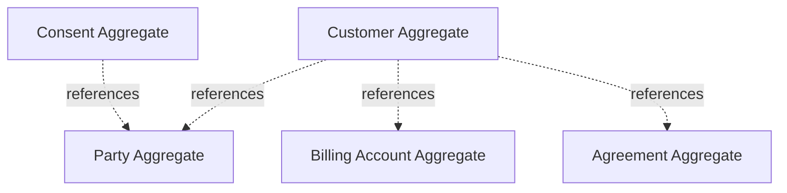

Use references, not embedded full aggregate objects.

Example:

```java
public final class CustomerAggregate {
    private final CustomerId id;
    private final PartyRoleId partyRoleId;
    private CustomerStatus status;
    private CustomerSegment segment;
    private final List<BillingAccountId> billingAccounts;
    private final List<AgreementId> agreements;

    public DomainEvent activate(ActivationPolicy policy) {
        if (status != CustomerStatus.PROSPECT) {
            throw new IllegalStateException("Only prospect customer can be activated");
        }
        policy.assertEligibleForActivation(this);
        this.status = CustomerStatus.ACTIVE;
        return new CustomerActivated(id);
    }
}
```

---

## 21. API Design Guidelines

### 21.1 Command APIs vs Query APIs

Separate commands from queries.

Command examples:

```http
POST /customers/{customerId}/activate
POST /billing-accounts/{accountId}/suspend
POST /agreements/{agreementId}/approve
POST /party-roles/{partyRoleId}/revoke
```

Query examples:

```http
GET /customers/{customerId}
GET /customers/{customerId}/accounts
GET /customers/{customerId}/agreements
GET /party/{partyId}/roles
```

Avoid patching lifecycle blindly:

```http
PATCH /customers/123
{ "status": "ACTIVE" }
```

Better:

```http
POST /customers/123/activate
{
  "reason": "KYC_VERIFIED",
  "correlationId": "ord-789"
}
```

Why? Because lifecycle transitions need rule validation and audit.

### 21.2 Event Design

Events should be domain facts, not CRUD notifications only.

Good events:

```text
PartyVerified
CustomerActivated
BillingAccountCreated
BillingAccountSuspended
AgreementApproved
AgreementActivated
AgreementAmended
CustomerSegmentChanged
BillingContactChanged
```

Avoid only:

```text
CustomerUpdated
AccountUpdated
AgreementUpdated
```

Generic updated events are hard to consume safely.

---

## 22. Example Event Payloads

```json
{
  "eventId": "evt-10001",
  "eventType": "BillingAccountCreated",
  "occurredAt": "2026-06-28T10:15:00Z",
  "correlationId": "order-90001",
  "billingAccountId": "ba-123",
  "customerId": "cus-456",
  "billCycle": "MONTHLY_01",
  "currency": "IDR",
  "status": "ACTIVE"
}
```

```json
{
  "eventId": "evt-10002",
  "eventType": "AgreementActivated",
  "occurredAt": "2026-06-28T10:16:00Z",
  "agreementId": "ag-789",
  "customerId": "cus-456",
  "agreementType": "ENTERPRISE_MASTER_SERVICE_AGREEMENT",
  "validFrom": "2026-07-01",
  "validTo": "2028-06-30",
  "version": 3
}
```

---

## 23. Query Model for Customer 360

Customer 360 is a **read model**, not necessarily the owner of all customer data.

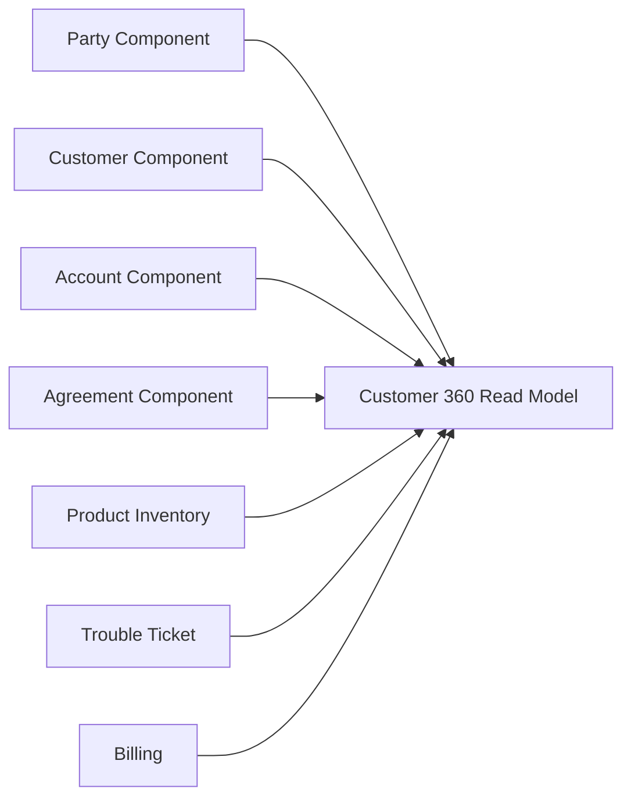

Customer 360 should aggregate:

- customer profile;
- products/subscriptions;
- billing status;
- open tickets;
- agreements;
- contacts;
- service health;
- recent orders;
- outstanding balance;
- consent flags.

But it should not become the writer of every domain.

---

## 24. Scenario: Enterprise Adds 500 SIMs

Requirement:

> PT Alpha wants to add 500 corporate SIMs under existing enterprise agreement. Billing goes to cost center Sales. Employees will be service users. Procurement manager approves the order. Finance receives invoices. IT admin manages SIM lifecycle.

Correct domain mapping:

| Requirement | Domain |
|---|---|
| PT Alpha | Organization Party |
| Existing enterprise relation | Customer |
| Enterprise agreement | Agreement |
| Cost center Sales | Billing Account or Account Characteristic |
| Employees | Party / EndUser roles, depending policy |
| Procurement approval | PartyRole + approval workflow |
| Finance invoice recipient | BillingContact scoped to BillingAccount |
| IT admin | EnterpriseAdministrator scoped to customer/account/product group |
| 500 SIMs | ProductOrder items → Product inventory → Resource assignment |
| SIM lifecycle | Resource inventory + product/service lifecycle |

Wrong design:

```text
Insert 500 rows into customer table.
```

Correct design:

```text
Create product order with 500 order items.
Reference existing customer and agreement.
Assign billing account/cost center.
Capture end user mapping if required.
Reserve SIM/MSISDN/IMSI resources.
Activate products/services through fulfillment.
Emit events for account/product/service/resource updates.
```

---

## 25. Scenario: Account Transfer

Requirement:

> A subscriber wants to move an active mobile subscription from one billing account to another without changing MSISDN.

Domain impact:

| Object | Impact |
|---|---|
| Party | likely unchanged |
| Customer | likely unchanged |
| Product | active product remains |
| Resource | MSISDN unchanged |
| Billing Account | charge destination changes |
| Agreement | may require amendment if contract-bound |
| Billing | proration/effective date needed |
| Charging | future usage routing must change |
| Audit | must record who requested and approved |

Key invariant:

> Billing account transfer must have effective date, authority validation, and charging/billing synchronization.

Pseudo-command:

```java
public record TransferSubscriptionBillingAccountCommand(
    ProductId productId,
    BillingAccountId fromAccountId,
    BillingAccountId toAccountId,
    LocalDate effectiveDate,
    PartyRoleId requestedBy,
    ReasonCode reason
) {}
```

Do not update `product.billingAccountId` directly without lifecycle validation.

---

## 26. Failure Modes

### 26.1 Duplicate Party

Same person registered twice with different identity/contact.

Impact:

- duplicate billing;
- duplicate credit exposure;
- inconsistent consent;
- support confusion;
- fraud risk.

Mitigation:

- deterministic identity match where legally allowed;
- fuzzy matching workflow;
- duplicate candidate queue;
- merge process with audit;
- do not hard-delete duplicate without reconciliation.

### 26.2 Wrong Account Binding

Product charges routed to wrong billing account.

Impact:

- revenue leakage;
- customer dispute;
- tax error;
- dunning wrong payer;
- enterprise cost center mismatch.

Mitigation:

- effective-dated account assignment;
- order validation;
- billing preview;
- reconciliation between product inventory and billing account;
- audit event for assignment changes.

### 26.3 Agreement Not Machine-Readable

Contract says discount applies after 1000 SIMs, but system cannot enforce it.

Impact:

- manual billing adjustment;
- dispute;
- revenue leakage;
- sales promise not honored.

Mitigation:

- encode enforceable terms;
- store PDF as evidence only;
- create agreement-term mapping to pricing/discount policy;
- validate catalog/order against agreement scope.

### 26.4 Contact Scope Leak

Technical contact gets access to invoices, or billing contact can suspend services.

Impact:

- privacy breach;
- authorization violation;
- customer trust issue.

Mitigation:

- scoped party roles;
- delegated access model;
- least privilege;
- audit;
- consent and purpose-bound contact usage.

---

## 27. Database Modeling Notes

### 27.1 Reference Model

Simplified relational shape:

```sql
party(
  party_id,
  party_type,
  verification_status,
  created_at,
  updated_at
)

individual_party(
  party_id,
  legal_name,
  birth_date
)

organization_party(
  party_id,
  legal_name,
  registration_number,
  tax_identifier
)

party_role(
  party_role_id,
  party_id,
  role_type,
  scope_type,
  scope_id,
  status,
  valid_from,
  valid_to
)

customer(
  customer_id,
  party_role_id,
  segment,
  market,
  status,
  valid_from,
  valid_to
)

billing_account(
  billing_account_id,
  customer_id,
  status,
  bill_cycle,
  currency,
  tax_profile_id
)

agreement(
  agreement_id,
  agreement_specification_id,
  type,
  status,
  version,
  valid_from,
  valid_to
)
```

This is illustrative. Adapt to bounded context and scale.

### 27.2 Effective-Dated Relationships

Use effective dates for relationships that affect billing, authorization, or legal validity.

```sql
product_billing_account_assignment(
  product_id,
  billing_account_id,
  valid_from,
  valid_to,
  assignment_reason,
  created_by,
  created_at
)
```

Never overwrite history:

```sql
-- bad
update product set billing_account_id = ? where product_id = ?;
```

Prefer effective-dated assignment.

---

## 28. Testing Strategy

### 28.1 Domain Tests

Test state transitions:

```java
@Test
void cannotActivateCustomerWithoutVerifiedPartyRole() {
    var customer = CustomerAggregate.prospect(customerId, partyRoleId);
    var policy = new ActivationPolicy(false); // party not verified

    assertThrows(DomainRuleViolation.class, () -> customer.activate(policy));
}
```

### 28.2 Contract Mapping Tests

Test TMF adapter mapping separately:

```java
@Test
void mapsInternalBillingAccountToTmf666Resource() {
    var account = Fixtures.activeBillingAccount();
    var tmf = mapper.toTmf666(account);

    assertEquals(account.id().value(), tmf.getId());
    assertEquals("Active", tmf.getState());
    assertEquals(account.billCycle().code(), tmf.getBillStructure().getCycleSpecification().getCode());
}
```

### 28.3 Scenario Tests

Use scenario-based tests:

```text
Given enterprise customer with active MSA
And billing account HQ active
And billing contact scoped to HQ
When product order adds 500 corporate SIMs
Then order references existing customer
And charge destination is HQ billing account
And end-user mapping is captured
And agreement eligibility passes
And ProductOrderSubmitted event is emitted
```

---

## 29. Operational Checklist

Before approving your party/customer/account/agreement model, ask:

1. Can one party play multiple roles?
2. Can one customer have multiple billing accounts?
3. Can one billing account pay for multiple products?
4. Can payer differ from user?
5. Can agreement signer differ from technical contact?
6. Can enterprise hierarchy change without losing audit?
7. Can contact medium be purpose-scoped?
8. Can agreement terms be enforced by order/pricing/billing?
9. Can closed customer/account still support disputes and audit?
10. Can product billing account assignment be effective-dated?
11. Can partner/MVNO/wholesale use cases fit without table hacks?
12. Can API mapping to TMF resources happen without leaking internal model?

If many answers are no, the model is not ready for carrier-grade BSS.

---

## 30. Kaufman Practice Loop

### Drill 1 — Separate Semantics

Given:

```text
A corporate employee uses a mobile number paid by company HQ, managed by IT admin, under enterprise agreement, with invoices sent to finance.
```

Identify:

- party;
- customer;
- payer;
- end user;
- billing account;
- agreement;
- contact roles;
- product;
- service;
- resource.

### Drill 2 — Model a Family Plan

Design a model for:

```text
Parent pays for 4 family lines. One child line has restricted usage. Marketing consent differs per user. All charges appear in one invoice.
```

Questions:

1. Where is payer represented?
2. Where is end user represented?
3. Where is consent represented?
4. Where is restriction enforced?
5. What happens when one line is terminated?

### Drill 3 — Agreement Enforcement

Requirement:

```text
Enterprise contract gives 15% discount only if active SIM count >= 1000. Early termination before 24 months triggers penalty.
```

Design:

- agreement terms;
- pricing integration;
- billing validation;
- termination flow;
- audit events.

---

## 31. What Good Looks Like

Good Java BSS/OSS design for party/customer/account/agreement has these characteristics:

1. semantic separation is clear;
2. aggregate boundaries are small enough;
3. lifecycle state is explicit;
4. roles are scoped;
5. account assignment is effective-dated;
6. agreement is machine-readable where needed;
7. customer 360 is a read model, not a god service;
8. APIs can map to TMF without forcing internal schema;
9. enterprise hierarchy is supported;
10. partner and wholesale models do not require hacks;
11. audit and reconciliation are first-class.

---

## 32. Ringkasan

Part ini membangun fondasi commercial-party domain BSS/OSS.

Kunci utamanya:

- **Party** adalah orang/organisasi dunia nyata.
- **Party Role** adalah peran party dalam konteks tertentu.
- **Customer** adalah role komersial khusus.
- **Account** adalah struktur billing, settlement, balance, atau pengelompokan operasional.
- **Agreement** adalah komitmen legal/komersial yang harus bisa dibaca sistem jika rule-nya perlu enforced.
- Jangan memusatkan semua ke tabel `customer`.
- Jangan menaruh MSISDN, balance, invoice, contract, ticket, device, dan service state sebagai field customer.
- Gunakan TMF sebagai vocabulary dan API boundary, bukan persistence model mentah.

Part berikutnya akan masuk ke **Product Catalog & Offer Modeling**: bagaimana product specification, product offering, pricing, bundle, eligibility, compatibility, versioning, dan lifecycle catalog didesain agar order, charging, fulfillment, dan billing tidak rusak.

---

## 33. Referensi

- TM Forum — TMF632 Party Management API.
- TM Forum — TMF629 Customer Management API.
- TM Forum — TMF666 Account Management API.
- TM Forum — TMF651 Agreement Management API.
- TM Forum — TMF669 Party Role Management API.
- TM Forum — Information Framework SID.
