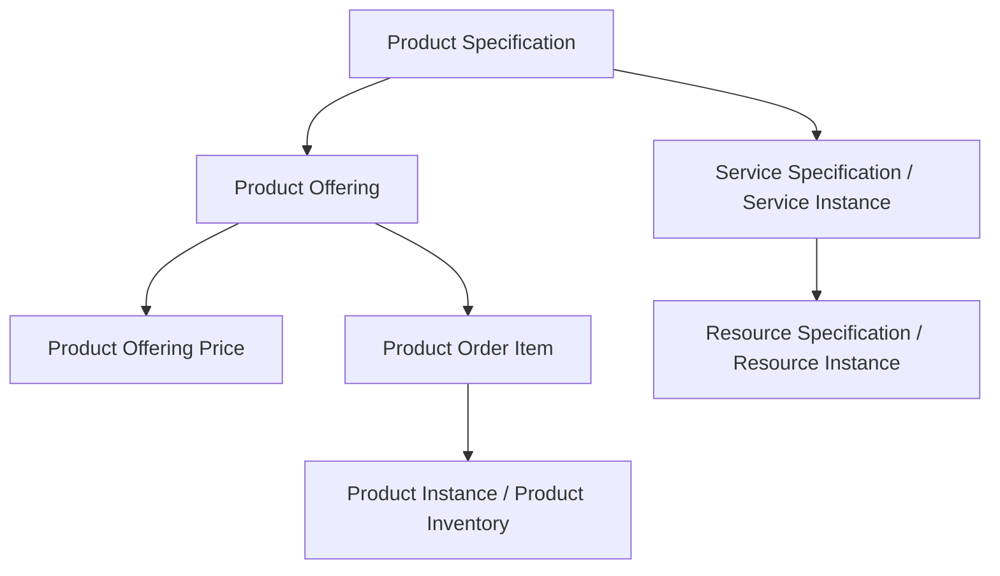
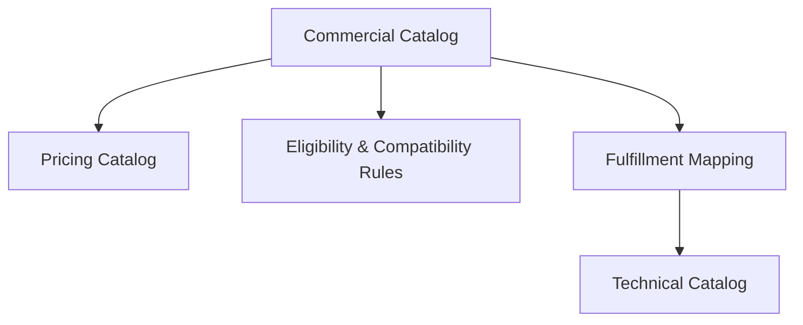
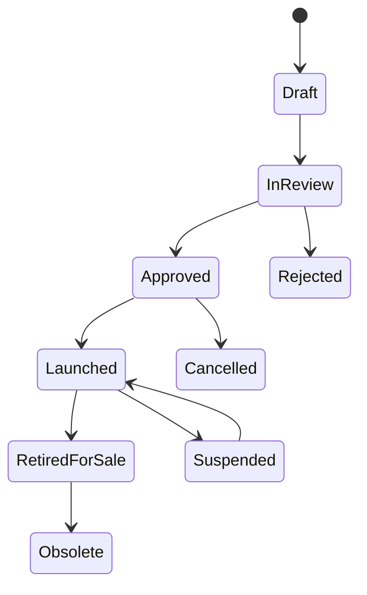
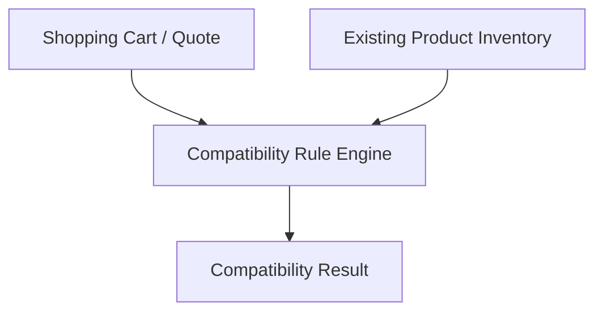
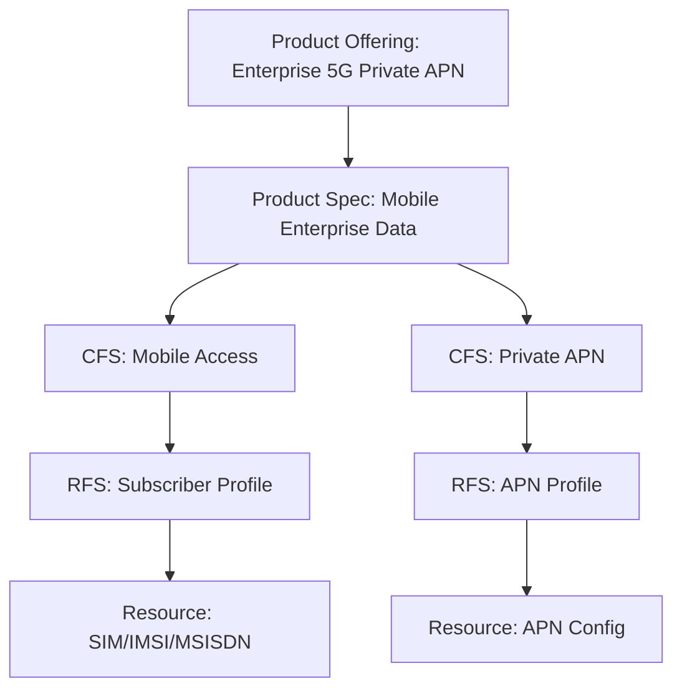
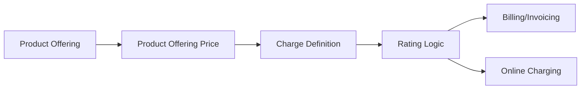
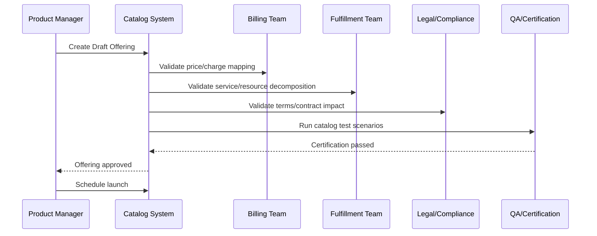
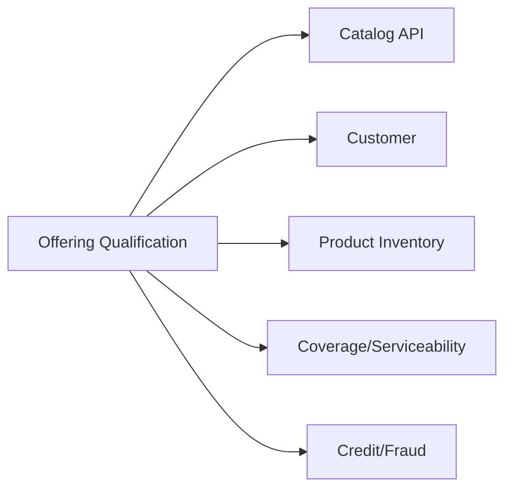
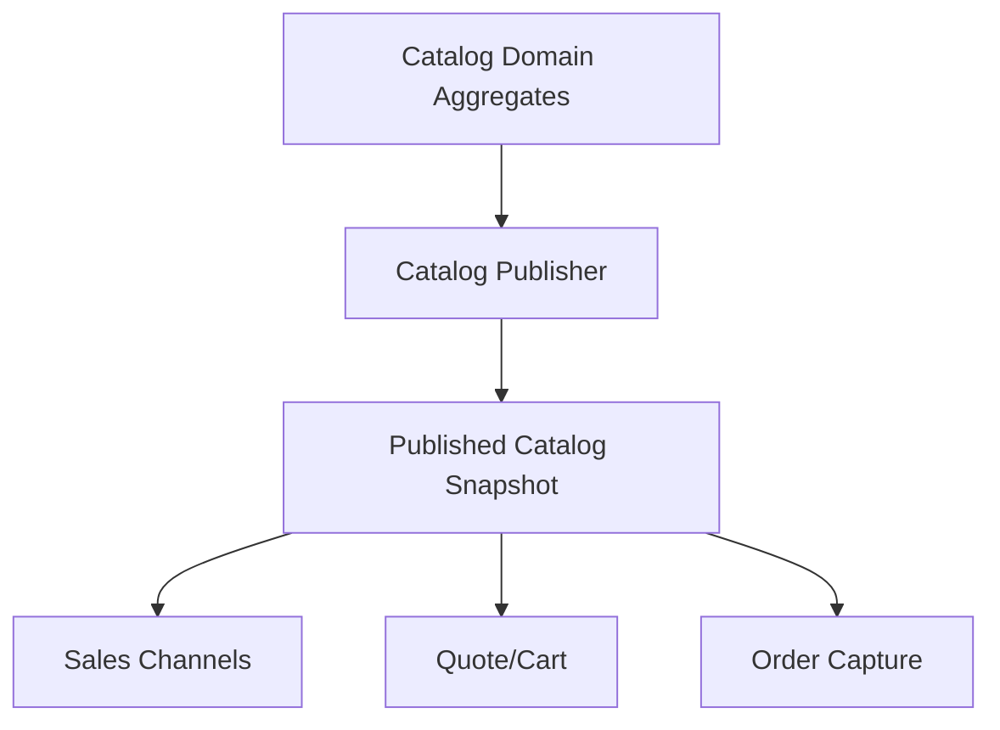

# Part 008 — Product Catalog & Offer Modeling

## 1. Tujuan Part Ini

Part ini membahas salah satu area paling menentukan dalam BSS: **product catalog**.

Product catalog bukan daftar paket sederhana seperti:

```text
Paket A: 10 GB, Rp100.000
Paket B: 25 GB, Rp150.000
Paket C: Unlimited, Rp250.000
```

Dalam telco carrier-grade, catalog adalah mesin komersial yang menentukan:

- apa yang bisa dijual;
- kepada siapa bisa dijual;
- di channel mana bisa dijual;
- dalam periode apa bisa dijual;
- dengan harga apa;
- bisa dibundling dengan apa;
- butuh service/resource apa;
- rule upgrade/downgrade apa;
- bagaimana order divalidasi;
- bagaimana charging dan billing dikonfigurasi;
- bagaimana agreement dan discount diterapkan;
- bagaimana product direalisasikan menjadi service dan resource;
- bagaimana perubahan catalog tidak merusak subscription lama.

Sistem BSS yang catalog-nya buruk akan selalu menghasilkan masalah downstream:

```text
sales menjual produk yang tidak bisa di-provision
order validasi gagal di tengah fulfillment
billing tidak tahu charge mana yang harus dibuat
OCS/PCRF/PCF tidak menerima entitlement benar
invoice salah karena price version berubah
customer tidak eligible tetapi tetap bisa order
bundle tidak konsisten
migration plan kacau
revenue leakage
```

Part ini mengajarkan catalog sebagai **commercial control plane**.

---

## 2. Kaufman Skill Target

Target part ini:

1. membedakan product specification, product offering, product offering price, bundle, characteristic, dan product instance;
2. membuat catalog model yang stabil tetapi bisa berevolusi cepat;
3. memahami lifecycle/versioning catalog;
4. mendesain eligibility dan compatibility rule;
5. menghubungkan catalog dengan order, charging, billing, fulfillment, dan agreement;
6. menulis Java domain model yang tidak berubah menjadi generic key-value chaos;
7. mendeteksi catalog anti-pattern sebelum masuk produksi.

Setelah part ini, kamu harus bisa membaca requirement seperti:

> “Buat paket 5G enterprise dengan pooled data 1 TB, 500 SIM, private APN, SLA gold, diskon 15% jika commit 24 bulan, hanya untuk enterprise segment, tersedia mulai 1 Juli, tidak boleh dibeli bersama unlimited consumer plan, bisa add-on roaming.”

Lalu memetakan ke:

- offering;
- specification;
- price;
- characteristic;
- eligibility;
- compatibility;
- bundle;
- agreement term;
- fulfillment decomposition;
- charging/billing configuration;
- lifecycle/version.

---

## 3. Reference Model Singkat

Part ini terinspirasi dari TM Forum Product Catalog Management API dan SID Product domain.

Secara konseptual:

- **Product Catalog** mengelola lifecycle elemen catalog dan memungkinkan catalog dipakai dalam proses ordering, campaign, dan sales.
- **Product Offering** adalah sesuatu yang tersedia untuk dijual kepada customer/market/channel tertentu.
- **Product Specification** mendefinisikan struktur/karakteristik produk secara lebih stabil.
- **Product Offering Price** mendefinisikan charge/price yang terkait dengan offering.
- **Product Order** biasanya dibuat berdasarkan product offering dari catalog.
- **Product Inventory** menyimpan acquired product/product instance setelah order berhasil.

Gunakan standar sebagai external vocabulary. Internal implementation tetap harus menjaga invariant bisnis dan operational correctness.

---

## 4. Mental Model: Specification vs Offering vs Instance

Ini pemisahan paling penting.



### 4.1 Product Specification

Product specification menjawab:

> “Produk jenis apa ini, dan karakteristik apa yang mungkin dimiliki?”

Contoh specification:

```text
Mobile Postpaid Plan Specification
- data allowance
- voice allowance
- sms allowance
- network technology
- roaming enabled
- throttling policy
- APN profile
```

Specification relatif stabil.

### 4.2 Product Offering

Product offering menjawab:

> “Varian komersial apa yang dijual ke market tertentu dengan rule tertentu?”

Contoh offering:

```text
Enterprise 5G Gold 100GB 2026
- based on Mobile Postpaid Plan Specification
- available to enterprise segment
- valid for Indonesia market
- sellable from 2026-07-01 to 2026-12-31
- requires 24 months contract
- includes Gold SLA
- available via enterprise sales channel
```

Offering lebih sering berubah daripada specification.

### 4.3 Product Offering Price

Price menjawab:

> “Charge apa yang berlaku untuk offering ini?”

Contoh:

```text
Monthly recurring charge: IDR 250,000 per SIM
Activation fee: IDR 50,000 one-time
Discount: 15% if commitment >= 24 months and quantity >= 500
Penalty: early termination fee based on remaining months
```

Price tidak boleh hanya satu kolom `price`.

### 4.4 Product Instance

Product instance menjawab:

> “Produk nyata apa yang sudah dimiliki customer?”

Contoh:

```text
Product ID: prod-123
Offering: Enterprise 5G Gold 100GB 2026
Customer: PT Alpha
Billing Account: BA-HQ
Status: Active
MSISDN: +62812xxxx
Activated At: 2026-07-03
```

Product instance adalah hasil order. Jangan mengubah instance lama hanya karena catalog offering baru dibuat.

---

## 5. Catalog Layering

Catalog harus dipisahkan menjadi beberapa layer.



### 5.1 Commercial Catalog

Berisi offering yang dijual ke customer.

Contoh:

- prepaid starter pack;
- postpaid mobile plan;
- home broadband;
- enterprise DIA;
- SD-WAN package;
- IoT connectivity;
- roaming add-on;
- device bundle;
- insurance add-on.

### 5.2 Technical Catalog

Berisi service/resource specification yang dibutuhkan fulfillment.

Contoh:

- mobile access service;
- data service;
- voice service;
- private APN service;
- 5G slice service;
- fixed broadband access;
- CPE device;
- MSISDN range;
- SIM profile;
- IP address pool.

### 5.3 Pricing Catalog

Berisi charge model.

Contoh:

- one-time charge;
- recurring charge;
- usage charge;
- tiered usage charge;
- discount;
- allowance;
- penalty;
- deposit;
- installment.

### 5.4 Rule Catalog

Berisi eligibility, compatibility, dependency, and cardinality rule.

Contoh:

- only enterprise customer;
- requires verified identity;
- requires fiber coverage;
- not compatible with consumer unlimited plan;
- max 10 add-ons per base plan;
- roaming add-on requires active mobile service;
- private APN requires enterprise agreement.

### 5.5 Fulfillment Mapping

Menghubungkan offering ke service/resource decomposition.

Contoh:

```text
Offering: Enterprise 5G Private APN
Decomposes to:
- MobileAccessService
- DataService
- PrivateApnService
- PolicyProfile
- ChargingProfile
- SIM/IMSI/MSISDN assignment
```

---

## 6. Core Entities

### 6.1 Product Catalog

```java
public record ProductCatalog(
    CatalogId id,
    String name,
    CatalogStatus status,
    ValidityPeriod validity,
    List<ProductOfferingId> offerings,
    Version version
) {}
```

Catalog dapat dipakai untuk:

- consumer catalog;
- enterprise catalog;
- partner catalog;
- wholesale catalog;
- regional catalog;
- campaign catalog;
- test catalog.

### 6.2 Product Specification

```java
public record ProductSpecification(
    ProductSpecificationId id,
    String name,
    ProductSpecificationStatus status,
    Version version,
    List<ProductCharacteristicSpecification> characteristics,
    List<ServiceSpecificationRef> serviceSpecifications,
    ValidityPeriod validity
) {}
```

Specification should be stable. Jangan membuat specification baru untuk setiap campaign minor.

### 6.3 Product Offering

```java
public record ProductOffering(
    ProductOfferingId id,
    ProductSpecificationId specificationId,
    String name,
    OfferingStatus status,
    MarketSegment marketSegment,
    List<SalesChannel> channels,
    ValidityPeriod sellablePeriod,
    List<ProductOfferingPriceId> prices,
    List<EligibilityRuleId> eligibilityRules,
    List<CompatibilityRuleId> compatibilityRules,
    List<OfferingRelationship> relationships,
    Version version
) {}
```

Offering adalah pusat komersial. Ia bukan hanya nama dan harga.

### 6.4 Product Offering Price

```java
public sealed interface ProductOfferingPrice permits
    OneTimeCharge,
    RecurringCharge,
    UsageCharge,
    DiscountCharge,
    PenaltyCharge {}

public record RecurringCharge(
    PriceId id,
    Money amount,
    BillingPeriod billingPeriod,
    TaxCategory taxCategory,
    ValidityPeriod validity,
    Optional<PriceCondition> condition
) implements ProductOfferingPrice {}

public record UsageCharge(
    PriceId id,
    UsageType usageType,
    RatingUnit unit,
    TieredRate rate,
    ValidityPeriod validity
) implements ProductOfferingPrice {}
```

### 6.5 Product Characteristic Specification

```java
public record ProductCharacteristicSpecification(
    CharacteristicCode code,
    String name,
    ValueType valueType,
    boolean configurable,
    boolean mandatory,
    Optional<ValueConstraint> constraint,
    Optional<DefaultValue> defaultValue
) {}
```

Examples:

```text
dataAllowance = 100GB
networkTechnology = 5G
roamingEnabled = true
contractTerm = 24 months
slaTier = GOLD
apnType = PRIVATE
```

---

## 7. The `Characteristic` Problem

Telco catalog often needs flexible characteristics. But uncontrolled key-value modeling creates chaos.

Bad:

```java
Map<String, String> characteristics;
```

Why bad?

1. no type safety;
2. no constraint;
3. no semantic ownership;
4. hard to validate;
5. hard to search;
6. hard to version;
7. hard to map to charging/provisioning;
8. spelling errors become production bugs.

Better:

```java
public record CharacteristicValue<T>(
    CharacteristicCode code,
    T value,
    ValueType type
) {}
```

Best for important characteristics:

```java
public record MobilePlanConfiguration(
    DataAllowance dataAllowance,
    VoiceAllowance voiceAllowance,
    SmsAllowance smsAllowance,
    NetworkTechnology technology,
    RoamingPolicy roamingPolicy,
    ThrottlingPolicy throttlingPolicy
) {}
```

Rule:

> Use typed fields for characteristics that drive charging, provisioning, eligibility, SLA, or legal terms. Use generic characteristics only for low-risk metadata.

---

## 8. Product Offering Lifecycle

Offering lifecycle must be explicit.



State meanings:

| State | Meaning |
|---|---|
| Draft | editable, not visible to sales/order |
| InReview | under commercial/technical/billing approval |
| Approved | approved but not yet sellable |
| Launched | sellable if within sellable period and eligible |
| Suspended | temporarily not sellable |
| RetiredForSale | no new sales, existing products remain |
| Obsolete | no longer used, preserved for history |
| Cancelled | never launched or withdrawn |

Important invariant:

> Retiring an offering from sale must not terminate existing product instances.

---

## 9. Catalog Versioning

Versioning is critical.

### 9.1 Why Versioning Matters

Example:

```text
January: Plan A = 10GB, IDR 100k
March: Plan A = 12GB, IDR 100k
June: Plan A = 15GB, IDR 120k
```

If you update the same row destructively, you cannot answer:

- what did customer buy in January?
- what price was promised?
- what should invoice show?
- what should dispute resolution use?
- what should downgrade/migration logic compare?
- what was approved by legal?

### 9.2 Immutable Published Version

Once an offering is launched, treat important fields as immutable.

Allowed:

- create new version;
- retire old version for new sales;
- migrate existing customers explicitly;
- use effective-dated price changes if contract allows.

Avoid:

```sql
update product_offering set price = 120000 where id = 'plan-a';
```

Prefer:

```text
plan-a:v1 10GB IDR100k valid Jan-Feb
plan-a:v2 12GB IDR100k valid Mar-May
plan-a:v3 15GB IDR120k valid Jun-
```

### 9.3 Version Identity

Use both stable identity and version identity.

```java
public record OfferingKey(String commercialCode) {}
public record OfferingVersionId(String value) {}

public record VersionedOffering(
    OfferingKey key,
    OfferingVersionId versionId,
    Version version,
    OfferingStatus status,
    ValidityPeriod validity
) {}
```

`commercialCode` helps humans and product managers. `versionId` gives exact technical traceability.

---

## 10. Pricing Model

### 10.1 Price Types

| Price Type | Example |
|---|---|
| One-time charge | activation fee, installation fee, SIM replacement fee |
| Recurring charge | monthly subscription fee |
| Usage charge | per MB, per minute, per SMS, per API call |
| Allowance | included 100GB, 1000 minutes |
| Discount | 15% enterprise discount |
| Penalty | early termination fee |
| Deposit | device deposit, postpaid guarantee |
| Installment | device 24-month payment |

### 10.2 Price Conditions

Price can depend on:

- customer segment;
- quantity;
- contract term;
- channel;
- campaign;
- region;
- payment method;
- bundle membership;
- agreement term;
- usage tier;
- time period.

Example condition:

```java
public record PriceCondition(
    Optional<CustomerSegment> segment,
    Optional<QuantityRange> quantityRange,
    Optional<Period> minimumCommitment,
    Optional<SalesChannel> channel,
    Optional<AgreementTermRef> agreementTerm
) {}
```

### 10.3 Do Not Mix Price and Balance

Price is catalog/configuration. Balance is customer/account runtime state.

Wrong:

```text
ProductOffering.price = remainingBalance
```

Correct:

```text
ProductOfferingPrice defines tariff.
BalanceAccount stores runtime balance.
Rating/Charging consumes usage and applies price/tariff.
```

---

## 11. Eligibility Rules

Eligibility answers:

> “Can this customer buy this offering now?”

Examples:

```text
customer segment must be Enterprise
party must be KYC verified
customer must not be blacklisted
billing account must be active
address must be serviceable by fiber
device must support eSIM
customer must have active base mobile plan
agreement must include private APN entitlement
credit score must pass threshold
```

### 11.1 Rule Model

```java
public interface EligibilityRule {
    EligibilityResult evaluate(EligibilityContext context);
}

public record EligibilityContext(
    CustomerSnapshot customer,
    PartySnapshot party,
    BillingAccountSnapshot billingAccount,
    AgreementSnapshot agreement,
    AddressSnapshot serviceAddress,
    List<ProductSnapshot> existingProducts,
    SalesChannel channel,
    Instant requestedAt
) {}
```

### 11.2 Eligibility Result

```java
public record EligibilityResult(
    boolean eligible,
    List<EligibilityFailure> failures,
    List<EligibilityWarning> warnings
) {}
```

Do not return only `true/false`. Sales/order systems need reason codes.

Example:

```json
{
  "eligible": false,
  "failures": [
    {
      "code": "BILLING_ACCOUNT_SUSPENDED",
      "message": "Selected billing account is suspended"
    },
    {
      "code": "AGREEMENT_REQUIRED",
      "message": "Private APN offering requires active enterprise agreement"
    }
  ]
}
```

---

## 12. Compatibility Rules

Compatibility answers:

> “Can this offering coexist with other offerings/products in the cart or inventory?”

Examples:

- roaming add-on requires active mobile base plan;
- 5G add-on requires 5G-capable base plan and device;
- consumer unlimited plan incompatible with enterprise pooled data plan;
- only one primary voice plan per MSISDN;
- private APN requires enterprise APN service;
- device installment cannot exceed one per line;
- multi-SIM add-on max 3 per base subscription.

### 12.1 Cart Compatibility vs Inventory Compatibility

Check both:

1. compatibility with current cart;
2. compatibility with existing active products.



If you only check cart, customer can buy an add-on incompatible with existing subscription.

### 12.2 Cardinality

Example:

```java
public record CardinalityRule(
    ProductOfferingId parentOffering,
    ProductOfferingId childOffering,
    int min,
    int max
) {}
```

Rules:

```text
BasePlan -> RoamingAddon min 0 max 5
BasePlan -> MultiSimAddon min 0 max 3
EnterpriseBundle -> SimLine min 10 max 10000
HomeBroadband -> RouterDevice min 1 max 1
```

---

## 13. Bundles

Bundle is not just a marketing package.

### 13.1 Bundle Types

| Bundle Type | Meaning |
|---|---|
| Hard bundle | components must be bought together |
| Soft bundle | components offered together but can vary |
| Commercial bundle | discount/pricing group |
| Technical bundle | fulfillment/service decomposition group |
| Family bundle | multiple lines grouped under one payer |
| Enterprise bundle | pooled quota or fleet allocation |
| Device-service bundle | device installment plus subscription |

### 13.2 Bundle Model

```java
public record BundleOffering(
    ProductOfferingId id,
    String name,
    List<BundleComponent> components,
    List<BundlePriceRule> priceRules,
    List<CompatibilityRuleId> compatibilityRules
) {}

public record BundleComponent(
    ProductOfferingId offeringId,
    int minCardinality,
    int maxCardinality,
    boolean mandatory
) {}
```

### 13.3 Bundle Lifecycle Trap

If bundle component changes, do not mutate old sold bundle destructively.

Example:

```text
Bundle v1: Base Plan + 10GB Add-on + Router A
Bundle v2: Base Plan + 20GB Add-on + Router B
```

Existing customers on v1 may remain unless explicit migration.

---

## 14. Catalog to Fulfillment Mapping

Catalog must eventually become service/resource actions.

Example:



Part service decomposition akan dibahas lebih detail di Part 016–017. Untuk sekarang, pahami bahwa product catalog harus memberi cukup sinyal untuk fulfillment.

Minimum mapping data:

- product specification;
- required service specifications;
- required resource specifications;
- configurable characteristics;
- activation profile;
- charging profile;
- policy profile;
- SLA tier;
- provisioning adapter target.

---

## 15. Catalog to Charging/Billing Mapping

Catalog price must map to billing and charging.



Example mapping:

```text
Recurring charge -> billing monthly invoice item
Usage charge -> rating tariff
Allowance -> charging balance bucket/quota
Discount -> billing discount or rating discount
Penalty -> termination charge
Activation fee -> one-time invoice item
```

Key invariant:

> Every sellable offering must have a clear downstream charging/billing interpretation before launch.

---

## 16. Catalog Governance Workflow

Catalog launch should require approvals.



Do not let product managers directly launch offerings into production without technical, billing, legal, and fulfillment validation.

---

## 17. Catalog Validation Checklist

Before an offering becomes `Launched`, validate:

1. product specification exists and is approved;
2. mandatory characteristics have constraints;
3. price definitions exist;
4. tax category is defined;
5. billing interpretation exists;
6. charging interpretation exists if usage/prepaid/quota involved;
7. eligibility rules are configured;
8. compatibility rules are configured;
9. sales channels are specified;
10. market/segment is specified;
11. sellable period is valid;
12. service/resource decomposition exists;
13. agreement dependency is configured if required;
14. migration rule is defined if replacing old offering;
15. test cases are generated;
16. rollback/retire plan exists.

---

## 18. Java Catalog Aggregate Design

### 18.1 Aggregate Boundaries

Do not make entire catalog one aggregate if large.

Possible aggregates:

```text
ProductSpecificationAggregate
ProductOfferingAggregate
ProductOfferingPriceAggregate
CatalogPublicationAggregate
EligibilityRuleAggregate
CompatibilityRuleAggregate
BundleAggregate
```

### 18.2 ProductOffering Aggregate Example

```java
public final class ProductOfferingAggregate {
    private final ProductOfferingId id;
    private final ProductSpecificationId specificationId;
    private OfferingStatus status;
    private Version version;
    private ValidityPeriod sellablePeriod;
    private final List<ProductOfferingPriceId> prices;
    private final List<EligibilityRuleId> eligibilityRules;
    private final List<CompatibilityRuleId> compatibilityRules;
    private final List<SalesChannel> channels;

    public DomainEvent submitForReview(CatalogValidationPolicy policy) {
        ensureStatus(OfferingStatus.DRAFT);
        policy.validateCompleteness(this);
        this.status = OfferingStatus.IN_REVIEW;
        return new ProductOfferingSubmittedForReview(id, version);
    }

    public DomainEvent approve(ApprovalDecision decision) {
        ensureStatus(OfferingStatus.IN_REVIEW);
        if (!decision.approved()) {
            this.status = OfferingStatus.REJECTED;
            return new ProductOfferingRejected(id, decision.reason());
        }
        this.status = OfferingStatus.APPROVED;
        return new ProductOfferingApproved(id, version);
    }

    public DomainEvent launch(Clock clock) {
        ensureStatus(OfferingStatus.APPROVED);
        if (!sellablePeriod.contains(LocalDate.now(clock))) {
            throw new DomainRuleViolation("Offering cannot be launched outside sellable period");
        }
        this.status = OfferingStatus.LAUNCHED;
        return new ProductOfferingLaunched(id, version);
    }

    private void ensureStatus(OfferingStatus expected) {
        if (status != expected) {
            throw new DomainRuleViolation("Expected " + expected + " but was " + status);
        }
    }
}
```

### 18.3 Published Offering Immutability

```java
public void changePrice(ProductOfferingPriceId newPriceId) {
    if (status == OfferingStatus.LAUNCHED || status == OfferingStatus.RETIRED_FOR_SALE) {
        throw new DomainRuleViolation("Published offering must not be modified; create new version");
    }
    this.prices.add(newPriceId);
}
```

This prevents destructive changes.

---

## 19. API Design

### 19.1 Command APIs

```http
POST /product-offerings
POST /product-offerings/{id}/submit-for-review
POST /product-offerings/{id}/approve
POST /product-offerings/{id}/launch
POST /product-offerings/{id}/retire-for-sale
POST /product-offerings/{id}/create-new-version
POST /product-offerings/{id}/validate
```

### 19.2 Query APIs

```http
GET /product-catalogs/{catalogId}/offerings?segment=ENTERPRISE&channel=DIRECT_SALES
GET /product-offerings/{offeringId}
GET /product-offerings/{offeringId}/prices
GET /product-offerings/{offeringId}/compatibility-rules
GET /product-offerings/{offeringId}/eligibility-rules
```

### 19.3 Qualification API Boundary

Do not make catalog API responsible for full qualification. Catalog knows definitions; qualification evaluates them against customer/context.



Catalog provides rule definitions. Qualification runs decision logic.

---

## 20. Event Design

Important events:

```text
ProductSpecificationCreated
ProductSpecificationApproved
ProductOfferingCreated
ProductOfferingSubmittedForReview
ProductOfferingApproved
ProductOfferingLaunched
ProductOfferingRetiredForSale
ProductOfferingVersionCreated
ProductOfferingPriceChangedInDraft
EligibilityRuleAttached
CompatibilityRuleAttached
BundleOfferingPublished
CatalogPublished
CatalogPublicationRolledBack
```

Avoid only:

```text
CatalogUpdated
OfferingUpdated
PriceUpdated
```

Generic update events are weak for downstream certification and audit.

---

## 21. Search and Read Model

Catalog query must be fast and context-aware.

Read model fields often include:

```text
offeringId
offeringVersion
commercialCode
name
shortDescription
segment
channel
market
sellableFrom
sellableTo
status
basePrice
recurringPrice
oneTimePrice
availableAddOns
requiredAgreementType
eligibilitySummary
```

Do not make sales UI call deep domain model repeatedly for every card.

Use publication snapshot:



Published snapshot should be immutable per version.

---

## 22. Scenario: Launch Enterprise 5G Offering

Requirement:

```text
Launch Enterprise 5G Gold 100GB.
Available only to enterprise customers.
Monthly charge IDR 250,000 per SIM.
Minimum 100 SIMs.
Private APN optional add-on.
Gold SLA included.
Requires 24-month agreement.
Available through enterprise direct sales only.
```

Model:

| Requirement | Catalog Model |
|---|---|
| Enterprise 5G Gold 100GB | Product Offering |
| Mobile plan capability | Product Specification |
| Enterprise only | Eligibility Rule |
| IDR 250,000 monthly | Recurring Product Offering Price |
| Minimum 100 SIMs | Cardinality/Quantity Rule |
| Private APN optional | Add-on Offering + Compatibility Rule |
| Gold SLA | Characteristic or bundled service spec |
| 24-month agreement | Agreement dependency / price condition |
| Direct sales only | Channel rule |

Fulfillment hints:

```text
MobileAccessService
DataService
PolicyProfile: 100GB
SlaTier: GOLD
ChargingProfile: enterprise_5g_gold_100gb
Optional PrivateApnService
```

---

## 23. Scenario: Retire Old Offering

Requirement:

```text
Stop selling Plan A v1. Existing customers continue. New customers buy Plan A v2.
```

Correct:

```text
Plan A v1 status -> RetiredForSale
Plan A v2 status -> Launched
Existing product instances keep reference to Plan A v1
Migration campaign optional
```

Wrong:

```text
Update Plan A row from 10GB to 15GB and price from 100k to 120k.
```

Why wrong?

- existing customers lose original commercial evidence;
- billing disputes cannot be resolved;
- old orders become misleading;
- invoice preview changes historically;
- customer contract may be violated.

---

## 24. Scenario: Add Roaming Add-On

Requirement:

```text
Customer can buy 7-day roaming add-on only if they have active mobile base plan and international roaming is not barred.
```

Rules:

```text
Eligibility:
- customer active
- billing account active
- no fraud block
- not roaming barred

Compatibility:
- requires active mobile base product
- cannot overlap with same roaming add-on in same country and period if exclusive

Pricing:
- one-time charge or recurring short-period charge

Fulfillment:
- update roaming profile
- create quota/balance bucket
- schedule expiration
```

Do not model it as generic one-time product without lifecycle. Time-bound add-ons need activation and expiry.

---

## 25. Anti-Patterns

### 25.1 One Table Product Catalog

```sql
product_catalog(
  id,
  name,
  price,
  quota,
  status
)
```

Fails when:

- multiple price types;
- contract discounts;
- add-ons;
- bundles;
- channel-specific offering;
- product versioning;
- fulfillment mapping;
- eligibility;
- tax;
- SLA;
- wholesale pricing.

### 25.2 Mutating Published Offers

Changing active catalog rows breaks audit.

Solution:

- immutable published versions;
- effective-dated price rules;
- explicit migration.

### 25.3 Generic Characteristics for Everything

```json
{
  "char1": "x",
  "char2": "y",
  "char3": "z"
}
```

Solution:

- typed characteristics for critical fields;
- controlled characteristic specification;
- validation;
- reference data;
- semantic codes.

### 25.4 Catalog Without Fulfillment Mapping

Sales launches offering, fulfillment cannot provision.

Solution:

- pre-launch decomposition validation;
- service/resource spec mapping;
- activation profile certification.

### 25.5 Catalog Without Billing Mapping

Sales launches offering, billing cannot invoice correctly.

Solution:

- pre-launch charge mapping;
- rating/billing test cases;
- tax category validation;
- invoice preview validation.

---

## 26. Catalog Testing Strategy

### 26.1 Unit Tests

```java
@Test
void publishedOfferingCannotChangePrice() {
    var offering = Fixtures.launchedOffering();
    var newPrice = new ProductOfferingPriceId("price-new");

    assertThrows(DomainRuleViolation.class, () -> offering.changePrice(newPrice));
}
```

### 26.2 Eligibility Tests

```java
@Test
void enterpriseOfferingRejectsConsumerCustomer() {
    var rule = new SegmentEligibilityRule(CustomerSegment.ENTERPRISE);
    var context = Fixtures.eligibilityContext(CustomerSegment.CONSUMER);

    var result = rule.evaluate(context);

    assertFalse(result.eligible());
    assertEquals("SEGMENT_NOT_ELIGIBLE", result.failures().getFirst().code());
}
```

### 26.3 Scenario Tests

```text
Given Enterprise 5G Gold offering is launched
And customer segment is Enterprise
And billing account is active
And active agreement has 24-month commitment
When quote is created for 500 SIMs
Then eligibility passes
And recurring price is IDR 250000 per SIM
And enterprise discount applies if agreement condition matches
And fulfillment plan includes MobileAccessService and PolicyProfile
```

### 26.4 Golden Catalog Tests

Maintain sample catalog fixtures for regression:

```text
consumer prepaid catalog
consumer postpaid catalog
enterprise mobile catalog
home broadband catalog
wholesale catalog
partner catalog
```

Run quote/order/billing/fulfillment simulation against them.

---

## 27. Observability for Catalog

Important metrics:

```text
catalog_publication_success_total
catalog_publication_failure_total
offering_launch_count
eligibility_evaluation_count
eligibility_failure_by_code
compatibility_failure_by_code
quote_validation_latency
catalog_snapshot_lag_seconds
catalog_version_mismatch_count
order_rejected_due_to_catalog_count
```

Important logs:

- offering version used;
- rule IDs evaluated;
- price version used;
- catalog snapshot version;
- eligibility failure codes;
- compatibility failure codes;
- downstream mapping validation result.

Debugging without catalog version is painful.

---

## 28. Security and Governance Notes

Catalog changes are high-risk. Protect them.

Controls:

- maker-checker approval;
- role-based access;
- environment promotion;
- publication audit;
- immutable version history;
- rollback strategy;
- test evidence;
- segregation of duties;
- approval by pricing/billing/legal/fulfillment;
- change window for major catalog publication.

Catalog errors can directly cause revenue leakage, compliance breach, or mass order failure.

---

## 29. Data Migration and Brownfield Catalogs

Real operators often have old catalogs:

```text
CRM catalog
billing catalog
OCS tariff catalog
network provisioning catalog
partner catalog
Excel maintained product list
```

Migration strategy:

1. inventory current catalog sources;
2. identify authoritative source per attribute;
3. create canonical catalog vocabulary;
4. map old package codes to product offering versions;
5. separate active sellable offers from historical offers;
6. preserve sold product evidence;
7. reconcile billing tariffs and product inventory references;
8. build migration read model before write migration;
9. freeze destructive changes during cutover;
10. run parallel quote/bill simulation.

Never migrate by “cleaning” old codes without preserving mapping. Historical invoice, dispute, and product inventory will need them.

---

## 30. Catalog Readiness Rubric

Score your catalog from 1–5:

| Capability | 1 | 5 |
|---|---|---|
| Specification/offering separation | mixed | clear and enforced |
| Price modeling | single price | multiple charge types, conditions, tax |
| Versioning | destructive update | immutable published versions |
| Eligibility | manual | rule-based with reason codes |
| Compatibility | ad hoc | evaluated against cart and inventory |
| Bundle modeling | name only | component/cardinality/price rules |
| Fulfillment mapping | absent | validated service/resource decomposition |
| Billing mapping | manual | charge mapping and invoice preview |
| Governance | direct edit | approval workflow and audit |
| Testing | none | scenario/golden catalog simulation |

A top-tier telco platform needs mostly 4–5.

---

## 31. Kaufman Practice Loop

### Drill 1 — Split Specification and Offering

Requirement:

```text
A mobile plan has 100GB data, 1000 minutes, 5G access. It is sold as Consumer Plan X and Enterprise Plan Y with different price and agreement requirement.
```

Create:

- product specification;
- two product offerings;
- two price definitions;
- eligibility differences;
- fulfillment mapping.

### Drill 2 — Bundle Modeling

Requirement:

```text
Home broadband bundle includes fiber internet, router rental, installation fee, and optional mesh Wi-Fi add-on. Router is mandatory. Mesh add-on max 3 units.
```

Design:

- bundle components;
- cardinality;
- price types;
- fulfillment mapping;
- compatibility rules.

### Drill 3 — Catalog Versioning

Requirement:

```text
Plan A changes from 10GB to 15GB next month. Existing customers keep 10GB unless migrated.
```

Design:

- v1/v2 identity;
- sellable period;
- product inventory reference;
- migration order;
- billing impact.

### Drill 4 — Eligibility Reason Codes

Requirement:

```text
Private APN add-on requires enterprise customer, active agreement, active mobile base product, and no billing suspension.
```

Return structured failure reasons for each missing condition.

---

## 32. What Good Looks Like

Good catalog design has these properties:

1. product specification and offering are separated;
2. published offerings are immutable or effective-dated;
3. prices support multiple charge types;
4. important characteristics are typed and constrained;
5. eligibility produces reason codes;
6. compatibility checks cart and inventory;
7. bundle cardinality is explicit;
8. fulfillment mapping is validated before launch;
9. billing/charging mapping is validated before launch;
10. catalog publication creates immutable snapshots;
11. sales/order/billing/fulfillment use the same versioned evidence;
12. old sold offers remain historically understandable.

---

## 33. Ringkasan

Catalog adalah commercial control plane dalam BSS.

Kunci part ini:

- **Product Specification** mendefinisikan struktur produk.
- **Product Offering** mendefinisikan sesuatu yang dijual ke market/channel/segment tertentu.
- **Product Offering Price** mendefinisikan charge model, bukan hanya satu angka price.
- **Product Instance** adalah produk nyata yang dimiliki customer setelah order berhasil.
- Published catalog harus versioned dan auditable.
- Eligibility dan compatibility rule harus punya reason code.
- Bundle harus punya component, cardinality, price, dan lifecycle.
- Catalog harus tervalidasi terhadap billing, charging, fulfillment, agreement, dan sales channel sebelum launch.

Part berikutnya akan masuk ke **Qualification, Configuration & Feasibility**: bagaimana catalog dievaluasi terhadap customer, address, device, account, agreement, coverage, credit/fraud, resource availability, dan feasibility teknis sebelum quote/order dibuat.

---

## 34. Referensi

- TM Forum — TMF620 Product Catalog Management API.
- TM Forum — TMF622 Product Ordering Management API.
- TM Forum — TMF637 Product Inventory Management API.
- TM Forum — Product domain in Information Framework SID.
- TM Forum — Product Offering Qualification API TMF679.
