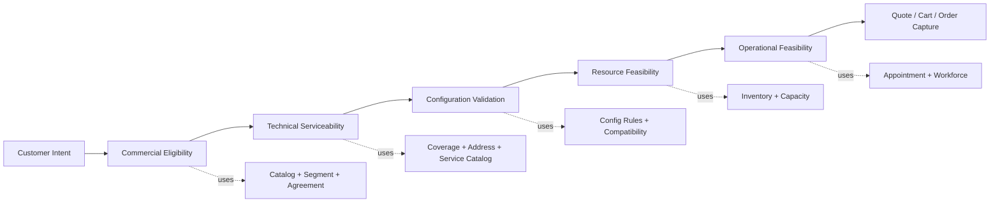
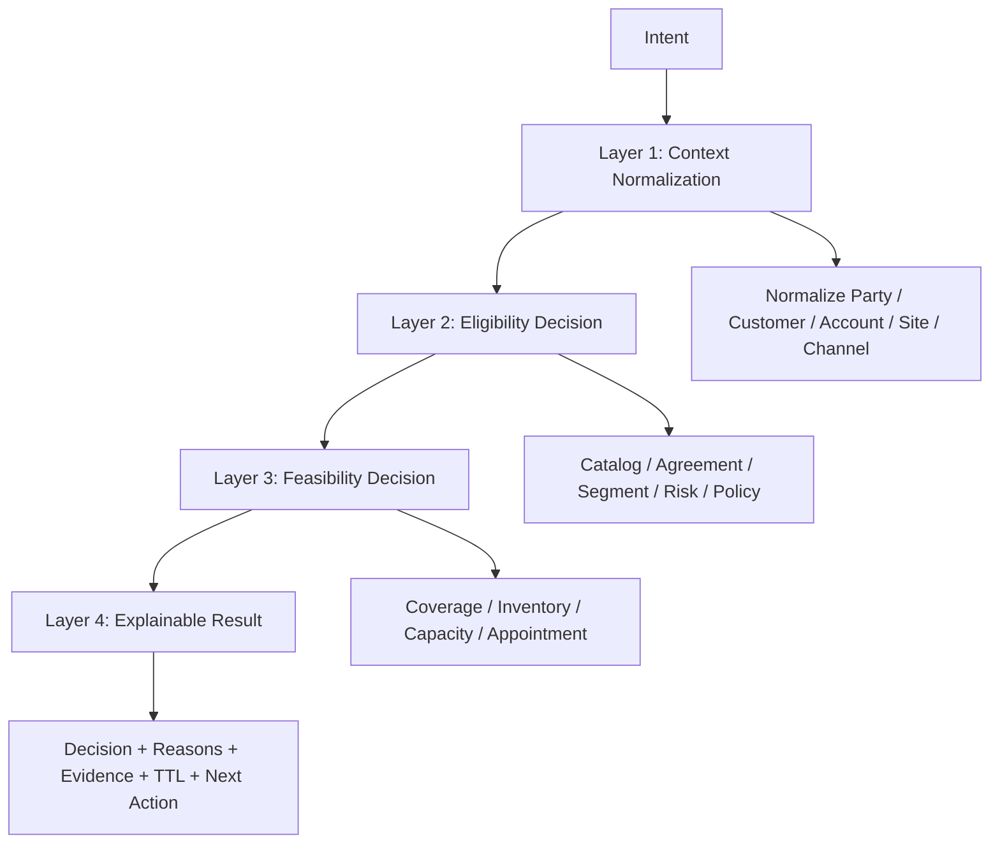
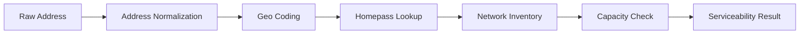
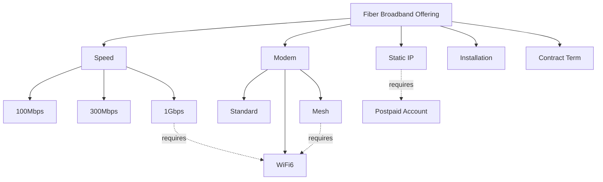
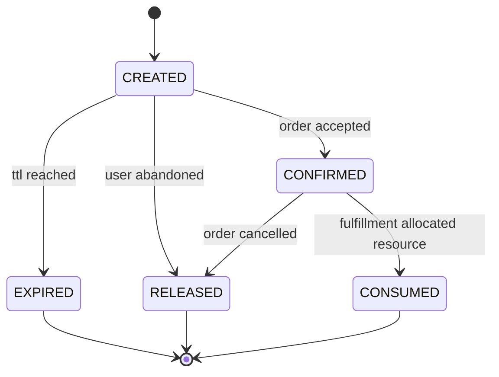
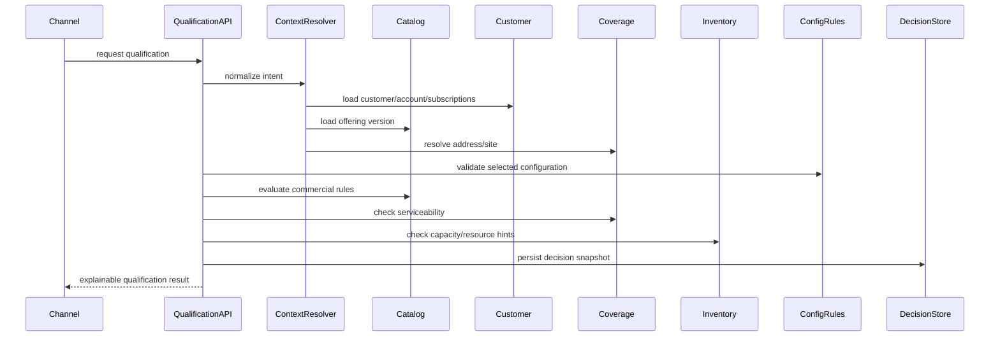
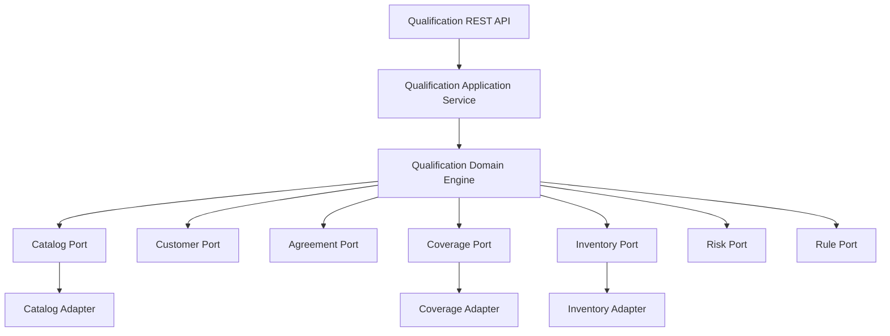

# Part 009 — Qualification, Configuration & Feasibility

## 1. Tujuan Part Ini

Part ini membahas fase yang sering terlihat sederhana di UI, tetapi sangat menentukan kualitas seluruh lifecycle BSS/OSS: **qualification, configuration, dan feasibility**.

Dalam sistem telco, pertanyaan seperti ini tidak boleh dijawab dengan hard-coded rule sederhana:

```text
Apakah customer ini boleh membeli paket ini?
Apakah lokasi ini bisa dipasang fiber?
Apakah alamat ini berada dalam coverage 5G?
Apakah nomor ini bisa di-port-in?
Apakah CPE ini kompatibel dengan teknologi akses yang dipilih?
Apakah enterprise site ini bisa mendapat SLA tertentu?
Apakah addon roaming ini valid untuk subscription customer?
Apakah promo ini berlaku untuk channel, segment, dan agreement ini?
```

Pertanyaan tersebut tampak seperti validasi, tetapi sebenarnya merupakan **decision system** yang menggabungkan data dari banyak sumber:

- product catalog;
- customer profile;
- account status;
- agreement;
- geography dan address master;
- coverage map;
- network inventory;
- resource capacity;
- device capability;
- SIM/eSIM capability;
- service catalog;
- campaign/promotion;
- credit/fraud/risk;
- partner/reseller entitlement;
- regulatory constraint;
- operational appointment capacity.

Jika qualification buruk, masalah downstream hampir pasti terjadi:

```text
sales menjual produk yang tidak bisa dipasang
order masuk tetapi gagal provisioning
teknisi datang ke lokasi yang salah
customer eligible secara komersial tetapi tidak feasible secara network
customer technically feasible tetapi tidak boleh membeli karena agreement/channel rule
harga quote berubah setelah order submit
resource di-reserve terlalu awal dan menjadi stale
promo diterapkan ke customer yang tidak valid
manual fallout meningkat
revenue leakage dan customer complaint meningkat
```

Part ini membangun mental model bahwa qualification adalah **pre-order decision control plane**.

---

## 2. Kaufman Skill Target

Target praktis part ini:

1. membedakan **commercial eligibility**, **technical serviceability**, **configuration validity**, dan **operational feasibility**;
2. memahami kapan memakai Product Offering Qualification, Service Qualification, Product Configuration, Quote, dan Order;
3. mendesain decision pipeline yang explainable, auditable, dan deterministic;
4. membuat model Java untuk qualification request/result yang tidak berubah menjadi boolean sederhana;
5. memahami caching, TTL, stale decision, reservation, dan revalidation;
6. menghindari anti-pattern seperti qualification yang diam-diam melakukan order, reserve resource permanen, atau pricing final tanpa quote.

Part ini bukan membahas Java syntax, REST dasar, atau validation framework dasar karena itu sudah tercakup di seri sebelumnya. Fokusnya adalah **domain judgment**.

---

## 3. Mental Model: Qualification Bukan Satu Pertanyaan

Banyak engineer membuat endpoint seperti ini:

```http
POST /eligibility/check
```

Lalu response-nya:

```json
{
  "eligible": true
}
```

Untuk sistem kecil ini terlihat cukup. Untuk telco BSS/OSS, ini terlalu miskin.

Qualification harus menjawab minimal lima jenis pertanyaan:

| Pertanyaan | Arti | Contoh |
|---|---|---|
| Commercial eligibility | Apakah customer boleh membeli offer? | Segment enterprise boleh membeli private APN. |
| Technical serviceability | Apakah service bisa disediakan di lokasi/konteks ini? | Fiber tersedia di alamat X. |
| Configuration validity | Apakah kombinasi pilihan valid? | Paket 1 Gbps butuh ONT tipe tertentu. |
| Resource feasibility | Apakah resource/capacity tersedia? | Port OLT tersedia, MSISDN range tersedia. |
| Operational feasibility | Apakah operasi bisa dilakukan? | Slot teknisi tersedia minggu ini. |

Kesalahan paling umum adalah menyebut semuanya “eligibility”. Padahal masing-masing punya sumber data, lifecycle, dan tingkat kepastian berbeda.



### Rule of Thumb

Qualification answers:

```text
Can this intent proceed safely to quote/order capture under known constraints?
```

It must not secretly mean:

```text
Create subscription now.
Reserve everything forever.
Guarantee final price forever.
Bypass order validation.
```

---

## 4. TM Forum Positioning

Dalam TM Forum Open API landscape, beberapa API terkait pre-ordering sering muncul:

| Area | API Umum | Peran |
|---|---|---|
| Product offering qualification | TMF679 | Menentukan apakah product offering commercially/ordering-wise qualified untuk customer/context. |
| Service qualification | TMF645 | Menentukan availability/technical eligibility service, sering terkait lokasi/customer site. |
| Product configuration | TMF760 | Membantu konfigurasi produk/offering yang valid. |
| Quote | TMF648 | Menghasilkan quote dengan parameter customer quote, pricing, validity, dan commercial commitment tertentu. |
| Product ordering | TMF622 | Menempatkan product order berdasarkan product offering/catalog. |
| Product catalog | TMF620 | Sumber product specification/offering/price/rule metadata. |

Mental model yang efektif:

```text
Catalog defines what may exist.
Qualification decides whether it may be offered now.
Configuration decides whether selected options are coherent.
Quote binds commercial terms for a validity window.
Order requests execution of the accepted intent.
```

Tidak semua organisasi mengimplementasikan semua API secara formal. Namun boundary semantiknya tetap berguna bahkan jika API internal berbeda.

---

## 5. Four-Layer Qualification Model

Untuk Java architect, model paling stabil adalah memisahkan qualification menjadi empat layer.



### Layer 1 — Context Normalization

Input dari channel biasanya messy:

```json
{
  "customerId": "C123",
  "address": "Jl. Sudirman No 10, Jakarta",
  "offerCode": "FIBER_1G_PROMO",
  "channel": "partner-web",
  "deviceImei": "..."
}
```

Sistem qualification tidak boleh langsung memakai string mentah. Ia perlu resolve:

- customer identity;
- active account;
- party role;
- segment;
- agreement;
- normalized address/site ID;
- geographic coordinate;
- channel and partner context;
- existing subscriptions;
- device capability;
- requested product offering version.

Output layer ini adalah canonical decision context:

```java
public record QualificationContext(
    CustomerRef customer,
    AccountRef account,
    PartyRoleRef partyRole,
    ChannelRef channel,
    ProductOfferingRef offering,
    ServiceAddressRef serviceAddress,
    List<ExistingProductRef> existingProducts,
    Optional<DeviceProfile> deviceProfile,
    Instant evaluatedAt
) {}
```

### Layer 2 — Eligibility Decision

Layer ini menjawab apakah offer boleh dijual secara komersial.

Contoh rule:

- offer hanya untuk segment `ENTERPRISE`;
- offer hanya untuk channel `DIRECT_SALES`;
- promo hanya berlaku untuk new acquisition;
- customer dengan overdue invoice tidak boleh upgrade;
- agreement customer memberikan custom discount;
- partner hanya boleh menjual offer tertentu;
- customer existing tidak boleh mengambil welcome package;
- regulatory rule melarang bundling tertentu.

Hasilnya tidak boleh boolean saja.

```java
public enum DecisionStatus {
    QUALIFIED,
    NOT_QUALIFIED,
    CONDITIONALLY_QUALIFIED,
    UNKNOWN
}

public record DecisionReason(
    String code,
    String message,
    ReasonSeverity severity,
    Map<String, String> evidence
) {}

public record EligibilityDecision(
    DecisionStatus status,
    List<DecisionReason> reasons,
    Instant validUntil
) {}
```

### Layer 3 — Feasibility Decision

Layer ini menjawab apakah service bisa diwujudkan secara teknis/operasional.

Contoh rule:

- address berada di coverage fiber;
- building sudah connected atau belum;
- port OLT tersedia;
- CPE support speed/profile yang dipilih;
- SIM/eSIM profile tersedia;
- MSISDN range tersedia;
- enterprise site membutuhkan survey;
- SLA gold membutuhkan redundant path;
- installation membutuhkan appointment slot.

Feasibility sering memiliki tingkat kepastian lebih rendah daripada eligibility karena bergantung pada inventory dan field condition.

```java
public enum FeasibilityConfidence {
    HIGH,
    MEDIUM,
    LOW
}

public record FeasibilityDecision(
    DecisionStatus status,
    FeasibilityConfidence confidence,
    List<DecisionReason> reasons,
    Optional<SurveyRequirement> surveyRequirement,
    Instant validUntil
) {}
```

### Layer 4 — Explainable Result

Qualification result harus bisa menjelaskan:

- keputusan akhir;
- alasan bisnis/teknis;
- data source yang dipakai;
- kapan keputusan expire;
- apakah butuh revalidation saat quote/order;
- next action.

```java
public record QualificationResult(
    String qualificationId,
    DecisionStatus status,
    EligibilityDecision eligibility,
    FeasibilityDecision feasibility,
    List<ConfigurationIssue> configurationIssues,
    List<RecommendedAction> nextActions,
    Instant evaluatedAt,
    Instant validUntil,
    String decisionFingerprint
) {}
```

`decisionFingerprint` berguna untuk mendeteksi apakah input/context berubah antara qualification dan order.

---

## 6. Qualification vs Validation vs Authorization

Jangan campur tiga konsep ini.

| Konsep | Menjawab | Contoh |
|---|---|---|
| Validation | Apakah input structurally valid? | `offerId` wajib ada. |
| Authorization | Apakah actor boleh melakukan action? | Sales agent boleh membuat qualification untuk customer ini. |
| Qualification | Apakah intent layak secara bisnis/teknis? | Customer ini boleh membeli offer ini di alamat ini. |

Anti-pattern:

```java
if (!user.hasRole("SALES")) {
    return notQualified();
}
```

Authorization failure harus menjadi security/access response, bukan qualification result.

Better:

```java
authorizationService.assertCanQualify(actor, customer);
QualificationResult result = qualificationService.qualify(intent);
```

---

## 7. Commercial Eligibility Deep Dive

Commercial eligibility bergantung pada **who**, **what**, **where**, **when**, dan **through whom**.

```text
Who      = customer / party / segment / account status
What     = product offering / offer version / bundle
Where    = market / geography / regulatory area
When     = campaign period / catalog version / contract date
Channel  = direct / partner / retail / app / call center
```

### 7.1 Segment Rule

Contoh:

```text
Offer: Dedicated Internet Access 1Gbps
Allowed segment: ENTERPRISE only
```

Rule buruk:

```java
if (customer.getType().equals("business")) eligible = true;
```

Rule baik:

```java
boolean eligible = segmentPolicy.isAllowed(
    Segment.ENTERPRISE,
    offering.allowedSegments(),
    context.evaluatedAt()
);
```

Mengapa?

Karena segment bisa berubah, punya effective date, dan bisa berbeda antara party, customer, account, dan agreement.

### 7.2 Channel Rule

Offer tertentu mungkin hanya boleh dijual lewat:

- direct sales;
- self-care app;
- call center;
- dealer;
- partner marketplace;
- enterprise account manager.

Channel rule penting untuk fraud, commission, promotion, dan compliance.

```java
public record ChannelEligibilityRule(
    Set<String> allowedChannelIds,
    Optional<PartnerTier> minimumPartnerTier,
    Instant effectiveFrom,
    Optional<Instant> effectiveTo
) {}
```

### 7.3 Existing Product Rule

Telco sering punya rule:

- addon hanya valid jika subscription utama aktif;
- upgrade hanya dari tier tertentu;
- downgrade tidak boleh jika contract lock-in aktif;
- promo hanya untuk acquisition baru;
- bundle tidak boleh memiliki dua primary broadband service;
- family plan butuh minimum/maximum member.

Representasikan existing product sebagai stateful product inventory, bukan hanya list SKU.

```java
public record ExistingProductRef(
    String productId,
    String productOfferingId,
    ProductStatus status,
    Instant activationDate,
    Optional<Instant> commitmentEndDate
) {}
```

### 7.4 Account Risk Rule

Qualification dapat bergantung pada:

- overdue amount;
- dunning status;
- credit limit;
- fraud flag;
- blacklist/graylist;
- KYC status;
- identity verification level.

Jangan menaruh rule risk di catalog. Catalog mendefinisikan offer; risk engine menentukan customer-specific restriction.

---

## 8. Technical Serviceability Deep Dive

Technical serviceability menjawab apakah service bisa disediakan secara teknis.

### 8.1 Fixed Broadband Example

Untuk fiber broadband, serviceability bisa melibatkan:

- normalized address;
- geocode;
- building/homepass;
- fiber distribution point;
- OLT/ODF/ODP capacity;
- distance constraint;
- area restriction;
- civil work status;
- installation type;
- CPE compatibility.



A good result should distinguish:

```text
AVAILABLE
NOT_AVAILABLE
AVAILABLE_WITH_SURVEY
AVAILABLE_WITH_BUILD
UNKNOWN_ADDRESS
CAPACITY_EXHAUSTED
TEMPORARILY_BLOCKED
```

### 8.2 Mobile Example

Untuk mobile package, serviceability bisa melibatkan:

- SIM/eSIM capability;
- device band support;
- VoLTE/VoWiFi support;
- 4G/5G coverage;
- roaming zone;
- subscription technology profile;
- network policy entitlement.

Contoh:

```text
Offer: 5G Ultra Addon
Customer: active prepaid customer
Device: 4G-only phone
Coverage: 5G available at home location
Result: conditionally qualified or not qualified due to device capability
```

### 8.3 Enterprise Connectivity Example

Untuk enterprise WAN, feasibility bisa bergantung pada:

- site type;
- last-mile provider;
- fiber availability;
- SLA class;
- redundancy requirement;
- diversity path;
- lead time;
- survey outcome;
- partner provider feasibility.

Dalam enterprise, qualification sering bukan final answer, tetapi gateway menuju survey atau feasibility study.

---

## 9. Product Configuration

Qualification menjawab “boleh atau tidak”. Configuration menjawab “kombinasi pilihan ini valid atau tidak”.

Contoh product:

```text
Fiber Broadband
- speed: 100Mbps / 300Mbps / 1Gbps
- modem: standard / WiFi6 / mesh
- static IP: yes/no
- installation type: standard / express
- contract term: 12 / 24 months
```

Configuration rule:

```text
1Gbps requires WiFi6 modem.
Static IP only for postpaid account.
Express installation only available in selected cities.
24-month contract gives discount but creates early termination fee.
Mesh addon cannot be ordered without modem.
```

### 9.1 Configuration Graph



### 9.2 Java Representation

Jangan mulai dengan generic map untuk semua hal.

Buruk:

```java
record ProductConfig(Map<String, Object> values) {}
```

Boleh sebagai transport layer, tetapi domain layer perlu typed interpretation:

```java
public record BroadbandConfiguration(
    SpeedTier speedTier,
    ModemOption modemOption,
    boolean staticIp,
    InstallationOption installationOption,
    ContractTerm contractTerm
) {
    public List<ConfigurationIssue> validate() {
        List<ConfigurationIssue> issues = new ArrayList<>();

        if (speedTier == SpeedTier.ONE_GBPS && !modemOption.supportsWifi6()) {
            issues.add(ConfigurationIssue.error(
                "SPEED_REQUIRES_WIFI6_MODEM",
                "1Gbps package requires WiFi6 modem"
            ));
        }

        if (modemOption == ModemOption.MESH && !modemOption.includesBaseRouter()) {
            issues.add(ConfigurationIssue.error(
                "MESH_REQUIRES_BASE_ROUTER",
                "Mesh option requires compatible base router"
            ));
        }

        return issues;
    }
}
```

Typed models prevent rule ambiguity and improve testability. Generic attributes can remain at API boundary or extension layer.

---

## 10. Decision Result Design

A qualification result needs more than pass/fail.

Recommended structure:

```json
{
  "qualificationId": "POQ-20260629-000001",
  "status": "CONDITIONALLY_QUALIFIED",
  "validUntil": "2026-06-29T10:15:00Z",
  "items": [
    {
      "offeringId": "FIBER_1G",
      "status": "CONDITIONALLY_QUALIFIED",
      "reasons": [
        {
          "code": "SURVEY_REQUIRED",
          "severity": "INFO",
          "message": "Building requires site survey before final confirmation"
        }
      ],
      "nextActions": [
        "CREATE_QUOTE",
        "REQUEST_SURVEY"
      ]
    }
  ]
}
```

### 10.1 Decision Status

Use explicit states:

| Status | Meaning |
|---|---|
| `QUALIFIED` | Intent can proceed under current assumptions. |
| `NOT_QUALIFIED` | Intent should not proceed. |
| `CONDITIONALLY_QUALIFIED` | Intent can proceed only with condition or next action. |
| `UNKNOWN` | System cannot decide due to insufficient/unreliable data. |

Avoid status like `FAILED` unless it means technical failure. A customer can be `NOT_QUALIFIED` even when the qualification service worked perfectly.

### 10.2 Reason Codes

Reason codes must be stable and machine-readable.

Good:

```text
CUSTOMER_SEGMENT_NOT_ALLOWED
ADDRESS_NOT_SERVICEABLE
DEVICE_NOT_5G_CAPABLE
OFFER_EXPIRED
ACCOUNT_IN_DUNNING
SURVEY_REQUIRED
CAPACITY_TEMPORARILY_UNAVAILABLE
```

Bad:

```text
Not eligible.
Invalid.
Cannot proceed.
Error.
```

### 10.3 Evidence

Evidence makes decisions auditable.

```json
{
  "code": "ADDRESS_NOT_SERVICEABLE",
  "evidence": {
    "addressId": "ADDR-991",
    "coverageVersion": "COV-2026-06-01",
    "technology": "FTTH",
    "source": "coverage-service"
  }
}
```

Evidence should not expose sensitive internals to external channels. Use internal result and external projection separately.

---

## 11. TTL, Staleness, and Revalidation

Qualification is time-sensitive.

Examples:

- coverage data may update daily;
- capacity can change every minute;
- promo validity can expire;
- credit status can change;
- appointment slot can disappear;
- catalog offering version can be retired.

Every result needs validity semantics.

```java
public record ValidityWindow(
    Instant evaluatedAt,
    Instant validUntil,
    RevalidationPolicy revalidationPolicy
) {}

public enum RevalidationPolicy {
    REVALIDATE_AT_QUOTE,
    REVALIDATE_AT_ORDER_SUBMIT,
    REVALIDATE_BEFORE_FULFILLMENT,
    NO_REVALIDATION_REQUIRED
}
```

### Common TTL Strategy

| Data | Typical Volatility | Suggested Handling |
|---|---|---|
| Catalog rule | Low/medium | Versioned, cached, effective-dated. |
| Promotion | Medium | Effective-dated, revalidate at quote. |
| Customer risk | Medium/high | Revalidate at order submit. |
| Coverage | Medium | Cache with version, revalidate for install. |
| Inventory capacity | High | Short TTL or soft reservation. |
| Appointment slot | High | Reserve separately through appointment service. |

Do not treat all qualification decisions as equally durable.

---

## 12. Reservation: Soft, Hard, or None?

Qualification often touches scarce resources. Be very careful.

| Approach | Meaning | Risk |
|---|---|---|
| No reservation | Only checks availability. | Availability may disappear later. |
| Soft reservation | Temporarily holds resource for short TTL. | Requires expiry/release logic. |
| Hard reservation | Commits resource allocation. | Can leak resources if order never completes. |

For pre-order qualification, prefer **no reservation** or **short soft reservation**. Hard reservation usually belongs later in fulfillment/order orchestration.

### Soft Reservation Model

```java
public record SoftReservation(
    String reservationId,
    ResourceType resourceType,
    String resourceHint,
    Instant expiresAt,
    ReservationStatus status
) {}
```

Failure handling:

- reservation expires automatically;
- quote/order must reference reservation if used;
- order submit must revalidate reservation;
- cancellation must release reservation;
- reconciliation must release orphan reservation.



---

## 13. Address and Site Normalization

For fixed services, address quality is a primary source of failure.

### 13.1 Raw Address Is Not Enough

Raw address:

```text
Jl. Sudirman 10, Jakarta
```

can map to:

- different towers;
- different floors;
- different units;
- business park vs residential block;
- old street name;
- duplicate postal code;
- incomplete service entrance.

Use canonical service address/site identity.

```java
public record ServiceAddressRef(
    String addressId,
    String formattedAddress,
    Optional<GeoPoint> geoPoint,
    Optional<String> buildingId,
    Optional<String> floor,
    Optional<String> unit,
    AddressConfidence confidence
) {}
```

### 13.2 Address Confidence

Qualification should differentiate:

```text
EXACT_MATCH
BUILDING_MATCH
STREET_MATCH
LOW_CONFIDENCE_MATCH
NO_MATCH
```

A low-confidence address may lead to `CONDITIONALLY_QUALIFIED` with `ADDRESS_CONFIRMATION_REQUIRED`.

---

## 14. Device, SIM, and Access Compatibility

For mobile and converged services, device/SIM compatibility matters.

Examples:

| Context | Compatibility Check |
|---|---|
| 5G addon | Device supports 5G band, SIM/profile supports 5G, customer profile has 5G enabled. |
| VoLTE | Device model whitelisted, IMS profile available, SIM supports service. |
| eSIM | Device EID/profile support, eSIM platform availability. |
| Roaming bundle | Destination zone, subscription type, regulatory restriction. |
| Fixed wireless access | CPE capability, signal quality, cell capacity. |

A robust result explains whether the problem is customer, device, SIM, network, or commercial rule.

```java
public enum CompatibilityDomain {
    DEVICE,
    SIM,
    NETWORK,
    SUBSCRIPTION_PROFILE,
    OFFER_CONFIGURATION
}
```

---

## 15. Qualification Pipeline Design

A production-grade qualification service should be composed as a pipeline.



Persisting decision snapshot is important for audit and debugging. It does not mean the decision is forever valid.

---

## 16. Java Component Boundary

Do not put qualification logic in the channel service.

Recommended component boundary:

```text
sales-channel-api
    -> qualification-component
        -> catalog-query
        -> customer-profile-query
        -> agreement-query
        -> coverage-query
        -> inventory-query
        -> risk-query
        -> configuration-rule-engine
```

### 16.1 Hexagonal View



Domain engine should not know HTTP clients, database tables, vendor schemas, or TMF payload classes.

---

## 17. Rule Engine or Code?

Qualification often tempts teams to introduce a rule engine. This is not automatically wrong, but it must be governed.

| Approach | Good For | Risk |
|---|---|---|
| Code rules | Critical invariants, type safety, tests. | Business wants faster change. |
| Config rules | Simple eligibility/compatibility matrix. | Can become unreadable. |
| Rule engine | High-volume business policy changes. | Debugging, versioning, blast radius. |
| Decision table | Eligibility matrices. | Poor fit for graph constraints. |

A good compromise:

```text
Hard invariants in code.
Catalog-driven options in data.
Business eligibility in versioned decision tables.
High-risk policy changes behind simulation/testing gates.
```

### 17.1 Rule Governance

Every rule needs:

- owner;
- effective date;
- expiry date;
- version;
- test cases;
- simulation result;
- rollback strategy;
- reason code mapping.

Without this, rule engine becomes production chaos.

---

## 18. Idempotency and Correlation

Qualification may be called many times:

- UI refresh;
- cart update;
- partner retry;
- call center repeat check;
- quote generation;
- order revalidation.

The API should support idempotency/correlation.

```java
public record QualificationRequest(
    String requestId,
    String correlationId,
    CustomerIntent intent,
    ChannelContext channel,
    Optional<String> previousQualificationId
) {}
```

`requestId` prevents duplicate processing. `correlationId` connects UI/cart/quote/order journey. `previousQualificationId` supports requalification.

---

## 19. Persistence Strategy

Persist qualification result when:

- decision may be used by quote/order;
- audit is required;
- customer support needs explanation;
- dispute/fallout analysis is needed;
- external partner needs stable reference.

Do not persist every keystroke in a configurator unless needed. Use event sampling or short-lived cache for interactive configuration.

Recommended storage split:

| Store | Content |
|---|---|
| Decision store | Qualification request/result, reason codes, validity, fingerprint. |
| Evidence snapshot | Redacted evidence needed for audit/debug. |
| Metrics store | Decision counts, latency, rule hit rate. |
| Cache | Catalog/coverage data with version/TTL. |

---

## 20. Observability Signals

Qualification problems are often invisible until order fallout increases. Track them early.

Metrics:

```text
qualification_requests_total
qualification_decision_total{status, reason_code, offering, channel}
qualification_latency_seconds{dependency}
qualification_dependency_timeout_total{dependency}
qualification_unknown_decision_total
qualification_revalidation_mismatch_total
qualification_to_order_conversion_ratio
qualification_order_fallout_ratio
```

Logs should include:

- qualification ID;
- correlation ID;
- customer/account references with privacy controls;
- offering ID/version;
- decision status;
- reason codes;
- dependency health;
- decision fingerprint.

Trace dependencies carefully because qualification is a fan-out workflow.

---

## 21. Failure Modeling

### 21.1 Dependency Timeout

If coverage service times out, should result be `NOT_QUALIFIED`?

Usually no. It should be `UNKNOWN` or `CONDITIONALLY_QUALIFIED` depending business risk.

```java
catch (CoverageTimeoutException ex) {
    return FeasibilityDecision.unknown(
        reason("COVERAGE_SERVICE_TIMEOUT", "Coverage could not be confirmed")
    );
}
```

### 21.2 Conflicting Data

Example:

```text
Coverage says address is serviceable.
Inventory says no available port.
```

Result should not hide conflict.

```text
CONDITIONALLY_QUALIFIED
Reason: CAPACITY_CONFIRMATION_REQUIRED
Next action: manual feasibility check or survey
```

### 21.3 Stale Qualification at Order Submit

Example:

```text
Customer was qualified yesterday.
Today offer expired.
```

Order submit must revalidate critical rules. If mismatch occurs:

```text
Reject order with specific reason or route to renegotiation/quote refresh.
```

---

## 22. Anti-Patterns

### 22.1 Boolean Eligibility

```json
{ "eligible": true }
```

This is not enough. It loses reason, validity, evidence, and next action.

### 22.2 Qualification Creates Product

Qualification must not create subscription/product inventory. That belongs to order fulfillment after acceptance.

### 22.3 Qualification Performs Permanent Resource Allocation

This leaks scarce resources when customers abandon cart.

### 22.4 Catalog Rules Hidden in UI

If UI decides eligibility, every channel becomes inconsistent.

### 22.5 Technical Feasibility Ignored Until Activation

This creates late fallout and customer dissatisfaction.

### 22.6 One Endpoint for All Decisions Without Semantics

`/check` endpoint that returns mixed eligibility, pricing, availability, and authorization creates long-term ambiguity.

---

## 23. Implementation Skeleton

```java
public final class QualificationApplicationService {

    private final QualificationContextResolver contextResolver;
    private final CommercialEligibilityEngine eligibilityEngine;
    private final ConfigurationEngine configurationEngine;
    private final TechnicalFeasibilityEngine feasibilityEngine;
    private final QualificationDecisionRepository repository;

    public QualificationResult qualify(QualificationRequest request) {
        QualificationContext context = contextResolver.resolve(request);

        List<ConfigurationIssue> configIssues = configurationEngine.validate(context, request.intent());

        EligibilityDecision eligibility = eligibilityEngine.evaluate(context);

        FeasibilityDecision feasibility = feasibilityEngine.evaluate(context, request.intent());

        DecisionStatus finalStatus = DecisionAggregator.aggregate(
            eligibility.status(),
            feasibility.status(),
            configIssues
        );

        QualificationResult result = QualificationResultFactory.create(
            request,
            context,
            finalStatus,
            eligibility,
            feasibility,
            configIssues
        );

        repository.save(result);
        return result;
    }
}
```

Aggregator rule example:

```java
public final class DecisionAggregator {

    public static DecisionStatus aggregate(
        DecisionStatus eligibility,
        DecisionStatus feasibility,
        List<ConfigurationIssue> issues
    ) {
        if (issues.stream().anyMatch(ConfigurationIssue::isBlocking)) {
            return DecisionStatus.NOT_QUALIFIED;
        }
        if (eligibility == DecisionStatus.NOT_QUALIFIED || feasibility == DecisionStatus.NOT_QUALIFIED) {
            return DecisionStatus.NOT_QUALIFIED;
        }
        if (eligibility == DecisionStatus.UNKNOWN || feasibility == DecisionStatus.UNKNOWN) {
            return DecisionStatus.UNKNOWN;
        }
        if (eligibility == DecisionStatus.CONDITIONALLY_QUALIFIED
            || feasibility == DecisionStatus.CONDITIONALLY_QUALIFIED) {
            return DecisionStatus.CONDITIONALLY_QUALIFIED;
        }
        return DecisionStatus.QUALIFIED;
    }
}
```

---

## 24. Testing Strategy

Test by decision class, not only by endpoint.

### 24.1 Unit Tests

```text
Given enterprise-only offer
When residential customer qualifies
Then result is NOT_QUALIFIED with CUSTOMER_SEGMENT_NOT_ALLOWED
```

### 24.2 Contract Tests

Check integration with:

- catalog;
- customer profile;
- coverage;
- inventory;
- risk;
- appointment.

### 24.3 Scenario Tests

Use end-to-end decision matrix:

| Scenario | Expected Result |
|---|---|
| New customer, fiber coverage available, capacity available | QUALIFIED |
| Existing customer in dunning | NOT_QUALIFIED |
| Address low confidence | CONDITIONALLY_QUALIFIED |
| Coverage timeout | UNKNOWN |
| Offer expired | NOT_QUALIFIED |
| 1Gbps selected with incompatible modem | NOT_QUALIFIED |

### 24.4 Regression Tests for Rules

Every eligibility rule must have sample cases. Before publishing catalog/rule changes, simulate impact:

```text
How many active channels/offers/customers would become ineligible?
How many carts/quotes would be invalidated?
Which partners are affected?
```

---

## 25. Deliberate Practice

### Exercise 1 — Build a Qualification Matrix

Design qualification for:

```text
Fiber 1Gbps + Static IP + WiFi6 Modem + 24-month contract
```

Include:

- customer segment;
- account status;
- address confidence;
- coverage;
- capacity;
- modem compatibility;
- contract lock-in;
- reason codes.

### Exercise 2 — Design Result Contract

Create a JSON response that can represent:

```text
Customer is commercially eligible, but address requires survey and 1Gbps requires WiFi6 modem.
```

Do not use one boolean.

### Exercise 3 — Revalidation Scenario

Model what happens when:

```text
Qualification says available at 10:00.
Quote is created at 10:05.
Order submitted at 15:00.
Capacity disappears at 14:00.
```

Define status, reason, and recovery path.

### Exercise 4 — Anti-Corruption Layer

Assume vendor coverage system returns:

```json
{
  "resultCode": "A12",
  "message": "Passed with warning",
  "zone": "F-778",
  "cap": "Y",
  "survey": "M"
}
```

Map it to internal domain:

```text
status
confidence
reason codes
next action
validity
```

---

## 26. Top 1% Engineer Checklist

Kamu mulai berpikir seperti engineer top-tier jika bisa menjawab:

- Apa bedanya commercial eligibility dan technical serviceability?
- Apakah qualification result explainable dan auditable?
- Apa validity window dari setiap decision?
- Rule mana yang boleh cached, rule mana yang harus real-time?
- Apakah qualification melakukan reservation? Jika ya, kapan expire?
- Apakah order submit melakukan revalidation?
- Apakah UI/channel hanya consumer keputusan, bukan pemilik rule?
- Apakah reason code stabil dan bisa dipakai untuk analytics?
- Apakah unknown dibedakan dari not qualified?
- Apakah dependency timeout menyebabkan keputusan yang aman?
- Apakah model mendukung B2C, B2B, partner, dan enterprise site?
- Apakah decision snapshot cukup untuk audit tanpa membocorkan sensitive data?

---

## 27. Ringkasan

Qualification, configuration, dan feasibility adalah **pre-order decision layer**.

Prinsip utamanya:

```text
Do not sell what cannot be fulfilled.
Do not block what only needs condition or survey.
Do not hide uncertainty as rejection.
Do not bind commercial terms without quote semantics.
Do not allocate scarce resources permanently during qualification.
```

Model yang baik memisahkan:

- validation;
- authorization;
- commercial eligibility;
- technical serviceability;
- configuration validity;
- resource feasibility;
- operational feasibility;
- quote/order commitment.

Dengan model ini, sistem BSS/OSS menjadi lebih defensible, explainable, dan resilient terhadap perubahan catalog, customer, coverage, inventory, dan partner channel.

---

## 28. Referensi

- TM Forum, **TMF679 Product Offering Qualification API** — Product Offering Qualification API adalah bagian dari Pre-Ordering Management API Family dan bertujuan menyediakan product offering commercial eligibility / ordering qualification.
- TM Forum, **TMF645 Service Qualification API** — Service Qualification API adalah bagian dari Pre-Ordering Management API Family dan bertujuan menyediakan service availability / technical eligibility pada customer location.
- TM Forum, **TMF648 Quote Management API** — Quote API menyediakan mekanisme standar untuk customer quote dengan parameter quote yang diperlukan.
- TM Forum, **TMF622 Product Ordering Management API** — Product Ordering API menyediakan mekanisme standar untuk placing product order berdasarkan product offer/catalog.
- TM Forum, **TMF620 Product Catalog Management API** — Product Catalog Management API mengelola lifecycle catalog elements untuk ordering, campaign, dan sales management.
