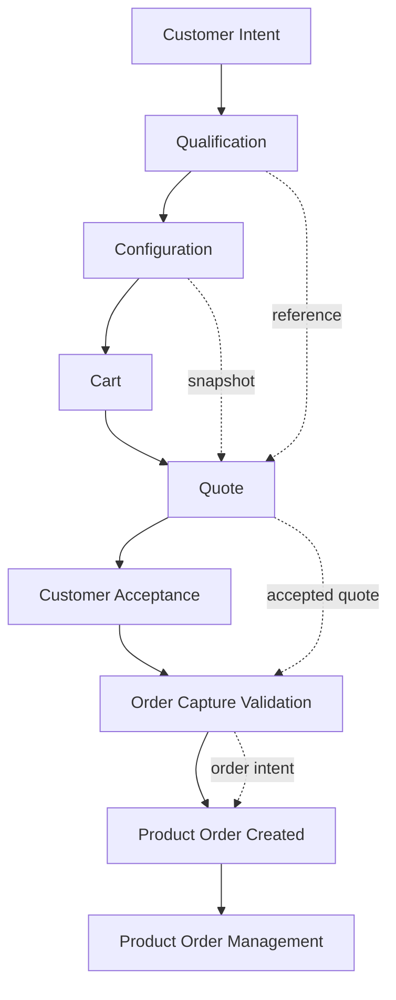
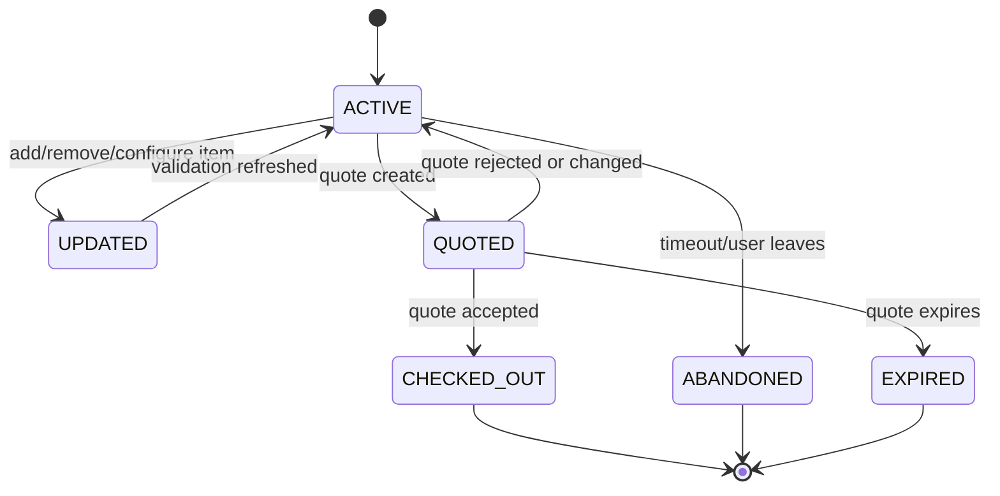
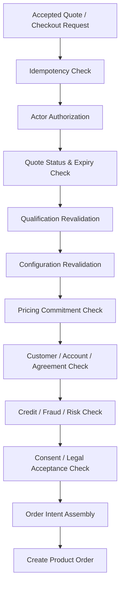
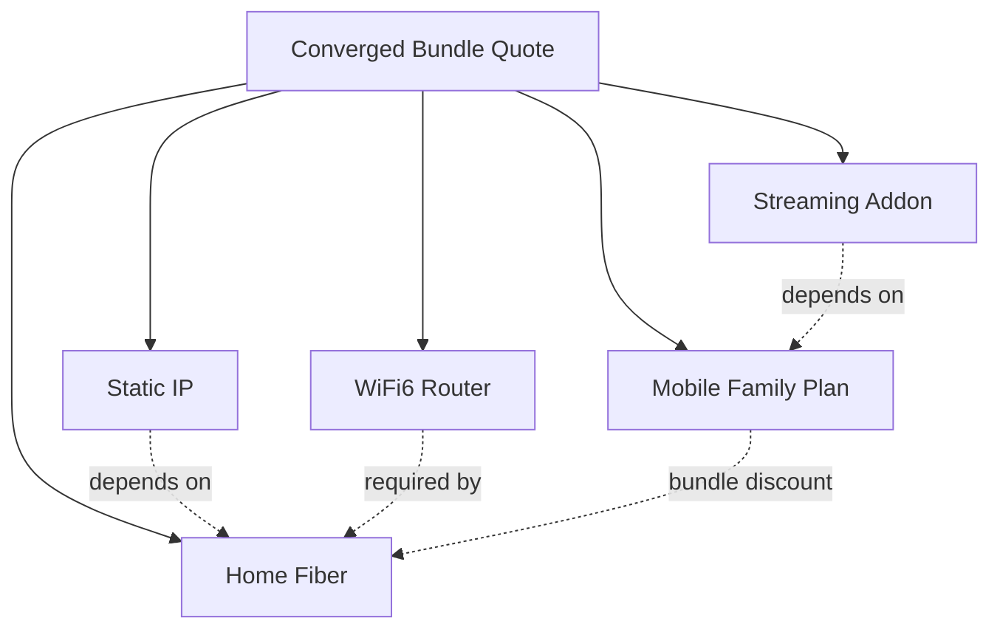
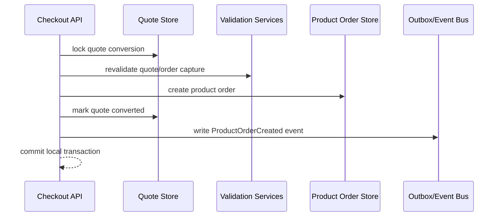

# Part 010 — Quote-to-Order Capture

## 1. Tujuan Part Ini

Part ini membahas fase **quote-to-order capture**: jembatan antara customer intent yang sudah qualified/configured dengan product order yang akan dieksekusi.

Di banyak organisasi, fase ini diremehkan sebagai “form checkout”. Dalam telco, ini salah satu boundary paling penting karena ia menentukan apakah sebuah intent cukup matang untuk menjadi order yang dapat dipertanggungjawabkan.

Quote-to-order capture harus menjawab:

```text
Apa yang diminta customer?
Harga apa yang dijanjikan?
Berapa lama janji harga berlaku?
Qualification mana yang dipakai?
Agreement mana yang mengikat?
Channel mana yang menjual?
Siapa actor yang submit?
Apakah customer/account/risk masih valid?
Apakah configuration masih valid?
Apakah consent dan legal acceptance lengkap?
Apakah order intent siap didekomposisi?
```

Jika boundary ini lemah, downstream akan kacau:

```text
order dibuat dari cart yang stale
harga berubah setelah customer setuju
qualification tidak bisa dilacak
sales menjual bundle invalid
agreement discount hilang
credit/fraud check terlambat
order management menerima data tidak lengkap
fulfillment tidak tahu action add/modify/disconnect
billing tidak bisa membuat charge benar
customer dispute karena quote tidak sama dengan order
```

Part ini mengajarkan quote-to-order capture sebagai **commercial commitment boundary**.

---

## 2. Kaufman Skill Target

Target praktis part ini:

1. membedakan cart, quote, order intent, dan product order;
2. memahami kapan harga hanya estimasi dan kapan menjadi commercial commitment;
3. mendesain quote snapshot yang auditable;
4. membuat pipeline order capture yang memvalidasi ulang qualification, configuration, pricing, customer, credit/fraud, dan legal acceptance;
5. memahami idempotency, duplicate submit, abandoned cart, quote expiry, dan stale price;
6. mendesain Java boundary sebelum masuk ke Product Order Management.

Part ini sengaja belum membahas product order orchestration secara penuh. Itu masuk Part 011.

---

## 3. Mental Model: Cart, Quote, Order Intent, Product Order

Empat konsep ini sering dicampur.

| Konsep | Fungsi | Durability | Commitment |
|---|---|---|---|
| Cart | Workspace interaktif untuk memilih produk/options. | Short/medium-lived. | Belum mengikat. |
| Quote | Proposal komersial dengan harga, terms, validity. | Versioned/auditable. | Bisa mengikat selama validity. |
| Order Intent | Customer-approved request siap submit. | Transitional. | Mengikat secara request. |
| Product Order | Record resmi untuk fulfillment lifecycle. | Long-lived. | Mengikat operasional. |

Rule penting:

```text
Cart is editable.
Quote is explainable.
Order intent is confirmable.
Product order is executable.
```

Jangan langsung membuat product order dari UI selection tanpa quote/validation boundary, terutama untuk B2B/enterprise, bundle kompleks, pricing dinamis, atau partner channel.

---

## 4. End-to-End Flow



The boundary from quote to order is where the system says:

```text
This is no longer just a browsing/sales interaction.
This is now an executable business request.
```

---

## 5. TM Forum Positioning

Dalam TM Forum Open API landscape:

- **TMF663 Shopping Cart** dapat dipakai untuk customer shopping cart interactions;
- **TMF648 Quote** menyediakan mechanism untuk customer quote;
- **TMF622 Product Ordering** menyediakan mechanism untuk placing product order;
- **TMF679 Product Offering Qualification** dan **TMF645 Service Qualification** mendukung pre-order decision;
- **TMF620 Product Catalog** menjadi sumber product offering dan pricing metadata.

Mental model boundary:

```text
Shopping Cart = mutable selection state.
Quote = priced and qualified commercial proposal.
Product Order = submitted request for lifecycle execution.
```

Tidak semua implementation harus expose semua API ke luar. Namun semantic boundary ini sangat berguna untuk internal architecture.

---

## 6. Quote as Commercial Snapshot

Quote bukan sekadar `totalPrice`.

Quote harus menyimpan snapshot dari:

- customer/account/party context;
- product offering version;
- selected configuration;
- qualification reference;
- price components;
- discounts;
- taxes/fees if applicable;
- agreement terms;
- contract term;
- validity window;
- assumptions and conditions;
- approval status;
- channel/agent/partner;
- risk/credit result if used;
- legal text version or consent reference.

### 6.1 Quote Data Model

```java
public record Quote(
    QuoteId id,
    QuoteVersion version,
    QuoteStatus status,
    CustomerRef customer,
    AccountRef account,
    ChannelRef channel,
    List<QuoteItem> items,
    MoneySummary moneySummary,
    ValidityWindow validity,
    List<QualificationReference> qualificationReferences,
    List<QuoteCondition> conditions,
    List<ApprovalRecord> approvals,
    Instant createdAt,
    Instant updatedAt
) {}
```

Quote item:

```java
public record QuoteItem(
    String id,
    QuoteItemAction action,
    ProductOfferingRef offering,
    Optional<ProductRef> existingProduct,
    ProductConfigurationSnapshot configuration,
    List<PriceComponent> priceComponents,
    List<QuoteItemRelationship> relationships,
    List<QuoteCondition> conditions
) {}

public enum QuoteItemAction {
    ADD,
    MODIFY,
    DELETE,
    NO_CHANGE
}
```

Action matters because the same offering can mean different lifecycle operation:

```text
ADD broadband subscription
MODIFY speed from 100Mbps to 300Mbps
DELETE addon
NO_CHANGE existing base product in a bundle quote
```

---

## 7. Price Snapshot and Price Recalculation

Telco pricing can include:

- recurring charge;
- one-time charge;
- usage charge;
- installation fee;
- device installment;
- discount;
- promotion;
- tax;
- penalty;
- early termination fee;
- proration;
- deposit;
- partner-specific price;
- agreement-specific price.

A quote must distinguish between **calculated price** and **guaranteed price**.

```java
public record PriceComponent(
    String code,
    PriceType type,
    Money amount,
    ChargeFrequency frequency,
    Optional<String> discountId,
    Optional<String> taxCode,
    PriceCommitment commitment,
    String sourceReference
) {}

public enum PriceCommitment {
    ESTIMATED,
    GUARANTEED_UNTIL_QUOTE_EXPIRY,
    SUBJECT_TO_REVALIDATION
}
```

### 7.1 Common Pricing Failure

```text
Catalog price changes at 12:00.
Customer accepted quote created at 11:30.
Order submitted at 12:10.
```

What should happen?

If quote guaranteed price until 13:00, order should use quote price snapshot. If quote is only estimate, order must reprice and customer may need re-acceptance.

Never leave this implicit.

---

## 8. Quote Validity

Quote validity is not only a timestamp. It is a contract with revalidation semantics.

```java
public record QuoteValidity(
    Instant validFrom,
    Instant validUntil,
    Set<RevalidationTrigger> revalidationTriggers
) {}

public enum RevalidationTrigger {
    CUSTOMER_CONTEXT_CHANGED,
    ACCOUNT_STATUS_CHANGED,
    CATALOG_VERSION_RETIRED,
    QUALIFICATION_EXPIRED,
    PRICE_RULE_CHANGED,
    RESOURCE_RESERVATION_EXPIRED,
    AGREEMENT_CHANGED
}
```

Quote can expire because:

- time passed;
- offer retired;
- customer became ineligible;
- resource reservation expired;
- risk status changed;
- agreement changed;
- regulation changed;
- partner authorization changed.

---

## 9. Cart Design

Cart is useful when customer/channel needs interactive editing.

Cart can contain:

- selected offering;
- selected options;
- draft shipping/installation info;
- provisional qualification result;
- provisional pricing;
- warnings;
- unsatisfied dependencies;
- recommendation/upsell items.

Cart should not be the authoritative order record.

### 9.1 Cart Lifecycle



### 9.2 Cart Is Not Quote

Cart price can be provisional:

```text
Estimated monthly charge: Rp300.000
Final price subject to address/serviceability/credit check
```

Quote price is a named proposal:

```text
Quote Q-123 version 2, valid until 2026-06-30T10:00Z
```

---

## 10. Order Capture Validation Pipeline

Before creating product order, validate everything again.



Each stage should produce a precise failure reason.

Example:

```json
{
  "status": "REJECTED",
  "code": "QUOTE_EXPIRED",
  "message": "Quote Q-123 expired at 2026-06-29T10:00:00Z",
  "nextAction": "REFRESH_QUOTE"
}
```

---

## 11. Idempotency and Duplicate Submit

Checkout endpoints are duplicate-prone:

- user double-clicks;
- mobile app retries;
- partner gateway retries;
- network timeout after server created order;
- call center resubmits.

Use idempotency key.

```java
public record CheckoutCommand(
    String idempotencyKey,
    QuoteId quoteId,
    QuoteVersion acceptedVersion,
    ActorRef actor,
    AcceptanceEvidence acceptanceEvidence,
    Instant submittedAt
) {}
```

Idempotency behavior:

| Situation | Response |
|---|---|
| Same key, same payload, order already created | Return existing product order reference. |
| Same key, different payload | Reject with idempotency conflict. |
| New key, same quote already converted | Reject or return existing order depending policy. |
| Timeout after order creation | Retry returns same order. |

Implementation sketch:

```java
public ProductOrderRef checkout(CheckoutCommand command) {
    return idempotencyStore.executeOnce(
        command.idempotencyKey(),
        fingerprint(command),
        () -> createOrderFromAcceptedQuote(command)
    );
}
```

---

## 12. Acceptance Evidence

Customer acceptance matters legally and operationally.

Acceptance evidence can include:

- accepted quote ID/version;
- accepted terms and conditions version;
- timestamp;
- actor/customer identity;
- sales agent identity;
- channel;
- IP/device/session if applicable;
- OTP/signature reference;
- recording reference for call center;
- document reference for enterprise contract;
- consent flags.

```java
public record AcceptanceEvidence(
    String quoteId,
    int quoteVersion,
    String termsVersion,
    Instant acceptedAt,
    ActorRef acceptedBy,
    ChannelRef channel,
    Optional<String> signatureRef,
    Optional<String> otpVerificationRef,
    Optional<String> callRecordingRef
) {}
```

Do not create order if required acceptance evidence is missing.

---

## 13. Credit, Fraud, and Risk Hooks

Credit/fraud checks can happen at different stages:

| Stage | Purpose |
|---|---|
| Qualification | Early filter, avoid wasting sales effort. |
| Quote | Price/deposit/contract term adjustment. |
| Checkout | Final decision before order creation. |
| Fulfillment | Recheck before activation for high-risk cases. |

Do not hide risk status inside generic qualification boolean.

```java
public record RiskDecision(
    RiskStatus status,
    List<RiskReason> reasons,
    Optional<Money> requiredDeposit,
    Optional<ManualApprovalRequirement> approvalRequirement
) {}

public enum RiskStatus {
    APPROVED,
    APPROVED_WITH_CONDITIONS,
    REJECTED,
    MANUAL_REVIEW_REQUIRED,
    UNAVAILABLE
}
```

Policy example:

```text
Risk unavailable for low-value prepaid addon -> allow with monitoring.
Risk unavailable for high-value device installment -> block or manual review.
```

---

## 14. Channel Integration

Quote-to-order must work across channels:

- self-care mobile app;
- web portal;
- call center;
- retail store;
- dealer;
- partner API;
- enterprise sales portal;
- marketplace;
- campaign outbound system.

Do not let each channel implement its own order rules.

```text
Channel owns experience.
BSS owns decision and order capture semantics.
```

### 14.1 Channel Context

```java
public record ChannelContext(
    String channelId,
    ChannelType type,
    Optional<String> partnerId,
    Optional<String> agentId,
    Optional<String> salesCampaignId,
    Locale locale,
    Currency currency
) {}
```

Channel affects:

- eligibility;
- pricing;
- commission;
- promotion;
- allowed payment methods;
- required evidence;
- fraud risk;
- order priority;
- notification path.

---

## 15. Bundle and Multi-Item Quote

Telco quote often contains multiple interdependent items.

Example converged bundle:

```text
Home Fiber 300Mbps
+ Mobile Family Plan
+ Streaming Addon
+ WiFi6 Router Installment
+ Static IP
```

Quote item relationships matter:

```java
public record QuoteItemRelationship(
    String sourceItemId,
    String targetItemId,
    RelationshipType type
) {}

public enum RelationshipType {
    DEPENDS_ON,
    BUNDLED_WITH,
    REPLACES,
    REQUIRES_INSTALLATION_OF,
    PROVIDES_DISCOUNT_TO
}
```

A discount may depend on keeping multiple items together. If customer removes one item, pricing must recalculate.



---

## 16. Modify and Disconnect Orders

Quote-to-order capture is not only for new sales.

Supported actions:

| Action | Example |
|---|---|
| ADD | New broadband subscription. |
| MODIFY | Upgrade speed, change plan, add feature. |
| DELETE | Disconnect addon or service. |
| SUSPEND/RESUME | May be order action or service request depending model. |
| RELOCATE | Move fixed service to new address. |
| TRANSFER | Transfer ownership. |

Modify order requires existing product reference.

```java
public record ExistingProductChange(
    ProductRef product,
    ProductOfferingRef currentOffering,
    ProductOfferingRef targetOffering,
    ChangeType changeType,
    EffectiveDatePolicy effectiveDatePolicy
) {}
```

Do not model upgrade as disconnect + new add unless business semantics truly require it. It can break contract, billing, history, and entitlement continuity.

---

## 17. Effective Date

Order capture must define when the requested change should happen.

Examples:

- immediate activation;
- next billing cycle;
- scheduled date;
- after installation;
- after number porting;
- after contract expiry;
- when prerequisite order completes.

```java
public sealed interface EffectiveDatePolicy permits Immediate, Scheduled, NextBillCycle, OnPrerequisiteCompletion {}

public record Immediate() implements EffectiveDatePolicy {}
public record Scheduled(Instant requestedDate) implements EffectiveDatePolicy {}
public record NextBillCycle(AccountRef account) implements EffectiveDatePolicy {}
public record OnPrerequisiteCompletion(String prerequisiteOrderItemId) implements EffectiveDatePolicy {}
```

Effective date affects:

- billing proration;
- charging entitlement;
- provisioning schedule;
- appointment;
- customer notification;
- SLA start.

---

## 18. Order Intent Assembly

Product Order Management should receive clean order intent, not UI/cart noise.

```java
public record ProductOrderIntent(
    String externalId,
    CustomerRef customer,
    AccountRef account,
    ChannelRef channel,
    List<ProductOrderIntentItem> items,
    AcceptanceEvidence acceptanceEvidence,
    List<QualificationReference> qualificationReferences,
    QuoteReference acceptedQuote,
    RequestedCompletionPolicy completionPolicy,
    Instant submittedAt
) {}
```

Order intent item:

```java
public record ProductOrderIntentItem(
    String itemId,
    OrderAction action,
    ProductOfferingRef offering,
    Optional<ProductRef> existingProduct,
    ProductConfigurationSnapshot configuration,
    EffectiveDatePolicy effectiveDatePolicy,
    List<OrderItemRelationship> relationships
) {}
```

This becomes input for Product Order Management in Part 011.

---

## 19. Transaction Boundary

Creating product order is a critical boundary.

Recommended atomic steps:

```text
1. Verify idempotency.
2. Lock quote conversion or mark quote as conversion-in-progress.
3. Validate quote/version/status/expiry.
4. Revalidate critical context.
5. Create product order record.
6. Link quote -> product order.
7. Emit product order created event.
8. Mark quote converted.
```

Avoid distributed transaction across all downstream systems. Use local transaction plus outbox event.



---

## 20. Event Design

When order is created, publish an event that is useful but not bloated.

```json
{
  "eventType": "ProductOrderCreated",
  "eventId": "evt-123",
  "occurredAt": "2026-06-29T10:00:00Z",
  "correlationId": "corr-456",
  "productOrderId": "PO-789",
  "customerId": "C-100",
  "accountId": "A-200",
  "channelId": "SELF_CARE",
  "quoteId": "Q-300",
  "orderType": "NEW_ACQUISITION"
}
```

Do not publish full PII-heavy quote payload to every consumer. Downstream services that need full detail can query controlled APIs.

---

## 21. Error Semantics

Checkout/order capture failures should be explicit.

| Code | Meaning | Next Action |
|---|---|---|
| `QUOTE_EXPIRED` | Quote validity ended. | Refresh quote. |
| `QUOTE_ALREADY_CONVERTED` | Quote already became order. | Return existing order or reject. |
| `QUOTE_VERSION_MISMATCH` | Customer accepted stale quote version. | Reconfirm latest quote. |
| `QUALIFICATION_EXPIRED` | Qualification no longer valid. | Requalify. |
| `PRICE_CHANGED_REACCEPTANCE_REQUIRED` | Price changed and needs acceptance. | Requote/reaccept. |
| `RISK_REJECTED` | Risk/fraud blocked checkout. | Show safe rejection/manual path. |
| `ACCEPTANCE_EVIDENCE_MISSING` | Legal acceptance incomplete. | Collect evidence. |
| `CONFIGURATION_INVALID` | Selected options invalid. | Return configuration issues. |

Do not return generic `400 Bad Request` with `Invalid order`.

---

## 22. Java Implementation Skeleton

```java
public final class QuoteToOrderApplicationService {

    private final IdempotencyService idempotencyService;
    private final QuoteRepository quoteRepository;
    private final OrderCaptureValidator validator;
    private final ProductOrderRepository productOrderRepository;
    private final DomainEventPublisher eventPublisher;

    public ProductOrderRef checkout(CheckoutCommand command) {
        return idempotencyService.executeOnce(
            command.idempotencyKey(),
            command.fingerprint(),
            () -> doCheckout(command)
        );
    }

    private ProductOrderRef doCheckout(CheckoutCommand command) {
        Quote quote = quoteRepository.lockForConversion(command.quoteId());

        ValidationResult validation = validator.validate(command, quote);
        if (validation.hasBlockingIssues()) {
            throw new OrderCaptureRejectedException(validation.issues());
        }

        ProductOrder order = ProductOrderFactory.fromAcceptedQuote(command, quote);

        productOrderRepository.save(order);
        quoteRepository.markConverted(quote.id(), order.id());

        eventPublisher.publish(ProductOrderCreated.from(order));

        return order.toRef();
    }
}
```

Validator composition:

```java
public final class OrderCaptureValidator {

    private final List<OrderCaptureRule> rules;

    public ValidationResult validate(CheckoutCommand command, Quote quote) {
        ValidationResult result = ValidationResult.empty();
        for (OrderCaptureRule rule : rules) {
            result = result.merge(rule.validate(command, quote));
        }
        return result;
    }
}
```

Rules:

```text
QuoteExistsRule
QuoteStatusRule
QuoteExpiryRule
QuoteVersionRule
QualificationValidityRule
ConfigurationRule
PricingCommitmentRule
CustomerAccountRule
RiskRule
AcceptanceEvidenceRule
ChannelRule
```

---

## 23. Consistency Model

Quote-to-order needs strong consistency for quote conversion, but not for every downstream side effect.

Strong consistency needed:

- quote not converted twice;
- accepted version matches;
- product order created once per checkout;
- quote-to-order link persisted;
- outbox event persisted.

Eventual consistency acceptable:

- notification;
- CRM timeline update;
- analytics;
- sales commission calculation;
- fulfillment orchestration start;
- document generation.

Use local transaction:

```text
quote lock + product order insert + quote converted + outbox insert
```

Then asynchronous processing continues.

---

## 24. Security and Privacy Notes

Quote-to-order capture handles sensitive data:

- customer identity;
- address;
- contact details;
- price/discount;
- agreement terms;
- credit/risk outcome;
- payment method;
- legal acceptance evidence.

Rules:

```text
Do not put PII in broad events.
Do not expose internal risk reason to untrusted channel.
Do not let partner submit order outside allowed customer/offer/channel scope.
Do not allow stale accepted quote version.
Audit actor, channel, and acceptance evidence.
```

---

## 25. Observability

Metrics:

```text
quote_created_total{channel, offering, segment}
quote_accepted_total{channel, offering}
quote_expired_total{channel}
checkout_attempt_total{channel}
checkout_rejected_total{reason_code, channel}
checkout_idempotency_replay_total
quote_to_order_conversion_seconds
quote_to_order_conversion_ratio
order_capture_validation_latency_seconds{rule}
```

Logs:

- quote ID;
- quote version;
- product order ID if created;
- correlation ID;
- idempotency key hash;
- channel;
- actor;
- validation issue codes;
- accepted terms version.

Traces:

- quote load/lock;
- validation fan-out;
- risk/credit call;
- order creation;
- outbox publish.

---

## 26. Failure Scenarios

### 26.1 Quote Expired During Checkout

```text
User opens checkout page before expiry.
Quote expires before submit.
```

Expected behavior:

```text
Reject checkout with QUOTE_EXPIRED.
Offer refresh quote path.
Do not create product order.
```

### 26.2 Price Changed

```text
Promotion ended after quote creation.
Quote was marked guaranteed until expiry.
```

Expected behavior:

```text
Honor quote price if still valid and policy allows.
Otherwise create refreshed quote and require acceptance.
```

### 26.3 Duplicate Submit

```text
Mobile app timeout after server creates order.
App retries same idempotency key.
```

Expected behavior:

```text
Return existing product order reference.
Do not create duplicate order.
```

### 26.4 Qualification Became Invalid

```text
Address capacity disappeared after quote.
```

Expected behavior:

```text
Reject or route to manual review depending policy.
Never silently create order that will certainly fallout.
```

### 26.5 Risk Service Down

Expected behavior depends on value/risk profile:

```text
Low-risk prepaid addon: allow with marker.
High-value device installment: manual review or block.
```

---

## 27. Anti-Patterns

### 27.1 Order Directly from UI Form

UI form is not a domain boundary. It may be stale, incomplete, or channel-specific.

### 27.2 Quote Without Version

If quote has no version, customer acceptance cannot be safely audited.

### 27.3 Price Only Recomputed at Billing

Customer accepted one price, billing computes another. This creates disputes.

### 27.4 Cart as Source of Truth

Cart is mutable. Order needs immutable accepted intent.

### 27.5 No Idempotency

Duplicate orders are extremely expensive in telco because they may allocate numbers, trigger shipping, schedule technician, or activate service.

### 27.6 Generic Error at Checkout

Checkout rejection must be actionable: refresh quote, requalify, fix config, collect consent, manual review.

### 27.7 Partner Channel Bypasses Rules

Partner order capture must use same validation pipeline, with stricter authorization and audit.

---

## 28. Deliberate Practice

### Exercise 1 — Quote Snapshot

Design a quote for:

```text
Enterprise DIA 1Gbps, static IP, 24-month term, custom agreement discount, installation fee waived.
```

Include:

- customer/account;
- offering version;
- selected configuration;
- price components;
- discount source;
- validity;
- acceptance evidence required;
- qualification references;
- conditions.

### Exercise 2 — Checkout Failure Matrix

Create rejection codes and next actions for:

```text
expired quote
stale quote version
risk rejected
qualification expired
price changed
missing terms acceptance
configuration invalid
partner not allowed
```

### Exercise 3 — Idempotency

Model what happens when checkout succeeds but the client receives timeout. Define retry behavior and data model.

### Exercise 4 — Bundle Quote

Create quote item graph for:

```text
Fiber + IPTV + mobile family plan + streaming addon + router installment
```

Define item relationships and discount dependency.

---

## 29. Top 1% Engineer Checklist

You understand quote-to-order capture if you can answer:

- Apa bedanya cart, quote, order intent, dan product order?
- Apakah quote menyimpan price snapshot atau hanya reference ke catalog?
- Apakah accepted quote punya version?
- Apakah quote validity punya revalidation triggers?
- Apa yang terjadi jika price berubah setelah customer acceptance?
- Apakah checkout idempotent?
- Apakah duplicate submit bisa membuat dua product order?
- Apakah qualification direvalidasi sebelum order creation?
- Apakah risk/credit failure punya policy jelas?
- Apakah partner channel memakai validation pipeline yang sama?
- Apakah acceptance evidence cukup untuk audit?
- Apakah product order menerima clean order intent, bukan cart noise?
- Apakah event `ProductOrderCreated` aman dari PII leakage?

---

## 30. Ringkasan

Quote-to-order capture adalah **commercial commitment boundary**.

Prinsip penting:

```text
Cart is mutable.
Quote is auditable.
Acceptance is evidence.
Checkout is idempotent.
Product order is executable.
```

Sistem yang baik tidak langsung mengeksekusi pilihan UI. Ia membuat quote yang jelas, memvalidasi ulang context, mengumpulkan acceptance evidence, menjaga idempotency, lalu membuat product order yang bersih untuk Product Order Management.

Dengan boundary ini, downstream fulfillment, billing, charging, provisioning, assurance, dan customer support memiliki sumber kebenaran yang defensible.

---

## 31. Referensi

- TM Forum, **TMF648 Quote Management API** — Quote API adalah Pre-Ordering Management API yang menyediakan mekanisme standar untuk customer quote dengan quote parameters yang diperlukan.
- TM Forum, **TMF622 Product Ordering Management API** — Product Ordering API menyediakan mekanisme standar untuk placing product order dengan order parameters yang diperlukan, berdasarkan product offer yang didefinisikan di catalog.
- TM Forum, **TMF663 Shopping Cart Management API** — Shopping Cart Management mendukung cart interaction sebelum quote/order.
- TM Forum, **TMF679 Product Offering Qualification API** — Product Offering Qualification mendukung qualification sebelum order.
- TM Forum, **TMF620 Product Catalog Management API** — Product Catalog Management mengelola lifecycle catalog elements yang digunakan dalam ordering, campaign, dan sales management.
