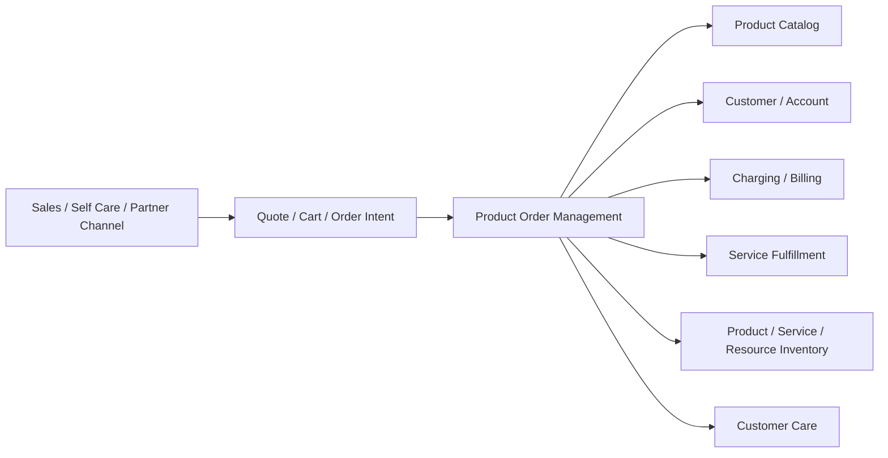
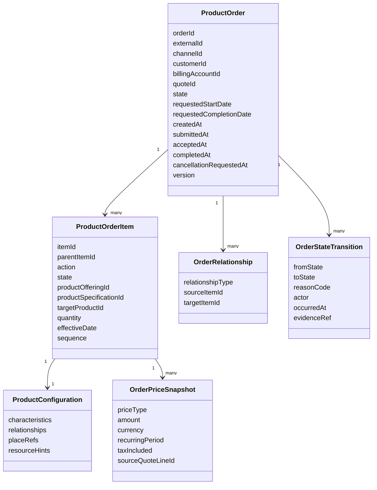
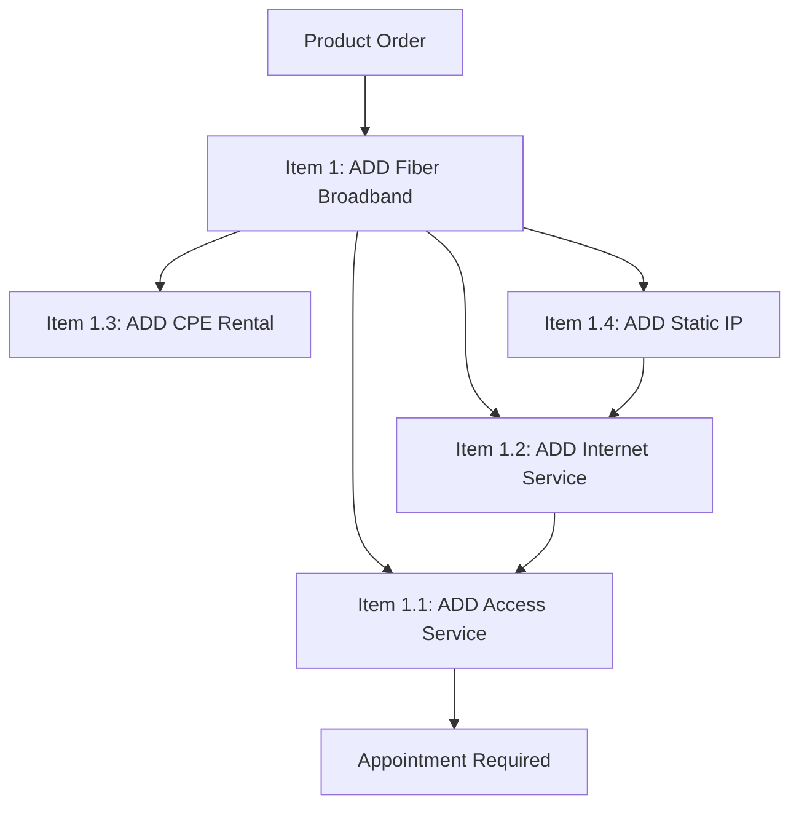
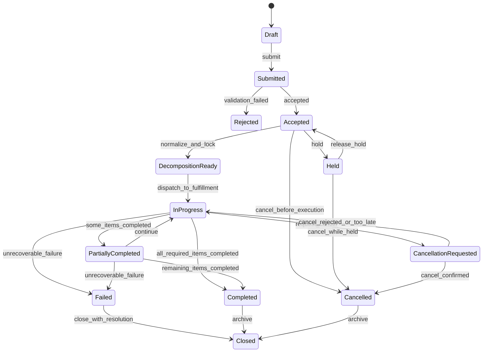
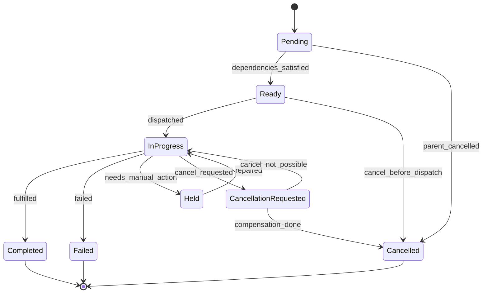
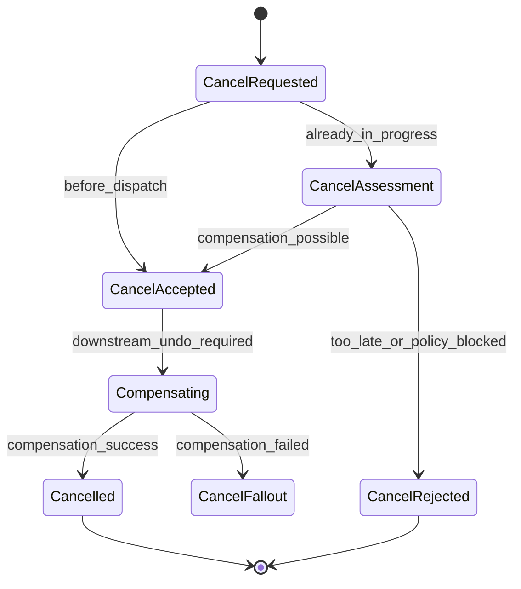
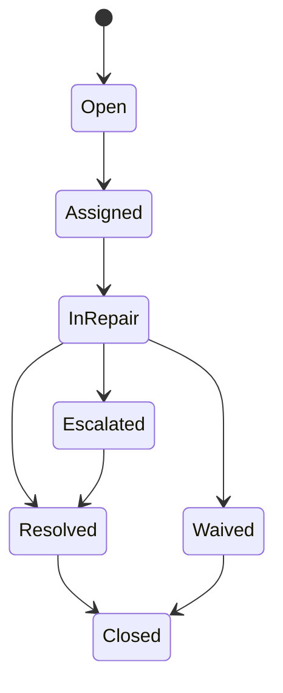

# Part 011 — Product Order Management Deep Dive

## 1. Tujuan Part Ini

Part ini membahas **Product Order Management** sebagai boundary inti BSS: tempat commercial intent berubah menjadi lifecycle execution yang dapat diaudit, diubah, dibatalkan, dipecah, dieksekusi, dan direkonsiliasi.

Dalam sistem telco, product order bukan sekadar record checkout. Product order adalah **kontrak eksekusi** antara channel, customer/account, catalog, charging/billing, service fulfillment, resource allocation, assurance, dan customer care.

Product Order Management harus menjawab:

```text
Apa yang harus terjadi terhadap product milik customer?
Apakah action-nya add, modify, no-change, disconnect, suspend, resume, atau migrate?
Item mana bergantung pada item lain?
Data komersial mana yang sudah dikunci dari quote/catalog?
Apakah order bisa diterima?
Apakah order siap didekomposisi ke service/resource work?
Apa state order saat ini?
Apa bukti transisi state-nya?
Apakah order bisa dibatalkan atau diamandemen?
Jika terjadi fallout, apakah masalahnya business fallout atau technical fallout?
Apa yang boleh dilihat channel/customer care?
Apa yang harus masuk ke downstream system?
```

Jika order management lemah, seluruh BSS/OSS ikut rapuh:

```text
order diterima padahal quote expired
order item tidak punya dependency graph
modify order kehilangan product instance target
cancel order mematikan service yang sudah aktif sebagian
billing start sebelum activation selesai
activation jalan dua kali karena retry tidak idempotent
customer care tidak tahu order stuck di mana
manual repair mengubah state tanpa audit
fallout dianggap error teknis padahal constraint bisnis
```

Part ini mengajarkan product order sebagai **stateful, auditable, decomposable execution object**.

---

## 2. Kaufman Skill Target

Target praktis part ini:

1. memahami perbedaan quote, product order, service order, resource order, dan work order;
2. mendesain product order sebagai aggregate dengan order item graph;
3. membuat state machine order yang eksplisit, defensible, dan auditable;
4. memahami acceptance, rejection, validation, decomposition readiness, in-progress, partial, completed, failed, held, cancellation, dan amendment;
5. mendesain idempotency dan duplicate submit handling untuk order capture;
6. memahami perubahan order ketika order sudah berjalan;
7. membedakan business fallout, technical fallout, dan manual repair;
8. mendesain Java component boundary untuk Product Order Management.

Skill final:

```text
Diberikan intent dari quote/order capture, Anda bisa mendesain Product Order Management
carrier-grade yang mampu menerima order, memvalidasi, menjaga state, mengelola item graph,
melakukan amendment/cancel secara aman, memproduksi event yang stabil, dan menyiapkan
input untuk fulfillment/orchestration tanpa membuat downstream menjadi tempat sampah data.
```

---

## 3. Mental Model: Product Order sebagai Execution Contract

Product order berada di antara **commercial promise** dan **operational execution**.



Cara berpikir yang benar:

```text
Quote menjawab: apa yang dijanjikan secara komersial?
Product Order menjawab: apa yang harus dieksekusi terhadap product customer?
Service Order menjawab: service teknis apa yang harus dibuat/diubah/dimatikan?
Resource Order menjawab: resource apa yang harus dialokasikan/dilepas/dikonfigurasi?
Work Order menjawab: pekerjaan manusia/lapangan apa yang harus dilakukan?
```

Product order tidak boleh menjadi:

```text
1. dump JSON dari frontend;
2. workflow engine table tanpa domain invariant;
3. task list teknis activation;
4. invoice request;
5. service provisioning command langsung;
6. general-purpose request table untuk semua hal.
```

Product order adalah domain object yang menyimpan:

```text
commercial intent + target product + order item graph + lifecycle state + evidence + audit trail
```

---

## 4. Boundary dengan Part Sebelumnya dan Berikutnya

Dari Part 010, order capture sudah menghasilkan **order intent** yang cukup matang.

Part ini mengubah order intent menjadi **accepted/rejected product order**.

Part berikutnya, Part 012, akan membahas product/subscription lifecycle setelah order menghasilkan product instance atau perubahan subscription.

Boundary-nya:

| Area | Owned by Product Order Management? | Catatan |
|---|---:|---|
| Quote pricing snapshot | Tidak | Dibawa sebagai reference/snapshot dari quote. |
| Order acceptance | Ya | POM memutuskan order diterima/ditolak berdasarkan validation. |
| Product order state | Ya | State order dan order item harus dimiliki POM. |
| Order item dependency graph | Ya | POM harus tahu struktur execution secara product-level. |
| Service decomposition detail | Sebagian | POM memicu/delegasi, tetapi detail CFS/RFS dibahas Part 016–017. |
| Network activation command | Tidak | Dibahas Part 019. |
| Product inventory update | Koordinasi | Product inventory adalah record hasil; POM mengorkestrasi event/command. |
| Billing activation | Koordinasi | Billing tidak boleh mulai dari asumsi; harus dari event lifecycle yang benar. |
| Customer notification | Koordinasi | POM menghasilkan state event yang bisa dipakai notification/care. |

---

## 5. Product Order vs Product Inventory

Kesalahan umum adalah mencampur **order** dan **inventory**.

```text
Product Order = permintaan perubahan.
Product Inventory = keadaan product customer setelah perubahan.
```

Contoh:

```text
Customer membeli paket fiber 100 Mbps.
Product Order: ADD productOffering Fiber 100 Mbps, install at site X.
Product Inventory setelah selesai: Product instance Fiber 100 Mbps active untuk customer/account tersebut.
```

Contoh modify:

```text
Customer upgrade dari 100 Mbps ke 300 Mbps.
Product Order: MODIFY existing product instance P-123, change speed 100 -> 300.
Product Inventory setelah selesai: product P-123 active dengan speed 300 Mbps atau product baru tergantung policy modeling.
```

Contoh disconnect:

```text
Customer berhenti layanan.
Product Order: DISCONNECT product instance P-123 effective date tertentu.
Product Inventory setelah selesai: product P-123 terminated/disconnected dengan end date.
```

Invariant:

```text
Order boleh gagal.
Inventory tidak boleh pura-pura sukses.
Order boleh partial.
Inventory harus merepresentasikan state aktual/terkomit.
Order adalah history execution.
Inventory adalah current and historical product ownership.
```

---

## 6. Minimal Product Order Aggregate

Model minimal:



Poin penting:

1. `ProductOrder` adalah aggregate root.
2. `ProductOrderItem` adalah unit perubahan product-level.
3. `ProductConfiguration` adalah snapshot konfigurasi yang akan dipakai decomposition.
4. `OrderPriceSnapshot` menjaga commercial promise yang dibawa dari quote.
5. `OrderRelationship` menjaga dependency antar item.
6. `OrderStateTransition` menyimpan audit lifecycle.

---

## 7. Order Item Action

Dalam telco, order item harus menjelaskan **aksi terhadap product**.

Action umum:

| Action | Makna | Target Product Wajib? |
|---|---|---:|
| `ADD` | Membuat product instance baru | Tidak |
| `MODIFY` | Mengubah product instance existing | Ya |
| `DISCONNECT` | Mengakhiri product instance | Ya |
| `SUSPEND` | Menghentikan sementara entitlement/service | Ya |
| `RESUME` | Mengaktifkan kembali subscription/service | Ya |
| `NO_CHANGE` | Item pendukung untuk dependency/bundle | Kadang |
| `MIGRATE` | Memindah customer/product ke offering/model baru | Ya |
| `REPLACE` | Mengganti product/resource dengan product/resource lain | Ya untuk old target |

Jangan menyimpan action sebagai string bebas dari UI.

Gunakan enum domain yang dikontrol:

```java
public enum ProductOrderAction {
    ADD,
    MODIFY,
    DISCONNECT,
    SUSPEND,
    RESUME,
    NO_CHANGE,
    MIGRATE,
    REPLACE
}
```

Namun jangan terlalu cepat percaya enum tersebut final. Telco sering memiliki action spesifik:

```text
swap SIM
change MSISDN
transfer ownership
relocate service
change bill cycle
add add-on
remove add-on
change QoS tier
renew contract
recontract
```

Prinsipnya:

```text
Action internal boleh lebih kaya daripada action external API.
Tapi action harus punya semantics, invariant, dan allowed transition yang jelas.
```

---

## 8. Order Item Graph

Order telco jarang flat.

Contoh bundle mobile:

```text
Bundle: Postpaid Family Plan
  - Main subscription
  - SIM card
  - MSISDN
  - Data package
  - Voice package
  - Roaming add-on
  - Device installment
```

Contoh fiber:

```text
Fiber Broadband
  - Access service
  - Internet service
  - CPE rental
  - Static IP add-on
  - Installation appointment
```

Model graph:



Dependency matters:

```text
Internet service tidak bisa aktif sebelum access ready.
Static IP tidak bisa assign sebelum internet service exists.
CPE rental mungkin perlu logistics/field work.
Billing recurring charge tidak boleh start sebelum service activation milestone.
```

Graph perlu menyimpan:

```text
parent-child containment
requires dependency
excludes dependency
replaces relationship
depends-on existing product
fulfillment sequencing hint
```

---

## 9. State Machine Product Order

Jangan membuat product order state hanya `NEW`, `PROCESSING`, `DONE`.

State perlu menjelaskan posisi lifecycle yang berguna untuk business, operations, dan integration.

Recommended internal state model:



Mapping ke TM Forum API state harus diputuskan per versi dan per implementation. Jangan bergantung pada satu enum external sebagai internal state machine lengkap.

Pola yang aman:

```text
Internal state machine = kaya, eksplisit, operationally useful.
External state projection = disesuaikan dengan API contract/version.
```

Contoh projection:

| Internal State | External Projection | Catatan |
|---|---|---|
| `Submitted` | acknowledged/pending | Order diterima secara teknis, belum final accepted. |
| `Accepted` | acknowledged/pending | Valid secara business, belum dispatch. |
| `Held` | held | Butuh manual/business action. |
| `InProgress` | inProgress | Sudah dieksekusi downstream. |
| `PartiallyCompleted` | partial | Sebagian item selesai. |
| `Completed` | completed | Semua mandatory item selesai. |
| `Failed` | failed | Tidak bisa selesai tanpa intervention/resubmission. |
| `Cancelled` | cancelled | Dibatalkan sesuai policy. |
| `Rejected` | rejected | Tidak pernah masuk execution. |

---

## 10. Order Item State Machine

Order dan order item tidak selalu memiliki state yang sama.

Contoh:

```text
Product Order state = PartiallyCompleted
Item A = Completed
Item B = InProgress
Item C = Held
Item D = Pending
```

Item state model:



Invariant order-level:

```text
Order completed hanya jika semua mandatory item completed atau waived dengan reason.
Order failed jika ada mandatory item failed dan tidak ada compensation/retry path.
Order partial jika beberapa item completed tetapi order belum bisa completed.
Order held jika progress tertahan oleh manual/business decision.
```

---

## 11. Acceptance vs Execution

Salah satu kesalahan paling mahal adalah mencampur **accepted** dan **executed**.

```text
Accepted = order valid untuk diproses.
Executed = order sudah menghasilkan perubahan nyata.
```

Acceptance validation:

```text
customer valid
account valid
quote valid
pricing snapshot valid
catalog version valid
qualification masih valid atau sudah direvalidated
configuration lengkap
agreement/consent lengkap
credit/fraud decision valid
order item graph valid
requested dates valid
existing product target valid untuk modify/disconnect/suspend/resume
```

Execution validation:

```text
dependencies ready
inventory reservation ready
appointment booked jika diperlukan
downstream capability available
service decomposition menghasilkan plan valid
resource allocation feasible
charging/billing hooks prepared
```

Pola:

```text
submit -> acceptance validation -> accepted/rejected -> decomposition/dispatch -> execution
```

Jangan menjalankan provisioning sebelum acceptance final.

---

## 12. Decomposition Readiness

Product order harus siap didekomposisi.

Readiness bukan berarti POM melakukan semua decomposition detail. Readiness berarti product order membawa data cukup untuk Service Order Management/Fulfillment.

Checklist:

```text
product offering resolved
product specification resolved
configuration characteristics resolved
place/site/address resolved
party/customer/account refs valid
target product refs valid for change order
price snapshot linked
qualification refs linked
appointment/logistics requirements marked
resource hints captured
effective date strategy clear
order item graph acyclic or intentionally cyclic with handler
```

Acyclic graph check:

```java
public final class OrderGraphValidator {
    public void validateNoCycles(ProductOrder order) {
        var graph = OrderDependencyGraph.from(order.items(), order.relationships());
        var cycle = graph.findCycle();
        if (cycle.isPresent()) {
            throw new OrderValidationException(
                "ORDER_DEPENDENCY_CYCLE",
                "Order item dependency cycle detected: " + cycle.get()
            );
        }
    }
}
```

Readiness marker:

```java
public enum DecompositionReadiness {
    NOT_READY,
    READY,
    READY_WITH_WARNINGS,
    BLOCKED_BY_BUSINESS_RULE,
    BLOCKED_BY_MISSING_DATA,
    BLOCKED_BY_DOWNSTREAM_CAPABILITY
}
```

---

## 13. Java Aggregate Design

Contoh simplified aggregate:

```java
public final class ProductOrder {
    private final ProductOrderId id;
    private final ExternalOrderId externalId;
    private final CustomerId customerId;
    private final BillingAccountId billingAccountId;
    private final QuoteId quoteId;
    private ProductOrderState state;
    private final List<ProductOrderItem> items;
    private final List<OrderRelationship> relationships;
    private final List<OrderStateTransition> transitions;
    private final long version;

    public void submit(Actor actor, Instant now) {
        requireState(ProductOrderState.DRAFT);
        transitionTo(ProductOrderState.SUBMITTED, "SUBMITTED_BY_ACTOR", actor, now);
    }

    public void accept(Actor actor, Instant now, AcceptanceDecision decision) {
        requireState(ProductOrderState.SUBMITTED);
        if (!decision.accepted()) {
            reject(actor, now, decision.reasonCode());
            return;
        }
        transitionTo(ProductOrderState.ACCEPTED, "ACCEPTANCE_VALIDATION_PASSED", actor, now);
    }

    public void markDecompositionReady(Actor actor, Instant now) {
        requireState(ProductOrderState.ACCEPTED);
        ensureAllMandatoryItemsAccepted();
        ensureDependencyGraphValid();
        transitionTo(ProductOrderState.DECOMPOSITION_READY, "DECOMPOSITION_READY", actor, now);
    }

    public void startExecution(Actor actor, Instant now) {
        requireState(ProductOrderState.DECOMPOSITION_READY);
        transitionTo(ProductOrderState.IN_PROGRESS, "DISPATCHED_TO_FULFILLMENT", actor, now);
    }

    private void transitionTo(ProductOrderState next, String reason, Actor actor, Instant now) {
        var previous = this.state;
        this.state = next;
        this.transitions.add(OrderStateTransition.of(previous, next, reason, actor, now));
    }
}
```

Baeldung-style rule:

```text
Jangan taruh state transition utama di service class sebagai if/else panjang.
Letakkan invariant domain di aggregate/state machine, lalu service mengorkestrasi dependency eksternal.
```

---

## 14. Application Service Boundary

Application service menangani orchestration aplikasi, bukan menggantikan domain model.

```java
public final class SubmitProductOrderUseCase {
    private final ProductOrderRepository repository;
    private final OrderIntentReader orderIntentReader;
    private final ProductOrderFactory factory;
    private final OrderAcceptanceValidator acceptanceValidator;
    private final IdempotencyService idempotencyService;
    private final Outbox outbox;

    public SubmitProductOrderResult submit(SubmitProductOrderCommand command) {
        return idempotencyService.execute(command.idempotencyKey(), () -> {
            var intent = orderIntentReader.read(command.orderIntentId());
            var order = factory.createFrom(intent, command.actor());
            order.submit(command.actor(), command.now());

            var decision = acceptanceValidator.validate(order);
            order.accept(command.actor(), command.now(), decision);

            repository.save(order);
            outbox.append(ProductOrderEvents.from(order));

            return SubmitProductOrderResult.from(order);
        });
    }
}
```

Pola ini memisahkan:

| Layer | Tanggung Jawab |
|---|---|
| Controller/API | HTTP, auth, request mapping, idempotency header. |
| Application service | Use case orchestration, transaction boundary, dependency call. |
| Domain aggregate | State transition dan invariant. |
| Repository | Persistence. |
| Outbox | Reliable event publication. |
| Adapter | Catalog/customer/quote/inventory/downstream integration. |

---

## 15. Idempotency dan Duplicate Submit

Order submission sangat rentan duplicate:

```text
user double click
mobile app retry
payment gateway callback retry
partner timeout lalu submit ulang
channel tidak menerima response karena network error
message redelivery
```

Idempotency key harus berada pada boundary submit.

Minimal key:

```text
channelId + externalOrderId
atau
channelId + orderIntentId + submissionAttemptId
```

Jangan hanya mengandalkan UUID dari server setelah request masuk. Duplicate sudah terjadi sebelum server membuat ID.

Tabel idempotency:

```text
idempotency_key
request_hash
result_type
result_ref
status: PROCESSING / SUCCEEDED / FAILED_RETRYABLE / FAILED_FINAL
created_at
expires_at
```

Rule:

```text
same key + same request hash -> return same result
same key + different request hash -> reject as idempotency conflict
processing too long -> expose safe retry semantics
failed retryable -> allow controlled retry
failed final -> return same failure
```

---

## 16. Optimistic Locking dan Concurrent Change

Product order bisa disentuh oleh:

```text
fulfillment callback
manual fallout repair
cancel request
amendment request
timer/job
customer care note update
partner status query
```

Gunakan optimistic locking pada aggregate.

```java
public interface ProductOrderRepository {
    Optional<ProductOrder> findById(ProductOrderId id);
    void save(ProductOrder order, ExpectedVersion expectedVersion);
}
```

Jika version conflict:

```text
reload order
re-evaluate command against latest state
apply jika masih valid
reject jika state sudah berubah
```

Jangan memakai blind update:

```sql
UPDATE product_order SET state = 'COMPLETED' WHERE id = ?;
```

Gunakan guard:

```sql
UPDATE product_order
SET state = ?, version = version + 1
WHERE id = ? AND version = ?;
```

---

## 17. Order Amendment

Amendment adalah perubahan terhadap order yang sudah dibuat.

Pertanyaan penting:

```text
Apakah order belum dieksekusi?
Apakah sebagian item sudah completed?
Apakah perubahan hanya metadata atau memengaruhi fulfillment?
Apakah harga berubah?
Apakah agreement/consent perlu ulang?
Apakah downstream sudah menerima service order?
Apakah compensation diperlukan?
```

Kategori amendment:

| Kategori | Contoh | Risiko |
|---|---|---|
| Metadata-only | contact phone, appointment preference | Rendah. |
| Commercial change | add/remove add-on, price change | Perlu quote/pricing revalidation. |
| Fulfillment change | address, device, SIM, speed | Perlu decomposition ulang. |
| Effective date change | requested activation date | Bisa memengaruhi resource/appointment/billing. |
| Ownership/account change | billing account transfer | Tinggi; legal/audit. |

State policy:

```text
Draft/Submitted: amend usually allowed.
Accepted: amend allowed with revalidation.
DecompositionReady: amend carefully; may reset readiness.
InProgress: amendment becomes change order or compensation.
Completed: amendment becomes new order.
Cancelled/Failed/Rejected: amendment usually not allowed; create new order.
```

Recommended pattern:

```text
Amendment is a command with diff, not direct patch.
```

Contoh:

```java
public record AmendProductOrderCommand(
    ProductOrderId orderId,
    AmendmentId amendmentId,
    Actor actor,
    List<OrderItemChange> itemChanges,
    String reasonCode,
    Instant requestedAt
) {}
```

Jangan membuat endpoint generic `PATCH /productOrder/{id}` yang bisa mengubah semua field lifecycle tanpa policy.

---

## 18. Cancellation

Cancel bukan delete.

Cancel adalah lifecycle command yang harus menjaga evidence.

Pertanyaan cancellation:

```text
Apakah order sudah accepted?
Apakah item sudah dispatched?
Apakah item sudah completed?
Apakah resource sudah allocated?
Apakah activation sudah committed?
Apakah billing sudah started?
Apakah field technician sudah assigned?
Apakah cancellation fee berlaku?
Apakah customer consent diperlukan?
```

State logic:



Cancellation harus menghasilkan:

```text
cancel request record
assessment decision
affected item list
compensation plan jika perlu
customer-visible reason
internal reason
audit evidence
```

Jangan:

```text
hapus order row
ubah state langsung ke cancelled tanpa assessment
membatalkan completed item tanpa compensation
menghilangkan price/quote/evidence
```

---

## 19. Fallout Classification

Fallout adalah kondisi order tidak bisa lanjut secara normal.

Tiga kategori utama:

| Kategori | Contoh | Handling |
|---|---|---|
| Business fallout | credit failed, consent missing, address invalid, eligibility berubah | Business repair/manual decision/requote. |
| Data fallout | missing characteristic, invalid mapping, inconsistent inventory | Data correction/reconciliation. |
| Technical fallout | downstream timeout, provisioning failed, adapter error | Retry/circuit breaker/manual technical repair. |

Model fallout:

```java
public record OrderFallout(
    FalloutId id,
    ProductOrderId orderId,
    ProductOrderItemId itemId,
    FalloutCategory category,
    String reasonCode,
    String diagnosticMessage,
    FalloutSeverity severity,
    boolean customerVisible,
    Instant occurredAt
) {}
```

Severity:

```text
INFO: warning, order can continue
WARN: repair recommended, order may continue
BLOCKING: item cannot continue
CRITICAL: order-level failure or customer impact
```

Fallout harus punya lifecycle:



---

## 20. Audit Trail dan Evidence

Telco order sering menjadi objek dispute.

Audit minimal:

```text
who submitted
when submitted
which channel
which quote version
which catalog version
which price snapshot
which qualification result
which agreement/consent
which validation decision
who amended/cancelled
who repaired fallout
which downstream callback changed state
which automated job changed state
```

Jangan hanya menyimpan current state.

Simpan transition log:

```text
order_id
from_state
to_state
reason_code
actor_type
actor_id
correlation_id
causation_id
evidence_ref
occurred_at
```

`correlationId` menjawab:

```text
Ini bagian dari flow bisnis mana?
```

`causationId` menjawab:

```text
Event/command mana yang menyebabkan perubahan ini?
```

---

## 21. Event Model

Product Order Management harus menerbitkan event stabil.

Event umum:

```text
ProductOrderSubmitted
ProductOrderRejected
ProductOrderAccepted
ProductOrderHeld
ProductOrderDecompositionReady
ProductOrderExecutionStarted
ProductOrderItemCompleted
ProductOrderPartiallyCompleted
ProductOrderCompleted
ProductOrderFailed
ProductOrderCancellationRequested
ProductOrderCancelled
ProductOrderAmended
ProductOrderFalloutOpened
ProductOrderFalloutResolved
```

Event contract harus:

```text
punya eventId
punya eventType
punya eventVersion
punya occurredAt
punya aggregateId
punya aggregateVersion
punya correlationId
punya causationId
membawa business key seperlunya
menghindari payload raksasa penuh PII
```

Contoh event:

```java
public record ProductOrderAcceptedEvent(
    UUID eventId,
    String eventVersion,
    ProductOrderId orderId,
    long orderVersion,
    CustomerId customerId,
    BillingAccountId billingAccountId,
    QuoteId quoteId,
    Instant occurredAt,
    CorrelationId correlationId,
    CausationId causationId
) {}
```

Gunakan outbox pattern agar update order dan event publish tidak terpisah secara rapuh.

---

## 22. API Surface

External API bisa mengikuti TM Forum style, tetapi internal use case tetap explicit.

Command API internal:

```text
POST /internal/product-orders:submit
POST /internal/product-orders/{id}:accept
POST /internal/product-orders/{id}:hold
POST /internal/product-orders/{id}:release-hold
POST /internal/product-orders/{id}:mark-decomposition-ready
POST /internal/product-orders/{id}:start-execution
POST /internal/product-orders/{id}:request-cancel
POST /internal/product-orders/{id}:amend
POST /internal/product-orders/{id}/items/{itemId}:complete
POST /internal/product-orders/{id}/fallouts
```

Query API:

```text
GET /product-orders/{id}
GET /product-orders?customerId=&state=&createdAfter=
GET /product-orders/{id}/timeline
GET /product-orders/{id}/items
GET /product-orders/{id}/fallouts
```

External projection API:

```text
POST /tmf-api/productOrderingManagement/vX/productOrder
GET  /tmf-api/productOrderingManagement/vX/productOrder/{id}
PATCH/command style depending on chosen API contract and governance
```

Prinsip:

```text
External compatibility tidak berarti internal model harus sama persis dengan external DTO.
```

---

## 23. Database Modeling

Minimal relational model:

```text
product_order
  id
  external_id
  channel_id
  customer_id
  billing_account_id
  quote_id
  state
  requested_start_date
  requested_completion_date
  created_at
  submitted_at
  accepted_at
  completed_at
  version

product_order_item
  id
  order_id
  parent_item_id
  action
  state
  product_offering_id
  product_specification_id
  target_product_id
  quantity
  effective_date
  sequence
  version

product_order_item_characteristic
  order_item_id
  name
  value_type
  value

product_order_relationship
  id
  order_id
  source_item_id
  target_item_id
  relationship_type

product_order_price_snapshot
  id
  order_item_id
  price_type
  amount
  currency
  recurring_period
  source_quote_line_id

product_order_transition
  id
  order_id
  order_item_id nullable
  from_state
  to_state
  reason_code
  actor_type
  actor_id
  correlation_id
  causation_id
  occurred_at

order_fallout
  id
  order_id
  order_item_id
  category
  severity
  reason_code
  state
  created_at
  resolved_at
```

Index penting:

```text
external_id + channel_id unique
customer_id + created_at
billing_account_id + created_at
state + created_at
order_item.target_product_id
correlation_id
```

---

## 24. Large Order Handling

Enterprise telco order bisa berisi ribuan sites/lines/resources.

Masalah:

```text
payload terlalu besar
single transaction terlalu lama
UI tidak bisa render semua item
state aggregation mahal
partial completion dominan
retry item-level kompleks
```

Pattern:

```text
Order header tetap aggregate root secara business.
Order item dapat diproses dalam shard/batch.
State aggregation dihitung incremental.
Timeline dipisah dari current state.
Payload detail bisa disimpan sebagai document/snapshot dengan checksum.
```

Tetap hati-hati:

```text
Jangan mengorbankan invariant hanya demi scale.
Pisahkan write model item-level tetapi jaga order-level state policy.
```

---

## 25. Time Semantics

Product order selalu penuh tanggal.

Bedakan:

| Field | Makna |
|---|---|
| `createdAt` | Order record dibuat. |
| `submittedAt` | Actor submit order. |
| `acceptedAt` | Order diterima business. |
| `requestedStartDate` | Customer/channel minta mulai kapan. |
| `requestedCompletionDate` | Customer/channel harap selesai kapan. |
| `committedCompletionDate` | Provider menjanjikan selesai kapan. |
| `actualStartDate` | Execution benar-benar mulai. |
| `completedAt` | Order selesai. |
| `effectiveDate` | Perubahan product berlaku secara komersial/operasional. |

Jangan memakai satu field `date`.

---

## 26. Customer Visibility

Tidak semua state internal boleh ditampilkan ke customer.

Projection customer-facing:

| Internal | Customer View |
|---|---|
| Submitted | Order received |
| Accepted | Order confirmed |
| DecompositionReady | Preparing your service |
| InProgress | In progress |
| Held business missing data | Action needed |
| Held internal technical retry | In progress |
| PartiallyCompleted | Partially completed / Some services ready |
| Failed recoverable | Delayed |
| Failed final | Could not complete |
| Cancelled | Cancelled |

Rule:

```text
Customer-facing state adalah product experience, bukan stack trace internal.
```

---

## 27. Integration dengan Billing dan Charging

Product order tidak langsung membuat invoice.

Ia mengirim milestone:

```text
order accepted
product instance created pending active
activation completed
effective date reached
suspension/resume/disconnect completed
chargeable event ready
```

Billing harus start dari event yang tepat.

Anti-pattern:

```text
billing recurring charge dibuat saat order submitted
billing start saat technician assigned
billing start karena row product_order exists
```

Pattern:

```text
Product inventory/subscription lifecycle emits billable lifecycle event.
Billing consumes billable event with idempotency.
```

Part 014 akan membahas billing lebih jauh.

---

## 28. Integration dengan Product Inventory

Product order menghasilkan perubahan product inventory.

Untuk `ADD`:

```text
create product instance as Pending/Provisioning after order accepted or execution started
mark Active after fulfillment completion
```

Untuk `MODIFY`:

```text
create pending change record or versioned product configuration
apply when fulfillment milestone completed
```

Untuk `DISCONNECT`:

```text
mark pending disconnect
terminate on effective completion
preserve historical record
```

Jangan membuat product inventory langsung active hanya karena order accepted.

---

## 29. Testing Strategy

Unit test state machine:

```text
submitted order can be accepted
submitted order can be rejected
accepted order can be held
held order can be released
accepted order can be marked decomposition ready
in-progress order can become partial
partial order can become completed
completed order cannot be amended directly
cancel in-progress requires assessment
```

Property-like tests:

```text
order cannot complete if mandatory item failed
order cannot start execution if graph has cycle
modify item must target existing product
cancelled order cannot emit activation request
same idempotency key returns same result
```

Contract tests:

```text
external TMF-style DTO maps to internal command
internal state projects to external state consistently
events keep backward compatibility
```

Scenario test:

```gherkin
Scenario: Customer cancels fiber order after appointment booked but before activation
  Given a product order is in progress
  And appointment is booked
  And no service activation has completed
  When the customer requests cancellation
  Then cancellation assessment is required
  And appointment cancellation command is emitted
  And order becomes cancelled after compensation succeeds
```

---

## 30. Common Anti-Patterns

### 30.1 Order as CRUD Table

Symptom:

```text
PATCH /orders/{id} can update state, price, item, customer, and target product freely.
```

Damage:

```text
no lifecycle audit
no transition invariant
manual repair causes hidden corruption
```

Fix:

```text
model commands and state transitions explicitly.
```

### 30.2 UI Cart Becomes Order Directly

Symptom:

```text
frontend JSON saved as order and sent to fulfillment.
```

Damage:

```text
stale catalog, bad eligibility, missing agreement, broken decomposition.
```

Fix:

```text
use order intent -> acceptance validation -> product order aggregate.
```

### 30.3 Product Order Does Provisioning Directly

Symptom:

```text
ProductOrderService calls HLR/UDM/OLT adapter directly.
```

Damage:

```text
BSS becomes network adapter spaghetti.
```

Fix:

```text
POM delegates to service/resource fulfillment boundaries.
```

### 30.4 No Item-Level State

Symptom:

```text
order only has header state.
```

Damage:

```text
partial completion impossible to explain
retry all-or-nothing
customer care blind
```

Fix:

```text
model order item state and aggregate header from item progress.
```

### 30.5 Cancel as Delete

Symptom:

```text
cancel removes order or hides it.
```

Damage:

```text
dispute impossible
billing/provisioning mismatch
regulatory audit weak
```

Fix:

```text
cancel is lifecycle command with evidence and compensation.
```

---

## 31. Deliberate Practice

### Exercise 1 — Model Order Item Graph

Buat product order untuk:

```text
Customer membeli fiber broadband 300 Mbps + static IP + CPE rental + installation.
```

Tentukan:

```text
order item list
action setiap item
parent-child relationship
dependency relationship
mandatory vs optional
state awal
```

### Exercise 2 — Design Cancellation Policy

Untuk order fiber di atas, desain policy:

```text
cancel before appointment booked
cancel after appointment booked
cancel after technician dispatched
cancel after access activated but internet not active
cancel after all completed
```

### Exercise 3 — Build State Machine Guard

Implementasikan method:

```java
boolean canTransition(ProductOrderState from, ProductOrderState to, CommandContext context)
```

Pastikan:

```text
completed tidak bisa kembali inProgress
inProgress tidak bisa langsung rejected
cancel inProgress harus lewat CancellationRequested
failed bisa closed tapi tidak completed tanpa repair decision
```

### Exercise 4 — Design Event Contract

Buat event:

```text
ProductOrderCompleted
```

Wajib punya:

```text
event id
event version
order id
order version
customer id
billing account id
completed item summary
occurred at
correlation id
causation id
```

### Exercise 5 — Fallout Classification

Klasifikasikan error berikut:

```text
credit check failed
catalog item not found
UDM timeout
address no longer serviceable
missing SIM ICCID
activation adapter returned duplicate subscription
field technician no access
```

---

## 32. Checklist Production Readiness

Product Order Management siap produksi jika:

```text
[ ] order submission idempotent
[ ] external id unique per channel/partner
[ ] state machine explicit
[ ] illegal transition blocked
[ ] order item graph validated
[ ] item-level state tracked
[ ] audit transition stored
[ ] event outbox implemented
[ ] cancellation is command, not delete
[ ] amendment has policy by state
[ ] fallout has classification and lifecycle
[ ] customer-visible state projection exists
[ ] inventory update does not fake active before fulfillment
[ ] billing starts from billable lifecycle event, not order creation
[ ] retry and duplicate callback safe
[ ] correlation/causation id propagated
[ ] manual repair audited
[ ] query API supports care/operations needs
```

---

## 33. Key Takeaways

Product Order Management adalah salah satu domain paling penting dalam BSS.

Mental model yang harus dipegang:

```text
Quote = commercial promise.
Product Order = execution contract.
Product Inventory = resulting product ownership/state.
Service Order = technical service execution.
Resource Order = resource allocation/configuration execution.
```

Order yang baik memiliki:

```text
explicit lifecycle
item graph
state transition audit
idempotency
amendment policy
cancellation assessment
fallout lifecycle
event contract
safe projection to customer/channel/downstream
```

Top 1% engineer tidak hanya membuat endpoint order. Mereka membuat order system yang tetap benar ketika:

```text
customer retry submit
partner duplicate order
quote expired
catalog berubah
eligibility berubah
field work gagal
network activation timeout
cancel datang saat provisioning berjalan
manual repair dilakukan jam 2 pagi
audit bertanya kenapa customer ditagih
```

---

## 34. Referensi

Referensi yang relevan untuk part ini:

1. TM Forum — Product Ordering Management API TMF622.  
   https://www.tmforum.org/open-digital-architecture/open-apis/product-ordering-management-api-TMF622/v5.0
2. TM Forum — TMF622 Product Ordering Management API User Guide v5.0.0.  
   https://www.tmforum.org/resources/specifications/tmf622-product-ordering-management-api-user-guide-v5-0-0/
3. TM Forum — Product Inventory Management API TMF637.  
   https://www.tmforum.org/open-digital-architecture/open-apis/product-inventory-management-api-TMF637/v5.0
4. TM Forum — Product Catalog Management API TMF620.  
   https://www.tmforum.org/open-digital-architecture/open-apis/product-catalog-management-api-TMF620/v5.0
5. TM Forum — Open Digital Architecture.  
   https://www.tmforum.org/open-digital-architecture/
