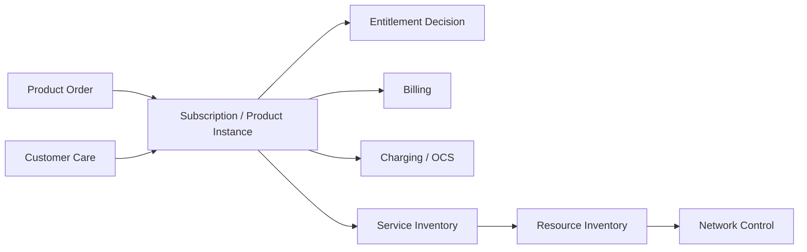
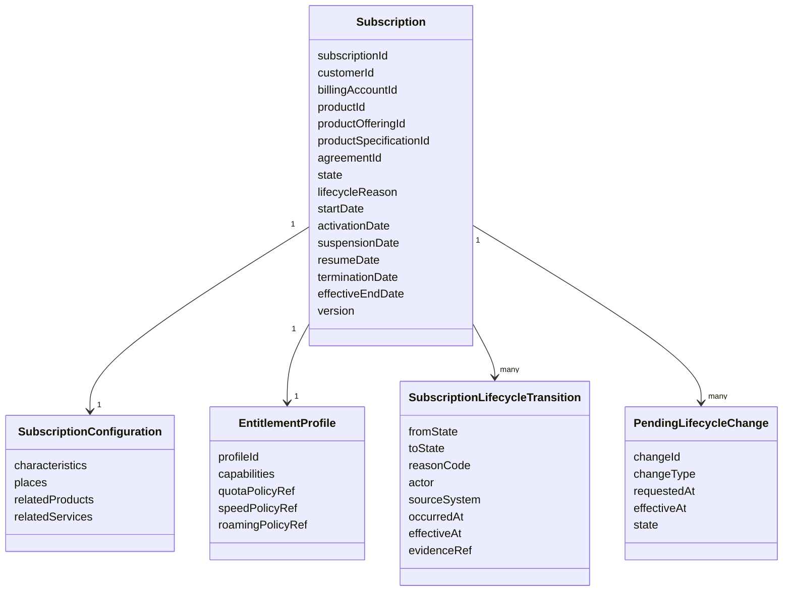
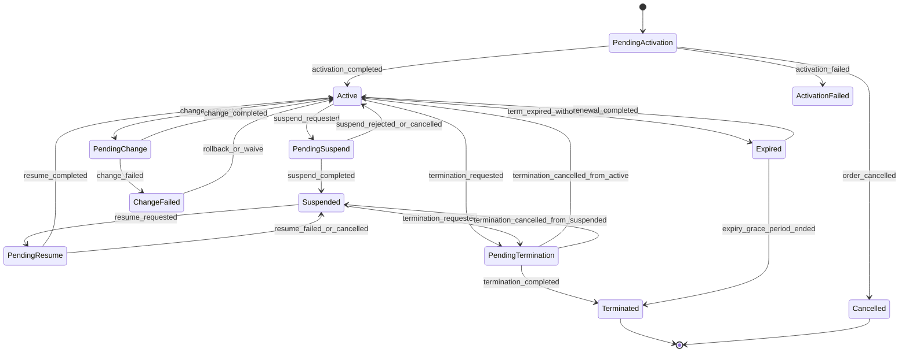
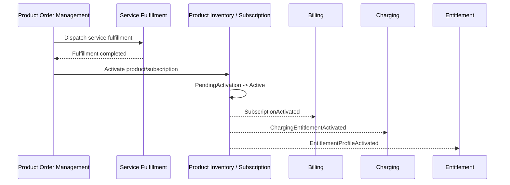
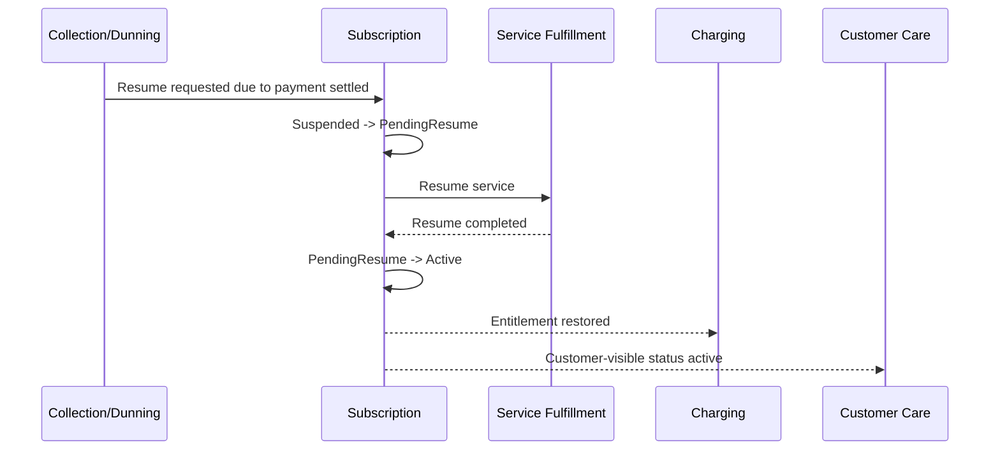
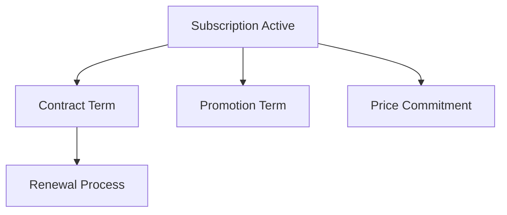
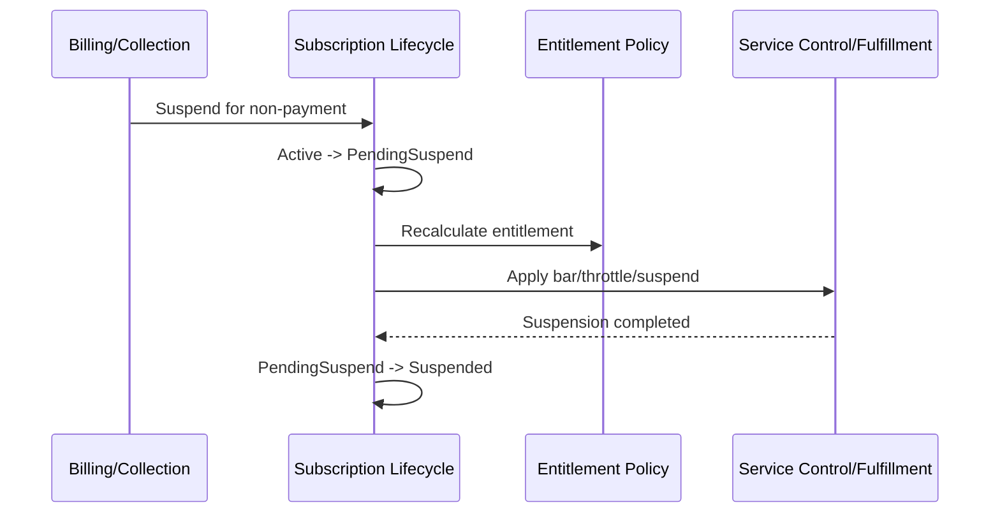
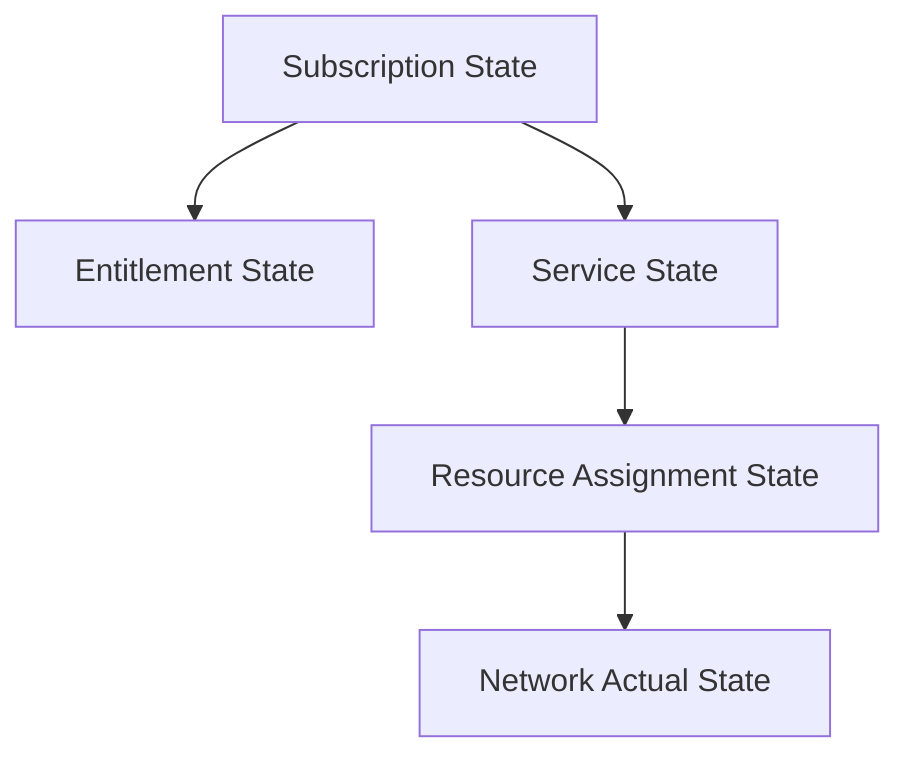
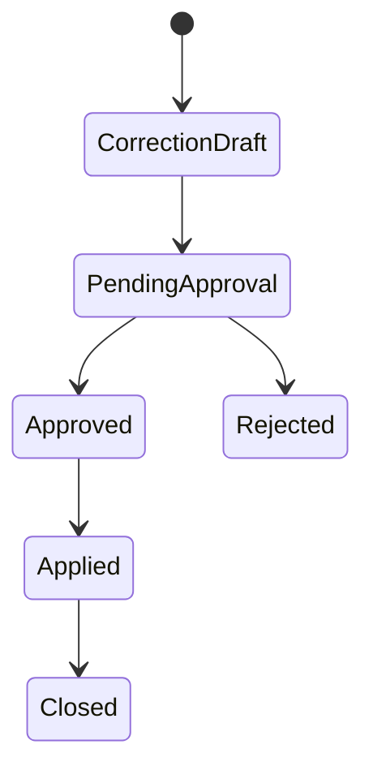

# Part 012 — Subscription Lifecycle Management

## 1. Tujuan Part Ini

Part ini membahas **Subscription Lifecycle Management**: bagaimana product yang dibeli customer hidup sebagai instance jangka panjang, berubah state, memengaruhi entitlement, billing, charging, service, assurance, dan customer experience.

Dalam telco, subscription bukan hanya row billing. Subscription adalah **commercial entitlement object** yang menghubungkan:

```text
customer/account
product offering
product specification
contract/agreement
service instance
resource assignment
billing/charging state
entitlement decision
lifecycle history
```

Subscription lifecycle harus menjawab:

```text
Apakah customer punya hak memakai layanan ini sekarang?
Sejak kapan hak itu berlaku?
Apa product/offering/configuration yang aktif?
Apakah billing harus berjalan?
Apakah charging harus mengizinkan usage?
Apakah service teknis harus aktif, suspended, throttled, atau terminated?
Apakah subscription sedang pending activation, pending change, suspended, resumed, pending terminate, atau terminated?
Apakah perubahan berasal dari customer request, dunning, fraud, network issue, migration, atau admin correction?
```

Jika subscription lifecycle lemah, gejalanya mahal:

```text
customer masih bisa memakai service setelah disconnect
billing tetap berjalan ketika service suspended tanpa charge policy jelas
prepaid quota aktif padahal product terminated
customer care melihat active, network melihat inactive
resume gagal karena suspend reason hilang
upgrade plan membuat dua subscription active paralel tanpa policy
termination menghapus history
entitlement cache stale menyebabkan revenue leakage
```

Part ini mengajarkan subscription sebagai **durable lifecycle aggregate** yang menjadi sumber kebenaran komersial untuk entitlement dan billing alignment.

---

## 2. Kaufman Skill Target

Target praktis part ini:

1. membedakan subscription, product inventory, service inventory, resource inventory, dan billing account;
2. mendesain lifecycle state untuk subscription/product instance;
3. memahami activation, suspend, resume, modify, renew, migrate, and terminate;
4. memahami voluntary vs involuntary suspension;
5. memahami dunning-driven state change;
6. memahami entitlement sebagai decision layer, bukan boolean field;
7. mendesain Java aggregate untuk subscription lifecycle;
8. menjaga alignment antara order, inventory, service, charging, dan billing;
9. membuat audit trail lifecycle yang kuat;
10. menghindari corruption akibat direct update state.

Skill final:

```text
Diberikan product order yang completed atau lifecycle event dari billing/charging/care,
Anda bisa mendesain Subscription Lifecycle Management yang benar secara domain, aman secara state,
auditable, idempotent, dan dapat menjadi basis entitlement, billing, charging, dan service control.
```

---

## 3. Mental Model: Subscription sebagai Commercial Entitlement

Product Order menjawab:

```text
Apa perubahan yang diminta?
```

Subscription/Product Inventory menjawab:

```text
Apa product yang sekarang dimiliki customer dan apa state lifecycle-nya?
```

Entitlement menjawab:

```text
Apakah customer boleh menggunakan capability tertentu sekarang?
```

Diagram:



Subscription bukan service teknis.

Contoh mobile:

```text
Subscription: Postpaid Gold Plan milik customer A.
Service: mobile voice/data service di core network.
Resource: MSISDN, IMSI, ICCID/SIM, APN profile, IP allocation.
```

Contoh fixed broadband:

```text
Subscription: Fiber 300 Mbps product milik billing account B.
Service: internet access service, CFS/RFS.
Resource: ONT, router, OLT port, VLAN, IP block.
```

---

## 4. Product Inventory vs Subscription

Istilah dapat berbeda antar organisasi. Banyak telco memakai `Product Inventory` sebagai representasi formal product instance customer. Banyak engineer menyebutnya `Subscription` ketika product adalah recurring service.

Prinsip yang dipakai seri ini:

```text
Product Inventory = repository semua product instance milik customer.
Subscription = product instance recurring yang memiliki entitlement/lifecycle berkelanjutan.
```

Dengan kata lain:

```text
Setiap subscription adalah product instance.
Tidak semua product instance harus subscription.
```

Contoh product instance bukan subscription:

```text
one-time installation fee
one-time device purchase
SIM replacement fee
activation fee
one-time roaming pass jika tidak recurring
```

Contoh subscription:

```text
mobile postpaid plan
prepaid base plan
fiber broadband recurring plan
enterprise MPLS circuit
IoT connectivity plan
cloud voice seat
static IP add-on recurring
```

---

## 5. Subscription Aggregate Minimal

Model minimal:



Core invariant:

```text
State subscription harus dapat menjelaskan entitlement, billing behavior, dan expected service behavior.
```

---

## 6. State Machine Subscription

State internal recommended:



State ini bukan wajib sama dengan enum TM Forum Product Inventory. Ini internal lifecycle yang lebih operationally useful. External API dapat memproyeksikan state sesuai kontrak yang dipilih.

---

## 7. Why `active: boolean` Is Not Enough

Anti-pattern:

```java
class Subscription {
    boolean active;
}
```

Masalah:

```text
Pending activation dianggap inactive, tapi order masih berjalan.
Suspended dianggap inactive, tapi product belum terminated.
Pending terminate dianggap active atau inactive?
Expired dalam grace period berbeda dengan terminated.
Activation failed berbeda dengan cancelled.
Voluntary suspension berbeda dengan dunning suspension.
```

State harus menjelaskan lifecycle dan reason.

Contoh:

```java
public enum SubscriptionState {
    PENDING_ACTIVATION,
    ACTIVE,
    PENDING_SUSPEND,
    SUSPENDED,
    PENDING_RESUME,
    PENDING_CHANGE,
    CHANGE_FAILED,
    PENDING_TERMINATION,
    EXPIRED,
    TERMINATED,
    CANCELLED,
    ACTIVATION_FAILED
}
```

Tambahkan reason:

```java
public enum LifecycleReasonCode {
    CUSTOMER_REQUEST,
    ORDER_COMPLETED,
    NON_PAYMENT,
    FRAUD_SUSPECTED,
    CREDIT_RISK,
    CONTRACT_EXPIRED,
    ADMIN_CORRECTION,
    NETWORK_MIGRATION,
    PRODUCT_MIGRATION,
    TECHNICAL_FAILURE,
    REGULATORY_BLOCK,
    PARTNER_REQUEST
}
```

State menjawab posisi. Reason menjawab kenapa.

---

## 8. Activation Lifecycle

Activation biasanya dipicu oleh product order completion atau fulfillment milestone.

Flow:



Activation invariant:

```text
Subscription active hanya jika mandatory fulfillment milestone selesai atau policy eksplisit mengizinkan pre-activation.
```

Ada model berbeda:

| Model | Contoh | Billing Start |
|---|---|---|
| Activation-on-order | digital add-on langsung aktif | Saat order completed. |
| Activation-on-network | mobile/fiber service aktif setelah provisioning | Saat service activation success. |
| Activation-on-first-use | prepaid pass mulai saat dipakai | Saat first usage event. |
| Activation-on-date | contract mulai tanggal tertentu | Saat effective date. |
| Soft activation | product active tapi service pending | Perlu state/flag jelas. |

Jangan menyamakan semuanya.

---

## 9. Suspension Lifecycle

Suspension adalah temporary restriction, bukan termination.

Jenis suspension:

| Jenis | Trigger | Dampak |
|---|---|---|
| Voluntary | customer meminta pause | Entitlement/service dibatasi sesuai policy. |
| Involuntary dunning | unpaid bill | Service throttled/suspended. |
| Fraud/security | fraud suspected/SIM abuse | Entitlement diblokir cepat. |
| Regulatory | lawful/regulatory order | Bisa wajib blokir. |
| Technical/admin | migration/maintenance/correction | Harus diaudit. |

State:

```text
Active -> PendingSuspend -> Suspended
```

Mengapa perlu `PendingSuspend`?

```text
commercial state sudah menerima suspend request
network/service belum tentu selesai suspend
billing policy mungkin belum berubah sampai suspend effective
customer notification perlu tracking
retry/compensation perlu state antara
```

Suspension command:

```java
public record SuspendSubscriptionCommand(
    SubscriptionId subscriptionId,
    SuspensionRequestId requestId,
    SuspensionType suspensionType,
    LifecycleReasonCode reasonCode,
    Instant requestedAt,
    Instant effectiveAt,
    Actor actor
) {}
```

Rule:

```text
Voluntary suspend mungkin future-dated.
Fraud/regulatory suspend biasanya immediate.
Dunning suspend mengikuti collection policy.
Technical suspend tidak selalu customer-visible.
```

---

## 10. Resume Lifecycle

Resume bukan hanya `state = ACTIVE`.

Resume harus memastikan:

```text
suspend reason boleh dihapus atau sudah resolved
outstanding payment sudah clear jika dunning
fraud block sudah released jika fraud
network/service resume berhasil
charging entitlement restored
billing policy benar
customer notified
```

State:

```text
Suspended -> PendingResume -> Active
```

Common bug:

```text
customer bayar tagihan
billing marks account paid
subscription active set true
network service tetap barred
customer masih tidak bisa memakai layanan
```

Correct flow:



---

## 11. Modification Lifecycle

Modification adalah perubahan configuration/offering/price/add-on terhadap subscription existing.

Contoh:

```text
upgrade speed 100 -> 300 Mbps
add roaming add-on
remove static IP
change mobile plan
change contract term
change SIM/eSIM profile
change installation address / relocation
```

Jangan langsung mutate subscription current config tanpa pending change.

Gunakan pending lifecycle change:

```java
public record PendingLifecycleChange(
    LifecycleChangeId id,
    SubscriptionId subscriptionId,
    LifecycleChangeType type,
    ChangeState state,
    Instant requestedAt,
    Instant effectiveAt,
    Map<String, ChangeValue> proposedChanges,
    ProductOrderId sourceOrderId
) {}
```

Change state:

```text
REQUESTED
VALIDATED
IN_PROGRESS
APPLIED
FAILED
CANCELLED
ROLLED_BACK
```

Subscription state bisa tetap `ACTIVE` sambil memiliki `PendingChange`, atau pindah ke `PENDING_CHANGE` tergantung policy dan UI need.

Pattern untuk recurring product:

```text
current configuration = what is active now
pending configuration = what will be active after effective date/fulfillment
historical version = what was active before
```

---

## 12. Renewal and Contract Term

Renewal adalah lifecycle commercial term, bukan sekadar tanggal baru.

Elemen:

```text
contract start date
contract end date
minimum commitment period
auto-renewal flag
renewal offer
penalty/early termination fee
price lock period
promotion expiry
notification obligation
```

State yang relevan:

```text
Active
InRenewalWindow
RenewalPending
Renewed
Expired
GracePeriod
Terminated
```

Bisa dimodelkan sebagai sub-lifecycle contract term daripada state utama subscription.



Jangan mencampur product active dengan contract active secara sembrono.

Contoh:

```text
Subscription masih active setelah contract minimum term selesai.
Tapi discount/promotion mungkin expired.
Early termination fee mungkin tidak lagi berlaku.
```

---

## 13. Termination Lifecycle

Termination adalah akhir product ownership/entitlement. Jangan hapus subscription.

State:

```text
Active/Suspended -> PendingTermination -> Terminated
```

Termination harus menangani:

```text
future-dated termination
immediate termination
end-of-cycle termination
early termination fee
resource release
service disconnect
billing final charge
refund/adjustment
number quarantine/recycle policy
CPE return
historical record retention
```

Termination command:

```java
public record TerminateSubscriptionCommand(
    SubscriptionId subscriptionId,
    TerminationRequestId requestId,
    TerminationMode mode,
    LifecycleReasonCode reasonCode,
    Instant requestedAt,
    Instant effectiveAt,
    ProductOrderId sourceOrderId,
    Actor actor
) {}
```

Termination mode:

```text
IMMEDIATE
END_OF_BILL_CYCLE
FUTURE_DATED
END_OF_CONTRACT
ADMIN_CORRECTION
MIGRATION_REPLACED
```

Invariant:

```text
Terminated subscription tidak boleh kembali active.
Jika perlu reconnect, buat subscription/order baru atau explicit reinstatement policy dengan audit sangat kuat.
```

---

## 14. Dunning-Driven Lifecycle

Dunning adalah proses collection untuk unpaid bills.

Dunning dapat memicu:

```text
reminder
late fee
outgoing call barred
data throttling
partial suspension
full suspension
termination
write-off
```

Subscription tidak boleh tahu seluruh billing collection detail, tetapi harus menerima lifecycle command yang jelas.

Flow:



Jangan biarkan billing langsung memanggil network barring tanpa subscription lifecycle. Jika itu terjadi, product state, entitlement, dan care view akan drift.

---

## 15. Entitlement as Decision, Not Boolean

Entitlement bukan field `allowed = true`.

Entitlement adalah keputusan berdasarkan:

```text
subscription state
product offering/specification
customer/account status
balance/quota
payment/dunning state
fraud/regulatory blocks
service/resource state
time/effective date
location/roaming context
policy version
```

Contoh decision:

```java
public record EntitlementDecision(
    SubscriptionId subscriptionId,
    String capability,
    boolean allowed,
    EntitlementDecisionReason reason,
    Instant decidedAt,
    String policyVersion,
    Duration ttl
) {}
```

Capability:

```text
DATA_ACCESS
VOICE_OUTGOING
VOICE_INCOMING
SMS_OUTGOING
ROAMING
STATIC_IP
FIBER_INTERNET
QOS_PREMIUM
API_SIM_SWAP_CHECK
```

Decision reason:

```text
ALLOWED_ACTIVE_SUBSCRIPTION
DENIED_SUSPENDED_NON_PAYMENT
DENIED_TERMINATED
DENIED_QUOTA_EXHAUSTED
DENIED_FRAUD_BLOCK
DENIED_NOT_YET_EFFECTIVE
DENIED_EXPIRED
```

Entitlement cache harus punya TTL dan invalidation event.

---

## 16. Billing Alignment

Billing alignment adalah salah satu sumber defect terbesar.

Subscription lifecycle harus memberi sinyal yang tepat:

```text
SubscriptionActivated
SubscriptionSuspended
SubscriptionResumed
SubscriptionChanged
SubscriptionTerminated
SubscriptionRenewed
PromotionExpired
ContractTermEnded
```

Billing behavior tidak universal.

| State | Billing Bisa | Catatan |
|---|---|---|
| PendingActivation | Tidak bill, atau prebill | Tergantung product/policy. |
| Active | Bill recurring/usage | Normal. |
| Suspended voluntary | Bill full, partial, atau pause | Harus product policy. |
| Suspended non-payment | Bisa terus accrue balance | Collection policy. |
| PendingTermination | Bill sampai effective end | Hindari double charge. |
| Terminated | Stop recurring, final bill | Usage late events perlu handling. |
| Expired grace | Bisa limited bill/fee | Contract/policy. |

Jangan hardcode:

```text
if suspended then stop billing
```

Itu salah untuk banyak product.

Gunakan billing policy:

```java
public interface SubscriptionBillingPolicy {
    BillingEffect evaluate(Subscription subscription, LifecycleEvent event);
}
```

---

## 17. Charging Alignment

Charging terutama penting untuk prepaid, data quota, roaming, and online charging.

Charging perlu tahu:

```text
subscription active?
plan/quota policy?
balance bucket?
validity period?
roaming allowed?
throttle policy?
5G slice/QoS policy?
```

Lifecycle events dapat mengubah charging profile:

```text
activation -> create balance/quota/charging profile
suspend -> bar/throttle/deny capabilities
resume -> restore profile
change plan -> migrate buckets/policy
terminate -> close profile and reject new sessions
```

Late usage event problem:

```text
Usage event datang setelah termination.
```

Need policy:

```text
accept if usageTime before termination effectiveAt
reject if after termination effectiveAt
route to suspense if ambiguous
```

---

## 18. Service and Resource Alignment

Subscription active harus di-align dengan service/resource.

Namun jangan menganggap semua state bisa sinkron realtime.

```text
Subscription PendingSuspend, service still active until network command completed.
Subscription PendingResume, service still barred until resume completed.
Subscription PendingTermination, resources may still be assigned.
```

Gunakan state berbeda untuk commercial lifecycle dan technical lifecycle.



Reconciliation harus bisa menemukan drift:

```text
subscription active, service inactive
subscription suspended, network still allows data
subscription terminated, MSISDN still assigned
subscription active, billing not charging
```

---

## 19. Java Domain Model

Simplified aggregate:

```java
public final class Subscription {
    private final SubscriptionId id;
    private final CustomerId customerId;
    private final BillingAccountId billingAccountId;
    private final ProductId productId;
    private final ProductOfferingId productOfferingId;
    private SubscriptionState state;
    private LifecycleReasonCode lifecycleReason;
    private Instant activationDate;
    private Instant suspensionDate;
    private Instant terminationDate;
    private final List<SubscriptionLifecycleTransition> transitions;
    private final List<PendingLifecycleChange> pendingChanges;
    private long version;

    public void activate(ActivateSubscriptionCommand command) {
        requireState(SubscriptionState.PENDING_ACTIVATION);
        this.activationDate = command.effectiveAt();
        transitionTo(
            SubscriptionState.ACTIVE,
            LifecycleReasonCode.ORDER_COMPLETED,
            command.actor(),
            command.occurredAt(),
            command.effectiveAt()
        );
    }

    public void requestSuspension(SuspendSubscriptionCommand command) {
        requireState(SubscriptionState.ACTIVE);
        this.lifecycleReason = command.reasonCode();
        transitionTo(
            SubscriptionState.PENDING_SUSPEND,
            command.reasonCode(),
            command.actor(),
            command.requestedAt(),
            command.effectiveAt()
        );
    }

    public void completeSuspension(CompleteSuspensionCommand command) {
        requireState(SubscriptionState.PENDING_SUSPEND);
        this.suspensionDate = command.effectiveAt();
        transitionTo(
            SubscriptionState.SUSPENDED,
            lifecycleReason,
            command.actor(),
            command.occurredAt(),
            command.effectiveAt()
        );
    }

    public void requestTermination(TerminateSubscriptionCommand command) {
        requireAnyState(SubscriptionState.ACTIVE, SubscriptionState.SUSPENDED);
        transitionTo(
            SubscriptionState.PENDING_TERMINATION,
            command.reasonCode(),
            command.actor(),
            command.requestedAt(),
            command.effectiveAt()
        );
    }

    public void completeTermination(CompleteTerminationCommand command) {
        requireState(SubscriptionState.PENDING_TERMINATION);
        this.terminationDate = command.effectiveAt();
        transitionTo(
            SubscriptionState.TERMINATED,
            lifecycleReason,
            command.actor(),
            command.occurredAt(),
            command.effectiveAt()
        );
    }

    private void transitionTo(
        SubscriptionState next,
        LifecycleReasonCode reason,
        Actor actor,
        Instant occurredAt,
        Instant effectiveAt
    ) {
        var previous = this.state;
        this.state = next;
        this.lifecycleReason = reason;
        this.transitions.add(
            SubscriptionLifecycleTransition.of(previous, next, reason, actor, occurredAt, effectiveAt)
        );
    }
}
```

---

## 20. Application Service Pattern

Subscription lifecycle command handler:

```java
public final class SuspendSubscriptionUseCase {
    private final SubscriptionRepository repository;
    private final SuspensionPolicy policy;
    private final FulfillmentGateway fulfillmentGateway;
    private final Outbox outbox;

    public SuspendSubscriptionResult suspend(SuspendSubscriptionCommand command) {
        var subscription = repository.findById(command.subscriptionId())
            .orElseThrow(() -> new NotFoundException("SUBSCRIPTION_NOT_FOUND"));

        var decision = policy.evaluate(subscription, command);
        if (!decision.allowed()) {
            return SuspendSubscriptionResult.rejected(decision.reason());
        }

        subscription.requestSuspension(command);
        repository.save(subscription, ExpectedVersion.current());

        outbox.append(new SubscriptionSuspensionRequestedEvent(
            subscription.id(),
            command.suspensionType(),
            command.reasonCode(),
            command.effectiveAt(),
            command.requestId()
        ));

        fulfillmentGateway.requestSuspend(subscription.id(), command.requestId());

        return SuspendSubscriptionResult.accepted(subscription.id());
    }
}
```

Catatan:

```text
Dalam production, panggilan fulfillmentGateway sebaiknya melalui event/outbox/command queue,
bukan synchronous call yang membuat transaksi DB tergantung network downstream.
```

---

## 21. Idempotency for Lifecycle Commands

Lifecycle commands sering retry.

Idempotency key per command:

```text
activationRequestId
suspensionRequestId
resumeRequestId
terminationRequestId
productOrderId + orderItemId + lifecycleAction
billingCollectionActionId
fraudCaseActionId
```

Rule:

```text
same request id + same command -> return same result
same request id + different payload -> reject conflict
completion callback duplicate -> no-op if already in target state with same evidence
late callback after compensation -> quarantine/manual review
```

Contoh duplicate callback:

```java
public void completeSuspension(CompleteSuspensionCommand command) {
    if (state == SubscriptionState.SUSPENDED && transitions.containsEvidence(command.evidenceRef())) {
        return;
    }
    requireState(SubscriptionState.PENDING_SUSPEND);
    // apply transition
}
```

---

## 22. Effective Dating

Subscription system tanpa effective dating akan rusak.

Tanggal penting:

| Field | Makna |
|---|---|
| `requestedAt` | kapan actor meminta perubahan |
| `acceptedAt` | kapan request diterima |
| `effectiveAt` | kapan perubahan berlaku secara domain |
| `completedAt` | kapan proses teknis selesai |
| `recordedAt` | kapan sistem mencatat |
| `billingEffectiveAt` | kapan billing policy mulai berubah |
| `serviceEffectiveAt` | kapan service/network berubah |

Contoh:

```text
Customer request termination pada 2026-06-10.
Termination effective end-of-cycle pada 2026-06-30.
Network disconnect selesai 2026-07-01 01:00 karena maintenance window.
Billing final charge dihitung sampai 2026-06-30.
```

Satu timestamp tidak cukup.

---

## 23. Event Model

Event subscription:

```text
SubscriptionCreated
SubscriptionActivationRequested
SubscriptionActivated
SubscriptionActivationFailed
SubscriptionSuspensionRequested
SubscriptionSuspended
SubscriptionResumeRequested
SubscriptionResumed
SubscriptionChangeRequested
SubscriptionChanged
SubscriptionRenewed
SubscriptionTerminationRequested
SubscriptionTerminated
SubscriptionExpired
SubscriptionEntitlementChanged
```

Event payload minimal:

```text
eventId
eventType
eventVersion
subscriptionId
productId
customerId
billingAccountId
state before/after
reasonCode
effectiveAt
occurredAt
aggregateVersion
correlationId
causationId
```

Jangan kirim full PII/customer profile di setiap event.

---

## 24. Customer Care View

Customer care membutuhkan timeline yang dapat dijelaskan.

Care view:

```text
Current status: Suspended
Reason: Non-payment
Requested by: Collection system
Requested at: 2026-06-15 10:00
Effective at: 2026-06-16 00:00
Resume condition: Payment settlement
Last network action: Barring completed
Billing behavior: Charges continue according to policy X
Customer visible message: Service suspended due to unpaid bill
```

Internal state tidak selalu sama dengan wording customer-facing.

Projection:

| Internal | Care/Customer View |
|---|---|
| PendingActivation | Activation in progress |
| Active | Active |
| PendingSuspend | Suspension in progress |
| Suspended non-payment | Suspended due to payment issue |
| Suspended voluntary | Paused by request |
| PendingResume | Resume in progress |
| PendingTermination | Cancellation in progress |
| Terminated | Ended |
| ActivationFailed | Activation failed |

---

## 25. Data Repair and Admin Correction

Carrier systems butuh repair, tetapi repair harus aman.

Jangan berikan admin SQL update.

Buat command khusus:

```text
CorrectActivationDate
CorrectLifecycleReason
ReconcileServiceState
ForceTerminateWithEvidence
RestoreEntitlementAfterIncident
MarkSuspensionCompletionFromEvidence
```

Admin correction wajib:

```text
reason code
actor
approval jika high-risk
before/after snapshot
evidence reference
audit trail
customer impact flag
billing impact flag
```

Maker-checker untuk correction sensitif:



---

## 26. Reconciliation

Subscription lifecycle harus direkonsiliasi dengan sistem lain.

Reconciliation checks:

```text
active subscription without active service
active subscription without billing profile
terminated subscription with active network access
suspended subscription with charging still allowing usage
billing account closed but subscriptions active
service inventory active but product inventory missing
resource assigned to terminated subscription
```

Reconciliation output bukan selalu auto-fix.

```text
AUTO_FIX_SAFE
MANUAL_REVIEW
BUSINESS_DECISION_REQUIRED
TECHNICAL_REPAIR_REQUIRED
IGNORE_WITH_REASON
```

Contoh rule:

```java
public record ReconciliationFinding(
    String findingType,
    SubscriptionId subscriptionId,
    Severity severity,
    String expectedState,
    String actualState,
    RecommendedAction recommendedAction,
    Instant detectedAt
) {}
```

---

## 27. Migration and Replacement

Telco sering melakukan migration:

```text
legacy prepaid to new charging platform
3G/4G plan to 5G plan
copper to fiber
old product catalog to new catalog
MVNO migration
billing platform migration
```

Migration bukan simple update.

Pattern:

```text
old subscription remains historical
new subscription/product version created or existing subscription versioned
entitlement continuity maintained
billing continuity checked
resource mapping verified
customer visible state stable
rollback/compensation plan exists
```

Migration event:

```text
SubscriptionMigrationStarted
SubscriptionMigrationCompleted
SubscriptionMigrationFailed
SubscriptionReplaced
```

Jangan kehilangan:

```text
original activation date
contract term
promotion history
billing history
service/resource links
audit trail
```

---

## 28. Multi-Subscription Bundles

Bundle dapat punya beberapa subscription child.

Contoh family plan:

```text
parent subscription: Family Bundle
child subscriptions:
  main line
  secondary line 1
  secondary line 2
  shared data pool
  device installment
```

Rules:

```text
parent active does not always mean all children active
child suspended may or may not suspend parent
termination parent may terminate children
child transfer ownership may split bundle
shared quota requires group entitlement
```

Model relationship:

```text
CONTAINS
DEPENDS_ON
SHARES_BALANCE_WITH
BILLED_UNDER
REPLACES
ADDON_OF
```

---

## 29. Security and Authorization Boundary

Lifecycle commands sensitif.

Authorization harus membedakan:

```text
customer self-care suspend voluntary
agent suspend for customer request
collection system suspend non-payment
fraud team block
regulatory officer block
admin correction
partner/MVNO command
```

Rule:

```text
Actor must be authorized for action + reasonCode + subscription scope.
```

Jangan izinkan partner mengirim:

```text
reasonCode=REGULATORY_BLOCK
```

kecuali memang ada agreement dan authorization.

---

## 30. Testing Strategy

Unit test state machine:

```text
pending activation can become active
active can request suspension
suspended can request resume
terminated cannot resume
cancelled pending activation cannot activate
pending termination can become terminated
active can request change
change failed can rollback to active
```

Policy tests:

```text
non-payment suspension allowed only from active
fraud suspension can be immediate
voluntary suspension future-dated allowed if product policy supports it
termination end-of-cycle sets correct effective date
resume non-payment rejected if unpaid balance remains
```

Integration tests:

```text
SubscriptionSuspended event updates entitlement projection
SubscriptionActivated event starts billing policy
duplicate activation callback is idempotent
late usage after termination routed by usage time
service reconciliation detects active subscription inactive service
```

Scenario test:

```gherkin
Scenario: Non-payment suspension and resume
  Given a subscription is active
  And the billing account is delinquent
  When collection requests suspension
  Then the subscription becomes pending suspend
  And a service suspension command is emitted
  When suspension completes
  Then the subscription becomes suspended
  And entitlement denies data access due to non-payment
  When payment is settled
  And resume completes
  Then the subscription becomes active
  And entitlement allows data access
```

---

## 31. Common Anti-Patterns

### 31.1 Subscription as Billing Row

Damage:

```text
service/network state drifts
entitlement has no lifecycle source
customer care cannot explain status
```

Fix:

```text
subscription/product inventory owns commercial lifecycle; billing consumes lifecycle events.
```

### 31.2 Boolean Active Flag

Damage:

```text
cannot distinguish pending/suspended/expired/terminated/cancelled/failed
```

Fix:

```text
explicit state machine + reason code + effective dates.
```

### 31.3 Direct Network Barring from Billing

Damage:

```text
subscription says active, network says barred, care view inconsistent
```

Fix:

```text
billing/collection sends lifecycle command; subscription coordinates entitlement/service change.
```

### 31.4 Delete on Termination

Damage:

```text
lost audit, lost dispute evidence, lost billing history, lost resource trace
```

Fix:

```text
terminated is final lifecycle state; preserve history.
```

### 31.5 Modify Current Config Without Pending Change

Damage:

```text
customer sees future plan as active before fulfillment
billing starts wrong plan
rollback impossible
```

Fix:

```text
current config + pending config + effective date + lifecycle change record.
```

---

## 32. Deliberate Practice

### Exercise 1 — State Machine

Desain state machine untuk mobile postpaid subscription dengan:

```text
activation
non-payment suspension
fraud block
resume after payment
plan upgrade
termination end-of-cycle
```

Tentukan state, reason code, dan event.

### Exercise 2 — Entitlement Decision

Buat entitlement decision untuk:

```text
DATA_ACCESS
ROAMING
VOICE_OUTGOING
```

Gunakan input:

```text
subscription state
quota balance
dunning status
fraud block
roaming policy
```

### Exercise 3 — Billing Policy

Untuk voluntary suspension, definisikan tiga policy:

```text
continue full billing
pause recurring charge
charge reduced pause fee
```

Jelaskan event apa yang dikirim ke billing.

### Exercise 4 — Reconciliation Rule

Buat rule:

```text
terminated subscription but network resource still active
```

Tentukan severity, recommended action, dan apakah auto-fix aman.

### Exercise 5 — Java Aggregate Guard

Implementasikan guard:

```java
void requestResume(ResumeSubscriptionCommand command)
```

Rule:

```text
hanya boleh dari SUSPENDED
non-payment resume perlu paymentCleared evidence
fraud resume perlu fraudRelease evidence
terminated tidak boleh resume
```

---

## 33. Production Readiness Checklist

Subscription Lifecycle Management siap produksi jika:

```text
[ ] explicit lifecycle state machine exists
[ ] reason code mandatory for high-impact changes
[ ] lifecycle transitions audited
[ ] effective dating modeled
[ ] pending changes modeled
[ ] activation does not happen before required fulfillment milestone
[ ] suspension/resume are not simple active boolean update
[ ] dunning lifecycle uses subscription command, not direct network call only
[ ] entitlement decision derives from state/policy and has TTL
[ ] billing consumes lifecycle events idempotently
[ ] charging profile updates are idempotent
[ ] terminated subscriptions are retained historically
[ ] admin correction is command-based and audited
[ ] reconciliation detects drift with service/resource/billing/charging
[ ] authorization checks action + reason + actor scope
[ ] duplicate callbacks are safe
[ ] customer care projection is clear and non-technical
```

---

## 34. Key Takeaways

Subscription adalah durable commercial lifecycle object.

Pegang mental model ini:

```text
Product Order = requested change.
Subscription/Product Inventory = owned product and lifecycle state.
Entitlement = runtime decision whether capability is allowed.
Service Inventory = technical service instance.
Resource Inventory = assigned technical resource.
Billing/Charging = financial/usage interpretation of lifecycle.
```

Subscription lifecycle yang baik memiliki:

```text
state machine eksplisit
reason code
effective dates
pending changes
billing/charging alignment
entitlement decision layer
service/resource reconciliation
audit trail
idempotent command handling
customer-care projection
```

Top 1% engineer tidak akan menulis `subscription.setActive(false)` untuk suspend. Mereka akan bertanya:

```text
Suspend karena apa?
Effective kapan?
Billing tetap jalan atau berhenti?
Charging harus deny, throttle, atau allow partial?
Network command sudah selesai atau masih pending?
Customer boleh lihat reason ini atau tidak?
Resume condition-nya apa?
Bagaimana jika callback datang dua kali?
Bagaimana jika subscription sudah terminated?
Bagaimana audit membuktikan perubahan ini sah?
```

---

## 35. Referensi

Referensi yang relevan untuk part ini:

1. TM Forum — Product Inventory Management API TMF637.  
   https://www.tmforum.org/open-digital-architecture/open-apis/product-inventory-management-api-TMF637/v5.0
2. TM Forum — TMF637 Product Inventory Management API User Guide v5.0.0.  
   https://www.tmforum.org/resources/specifications/tmf637-product-inventory-management-api-user-guide-v5-0-0/
3. TM Forum — Product Ordering Management API TMF622.  
   https://www.tmforum.org/open-digital-architecture/open-apis/product-ordering-management-api-TMF622/v5.0
4. TM Forum — Service Inventory Management API TMF638.  
   https://www.tmforum.org/open-digital-architecture/open-apis/service-inventory-management-api-TMF638/v5.0
5. TM Forum — Open Digital Architecture.  
   https://www.tmforum.org/open-digital-architecture/
