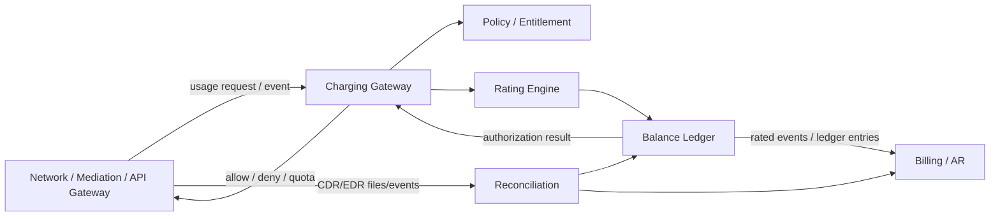
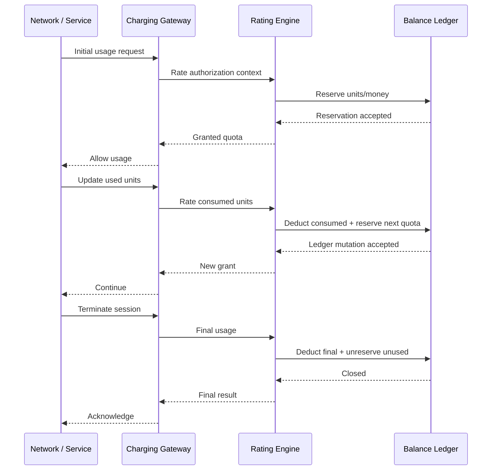
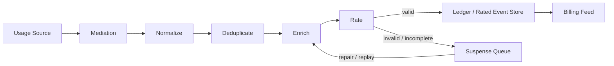
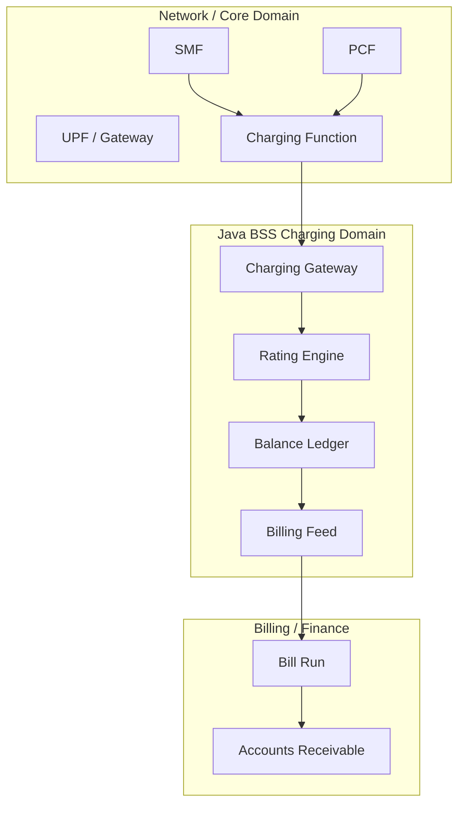
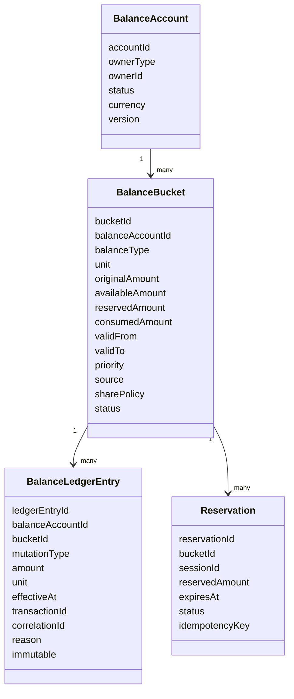
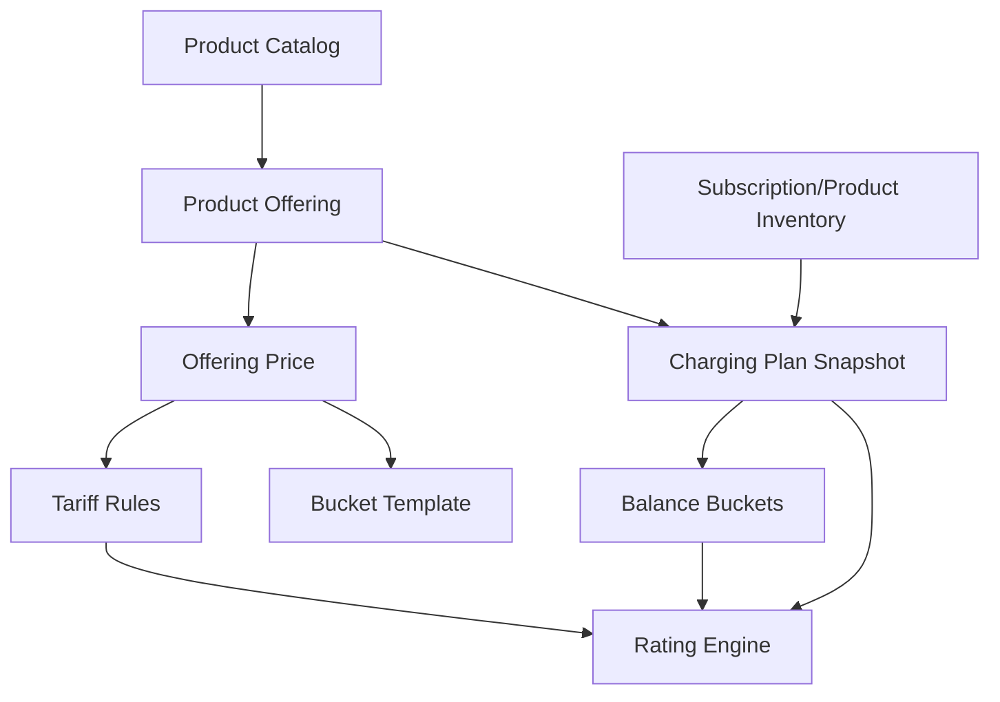
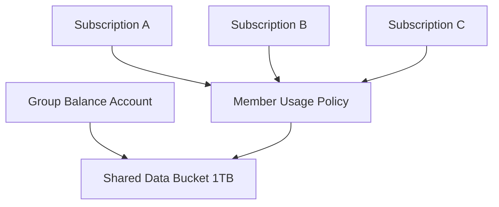
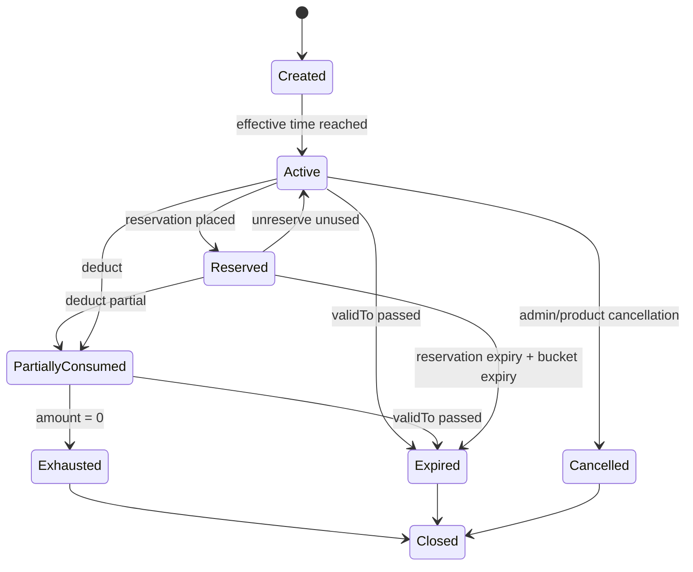
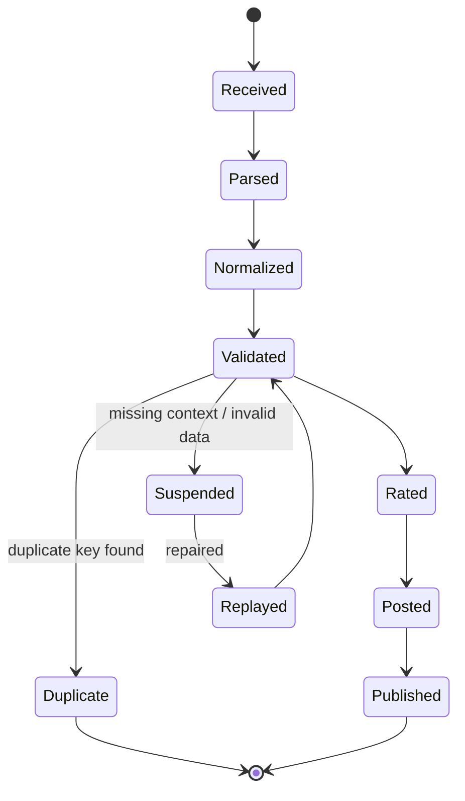

# Part 013 — Rating, Charging & Balance Management

## 1. Tujuan Part Ini

Part ini membahas **Rating, Charging & Balance Management**: bagian telco BSS yang mengubah pemakaian layanan menjadi konsekuensi finansial atau kuota.

Di sistem biasa, “billing” sering dipahami sebagai proses akhir bulan. Di telco, itu terlalu dangkal. Telco harus bisa menjawab pertanyaan monetization secara terus-menerus:

```text
Apakah customer boleh memakai layanan sekarang?
Berapa unit yang boleh dipakai sebelum perlu authorization berikutnya?
Bucket balance mana yang harus dikurangi?
Harga usage ini berapa menurut product, time band, zone, roaming, discount, quota, dan policy?
Apakah charging harus real-time, near-real-time, atau batch?
Apakah event usage sudah pernah diproses?
Jika network retry, apakah balance akan terpotong dua kali?
Jika session gagal terminate, kapan reservation dilepas?
Jika rating rule berubah, apakah usage masa lalu boleh di-rate ulang?
```

Part ini mengajarkan charging sebagai **financial control plane** untuk usage. Fokusnya bukan sekadar API, melainkan correctness model: ledger, reservation, idempotency, atomicity, reconciliation, audit, dan failure recovery.

Kita tidak akan mengulang detail Java concurrency, messaging, persistence, security, observability, atau error handling yang sudah dibahas di seri sebelumnya. Di sini semua itu dipakai sebagai prasyarat untuk membangun sistem charging carrier-grade.

---

## 2. Kaufman Skill Target

Target praktis part ini:

1. membedakan **rating**, **charging**, **billing**, **balance**, **wallet**, **quota**, **allowance**, dan **ledger**;
2. memahami online charging vs offline charging;
3. memahami prepaid, postpaid, hybrid, shared balance, sponsored usage, dan zero-rated usage;
4. mendesain model balance yang aman untuk money, data, voice, SMS, points, dan promotion bucket;
5. mendesain flow reserve, deduct, unreserve, rollback, refund, top-up, transfer, dan expiry;
6. memahami bagaimana product catalog, offer, subscription, policy, dan charging saling terhubung;
7. membuat boundary Java untuk charging gateway, rating engine, balance ledger, dan reconciliation;
8. mengenali failure mode yang menyebabkan revenue leakage atau overcharging.

Kriteria mampu:

```text
Diberikan product offering prepaid 20GB + unlimited app bundle + roaming add-on,
Anda bisa memodelkan balance bucket, rating rule, reservation flow,
idempotency key, expiry, reconciliation, dan state recovery.
```

---

## 3. Mental Model: Charging Adalah Decision + Ledger

Charging bukan hanya “kurangi pulsa”. Charging adalah kombinasi dua hal:

```text
1. decision: customer/session/request ini boleh memakai berapa banyak?
2. ledger: konsekuensi finansial/unit usage dicatat secara irreversible dan auditable.
```

Diagram sederhana:



Ada tiga prinsip yang harus melekat:

```text
Charging decision harus cepat.
Ledger mutation harus benar.
Audit trail harus lengkap.
```

Sistem charging yang cepat tapi salah akan menciptakan fraud, revenue leakage, atau regulatory dispute. Sistem charging yang benar tapi lambat akan merusak customer experience dan network session.

---

## 4. Vocabulary Inti

| Term | Makna Praktis | Trap Umum |
|---|---|---|
| Rating | Menghitung nilai charge dari event usage berdasarkan tariff/rule/context | Menganggap rating selalu uang; padahal bisa unit/quota/counter |
| Charging | Menerapkan hasil rating ke balance/account/ledger | Mencampur authorization dengan invoicing |
| Balance | State nilai yang bisa dikonsumsi, misalnya rupiah, MB, menit, SMS, point | Menyimpan hanya angka total tanpa bucket/provenance |
| Wallet | Container balance untuk account/subscription/group | Menjadikan wallet sebagai account receivable |
| Bucket | Satuan balance dengan type, validity, priority, source, expiry | Menggabungkan promo, purchased quota, rollover quota jadi satu angka |
| Allowance | Hak pakai berdasarkan offer/subscription | Menganggap allowance sama dengan sisa balance |
| Reservation | Hold sementara sebelum usage final | Lupa expiry dan unreserve |
| Deduction | Mutasi definitif terhadap bucket/ledger | Deduct langsung tanpa idempotency |
| Refund | Mutasi kompensasi positif karena koreksi | Mengubah ledger lama, bukan membuat entry baru |
| CDR/EDR | Call/Data/Event Detail Record | Menganggap semua CDR pasti unik dan urut |
| Rated Event | Usage event yang sudah diberi harga/unit impact | Tidak menyimpan rating context snapshot |
| OCS | Online Charging System | Menganggap OCS hanya prepaid pulsa |
| CHF | Charging Function pada 5G core context | Mengabaikan boundary antara network charging dan BSS billing |

Mental model yang sehat:

```text
Catalog menjelaskan apa yang dijual.
Subscription menjelaskan apa yang dimiliki customer.
Policy menjelaskan apa yang boleh dilakukan sekarang.
Rating menjelaskan berapa impact usage.
Charging menerapkan impact.
Balance ledger menyimpan konsekuensi.
Billing/invoice menyajikan receivable ke customer.
```

---

## 5. Online Charging vs Offline Charging

### 5.1 Online Charging

Online charging terjadi ketika network/service meminta authorization sebelum atau selama usage.

Contoh:

```text
prepaid data session
real-time quota control
premium API usage
roaming data authorization
voice call prepaid authorization
IoT metered session
```

Karakteristik:

```text
latency-sensitive
harus menjawab allow/deny/grant
sering memakai reservation
harus tahan retry dari network
harus aman terhadap double charging
harus punya timeout dan session cleanup
```

Flow sederhana:



### 5.2 Offline Charging

Offline charging memproses usage setelah terjadi.

Contoh:

```text
postpaid voice CDR
batch roaming CDR
wholesale settlement record
periodic IoT sensor usage
interconnect usage file
historical re-rating
```

Karakteristik:

```text
throughput-sensitive
batch/stream processing
tidak memberikan allow/deny real-time
harus kuat di deduplication
harus bisa suspense/reject/reprocess
harus punya reconciliation dengan source/network
```

Flow:



### 5.3 Hybrid

Banyak telco nyata hybrid:

```text
prepaid data memakai online charging
postpaid invoice memakai offline rated event
hybrid customer punya spending limit real-time tetapi invoice akhir bulan
enterprise shared pool memakai online control dan monthly reconciliation
roaming memakai near-real-time authorization dan delayed TAP/settlement file
```

Top 1% engineer tidak bertanya “online atau offline?” secara biner. Ia bertanya:

```text
Bagian mana perlu authorization real-time?
Bagian mana perlu settlement batch?
Bagian mana perlu customer-visible invoice?
Bagian mana perlu regulatory audit?
Bagian mana perlu reconciliation dengan network/source?
```

---

## 6. 3GPP Charging View, Tanpa Terjebak Implementasi Rendah

Untuk software engineer BSS/OSS, 3GPP charging penting sebagai reference model. Namun Anda tidak perlu memindahkan semua detail protocol ke domain model BSS.

Yang perlu dipahami:

```text
Network/service menghasilkan charging trigger.
Charging function menerima request/event charging.
Charging bisa online atau offline.
Charging record/event bisa diproses ke billing/settlement.
Charging architecture memisahkan capture, rating/charging, record generation, collection, dan billing integration.
```

Pada 5G, istilah seperti **CHF** dan charging service exposure muncul lebih dominan. Namun secara mental model BSS:

```text
network charging layer != billing domain
charging session != subscription lifecycle
charging record != invoice line
policy decision != financial ledger
```

Boundary yang sehat:



Tujuannya bukan menjadikan Java BSS sebagai network element. Tujuannya adalah membuat BSS mampu:

```text
menerima charging event/request secara aman
menggunakan customer/product/subscription context
menghasilkan decision dan ledger mutation
mempublikasikan output ke billing/revenue assurance/reconciliation
```

---

## 7. Balance Modeling

Balance yang buruk biasanya dimulai dari schema seperti ini:

```sql
customer_id | balance_amount
```

Itu tidak cukup untuk telco.

Balance harus menjawab:

```text
balance milik siapa?
jenis balance apa?
berasal dari top-up, bundle, promo, compensation, rollover, transfer, atau adjustment?
valid dari kapan sampai kapan?
boleh dipakai untuk service apa?
prioritas konsumsi bagaimana?
apakah shareable?
apakah refundable?
apakah sudah ada reservation aktif?
apakah terkait tax/accounting treatment tertentu?
```

### 7.1 Model Konseptual



### 7.2 Balance Types

Contoh balance:

| Type | Unit | Contoh |
|---|---:|---|
| monetary | currency minor unit | IDR cents/sen, USD cents |
| data | bytes atau MB | 20GB monthly package |
| voice | seconds | 300 minutes on-net |
| sms | count | 100 SMS bundle |
| points | count | loyalty reward |
| API quota | request count | 10k verification API calls |
| service credit | currency/unit | compensation credit |
| spending limit | currency | postpaid cap |

Gunakan unit internal deterministik:

```text
money: integer minor unit, bukan double
usage data: bytes, bukan string "GB"
voice: seconds atau milliseconds sesuai precision
quantity: integer/BigDecimal sesuai business need
```

Java rule:

```java
public record Money(long minorUnits, Currency currency) {
    public Money {
        Objects.requireNonNull(currency);
    }

    public Money plus(Money other) {
        requireSameCurrency(other);
        return new Money(Math.addExact(this.minorUnits, other.minorUnits), currency);
    }

    public Money minus(Money other) {
        requireSameCurrency(other);
        return new Money(Math.subtractExact(this.minorUnits, other.minorUnits), currency);
    }

    private void requireSameCurrency(Money other) {
        if (!currency.equals(other.currency)) {
            throw new IllegalArgumentException("currency mismatch");
        }
    }
}
```

Jangan gunakan `double` untuk money. Jangan gunakan display unit sebagai storage unit.

---

## 8. Balance Bucket Priority

Customer dapat memiliki beberapa bucket yang valid untuk usage yang sama.

Contoh:

```text
bucket A: promo 2GB, expires tonight, priority 10
bucket B: monthly 20GB, expires end of cycle, priority 20
bucket C: rollover 5GB, expires next week, priority 15
bucket D: pay-as-you-go money, no expiry, priority 99
```

Consumption rule harus eksplisit:

```text
consume bucket yang paling cepat expired dulu?
consume promo dulu?
consume purchased quota dulu?
consume bucket dengan restriction paling spesifik dulu?
consume shared group bucket setelah personal bucket habis?
```

Tidak ada “default natural”. Semuanya policy.

Pseudo-code:

```java
List<BalanceBucket> candidates = bucketRepository.findEligibleBuckets(
    owner,
    serviceType,
    usageContext,
    at
);

List<BalanceBucket> ordered = candidates.stream()
    .filter(BalanceBucket::hasAvailableAmount)
    .sorted(
        Comparator.comparing(BalanceBucket::priority)
            .thenComparing(BalanceBucket::validTo)
            .thenComparing(BalanceBucket::createdAt)
    )
    .toList();
```

Invariant:

```text
ordering rule harus versioned dan auditable.
```

Jika customer dispute “kenapa kuota promo saya belum habis tapi kuota utama terpotong?”, sistem harus dapat menjawab dengan rule version dan decision trace.

---

## 9. Reservation, Deduction, Unreserve, Rollback

### 9.1 Reservation

Reservation adalah hold sementara.

Digunakan untuk online charging:

```text
network meminta grant 100MB
charging reserve 100MB
customer memakai 73MB
final deduction 73MB
sisa 27MB di-unreserve
```

Invariants:

```text
reservedAmount <= availableAmount sebelum reservation
available = original - consumed - reserved - expired adjustment
reservation punya expiry
reservation idempotent terhadap request/session/sequence
reservation tidak boleh hilang saat node restart
reservation cleanup tidak boleh menghapus evidence
```

### 9.2 Deduction

Deduction adalah mutasi definitif.

Invariants:

```text
deduction harus punya usage event reference
deduction harus punya rating context/version
deduction harus idempotent
ledger entry immutable
balance projection dapat direbuild dari ledger
```

### 9.3 Unreserve

Unreserve mengembalikan reservation yang tidak terpakai.

Invariants:

```text
unreserve hanya terhadap reservation aktif/expired
unreserve tidak membuat available melebihi batas valid
unreserve harus idempotent
unreserve karena expiry harus bisa dibedakan dari unreserve karena session terminate
```

### 9.4 Rollback

Rollback bukan `DELETE ledger_entry`.

Rollback adalah compensating entry.

```text
original: DEDUCT -100MB, reason=usage event X
rollback: REFUND +100MB, reason=rollback of usage event X
```

Kenapa?

```text
financial audit perlu history
reconciliation perlu trace
customer dispute perlu evidence
regulatory audit tidak menerima history yang dimutasi diam-diam
```

---

## 10. Idempotency Model

Charging menerima retry dari network, mediation, API gateway, message broker, dan batch job. Tanpa idempotency, revenue damage cepat terjadi.

Gunakan multi-layer idempotency:

| Layer | Key | Tujuan |
|---|---|---|
| API request | idempotency key | Retry client tidak memicu double mutation |
| Session | session id + sequence | Online charging update tidak lompat/duplikat |
| Usage event | source system + event id | Offline CDR/EDR tidak double charge |
| Ledger transaction | transaction id | Mutation balance exactly-once secara logical |
| Billing feed | rated event id | Invoice tidak double line |

Contoh command:

```java
public record DeductBalanceCommand(
    String transactionId,
    String idempotencyKey,
    String balanceAccountId,
    String usageEventId,
    String ratingDecisionId,
    List<BucketDeduction> deductions,
    Instant effectiveAt,
    String reason
) {}
```

Database constraints:

```sql
create unique index uq_balance_txn
on balance_ledger_entry(transaction_id);

create unique index uq_usage_event_rating
on rated_usage_event(source_system, source_event_id, rating_version);

create unique index uq_reservation_request
on balance_reservation(idempotency_key);
```

Pola penting:

```text
Idempotency key harus berasal dari business event/request identity,
bukan UUID random yang dibuat ulang setiap retry.
```

---

## 11. Rating Engine

Rating engine menghitung impact usage.

Input rating biasanya:

```text
subscription id
product offering/version
service type
event type
usage quantity
usage time
origin/destination
zone/roaming context
network type
customer segment
bucket context
promotion context
tax context jika rating termasuk tax-aware
```

Output rating:

```text
rated amount/unit
candidate bucket policy
charge type
rating rule version
discount/promotion applied
reason trace
whether authorization is allowed
whether fallback PAYG applies
```

### 11.1 Rating Pipeline

```mermaid
flowchart LR
    Input[Usage Request/Event]
    Normalize[Normalize Units]
    Validate[Validate Required Fields]
    Enrich[Enrich Context]
    Resolve[Resolve Product & Tariff]
    Rate[Apply Rating Rules]
    Discount[Apply Discount/Promotion]
    Allocate[Allocate to Buckets]
    Decision[Decision Trace]

    Input --> Normalize --> Validate --> Enrich --> Resolve --> Rate --> Discount --> Allocate --> Decision
```



### 11.2 Rating Rule Versioning

Rating rule harus versioned karena usage masa lalu harus di-rate dengan rule yang berlaku saat itu.

```text
rule_id: DATA_LOCAL_STANDARD
version: 2026-06-01T00:00:00Z
valid_from: 2026-06-01
valid_to: 2026-06-30
unit: MB
price: 100 IDR / MB
rounding: CEIL_TO_1MB
```

Anti-pattern:

```text
update row tariff in-place lalu re-rate historical usage tanpa tahu versi lama.
```

Correct model:

```text
tariff rules append-only atau versioned
rating decision menyimpan rule version
rated event menyimpan calculation snapshot minimal
```

---

## 12. Catalog-to-Charging Mapping

Product catalog menjelaskan commercial product. Charging perlu runtime rule.

Mapping:

```text
ProductOffering -> ChargingPlan
ProductOfferingPrice -> TariffRule / RecurringCharge / OneTimeCharge / UsageCharge
ProductSpecificationCharacteristic -> RatingDimension
ProductInventory/Subscription -> ActiveEntitlement
Allowance -> BalanceBucketTemplate
Promotion -> DiscountRule / FreeUnitRule / ZeroRatingRule
```

Diagram:



Important invariant:

```text
Charging tidak boleh selalu lookup catalog live untuk historical event.
Charging harus memakai snapshot/rule version yang sesuai entitlement effective time.
```

Kenapa?

```text
catalog bisa berubah
price bisa retired
bundle bisa diganti
promotion bisa berakhir
customer dispute perlu melihat rule saat event terjadi
```

---

## 13. Prepaid, Postpaid, Hybrid

### 13.1 Prepaid

Prepaid membutuhkan balance sebelum usage.

Invariants:

```text
usage tidak boleh melampaui grant kecuali policy mengizinkan overdraft
reservation expiry harus jelas
zero balance harus deny atau fallback sesuai policy
recharge harus atomic dan auditable
expiry harus diproses deterministik
```

### 13.2 Postpaid

Postpaid tidak selalu membutuhkan prepaid balance, tetapi tetap bisa punya:

```text
spending limit
credit limit
fair usage policy
allowance bucket
roaming cap
enterprise usage pool
```

Postpaid charging sering menghasilkan rated event untuk billing.

```text
usage event -> rating -> rated event -> billing run -> invoice -> AR
```

### 13.3 Hybrid

Hybrid paling rawan salah.

Contoh:

```text
customer postpaid punya included 50GB allowance
setelah 50GB, PAYG sampai spending limit
roaming harus real-time cap
top-up data booster bisa dibeli prepaid di atas postpaid plan
```

Model sehat:

```text
entitlement menentukan layanan aktif
balance bucket menentukan allowance/top-up
credit/spending limit menentukan exposure control
billing menentukan invoice/AR
```

Jangan pakai satu flag `is_prepaid` untuk seluruh behavior.

---

## 14. Shared Balance dan Group Quota

Telco sering memiliki family plan, enterprise pool, IoT fleet, atau shared data pool.

Problem:

```text
ribuan subscriber mengonsumsi quota yang sama
real-time session paralel
race condition reservation
dead bucket karena reservation leak
per-user limit di atas group pool
audit siapa mengonsumsi apa
```

Model:



Invariants:

```text
shared bucket mutation harus atomic
member-level consumption harus dicatat
member cap dan group cap harus dievaluasi bersama
reservation harus mengikat member/session, bukan hanya group
```

Database strategy:

```text
optimistic lock per bucket untuk moderate concurrency
partitioned bucket untuk high-volume IoT fleet
pre-allocated quota shard untuk ultra-high throughput
ledger append-only untuk audit
projection async untuk reporting
```

Trade-off:

```text
single shared row = simple but contention tinggi
sharded quota = scalable but reconciliation lebih kompleks
local grant cache = fast but overrun risk
```

---

## 15. Rounding, Unit Conversion, dan Threshold

Charging sering rusak bukan karena arsitektur besar, tetapi karena detail kecil.

Contoh:

```text
1.1MB rounded to 2MB?
61 seconds rounded to 2 minutes?
time band local timezone atau UTC?
roaming zone berdasarkan visited network atau country?
free first 10 seconds berlaku per call atau per day?
quota consumed per packet, per session, atau per rating interval?
```

Rule harus explicit:

```java
public enum RoundingModePolicy {
    EXACT,
    CEIL_TO_UNIT,
    FLOOR_TO_UNIT,
    ROUND_HALF_UP_TO_UNIT
}

public record RatingUnitPolicy(
    String unit,
    long quantum,
    RoundingModePolicy roundingMode
) {}
```

Anti-pattern:

```text
menggunakan BigDecimal default tanpa rounding policy eksplisit
menggunakan timezone server untuk event charging
menggunakan unit display sebagai unit calculation
mengubah rounding rule tanpa versioning
```

---

## 16. Expiry dan Lifecycle Bucket

Balance bucket punya lifecycle:

```text
created -> active -> reserved/partially consumed -> exhausted/expired/cancelled/closed
```

Diagram:



Expiry bukan sekadar batch delete.

Expiry harus menghasilkan ledger effect atau lifecycle event:

```text
BUCKET_EXPIRED
RESERVATION_EXPIRED
EXPIRED_BALANCE_WRITEOFF
CUSTOMER_NOTIFICATION_ELIGIBLE
```

Kenapa?

```text
customer care perlu tahu kenapa quota hilang
revenue assurance perlu menghitung expired liability
billing mungkin perlu menampilkan expired promo/credit
regulator bisa meminta evidence
```

---

## 17. Charging Gateway Boundary

Charging Gateway adalah adapter antara external charging request/event dan internal charging domain.

Tanggung jawab:

```text
protocol adaptation
authentication/authorization caller
request normalization
idempotency envelope
rate limiting
correlation id propagation
schema validation
mapping network/service identifiers ke subscription/customer context
response contract
```

Bukan tanggung jawab Charging Gateway:

```text
menyimpan balance utama
menyimpan tariff rule utama
mengambil keputusan rating kompleks sendiri
mengubah invoice
melakukan manual adjustment tanpa audit
```

Boundary Java:

```java
public interface ChargingUseCase {
    ChargingAuthorization authorize(AuthorizeUsageCommand command);
    ChargingAuthorization update(UpdateUsageCommand command);
    ChargingClosure terminate(TerminateUsageCommand command);
    RatedEvent chargeOffline(OfflineUsageEvent event);
}
```

Gateway boleh banyak:

```text
5G charging adapter
legacy OCS adapter
mediation file adapter
API usage metering adapter
partner wholesale adapter
internal microservice usage adapter
```

Core charging domain harus tetap stabil.

---

## 18. Balance Ledger Boundary

Balance Ledger adalah source of truth untuk balance mutation.

Tanggung jawab:

```text
reserve
deduct
unreserve
refund
adjust
top-up
transfer
expire
project current balance
provide immutable ledger history
```

Prinsip:

```text
all mutation command produces ledger entries
ledger entries immutable
current balance is projection
projection can be rebuilt
command idempotency enforced before mutation
```

Pseudo-code:

```java
@Transactional
public DeductionResult deduct(DeductBalanceCommand command) {
    IdempotencyRecord existing = idempotencyRepository.find(command.idempotencyKey());
    if (existing != null) {
        return existing.resultAs(DeductionResult.class);
    }

    BalanceAccount account = balanceRepository.lockAccount(command.balanceAccountId());

    DeductionPlan plan = deductionPlanner.plan(account, command.deductions());
    account.apply(plan);

    ledgerRepository.appendAll(plan.ledgerEntries(command.transactionId()));
    balanceRepository.save(account);

    DeductionResult result = DeductionResult.from(plan);
    idempotencyRepository.save(command.idempotencyKey(), result);
    domainEvents.publish(result.events());

    return result;
}
```

Lock strategy tergantung throughput:

```text
low/moderate volume: pessimistic lock balance account/bucket
moderate/high: optimistic lock per bucket
high-volume online: reservation partitions + async reconciliation
ultra-high: specialized OCS/ledger store with carefully bounded consistency
```

---

## 19. Offline Charging Pipeline

Offline charging perlu pipeline yang repairable.

Stages:

```text
ingest
parse
normalize
validate
deduplicate
enrich
rate
charge/post
publish billing feed
reconcile
archive
```

Setiap stage harus punya status:

```text
RECEIVED
PARSED
NORMALIZED
VALIDATED
DUPLICATE
SUSPENDED
RATED
POSTED
REJECTED
REPLAYED
```

Mermaid:



Suspense queue harus menyimpan:

```text
raw record
normalized record
error code
missing field/context
source file/batch
line offset/message offset
repair action
replay count
operator/user id jika manual repair
```

Anti-pattern:

```text
failed CDR masuk log saja lalu hilang
batch job retry seluruh file tanpa dedup
manual update database untuk membetulkan CDR
rating ulang tanpa preserving original decision
```

---

## 20. Re-rating

Re-rating terjadi ketika usage perlu dihitung ulang.

Penyebab:

```text
tariff salah
catalog misconfiguration
customer plan migration salah effective date
roaming zone mapping salah
late discount/promotion applied
regulatory correction
batch mediation duplicate/missing
```

Rules:

```text
re-rating harus menghasilkan delta, bukan rewrite diam-diam
original rated event tetap ada
new rated event/version punya linkage ke original
financial impact diposting sebagai adjustment/credit/debit
customer-visible correction harus masuk billing policy
```

Model:

```text
original rated event: usage X -> charge 1000
re-rated event: usage X -> charge 700
adjustment: -300 credit
```

Jangan mengganti invoice lama jika sudah issued. Masuk ke Part 014: invoice setelah issued adalah financial/legal document dan correction dilakukan melalui adjustment/credit note sesuai policy.

---

## 21. Event Contract

Charging event harus mengandung data cukup untuk decision dan audit.

Contoh normalized usage event:

```json
{
  "eventId": "net-usage-20260629-000123",
  "sourceSystem": "mobile-core-mediation",
  "eventType": "DATA_USAGE",
  "subscriptionId": "sub-123",
  "serviceId": "svc-456",
  "resourceId": "msisdn-62812xxxx",
  "usageQuantity": {
    "amount": 104857600,
    "unit": "BYTES"
  },
  "startedAt": "2026-06-29T10:00:00Z",
  "endedAt": "2026-06-29T10:03:00Z",
  "networkContext": {
    "accessType": "5G",
    "roaming": false,
    "zone": "LOCAL"
  },
  "correlationId": "corr-abc",
  "sequence": 42
}
```

Minimum requirement:

```text
stable event id
source system
event type
usage quantity + unit
time interval/effective time
subscriber/subscription/service/resource identity
context dimensions needed for rating
correlation id
```

---

## 22. Java Aggregate Design

### 22.1 BalanceAccount Aggregate

BalanceAccount aggregate menjaga mutation correctness.

```java
public final class BalanceAccount {
    private final BalanceAccountId id;
    private final List<BalanceBucket> buckets;
    private long version;

    public DeductionPlan reserve(ReservationRequest request, BucketSelectionPolicy policy) {
        List<BalanceBucket> selected = policy.selectEligibleBuckets(buckets, request.context());
        return ReservationPlanner.plan(selected, request.amount(), request.expiresAt());
    }

    public DeductionPlan deduct(DeductionRequest request) {
        // validate reservation or direct deduction policy
        // create immutable ledger entries
        // mutate projection only after ledger plan accepted
        throw new UnsupportedOperationException("example only");
    }
}
```

### 22.2 RatedUsageEvent

Rated usage event adalah output rating yang bisa masuk billing/reconciliation.

```java
public record RatedUsageEvent(
    String ratedEventId,
    String sourceEventId,
    String subscriptionId,
    String accountId,
    UsageQuantity usageQuantity,
    Money chargeAmount,
    String ratingRuleVersion,
    List<AppliedChargeComponent> components,
    Instant ratedAt,
    Instant usageStartedAt,
    Instant usageEndedAt
) {}
```

### 22.3 Domain Events

```text
BalanceReserved
BalanceDeducted
BalanceUnreserved
BalanceExpired
BalanceAdjusted
UsageRated
ChargingDenied
ChargingSuspended
RatedEventPublished
```

Events harus dipakai untuk integration, bukan sebagai pengganti ledger.

---

## 23. Consistency Model

Charging tidak selalu bisa strongly consistent end-to-end.

Pilih consistency per boundary:

| Boundary | Consistency | Reason |
|---|---|---|
| Balance mutation | Strong logical consistency | Mencegah overcharging/double spending |
| Usage event ingestion | At-least-once + dedup | Source/network retry umum |
| Billing feed | Eventually consistent | Invoice batch bisa menunggu feed final |
| Reconciliation | Eventually consistent | Membandingkan source vs target setelah window tertentu |
| Customer balance display | Near-real-time projection | UI boleh sedikit delay, tapi harus jelas timestamp |
| Network authorization | Low-latency bounded decision | Harus cepat meski data tidak sempurna |

Trade-off penting:

```text
Anda boleh eventual consistent untuk reporting.
Anda tidak boleh eventual consistent secara sembrono untuk deduct balance yang sama.
```

---

## 24. Failure Modes

| Failure | Dampak | Control |
|---|---|---|
| Network retry initial request | double reservation | idempotency key |
| Update request out of order | over/under charge | session sequence validation |
| Terminate lost | reservation leak | reservation expiry job |
| CDR duplicate | double billing | source event unique key |
| Tariff updated in-place | historical dispute | rule versioning |
| Bucket expiry job late | customer gets free usage or loses valid quota | effective-time evaluation + expiry event |
| Balance projection corrupt | wrong displayed balance | rebuild from ledger |
| Manual DB update | audit failure | adjustment workflow |
| Concurrent shared quota usage | overspend | atomic bucket mutation/sharding strategy |
| Billing feed duplicate | double invoice line | rated event idempotency |

---

## 25. Observability Khusus Charging

Metrics yang harus ada:

```text
charging_authorization_latency
charging_authorization_denied_total
balance_reservation_active_count
balance_reservation_expired_total
balance_deduction_total_by_type
rating_failure_total_by_error_code
offline_usage_suspended_total
usage_duplicate_detected_total
rated_event_published_total
billing_feed_lag_seconds
balance_reconciliation_difference_total
```

Logs harus memuat:

```text
correlationId
subscriptionId/accountId hash atau masked
sourceEventId
idempotencyKey
ratingRuleVersion
ledgerTransactionId
reservationId
bucketIds
reasonCode
```

Trace span:

```text
charging.authorize
rating.resolve_tariff
balance.reserve
balance.deduct
billing_feed.publish
```

Operational alert:

```text
suspended CDR spike
reservation leak spike
deduction duplicate rejection spike
billing feed lag
rating rule not found
negative balance invariant violation
reconciliation mismatch over threshold
```

---

## 26. Security dan Fraud Considerations

Charging adalah high-risk financial domain.

Controls:

```text
caller authentication for charging APIs
strict authorization by source system/service
request signing for partner usage event
replay protection
rate limiting per source
immutable audit ledger
maker-checker for manual adjustment
segregation of duties for tariff rule deployment
PII masking in logs
fraud anomaly feed
```

Fraud scenarios:

```text
forged usage event to drain competitor/customer balance
replay old recharge transaction
manual adjustment abuse
overly broad zero-rating rule
partner API under-reporting usage
roaming record manipulation
```

---

## 27. Anti-Patterns

### 27.1 Balance as Mutable Number

```text
customer.balance = customer.balance - usage
```

Masalah:

```text
tidak ada bucket
tidak ada ledger
tidak ada replay/rebuild
tidak ada audit
race condition
```

### 27.2 Rating Rule Lookup Live Catalog Only

Masalah:

```text
historical usage berubah hasil setelah catalog update
dispute tidak bisa dijelaskan
re-rating tidak terkendali
```

### 27.3 Delete Reservation on Timeout

Masalah:

```text
hilang evidence
sulit audit
session final update bisa datang terlambat
```

Gunakan status `EXPIRED` dan ledger/operational event.

### 27.4 Manual Fix by SQL

Masalah:

```text
balance projection dan ledger berbeda
audit rusak
reconciliation tidak mungkin benar
```

Gunakan adjustment command.

### 27.5 One Pipeline for All Usage

Batch CDR, real-time authorization, partner event, and API usage metering punya latency dan correctness berbeda. Jangan paksa semua ke satu flow synchronous yang sama.

---

## 28. Practice: Design Mini Charging System

Desain untuk product:

```text
Prepaid Data 20GB / 30 days
Bonus app quota 5GB / 7 days
PAYG fallback using monetary balance
Data session grant: 100MB per authorization
Reservation expiry: 10 minutes
```

Deliverables:

1. bucket model;
2. rating rule;
3. reservation sequence;
4. deduction/unreserve flow;
5. idempotency keys;
6. database unique constraints;
7. expiry job behavior;
8. reconciliation query;
9. customer balance display model;
10. failure handling for lost terminate.

Expected mental solution:

```text
personal app quota bucket first if destination/app matches
monthly data bucket second
monetary PAYG bucket last if policy allows
reservation by sessionId + request sequence
ledger append for reservation/deduction/unreserve
expiry marks reservation expired, not delete
projection can be rebuilt from ledger
billing feed receives rated events, not raw balance rows
```

---

## 29. Self-Correction Checklist

Sebelum menganggap desain charging Anda layak produksi, jawab:

```text
Apakah money memakai integer minor unit atau BigDecimal dengan policy eksplisit?
Apakah setiap mutation menghasilkan ledger entry immutable?
Apakah current balance bisa direbuild?
Apakah bucket punya validity, source, priority, unit, and restriction?
Apakah idempotency key stabil lintas retry?
Apakah online session punya sequence handling?
Apakah reservation punya expiry dan audit status?
Apakah rating rule version disimpan di rated event?
Apakah duplicate CDR bisa dideteksi?
Apakah suspended CDR bisa diperbaiki dan replay?
Apakah invoice menggunakan rated event idempotent?
Apakah re-rating menghasilkan delta/adjustment?
Apakah manual adjustment punya maker-checker?
Apakah logs tidak membocorkan PII?
Apakah reconciliation bisa membandingkan source usage vs rated/posted usage?
```

Jika jawaban banyak “belum”, sistem charging belum carrier-grade.

---

## 30. Ringkasan

Charging adalah salah satu domain paling sensitif di telco.

Mental model utama:

```text
Rating menghitung impact.
Charging menerapkan impact.
Balance menyimpan hak/unit/money yang dapat dikonsumsi.
Ledger menyimpan kebenaran auditable.
Billing menyajikan konsekuensi finansial ke customer.
```

Untuk menjadi engineer kuat di BSS/OSS:

```text
jangan desain charging sebagai CRUD balance
jangan desain invoice sebelum memahami rated event
jangan percaya network event datang tepat sekali
jangan update tariff tanpa versioning
jangan membuang reservation expired
jangan menghapus correction history
```

Part berikutnya membahas **Billing, Invoicing, Payment & Collection**: bagaimana rated event, recurring charge, one-time charge, tax, adjustment, payment, collection, dan account receivable menjadi financial lifecycle yang bisa diaudit.
