# Part 014 — Billing, Invoicing, Payment & Collection

## 1. Tujuan Part Ini

Part ini membahas **Billing, Invoicing, Payment & Collection**: domain yang mengubah product/subscription/usage/charge menjadi dokumen finansial, receivable, pembayaran, aging, dunning, dispute, dan collection action.

Di telco, billing bukan sekadar generate PDF. Billing adalah sistem financial lifecycle yang harus menjawab:

```text
Customer/account mana yang masuk bill cycle ini?
Recurring charge apa yang harus dibebankan?
Usage charge apa yang sudah rated dan layak masuk invoice?
Apakah ada one-time charge, discount, tax, adjustment, credit, debit, refund?
Apakah invoice sudah issued dan immutable?
Pembayaran ini dialokasikan ke invoice/charge mana?
Apakah customer overdue?
Apakah dunning harus mengirim reminder, late fee, suspension, atau collection?
Apakah correction dilakukan sebagai adjustment/credit note, bukan edit invoice lama?
Apakah revenue/account receivable bisa direkonsiliasi?
```

Part ini mengajarkan billing sebagai **financial state machine**, bukan report generator.

---

## 2. Kaufman Skill Target

Target praktis part ini:

1. membedakan billing account, customer account, service account, financial account, invoice, bill, AR, dan payment;
2. memahami bill cycle, bill run, invoice issuance, due date, aging, dan dunning;
3. mendesain recurring charge, one-time charge, usage charge, discount, tax, and adjustment pipeline;
4. memahami invoice immutability dan correction via adjustment/credit/debit;
5. mendesain payment allocation, overpayment, underpayment, suspense payment, refund, reversal, and chargeback;
6. memahami collection lifecycle dan service-impacting action seperti suspension;
7. membuat Java component boundary untuk billing engine, invoice service, payment service, and collection service;
8. menghindari anti-pattern billing yang menyebabkan dispute dan revenue leakage.

Kriteria mampu:

```text
Diberikan customer postpaid dengan monthly recurring fee, prorated activation,
usage charge, discount, tax, late payment, partial payment, dan dispute,
Anda bisa menjelaskan ledger/invoice/payment/collection lifecycle tanpa update data finansial diam-diam.
```

---

## 3. Mental Model: Billing Adalah Financial Lifecycle

Billing mengubah operational truth menjadi financial truth.

Operational truth:

```text
customer membeli product
subscription aktif
usage terjadi
charging/rating menghasilkan rated event
field install selesai
adjustment disetujui
```

Financial truth:

```text
charge dibebankan
invoice diterbitkan
receivable terbentuk
payment diterima
payment dialokasikan
outstanding dihitung
collection action dipicu
revenue/AR direkonsiliasi
```

Diagram:

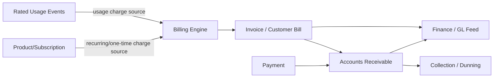

Billing domain harus menjaga boundary:

```text
invoice bukan shopping cart
invoice bukan product order
invoice bukan usage event mentah
invoice bukan customer profile
invoice adalah financial document hasil dari charge calculation dan issuance policy
```

---

## 4. Vocabulary Inti

| Term | Makna Praktis | Trap Umum |
|---|---|---|
| Billing Account | Account yang menerima bill/invoice dan menyimpan financial responsibility | Disamakan dengan customer identity |
| Bill Cycle | Periode billing berulang, misalnya monthly tanggal 1 atau anniversary date | Menganggap semua customer punya cycle sama |
| Bill Run | Execution proses billing untuk cohort account/cycle | Tidak punya status dan replay control |
| Invoice / Customer Bill | Dokumen tagihan customer yang sudah disusun/issued | Diedit setelah dikirim |
| Invoice Line | Baris charge/discount/tax/adjustment | Tidak trace ke source charge |
| Recurring Charge | Charge periodik, misalnya monthly subscription fee | Salah prorate saat activation/termination |
| One-Time Charge | Charge sekali, misalnya installation fee | Dibebankan dua kali karena order retry |
| Usage Charge | Charge dari rated usage event | Memakai raw CDR langsung di invoice |
| Adjustment | Koreksi credit/debit | Update invoice lama secara diam-diam |
| AR | Accounts Receivable; piutang yang harus dibayar | Dianggap sama dengan invoice PDF |
| Payment Allocation | Proses mengaitkan payment ke invoice/charge | Mengurangi outstanding tanpa allocation evidence |
| Dunning | Reminder/escalation karena overdue | Langsung suspend tanpa grace/escalation policy |
| Collection | Aktivitas penagihan lanjutan | Tidak terkait service lifecycle/fallout |
| Credit Note | Dokumen koreksi mengurangi receivable | Menghapus line invoice lama |

---

## 5. Billing Account Model

Billing account memisahkan siapa customer dari siapa yang membayar.

Contoh:

```text
Individual customer punya satu billing account.
Family plan punya satu payer dan beberapa subscription.
Enterprise punya parent billing account dan child department accounts.
MVNO partner punya settlement account.
Government account punya purchase order dan tax exemption.
```

Model konseptual:

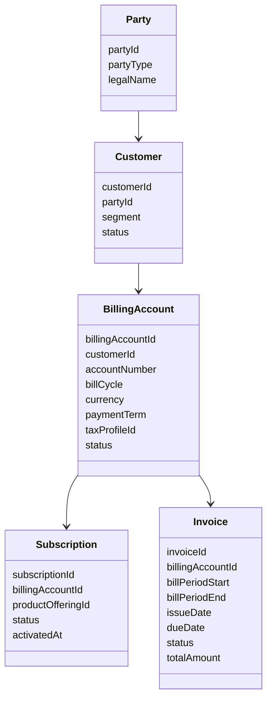

Invariants:

```text
billing account punya currency dan payment term eksplisit
subscription harus tahu billing account effective pada periode charge
invoice harus terkait billing account, bukan hanya customer
perubahan billing account untuk subscription harus effective-dated
```

---

## 6. Bill Cycle dan Bill Run

### 6.1 Bill Cycle

Bill cycle menentukan kapan customer ditagih.

Contoh:

```text
calendar month: 1-31
anniversary: activation date to next month same day
corporate cycle: 21st to 20th
weekly prepaid statement
custom partner settlement period
```

Bill cycle harus punya timezone policy.

```text
bill period boundary harus deterministik
usage cutoff harus jelas
late arriving event policy harus jelas
```

### 6.2 Bill Run

Bill run adalah execution instance.

State machine:

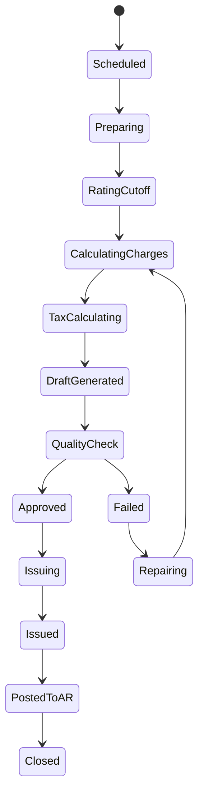

Bill run harus menyimpan:

```text
billRunId
cycle id
period start/end
account cohort criteria
input snapshot watermark
rated event cutoff
configuration version
tax rule version
status
failure reason
operator approval evidence jika manual gate
```

Anti-pattern:

```text
cron job generate invoice tanpa billRun entity.
```

Tanpa billRun, Anda tidak bisa menjawab:

```text
invoice ini berasal dari execution mana?
input cutoff-nya apa?
rule version-nya apa?
kenapa account X tidak tertagih?
apakah rerun aman?
```

---

## 7. Charge Types

Billing engine menggabungkan beberapa sumber charge.

### 7.1 Recurring Charge

Contoh:

```text
monthly plan fee
enterprise seat fee
leased line monthly rental
SaaS add-on subscription fee
```

Pertanyaan penting:

```text
charge in advance atau arrears?
proration saat activation di tengah cycle?
proration saat termination?
suspend dikenakan charge penuh, partial, atau zero?
renewal/change plan efektif kapan?
```

### 7.2 One-Time Charge

Contoh:

```text
activation fee
installation fee
SIM replacement fee
device delivery fee
penalty fee
```

Control:

```text
source order id
idempotency key
charge eligibility
waiver approval
billing account effective date
```

### 7.3 Usage Charge

Usage charge berasal dari rated event.

Rules:

```text
invoice tidak boleh rating raw CDR tanpa trace
invoice line harus reference rated event/rating batch
late usage policy harus jelas
rated event duplicate harus ditolak
```

### 7.4 Discount

Discount bisa:

```text
line-level
invoice-level
subscription-level
account-level
contract-level
campaign-level
```

Invariants:

```text
discount rule version harus tersimpan
discount eligibility effective-dated
discount stacking/priority harus eksplisit
```

### 7.5 Tax

Tax sering domain eksternal atau finance-managed.

Minimum model:

```text
tax jurisdiction
tax category
tax rate/version
taxable amount
tax exemption evidence
tax rounding policy
```

Jangan hardcode tax di billing service.

---

## 8. Billing Pipeline

Pipeline konseptual:

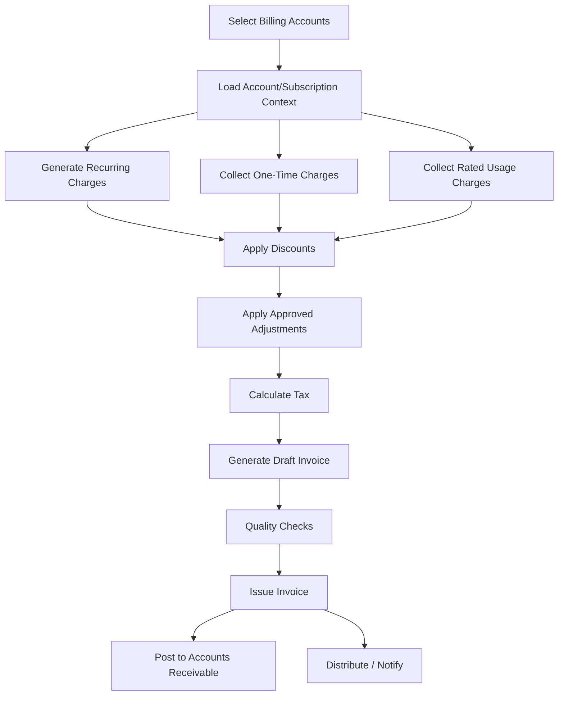

Quality checks:

```text
negative invoice policy
zero invoice policy
abnormal amount vs previous cycles
missing tax
missing rated usage watermark
duplicate charge source
account status invalid
customer in dispute/hold
manual approval threshold
```

---

## 9. Proration

Proration adalah sumber dispute besar.

Contoh:

```text
monthly fee 300,000 IDR
activation 2026-06-11
bill period 2026-06-01 to 2026-06-30
charge active from 2026-06-11 to 2026-06-30
```

Pertanyaan:

```text
inclusive/exclusive boundary?
calendar day count atau fixed 30-day basis?
timezone apa?
partial day dihitung penuh atau per second?
rounding ke rupiah kapan?
```

Model rule:

```java
public record ProrationPolicy(
    String policyId,
    String basis,              // CALENDAR_DAYS, FIXED_30, SECONDS
    boolean chargeActivationDay,
    boolean chargeTerminationDay,
    RoundingPolicy roundingPolicy,
    String version
) {}
```

Anti-pattern:

```text
proration logic tersebar di SQL report, invoice PDF generator, dan customer care tool.
```

Correct pattern:

```text
single charge calculation service
versioned proration policy
calculation trace attached to invoice line
```

---

## 10. Invoice Lifecycle dan Immutability

Invoice lifecycle:

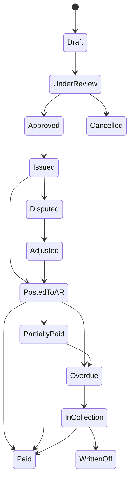

Rule penting:

```text
Draft boleh berubah.
Issued tidak boleh diubah diam-diam.
Correction setelah issued dilakukan melalui adjustment/credit/debit document.
Payment tidak mengubah isi invoice; payment mengubah outstanding/AR allocation.
```

Kenapa invoice immutable?

```text
customer sudah menerima dokumen
tax/finance sudah bisa memakai dokumen
audit butuh evidence
regulatory dispute butuh original state
payment allocation mengacu pada invoice amount
```

Jika perlu membetulkan invoice issued:

```text
create adjustment
create credit note/debit note if required
apply to AR
show correction in next bill atau separate document
keep original invoice intact
```

---

## 11. Invoice Line Traceability

Invoice line harus punya trace ke source.

Contoh line:

```json
{
  "invoiceLineId": "line-123",
  "invoiceId": "inv-456",
  "lineType": "USAGE_CHARGE",
  "description": "Mobile data usage",
  "amount": { "minorUnits": 250000, "currency": "IDR" },
  "taxAmount": { "minorUnits": 27500, "currency": "IDR" },
  "periodStart": "2026-06-01T00:00:00+07:00",
  "periodEnd": "2026-06-30T23:59:59+07:00",
  "sourceType": "RATED_USAGE_BATCH",
  "sourceId": "batch-202606-mobile-data-01",
  "ruleVersion": "tariff-data-2026-06-v3",
  "calculationTraceId": "calc-789"
}
```

Minimum:

```text
line type
amount
currency
period/effective time
source type/id
rule version
tax treatment
calculation trace
```

Tanpa trace, customer care tidak bisa menjawab dispute.

---

## 12. Adjustment Model

Adjustment adalah koreksi finansial.

Jenis:

```text
goodwill credit
billing error credit
usage correction debit
late fee waiver
tax correction
manual compensation
service outage credit
```

Workflow:

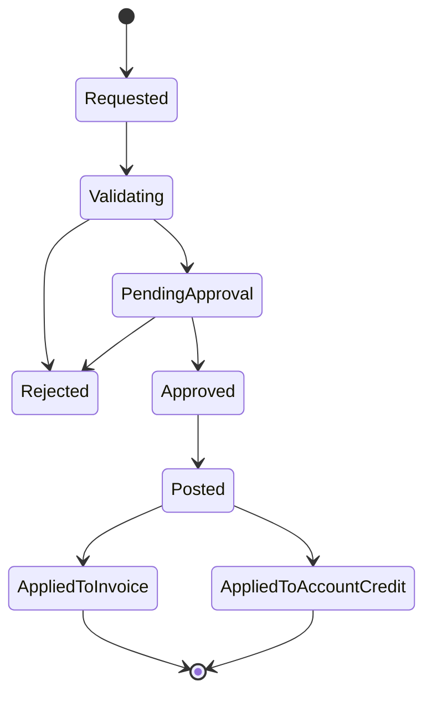

Controls:

```text
reason code
amount limit
maker-checker approval
source dispute/ticket/order
tax handling
posting period
audit log
segregation of duties
```

Anti-pattern:

```text
CS agent edit invoice total.
```

Correct:

```text
CS agent requests adjustment.
Approver approves.
Billing posts adjustment as ledger/AR event.
Invoice/customer bill reflects adjustment according to policy.
```

---

## 13. Payment Lifecycle

Payment bukan sekadar “set invoice paid”.

Lifecycle:

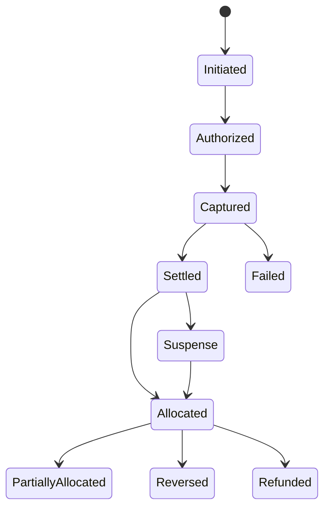

Payment data:

```text
payment id
external reference
payment method
payer
amount/currency
received at
settled at
status
gateway/acquirer response
billing account
allocation records
reversal/refund links
```

### 13.1 Allocation

Payment allocation menentukan payment mengurangi outstanding mana.

Policy:

```text
oldest invoice first
specific invoice reference
oldest overdue first
late fee first or principal first
tax first or charge first
manual allocation for enterprise
proportional allocation
```

Allocation record:

```text
payment_id
invoice_id
invoice_line_id optional
allocated_amount
allocated_at
allocation_policy
operator_id optional
```

Jangan hanya mengurangi `invoice.outstanding_amount` tanpa allocation history.

### 13.2 Overpayment dan Suspense

Overpayment:

```text
payment amount > outstanding amount
```

Possible actions:

```text
hold as account credit
refund
allocate to next invoice
manual review
```

Suspense payment:

```text
payment diterima tetapi tidak bisa dicocokkan ke account/invoice
```

Suspense harus punya workflow repair.

---

## 14. Collection dan Dunning

Dunning adalah escalation karena unpaid/overdue.

Typical stages:

```text
invoice issued
payment reminder before due
due date reached
grace period
first overdue reminder
late fee
soft suspension warning
soft suspension
hard suspension
termination warning
termination
collection agency/write-off
```

State machine:

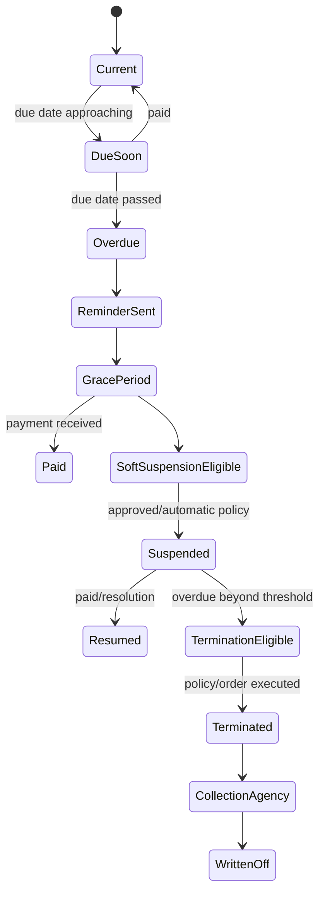

Dunning harus terhubung ke subscription/service lifecycle, tetapi tidak boleh langsung memodifikasi network tanpa order/control.

Correct boundary:

```text
Collection decides action eligibility.
Subscription lifecycle records commercial suspension reason.
Service order/activation domain executes technical suspension.
Billing/AR records debt status.
Customer notification sends evidence.
```

Diagram:

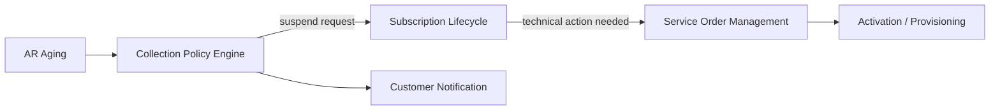

---

## 15. Dispute Handling

Customer dispute bisa muncul karena:

```text
usage dianggap salah
promo tidak diterapkan
service outage tetapi billing penuh
roaming charge terlalu besar
payment sudah dilakukan tapi belum allocated
invoice dikirim ke wrong account
termination tapi recurring charge tetap muncul
```

Dispute state:

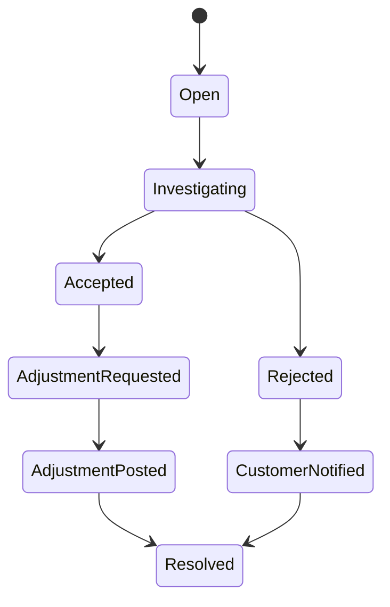

Controls:

```text
disputed amount
invoice/line references
collection hold policy
SLA clock
evidence links: order, usage, rating trace, activation, trouble ticket
resolution reason
adjustment linkage
```

Collection must respect dispute policy:

```text
hold disputed amount only?
hold entire invoice?
continue dunning for undisputed amount?
```

Do not bury dispute logic inside collection job.

---

## 16. Accounts Receivable View

AR tracks what is owed.

AR events:

```text
INVOICE_POSTED
PAYMENT_ALLOCATED
ADJUSTMENT_POSTED
REFUND_POSTED
REVERSAL_POSTED
WRITEOFF_POSTED
```

AR is event-like ledger, even if implemented relationally.

Model:

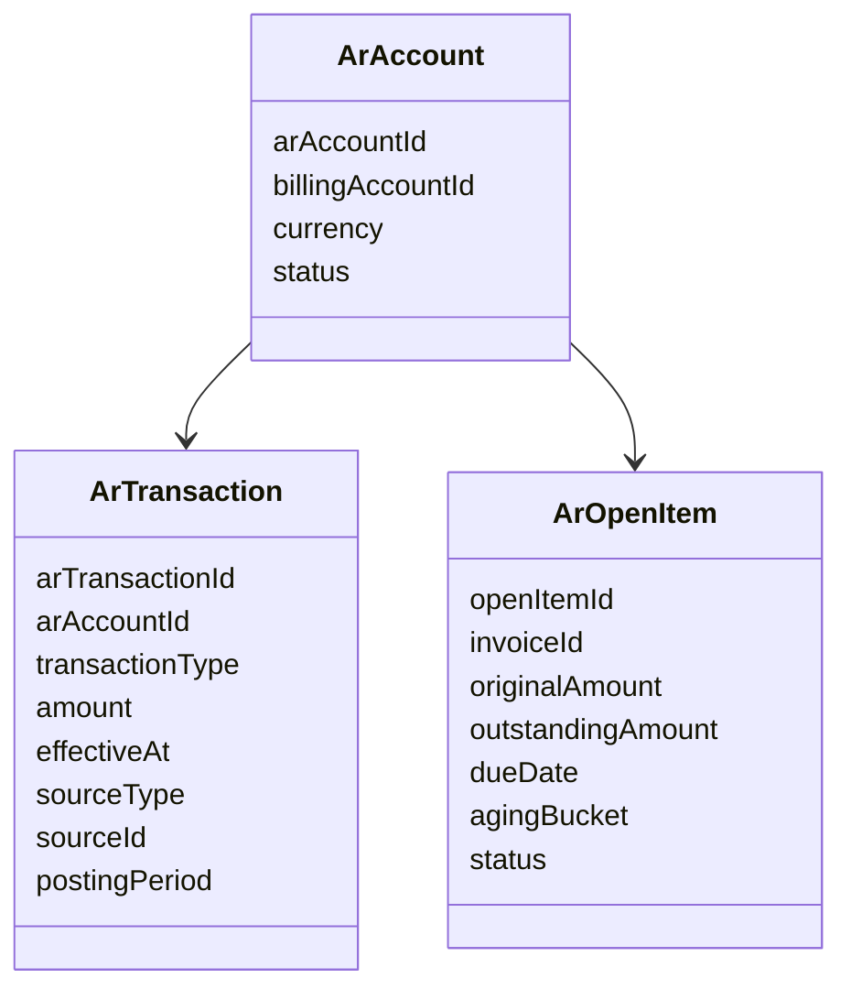

AR should support:

```text
current balance
open item aging
invoice outstanding
customer statement
payment allocation history
collection eligibility
finance posting feed
```

---

## 17. Java Component Boundary

A strong BSS billing platform should separate components.

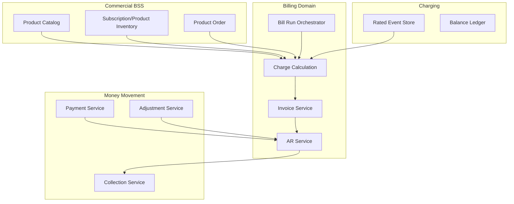

Recommended Java boundaries:

```text
BillingAccountService
BillRunOrchestrator
ChargeCalculationService
InvoiceService
TaxAdapter
AccountsReceivableService
PaymentService
PaymentAllocationService
AdjustmentService
CollectionPolicyService
StatementService
```

Avoid one `BillingService` doing everything.

---

## 18. Invoice Service Design

Responsibilities:

```text
create draft invoice
add immutable line snapshots
calculate totals
transition draft -> issued
store issued document snapshot
expose customer bill view
support invoice search/retrieval
link adjustments/credit notes
```

Command example:

```java
public record IssueInvoiceCommand(
    String invoiceId,
    String billRunId,
    String approvedBy,
    Instant approvedAt,
    String idempotencyKey
) {}
```

Service pseudo-code:

```java
@Transactional
public Invoice issue(IssueInvoiceCommand command) {
    if (idempotency.exists(command.idempotencyKey())) {
        return idempotency.result(command.idempotencyKey(), Invoice.class);
    }

    Invoice invoice = invoiceRepository.lock(command.invoiceId());
    invoice.issue(command.approvedBy(), command.approvedAt());

    invoiceRepository.save(invoice);
    arService.postInvoice(invoice.toArPostingCommand());
    eventPublisher.publish(new InvoiceIssued(invoice.id(), invoice.billingAccountId()));

    idempotency.save(command.idempotencyKey(), invoice.id());
    return invoice;
}
```

Invariant:

```text
issue invoice and AR posting must be coordinated.
If exact atomic cross-component transaction is not possible,
use outbox + idempotent AR posting + reconciliation.
```

---

## 19. Bill Run Orchestration

Bill run can be long-running.

Design as stateful orchestration:

```text
select account cohort
partition work
calculate charges per account
persist draft invoice
run QC
hold exceptions
approve
issue
post AR
publish notification
```

For large telco scale:

```text
partition by billCycle + account hash
checkpoint per partition
idempotent per account billing
rerun failed accounts only
watermark rated event input
separate draft and issued invoice tables/status
```

Failure control:

```text
if charge calculation fails for account, isolate exception
if tax adapter unavailable, stop at draft/tax pending
if AR posting fails, retry posting idempotently
if notification fails, invoice remains issued but delivery retry continues
```

Do not rollback entire national bill run because one account has bad data.

---

## 20. Payment Service Boundary

Payment service should abstract channels:

```text
bank transfer
virtual account
credit card
e-wallet
autopay
direct debit
cashier/retail outlet
partner collection
enterprise remittance
```

Boundary:

```text
payment initiation
payment notification/webhook
payment matching
settlement confirmation
reversal/refund
allocation instruction
fraud/risk callback
```

Webhook idempotency:

```sql
create unique index uq_payment_external_reference
on payment(external_provider, external_reference);
```

Payment must not trust webhook blindly:

```text
verify signature
verify amount/currency
verify merchant/account
verify status transition
handle duplicate notification
handle out-of-order notification
reconcile with settlement report
```

---

## 21. Collection Policy Engine

Collection policy should be declarative/versioned.

Inputs:

```text
billing account status
customer segment
invoice due date
outstanding amount
aging bucket
payment history
dispute status
VIP/regulatory protection
promise-to-pay
collection hold
service criticality
```

Output:

```text
send reminder
apply late fee
create suspension order
hold action
escalate manual review
send to collection agency
write off candidate
```

Example policy table:

| Stage | Condition | Action |
|---|---|---|
| Reminder | due in 3 days | SMS/email reminder |
| Overdue 1 | due + 1 day, no dispute | reminder |
| Overdue 7 | due + 7, amount > threshold | late fee candidate |
| Overdue 14 | due + 14, no payment plan | soft suspension request |
| Overdue 30 | due + 30 | hard suspension/termination review |
| Overdue 90 | due + 90 | write-off/agency candidate |

Policy must not be hardcoded in cron.

---

## 22. Reconciliation

Billing requires multiple reconciliation loops:

```text
subscription active vs recurring charges generated
rated events vs usage invoice lines
invoice issued vs AR posted
payment gateway settlement vs payment records
payment records vs AR allocation
adjustment approved vs AR posted
collection action vs subscription/service state
GL feed vs billing/AR totals
```

Examples:

```sql
-- rated events not billed after cutoff
select rated_event_id
from rated_usage_event e
where e.billable = true
  and e.usage_ended_at < :cutoff
  and not exists (
      select 1 from invoice_line l
      where l.source_type = 'RATED_USAGE_EVENT'
        and l.source_id = e.rated_event_id
  );
```

```sql
-- issued invoices not posted to AR
select invoice_id
from invoice
where status = 'ISSUED'
  and not exists (
      select 1 from ar_transaction t
      where t.source_type = 'INVOICE'
        and t.source_id = invoice.invoice_id
  );
```

Reconciliation is not optional reporting. It is a correctness control.

---

## 23. Reporting vs Billing Source of Truth

Do not build billing from analytics warehouse.

Warehouse is useful for:

```text
reporting
trend analysis
revenue dashboard
customer segmentation
fraud analytics
```

Billing source of truth must be operational and auditable:

```text
charge calculation inputs
rule versions
invoice snapshots
AR postings
payment allocations
adjustments
ledger-like transactions
```

Anti-pattern:

```text
monthly invoice total = query from BI dashboard.
```

Correct:

```text
BI consumes billing outputs, not the reverse.
```

---

## 24. Customer Bill API View

TMF-style customer bill API view biasanya read-oriented: find/retrieve bill and bill details. Internal billing system tetap membutuhkan richer lifecycle.

Expose:

```text
invoice id
billing account
bill period
issue date
due date
amount due
tax amount
paid amount
outstanding
status
bill lines
related adjustment/credit notes
payment summary
PDF/document links
```

Do not expose internal calculation engine directly to channels.

Channel view should be stable:

```text
mobile app
web self-care
call center
partner portal
enterprise portal
collection portal
```

---

## 25. Failure Modes

| Failure | Dampak | Control |
|---|---|---|
| Bill run double executed | duplicate invoice/charge | billRun/account idempotency |
| Rated events late | missing usage charge | late event policy + next bill adjustment |
| Invoice edited after issue | audit/legal dispute | immutable issued invoice |
| Payment webhook duplicated | over-allocation | external ref uniqueness |
| Payment received unmatched | customer marked overdue incorrectly | suspense workflow |
| Partial payment unclear | wrong dunning | allocation record |
| Adjustment without approval | revenue leakage/fraud | maker-checker |
| AR posting failed | invoice visible but not collectible | outbox/retry/reconciliation |
| Collection ignores dispute | customer harm/regulatory risk | dispute hold policy |
| Tax rule hardcoded | compliance risk | tax adapter/versioning |
| Proration inconsistent | billing dispute | centralized versioned proration policy |

---

## 26. Observability Khusus Billing

Metrics:

```text
bill_run_duration_seconds
bill_run_accounts_total
bill_run_failed_accounts_total
invoice_issued_total
invoice_amount_total_by_cycle
invoice_qc_exception_total
rated_event_unbilled_total
ar_posting_failure_total
payment_received_total
payment_suspense_total
payment_allocation_failure_total
adjustment_amount_total_by_reason
collection_action_total_by_stage
invoice_delivery_failure_total
```

Logs:

```text
billRunId
billingAccountId
invoiceId
chargeSourceId
ratedEventId
paymentId
externalPaymentReference
adjustmentId
collectionCaseId
correlationId
ruleVersion
```

Alerts:

```text
bill run stuck
failed account count above threshold
AR posting lag
payment suspense spike
duplicate invoice prevention spike
unbilled rated event backlog
invoice delivery failure spike
collection action failure
```

---

## 27. Security, Compliance, Audit

Billing touches money and personal data.

Controls:

```text
role-based access for invoice/payment/adjustment
maker-checker for adjustment/write-off/refund
PII masking
payment data tokenization; do not store raw card data unless compliant
immutable audit log
segregation of duties between catalog pricing and billing correction
approval threshold by amount/reason/customer segment
document retention policy
export controls for finance reports
```

Audit evidence:

```text
who initiated adjustment
who approved
source reason
before/after financial impact
invoice/payment references
timestamp
rule version
calculation trace
```

---

## 28. Anti-Patterns

### 28.1 Invoice as Mutable Report

```text
generate PDF from current database state every time user opens bill
```

Masalah:

```text
bill berubah setelah dikirim
customer dispute tidak bisa diselesaikan
finance tidak bisa close period
```

Correct:

```text
issued invoice snapshot immutable
PDF/rendering berasal dari snapshot
```

### 28.2 Payment = Set Paid Flag

Masalah:

```text
partial payment hilang
overpayment tidak jelas
reversal impossible
audit allocation tidak ada
```

Correct:

```text
payment record + allocation records + AR open item projection
```

### 28.3 Billing Cron Without BillRun Entity

Masalah:

```text
tidak bisa rerun aman
tidak tahu cutoff
tidak ada QC checkpoint
```

Correct:

```text
bill run as durable orchestration entity
```

### 28.4 Update Invoice for Correction

Masalah:

```text
financial history hilang
audit gagal
customer received document berbeda dari system state
```

Correct:

```text
adjustment/credit/debit note
```

### 28.5 Dunning Directly Calls Provisioning

Masalah:

```text
billing job mematikan service tanpa lifecycle evidence
fallout tidak terkontrol
customer care tidak tahu reason
```

Correct:

```text
collection -> subscription lifecycle -> service order -> activation/provisioning
```

---

## 29. Practice: Design Billing for a Postpaid Mobile Plan

Scenario:

```text
Customer activates plan on 2026-06-11.
Monthly fee: 300,000 IDR.
Bill cycle: calendar month.
Included data: 20GB.
Extra usage charge: 10,000 IDR/GB.
Activation fee: 25,000 IDR.
Discount: 10% for first 3 months.
Payment due: 15 days after issue.
Customer pays 200,000 IDR partial payment.
Customer disputes extra usage.
```

Deliverables:

1. billing account model;
2. bill period;
3. recurring charge proration rule;
4. one-time charge idempotency source;
5. usage charge source from rated event;
6. discount application order;
7. invoice lifecycle;
8. AR posting;
9. payment allocation;
10. dispute hold behavior;
11. collection eligibility.

Expected mental solution:

```text
activation fee from product order source once
monthly recurring fee prorated based on policy
usage charge from rated event, not raw CDR
invoice draft generated, QC, issued, posted to AR
partial payment allocated according to policy
outstanding remains
extra usage dispute creates dispute case and collection hold for disputed amount
correction goes through adjustment, not invoice mutation
```

---

## 30. Self-Correction Checklist

Sebelum desain billing dianggap kuat, jawab:

```text
Apakah billing account terpisah dari customer identity?
Apakah bill cycle dan timezone policy eksplisit?
Apakah bill run durable dan punya status/checkpoint?
Apakah recurring charge punya proration policy version?
Apakah one-time charge idempotent terhadap source order/event?
Apakah usage charge berasal dari rated event yang traceable?
Apakah invoice issued immutable?
Apakah correction dilakukan lewat adjustment/credit/debit?
Apakah payment allocation punya record?
Apakah overpayment dan suspense payment punya workflow?
Apakah AR event/open item bisa diaudit?
Apakah dunning policy versioned?
Apakah dispute dapat menahan collection sesuai policy?
Apakah invoice vs AR vs payment vs GL bisa direkonsiliasi?
Apakah finance close period terlindungi dari mutation liar?
```

Jika banyak jawaban “belum”, billing system Anda masih sebatas report generator.

---

## 31. Ringkasan

Billing adalah financial lifecycle.

Mental model:

```text
Charging/rating menghasilkan rated event.
Billing menghitung charge dan invoice.
Invoice issued harus immutable.
AR menyimpan piutang.
Payment mengurangi piutang melalui allocation.
Adjustment mengoreksi tanpa menghapus sejarah.
Collection memakai AR aging dan policy untuk escalation.
```

Top 1% engineer memahami bahwa billing bukan bagian belakang yang membosankan. Billing adalah salah satu pusat kebenaran finansial telco. Kesalahan kecil pada proration, tax, idempotency, allocation, atau invoice immutability bisa berubah menjadi jutaan record dispute dan revenue leakage.

Part berikutnya membahas **Revenue Assurance & Reconciliation**: bagaimana menemukan leakage, mismatch, missing usage, duplicate charge, order-to-bill gap, CDR-to-bill gap, dan financial control loop yang menjaga BSS/OSS tetap dapat dipercaya.
