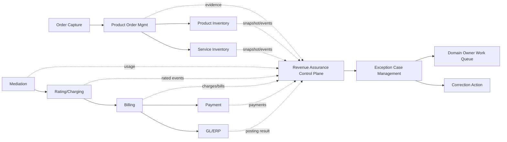
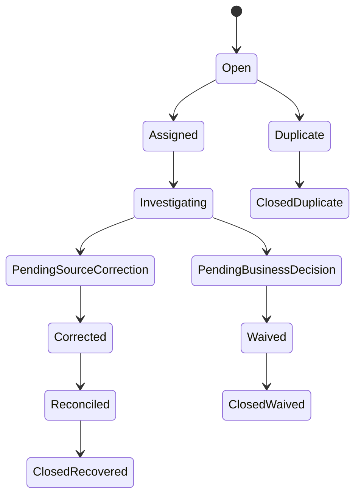
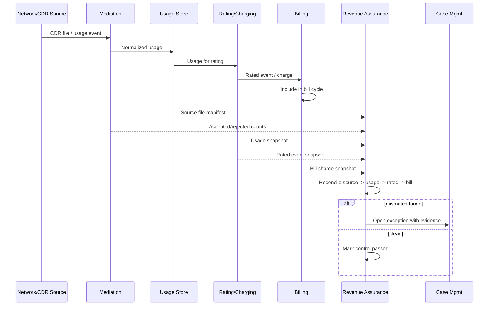
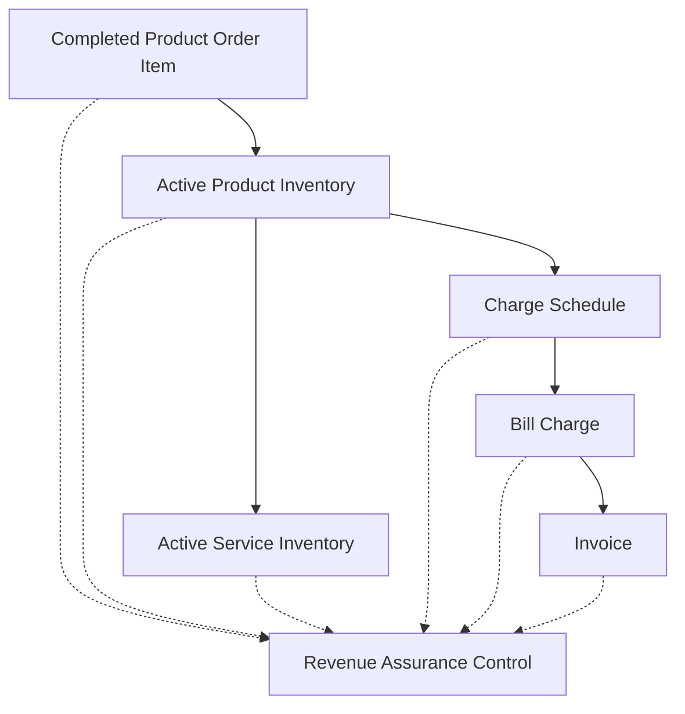
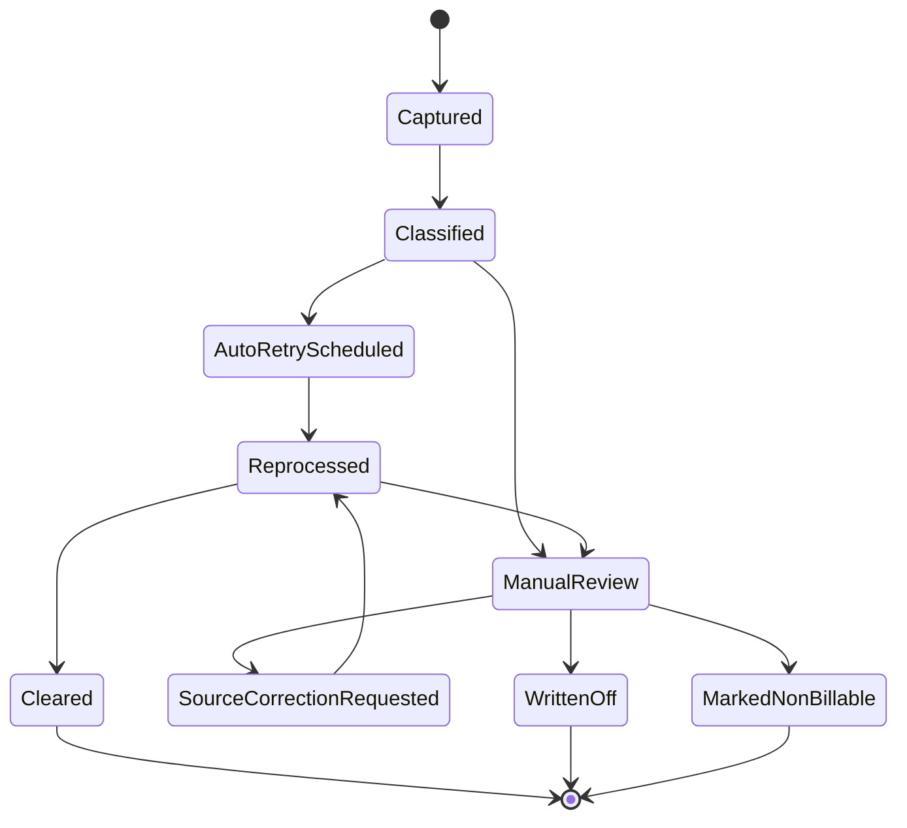
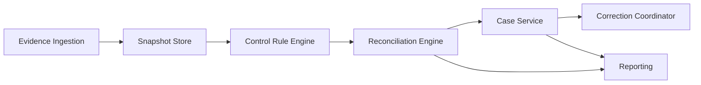

# Part 015 — Revenue Assurance & Reconciliation

## 1. Tujuan Part Ini

Part ini membahas **Revenue Assurance & Reconciliation**: kemampuan sistem BSS/OSS untuk mendeteksi, mengukur, menjelaskan, dan memperbaiki revenue leakage tanpa merusak audit trail.

Di telco, revenue leakage jarang terjadi karena satu bug besar. Biasanya terjadi karena kombinasi kecil:

```text
order aktif tetapi billing tidak dimulai
service aktif tetapi product inventory tidak lengkap
usage masuk rating terlambat
usage rejected tetapi suspense tidak ditindaklanjuti
rating memakai tariff version yang salah
invoice sudah issued tetapi adjustment tidak tercatat sebagai correction
payment masuk tetapi tidak dialokasikan ke receivable yang benar
partner usage tidak sama dengan usage internal
inventory network tidak sama dengan inventory komersial
```

Revenue assurance bukan sekadar report finance. Ini adalah **control system** di atas lifecycle BSS/OSS.

Mental model utama:

```text
Revenue assurance = evidence lineage + control points + reconciliation + exception lifecycle + correction governance.
```

Anda tidak bisa mengandalkan observability saja. Metrics/logs/traces memberi tahu bahwa sistem berjalan. Revenue assurance memberi tahu apakah **uang yang seharusnya ditagih, dikumpulkan, dialokasikan, dan diselesaikan benar-benar terjadi**.

---

## 2. Kaufman Skill Target

Target praktis part ini:

1. membedakan revenue assurance, billing, accounting, reconciliation, observability, dan fraud management;
2. memahami leakage path utama dalam telco BSS/OSS;
3. mendesain control point untuk order-to-activate, activate-to-bill, usage-to-cash, bill-to-payment, dan partner settlement;
4. membangun reconciliation model yang punya lineage, toleransi, window, confidence, dan exception reason;
5. memahami suspense lifecycle untuk usage/event yang gagal diproses;
6. mendesain Java reconciliation engine yang idempotent, replayable, auditable, dan scalable;
7. menghindari anti-pattern seperti patching invoice lama, manual SQL correction tanpa evidence, dan aggregate-only reconciliation;
8. membuat rubric untuk menilai apakah sebuah platform BSS/OSS sudah “revenue-assurable”.

Kriteria mampu:

```text
Diberikan 10 juta CDR, 9.97 juta rated event, 9.95 juta billed charge,
50 ribu rejected event, 20 ribu late event, 5 ribu duplicate, dan 3 ribu tariff mismatch,
Anda bisa menjelaskan control design, matching logic, exception lifecycle, correction action,
dan audit evidence yang diperlukan.
```

---

## 3. Apa yang Tidak Dibahas Ulang

Seri sebelumnya sudah membahas reliability, observability, messaging, persistence, security, dan Java concurrency. Di sini kita tidak mengulang generic pattern tersebut.

Yang dibahas di sini adalah penerapannya pada domain telco revenue:

```text
bukan: bagaimana Kafka consumer bekerja
melainkan: bagaimana guarantee bahwa semua billable usage sudah masuk rated-event ledger

bukan: bagaimana transaction isolation bekerja
melainkan: bagaimana mencegah double billing saat retry rating/invoicing

bukan: bagaimana logging dibuat
melainkan: evidence apa yang harus bisa membuktikan kenapa customer ditagih Rp X
```

---

## 4. Industry Reference Anchors

Tidak ada satu API TM Forum bernama “Revenue Assurance API” yang menyelesaikan semua masalah ini. Revenue assurance biasanya dibangun dengan menggabungkan data dari beberapa domain:

| Area | Reference Anchor | Relevansi |
|---|---|---|
| Usage | TMF635 Usage Management | Manajemen rated/non-rated usage, retrieval/import/export usage collection. |
| Product inventory | TMF637 Product Inventory | Bukti subscription/product instance yang aktif atau berubah lifecycle. |
| Service inventory | TMF638 Service Inventory | Bukti service instance dan state teknis/operasional. |
| Product ordering | TMF622 Product Ordering | Bukti commercial order intent dan order item lifecycle. |
| Customer bill | TMF678 Customer Bill Management | Bukti bill/invoice generated dan lifecycle bill. |
| Account | TMF666 Account Management | Account, financial/accounting boundary, billing/settlement context. |
| Balance | TMF654 Prepay Balance Management | Balance/bucket untuk prepaid/quota/allowance control. |
| Product catalog | TMF620 Product Catalog | Source tariff/product offering versioning. |

Prinsipnya:

```text
Revenue assurance bukan mengganti domain API.
Revenue assurance membaca evidence dari domain API, ledger, stream, dan warehouse,
lalu membangun control cases yang bisa diperbaiki oleh owner domain masing-masing.
```

---

## 5. Mental Model: Leakage sebagai Broken Invariant

Revenue leakage adalah pelanggaran terhadap invariant revenue.

Contoh invariant:

```text
Jika subscription chargeable aktif pada periode billing,
maka harus ada charge yang masuk billing cycle atau alasan legitimate kenapa tidak.

Jika usage billable diterima dari network/partner,
maka usage harus masuk rated event, ditolak ke suspense dengan reason, atau dinyatakan non-billable berdasarkan rule.

Jika invoice issued,
maka invoice tidak boleh diedit diam-diam; correction harus berupa adjustment, credit note, debit note, atau invoice berikutnya.

Jika payment diterima,
maka payment harus dialokasikan ke receivable, masuk suspense payment, atau direfund dengan evidence.
```

Bentuk umum invariant:

```text
source evidence + business rule + expected downstream artifact + timing window + exception reason
```

Contoh:

```text
source evidence        = service activation completed
business rule          = product offering has monthly recurring fee
expected artifact      = recurring charge in next bill cycle
window                 = <= first bill run after activation
exception reason       = free trial, zero-rated offer, billing hold, dispute hold, test account
```

---

## 6. Leakage Taxonomy

### 6.1 Order-to-Activation Leakage

Terjadi ketika order lifecycle dan actual activation tidak sinkron.

| Leakage | Gejala | Dampak |
|---|---|---|
| Order completed but service not active | Product order `completed`, service inventory masih `designed/reserved` | Customer membayar tapi service tidak jalan, dispute/refund. |
| Service active but product order failed | Network provisioning sukses, order marked failed | Free service / missing commercial accountability. |
| Partial activation hidden | Bundle sebagian aktif tapi order dianggap completed | Salah billing dan salah entitlement. |
| Duplicate activation | Retry provisioning tidak idempotent | Double resource assignment atau duplicate charge. |

Control:

```text
product_order.completed
  -> product_inventory.active
  -> service_order.completed
  -> service_inventory.active
  -> resource_inventory.assigned
```

Setiap edge harus punya reconciliation.

### 6.2 Activation-to-Billing Leakage

Terjadi ketika service/subscription aktif tetapi charge tidak dibuat.

Contoh:

```text
subscription active sejak 2026-06-10
monthly recurring fee = Rp100.000
bill cycle close = 2026-06-30
expected prorated charge = Rp70.000 approx
actual charge = missing
```

Root cause umum:

1. product inventory tidak punya billing account reference;
2. activation date tidak masuk charge schedule;
3. product offering version tidak resolve ke price;
4. bill cycle exclusion flag tertinggal;
5. migration data missing;
6. billing engine filter salah.

### 6.3 Usage-to-Cash Leakage

Terjadi pada chain:

```text
network event/CDR
  -> mediation
  -> normalized usage
  -> rating
  -> rated event
  -> billable charge
  -> invoice
  -> receivable
  -> payment allocation
```

Leakage bisa terjadi di setiap edge:

| Edge | Failure |
|---|---|
| CDR -> mediation | file lost, duplicate file, late file, bad format |
| mediation -> usage | parsing error, wrong timezone, missing subscriber mapping |
| usage -> rating | tariff not found, wrong offer version, bucket unavailable |
| rating -> billable charge | rounded incorrectly, tax flag wrong, duplicate suppression too aggressive |
| billable charge -> invoice | charge excluded, bill cycle mismatch, customer hold |
| invoice -> receivable | posting failure, GL mismatch |
| receivable -> payment | payment suspense, wrong account allocation |

### 6.4 Catalog-to-Charging Leakage

Product catalog says one thing; charging/billing engine implements another.

Example:

```text
Offer: 50GB data + unlimited on-net calls + Rp150.000/month
Charging config: 40GB data + on-net not zero-rated + Rp140.000/month
```

This is not just a configuration issue. It is a revenue and customer trust issue.

Controls:

1. catalog-to-rating rule publication;
2. price version effective-date alignment;
3. offer compatibility rule validation;
4. shadow rating for selected offers;
5. pre-production catalog simulation;
6. exception on missing tariff mapping.

### 6.5 Partner/Wholesale Leakage

Examples:

```text
partner reports 1,000,000 API calls
internal gateway logs 1,080,000 billable API calls
settlement invoice contains 900,000 calls
```

or:

```text
MVNO reports subscriber base = 2,000,000
host MNO active IMSI count = 2,050,000
billing settlement uses 1,980,000
```

Root causes:

1. measurement window mismatch;
2. timezone mismatch;
3. duplicate suppression difference;
4. partner rounding rule difference;
5. late-arriving usage;
6. disputed traffic class;
7. contract interpretation difference.

---

## 7. Revenue Assurance Architecture

A good architecture separates domain systems from control plane.



Key rule:

```text
Revenue Assurance tidak boleh menjadi hidden writer yang memperbaiki data diam-diam.
Revenue Assurance membuat exception/correction request dengan evidence.
Domain owner/system melakukan correction dengan audit trail.
```

---

## 8. Core Concepts

### 8.1 Evidence

Evidence adalah fakta mentah atau derived yang bisa dipakai untuk membuktikan expected revenue.

Examples:

```text
ProductOrderItem completed
ProductInventory active
ServiceInventory active
Resource assigned
Usage record accepted
RatedEvent created
Charge included in invoice
Invoice issued
Payment received
Payment allocated
GL posting completed
```

Evidence harus punya:

| Field | Tujuan |
|---|---|
| `evidenceId` | Idempotency dan traceability. |
| `sourceSystem` | Dari mana data berasal. |
| `sourceRecordId` | Link ke record asal. |
| `businessKey` | Subscriber/account/order/service identity. |
| `eventTime` | Waktu kejadian domain. |
| `ingestionTime` | Waktu diterima control plane. |
| `effectiveDate` | Tanggal berlaku secara bisnis. |
| `payloadHash` | Deteksi perubahan diam-diam. |
| `schemaVersion` | Evolusi data. |
| `lineage` | Parent/source chain. |

### 8.2 Control Point

Control point adalah aturan yang memeriksa apakah expected downstream artifact ada.

Example:

```text
CONTROL: Active subscription must be billable
SOURCE: ProductInventory where state=ACTIVE and offer.chargeable=true
EXPECTED: RecurringCharge exists for billing period
WINDOW: first bill cycle after activation
EXCEPTION: freeTrial, billingHold, testAccount, zeroPriceOffer
OWNER: Billing Operations
SEVERITY: High
```

### 8.3 Reconciliation Dataset

Dataset reconciliation harus immutable per run.

```text
run_id = 2026-06-30-USAGE-TO-BILL-CYCLE-202606
left_dataset = rated_event snapshot at watermark W1
right_dataset = bill_charge snapshot at watermark W2
ruleset_version = usage_to_bill_v17
```

Tanpa snapshot/watermark, hasil reconciliation tidak bisa direproduksi.

### 8.4 Exception Case

Exception case bukan sekadar row mismatch. Ini object operasional.

```text
case = mismatch + reason + evidence + owner + SLA + correction path + closure proof
```

Case lifecycle:



---

## 9. Reconciliation Dimensions

A strong reconciliation engine does not only compare totals.

### 9.1 Completeness

Question:

```text
Apakah semua source records muncul di target records?
```

Example:

```text
all accepted usage records should either become rated events or valid suspense records
```

### 9.2 Accuracy

Question:

```text
Apakah nilai yang dihasilkan benar?
```

Example:

```text
rated amount = quantity * tariff rule * discount * tax basis
```

### 9.3 Timeliness

Question:

```text
Apakah record diproses dalam window yang diterima?
```

Example:

```text
CDR received before cycle close should be rated before invoice generation cutoff
```

### 9.4 Uniqueness

Question:

```text
Apakah record diproses tepat satu kali secara bisnis?
```

Example:

```text
same CDR file resent by mediation must not produce duplicate rated event
```

### 9.5 Validity

Question:

```text
Apakah record memang valid untuk ditagih?
```

Example:

```text
usage from test IMSI should not be billable
```

### 9.6 Authorization

Question:

```text
Apakah correction/waiver/adjustment dibuat oleh actor/proses yang berwenang?
```

Example:

```text
large credit adjustment requires maker-checker approval
```

---

## 10. Reconciliation Patterns

### 10.1 One-to-One Match

Satu source record harus menghasilkan satu target record.

```text
rated_event_id -> bill_charge_id
```

Good for:

1. high-value one-time charge;
2. device installment charge;
3. explicit adjustment;
4. manually created fee.

### 10.2 One-to-Many Match

Satu source record menghasilkan banyak target record.

```text
usage session -> multiple charge components
```

Example:

```text
roaming call usage
  -> retail charge
  -> wholesale settlement charge
  -> tax component
```

### 10.3 Many-to-One Match

Banyak source record digabung menjadi satu target record.

```text
1,000 data usage records -> one aggregated invoice charge line
```

Danger:

```text
aggregate match bisa menyembunyikan missing/duplicate detail.
```

Solution:

```text
store aggregation lineage or deterministic group key.
```

### 10.4 Aggregate Reconciliation

Compare total by dimension:

```text
sum(rated_amount) by account, service, cycle, charge_type
vs
sum(invoice_amount) by account, service, cycle, charge_type
```

Useful for first-level control, but insufficient for dispute-grade audit.

### 10.5 Windowed Reconciliation

Needed because telco records arrive late.

```text
window = event_time between 2026-06-01 and 2026-06-30
watermark = all files received until 2026-07-02 03:00
late window = 2026-07-03 to 2026-07-10
```

### 10.6 Fuzzy Reconciliation

Used when source systems do not share exact keys.

Example match dimensions:

```text
msisdn + start_time within 5 seconds + duration within 1 second + destination prefix + amount tolerance
```

Fuzzy match must produce confidence score and never auto-correct high-value financial records without approval.

---

## 11. Usage-to-Cash Control Model



Control questions:

1. Apakah semua source files diterima lengkap?
2. Apakah jumlah record source sama dengan accepted + rejected?
3. Apakah rejected masuk suspense dengan reason?
4. Apakah semua accepted usage dirating atau ditandai non-billable?
5. Apakah semua rated events masuk bill atau valid carry-forward?
6. Apakah invoice amount sama dengan expected amount after rounding/tax?
7. Apakah late usage ditangani sesuai policy?

---

## 12. Order-to-Bill Control Model

Order-to-bill reconciliation memastikan produk aktif menghasilkan charge yang benar.



Control examples:

| Control | Expected |
|---|---|
| Completed add order | Product inventory active. |
| Active chargeable product | Charge schedule exists. |
| Charge schedule due | Bill charge generated. |
| Bill charge generated | Included in invoice or deferred with reason. |
| Terminated product | Future recurring charge stopped. |
| Suspended product | Charge behavior follows policy. |
| Modified product | Old charge closed; new charge effective. |

Important nuance:

```text
Not every active product is billable now.
```

Reasons:

1. free trial;
2. zero-price offer;
3. bundle parent billed elsewhere;
4. enterprise master account billing;
5. billing hold;
6. dispute hold;
7. migration grace period;
8. regulatory compensation period.

So the control must distinguish:

```text
missing charge because bug
vs
missing charge because valid business policy
```

---

## 13. Inventory-to-Bill Control

This control compares inventory state with billing state.

Example:

```text
Product Inventory:
  productId = P-123
  accountId = A-9
  offeringId = FIBER-100M
  state = ACTIVE
  activationDate = 2026-06-10

Billing:
  accountId = A-9
  recurringCharge = none
```

Potential exception:

```text
ACTIVE_PRODUCT_WITHOUT_BILLING_CHARGE
```

But the control must check:

1. Is product chargeable?
2. Is it a child bundle item charged at parent?
3. Is account in billing hold?
4. Is activation date after bill run cutoff?
5. Is product in free trial?
6. Is charge schedule generated but not yet billed?
7. Is product migrated from legacy system with pending mapping?

Naive control creates noise. Good control produces actionable exception.

---

## 14. Suspense Management

Suspense is where records go when they cannot be processed but must not disappear.

Suspense examples:

```text
unknown subscriber
unknown tariff
invalid event time
duplicate suspected
bad record format
negative quantity
roaming partner missing agreement
billing account not found
```

Suspense lifecycle:



Suspense invariant:

```text
A rejected revenue-relevant record must have a terminal outcome:
cleared, corrected, non-billable, duplicate, written off, or waived with authorization.
```

Bad patterns:

1. rejected usage only logged;
2. suspense table not monitored;
3. manual update clears suspense without reason;
4. old suspense ignored after bill cycle;
5. suspense resubmission creates duplicate charges;
6. no financial estimate for suspense amount.

---

## 15. Exception Case Model

A revenue assurance exception should be modeled as first-class domain object.

```java
public record RevenueAssuranceCase(
    CaseId id,
    ControlRunId controlRunId,
    ControlPointId controlPointId,
    CaseType type,
    Severity severity,
    BusinessKey businessKey,
    Money estimatedExposure,
    CaseStatus status,
    CaseReason reason,
    Owner owner,
    List<EvidenceRef> evidence,
    Instant openedAt,
    Instant dueAt,
    Optional<Instant> closedAt
) {}
```

`BusinessKey` depends on the control:

```java
public sealed interface BusinessKey permits AccountKey, SubscriptionKey, UsageKey, PartnerSettlementKey {}

public record AccountKey(String accountId, YearMonth cycle) implements BusinessKey {}
public record SubscriptionKey(String productId, String serviceId, YearMonth cycle) implements BusinessKey {}
public record UsageKey(String sourceEventId, String subscriberId, Instant eventTime) implements BusinessKey {}
public record PartnerSettlementKey(String partnerId, String agreementId, YearMonth period) implements BusinessKey {}
```

Case type examples:

```text
ACTIVE_PRODUCT_NOT_BILLED
USAGE_NOT_RATED
RATED_EVENT_NOT_BILLED
DUPLICATE_RATED_EVENT
TARIFF_MISMATCH
PAYMENT_UNALLOCATED
BILL_NOT_POSTED_TO_GL
PARTNER_USAGE_VARIANCE
INVENTORY_BILLING_STATE_MISMATCH
```

---

## 16. Control Run Model

Control run must be reproducible.

```java
public record ControlRun(
    ControlRunId id,
    ControlPointId controlPointId,
    String rulesetVersion,
    Instant startedAt,
    Instant completedAt,
    Watermark sourceWatermark,
    Watermark targetWatermark,
    SnapshotRef leftSnapshot,
    SnapshotRef rightSnapshot,
    ControlRunStatus status,
    ControlRunMetrics metrics
) {}
```

Metrics:

```java
public record ControlRunMetrics(
    long leftCount,
    long rightCount,
    long matchedCount,
    long unmatchedLeftCount,
    long unmatchedRightCount,
    long exceptionCreatedCount,
    long exceptionReopenedCount,
    long autoClearedCount,
    BigDecimal estimatedExposureAmount
) {}
```

Why this matters:

```text
If finance asks “why did the June control result change between yesterday and today?”
you need to answer with watermarks, snapshots, late data, rule version, and correction state.
```

---

## 17. Java Component Boundary

Recommended component split:

```text
revenue-assurance-ingestion
  consumes evidence events and snapshots

revenue-assurance-control
  executes control point rules

revenue-assurance-reconciliation
  performs matching and variance calculation

revenue-assurance-case
  owns exception lifecycle

revenue-assurance-correction
  requests/coordinates correction actions, does not mutate foreign domain silently

revenue-assurance-reporting
  exposure dashboard, leakage estimate, recovery metrics
```

Mermaid view:



Boundary rule:

```text
Control engine detects.
Case service governs.
Correction coordinator requests.
Domain systems correct.
Reporting explains.
```

---

## 18. Matching Engine Design

A matching rule should be explicit and versioned.

```java
public interface ReconciliationRule<L, R> {
    RuleId id();
    String version();
    MatchKey leftKey(L left);
    MatchKey rightKey(R right);
    MatchDecision compare(L left, R right, ReconciliationContext context);
}
```

Example match decision:

```java
public sealed interface MatchDecision {
    record Matched(BigDecimal confidence) implements MatchDecision {}
    record Variance(String reason, BigDecimal amountDifference) implements MatchDecision {}
    record LeftOnly(String reason) implements MatchDecision {}
    record RightOnly(String reason) implements MatchDecision {}
    record Ambiguous(List<String> candidateIds) implements MatchDecision {}
}
```

Example for rated event to bill charge:

```java
public final class RatedEventToBillChargeRule
        implements ReconciliationRule<RatedEventEvidence, BillChargeEvidence> {

    @Override
    public RuleId id() {
        return new RuleId("rated-event-to-bill-charge");
    }

    @Override
    public String version() {
        return "2026.06.01";
    }

    @Override
    public MatchKey leftKey(RatedEventEvidence left) {
        return MatchKey.of(
            left.accountId(),
            left.productId(),
            left.ratedEventId()
        );
    }

    @Override
    public MatchKey rightKey(BillChargeEvidence right) {
        return MatchKey.of(
            right.accountId(),
            right.productId(),
            right.sourceRatedEventId()
        );
    }

    @Override
    public MatchDecision compare(
            RatedEventEvidence left,
            BillChargeEvidence right,
            ReconciliationContext context
    ) {
        if (left.amount().compareTo(right.preTaxAmount()) != 0) {
            return new MatchDecision.Variance(
                "AMOUNT_MISMATCH",
                right.preTaxAmount().subtract(left.amount())
            );
        }

        if (!left.currency().equals(right.currency())) {
            return new MatchDecision.Variance("CURRENCY_MISMATCH", BigDecimal.ZERO);
        }

        return new MatchDecision.Matched(BigDecimal.ONE);
    }
}
```

Do not hide rule logic inside ad-hoc SQL only. SQL can execute matching efficiently, but the rule version and business meaning must remain explicit.

---

## 19. Snapshot Strategy

Revenue controls need stable input.

Options:

### 19.1 Event-Sourced Evidence Store

Good when systems emit reliable events.

```text
ProductActivated
UsageAccepted
UsageRated
InvoiceIssued
PaymentAllocated
```

Pros:

1. natural lineage;
2. replayable;
3. good for near-real-time controls.

Cons:

1. source systems may not emit all required facts;
2. migration/legacy integration hard;
3. event schema drift needs governance.

### 19.2 Batch Snapshot

Good for large legacy reconciliation.

```text
daily_product_inventory_snapshot
monthly_bill_charge_snapshot
cdr_file_manifest_snapshot
```

Pros:

1. easier with legacy systems;
2. reproducible;
3. natural for month-end controls.

Cons:

1. not real-time;
2. requires snapshot immutability;
3. late corrections need rerun strategy.

### 19.3 Hybrid

Best practical architecture for telco:

```text
stream for early detection
snapshot for financial-grade closure
```

---

## 20. Database Model Sketch

Minimal tables:

```sql
create table ra_control_point (
  control_point_id varchar(64) primary key,
  name varchar(200) not null,
  domain varchar(64) not null,
  owner_team varchar(100) not null,
  severity varchar(32) not null,
  rule_version varchar(64) not null,
  enabled boolean not null
);

create table ra_control_run (
  control_run_id varchar(80) primary key,
  control_point_id varchar(64) not null,
  rule_version varchar(64) not null,
  left_snapshot_id varchar(100),
  right_snapshot_id varchar(100),
  source_watermark timestamp,
  target_watermark timestamp,
  started_at timestamp not null,
  completed_at timestamp,
  status varchar(32) not null
);

create table ra_case (
  case_id varchar(80) primary key,
  control_run_id varchar(80) not null,
  control_point_id varchar(64) not null,
  case_type varchar(80) not null,
  business_key varchar(300) not null,
  status varchar(40) not null,
  severity varchar(32) not null,
  estimated_exposure_amount numeric(19,4),
  currency varchar(3),
  reason varchar(120),
  owner_team varchar(100),
  opened_at timestamp not null,
  due_at timestamp,
  closed_at timestamp
);

create table ra_case_evidence (
  case_id varchar(80) not null,
  evidence_id varchar(120) not null,
  evidence_type varchar(80) not null,
  source_system varchar(80) not null,
  source_record_id varchar(160) not null,
  payload_hash varchar(128) not null,
  primary key (case_id, evidence_id)
);
```

Add domain-specific evidence tables or store evidence payloads in object storage with hash references. Avoid putting huge CDR payloads directly inside the case table.

---

## 21. Control Examples

### 21.1 Active Product Without Charge

Definition:

```yaml
controlPoint: active-product-without-charge
source: product_inventory
sourceFilter:
  state: ACTIVE
  chargeable: true
expected: billing_charge
match:
  keys:
    - accountId
    - productId
    - billingPeriod
window: first_cycle_after_activation
exceptions:
  - FREE_TRIAL
  - ZERO_PRICE_OFFER
  - BILLING_HOLD
  - CHILD_BUNDLE_CHARGED_AT_PARENT
  - TEST_ACCOUNT
owner: billing-operations
```

### 21.2 Usage Accepted But Not Rated

Definition:

```yaml
controlPoint: usage-accepted-not-rated
source: usage_store
sourceFilter:
  status: ACCEPTED
  billable: true
expected: rated_event_or_suspense
match:
  keys:
    - sourceUsageId
window: event_time + 24h
exceptions:
  - VALID_NON_BILLABLE
  - DUPLICATE_SUPPRESSED
  - CUSTOMER_NOT_FOUND_IN_GRACE_WINDOW
owner: charging-operations
```

### 21.3 Rated Event Not Billed

Definition:

```yaml
controlPoint: rated-event-not-billed
source: rated_event
sourceFilter:
  chargeable: true
  billingDisposition: BILLABLE
expected: bill_charge
match:
  keys:
    - ratedEventId
    - accountId
window: bill_cycle_close + 6h
exceptions:
  - LATE_USAGE_CARRY_FORWARD
  - BILLING_HOLD
  - DISPUTE_HOLD
owner: billing-operations
```

### 21.4 Payment Received But Not Allocated

Definition:

```yaml
controlPoint: payment-received-not-allocated
source: payment_gateway
sourceFilter:
  paymentStatus: CAPTURED
expected: payment_allocation_or_suspense_payment
match:
  keys:
    - paymentReference
window: capture_time + 2h
exceptions:
  - UNKNOWN_ACCOUNT
  - DUPLICATE_PAYMENT
  - CHARGEBACK_PENDING
owner: payment-operations
```

---

## 22. Revenue Exposure Estimation

A case should estimate exposure.

Examples:

```text
ACTIVE_PRODUCT_WITHOUT_CHARGE:
  expected monthly fee prorated for missing period

USAGE_NOT_RATED:
  estimate using default tariff or historical average

PAYMENT_UNALLOCATED:
  exposure may be customer experience/collection risk, not revenue loss

DUPLICATE_BILLING:
  exposure is overbilling/customer refund risk
```

Do not treat all mismatch as lost revenue. There are several exposure classes:

| Exposure Type | Meaning |
|---|---|
| Underbilling | Provider failed to charge. |
| Overbilling | Customer charged too much. |
| Timing | Revenue delayed, not lost. |
| Dispute risk | Revenue may be reversed. |
| Compliance risk | Incorrect charge/tax/notice. |
| Experience risk | Customer impacted; future churn risk. |

---

## 23. Correction Actions

Correction must be governed.

Possible correction actions:

```text
reprocess usage
repair subscriber mapping
publish missing tariff
generate missed charge
create adjustment
create credit note
allocate payment
reverse duplicate charge
update inventory state
open provisioning repair
raise partner dispute
write off with approval
```

Correction rule:

```text
Never silently mutate financial history.
```

Bad:

```sql
update invoice_line set amount = 100000 where id = '...';
```

Good:

```text
create adjustment with reason, approval, evidence, and link to original invoice/charge.
```

Correction coordinator should call domain APIs or create domain tasks, not bypass the domain.

---

## 24. Case Closure Evidence

A case is not closed because someone clicked “done”. It is closed because evidence proves resolution.

Closure evidence examples:

| Case | Closure Evidence |
|---|---|
| Usage not rated | Rated event created or usage marked non-billable with approval. |
| Active product not billed | Charge schedule created and included in invoice, or valid exemption linked. |
| Duplicate rating | Duplicate event reversed and downstream bill corrected. |
| Payment unallocated | Allocation record created or refund completed. |
| Partner variance | Settlement adjustment, dispute agreement, or waiver. |

Case closure fields:

```text
closure_reason
closure_actor
closure_evidence_refs
financial_recovery_amount
customer_impact_flag
requires_follow_up_control
```

---

## 25. Near-Real-Time vs Periodic Controls

### 25.1 Near-Real-Time Controls

Good for:

1. usage file missing;
2. high-volume rating failure;
3. payment allocation failure;
4. charging bucket error;
5. catalog publication mismatch.

Goal:

```text
detect before bill cycle closes.
```

### 25.2 Daily Controls

Good for:

1. active product not billed;
2. new activation missing charge schedule;
3. rejected usage backlog;
4. open suspense aging;
5. failed GL posting.

### 25.3 Monthly Controls

Good for:

1. bill cycle closure;
2. revenue summary by product/account;
3. partner settlement;
4. management reporting;
5. financial assurance.

Practical model:

```text
early warning stream + daily operational controls + monthly financial closure controls
```

---

## 26. Performance and Scale

Telco reconciliation can be huge:

```text
CDR/usage: millions to billions/day
rated events: millions to billions/day
invoice lines: millions/month
account base: millions
resource inventory: tens/hundreds of millions
```

Design principles:

1. partition by cycle/account/product/usage date;
2. use deterministic business keys;
3. pre-aggregate for dashboards, retain detail for investigation;
4. separate hot operational cases from cold evidence store;
5. use watermark and late-arrival handling;
6. avoid full-table scans during working hours;
7. design rerun by partition, not global rerun only;
8. maintain rule version lineage.

Matching strategy:

```text
exact key match first
then aggregate variance
then fuzzy match only for specific exception classes
```

---

## 27. Common Anti-Patterns

### 27.1 Reconciliation by Total Only

Bad:

```text
Total rated = total billed, so all good.
```

Why bad:

```text
One customer underbilled by 1M and another overbilled by 1M nets to zero.
```

### 27.2 No Lineage from Invoice to Usage

Bad:

```text
Invoice line says “Data usage Rp80.000” with no source rated event lineage.
```

Impact:

1. dispute hard to resolve;
2. duplicate hard to detect;
3. correction cannot be targeted;
4. audit weak.

### 27.3 Suspense as Trash Bin

Bad:

```text
Rejected usage placed in suspense, never aged, never owned, never valued.
```

Good:

```text
Suspense has SLA, owner, reason, estimate, terminal outcome.
```

### 27.4 Revenue Assurance Writes Directly to Billing Tables

Bad:

```text
RA job inserts missing charge into billing table without billing domain validation.
```

Good:

```text
RA opens correction request; billing component validates, generates charge, records audit.
```

### 27.5 No Rule Version

Bad:

```text
Reconciliation rule changed but old case result cannot be reproduced.
```

Good:

```text
ControlRun stores ruleset version and snapshot/watermark.
```

### 27.6 Ignoring Overbilling

Revenue assurance is not only about missed revenue.

Overbilling creates:

1. refund liability;
2. regulatory risk;
3. churn;
4. dispute workload;
5. brand damage.

---

## 28. Top 1% Engineering Lens

A top engineer does not ask only:

```text
Can this control find mismatches?
```

They ask:

```text
Can it prove the mismatch?
Can it reproduce the result?
Can it avoid false positives?
Can it quantify exposure?
Can it assign ownership?
Can it drive correction safely?
Can it close with evidence?
Can it survive late data?
Can it handle migrations and partner variance?
Can it explain customer-level impact?
```

Revenue assurance is a governance layer over distributed domain truth.

---

## 29. Practice: Design a Usage-to-Bill Control

Scenario:

```text
A mobile operator receives 50 million data usage records daily.
Mediation accepts 49.8 million and rejects 200k.
Rating creates 49.75 million rated events.
Billing includes 49.70 million event-equivalent charges in monthly invoice aggregation.
Late usage can arrive up to 7 days.
Invoices close on the 3rd day of the next month.
```

Task:

1. define control points;
2. define datasets and watermarks;
3. define exact and aggregate match keys;
4. define exception types;
5. define exposure estimate;
6. define case SLA;
7. define correction actions;
8. define dashboard metrics.

Expected thinking:

```text
Do not compare only 50M vs 49.70M.
Build a chain:
source manifest -> mediation accepted/rejected -> normalized usage -> rated event -> bill charge -> invoice.
```

---

## 30. Practice: Active Product Not Billed

Scenario:

```text
Product inventory contains 1,200,000 active broadband subscriptions.
Billing generated recurring charges for 1,185,000.
10,000 are free trial.
2,000 are billing hold.
1,000 are test accounts.
2,000 have no explanation.
```

Expected exception:

```text
2,000 ACTIVE_PRODUCT_WITHOUT_CHARGE cases
```

But verify:

1. bundle parent/child relation;
2. activation cutoff;
3. product offering version;
4. billing account mapping;
5. migration state;
6. suspended charging policy.

---

## 31. Review Checklist

Use this checklist when reviewing a revenue assurance design.

### Evidence

- [ ] Every control has source evidence and expected target evidence.
- [ ] Evidence has source system, source id, event time, ingestion time, and payload hash.
- [ ] Evidence can be replayed or re-read by snapshot.
- [ ] Evidence lineage survives aggregation.

### Controls

- [ ] Control point has owner, severity, rule version, and SLA.
- [ ] Control distinguishes valid exception from leakage.
- [ ] Control has timing window and watermark.
- [ ] Control produces actionable cases, not only dashboard counts.

### Reconciliation

- [ ] Match keys are deterministic where possible.
- [ ] Aggregate reconciliation does not hide detail mismatch.
- [ ] Fuzzy matching has confidence score and approval threshold.
- [ ] Late data policy is explicit.

### Correction

- [ ] Correction is performed by owning domain, not hidden RA SQL.
- [ ] Financial correction uses adjustment/credit/debit, not invoice mutation.
- [ ] Case closure requires evidence.
- [ ] Write-off/waiver requires authorization.

### Operations

- [ ] Suspense has owner, SLA, aging, and exposure.
- [ ] Dashboards show both underbilling and overbilling.
- [ ] Reconciliation runs are reproducible.
- [ ] Controls are tested with migration and replay scenarios.

---

## 32. Summary

Revenue assurance is the discipline of protecting revenue integrity across distributed BSS/OSS lifecycle.

Core mental model:

```text
source evidence
  -> expected downstream artifact
  -> reconciliation rule
  -> exception case
  -> governed correction
  -> closure evidence
```

Most failures come from broken edges:

```text
order -> inventory
inventory -> charge schedule
usage -> rated event
rated event -> bill charge
bill -> receivable
payment -> allocation
partner record -> settlement
```

Top-tier engineering in this area means designing systems that are not only correct in happy path, but **provable under dispute, reproducible under audit, resilient to late data, and safe under correction**.

---

## 33. Next Part

Next: **Part 016 — Service Catalog, CFS/RFS & Service Decomposition**.

Kita akan berpindah dari monetization control ke fulfillment modeling: bagaimana product order diterjemahkan menjadi customer-facing service, resource-facing service, service order, inventory instance, and activation plan.
