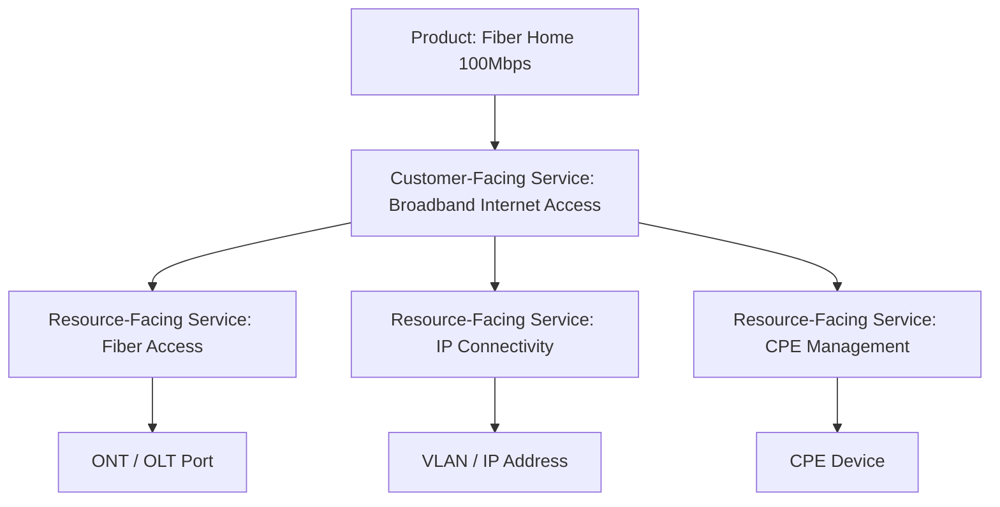
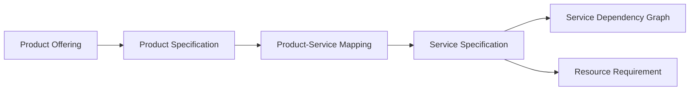
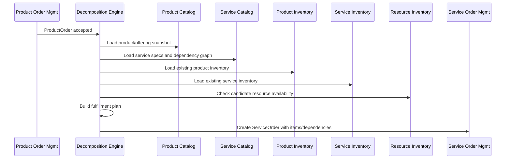
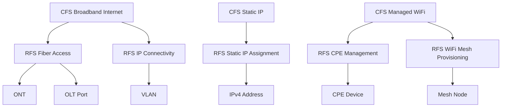
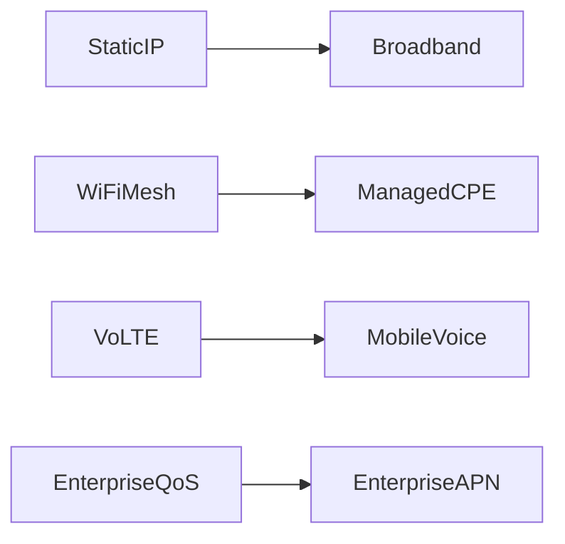
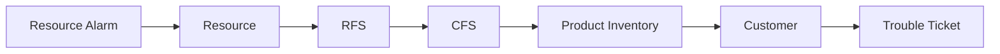

# Part 016 — Service Catalog, CFS/RFS & Service Decomposition

## 1. Tujuan Part Ini

Part ini membahas **Service Catalog, Customer-Facing Service (CFS), Resource-Facing Service (RFS), dan Service Decomposition**.

Sampai Part 015, fokus kita berada di commercial dan monetization side:

```text
party -> customer -> account -> product catalog -> quote -> product order -> subscription -> charging -> billing -> revenue assurance
```

Mulai part ini kita masuk ke fulfillment side:

```text
product order
  -> product order item
  -> service intent
  -> service specification
  -> CFS/RFS decomposition
  -> service order
  -> resource allocation
  -> activation/provisioning
  -> service inventory
```

Masalah utama di telco bukan hanya “order diterima”. Masalah utamanya adalah menerjemahkan janji komersial menjadi layanan teknis yang bisa diaktifkan, dimonitor, diperbaiki, dan ditagih.

Mental model utama:

```text
Product = what the customer buys.
Service = what the provider commits to deliver.
Resource = what the network/platform uses to realize the service.
```

Jika tiga layer ini dicampur, BSS/OSS akan cepat rusak:

```text
Product catalog menjadi penuh VLAN, APN, IMSI, QoS class, port, OLT, router.
Network provisioning menjadi tahu campaign/discount/contract.
Billing menjadi tergantung field teknis provisioning.
Assurance tidak bisa menghitung customer impact.
```

---

## 2. Kaufman Skill Target

Target praktis part ini:

1. membedakan Product, Service, Resource secara operasional;
2. memahami CFS dan RFS sebagai lapisan decomposition;
3. mendesain service catalog yang tidak sekadar mirror product catalog;
4. membuat decomposition rule dari product order item ke service order item;
5. memahami service specification graph, dependency, compatibility, and versioning;
6. mendesain Java service catalog dan decomposition engine;
7. menghindari anti-pattern seperti product-specific provisioning script dan giant fulfillment workflow;
8. membangun mental model fulfillment plan yang bisa di-reason, diuji, di-replay, dan dioperasikan.

Kriteria mampu:

```text
Diberikan product offering “Fiber Home 100Mbps + Static IP + WiFi Mesh + VoIP”,
Anda bisa menurunkannya menjadi CFS, RFS, resource requirement, service order items,
allocation dependency, activation steps, dan service inventory target state.
```

---

## 3. Industry Reference Anchors

Reference yang relevan:

| Area | Reference Anchor | Relevansi |
|---|---|---|
| Service catalog | TMF633 Service Catalog Management | Lifecycle service catalog elements and consultation during ordering. |
| Service ordering | TMF641 Service Ordering | Standard mechanism to place service order with necessary order parameters. |
| Service inventory | TMF638 Service Inventory | Query/manipulate service inventory. |
| Service activation/configuration | TMF640 Service Activation and Configuration | Activation/configuration of services toward network/resource layer. |
| Product catalog | TMF620 Product Catalog | Commercial offer/spec source that maps to service realization. |
| Product ordering | TMF622 Product Ordering | Product order intent entering fulfillment. |
| Resource inventory | TMF639 Resource Inventory | Resource reservation/assignment evidence. |

Practical interpretation:

```text
TMF620 defines what can be sold.
TMF622 captures what was ordered.
TMF633 defines what services can be designed/delivered.
TMF641 carries service execution intent.
TMF638 records service instances.
TMF639 records resources used by those services.
TMF640 activates/configures the service/resource layer.
```

---

## 4. Product vs Service vs Resource

### 4.1 Product

Product is commercial.

Examples:

```text
Fiber Home 100Mbps
Postpaid 50GB Plan
Enterprise MPLS VPN Gold
IoT Connectivity 10,000 SIM Package
Static IP Add-On
Roaming Pass 7 Days
```

Product concerns:

1. price;
2. eligibility;
3. bundling;
4. contract;
5. customer segment;
6. sales channel;
7. billing behavior;
8. commercial lifecycle.

### 4.2 Service

Service is what the provider delivers to the customer or internally composes.

Examples:

```text
Broadband Internet Access Service
Voice Access Service
Mobile Data Service
Static IP Service
Enterprise VPN Service
QoS Bearer Service
Messaging Service
```

Service concerns:

1. service state;
2. SLA/SLS;
3. customer-facing capability;
4. technical realization requirement;
5. monitoring/assurance;
6. dependency;
7. activation lifecycle.

### 4.3 Resource

Resource is the concrete network/platform asset.

Examples:

```text
MSISDN
IMSI
ICCID
SIM/eSIM profile
IP address
VLAN
ONT
OLT port
CPE device
router config
APN
QoS profile
5G slice resource
VNFC/CNF instance
```

Resource concerns:

1. reservation;
2. assignment;
3. capacity;
4. uniqueness;
5. topology;
6. physical/logical ownership;
7. activation command;
8. discovery/reconciliation.

---

## 5. The CFS/RFS Mental Model

CFS/RFS helps separate customer promise from technical realization.

```text
CFS = Customer-Facing Service
RFS = Resource-Facing Service
```

CFS answers:

```text
What service capability does the customer experience or contractually receive?
```

RFS answers:

```text
What internal technical service must be created/configured to realize the CFS?
```

Example:

```text
Product: Fiber Home 100Mbps
CFS: Residential Broadband Internet Access
RFS:
  - Fiber Access Service
  - IP Connectivity Service
  - CPE Management Service
  - DNS Resolver Service
  - Optional Static IP Service
Resources:
  - ONT
  - OLT port
  - VLAN
  - IP address
  - CPE device
  - subscriber profile
```

Diagram:



---

## 6. Why CFS/RFS Matters

Without CFS/RFS separation, systems become brittle.

### 6.1 Product Explosion

Bad:

```text
Every product offering maps directly to provisioning scripts.
```

Example:

```text
Fiber100CampaignA_ProvisioningScript
Fiber100CampaignB_ProvisioningScript
Fiber100BundleWithStaticIpScript
Fiber100BundleWithoutStaticIpScript
```

This creates duplicate logic and hard-to-control changes.

Good:

```text
Product offering maps to stable service specifications with configurable characteristics.
```

### 6.2 Network Leakage Into Product Catalog

Bad product characteristics:

```text
oltVendorProfileId
brasCommandTemplate
radiusPolicyName
vlanPoolId
```

Good approach:

```text
Product catalog uses commercial/service-level characteristics.
Service decomposition resolves technical resource profile.
```

### 6.3 Assurance Cannot Map Impact

If product and resource are directly linked without service layer:

```text
OLT port failure -> which customer product is impacted?
```

You need topology:

```text
resource -> RFS -> CFS -> product inventory -> customer/account/agreement
```

### 6.4 Fulfillment Cannot Evolve

Network changes happen often:

```text
legacy HLR -> HSS/UDM
physical router -> SDN controller
VM-based VNF -> CNF
manual CPE config -> TR-069/USP automation
```

Product should not change every time resource implementation changes.

---

## 7. Service Catalog Contents

A service catalog should model **service specifications**, not service instances.

Service specification fields:

| Field | Meaning |
|---|---|
| `serviceSpecificationId` | Stable identity. |
| `version` | Version of service design. |
| `name` | Domain language name. |
| `serviceType` | CFS or RFS category. |
| `lifecycleStatus` | Draft, active, retired. |
| `characteristics` | Parameters allowed on service instance. |
| `constraints` | Eligibility/compatibility/service design rules. |
| `dependencies` | Required child service specs. |
| `resourceRequirements` | Resource specs needed. |
| `activationPolicy` | How service is activated/configured. |
| `assurancePolicy` | Alarm/KPI/service impact expectation. |
| `versionEffectivePeriod` | Validity. |

Example:

```yaml
serviceSpecificationId: CFS-BROADBAND-INTERNET
version: 3.2
serviceType: CFS
lifecycleStatus: ACTIVE
characteristics:
  - name: downstreamSpeedMbps
    type: integer
    allowedValues: [50, 100, 300, 500, 1000]
  - name: upstreamSpeedMbps
    type: integer
  - name: accessTechnology
    type: enum
    allowedValues: [FTTH, FWA, DOCSIS]
dependencies:
  - RFS-ACCESS-FIBER
  - RFS-IP-CONNECTIVITY
optionalDependencies:
  - RFS-STATIC-IP
  - RFS-CPE-MANAGEMENT
assurancePolicy:
  kpis:
    - availability
    - latency
    - packetLoss
```

---

## 8. Service Instance vs Service Specification

Do not confuse spec and instance.

```text
Service Specification = reusable design template
Service Instance      = actual service delivered to customer/account/product
```

Example:

```text
Spec:
  CFS-BROADBAND-INTERNET v3.2

Instance:
  serviceId = SVC-8899
  productId = PROD-123
  customerId = C-100
  downstreamSpeedMbps = 100
  accessTechnology = FTTH
  state = ACTIVE
```

Rule:

```text
Orders create/modify/terminate service instances based on service specifications.
```

---

## 9. Product-to-Service Mapping

Product catalog and service catalog are separate but connected.



Mapping example:

```yaml
productSpecificationId: PROD-FIBER-HOME
productOfferingId: OFFER-FIBER-100M-STATIC-IP
productVersion: 2026.06
serviceMappings:
  - serviceSpecificationId: CFS-BROADBAND-INTERNET
    version: 3.2
    characteristicMap:
      downstreamSpeedMbps: product.characteristics.speedDown
      upstreamSpeedMbps: product.characteristics.speedUp
      accessTechnology: FTTH
  - serviceSpecificationId: CFS-STATIC-IP
    condition: product.addons.staticIp == true
```

Important:

```text
Product offering is not the same as service specification.
The same product can map to different service design by region/network technology.
The same service spec can support many product offerings.
```

---

## 10. Service Decomposition

Service decomposition converts product order intent into service order plan.

Input:

```text
ProductOrderItem(action=add, productOffering=Fiber100StaticIp, customerSite=Site-1)
```

Output:

```text
ServiceOrder
  item 1: add CFS Broadband Internet
  item 2: add RFS Fiber Access
  item 3: add RFS IP Connectivity
  item 4: add RFS Static IP
  item 5: add RFS CPE Management
```

Decomposition is not just tree expansion. It must consider:

1. existing inventory;
2. modification vs add;
3. resource availability;
4. site technology;
5. region/vendor constraints;
6. dependency order;
7. rollback/compensation;
8. customer appointment;
9. activation windows;
10. compatibility with existing services.

---

## 11. Decomposition Flow



Key rule:

```text
Decomposition should use catalog/version snapshot from order time,
not whatever catalog happens to be active when async fulfillment runs.
```

---

## 12. Decomposition Output: Fulfillment Plan

A fulfillment plan should be explicit.

```java
public record FulfillmentPlan(
    FulfillmentPlanId id,
    ProductOrderId productOrderId,
    String catalogSnapshotId,
    List<ServicePlanItem> items,
    List<PlanDependency> dependencies,
    PlanRisk risk,
    Instant createdAt
) {}

public record ServicePlanItem(
    String itemId,
    ServiceSpecificationId serviceSpecId,
    ServiceAction action,
    Map<String, Object> characteristics,
    Optional<String> existingServiceId,
    List<ResourceRequirement> resourceRequirements
) {}

public enum ServiceAction {
    ADD, MODIFY, DELETE, NO_CHANGE
}
```

Dependency:

```java
public record PlanDependency(
    String beforeItemId,
    String afterItemId,
    DependencyType type
) {}

public enum DependencyType {
    REQUIRES,
    ALLOCATE_BEFORE_ACTIVATE,
    ACTIVATE_BEFORE_PARENT_COMPLETE,
    DEACTIVATE_BEFORE_RELEASE
}
```

---

## 13. Service Graph Example: Fiber Home

Product order:

```text
Add Fiber Home 100Mbps + Static IP + WiFi Mesh
```

Service graph:



Activation order may be:

```text
1. reserve OLT port
2. reserve ONT/CPE
3. reserve VLAN
4. reserve IP address
5. create fiber access RFS
6. create IP connectivity RFS
7. create static IP RFS
8. configure CPE management
9. create CFS broadband
10. mark service active
```

But field appointment may insert manual dependencies:

```text
install ONT before activate fiber access
customer no-access pauses plan
```

---

## 14. Add, Modify, Delete Decomposition

### 14.1 Add

Add creates new service instances and resource assignments.

```text
ProductOrderItem(action=add)
  -> ServiceOrderItem(action=add CFS)
  -> ServiceOrderItem(action=add RFS...)
  -> Resource reservation/assignment
```

### 14.2 Modify

Modify is harder than add.

Example:

```text
Upgrade Fiber 100Mbps -> 300Mbps
```

Possible result:

```text
CFS Broadband: modify speed characteristic
RFS Fiber Access: no change
RFS IP Connectivity: modify QoS/profile
Resource: no new resource
```

But another region may require resource replacement:

```text
CPE does not support 300Mbps
-> replace CPE
-> technician appointment
```

Modify decomposition must be state-aware:

```text
desired service state - current service state = delta plan
```

### 14.3 Delete/Terminate

Terminate must respect dependency and retention rules.

```text
terminate CFS
  -> deactivate RFS
  -> release resources after retention period
  -> keep historical service inventory for audit
```

Never delete service history physically just because customer terminates.

---

## 15. State-Aware Decomposition

Naive decomposition:

```text
Product says static IP = true -> always add static IP service.
```

Correct decomposition:

```text
if static IP service already exists and active:
  no_change or modify
else:
  add static IP service
```

State-aware inputs:

1. current product inventory;
2. current service inventory;
3. current resource inventory;
4. pending orders;
5. planned network changes;
6. appointment state;
7. customer site state;
8. migration state.

This prevents duplicate service/resource allocation.

---

## 16. Service Characteristics

Characteristics are typed parameters on service specs/instances.

Examples:

```text
downstreamSpeedMbps = 100
accessTechnology = FTTH
ipAddressType = STATIC
qosProfile = GOLD
apnName = enterprise.apn
sliceType = eMBB
```

Rules:

1. characteristics must be typed;
2. allowed values must be controlled;
3. effective date matters;
4. some characteristics are customer-visible, some internal;
5. characteristic changes may trigger modification order;
6. avoid storing arbitrary JSON without validation.

Java model:

```java
public record ServiceCharacteristicSpec(
    String name,
    CharacteristicType type,
    boolean required,
    Set<String> allowedValues,
    Optional<String> defaultValue,
    boolean customerVisible,
    boolean activationRelevant
) {}

public enum CharacteristicType {
    STRING, INTEGER, DECIMAL, BOOLEAN, ENUM, DATE, OBJECT
}
```

---

## 17. Service Compatibility Rules

Service catalog must express compatibility.

Examples:

```text
Static IP requires Broadband Internet.
WiFi Mesh requires Managed CPE.
VoLTE requires compatible SIM/device/profile.
Enterprise QoS requires enterprise APN.
Fiber 1Gbps requires access technology and CPE support.
```

Rule styles:

### 17.1 Declarative Rule

```yaml
ruleId: STATIC_IP_REQUIRES_BROADBAND
when:
  service: CFS-STATIC-IP
mustHave:
  service: CFS-BROADBAND-INTERNET
  state: ACTIVE_OR_PLANNED
```

### 17.2 Predicate Rule

```java
public interface ServiceCompatibilityRule {
    RuleResult evaluate(ServiceDesignContext context);
}
```

### 17.3 Constraint Graph



Avoid rules buried only in provisioning scripts. They must be visible before order submission or before decomposition finalization.

---

## 18. Versioning

Service spec versioning is critical.

Rule:

```text
A service instance must know which service specification version created it.
```

Because:

1. activation behavior changes;
2. resource requirements change;
3. assurance KPI changes;
4. modification compatibility depends on original design;
5. migration needs target version.

Example:

```text
CFS-BROADBAND-INTERNET v3.1 used VLAN model A
CFS-BROADBAND-INTERNET v3.2 uses SDN profile model B
```

Existing service instances should not silently switch interpretation because catalog changed.

Version fields:

```text
serviceSpecId
serviceSpecVersion
catalogSnapshotId
effectiveFrom
effectiveTo
migrationPolicy
```

---

## 19. Service Inventory Target State

Fulfillment should create/update service inventory.

Service instance fields:

```text
serviceId
serviceSpecificationId
serviceSpecificationVersion
productId
customerId
accountId
siteId
state
operatingStatus
characteristics
relatedServices
relatedResources
startDate
endDate
activationDate
lastModifiedAt
```

State examples:

```text
FEASIBILITY_CHECKED
DESIGNED
RESERVED
PENDING_ACTIVATION
ACTIVE
SUSPENDED
PENDING_TERMINATION
TERMINATED
FAILED
```

Distinguish:

```text
lifecycle state     = commercial/fulfillment lifecycle
operating status    = technical health/status
administrative flag = operator/customer restriction
```

Example:

```text
state = ACTIVE
operatingStatus = DEGRADED
adminStatus = UNLOCKED
```

---

## 20. Service Order Generation

After decomposition, Product Order Management can create Service Order.

Service Order contains:

```text
serviceOrderId
relatedProductOrderId
serviceOrderItems
action per item
service specification reference
service instance target/current reference
characteristics
dependencies
requested start/completion
priority
appointment/site context
```

Service order item example:

```yaml
serviceOrderItemId: SOI-1
action: add
service:
  serviceSpecificationId: CFS-BROADBAND-INTERNET
  serviceSpecificationVersion: 3.2
  characteristic:
    downstreamSpeedMbps: 100
    accessTechnology: FTTH
relatedProductOrderItem: POI-1
dependsOn:
  - SOI-2
  - SOI-3
```

---

## 21. Java Decomposition Engine Design

Core interfaces:

```java
public interface DecompositionEngine {
    FulfillmentPlan decompose(ProductOrder order, DecompositionContext context);
}

public interface ProductServiceMappingRepository {
    List<ProductServiceMapping> findMappings(ProductSpecId productSpecId, CatalogSnapshotId snapshotId);
}

public interface ServiceCatalogRepository {
    ServiceSpecification get(ServiceSpecificationId id, String version);
}

public interface InventoryReader {
    ExistingState loadExistingState(CustomerId customerId, SiteId siteId);
}
```

Implementation skeleton:

```java
public final class DefaultDecompositionEngine implements DecompositionEngine {
    private final ProductServiceMappingRepository mappingRepository;
    private final ServiceCatalogRepository serviceCatalog;
    private final InventoryReader inventoryReader;
    private final CompatibilityEvaluator compatibilityEvaluator;
    private final ResourceRequirementResolver resourceRequirementResolver;
    private final PlanGraphBuilder planGraphBuilder;

    @Override
    public FulfillmentPlan decompose(ProductOrder order, DecompositionContext context) {
        ExistingState existingState = inventoryReader.loadExistingState(
            order.customerId(),
            order.siteId()
        );

        List<ServicePlanItem> items = new ArrayList<>();

        for (ProductOrderItem item : order.items()) {
            List<ProductServiceMapping> mappings = mappingRepository.findMappings(
                item.productSpecId(),
                order.catalogSnapshotId()
            );

            for (ProductServiceMapping mapping : mappings) {
                if (!mapping.condition().matches(item, existingState, context)) {
                    continue;
                }

                ServiceSpecification spec = serviceCatalog.get(
                    mapping.serviceSpecificationId(),
                    mapping.serviceSpecificationVersion()
                );

                ServiceAction action = resolveAction(item.action(), spec, existingState);
                Map<String, Object> characteristics = mapping.mapCharacteristics(item);

                compatibilityEvaluator.validate(spec, characteristics, existingState, context);

                List<ResourceRequirement> requirements = resourceRequirementResolver.resolve(
                    spec,
                    characteristics,
                    context
                );

                items.add(new ServicePlanItem(
                    UUID.randomUUID().toString(),
                    spec.id(),
                    action,
                    characteristics,
                    existingState.findServiceId(spec.id()),
                    requirements
                ));
            }
        }

        return planGraphBuilder.build(order.id(), order.catalogSnapshotId(), items);
    }
}
```

Important: production code should avoid random UUID inside deterministic decomposition if replay needs same item IDs. Use stable deterministic IDs derived from order item + service spec + action.

---

## 22. Deterministic Plan IDs

For idempotency, derive IDs:

```java
public final class PlanIdFactory {
    public String servicePlanItemId(
            ProductOrderId orderId,
            ProductOrderItemId itemId,
            ServiceSpecificationId serviceSpecId,
            ServiceAction action
    ) {
        String raw = orderId.value() + "|" + itemId.value() + "|" + serviceSpecId.value() + "|" + action.name();
        return "SPI-" + sha256(raw).substring(0, 24);
    }
}
```

Why:

```text
If decomposition retry happens, it should produce the same plan item identities.
```

---

## 23. Decomposition Validation

Before creating service order, validate:

1. all required service specs resolved;
2. catalog versions are active/effective for order snapshot;
3. required characteristics present;
4. compatibility rules pass;
5. resource requirements can be reserved or at least planned;
6. dependencies form DAG, not cycle;
7. modification has existing service instance;
8. delete does not break required dependent service unless included;
9. action set is consistent with product order action;
10. service order can be safely retried.

Cycle detection example:

```text
CFS-A requires RFS-B
RFS-B requires RFS-C
RFS-C requires CFS-A
```

This must fail catalog validation before runtime order impact.

---

## 24. Decomposition Failure Modes

### 24.1 Missing Mapping

```text
Product specification has no service mapping.
```

Impact:

```text
Order cannot be fulfilled.
```

Classification:

```text
catalog configuration fallout
```

### 24.2 Ambiguous Mapping

```text
Two service mappings match same product/site condition.
```

Impact:

```text
Duplicate service plan or wrong technology selection.
```

### 24.3 Current Inventory Conflict

```text
Customer already has static IP service but order tries to add another static IP.
```

Possible outcomes:

1. no change;
2. modify existing;
3. reject order;
4. allow if business supports multiple static IPs.

### 24.4 Resource Not Available

```text
No OLT port or IP address available.
```

Output should be controlled fallout, not generic failure.

### 24.5 Catalog Version Drift

```text
Order captured with catalog v1; decomposition runs after v2 is activated.
```

Fix:

```text
order must carry catalog snapshot/version.
```

---

## 25. Fulfillment Plan as Contract

A fulfillment plan should be treated as contract between Product Order Management and Service Order Management.

It must answer:

```text
What service instances are expected?
What actions are required?
What characteristics are used?
What dependencies exist?
What resources must be allocated?
What catalog versions apply?
What existing service instances are modified?
What fallout owner handles failure?
```

Do not send vague instruction:

```text
activate product Fiber100
```

Send explicit plan:

```text
add CFS broadband
add RFS fiber access
add RFS IP connectivity
reserve ONT, OLT port, VLAN
activate in dependency order
```

---

## 26. Relationship to Assurance

Service catalog is not only for fulfillment. It also drives assurance.

If the service catalog says:

```text
CFS Broadband Internet depends on RFS Fiber Access and RFS IP Connectivity
```

Then assurance can infer:

```text
RFS Fiber Access alarm impacts CFS Broadband Internet
CFS Broadband Internet impacts Product Fiber Home
Product Fiber Home impacts Customer A
Customer A has SLA/notification policy
```

This is why service topology matters.



---

## 27. Relationship to Billing and Revenue Assurance

Service catalog indirectly affects revenue.

Examples:

1. service active but product not active -> potential free service;
2. product active but service not active -> customer dispute/refund;
3. service characteristic differs from product promise -> wrong charge/SLA;
4. resource assigned without product/service -> leakage or inventory drift;
5. service terminated but recurring charge still active -> overbilling.

Revenue assurance controls need service inventory and service catalog semantics.

---

## 28. Anti-Patterns

### 28.1 Product Catalog as Network Catalog

Bad:

```text
Product offering includes vendor-specific commands and network profile IDs.
```

Impact:

1. product changes require network engineer;
2. vendor migration breaks commercial catalog;
3. sales cannot reason about offer independently;
4. provisioning scripts duplicate business logic.

### 28.2 Service Catalog as Static Wiki

Bad:

```text
Service catalog exists as Confluence page, not executable metadata.
```

Good:

```text
Service catalog is versioned, queryable, validated, and used by decomposition.
```

### 28.3 One Giant Fulfillment Workflow

Bad:

```text
A single BPMN/workflow knows every product, service, resource, region, vendor, and exception.
```

Good:

```text
Decomposition creates plan; orchestration executes plan; adapters perform technical actions.
```

### 28.4 No Current-State Comparison

Bad:

```text
Modify order decomposes as full delete + add without considering current service inventory.
```

Impact:

1. unnecessary outage;
2. resource churn;
3. duplicate provisioning;
4. wrong billing start/end.

### 28.5 Runtime Catalog Lookup Without Snapshot

Bad:

```text
Async fulfillment uses latest active catalog, not order-time catalog.
```

Impact:

```text
Customer bought one design, fulfillment executes another.
```

---

## 29. Catalog Governance

Service catalog changes must be governed.

Checklist:

- [ ] every service spec has owner;
- [ ] every service spec has version;
- [ ] every characteristic has type and allowed values;
- [ ] every dependency graph is cycle-free;
- [ ] every resource requirement is resolvable;
- [ ] every activation policy has adapter owner;
- [ ] every assurance policy has observable KPI/alarm mapping;
- [ ] every product mapping has effective date;
- [ ] every retired spec has migration policy;
- [ ] every change is tested against representative product orders.

Catalog test cases:

```text
Can decompose all active product offerings?
Can modify all active service instances from vN to vN+1?
Can terminate bundle cleanly?
Can reject incompatible add-on before provisioning?
Can simulate resource shortage?
Can detect cycle in service dependency graph?
```

---

## 30. Testing Decomposition

### 30.1 Golden Scenario Tests

Example:

```text
Input: Fiber 100Mbps + Static IP
Expected services: Broadband CFS, Static IP CFS, Fiber RFS, IP RFS, Static IP RFS
Expected resources: ONT, OLT port, VLAN, IP address
```

### 30.2 Mutation Tests

Change one condition:

```text
accessTechnology = FWA instead of FTTH
```

Expected:

```text
Fiber RFS replaced by FWA Access RFS
```

### 30.3 Existing Inventory Tests

Input:

```text
customer already has Broadband CFS active
order adds Static IP
```

Expected:

```text
no duplicate Broadband CFS
add Static IP CFS/RFS only
```

### 30.4 Version Snapshot Tests

Input:

```text
order captured with catalog snapshot S1
catalog S2 activated before decomposition retry
```

Expected:

```text
decomposition still uses S1
```

---

## 31. Practice: Decompose Mobile Postpaid Plan

Scenario:

```text
Product: Mobile Postpaid 50GB + VoLTE + International Roaming
Customer has compatible SIM and device.
```

Create:

1. product-to-service mapping;
2. CFS list;
3. RFS list;
4. resource requirement list;
5. service order items;
6. dependency graph;
7. failure modes.

Possible model:

```text
CFS Mobile Connectivity
CFS Mobile Data
CFS Voice
CFS VoLTE
CFS Roaming
RFS SIM Profile
RFS Subscriber Profile
RFS APN/Data Profile
RFS IMS Voice Profile
RFS Roaming Service Profile
Resources: MSISDN, IMSI, ICCID/eSIM, APN profile, policy profile
```

---

## 32. Practice: Decompose Enterprise VPN

Scenario:

```text
Product: Enterprise MPLS VPN Gold, 3 sites, SLA 99.95%, QoS Gold, managed router.
```

Think through:

1. CFS Enterprise VPN;
2. CFS Managed Router;
3. RFS Access Circuit per site;
4. RFS VPN Routing;
5. RFS QoS Policy;
6. resource requirements: circuit, CPE/router, port, IP, VRF, QoS profile;
7. dependency: site access before VPN complete;
8. assurance: SLA/KPI by site and end-to-end service.

---

## 33. Top 1% Engineering Lens

A strong engineer does not ask only:

```text
Can this product be provisioned?
```

They ask:

```text
What customer-facing service is promised?
What resource-facing services realize it?
What resources are required?
What state already exists?
What should be added, modified, deleted, or left unchanged?
What version of catalog is used?
What dependency order is safe?
What failure becomes fallout?
What service inventory should exist after completion?
How will assurance know customer impact later?
How will revenue assurance know active service/product alignment?
```

Service decomposition is where commercial intent becomes operational truth.

---

## 34. Summary

Service catalog and decomposition are the bridge between BSS commercial ordering and OSS fulfillment/assurance.

Core model:

```text
Product
  -> CFS
  -> RFS
  -> Resource
```

Core flow:

```text
Product Order
  -> Product-Service Mapping
  -> Service Specification Graph
  -> State-Aware Decomposition
  -> Fulfillment Plan
  -> Service Order
  -> Resource Allocation
  -> Activation
  -> Service Inventory
```

Good design keeps:

1. commercial language in product catalog;
2. service promise in service catalog;
3. technical realization in RFS/resource layer;
4. execution in service order/orchestration;
5. actual state in inventory;
6. impact analysis in topology.

---

## 35. Next Part

Next: **Part 017 — Service Order Management**.

Kita akan membahas bagaimana fulfillment plan dieksekusi sebagai service order lifecycle: dependency graph, partial completion, compensation, fallout, rollback boundary, and operational state machine.
