# Part 017 — Service Order Management

## 1. Posisi Part Ini Dalam Seri

Kita sudah melewati commercial side dari BSS: customer, account, agreement, catalog, qualification, quote, product order, subscription, charging, billing, dan revenue assurance. Kita juga sudah membuka fulfillment side melalui **Service Catalog, CFS/RFS, dan service decomposition**.

Part ini membahas **Service Order Management** atau **SOM**.

Kalau Product Order Management menjawab:

> “Apa yang dibeli customer, dengan komitmen komersial apa, dan apa saja item yang harus dipenuhi?”

Service Order Management menjawab:

> “Layanan teknis apa yang harus dibuat/diubah/dihapus, dalam urutan apa, dengan dependency apa, dan kapan fulfillment dianggap selesai secara operasional?”

SOM adalah jembatan antara commercial intent dan technical execution.

Dalam sistem telco, kesalahan paling mahal sering terjadi karena boundary ini kabur. Product order langsung memanggil provisioning adapter. Inventory langsung diubah oleh sales journey. Activation command langsung dianggap sama dengan subscription active. Semua ini menciptakan sistem yang cepat demo, tetapi rapuh saat masuk skala operator.

SOM yang baik membuat fulfillment menjadi:

- dapat diaudit,
- dapat diulang secara aman,
- dapat dikompensasi,
- dapat direkonsiliasi,
- dapat dipantau,
- dan dapat ditangani manual saat automation gagal.

## 2. Kaufman Skill Target

Mengikuti pendekatan Josh Kaufman, target performa untuk part ini bukan “hafal TMF641”, melainkan:

> Kamu mampu merancang Service Order Management component di Java yang menerima service order, memvalidasi dependency, menjalankan fulfillment sebagai graph, menangani partial failure, mengeluarkan event yang benar, dan menjaga konsistensi antara service inventory, resource inventory, activation system, dan product/subscription lifecycle.

Sub-skill yang perlu dikuasai:

1. membedakan product order, service order, resource order, dan activation command;
2. memodelkan service order item sebagai action terhadap CFS/RFS;
3. membuat lifecycle state machine yang tidak ambigu;
4. mengeksekusi item graph dengan dependency dan barrier;
5. menangani cancellation, amendment, retry, compensation, dan fallout;
6. menjaga idempotency dan correlation lintas sistem;
7. mendesain Java aggregate, repository, event, dan worker;
8. membuat observability yang menjawab “order ini macet di mana dan kenapa?”;
9. membedakan technical completion dari commercial activation;
10. membuat reconciliation loop untuk service order yang stuck atau inconsistent.

## 3. Mental Model: Service Order Sebagai Execution Contract

Service order bukan sekadar request API. Service order adalah **execution contract**.

Ia berisi:

- service apa yang akan dibuat, diubah, atau dihentikan;
- karakteristik teknis yang diperlukan;
- dependency antar item;
- customer/service context;
- target site/location;
- reference ke product order atau case;
- state eksekusi;
- evidence dari setiap langkah fulfillment;
- alasan kegagalan dan repair action.

Service order harus cukup kaya untuk menjalankan fulfillment, tetapi tidak boleh menjadi tempat semua detail low-level network command.

Boundary yang sehat:

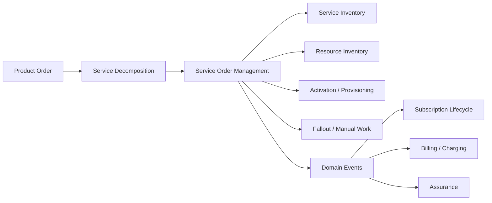

Rule of thumb:

- Product order menyimpan commercial intent.
- Service order menyimpan fulfillment intent.
- Service inventory menyimpan service instance result.
- Resource inventory menyimpan allocated/assigned resources.
- Activation system menyimpan command/equipment execution result.
- Subscription lifecycle menyimpan customer entitlement.

Jangan mencampur lima hal itu ke satu tabel `orders`.

## 4. Service Order Management Bukan Apa

SOM sering disalahpahami. Untuk menghindari desain yang salah, mulai dari negative definition.

### 4.1 SOM Bukan Product Order Management

Product order berorientasi customer dan commercial offer.

Contoh product order item:

- add `Home Fiber 100 Mbps`,
- modify `Mobile Plan 50 GB` menjadi `Mobile Plan 100 GB`,
- terminate `Enterprise VPN Site A`,
- suspend product karena collection.

Service order item lebih teknis:

- create `Internet Access CFS`,
- create `ONT Provisioning RFS`,
- assign `IPv4 Static Address`,
- activate `QoS Profile`,
- modify `Access Speed Profile`,
- disconnect `SIP Trunk RFS`.

Product order boleh memiliki pricing, promotion, campaign, eligibility, quote reference. Service order tidak perlu membawa pricing logic.

### 4.2 SOM Bukan BPMN Engine

BPMN/workflow engine dapat dipakai untuk mengeksekusi proses fulfillment, tetapi SOM tetap domain component.

Kesalahan umum:

> Semua state service order disimpan sebagai process variable di workflow engine.

Akibatnya:

- domain state tidak eksplisit,
- audit susah,
- query operasional mahal,
- replay/reconciliation sulit,
- upgrade workflow merusak order historis,
- dependency domain tersembunyi dalam diagram.

Pola yang lebih aman:

- SOM menyimpan aggregate dan state domain.
- Workflow engine hanya menjalankan orchestration plan.
- Semua transition penting kembali ke SOM sebagai command/event.

### 4.3 SOM Bukan Activation Adapter

Activation adapter tahu cara bicara dengan HLR/HSS/UDM/PCF/OLT/BRAS/DNS/IPAM/AAA/IMS platform.

SOM tahu **apa** yang perlu diaktifkan dan urutan eksekusinya, bukan command spesifik vendor.

Contoh:

- SOM: `Activate InternetAccessService with speedProfile=100M and ipMode=dynamic`.
- Adapter: translate ke command vendor, API call, CLI, NETCONF, gNMI, SOAP, atau mediation platform.

### 4.4 SOM Bukan Resource Inventory

SOM boleh meminta reservation/allocation resource. Tetapi inventory tetap authoritative owner untuk resource state.

SOM tidak boleh melakukan:

```sql
UPDATE msisdn SET state = 'ASSIGNED' WHERE number = '62812...';
```

SOM harus mengirim command ke Resource Inventory/Allocation service dan menerima result.

## 5. Vocabulary Minimum

Gunakan vocabulary berikut secara konsisten.

| Istilah | Makna |
|---|---|
| Service Order | Permintaan fulfillment untuk membuat/mengubah/menghapus service instance. |
| Service Order Item | Unit action dalam service order, biasanya terhadap CFS/RFS atau service candidate. |
| Action | `add`, `modify`, `delete`, `noChange`, atau action domain lain yang dibatasi. |
| CFS | Customer-Facing Service, abstraksi layanan yang tampak dalam customer/service context. |
| RFS | Resource-Facing Service, abstraksi teknis yang bergantung pada resource/network capability. |
| Service Specification | Template/model service dari service catalog. |
| Service Instance | Instance aktual dalam service inventory. |
| Orchestration Plan | Rencana eksekusi yang menurunkan item order menjadi steps/tasks. |
| Dependency | Relasi urutan atau prasyarat antar item/step. |
| Fallout | Kondisi eksekusi yang gagal dan memerlukan retry, repair, manual action, atau cancellation. |
| Completion Evidence | Bukti bahwa step/order benar-benar selesai, bukan hanya request terkirim. |

## 6. Relationship Product Order → Service Order

Satu product order dapat menghasilkan satu atau banyak service order.

Tergantung desain organisasi dan domain, pola yang umum:

1. **One product order → one service order**
   Cocok untuk product sederhana.

2. **One product order → many service orders by service domain**
   Misalnya mobile access, fixed access, voice, billing integration, CPE logistics.

3. **One product order item → one service order**
   Sederhana untuk traceability, tetapi bisa menyulitkan dependency antar item.

4. **One product order → parent service order + child service orders**
   Cocok untuk enterprise/complex service.

Mental model yang aman:

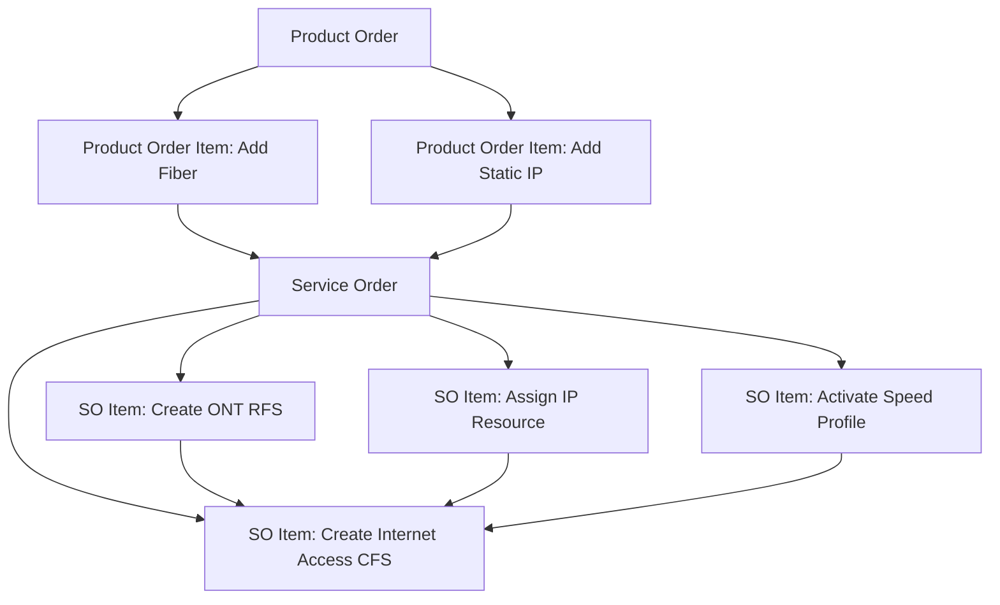

Product order item tetap menjadi trace parent, tetapi fulfillment dieksekusi dalam service order graph.

## 7. Service Order Item Sebagai Action Terhadap Service

Service order item bukan “task bebas”. Ia harus terkait dengan service candidate atau service instance.

Contoh bentuk konseptual:

```json
{
  "id": "soi-1001",
  "action": "add",
  "service": {
    "serviceSpecificationId": "internet-access-cfs-v3",
    "serviceType": "InternetAccess",
    "serviceCharacteristic": [
      { "name": "accessTechnology", "value": "FTTH" },
      { "name": "downloadSpeed", "value": "100Mbps" },
      { "name": "ipMode", "value": "dynamic" }
    ],
    "place": {
      "siteId": "site-7788"
    }
  },
  "dependsOn": ["soi-1000"]
}
```

Untuk modify:

```json
{
  "id": "soi-2001",
  "action": "modify",
  "service": {
    "id": "svc-99881",
    "serviceSpecificationId": "internet-access-cfs-v3",
    "serviceCharacteristic": [
      { "name": "downloadSpeed", "oldValue": "100Mbps", "value": "300Mbps" }
    ]
  }
}
```

Untuk delete:

```json
{
  "id": "soi-3001",
  "action": "delete",
  "service": {
    "id": "svc-99881"
  }
}
```

Invariant:

- `add` membuat service instance baru.
- `modify` membutuhkan existing service instance.
- `delete` membutuhkan existing service instance.
- `noChange` tidak boleh mengeksekusi activation baru; biasanya hanya menjaga dependency atau reference.
- Semua action harus idempotent terhadap `orderId + itemId + action`.

## 8. State Machine Service Order

State harus cukup ekspresif untuk operasi, tetapi tidak terlalu banyak sampai tidak konsisten.

Model normalisasi yang praktis:

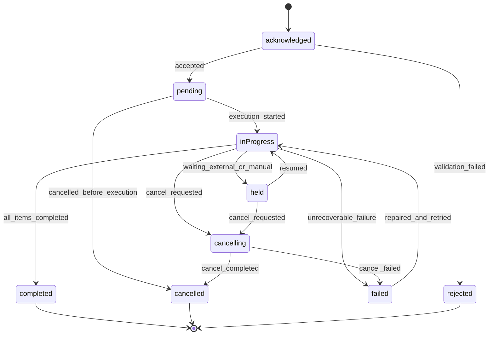

### 8.1 State Semantics

| State | Makna | Boleh Eksekusi? | Terminal? |
|---|---|---:|---:|
| `acknowledged` | Order diterima secara teknis, belum divalidasi penuh. | Tidak | Tidak |
| `rejected` | Order tidak valid dan tidak akan dieksekusi. | Tidak | Ya |
| `pending` | Valid dan menunggu execution slot/dependency. | Tidak langsung | Tidak |
| `inProgress` | Ada item/step yang sedang dieksekusi. | Ya | Tidak |
| `held` | Dihentikan sementara karena dependency eksternal/manual. | Tidak, kecuali resume/repair | Tidak |
| `cancelling` | Cancellation sedang dieksekusi. | Hanya cancel/compensate | Tidak |
| `cancelled` | Order dibatalkan secara final. | Tidak | Ya |
| `failed` | Gagal dan butuh repair/retry/cancel decision. | Tidak otomatis | Tergantung policy |
| `completed` | Semua completion criteria terpenuhi. | Tidak | Ya |

Jangan memakai `completed` hanya karena semua API call berhasil terkirim. Completion harus berdasarkan evidence.

## 9. State Machine Service Order Item

Order-level state adalah agregasi dari item-level state.

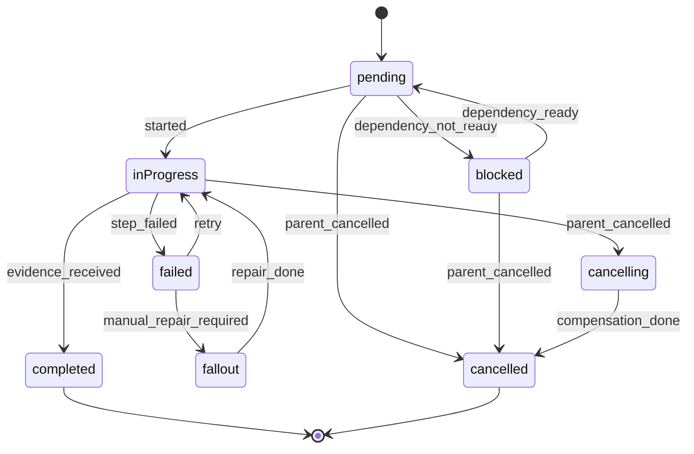

Item state harus menjawab:

- item mana yang belum berjalan;
- item mana yang blocked;
- item mana yang sedang jalan;
- item mana yang completed;
- item mana yang fallout;
- item mana yang perlu manual decision.

## 10. Dependency Graph

Fulfillment telco jarang linear.

Contoh fixed broadband:

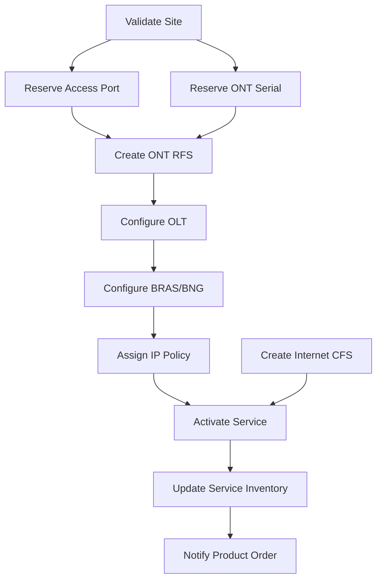

Graph harus memenuhi invariants:

- tidak boleh circular dependency;
- setiap node punya owner/executor;
- setiap edge punya makna dependency yang jelas;
- completed node tidak boleh diulang tanpa idempotency key;
- compensation path harus diketahui untuk node yang mengubah external state;
- graph definition harus versioned.

## 11. Orchestration Plan vs Service Order

Service order adalah domain intent. Orchestration plan adalah execution detail.

Pisahkan keduanya.

### 11.1 Service Order

Berisi:

- customer/service context;
- service items;
- actions;
- dependency antar service item;
- state domain;
- trace ke product order;
- SLA/order priority;
- due date;
- event history.

### 11.2 Orchestration Plan

Berisi:

- executable steps;
- executor type;
- retry policy;
- timeout;
- compensation command;
- manual work queue;
- external adapter endpoint;
- technical variable;
- worker assignment.

Model:

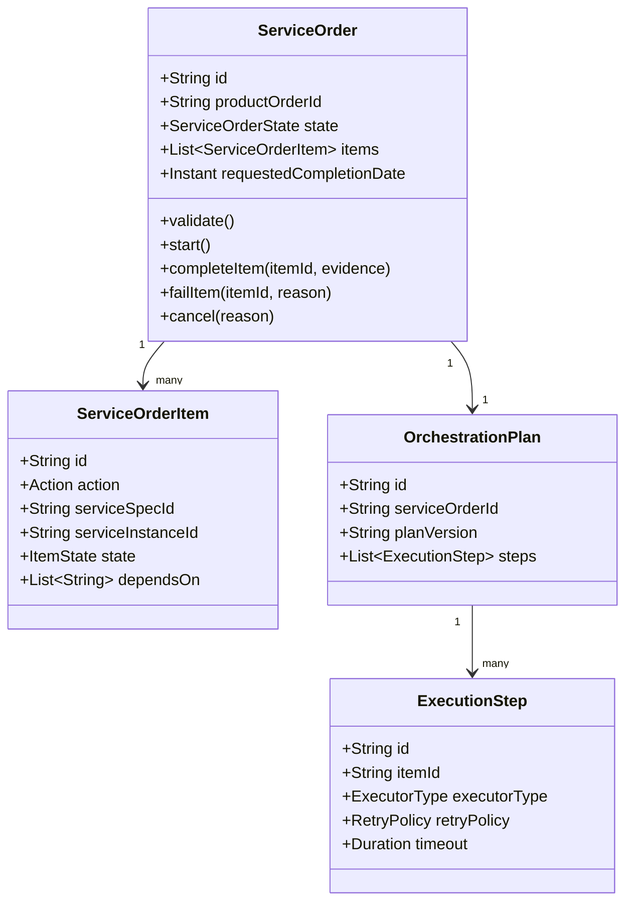

## 12. Java Component Boundary

SOM sebaiknya menjadi component tersendiri.

Contoh package layout:

```text
com.example.telco.som
├── api
│   ├── ServiceOrderController.java
│   ├── ServiceOrderRequestDto.java
│   ├── ServiceOrderResponseDto.java
│   └── ServiceOrderEventDto.java
├── application
│   ├── CreateServiceOrderUseCase.java
│   ├── StartServiceOrderUseCase.java
│   ├── CancelServiceOrderUseCase.java
│   ├── CompleteServiceOrderItemUseCase.java
│   ├── FailServiceOrderItemUseCase.java
│   └── ServiceOrderQueryService.java
├── domain
│   ├── ServiceOrder.java
│   ├── ServiceOrderItem.java
│   ├── ServiceOrderState.java
│   ├── ServiceOrderItemState.java
│   ├── ServiceAction.java
│   ├── DependencyGraph.java
│   ├── CompletionEvidence.java
│   └── ServiceOrderEvent.java
├── orchestration
│   ├── PlanCompiler.java
│   ├── ExecutionScheduler.java
│   ├── StepExecutor.java
│   └── RetryPolicy.java
├── integration
│   ├── ServiceInventoryClient.java
│   ├── ResourceInventoryClient.java
│   ├── ActivationClient.java
│   ├── ProductOrderClient.java
│   └── FalloutClient.java
└── persistence
    ├── ServiceOrderRepository.java
    ├── JpaServiceOrderRepository.java
    └── OutboxRepository.java
```

Boundary principle:

- `domain` tidak tahu HTTP, Kafka, database, atau TMF JSON.
- `application` mengatur use case dan transaction boundary.
- `orchestration` mengatur graph execution.
- `integration` mengandung anti-corruption layer ke system lain.
- `api` menerjemahkan external contract ke command internal.

## 13. Aggregate Design

Service order cocok menjadi aggregate root.

Contoh sketsa:

```java
public final class ServiceOrder {
    private final ServiceOrderId id;
    private final ProductOrderRef productOrderRef;
    private ServiceOrderState state;
    private final List<ServiceOrderItem> items;
    private final List<ServiceOrderDomainEvent> pendingEvents = new ArrayList<>();

    public void acknowledge() {
        requireState(ServiceOrderState.RECEIVED);
        validateNoDuplicateItemIds();
        validateAcyclicDependencies();
        this.state = ServiceOrderState.ACKNOWLEDGED;
        pendingEvents.add(new ServiceOrderAcknowledged(id));
    }

    public void accept() {
        requireState(ServiceOrderState.ACKNOWLEDGED);
        validateExecutableItems();
        this.state = ServiceOrderState.PENDING;
        pendingEvents.add(new ServiceOrderAccepted(id));
    }

    public void start() {
        requireState(ServiceOrderState.PENDING);
        this.state = ServiceOrderState.IN_PROGRESS;
        pendingEvents.add(new ServiceOrderStarted(id));
    }

    public void completeItem(ServiceOrderItemId itemId, CompletionEvidence evidence) {
        requireState(ServiceOrderState.IN_PROGRESS, ServiceOrderState.HELD);
        ServiceOrderItem item = item(itemId);
        item.complete(evidence);

        pendingEvents.add(new ServiceOrderItemCompleted(id, itemId, evidence));

        if (items.stream().allMatch(ServiceOrderItem::isTerminalSuccess)) {
            this.state = ServiceOrderState.COMPLETED;
            pendingEvents.add(new ServiceOrderCompleted(id));
        }
    }

    public void failItem(ServiceOrderItemId itemId, FailureReason reason) {
        requireState(ServiceOrderState.IN_PROGRESS);
        ServiceOrderItem item = item(itemId);
        item.fail(reason);
        this.state = reason.requiresManualRepair()
                ? ServiceOrderState.HELD
                : ServiceOrderState.FAILED;
        pendingEvents.add(new ServiceOrderItemFailed(id, itemId, reason));
    }
}
```

Hal penting:

- domain method harus menjaga transition legal;
- item completion harus membawa evidence;
- event domain keluar dari aggregate;
- state order berubah berdasarkan state item;
- cancellation dan amendment harus command eksplisit, bukan update field sembarang.

## 14. Idempotency Model

SOM berada di tengah banyak integrasi asynchronous. Duplicate message pasti terjadi.

Idempotency key minimal:

```text
sourceSystem + sourceOrderId + sourceOrderVersion + serviceOrderItemId + action
```

Untuk external command:

```text
serviceOrderId + executionStepId + attemptPurpose
```

Contoh:

```text
SO-2026-000001:STEP-ACTIVATE-BNG:EXECUTE
SO-2026-000001:STEP-ACTIVATE-BNG:COMPENSATE
SO-2026-000001:STEP-ACTIVATE-BNG:VERIFY
```

Idempotency bukan hanya mencegah duplicate insert. Ia harus menjaga agar duplicate request menghasilkan semantic result yang sama.

Contoh:

- jika resource sudah reserved oleh order yang sama, return reservation existing;
- jika activation command sudah berhasil, return previous success evidence;
- jika item sudah completed, ignore duplicate completion event;
- jika item sudah cancelled, reject late success event atau masukkan ke reconciliation queue.

## 15. Cancellation Race

Cancellation adalah salah satu bagian tersulit.

Scenario:

1. Service order sedang `inProgress`.
2. Step activation sudah dikirim ke network.
3. Customer membatalkan order.
4. Activation success datang terlambat.
5. SOM sudah menjalankan compensation.

Tanpa model race yang jelas, service bisa active di network tetapi cancelled di BSS.

Gunakan state `cancelling`, bukan langsung `cancelled`.

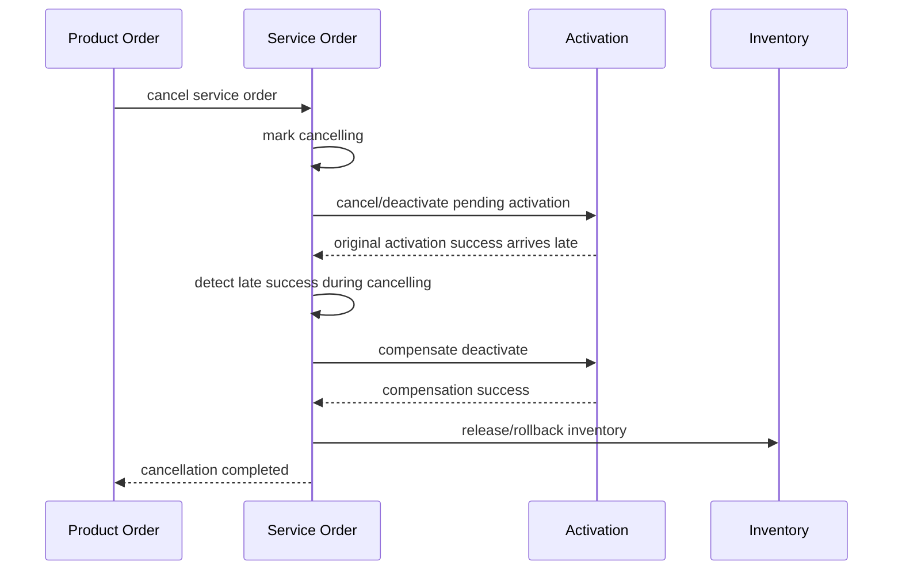

Rules:

- completed item may require compensation;
- in-flight item may require cancel command;
- pending item can be cancelled locally;
- late external event must be correlated and handled;
- cancellation may fail and become fallout.

## 16. Amendment Model

Order amendment berarti mengubah order yang belum selesai.

Jangan langsung update service order lama tanpa versioning.

Pola aman:

1. freeze current execution scope;
2. compute delta between old target and new target;
3. classify item:
   - keep,
   - cancel,
   - add,
   - modify,
   - compensate;
4. create amended service order version;
5. link previous version;
6. resume execution from safe checkpoint.

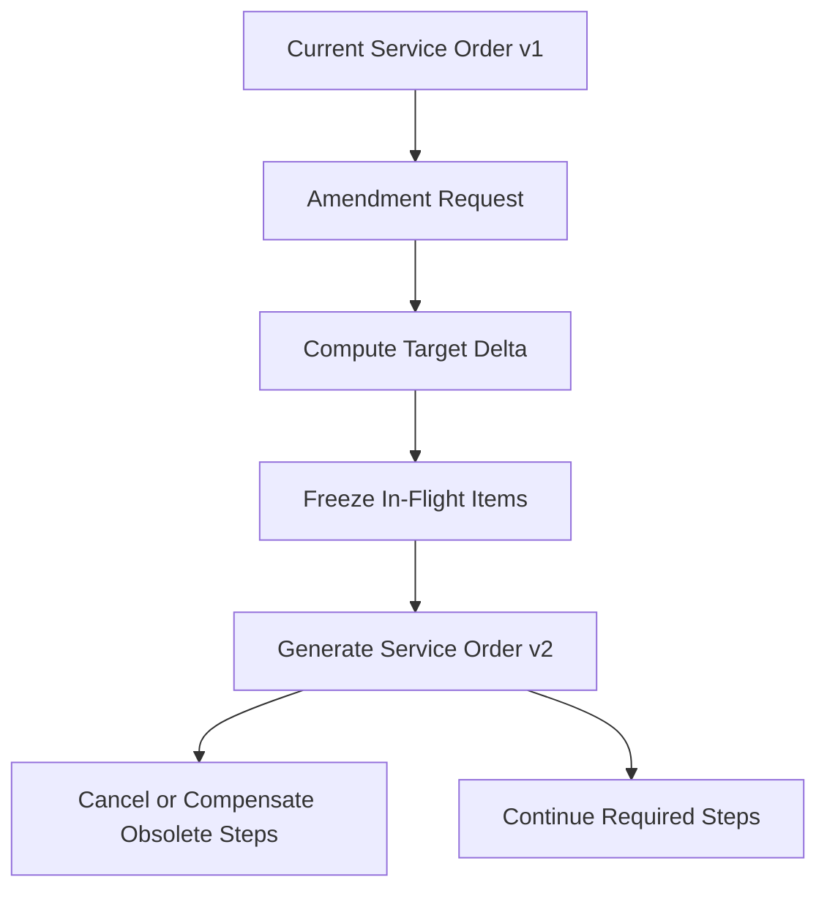

Practical rule:

- simple characteristic change may become modify item;
- change of access technology may require cancel-and-recreate;
- change after physical installation may require field service fallout;
- change after billing activation may require product/subscription adjustment.

## 17. Fallout Boundary

Fallout adalah kondisi di mana automation tidak dapat melanjutkan tanpa repair.

Contoh:

- port reserved tetapi activation adapter mengatakan port tidak ada;
- MSISDN assigned tetapi HLR provisioning gagal;
- service address valid di CRM tetapi tidak ditemukan di network inventory;
- technician reported installed but activation verification failed;
- dependency external tidak tersedia;
- duplicate service detected;
- order data inconsistent dengan catalog version.

Fallout bukan sekadar `failed`.

Fallout harus membawa:

- reason category;
- responsible team;
- repair options;
- affected order item;
- customer impact;
- SLA clock;
- evidence;
- allowed actions;
- audit trail.

Contoh classification:

| Category | Meaning | Typical Owner |
|---|---|---|
| `DATA_MISMATCH` | Input/order/inventory data tidak cocok. | BSS Ops / Data Ops |
| `RESOURCE_UNAVAILABLE` | Resource yang dibutuhkan tidak tersedia. | Resource Ops |
| `NETWORK_REJECTED` | Network/provisioning platform menolak command. | Network Ops |
| `EXTERNAL_TIMEOUT` | External system tidak memberi result. | Integration Ops |
| `MANUAL_DEPENDENCY` | Perlu tindakan manusia. | Field/Backoffice |
| `POLICY_BLOCKED` | Policy/eligibility/fraud/credit menahan order. | Business Ops |

## 18. Completion Evidence

Completion evidence adalah bukti bahwa item selesai.

Jangan cukup menyimpan boolean `done=true`.

Evidence dapat berupa:

- activation transaction id;
- inventory version id;
- resource assignment id;
- network response payload digest;
- technician completion report;
- service test result;
- timestamp;
- executor identity;
- before/after state;
- verification probe result.

Contoh object:

```java
public record CompletionEvidence(
        String executor,
        String externalTransactionId,
        Instant completedAt,
        Map<String, String> observedState,
        String evidenceHash
) {}
```

Evidence membantu:

- audit;
- dispute;
- RCA;
- reconciliation;
- proving SLA;
- compensation;
- customer communication.

## 19. Database Model Minimum

Contoh relational schema sederhana:

```sql
CREATE TABLE service_order (
    id VARCHAR(64) PRIMARY KEY,
    product_order_id VARCHAR(64) NOT NULL,
    state VARCHAR(32) NOT NULL,
    priority VARCHAR(32),
    requested_completion_at TIMESTAMP,
    created_at TIMESTAMP NOT NULL,
    updated_at TIMESTAMP NOT NULL,
    version BIGINT NOT NULL
);

CREATE TABLE service_order_item (
    id VARCHAR(64) PRIMARY KEY,
    service_order_id VARCHAR(64) NOT NULL,
    action VARCHAR(32) NOT NULL,
    state VARCHAR(32) NOT NULL,
    service_spec_id VARCHAR(128),
    service_instance_id VARCHAR(128),
    payload_json JSONB NOT NULL,
    created_at TIMESTAMP NOT NULL,
    updated_at TIMESTAMP NOT NULL,
    version BIGINT NOT NULL,
    FOREIGN KEY (service_order_id) REFERENCES service_order(id)
);

CREATE TABLE service_order_item_dependency (
    service_order_id VARCHAR(64) NOT NULL,
    item_id VARCHAR(64) NOT NULL,
    depends_on_item_id VARCHAR(64) NOT NULL,
    PRIMARY KEY (service_order_id, item_id, depends_on_item_id)
);

CREATE TABLE service_order_step (
    id VARCHAR(64) PRIMARY KEY,
    service_order_id VARCHAR(64) NOT NULL,
    item_id VARCHAR(64) NOT NULL,
    step_type VARCHAR(64) NOT NULL,
    state VARCHAR(32) NOT NULL,
    attempt_count INT NOT NULL,
    next_attempt_at TIMESTAMP,
    last_error_code VARCHAR(128),
    payload_json JSONB NOT NULL,
    created_at TIMESTAMP NOT NULL,
    updated_at TIMESTAMP NOT NULL
);

CREATE TABLE service_order_evidence (
    id VARCHAR(64) PRIMARY KEY,
    service_order_id VARCHAR(64) NOT NULL,
    item_id VARCHAR(64),
    step_id VARCHAR(64),
    evidence_type VARCHAR(64) NOT NULL,
    evidence_json JSONB NOT NULL,
    created_at TIMESTAMP NOT NULL
);
```

Production system biasanya perlu partitioning, archival, event store/outbox, dan indexing khusus untuk order operations.

## 20. API Design

External API dapat mengikuti TM Forum style, tetapi internal domain boleh lebih tegas.

Endpoint minimal:

```http
POST /serviceOrders
GET /serviceOrders/{id}
PATCH /serviceOrders/{id}
POST /serviceOrders/{id}/cancel
POST /serviceOrders/{id}/resume
POST /serviceOrders/{id}/items/{itemId}/complete
POST /serviceOrders/{id}/items/{itemId}/fail
GET /serviceOrders/{id}/timeline
```

Headers penting:

```http
Idempotency-Key: channel-abc:po-123:v4
X-Correlation-Id: corr-20260629-001
X-Source-System: product-order-management
```

Response jangan hanya “accepted”. Sertakan trace:

```json
{
  "id": "SO-2026-000001",
  "state": "pending",
  "productOrderId": "PO-2026-000909",
  "items": [
    {
      "id": "SOI-1",
      "action": "add",
      "state": "pending",
      "serviceSpecificationId": "internet-access-cfs-v3"
    }
  ],
  "links": {
    "timeline": "/serviceOrders/SO-2026-000001/timeline"
  }
}
```

## 21. Event Design

Events harus dipakai untuk integration, notifikasi, dan observability.

Contoh event penting:

- `ServiceOrderAcknowledged`
- `ServiceOrderRejected`
- `ServiceOrderAccepted`
- `ServiceOrderStarted`
- `ServiceOrderItemStarted`
- `ServiceOrderItemCompleted`
- `ServiceOrderItemFailed`
- `ServiceOrderHeld`
- `ServiceOrderFalloutCreated`
- `ServiceOrderCancellationRequested`
- `ServiceOrderCancelled`
- `ServiceOrderCompleted`

Event envelope:

```json
{
  "eventId": "evt-001",
  "eventType": "ServiceOrderItemCompleted",
  "occurredAt": "2026-06-29T10:00:00Z",
  "correlationId": "corr-001",
  "source": "service-order-management",
  "aggregateId": "SO-2026-000001",
  "aggregateVersion": 12,
  "payload": {
    "itemId": "SOI-1",
    "serviceInstanceId": "SVC-7788",
    "evidenceId": "EVD-100"
  }
}
```

Use transactional outbox untuk mencegah state update berhasil tetapi event hilang.

## 22. Execution Scheduler

Scheduler mengeksekusi step yang ready.

Algorithm sederhana:

```text
loop:
  fetch orders in IN_PROGRESS with runnable steps
  for each step:
    if dependencies completed and retry window reached:
      claim step using optimistic lock
      execute step
      record result
      publish event
```

Claiming penting agar dua worker tidak menjalankan step sama.

Contoh SQL pattern:

```sql
UPDATE service_order_step
SET state = 'RUNNING', updated_at = now()
WHERE id = :stepId
  AND state = 'READY'
  AND version = :expectedVersion;
```

Jika affected row `0`, worker lain sudah mengambil step.

## 23. Retry Policy

Tidak semua failure boleh di-retry.

| Failure | Retry? | Reason |
|---|---:|---|
| HTTP 503 external unavailable | Ya | transient |
| Timeout without known result | Ya, tetapi verify dulu | unknown outcome |
| Validation error | Tidak | deterministic |
| Resource not found | Tergantung | bisa data drift |
| Duplicate external request | Tidak sebagai failure | idempotent success/known state |
| Network rejected command | Tergantung error code | bisa repair needed |

Pattern:

1. classify error;
2. determine outcome known/unknown;
3. if unknown, verify before retry;
4. if deterministic invalid, fallout;
5. if transient, retry with backoff;
6. after max attempts, fallout.

## 24. Integration With Service Inventory

SOM tidak boleh menganggap service active sebelum Service Inventory menerima state update.

Flow umum:

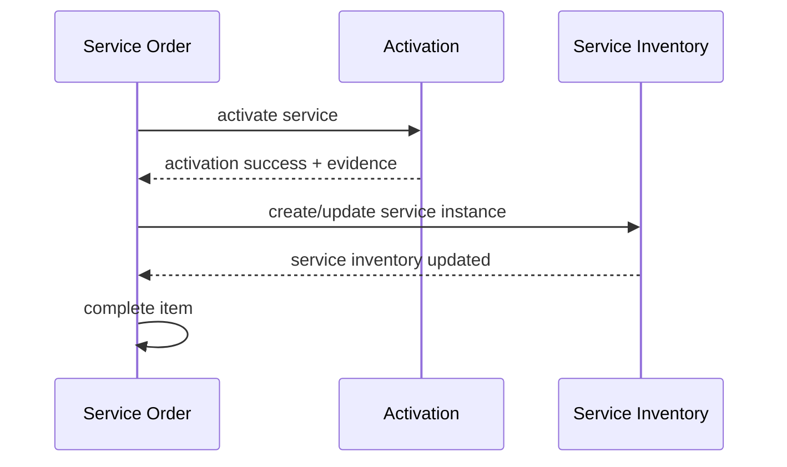

Untuk kasus tertentu, service instance bisa dibuat lebih awal sebagai `designed` atau `reserved`, lalu berubah ke `active` setelah activation success.

Jangan gunakan satu field `active` untuk semua tahap.

Contoh service state:

- `designed`
- `reserved`
- `provisioning`
- `active`
- `suspended`
- `terminated`

## 25. Integration With Resource Inventory

SOM meminta resource allocation/reservation, bukan mengubah resource langsung.

Contoh:

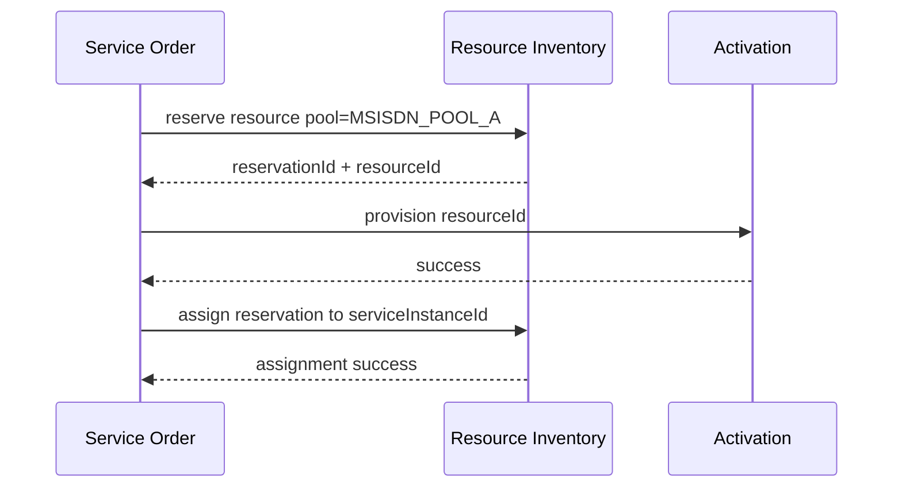

Jika activation gagal setelah reservation, SOM harus release reservation atau mark resource quarantine sesuai failure.

## 26. Integration With Product Order

Product Order Management perlu feedback fulfillment.

Jangan biarkan Product Order polling database SOM.

Events:

- service order accepted;
- service order item completed;
- service order held/fallout;
- service order cancelled;
- service order completed.

POM dapat mengagregasi status product order berdasarkan service order result.

Example:

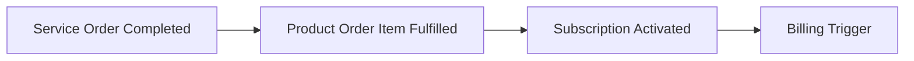

## 27. Operability Requirements

Operator harus bisa menjawab pertanyaan berikut tanpa query manual database:

1. Order ini sekarang di state apa?
2. Item mana yang blocking?
3. Step terakhir yang berhasil apa?
4. External system mana yang sedang ditunggu?
5. Retry berikutnya kapan?
6. Apakah customer terdampak?
7. Apakah resource sudah reserved/assigned?
8. Apakah activation sudah terkirim?
9. Apakah completion evidence ada?
10. Siapa yang melakukan manual repair?

Sediakan timeline:

```text
10:00:00 ServiceOrderAccepted
10:00:02 PlanCompiled plan=v3
10:00:04 StepStarted ReserveAccessPort
10:00:05 StepCompleted ReserveAccessPort evidence=EVD-1
10:00:07 StepStarted ActivateOLT
10:00:37 StepFailed ActivateOLT error=OLT_TIMEOUT
10:00:38 VerificationStarted ActivateOLT
10:01:10 VerificationFailed state=unknown
10:01:11 FalloutCreated team=NetworkOps
```

## 28. Metrics

Minimal metrics:

- service order created count;
- accepted/rejected ratio;
- completion latency by service type;
- item failure rate by step type;
- fallout count by category;
- retry count;
- cancellation success/failure;
- stuck order count;
- external dependency latency;
- order age percentile;
- manual repair time;
- resource reservation leak count.

Metric harus memiliki label yang terkendali. Jangan memakai `orderId` sebagai metric label.

## 29. Trace Model

Gunakan correlation id lintas Product Order → SOM → Inventory → Activation.

Span hierarchy:

```text
product-order.submit
  service-decomposition.compile
  service-order.create
  service-order.execute
    resource-inventory.reserve
    activation.configure-olt
    activation.configure-bng
    service-inventory.update
```

Trace yang baik membantu melihat bottleneck order-to-activate.

## 30. Security And Audit

SOM mengubah state layanan customer. Audit wajib.

Catat:

- siapa/mekanisme apa yang membuat order;
- source system;
- request snapshot;
- validation result;
- transition state;
- manual repair action;
- cancellation reason;
- external command digest;
- operator identity;
- timestamp;
- correlation id.

Jangan menyimpan secret atau credential provisioning di payload order.

## 31. Common Anti-Patterns

### 31.1 Product Order Langsung Provisioning

Cepat untuk MVP, buruk untuk audit dan recovery.

### 31.2 Semua Task Disimpan Sebagai JSON Tanpa State Machine

JSON fleksibel tetapi tidak menjaga invariant. Gunakan JSON untuk payload extensibility, bukan state semantics.

### 31.3 Completed Berdasarkan HTTP 200

HTTP 200 dari adapter tidak selalu berarti network state sudah benar. Butuh evidence atau verification.

### 31.4 Retry Blindly

Retry command provisioning yang outcome-nya unknown dapat membuat duplicate activation atau inconsistent network state.

### 31.5 No Manual Repair Model

Carrier-grade system harus mengakui bahwa tidak semua failure dapat diautomasi. Manual repair harus menjadi first-class workflow, bukan update database langsung.

### 31.6 Dependency Disimpan Dalam Kode Saja

Kalau dependency graph hanya ada dalam Java code, sulit audit dan versioning. Simpan compiled plan/version sebagai record.

## 32. Design Checklist

Sebelum menganggap SOM design siap, cek:

- Apakah Product Order dan Service Order dipisah?
- Apakah Service Order Item punya action eksplisit?
- Apakah dependency graph acyclic?
- Apakah state machine order dan item terdokumentasi?
- Apakah completion evidence disimpan?
- Apakah idempotency key dirancang per source dan per step?
- Apakah cancellation race ditangani?
- Apakah amendment punya versioning/delta model?
- Apakah fallout first-class?
- Apakah inventory diakses melalui component owner?
- Apakah activation command dipisah dari SOM domain?
- Apakah outbox/event delivery reliable?
- Apakah operator bisa melihat timeline?
- Apakah reconciliation job ada untuk stuck/unknown outcome?

## 33. Deliberate Practice

Latihan 1 — Model state machine:

Buat state machine service order untuk skenario `Add Mobile SIM`. Include order states, item states, cancellation, failed activation, dan retry.

Latihan 2 — Dependency graph:

Modelkan service order untuk `Install Fiber Broadband + Static IP + VoIP`. Tentukan CFS/RFS, item action, dependency, dan completion criteria.

Latihan 3 — Aggregate invariant:

Implementasikan domain method berikut di Java:

- `acknowledge()`
- `accept()`
- `start()`
- `completeItem()`
- `failItem()`
- `requestCancellation()`

Pastikan illegal transition melempar domain exception.

Latihan 4 — Fallout taxonomy:

Ambil lima failure dari sistem real atau imajiner. Klasifikasikan menjadi transient, deterministic, unknown outcome, manual repair, atau cancellation-required.

Latihan 5 — Operability:

Desain timeline screen untuk order yang stuck. Tentukan field yang harus ditampilkan untuk operator L1, L2, dan engineer.

## 34. Ringkasan

Service Order Management adalah core fulfillment component. Ia bukan product order, bukan workflow engine, bukan activation adapter, dan bukan inventory.

SOM yang baik:

- menerima fulfillment intent;
- memvalidasi service item dan dependency;
- mengeksekusi graph secara aman;
- menjaga idempotency;
- mengelola retry/cancellation/amendment;
- membuat fallout menjadi eksplisit;
- menyimpan completion evidence;
- mempublikasikan event;
- dan memberi operator visibility end-to-end.

Di part berikutnya kita masuk ke **Resource Inventory & Allocation**: bagaimana mengelola MSISDN, IMSI, ICCID, SIM/eSIM, IP, port, circuit, logical/physical resources, reservation, assignment, quarantine, dan reconciliation.

## 35. Referensi

- TM Forum — TMF641 Service Ordering Management API: https://www.tmforum.org/open-digital-architecture/open-apis/service-ordering-management-api-TMF641/v5.0
- TM Forum — Service Order Management ODA Component: https://www.tmforum.org/oda/directory/components-map/production/TMFC007
- TM Forum — TMF638 Service Inventory Management API: https://www.tmforum.org/open-digital-architecture/open-apis/service-inventory-management-api-TMF638/v5.0
- TM Forum — TMF639 Resource Inventory Management API: https://www.tmforum.org/open-digital-architecture/open-apis/resource-inventory-management-api-TMF639/v5.0
- TM Forum — TMF702 Resource Activation and Configuration API: https://www.tmforum.org/open-digital-architecture/open-apis/resource-activation-management-api-TMF702/v4.0
