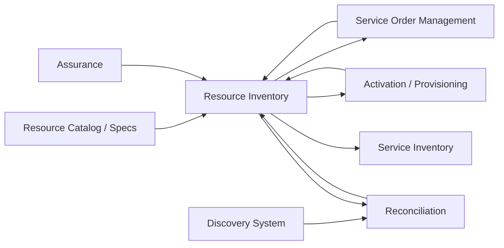
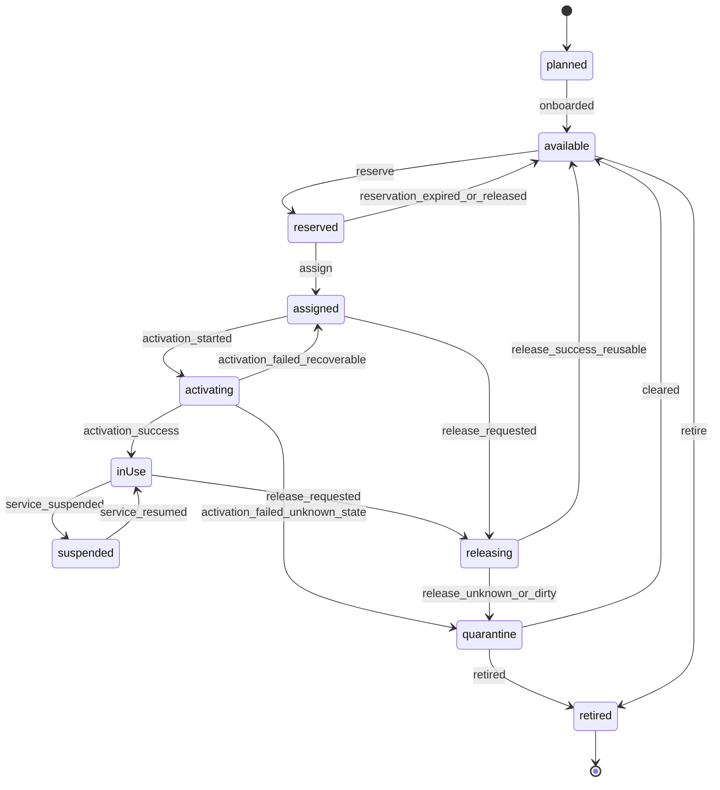
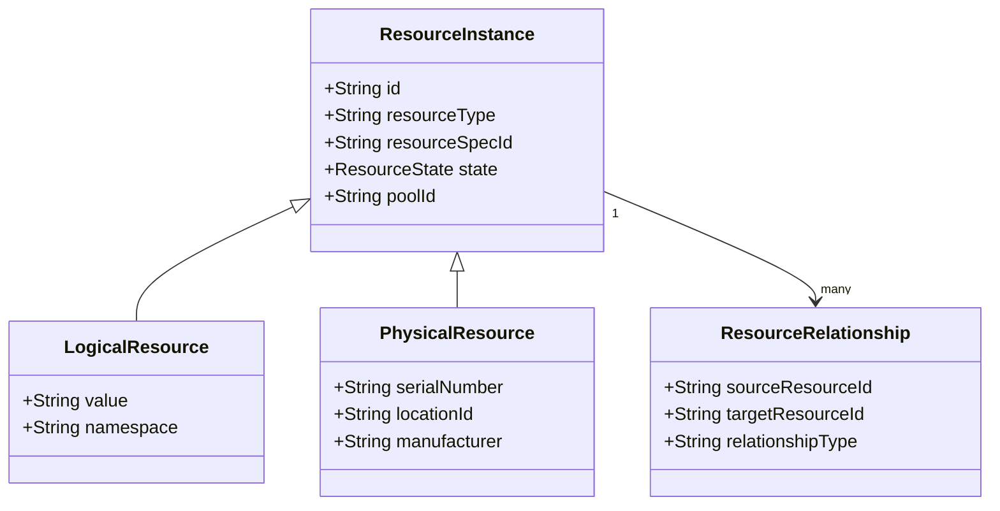
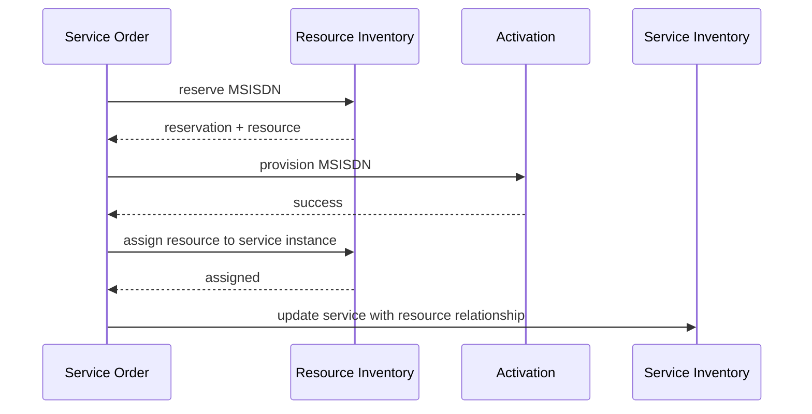
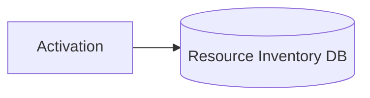
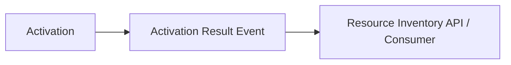
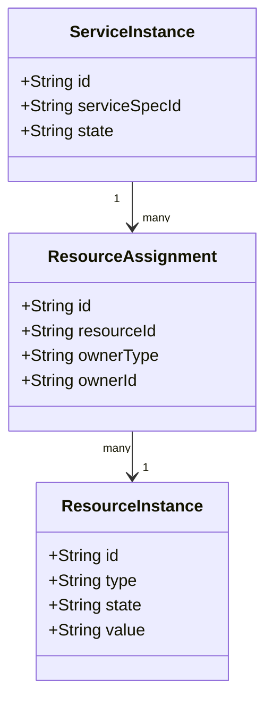
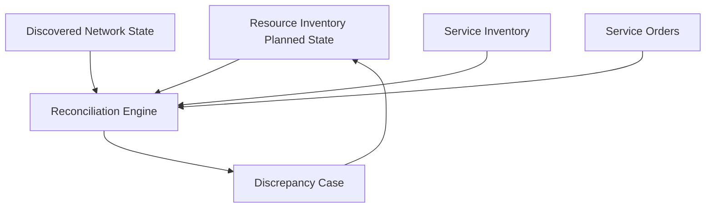
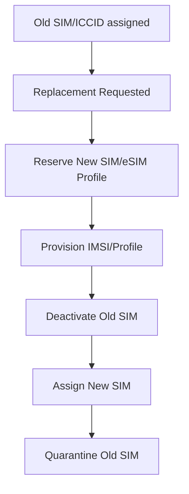

# Part 018 — Resource Inventory & Allocation

## 1. Posisi Part Ini Dalam Seri

Part sebelumnya membahas Service Order Management sebagai execution graph fulfillment. SOM memutuskan layanan teknis apa yang harus dibuat, diubah, atau dihentikan. Namun service order tidak dapat berjalan hanya dengan intent. Ia membutuhkan resource nyata.

Resource dapat berupa:

- nomor telepon/MSISDN,
- IMSI,
- ICCID,
- SIM/eSIM profile,
- IP address,
- VLAN,
- port,
- circuit,
- CPE,
- ONT,
- OLT port,
- router interface,
- logical connection,
- virtual network function,
- cloud/network slice resource,
- atau resource lain yang dibutuhkan untuk menyediakan layanan.

Part ini membahas **Resource Inventory & Allocation**.

Pertanyaan inti:

> Bagaimana kita mengelola resource telco yang langka, unik, stateful, sering berasal dari banyak sistem, dan harus tetap konsisten walaupun order, activation, field work, dan reconciliation berjalan asynchronous?

Jawaban pendeknya: jangan perlakukan resource sebagai lookup table. Resource inventory adalah system of control untuk resource lifecycle.

## 2. Kaufman Skill Target

Target performa part ini:

> Kamu mampu merancang Resource Inventory & Allocation component di Java yang mengelola logical/physical resources, reservation, assignment, release, quarantine, lifecycle state, concurrency, dan reconciliation dengan service order, service inventory, activation platform, dan discovery system.

Sub-skill yang perlu dikuasai:

1. membedakan resource catalog, resource inventory, network inventory, dan discovered state;
2. membedakan reservation, allocation, assignment, activation, dan usage;
3. memodelkan resource lifecycle state;
4. menjaga uniqueness dan scarcity invariant;
5. mendesain allocation engine yang aman terhadap race condition;
6. mengelola resource pool;
7. menghubungkan resource ke service instance;
8. menangani orphan reservation, stale assignment, quarantine, dan release;
9. membuat reconciliation antara planned inventory dan discovered inventory;
10. membuat API dan event yang dapat dipakai SOM, activation, assurance, dan operations.

## 3. Mental Model: Resource Inventory Sebagai Control Ledger

Resource inventory bukan hanya daftar asset. Ia adalah **control ledger** untuk resource.

Ledger berarti:

- setiap perubahan state harus tercatat;
- setiap assignment harus punya owner;
- setiap reservation harus punya expiry;
- setiap release harus punya reason;
- setiap perubahan harus auditable;
- setiap discrepancy harus bisa direkonsiliasi.

Resource inventory menjawab:

- resource apa yang tersedia?
- resource apa yang sudah reserved?
- resource apa yang assigned ke service/customer?
- resource apa yang active di network?
- resource apa yang quarantined?
- resource apa yang retired?
- resource mana yang planned tetapi belum ditemukan di network?
- resource mana yang ditemukan di network tetapi tidak dikenal BSS/OSS?

High-level relationship:



## 4. Resource Catalog vs Resource Inventory

Jangan mencampur resource specification dan resource instance.

### 4.1 Resource Catalog

Resource catalog menjawab:

> Jenis resource apa yang ada dan karakteristiknya apa?

Contoh:

- `MSISDN` specification;
- `IMSI` specification;
- `IPv4Address` specification;
- `OLTAccessPort` specification;
- `ONTDevice` specification;
- `VLAN` specification;
- `EnterpriseCircuit` specification.

Resource catalog bersifat template/specification.

### 4.2 Resource Inventory

Resource inventory menjawab:

> Instance resource mana yang ada dan sekarang state-nya apa?

Contoh:

- MSISDN `6281212345678` state `available`;
- IMSI `51010xxxxxxxxxxx` state `assigned`;
- ICCID `8962...` state `reserved`;
- IPv4 `10.20.1.44` state `assigned`;
- OLT port `OLT-1/1/3/24` state `inUse`;
- ONT serial `ZTEGC12345` state `installed`.

## 5. Resource Inventory vs Network Inventory

Dalam telco, “inventory” sering berarti banyak hal.

| Inventory | Owner Umum | Isi | Risiko Jika Dicampur |
|---|---|---|---|
| Resource Inventory | OSS/BSS fulfillment | logical/physical resource state untuk assignment | order bisa assign resource yang tidak valid |
| Network Inventory | Network engineering/OSS | topology, equipment, link, port, card, shelf | terlalu teknis untuk BSS journey |
| Service Inventory | Service fulfillment/assurance | service instance dan state | service dianggap active tanpa resource valid |
| Asset Inventory | Finance/logistics | asset ownership, depreciation, warehouse | asset ada tetapi belum usable untuk service |
| Discovered Inventory | Discovery/assurance | actual observed network state | raw discovery dapat noisy/stale |

Top engineer tidak bertanya “inventory-nya di mana?” tetapi:

> Inventory apa, authoritative untuk state apa, dan update-nya datang dari proses apa?

## 6. Vocabulary Minimum

| Istilah | Makna |
|---|---|
| Resource | Entitas fisik/logis yang dibutuhkan untuk menyediakan service. |
| Physical Resource | Resource berwujud: SIM card, CPE, ONT, port, card, chassis, cable. |
| Logical Resource | Resource tidak berwujud: MSISDN, IMSI, IP, VLAN, route target, slice id. |
| Resource Pool | Kumpulan resource yang dapat dialokasikan berdasarkan rule. |
| Reservation | Klaim sementara dengan expiry; belum final assigned. |
| Allocation | Proses memilih resource dari pool untuk kebutuhan tertentu. |
| Assignment | Pengikatan resource ke service/customer/order secara lebih final. |
| Activation | Membuat resource efektif di network/platform. |
| Quarantine | State isolasi karena resource tidak aman digunakan ulang. |
| Release | Mengembalikan resource ke pool atau lifecycle berikutnya. |
| Reconciliation | Membandingkan inventory planned dengan actual/discovered state. |

## 7. Reservation, Allocation, Assignment, Activation

Empat istilah ini sering kacau.


### 7.1 Reservation

Reservation adalah hold sementara.

Contoh:

- customer memilih nomor cantik selama checkout;
- service order reserve OLT port sebelum field installation;
- IP address dihold selama provisioning.

Reservation harus punya:

- owner,
- reason,
- expiry,
- correlation id,
- release policy.

### 7.2 Allocation

Allocation adalah proses pemilihan resource.

Input allocation:

- resource type;
- pool;
- location/site;
- technology;
- compatibility;
- priority;
- exclusion/inclusion rule;
- reservation duration;
- service context.

Output allocation:

- resource id;
- reservation id;
- expiry;
- allocation evidence.

### 7.3 Assignment

Assignment adalah pengikatan resource ke service/customer/order.

Assignment biasanya terjadi setelah service order mencapai titik yang lebih pasti.

Contoh:

- MSISDN assigned ke subscription;
- IMSI assigned ke SIM/eSIM profile;
- IP assigned ke internet service;
- OLT port assigned ke access service.

### 7.4 Activation

Activation adalah perubahan di platform/network agar resource benar-benar digunakan.

Activation bukan tanggung jawab Resource Inventory murni, tetapi inventory harus tahu state result-nya.

## 8. Resource Lifecycle State

State yang praktis:



State harus punya semantic jelas.

| State | Makna |
|---|---|
| `planned` | Resource direncanakan/onboarding, belum usable. |
| `available` | Dapat dipilih untuk reservation/allocation. |
| `reserved` | Dihold sementara untuk owner tertentu. |
| `assigned` | Diikat ke service/customer/order, belum tentu active. |
| `activating` | Sedang dipush/diaktifkan ke network/platform. |
| `inUse` | Aktif/dipakai oleh service. |
| `suspended` | Masih assigned tetapi service ditahan. |
| `releasing` | Sedang dilepas/deprovision. |
| `quarantine` | Tidak boleh dipakai ulang sampai dibersihkan. |
| `retired` | Tidak lagi dipakai. |

Jangan menggunakan `active` untuk semua hal. Active di inventory, active di network, active di subscription, dan active di billing dapat berbeda.

## 9. Resource Type Examples

### 9.1 MSISDN

MSISDN adalah nomor yang digunakan subscriber untuk layanan mobile/telephony.

Key concerns:

- uniqueness global dalam operator;
- number range ownership;
- portability;
- cool-down period setelah release;
- premium/golden number;
- regulatory retention;
- mapping ke subscription;
- exposure ke customer care.

State tambahan dapat mencakup:

- `portedIn`,
- `portedOut`,
- `cooldown`,
- `barred`,
- `quarantine`.

### 9.2 IMSI

IMSI adalah identity subscriber di mobile network context.

Key concerns:

- biasanya tidak diekspos ke customer;
- highly sensitive;
- terkait SIM/eSIM profile;
- harus diproteksi dari leakage;
- state harus sinkron dengan HLR/HSS/UDM.

### 9.3 ICCID / SIM / eSIM Profile

ICCID mengidentifikasi SIM card/profile.

Key concerns:

- logistics state;
- warehouse/distribution/channel;
- pairing ke IMSI/MSISDN;
- eSIM activation code lifecycle;
- replacement/swap;
- fraud controls.

### 9.4 IP Address

IP dapat berupa public/private, static/dynamic, IPv4/IPv6 prefix.

Key concerns:

- pool/subnet;
- lease;
- static assignment;
- routing policy;
- quarantine setelah release;
- conflict detection;
- integration dengan IPAM.

### 9.5 Port / Circuit / Access Resource

Fixed/enterprise access resource mencakup port, VLAN, circuit, cross-connect, ONT, CPE.

Key concerns:

- topology;
- site/location;
- capacity;
- physical feasibility;
- technician update;
- planned vs as-built difference;
- service impact.

## 10. Resource Pool Design

Resource pool membuat allocation dapat dikontrol.

Contoh pool:

- `MSISDN_JAKARTA_REGULAR`
- `MSISDN_PREMIUM_GOLD`
- `IMSI_MNO_51010`
- `IPV4_ENTERPRISE_STATIC_JKT`
- `FTTH_OLT_AREA_7788`
- `VLAN_REGION_WEST`

Pool punya rule:

```json
{
  "poolId": "MSISDN_JAKARTA_REGULAR",
  "resourceType": "MSISDN",
  "selectionPolicy": "RANDOM",
  "reservationTtlMinutes": 30,
  "eligibility": {
    "region": "JAKARTA",
    "customerSegment": ["CONSUMER", "SMB"],
    "excludedNumberPattern": ["0000", "666"]
  }
}
```

Pool bukan sekadar filter. Pool adalah governance boundary.

## 11. Allocation Algorithm

Allocation harus deterministic enough, fair enough, dan safe under concurrency.

Algorithm sederhana:

```text
allocate(request):
  validate resource type and pool
  validate requester eligibility
  find candidate resources in AVAILABLE state
  apply compatibility rules
  rank candidates based on policy
  claim one candidate atomically
  create reservation with expiry
  emit ResourceReserved
  return reservation
```

Candidate ranking:

- random;
- lowest fragmentation;
- nearest location;
- preferred range;
- least recently used;
- best capacity fit;
- premium category;
- regulatory rule.

## 12. Concurrency: Race Condition Allocation

Classic race:

1. Order A mencari MSISDN available.
2. Order B mencari MSISDN yang sama.
3. Keduanya melihat state `available`.
4. Keduanya assign nomor sama.

Solusi: atomic claim.

SQL pattern:

```sql
UPDATE resource_instance
SET state = 'RESERVED',
    reservation_id = :reservationId,
    reserved_by = :owner,
    reservation_expires_at = :expiresAt,
    version = version + 1,
    updated_at = now()
WHERE id = :resourceId
  AND state = 'AVAILABLE'
  AND version = :expectedVersion;
```

Kalau affected row `0`, candidate sudah diambil. Pilih candidate lain.

Untuk Postgres, pattern lain:

```sql
SELECT id
FROM resource_instance
WHERE resource_type = :type
  AND pool_id = :poolId
  AND state = 'AVAILABLE'
ORDER BY priority_score DESC, id
FOR UPDATE SKIP LOCKED
LIMIT 1;
```

Kemudian update dalam transaksi yang sama.

Jangan melakukan allocation dengan:

```java
Resource r = repository.findFirstAvailable();
r.reserve(owner);
repository.save(r);
```

Tanpa lock/optimistic version, ini rentan duplicate allocation.

## 13. Reservation Expiry

Reservation harus expired otomatis.

Contoh:

- cart reservation: 15 menit;
- quote reservation: 1 jam;
- service order reservation: 24 jam;
- field installation reservation: sampai appointment selesai + grace period.

Expiry job:

```text
find reservations where state=RESERVED and expiresAt < now
for each reservation:
  if not assigned:
    release to available or quarantine based on policy
    emit ResourceReservationExpired
```

Important:

- jangan expire reservation yang sedang dalam transition assignment;
- gunakan fencing token/version;
- record reason;
- publish event.

## 14. Assignment Model

Assignment harus mengikat resource ke owner yang jelas.

Owner dapat berupa:

- service instance;
- subscription;
- customer account;
- network site;
- order item;
- partner;
- inventory project.

Contoh assignment table:

```sql
CREATE TABLE resource_assignment (
    id VARCHAR(64) PRIMARY KEY,
    resource_id VARCHAR(64) NOT NULL,
    owner_type VARCHAR(64) NOT NULL,
    owner_id VARCHAR(128) NOT NULL,
    service_instance_id VARCHAR(128),
    product_instance_id VARCHAR(128),
    assigned_at TIMESTAMP NOT NULL,
    released_at TIMESTAMP,
    state VARCHAR(32) NOT NULL,
    assignment_reason VARCHAR(128) NOT NULL,
    UNIQUE(resource_id, state) DEFERRABLE INITIALLY IMMEDIATE
);
```

Dalam praktik, unique constraint perlu disesuaikan agar hanya satu active assignment per resource.

Postgres partial index:

```sql
CREATE UNIQUE INDEX uq_active_resource_assignment
ON resource_assignment(resource_id)
WHERE state IN ('ASSIGNED', 'IN_USE', 'SUSPENDED');
```

## 15. Resource Aggregate

Resource instance cocok menjadi aggregate root untuk invariant state.

```java
public final class ResourceInstance {
    private final ResourceId id;
    private final ResourceType type;
    private ResourceState state;
    private Reservation reservation;
    private Assignment assignment;
    private long version;

    public Reservation reserve(ReservationRequest request, Instant now) {
        requireState(ResourceState.AVAILABLE);
        Reservation newReservation = Reservation.create(request, now);
        this.reservation = newReservation;
        this.state = ResourceState.RESERVED;
        return newReservation;
    }

    public Assignment assign(ReservationId reservationId, AssignmentTarget target, Instant now) {
        requireState(ResourceState.RESERVED);
        if (!reservation.id().equals(reservationId)) {
            throw new DomainException("Reservation mismatch");
        }
        if (reservation.isExpiredAt(now)) {
            throw new DomainException("Reservation expired");
        }
        Assignment newAssignment = Assignment.create(id, target, now);
        this.assignment = newAssignment;
        this.state = ResourceState.ASSIGNED;
        return newAssignment;
    }

    public void markInUse(ActivationEvidence evidence) {
        requireState(ResourceState.ACTIVATING, ResourceState.ASSIGNED);
        this.state = ResourceState.IN_USE;
    }

    public void release(ReleaseReason reason) {
        requireState(ResourceState.RESERVED, ResourceState.ASSIGNED, ResourceState.IN_USE, ResourceState.SUSPENDED);
        if (reason.requiresQuarantine()) {
            this.state = ResourceState.QUARANTINE;
        } else {
            this.state = ResourceState.AVAILABLE;
        }
        this.reservation = null;
        this.assignment = null;
    }
}
```

Catatan: untuk resource dengan high cardinality seperti IP address, aggregate per resource masih valid, tetapi operasi batch perlu optimized.

## 16. Logical vs Physical Resource Modeling

Model umum:



Relationship contoh:

- SIM card contains ICCID;
- ICCID associated with IMSI;
- IMSI associated with MSISDN;
- ONT connected to OLT port;
- VLAN assigned to circuit;
- IP prefix contains IP address.

Jangan over-normalize semua relationship dari awal. Modelkan relationship yang penting untuk lifecycle, impact, dan reconciliation.

## 17. Resource Relationship Invariants

Contoh invariants:

- satu active MSISDN hanya boleh assigned ke satu active subscription;
- satu IMSI hanya boleh associated dengan satu SIM profile active;
- satu static IP hanya boleh assigned ke satu service active;
- satu physical port hanya boleh inUse oleh satu access service, kecuali technology mendukung sharing;
- satu ONT serial tidak boleh installed di dua site;
- reserved resource tidak boleh dipilih oleh order lain;
- quarantined resource tidak boleh allocated;
- retired resource tidak boleh kembali available tanpa explicit reactivation governance.

Invariants harus enforced di domain dan database.

## 18. Database Model Minimum

```sql
CREATE TABLE resource_instance (
    id VARCHAR(64) PRIMARY KEY,
    resource_type VARCHAR(64) NOT NULL,
    resource_spec_id VARCHAR(128),
    pool_id VARCHAR(128),
    state VARCHAR(32) NOT NULL,
    resource_value VARCHAR(256),
    location_id VARCHAR(128),
    characteristics_json JSONB NOT NULL DEFAULT '{}',
    reservation_id VARCHAR(64),
    reserved_by VARCHAR(128),
    reservation_expires_at TIMESTAMP,
    created_at TIMESTAMP NOT NULL,
    updated_at TIMESTAMP NOT NULL,
    version BIGINT NOT NULL
);

CREATE UNIQUE INDEX uq_resource_type_value
ON resource_instance(resource_type, resource_value)
WHERE resource_value IS NOT NULL;

CREATE INDEX idx_resource_pool_state
ON resource_instance(pool_id, state);

CREATE TABLE resource_reservation (
    id VARCHAR(64) PRIMARY KEY,
    resource_id VARCHAR(64) NOT NULL,
    owner_type VARCHAR(64) NOT NULL,
    owner_id VARCHAR(128) NOT NULL,
    reason VARCHAR(128) NOT NULL,
    state VARCHAR(32) NOT NULL,
    expires_at TIMESTAMP NOT NULL,
    created_at TIMESTAMP NOT NULL,
    updated_at TIMESTAMP NOT NULL
);

CREATE TABLE resource_assignment (
    id VARCHAR(64) PRIMARY KEY,
    resource_id VARCHAR(64) NOT NULL,
    owner_type VARCHAR(64) NOT NULL,
    owner_id VARCHAR(128) NOT NULL,
    service_instance_id VARCHAR(128),
    state VARCHAR(32) NOT NULL,
    assigned_at TIMESTAMP NOT NULL,
    released_at TIMESTAMP,
    created_at TIMESTAMP NOT NULL,
    updated_at TIMESTAMP NOT NULL
);

CREATE TABLE resource_relationship (
    id VARCHAR(64) PRIMARY KEY,
    source_resource_id VARCHAR(64) NOT NULL,
    target_resource_id VARCHAR(64) NOT NULL,
    relationship_type VARCHAR(64) NOT NULL,
    valid_from TIMESTAMP NOT NULL,
    valid_to TIMESTAMP
);
```

Untuk large inventory, pertimbangkan:

- partition by resource type atau region;
- separate hot allocation table;
- history table;
- event store/outbox;
- archival policy;
- search index untuk operations.

## 19. API Boundary

Resource Inventory API minimal:

```http
POST /resourceReservations
POST /resourceAssignments
POST /resources/{id}/release
POST /resources/{id}/quarantine
GET /resources/{id}
GET /resources?type=MSISDN&state=AVAILABLE&poolId=...
GET /resourceReservations/{id}
GET /resourceAssignments?ownerType=SERVICE&ownerId=...
```

Allocation request:

```json
{
  "resourceType": "MSISDN",
  "poolId": "MSISDN_JAKARTA_REGULAR",
  "owner": {
    "type": "SERVICE_ORDER_ITEM",
    "id": "SOI-123"
  },
  "reservationTtlSeconds": 1800,
  "constraints": {
    "region": "JAKARTA",
    "excludePatterns": ["0000"],
    "preferredPrefix": "62812"
  }
}
```

Response:

```json
{
  "reservationId": "RSV-9001",
  "resource": {
    "id": "RES-MSISDN-7788",
    "type": "MSISDN",
    "value": "6281212345678",
    "state": "reserved"
  },
  "expiresAt": "2026-06-29T10:30:00Z"
}
```

Assignment:

```json
{
  "reservationId": "RSV-9001",
  "assignmentTarget": {
    "ownerType": "SERVICE_INSTANCE",
    "ownerId": "SVC-7788"
  },
  "reason": "SERVICE_ACTIVATION"
}
```

## 20. Idempotency

Resource APIs must be idempotent.

Idempotency key untuk reservation:

```text
requesterSystem + requestId + resourceType + poolId + ownerId
```

Idempotency key untuk assignment:

```text
reservationId + ownerType + ownerId
```

Rules:

- duplicate reservation request from same owner returns same reservation if still valid;
- duplicate assignment returns existing assignment if target same;
- duplicate release returns success if resource already released by same operation;
- conflicting duplicate must return deterministic conflict, not allocate new resource.

## 21. Integration With Service Order Management

SOM memakai Resource Inventory untuk reserve/assign/release.



Design choice:

- reserve before activation when resource must be held;
- assign before activation when activation needs fixed identity;
- mark inUse after activation verification;
- quarantine if activation outcome unknown.

## 22. Integration With Activation

Activation system may be separate from inventory.

Wrong pattern:



Activation should not mutate inventory database directly.

Better:



Resource Inventory may consume activation result and update resource state only if transition is legal.

## 23. Integration With Service Inventory

Service Inventory stores service instance and relationship to resources.

Resource Inventory stores resource and assignment.

Both may reference each other, but one must not own the other’s lifecycle.

Example:



When service terminates:

1. SOM requests deactivation;
2. activation confirms deprovision;
3. Resource Inventory releases/quarantines resource;
4. Service Inventory marks service terminated;
5. Product/subscription lifecycle receives completion event.

## 24. Planned vs Discovered Inventory

Inventory drift is inevitable.

Sources of drift:

- manual network changes;
- failed provisioning with unknown outcome;
- delayed discovery;
- data migration error;
- vendor platform bug;
- field technician mismatch;
- number portability event;
- rollback failure.

Reconciliation compares:

- planned state from inventory;
- actual state from network/discovery;
- expected state from service order;
- customer/service state from service inventory.



## 25. Reconciliation Rules

Examples:

| Planned | Discovered | Meaning | Action |
|---|---|---|---|
| available | in network active | unknown usage | quarantine + investigate |
| assigned | not found | activation missing/drift | verify service order |
| inUse | active same owner | OK | no action |
| inUse | active different owner | severe conflict | incident + block allocation |
| reserved expired | not active | release | auto-release |
| released | still active | deprovision retry/fallout | create case |

Do not auto-correct severe discrepancies without governance.

## 26. Orphan Reservation

Orphan reservation terjadi saat resource reserved tetapi order tidak lanjut.

Causes:

- checkout abandoned;
- service order failed before assignment;
- timeout job mati;
- duplicate message;
- manual cancellation tidak release resource.

Detection:

```sql
SELECT *
FROM resource_reservation
WHERE state = 'ACTIVE'
  AND expires_at < now();
```

But production detection should also join with owner state:

- is product order cancelled?
- is service order terminal?
- is service instance created?
- is activation in unknown state?

If owner terminal failed/cancelled and resource not active, release.
If unknown, quarantine.

## 27. Quarantine Strategy

Quarantine prevents dirty resource reuse.

Use quarantine after:

- activation unknown;
- deactivation unknown;
- fraud investigation;
- number cooling period;
- IP conflict;
- service dispute;
- regulatory hold;
- discovered mismatch.

Quarantine record must include:

- reason;
- source;
- related order/service;
- created timestamp;
- release criteria;
- manual owner;
- evidence.

Example:

```json
{
  "resourceId": "RES-IP-1001",
  "state": "quarantine",
  "reason": "DEACTIVATION_OUTCOME_UNKNOWN",
  "relatedServiceOrderId": "SO-7788",
  "releaseCriteria": "Network discovery must confirm IP not configured for 2 consecutive cycles"
}
```

## 28. Number Portability Considerations

MSISDN lifecycle may be affected by number portability.

Design implications:

- port-in number may not originate from internal pool;
- port-out number may remain in records but not available;
- cooling/return rules may apply;
- customer identity and subscription state may change before network routing fully converges;
- donor/recipient operator interactions can be asynchronous.

Do not treat every MSISDN as owned reusable asset.

## 29. SIM Swap / Replacement

SIM replacement changes resource relationships.

Potential transition:



Controls:

- fraud check;
- cooling period;
- customer authentication;
- old SIM deactivation evidence;
- event to assurance/security;
- audit trail.

## 30. IP Address Allocation

IP allocation has special concerns:

- subnet fragmentation;
- static vs dynamic;
- DHCP lease vs inventory assignment;
- NAT/public IP scarcity;
- IPv6 prefix delegation;
- blacklisting/reputation;
- quarantine after abuse;
- routing propagation.

For static enterprise IP, resource inventory should own assignment. For dynamic consumer IP, DHCP/IPAM may own lease, while inventory stores pool-level capacity or static reservations.

Do not force every short-lived dynamic lease into BSS resource inventory unless operationally justified.

## 31. Physical Resource Allocation

Physical resources require location and logistics.

Example ONT/CPE:

- warehouse state;
- shipped;
- delivered;
- installed;
- replaced;
- returned;
- refurbished;
- retired.

Example port:

- planned;
- available;
- reserved;
- jumpered;
- active;
- faulty;
- retired.

Physical resource state often depends on field service. Treat technician completion as evidence, not final truth. Reconcile with network discovery when possible.

## 32. Events

Resource Inventory should publish events:

- `ResourceOnboarded`
- `ResourceReserved`
- `ResourceReservationExpired`
- `ResourceAssigned`
- `ResourceActivationStarted`
- `ResourceInUse`
- `ResourceReleased`
- `ResourceQuarantined`
- `ResourceRetired`
- `ResourceDiscrepancyDetected`
- `ResourceRelationshipChanged`

Event payload example:

```json
{
  "eventId": "evt-res-001",
  "eventType": "ResourceAssigned",
  "occurredAt": "2026-06-29T10:00:00Z",
  "aggregateId": "RES-MSISDN-7788",
  "aggregateVersion": 8,
  "correlationId": "corr-so-123",
  "payload": {
    "resourceType": "MSISDN",
    "resourceValueMasked": "62812****5678",
    "assignmentId": "ASN-9001",
    "ownerType": "SERVICE_INSTANCE",
    "ownerId": "SVC-7788"
  }
}
```

Mask sensitive values where needed.

## 33. Security And Privacy

Resource inventory often contains sensitive identifiers.

Controls:

- mask MSISDN/IMSI/ICCID in logs;
- encrypt sensitive fields where required;
- restrict query by role;
- audit access to subscriber identifiers;
- avoid exposing IMSI broadly;
- separate customer-facing identifiers from network identifiers;
- apply retention rules;
- do not place sensitive identifiers in metric labels.

Example logging rule:

```java
logger.info("Assigned resource type={} resourceId={} ownerType={} ownerId={}",
        resource.type(), resource.id(), assignment.ownerType(), assignment.ownerId());
```

Do not log:

```java
logger.info("Assigned IMSI {} to MSISDN {}", imsi, msisdn);
```

## 34. Operability

Operations screen should show:

- resource id;
- type;
- state;
- pool;
- owner;
- reservation expiry;
- assignment history;
- relationship graph;
- related service/order;
- last activation evidence;
- last discovery observation;
- discrepancies;
- quarantine reason;
- allowed actions.

Key dashboards:

- available resources by pool;
- reservation expiry backlog;
- assignment failure rate;
- quarantine count by reason;
- pool exhaustion forecast;
- reconciliation discrepancy rate;
- duplicate conflict count;
- top resources stuck in activating/releasing.

## 35. Common Anti-Patterns

### 35.1 Resource As Static Lookup

Resource lifecycle is dynamic. Static tables cannot represent reservation, assignment, quarantine, and reconciliation.

### 35.2 No Reservation Expiry

Reserved resources leak forever, creating artificial scarcity.

### 35.3 Inventory Mutated By Everyone

If SOM, activation, field app, and migration scripts all update inventory directly, authoritative state is gone.

### 35.4 Reusing Dirty Resource Immediately

Released number/IP/port may still be active in network or have customer/regulatory constraints. Use quarantine/cooling.

### 35.5 No Unique Constraint

Relying only on application logic for uniqueness will eventually fail under concurrency.

### 35.6 Modeling Discovered State As Truth

Discovery can be stale or noisy. It is evidence, not automatically truth.

### 35.7 Exposing Network Identifiers Too Broadly

IMSI/ICCID and similar identifiers require strict privacy/security treatment.

## 36. Design Checklist

Before Resource Inventory design is accepted, verify:

- Are catalog/spec and inventory/instance separated?
- Are logical and physical resources modeled clearly?
- Are reservation, assignment, activation, and usage separated?
- Is resource state machine explicit?
- Is allocation atomic under concurrency?
- Are uniqueness constraints enforced in database?
- Does reservation have expiry?
- Is release policy explicit?
- Does quarantine exist?
- Is there event/outbox reliability?
- Are sensitive identifiers masked?
- Is reconciliation planned?
- Are resource relationships auditable?
- Can operations see owner and history?
- Can pool exhaustion be detected before customer impact?

## 37. Deliberate Practice

Latihan 1 — MSISDN allocation:

Design allocation untuk MSISDN regular dan premium. Sertakan pool, state, reservation TTL, assignment, release, quarantine, dan uniqueness constraints.

Latihan 2 — Static IP assignment:

Modelkan static IP assignment untuk enterprise internet service. Sertakan subnet, IP, owner service, activation evidence, release, dan abuse quarantine.

Latihan 3 — FTTH port allocation:

Modelkan allocation OLT port untuk order instalasi fiber. Sertakan dependency dengan appointment, ONT, field report, dan discovery reconciliation.

Latihan 4 — Java concurrency:

Implementasikan method `reserveFirstAvailable(poolId, owner)` dengan optimistic locking atau `FOR UPDATE SKIP LOCKED`. Tulis test untuk dua thread yang berebut resource sama.

Latihan 5 — Reconciliation:

Buat rule table untuk planned vs discovered state. Tentukan mana yang auto-fix, mana yang quarantine, dan mana yang create incident.

## 38. Ringkasan

Resource Inventory & Allocation adalah control ledger untuk resource telco.

Sistem yang baik:

- memisahkan resource spec dari resource instance;
- membedakan resource inventory, network inventory, service inventory, asset inventory, dan discovered inventory;
- menjaga lifecycle state resource;
- melakukan allocation atomically;
- membatasi reservation dengan TTL;
- mengikat assignment ke owner yang jelas;
- tidak membiarkan semua sistem mengubah inventory langsung;
- memakai quarantine untuk resource dirty/unknown;
- melakukan reconciliation terhadap discovered state;
- dan melindungi identifier sensitif.

Di part berikutnya kita masuk ke **Activation & Provisioning Adapters**: bagaimana SOM dan Resource Inventory berinteraksi dengan HLR/HSS/UDM/PCF/OCS/AAA/DNS/IPAM/OLT/BRAS/BNG/IMS/vendor systems tanpa membuat domain core tercemar detail teknis provisioning.

## 39. Referensi

- TM Forum — TMF639 Resource Inventory Management API: https://www.tmforum.org/open-digital-architecture/open-apis/resource-inventory-management-api-TMF639/v5.0
- TM Forum — TMF638 Service Inventory Management API: https://www.tmforum.org/open-digital-architecture/open-apis/service-inventory-management-api-TMF638/v5.0
- TM Forum — TMF641 Service Ordering Management API: https://www.tmforum.org/open-digital-architecture/open-apis/service-ordering-management-api-TMF641/v5.0
- TM Forum — TMF702 Resource Activation and Configuration API: https://www.tmforum.org/open-digital-architecture/open-apis/resource-activation-management-api-TMF702/v4.0
