# Part 019 — Activation & Provisioning Adapters

## 1. Posisi Part Ini Dalam Seri

Part sebelumnya membahas **Resource Inventory & Allocation**: bagaimana resource seperti MSISDN, IMSI, ICCID, SIM/eSIM profile, IP address, VLAN, port, circuit, CPE, ONT, dan resource lain dikelola sebagai control ledger.

Namun resource yang sudah assigned belum otomatis membuat layanan pelanggan aktif.

Order belum selesai sampai konfigurasi teknis benar-benar masuk ke network, platform, dan supporting systems yang relevan.

Di part ini kita membahas **Activation & Provisioning Adapters**.

Pertanyaan inti:

> Bagaimana Java BSS/OSS mengubah intent fulfillment menjadi perubahan nyata di HLR/HSS/UDM/PCF/OCS/AAA/DNS/IPAM/IMS/OLT/BNG/SDN/vendor platform tanpa mencemari domain core dengan detail vendor/protokol?

Jawaban pendeknya:

> Perlakukan activation sebagai side-effect boundary yang dikendalikan oleh command, adapter, evidence, idempotency, timeout, dan reconciliation.

Activation bukan sekadar “panggil API vendor”. Activation adalah boundary paling berisiko dalam fulfillment karena ia mengubah keadaan dunia luar.

## 2. Kaufman Skill Target

Target performa part ini:

> Kamu mampu merancang activation/provisioning layer di Java yang dapat menerima service/resource intent dari fulfillment, menerjemahkannya menjadi command teknis, mengeksekusinya ke vendor/network systems, menjaga idempotency, merekam evidence, menangani timeout/retry, dan melakukan reconciliation ketika hasil network tidak pasti.

Sub-skill yang harus dikuasai:

1. membedakan service order, resource order, activation command, dan vendor operation;
2. membedakan activation, provisioning, configuration, enablement, dan verification;
3. membuat anti-corruption layer untuk vendor platform;
4. merancang activation command yang idempotent;
5. mengelola synchronous, asynchronous, batch, dan manual activation;
6. memodelkan state machine activation yang explicit;
7. menangani timeout sebagai state `UNKNOWN`, bukan langsung `FAILED`;
8. membuat retry policy yang aman;
9. memakai read-back/reconciliation untuk membuktikan hasil;
10. merekam activation evidence untuk audit, support, billing trigger, dan customer notification;
11. menghindari coupling domain BSS/OSS dengan HLR/HSS/UDM/PCF/OCS/AAA/IPAM/vendor detail.

## 3. Mental Model: Activation Sebagai Side-Effect Boundary

Di dalam domain core, perubahan state bisa dikontrol dengan transaction, lock, outbox, event, dan audit log.

Di activation, kita berhadapan dengan sistem eksternal:

- vendor API bisa lambat;
- command bisa diterima tetapi belum selesai;
- callback bisa hilang;
- network bisa apply sebagian;
- sistem target bisa duplicate request;
- read API bisa eventually consistent;
- timeout tidak membuktikan gagal;
- retry bisa menciptakan duplicate provisioning jika command tidak idempotent;
- operator bisa memperbaiki manual di luar sistem;
- legacy system bisa hanya mendukung file batch atau terminal command.

Karena itu, activation layer harus diperlakukan sebagai boundary terkontrol.

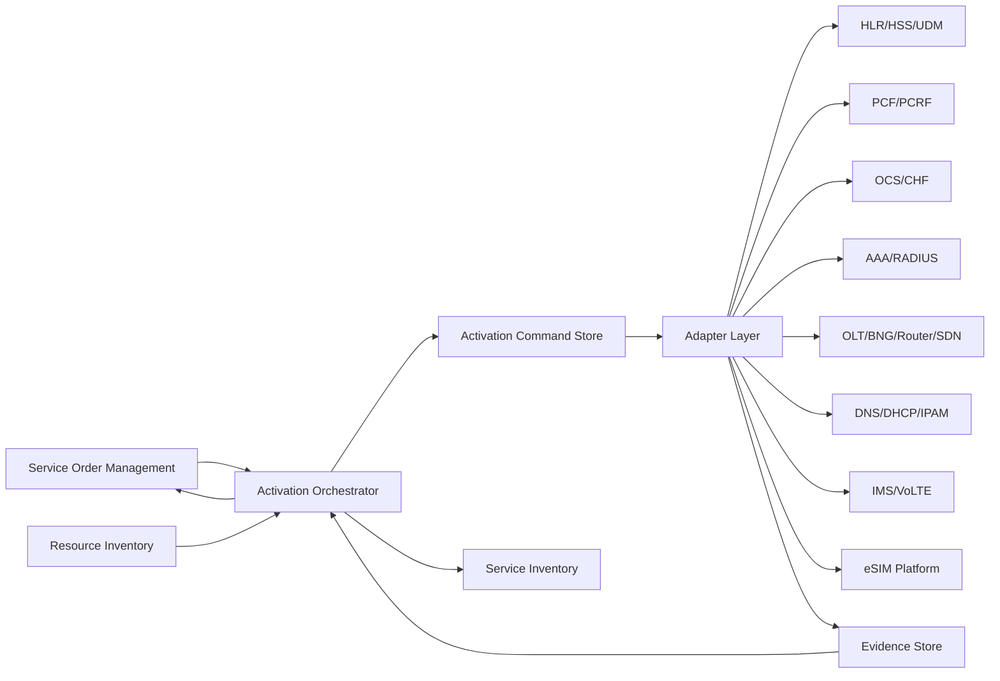

Kuncinya: **domain fulfillment tidak bicara langsung ke vendor API**. Fulfillment mengirim intent/command ke activation layer. Activation layer menerjemahkan, mengirim, memverifikasi, dan melaporkan hasil.

## 4. Activation vs Provisioning vs Configuration vs Enablement

Istilah ini sering dicampur. Dalam desain sistem, pemisahan istilah membantu menentukan boundary dan invariant.

### 4.1 Provisioning

Provisioning adalah proses menyiapkan entity teknis agar dapat digunakan.

Contoh:

- membuat subscriber profile di HSS/UDM;
- membuat account di IMS;
- membuat AAA profile;
- membuat DHCP reservation;
- membuat ONT profile;
- membuat APN policy;
- membuat charging profile;
- membuat routing object.

Provisioning sering berarti “create/update data teknis”.

### 4.2 Configuration

Configuration adalah pengaturan parameter pada entity teknis.

Contoh:

- mengatur QoS profile;
- mengatur VLAN;
- mengatur static IP;
- mengatur policy bandwidth;
- mengatur barring flag;
- mengatur roaming flag;
- mengatur service class;
- mengatur DNS zone/record;
- mengatur router interface.

### 4.3 Activation

Activation adalah membuat layanan benar-benar aktif/dapat digunakan oleh pelanggan.

Contoh:

- enable subscriber;
- activate SIM/eSIM profile;
- enable APN access;
- enable VoLTE service;
- bind ONT ke OLT port;
- enable broadband session;
- enable charging policy;
- remove barring.

Activation biasanya menjadi milestone fulfillment.

### 4.4 Enablement

Enablement adalah istilah generik untuk membuka capability.

Contoh:

- enable data package;
- enable international roaming;
- enable static IP add-on;
- enable enterprise VPN feature;
- enable QoD network API entitlement.

### 4.5 Verification

Verification adalah pembuktian bahwa target state sudah terjadi.

Contoh:

- query subscriber profile;
- check HSS/UDM data;
- check AAA profile;
- check ONT registered;
- check policy rule installed;
- check charging bucket active;
- check DNS record exists;
- check service session can authenticate.

Mental model:

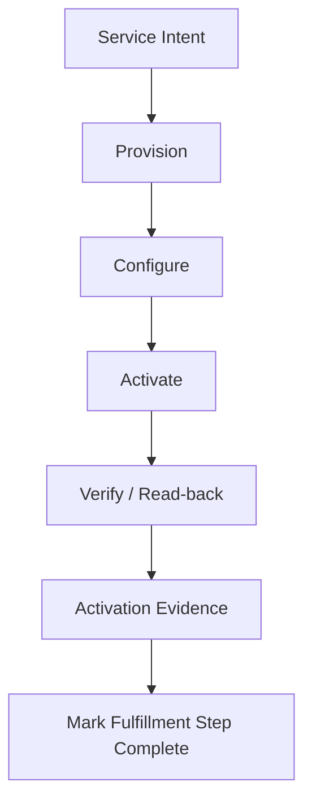

Jangan tandai order complete hanya karena command sudah dikirim. Complete harus berdasarkan evidence sesuai criticality layanan.

## 5. Layer Fulfillment: Dari Commercial Intent Ke Network Change

Activation tidak muncul langsung dari product order.

Biasanya chain-nya seperti ini:

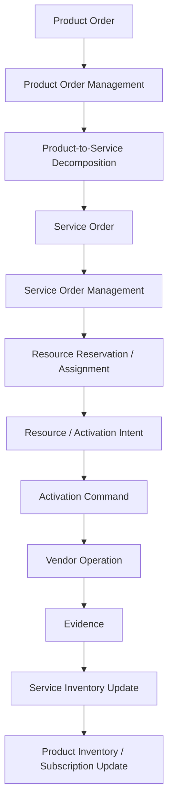

Setiap layer punya bahasa berbeda:

| Layer | Bahasa | Contoh |
|---|---|---|
| Product Order | commercial action | add 50GB data package |
| Service Order | service action | modify mobile data service |
| Resource Assignment | technical resource | MSISDN + IMSI + APN profile |
| Activation Command | controlled side effect | provision APN profile in HSS/UDM and OCS |
| Vendor Operation | vendor-specific API/protocol | SOAP/REST/CLI/file/proprietary command |
| Evidence | proof | subscriber profile read-back shows APN active |

Top 1% engineer menjaga layer ini tidak bocor.

## 6. Jenis Sistem Target Activation

Activation layer biasanya harus bicara dengan banyak sistem target.

### 6.1 Mobile Core Subscriber Systems

Contoh target:

- HLR untuk legacy 2G/3G subscriber data;
- HSS untuk LTE/EPC subscriber data;
- UDM/UDR untuk 5G subscriber data;
- AUSF-related provisioning boundary dalam arsitektur tertentu;
- EIR untuk device identity control;
- SMSC/MMSC legacy service;
- IMS/HSS untuk VoLTE/VoWiFi.

Contoh command:

- create subscriber;
- update subscriber profile;
- enable roaming;
- set barring;
- bind IMSI/MSISDN;
- enable VoLTE;
- provision APN/DNN;
- delete subscriber.

### 6.2 Policy And Charging Systems

Contoh target:

- PCRF untuk LTE policy;
- PCF untuk 5G policy;
- OCS untuk online charging;
- CHF untuk 5G charging function boundary;
- quota/balance platform;
- rating/charging mediation.

Contoh command:

- assign service class;
- set QoS profile;
- attach data package entitlement;
- create prepaid balance bucket;
- activate roaming charging policy;
- suspend charging access;
- synchronize spending limit.

### 6.3 AAA, Authentication, Access, And Session Systems

Contoh target:

- RADIUS/AAA;
- broadband access platform;
- Wi-Fi offload platform;
- enterprise VPN authenticator.

Contoh command:

- create access user;
- bind realm;
- set speed profile;
- set static IP attribute;
- enable/disable login;
- update password/credential.

### 6.4 DNS, DHCP, IPAM, And Numbering Systems

Contoh target:

- IPAM;
- DHCP server;
- DNS authoritative server;
- ENUM platform;
- number management platform.

Contoh command:

- reserve IP;
- assign static IP;
- create DNS record;
- delete DHCP lease binding;
- create ENUM mapping;
- bind MSISDN to routing profile.

### 6.5 Fixed Network And Access Systems

Contoh target:

- OLT;
- ONT management system;
- ACS/TR-069 platform;
- BNG/BRAS;
- PE router;
- switch/aggregation device;
- SDN controller;
- NMS/EMS vendor.

Contoh command:

- bind ONT serial number;
- configure OLT port;
- assign VLAN;
- create PPPoE profile;
- set bandwidth profile;
- configure static route;
- enable CPE management.

### 6.6 eSIM And SIM Lifecycle Platforms

Contoh target:

- SIM personalization platform;
- eSIM SM-DP+;
- eSIM profile inventory;
- SIM OTA platform.

Contoh command:

- reserve eSIM profile;
- activate eSIM profile;
- release unused profile;
- update SIM applet;
- send OTA update;
- suspend SIM.

### 6.7 Partner Or Wholesale Platforms

Contoh target:

- MVNO gateway;
- roaming partner platform;
- wholesale API;
- inter-provider activation API;
- enterprise customer gateway.

Contoh command:

- submit activation to host MNO;
- update wholesale customer service;
- synchronize partner entitlement;
- receive partner completion callback.

## 7. Adapter Pattern Yang Benar Untuk Telecom

Adapter bukan hanya class `VendorClient`.

Adapter harus menjadi anti-corruption layer yang menyembunyikan:

- protocol detail;
- vendor data model;
- error code vendor;
- retry behavior vendor;
- timeout semantics;
- credential handling;
- rate limit;
- throttling;
- batch format;
- callback format;
- polling behavior;
- read-back quirks.

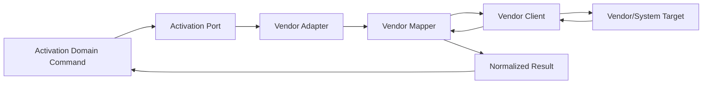

Domain core hanya melihat:

- command accepted;
- command completed;
- command failed terminally;
- command unknown;
- evidence available;
- reconciliation required.

Domain core tidak perlu tahu vendor mengirim `ERR_9501`, `SOAPFault`, `CLI_TIMEOUT`, atau file reject line 72.

## 8. Activation Command Sebagai Domain Object

Activation command harus punya identitas, target, intent, precondition, idempotency key, correlation, dan expected evidence.

Contoh model konseptual:

```java
public record ActivationCommand(
    ActivationCommandId id,
    ServiceOrderId serviceOrderId,
    ServiceOrderItemId serviceOrderItemId,
    String commandType,
    String targetSystem,
    String targetResourceId,
    Map<String, Object> parameters,
    String idempotencyKey,
    int attempt,
    Instant notBefore,
    Instant deadline,
    ExpectedEvidence expectedEvidence
) {}
```

Untuk production, `parameters` jangan dibiarkan menjadi `Map<String,Object>` liar di domain core. Gunakan command-specific payload atau typed value object.

Contoh lebih baik:

```java
public sealed interface ActivationPayload
    permits ProvisionMobileSubscriber,
            EnableDataService,
            ConfigureStaticIp,
            BindOntToPort,
            ActivateEsimProfile {
}

public record ProvisionMobileSubscriber(
    Msisdn msisdn,
    Imsi imsi,
    String customerSegment,
    String serviceClass,
    List<String> apnCodes,
    boolean volteEnabled,
    boolean roamingAllowed
) implements ActivationPayload {}

public record ConfigureStaticIp(
    ServiceId serviceId,
    IpAddress ipAddress,
    String accessRealm,
    String radiusProfile
) implements ActivationPayload {}
```

Gunakan typed payload untuk internal correctness, lalu mapping ke vendor dilakukan di adapter.

## 9. Idempotency: Invariant Paling Penting

Activation command hampir selalu akan di-retry.

Retry bisa terjadi karena:

- HTTP timeout;
- message redelivery;
- worker crash;
- callback terlambat;
- operator menekan retry;
- orchestrator failover;
- vendor outage;
- network partition.

Karena itu command harus idempotent.

### 9.1 Idempotency Key

Idempotency key harus stabil untuk logical action yang sama.

Contoh:

```text
activation:{serviceOrderItemId}:{commandType}:{targetSystem}:{targetResourceId}:{payloadHash}
```

Kunci idempotency tidak boleh berubah hanya karena attempt bertambah.

### 9.2 Command Store Constraint

Database harus menolak duplicate logical command.

```sql
create table activation_command (
    id uuid primary key,
    service_order_item_id uuid not null,
    command_type varchar(100) not null,
    target_system varchar(100) not null,
    target_resource_id varchar(200) not null,
    payload_hash varchar(128) not null,
    idempotency_key varchar(300) not null unique,
    status varchar(50) not null,
    attempt int not null default 0,
    created_at timestamptz not null,
    updated_at timestamptz not null
);
```

### 9.3 Vendor-Side Idempotency

Jika vendor mendukung external request id, kirim idempotency key ke vendor.

Jika vendor tidak mendukung, adapter harus membuat read-before-write atau write-then-read verification.

Contoh:

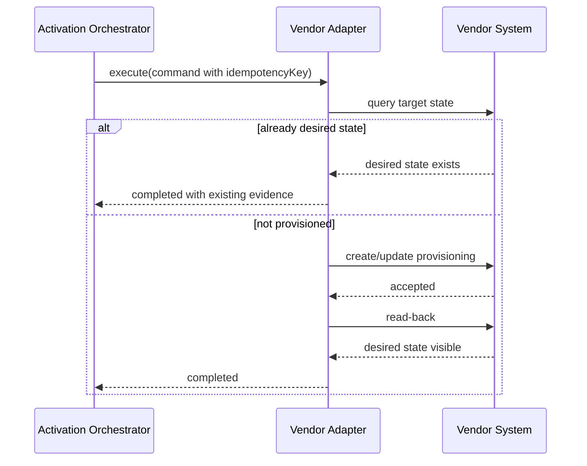

Read-before-write tidak selalu cukup jika target state bisa berubah oleh actor lain. Tetap perlu correlation dan audit.

## 10. Activation State Machine

State activation harus explicit. Jangan memakai boolean `success`.

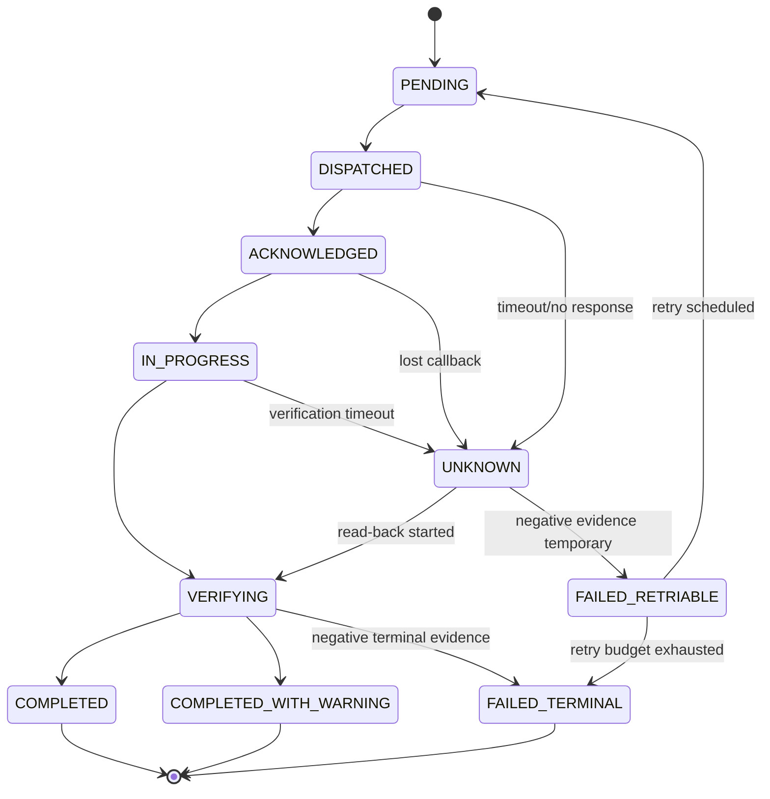

### 10.1 Meaning Of Each State

| State | Meaning | Operational implication |
|---|---|---|
| `PENDING` | command stored but not executed | worker can pick it |
| `DISPATCHED` | request sent to adapter/target | wait for ack/response |
| `ACKNOWLEDGED` | target accepted request | not necessarily applied |
| `IN_PROGRESS` | target processing known | wait/poll/callback |
| `VERIFYING` | read-back/evidence collection | do not complete yet |
| `COMPLETED` | target state proven | fulfillment can continue |
| `COMPLETED_WITH_WARNING` | usable but warning exists | continue with alert/task |
| `UNKNOWN` | result uncertain | reconcile before retrying blindly |
| `FAILED_RETRIABLE` | temporary failure | retry using policy |
| `FAILED_TERMINAL` | cannot continue automatically | raise fallout |

### 10.2 Timeout Is Not Failure

Timeout means the caller did not observe a result.

It does not mean:

- command failed;
- command was not received;
- command was not applied;
- command must be resent immediately.

For activation, timeout should often become `UNKNOWN`, then read-back/reconciliation decides next step.

## 11. Synchronous, Asynchronous, Batch, And Manual Activation

Tidak semua target mendukung model yang sama.

### 11.1 Synchronous Activation

Target langsung memberi final result.

Contoh:

```text
POST /subscriber
200 OK { status: "ACTIVE" }
```

Tetap perlu read-back untuk critical service.

Kelebihan:

- simple;
- low latency;
- easy correlation.

Risiko:

- caller blocked;
- target latency leaks into order lifecycle;
- timeout ambiguity;
- vendor often returns accepted as success.

### 11.2 Asynchronous Activation

Target menerima request lalu callback nanti.

Contoh:

```text
POST /activationRequest -> 202 Accepted { requestId }
callback /activationResult -> COMPLETED/FAILED
```

Kelebihan:

- cocok untuk long-running operation;
- lebih resilient;
- target dapat mengelola queue.

Risiko:

- callback hilang;
- duplicate callback;
- callback out-of-order;
- request id mapping hilang;
- operator perlu melihat pending jobs.

### 11.3 Polling Activation

Target tidak callback, sehingga adapter melakukan polling.

Kunci desain:

- poll interval bertahap;
- deadline jelas;
- max attempts;
- read API normalized;
- polling tidak membanjiri vendor.

### 11.4 Batch Activation

Legacy telco sering memakai file batch.

Flow umum:

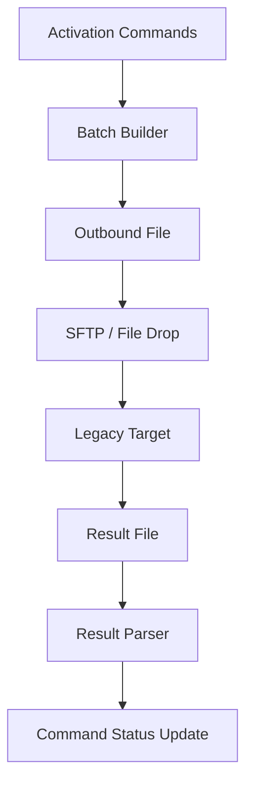

Batch activation harus menangani:

- file naming;
- checksum;
- line-level correlation;
- partial accept;
- duplicate file;
- reject file;
- late result;
- retry per line, bukan hanya per file;
- reconciliation bila result file hilang.

### 11.5 Manual Activation

Manual activation terjadi ketika automated adapter tidak tersedia atau gagal terminal.

Manual bukan berarti di luar sistem. Manual harus tetap menjadi task yang dikontrol sistem.

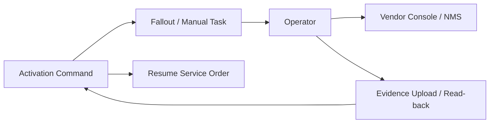

Manual activation detail dibahas lebih jauh di Part 020.

## 12. Command Dispatch Pattern

Worker activation biasanya mengambil command dari database/queue.

### 12.1 Database Polling Worker

Cocok jika ingin strong control dari command store.

```sql
select id
from activation_command
where status = 'PENDING'
  and not_before <= now()
order by priority desc, created_at asc
for update skip locked
limit 50;
```

Kelebihan:

- mudah menjaga exactly-once-ish execution boundary;
- command lifecycle terlihat;
- bisa throttle per target.

Kekurangan:

- polling overhead;
- perlu careful locking;
- throughput perlu tuning.

### 12.2 Event-Driven Worker

Command dibuat lalu event dikirim.

Kunci desain:

- command store tetap authoritative;
- event hanya wake-up signal;
- worker harus re-read command;
- duplicate event harus aman.

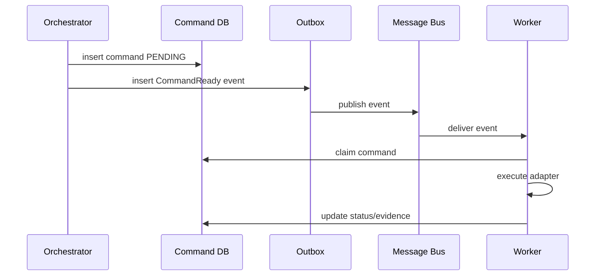

Jangan menjadikan message broker sebagai satu-satunya source of truth untuk activation command.

## 13. Target Throttling And Bulkheading

Vendor target bisa memiliki rate limit rendah.

Contoh constraint:

- HLR legacy hanya aman 20 TPS;
- batch target menerima file tiap 15 menit;
- OLT management system tidak boleh dipukul paralel per node;
- vendor API punya global concurrent session limit;
- IPAM API lambat saat subnet besar;
- eSIM platform punya provisioning quota.

Activation layer perlu throttling per target:

```text
targetSystem=HSS_VENDOR_A, maxConcurrency=20, maxRps=50
node=OLT-123, maxConcurrency=1
operation=deleteSubscriber, maxRps=10
partner=MVNO-X, maxConcurrency=5
```

Jangan memakai global worker pool tanpa target-aware throttling. Satu vendor lambat bisa menahan seluruh fulfillment.

## 14. Retry Policy Yang Aman

Retry harus mempertimbangkan operation type.

### 14.1 Safe Retry

Biasanya aman jika command idempotent dan target state dapat diverifikasi.

Contoh:

- set profile to value X;
- ensure DNS record exists;
- ensure AAA user enabled;
- ensure APN active.

### 14.2 Dangerous Retry

Berbahaya jika command menghasilkan efek baru setiap kali.

Contoh:

- deduct balance;
- allocate new resource;
- create profile without external id;
- generate eSIM activation code;
- send irreversible OTA update;
- delete subscriber.

Untuk dangerous retry, wajib ada:

- external correlation id;
- read-back;
- compensation plan;
- manual review threshold.

### 14.3 Retry Decision Matrix

| Error type | Example | Action |
|---|---|---|
| transport timeout | socket timeout | mark `UNKNOWN`, verify |
| 429/rate limit | vendor throttling | retry with backoff |
| 5xx temporary | vendor outage | retry with circuit breaker |
| validation error | invalid APN code | terminal fallout |
| duplicate exists | profile already exists | verify desired state, complete if equivalent |
| partial success | APN active, VoLTE failed | split/continue/fallout by dependency |
| unknown code | undocumented error | classify as fallout until mapped |

## 15. Evidence-Driven Completion

Activation completion harus berbasis evidence.

Evidence dapat berupa:

- vendor response final success;
- read-back response;
- target state snapshot;
- callback result;
- batch result line;
- operator proof;
- discovery confirmation;
- synthetic test result;
- customer session/authentication event.

Contoh evidence model:

```java
public record ActivationEvidence(
    ActivationCommandId commandId,
    String targetSystem,
    String targetRequestId,
    EvidenceType type,
    Instant observedAt,
    String observedBy,
    String normalizedState,
    String rawReference,
    Map<String, String> keyAttributes,
    boolean provesDesiredState
) {}
```

Raw vendor payload tidak selalu perlu disimpan di domain database. Simpan referensi immutable ke object store/log secure jika payload besar atau sensitif.

## 16. Read-Back And Reconciliation

Read-back adalah query langsung ke target untuk membandingkan desired state dan observed state.

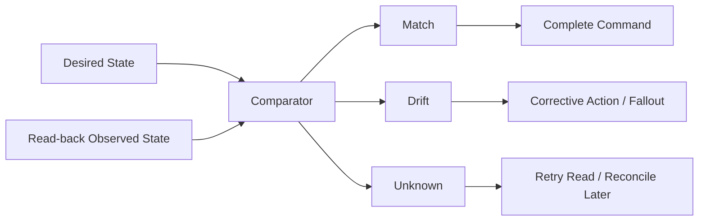

### 16.1 Desired State

Desired state harus berasal dari fulfillment plan, bukan dari vendor response.

Contoh:

```json
{
  "msisdn": "62812xxxxxxx",
  "imsi": "51010xxxxxxxxxx",
  "apn": ["internet", "ims"],
  "volteEnabled": true,
  "roamingAllowed": false,
  "serviceClass": "PREPAID_DATA_50GB"
}
```

### 16.2 Observed State

Observed state berasal dari target.

Contoh:

```json
{
  "subscriberFound": true,
  "apn": ["internet", "ims"],
  "voiceProfile": "VOLTE",
  "roamingFlag": "BARRED",
  "serviceClass": "PREPAID_DATA_50GB"
}
```

### 16.3 Comparator

Comparator harus domain-aware.

Jangan melakukan string equality mentah karena vendor bisa memakai kode berbeda.

Contoh:

```java
public interface ActivationStateComparator<D, O> {
    VerificationResult compare(D desired, O observed);
}

public record VerificationResult(
    boolean matches,
    List<String> mismatches,
    List<String> warnings,
    boolean retryable
) {}
```

## 17. Handling Partial Activation

Partial activation adalah kondisi umum.

Contoh mobile service:

- subscriber berhasil dibuat di HSS;
- APN internet aktif;
- IMS/VoLTE gagal;
- OCS bucket belum aktif.

Pertanyaan penting:

- Apakah service boleh active sebagian?
- Apakah customer boleh diberi akses data tanpa VoLTE?
- Apakah billing boleh dimulai?
- Apakah order harus menunggu semua item?
- Apakah fallback product/service profile tersedia?

Model partial harus ditentukan di service spec/decomposition rule.

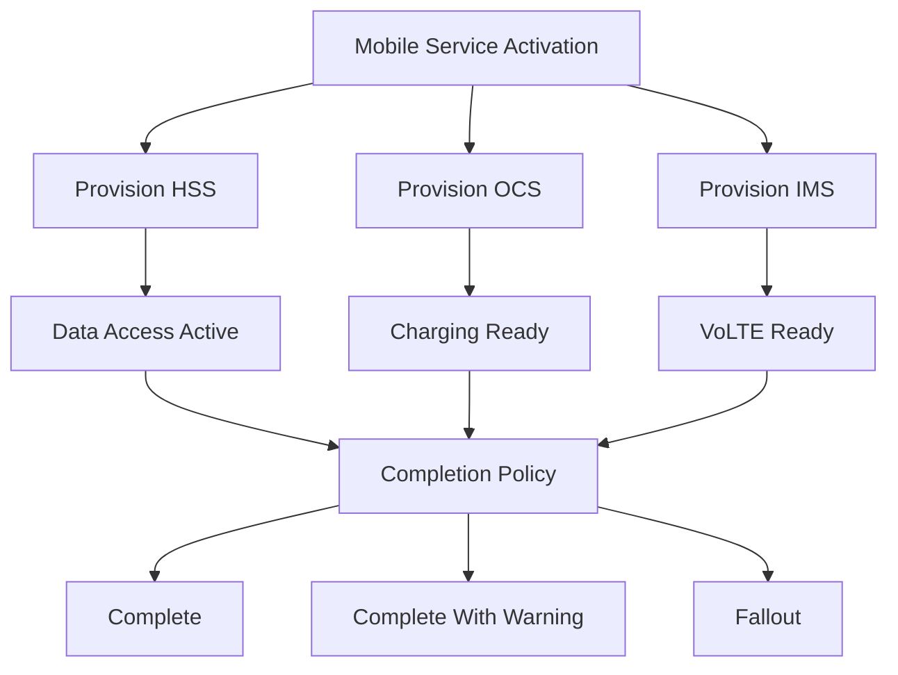

Completion policy harus explicit.

## 18. Compensation And Rollback

Tidak semua activation bisa di-rollback.

Tiga kategori:

1. **reversible** — bisa dihapus/disable dengan aman;
2. **compensatable** — tidak bisa rollback persis, tetapi bisa dibuat correction;
3. **irreversible** — perlu manual governance.

Contoh:

| Operation | Rollback strategy |
|---|---|
| create AAA profile | delete/disable profile |
| enable APN | disable APN |
| assign MSISDN | release after quarantine |
| generate eSIM QR | cancel/revoke profile if unused |
| send OTA SIM update | usually not safely reversible |
| deduct balance | compensating credit/adjustment |

Jangan menjanjikan distributed transaction ke network. Gunakan saga + compensation + reconciliation.

## 19. Adapter Contract

Port internal bisa seperti ini:

```java
public interface ActivationAdapter<P extends ActivationPayload> {
    String targetSystem();
    ActivationCommandType supports();
    ActivationDispatchResult dispatch(ActivationCommand<P> command);
    Optional<ActivationReadBackResult> readBack(ActivationCommand<P> command);
    default boolean supportsCancel(ActivationCommand<P> command) {
        return false;
    }
}
```

Dispatch result harus normalized:

```java
public sealed interface ActivationDispatchResult {
    record Accepted(String targetRequestId) implements ActivationDispatchResult {}
    record Completed(ActivationEvidence evidence) implements ActivationDispatchResult {}
    record Rejected(String reasonCode, String message, boolean retryable) implements ActivationDispatchResult {}
    record Unknown(String message) implements ActivationDispatchResult {}
}
```

Read-back result:

```java
public sealed interface ActivationReadBackResult {
    record DesiredStateObserved(ActivationEvidence evidence) implements ActivationReadBackResult {}
    record DifferentStateObserved(List<String> differences, boolean retryable) implements ActivationReadBackResult {}
    record TargetNotFound(boolean retryable) implements ActivationReadBackResult {}
    record ReadBackUnavailable(String reason) implements ActivationReadBackResult {}
}
```

## 20. Vendor Error Normalization

Vendor errors harus dipetakan ke taxonomy internal.

Contoh internal taxonomy:

```java
public enum ActivationErrorCategory {
    VALIDATION,
    AUTHORIZATION,
    TARGET_UNAVAILABLE,
    RATE_LIMITED,
    CONFLICT,
    DUPLICATE,
    NOT_FOUND,
    PARTIAL_SUCCESS,
    TIMEOUT,
    UNKNOWN_VENDOR_ERROR,
    DATA_INCONSISTENCY,
    UNSUPPORTED_OPERATION
}
```

Mapping table:

| Vendor code | Meaning | Internal category | Retry? | Fallout? |
|---|---|---|---|---|
| `ERR_INVALID_APN` | APN not recognized | `VALIDATION` | no | yes |
| `ERR_DUP_SUB` | subscriber exists | `DUPLICATE` | verify | maybe no |
| `HTTP_429` | rate limited | `RATE_LIMITED` | yes | no |
| `SOCKET_TIMEOUT` | no response | `TIMEOUT` | verify first | maybe |
| `ERR_DB_LOCK` | target busy | `TARGET_UNAVAILABLE` | yes | no |
| unknown | undocumented | `UNKNOWN_VENDOR_ERROR` | limited | yes |

Unknown error should not be silently retried forever.

## 21. Activation Sequence Example: Mobile Subscriber

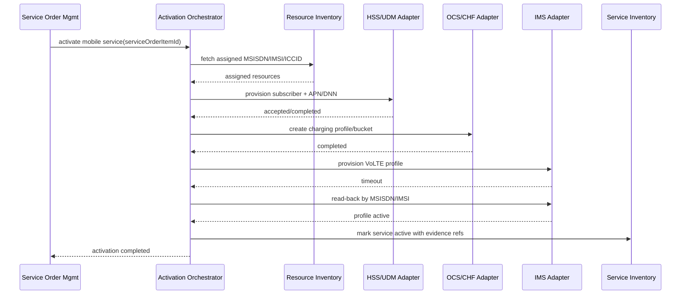

Perhatikan: timeout IMS tidak langsung menjadi failure. Orchestrator melakukan read-back.

## 22. Activation Sequence Example: Fixed Broadband

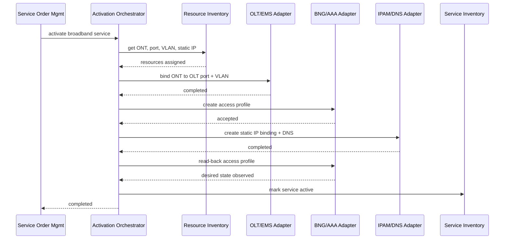

Fixed activation sering bergantung pada field work. Jika ONT belum terpasang atau port discovery tidak match, activation harus masuk fallout atau wait state, bukan gagal teknis biasa.

## 23. Java Aggregate Boundary

Activation command store bisa menjadi aggregate sendiri.

```java
public final class ActivationCommandAggregate {
    private final ActivationCommandId id;
    private ActivationStatus status;
    private int attempt;
    private Instant nextAttemptAt;
    private final List<ActivationEvidence> evidences = new ArrayList<>();
    private final List<ActivationEvent> domainEvents = new ArrayList<>();

    public void markDispatched(String workerId, Instant now) {
        requireStatus(ActivationStatus.PENDING, ActivationStatus.FAILED_RETRIABLE);
        this.status = ActivationStatus.DISPATCHED;
        this.attempt++;
        domainEvents.add(new ActivationCommandDispatched(id, workerId, attempt, now));
    }

    public void markUnknown(String reason, Instant now) {
        if (status.isTerminal()) {
            throw new IllegalStateException("terminal command cannot become unknown");
        }
        this.status = ActivationStatus.UNKNOWN;
        this.nextAttemptAt = now.plusSeconds(300);
        domainEvents.add(new ActivationCommandUnknown(id, reason, now));
    }

    public void completeWith(ActivationEvidence evidence, Instant now) {
        if (!evidence.provesDesiredState()) {
            throw new IllegalArgumentException("evidence does not prove desired state");
        }
        evidences.add(evidence);
        this.status = ActivationStatus.COMPLETED;
        domainEvents.add(new ActivationCommandCompleted(id, evidence.rawReference(), now));
    }
}
```

Invariant penting:

- terminal command tidak boleh berubah tanpa correction action;
- completed command harus punya evidence;
- retry harus menaikkan attempt;
- unknown harus punya reason;
- failed terminal harus membuat fallout/correction route.

## 24. Persistence Model

Minimal tables:

```sql
create table activation_command (
    id uuid primary key,
    service_order_id uuid not null,
    service_order_item_id uuid not null,
    command_type varchar(100) not null,
    target_system varchar(100) not null,
    target_resource_id varchar(200),
    payload_json jsonb not null,
    payload_hash varchar(128) not null,
    idempotency_key varchar(300) not null unique,
    status varchar(50) not null,
    priority int not null default 0,
    attempt int not null default 0,
    max_attempt int not null default 5,
    not_before timestamptz,
    deadline timestamptz,
    next_attempt_at timestamptz,
    claimed_by varchar(100),
    claimed_until timestamptz,
    created_at timestamptz not null,
    updated_at timestamptz not null,
    version bigint not null
);

create table activation_evidence (
    id uuid primary key,
    command_id uuid not null references activation_command(id),
    evidence_type varchar(50) not null,
    target_system varchar(100) not null,
    target_request_id varchar(200),
    normalized_state varchar(100) not null,
    proves_desired_state boolean not null,
    raw_reference text,
    observed_at timestamptz not null,
    created_at timestamptz not null
);

create table activation_attempt (
    id uuid primary key,
    command_id uuid not null references activation_command(id),
    attempt_no int not null,
    worker_id varchar(100) not null,
    started_at timestamptz not null,
    ended_at timestamptz,
    result_category varchar(100),
    vendor_code varchar(200),
    normalized_error varchar(100),
    message text
);
```

Index penting:

```sql
create index idx_activation_command_ready
on activation_command(status, next_attempt_at, priority, created_at);

create index idx_activation_command_order_item
on activation_command(service_order_item_id);

create index idx_activation_evidence_command
on activation_evidence(command_id, observed_at desc);
```

## 25. Completion Propagation

Jika activation command complete, tidak otomatis product/service order complete. Completion harus dipropagasikan ke fulfillment state machine.

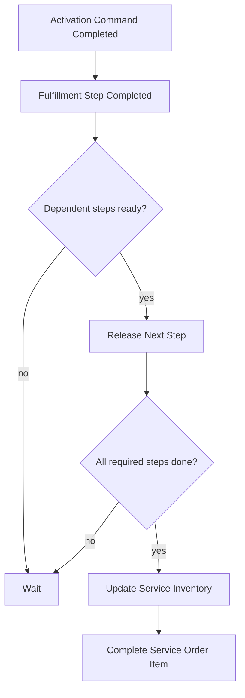

Service inventory harus diperbarui hanya setelah evidence cukup.

## 26. Activation And Billing Trigger

Salah satu bug telco paling mahal adalah billing dimulai saat service belum benar-benar aktif.

Billing trigger harus jelas:

- product order accepted? biasanya tidak;
- service order started? biasanya tidak;
- resource assigned? biasanya tidak;
- activation command accepted? biasanya tidak;
- activation evidence complete? sering ya;
- first usage observed? tergantung product;
- field installation complete? untuk fixed service sering ya.

Rule harus berada di product/service lifecycle policy, bukan hardcoded di adapter.

Contoh event:

```json
{
  "eventType": "ServiceActivated",
  "serviceId": "svc-123",
  "activationEvidenceId": "ev-456",
  "commercialProductId": "prod-789",
  "billableFrom": "2026-06-29T10:15:00Z",
  "reason": "ALL_REQUIRED_ACTIVATION_STEPS_VERIFIED"
}
```

## 27. Security And Credential Boundary

Activation adapters memegang akses sangat sensitif.

Prinsip:

- gunakan dedicated service account per target;
- least privilege per operation;
- rotate secret;
- jangan log credential;
- mask IMSI/ICCID/MSISDN sesuai policy;
- encrypt raw payload jika berisi sensitive identifier;
- segregate production/test target;
- audit operator override;
- restrict manual replay;
- record who/what executed command.

Khusus telco, activation payload sering mengandung identifier yang bisa dipakai untuk fraud atau privacy abuse.

## 28. Observability Khusus Activation

Observability umum sudah dibahas di seri reliability/observability. Di sini fokus metrik domain activation.

Metrik penting:

- command throughput per target;
- success rate per target/command type;
- unknown rate;
- retry rate;
- terminal failure rate;
- average activation latency;
- p95/p99 activation latency;
- stuck command count;
- callback lag;
- batch reject rate;
- read-back mismatch rate;
- fallout creation rate;
- target throttle utilization;
- commands past deadline;
- service orders waiting activation.

Trace correlation:

```text
productOrderId -> serviceOrderId -> serviceOrderItemId -> activationCommandId -> targetRequestId -> evidenceId
```

Log tanpa correlation adalah hampir tidak berguna untuk telco activation.

## 29. Adapter Testing Strategy

Testing activation lebih sulit karena target vendor tidak selalu tersedia.

Gunakan beberapa lapis test.

### 29.1 Domain Unit Test

Uji state machine:

- pending to dispatched;
- dispatched timeout to unknown;
- unknown read-back complete;
- retriable failure scheduling;
- terminal failure creates fallout event;
- completed requires evidence.

### 29.2 Adapter Contract Test

Uji mapping internal command ke vendor request dan vendor response ke normalized result.

Simpan golden transcript:

```text
command: ProvisionMobileSubscriber
vendor request: createSubscriber.xml
vendor response: success.xml
normalized result: Completed
```

### 29.3 Simulator Test

Bangun simulator target untuk:

- success;
- slow success;
- timeout then success;
- duplicate request;
- partial success;
- validation error;
- undocumented error;
- callback out-of-order.

### 29.4 Reconciliation Test

Uji comparator desired vs observed.

### 29.5 Production-Like Soak Test

Uji volume, throttling, backoff, and stuck command detection.

## 30. Migration From Legacy Provisioning

Legacy provisioning sering berupa:

- stored procedure;
- monolith mediation;
- file batch;
- vendor console;
- shell script;
- direct DB update;
- manually maintained spreadsheets.

Migration aman biasanya bertahap:

1. wrap existing operation with adapter;
2. introduce command store and evidence;
3. stop direct mutation from upstream;
4. add read-back;
5. add idempotency key;
6. introduce fallout workflow;
7. split adapters per target/capability;
8. retire legacy bypass paths.

Jangan langsung mengganti semua provisioning dengan “modern API layer” tanpa operational fallback.

## 31. Common Anti-Patterns

### 31.1 Adapter Calls Hidden Inside Order Transaction

Jangan panggil vendor API di dalam database transaction order. Jika vendor lambat, transaction tertahan. Jika rollback terjadi setelah vendor sukses, state dunia luar sudah berubah.

### 31.2 Boolean Success

`success=true/false` tidak cukup untuk activation. Butuh accepted, in progress, unknown, retriable failure, terminal failure, completed with evidence.

### 31.3 Timeout Treated As Failed

Timeout harus dianggap unknown sampai ada evidence.

### 31.4 Retry Without Idempotency

Retry command non-idempotent dapat membuat duplicate subscriber, duplicate charging bucket, double deduction, atau duplicated eSIM profile.

### 31.5 Vendor Model Leaks Into Domain Core

Jika domain service mengenal `SOAPFaultCode123`, adapter boundary gagal.

### 31.6 No Read-Back

Tanpa read-back, sistem hanya percaya response vendor. Dalam telco, response accepted sering belum berarti network active.

### 31.7 No Evidence

Support tidak bisa menjawab “kenapa customer belum aktif?” jika tidak ada evidence dan attempt history.

### 31.8 One Worker Pool For All Targets

Satu target lambat dapat menahan semua activation.

### 31.9 Manual Fix Outside System

Jika operator memperbaiki di vendor console tanpa mencatat evidence di BSS/OSS, inventory dan order state akan drift.

## 32. Design Checklist

Sebelum desain activation diterima, pastikan:

- Apakah activation dipisah dari service order core?
- Apakah setiap command punya idempotency key?
- Apakah command lifecycle explicit?
- Apakah timeout menjadi `UNKNOWN`?
- Apakah read-back tersedia untuk critical operation?
- Apakah target error dinormalisasi?
- Apakah retry policy berbeda per operation type?
- Apakah target-aware throttling ada?
- Apakah evidence disimpan?
- Apakah adapter menyembunyikan vendor model?
- Apakah partial activation punya policy?
- Apakah compensation/rollback realistis?
- Apakah manual fallback tetap controlled?
- Apakah correlation id end-to-end tersedia?
- Apakah payload sensitive dimasking/encrypted?
- Apakah billing trigger menunggu activation evidence yang benar?

## 33. Deliberate Practice

Latihan 1 — Mobile activation:

Rancang activation flow untuk mobile prepaid service. Sertakan HSS/UDM provisioning, OCS bucket, APN/DNN, VoLTE, SIM/eSIM state, evidence, dan failure handling.

Latihan 2 — Timeout semantics:

Buat state machine untuk command `EnableRoaming`. Vendor sering timeout, tetapi read-back menunjukkan roaming sudah aktif. Tentukan state transition dan audit event.

Latihan 3 — Adapter interface:

Implementasikan Java interface untuk activation adapter dan dua adapter palsu: `HssAdapter` dan `IpamAdapter`. Pastikan response vendor dinormalisasi.

Latihan 4 — Batch provisioning:

Rancang file batch activation untuk legacy AAA. Sertakan file id, line id, checksum, result parser, duplicate file handling, dan line-level retry.

Latihan 5 — Fallout trigger:

Tentukan kapan activation command masuk automated retry, kapan menjadi manual fallout, dan kapan harus stop order.

## 34. Ringkasan

Activation & Provisioning Adapters adalah boundary antara fulfillment intent dan perubahan nyata di network/vendor systems.

Sistem yang baik:

- tidak memanggil vendor langsung dari order transaction;
- memakai activation command store;
- menjaga idempotency;
- memperlakukan timeout sebagai unknown;
- memakai read-back dan evidence;
- menormalisasi vendor error;
- mengontrol retry, throttling, dan target concurrency;
- menyembunyikan vendor model di adapter;
- mendukung sync, async, polling, batch, dan manual activation;
- menghubungkan activation evidence ke service inventory, order completion, dan billing trigger;
- dan menyediakan observability domain yang memungkinkan operasi memahami apa yang terjadi.

Di part berikutnya kita membahas **Fallout Management & Manual Workflows**: bagaimana sistem BSS/OSS tetap terkendali ketika activation, fulfillment, data quality, appointment, resource, atau partner workflow gagal dan membutuhkan intervensi manusia.

## 35. Referensi

- TM Forum — TMF702 Resource Activation and Configuration API: https://www.tmforum.org/open-digital-architecture/open-apis/resource-activation-management-api-TMF702/v4.0
- TM Forum — TMF641 Service Ordering Management API: https://www.tmforum.org/open-digital-architecture/open-apis/service-ordering-management-api-TMF641/v4.1
- TM Forum — TMF652 Resource Ordering Management API: https://www.tmforum.org/resources/specification/tmf652-resource-ordering-management-api-rest-specification-r16-5-1/
- TM Forum — TMF639 Resource Inventory Management API: https://www.tmforum.org/open-digital-architecture/open-apis/resource-inventory-management-api-TMF639/v5.0
- TM Forum — Open API Directory: https://www.tmforum.org/open-digital-architecture/open-apis
