# Part 020 — Fallout Management & Manual Workflows

## 1. Posisi Part Ini Dalam Seri

Part sebelumnya membahas **Activation & Provisioning Adapters**: bagaimana fulfillment intent dikirim ke HLR/HSS/UDM/PCF/OCS/AAA/DNS/IPAM/OLT/BNG/vendor systems dengan idempotency, timeout handling, retry, read-back, dan evidence.

Namun sistem telco nyata tidak pernah 100% otomatis.

Akan selalu ada:

- data quality issue;
- customer identity mismatch;
- address/site ambiguity;
- resource conflict;
- vendor outage;
- appointment problem;
- activation partial success;
- network inventory drift;
- partner delay;
- credit/fraud hold;
- regulatory hold;
- manual field correction;
- legacy system behavior yang tidak bisa dikontrol penuh.

Di part ini kita membahas **Fallout Management & Manual Workflows**.

Pertanyaan inti:

> Bagaimana Java BSS/OSS tetap menjaga order, service, resource, billing, SLA, dan audit tetap benar ketika automation gagal dan manusia harus masuk ke proses?

Jawaban pendeknya:

> Manual workflow harus menjadi first-class controlled process, bukan bypass di luar sistem.

## 2. Kaufman Skill Target

Target performa part ini:

> Kamu mampu merancang fallout management component di Java yang menangkap kegagalan fulfillment/activation/data/partner, mengklasifikasikan problem, membuat task manual, mengatur queue/SLA/escalation, mengontrol correction action, merekam evidence, dan melanjutkan atau menghentikan order secara aman.

Sub-skill yang perlu dikuasai:

1. membedakan failure, exception, fallout, ticket, incident, dan manual task;
2. membuat taxonomy fallout telco;
3. mendesain lifecycle fallout case;
4. membuat queue dan assignment model;
5. menentukan SLA clock dan escalation;
6. membedakan retry, correction, compensation, amendment, cancellation, dan resume;
7. membuat maker-checker untuk high-risk correction;
8. menghubungkan manual evidence ke order/service/resource state;
9. mencegah operator bypass yang menciptakan drift;
10. menyediakan UI/API/event untuk operasi production.

## 3. Mental Model: Fallout Sebagai Controlled Exception Lane

Fallout bukan “error log”. Fallout adalah exception lane dalam fulfillment.

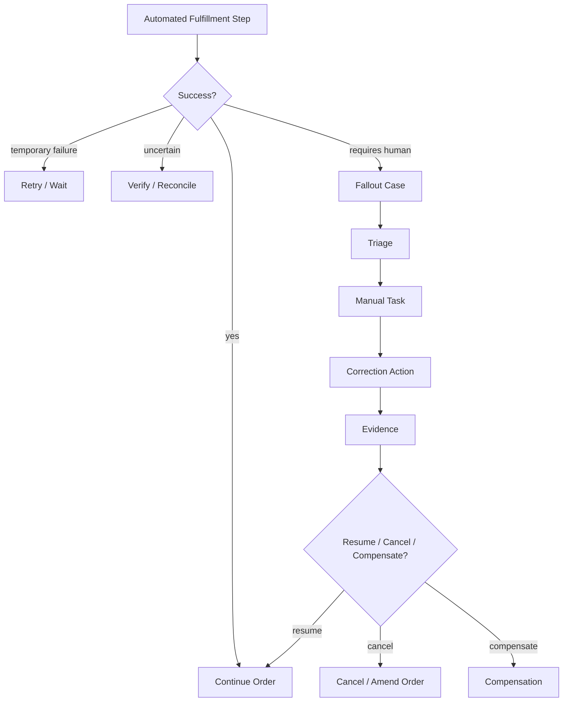

Fallout harus memiliki:

- owner;
- reason;
- impacted order/service/customer;
- severity/priority;
- SLA;
- next action;
- allowed correction;
- evidence;
- audit trail;
- resume/cancel decision.

Tanpa itu, fallout berubah menjadi “orang di chat group memperbaiki production diam-diam”.

## 4. Failure vs Fallout vs Trouble Ticket vs Incident

Istilah ini sering tercampur.

### 4.1 Failure

Failure adalah kegagalan teknis atau bisnis pada satu operasi.

Contoh:

- adapter timeout;
- invalid APN code;
- MSISDN already assigned;
- credit check rejected;
- partner API unavailable.

Failure belum tentu butuh manusia.

### 4.2 Fallout

Fallout adalah kondisi proses yang tidak bisa dilanjutkan otomatis dengan aman.

Contoh:

- order data conflict;
- activation state unknown setelah verification gagal;
- appointment tidak valid;
- resource assigned di inventory tetapi tidak ditemukan di network;
- subscriber already exists with different IMSI;
- partner reject but reason ambiguous.

Fallout membutuhkan triage, correction, decision, atau approval.

### 4.3 Trouble Ticket

Trouble ticket biasanya customer/network assurance problem setelah service berjalan atau selama fulfillment jika customer-facing issue terjadi.

Contoh:

- customer melaporkan internet tidak aktif;
- alarm menunjukkan port down;
- service active di BSS tetapi customer tidak bisa attach network.

Trouble ticket akan dibahas lebih dalam di Part 024.

### 4.4 Incident

Incident adalah gangguan operasional yang berdampak lebih luas.

Contoh:

- HSS vendor outage;
- OCS latency tinggi;
- IPAM corruption;
- mass activation stuck;
- integration gateway down.

Satu incident bisa menyebabkan banyak fallout cases.

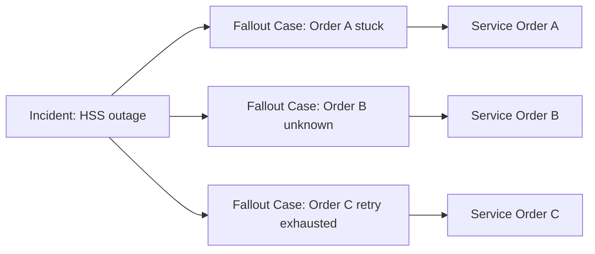

## 5. Taxonomy Fallout Telco

Taxonomy yang baik mempercepat routing, SLA, automation recovery, dan analytics.

### 5.1 Data Fallout

Penyebab:

- missing customer data;
- inconsistent identity;
- invalid address/site;
- invalid catalog configuration;
- product/service mismatch;
- wrong resource reference;
- duplicate account;
- invalid enterprise hierarchy.

Contoh:

```text
Order contains product offering X, but decomposition requires service specification Y that is inactive.
```

Correction:

- amend order data;
- update catalog mapping;
- re-run qualification;
- request customer clarification;
- cancel incompatible item.

### 5.2 Resource Fallout

Penyebab:

- no available MSISDN/IP/port;
- reserved resource expired;
- assigned resource already active elsewhere;
- resource in quarantine;
- discovered inventory mismatch;
- resource relationship conflict.

Correction:

- reallocate resource;
- release stale reservation;
- quarantine conflicting resource;
- manual inventory correction;
- split order;
- trigger network reconciliation.

### 5.3 Activation Fallout

Penyebab:

- terminal vendor validation error;
- repeated timeout;
- unknown activation state;
- partial activation;
- target system reject;
- unsupported command;
- duplicate subscriber mismatch.

Correction:

- manual provision;
- read-back verification;
- change payload;
- retry after fix;
- compensation/delete orphan;
- escalate to vendor.

### 5.4 Appointment And Field Fallout

Penyebab:

- technician no-show;
- customer no-access;
- wrong site;
- port not available on site;
- ONT serial mismatch;
- installation failed;
- safety/regulatory constraint.

Correction:

- reschedule;
- update site/access note;
- assign new port;
- replace device;
- escalate field supervisor;
- change service design.

### 5.5 Partner Fallout

Penyebab:

- MVNO host reject;
- wholesale provider delay;
- inter-provider order mismatch;
- partner API timeout;
- partner SLA breach;
- settlement/account mismatch.

Correction:

- partner clarification;
- resubmit order;
- manual partner portal update;
- SLA escalation;
- cancel/re-route provider.

### 5.6 Billing/Charging Fallout

Penyebab:

- activation complete but charging bucket missing;
- rating profile unavailable;
- bill account mismatch;
- invoice hold;
- tax profile missing;
- prepaid balance creation failed.

Correction:

- create missing balance;
- update charge profile;
- hold billing start;
- apply adjustment;
- rollback activation if required by policy.

### 5.7 Compliance/Fraud/Credit Fallout

Penyebab:

- KYC incomplete;
- fraud score high;
- sanctions/blacklist hit;
- credit check pending;
- lawful intercept restriction;
- consent missing.

Correction:

- manual review;
- request evidence;
- reject order;
- approve with condition;
- hold activation;
- escalate compliance.

## 6. Fallout Lifecycle

Gunakan lifecycle explicit.

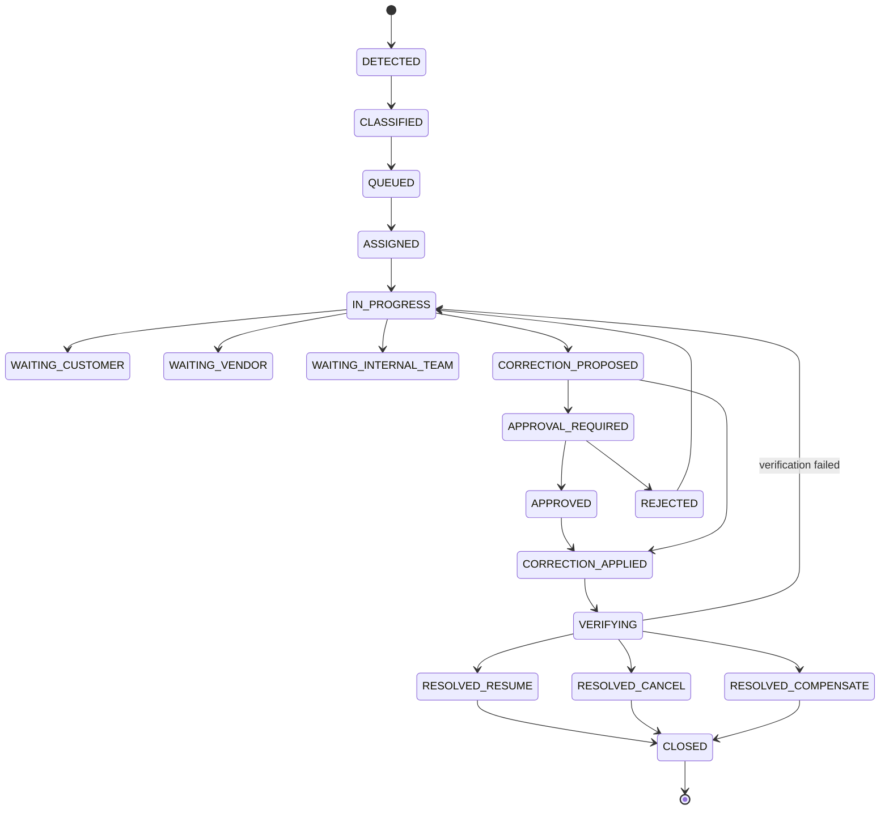

State penting:

| State | Meaning |
|---|---|
| `DETECTED` | event failure/fallout diterima |
| `CLASSIFIED` | reason/category/severity ditentukan |
| `QUEUED` | masuk queue operasi |
| `ASSIGNED` | owner ditetapkan |
| `IN_PROGRESS` | investigasi/correction berjalan |
| `WAITING_*` | clock bisa berbeda tergantung SLA policy |
| `CORRECTION_PROPOSED` | correction action sudah dipilih |
| `APPROVAL_REQUIRED` | maker-checker diperlukan |
| `CORRECTION_APPLIED` | correction dieksekusi |
| `VERIFYING` | evidence diverifikasi |
| `RESOLVED_RESUME` | order boleh lanjut |
| `RESOLVED_CANCEL` | order/item harus dibatalkan |
| `RESOLVED_COMPENSATE` | compensation dibutuhkan |
| `CLOSED` | case selesai dengan audit lengkap |

## 7. Fallout Case Aggregate

Fallout case bukan sekadar ticket. Ia harus terhubung ke order, service, resource, customer, dan correction.

```java
public final class FalloutCase {
    private final FalloutCaseId id;
    private final FalloutSource source;
    private FalloutCategory category;
    private FalloutSeverity severity;
    private FalloutStatus status;
    private final CustomerId customerId;
    private final ServiceOrderId serviceOrderId;
    private final ServiceOrderItemId serviceOrderItemId;
    private ServiceId impactedServiceId;
    private ResourceId impactedResourceId;
    private String assignedQueue;
    private String assignedUser;
    private SlaClock slaClock;
    private final List<FalloutTask> tasks = new ArrayList<>();
    private final List<CorrectionAction> correctionActions = new ArrayList<>();
    private final List<EvidenceRef> evidenceRefs = new ArrayList<>();
    private ResumeToken resumeToken;

    public void classify(FalloutCategory category, FalloutSeverity severity, String queue) {
        requireStatus(FalloutStatus.DETECTED);
        this.category = category;
        this.severity = severity;
        this.assignedQueue = queue;
        this.status = FalloutStatus.QUEUED;
    }

    public void proposeCorrection(CorrectionAction action) {
        requireStatus(FalloutStatus.IN_PROGRESS);
        if (action.riskLevel().requiresApproval()) {
            this.status = FalloutStatus.APPROVAL_REQUIRED;
        } else {
            this.status = FalloutStatus.CORRECTION_PROPOSED;
        }
        this.correctionActions.add(action);
    }

    public void resolveForResume(EvidenceRef evidence, ResumeToken token) {
        requireStatus(FalloutStatus.VERIFYING);
        this.evidenceRefs.add(evidence);
        this.resumeToken = token;
        this.status = FalloutStatus.RESOLVED_RESUME;
    }
}
```

Invariant:

- case tidak boleh closed tanpa resolution;
- correction high-risk wajib approval;
- resume harus memakai token agar order tidak dilanjutkan dari state salah;
- evidence wajib untuk resolution;
- source order/item/resource harus immutable setelah case created, kecuali explicit relink action.

## 8. Source Of Fallout

Fallout dapat dibuat dari banyak komponen.

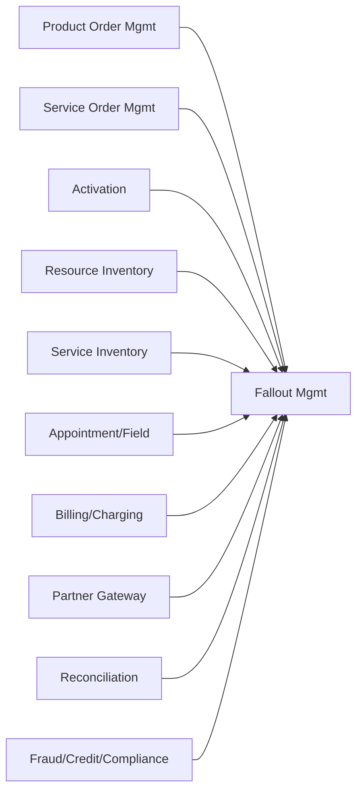

Setiap source harus mengirim payload standar:

```json
{
  "sourceSystem": "activation-service",
  "sourceEventId": "evt-123",
  "correlationId": "corr-456",
  "customerId": "cust-1",
  "serviceOrderId": "so-1",
  "serviceOrderItemId": "soi-1",
  "resourceId": "res-1",
  "categoryHint": "ACTIVATION",
  "reasonCode": "DUPLICATE_SUBSCRIBER_MISMATCH",
  "message": "Subscriber exists with same MSISDN but different IMSI",
  "severityHint": "HIGH",
  "resumePoint": "after command ProvisionMobileSubscriber"
}
```

Fallout creation harus idempotent berdasarkan source event/correlation.

## 9. Queue And Assignment Model

Queue bukan hanya label. Queue adalah operational contract.

Queue menentukan:

- skill group;
- SLA;
- priority rule;
- allowed actions;
- escalation path;
- approval requirement;
- visibility;
- working hours/calendar;
- handoff policy.

Contoh queue:

| Queue | Category | Skill |
|---|---|---|
| `FULFILLMENT_DATA_FIX` | data fallout | order/catalog/data analyst |
| `RESOURCE_CONTROL` | resource fallout | inventory operations |
| `MOBILE_ACTIVATION_L2` | activation fallout | mobile core provisioning |
| `FIXED_FIELD_SUPPORT` | field fallout | field operations |
| `PARTNER_WHOLESALE` | partner fallout | wholesale operations |
| `BILLING_RA` | billing fallout | billing/revenue assurance |
| `FRAUD_REVIEW` | fraud/compliance | fraud analyst |

Assignment strategy:

- round-robin;
- skill-based;
- load-based;
- severity-based;
- region-based;
- product-line-based;
- customer-segment-based;
- manual pull model.

## 10. SLA Clock And Escalation

Fallout affects customer experience and revenue. SLA clock harus explicit.

SLA dimensions:

- time to classify;
- time to assign;
- time to first action;
- time to resolve;
- customer promise time;
- partner SLA;
- regulatory deadline;
- order due date.

Clock policy harus menjawab:

- apakah clock paused saat waiting customer?
- apakah clock paused saat waiting partner?
- apakah severity mengubah SLA?
- apakah enterprise customer punya SLA khusus?
- apakah breach membuat escalation otomatis?
- apakah breach memicu customer notification?

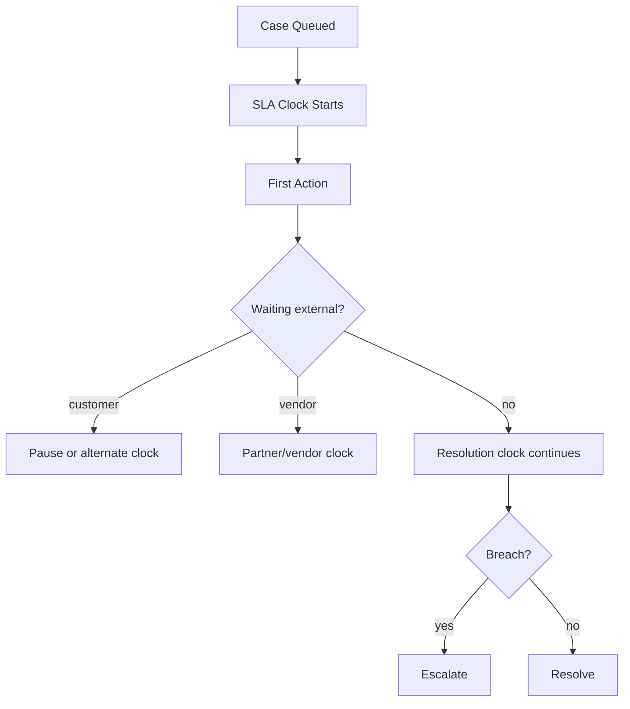

## 11. Correction Action Types

Correction action harus typed, controlled, dan auditable.

### 11.1 Retry

Retry automated step setelah penyebab diperbaiki.

Contoh:

- retry activation setelah vendor outage selesai;
- retry service decomposition setelah catalog mapping diperbaiki;
- retry partner submission setelah partner window terbuka.

### 11.2 Data Correction

Mengubah data yang salah.

Contoh:

- correct address ID;
- fix product configuration;
- correct IMSI binding;
- update contact number;
- attach missing agreement.

Harus ada audit before/after.

### 11.3 Resource Reallocation

Mengganti resource.

Contoh:

- allocate new MSISDN;
- assign new static IP;
- choose alternate OLT port;
- replace SIM/eSIM profile;
- change VLAN.

Harus memicu release/quarantine untuk resource lama.

### 11.4 Manual Provisioning

Operator melakukan perubahan di vendor console/NMS.

Harus ada:

- instruction;
- target system;
- exact payload/parameter;
- operator identity;
- evidence;
- read-back;
- approval jika high-risk.

### 11.5 Order Amendment

Mengubah order karena intent awal tidak bisa dipenuhi.

Contoh:

- downgrade plan;
- remove incompatible add-on;
- change installation date;
- change service address;
- split order.

### 11.6 Cancellation

Membatalkan order/item.

Harus mempertimbangkan:

- resource release;
- charging reversal;
- customer notification;
- contract/agreement implication;
- compensation.

### 11.7 Compensation

Membuat aksi korektif setelah efek samping sudah terjadi.

Contoh:

- credit adjustment;
- waive fee;
- disable wrongly activated feature;
- refund;
- revoke entitlement;
- quarantine resource.

## 12. Maker-Checker For High-Risk Actions

Beberapa correction tidak boleh dilakukan satu orang tanpa approval.

High-risk examples:

- override KYC/fraud hold;
- change billing account;
- manually activate enterprise service;
- release resource assigned to active service;
- force-complete activation without read-back;
- apply large adjustment/refund;
- delete subscriber profile;
- modify lawful intercept related restriction;
- alter audit-sensitive customer data.

Maker-checker flow:

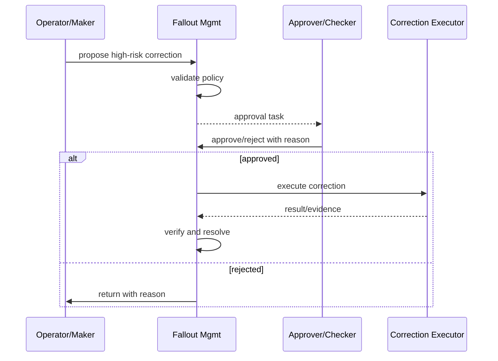

Approval harus merekam:

- siapa maker;
- siapa checker;
- waktu;
- reason;
- before/after;
- risk classification;
- policy reference.

## 13. Resume Token Pattern

Setelah fallout resolved, order tidak boleh lanjut sembarang dari awal.

Gunakan resume token.

Resume token berisi:

- source order/item;
- failed step;
- correction applied;
- verification evidence;
- resume mode;
- valid until;
- one-time use;
- version/concurrency guard.

Contoh:

```java
public record ResumeToken(
    UUID tokenId,
    ServiceOrderItemId serviceOrderItemId,
    String failedStepKey,
    ResumeMode mode,
    UUID evidenceId,
    Instant issuedAt,
    Instant expiresAt,
    long expectedOrderVersion
) {}

public enum ResumeMode {
    RETRY_FAILED_STEP,
    SKIP_STEP_ALREADY_DONE,
    REPLAN_FROM_STEP,
    CANCEL_ITEM,
    COMPENSATE_AND_CLOSE
}
```

Resume token mencegah operator menekan “continue” tanpa bukti atau dari order version yang sudah berubah.

## 14. Evidence Model

Manual workflow harus evidence-driven.

Evidence types:

- screenshot reference;
- vendor request id;
- read-back snapshot;
- field technician report;
- customer confirmation;
- partner confirmation;
- system audit log ref;
- document attachment;
- synthetic test result;
- before/after data diff.

Evidence metadata:

```java
public record EvidenceRef(
    UUID id,
    String evidenceType,
    String source,
    String storageRef,
    String checksum,
    String capturedBy,
    Instant capturedAt,
    boolean customerVisible,
    boolean provesResolution
) {}
```

Evidence harus immutable. Jika salah, tambahkan evidence baru yang mengoreksi; jangan ubah evidence lama diam-diam.

## 15. UI Requirements For Operations

Fallout UI bukan sekadar daftar ticket.

Operator perlu melihat:

- customer summary;
- order summary;
- failed step;
- dependency graph;
- resource assignment;
- activation command attempts;
- raw/normalized error;
- suggested correction;
- allowed actions;
- SLA clock;
- escalation status;
- related incidents;
- evidence timeline;
- audit trail;
- resume/cancel options.

Layout mental:

```text
[Header]
Case ID | Severity | SLA | Queue | Owner | Customer | Order

[Problem]
Reason | Source | Failed Step | Impact | Related Incident

[Context]
Order item graph | Service/resource details | Activation attempts | Inventory state

[Actions]
Retry | Correct data | Reallocate | Manual provision | Escalate | Cancel | Compensate

[Evidence]
Timeline | Attachments | Read-back | Before/After

[Resolution]
Decision | Resume Token | Notification | Audit
```

UI harus mencegah action yang tidak valid berdasarkan state dan policy.

## 16. API Boundary

Fallout management bisa punya API internal seperti:

```http
POST /fallout-cases
GET /fallout-cases/{id}
POST /fallout-cases/{id}/classify
POST /fallout-cases/{id}/assign
POST /fallout-cases/{id}/tasks
POST /fallout-cases/{id}/correction-actions
POST /fallout-cases/{id}/evidence
POST /fallout-cases/{id}/approve
POST /fallout-cases/{id}/resolve
POST /fallout-cases/{id}/resume
```

Namun hati-hati: API correction tidak boleh menjadi generic arbitrary patch.

Jangan buat:

```http
POST /fallout-cases/{id}/executeSql
POST /fallout-cases/{id}/patchAnything
```

Correction action harus domain-specific.

## 17. Event Model

Events penting:

```text
FalloutCaseDetected
FalloutCaseClassified
FalloutCaseAssigned
FalloutTaskCreated
FalloutCorrectionProposed
FalloutCorrectionApproved
FalloutCorrectionRejected
FalloutCorrectionApplied
FalloutEvidenceAttached
FalloutCaseResolvedForResume
FalloutCaseResolvedForCancellation
FalloutCaseResolvedForCompensation
FalloutCaseClosed
FalloutCaseBreachedSla
FalloutCaseEscalated
```

Event payload harus menyertakan correlation:

```json
{
  "eventType": "FalloutCaseResolvedForResume",
  "falloutCaseId": "fc-123",
  "serviceOrderId": "so-123",
  "serviceOrderItemId": "soi-456",
  "resumeTokenId": "rt-789",
  "evidenceId": "ev-111",
  "resolvedBy": "ops.user",
  "resolvedAt": "2026-06-29T12:00:00Z"
}
```

## 18. Idempotent Fallout Creation

Repeated failure events should not create duplicate cases unless policy says each occurrence is separate.

Dedup key examples:

```text
sourceSystem + sourceEventId
serviceOrderItemId + failedStepKey + reasonCode
activationCommandId + terminalFailureCategory
resourceId + discrepancyType + reconciliationRunId
```

Dedup rule harus menyatakan:

- reopen closed case atau create new?
- append event to existing open case?
- link to incident?
- increase severity?
- reset SLA?

Contoh:

```sql
create unique index uq_open_fallout_by_step
on fallout_case(service_order_item_id, failed_step_key, reason_code)
where status not in ('CLOSED', 'CANCELLED');
```

## 19. Data Model Minimal

```sql
create table fallout_case (
    id uuid primary key,
    source_system varchar(100) not null,
    source_event_id varchar(200) not null,
    correlation_id varchar(200) not null,
    category varchar(100) not null,
    severity varchar(50) not null,
    status varchar(50) not null,
    customer_id uuid,
    product_order_id uuid,
    service_order_id uuid,
    service_order_item_id uuid,
    impacted_service_id uuid,
    impacted_resource_id uuid,
    failed_step_key varchar(200),
    reason_code varchar(100) not null,
    message text not null,
    assigned_queue varchar(100),
    assigned_user varchar(100),
    sla_due_at timestamptz,
    created_at timestamptz not null,
    updated_at timestamptz not null,
    closed_at timestamptz,
    version bigint not null
);

create table fallout_task (
    id uuid primary key,
    case_id uuid not null references fallout_case(id),
    task_type varchar(100) not null,
    status varchar(50) not null,
    assigned_queue varchar(100),
    assigned_user varchar(100),
    instruction text,
    created_at timestamptz not null,
    completed_at timestamptz
);

create table correction_action (
    id uuid primary key,
    case_id uuid not null references fallout_case(id),
    action_type varchar(100) not null,
    risk_level varchar(50) not null,
    status varchar(50) not null,
    proposed_by varchar(100) not null,
    approved_by varchar(100),
    payload_json jsonb not null,
    result_json jsonb,
    created_at timestamptz not null,
    executed_at timestamptz
);

create table fallout_evidence (
    id uuid primary key,
    case_id uuid not null references fallout_case(id),
    evidence_type varchar(100) not null,
    storage_ref text,
    checksum varchar(128),
    captured_by varchar(100) not null,
    captured_at timestamptz not null,
    proves_resolution boolean not null
);
```

## 20. Correction Execution Boundary

Correction action dapat dieksekusi oleh:

- fallout component sendiri;
- order management;
- resource inventory;
- activation service;
- billing/charging;
- partner gateway;
- workflow engine;
- manual operator.

Prinsip:

> Fallout component mengontrol decision dan audit, tetapi tidak selalu menjadi pemilik semua mutation.

Contoh:

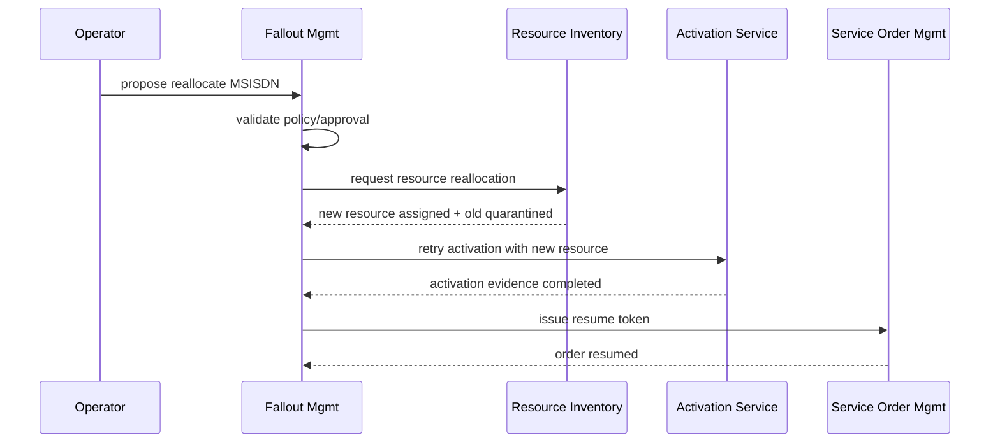

Jangan biarkan fallout component melakukan direct database update ke sistem lain.

## 21. Customer Communication

Tidak semua fallout perlu diberi tahu customer, tetapi banyak yang berdampak pada promise.

Kapan customer notification diperlukan:

- appointment berubah;
- activation tertunda melewati promise date;
- informasi customer dibutuhkan;
- order harus diubah/dibatalkan;
- service active sebagian;
- enterprise SLA terancam;
- regulatory/identity verification pending.

Notification harus berbasis state, bukan manual chat ad-hoc.

Contoh event:

```json
{
  "eventType": "CustomerNotificationRequested",
  "customerId": "cust-123",
  "orderId": "po-456",
  "reason": "INSTALLATION_RESCHEDULE_REQUIRED",
  "templateCode": "ORDER_DELAY_FIELD_ACCESS",
  "channelPreference": ["SMS", "EMAIL"],
  "requiresAgentFollowUp": true
}
```

## 22. Linking Fallout To Incident

Jika banyak fallout berasal dari penyebab sama, hubungkan ke incident.

Benefits:

- operasi tidak menganalisis kasus satu per satu;
- customer impact dapat dihitung;
- SLA escalation lebih jelas;
- bulk resume bisa dilakukan setelah incident resolved;
- root cause analysis lebih kuat.

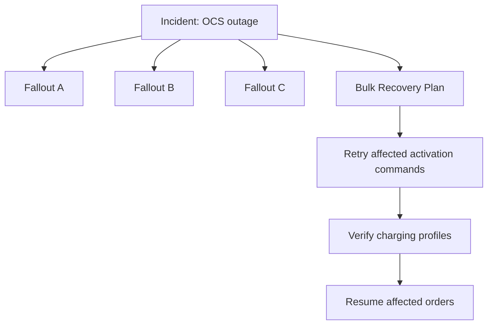

Bulk recovery harus hati-hati: jangan retry semua blindly tanpa dedup/idempotency/read-back.

## 23. Analytics: Learning From Fallout

Fallout data adalah feedback loop untuk memperbaiki automation.

Pertanyaan analytics:

- category fallout terbesar apa?
- target system mana paling sering menyebabkan unknown?
- catalog mapping mana sering salah?
- region/site mana sering field fallout?
- vendor mana sering breach SLA?
- correction action apa paling sering dilakukan?
- berapa persen fallout yang bisa diautomasi berikutnya?
- berapa revenue delayed karena fallout?
- berapa order canceled karena resource shortage?

Dashboard metrik:

- open cases by category/severity/queue;
- average age;
- SLA breach rate;
- mean time to classify;
- mean time to resolve;
- reopen rate;
- repeat fallout by product/resource/target;
- manual correction count;
- automation recovery rate;
- stuck order count;
- revenue at risk.

Top 1% engineer tidak hanya membuat queue; ia membuat sistem belajar dari fallout.

## 24. Policy Engine For Allowed Actions

Allowed action harus ditentukan oleh policy.

Input policy:

- category;
- severity;
- order state;
- service type;
- customer segment;
- risk level;
- operator role;
- queue;
- resource state;
- billing state;
- compliance flag;
- previous corrections.

Output:

- allowed actions;
- required approval;
- required evidence;
- customer notification requirement;
- SLA/escalation rule.

Contoh:

```java
public record FalloutActionPolicy(
    Set<CorrectionType> allowedCorrections,
    boolean approvalRequired,
    Set<EvidenceType> requiredEvidence,
    boolean customerNotificationRequired,
    EscalationPolicy escalationPolicy
) {}
```

Jangan hardcode policy di UI. UI hanya menampilkan action yang diberikan backend policy.

## 25. Manual Workflow And Workflow Engine

Kita sudah membahas BPMN/Camunda di seri lain. Di sini fokus domain telco.

Workflow engine cocok untuk:

- human task;
- approval;
- SLA timer;
- waiting external event;
- multi-step correction;
- escalation;
- audit route.

Namun domain state tetap harus jelas di fallout component.

Anti-pattern:

> Semua business state hanya disimpan sebagai process variable tanpa domain aggregate yang jelas.

Pattern yang lebih baik:

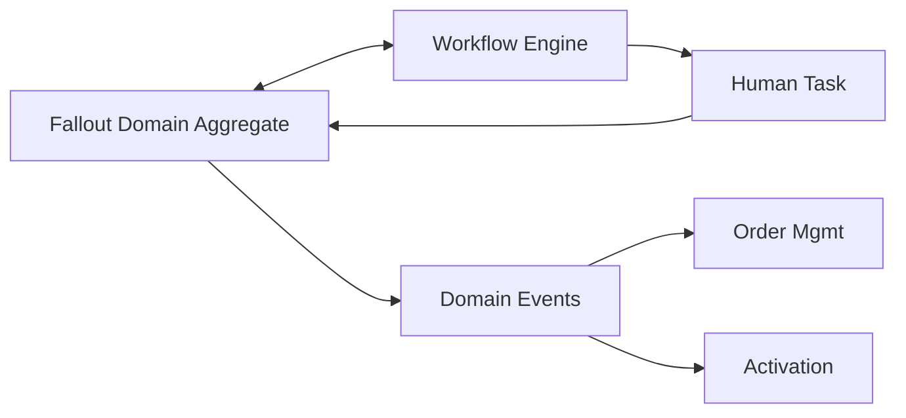

Workflow engine mengorkestrasi task. Fallout aggregate menjaga invariant.

## 26. Concurrency And Locking

Banyak actor bisa menyentuh case:

- operator;
- automation retry;
- incident bulk recovery;
- customer update;
- partner callback;
- SLA escalation job;
- approval checker.

Gunakan optimistic locking pada case.

Rules:

- action harus membawa expected version;
- stale action ditolak;
- terminal case tidak menerima correction baru;
- approval untuk correction yang sudah outdated harus invalid;
- resume token one-time use.

Contoh:

```http
POST /fallout-cases/fc-123/correction-actions
If-Match: version=12
```

## 27. Audit And Regulatory Defensibility

Fallout sering menyentuh order, customer, identity, billing, network access, dan service entitlement. Audit wajib kuat.

Audit harus menjawab:

- siapa mendeteksi problem?
- kapan problem terjadi?
- siapa mengklasifikasikan?
- data apa yang terlihat saat keputusan dibuat?
- correction apa yang dipilih?
- siapa menyetujui?
- evidence apa yang dipakai?
- apa dampaknya ke customer/order/billing?
- mengapa order dilanjutkan/dibatalkan?

Audit event minimal:

```json
{
  "actor": "ops.user",
  "action": "CORRECTION_APPROVED",
  "caseId": "fc-123",
  "correctionActionId": "ca-456",
  "reason": "HSS profile verified manually; duplicate was stale orphan",
  "beforeStateRef": "snapshot-1",
  "afterStateRef": "snapshot-2",
  "timestamp": "2026-06-29T13:00:00Z"
}
```

## 28. Security Model

Manual workflow adalah attack surface.

Controls:

- role-based access;
- queue-based access;
- sensitive field masking;
- step-up authentication for high-risk action;
- maker-checker;
- no direct secret exposure;
- immutable evidence;
- audit log append-only;
- rate limit manual retry;
- segregation of duties;
- production break-glass governance.

Risk example:

- operator dengan akses fallout dapat mengaktifkan SIM tanpa valid order;
- operator dapat mengganti MSISDN premium;
- operator dapat force-complete billing-sensitive order;
- operator dapat menghapus evidence.

Karena itu, manual workflow tidak boleh dianggap sekadar admin panel.

## 29. Example: Duplicate Subscriber Mismatch

Scenario:

- activation command `ProvisionMobileSubscriber` gagal;
- vendor response: subscriber exists;
- read-back menunjukkan MSISDN sama tetapi IMSI berbeda;
- resource inventory mengatakan IMSI baru seharusnya dipakai;
- order tidak aman dilanjutkan.

Flow:

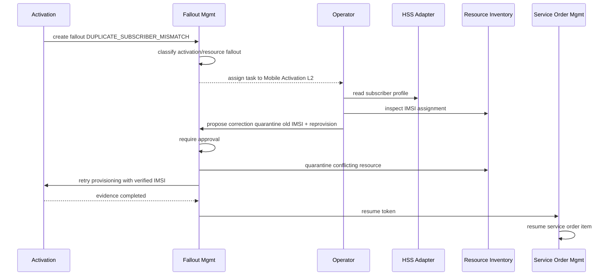

Key decision:

- Jangan langsung overwrite subscriber di HSS.
- Jangan langsung retry create subscriber.
- Buktikan apakah existing subscriber adalah stale orphan atau active customer.

## 30. Example: Field Installation No-Access

Scenario:

- technician datang;
- customer tidak bisa dihubungi;
- installation gagal;
- ONT belum dipasang;
- activation tidak boleh berjalan.

Flow:

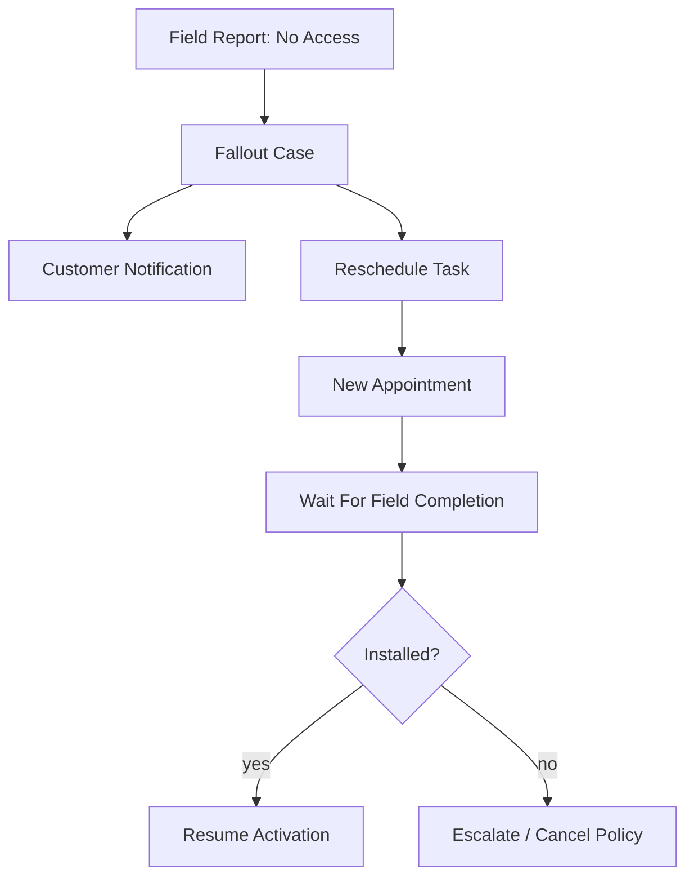

Policy:

- after N failed appointments, require customer care decision;
- do not bill before installation evidence;
- keep resource reservation only within TTL;
- release/quarantine physical resources if abandoned.

## 31. Example: Charging Profile Missing After Activation

Scenario:

- mobile data access active;
- charging bucket creation failed;
- customer could consume service without charging control;
- high revenue/leakage risk.

Possible policy:

- block service until charging ready;
- allow grace access for enterprise SLA but create revenue assurance case;
- activate fallback charging profile;
- suspend data if charging not repaired by deadline.

This is not a pure technical failure. It is commercial risk decision.

## 32. Common Anti-Patterns

### 32.1 Fallout As Email/Chat

Jika fallout hanya terjadi di email/chat, sistem kehilangan state, SLA, audit, dan ability to resume safely.

### 32.2 Force Complete Button

`Force Complete` tanpa policy/evidence adalah shortcut berbahaya. Jika ada, harus high-risk, approval, evidence, dan audit.

### 32.3 Generic SQL Correction

Mengizinkan operator menjalankan patch bebas dari UI adalah undisciplined production mutation.

### 32.4 No Link To Original Failed Step

Case harus tahu step mana yang gagal. Tanpa ini, order tidak bisa resume aman.

### 32.5 No Dedup

Satu failure yang retry berkali-kali dapat membuat puluhan case duplicate.

### 32.6 Closing Without Resume/Cancel Decision

Case closed tetapi order masih stuck adalah failure desain.

### 32.7 Manual Fix Without Evidence

Jika operator berkata “sudah saya fix” tanpa evidence, support dan audit tidak bisa membuktikan apa pun.

### 32.8 Workflow Engine As Data Dump

Process variables bukan pengganti domain model fallout.

### 32.9 No Analytics Feedback

Fallout yang sama terjadi terus-menerus karena tidak ada loop untuk memperbaiki catalog, adapter, validation, atau process.

## 33. Design Checklist

Sebelum desain fallout diterima, pastikan:

- Apakah failure, fallout, ticket, dan incident dibedakan?
- Apakah taxonomy fallout jelas?
- Apakah lifecycle case explicit?
- Apakah creation idempotent?
- Apakah queue punya SLA dan allowed action?
- Apakah correction action typed?
- Apakah high-risk correction butuh maker-checker?
- Apakah evidence immutable?
- Apakah resume token ada?
- Apakah order bisa dilanjutkan dari step yang benar?
- Apakah customer notification policy jelas?
- Apakah case bisa linked ke incident?
- Apakah audit cukup untuk regulatory defensibility?
- Apakah security role dan segregation of duties jelas?
- Apakah analytics fallout dipakai untuk improvement?

## 34. Deliberate Practice

Latihan 1 — Activation fallout:

Rancang fallout flow untuk command `ProvisionMobileSubscriber` yang gagal karena duplicate subscriber mismatch. Sertakan classification, queue, evidence, correction, approval, dan resume token.

Latihan 2 — Resource fallout:

Rancang flow untuk static IP yang assigned di inventory tetapi discovered aktif di customer lain. Tentukan quarantine, reallocation, incident link, dan customer impact.

Latihan 3 — Field fallout:

Rancang no-access installation workflow untuk FTTH. Sertakan appointment reschedule, customer notification, SLA, resource reservation TTL, dan cancellation policy.

Latihan 4 — Java aggregate:

Implementasikan `FalloutCase` aggregate sederhana dengan state transition: detected, classified, assigned, correction proposed, approved, applied, verifying, resolved for resume, closed.

Latihan 5 — Policy:

Buat policy matrix untuk allowed actions berdasarkan category, severity, order state, dan operator role.

## 35. Ringkasan

Fallout Management & Manual Workflows adalah safety net controlled untuk BSS/OSS.

Sistem yang baik:

- tidak menyembunyikan exception dalam log/email/chat;
- membuat fallout sebagai first-class case;
- mengklasifikasikan problem berdasarkan taxonomy telco;
- menyediakan queue, SLA, assignment, escalation;
- mengontrol correction action;
- memakai maker-checker untuk high-risk action;
- menyimpan immutable evidence;
- memakai resume token untuk melanjutkan order;
- menghubungkan case ke order/service/resource/customer/incident;
- menjaga audit dan security;
- dan menggunakan analytics fallout untuk memperbaiki automation.

Di part berikutnya kita masuk ke **Appointment, Field Service & Workforce**: bagaimana slot booking, technician dispatch, installation, CPE/ONT handling, site access, completion evidence, dan field fallout dimodelkan sebagai bagian dari fulfillment lifecycle.

## 36. Referensi

- TM Forum — TMF701 Process Flow Management API: https://www.tmforum.org/resources/specification/tmf701-process-flow-management-api-rest-specification-r19-0-0/
- TM Forum — TMF641 Service Ordering Management API: https://www.tmforum.org/open-digital-architecture/open-apis/service-ordering-management-api-TMF641/v4.1
- TM Forum — TMF702 Resource Activation and Configuration API: https://www.tmforum.org/open-digital-architecture/open-apis/resource-activation-management-api-TMF702/v4.0
- TM Forum — TMF652 Resource Ordering Management API: https://www.tmforum.org/resources/specification/tmf652-resource-ordering-management-api-rest-specification-r16-5-1/
- TM Forum — Open API Directory: https://www.tmforum.org/open-digital-architecture/open-apis
