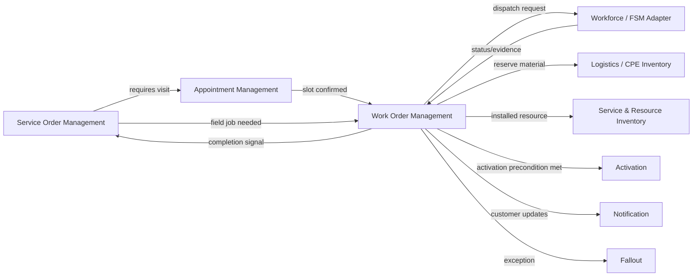
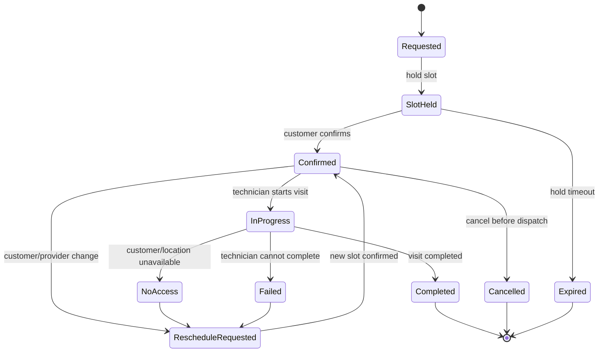
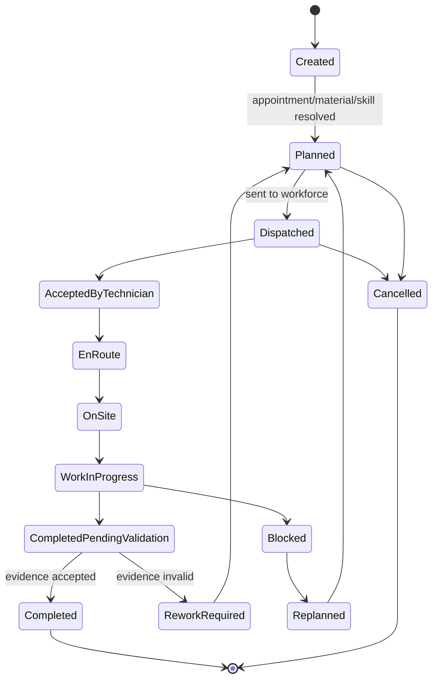
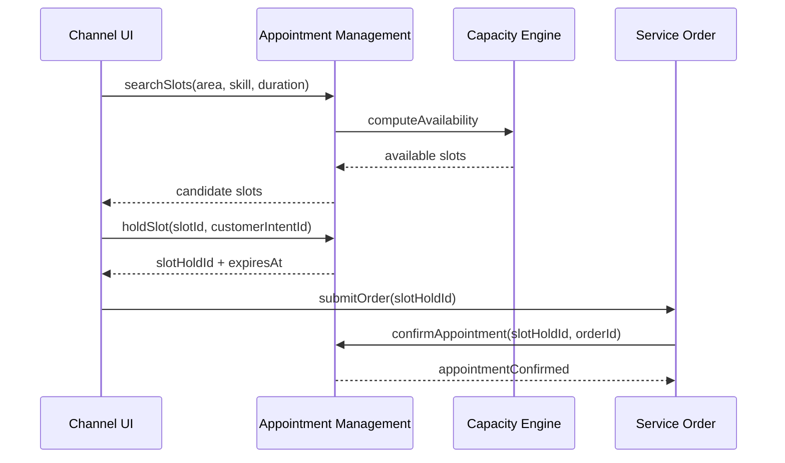
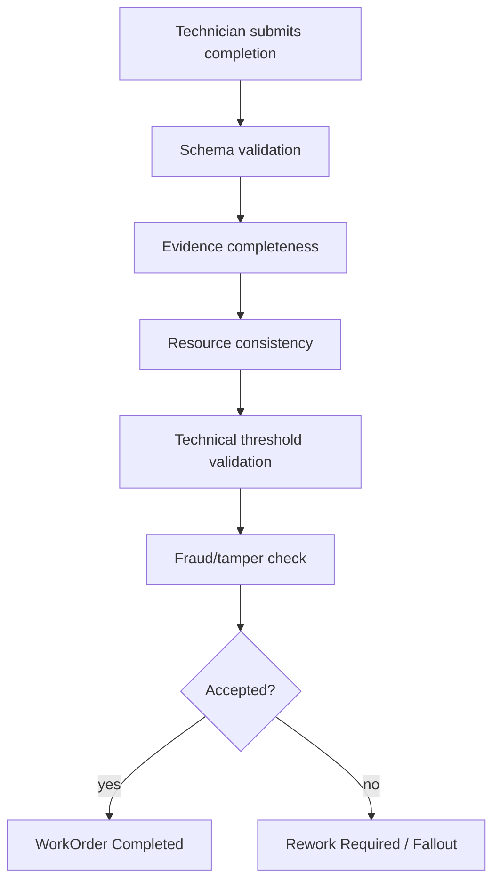
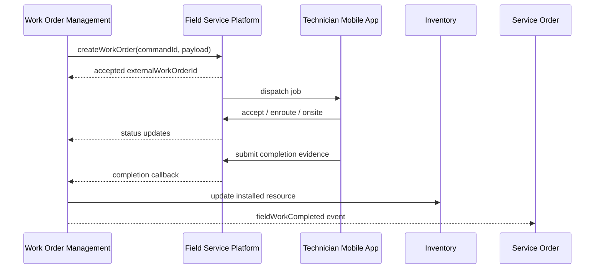
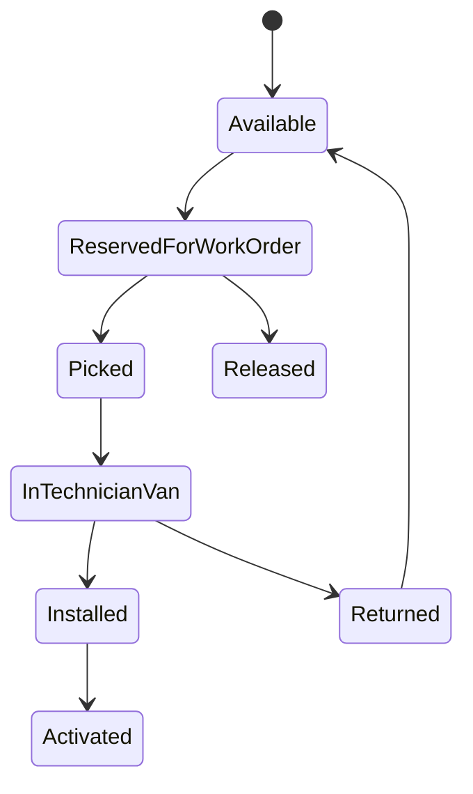
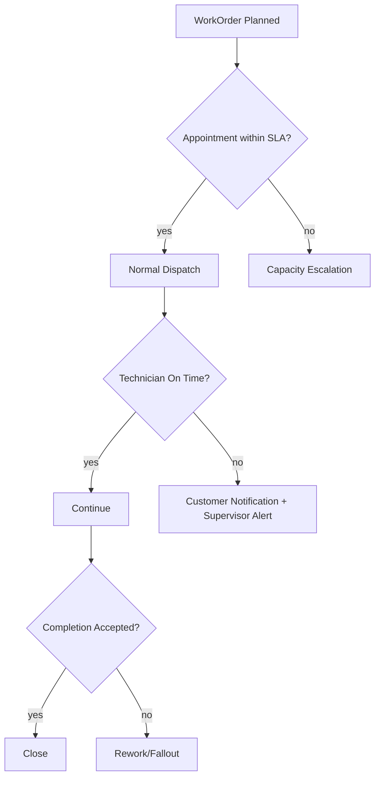

# Part 021 — Appointment, Field Service & Workforce

## 1. Posisi Part Ini Dalam Seri

Part sebelumnya membahas **fallout management**: apa yang terjadi ketika automation tidak bisa menyelesaikan fulfillment dengan aman.

Di part ini kita masuk ke bentuk fulfillment yang sangat nyata dan sering mahal: **pekerjaan lapangan**.

Pada fixed broadband, enterprise connectivity, CPE installation, fiber activation, leased line, site survey, tower/site work, atau hardware replacement, order tidak selesai hanya dengan API call. Ada manusia, lokasi fisik, perangkat, kendaraan, skill teknisi, window waktu, izin akses, material, customer availability, dan bukti penyelesaian.

Pertanyaan inti:

> Bagaimana Java BSS/OSS menghubungkan service order dengan appointment, field work, workforce dispatch, CPE logistics, technician evidence, dan completion signal tanpa membuat fulfillment engine menjadi sistem field-service monolitik?

Jawaban pendeknya:

> Pisahkan appointment, work order, workforce dispatch, material logistics, dan completion evidence sebagai capability berbeda, lalu sambungkan dengan event, correlation id, dan lifecycle invariant yang eksplisit.

## 2. Kaufman Skill Target

Target performa part ini:

> Kamu mampu merancang modul Appointment/Field Service/Workforce dalam Java BSS/OSS yang dapat memesan slot, membuat work order, mengirim pekerjaan ke teknisi/vendor, menangani reschedule/no-access, menerima completion evidence, dan mengembalikan sinyal fulfillment ke Service Order Management secara aman.

Sub-skill yang harus dikuasai:

1. membedakan appointment, slot, work order, field task, dispatch, visit, dan completion;
2. memodelkan skill, territory, capacity, material, location, dan access constraint;
3. menghubungkan service order item dengan field work tanpa coupling langsung ke aplikasi teknisi;
4. membuat appointment reservation yang tidak over-commit;
5. menangani reschedule, missed appointment, customer no-access, dan technician no-show;
6. memodelkan completion evidence sebagai data audit, bukan hanya flag sukses;
7. menghubungkan CPE/SIM/device logistics dengan field work;
8. mengelola vendor/subcontractor workforce sebagai external system;
9. membedakan business completion, technical completion, dan customer acceptance;
10. menjaga idempotency dan reconciliation untuk work order integration;
11. membuat workflow manual yang dapat diaudit.

## 3. Mental Model: Field Work Adalah Distributed Transaction Dengan Dunia Fisik

Dalam software murni, fulfillment sering terlihat seperti urutan command:

1. reserve resource;
2. activate service;
3. update inventory;
4. notify customer.

Dalam field work, langkah-langkah itu berubah menjadi:

1. customer harus tersedia;
2. teknisi harus tersedia;
3. teknisi harus punya skill yang cocok;
4. lokasi harus bisa diakses;
5. material harus tersedia;
6. perangkat harus dikirim atau dibawa;
7. pekerjaan harus dilakukan;
8. bukti harus dikirim;
9. hasil teknis harus diverifikasi;
10. order baru boleh lanjut.

Field work bukan sekadar task. Ia adalah distributed transaction antara sistem digital dan dunia fisik.

Karena itu, desain yang benar tidak boleh menganggap `technicianCompleted = true` sebagai bukti cukup. Completion harus menjawab:

- pekerjaan apa yang dilakukan;
- di lokasi mana;
- oleh siapa;
- kapan mulai dan selesai;
- material apa yang digunakan;
- serial number perangkat apa yang dipasang;
- pengukuran teknis apa yang berhasil;
- foto/signature/log apa yang tersedia;
- apakah customer menerima hasil;
- apakah ada exception;
- apakah inventory dan activation sudah konsisten.

## 4. Domain Language

### 4.1 Appointment

**Appointment** adalah janji waktu antara provider dan customer/party untuk melakukan aktivitas tertentu di lokasi tertentu.

Appointment menjawab:

- kapan pekerjaan direncanakan;
- siapa pihak terkait;
- lokasi mana;
- nature of appointment;
- slot mana yang dipakai;
- apakah masih tentative, confirmed, rescheduled, completed, atau cancelled.

TM Forum TMF646 Appointment Management API menyediakan mekanisme standar untuk mencari slot kosong dan membuat appointment dengan karakteristik appointment seperti party, place, dan nature of appointment.

### 4.2 Time Slot

**Time slot** adalah kapasitas waktu yang dapat dipakai untuk appointment.

Slot bukan hanya jam. Slot adalah janji kapasitas.

Contoh:

```text
Slot: 2026-07-03 09:00-12:00
Area: JKT-SOUTH-03
Skill: FTTH-INSTALL
Capacity: 8 jobs
Reserved: 6 jobs
Held: 1 job
Available: 1 job
```

Slot harus mempertimbangkan:

- area/territory;
- skill;
- expected duration;
- travel time;
- technician capacity;
- material availability;
- blackout date;
- holiday;
- SLA priority;
- vendor capacity.

### 4.3 Work Order

**Work order** adalah instruksi formal untuk pekerjaan setup, maintenance, repair, visit, atau installation.

Work order menjawab:

- pekerjaan apa yang harus dilakukan;
- service/resource/order mana yang memicunya;
- lokasi mana;
- skill apa;
- material apa;
- instruksi teknis apa;
- appointment mana;
- completion evidence apa yang wajib dikumpulkan.

Work order tidak sama dengan service order.

Service order adalah fulfillment intent untuk layanan. Work order adalah pekerjaan fisik/operasional yang dapat dikerjakan workforce.

### 4.4 Field Task

**Field task** adalah unit kerja lebih kecil di dalam work order.

Contoh untuk FTTH installation:

1. verify address and access;
2. pull drop cable;
3. install ONT;
4. register ONT serial;
5. test optical power;
6. connect router;
7. verify internet access;
8. collect customer signature.

Task bisa sequential atau parallel. Task bisa mandatory atau optional.

### 4.5 Visit

**Visit** adalah real execution occurrence dari work order di lapangan.

Appointment adalah rencana. Visit adalah kejadian aktual.

Satu work order bisa memiliki beberapa visit jika:

- customer tidak ada;
- material kurang;
- lokasi tidak bisa diakses;
- pekerjaan perlu permit;
- pekerjaan gagal dan perlu revisit;
- pekerjaan split antara survey dan installation.

### 4.6 Technician / Crew

Technician/crew membawa constraint:

- skill;
- certification;
- area;
- availability;
- shift;
- workload;
- current location;
- vendor/subcontractor;
- device/mobile app;
- authority level.

Jangan modelkan technician sebagai sekadar string `technicianName`. Dalam carrier-grade workflow, technician adalah actor yang memproduksi evidence.

### 4.7 Completion Evidence

Completion evidence adalah bukti bahwa pekerjaan telah dilakukan.

Contoh:

- serial number ONT/CPE;
- ICCID/eSIM profile id;
- port id;
- photo before/after;
- GPS coordinate;
- customer signature;
- speed test;
- optical power measurement;
- ping test;
- installation checklist;
- technician note;
- timestamp;
- exception reason;
- material consumed;
- activation verification result.

Evidence harus immutable setelah accepted, atau setidaknya versioned dengan audit trail.

## 5. Boundary Yang Harus Dipisahkan

Desain buruk biasanya mencampur semuanya dalam satu `FulfillmentService`.

Desain yang lebih baik memisahkan capability:



Key principle:

> Service Order Management tidak perlu tahu cara dispatch teknisi. Ia hanya perlu tahu apakah field prerequisite untuk service order item sudah selesai dengan evidence yang dapat dipercaya.

## 6. Lifecycle Appointment

Appointment lifecycle minimal:



### 6.1 Appointment Invariants

Appointment harus menjaga invariant berikut:

1. Appointment confirmed harus punya slot valid.
2. Slot hold harus memiliki expiry.
3. Slot tidak boleh double-book melebihi capacity policy.
4. Reschedule harus menjaga history appointment lama.
5. Cancel setelah dispatch butuh reason dan mungkin biaya/approval.
6. Completed appointment harus punya visit record.
7. No-access bukan technical failure.
8. Missed appointment harus dapat dibedakan antara customer no-show, technician no-show, weather, permit, material shortage, atau system error.
9. Appointment tidak otomatis berarti service completed.
10. Appointment completion harus dikaitkan ke work order dan service order item.

## 7. Lifecycle Work Order

Work order lifecycle lebih dekat ke execution:



### 7.1 Work Order Invariants

1. Work order harus memiliki source intent: service order item, trouble ticket, change, atau maintenance plan.
2. Work order yang dispatched tidak boleh kehilangan correlation ke source intent.
3. Work order yang membutuhkan customer visit harus punya appointment confirmed.
4. Work order yang membutuhkan material harus punya reservation atau issue note.
5. Completion harus membawa evidence sesuai template.
6. Evidence validation harus deterministic.
7. Completed work order harus mengeluarkan event idempotent.
8. Work order failed/block tidak boleh diam; harus masuk fallout/replan.
9. Work order cancellation harus propagate ke workforce system.
10. Field completion tidak boleh langsung menutup product order tanpa service/order validation.

## 8. Appointment Slot Design

Slot booking terlihat sederhana tetapi sering menjadi sumber customer pain.

### 8.1 Naive Slot Query

Naive implementation:

```java
List<Slot> slots = slotRepository.findAvailable(area, date);
return slots;
```

Masalah:

- slot bisa diambil customer lain sebelum checkout;
- kapasitas tidak mempertimbangkan skill;
- tidak mempertimbangkan travel time;
- tidak mempertimbangkan material;
- slot hasil query tidak punya expiry;
- slot tidak bisa dijamin saat order submit;
- reschedule bisa menciptakan double booking.

### 8.2 Slot Hold Pattern

Gunakan hold sebelum confirm.



### 8.3 Slot Data Model

```java
public record SlotKey(
    String territoryId,
    String skillCode,
    LocalDate serviceDate,
    LocalTime start,
    LocalTime end
) {}

public enum SlotHoldState {
    HELD,
    CONFIRMED,
    EXPIRED,
    RELEASED
}

public final class SlotHold {
    private final UUID holdId;
    private final SlotKey slotKey;
    private final UUID customerIntentId;
    private final Instant expiresAt;
    private SlotHoldState state;

    public void confirm(UUID orderId, Instant now) {
        if (state != SlotHoldState.HELD) {
            throw new IllegalStateException("slot hold is not confirmable");
        }
        if (now.isAfter(expiresAt)) {
            state = SlotHoldState.EXPIRED;
            throw new IllegalStateException("slot hold expired");
        }
        state = SlotHoldState.CONFIRMED;
        // attach order correlation in real implementation
    }
}
```

### 8.4 Capacity Is Not Availability

Availability answers “can we show this slot?”.

Capacity answers “can we execute this slot safely?”.

Capacity includes:

- number of technicians;
- skill mix;
- estimated job duration;
- travel time;
- area density;
- material availability;
- weather/risk;
- subcontractor capacity;
- open backlog;
- expected no-show rate;
- priority buffer.

Carrier-grade appointment systems usually separate:

- **slot display** for channel speed;
- **hold** for temporary reservation;
- **confirm** for committed appointment;
- **dispatch plan** for actual workforce scheduling.

## 9. Work Order Payload Design

Work order harus cukup kaya untuk field service, tetapi tidak boleh terlalu vendor-specific.

Contoh payload konseptual:

```json
{
  "workOrderId": "wo-812736",
  "source": {
    "type": "SERVICE_ORDER_ITEM",
    "id": "soi-12345",
    "correlationId": "ota-7788"
  },
  "workType": "FTTH_INSTALLATION",
  "priority": "STANDARD",
  "appointment": {
    "appointmentId": "apt-222",
    "windowStart": "2026-07-03T09:00:00+07:00",
    "windowEnd": "2026-07-03T12:00:00+07:00"
  },
  "place": {
    "serviceAddressId": "addr-991",
    "accessInstruction": "Security gate, call customer 15 minutes before arrival"
  },
  "requiredSkills": ["FTTH_INSTALL", "ONT_CONFIG"],
  "requiredMaterials": [
    {"sku": "ONT-XGSPON-001", "quantity": 1},
    {"sku": "PATCHCORD-3M", "quantity": 1}
  ],
  "tasks": [
    {"code": "VERIFY_ACCESS", "mandatory": true},
    {"code": "INSTALL_ONT", "mandatory": true},
    {"code": "CAPTURE_OPTICAL_POWER", "mandatory": true},
    {"code": "CUSTOMER_SIGNATURE", "mandatory": true}
  ]
}
```

## 10. Completion Evidence Template

Jangan hardcode evidence per workflow dalam if-else besar.

Gunakan template:

```java
public record EvidenceRequirement(
    String code,
    EvidenceType type,
    boolean mandatory,
    List<String> validationRules
) {}

public enum EvidenceType {
    TEXT,
    NUMBER,
    PHOTO,
    SIGNATURE,
    GPS,
    SERIAL_NUMBER,
    MEASUREMENT,
    CHECKBOX,
    FILE,
    SYSTEM_VERIFICATION
}
```

Contoh requirements untuk FTTH installation:

```yaml
workType: FTTH_INSTALLATION
evidence:
  - code: ONT_SERIAL_NUMBER
    type: SERIAL_NUMBER
    mandatory: true
    validation:
      - exists-in-resource-inventory
      - reserved-for-this-order
  - code: OPTICAL_POWER_DBM
    type: MEASUREMENT
    mandatory: true
    validation:
      - min:-27
      - max:-8
  - code: CUSTOMER_SIGNATURE
    type: SIGNATURE
    mandatory: true
  - code: SPEED_TEST_RESULT
    type: SYSTEM_VERIFICATION
    mandatory: true
```

## 11. Evidence Validation

Completion dari field app harus masuk ke validation pipeline.



Validation rules:

1. semua mandatory evidence ada;
2. timestamp masuk akal;
3. technician berhak atas work order;
4. GPS berada dalam radius service address jika policy membutuhkan;
5. serial number resource valid dan reserved;
6. measurement berada dalam threshold;
7. signature/foto/file tersimpan dengan content hash;
8. duplicate completion ditolak/idempotent;
9. completion yang mengubah resource inventory harus transactional dengan event/outbox;
10. evidence yang ditolak harus memiliki reason yang dapat dilihat operasi.

## 12. Field Service Integration Patterns

### 12.1 Direct FSM Integration

BSS/OSS mengirim work order ke Field Service Management platform.



Keuntungan:

- dispatch optimization ditangani platform khusus;
- mobile app sudah tersedia;
- workforce planner bisa bekerja di tool mereka.

Risiko:

- state mapping kompleks;
- callback bisa hilang;
- external status sering terlalu detail atau terlalu miskin;
- idempotency vendor tidak selalu kuat;
- reconciliation wajib.

### 12.2 Internal Lightweight Workforce

Untuk operator kecil/MVNO/MVNE/fixed ISP, cukup dibuat modul internal:

- work queue;
- assignment;
- technician mobile web;
- evidence capture;
- route/area sederhana;
- dashboard supervisor.

Jangan mulai dari optimization yang terlalu rumit. Mulai dari lifecycle dan evidence correctness.

### 12.3 Subcontractor Portal

Untuk pekerjaan vendor/subcontractor:

- expose work order via partner API/portal;
- hide sensitive customer data seminimal mungkin;
- enforce SLA and evidence;
- support bulk upload/callback;
- track subcontractor performance;
- audit semua perubahan.

## 13. CPE / Material Logistics

Field work sering gagal bukan karena teknisi tidak ada, tetapi karena material tidak siap.

Material lifecycle:



Invariants:

1. material serialized seperti ONT/router/SIM harus punya identifier;
2. material non-serialized bisa dikelola quantity;
3. material yang installed harus link ke resource inventory;
4. serial number installed harus cocok dengan completion evidence;
5. material lost/damaged harus masuk exception;
6. work order tidak boleh completed jika mandatory material tidak resolved.

## 14. No-Access dan No-Show Semantics

No-access bukan technical failure.

Contoh reason taxonomy:

| Reason | Meaning | Next Action |
|---|---|---|
| `CUSTOMER_NOT_AVAILABLE` | customer tidak ada | reschedule, possible fee |
| `ADDRESS_NOT_FOUND` | alamat tidak bisa ditemukan | address correction/fallout |
| `SECURITY_DENIED_ACCESS` | security/permit menolak | customer coordination |
| `BUILDING_PERMISSION_REQUIRED` | butuh izin gedung | permit workflow |
| `TECHNICIAN_NO_SHOW` | teknisi tidak hadir | apology/reschedule/escalation |
| `MATERIAL_NOT_AVAILABLE` | material tidak tersedia | logistics fallout |
| `WEATHER_OR_SAFETY` | kondisi tidak aman | reschedule |
| `NETWORK_PLANT_NOT_READY` | infra belum siap | network build fallout |

Jangan campur semua menjadi `FAILED`.

State yang benar membantu:

- SLA attribution;
- vendor penalty;
- customer communication;
- capacity planning;
- root cause analysis;
- revenue delay analysis.

## 15. Java Aggregate Sketch

```java
public final class WorkOrder {
    private final UUID workOrderId;
    private final SourceIntent sourceIntent;
    private WorkOrderState state;
    private AppointmentRef appointment;
    private final List<FieldTask> tasks;
    private final List<Evidence> evidence = new ArrayList<>();
    private final List<DomainEvent> events = new ArrayList<>();

    public void plan(AppointmentRef appointment, List<MaterialReservation> materials) {
        requireState(WorkOrderState.CREATED);
        if (appointment == null) throw new IllegalArgumentException("appointment required");
        this.appointment = appointment;
        this.state = WorkOrderState.PLANNED;
        events.add(new WorkOrderPlanned(workOrderId, appointment.appointmentId()));
    }

    public void dispatch(ExternalDispatchRef dispatchRef) {
        requireState(WorkOrderState.PLANNED);
        this.state = WorkOrderState.DISPATCHED;
        events.add(new WorkOrderDispatched(workOrderId, dispatchRef.externalId()));
    }

    public void submitCompletion(List<Evidence> submitted, EvidencePolicy policy) {
        requireAnyState(WorkOrderState.WORK_IN_PROGRESS, WorkOrderState.DISPATCHED);
        EvidenceValidationResult result = policy.validate(submitted);
        this.evidence.addAll(submitted);
        if (result.accepted()) {
            this.state = WorkOrderState.COMPLETED_PENDING_VALIDATION;
            events.add(new WorkOrderCompletionSubmitted(workOrderId));
        } else {
            this.state = WorkOrderState.REWORK_REQUIRED;
            events.add(new WorkOrderEvidenceRejected(workOrderId, result.reasons()));
        }
    }

    public void acceptCompletion(CompletionVerifier verifier) {
        requireState(WorkOrderState.COMPLETED_PENDING_VALIDATION);
        verifier.verify(this);
        this.state = WorkOrderState.COMPLETED;
        events.add(new WorkOrderCompleted(workOrderId, sourceIntent));
    }

    private void requireState(WorkOrderState expected) {
        if (state != expected) throw new IllegalStateException("expected " + expected + " but was " + state);
    }

    private void requireAnyState(WorkOrderState... expected) {
        for (WorkOrderState s : expected) if (state == s) return;
        throw new IllegalStateException("state not allowed: " + state);
    }
}
```

## 16. Database Model Sketch

Core tables:

```sql
appointment
-----------
appointment_id
source_intent_type
source_intent_id
party_id
place_id
slot_key
window_start
window_end
state
created_at
updated_at
version

slot_hold
---------
hold_id
slot_key
customer_intent_id
expires_at
state
confirmed_appointment_id
version

work_order
----------
work_order_id
source_intent_type
source_intent_id
work_type
appointment_id
state
priority
external_work_order_id
created_at
updated_at
version

work_order_task
---------------
task_id
work_order_id
task_code
sequence_no
mandatory
state

work_order_evidence
-------------------
evidence_id
work_order_id
evidence_code
evidence_type
value_ref
content_hash
submitted_by
submitted_at
validation_state

material_reservation
--------------------
reservation_id
work_order_id
sku
serial_number
quantity
state
```

Design notes:

- gunakan optimistic locking untuk appointment/work order;
- gunakan outbox untuk event ke service order dan external systems;
- simpan external id untuk reconciliation;
- evidence binary/file jangan disimpan langsung di relational table besar; simpan metadata dan content reference;
- content hash membantu audit/tamper detection;
- state transition harus centralized.

## 17. Event Contract

Events yang berguna:

```text
AppointmentSlotHeld
AppointmentConfirmed
AppointmentRescheduled
AppointmentCancelled
AppointmentCompleted
AppointmentNoAccess
WorkOrderCreated
WorkOrderPlanned
WorkOrderDispatched
WorkOrderStatusChanged
WorkOrderCompletionSubmitted
WorkOrderEvidenceRejected
WorkOrderCompleted
WorkOrderBlocked
MaterialReservedForWorkOrder
MaterialInstalled
```

Event design rules:

1. event membawa correlation id source order;
2. event idempotent;
3. event tidak membawa semua evidence binary;
4. event completion membawa pointer evidence summary;
5. event blocked membawa reason code;
6. event untuk customer notification harus dipisah dari internal technical detail.

## 18. Customer Communication

Field work adalah salah satu titik customer experience paling sensitif.

Minimal notification:

- appointment booked;
- reminder H-1;
- technician assigned;
- technician en-route;
- delay notification;
- completion notification;
- reschedule needed;
- no-access outcome;
- apology/escalation jika provider fault.

Jangan biarkan notification membaca langsung tabel work order. Publish event domain dan biarkan notification component memutuskan template/channel.

## 19. SLA dan Escalation

SLA field work bukan hanya order completion.

Track:

- time to first appointment offered;
- appointment lead time;
- on-time arrival;
- first-time-right rate;
- no-access rate;
- reschedule rate;
- material shortage rate;
- completion evidence rejection rate;
- average revisit count;
- technician productivity;
- SLA breach by region/vendor/work type.

Contoh escalation:



## 20. Failure Modes

### 20.1 Slot Confirmed, Work Order Not Created

Cause:

- transaction split;
- event lost;
- external timeout;
- bug in orchestration.

Mitigation:

- outbox;
- scheduled reconciliation: confirmed appointment without work order;
- compensating release/reschedule;
- alert before appointment date.

### 20.2 Work Order Completed, Service Order Still Pending

Cause:

- completion event lost;
- service order handler failed;
- evidence rejected but status mapped wrong.

Mitigation:

- inbox/idempotent consumer;
- reconciliation by source intent;
- completion accepted event replay;
- order dashboard with stuck state.

### 20.3 Technician Installed Different Device

Cause:

- warehouse substitution;
- mobile app allowed free text;
- barcode scan not enforced;
- inventory mismatch.

Mitigation:

- scan mandatory;
- serial validation against inventory;
- exception approval;
- installed resource reconciliation.

### 20.4 External FSM Sends Duplicate Callback

Cause:

- retry;
- webhook redelivery;
- mobile app offline sync.

Mitigation:

- callback idempotency key;
- monotonic state transition;
- external event ledger;
- ignore duplicate completion with same evidence hash.

### 20.5 Customer Reschedules During Dispatch

Cause:

- race between channel and workforce;
- delayed sync.

Mitigation:

- state guard;
- reschedule policy by cutoff time;
- dispatch cancellation command;
- conflict resolution flow.

## 21. API Surface Design

Internal API examples:

```http
POST /appointments/search-slots
POST /appointments/holds
POST /appointments/{holdId}/confirm
POST /appointments/{appointmentId}/reschedule
POST /work-orders
POST /work-orders/{id}/dispatch
POST /work-orders/{id}/completion-submissions
POST /work-orders/{id}/completion-acceptance
GET  /work-orders?sourceIntentId=...
```

Keep external TMF-style API separate from internal command API.

External API optimizes interoperability. Internal API optimizes invariants.

## 22. Security dan Privacy

Field work exposes sensitive customer data.

Control rules:

1. technician sees only assigned jobs;
2. show customer contact only near appointment time if policy requires;
3. mask identifiers not needed by field worker;
4. restrict evidence access;
5. preserve audit for who viewed customer location/contact;
6. encrypt evidence at rest;
7. purge/retain evidence according to policy;
8. subcontractor access must be scoped by contract;
9. mobile app token must expire/refresh safely;
10. offline mode must protect local data.

## 23. Testing Strategy

### 23.1 State Machine Tests

Test all legal and illegal transitions:

```text
CREATED -> PLANNED -> DISPATCHED -> COMPLETED_PENDING_VALIDATION -> COMPLETED
CREATED -> CANCELLED
DISPATCHED -> CANCELLED only if policy allows
COMPLETED -> RESCHEDULED must fail
```

### 23.2 Race Tests

Critical races:

- slot hold confirm vs expiry;
- reschedule vs dispatch;
- completion vs cancellation;
- duplicate callback;
- material substitution vs evidence validation;
- multiple technicians updating same work order.

### 23.3 Contract Tests

For FSM adapter:

- create work order accepted;
- duplicate create returns same external id or safe duplicate handling;
- callback mapping;
- unknown status mapping;
- rejected completion mapping;
- webhook signature validation.

### 23.4 Scenario Tests

Minimum scenario set:

1. FTTH install success first visit;
2. customer no-access then reschedule success;
3. material shortage before dispatch;
4. technician submits wrong ONT serial;
5. external FSM timeout but work order created;
6. duplicate completion callback;
7. cancellation before dispatch;
8. cancellation after dispatch with fee policy;
9. appointment confirmed but source order cancelled;
10. field completed but activation fails.

## 24. Metrics Untuk Production

Expose metrics:

```text
appointment_slot_search_latency
appointment_hold_expired_total
appointment_confirmed_total
appointment_rescheduled_total
appointment_no_access_total
work_order_created_total
work_order_dispatch_latency
work_order_completion_latency
work_order_first_time_right_rate
work_order_evidence_rejected_total
field_material_shortage_total
fsm_callback_duplicate_total
fsm_callback_unknown_status_total
field_completion_to_service_order_update_latency
```

Operational dashboard harus menampilkan:

- backlog by state;
- jobs due today;
- appointments at risk;
- SLA breach forecast;
- blocked by reason;
- vendor performance;
- evidence rejection trend;
- orders stuck after field completion.

## 25. Common Pitfalls

### Pitfall 1: Appointment Dianggap Sama Dengan Work Order

Appointment adalah janji waktu. Work order adalah instruksi kerja. Satu appointment bisa memiliki beberapa work order, dan satu work order bisa butuh beberapa appointment/visit.

### Pitfall 2: Field Completion Langsung Menutup Order

Field completion hanya satu signal. Service order tetap harus memvalidasi inventory, activation, billing trigger, dan customer-facing state.

### Pitfall 3: Tidak Ada Evidence Policy

Tanpa evidence policy, completion berubah menjadi free text dan support tidak bisa membuktikan apa yang terjadi.

### Pitfall 4: Tidak Ada Reconciliation Dengan FSM

External FSM adalah distributed system. Callback bisa hilang. Scheduled reconciliation wajib.

### Pitfall 5: Semua Failure Jadi `FAILED`

No-access, material shortage, permit issue, weather, technician no-show, dan network plant not-ready punya treatment berbeda.

### Pitfall 6: Field App Bisa Mengubah Inventory Tanpa Control

Field app boleh submit evidence. Inventory update harus tetap lewat controlled backend validation.

## 26. Practice: Design Drill 90 Menit

Bangun desain untuk skenario:

> Customer membeli FTTH 1Gbps. Address feasible. Order membutuhkan appointment installation, ONT, router, dan activation di OLT/BNG. Customer memilih slot Sabtu 09:00–12:00. Teknisi datang, ONT berhasil dipasang, tetapi speed test gagal karena profile BNG belum aktif.

Deliverable:

1. state machine appointment;
2. state machine work order;
3. event list;
4. evidence template;
5. failure handling untuk speed test gagal;
6. reconciliation rule;
7. metrics minimal;
8. Java aggregate sketch.

Kriteria benar:

- work order boleh completed pending validation tetapi service order tidak completed;
- activation failure masuk fulfillment/fallout;
- ONT serial tetap tercatat sebagai installed/reserved sesuai policy;
- customer notification tidak mengatakan service active sebelum verification berhasil;
- retry activation tidak mengulang field job.

## 27. Self-Correction Checklist

Sebelum menganggap desain appointment/field service matang, cek:

- Apakah appointment dan work order dipisahkan?
- Apakah slot punya hold/expiry?
- Apakah reschedule menjaga history?
- Apakah no-access taxonomy jelas?
- Apakah completion evidence mandatory per work type?
- Apakah evidence divalidasi sebelum inventory/order update?
- Apakah external FSM callback idempotent?
- Apakah reconciliation ada?
- Apakah material serialized dilacak?
- Apakah technician/subcontractor access dibatasi?
- Apakah customer notification event-driven?
- Apakah SLA attribution bisa dibuktikan?

## 28. Ringkasan

Appointment, Field Service, dan Workforce adalah bagian fulfillment yang menyentuh dunia fisik. Desain yang lemah akan membuat order telco terlihat aktif di sistem tetapi belum benar-benar bisa dipakai customer, atau sebaliknya pekerjaan lapangan selesai tetapi BSS/OSS tidak tahu.

Mental model yang harus dibawa:

> Appointment adalah janji waktu. Work order adalah instruksi kerja. Visit adalah realisasi. Evidence adalah bukti. Service order adalah fulfillment contract yang hanya boleh maju jika field prerequisite terbukti selesai.

Di part berikutnya kita akan menggabungkan seluruh flow dari quote/order sampai activation menjadi **Order-to-Activate End-to-End Saga**.

## 29. Referensi

- TM Forum, **TMF646 Appointment Management API** — standar untuk slot search dan appointment booking.
- TM Forum, **Work Order Management ODA Component** — capability setup/maintenance request from initiation to completion.
- TM Forum, **TMF641 Service Ordering Management API** — service order lifecycle dan notification.
- TM Forum, **TMF639 Resource Inventory Management API** — resource inventory query/manipulation.
- TM Forum, **TMF702 Resource Activation and Configuration API** — activation/configuration resource.
